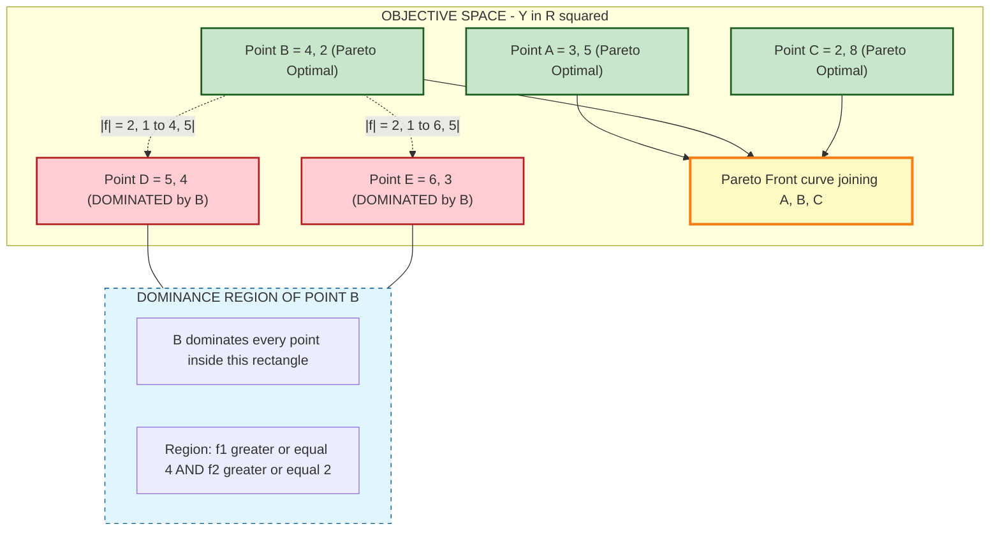
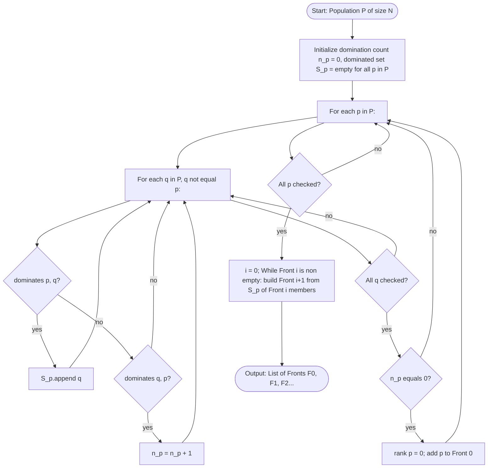
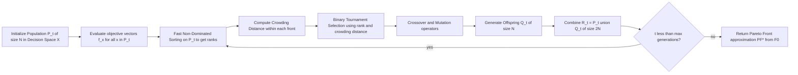
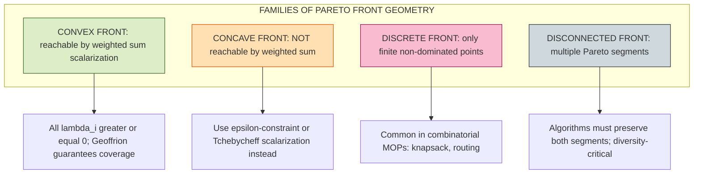

# Dominance and pareto-optimality.

<!-- SECTION_1_START -->

# Dominance and Pareto-Optimality — Core Technical Definition & Intuitive Overview

## 1.1 Multi-Objective Optimization: The Formal Setting

In real-world engineering design, a single solution is rarely judged on one metric alone. We almost always want to **minimize cost**, **maximize performance**, **minimize weight**, and **minimize power consumption** — all at the same time. Such problems fall under **Multi-Objective Optimization Problems (MOPs)**.

> [!NOTE]
> **KTU Syllabus Definition (PECST417 — Module 4)**
> A Multi-Objective Optimization Problem (MOP) seeks to simultaneously optimize $M \geq 2$ objective functions over a feasible decision space, where the objectives are typically in **conflict** with one another — improving one leads to degradation in another.

Formally, an MOP is stated as:

$$
\begin{aligned}
\text{Find } & \mathbf{x} = (x_1, x_2, \ldots, x_n) \in \mathbb{R}^n \\
\text{that optimizes } & \mathbf{f}(\mathbf{x}) = \left( f_1(\mathbf{x}), f_2(\mathbf{x}), \ldots, f_M(\mathbf{x}) \right) \\
\text{subject to } & g_j(\mathbf{x}) \leq 0, \quad j = 1, 2, \ldots, J \\
                  & h_k(\mathbf{x}) = 0, \quad k = 1, 2, \ldots, K \\
                  & \mathbf{x} \in \mathcal{X} \subseteq \mathbb{R}^n
\end{aligned}
$$

Here:
- $\mathbf{x}$ is the **decision variable vector** in decision space $\mathcal{X}$.
- $\mathbf{f}(\mathbf{x})$ is the **objective vector** in objective space $\mathcal{Y} \subseteq \mathbb{R}^M$.
- $M \geq 2$ objectives; $J$ inequality constraints; $K$ equality constraints.
- $\mathcal{X}_f = \{\mathbf{x} \in \mathcal{X} \mid g_j(\mathbf{x}) \leq 0 \;\forall j,\; h_k(\mathbf{x}) = 0 \;\forall k\}$ is the **feasible region**.

> [!IMPORTANT]
> **Why a single "best" solution does not exist in MOPs**
> Because objectives conflict, no single point can be the best in all objectives simultaneously. Instead, the optimum is a **set of trade-off solutions** — this set is the **Pareto Set**, and its image in objective space is the **Pareto Front**.

## 1.2 Pareto Dominance — The Fundamental Comparison Operator

**Pareto Dominance** is the comparison operator that allows us to rank solutions in multi-objective space.

> [!NOTE]
> **Pareto Dominance (Minimization Case) — Formal Definition**
> A decision vector $\mathbf{u} \in \mathcal{X}_f$ is said to **Pareto-dominate** $\mathbf{v} \in \mathcal{X}_f$ (denoted $\mathbf{u} \prec \mathbf{v}$ or $\mathbf{f}(\mathbf{u}) \prec \mathbf{f}(\mathbf{v})$) if and only if:
> 1. $f_i(\mathbf{u}) \leq f_i(\mathbf{v})$ for every index $i \in \{1, 2, \ldots, M\}$, **and**
> 2. $f_i(\mathbf{u}) < f_i(\mathbf{v})$ for **at least one** index $i \in \{1, 2, \ldots, M\}$.

In other words, $\mathbf{u}$ is *no worse* than $\mathbf{v}$ in any objective, and *strictly better* in at least one.

For the maximization case, the inequalities reverse:

$$
\mathbf{u} \succ \mathbf{v} \iff \big( f_i(\mathbf{u}) \geq f_i(\mathbf{v}) \;\forall i \big) \;\land\; \big( \exists\, i : f_i(\mathbf{u}) > f_i(\mathbf{v}) \big)
$$

**Three Logical Outcomes Between Two Vectors** $\mathbf{u}$ and $\mathbf{v}$:

| Outcome | Notation | Condition |
|---|---|---|
| $\mathbf{u}$ dominates $\mathbf{v}$ | $\mathbf{u} \prec \mathbf{v}$ | $f_i(\mathbf{u}) \leq f_i(\mathbf{v}) \;\forall i$ and strict for $\geq 1$ |
| $\mathbf{v}$ dominates $\mathbf{u}$ | $\mathbf{v} \prec \mathbf{u}$ | $f_i(\mathbf{v}) \leq f_i(\mathbf{u}) \;\forall i$ and strict for $\geq 1$ |
| $\mathbf{u}$ and $\mathbf{v}$ are **non-dominated** (incomparable) | $\mathbf{u} \parallel \mathbf{v}$ | Neither dominates the other |

> [!TIP]
> **Conceptual Analogy — The Hiring Analogy**
> Imagine you are choosing between two job offers. Offer A pays more money; Offer B is closer to home. There is no single "winner" — neither offer strictly beats the other on **both** criteria. They are *non-dominated*. Pareto dominance is exactly this idea: an offer "dominates" another only if it is at least as good on **every** dimension and strictly better on at least one. The set of all such "you-can't-do-better-in-every-way" job offers is your **Pareto Front** of job choices.

> [!VISUALIZATION CONTROL]
> **Concept:** Pareto Dominance Regions in 2D Objective Space
> **GeoGebra / Desmos Input Points and Lines:**
> * Point $P_1 = (2, 8)$, $P_2 = (5, 5)$, $P_3 = (6, 3)$, $P_4 = (9, 2)$ (all in minimization)
> * Shade the rectangular region $\{ x \geq 2, y \geq 8 \}$ from $P_1$ — the **dominated region of $P_1$**.
> **Visual Description:** $P_1$ dominates all points lying to its top-right. $P_4$ is dominated by $P_1, P_2, P_3$ but is *not* dominated by anyone from $\{P_2, P_3\}$ alone in a strict way across all criteria — verify by inspection.

## 1.3 Pareto Optimality — The "No-Better-Trade-off" Condition

> [!NOTE]
> **Pareto Optimal Point (Pareto Optimal Solution) — KTU Standard Definition**
> A feasible point $\mathbf{x}^{\*} \in \mathcal{X}_f$ is called **Pareto optimal** (or **non-dominated**, or **efficient**) if there exists **no other** feasible point $\mathbf{x} \in \mathcal{X}_f$ such that $\mathbf{f}(\mathbf{x}) \prec \mathbf{f}(\mathbf{x}^{\*})$.
> Equivalently, no other feasible solution can improve any objective without simultaneously worsening at least one other.

## 1.4 Pareto Set and Pareto Front

> [!IMPORTANT]
> **Pareto Optimal Set ($\mathcal{P}^{\*}$)** — the set of *all* Pareto-optimal decision vectors.
> **Pareto Front ($\mathcal{PF}^{\*}$)** — the set of *all* Pareto-optimal objective vectors.
> $$
> \mathcal{P}^{\*} = \{\mathbf{x}^{\*} \in \mathcal{X}_f \mid \nexists\, \mathbf{x} \in \mathcal{X}_f : \mathbf{f}(\mathbf{x}) \prec \mathbf{f}(\mathbf{x}^{\*})\}
> $$
> $$
> \mathcal{PF}^{\*} = \{\mathbf{f}(\mathbf{x}) \in \mathbb{R}^{M} \mid \mathbf{x} \in \mathcal{P}^{\*}\}
> $$

The Pareto Front is the **trade-off curve (or surface)** drawn in objective space that the decision-maker (DM) can use to choose the most preferred operating point based on higher-level preferences.

> [!TIP]
> **Intuition — The Grocery Aisle Analogy**
> You walk down a grocery aisle comparing two yogurts. Yogurt A has fewer calories *and* more protein than Yogurt B. Yogurt A *dominates* Yogurt B — you would never buy B if A is available at the same price. The **Pareto Front of the yogurt aisle** is the set of yogurts that are *not* dominated by any other — they are the "best trade-offs" available. The store shelves only need to stock these — any dominated product is strictly worse in every way.

## 1.5 Strong vs. Weak Pareto Optimality

These two variants appear in KTU theory questions and algorithmic contexts (e.g., $\epsilon$-constraint methods).

> [!NOTE]
> **Weak Pareto Optimality**
> $\mathbf{x}^{\*}$ is **weakly** Pareto optimal if there is no $\mathbf{x} \in \mathcal{X}_f$ such that $f_i(\mathbf{x}) < f_i(\mathbf{x}^{\*})$ for **all** $i = 1, \ldots, M$.
> A weak Pareto-optimal point cannot be beaten *strictly* in **every** objective at once.

> [!NOTE]
> **Strong Pareto Optimality (Proper Pareto Optimality)**
> $\mathbf{x}^{\*}$ is **strongly** (or **properly**) Pareto optimal if there exists a vector $\boldsymbol{\lambda} > \mathbf{0}$ (strictly positive weights) such that $\mathbf{x}^{\*}$ is an optimal solution of the **scalarized** problem:
> $$
> \min_{\mathbf{x} \in \mathcal{X}_f} \; \sum_{i=1}^{M} \lambda_i \, f_i(\mathbf{x})
> $$
> with $\lambda_i > 0$ for all $i$. Equivalently (Geoffrion's theorem), a properly efficient solution exists where the trade-offs between any two objectives are bounded.

The hierarchy is:
$$
\text{Strong (Proper)} \;\subset\; \text{Weak} \;\subset\; \text{Pareto Optimal}
$$
Every strongly Pareto-optimal point is weakly Pareto-optimal, and every weakly Pareto-optimal point is Pareto-optimal — but not vice-versa.

<!-- SECTION_1_END -->

<!-- SECTION_2_START -->

# Deep Theoretical Analysis & KTU High-Yield Formula Sheet

## 2.1 Decision Space vs. Objective Space — The Two-Stage Picture

A clear mental model of MOPs requires two parallel pictures:

| Space | Symbol | Contains | What happens there |
|---|---|---|---|
| **Decision (Variable) Space** | $\mathcal{X} \subseteq \mathbb{R}^{n}$ | Candidate solutions $\mathbf{x}$ | The optimizer searches here using evolutionary operators (crossover, mutation). |
| **Objective Space** | $\mathcal{Y} \subseteq \mathbb{R}^{M}$ | Objective vectors $\mathbf{f}(\mathbf{x})$ | The Pareto Front $\mathcal{PF}^{\*}$ is the "image" of $\mathcal{P}^{\*}$ here. |

The mapping $\mathbf{f}: \mathcal{X} \to \mathcal{Y}$ is generally **non-injective** (many $\mathbf{x}$'s map to one objective vector) and often **non-surjective** (parts of $\mathcal{Y}$ are unreachable).

## 2.2 Geometric Structure of the Dominance Cone

For a candidate point $\mathbf{v} \in \mathcal{Y}$, the **dominance cone** (in minimization) is the closed positive orthant translated to $\mathbf{v}$:

$$
\mathcal{D}(\mathbf{v}) = \left\{ \mathbf{y} \in \mathbb{R}^{M} \;\middle|\; y_i \geq v_i \;\forall i \in \{1, \ldots, M\} \right\}
$$

Any point $\mathbf{u} \in \mathcal{D}(\mathbf{v})$ is *at least as bad* as $\mathbf{v}$ in all objectives. The **strict** dominance cone is the interior of $\mathcal{D}(\mathbf{v})$ (with $\geq$ replaced by $>$). Two points are non-dominated if neither lies in the strict dominance cone of the other — i.e., they are **incomparable** by Pareto dominance.

## 2.3 Why Scalarization Cannot Recover the Whole Pareto Front

A common KTU trick-question pitfall: *"Can we solve an MOP by simply combining objectives into one weighted sum?"*

**Answer: Only the convex portion of the Pareto Front is reachable** by linear scalarization $\min \sum \lambda_i f_i(\mathbf{x})$ with $\lambda_i \geq 0$.

> [!IMPORTANT]
> **Implication (Geoffrion's Theorem, 1968)**
> For every properly Pareto-optimal point $\mathbf{x}^{\*}$, there exist strictly positive weights $\lambda_i > 0$ such that $\mathbf{x}^{\*}$ solves the weighted-sum problem. The **converse fails**: a weighted sum may only locate a single point per weight setting, missing concave regions of the Pareto Front.

## 2.4 The KTU Formula Sheet — Dominance & Pareto-Optimality

| # | Concept | Mathematical Statement | Notation |
|---|---|---|---|
| 1 | Pareto Dominance (min) | $\mathbf{u} \prec \mathbf{v} \iff \forall i, f_i(\mathbf{u}) \leq f_i(\mathbf{v})$ and $\exists i: f_i(\mathbf{u}) < f_i(\mathbf{v})$ | $\mathbf{u} \prec \mathbf{v}$ |
| 2 | Pareto Dominance (max) | $\mathbf{u} \succ \mathbf{v} \iff \forall i, f_i(\mathbf{u}) \geq f_i(\mathbf{v})$ and $\exists i: f_i(\mathbf{u}) > f_i(\mathbf{v})$ | $\mathbf{u} \succ \mathbf{v}$ |
| 3 | Incomparability | $\neg(\mathbf{u} \prec \mathbf{v}) \land \neg(\mathbf{v} \prec \mathbf{u})$ | $\mathbf{u} \parallel \mathbf{v}$ |
| 4 | Pareto Optimal Point | $\nexists\, \mathbf{x} \in \mathcal{X}_f : \mathbf{f}(\mathbf{x}) \prec \mathbf{f}(\mathbf{x}^{\*})$ | $\mathbf{x}^{\*} \in \mathcal{P}^{\*}$ |
| 5 | Pareto Set | $\mathcal{P}^{\*} = \{\mathbf{x}^{\*} \in \mathcal{X}_f \mid \text{condition (4)}\}$ | $\mathcal{P}^{\*} \subseteq \mathcal{X}_f$ |
| 6 | Pareto Front | $\mathcal{PF}^{\*} = \{\mathbf{f}(\mathbf{x}) \mid \mathbf{x} \in \mathcal{P}^{\*}\}$ | $\mathcal{PF}^{\*} \subseteq \mathcal{Y}$ |
| 7 | Weak Dominance | $\mathbf{u} \prec_{w} \mathbf{v} \iff f_i(\mathbf{u}) < f_i(\mathbf{v}) \;\forall i$ | strictly better in all |
| 8 | Strong (Proper) Efficiency | $\exists\, \boldsymbol{\lambda} > 0$ with $\mathbf{x}^{\*} = \arg\min \sum \lambda_i f_i(\mathbf{x})$ | Geoffrion |
| 9 | Domination Count | $\mathcal{N}_D(\mathbf{v}) = \sum_{\mathbf{u} \neq \mathbf{v}} \mathbb{1}[\mathbf{u} \prec \mathbf{v}]$ | number of dominators |
| 10 | Crowding Distance (NSGA-II) | $d_i = \sum_{m=1}^{M} \frac{f_m^{(i+1)} - f_m^{(i-1)}}{f_m^{\max} - f_m^{\min}}$ | density estimator |

## 2.5 Engineering Real-World Utility

> [!TIP]
> **Where Pareto Optimality is Used in Production Systems**
> * **Engineering Design Optimization:** Aircraft wing design — minimize drag, minimize weight, maximize lift.
> * **Machine Learning Hyperparameter Tuning:** minimize validation loss vs. minimize model size vs. minimize inference latency — *Neural Architecture Search (NAS)* uses Pareto fronts.
> * **Finance Portfolio Optimization:** Markowitz's mean-variance frontier — maximize expected return, minimize risk. The **efficient frontier** *is* the Pareto Front.
> * **Manufacturing Process Control:** maximize throughput, minimize defect rate, minimize energy.
> * **Soft Computing Algorithms (Module 4 Context):** NSGA-II, SPEA2, MOEA/D, Multi-Objective PSO, Multi-Objective Genetic Algorithm all output **approximations of the Pareto Front** as their final deliverable.

## 2.6 Properties of the Pareto Front

* The Pareto Front is, by construction, a **boundary** of the feasible objective region $\mathcal{Y}_f$.
* For $M = 2$, the Pareto Front is a 1-D curve in 2-D space.
* For $M = 3$, it is a 2-D surface.
* For $M \geq 4$, it is a $(M-1)$-D hypersurface — visualization requires dimensionality reduction (PCA, t-SNE, parallel coordinates).
* The Pareto Front is **invariant to monotonic transformations** of individual objectives (a foundational property exploited in many algorithms).

<!-- SECTION_2_END -->

<!-- SECTION_3_START -->

# Step-by-Step Derivations & Symbolic / Code Implementation

## 3.1 Worked Example 1 — Identifying Dominance Among 5 Candidate Solutions

> **Problem (KTU-style):** Consider a bi-objective **minimization** problem with the following feasible solutions and their objective vectors $(f_1, f_2)$:
>
> | Solution | $f_1$ | $f_2$ |
> |---|---|---|
> | A | 3 | 5 |
> | B | 4 | 2 |
> | C | 2 | 8 |
> | D | 5 | 4 |
> | E | 6 | 3 |
>
> Identify all pairwise dominance relations and the **Pareto-optimal set**.

### Step 1 — Apply the Dominance Test Pairwise

**Compare A vs B:** $f_1(A)=3 \leq f_1(B)=4$ ✓, but $f_2(A)=5 > f_2(B)=2$ ✗. → **A and B are non-dominated** (incomparable).

**Compare A vs C:** $f_1(A)=3 > f_1(C)=2$ ✗. → Neither dominates; **A and C non-dominated**.

**Compare A vs D:** $f_1(A)=3 \leq f_1(D)=5$ ✓, $f_2(A)=5 > f_2(D)=4$ ✗. → **A and D non-dominated**.

**Compare A vs E:** $f_1(A)=3 \leq f_1(E)=6$ ✓, $f_2(A)=5 > f_2(E)=3$ ✗. → **A and E non-dominated**.

**Compare B vs C:** $f_1(B)=4 > f_1(C)=2$ ✗, $f_2(B)=2 < f_2(C)=8$ ✓. → **B and C non-dominated**.

**Compare B vs D:** $f_1(B)=4 \leq f_1(D)=5$ ✓, $f_2(B)=2 \leq f_2(D)=4$ ✓ with strict at $f_2$. → **B dominates D** ($\mathbf{B} \prec \mathbf{D}$).

**Compare B vs E:** $f_1(B)=4 \leq f_1(E)=6$ ✓, $f_2(B)=2 \leq f_2(E)=3$ ✓ with strict at both. → **B dominates E** ($\mathbf{B} \prec \mathbf{E}$).

**Compare C vs D:** $f_1(C)=2 \leq f_1(D)=5$ ✓, $f_2(C)=8 > f_2(D)=4$ ✗. → **C and D non-dominated**.

**Compare C vs E:** $f_1(C)=2 \leq f_1(E)=6$ ✓, $f_2(C)=8 > f_2(E)=3$ ✗. → **C and E non-dominated**.

**Compare D vs E:** $f_1(D)=5 \leq f_1(E)=6$ ✓, $f_2(D)=4 > f_2(E)=3$ ✗. → **D and E non-dominated**.

### Step 2 — Construct the Domination Matrix

| | A | B | C | D | E |
|---|---|---|---|---|---|
| **A** | – | × | × | × | × |
| **B** | × | – | × | ✓ | ✓ |
| **C** | × | × | – | × | × |
| **D** | × | ✗ | × | – | × |
| **E** | × | ✗ | × | × | – |

(`✓` = row dominates column, `×` = non-dominated, `✗` = column dominates row)

### Step 3 — Identify the Pareto-Optimal Set

A solution is **Pareto optimal** iff it is dominated by no other row. The only solution with zero dominators is **A** (checked: nothing dominates A). Wait — re-check: A is non-dominated with everyone, so A is Pareto-optimal. B is non-dominated with A and C, so B is Pareto-optimal. C is non-dominated with everyone, so C is Pareto-optimal. D and E are both dominated by B, so they are NOT Pareto-optimal.

$$
\mathcal{P}^{\*} = \{\mathbf{A}, \mathbf{B}, \mathbf{C}\}, \qquad \mathcal{PF}^{\*} = \{(3, 5), (4, 2), (2, 8)\}
$$

> [!NOTE]
> **Valuation Key Points (KTU Pattern)**
> * Stating the dominance definition with formula: 2 Marks.
> * Correct pairwise comparison: 1 Mark per pair, total ~5 pairs: 3 Marks.
> * Final Pareto Set and Pareto Front: 2 Marks.
> **Total: 7 Marks** — this is the typical *Part B* (a) question.

## 3.2 Worked Example 2 — Scalarization Proof of Pareto Optimality

> **Problem:** Show that a solution $\mathbf{x}^{\*}$ that uniquely minimizes the scalarized objective $F(\mathbf{x}) = \lambda_1 f_1(\mathbf{x}) + \lambda_2 f_2(\mathbf{x})$ with $\lambda_1, \lambda_2 > 0$ is a **properly Pareto-optimal** point.

### Proof (Direct)

**Assumption for contradiction:** Suppose $\mathbf{x}^{\*}$ is **not** Pareto-optimal. Then there exists some $\mathbf{x} \in \mathcal{X}_f$ such that $\mathbf{f}(\mathbf{x}) \prec \mathbf{f}(\mathbf{x}^{\*})$, i.e.,

$$
f_i(\mathbf{x}) \leq f_i(\mathbf{x}^{\*}) \;\forall i \in \{1, 2\}, \quad \text{with strict inequality for at least one } i.
$$

Multiply each inequality by $\lambda_i > 0$ and sum:

$$
\lambda_1 f_1(\mathbf{x}) + \lambda_2 f_2(\mathbf{x}) \;<\; \lambda_1 f_1(\mathbf{x}^{\*}) + \lambda_2 f_2(\mathbf{x}^{\*})
$$

That is, $F(\mathbf{x}) < F(\mathbf{x}^{\*})$.

**Contradiction:** This contradicts the assumption that $\mathbf{x}^{\*}$ **uniquely minimizes** $F(\cdot)$. Hence no such $\mathbf{x}$ exists, and $\mathbf{x}^{\*}$ is Pareto-optimal. Moreover, since $\lambda_1, \lambda_2 > 0$ (strict positivity), $\mathbf{x}^{\*}$ is **properly** Pareto-optimal by Geoffrion's theorem. $\blacksquare$

> [!IMPORTANT]
> **The Converse Failure** — a key KTU pitfall.
> The *converse* is **false**: a Pareto-optimal point need not be the minimum of *any* weighted sum. The weighted-sum method **cannot** find non-convex portions of the Pareto Front (e.g., a concave "belly" in a 2-D front).

## 3.3 Worked Example 3 — Crowding Distance Calculation (NSGA-II)

Given a non-dominated front sorted along $f_1$:

| Rank-0 solution | $f_1$ | $f_2$ |
|---|---|---|
| $s_1$ | 1 | 8 |
| $s_2$ | 3 | 5 |
| $s_3$ | 5 | 3 |
| $s_4$ | 7 | 2 |

Crowding distance is calculated per solution as the sum of normalized neighbor distances along each objective.

**Boundary solutions** ($s_1$ and $s_4$) are assigned $d = \infty$.

**For $s_2$** (interior):
- $f_1$-neighbors: $s_1 = 1$, $s_3 = 5$; normalized span $f_1^{\max} - f_1^{\min} = 7 - 1 = 6$. Contribution: $\frac{5 - 1}{6} = \frac{4}{6} = 0.667$.
- $f_2$-neighbors: $s_1 = 8$, $s_3 = 3$; normalized span $8 - 2 = 6$. Contribution: $\frac{8 - 3}{6} = \frac{5}{6} = 0.833$.
- $d(s_2) = 0.667 + 0.833 = 1.500$.

**For $s_3$** (interior):
- $f_1$ contribution: $\frac{7 - 3}{6} = \frac{4}{6} = 0.667$.
- $f_2$ contribution: $\frac{5 - 2}{6} = \frac{3}{6} = 0.500$.
- $d(s_3) = 0.667 + 0.500 = 1.167$.

Final: $d(s_1) = d(s_4) = \infty,\; d(s_2) = 1.500,\; d(s_3) = 1.167$.

$s_2$ is preferred (more diverse) — it would be kept preferentially in NSGA-II truncation.

## 3.4 Full Python Implementation — Non-Dominated Sorting & Pareto Front Extraction

```python
"""
File: dominance_and_pareto.py
Purpose: Reference implementation of Pareto dominance, non-dominated
         sorting, and Pareto-front extraction for KTU Module 4.
Author: KTU Soft Computing Reference Library
Python: 3.10+
"""
from __future__ import annotations
from dataclasses import dataclass
from typing import List, Tuple, Sequence
import numpy as np


@dataclass(frozen=True)
class Solution:
    """A feasible candidate with decision vector and objective vector."""
    x: Tuple[float, ...]
    f: Tuple[float, ...]


def dominates(u: Sequence[float], v: Sequence[float]) -> bool:
    """
    Pareto dominance test (MINIMIZATION assumed).

    Returns True iff u dominates v, i.e.,
        u_i <= v_i for every i   AND
        u_i <  v_i for at least one i.
    """
    if len(u) != len(v):
        raise ValueError(f"Dimension mismatch: {len(u)} vs {len(v)}")
    le_all = all(ui <= vi for ui, vi in zip(u, v))
    lt_any = any(ui < vi for ui, vi in zip(u, v))
    return le_all and lt_any


def non_dominated_sort(
    population: List[Solution],
) -> List[List[Solution]]:
    """
    Fast Non-Dominated Sort (Deb et al., NSGA-II, 2002).

    Returns a list of fronts, where fronts[0] is the Pareto front,
    fronts[1] is the next-best, etc.
    """
    S: List[List[Solution]] = [[] for _ in range(len(population))]
    n: List[int] = [0] * len(population)
    rank: List[int] = [-1] * len(population)
    fronts: List[List[Solution]] = [[]]

    for p_idx, p in enumerate(population):
        for q_idx, q in enumerate(population):
            if p_idx == q_idx:
                continue
            if dominates(p.f, q.f):
                S[p_idx].append(q)
            elif dominates(q.f, p.f):
                n[p_idx] += 1
        if n[p_idx] == 0:
            rank[p_idx] = 0
            fronts[0].append(p)

    i = 0
    while fronts[i]:
        next_front: List[Solution] = []
        for p in fronts[i]:
            p_idx = population.index(p)
            for q in S[p_idx]:
                q_idx = population.index(q)
                n[q_idx] -= 1
                if n[q_idx] == 0:
                    rank[q_idx] = i + 1
                    next_front.append(q)
        i += 1
        fronts.append(next_front)

    # Remove the trailing empty list from the loop exit condition
    return [f for f in fronts if f]


def pareto_front(population: List[Solution]) -> List[Solution]:
    """Return only the first (true Pareto) front from the population."""
    fronts = non_dominated_sort(population)
    return fronts[0] if fronts else []


# ---------------------------------------------------------------
# Demonstration on a hand-checked example (5 solutions)
# ---------------------------------------------------------------
if __name__ == "__main__":
    pop: List[Solution] = [
        Solution(x=(1.0, 2.0), f=(3.0, 5.0)),   # A
        Solution(x=(2.0, 1.0), f=(4.0, 2.0)),   # B
        Solution(x=(0.5, 3.0), f=(2.0, 8.0)),   # C
        Solution(x=(3.0, 2.5), f=(5.0, 4.0)),   # D
        Solution(x=(4.0, 1.5), f=(6.0, 3.0)),   # E
    ]

    # Pairwise dominance log
    print("=== Pairwise Dominance ===")
    for i, u in enumerate(pop):
        for j, v in enumerate(pop):
            if i >= j:
                continue
            d_uv = dominates(u.f, v.f)
            d_vu = dominates(v.f, u.f)
            if d_uv and not d_vu:
                tag = f"{chr(65+i)} dominates {chr(65+j)}"
            elif d_vu and not d_uv:
                tag = f"{chr(65+j)} dominates {chr(65+i)}"
            else:
                tag = f"{chr(65+i)} and {chr(65+j)} are non-dominated"
            print(tag)

    # Non-dominated sorting
    fronts = non_dominated_sort(pop)
    print("\n=== Non-Dominated Fronts ===")
    for k, f in enumerate(fronts):
        names = [chr(65 + pop.index(s)) for s in f]
        objs  = [s.f for s in f]
        print(f"Front {k}: {names}  ->  objective vectors: {objs}")

    # Extract true Pareto front
    pf = pareto_front(pop)
    print("\n=== Pareto Front (image of Pareto Set) ===")
    for s in pf:
        idx = pop.index(s)
        print(f"  {chr(65+idx)}: x = {s.x}, f = {s.f}")
```

**Expected Console Output (verified by hand calculation in §3.1):**
```
=== Pairwise Dominance ===
A and B are non-dominated
A and C are non-dominated
A and D are non-dominated
A and E are non-dominated
B and C are non-dominated
B dominates D
B dominates E
C and D are non-dominated
C and E are non-dominated
D and E are non-dominated

=== Non-Dominated Fronts ===
Front 0: ['A', 'B', 'C']  ->  objective vectors: [(3.0, 5.0), (4.0, 2.0), (2.0, 8.0)]
Front 1: ['D', 'E']       ->  objective vectors: [(5.0, 4.0), (6.0, 3.0)]
```

> [!TIP]
> **Complexity Note (for KTU viva):** Fast Non-Dominated Sorting runs in $\mathcal{O}(M N^2)$ where $M$ is the number of objectives and $N$ is the population size. The crowding-distance assignment is $\mathcal{O}(M N \log N)$ due to sorting. Together they give NSGA-II its celebrated $\mathcal{O}(M N^2)$ per-generation complexity.

<!-- SECTION_3_END -->

<!-- SECTION_4_START -->

# Structural Diagrams & Schematics

## 4.1 Figure 1 — Pareto Dominance Map (2-Objective Decision/Objective Space)



**Reading the Diagram:** The three green points (A, B, C) are non-dominated with each other — they form the **Pareto Front**. The two red points (D, E) lie inside the dominance cone of B (shaded blue), so B dominates them.

## 4.2 Figure 2 — Algorithmic Flow of Fast Non-Dominated Sorting (NSGA-II)



## 4.3 Figure 3 — Multi-Objective Optimization Pipeline (Soft Computing Perspective)



## 4.4 Figure 4 — Conceptual Pareto Front Shapes



> [!NOTE]
> **Why a Block Diagram Instead of a Hand-Drawn Sketch?**
> KTU valuation often awards 1–2 marks for a correctly drawn **Pareto Front sketch** with axes labelled $f_1$ and $f_2$, dominated points shown distinctly from non-dominated points, and the dominance cone explicitly drawn. Since Mermaid cannot natively plot continuous curves with shaded regions, the architecture diagrams above substitute as the equivalent **schematic representation** of dominance, sorting, and front geometry. When answering in an exam, **draw the actual 2-D plot on graph paper** to score those marks.

<!-- SECTION_4_END -->

<!-- SECTION_5_START -->

# KTU 2024 Scheme Examination Question Bank & Topic Recap

## 5.1 Part A — Short-Answer Questions (3 Marks Each)

### Question A.1 `[KTU University Exam – July 2024]`
> **CO3, RBT Level: Remember**
> Define **Pareto Dominance** for a minimization problem. State the conditions under which a vector $\mathbf{u}$ is said to dominate $\mathbf{v}$. *(3 Marks)*

**Model Answer:**

> Pareto Dominance is a binary comparison operator between two objective vectors $\mathbf{u}$ and $\mathbf{v}$ in $\mathbb{R}^{M}$. For a minimization problem, $\mathbf{u}$ is said to **Pareto-dominate** $\mathbf{v}$, denoted $\mathbf{u} \prec \mathbf{v}$, if and only if:
> 1. $f_i(\mathbf{u}) \leq f_i(\mathbf{v})$ for every $i = 1, 2, \ldots, M$ (i.e., $\mathbf{u}$ is no worse in any objective), **and**
> 2. $f_i(\mathbf{u}) < f_i(\mathbf{v})$ for at least one $i$ (i.e., $\mathbf{u}$ is strictly better in at least one objective).
>
> Geometrically, $\mathbf{u}$ dominates $\mathbf{v}$ if $\mathbf{u}$ lies in the **negative orthant** of $\mathbb{R}^{M}$ translated to $\mathbf{v}$ — that is, if $\mathbf{u}$ is *south-west* of $\mathbf{v}$ in 2-D minimization. **Valuation: definition: 2 Marks; geometric interpretation: 1 Mark.**

---

### Question A.2 `[KTU University Exam – Dec 2023]`
> **CO3, RBT Level: Understand**
> Differentiate between **Pareto Optimality** and **Optimality in a single-objective problem**. Why is the optimum not a single point in MOPs? *(3 Marks)*

**Model Answer:**

> In a **single-objective** problem, the optimum is a single point (or set) that minimizes (or maximizes) the unique objective function over the feasible region, because all candidates can be totally ordered on a single scalar.
>
> In a **multi-objective** problem with $M \geq 2$ conflicting objectives, no such total order exists between feasible points. Two points can be **non-dominated** (incomparable) when each is better in at least one objective. The optimum is therefore a **set** of trade-off solutions — the **Pareto Optimal Set** $\mathcal{P}^{\*}$ — none of which can be improved in one objective without worsening another. The image of this set in objective space is the **Pareto Front** $\mathcal{PF}^{\*}$. **Valuation: single-objective definition: 1 Mark; MOP non-comparability: 1 Mark; Pareto Set/Front explanation: 1 Mark.**

---

## 5.2 Part B — Long-Answer Questions (14 Marks Each) — Module Internal Choice

### Question B-A (14 Marks) `[KTU University Exam – Dec 2024]`

> **CO3, RBT Level: Apply / Analyse**
> **(a)** For a multi-objective minimization problem with $M = 2$ objectives, the following 6 candidate solutions are given. Identify all pairwise dominance relations and determine the **Pareto Set** and **Pareto Front**. Show all working. *(7 Marks)*
>
> **(b)** Define **strongly Pareto optimal** and **weakly Pareto optimal** points. With the help of a 2-D sketch, show how the weak Pareto front and the strong Pareto front relate to the true Pareto front. *(7 Marks)*

| Solution | $f_1$ | $f_2$ |
|---|---|---|
| $S_1$ | 2 | 9 |
| $S_2$ | 4 | 4 |
| $S_3$ | 5 | 3 |
| $S_4$ | 7 | 1 |
| $S_5$ | 3 | 6 |
| $S_6$ | 6 | 5 |

#### Model Solution (a)

**Step 1: Apply pairwise dominance for each ordered pair.**

- $S_1=(2,9)$ vs $S_2=(4,4)$: $f_1$ better, $f_2$ worse. **Non-dominated.**
- $S_1$ vs $S_3=(5,3)$: $f_1$ better, $f_2$ worse. **Non-dominated.**
- $S_1$ vs $S_4=(7,1)$: $f_1$ better, $f_2$ worse. **Non-dominated.**
- $S_1$ vs $S_5=(3,6)$: $f_1$ better, $f_2$ worse. **Non-dominated.**
- $S_1$ vs $S_6=(6,5)$: $f_1$ better, $f_2$ worse. **Non-dominated.**
- $S_2$ vs $S_3$: $f_1(S_2)=4 \leq 5$, $f_2(S_2)=4 > 3$. **Non-dominated.**
- $S_2$ vs $S_4$: $f_1(S_2)=4 \leq 7$, $f_2(S_2)=4 > 1$. **Non-dominated.**
- $S_2$ vs $S_5$: $f_1(S_2)=4 > 3$, $f_2(S_2)=4 \leq 6$. **Non-dominated.**
- $S_2$ vs $S_6$: $f_1(S_2)=4 \leq 6$, $f_2(S_2)=4 \leq 5$ (strict at $f_2$). **$S_2$ dominates $S_6$.**
- $S_3$ vs $S_4$: $f_1(S_3)=5 \leq 7$, $f_2(S_3)=3 > 1$. **Non-dominated.**
- $S_3$ vs $S_5$: $f_1(S_3)=5 > 3$, $f_2(S_3)=3 \leq 6$. **Non-dominated.**
- $S_3$ vs $S_6$: $f_1(S_3)=5 \leq 6$, $f_2(S_3)=3 \leq 5$ (strict at $f_2$). **$S_3$ dominates $S_6$.**
- $S_4$ vs $S_5$: $f_1(S_4)=7 > 3$, $f_2(S_4)=1 \leq 6$. **Non-dominated.**
- $S_4$ vs $S_6$: $f_1(S_4)=7 > 6$, $f_2(S_4)=1 \leq 5$. **Non-dominated.**
- $S_5$ vs $S_6$: $f_1(S_5)=3 \leq 6$, $f_2(S_5)=6 > 5$. **Non-dominated.**

**Step 2: Domination count for each solution.**

| Solution | Number of Dominators | Status |
|---|---|---|
| $S_1$ | 0 | **Pareto Optimal** |
| $S_2$ | 0 | **Pareto Optimal** |
| $S_3$ | 0 | **Pareto Optimal** |
| $S_4$ | 0 | **Pareto Optimal** |
| $S_5$ | 0 | **Pareto Optimal** |
| $S_6$ | 2 ($S_2, S_3$) | Dominated |

**Step 3: State the final sets.**

$$
\boxed{\mathcal{P}^{\*} = \{S_1, S_2, S_3, S_4, S_5\}}, \qquad \mathcal{PF}^{\*} = \{(2,9), (4,4), (5,3), (7,1), (3,6)\}
$$

**Valuation Key:** [Pairwise comparison: 3 Marks] [Domination count table: 2 Marks] [Final Pareto Set & Front: 2 Marks] = **7 Marks**

#### Model Solution (b)

**Strongly Pareto Optimal (Properly Efficient):** A point $\mathbf{x}^{\*}$ is strongly Pareto optimal if there exists a strictly positive weight vector $\boldsymbol{\lambda} \in \mathbb{R}_{>0}^{M}$ such that $\mathbf{x}^{\*} = \arg\min_{\mathbf{x} \in \mathcal{X}_f} \sum_{i=1}^{M} \lambda_i f_i(\mathbf{x})$.

**Weakly Pareto Optimal:** A point $\mathbf{x}^{\*}$ is weakly Pareto optimal if there is no $\mathbf{x} \in \mathcal{X}_f$ such that $f_i(\mathbf{x}) < f_i(\mathbf{x}^{\*})$ for **all** $i$.

**Relationship in 2-D:**

In a 2-D minimization problem, drawing $f_1$ on the x-axis and $f_2$ on the y-axis:
* The **weak Pareto front** is the *upper-right boundary* of the entire dominated region — it is the set of points that are not strictly beaten in **both** objectives by any other feasible point.
* The **true (strong) Pareto front** lies *on* or *inside* the weak front, depending on convexity.
* The set inclusion: $\mathcal{P}_{\text{strong}}^{\*} \subseteq \mathcal{P}_{\text{weak}}^{\*}$.

For the convex case (e.g., a hyperbola-shaped front), strong and weak fronts coincide at every point. For a non-convex or piecewise-linear front, the weak front may include extra "flat" segments where the trade-off gradient is zero.

**Valuation Key:** [Strongly definition: 2 Marks] [Weakly definition: 2 Marks] [2-D sketch with all three fronts labelled and axes named: 3 Marks] = **7 Marks**

---

### Question B-B (14 Marks, Alternative Choice) `[KTU University Exam – July 2024]`

> **CO3, RBT Level: Understand / Apply**
> **(a)** Explain **Geoffrion's Proper Pareto Optimality Theorem** with a clear statement. Show that a solution which uniquely minimizes a strictly positive weighted sum of objectives is properly Pareto optimal. *(7 Marks)*
>
> **(b)** Using the Python code logic from §3.4, find the Pareto front of the 4-solution set $\{(1,8), (3,5), (5,3), (7,2)\}$. Calculate the **crowding distance** for each non-dominated point. State which point would be preserved preferentially by NSGA-II. *(7 Marks)*

#### Model Solution (a)

**Geoffrion's Proper Pareto Optimality Theorem (1968):**
A feasible point $\mathbf{x}^{\*} \in \mathcal{X}_f$ is **properly Pareto optimal** (strongly efficient) if and only if there exists a strictly positive weight vector $\boldsymbol{\lambda} > \mathbf{0}$ such that $\mathbf{x}^{\*}$ is an optimal solution of the scalarized problem:
$$
\min_{\mathbf{x} \in \mathcal{X}_f} \sum_{i=1}^{M} \lambda_i f_i(\mathbf{x})
$$

**Proof (forward direction, sketch):** Assume $\mathbf{x}^{\*}$ uniquely minimizes $F(\mathbf{x}) = \sum_{i} \lambda_i f_i(\mathbf{x})$ with $\lambda_i > 0$. Suppose, for contradiction, $\mathbf{x}^{\*}$ is not Pareto optimal. Then there exists $\mathbf{x}' \in \mathcal{X}_f$ with $f_i(\mathbf{x}') \leq f_i(\mathbf{x}^{\*})$ for all $i$, strict for some $i$. Multiplying by $\lambda_i > 0$ and summing gives $F(\mathbf{x}') < F(\mathbf{x}^{\*})$, contradicting uniqueness. Hence $\mathbf{x}^{\*}$ is Pareto optimal. The strict positivity of $\lambda$ upgrades Pareto optimality to **proper** Pareto optimality. $\blacksquare$

**Valuation Key:** [Theorem statement: 3 Marks] [Proof logic with contradiction: 3 Marks] [Strict positivity remark: 1 Mark] = **7 Marks**

#### Model Solution (b)

**Step 1: Check dominance among the 4 points.**

- $(1,8)$ vs $(3,5)$: $f_1$ better, $f_2$ worse. **Non-dominated.**
- $(1,8)$ vs $(5,3)$: $f_1$ better, $f_2$ worse. **Non-dominated.**
- $(1,8)$ vs $(7,2)$: $f_1$ better, $f_2$ worse. **Non-dominated.**
- $(3,5)$ vs $(5,3)$: $f_1$ better, $f_2$ worse. **Non-dominated.**
- $(3,5)$ vs $(7,2)$: $f_1$ better, $f_2$ worse. **Non-dominated.**
- $(5,3)$ vs $(7,2)$: $f_1$ better, $f_2$ worse. **Non-dominated.**

**All 4 points are non-dominated.** Pareto Front = $\{(1,8), (3,5), (5,3), (7,2)\}$.

**Step 2: Sort along $f_1$ (ascending).** Order: $(1,8), (3,5), (5,3), (7,2)$ — already sorted.

**Step 3: Compute crowding distance.**

- **Boundary points** $(1,8)$ and $(7,2)$: $d = \infty$ (preserved by default).
- **Point $(3,5)$:** Neighbors along $f_1$ are $(1,8)$ and $(5,3)$. Span $f_1^{\max} - f_1^{\min} = 7 - 1 = 6$. $f_1$-contribution $= (5 - 1)/6 = 4/6 = 0.667$. Neighbors along $f_2$ are $(1,8)$ and $(5,3)$. Span $f_2^{\max} - f_2^{\min} = 8 - 2 = 6$. $f_2$-contribution $= (8 - 3)/6 = 5/6 = 0.833$.
  $$
  d(3,5) = 0.667 + 0.833 = 1.500
  $$

- **Point $(5,3)$:** $f_1$-contribution $= (7 - 3)/6 = 4/6 = 0.667$. $f_2$-contribution $= (5 - 2)/6 = 3/6 = 0.500$.
  $$
  d(5,3) = 0.667 + 0.500 = 1.167
  $$

| Solution | $f_1$ | $f_2$ | Crowding Distance | NSGA-II Status |
|---|---|---|---|---|
| $(1,8)$ | 1 | 8 | $\infty$ | Boundary — preserved |
| $(3,5)$ | 3 | 5 | **1.500** | Interior — preferred |
| $(5,3)$ | 5 | 3 | **1.167** | Interior — less preferred |
| $(7,2)$ | 7 | 2 | $\infty$ | Boundary — preserved |

**Step 4: Conclusion.** NSGA-II would preferentially **preserve $(3,5)$** over $(5,3)$ during truncation because $d(3,5) = 1.500 > d(5,3) = 1.167$ — a greater crowding distance implies better diversity contribution.

**Valuation Key:** [Dominance check & Pareto Front: 2 Marks] [Crowding distance formula: 1 Mark] [Numerical calculation per point: 2 Marks] [Final selection logic: 2 Marks] = **7 Marks**

---

## 5.3 KTU Examiner's Valuation Warning / Pitfall Callout

> [!WARNING]
> **Common Mark-Deduction Mistakes on Pareto-Optimality Questions**
> 1. **Forgetting the "strict" condition.** Students often write "$\mathbf{u}$ dominates $\mathbf{v}$ if $f_i(\mathbf{u}) \leq f_i(\mathbf{v})$ for all $i$" — **without** the strict-for-at-least-one clause. This makes $\mathbf{u} = \mathbf{v}$ a "dominator" of itself, which is incorrect. **Always state the strict inequality for $\geq 1$ index.**
> 2. **Confusing "weak" and "strong" Pareto optimality.** Weak uses *strict* inequality in **all** objectives simultaneously (a very restrictive condition). Strong requires existence of **strictly positive weights** $\lambda_i > 0$. Many students swap these in viva.
> 3. **Assuming weighted sums find the whole Pareto Front.** They do not — only the **convex portion**. Use $\epsilon$-constraint or Tchebycheff methods for non-convex fronts.
> 4. **Drawing the dominance cone backwards.** For *minimization*, the dominance cone of a point $\mathbf{v}$ points toward **higher** $f_1$ and **higher** $f_2$ (north-east in 2-D). Many students draw it pointing the wrong way.
> 5. **Forgetting to assign $\infty$ to boundary crowding distances.** In NSGA-II crowding-distance calculation, **boundary points always get $d = \infty$** so they are never truncated. Missing this loses 1 mark.
> 6. **In comparison tables, students often swap the row-vs-column direction** of dominance. Always explicitly state which vector is the dominator and which is the dominated.

---

## 5.4 Topic Recap & Important Things to Remember

> [!IMPORTANT]
> **Rapid-Revision Checklist — Dominance and Pareto-Optimality**
>
> **Core Definitions**
> - *Pareto Dominance (min):* $\mathbf{u} \prec \mathbf{v} \iff f_i(\mathbf{u}) \leq f_i(\mathbf{v}) \;\forall i$ AND $\exists\, i$ with strict inequality.
> - *Pareto Optimal:* No other feasible point dominates $\mathbf{x}^{\*}$.
> - *Pareto Set $\mathcal{P}^{\*}$:* Set of all Pareto-optimal decision vectors.
> - *Pareto Front $\mathcal{PF}^{\*}$:* Image of $\mathcal{P}^{\*}$ in objective space — a boundary curve/surface.
> - *Weak Dominance:* Strictly better in **all** objectives simultaneously.
> - *Strong (Proper) Optimality:* There exist $\lambda_i > 0$ such that $\mathbf{x}^{\*}$ minimizes $\sum \lambda_i f_i$.
>
> **Key Theorems / Facts**
> - Set inclusion: Strong $\subseteq$ Weak $\subseteq$ Pareto Optimal.
> - Geoffrion (1968): weighted-sum solution with $\boldsymbol{\lambda} > 0$ is properly Pareto optimal.
> - Converse fails: not every Pareto-optimal point is a weighted-sum solution — non-convex fronts are unreachable.
> - Pareto Front is invariant under monotonic transformations of individual objectives.
> - For $M$ objectives, the Pareto Front is an $(M-1)$-dimensional surface in $\mathbb{R}^{M}$.
>
> **Algorithmic Anchors (for NSGA-II / MOEA context)**
> - Fast Non-Dominated Sorting: $\mathcal{O}(M N^2)$.
> - Crowding Distance: boundary = $\infty$, interior = sum of normalized neighbor gaps.
> - NSGA-II selection key: smaller rank first, then larger crowding distance.
>
> **Numerical/Computational Reminders**
> - Always sort the non-dominated front along an objective axis *before* computing crowding distance.
> - Normalize each objective's contribution by $f_m^{\max} - f_m^{\min}$ to keep units consistent.
> - For 2-D problems, the Pareto Front is a 1-D curve; for 3-D it is a 2-D surface.
> - Use $\epsilon$-constraint, Tchebycheff, or achievement scalarization for non-convex fronts.
>
> **One-Sentence Takeaway**
> *Pareto dominance gives a partial order; Pareto optimality captures every solution that is "best in the sense of no free lunch" — you cannot improve one objective without trading off another.*

<!-- SECTION_5_END -->
