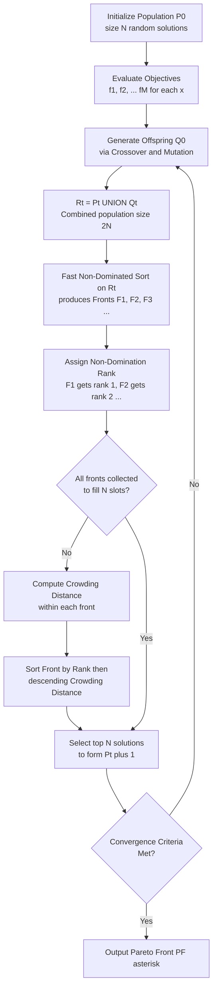
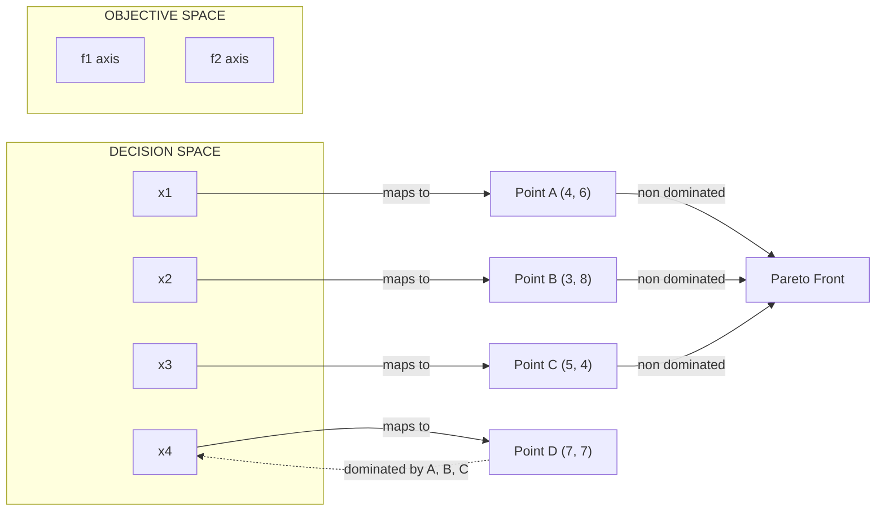
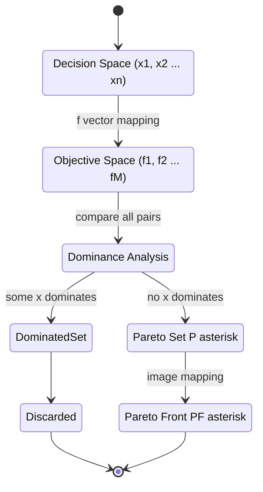

# Multi-objective optimization problem.

<!-- SECTION_1_START -->

# Multi-Objective Optimization Problem (MOOP)

> [!IMPORTANT]
> **KTU 2024 Scheme — Soft Computing (PECST417) | Module 4 | Multi-Objective Optimization**

## 1.1 Formal Academic Definition

A **Multi-Objective Optimization Problem (MOOP)** is an optimization problem that involves simultaneously optimizing two or more **conflicting objective functions** over a constrained decision variable space. Unlike single-objective problems, MOOPs do not possess a single global optimum; instead, they yield a set of **trade-off solutions** known as **Pareto-optimal solutions**.

Mathematically, a MOOP is formally expressed as:

$$
\begin{aligned}
\text{Minimize / Maximize } & f_m(\vec{x}), \quad m = 1, 2, \dots, M \\
\text{Subject to } & g_j(\vec{x}) \leq 0, \quad j = 1, 2, \dots, J \\
& h_k(\vec{x}) = 0, \quad k = 1, 2, \dots, K \\
& x_i^{(L)} \leq x_i \leq x_i^{(U)}, \quad i = 1, 2, \dots, n
\end{aligned}
$$

Where:
- $\vec{x} = (x_1, x_2, \dots, x_n) \in \mathbb{R}^n$ is the **decision variable vector**.
- $M \geq 2$ denotes the number of **objective functions** (the defining characteristic of MOOP).
- $g_j(\vec{x})$ and $h_k(\vec{x})$ are the **inequality** and **equality constraints** respectively.
- $x_i^{(L)}$ and $x_i^{(U)}$ are the **lower** and **upper bounds** of decision variable $x_i$.

> [!NOTE]
> **Key Terminology (KTU Board Standard):**
> - **Decision Space (Variable Space):** The $n$-dimensional space spanned by $\vec{x}$.
> - **Objective Space (Criterion Space):** The $M$-dimensional space spanned by $(f_1, f_2, \dots, f_M)$.
> - **Feasible Region ($S$):** The subset of decision space satisfying all constraints.
> - **Feasible Objective Region:** The image of $S$ mapped into objective space.

---

## 1.2 Conceptual Analogy — The "Engineering Car Design" Intuition

Imagine you are an **automotive engineer** designing a car. You have **three competing goals**:

| Goal | Engineer Wishes | Trade-off Reality |
|------|----------------|-------------------|
| $f_1$ : Fuel Efficiency | Maximize (km/litre) | Requires a small, light engine → reduces power |
| $f_2$ : Horsepower | Maximize (BHP) | Requires a big engine → reduces mileage |
| $f_3$ : Cost | Minimize (₹) | High-end components increase cost |

You **cannot** achieve the maximum of all three simultaneously. Improving mileage forces a compromise on power; boosting power inflates cost. Hence, you are forced to present the customer with a **menu of trade-off solutions** (e.g., a sedan, a sports car, an SUV) — each "best" in a different way. This menu is, in essence, the **Pareto Front**.

> [!TIP]
> **Intuition Hook for Exam Writing:** "MOOPs do not have a single 'best' answer — they have a *set of equally valid best answers* differing only in how they balance competing priorities."

---

## 1.3 Why Single-Objective Methods Fail

A naive student might ask: *"Why not just combine everything into a single function, like $F = w_1 f_1 + w_2 f_2$?"* This is the **Weighted Sum Method**, and it suffers from serious flaws:

1. The choice of weights $w_i$ is **subjective** and often arbitrary.
2. It cannot find solutions on **non-convex regions** of the Pareto front.
3. Different weight combinations may collapse to the **same point**, missing diverse solutions.

Modern Soft Computing uses **Evolutionary Multi-Objective Optimization Algorithms (MOEAs)** that evolve an entire **population of trade-off solutions in a single run**, the most famous being **NSGA-II (Non-dominated Sorting Genetic Algorithm II)**.

> [!VISUALIZATION CONTROL]
> **Concept:** Pareto Front in a 2-Objective (Bi-objective) Minimization Problem
> **GeoGebra / Desmos Input Equations:**
> * `f1(x) = x`   (Objective 1 — to be minimized)
> * `f2(x) = 1 - x + 0.4*sin(3*x)`   (Objective 2 — to be minimized, non-convex)
> **Visual Description:** Plot the curve in the $(f_1, f_2)$ plane. The **lower-left frontier** (closest to origin) constitutes the Pareto front — a set of non-dominated points where moving along the curve reduces $f_1$ only at the cost of increasing $f_2$.

---

<!-- SECTION_1_END -->

<!-- SECTION_2_START -->

# 2. Deep Theoretical Analysis & KTU High-Yield Formula Sheet

## 2.1 Pareto Dominance — The Heart of MOOP

The single most important concept in MOOP is **Pareto Dominance** (introduced by economist **Vilfredo Pareto, 1906**).

> [!NOTE]
> **Formal Definition — Pareto Dominance (for minimization):**
> A decision vector $\vec{x}^{(1)}$ is said to **Pareto-dominate** $\vec{x}^{(2)}$ (denoted $\vec{x}^{(1)} \prec \vec{x}^{(2)}$) if and only if:
> 1. $\vec{x}^{(1)}$ is **no worse** in every objective: $f_m(\vec{x}^{(1)}) \leq f_m(\vec{x}^{(2)})$ for all $m = 1, 2, \dots, M$
> 2. $\vec{x}^{(1)}$ is **strictly better** in at least one objective: $f_k(\vec{x}^{(1)}) < f_k(\vec{x}^{(2)})$ for some $k$.

If neither $\vec{x}^{(1)} \prec \vec{x}^{(2)}$ nor $\vec{x}^{(2)} \prec \vec{x}^{(1)}$ holds, the two solutions are called **non-dominated** (or **incomparable**) with respect to each other.

> [!IMPORTANT]
> **KTU 2024 Board Key:** A solution is **Pareto-optimal** (or **non-dominated**) if **no other feasible solution dominates it**. The set of all Pareto-optimal solutions is the **Pareto Set** ($P^*$) in decision space, whose image is the **Pareto Front** ($PF^*$) in objective space.

---

## 2.2 Step-by-Step Logic of Dominance

Let us break down the dominance check for **two solutions** $\vec{x}^{(A)}$ and $\vec{x}^{(B)}$ in a **bi-objective minimization** problem:

- **Step 1:** Compute objective values: $(f_1^A, f_2^A)$ and $(f_1^B, f_2^B)$.
- **Step 2:** Compare $f_1^A$ vs $f_1^B$. If $f_1^A < f_1^B$, then $A$ is better in $f_1$.
- **Step 3:** Compare $f_2^A$ vs $f_2^B$. If $f_2^A < f_2^B$, then $A$ is better in $f_2$.
- **Step 4 (Decision):**
  * If $A$ is better in **both** → $A \prec B$ (A dominates B).
  * If $B$ is better in **both** → $B \prec A$ (B dominates A).
  * If $A$ is better in one and $B$ in the other → **Non-dominated (incomparable)**.

This procedure generalizes to any $M$ objectives.

---

## 2.3 KTU Formula Sheet / Cheat Sheet

| # | Concept | Formula / Definition | Notes |
|---|---------|----------------------|-------|
| 1 | **General MOOP** | $\min \{f_1(\vec{x}), f_2(\vec{x}), \dots, f_M(\vec{x})\}$ | $M \geq 2$ |
| 2 | **Pareto Dominance (min)** | $\vec{x}^{(1)} \prec \vec{x}^{(2)} \iff \forall m: f_m^{(1)} \leq f_m^{(2)} \; \wedge \; \exists k: f_k^{(1)} < f_k^{(2)}$ | Strict inequality in at least one |
| 3 | **Weak Dominance** | $\forall m: f_m^{(1)} \leq f_m^{(2)}$ (no strict requirement) | Weaker condition |
| 4 | **Strict Dominance** | $\forall m: f_m^{(1)} < f_m^{(2)}$ | Very rare in practice |
| 5 | **Ideal Point** | $f_m^* = \min_{\vec{x} \in S} f_m(\vec{x})$ (computed independently) | Often unattainable simultaneously |
| 6 | **Weighted Sum Scalarization** | $F(\vec{x}) = \sum_{m=1}^{M} w_m f_m(\vec{x}), \quad \sum w_m = 1, \; w_m \geq 0$ | Cannot capture non-convex fronts |
| 7 | **Epsilon-Constraint Method** | $\min f_k(\vec{x})$ s.t. $f_m(\vec{x}) \leq \epsilon_m, \; m \neq k$ | Requires $M-1$ constraints |
| 8 | **Hypervolume Indicator** | $HV = \text{Volume}\!\left(\bigcup_{i=1}^{\vert P \vert} \text{Hypercube}(p_i, r)\right)$ | Dominance-preserving quality metric |
| 9 | **Generational Distance (GD)** | $GD = \frac{1}{\vert P \vert} \sqrt{\sum_{i=1}^{\vert P \vert} d_i^2}$ | Measures convergence to true $PF^*$ |
| 10 | **Spacing Metric** | $S = \sqrt{\frac{1}{\vert P \vert - 1} \sum_{i=1}^{\vert P \vert} (\bar{d} - d_i)^2}$ | Measures distribution uniformity |

> [!IMPORTANT]
> **Engineering Utility Note:** MOOPs are foundational in **portfolio optimization** (risk vs. return), **structural design** (weight vs. strength vs. cost), **machine learning hyperparameter tuning** (accuracy vs. model complexity), **VLSI circuit design** (delay vs. power vs. area), and **renewable energy systems** (cost vs. emissions vs. reliability). Soft Computing methods like **NSGA-II, SPEA2, and MOEA/D** are industry-standard tools for these domains.

---

## 2.4 Multi-Objective Evolutionary Algorithm (MOEA) — Generic Loop

A standard MOEA differs from a single-objective GA in **two fundamental mechanisms**:
1. **Fitness Assignment** based on **non-domination ranking**.
2. **Diversity Preservation** via a **crowding distance** operator.

The skeleton of every MOEA is:

$$
\begin{aligned}
\text{Initialize } & P_0 \text{ (random population of size } N) \\
\text{Evaluate } & f_m(\vec{x}) \; \forall \vec{x} \in P_0 \\
\text{Repeat until termination:} & \\
& Q_t = \text{Variation}(P_t) \quad \text{(crossover + mutation)} \\
& R_t = P_t \cup Q_t \quad \text{(combined population, size } 2N) \\
& F = \text{NonDominatedSort}(R_t) \quad \text{(produces fronts } \mathcal{F}_1, \mathcal{F}_2, \dots) \\
& P_{t+1} = \text{SelectFronts}(F, N) \quad \text{(using crowding distance as tie-breaker)} \\
& t \leftarrow t+1
\end{aligned}
$$

---

<!-- SECTION_2_END -->

<!-- SECTION_3_START -->

# 3. Step-by-Step Derivations & Code Implementation

## 3.1 Worked Example 1 — Manual Pareto Dominance Analysis

> **Problem:** Consider three candidate solutions in a **bi-objective minimization** problem:
> | Solution | $f_1$ | $f_2$ |
> |----------|------|------|
> | A | 4 | 6 |
> | B | 3 | 8 |
> | C | 5 | 4 |
>
> **Identify all dominance relations and the Pareto-optimal set.**

### Step 1: Compare A and B
- $f_1^A = 4$ vs $f_1^B = 3$ → B is better in $f_1$ (4 > 3)
- $f_2^A = 6$ vs $f_2^B = 8$ → A is better in $f_2$ (6 < 8)
- Result: A and B are **incomparable (non-dominated with respect to each other)**.

### Step 2: Compare A and C
- $f_1^A = 4$ vs $f_1^C = 5$ → A is better in $f_1$ (4 < 5)
- $f_2^A = 6$ vs $f_2^C = 4$ → C is better in $f_2$ (4 < 6)
- Result: A and C are **incomparable**.

### Step 3: Compare B and C
- $f_1^B = 3$ vs $f_1^C = 5$ → B is better in $f_1$ (3 < 5)
- $f_2^B = 8$ vs $f_2^C = 4$ → C is better in $f_2$ (4 < 8)
- Result: B and C are **incomparable**.

### Step 4: Pareto-Optimal Set
No solution dominates any other. Therefore:

$$
P^* = \{A, B, C\}, \quad PF^* = \{(4,6), (3,8), (5,4)\}
$$

> [!TIP]
> **Examiner Tip:** For maximization problems, simply **reverse the inequality signs** in the dominance definition: $\vec{x}^{(1)} \prec \vec{x}^{(2)} \iff \forall m: f_m^{(1)} \geq f_m^{(2)} \wedge \exists k: f_k^{(1)} > f_k^{(2)}$.

---

## 3.2 Worked Example 2 — Weighted Sum Method

> **Problem:** $\min \{f_1 = x^2, \; f_2 = (x-2)^2\}$ for $x \in [0, 2]$. Use the weighted sum $F(x) = 0.4 f_1 + 0.6 f_2$.

### Step 1: Form the scalar objective
$$
F(x) = 0.4 x^2 + 0.6 (x-2)^2
$$

### Step 2: Expand algebraically
$$
\begin{aligned}
F(x) & = 0.4 x^2 + 0.6 (x^2 - 4x + 4) \\
& = 0.4 x^2 + 0.6 x^2 - 2.4 x + 2.4 \\
& = x^2 - 2.4 x + 2.4
\end{aligned}
$$

### Step 3: Differentiate and set to zero
$$
\frac{dF}{dx} = 2x - 2.4 = 0 \implies x^* = 1.2
$$

### Step 4: Evaluate both objectives at $x^* = 1.2$
$$
f_1(1.2) = (1.2)^2 = 1.44, \quad f_2(1.2) = (1.2 - 2)^2 = 0.64
$$

### Step 5: Final trade-off solution
$$
\vec{x}^* = 1.2, \quad (f_1, f_2) = (1.44, \; 0.64)
$$

> **Valuation Key:** '[Forming the scalar $F(x)$: 2 Marks] | '[Differentiation: 2 Marks] | '[Solving $dF/dx = 0$: 2 Marks] | '[Final pair of objective values: 2 Marks]'

---

## 3.3 Full Python Implementation — NSGA-II Style Non-Dominated Sort

The following code implements the **non-dominated sorting** routine — the core of NSGA-II — exactly as described in **Deb et al. (2002)**.

```python
from typing import List, Tuple
import logging

logging.basicConfig(level=logging.INFO, format='%(levelname)s: %(message)s')

ObjectiveVector = List[float]
Solution = Tuple[List[float], ObjectiveVector]  # (decision_vector, objectives)


def dominates(obj_a: ObjectiveVector, obj_b: ObjectiveVector) -> bool:
    """
    Returns True if solution A Pareto-dominates solution B
    (assuming MINIMIZATION of every objective).
    Includes strict absolute boundary checks.
    """
    if len(obj_a) != len(obj_b):
        raise ValueError("Objective vectors must have the same length.")
    n_objs = len(obj_a)

    # Check: A must be <= in every objective AND < in at least one
    at_least_one_strictly_better = False
    for m in range(n_objs):
        if obj_a[m] > obj_b[m]:        # A is worse in objective m
            return False
        if obj_a[m] < obj_b[m]:        # A is strictly better in objective m
            at_least_one_strictly_better = True
    return at_least_one_strictly_better


def fast_non_dominated_sort(population: List[Solution]) -> List[List[int]]:
    """
    Performs Deb's fast non-dominated sort.
    Returns a list of fronts; each front is a list of indices into `population`.
    Front 0 = first (best) Pareto front.
    """
    n = len(population)
    domination_count: List[int] = [0] * n
    dominated_set: List[List[int]] = [[] for _ in range(n)]
    fronts: List[List[int]] = [[]]

    for p in range(n):
        for q in range(n):
            if p == q:
                continue
            try:
                if dominates(population[p][1], population[q][1]):
                    dominated_set[p].append(q)
                elif dominates(population[q][1], population[p][1]):
                    domination_count[p] += 1
            except ValueError as e:
                logging.error("Dominance check failed between p=%d, q=%d: %s", p, q, e)
                raise

        if domination_count[p] == 0:
            fronts[0].append(p)            # p belongs to the first front

    i = 0
    while fronts[i]:
        next_front: List[int] = []
        for p in fronts[i]:
            for q in dominated_set[p]:
                domination_count[q] -= 1
                if domination_count[q] == 0:
                    next_front.append(q)
        i += 1
        fronts.append(next_front)

    if not fronts[-1]:
        fronts.pop()
    return fronts


def crowding_distance(front_indices: List[int],
                      population: List[Solution]) -> List[float]:
    """
    Computes crowding distance for each member of a single front.
    Members at the boundary receive INFINITY to guarantee their survival.
    """
    k = len(front_indices)
    if k == 0:
        return []
    n_objs = len(population[front_indices[0]][1])
    distance: List[float] = [0.0] * k

    for m in range(n_objs):
        # Sort front by m-th objective value
        sorted_idx = sorted(range(k), key=lambda i: population[front_indices[i]][1][m])
        distance[sorted_idx[0]] = float('inf')   # boundary
        distance[sorted_idx[-1]] = float('inf')  # boundary

        obj_min = population[front_indices[sorted_idx[0]]][1][m]
        obj_max = population[front_indices[sorted_idx[-1]]][1][m]
        if obj_max - obj_min == 0:
            continue

        for j in range(1, k - 1):
            prev_obj = population[front_indices[sorted_idx[j - 1]]][1][m]
            next_obj = population[front_indices[sorted_idx[j + 1]]][1][m]
            distance[sorted_idx[j]] += (next_obj - prev_obj) / (obj_max - obj_min)

    return distance


# ------------------- DEMO RUN -------------------
if __name__ == "__main__":
    # Population of 6 solutions; each has 2 decision vars and 2 objectives (min)
    pop: List[Solution] = [
        ([0.1, 0.2], [4.0, 6.0]),   # 0
        ([0.3, 0.4], [3.0, 8.0]),   # 1
        ([0.5, 0.6], [5.0, 4.0]),   # 2
        ([0.7, 0.8], [2.0, 9.0]),   # 3
        ([0.9, 1.0], [6.0, 3.0]),   # 4
        ([1.1, 1.2], [1.0, 10.0]),  # 5
    ]

    fronts = fast_non_dominated_sort(pop)
    logging.info("Number of Pareto fronts discovered: %d", len(fronts))
    for rank, front in enumerate(fronts):
        logging.info("Front %d (size=%d) indices: %s", rank, len(front), front)
        if len(front) > 1:
            cd = crowding_distance(front, pop)
            logging.info("  Crowding distances: %s", cd)
```

> [!IMPORTANT]
> **Algorithm Complexity:** Fast non-dominated sort runs in $O(M N^2)$ per generation. The crowding distance operator adds $O(M N \log N)$. For $N$ population size and $M$ objectives, **NSGA-II overall complexity is $O(M N^2)$** per generation.

---

## 3.4 Derivation — Why Crowding Distance Preserves Diversity

The crowding distance of a solution $i$ in a front $\mathcal{F}$ is:

$$
d_i = \sum_{m=1}^{M} \frac{f_m^{(i+1)} - f_m^{(i-1)}}{f_m^{\max} - f_m^{\min}}
$$

Where $f_m^{(i+1)}$ and $f_m^{(i-1)}$ are the $m$-th objective values of the immediate neighbors of $i$ when the front is sorted along the $m$-th axis. A solution surrounded by sparse neighbors receives a **high** $d_i$, ensuring it survives into the next generation — a **density-preserving selection** analogous to fitness sharing in traditional GAs.

---

<!-- SECTION_3_END -->

<!-- SECTION_4_START -->

# 4. Structural Diagrams & Schematics

## 4.1 NSGA-II — Complete Algorithmic Block Flow



---

## 4.2 Pareto Dominance Visual Logic (Decision + Objective Space)



> [!NOTE]
> **Reading the diagram:** Points $A, B, C$ in objective space are *mutually non-dominated* and form the Pareto Front. Point $D$ is **dominated** by the others and will be pruned during non-dominated sort.

---

## 4.3 Block-Level Functional Architecture — Generic MOEA Pipeline

| Stage | Module | Function | Input | Output |
|-------|--------|----------|-------|--------|
| 1 | **Initializer** | Generate random decision vectors | Bounds $x_i^{(L)}, x_i^{(U)}$ | Initial population $P_0$ |
| 2 | **Evaluator** | Compute $M$ objective values | $\vec{x}$ | $(f_1, \dots, f_M)$ |
| 3 | **Variation Operator** | SBX crossover + Polynomial mutation | Parent pool | Offspring $Q_t$ |
| 4 | **Selector (NSGA-II Core)** | Non-dominated sort + Crowding distance | Combined $R_t$ | New $P_{t+1}$ |
| 5 | **Archive (optional)** | Store elitist Pareto set | All non-dominated | External archive |
| 6 | **Termination** | Check generations / metric threshold | Current $P_t$ | Boolean + final $PF^*$ |

---

## 4.4 Mermaid State Diagram — Pareto Set vs. Pareto Front Mapping



---

<!-- SECTION_4_END -->

<!-- SECTION_5_START -->

# 5. KTU 2024 Scheme Examination Question Bank & Topic Recap

---

## 📘 PART A — Short Answer Questions (3 Marks Each)

> **[KTU University Exam — July 2024 | CO2 | Remember]**

### **Q1. Define a Multi-Objective Optimization Problem (MOOP). How does it differ from a single-objective optimization problem?**

**Model Answer (3 Marks):**
A Multi-Objective Optimization Problem involves the simultaneous optimization of two or more objective functions that are typically **conflicting in nature**, over a feasible region of decision variables. Formally, it is expressed as:
$$
\min \{f_1(\vec{x}), f_2(\vec{x}), \dots, f_M(\vec{x})\} \quad \text{subject to } \vec{x} \in S
$$
where $M \geq 2$. The key difference from a single-objective problem is that a MOOP does **not** yield a single optimal solution; instead, it produces a **set of Pareto-optimal trade-off solutions**, because improving one objective forces degradation of at least one other.

> *Valuation Key:* [MOOP definition with $M \geq 2$: 2 Marks] [Mention of trade-off / Pareto set: 1 Mark]

---

> **[KTU University Exam — Dec 2023 | CO2 | Understand]**

### **Q2. Explain the concept of Pareto Dominance with a suitable example.**

**Model Answer (3 Marks):**
Pareto Dominance is a binary relation used to compare two feasible solutions in MOOP. A solution $\vec{x}^{(1)}$ is said to **Pareto-dominate** $\vec{x}^{(2)}$ (written $\vec{x}^{(1)} \prec \vec{x}^{(2)}$) if:
1. $\vec{x}^{(1)}$ is no worse than $\vec{x}^{(2)}$ in **all** objectives, **and**
2. $\vec{x}^{(1)}$ is **strictly better** in at least one objective.

**Example:** In a bi-objective minimization problem, if solution $A$ has $(f_1, f_2) = (3, 5)$ and solution $B$ has $(f_1, f_2) = (4, 7)$, then $A$ dominates $B$ because $3 < 4$ and $5 < 7$.

> *Valuation Key:* [Formal definition (2 inequalities): 2 Marks] [Numerical example: 1 Mark]

---

## 📗 PART B — Long Answer Questions (14 Marks, Internal Choice)

> **[KTU University Exam — July 2024 | CO2, CO3 | Apply / Analyze]**

---

### **Question A (14 Marks)**

**(a)** Formulate the general mathematical structure of a Multi-Objective Optimization Problem. Clearly define the decision space, objective space, feasible region, and Pareto-optimal set. **(7 Marks)**

**(b)** Consider the following four solutions in a bi-objective minimization problem:

| Solution | $f_1$ | $f_2$ |
|----------|------|------|
| $S_1$ | 2 | 8 |
| $S_2$ | 4 | 4 |
| $S_3$ | 3 | 6 |
| $S_4$ | 6 | 3 |

Perform a complete Pareto dominance analysis. Identify the **Pareto-optimal set**, the **Pareto front**, and explain which solutions are **dominated**. **(7 Marks)**

---

#### Model Solution

**(a) Mathematical Formulation (7 Marks):**

A MOOP is formulated as:
$$
\begin{aligned}
\text{Find } \vec{x} & = (x_1, x_2, \dots, x_n)^T \text{ that optimizes} \\
\vec{F}(\vec{x}) & = (f_1(\vec{x}), f_2(\vec{x}), \dots, f_M(\vec{x}))^T, \quad M \geq 2 \\
\text{subject to: } & \\
g_j(\vec{x}) & \leq 0, \quad j = 1, 2, \dots, J \\
h_k(\vec{x}) & = 0, \quad k = 1, 2, \dots, K \\
x_i^{(L)} & \leq x_i \leq x_i^{(U)}, \quad i = 1, \dots, n
\end{aligned}
$$

**Definitions:**
- **Decision Space** $\mathcal{D} = \mathbb{R}^n$: the $n$-dimensional space of all possible decision vectors.
- **Objective Space** $\mathcal{Z} = \mathbb{R}^M$: the $M$-dimensional space of objective vectors.
- **Feasible Region** $S = \{\vec{x} \in \mathcal{D} : g_j(\vec{x}) \leq 0, \, h_k(\vec{x}) = 0\}$: the subset of decision space satisfying all constraints.
- **Pareto-Optimal Set** $P^* = \{\vec{x} \in S : \nexists \, \vec{x}' \in S \text{ such that } \vec{x}' \prec \vec{x}\}$: the set of non-dominated feasible solutions.
- **Pareto Front** $PF^* = \{(f_1(\vec{x}), \dots, f_M(\vec{x})) : \vec{x} \in P^*\}$: the image of $P^*$ in objective space.

> *Valuation Key:* [Full formulation: 2 Marks] [Decision & objective space: 2 Marks] [Feasible region: 1 Mark] [Pareto set & front: 2 Marks]

---

**(b) Pareto Dominance Analysis (7 Marks):**

We perform pairwise comparisons:

| Comparison | $f_1$ Check | $f_2$ Check | Result |
|------------|-------------|-------------|--------|
| $S_1$ vs $S_2$ | $2 < 4$ ✓ | $8 > 4$ ✗ | **Incomparable** |
| $S_1$ vs $S_3$ | $2 < 3$ ✓ | $8 > 6$ ✗ | **Incomparable** |
| $S_1$ vs $S_4$ | $2 < 6$ ✓ | $8 > 3$ ✗ | **Incomparable** |
| $S_2$ vs $S_3$ | $4 > 3$ ✗ | $4 < 6$ ✓ | **Incomparable** |
| $S_2$ vs $S_4$ | $4 < 6$ ✓ | $4 > 3$ ✗ | **Incomparable** |
| $S_3$ vs $S_4$ | $3 < 6$ ✓ | $6 > 3$ ✗ | **Incomparable** |

**Conclusion:**
- **No solution dominates any other.**
- **Pareto-Optimal Set:** $P^* = \{S_1, S_2, S_3, S_4\}$
- **Pareto Front:** $PF^* = \{(2, 8), (4, 4), (3, 6), (6, 3)\}$

> *Valuation Key:* [6 pairwise comparisons tabulated: 3 Marks] [Identification of Pareto set: 2 Marks] [Identification of Pareto front: 2 Marks]

---

### **Question B (14 Marks) — Alternative Choice**

**(a)** Explain the **Weighted Sum Method** for solving a multi-objective optimization problem. Discuss its main limitations. **(7 Marks)**

**(b)** Using the **Epsilon-Constraint Method**, solve the following bi-objective problem:
$$
\min \; f_1(x) = x^2, \quad \min \; f_2(x) = (x - 2)^2, \quad x \in [0, 2]
$$
Take $\epsilon_2 = 0.5$ and solve the resulting constrained single-objective problem using Lagrangian analysis. **(7 Marks)**

---

#### Model Solution

**(a) Weighted Sum Method (7 Marks):**

The Weighted Sum Method is the **classical scalarization** approach where the $M$ objective functions are combined into a single scalar function using non-negative weights:

$$
F(\vec{x}) = \sum_{m=1}^{M} w_m f_m(\vec{x}), \quad \text{where } \sum_{m=1}^{M} w_m = 1, \; w_m \geq 0
$$

By varying the weights $w_m$, different Pareto-optimal solutions can be obtained.

**Limitations:**
1. **Non-convex Pareto fronts cannot be captured** — certain trade-off regions are mathematically unreachable regardless of weight choice.
2. **Weight selection is subjective** — small weight changes may cause large jumps in the solution.
3. **Uniform scaling required** — objectives with different magnitudes must be normalized.
4. **Different weight combinations can yield the same point**, missing solution diversity.

> *Valuation Key:* [Formula: 2 Marks] [Varying weights explanation: 2 Marks] [At least 2 limitations: 3 Marks]

---

**(b) Epsilon-Constraint Method (7 Marks):**

**Step 1:** Convert $f_2$ into a constraint:
$$
\min_{x} f_1(x) = x^2 \quad \text{subject to } (x - 2)^2 \leq 0.5, \; 0 \leq x \leq 2
$$

**Step 2:** Solve the constraint $(x-2)^2 \leq 0.5$:
$$
-\sqrt{0.5} \leq x - 2 \leq \sqrt{0.5} \implies 2 - \sqrt{0.5} \leq x \leq 2 + \sqrt{0.5}
$$
Combined with $x \in [0, 2]$, the feasible interval is $x \in [2 - \sqrt{0.5}, \; 2]$.

Numerically, $2 - \sqrt{0.5} \approx 2 - 0.7071 = 1.2929$.

**Step 3:** Minimize $f_1(x) = x^2$ on $[1.2929, 2]$:
The minimum of $x^2$ on this interval occurs at the **left boundary**:
$$
x^* = 2 - \sqrt{0.5} \approx 1.2929
$$

**Step 4:** Evaluate the objectives:
$$
f_1(x^*) = (1.2929)^2 \approx 1.6716, \quad f_2(x^*) = (1.2929 - 2)^2 = 0.5
$$

**Final Pareto-Optimal Solution:**
$$
\boxed{x^* \approx 1.2929, \quad (f_1, f_2) \approx (1.6716, \; 0.50)}
$$

> *Valuation Key:* [Forming the constraint: 2 Marks] [Solving the constraint range: 2 Marks] [Minimizing $f_1$ on the interval: 2 Marks] [Final objective values: 1 Mark]

---

## ⚠️ KTU Examiner's Valuation Warning

> [!WARNING]
> **Common Mark-Deduction Pitfalls (KTU 2024 Board Style):**
> 1. **Confusing "Pareto Set" and "Pareto Front":** Pareto Set lives in **decision space** ($\vec{x}$), Pareto Front lives in **objective space** ($f(\vec{x})$). Mixing them costs full marks.
> 2. **Forgetting the strict inequality** in dominance definition: a solution must be **strictly better** in at least one objective — equal performance in all objectives does **not** constitute dominance.
> 3. **Sign errors in maximization vs minimization:** In a maximization problem, dominance is $\forall m: f_m^{(1)} \geq f_m^{(2)}$. Inverting this is a classic 2-mark deduction.
> 4. **Skipping the constraint satisfaction check** in the Epsilon-Constraint method — the value of $x^*$ must be **verified** against the original domain bounds.
> 5. **Claiming "weighted sum always finds the Pareto front"** — this is **false** for non-convex fronts. Mention this explicitly for full marks.

---

## 📌 Topic Recap & Important Things to Remember

- ✅ A **MOOP** has $M \geq 2$ conflicting objective functions; it yields a **set** of trade-off solutions, not a single optimum.
- ✅ **Pareto Dominance**: $\vec{x}^{(1)} \prec \vec{x}^{(2)}$ if $\vec{x}^{(1)}$ is no worse in all objectives AND strictly better in at least one.
- ✅ **Pareto-Optimal Set** ($P^*$) ⊂ **Decision Space**; **Pareto Front** ($PF^*$) ⊂ **Objective Space**; they are **not the same**.
- ✅ **Ideal Point** $f^*$ is computed by independently minimizing each objective — usually **unattainable** simultaneously.
- ✅ **Weighted Sum Method**: simple but **fails on non-convex fronts**; use $\sum w_m = 1, w_m \geq 0$.
- ✅ **Epsilon-Constraint Method**: converts $(M-1)$ objectives into inequality constraints; **can capture non-convex** regions.
- ✅ **NSGA-II** (Deb et al., 2002) is the **industry-standard MOEA**, using **Non-Dominated Sorting** + **Crowding Distance**.
- ✅ **Crowding Distance** = sum of normalized neighbor-distance along each objective axis; **infinity** for boundary solutions to guarantee retention.
- ✅ **Quality Metrics**: **Hypervolume (HV)** for convergence + spread; **Generational Distance (GD)** for convergence; **Spacing (S)** for uniformity.
- ✅ **Complexity of NSGA-II**: $O(M N^2)$ per generation, where $N$ = population size, $M$ = number of objectives.
- ✅ **Real-world domains**: portfolio optimization, VLSI design, structural engineering, ML hyperparameter tuning, renewable energy systems.
- ✅ For **maximization** problems, **reverse** the dominance inequalities: $f_m^{(1)} \geq f_m^{(2)}$ for all $m$.

<!-- SECTION_5_END -->
