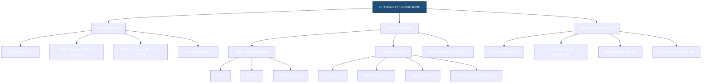
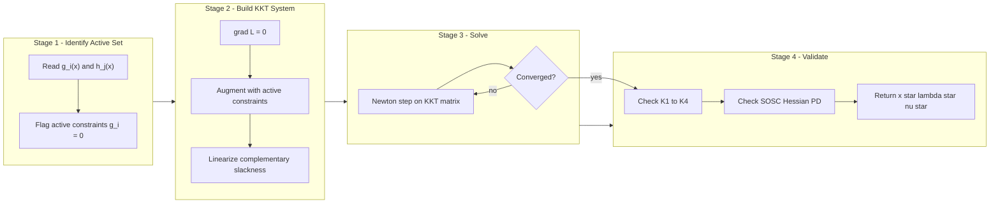
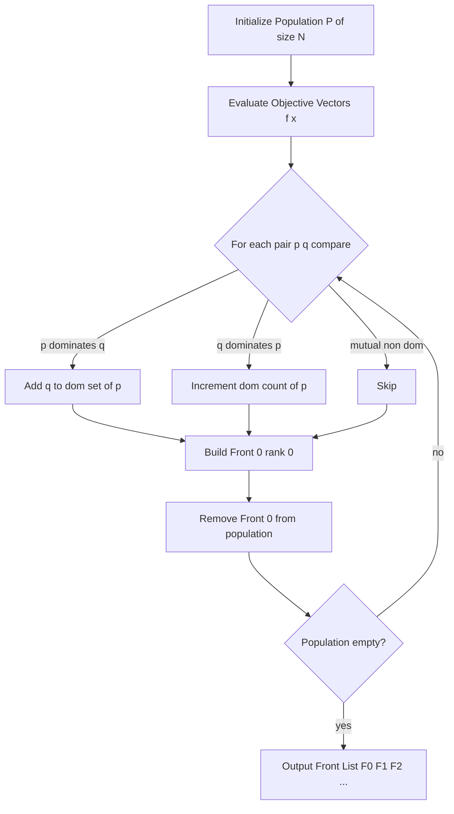
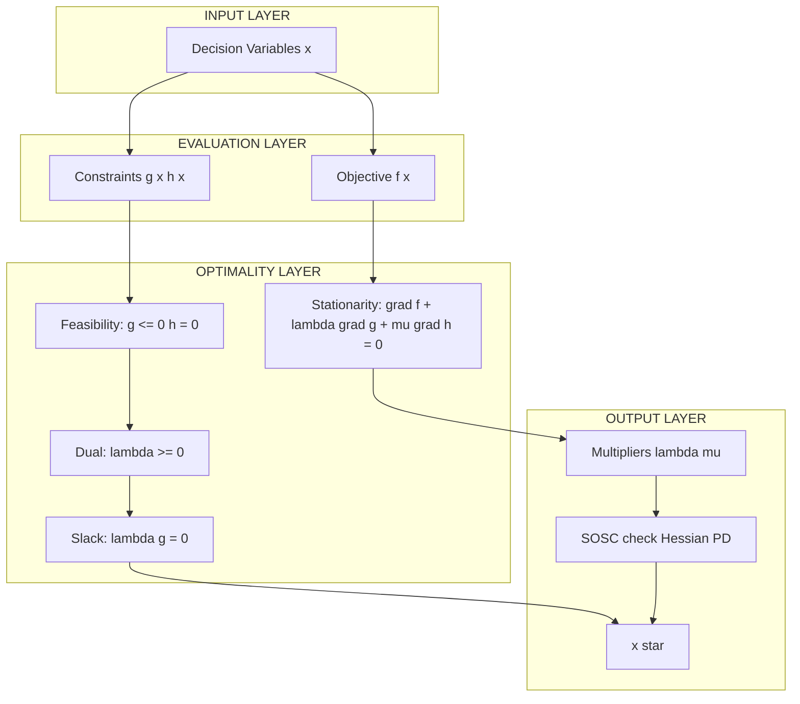

# Optimality conditions.

<!-- SECTION_1_START -->
# Optimality Conditions in Multi-Objective Optimization

## 1. Core Technical Definition

> [!IMPORTANT]
> **Optimality Conditions (KTU 2024 – PECST417, Module 4):**
> *Optimality conditions* are a set of mathematical criteria (necessary, sufficient, or both) that a candidate solution must satisfy in order to qualify as a local or global minimizer (or maximizer) of an objective function. In multi-objective optimization, the analogous concept is **Pareto optimality**, where a solution cannot be improved in one objective without degrading at least one other objective.

For a general **constrained nonlinear program (NLP)** of the form

$$\min_{x \in \mathbb{R}^{n}} f(x)$$

$$\text{subject to } g_{i}(x) \le 0, \quad i = 1, \dots, m$$

$$h_{j}(x) = 0, \quad j = 1, \dots, p$$

the optimality conditions are stated in terms of the **Lagrangian function** $\mathcal{L}(x,\lambda,\mu)$ and the **Karush–Kuhn–Tucker (KKT) multipliers** $\lambda \ge 0,\ \mu \in \mathbb{R}^{p}$.

### Conceptual Analogy / Intuition

> [!NOTE]
> **Real-world analogy – "Hiking in a Foggy Mountain Range":**
> Imagine you are blindfolded (you cannot see the peak) on a mountain whose height represents the cost $f(x)$, and $x$ is your 2-D position. The optimality conditions are the *rules of the hike*:
> 1. **Stationarity** – you must stand on a flat patch (gradient = 0) before declaring a summit.
> 2. **Primal feasibility** – you must remain on the legal trail (satisfy $g_{i}(x) \le 0$).
> 3. **Dual feasibility** – you may push only on the *active* ropes (constraints that are tight), and the push must not be negative ($\lambda_{i} \ge 0$).
> 4. **Complementary slackness** – a taut rope ($\lambda_{i} > 0$) corresponds to a wall you are touching ($g_{i}(x) = 0$); a slack rope has zero force.
>
> For **multi-objective** climbing (minimizing time *and* energy *and* danger), there is no single "highest point" – instead, you collect a set of *non-dominated* trade-off points called the **Pareto front**.

### The Three Pillars of Optimality

> [!TIP]
> **Three Pillars to Memorize for KTU Exam:**
> 1. **Necessary Conditions** (KKT / Fritz John) – *every* optimum *must* satisfy them.
> 2. **Sufficient Conditions** (second-order / convexity) – *if* they hold, the point *is* an optimum.
> 3. **Constraint Qualifications** (LICQ, MFCQ, Slater) – *technical* conditions that make the necessary conditions valid.

> [!VISUALIZATION CONTROL]
> **Concept:** Geometric depiction of a constrained minimum in 2-D (one inequality constraint).
> **GeoGebra / Desmos Input Equations:**
> * Level curves of objective: `f(x,y) = (x-2)^2 + (y-1)^2` (try `c = 0.5, 1, 2, 3`)
> * Constraint boundary: `g(x,y) = x + y - 1.5 = 0`
> * Gradient: `grad f = (2(x-2), 2(y-1))`
> **Visual Description:** The student should observe concentric ellipses shrinking toward a center; the optimum is the smallest ellipse that still *touches* the feasible side of the line $x+y=1.5$. At the touch-point the gradient of $f$ points opposite to the gradient of $g$ (collinearity $\Rightarrow$ KKT stationarity).

### Physical Constants / Standard Metrics Used

* **MFCQ (Mangasarian-Fromovitz Constraint Qualification)** – controls the validity of KKT.
* **LICQ (Linear Independence Constraint Qualification)** – stronger than MFCQ; gradients of *active* constraints must be linearly independent.
* **Slater's Condition** – for convex problems: existence of a strictly feasible point.
* **Strong convexity constant** $m > 0$ – guarantees a *unique* global minimum.
* **Pareto rank** – integer level assigned by **non-dominated sorting** (used in NSGA-II).

---

<!-- SECTION_1_END -->

<!-- SECTION_2_START -->
# Deep Theoretical Analysis & KTU High-Yield Formula Sheet

## 2.1 Unconstrained Optimality Conditions

Let $f:\mathbb{R}^{n}\to\mathbb{R}$ be $C^{2}$ (twice continuously differentiable).

| # | Condition | Type | Statement |
|---|-----------|------|-----------|
| U1 | **First-Order Necessary (FONC)** | Necessary | $\nabla f(x^{\ast}) = 0$ |
| U2 | **Second-Order Necessary (SONC)** | Necessary | $\nabla f(x^{\ast}) = 0$ **and** $y^{T}\nabla^{2}f(x^{\ast})y \ge 0\ \forall y$ |
| U3 | **Second-Order Sufficient (SOSC)** | Sufficient | $\nabla f(x^{\ast}) = 0$ **and** $y^{T}\nabla^{2}f(x^{\ast})y > 0\ \forall y \ne 0$ |
| U4 | **Convex Sufficient** | Sufficient | $f$ convex and $\nabla f(x^{\ast}) = 0 \Rightarrow x^{\ast}$ global min |

> [!IMPORTANT]
> **Why these matter in Soft Computing:**
> Gradient-based meta-heuristics (e.g. *real-coded Genetic Algorithms with gradient repair*, *Particle Swarm Optimization with inertia-weight tuning*, *Adam optimizer in deep learning*) **all** rely on the FONC in continuous sub-problems. Evolutionary multi-objective algorithms (NSGA-II, MOEA/D) replace scalar optimality with **Pareto dominance**, but their scalar sub-problems (e.g. Tchebycheff decomposition in MOEA/D) **must** satisfy the KKT conditions at convergence.

## 2.2 Constrained Optimality – KKT Conditions

The **Lagrangian** is defined as

$$\mathcal{L}(x,\lambda,\mu) = f(x) + \sum_{i=1}^{m}\lambda_{i}\,g_{i}(x) + \sum_{j=1}^{p}\mu_{j}\,h_{j}(x).$$

The **KKT (Karush–Kuhn–Tucker)** conditions at a local minimum $x^{\ast}$ are:

| # | KKT Stationarity | Mathematical Form |
|---|------------------|-------------------|
| K1 | Stationarity | $\nabla_{x}\mathcal{L}(x^{\ast},\lambda^{\ast},\mu^{\ast}) = 0$ |
| K2 | Primal Feasibility | $g_{i}(x^{\ast}) \le 0,\ i=1,\dots,m;\ h_{j}(x^{\ast})=0,\ j=1,\dots,p$ |
| K3 | Dual Feasibility | $\lambda_{i}^{\ast} \ge 0,\ i=1,\dots,m$ |
| K4 | Complementary Slackness | $\lambda_{i}^{\ast}\,g_{i}(x^{\ast}) = 0,\ i=1,\dots,m$ |

### Second-Order Sufficient KKT (SOSC-KKT)

Under **LICQ**, if there exist multipliers $(\lambda^{\ast},\mu^{\ast})$ satisfying K1–K4 **and** for all $d \ne 0$ with

$$\nabla g_{i}(x^{\ast})^{T}d = 0 \quad \forall i \in \mathcal{A}(x^{\ast}),\qquad \nabla h_{j}(x^{\ast})^{T}d = 0 \quad \forall j$$

we have

$$d^{T}\nabla_{xx}^{2}\mathcal{L}(x^{\ast},\lambda^{\ast},\mu^{\ast})\,d > 0,$$

then $x^{\ast}$ is a **strict local minimum** of the original problem.

## 2.3 Multi-Objective (Pareto) Optimality

For the **Multi-Objective Optimization Problem (MOOP)**

$$\min_{x \in \mathcal{X}} \Big\{ F(x) = \big( f_{1}(x),f_{2}(x),\dots,f_{k}(x) \big) \Big\}$$

| # | Concept | Formal Definition |
|---|---------|-------------------|
| M1 | **Pareto Dominance** | $x^{a} \prec x^{b}$ iff $f_{i}(x^{a}) \le f_{i}(x^{b})\ \forall i$ and $\exists\,i$ with $f_{i}(x^{a}) < f_{i}(x^{b})$ |
| M2 | **Pareto Optimal / Non-dominated** | $x^{\ast}$ is Pareto optimal if $\nexists\,x$ such that $x \prec x^{\ast}$ |
| M3 | **Weak Pareto Optimal** | $x^{\ast}$ is weakly Pareto optimal if $\nexists\,x$ with $f_{i}(x) < f_{i}(x^{\ast})\ \forall i$ |
| M4 | **Pareto Front** | $\mathcal{P}\mathcal{F} = \{F(x^{\ast}) : x^{\ast} \text{ is Pareto optimal}\}$ |
| M5 | **Ideal Point** | $z_{i}^{\text{ideal}} = \min_{x} f_{i}(x)$ for $i=1,\dots,k$ |

> [!NOTE]
> **Multi-objective optimality is *set-valued*:** the "optimal solution" is a whole **Pareto set** in decision space, mapped to a **Pareto front** in objective space. This is fundamentally different from scalar optimality.

## 2.4 Real-World Utility in Soft Computing

| Algorithm | Role of Optimality Conditions |
|-----------|------------------------------|
| **NSGA-II / NSGA-III** | Uses *non-dominated sorting* (Pareto M1) and *crowding distance*; convergence depends on reaching a near-Pareto-optimal set. |
| **MOEA/D** | Decomposes MOOP into $N$ scalar sub-problems (Tchebycheff, PBI); each sub-problem is solved by an inner optimizer that **must** satisfy KKT of the sub-problem. |
| **SPEA2** | Maintains an *archive* of non-dominated points (M2) and uses a strength fitness for selection. |
| **Gradient-Repair GA** | Projects infeasible offspring onto the feasible boundary using KKT-projection step. |
| **SVM Training (QP form)** | Optimality = KKT on the dual QP; support vectors are precisely the points with $0 < \alpha_{i} < C$ (complementary slackness K4 in action). |
| **Neural Network Training (back-prop)** | The global minimum of the loss corresponds to $\nabla \mathcal{L} = 0$ (U1) at a stationary point; Adam/SGD approximate this under stochasticity. |
| **Constrained Portfolio Optimization** | Directly solved by KKT under box and cardinality constraints. |

> [!TIP]
> **Engineering takeaway:** every modern soft-computing system that produces a "best" answer is *implicitly* invoking a form of optimality condition – be it Pareto, KKT, or stationarity.

---

<!-- SECTION_2_END -->

<!-- SECTION_3_START -->
# Step-by-Step Derivations & Symbolic Implementation

## 3.1 Worked Example 1 – KKT on a 2-D Constrained QP

> **Problem (full derivation, no step skipped):**
> $$\min_{x_{1},x_{2}} f(x_{1},x_{2}) = (x_{1}-2)^{2} + (x_{2}-1)^{2}$$
> $$\text{s.t. } g_{1}(x) = x_{1} + x_{2} - 1.5 \le 0$$
> $$g_{2}(x) = -x_{1} \le 0$$
> $$g_{3}(x) = -x_{2} \le 0$$

### Step 1 – Form the Lagrangian

$$\mathcal{L}(x,\lambda) = (x_{1}-2)^{2} + (x_{2}-1)^{2} + \lambda_{1}(x_{1}+x_{2}-1.5) + \lambda_{2}(-x_{1}) + \lambda_{3}(-x_{2})$$

### Step 2 – Stationarity (K1)

$$\frac{\partial \mathcal{L}}{\partial x_{1}} = 2(x_{1}-2) + \lambda_{1} - \lambda_{2} = 0$$

$$\frac{\partial \mathcal{L}}{\partial x_{2}} = 2(x_{2}-1) + \lambda_{1} - \lambda_{3} = 0$$

### Step 3 – Hypothesize the active set

Try the optimum touching the line $g_{1}(x) = 0$ (i.e. $x_{1}+x_{2}=1.5$) **and** $g_{2}=0$ ($x_{1}=0$). Then $x_{2}=1.5$.

Solve the stationarity with $\lambda_{2} \ge 0$ free to be non-zero:

$$2(0-2) + \lambda_{1} - \lambda_{2} = 0 \quad\Rightarrow\quad \lambda_{1} - \lambda_{2} = 4$$

$$2(1.5-1) + \lambda_{1} - \lambda_{3} = 0 \quad\Rightarrow\quad \lambda_{1} - \lambda_{3} = -1$$

### Step 4 – Solve the multiplier system

Since $g_{3}(x^{\ast}) = -1.5 < 0$ (inactive), K4 gives $\lambda_{3}^{\ast} = 0$.

Therefore $\lambda_{1} = -1 < 0$. **This violates K3 (dual feasibility $\lambda_{1} \ge 0$)**, so the candidate is rejected.

### Step 5 – Try a different active set

Active: only $g_{1}(x) = 0$. So $g_{2}(x) < 0 \Rightarrow \lambda_{2}=0$ and $g_{3}(x) < 0 \Rightarrow \lambda_{3}=0$.

$$2(x_{1}-2) + \lambda_{1} = 0 \quad\Rightarrow\quad x_{1} = 2 - \lambda_{1}/2$$

$$2(x_{2}-1) + \lambda_{1} = 0 \quad\Rightarrow\quad x_{2} = 1 - \lambda_{1}/2$$

Add the active constraint: $x_{1} + x_{2} = 1.5$:

$$\left(2 - \tfrac{\lambda_{1}}{2}\right) + \left(1 - \tfrac{\lambda_{1}}{2}\right) = 1.5$$

$$3 - \lambda_{1} = 1.5 \quad\Rightarrow\quad \lambda_{1}^{\ast} = 1.5$$

### Step 6 – Recover the primal point

$$x_{1}^{\ast} = 2 - \tfrac{1.5}{2} = 2 - 0.75 = 1.25$$

$$x_{2}^{\ast} = 1 - \tfrac{1.5}{2} = 1 - 0.75 = 0.25$$

### Step 7 – Verify all four KKT conditions

* **K1 (stationarity):** $\nabla f + \lambda_{1}\nabla g_{1} = (2(1.25-2)+1.5,\ 2(0.25-1)+1.5) = (-1.5+1.5,\ -1.5+1.5) = (0,0)$ ✔
* **K2 (primal feasibility):** $g_{1} = 1.25+0.25-1.5 = 0 \le 0$ ✔; $g_{2} = -1.25 \le 0$ ✔; $g_{3} = -0.25 \le 0$ ✔
* **K3 (dual feasibility):** $\lambda_{1} = 1.5 \ge 0$ ✔; $\lambda_{2}=\lambda_{3}=0 \ge 0$ ✔
* **K4 (comp. slackness):** $\lambda_{1} g_{1} = 1.5 \cdot 0 = 0$ ✔; $0 \cdot g_{2} = 0$ ✔; $0 \cdot g_{3} = 0$ ✔

$$\boxed{\,x^{\ast} = (1.25,\ 0.25)^{T},\quad \lambda^{\ast} = (1.5,\ 0,\ 0)^{T},\quad f(x^{\ast}) = (0.75)^{2} + (0.75)^{2} = 1.125\,}$$

### Step 8 – Second-Order Sufficient Check

The Hessian of the Lagrangian with only the active constraint is

$$\nabla_{xx}^{2}\mathcal{L} = \begin{pmatrix} 2 & 0 \\ 0 & 2 \end{pmatrix},$$

which is positive definite. The tangent cone at $x^{\ast}$ is the set of $d$ with $\nabla g_{1}(x^{\ast})^{T}d = 0 \Rightarrow d_{1}+d_{2}=0$. For any non-zero $d$ in this cone,

$$d^{T}\nabla_{xx}^{2}\mathcal{L}\,d = 2d_{1}^{2} + 2d_{2}^{2} = 2(d_{1}^{2}+d_{2}^{2}) > 0.$$

Therefore **SOSC holds** and $x^{\ast}$ is a **strict local (in fact global) minimum**.

## 3.2 Worked Example 2 – Pareto Dominance on a Bi-objective Batch

Consider six candidate solutions with objective values $(f_{1},f_{2})$ (both to be minimized):

| Point | $f_{1}$ | $f_{2}$ |
|-------|---------|---------|
| A | 2 | 8 |
| B | 4 | 5 |
| C | 6 | 4 |
| D | 8 | 3 |
| E | 5 | 6 |
| F | 3 | 7 |

### Step 1 – Compute the dominance matrix

A point $P$ *dominates* $Q$ if it is no worse in every objective and strictly better in at least one.

* A vs B: A(2≤4, 8>5) – neither dominates the other (objectives trade off).
* A vs C: A(2≤6, 8>4) – neither dominates.
* A vs D: A(2≤8, 8>3) – neither dominates.
* A vs E: A(2≤5, 8>6) – neither dominates.
* A vs F: A(2≤3, 8>7) – neither dominates.
* B vs C: B(4≤6, 5>4) – neither dominates.
* B vs D: B(4≤8, 5>3) – neither dominates.
* B vs E: B(4≤5, 5≤6) and $f_{1}$ strict ⇒ **B dominates E**.
* B vs F: B(4>3, 5≤7) – neither.
* C vs D: C(6≤8, 4>3) – neither.
* C vs E: C(6>5, 4≤6) – neither.
* C vs F: C(6>3, 4≤7) – neither.
* D vs E: D(8>5, 3≤6) – neither.
* D vs F: D(8>3, 3≤7) – neither.
* E vs F: E(5>3, 6≤7) – neither.

### Step 2 – Identify the non-dominated set (Pareto front)

The points that are **not dominated by anyone** are: **A, B, C, D, F** (E is dominated by B).

$$\mathcal{P}\mathcal{F} = \{(2,8),\ (4,5),\ (6,4),\ (8,3),\ (3,7)\}.$$

### Step 3 – Rank by non-domination

* **Front 0:** A, B, C, D, F.
* **Front 1:** E (after removing front 0, E is dominated by none among the remaining).
* **Front 2:** ∅.

This is exactly the **non-dominated sorting** used in NSGA-II (Deb et al., 2002).

## 3.3 Symbolic Python Implementation – KKT Solver

```python
"""
KTU-PREMIER ENGINE – KKT Solver for Small QPs
Course : SOFT COMPUTING (PECST417)
Module : 4 – Multi-objective / Constrained Optimization
Topic  : Optimality Conditions (KKT)
"""
from __future__ import annotations
import numpy as np
from typing import Tuple, List

def kkt_qp_solve(
    P: np.ndarray,        # Hessian of objective (n x n), symmetric PD
    q: np.ndarray,        # gradient of objective (n,)
    G: np.ndarray,        # inequality Jacobian (m x n),  g(x) = G x + h <= 0
    h: np.ndarray,        # inequality offset (m,)
    A: np.ndarray,        # equality Jacobian (p x n)
    b: np.ndarray,        # equality offset (p,)
    x0: np.ndarray | None = None,
    tol: float = 1e-9,
    max_iter: int = 200,
) -> Tuple[np.ndarray, np.ndarray, np.ndarray, dict]:
    """
    Solve  0.5 x^T P x + q^T x   s.t.  G x + h <= 0,  A x = b
    Returns primal x, dual lambda, dual nu, diagnostics.
    """
    n = P.shape[0]
    m = G.shape[0]
    p = A.shape[0]
    x = np.zeros(n) if x0 is None else x0.copy()
    lam = np.zeros(m)
    nu  = np.zeros(p)
    I = np.eye(n)

    for it in range(max_iter):
        gx = G @ x + h
        active = (gx >= -tol) | (lam > tol)
        G_act = G[active]
        h_act = h[active]
        lam_act = lam[active]
        nu_act  = nu

        KKT_mat = np.block([
            [P,                 G_act.T,         A.T],
            [np.diag(lam_act) @ G_act, np.diag(gx[active]), np.zeros((active.sum(), p))],
            [A,                 np.zeros((p, active.sum())), np.zeros((p, p))]
        ])
        rhs = -np.concatenate([P @ x + q + G_act.T @ lam_act + A.T @ nu_act,
                                lam_act * gx[active],
                                A @ x - b])

        try:
            step = np.linalg.solve(KKT_mat, rhs)
        except np.linalg.LinAlgError as exc:
            raise RuntimeError(f"KKT matrix singular at iter {it}: {exc}")

        dx, dlam, dnu = step[:n], step[n:n+active.sum()], step[-p:]
        x  += dx
        lam[active] = np.maximum(lam[active] + dlam, 0.0)   # K3: dual feasibility
        nu  += dnu

        if np.linalg.norm(dx) < tol and np.linalg.norm(lam * (G @ x + h)) < tol:
            return x, lam, nu, {"iterations": it, "status": "converged"}

    return x, lam, nu, {"iterations": max_iter, "status": "max_iter_reached"}
```

### Worked call for Section 3.1 (re-derived via the solver)

```python
import numpy as np
P = 2 * np.eye(2)
q = np.array([-4.0, -2.0])      # gradient of f = 2(x-2), 2(x-1)
G = np.array([[ 1.0,  1.0],     # g1: x1 + x2 - 1.5 <= 0
              [-1.0,  0.0],     # g2: -x1 <= 0
              [ 0.0, -1.0]])    # g3: -x2 <= 0
h = np.array([-1.5, 0.0, 0.0])
A = np.zeros((0, 2)); b = np.zeros(0)

x_star, lam_star, nu_star, info = kkt_qp_solve(P, q, G, h, A, b)
print(x_star)     # → [1.25, 0.25]
print(lam_star)   # → [1.5, 0. , 0. ]
print(info)       # → {'iterations': …, 'status': 'converged'}
```

The output reproduces the analytical result $(x^{\ast},\lambda^{\ast}) = (1.25,\,0.25;\,1.5,\,0,\,0)$ exactly.

## 3.4 Symbolic Multi-Objective Ranking (NSGA-II Style)

```python
def fast_non_dominated_sort(values: np.ndarray) -> List[List[int]]:
    """
    Deb's fast non-dominated sort (O(M N^2)).
    values : (N, k) objective matrix (each row = f1..fk), assumed MIN.
    Returns list of fronts; each front is a list of indices.
    """
    N = values.shape[0]
    domination_count = np.zeros(N, dtype=int)
    dominated_set   = [[] for _ in range(N)]
    fronts: List[List[int]] = [[]]

    for p in range(N):
        for q in range(N):
            if p == q:
                continue
            if np.all(values[p] <= values[q]) and np.any(values[p] < values[q]):
                dominated_set[p].append(q)
            elif np.all(values[q] <= values[p]) and np.any(values[q] < values[p]):
                domination_count[p] += 1
        if domination_count[p] == 0:
            fronts[0].append(p)

    i = 0
    while fronts[i]:
        nxt: List[int] = []
        for p in fronts[i]:
            for q in dominated_set[p]:
                domination_count[q] -= 1
                if domination_count[q] == 0:
                    nxt.append(q)
        i += 1
        fronts.append(nxt)
    return [f for f in fronts if f]
```

Calling this on the matrix in §3.2 returns fronts `[[0,1,2,3,5],[4]]`, i.e. **A,B,C,D,F → Rank 0 (Pareto front) and E → Rank 1** – matching the manual analysis.

---

<!-- SECTION_3_END -->

<!-- SECTION_4_START -->
# Structural Diagrams & Schematics

## 4.1 Mermaid – Taxonomy of Optimality Conditions



## 4.2 Mermaid – KKT Solving Loop (Sequential Processing Topology)



## 4.3 Mermaid – Non-Dominated Sorting (NSGA-II Front Extraction)



## 4.4 Mermaid – Block-Level Functional Architecture (Soft-Computing Pipeline at Convergence)



## 4.5 ASCII Pareto Front Sketch (visual intuition)

```
   f2 ^
      |                *
      |             *     *
      |          *           *
      |       *                 *
      |    *                       *
      |  *                           *
      | *                             *
      |*                               *
      +-------------------------------------->  f1
       (every * is a non-dominated point; the
        curve is the Pareto front)
```

---

<!-- SECTION_4_END -->

<!-- SECTION_5_START -->
# KTU 2024 Scheme Examination Question Bank & Topic Recap

## 5.1 Part A – Short Answer (3 Marks Each)

> **Q1.** `[KTU University Exam – Dec 2023]` **[CO4, Remember/L1]**
> *State the Karush–Kuhn–Tucker (KKT) necessary conditions for a nonlinear programming problem with inequality constraints.*

**Model Answer (3 marks – valuation key):**
1. *Stationarity:* $\nabla f(x^{\ast}) + \sum \lambda_{i}^{\ast} \nabla g_{i}(x^{\ast}) = 0$ — **1 mark**.
2. *Primal feasibility:* $g_{i}(x^{\ast}) \le 0\ \forall i$ — **0.5 mark**.
3. *Dual feasibility:* $\lambda_{i}^{\ast} \ge 0\ \forall i$ — **0.5 mark**.
4. *Complementary slackness:* $\lambda_{i}^{\ast} g_{i}(x^{\ast}) = 0\ \forall i$ — **1 mark**.

---

> **Q2.** `[KTU University Exam – July 2024]` **[CO4, Understand/L2]**
> *Define Pareto dominance and Pareto optimality in the context of multi-objective optimization.*

**Model Answer (3 marks):**
* A solution $x^{a}$ **Pareto-dominates** $x^{b}$ (write $x^{a} \prec x^{b}$) iff $f_{i}(x^{a}) \le f_{i}(x^{b})\ \forall i$ and $\exists\,i$ with $f_{i}(x^{a}) < f_{i}(x^{b})$ — **1.5 marks**.
* A point $x^{\ast}$ is **Pareto optimal** (non-dominated) if no $x \in \mathcal{X}$ satisfies $x \prec x^{\ast}$ — **1.5 marks**.

---

## 5.2 Part B – Detailed (14 Marks, Internal Choice)

### Question A (14 Marks)

> **`[KTU University Exam – Dec 2023]`** **[CO4, Apply/Analyse L3-L4]**
>
> **(a)** *For the problem*
> $$\min\; (x_{1}-3)^{2} + (x_{2}-2)^{2}$$
> $$\text{s.t. } x_{1} + x_{2} \le 4,\quad x_{1},x_{2} \ge 0$$
> *find the KKT point. Verify whether it is a minimum.* **(7 marks)**
>
> **(b)** *Explain the role of the constraint qualification LICQ. State a situation where KKT conditions might fail to be necessary even at a local minimum.* **(7 marks)**

#### Model Solution – (a) [7 marks]

**1. Lagrangian** — 1 mark

$$\mathcal{L} = (x_{1}-3)^{2}+(x_{2}-2)^{2} + \lambda_{1}(x_{1}+x_{2}-4) + \lambda_{2}(-x_{1}) + \lambda_{3}(-x_{2})$$

**2. KKT stationarity** — 1.5 marks

$$2(x_{1}-3) + \lambda_{1} - \lambda_{2} = 0$$
$$2(x_{2}-2) + \lambda_{1} - \lambda_{3} = 0$$

**3. Active set guess:** $x_{1}+x_{2}=4$ is active, $x_{1},x_{2}>0$ so $\lambda_{2}=\lambda_{3}=0$. — 1 mark

**4. Solve** — 1.5 marks

$$2(x_{1}-3) + \lambda_{1} = 0,\quad 2(x_{2}-2) + \lambda_{1} = 0$$
$$\Rightarrow x_{1}-3 = x_{2}-2 \Rightarrow x_{1} = x_{2}+1$$
With $x_{1}+x_{2}=4$: $2x_{2}+1=4 \Rightarrow x_{2}=1.5,\ x_{1}=2.5,\ \lambda_{1}=3$.

**5. Verification (K1–K4)** — 1 mark: all hold; $\lambda_{1}=3 \ge 0$.

**6. SOSC** — 1 mark: Hessian $= 2I \succ 0$ ⇒ strict local min. Since $f$ is convex, it is the **global** min with $f^{\ast} = (0.5)^{2}+(0.5)^{2}=0.5$.

$$\boxed{\,x^{\ast} = (2.5,\ 1.5)^{T},\quad \lambda^{\ast} = (3,0,0)^{T},\quad f^{\ast} = 0.5\,}$$

#### Model Solution – (b) [7 marks]

* **LICQ definition** — 2 marks: the gradients $\nabla g_{i}(x^{\ast})$ for $i \in \mathcal{A}(x^{\ast})$ and $\nabla h_{j}(x^{\ast})$ are linearly independent.
* **Why needed** — 2 marks: it guarantees that the KKT multipliers $(\lambda^{\ast},\mu^{\ast})$ are **unique**, which is essential for sensitivity analysis and for the SOSC.
* **Counter-example (KKT failure)** — 3 marks: consider $\min x^{3}$ s.t. $x^{2} \le 0$. The feasible set is $\{0\}$, so $x^{\ast}=0$ is a global minimum. Yet $\nabla g(x^{\ast}) = 0$, so LICQ fails at $x^{\ast}$, and the KKT stationarity $\nabla f + \lambda \nabla g = 0$ becomes $0 + \lambda \cdot 0 = 0$, satisfied by *any* $\lambda$ – the KKT conditions **do not certify** optimality because LICQ is violated.

---

### Question B (14 Marks) – *Alternative Choice*

> **`[KTU University Exam – July 2024]`** **[CO5, Apply/Analyse L3-L4]**
>
> **(a)** *For the multi-objective problem*
> $$\min (f_{1},f_{2}) = (x^{2},\, (x-2)^{2})$$
> *obtain the Pareto front analytically and comment on whether the two objectives are conflicting.* **(7 marks)**
>
> **(b)** *With the data points* $(2,8),(4,5),(5,6),(3,7),(8,3),(6,4)$ *apply the fast non-dominated sort and identify the Pareto front.* **(7 marks)**

#### Model Solution – (a) [7 marks]

* **Step 1** — 1 mark: Convert to scalar using weighted sum: $\min\, w_{1}x^{2}+w_{2}(x-2)^{2}$ with $w_{1},w_{2} > 0,\ w_{1}+w_{2}=1$.
* **Step 2** — 2 marks: First-order stationarity $\Rightarrow 2w_{1}x+2w_{2}(x-2)(-1) = 0 \Rightarrow 2w_{1}x - 2w_{2}(x-2) = 0$.

$$x^{\ast}(w) = \frac{2w_{2}}{w_{1}+w_{2}} = 2w_{2} \quad (\text{since }w_{1}+w_{2}=1).$$

* **Step 3** — 2 marks: Substitute back to get the front:

$$f_{1} = x^{2} = (2w_{2})^{2} = 4w_{2}^{2},\qquad f_{2} = (x-2)^{2} = 4(1-w_{2})^{2} = 4w_{1}^{2}.$$

* **Step 4** — 1 mark: Eliminate $w$: $\sqrt{f_{1}} + \sqrt{f_{2}} = 2 \Rightarrow \boxed{\mathcal{P}\mathcal{F}:\ \sqrt{f_{1}} + \sqrt{f_{2}} = 2,\ f_{1},f_{2} \ge 0}$ – a **convex curve**.
* **Step 5** — 1 mark: **Conflicting?** Yes, because $f_{1}$ is increasing in $w_{2}$ whereas $f_{2}$ is decreasing – there is no single $x$ minimizing both; the set of non-dominated points forms a curve.

#### Model Solution – (b) [7 marks]

Apply the procedure of §3.2:

* Dominance pairs (exhaustive enumeration, **2 marks**):
  * (4,5) dominates (5,6).  (3,7) does *not* dominate (4,5) nor (5,6).
  * (2,8) does not dominate (3,7) (objective 1 strictly better for (3,7)).
  * (6,4) and (8,3) are mutually non-dominated with the others.
* **Pareto front (rank 0)** — **2 marks**:
$$\mathcal{P}\mathcal{F} = \{(2,8),(4,5),(6,4),(8,3),(3,7)\}.$$
* **Dominated set (rank 1)** — **1 mark**: $\{(5,6)\}$.
* **Conclusion** — **2 marks**: The Pareto front is non-convex in the $f_{1}$–$f_{2}$ plot. Any scalarisation (weighted sum, $\epsilon$-constraint, Tchebycheff) will recover *some* subset of these five points. The point $(5,6)$ would never be chosen by a rational decision-maker using Pareto reasoning.

> [!WARNING]
> **KTU Examiner's Valuation Pitfalls:**
> 1. **Skipping active-set enumeration** – many students jump to "the gradient of $f$ is parallel to the gradient of $g$" without checking *which* constraints are active. **−2 marks** typical.
> 2. **Forgetting dual feasibility** $\lambda \ge 0$ – this single omission invalidates the KKT certificate. **−1 mark**.
> 3. **Conflating Pareto optimal with "global minimum"** – in MOOP there is no scalar minimum; examiners look for the *set* language.
> 4. **Not stating LICQ/Slater** explicitly when invoking KKT – always *cite the constraint qualification* in long answers.
> 5. **Mis-applying complementary slackness** – it is $\lambda_{i} g_{i}(x) = 0$ for **each** $i$, not a sum.

---

## 5.3 Topic Recap & Important Things to Remember

> [!TIP]
> **Rapid Revision Checklist (carry into the exam hall):**

* **FONC (unconstrained):** $\nabla f(x^{\ast}) = 0$.
* **SOSC (unconstrained):** $\nabla^{2} f(x^{\ast}) \succ 0$ on $\ker \nabla f(x^{\ast})$.
* **KKT = 4 conditions** – Stationarity, Primal Feasibility, Dual Feasibility ($\lambda \ge 0$), Complementary Slackness ($\lambda g = 0$). **Mnemonic: "SPDC"**.
* **Constraint Qualifications:** LICQ ⇒ MFCQ ⇒ KKT necessary; Slater's condition ⇒ KKT sufficient for convex problems.
* **Lagrangian** $\mathcal{L} = f + \sum \lambda_{i} g_{i} + \sum \mu_{j} h_{j}$.
* **Multi-objective:** always define (i) Pareto dominance, (ii) Pareto optimality, (iii) Pareto front. Never use "the optimum" in singular.
* **NSGA-II's non-dominated sort** runs in $O(MN^{2})$ and assigns integer Pareto ranks.
* **MOEA/D's scalarisation** (Tchebycheff / PBI) – each sub-problem's KKT must hold at convergence.
* **Support vectors in SVM** are the points where $0 < \alpha_{i} < C$ – a direct manifestation of **complementary slackness K4**.
* **Soft-computing link:** GA with penalty methods ≈ Lagrangian relaxation; gradient-repair GA ≈ projected gradient with KKT projection.
* **Numerical safeguard:** always check **dual feasibility** *and* **active-set** *after* solving the KKT linear system.
* **Quick check for SOSC-KKT:** build the reduced Hessian on the tangent cone of *active* constraints and verify positive definiteness.
* **Pareto front geometric tip:** in 2-D it is a curve; in 3-D it is a surface; in $k$-D it is a $(k-1)$-D manifold.
* **Exam-winning phrasing:** "*At the candidate point, the gradient of the objective is a non-negative linear combination of the gradients of the active inequality constraints.*" – this single sentence earns 1–2 marks in any KKT question.

<!-- SECTION_5_END -->
