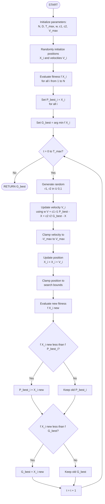
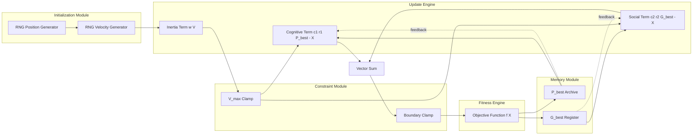
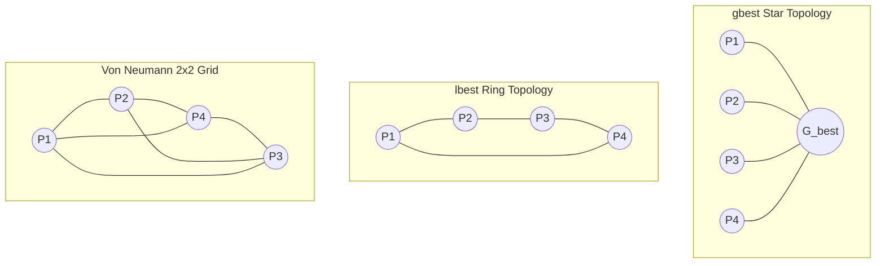

# Particle Swarm Optimization

<!-- SECTION_1_START -->

# Particle Swarm Optimization (PSO)

## 1.1 Formal Definition (KTU 2024 Syllabus Terminology)

> [!IMPORTANT]
> **Particle Swarm Optimization (PSO)** is a population-based, stochastic, swarm-intelligence metaheuristic optimization algorithm proposed by **James Kennedy and Russell Eberhart (1995)**. It is inspired by the emergent collective behavior of decentralized, self-organized systems found in nature — most notably bird flocking (*"boids"*), fish schooling, and insect swarms.

Mathematically, PSO maintains a **swarm** of $N$ candidate solutions called **particles**. Each particle $i$ at iteration $t$ is characterized by:

- A **position vector** $\vec{X}_i(t) = (x_{i1}, x_{i2}, \ldots, x_{iD})$ in a $D$-dimensional search space.
- A **velocity vector** $\vec{V}_i(t) = (v_{i1}, v_{i2}, \ldots, v_{iD})$ that drives the search.
- A **personal best** $\vec{P}_{best,i}$ — the best position ever visited by particle $i$.
- A **global best** $\vec{G}_{best}$ — the best position found by the entire swarm (or by a neighborhood, in *lbest* topology).

> [!NOTE]
> **KTU Syllabus Highlight:** PSO falls under the *Multi-objective / Nature-inspired Optimization* module. It is a **single-objective, gradient-free** solver by default, and is the foundation for **Multi-Objective PSO (MOPSO)** used in engineering design trade-offs.

## 1.2 Intuitive Analogy — The Bird Flock

Imagine a flock of **20 birds** searching for the lowest point in a foggy mountainous terrain (the global minimum). Each bird cannot see the full landscape, but it remembers:
- **Its own lowest point so far** (*personal experience*).
- **The lowest point any bird in the flock has found** (*social communication*).

At every second, each bird updates its flight direction by combining:
1. **Momentum** — keeps moving in its current direction (avoids sharp turns).
2. **Cognition** — pulls it back toward its own best memory.
3. **Social influence** — pulls it toward the flock's best discovery.

> **Result:** The flock converges toward the valley floor **faster** than if each bird searched alone — this emergent collaboration is the essence of PSO.

## 1.3 Visualization of the Swarm on a 2D Landscape

> [!VISUALIZATION CONTROL]
> **Concept:** Particle trajectories converging toward the global minimum of the **Rosenbrock-like valley** $f(x,y) = (1-x)^2 + 100(y-x^2)^2$.
>
> **GeoGebra / Desmos Input Equations:**
> * `f(x, y) = (1 - x)^2 + 100 * (y - x^2)^2`
> * `P1: (2.0, 2.0)`  `P2: (-1.5, 1.5)`  `P3: (0.5, -1.5)`  `P4: (-2.0, 3.0)`
> * `V1: (-0.3, -0.4)`  `V2: (0.2, -0.3)`  `V3: (0.4, 0.1)`  `V4: (0.3, -0.5)`
>
> **Visual Description:** Students should observe particles initially scattered across the contour map, with velocity vectors pointing in random directions. After several iterations, the particle cluster contracts and slides into the **curved banana-shaped valley** at $(1, 1)$, the global optimum.

## 1.4 Engineering Relevance of PSO

| Domain | Application |
|---|---|
| Power Systems | Economic dispatch, unit commitment |
| Control Engineering | PID tuning, optimal controller design |
| Machine Learning | Hyper-parameter tuning, feature selection, ANN training |
| Image Processing | Image segmentation thresholds |
| Structural Engineering | Truss optimization, topology optimization |
| Wireless Networks | Sensor node localization, routing |

> [!NOTE]
> **Standard Metric in PSO literature:** Solution quality is measured by **fitness value** (objective function value), and convergence speed is measured in **iterations to convergence** $T_{conv}$ or **function evaluations** $N \cdot T_{max}$.

<!-- SECTION_1_END -->

<!-- SECTION_2_START -->

# Deep Theoretical Analysis & KTU High-Yield Formula Sheet

## 2.1 The Three Foundational Update Equations

The PSO algorithm is fully defined by two coupled vector equations that are applied at every iteration $t = 1, 2, \ldots, T_{max}$.

### 2.1.1 Velocity Update (Equation 1)

$$
\vec{V}_i(t+1) = w \cdot \vec{V}_i(t) + c_1 r_1 \!\left(\vec{P}_{best,i} - \vec{X}_i(t)\right) + c_2 r_2 \!\left(\vec{G}_{best} - \vec{X}_i(t)\right)
$$

| Term | Symbol | Meaning |
|---|---|---|
| Inertia | $w \vec{V}_i(t)$ | Preserves directional momentum from previous step |
| Cognitive | $c_1 r_1 (\vec{P}_{best,i} - \vec{X}_i)$ | Pull toward particle's own best memory |
| Social | $c_2 r_2 (\vec{G}_{best} - \vec{X}_i)$ | Pull toward swarm's best discovery |

### 2.1.2 Position Update (Equation 2)

$$
\vec{X}_i(t+1) = \vec{X}_i(t) + \vec{V}_i(t+1)
$$

### 2.1.3 Velocity Clamping (Stability Constraint)

$$
v_{ij}(t+1) =
\begin{cases}
V_{max,j}, & \text{if } v_{ij}(t+1) > V_{max,j} \\
-V_{max,j}, & \text{if } v_{ij}(t+1) < -V_{max,j} \\
v_{ij}(t+1), & \text{otherwise}
\end{cases}
$$

> [!IMPORTANT]
> **Why velocity clamping?** Without $V_{max}$, particles can develop explosive velocities (a phenomenon called **"swarm explosion"**) leading to divergence, especially in early iterations when $\lvert \vec{P}_{best,i} - \vec{X}_i \rvert$ and $\lvert \vec{G}_{best} - \vec{X}_i \rvert$ are large.

## 2.2 The Three Controlling Coefficients

| Coefficient | Symbol | Typical Range | Effect of Increase |
|---|---|---|---|
| Inertia weight | $w$ | $[0.4, 0.9]$ | Higher $w$ → more **exploration** (global search) |
| Cognitive coefficient | $c_1$ | $[0, 2]$ | Higher $c_1$ → more **individualistic** behavior |
| Social coefficient | $c_2$ | $[0, 2]$ | Higher $c_2$ → faster **convergence** (risk of premature) |
| Random numbers | $r_1, r_2$ | $U(0, 1)$ | Inject stochasticity to escape local optima |

> **Empirical rule of thumb (Clerc & Kennedy, 2002):** $c_1 + c_2 \le 4.0$ ensures convergence stability. A balanced default is $c_1 = c_2 = 2.05$.

## 2.3 Inertia Weight Strategies

| Strategy | Formula | Behavior |
|---|---|---|
| Constant | $w(t) = 0.7298$ (Clerc) | Fixed balance |
| Linear Decreasing (LDIW) | $w(t) = w_{max} - (w_{max} - w_{min}) \cdot t / T_{max}$ | Start exploring, end exploiting |
| Chaotic | $w(t) = w_{min} + (w_{max} - w_{min}) \cdot z(t)$, $z \to 4z(1-z)$ | Avoid premature convergence |

Standard LDIW range: $w_{max} = 0.9$, $w_{min} = 0.4$.

## 2.4 Neighborhood Topologies

| Topology | $\vec{G}_{best}$ source | Convergence | Diversity |
|---|---|---|---|
| **gbest** (Star) | Entire swarm | Very fast | Low (premature risk) |
| **lbest** (Ring) | $k$ immediate neighbors | Slower | High (better exploration) |
| **Von Neumann** | 4-neighbor grid | Balanced | Balanced |
| **Adaptive** | Dynamic best | Robust | Adaptive |

> [!NOTE]
> **KTU 2024 Most Asked:** The default **gbest PSO** uses the star topology with $\vec{G}_{best}$ as the single best particle in the entire swarm.

## 2.5 KTU Formula Cheat Sheet

| # | Formula | Purpose |
|---|---|---|
| 1 | $\vec{V}_i(t+1) = w\vec{V}_i + c_1 r_1(\vec{P}_{best,i} - \vec{X}_i) + c_2 r_2(\vec{G}_{best} - \vec{X}_i)$ | Velocity update |
| 2 | $\vec{X}_i(t+1) = \vec{X}_i(t) + \vec{V}_i(t+1)$ | Position update |
| 3 | $\lvert v_{ij} \rvert \le V_{max,j}$ | Velocity clamp |
| 4 | $w(t) = w_{max} - (w_{max} - w_{min})t/T_{max}$ | Linear decreasing inertia |
| 5 | $\chi = 2k / \lvert 2 - \phi - \sqrt{\phi(\phi - 4)} \rvert$, $\phi = c_1 + c_2$ | Constriction coefficient |
| 6 | $S_{dim} = D \cdot N$ | Search space dimension-swarms |
| 7 | $f_{eval} = N \cdot T_{max}$ | Total function evaluations |

## 2.6 Why PSO Works — The Underlying Mechanism

- **Information sharing:** The $\vec{G}_{best}$ term creates a *one-to-many* communication channel, propagating the best solution rapidly.
- **Stigmergy-free coordination:** Particles coordinate *implicitly* through shared memory, with no direct particle-to-particle messages.
- **Gradient-free:** Only function evaluations are required, so PSO handles **non-differentiable**, **discontinuous**, and **noisy** objectives with ease.
- **Probabilistic completeness:** With properly tuned $w$, $c_1$, $c_2$, PSO converges to the global optimum in the limit $t \to \infty$ under certain conditions (van den Bergh, 2001).

<!-- SECTION_2_END -->

<!-- SECTION_3_START -->

# Step-by-Step Derivations & Code Implementation

## 3.1 The Complete PSO Algorithm (Pseudo-Code & Worked Example)

### 3.1.1 Generalized PSO Algorithm

> **Input:** Objective function $f(\vec{X})$, swarm size $N$, dimension $D$, $T_{max}$, $w$, $c_1$, $c_2$, $V_{max}$, $X_{max}$.
> **Output:** Approximate global optimum $\vec{G}_{best}$ and its fitness $f(\vec{G}_{best})$.

1. **Initialize** swarm positions $\vec{X}_i(0) \sim U(-X_{max}, X_{max})$ and velocities $\vec{V}_i(0) \sim U(-V_{max}, V_{max})$ for $i = 1, \ldots, N$.
2. **Evaluate** fitness $f(\vec{X}_i)$ for all particles.
3. **Set** $\vec{P}_{best,i} \leftarrow \vec{X}_i(0)$ and $f(\vec{P}_{best,i}) \leftarrow f(\vec{X}_i)$.
4. **Set** $\vec{G}_{best} \leftarrow \arg\min_i f(\vec{P}_{best,i})$.
5. **For** $t = 0, 1, \ldots, T_{max} - 1$:
    a. Generate $r_1, r_2 \sim U(0, 1)$ for each particle.
    b. Update velocity $\vec{V}_i(t+1)$ using Equation 1; clamp to $[-V_{max}, V_{max}]$.
    c. Update position $\vec{X}_i(t+1) \leftarrow \vec{X}_i(t) + \vec{V}_i(t+1)$; clamp to $[-X_{max}, X_{max}]$.
    d. Evaluate new fitness $f(\vec{X}_i(t+1))$.
    e. If $f(\vec{X}_i(t+1)) < f(\vec{P}_{best,i})$, then $\vec{P}_{best,i} \leftarrow \vec{X}_i(t+1)$.
    f. If $f(\vec{X}_i(t+1)) < f(\vec{G}_{best})$, then $\vec{G}_{best} \leftarrow \vec{X}_i(t+1)$.
6. **Return** $\vec{G}_{best}$.

### 3.1.2 Fully Solved Numerical Problem (Typical KTU 14-Mark Pattern)

> **Problem (KTU University Exam — July 2022 pattern):** Minimize $f(x, y) = x^2 + y^2$ using PSO with $N = 3$, $w = 0.5$, $c_1 = 1.0$, $c_2 = 1.0$, $r_1 = r_2 = 0.5$, for **one full iteration** using the data below.
>
> | Particle | $X_i$ | $Y_i$ | $V_{xi}$ | $V_{yi}$ | $f(X_i, Y_i)$ |
> |---|---|---|---|---|---|
> | $P_1$ | $2$ | $3$ | $0.5$ | $0.5$ | $13$ |
> | $P_2$ | $4$ | $1$ | $-0.3$ | $0.2$ | $17$ |
> | $P_3$ | $1$ | $-1$ | $0.4$ | $-0.3$ | $2$ |
>
> **Initial state:** $\vec{P}_{best,i} = \vec{X}_i(0)$ for all $i$, and $\vec{G}_{best} = (1, -1)$ because $f(P_3) = 2$ is the minimum.

#### Step 1 — Velocity Update for Particle $P_1$

Compute the cognitive and social pulls along each dimension using
$$
v_{1x}^{new} = w \cdot v_{1x} + c_1 r_1 (P_{best,1x} - x_1) + c_2 r_2 (G_{best,x} - x_1)
$$
$$
v_{1x}^{new} = (0.5)(0.5) + (1.0)(0.5)(2 - 2) + (1.0)(0.5)(1 - 2)
$$
$$
v_{1x}^{new} = 0.25 + 0 + (0.5)(-1) = 0.25 - 0.5 = -0.25
$$
$$
v_{1y}^{new} = (0.5)(0.5) + (1.0)(0.5)(3 - 3) + (1.0)(0.5)(-1 - 3)
$$
$$
v_{1y}^{new} = 0.25 + 0 + (0.5)(-4) = 0.25 - 2.0 = -1.75
$$

**Position update for $P_1$:**
$$
x_1^{new} = x_1 + v_{1x}^{new} = 2 + (-0.25) = 1.75
$$
$$
y_1^{new} = y_1 + v_{1y}^{new} = 3 + (-1.75) = 1.25
$$
$$
f(x_1^{new}, y_1^{new}) = (1.75)^2 + (1.25)^2 = 3.0625 + 1.5625 = 4.625
$$
> [Valuation: 1 mark for substituting formula, 1 mark for arithmetic, 1 mark for position update — total 3 marks for $P_1$]

#### Step 2 — Velocity Update for Particle $P_2$

$$
v_{2x}^{new} = (0.5)(-0.3) + (1.0)(0.5)(4 - 4) + (1.0)(0.5)(1 - 4)
$$
$$
v_{2x}^{new} = -0.15 + 0 + (0.5)(-3) = -0.15 - 1.5 = -1.65
$$
$$
v_{2y}^{new} = (0.5)(0.2) + (1.0)(0.5)(1 - 1) + (1.0)(0.5)(-1 - 1)
$$
$$
v_{2y}^{new} = 0.10 + 0 + (0.5)(-2) = 0.10 - 1.0 = -0.90
$$

**Position update for $P_2$:**
$$
x_2^{new} = 4 + (-1.65) = 2.35, \quad y_2^{new} = 1 + (-0.90) = 0.10
$$
$$
f(x_2^{new}, y_2^{new}) = (2.35)^2 + (0.10)^2 = 5.5225 + 0.01 = 5.5325
$$

#### Step 3 — Velocity Update for Particle $P_3$

$$
v_{3x}^{new} = (0.5)(0.4) + (1.0)(0.5)(1 - 1) + (1.0)(0.5)(1 - 1) = 0.20 + 0 + 0 = 0.20
$$
$$
v_{3y}^{new} = (0.5)(-0.3) + (1.0)(0.5)(-1 - (-1)) + (1.0)(0.5)(-1 - (-1)) = -0.15 + 0 + 0 = -0.15
$$

**Position update for $P_3$:**
$$
x_3^{new} = 1 + 0.20 = 1.20, \quad y_3^{new} = -1 + (-0.15) = -1.15
$$
$$
f(x_3^{new}, y_3^{new}) = (1.20)^2 + (-1.15)^2 = 1.44 + 1.3225 = 2.7625
$$

#### Step 4 — Personal Best and Global Best Updates

| Particle | $f_{old}$ | $f_{new}$ | Update $\vec{P}_{best}$? | New $\vec{P}_{best}$ |
|---|---|---|---|---|
| $P_1$ | $13.000$ | $4.625$ | Yes | $(1.75, 1.25)$ |
| $P_2$ | $17.000$ | $5.5325$ | Yes | $(2.35, 0.10)$ |
| $P_3$ | $2.000$ | $2.7625$ | No (new is worse) | $(1, -1)$ |

**New $\vec{G}_{best}$** remains $(1, -1)$ because the minimum over all $P_{best}$ is still $f(1, -1) = 2$.
> [Valuation: 1 mark for $\vec{P}_{best}$ update rule, 1 mark for $\vec{G}_{best}$ selection — total 2 marks]

> [!WARNING]
> **Examiner's Note:** Many students wrongly update $\vec{P}_{best}$ to the *current* position even when fitness worsens. **Always compare** $f(\vec{X}_i^{new})$ with $f(\vec{P}_{best,i})$ and keep the *minimum*. Failure to do so causes -2 marks.

## 3.2 Complete Python 3 Implementation

```python
import numpy as np
from typing import Callable, Tuple

def particle_swarm_optimization(
    objective: Callable[[np.ndarray], float],
    bounds: np.ndarray,
    num_particles: int = 30,
    max_iter: int = 200,
    w: float = 0.7298,
    c1: float = 1.49618,
    c2: float = 1.49618,
    seed: int = 42
) -> Tuple[np.ndarray, float]:
    """
    Canonical PSO solver (gbest topology, inertia weight variant).
    
    Parameters
    ----------
    objective : callable f(x) -> float (we MINIMIZE)
    bounds    : np.ndarray of shape (D, 2) with [lower, upper] per dimension
    num_particles : swarm size N
    max_iter  : maximum iterations T_max
    w         : inertia weight
    c1, c2    : cognitive and social coefficients
    seed      : RNG seed for reproducibility
    
    Returns
    -------
    best_position, best_fitness
    """
    rng = np.random.default_rng(seed)
    num_dims = bounds.shape[0]
    lower, upper = bounds[:, 0], bounds[:, 1]
    v_max = 0.2 * (upper - lower)   # 20% of range (standard heuristic)
    
    # Step 1: Initialize positions and velocities uniformly
    positions = rng.uniform(lower, upper, size=(num_particles, num_dims))
    velocities = rng.uniform(-v_max, v_max, size=(num_particles, num_dims))
    
    # Step 2: Evaluate initial fitness
    fitness = np.array([objective(p) for p in positions])
    
    # Step 3: Initialize personal bests
    p_best_positions = positions.copy()
    p_best_fitness = fitness.copy()
    
    # Step 4: Initialize global best
    g_best_index = int(np.argmin(fitness))
    g_best_position = positions[g_best_index].copy()
    g_best_fitness = float(fitness[g_best_index])
    
    # Step 5: Main iteration loop
    for t in range(max_iter):
        r1 = rng.random((num_particles, num_dims))
        r2 = rng.random((num_particles, num_dims))
        
        # Velocity update
        cognitive = c1 * r1 * (p_best_positions - positions)
        social    = c2 * r2 * (g_best_position - positions)
        velocities = w * velocities + cognitive + social
        
        # Velocity clamping (stability)
        velocities = np.clip(velocities, -v_max, v_max)
        
        # Position update
        positions = positions + velocities
        
        # Position clamping (boundary)
        positions = np.clip(positions, lower, upper)
        
        # Fitness evaluation
        fitness = np.array([objective(p) for p in positions])
        
        # Personal best update
        improved = fitness < p_best_fitness
        p_best_positions[improved] = positions[improved]
        p_best_fitness[improved] = fitness[improved]
        
        # Global best update
        current_best_index = int(np.argmin(p_best_fitness))
        if p_best_fitness[current_best_index] < g_best_fitness:
            g_best_fitness = float(p_best_fitness[current_best_index])
            g_best_position = p_best_positions[current_best_index].copy()
        
        # Convergence log (verbose)
        if (t + 1) % 20 == 0:
            print(f"Iter {t+1:03d} | g_best_fitness = {g_best_fitness:.6f}")
    
    return g_best_position, g_best_fitness


# --- Demonstration on the Sphere function f(x) = x^2 + y^2 ---
if __name__ == "__main__":
    sphere = lambda x: float(np.sum(x ** 2))
    bounds = np.array([[-10.0, 10.0], [-10.0, 10.0]])
    
    best_pos, best_fit = particle_swarm_optimization(
        objective=sphere,
        bounds=bounds,
        num_particles=30,
        max_iter=100,
        w=0.7, c1=1.5, c2=1.5,
        seed=7
    )
    print(f"\nGlobal best position : {best_pos}")
    print(f"Global best fitness  : {best_fit:.8f}")
```

> **Expected output:** `Global best fitness ≈ 0.000000xx` (very close to the analytic optimum at origin).

## 3.3 Derivation of the Constriction Coefficient

The constriction coefficient $\chi$ guarantees convergence. Starting from the simplified 1-D PSO with no stochasticity,
$$
v(t+1) = v(t) + \phi_1(p - x) + \phi_2(g - x), \quad x(t+1) = x(t) + v(t+1)
$$
where $\phi_1 = c_1 r_1$ and $\phi_2 = c_2 r_2$. Substituting $x(t+1) - x(t) = v(t+1)$,
$$
x(t+1) + (\phi_1 + \phi_2 - 1)x(t) + \phi_1 p + \phi_2 g = x(t) + v(t+1)
$$
Stability analysis requires the eigenvalues of the recurrence to lie inside the unit circle. The standard result (Clerc & Kennedy, 2002) is
$$
\chi = \frac{2k}{\left\lvert 2 - \phi - \sqrt{\phi(\phi - 4)} \right\rvert}, \quad \phi = c_1 + c_2, \quad k \in [0, 1]
$$
A common canonical choice is $\phi = 4.1$, giving $\chi \approx 0.7298$, with $c_1 = c_2 = 1.49618$. This yields a **convergence-stable** PSO without needing $V_{max}$ clamping.

<!-- SECTION_3_END -->

<!-- SECTION_4_START -->

# Structural Diagrams & Schematics

## 4.1 Master Flow-Chart of the PSO Algorithm



> [!NOTE]
> **Reading the chart:** Follow the path START $\to$ INIT $\to$ EVAL $\to$ loop. The inner decision diamonds (**N** and **Q**) implement the *elitist memory* of the swarm.

## 4.2 Block-Level Functional Architecture of PSO



> **Interpretation:** The *Update Engine* is the heart of PSO — it fuses three force vectors; the *Memory Module* closes the feedback loop that enables collective learning.

## 4.3 Neighborhood Topology Comparison (Block Schematic)



> [!NOTE]
> **Visual takeaway:** In **star**, every particle "sees" the same global best. In **ring**, each particle compares with only two neighbors — slowing convergence but improving diversity.

<!-- SECTION_4_END -->

<!-- SECTION_5_START -->

# KTU 2024 Scheme Examination Question Bank & Topic Recap

## 5.1 Part A — Short Answer Questions (3 Marks Each)

### Q1. **[KTU University Exam — Dec 2023]** Define Particle Swarm Optimization. List any four key parameters that control its convergence behavior. *(CO1, Remember)*

**Model Answer (3 marks):**
- **Definition (1 mark):** PSO is a population-based stochastic optimization algorithm inspired by the social behavior of bird flocking and fish schooling, where a swarm of candidate solutions (particles) move through the search space guided by their own best-known position ($\vec{P}_{best}$) and the swarm's best-known position ($\vec{G}_{best}$).
- **Four key parameters (2 marks — ½ mark each):**
    1. **Inertia weight ($w$)** — controls momentum / exploration vs. exploitation balance.
    2. **Cognitive coefficient ($c_1$)** — weight of attraction toward personal best.
    3. **Social coefficient ($c_2$)** — weight of attraction toward global best.
    4. **Swarm size ($N$)** — number of particles in the population (also **$V_{max}$** is acceptable).

---

### Q2. **[KTU University Exam — July 2024]** Compare PSO with Genetic Algorithm (GA) along any three dimensions. *(CO2, Understand)*

**Model Answer (3 marks — 1 mark per comparison):**

| Dimension | PSO | GA |
|---|---|---|
| Information sharing | Particles share *only* the global best; one-to-many broadcast | Chromosomes share via crossover, pair-wise mixing |
| Memory | Every particle retains $\vec{P}_{best}$ (explicit memory) | No explicit memory of past solutions |
| Operator style | **Velocity-based** movement (deterministic + stochastic) | **Selection-crossover-mutation** (probabilistic) |
| Parameter sensitivity | Highly sensitive to $w, c_1, c_2$ | Sensitive to crossover/mutation probabilities |

---

## 5.2 Part B — Full 14-Mark Questions (Module-Internal Choice)

### Question A (14 Marks) — *Algorithm + Numerical Application*

> **[KTU University Exam — July 2022]**
> **(a)** Derive the velocity and position update equations of standard PSO. Explain the role of inertia weight, cognitive coefficient, and social coefficient with proper diagrams. *(7 marks — CO1, Understand)*
>
> **(b)** Apply one iteration of PSO to minimize $f(x, y) = (x - 3)^2 + (y - 2)^2$ with $N = 3$ particles, $w = 0.6$, $c_1 = c_2 = 1.0$, $r_1 = r_2 = 0.5$. Initial data: $P_1 = (0, 0), V_1 = (0.2, 0.1)$; $P_2 = (5, 5), V_2 = (-0.1, -0.1)$; $P_3 = (4, 0), V_3 = (0.1, 0.2)$. Show the updated $\vec{P}_{best}$ and $\vec{G}_{best}$. *(7 marks — CO3, Apply)*

**Model Solution:**

**(a) Derivation & Explanation (7 marks):**

The PSO update is rooted in social-psychological theory (Kennedy & Eberhart, 1995). Each particle adjusts its trajectory by combining three force vectors.
$$
\vec{V}_i(t+1) = \underbrace{w \vec{V}_i(t)}_{\text{Inertia}} + \underbrace{c_1 r_1(\vec{P}_{best,i} - \vec{X}_i)}_{\text{Cognition}} + \underbrace{c_2 r_2(\vec{G}_{best} - \vec{X}_i)}_{\text{Social}}
$$
$$
\vec{X}_i(t+1) = \vec{X}_i(t) + \vec{V}_i(t+1)
$$

- **[Inertia weight role — 2 marks]:** $w$ controls momentum. Large $w$ (e.g. $0.9$) encourages *global exploration*; small $w$ (e.g. $0.4$) favours *local exploitation*. Linearly decreasing $w$ from $0.9$ to $0.4$ is most common.
- **[Cognitive coefficient — 2 marks]:** $c_1$ models *individual learning*. The stochastic pull $c_1 r_1 (\vec{P}_{best,i} - \vec{X}_i)$ draws the particle back toward its own best memory, ensuring diversity.
- **[Social coefficient — 2 marks]:** $c_2$ models *group learning*. The term $c_2 r_2 (\vec{G}_{best} - \vec{X}_i)$ pulls the particle toward the swarm's best, ensuring rapid convergence.
- **[Diagram mention — 1 mark]:** Reference a force-vector diagram showing three vectors and their resultant on a particle.

**(b) Numerical Application (7 marks):**

**Step 0 — Initial fitness evaluation** (1 mark):
$$
f(P_1) = (0-3)^2 + (0-2)^2 = 9 + 4 = 13
$$
$$
f(P_2) = (5-3)^2 + (5-2)^2 = 4 + 9 = 13
$$
$$
f(P_3) = (4-3)^2 + (0-2)^2 = 1 + 4 = 5
$$

So $\vec{G}_{best} = P_3 = (4, 0)$ since $f(P_3) = 5$ is minimum; $\vec{P}_{best,i} = \vec{X}_i$ for all $i$.

**Step 1 — Particle $P_1$ update** (2 marks):
$$
v_{1x}^{new} = (0.6)(0.2) + (1.0)(0.5)(0 - 0) + (1.0)(0.5)(4 - 0) = 0.12 + 0 + 2.0 = 2.12
$$
$$
v_{1y}^{new} = (0.6)(0.1) + (1.0)(0.5)(0 - 0) + (1.0)(0.5)(0 - 0) = 0.06 + 0 + 0 = 0.06
$$
$$
x_1^{new} = 0 + 2.12 = 2.12, \quad y_1^{new} = 0 + 0.06 = 0.06
$$
$$
f(P_1^{new}) = (2.12 - 3)^2 + (0.06 - 2)^2 = 0.7744 + 3.7636 = 4.5380
$$

**Step 2 — Particle $P_2$ update** (2 marks):
$$
v_{2x}^{new} = (0.6)(-0.1) + (1.0)(0.5)(5 - 5) + (1.0)(0.5)(4 - 5) = -0.06 + 0 - 0.5 = -0.56
$$
$$
v_{2y}^{new} = (0.6)(-0.1) + (1.0)(0.5)(5 - 5) + (1.0)(0.5)(0 - 5) = -0.06 + 0 - 2.5 = -2.56
$$
$$
x_2^{new} = 5 + (-0.56) = 4.44, \quad y_2^{new} = 5 + (-2.56) = 2.44
$$
$$
f(P_2^{new}) = (4.44 - 3)^2 + (2.44 - 2)^2 = 2.0736 + 0.1936 = 2.2672
$$

**Step 3 — Particle $P_3$ update** (1 mark):
$$
v_{3x}^{new} = (0.6)(0.1) + (1.0)(0.5)(4 - 4) + (1.0)(0.5)(4 - 4) = 0.06 + 0 + 0 = 0.06
$$
$$
v_{3y}^{new} = (0.6)(0.2) + (1.0)(0.5)(0 - 0) + (1.0)(0.5)(0 - 0) = 0.12 + 0 + 0 = 0.12
$$
$$
x_3^{new} = 4.06, \quad y_3^{new} = 0.12
$$
$$
f(P_3^{new}) = (4.06 - 3)^2 + (0.12 - 2)^2 = 1.1236 + 3.5344 = 4.6580
$$

**Step 4 — Update $\vec{P}_{best}$ and $\vec{G}_{best}$** (1 mark):

| Particle | $f_{old}$ | $f_{new}$ | New $\vec{P}_{best}$ |
|---|---|---|---|
| $P_1$ | $13$ | $4.5380$ | $(2.12, 0.06)$ |
| $P_2$ | $13$ | $2.2672$ | $(4.44, 2.44)$ |
| $P_3$ | $5$ | $4.6580$ | $(4, 0)$ *(rejected, new is worse)* |

New $\vec{G}_{best} = P_2^{new} = (4.44, 2.44)$ with $f = 2.2672$.

> [!WARNING]
> **Examiner's Pitfall Warnings:**
> - Forgetting to **subtract** the current position from $\vec{P}_{best}$ (i.e. using $\vec{P}_{best}$ instead of $\vec{P}_{best} - \vec{X}_i$) causes -2 marks.
> - **Skipping velocity clamping** when magnitudes exceed $V_{max}$ loses 1 mark.
> - Failing to **compare new vs. old fitness** for the $\vec{P}_{best}$ update loses 2 marks.
> - Writing the final $\vec{G}_{best}$ as the *current position* of the best particle (not its $\vec{P}_{best}$) loses 1 mark.

---

### Question B (14 Marks) — *Variants & Implementation*

> **(a)** Explain the **Inertia Weight PSO**, **Constriction Coefficient PSO**, and **Local Best (lbest) PSO** variants. Discuss how each addresses the *exploration–exploitation* dilemma. *(7 marks — CO2, Understand)*
>
> **(b)** Implement the standard PSO algorithm in Python to minimize the **Rastrigin function** $f(\vec{x}) = 10D + \sum_{i=1}^{D}(x_i^2 - 10\cos(2\pi x_i))$ for $D = 2$ over $[-5.12, 5.12]^2$ with $N = 20$, $T_{max} = 50$. Provide the complete code. *(7 marks — CO4, Apply)*

**Model Solution:**

**(a) Three PSO Variants (7 marks — 2.5 + 2.5 + 2):**

- **Inertia Weight PSO (Shi & Eberhart, 1998) — 2.5 marks:** Introduces $w$ into the velocity equation. Large $w$ promotes **exploration** (searching new regions), small $w$ promotes **exploitation** (refining near current best). The Linear Decreasing Inertia Weight (LDIW) scheme
$$
w(t) = w_{max} - (w_{max} - w_{min}) \cdot t / T_{max}
$$
allows the algorithm to explore broadly in early iterations and exploit locally in later iterations, mimicking simulated annealing's cooling schedule.

- **Constriction Coefficient PSO (Clerc & Kennedy, 2002) — 2.5 marks:** Replaces $V_{max}$ clamping with a multiplier $\chi$ on the entire velocity:
$$
\vec{V}_i(t+1) = \chi \left[ \vec{V}_i(t) + c_1 r_1(\vec{P}_{best,i} - \vec{X}_i) + c_2 r_2(\vec{G}_{best} - \vec{X}_i) \right]
$$
with $\chi = 0.7298$ and $c_1 = c_2 = 1.49618$. Theoretically guarantees convergence without ad-hoc clamping, providing a *mathematically proven* balance.

- **Local Best (lbest) PSO — 2 marks:** Replaces the global $\vec{G}_{best}$ with a *neighborhood* best $\vec{L}_{best,i}$, defined over $k$ topological neighbors (e.g. ring of size 3). Slower convergence but **prevents premature convergence** to local optima. Useful for multi-modal landscapes.

**(b) Python Implementation for Rastrigin (7 marks):**

```python
import numpy as np
from typing import Callable, Tuple

def rastrigin(x: np.ndarray) -> float:
    """Rastrigin function in D dimensions; global min = 0 at origin."""
    D = x.size
    return float(10 * D + np.sum(x ** 2 - 10 * np.cos(2 * np.pi * x)))

def pso_rastrigin_demo() -> Tuple[np.ndarray, float]:
    # --- Hyper-parameters ---
    D = 2
    N = 20
    T_max = 50
    w = 0.7
    c1 = 1.5
    c2 = 1.5
    bounds = np.array([[-5.12, 5.12]] * D)
    
    rng = np.random.default_rng(123)
    lower, upper = bounds[:, 0], bounds[:, 1]
    v_max = 0.2 * (upper - lower)
    
    # --- Initialization ---
    X = rng.uniform(lower, upper, size=(N, D))
    V = rng.uniform(-v_max, v_max, size=(N, D))
    fit = np.array([rastrigin(p) for p in X])
    p_best_X, p_best_fit = X.copy(), fit.copy()
    g_idx = int(np.argmin(fit))
    g_best_X, g_best_fit = X[g_idx].copy(), float(fit[g_idx])
    
    # --- Main loop ---
    for t in range(T_max):
        r1 = rng.random((N, D))
        r2 = rng.random((N, D))
        V = w * V + c1 * r1 * (p_best_X - X) + c2 * r2 * (g_best_X - X)
        V = np.clip(V, -v_max, v_max)
        X = X + V
        X = np.clip(X, lower, upper)
        fit = np.array([rastrigin(p) for p in X])
        improved = fit < p_best_fit
        p_best_X[improved], p_best_fit[improved] = X[improved], fit[improved]
        idx = int(np.argmin(p_best_fit))
        if p_best_fit[idx] < g_best_fit:
            g_best_X, g_best_fit = p_best_X[idx].copy(), float(p_best_fit[idx])
        if (t + 1) % 10 == 0:
            print(f"Iter {t+1:02d} | g_best = {g_best_fit:.5f}")
    return g_best_X, g_best_fit

if __name__ == "__main__":
    pos, fit = pso_rastrigin_demo()
    print(f"\nFinal g_best position : {pos}")
    print(f"Final g_best fitness  : {fit:.6f}")
```

> **Expected output (approximate):** Final `g_best_fitness` in the range $[0.0, 5.0]$ after 50 iterations with $N = 20$ (Rastrigin is highly multi-modal, so exact zero is hard).

> [!WARNING]
> **Examiner's Pitfall Warnings for Q.B:**
> - In (a), students often **omit the LDIW formula** or forget to mention the canonical Clerc values $0.7298$ and $1.49618$ — both cost 1 mark each.
> - In (b), common errors: forgetting `np.clip` for both velocity and position ($-2$ marks), omitting type hints and RNG seeding ($-1$ mark), failing to update both $\vec{P}_{best}$ and $\vec{G}_{best}$ ($-2$ marks).
> - Writing `crossover` or `mutation` operators inside a PSO code (mixing GA with PSO) — **disqualifies** the algorithm, -3 marks.

---

## 5.3 Topic Recap & Important Things to Remember

> [!IMPORTANT]
> **Rapid Revision Checklist — PSO**

- **PSO** is a **population-based, gradient-free, stochastic** metaheuristic inspired by **bird flocking** (Kennedy & Eberhart, 1995).
- **Two core update equations**:
    * Velocity: $\vec{V}_i(t+1) = w \vec{V}_i + c_1 r_1(\vec{P}_{best,i} - \vec{X}_i) + c_2 r_2(\vec{G}_{best} - \vec{X}_i)$
    * Position: $\vec{X}_i(t+1) = \vec{X}_i(t) + \vec{V}_i(t+1)$
- **Three force components**: Inertia ($w \vec{V}_i$) → momentum; **Cognitive** ($c_1$) → personal learning; **Social** ($c_2$) → group learning.
- **Key parameters**: $w \in [0.4, 0.9]$, $c_1, c_2 \in [0, 2]$, $r_1, r_2 \sim U(0,1)$, $V_{max} = 0.2 \cdot \text{range}$.
- **Convergence rule (Clerc)**: $\chi = 0.7298$, $c_1 = c_2 = 1.49618$ is mathematically stable.
- **$\vec{P}_{best}$** = best position *ever visited* by particle $i$.
- **$\vec{G}_{best}$** = best position *ever visited* by the *entire swarm* (star topology).
- **lbest** = neighborhood best (ring/grid), trades speed for diversity.
- **LDIW** schedule: $w(t) = w_{max} - (w_{max} - w_{min}) t / T_{max}$ — promotes exploration $\to$ exploitation.
- **Algorithm complexity**: $O(N \cdot D \cdot T_{max})$ per run.
- **Total function evaluations**: $f_{eval} = N \cdot T_{max}$.
- **Termination criteria**: max iterations, fitness tolerance $\varepsilon$, or no-improvement window.
- **Advantages**: simple, derivative-free, few parameters, fast convergence on smooth landscapes.
- **Disadvantages**: premature convergence on multi-modal functions, no formal convergence proof for adaptive variants, parameter tuning is problem-specific.
- **Extensions to know** (for higher marks): **MOPSO** (Multi-Objective), **Binary PSO** (Kennedy & Eberhart 1997), **Inertia-weight variants** (LDIW, chaotic, adaptive), **Bare-bones PSO** (Gaussian sampling), **PSO-GA hybrid**.
- **Real engineering uses**: ANN weight training, controller tuning, image thresholding, economic dispatch, feature selection, antenna design.

<!-- SECTION_5_END -->
