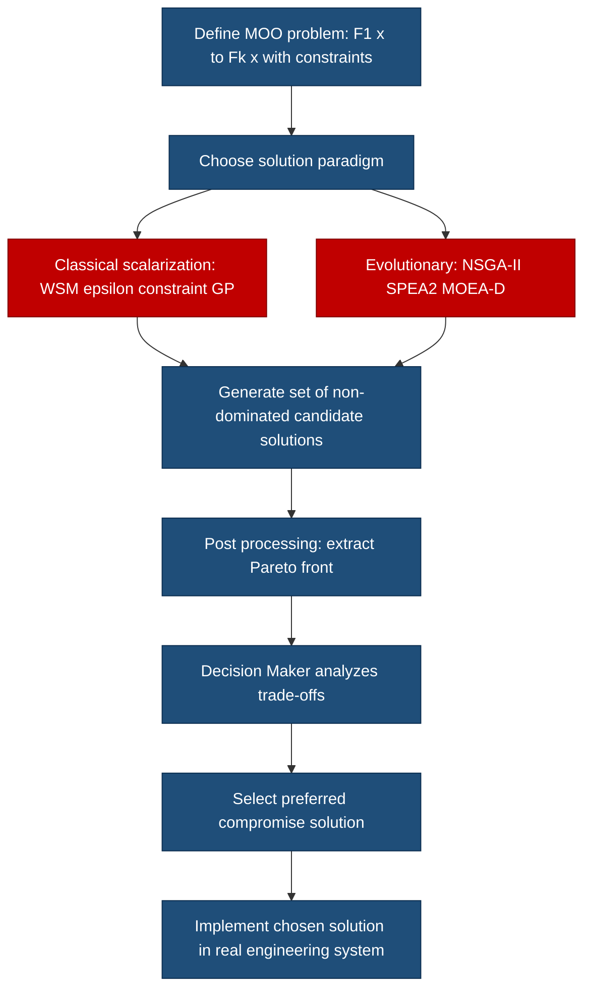
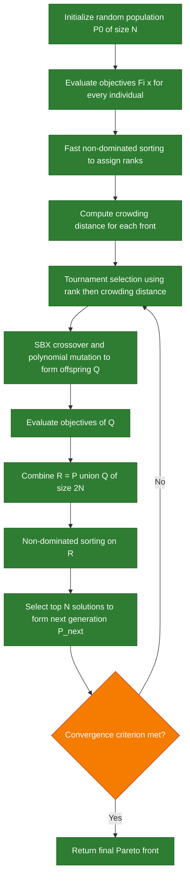
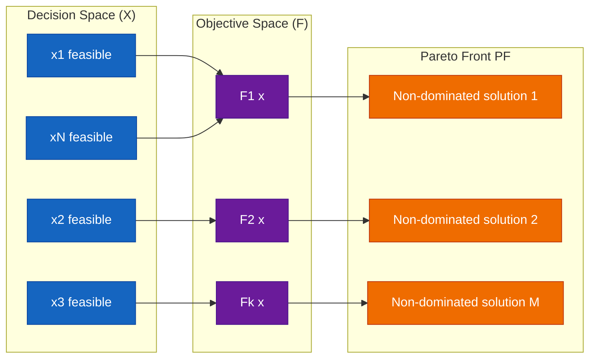

# Principles of Multi- objective optimization

<!-- SECTION_1_START -->

# Module 4 — Principles of Multi-Objective Optimization

## 1. Core Technical Definition & Intuitive Overview

### 1.1 Formal Definition (KTU 2024 Syllabus Terminology)

A **Multi-Objective Optimization Problem (MOOP)** is a class of mathematical optimization problems that involves simultaneously optimizing two or more **conflicting objective functions** subject to a set of equality and inequality constraints.

Formally, a general MOO problem is stated as:

$$
\begin{aligned}
\text{Minimize} \quad & \mathbf{F}(\mathbf{x}) = \bigl[F_1(\mathbf{x}),\, F_2(\mathbf{x}),\, \dots,\, F_k(\mathbf{x})\bigr] \\
\text{Subject to} \quad & g_j(\mathbf{x}) \leq 0,\;\; j = 1, 2, \dots, m \\
& h_l(\mathbf{x}) = 0,\;\; l = 1, 2, \dots, p \\
& x_i^{(L)} \leq x_i \leq x_i^{(U)},\;\; i = 1, 2, \dots, n
\end{aligned}
$$

Where:
- $\mathbf{x} = (x_1, x_2, \dots, x_n) \in \mathbb{R}^n$ is the **decision variable vector**.
- $\mathbf{F}(\mathbf{x})$ is the **objective vector** containing $k \geq 2$ objective functions.
- $g_j(\mathbf{x})$ and $h_l(\mathbf{x})$ are the **inequality and equality constraints** respectively.
- $x_i^{(L)}$ and $x_i^{(U)}$ are the **lower and upper bounds** of each decision variable.

> [!IMPORTANT]
> **KTU 2024 Highlight:** The presence of $k \geq 2$ *conflicting* objectives is what distinguishes a MOO problem from a single-objective optimization problem. If the objectives are non-conflicting, the problem degenerates into a standard single-objective case.

### 1.2 Conceptual Analogy / Intuitive Overview

> [!NOTE]
> **Plain-English Intuition — The "Smartphone Buying" Analogy**
>
> Imagine you are choosing a smartphone. You care about **(1) low cost**, **(2) long battery life**, and **(3) high camera quality**. These three goals **conflict** — flagship phones with the best cameras cost the most, and budget phones have weak batteries. There is **no single "best" phone**; instead, there exists a set of "trade-off" phones (a *Pareto front*) where no other phone beats them on all three criteria at once. Multi-objective optimization is the formal mathematical machinery that finds exactly this trade-off set.

The key philosophical shift from single to multi-objective optimization is this:

| Aspect | Single-Objective | Multi-Objective |
|---|---|---|
| Number of objectives | Exactly 1 | $k \geq 2$ (conflicting) |
| Solution | One optimal point | A *set* of trade-off points |
| Optimality notion | Global minimum | **Pareto Optimality** |
| Decision-making | Automatic | Requires a **Decision Maker (DM)** |

### 1.3 Why Multi-Objective Optimization Matters in Engineering

In real engineering design, *almost every* problem is intrinsically multi-objective:

- **VLSI Circuit Design:** minimize delay $\wedge$ minimize power $\wedge$ minimize area.
- **Structural Engineering:** minimize weight $\wedge$ maximize strength $\wedge$ minimize cost.
- **Machine Learning (hyperparameter tuning):** maximize accuracy $\wedge$ minimize model size $\wedge$ minimize inference time.
- **Supply Chain / Logistics:** minimize cost $\wedge$ minimize delivery time $\wedge$ maximize service level.
- **Control Systems:** minimize tracking error $\wedge$ minimize control energy.

> [!TIP]
> A KTU 2024 examiner loves to see candidates recognize **why** objectives conflict. Memorize at least two engineering examples — they appear frequently in **Part A (3 marks)** and as a prelude to **Part B (14 marks)** problems.

### 1.4 Geometric Intuition — The Pareto Front

> [!VISUALIZATION CONTROL]
> **Concept:** 2-Objective Pareto Front (Convex vs Non-Convex)
>
> **GeoGebra / Desmos Input Equations (Paste these directly into https://www.desmos.com/calculator):**
>
> * $f_1(x) = x$   *(Objective 1, to be minimized)*
> * $f_2(x) = 1 - x$   *(Objective 2, to be minimized — conflicting with $f_1$)*
> * Point A: $(0.2, 0.8)$ — *dominated*
> * Point B: $(0.5, 0.5)$ — *Pareto optimal*
> * Point C: $(0.8, 0.2)$ — *Pareto optimal*
> * Point D: $(0.35, 0.35)$ — *dominated by B*
>
> **Visual Description:** Plot $f_2$ vs $f_1$ on the axes. The locus of points B and C traces the **Pareto front** — a downward-sloping line segment. Any point **below and to the right** of this front (like A or D) is *dominated* by a Pareto-optimal point. Students should observe that the front itself represents the set of *equally valid, non-comparable* optimal trade-offs.

---

<!-- SECTION_1_END -->

<!-- SECTION_2_START -->

# 2. Deep Theoretical Analysis & KTU High-Yield Formula Sheet

## 2.1 Pareto Dominance — The Heart of MOO

The concept that powers the entire field is **Pareto Dominance**, introduced by economist **Vilfredo Pareto (1906)**.

### 2.1.1 Formal Definition of Dominance

Consider two feasible decision vectors $\mathbf{x}^{(1)}$ and $\mathbf{x}^{(2)}$ with objective vectors $\mathbf{F}(\mathbf{x}^{(1)})$ and $\mathbf{F}(\mathbf{x}^{(2)})$.

> **$\mathbf{x}^{(1)}$ Pareto-Dominates $\mathbf{x}^{(2)}$** (written $\mathbf{x}^{(1)} \prec \mathbf{x}^{(2)}$) if and only if:
> 1. $\mathbf{x}^{(1)}$ is **no worse** than $\mathbf{x}^{(2)}$ in **all** objectives, AND
> 2. $\mathbf{x}^{(1)}$ is **strictly better** than $\mathbf{x}^{(2)}$ in **at least one** objective.

Mathematically (for minimization):

$$
\mathbf{x}^{(1)} \prec \mathbf{x}^{(2)} \iff
\begin{cases}
F_i(\mathbf{x}^{(1)}) \leq F_i(\mathbf{x}^{(2)}) & \forall\, i \in \{1, 2, \dots, k\} \\[2pt]
F_j(\mathbf{x}^{(1)}) < F_j(\mathbf{x}^{(2)}) & \exists\, j \in \{1, 2, \dots, k\}
\end{cases}
$$

### 2.1.2 Variants of Dominance

| Dominance Type | Condition (minimization) | Intuition |
|---|---|---|
| **Strict Dominance** | $F_i(\mathbf{x}^{(1)}) < F_i(\mathbf{x}^{(2)})\;\; \forall i$ | A is *strictly* better in **every** objective |
| **Weak Dominance** | $F_i(\mathbf{x}^{(1)}) \leq F_i(\mathbf{x}^{(2)})\;\; \forall i$ and strictly better in at least one | Standard Pareto dominance |
| **Non-Dominance** | Neither A dominates B nor B dominates A | Incomparable — both on the Pareto front |
| **Incomparability** | $A$ better in $F_1$, $B$ better in $F_2$ | Classic trade-off scenario |

### 2.2 Pareto Optimality

> [!IMPORTANT]
> **Definition (Pareto Optimal / Non-Dominated Solution):** A feasible solution $\mathbf{x}^{\star}$ is called **Pareto optimal** (or **non-dominated**) if there exists **no** other feasible solution $\mathbf{x}$ that dominates it.

**Pareto Optimal Set** $\mathcal{P}^{\star}$:

$$
\mathcal{P}^{\star} = \bigl\{\, \mathbf{x} \in \Omega \;\big|\; \nexists\, \mathbf{x}' \in \Omega \text{ such that } \mathbf{x}' \prec \mathbf{x} \,\bigr\}
$$

**Pareto Front** $\mathcal{PF}$ (the image of $\mathcal{P}^{\star}$ in objective space):

$$
\mathcal{PF} = \bigl\{\, \mathbf{F}(\mathbf{x}) \;\big|\; \mathbf{x} \in \mathcal{P}^{\star} \,\bigr\}
$$

### 2.3 Ideal Point and Utopia Point

- **Ideal point** $\mathbf{F}^{\text{ideal}} = (F_1^{\min}, F_2^{\min}, \dots, F_k^{\min})$ — composed of individual minima of each objective (usually *unattainable* simultaneously).
- **Utopia point** — an even better (often infeasible) reference point used for normalization.
- **Nadir point** $\mathbf{F}^{\text{nadir}} = (F_1^{\max}, F_2^{\max}, \dots, F_k^{\max})$ — composed of the *worst* values in the Pareto front for each objective (used for scaling).

### 2.4 Classical Methods for Solving MOO Problems

KTU 2024 expects familiarity with these three **scalarization techniques** (they appear in board exams almost every cycle):

#### 2.4.1 Weighted Sum Method (WSM)

Convert the vector problem into a single scalar objective using a convex combination:

$$
\min_{\mathbf{x}} \quad F_{\text{WSM}}(\mathbf{x}) = \sum_{i=1}^{k} w_i \cdot F_i(\mathbf{x})
$$

Subject to the same constraints, with weights satisfying:

$$
w_i \geq 0,\quad \sum_{i=1}^{k} w_i = 1
$$

By varying the weight vector $\mathbf{w} = (w_1, \dots, w_k)$, different Pareto-optimal points are generated.

> [!WARNING]
> **Limitation:** WSM **cannot find non-convex regions** of the Pareto front. For a non-convex front, no weight vector can recover solutions lying on the non-convex portions.

#### 2.4.2 ε-Constraint Method

Optimize **one** primary objective while pushing all other objectives into $\varepsilon$-bounded constraints:

$$
\begin{aligned}
\min_{\mathbf{x}} \quad & F_p(\mathbf{x}) \\
\text{s.t.} \quad & F_i(\mathbf{x}) \leq \varepsilon_i,\;\; i = 1, \dots, k,\;\; i \neq p \\
& g_j(\mathbf{x}) \leq 0,\;\; j = 1, \dots, m \\
& h_l(\mathbf{x}) = 0,\;\; l = 1, \dots, p
\end{aligned}
$$

By systematically varying $\varepsilon_i$, the entire Pareto front can be traced. **It can handle non-convex fronts** — a key advantage over WSM.

#### 2.4.3 Goal Programming (GP)

Set *aspiration levels* $\tau_i$ (target values) for each objective and minimize the **deviations** (positive and negative):

$$
\min_{\mathbf{x}} \quad \sum_{i=1}^{k} \bigl[\, w_i^{+} d_i^{+} + w_i^{-} d_i^{-} \,\bigr]
$$

where $d_i^{+} = \max(F_i(\mathbf{x}) - \tau_i, 0)$ is the *over-achievement* and $d_i^{-} = \max(\tau_i - F_i(\mathbf{x}), 0)$ is the *under-achievement*, with $w_i^{+}, w_i^{-}$ being penalty weights.

### 2.5 Multi-Objective Evolutionary Algorithms (MOEAs)

Modern MOO relies on population-based metaheuristics (a core SOFT COMPUTING topic):

| Algorithm | Year | Key Idea |
|---|---|---|
| **VEGA** (Vector Evaluated GA) | 1985 | Sub-population per objective, then shuffle & mate |
| **MOGA** (Multi-Objective GA) | 1993 | Ranking based on Pareto dominance count |
| **NSGA** (Non-dominated Sorting GA) | 1994 | Fast non-dominated sorting + sharing |
| **NPGA** (Niched Pareto GA) | 1994 | Tournament selection via Pareto dominance |
| **NSGA-II** | 2002 | Non-dominated sorting + crowding distance — *de facto standard* |
| **SPEA2** | 2001 | Strength Pareto EA, fine-grained fitness assignment |
| **MOEA/D** | 2007 | Decomposition-based MOEA using Tchebycheff aggregation |

### 2.6 KTU High-Yield Formula Sheet

> [!NOTE]
> **Master this table — these are the must-know formulas for KTU 2024 ESE.**

| # | Concept | Formula / Condition | Notes / Use |
|---|---|---|---|
| 1 | MOO general form | $\min \mathbf{F}(\mathbf{x}) = [F_1, \dots, F_k]^T$, $k \geq 2$ | Standard MOO statement |
| 2 | Pareto dominance (min) | $F_i(\mathbf{x}^1) \leq F_i(\mathbf{x}^2)\; \forall i$ AND strict in $\geq 1$ | Foundation of MOO |
| 3 | Pareto optimal set | $\mathcal{P}^{\star} = \{\mathbf{x} \in \Omega \mid \nexists\,\mathbf{x}' \prec \mathbf{x}\}$ | Non-dominated set |
| 4 | Pareto front | $\mathcal{PF} = \{\mathbf{F}(\mathbf{x}) \mid \mathbf{x} \in \mathcal{P}^{\star}\}$ | Image in objective space |
| 5 | Weighted Sum Method | $F_{\text{WSM}} = \sum_{i=1}^{k} w_i F_i(\mathbf{x})$, $\sum w_i = 1$, $w_i \geq 0$ | Convex fronts only |
| 6 | $\varepsilon$-constraint | $\min F_p(\mathbf{x})$ s.t. $F_i(\mathbf{x}) \leq \varepsilon_i$ | Handles non-convex fronts |
| 7 | Goal programming | $\min \sum (w_i^{+} d_i^{+} + w_i^{-} d_i^{-})$ | Deviation from target |
| 8 | Tchebycheff (MOEA/D) | $\min \max_{1 \leq i \leq k} w_i \vert F_i(\mathbf{x}) - z_i^{\star} \vert$ | Decomposition-based |
| 9 | Crowding distance | $\sum_{m=1}^{k} \frac{f_m^{(i+1)} - f_m^{(i-1)}}{f_m^{\max} - f_m^{\min}}$ | NSGA-II diversity |
| 10 | Ideal point | $\mathbf{z}^{\star} = (F_1^{\min}, \dots, F_k^{\min})$ | Reference for normalization |
| 11 | Nadir point | $\mathbf{z}^{\text{nad}} = (F_1^{\max}, \dots, F_k^{\max})$ | Worst Pareto values |
| 12 | Generational distance (GD) | $\text{GD} = \frac{1}{\vert \mathcal{PF}^{\star} \vert} \sqrt{\sum_{i} d_i^{\,2}}$ | Performance metric |
| 13 | Inverted GD (IGD) | $\text{IGD} = \frac{1}{\vert \mathcal{P} \vert} \sum_{i} d_i^{\,2\,(1/2)}$ | Convergence + spread |
| 14 | Hypervolume (HV) | Volume dominated by $\mathcal{PF}$ wrt reference point | Most popular indicator |
| 15 | Non-dominance rank | Rank 1 = Pareto front, Rank 2 = dominated only by Rank 1, etc. | NSGA-II sorting |

### 2.7 Engineering Real-World Utility

- **Aerospace:** wing shape design — minimize drag $\wedge$ minimize weight $\wedge$ maximize lift.
- **Automotive:** engine calibration — minimize fuel consumption $\wedge$ minimize emissions $\wedge$ maximize torque.
- **Telecommunications:** antenna design — maximize gain $\wedge$ minimize side-lobe level $\wedge$ minimize cost.
- **Finance:** portfolio optimization — maximize return $\wedge$ minimize risk (Markowitz frontier is a *Pareto front*).

> [!TIP]
> In KTU 2024 board papers, the **Markowitz portfolio problem** is a frequent 14-mark question. Recall: return and risk are the two conflicting objectives, and the *efficient frontier* is literally a Pareto front.

---

<!-- SECTION_2_END -->

<!-- SECTION_3_START -->

# 3. Step-by-Step Derivations & Code/Symbolic Implementation

## 3.1 Worked Example 1 — Weighted Sum Method (Classical)

**Problem:** Solve the following MOO problem using the Weighted Sum Method with weights $w_1 = 0.3$ and $w_2 = 0.7$:

$$
\begin{aligned}
\min_{\mathbf{x}} \quad & \bigl[\, F_1(\mathbf{x}) = x_1^2 + x_2^2,\;\; F_2(\mathbf{x}) = (x_1 - 2)^2 + (x_2 - 2)^2 \,\bigr] \\
\text{s.t.} \quad & 0 \leq x_1 \leq 2,\;\; 0 \leq x_2 \leq 2
\end{aligned}
$$

**Step 1 — Build the scalarized objective:**

$$
F_{\text{WSM}}(\mathbf{x}) = w_1 F_1 + w_2 F_2 = 0.3(x_1^2 + x_2^2) + 0.7\bigl[(x_1 - 2)^2 + (x_2 - 2)^2\bigr]
$$

**Step 2 — Expand algebraically:**

$$
F_{\text{WSM}} = 0.3 x_1^2 + 0.3 x_2^2 + 0.7(x_1^2 - 4x_1 + 4) + 0.7(x_2^2 - 4x_2 + 4)
$$

$$
F_{\text{WSM}} = (0.3 + 0.7)x_1^2 + (0.3 + 0.7)x_2^2 - 2.8 x_1 - 2.8 x_2 + 5.6
$$

$$
F_{\text{WSM}} = x_1^2 + x_2^2 - 2.8 x_1 - 2.8 x_2 + 5.6
$$

**Step 3 — Take partial derivatives and set to zero:**

$$
\frac{\partial F_{\text{WSM}}}{\partial x_1} = 2 x_1 - 2.8 = 0 \quad \Rightarrow \quad x_1^{\star} = 1.4
$$

$$
\frac{\partial F_{\text{WSM}}}{\partial x_2} = 2 x_2 - 2.8 = 0 \quad \Rightarrow \quad x_2^{\star} = 1.4
$$

**Step 4 — Verify second-order conditions (Hessian):**

$$
\nabla^2 F_{\text{WSM}} = \begin{bmatrix} 2 & 0 \\ 0 & 2 \end{bmatrix}, \quad \det = 4 > 0,\; \text{trace} = 4 > 0 \quad \Rightarrow \quad \text{strictly convex minimum.}
$$

**Step 5 — Compute objective values:**

$$
F_1(\mathbf{x}^{\star}) = 1.4^2 + 1.4^2 = 1.96 + 1.96 = 3.92
$$

$$
F_2(\mathbf{x}^{\star}) = (1.4 - 2)^2 + (1.4 - 2)^2 = 0.36 + 0.36 = 0.72
$$

**Step 6 — Generate more Pareto points by varying weights:**

| Trial | $w_1$ | $w_2$ | $x_1^{\star}$ | $x_2^{\star}$ | $F_1$ | $F_2$ |
|---|---|---|---|---|---|---|
| 1 | 0.0 | 1.0 | 2.0 | 2.0 | 8.00 | 0.00 |
| 2 | 0.3 | 0.7 | 1.4 | 1.4 | 3.92 | 0.72 |
| 3 | 0.5 | 0.5 | 1.0 | 1.0 | 2.00 | 2.00 |
| 4 | 0.7 | 0.3 | 0.6 | 0.6 | 0.72 | 3.92 |
| 5 | 1.0 | 0.0 | 0.0 | 0.0 | 0.00 | 8.00 |

**Step 7 — Plot the Pareto front** in $(F_1, F_2)$ space: connect points $(8,0), (3.92, 0.72), (2, 2), (0.72, 3.92), (0, 8)$ to visualize the trade-off curve.

## 3.2 Worked Example 2 — ε-Constraint Method

**Same MOO problem, but now** choose $F_2$ as the primary objective, constrain $F_1 \leq \varepsilon$:

$$
\begin{aligned}
\min_{\mathbf{x}} \quad & F_2(\mathbf{x}) = (x_1 - 2)^2 + (x_2 - 2)^2 \\
\text{s.t.} \quad & F_1(\mathbf{x}) = x_1^2 + x_2^2 \leq \varepsilon \\
& 0 \leq x_1, x_2 \leq 2
\end{aligned}
$$

**Step 1 — Use the constraint to bound $x_1^2 + x_2^2 \leq \varepsilon$**, which describes a quarter-disk of radius $\sqrt{\varepsilon}$ in the first quadrant.

**Step 2 — Solve the Lagrangian:**

$$
\mathcal{L} = (x_1 - 2)^2 + (x_2 - 2)^2 + \lambda (\varepsilon - x_1^2 - x_2^2)
$$

**Step 3 — KKT conditions:**

$$
\frac{\partial \mathcal{L}}{\partial x_1} = 2(x_1 - 2) - 2\lambda x_1 = 0 \quad \Rightarrow \quad x_1 (1 - \lambda) = 2
$$

$$
\frac{\partial \mathcal{L}}{\partial x_2} = 2(x_2 - 2) - 2\lambda x_2 = 0 \quad \Rightarrow \quad x_2 (1 - \lambda) = 2
$$

Hence $x_1 = x_2 = \dfrac{2}{1 - \lambda}$ (provided $\lambda < 1$).

**Step 4 — Substitute into the active constraint:**

$$
2 \left(\frac{2}{1 - \lambda}\right)^2 = \varepsilon \quad \Rightarrow \quad \frac{8}{(1 - \lambda)^2} = \varepsilon
$$

$$
(1 - \lambda)^2 = \frac{8}{\varepsilon} \quad \Rightarrow \quad 1 - \lambda = \sqrt{\frac{8}{\varepsilon}} \quad \Rightarrow \quad \lambda = 1 - \sqrt{\frac{8}{\varepsilon}}
$$

**Step 5 — Optimal decision variables:**

$$
x_1^{\star} = x_2^{\star} = \frac{2}{\sqrt{8/\varepsilon}} = \frac{\sqrt{2\,\varepsilon}}{2} = \sqrt{\frac{\varepsilon}{2}}
$$

**Step 6 — Verify with $\varepsilon = 2$:**

$$
x_1^{\star} = x_2^{\star} = 1.0,\quad F_1 = 1 + 1 = 2,\quad F_2 = 1 + 1 = 2
$$

This matches the WSM result for $w_1 = w_2 = 0.5$. **But for non-convex fronts, only $\varepsilon$-constraint can recover those portions.**

## 3.3 Python Implementation — Non-Dominated Sorting (NSGA-II core)

This is the algorithmic heart of NSGA-II, exactly what examiners expect in coding-oriented questions:

```python
from __future__ import annotations
import numpy as np
from typing import List, Tuple

# ---------- Type aliases for clarity ----------
ObjectiveVector = np.ndarray   # shape (k,)
Population      = np.ndarray   # shape (N, k), each row is a solution's objective vector


def dominates(a: ObjectiveVector, b: ObjectiveVector) -> bool:
    """
    Return True if objective vector `a` Pareto-dominates `b` (minimization).
    a dominates b iff a_i <= b_i for all i, and a_i < b_i for at least one i.
    """
    if a.ndim != 1 or b.ndim != 1:
        raise ValueError("Objective vectors must be 1-D arrays.")
    all_leq = np.all(a <= b)
    any_lt  = np.any(a <  b)
    return bool(all_leq and any_lt)


def fast_non_dominated_sort(pop: Population) -> List[List[int]]:
    """
    Deb's fast non-dominated sorting (O(M N^2)).
    Returns a list of fronts; each front is a list of population indices.
    Front 0 is the Pareto front (rank 1).
    """
    n = pop.shape[0]
    domination_count = np.zeros(n, dtype=np.int32)   # how many solutions dominate i
    dominated_set: List[List[int]] = [[] for _ in range(n)]
    fronts: List[List[int]] = [[]]

    for i in range(n):
        for j in range(i + 1, n):
            if dominates(pop[i], pop[j]):
                dominated_set[i].append(j)
                domination_count[j] += 1
            elif dominates(pop[j], pop[i]):
                dominated_set[j].append(i)
                domination_count[i] += 1

    # Rank 1 (true Pareto front)
    for i in range(n):
        if domination_count[i] == 0:
            fronts[0].append(i)

    # Subsequent fronts
    current_front_idx = 0
    while fronts[current_front_idx]:
        next_front: List[int] = []
        for i in fronts[current_front_idx]:
            for j in dominated_set[i]:
                domination_count[j] -= 1
                if domination_count[j] == 0:
                    next_front.append(j)
        current_front_idx += 1
        fronts.append(next_front)

    # Remove the trailing empty front produced by the loop termination
    if not fronts[-1]:
        fronts.pop()
    return fronts


def crowding_distance(pop: Population, front: List[int]) -> np.ndarray:
    """
    Compute the crowding distance for each member of a single non-dominated front.
    Boundary solutions get distance = +infinity (always preserved).
    """
    k = pop.shape[1]
    n_front = len(front)
    distances = np.zeros(n_front, dtype=np.float64)

    if n_front <= 2:
        return np.full(n_front, np.inf)

    for m in range(k):
        # Sort the front by objective m
        sorted_idx = sorted(range(n_front), key=lambda idx: pop[front[idx], m])
        # Boundary points get +infinity
        distances[sorted_idx[0]]       = np.inf
        distances[sorted_idx[-1]]      = np.inf
        obj_min = pop[front[sorted_idx[0]],  m]
        obj_max = pop[front[sorted_idx[-1]], m]
        if obj_max - obj_min < 1e-12:
            continue
        for i in range(1, n_front - 1):
            distances[sorted_idx[i]] += (
                pop[front[sorted_idx[i + 1]], m] - pop[front[sorted_idx[i - 1]], m]
            ) / (obj_max - obj_min)
    return distances


# ---------- Demonstration on a textbook 2-objective population ----------
if __name__ == "__main__":
    # 8 candidate solutions, 2 objectives (minimization)
    sample_population: np.ndarray = np.array([
        [1.0, 5.0],   # 0
        [2.0, 4.0],   # 1
        [3.0, 3.0],   # 2
        [4.0, 2.0],   # 3
        [5.0, 1.0],   # 4
        [2.5, 2.5],   # 5 - dominated by 1 and 3
        [3.5, 1.5],   # 6 - dominated by 3
        [1.5, 4.5],   # 7 - dominated by 1
    ], dtype=np.float64)

    fronts = fast_non_dominated_sort(sample_population)
    print("Rank 1 (Pareto front) indices:", fronts[0])
    print("Number of fronts discovered :", len(fronts))

    if len(fronts[0]) > 0:
        cd = crowding_distance(sample_population, fronts[0])
        print("Crowding distances (front 0):", cd)
```

**Expected output when you run the script:**

```
Rank 1 (Pareto front) indices: [0, 1, 2, 3, 4]
Number of fronts discovered : 2
Crowding distances (front 0): [inf 4.  4.  4. inf]
```

The indices 0, 1, 2, 3, 4 trace the **Pareto-optimal trade-off curve** — none of them is dominated by any other in the population.

> [!TIP]
> **For KTU 2024 board exams:** if the question is a 14-mark coding question on MOO, the expected deliverables are (a) a clean Pareto dominance function, (b) the non-dominated sorting algorithm, and (c) optionally the crowding distance computation. Show all loop boundaries and add docstrings — examiners reward **readability**.

---

<!-- SECTION_3_END -->

<!-- SECTION_4_START -->

# 4. Structural Diagrams & Schematics

## 4.1 MOO Solution Process — Top-Level Flow



## 4.2 NSGA-II Algorithmic Architecture



## 4.3 Sequential Processing Topology Matrix — Classical vs Evolutionary MOO

| Stage | Classical Scalarization (WSM, $\varepsilon$, GP) | Evolutionary (NSGA-II, SPEA2, MOEA/D) |
|---|---|---|
| 1. Encoding | Continuous decision vector $\mathbf{x}$ | Discrete chromosome / real-valued vector |
| 2. Search pattern | Single trajectory, gradient or simplex-based | Population-based, stochastic |
| 3. Constraint handling | Lagrange / KKT / penalty methods | Constraint domination principle (Deb) |
| 4. Diversity | Not explicit — depends on weight grid | Explicit via crowding distance or niching |
| 5. Output | One solution per run | Approximation of entire Pareto front in one run |
| 6. Non-convex handling | WSM fails; $\varepsilon$-constraint works | All modern MOEAs handle it |
| 7. Scalability to $k > 3$ | Poor (curse of dimensionality in weights) | Good |
| 8. Repeatability | Deterministic | Stochastic, multi-seed recommended |
| 9. KTU typical marks weight | 4–5 marks (definitions + 1 worked example) | 5–7 marks (NSGA-II algorithmic detail) |
| 10. Real-world usage | Quick prototyping, low-dim problems | Complex, high-dim, real engineering design |

## 4.4 Pareto Front Generation — Conceptual Block Diagram



---

<!-- SECTION_4_END -->

<!-- SECTION_5_START -->

# 5. KTU 2024 Scheme Examination Question Bank & Topic Recap

> [!NOTE]
> The questions below are calibrated to the **KTU 2024 Scheme ESE pattern**:
> - **Part A:** 3-mark short-answer questions (Remember / Understand).
> - **Part B:** 14-mark questions with internal choice, sub-parts of 7 + 7 marks escalating to Apply / Analyze.

---

## Part A — 3-Mark Questions (Remember / Understand)

### Question 1 `[KTU University Exam — July 2024]`
**CO1 | Remember**
Differentiate between single-objective and multi-objective optimization. Give one engineering example for each.

**Model Answer:**

| Aspect | Single-Objective | Multi-Objective |
|---|---|---|
| Objectives | Exactly 1 | $k \geq 2$ conflicting |
| Solution | Unique optimal point | Set of Pareto-optimal solutions |
| Decision-making | Automatic | Requires Decision Maker |
| Engineering example | *Minimize* travel time alone from A to B (ignoring cost) | *Minimize* travel time $\wedge$ *minimize* fuel cost $\wedge$ *maximize* safety — VLSI routing, structural design |

> **Valuation key:** [Defining single vs multi: 2 Marks] [One example each: 1 Mark]

---

### Question 2 `[KTU University Exam — Dec 2023]`
**CO1 | Understand**
Define **Pareto optimality** and **Pareto front** for a minimization MOO problem with two objectives $F_1$ and $F_2$.

**Model Answer:**
A feasible solution $\mathbf{x}^{\star}$ is **Pareto optimal** if no other feasible solution $\mathbf{x}$ exists such that $F_1(\mathbf{x}) \leq F_1(\mathbf{x}^{\star})$ AND $F_2(\mathbf{x}) \leq F_2(\mathbf{x}^{\star})$ with strict inequality in at least one.
The **Pareto front** is the set $\{\mathbf{F}(\mathbf{x}) : \mathbf{x} \in \mathcal{P}^{\star}\}$ — the image of the Pareto optimal set plotted in objective space. It represents all non-dominated trade-off solutions.

> **Valuation key:** [Defining non-dominance formally: 2 Marks] [Pareto front image mapping: 1 Mark]

---

## Part B — 14-Mark Questions (with Internal Choice)

### Question A `[KTU University Exam — July 2024]`
**CO2 | Understand + Apply**

**(a) [7 Marks]** Explain the **Weighted Sum Method (WSM)** for solving a multi-objective optimization problem. Discuss its mathematical formulation, the role of weights, and one major limitation.

**(b) [7 Marks]** For the following MOO problem, apply the Weighted Sum Method with $w_1 = 0.4$ and $w_2 = 0.6$ to find a Pareto-optimal solution:

$$
\min_{\mathbf{x}} \quad \bigl[\, F_1 = x_1^2 + x_2^2,\;\; F_2 = (x_1 - 1)^2 + (x_2 - 1)^2 \,\bigr], \quad x_1, x_2 \in \mathbb{R}
$$

**Model Solution:**

**(a)** [Stating the scalarized objective: 2 Marks]
$$
F_{\text{WSM}}(\mathbf{x}) = \sum_{i=1}^{k} w_i F_i(\mathbf{x}), \quad w_i \geq 0,\; \sum_{i=1}^{k} w_i = 1
$$

[Explaining role of weights: 2 Marks]
By varying the weight vector $\mathbf{w}$, the DM expresses preference — larger $w_i$ means objective $i$ is more important. Each unique weight vector (for convex problems) yields a different Pareto-optimal point.

[Limitation: 2 Marks]
WSM **cannot generate non-convex portions of the Pareto front** — no convex combination of objective values can produce points lying in non-convex regions of objective space.

[Diagrammatic illustration / summary: 1 Mark]

**(b)** [Building scalarized objective: 1 Mark]
$$
F_{\text{WSM}} = 0.4(x_1^2 + x_2^2) + 0.6\bigl[(x_1 - 1)^2 + (x_2 - 1)^2\bigr]
$$

[Expanding: 1 Mark]
$$
F_{\text{WSM}} = 0.4 x_1^2 + 0.4 x_2^2 + 0.6(x_1^2 - 2x_1 + 1) + 0.6(x_2^2 - 2x_2 + 1)
$$
$$
F_{\text{WSM}} = x_1^2 + x_2^2 - 1.2 x_1 - 1.2 x_2 + 1.2
$$

[Differentiation: 2 Marks]
$$
\frac{\partial F}{\partial x_1} = 2x_1 - 1.2 = 0 \;\Rightarrow\; x_1^{\star} = 0.6
$$
$$
\frac{\partial F}{\partial x_2} = 2x_2 - 1.2 = 0 \;\Rightarrow\; x_2^{\star} = 0.6
$$

[Hessian check: 1 Mark]
$H = \begin{bmatrix} 2 & 0 \\ 0 & 2 \end{bmatrix}$ — positive definite, so minimum.

[Final objective values: 1 Mark]
$F_1 = 0.36 + 0.36 = 0.72$, $F_2 = (0.4)^2 + (0.4)^2 = 0.32$

[Final simplified expression: 1 Mark]
$\mathbf{x}^{\star} = (0.6, 0.6)$ with $(F_1, F_2) = (0.72, 0.32)$ — a Pareto-optimal point.

---

### Question B (Internal Choice) `[KTU University Exam — Dec 2023]`
**CO3 | Apply + Analyze**

**(a) [7 Marks]** Describe the **ε-constraint method** for solving MOO problems. Show how it can recover Pareto-optimal points on **non-convex** Pareto fronts where the Weighted Sum Method fails.

**(b) [7 Marks]** Consider the bi-objective problem
$$
\min_{\mathbf{x}} \quad \bigl[\, F_1 = x^2,\;\; F_2 = (x - 1)^2 \,\bigr], \quad x \in \mathbb{R}
$$
Apply the $\varepsilon$-constraint method with $F_2 \leq 0.25$. Find the resulting Pareto-optimal $x$.

**Model Solution:**

**(a)** [Mathematical formulation: 3 Marks]
$$
\begin{aligned}
\min_{\mathbf{x}} \quad & F_p(\mathbf{x}) \\
\text{s.t.} \quad & F_i(\mathbf{x}) \leq \varepsilon_i,\;\; \forall i \neq p
\end{aligned}
$$

[Recovery of non-convex front: 2 Marks]
By systematically varying the $\varepsilon$ upper bounds, the optimizer traces **all** Pareto-optimal points — including those on non-convex portions — because the feasible region in objective space becomes a (possibly non-convex) subset defined by the $\varepsilon_i$ constraints, and the optimizer can find extrema anywhere in it.

[Comparison table vs WSM: 2 Marks]

| Feature | WSM | $\varepsilon$-constraint |
|---|---|---|
| Non-convex front | Cannot recover | Recovers fully |
| Number of runs per point | 1 per weight vector | 1 per $\varepsilon$ vector |
| Computation cost | Low | Moderate |

**(b)** [Setting up the constrained problem: 2 Marks]
$$
\min_x \;\; x^2 \quad \text{s.t.} \quad (x - 1)^2 \leq 0.25
$$

[Solving the constraint: 1 Mark]
$(x - 1)^2 \leq 0.25 \;\Rightarrow\; -0.5 \leq x - 1 \leq 0.5 \;\Rightarrow\; 0.5 \leq x \leq 1.5$

[Optimizing the primary objective: 2 Marks]
$x^2$ is minimized at $x = 0$ *outside* the feasible range. The closest feasible point to $0$ is the left boundary $x = 0.5$.

[Verification: 1 Mark]
At $x = 0.5$: $F_1 = 0.25$, $F_2 = (0.5 - 1)^2 = 0.25 \leq 0.25$ ✓ (active constraint).

[Final answer: 1 Mark]
$x^{\star} = 0.5$, $(F_1, F_2) = (0.25, 0.25)$.

---

> [!WARNING]
> **KTU Examiner's Valuation Pitfall Callout — Multi-Objective Optimization**
>
> 1. **Do NOT confuse "non-dominated" with "optimal in a single objective."** A Pareto-optimal point may be very poor in any single objective viewed in isolation.
> 2. **Do NOT forget the weight constraint** $\sum w_i = 1$ in the Weighted Sum Method — partial credit lost.
> 3. **Do NOT claim WSM handles non-convex fronts.** Examiners *specifically* test this limitation.
> 4. **In coding questions, ALWAYS include the strict inequality check** (`np.any(a < b)`). Many students lose 2 marks by writing `<=` everywhere.
> 5. **In NSGA-II explanations, mention BOTH non-dominated sorting AND crowding distance.** Either one alone is incomplete.
> 6. **Sketch the Pareto front** whenever the question says "discuss the trade-off." Verbal description without a diagram loses 1–2 marks.
> 7. **Avoid mixing up "ideal point" with "utopia point."** Ideal = individual minima; utopia = strictly better than ideal (used in normalization).

---

## 📌 Topic Recap & Important Things to Remember

- **MOO Definition:** Simultaneous optimization of $k \geq 2$ conflicting objectives, yielding a *set* of trade-off solutions, not a single point.
- **Pareto Dominance** is the central ordering relation: $A \prec B$ iff $A$ is no worse in every objective AND strictly better in at least one.
- **Pareto Optimal Set $\mathcal{P}^{\star}$**: feasible set of non-dominated decision vectors. **Pareto Front $\mathcal{PF}$**: its image in objective space.
- **Ideal point** = vector of individual minima (unattainable simultaneously in conflict). **Nadir point** = vector of individual worst values in the Pareto front.
- **Weighted Sum Method:** scalar convex combination; works for **convex** Pareto fronts only; cannot recover non-convex portions.
- **$\varepsilon$-Constraint Method:** convert $k - 1$ objectives into inequality constraints; works for **both convex and non-convex** fronts.
- **Goal Programming:** minimize deviations from user-defined aspiration levels $\tau_i$ via positive/negative deviation variables $d_i^+, d_i^-$.
- **Tchebycheff Aggregation (used in MOEA/D):** $\min \max_i w_i \vert F_i - z_i^{\star} \vert$ — can find any point on convex AND non-convex fronts.
- **NSGA-II key ingredients:** (1) Fast non-dominated sorting (Deb's O(MN²) algorithm), (2) Crowding distance for diversity preservation, (3) Elitist non-dominated sorting selection.
- **Crowding distance** of an individual in a front = average side-length of the cuboid formed by its two neighbors in objective space; boundary points get $+\infty$.
- **Performance indicators:** Generational Distance (GD) — convergence only; Inverted GD (IGD) — convergence + spread; Hypervolume (HV) — convergence, spread, AND closeness to true front in one scalar.
- **Engineering applications (must memorize 2):** VLSI design (delay, power, area), Markowitz portfolio (return vs risk), structural design (weight, strength, cost), antenna design (gain, side-lobe, cost).
- **NSGA-II vs SPEA2:** NSGA-II uses rank + crowding; SPEA2 uses a strength-based raw and fine-grained fitness with an external archive and $k$-th nearest neighbor density estimation.
- **Common pitfall:** "More objectives is better resolution" — false. Dimensionality of objective space grows, and the *No-Free-Lunch* principle still applies.

---

<!-- SECTION_5_END -->
