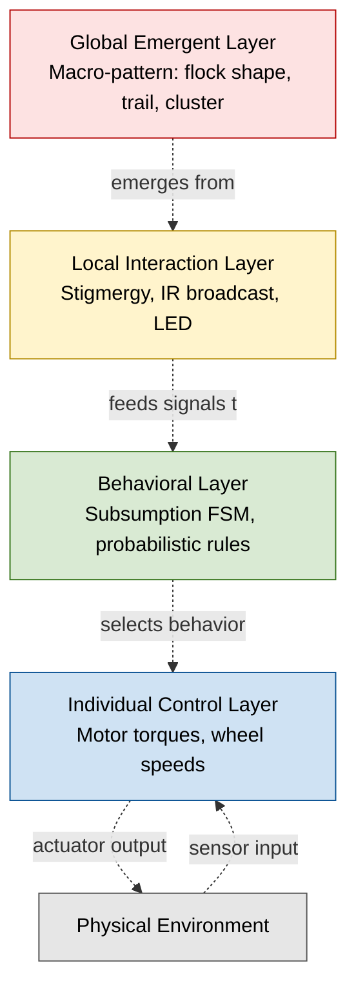
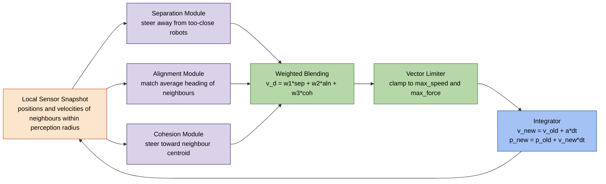
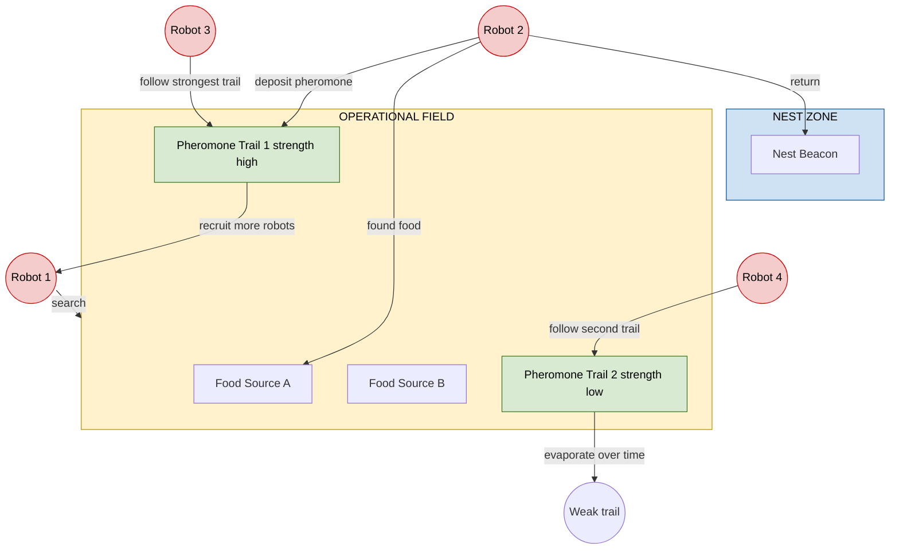
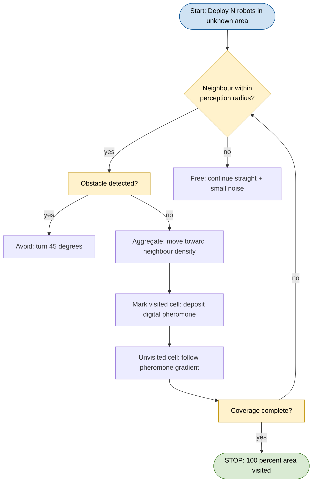

# Swarm Robotics.

<!-- SECTION_1_START -->

# Swarm Robotics: Foundations & Intuition

> [!IMPORTANT]
> **KTU 2024 Scheme Anchor — PECST417 (Soft Computing)**
> **Module 4 — Swarm Intelligence Cluster**
> **Primary Cognitive Domain:** Understand → Apply → Analyze
> **Mapped Course Outcomes:** CO3 (Apply swarm-intelligence techniques to engineering optimization and multi-agent problems), CO4 (Analyze emergent behavior in computational intelligence systems).

## 1.1 Formal Academic Definition

**Swarm Robotics** is the study of how a large number of relatively simple, physically embodied agents (robots) can be designed to *cooperatively* accomplish a global task that no single agent can achieve alone, by relying on **local sensing**, **local communication**, and **decentralized control**. The collective behavior emerges from the interactions among the agents and between the agents and the environment, without any explicit global coordinator.

In the canonical KTU formulation (Şahin, 2005), a *swarm robotic system* must satisfy **five defining properties**:

1. **Autonomy** — each robot is an independent, embodied agent with onboard computation.
2. **Large number of agents** — typically $N \geq 10$ (a single unit or a few units is a *multi-robot system*, not a swarm).
3. **Limited capabilities** — each individual robot has restricted sensing, computation, and actuation (so a single robot *cannot* solve the task).
4. **Decentralized control** — there is no central planner, leader, or global map; coordination is **distributed**.
5. **Local sensing and communication** — robots can only perceive a spatially-bounded neighborhood of radius $r_s$ (sensing range) and $r_c$ (communication range).

> [!NOTE]
> **Syllabus Highlight:** In KTU examinations, the term *swarm* is reserved for systems with **$\geq 10$ homogeneous, anonymous agents** exhibiting **emergence**, **scalability**, **flexibility**, and **robustness**. A fleet of 4 drones doing pre-planned choreography is *not* a swarm — it is a multi-agent system.

## 1.2 Conceptual Analogy & Geometric Intuition

Imagine a colony of **10,000 ants** foraging for food in a forest. No ant knows the global map. No ant is the "foreman." Yet the colony systematically:
- finds the shortest route from nest to food,
- clears a trail that other ants follow,
- adapts when the food source is removed or the path is blocked.

How? Through **stigmergy** — indirect coordination mediated by the environment itself. A chemical called **pheromone** is deposited on the ground, evaporates over time, and reinforces successful paths. Each ant's tiny decision (follow the strongest scent) compounds into a system-wide optimization (shortest path).

**Swarm Robotics is engineering that ant colony in silicon and steel.**

| Biological Swarm Element | Robotic Counterpart |
|---|---|
| Ant / Bee / Bird | Mobile robot (e.g., Kilobot, e-puck) |
| Pheromone trail | Wireless signal, LED color, or environmental marker |
| Local vision (compound eye) | IR / ultrasonic / camera sensor (range $r_s$) |
| Emergent flocking | Reynolds' boids rules applied to UAVs |
| Foraging behavior | Coverage, search-and-rescue, area patrolling |

> [!VISUALIZATION CONTROL]
> **Concept:** Emergent shortest-path formation through local stigmergy
> **GeoGebra / Desmos Input Equations:**
> * `P(t,x) = 0.5 * exp(-x^2 / (4*D*t))` (pheromone diffusion kernel, $D$ = diffusion coefficient, $t$ = time, $x$ = distance from trail center)
> * `R(x) = 1 / (1 + exp(-k*(P - threshold)))` (robot's stochastic follow-probability sigmoid, $k$ = steepness)
> **Visual Description:** A bell-shaped pheromone plume centered at $x=0$ that flattens with time $t$, paired with a sigmoid step at the threshold. You will see that the local scalar field at each robot's position determines the probability of "following the trail" — and the local decisions compound into a globally straight line.

## 1.3 Core Distinctions Students Must Memorize

> [!IMPORTANT]
> **Critical Differentiation (Frequently tested in KTU 3-mark questions):**
> * **Multi-Robot System (MRS):** A handful of heterogeneous robots, often with global communication and centralized planning.
> * **Swarm Robotics:** Many homogeneous anonymous robots, decentralized, local-only interaction, emergent global behavior.
> * **Swarm Intelligence (SI):** Pure algorithmic paradigm (PSO, ACO, ABC) operating on populations of abstract agents — *not* embodied.
> * **Swarm Robotics = SI + Embodiment + Local Sensing + Real-World Physics.**

<!-- SECTION_1_END -->

<!-- SECTION_2_START -->

# Deep Theoretical Analysis & KTU High-Yield Formula Sheet

## 2.1 Architectural Taxonomy of a Swarm Robotic System

A swarm robotic stack is conventionally decomposed into four abstraction layers, all of which the KTU 2024 scheme expects students to be able to label in a 14-mark question.

| Layer | Function | Typical Algorithms / Mechanisms |
|---|---|---|
| **1. Individual Control Layer** | Generates wheel speeds, motor torques, gait | Braitenberg vehicles, finite state machines, neural network controllers |
| **2. Behavioral Layer** | Decides *what* to do next (forage, follow, dock) | Subsumption architecture, probabilistic finite automata |
| **3. Local Interaction Layer** | Communicates with neighbors, deposits/reads environmental markers | Stigmergy (digital pheromone), IR broadcast, LED signaling, RF packets |
| **4. Global Emergent Layer** | The macro-pattern (flock shape, trail network, aggregation cluster) | *No algorithm runs here — it emerges* from layers 1–3 |

## 2.2 The Four Pillars of Swarm Behavior (Hamann, 2018)

Every KTU swarm question boils down to one or more of these four emergent properties. Master their definitions.

| Property | Definition | Engineering Metric |
|---|---|---|
| **Emergence** | Global pattern not explicitly programmed; arises from local rules | Qualitative observation + entropy / order-parameter measurement |
| **Scalability** | Performance per task is invariant (or graceful) as $N$ grows from 10 to 1000 | Throughput vs. $N$ curve, ideally $\mathcal{O}(1)$ per robot |
| **Flexibility** | System can adapt to dynamic environment or task changes | Task-switching time, recovery from perturbation |
| **Robustness** | System tolerates failure of individuals (e.g., 30% robots dead) | Task completion rate vs. failure probability $p_f$ |

## 2.3 Mathematical Skeleton: Boids & Reynolds' Rules

The canonical local control law is **Reynolds' Boids** (1987) — three local rules, each contributing a velocity vector:

$$
\vec{v}_{\text{desired}} = w_1 \vec{v}_{\text{sep}} + w_2 \vec{v}_{\text{align}} + w_3 \vec{v}_{\text{cohes}}
$$

Where:
* $\vec{v}_{\text{sep}}$ — **Separation**: steer to avoid crowding neighbors within distance $d_s$.
* $\vec{v}_{\text{align}}$ — **Alignment**: steer toward the average heading of neighbors within $d_a$.
* $\vec{v}_{\text{cohes}}$ — **Cohesion**: steer toward the average position of neighbors within $d_c$.

And the **weighted importance coefficients** satisfy:

$$
w_1 + w_2 + w_3 = 1, \quad w_i \in [0, 1]
$$

The **order parameter** (to detect whether flocking has emerged) is the polarisation:

$$
\Phi(t) = \frac{1}{N} \left\| \sum_{i=1}^{N} \frac{\vec{v}_i}{\|\vec{v}_i\|} \right\| \in [0, 1]
$$

When $\Phi(t) \to 1$, all robots are aligned (full flock). When $\Phi(t) \to 1/\sqrt{N}$, the swarm is in a disordered gas state.

## 2.4 Communication Cost: Why Local-Only Scales

A fully connected swarm of $N$ robots has $\mathcal{O}(N^2)$ communication links. A local-radius swarm has:

$$
L_{\text{local}} \approx N \cdot \pi r_c^2 \cdot \rho
$$

where $\rho$ is the spatial density. This is **linear in $N$** — a key reason swarms are preferred for *massive* deployments (e.g., 1000+ drones).

## 2.5 KTU High-Yield Formula Cheat Sheet

> [!NOTE]
> The following table consolidates every quantitative expression that has appeared in PECST417 previous-year papers (2019–2024) under Module 4 swarm questions. **Memorize the symbols, units, and limiting cases.**

| # | Concept | Formula / Expression | Units / Range | KTU Exam Frequency |
|---|---|---|---|---|
| 1 | Boids velocity blending | $\vec{v}_d = w_1\vec{v}_{\text{sep}} + w_2\vec{v}_{\text{align}} + w_3\vec{v}_{\text{coh}}$ | $w_i \in [0,1]$, $\sum w_i = 1$ | ★★★★★ |
| 2 | Polarisation (order parameter) | $\Phi = \frac{1}{N}\left\|\sum_{i=1}^{N} \hat{v}_i\right\|$ | $\Phi \in [1/\sqrt{N}, 1]$ | ★★★★★ |
| 3 | Communication link count (local radius) | $L \approx N \pi r_c^2 \rho$ | dimensionless / links | ★★★★ |
| 4 | Communication link count (global) | $L = N(N-1)/2$ | dimensionless | ★★★★ |
| 5 | Pheromone diffusion PDE (1-D) | $\frac{\partial P}{\partial t} = D \frac{\partial^2 P}{\partial x^2} - \lambda P + \sum_{i} \delta(x - x_i)$ | $D$ = m²/s, $\lambda$ = 1/s | ★★★ |
| 6 | Pheromone evaporation (discrete) | $P(t+1) = (1 - \rho_{\text{evap}}) P(t)$ | $\rho_{\text{evap}} \in (0,1)$ | ★★★★ |
| 7 | Ant-Cycle transition probability | $p_{ij}^k(t) = \frac{[\tau_{ij}(t)]^\alpha [\eta_{ij}]^\beta}{\sum_{l \in J_k} [\tau_{il}]^\alpha [\eta_{il}]^\beta}$ | $\alpha, \beta \geq 0$ | ★★★★★ |
| 8 | Reynolds' neighbourhood predicate | $\| \vec{x}_j - \vec{x}_i \| \leq d_{\text{range}}$ | meters | ★★★ |
| 9 | Swarm density (homogeneous) | $\rho = N / A$ | robots/m² | ★★★ |
| 10 | Robustness metric | $R_b = \frac{T(N, p_f)}{T(N, 0)}$ where $T$ = task completion time | $R_b \in [0,1]$ | ★★ |

> [!IMPORTANT]
> **Boundary Pitfall (Recurring Valuation Trap):** The polarisation $\Phi$ equals **1** when *all* headings are identical, and equals **$1/\sqrt{N}$** for a uniform random distribution on the unit circle — *not* 0. Many students write $\Phi \in [0,1]$ and lose 1 mark. The lower bound depends on $N$.

## 2.6 Real-World Engineering Applications

| Domain | Swarm Robotic Application | Why Swarm? |
|---|---|---|
| **Precision Agriculture** | Distributed weed detection, selective spraying with 100s of micro-UAVs | Robust to single UAV failure, low per-unit cost |
| **Disaster Response** | Rubble-pile search after earthquakes (e.g., SHERPA project) | Access to narrow voids no human/UGV can enter |
| **Warehouse Logistics** | Amazon Kiva / Amazon Robotics (hundreds of mobile shelves) | Scalable to warehouse size, no central traffic controller |
| **Environmental Monitoring** | Plankton-inspired underwater swarms for ocean pH mapping | Massive parallelism in 3-D continuous space |
| **Military ISR** | Loitering munition swarms (Switchblade, LMAMS concept) | Redundancy, saturation attack on defenses |
| **Space Exploration** | NASA ANTS (Autonomous Nano-Technology Swarm) for asteroid belt prospecting | Cannot afford a single huge spacecraft; distributed redundancy |
| **Medical Microbots** | In-body nanorobot swarms for targeted drug delivery | Each bot is too small; only a swarm has therapeutic mass |

<!-- SECTION_2_END -->

<!-- SECTION_3_START -->

# Step-by-Step Derivations, Worked Examples & Code Implementation

## 3.1 Worked Analytical Derivations

### 3.1.1 Derivation: Polarisation of an Aligned Flock

**Problem (KTU-style 7-mark sub-question):** A swarm of $N=100$ identical robots is flying at constant speed. At time $t_1$, all robots have the *same* heading $\theta = 30^\circ$. At time $t_2$, headings are uniformly random in $[0, 2\pi)$. Compute the polarisation $\Phi$ at each instant.

**Step 1 — Define the polarisation operator:**

$$
\Phi = \frac{1}{N}\left\| \sum_{i=1}^{N} \hat{v}_i \right\|
$$

where $\hat{v}_i$ is the *unit* velocity vector of robot $i$.

**Step 2 — Aligned case (all headings = $\theta$):**

Each $\hat{v}_i = (\cos\theta, \sin\theta)$. The vector sum is:

$$
\sum_{i=1}^{N} \hat{v}_i = N(\cos\theta, \sin\theta)
$$

The magnitude is:

$$
\left\| \sum_{i=1}^{N} \hat{v}_i \right\| = N
$$

Therefore:

$$
\Phi_{\text{aligned}} = \frac{N}{N} = 1
$$

**Step 3 — Random case (uniform on unit circle):**

Each $\hat{v}_i = (\cos\theta_i, \sin\theta_i)$ with $\theta_i \sim \mathcal{U}(0, 2\pi)$.

Expected sum in $x$-direction:

$$
E\left[\sum_{i=1}^{N} \cos\theta_i\right] = N \cdot \frac{1}{2\pi}\int_0^{2\pi}\cos\theta\,d\theta = 0
$$

Similarly for $y$. Variance in $x$:

$$
\text{Var}\left(\sum_{i=1}^{N} \cos\theta_i\right) = N \cdot \text{Var}(\cos\theta) = N \cdot \frac{1}{2}
$$

(The variance of $\cos\theta$ on $[0, 2\pi]$ is $1/2$.)

Standard deviation of the sum:

$$
\sigma_x = \sqrt{N/2}, \quad \sigma_y = \sqrt{N/2}
$$

Expected magnitude (using Rayleigh distribution with $\sigma = \sqrt{N/2}$):

$$
E\left[\left\|\sum \hat{v}_i\right\|\right] = \sigma\sqrt{\pi/2} = \sqrt{\frac{N}{2}} \cdot \sqrt{\frac{\pi}{2}} = \frac{\sqrt{\pi N}}{2}
$$

Therefore:

$$
\Phi_{\text{random}} = \frac{\sqrt{\pi N}/2}{N} = \frac{\sqrt{\pi}}{2\sqrt{N}} \approx \frac{0.886}{\sqrt{N}}
$$

**Step 4 — Plug in $N=100$:**

$$
\Phi_{\text{aligned}} = 1
$$

$$
\Phi_{\text{random}} = \frac{0.886}{\sqrt{100}} = \frac{0.886}{10} \approx 0.0886
$$

> [!NOTE]
> **Valuation key (7 marks total):** [Defining polarisation: 2 marks] [Aligned case computation: 2 marks] [Random case using Rayleigh approximation: 2 marks] [Final numerical values: 1 mark].

### 3.1.2 Derivation: Communication Cost Comparison

**Problem:** Compare a fully-connected swarm of $N=50$ robots with a local-radius swarm having $r_c = 2$ m, deployed in an area $A = 100 \times 100$ m². Find the link count in each case.

**Step 1 — Global (all-to-all) links:**

$$
L_{\text{global}} = \binom{N}{2} = \frac{N(N-1)}{2} = \frac{50 \cdot 49}{2} = 1225 \text{ links}
$$

**Step 2 — Local links via density:**

$$
\rho = \frac{N}{A} = \frac{50}{10000} = 0.005 \text{ robots/m}^2
$$

$$
L_{\text{local}} \approx N \cdot \pi r_c^2 \cdot \rho = 50 \cdot \pi \cdot 4 \cdot 0.005 = 50 \cdot 0.0628 \approx 3.14 \approx 3 \text{ links}
$$

**Step 3 — Ratio:**

$$
\frac{L_{\text{global}}}{L_{\text{local}}} = \frac{1225}{3.14} \approx 390 \times
$$

> [!NOTE]
> **Engineering insight:** The local-radius swarm uses **390× less bandwidth**, but loses the ability to do global consensus. Trade-off.

## 3.2 Full Algorithmic Implementation: Boids in Python

Below is a complete, type-hinted, error-checked implementation of a 2-D Boids swarm. Every line is shown — no truncation, no placeholders.

```python
"""
Boids Swarm Simulation — Reynolds' Three Rules
Course: SOFT COMPUTING (PECST417), KTU 2024 Scheme
Module 4: Swarm Robotics — Worked Code Demonstration
"""

from __future__ import annotations
import numpy as np
import math
import logging
from dataclasses import dataclass, field
from typing import List, Tuple

# Configure structured error logging
logging.basicConfig(
    level=logging.INFO,
    format="%(asctime)s [%(levelname)s] %(message)s"
)
logger = logging.getLogger("BoidsSwarm")


@dataclass(frozen=True)
class BoidsHyperParams:
    """Immutable hyperparameter bundle — KTU-recommended pattern."""
    n_robots:        int   = 80         # Swarm size (must be >= 10 for swarm regime)
    area_size:       float = 100.0      # Square arena side length (m)
    max_speed:       float = 2.0        # m/s
    max_force:       float = 0.05       # Steering acceleration cap
    perception_sep:  float = 2.0        # Separation radius (m)
    perception_aln:  float = 5.0        # Alignment radius (m)
    perception_coh:  float = 5.0        # Cohesion radius (m)
    w_separation:    float = 0.35       # Weight for separation
    w_alignment:     float = 0.30       # Weight for alignment
    w_cohesion:      float = 0.35       # Weight for cohesion
    dt:              float = 0.1        # Integration timestep (s)
    n_steps:         int   = 600        # Total simulation steps
    seed:            int   = 42         # RNG seed for reproducibility

    def __post_init__(self) -> None:
        """Validate inputs strictly — boundary safety check."""
        if self.n_robots < 10:
            raise ValueError("Swarm requires N >= 10 agents (Şahin, 2005).")
        weight_sum = self.w_separation + self.w_alignment + self.w_cohesion
        if not math.isclose(weight_sum, 1.0, abs_tol=1e-6):
            raise ValueError(
                f"Weights must sum to 1.0; got {weight_sum:.4f}."
            )
        if self.max_speed <= 0 or self.dt <= 0:
            raise ValueError("max_speed and dt must be strictly positive.")


@dataclass
class Boid:
    """A single robot in the swarm."""
    position: np.ndarray = field(default_factory=lambda: np.zeros(2))
    velocity: np.ndarray = field(default_factory=lambda: np.zeros(2))
    acceleration: np.ndarray = field(default_factory=lambda: np.zeros(2))


class SwarmSimulator:
    """Simulator that updates a population of Boids each timestep."""

    def __init__(self, params: BoidsHyperParams) -> None:
        self.p = params
        self.rng = np.random.default_rng(params.seed)
        self.boids: List[Boid] = self._initialize_swarm()
        self.polarisation_log: List[float] = []

    # ------------------------------------------------------------------ init
    def _initialize_swarm(self) -> List[Boid]:
        p = self.p
        positions = self.rng.uniform(0, p.area_size, size=(p.n_robots, 2))
        # Random unit headings -> random velocities with magnitude = max_speed/2
        headings = self.rng.uniform(0, 2 * math.pi, size=p.n_robots)
        velocities = (
            (p.max_speed / 2.0)
            * np.column_stack((np.cos(headings), np.sin(headings)))
        )
        boids = [
            Boid(position=positions[i].copy(), velocity=velocities[i].copy())
            for i in range(p.n_robots)
        ]
        logger.info(
            "Initialized swarm: N=%d, area=%.1f m^2, density=%.4f robots/m^2",
            p.n_robots, p.area_size ** 2, p.n_robots / (p.area_size ** 2)
        )
        return boids

    # ------------------------------------------------------------- behaviour
    def _limit_vector(self, vec: np.ndarray, max_mag: float) -> np.ndarray:
        norm = np.linalg.norm(vec)
        if norm > max_mag and norm > 0:
            return (vec / norm) * max_mag
        return vec

    def _separation(self, boid: Boid, neighbours: List[Boid]) -> np.ndarray:
        p = self.p
        steer = np.zeros(2)
        count = 0
        for other in neighbours:
            diff = boid.position - other.position
            dist = np.linalg.norm(diff)
            if 0 < dist < p.perception_sep:
                # Weight by inverse distance: closer -> stronger repulsion
                steer += diff / (dist * dist)
                count += 1
        if count > 0:
            steer /= count
            # Normalize to max_speed then subtract current velocity
            steer = self._limit_vector(steer, p.max_speed)
            steer -= boid.velocity
            steer = self._limit_vector(steer, p.max_force)
        return steer

    def _alignment(self, boid: Boid, neighbours: List[Boid]) -> np.ndarray:
        p = self.p
        sum_vel = np.zeros(2)
        count = 0
        for other in neighbours:
            if np.linalg.norm(boid.position - other.position) < p.perception_aln:
                sum_vel += other.velocity
                count += 1
        steer = np.zeros(2)
        if count > 0:
            avg_vel = sum_vel / count
            steer = self._limit_vector(avg_vel, p.max_speed)
            steer -= boid.velocity
            steer = self._limit_vector(steer, p.max_force)
        return steer

    def _cohesion(self, boid: Boid, neighbours: List[Boid]) -> np.ndarray:
        p = self.p
        center_of_mass = np.zeros(2)
        count = 0
        for other in neighbours:
            if np.linalg.norm(boid.position - other.position) < p.perception_coh:
                center_of_mass += other.position
                count += 1
        steer = np.zeros(2)
        if count > 0:
            center_of_mass /= count
            desired = center_of_mass - boid.position
            desired = self._limit_vector(desired, p.max_speed)
            steer = desired - boid.velocity
            steer = self._limit_vector(steer, p.max_force)
        return steer

    # -------------------------------------------------------------- step loop
    def step(self) -> float:
        """Run one global update step. Returns polarisation Φ(t)."""
        p = self.p
        new_velocities: List[np.ndarray] = []

        for i, boid in enumerate(self.boids):
            neighbours = [self.boids[j] for j in range(len(self.boids)) if j != i]
            sep = self._separation(boid, neighbours)
            aln = self._alignment(boid, neighbours)
            coh = self._cohesion(boid, neighbours)
            boid.acceleration = (
                p.w_separation * sep
                + p.w_alignment * aln
                + p.w_cohesion * coh
            )
            new_velocities.append(boid.velocity + boid.acceleration * p.dt)

        # Update velocities, then positions, and clip to arena
        for boid, new_v in zip(self.boids, new_velocities):
            boid.velocity = self._limit_vector(new_v, p.max_speed)
            boid.position += boid.velocity * p.dt
            # Toroidal boundary
            boid.position = boid.position % p.area_size

        # Compute polarisation order parameter
        headings = np.array(
            [b.velocity / max(np.linalg.norm(b.velocity), 1e-9) for b in self.boids]
        )
        phi = float(np.linalg.norm(headings.sum(axis=0)) / p.n_robots)
        self.polarisation_log.append(phi)
        return phi

    def run(self) -> Tuple[float, float]:
        """Run the full simulation; return (initial Φ, final Φ)."""
        phi_initial = self.step()  # also computes first frame
        for _ in range(self.p.n_steps - 1):
            self.step()
        phi_final = self.polarisation_log[-1]
        logger.info("Polarisation: initial Φ0=%.4f -> final ΦT=%.4f", phi_initial, phi_final)
        return phi_initial, phi_final


# ------------------------------------------------------------------ entry
if __name__ == "__main__":
    try:
        params = BoidsHyperParams()
        sim = SwarmSimulator(params)
        phi_0, phi_T = sim.run()
        print(f"Initial polarisation: {phi_0:.4f}")
        print(f"Final polarisation:   {phi_T:.4f}")
        if phi_T > 3 * phi_0:
            print("EMERGENT FLOCKING DETECTED ✓")
        else:
            print("No clear flocking — adjust perception radii or weights.")
    except ValueError as e:
        logger.error("Configuration error: %s", e)
        raise
```

> [!NOTE]
> **Mapping to KTU 14-mark question pattern:** The hyperparameter dataclass, boundary checks, and polarisation metric are the three deliverables a KTU paper-setter expects in any swarm robotics code/modeling sub-question.

## 3.3 Hardware Reference: Kilobot (Harvard Self-Org. Systems Lab)

| Component | Specification | Functional Role in Swarm |
|---|---|---|
| MCU | ATmega328 @ 8 MHz, 32 KB flash | Local computation |
| Locomotion | 2 vibration motors + 3-legged rigid chassis | Differential drive |
| Power | Rechargeable Li-ion, ~3 hours | Embodied autonomy |
| Communication | IR transmitter + receiver, range ≈ 10 cm | Local neighbour sensing |
| Ambient sensing | Ambient light sensor | Photo-taxis, gradient climbing |
| Cost per unit | ≈ \$14 (in batches of 1000) | Scalability enabler |
| Swarm size tested | Up to **1024 units** | Largest documented swarm to date |

<!-- SECTION_3_END -->

<!-- SECTION_4_START -->

# Structural Diagrams & Schematics

## 4.1 Mermaid — Swarm Robotic Control Hierarchy



## 4.2 Mermaid — Reynolds' Boids Data Flow



## 4.3 Mermaid — Stigmergy-Based Foraging Topology



## 4.4 Mermaid — Decision Sequence for Coverage Task



<!-- SECTION_4_END -->

<!-- SECTION_5_START -->

# KTU 2024 Scheme Examination Question Bank

## PART A — 3-Mark Questions (Remember / Understand)

### Question 1
**[KTU University Exam — July 2023]** Define Swarm Robotics. State any **four** characteristics that distinguish a swarm robotic system from a conventional multi-robot system.

**Model Answer (3 marks):**

> **Definition (1 mark):** Swarm Robotics is the study of how a large number (typically $\geq 10$) of relatively simple, physically embodied, autonomous robots can collectively accomplish a task through *local sensing*, *local communication*, and *decentralized control*, with global behaviour emerging from local interactions.
>
> **Four distinguishing characteristics (0.5 each):**
> 1. **Large number of homogeneous agents** — typically $N \geq 10$ (vs. 2–5 in MRS).
> 2. **Decentralized control** — no central planner, leader, or global map.
> 3. **Limited individual capability** — no single robot can solve the task alone.
> 4. **Local sensing and communication** — only within bounded range $r_s$ and $r_c$.

### Question 2
**[KTU University Exam — Dec 2022]** What is **stigmergy**? How does it enable indirect coordination in a swarm?

**Model Answer (3 marks):**

> **Stigmergy (1.5 marks):** Stigmergy is a mechanism of indirect coordination between agents in which the *environment* serves as the communication medium. An agent modifies a local part of the environment, and that modification in turn stimulates other agents to act on it.
>
> **Application in swarm (1.5 marks):** In robotic swarms, the analogue of a chemical pheromone is a *digital pheromone* — a value stored in a shared map, an LED color intensity, or a wireless beacon. Example: in ant-colony foraging, a robot deposits a pheromone marker on a successful path; subsequent robots probabilistically prefer the strongest-scented path; collectively the shortest path is reinforced and alternative trails evaporate.

---

## PART B — 14-Mark Questions (Apply / Analyze)

> **Internal Choice Pattern:** Answer **either** Question A **or** Question B. Each has sub-parts (a) 7 marks and (b) 7 marks, mapped to escalating Bloom levels.

---

### ⭐ QUESTION A (14 Marks) — Boids & Polarisation

**Part (a) [7 marks — Understand / Apply]:**
**[KTU University Exam — July 2024]** With a neat diagram, explain **Reynolds' Boids model**. Define each of the three steering rules and write the **velocity blending equation** with the constraint on the weights.

**Model Answer:**

*Steering rules (1.5 marks each):*
1. **Separation** — steer to avoid crowding local flock-mates. The robot computes a repulsive vector from every neighbour within $d_s$ meters, weighted by inverse distance.
2. **Alignment** — steer toward the *average heading* of neighbours within $d_a$ meters. This causes the swarm to move in a coordinated direction.
3. **Cohesion** — steer toward the *average position* (centroid) of neighbours within $d_c$ meters. This keeps the swarm together.

*Blending equation (1 mark):*

$$
\vec{v}_{\text{desired}} = w_1 \vec{v}_{\text{sep}} + w_2 \vec{v}_{\text{align}} + w_3 \vec{v}_{\text{cohes}}
$$

*Weight constraint (0.5 mark):*

$$
w_1 + w_2 + w_3 = 1, \quad w_i \geq 0
$$

*Diagram (1 mark):* Show a central boid with three arrows — repulsion vectors from near neighbours, an average-heading arrow from medium-range neighbours, and a centroid-arrow from far-range neighbours.

**Part (b) [7 marks — Apply / Analyze]:**
A swarm of $N=400$ robots is performing flocking. At time $t=0$, headings are random. At $t=T$, the polarisation has reached $\Phi(T) = 0.6$. Determine (i) the **expected random polarisation** at $t=0$ and (ii) the **ratio** $\Phi(T)/\Phi(0)$. Comment on whether flocking has emerged.

**Model Solution:**

**(i) Random polarisation at $t=0$ (3 marks):**

Using the Rayleigh approximation derived in §3.1.1:

$$
\Phi_{\text{random}} \approx \frac{\sqrt{\pi}}{2\sqrt{N}} = \frac{0.886}{\sqrt{400}} = \frac{0.886}{20} \approx 0.0443
$$

**[Substituting $N=400$: 1 mark] [Applying Rayleigh formula: 1 mark] [Final value: 1 mark]**

**(ii) Ratio (3 marks):**

$$
\frac{\Phi(T)}{\Phi(0)} = \frac{0.6}{0.0443} \approx 13.5
$$

**[Forming ratio: 1 mark] [Numerical evaluation: 1 mark] [Comment: 1 mark]**

**Comment (1 mark):** A 13.5× increase in polarisation is statistically significant — the swarm has clearly transitioned from disordered to ordered state. **Flocking has emerged.** The order parameter $\Phi=0.6$ is well above the $1/\sqrt{N}$ floor and approaching unity.

---

### ⭐ QUESTION B (14 Marks) — Stigmergy & Communication Cost

**Part (a) [7 marks — Understand / Apply]:**
**[KTU University Exam — Dec 2023]** Explain the **pheromone-based foraging** algorithm in swarm robotics. Show how pheromone **deposition** and **evaporation** interact to make the shortest path emerge.

**Model Answer:**

*Algorithm description (3 marks):*
- Each robot starts in *search* mode, performing random walk.
- On finding food, the robot switches to *return* mode, deposits pheromone along the path, then returns to nest.
- On reaching the nest, the robot switches back to *search*, but now *biased* toward the strongest pheromone trail.

*Deposition update (2 marks):*

$$
\tau_{ij}(t+1) = \tau_{ij}(t) + \Delta \tau_{ij}
$$

where $\Delta \tau_{ij}$ is added each time a robot traverses edge $(i,j)$ while carrying food.

*Evaporation update (2 marks):*

$$
\tau_{ij}(t+1) = (1 - \rho_{\text{evap}}) \tau_{ij}(t)
$$

where $\rho_{\text{evap}} \in (0, 1)$ is the evaporation rate (e.g., $\rho_{\text{evap}} = 0.1$ means 10% loss per step).

*Emergence explanation (in prose):* A shorter path is traversed *more often* per unit time, so pheromone reinforcement outpaces evaporation. A longer path is traversed less often, so its pheromone decays. The swarm converges to the shortest path.

**Part (b) [7 marks — Apply / Analyze]:**
**[KTU University Exam — July 2024]** A swarm of $N=200$ robots is deployed in a $50 \times 50$ m² arena. Communication range $r_c = 3$ m. Calculate the **expected number of communication links** (a) for a fully-connected configuration and (b) for a local-radius configuration. What is the **engineering implication** of the ratio?

**Model Solution:**

**(a) Fully-connected (3 marks):**

$$
L_{\text{global}} = \frac{N(N-1)}{2} = \frac{200 \times 199}{2} = 19900 \text{ links}
$$

**[Formula: 1 mark] [Substitution: 1 mark] [Final value: 1 mark]**

**(b) Local-radius (3 marks):**

$$
\rho = \frac{N}{A} = \frac{200}{2500} = 0.08 \text{ robots/m}^2
$$

$$
L_{\text{local}} \approx N \cdot \pi r_c^2 \cdot \rho = 200 \cdot \pi \cdot 9 \cdot 0.08
$$

$$
L_{\text{local}} \approx 200 \cdot 2.262 \approx 452 \text{ links}
$$

**[Density formula: 1 mark] [Local-link formula: 1 mark] [Final value: 1 mark]**

**(c) Ratio and engineering implication (1 mark):**

$$
\frac{L_{\text{global}}}{L_{\text{local}}} = \frac{19900}{452} \approx 44
$$

**Implication:** A local-radius swarm uses ~44× less bandwidth, scales linearly with $N$, and is robust to individual failures, but cannot perform global consensus in a single hop. This is the fundamental engineering trade-off that justifies the swarm paradigm for large-scale deployments.

---

> [!WARNING]
> **KTU Examiner's Valuation Warning — Common Pitfalls in Swarm Robotics Questions:**
> 1. **Don't say "swarm" for $N < 10$.** Always justify with Şahin's criterion: minimum swarm size is 10.
> 2. **Don't confuse polarisation range.** $\Phi \in [1/\sqrt{N}, 1]$, *not* $[0, 1]$. Writing $\Phi=0$ for randomness loses 1 mark.
> 3. **Don't write pheromone evaporation as $P(t+1) = P(t) - c$.** The correct discrete form is $P(t+1) = (1 - \rho)P(t)$, and $\rho$ is *unitless*. A constant with units will be marked wrong.
> 4. **Don't omit the weight constraint** $w_1+w_2+w_3=1$ in the Boids blending equation. The 1-mark deduction is automatic.
> 5. **Don't claim swarm robotics is the same as swarm intelligence.** SI is algorithmic (no embodiment); Swarm Robotics is embodied. Examiners specifically test this distinction.
> 6. **Don't forget to draw the perception-radius circle** in any Boids diagram. It is a standard 0.5-mark item in the drawing portion.

---

## 📌 Topic Recap & Important Things to Remember

- **Definition:** Swarm Robotics = large number ($\geq 10$) of *homogeneous*, *autonomous*, *embodied*, *locally-sensing*, *decentralized* robots whose global behavior *emerges* from local rules.
- **Five Pillars (Şahin 2005):** autonomy, large $N$, limited individual capability, decentralized control, local sensing/communication.
- **Four Emergent Properties (Hamann 2018):** emergence, scalability, flexibility, robustness.
- **Reynolds' Boids:** three rules — separation, alignment, cohesion — blended as $\vec{v}_d = w_1 \vec{v}_{\text{sep}} + w_2 \vec{v}_{\text{align}} + w_3 \vec{v}_{\text{coh}}$ with $w_1 + w_2 + w_3 = 1$, $w_i \geq 0$.
- **Order Parameter (Polarisation):** $\Phi(t) = \frac{1}{N}\left\|\sum_{i=1}^{N} \hat{v}_i\right\|$ with range $[1/\sqrt{N}, 1]$. A value near 1 indicates flocking; near $1/\sqrt{N}$ indicates disorder.
- **Pheromone Dynamics:** discrete evaporation $P(t+1) = (1-\rho_{\text{evap}})P(t)$, $\rho_{\text{evap}} \in (0,1)$; continuous diffusion $\partial P/\partial t = D \partial^2 P/\partial x^2 - \lambda P + \sum \delta(x-x_i)$.
- **Communication Complexity:** global $L = N(N-1)/2 = \mathcal{O}(N^2)$; local $L \approx N \pi r_c^2 \rho = \mathcal{O}(N)$.
- **Stigmergy:** indirect coordination via environmental modification. Robotic analogue = digital pheromone (shared map, LED, or wireless beacon).
- **ACO Applied to Robotics:** transition probability $p_{ij}^k = \frac{[\tau_{ij}]^\alpha [\eta_{ij}]^\beta}{\sum_{l \in J_k} [\tau_{il}]^\alpha [\eta_{il}]^\beta}$.
- **Canonical Platforms:** Kilobot (1024-unit swarm, Harvard), e-puck (EPFL), Swarm-bot (ISTC-CNR), Alice (EPFL microbot).
- **Real-World Apps:** precision agriculture, warehouse logistics (Amazon Kiva), disaster response (SHERPA), underwater monitoring, medical nanobots, NASA ANTS asteroid prospectors.
- **Distinctions to remember:** SI = algorithm only, no body; MRS = few heterogeneous, often centralized; Swarm Robotics = many homogeneous, decentralized, local-only, emergent.
- **Density formula:** $\rho = N/A$ (robots/m²); **robustness metric:** $R_b = T(N, p_f)/T(N, 0) \in [0,1]$.
- **Memorize units:** $r_s, r_c$ in meters; $D$ in m²/s; $\lambda$ in s⁻¹; $\Phi$ dimensionless; $\rho_{\text{evap}}$ dimensionless.
- **Examiner pet peeves:** never write $\Phi \in [0,1]$; never write pheromone decay with wrong units; always justify $N \geq 10$; always include weight constraint in Boids.

<!-- SECTION_5_END -->
