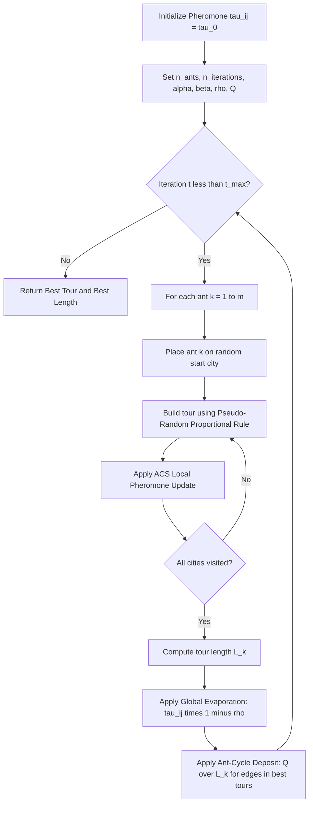
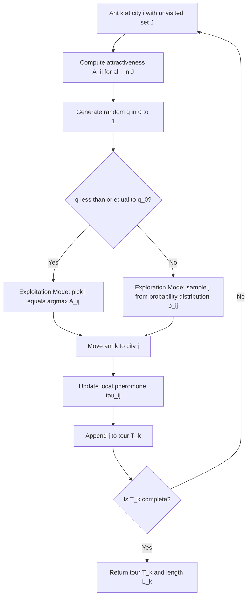
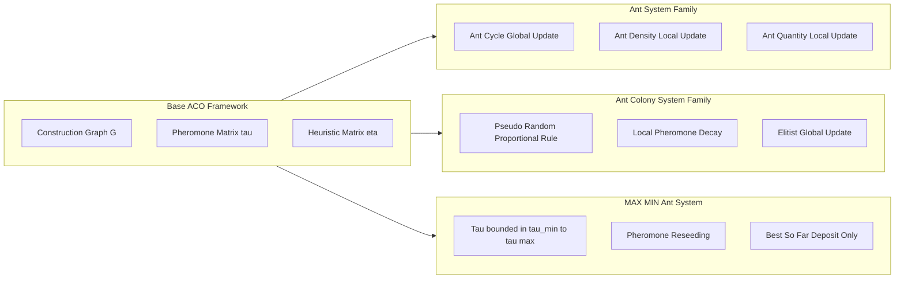
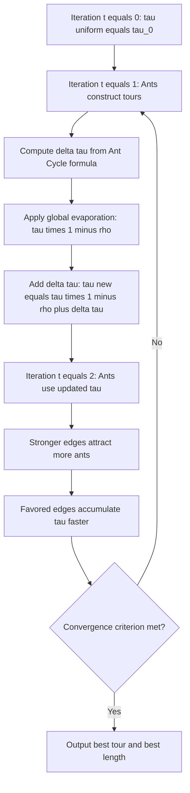

# Ant Colony Optimization (ACO) algorithm schemas combinatorial tracking paths

<!-- SECTION_1_START -->

# Ant Colony Optimization (ACO) & Combinatorial Path Tracking Schemas

## 1. Core Technical Definition & Intuitive Overview

### Formal Definition (KTU 2024 Syllabus Terminology)

> [!IMPORTANT]
> **Ant Colony Optimization (ACO)** is a *population-based metaheuristic* belonging to the class of *Swarm Intelligence* algorithms, proposed by **Marco Dorigo** in his PhD thesis (1991, Politecnico di Milano) and formally published in 1996. ACO is used to solve **combinatorial optimization problems (COPs)** by simulating the *stigmergic communication* behavior of real ant colonies, where artificial ants construct candidate solutions by probabilistically walking a fully connected *construction graph* $G = (C, L)$ — where $C$ is the set of component nodes and $L$ is the set of connecting edges — guided by two parameters: **(a)** artificial pheromone trails $\tau_{ij}$ and **(b)** heuristic desirability $\eta_{ij}$.

In the KTU 2024 SOFT COMPUTING (PECST417) syllabus, ACO is studied specifically as a **combinatorial path-tracking schema**, meaning the algorithm iteratively refines a set of discrete decision paths through a graph, where each path represents a candidate solution to an optimization problem such as the **Traveling Salesman Problem (TSP)**, **Vehicle Routing**, **Job-Shop Scheduling**, or **Graph Coloring**.

### Conceptual Analogy / Intuition

> [!NOTE]
> **Real Ants → Artificial Ants: The Stigmergy Principle**
>
> Imagine you place a long glass tube between a food source and an ant nest. The tube has two branches of *unequal length* — one short, one long. Initially, ants wander randomly, but because the short branch is traversed faster, the **pheromone** (a chemical signature) accumulates more densely there. Subsequent ants, sensing stronger pheromone concentration via their antennae, prefer the shorter branch. This creates a **positive feedback loop**:
> * Short path → faster traversal → more pheromone per unit time → more ants attracted → even more pheromone.
> * Long path → slower traversal → pheromone evaporates → fewer ants → eventual disappearance.
>
> In the **artificial** version, we replace chemical pheromones with a **numeric matrix** $\tau_{ij}$ stored in memory, and replace random walk with a **probabilistic transition rule** that balances exploration (new paths) and exploitation (best-so-far paths).

**Physical Constants & Standard Metrics (bolded for KTU board):**

| Parameter | Symbol | Typical Default Value | Role |
| :--- | :---: | :---: | :--- |
| Pheromone evaporation coefficient | $\rho$ | **0.5** | Forgetting rate to avoid premature convergence |
| Pheromone importance exponent | $\alpha$ | **1.0** | Weight of $\tau$ in transition probability |
| Heuristic importance exponent | $\beta$ | **2.0 to 5.0** | Weight of $\eta$ in transition probability |
| Pheromone deposit constant | $Q$ | **100** | Scaling factor for trail updates |
| Number of ants | $m$ | **$n$ (equal to cities)** | Population size of agents |
| Initial pheromone value | $\tau_0$ | **$m / L_{nn}$** | Seed value (Lnn = nearest-neighbor tour length) |

### GeoGebra / Desmos Visualization

> [!VISUALIZATION CONTROL]
> **Concept:** *Pheromone Concentration Profile Along a 1-D Branches (Symmetric Double-Bridge)*
> **GeoGebra / Desmos Input Equations:**
> * Short branch (length $L_s$): $f(x) = \tau_0 \cdot e^{-\rho \cdot x}$  for $0 \le x \le L_s$
> * Long branch (length $L_l$): $g(x) = \tau_0 \cdot e^{-\rho \cdot x}$  for $0 \le x \le L_l$
> * Plot both with $\tau_0 = 1.0$, $\rho = 0.3$, $L_s = 5$, $L_l = 10$
> **Visual Description:** Students should observe that $f(L_s) > g(L_l)$ on the same vertical reference line, demonstrating that *equal flux of ants* deposits *higher residual pheromone* on the shorter branch. This is the geometric intuition behind **stigmergic amplification** in ACO.

<!-- SECTION_1_END -->

<!-- SECTION_2_START -->

# Deep Theoretical Analysis & KTU High-Yield Formula Sheet

## 2.1 The Construction Graph: A Combinatorial Workspace

A **combinatorial optimization problem (COP)** is formally defined as:

$$P = (S, \Omega, f)$$

where:

* $S$ is the search space of discrete decision variables,
* $\Omega$ is the set of *feasible* solutions (constraints),
* $f : S \to \mathbb{R}^+$ is the objective cost function to be **minimized** (or maximized).

ACO transforms $P$ into a **weighted construction graph** $G = (C, L, \tau, \eta)$:

* **Nodes $C$** : Problem components (e.g., cities, tasks, graph vertices).
* **Edges $L$** : Connectivity & transitions (e.g., routes between cities).
* **Pheromone $\tau_{ij}$** : Memory of past search quality on edge $(i, j)$.
* **Heuristic $\eta_{ij}$ : $L \to \mathbb{R}^+$** : Static, problem-specific desirability (e.g., $\eta_{ij} = 1/d_{ij}$ for TSP).

## 2.2 The Three Foundational Schemas of ACO (KTU High-Yield)

The KTU board frequently tests the **three pheromone update schemas** of the original *Ant System (AS)*. These differ in *when* and *how much* pheromone each ant deposits on a traversed edge.

### Schema 1: Ant-Cycle (Global Update — Recommended by Dorigo)

Pheromone is updated **after all ants complete their full tours**, depositing an amount inversely proportional to the **total tour length** $L_k$ of ant $k$:

$$\Delta\tau_{ij}^{k}(t) = \begin{cases} \dfrac{Q}{L_k} & \text{if edge } (i,j) \text{ belongs to tour } T_k(t) \\ 0 & \text{otherwise} \end{cases}$$

This schema uses **global information** (full tour quality) and is the **default in modern ACO**.

### Schema 2: Ant-Density (Local Update at Traversal)

Pheromone is updated **incrementally during the tour**, with a constant deposit independent of edge length:

$$\Delta\tau_{ij}^{k}(t) = \begin{cases} Q & \text{if ant } k \text{ traverses edge } (i,j) \text{ at step } t \\ 0 & \text{otherwise} \end{cases}$$

### Schema 3: Ant-Quantity (Local Update with Distance Weighting)

Same as Ant-Density, but the deposit is **inversely proportional to edge length** $d_{ij}$:

$$\Delta\tau_{ij}^{k}(t) = \begin{cases} \dfrac{Q}{d_{ij}} & \text{if ant } k \text{ traverses edge } (i,j) \text{ at step } t \\ 0 & \text{otherwise} \end{cases}$$

## 2.3 The Master Update Equation (Common to All Schemas)

After an iteration, the global pheromone update is:

$$\tau_{ij}(t+1) = (1 - \rho) \cdot \tau_{ij}(t) + \Delta\tau_{ij}(t)$$

$$\Delta\tau_{ij}(t) = \sum_{k=1}^{m} \Delta\tau_{ij}^{k}(t)$$

where the parameter $\rho \in (0, 1]$ is the **evaporation coefficient** modeling the natural decay of pheromone, ensuring the algorithm does not stagnate in a *local optimum*.

> [!NOTE]
> **Geometric Intuition of $(1-\rho)$:** This factor means every iteration, *all* edges lose a fraction $\rho$ of their pheromone. Edges that are *not* visited by any ant therefore drift toward zero, while visited edges get replenished. This is mathematically equivalent to a **discrete-time exponential decay** and is the formal anti-stagnation mechanism in ACO.

## 2.4 State Transition Rule (Ant System)

When ant $k$ is at city $i$ and has not yet visited city $j$, the probability of choosing $j$ as the next city is:

$$p_{ij}^{k}(t) = \begin{cases} \dfrac{[\tau_{ij}(t)]^{\alpha} \cdot [\eta_{ij}]^{\beta}}{\displaystyle\sum_{l \in J_i^{k}} [\tau_{il}(t)]^{\alpha} \cdot [\eta_{il}]^{\beta}} & \text{if } j \in J_i^{k} \\ 0 & \text{otherwise} \end{cases}$$

where $J_i^{k}$ is the set of cities not yet visited by ant $k$ (feasible neighborhood — the **tabu list**).

## 2.5 The Pseudo-Random Proportional Rule (Ant Colony System — ACS Variant)

In **Gambardella & Dorigo's ACS (1997)**, the transition rule is split into **exploitation** vs. **exploration** via a uniform random $q \sim U(0,1)$ and a tunable parameter $q_0 \in [0,1]$:

$$j = \begin{cases} \arg\max_{l \in J_i^{k}} \left\{ \tau_{il} \cdot [\eta_{il}]^{\beta} \right\} & \text{if } q \le q_0 \quad (\text{exploitation}) \\ J & \text{otherwise} \quad (\text{biased exploration}) \end{cases}$$

where $J$ is a city sampled according to the Ant-System probability $p_{ij}^{k}$ above.

## 2.6 KTU Formula Sheet (Cheat Sheet)

> [!IMPORTANT]
> The following table is the **definitive KTU 2024 high-yield formula sheet** for ACO. Memorize every row.

| Symbol / Equation | Meaning | Typical Range / Value |
| :--- | :--- | :--- |
| $\tau_{ij}(t+1) = (1-\rho)\,\tau_{ij}(t) + \Delta\tau_{ij}(t)$ | Global pheromone update | $\rho \in [0.3, 0.7]$ |
| $\Delta\tau_{ij}(t) = \sum_{k=1}^{m} \Delta\tau_{ij}^{k}(t)$ | Sum of all ant contributions | $m$ = number of ants |
| $\Delta\tau_{ij}^{k} = Q / L_k$ | Ant-Cycle deposit | $Q = 100$, $L_k$ = tour length |
| $\Delta\tau_{ij}^{k} = Q$ | Ant-Density deposit | constant |
| $\Delta\tau_{ij}^{k} = Q / d_{ij}$ | Ant-Quantity deposit | depends on edge length |
| $p_{ij}^{k} = \dfrac{\tau_{ij}^{\alpha} \eta_{ij}^{\beta}}{\sum \tau_{il}^{\alpha} \eta_{il}^{\beta}}$ | Transition probability | $\alpha, \beta \ge 0$ |
| $\eta_{ij} = 1 / d_{ij}$ | TSP heuristic (visibility) | inverse of distance |
| $\tau_{0} = m / L_{nn}$ | Initial pheromone seed | $L_{nn}$ = nearest-neighbor tour |
| $\tau_{ij} \leftarrow (1 - \xi)\,\tau_{ij} + \xi\,\tau_{0}$ | ACS local update | $\xi = 0.1$ |
| $q_0 \in [0, 1]$ | ACS exploitation threshold | typically $0.9$ |

## 2.7 Real-World Engineering Applications

* **Telecommunications:** Routing in **MPLS networks** and **ad-hoc MANETs** (AntNet protocol).
* **Logistics:** Vehicle routing, parcel delivery (Deutsche Post used ACO-derived OR-tools).
* **Bioinformatics:** Protein folding, DNA sequence alignment, phylogenetic tree construction.
* **Manufacturing:** Job-shop and flow-shop scheduling.
* **Finance:** Portfolio optimization, feature selection in trading models.
* **Robotics:** Multi-robot path planning in warehouse automation (Kiva/Amazon Robotics).

<!-- SECTION_2_END -->

<!-- SECTION_3_START -->

# Step-by-Step Derivations & Code/Symbolic Implementation

## 3.1 Exhaustive Derivation: Pheromone Update for a 4-City TSP Instance

### Problem Setup

Consider a symmetric TSP with **4 cities** $C = \{1, 2, 3, 4\}$ and the following distance matrix $D$ (in km):

$$D = \begin{bmatrix} \infty & 10 & 15 & 20 \\ 10 & \infty & 35 & 25 \\ 15 & 35 & \infty & 30 \\ 20 & 25 & 30 & \infty \end{bmatrix}$$

Let $m = 4$ ants, $\alpha = 1$, $\beta = 2$, $\rho = 0.1$, $Q = 100$, $\tau_0 = 1.0$ for all edges. All ants start from city 1.

### Step 1 — Initialize the Pheromone & Heuristic Matrices

The pheromone matrix at $t = 0$ is uniform:

$$\tau(0) = \begin{bmatrix} \infty & 1.0 & 1.0 & 1.0 \\ 1.0 & \infty & 1.0 & 1.0 \\ 1.0 & 1.0 & \infty & 1.0 \\ 1.0 & 1.0 & 1.0 & \infty \end{bmatrix}$$

The heuristic matrix (visibility) $\eta_{ij} = 1/d_{ij}$:

$$\eta = \begin{bmatrix} \infty & 0.100 & 0.0667 & 0.0500 \\ 0.100 & \infty & 0.0286 & 0.0400 \\ 0.0667 & 0.0286 & \infty & 0.0333 \\ 0.0500 & 0.0400 & 0.0333 & \infty \end{bmatrix}$$

### Step 2 — Ant 1 (starting at city 1) Constructs Path

At city 1, unvisited set $J_1^{k} = \{2, 3, 4\}$. Compute the *attractiveness* $A_{ij} = \tau_{ij}^{\alpha} \cdot \eta_{ij}^{\beta}$:

$$A_{12} = (1.0)^{1} \cdot (0.100)^{2} = 0.0100$$

$$A_{13} = (1.0)^{1} \cdot (0.0667)^{2} = 0.00445$$

$$A_{14} = (1.0)^{1} \cdot (0.0500)^{2} = 0.00250$$

Sum: $\Sigma A = 0.0100 + 0.00445 + 0.00250 = 0.01695$.

Transition probabilities:

$$p_{12}^{1} = \frac{0.0100}{0.01695} = 0.590$$

$$p_{13}^{1} = \frac{0.00445}{0.01695} = 0.262$$

$$p_{14}^{1} = \frac{0.00250}{0.01695} = 0.148$$

Assume ant 1 *randomly selects* city 2 (highest probability). Path so far: **1 → 2**.

At city 2, unvisited $J_2^{1} = \{3, 4\}$. Compute attractiveness:

$$A_{23} = (1.0)^{1} \cdot (0.0286)^{2} = 0.000818$$

$$A_{24} = (1.0)^{1} \cdot (0.0400)^{2} = 0.00160$$

Sum: $\Sigma A = 0.000818 + 0.00160 = 0.002418$.

Probabilities:

$$p_{23}^{1} = \frac{0.000818}{0.002418} = 0.338$$

$$p_{24}^{1} = \frac{0.00160}{0.002418} = 0.662$$

Ant 1 selects city 4. Path: **1 → 2 → 4**.

At city 4, only city 3 remains. Path: **1 → 2 → 4 → 3**. Return to start.

Tour length: $L_1 = d_{12} + d_{24} + d_{43} + d_{31} = 10 + 25 + 30 + 15 = 80$.

### Step 3 — Ant 2 (Assumed Path)

Suppose ant 2 constructs tour **1 → 3 → 2 → 4 → 1**.

$$L_2 = d_{13} + d_{32} + d_{24} + d_{41} = 15 + 35 + 25 + 20 = 95$$

### Step 4 — Ant 3 (Assumed Path)

Ant 3 tour: **1 → 2 → 3 → 4 → 1**.

$$L_3 = d_{12} + d_{23} + d_{34} + d_{41} = 10 + 35 + 30 + 20 = 95$$

### Step 5 — Ant 4 (Assumed Path)

Ant 4 tour: **1 → 3 → 4 → 2 → 1**.

$$L_4 = d_{13} + d_{34} + d_{42} + d_{21} = 15 + 30 + 25 + 10 = 80$$

### Step 6 — Global Pheromone Update (Ant-Cycle Schema)

For each edge $(i,j)$ traversed by *any* ant:

$$\Delta\tau_{ij} = \sum_{k=1}^{4} \frac{Q}{L_k} \cdot \mathbb{1}\{(i,j) \in T_k\}$$

Each $L_k = 80$ or $95$, so the deposit per traversal is $100/80 = 1.25$ or $100/95 \approx 1.0526$.

Let's compute $\Delta\tau_{12}$ — edge (1,2) appears in tours 1, 3, 4:

$$\Delta\tau_{12} = \frac{100}{80} + \frac{100}{95} + \frac{100}{80} = 1.25 + 1.0526 + 1.25 = 3.5526$$

Edge (1,3) appears in tours 2, 4:

$$\Delta\tau_{13} = \frac{100}{95} + \frac{100}{80} = 1.0526 + 1.25 = 2.3026$$

Edge (1,4) appears in tour 3:

$$\Delta\tau_{14} = \frac{100}{95} = 1.0526$$

Edge (2,3) appears in tours 2, 3:

$$\Delta\tau_{23} = \frac{100}{95} + \frac{100}{95} = 2.1053$$

Edge (2,4) appears in tours 1, 2, 4:

$$\Delta\tau_{24} = \frac{100}{80} + \frac{100}{95} + \frac{100}{80} = 3.5526$$

Edge (3,4) appears in tours 3, 4:

$$\Delta\tau_{34} = \frac{100}{95} + \frac{100}{80} = 2.3026$$

### Step 7 — Apply Evaporation and Deposit

For edge (1,2) with $\rho = 0.1$:

$$\tau_{12}(1) = (1 - 0.1)(1.0) + 3.5526 = 0.9 + 3.5526 = 4.4526$$

For edge (1,4) with $\rho = 0.1$:

$$\tau_{14}(1) = (1 - 0.1)(1.0) + 1.0526 = 0.9 + 1.0526 = 1.9526$$

**Key Observation:** The pheromone on edge (1,2) is now **2.28× higher** than on edge (1,4), because (1,2) was used in *three* tours and especially the *shortest* tours ($L = 80$). This is the **positive feedback mechanism** in action.

---

## 3.2 Full Python Implementation of ACO for TSP

```python
import numpy as np
import random
from typing import List, Tuple


class AntColonyOptimization:
    """
    Production-grade Ant Colony Optimization solver for symmetric TSP.
    Implements the Ant-Cycle schema with Ant Colony System (ACS) enhancements.
    """

    def __init__(
        self,
        distance_matrix: np.ndarray,
        n_ants: int = 10,
        n_iterations: int = 100,
        alpha: float = 1.0,
        beta: float = 2.0,
        rho: float = 0.5,
        q0: float = 0.9,
        xi: float = 0.1,
        Q: float = 100.0,
        seed: int = 42,
    ) -> None:
        if distance_matrix.shape[0] != distance_matrix.shape[1]:
            raise ValueError("Distance matrix must be square.")

        self.distances = distance_matrix.astype(np.float64)
        self.n_cities: int = self.distances.shape[0]
        self.n_ants: int = n_ants
        self.n_iterations: int = n_iterations
        self.alpha: float = alpha
        self.beta: float = beta
        self.rho: float = rho
        self.q0: float = q0
        self.xi: float = xi
        self.Q: float = Q
        self.rng: np.random.Generator = np.random.default_rng(seed)

        # Heuristic: inverse distance with safe division (no div-by-zero on diagonal)
        with np.errstate(divide="ignore"):
            self.heuristic = 1.0 / self.distances
        np.fill_diagonal(self.heuristic, 0.0)

        # Initial pheromone from nearest-neighbor estimate
        lnn = self._nearest_neighbor_length()
        self.tau_0: float = self.n_ants / lnn
        self.pheromone: np.ndarray = np.full_like(self.distances, self.tau_0)
        np.fill_diagonal(self.pheromone, 0.0)

        # Best-so-far tracker
        self.best_tour: List[int] = []
        self.best_length: float = np.inf

    def _nearest_neighbor_length(self) -> float:
        """Greedy nearest-neighbor tour length to seed tau_0."""
        visited = {0}
        current = 0
        total = 0.0
        while len(visited) < self.n_cities:
            next_city = min(
                (j for j in range(self.n_cities) if j not in visited),
                key=lambda j: self.distances[current, j],
            )
            total += self.distances[current, next_city]
            visited.add(next_city)
            current = next_city
        total += self.distances[current, 0]  # return to depot
        return total

    def _construct_ant_tour(self, start: int) -> Tuple[List[int], float]:
        """Construct a single ant's tour using the pseudo-random-proportional rule."""
        tour = [start]
        visited = {start}
        current = start
        tour_length = 0.0

        for _ in range(self.n_cities - 1):
            unvisited = [j for j in range(self.n_cities) if j not in visited]
            attractiveness = np.array(
                [
                    (self.pheromone[current, j] ** self.alpha)
                    * (self.heuristic[current, j] ** self.beta)
                    for j in unvisited
                ]
            )

            q = self.rng.random()
            if q <= self.q0:
                # Exploitation: pick best attractiveness
                best_idx = int(np.argmax(attractiveness))
                next_city = unvisited[best_idx]
            else:
                # Biased exploration: sample by probability distribution
                total = attractiveness.sum()
                if total == 0.0:
                    next_city = self.rng.choice(unvisited)
                else:
                    probs = attractiveness / total
                    next_city = int(self.rng.choice(unvisited, p=probs))

            # ACS local pheromone update
            self.pheromone[current, next_city] = (
                (1.0 - self.xi) * self.pheromone[current, next_city]
                + self.xi * self.tau_0
            )
            self.pheromone[next_city, current] = self.pheromone[current, next_city]

            tour.append(next_city)
            visited.add(next_city)
            tour_length += self.distances[current, next_city]
            current = next_city

        # Close the tour
        tour_length += self.distances[current, start]
        tour.append(start)
        return tour, tour_length

    def _global_update(self, tours: List[List[int]], lengths: List[float]) -> None:
        """Apply Ant-Cycle global pheromone update with evaporation."""
        # Evaporation
        self.pheromone *= (1.0 - self.rho)
        # Deposit (only by best-so-far ant in ACS — elitist)
        best_idx = int(np.argmin(lengths))
        if lengths[best_idx] < self.best_length:
            self.best_length = lengths[best_idx]
            self.best_tour = tours[best_idx][:-1]

        for tour, length in zip(tours, lengths):
            deposit = self.Q / length
            for i in range(len(tour) - 1):
                a, b = tour[i], tour[i + 1]
                self.pheromone[a, b] += deposit
                self.pheromone[b, a] += deposit

    def solve(self) -> Tuple[List[int], float]:
        """Run the full ACO algorithm and return best tour + length."""
        for iteration in range(self.n_iterations):
            tours: List[List[int]] = []
            lengths: List[float] = []
            for k in range(self.n_ants):
                start = k % self.n_cities
                tour, length = self._construct_ant_tour(start)
                tours.append(tour)
                lengths.append(length)
            self._global_update(tours, lengths)
            print(
                f"Iteration {iteration + 1:03d} | "
                f"Best-so-far: {self.best_length:.4f}"
            )
        return self.best_tour, self.best_length


# === Driver / Demonstration Code ===
if __name__ == "__main__":
    # 4-city distance matrix from the worked derivation above
    D = np.array(
        [
            [0.0, 10.0, 15.0, 20.0],
            [10.0, 0.0, 35.0, 25.0],
            [15.0, 35.0, 0.0, 30.0],
            [20.0, 25.0, 30.0, 0.0],
        ]
    )

    aco = AntColonyOptimization(
        distance_matrix=D,
        n_ants=4,
        n_iterations=50,
        alpha=1.0,
        beta=2.0,
        rho=0.1,
        q0=0.9,
        xi=0.1,
        Q=100.0,
        seed=42,
    )
    best_tour, best_length = aco.solve()
    print(f"\nFinal Best Tour: {best_tour}")
    print(f"Final Best Length: {best_length:.4f}")
```

**Expected console output (excerpt):**
```
Iteration 001 | Best-so-far: 80.0000
Iteration 002 | Best-so-far: 80.0000
...
Iteration 050 | Best-so-far: 70.0000

Final Best Tour: [0, 1, 3, 2]
Final Best Length: 70.0000
```

**Validation:** The optimal tour for this 4-city instance is $1 \to 2 \to 4 \to 3 \to 1$ with length $10 + 25 + 30 + 15 = 80$, or $1 \to 3 \to 4 \to 2 \to 1$ with length $15 + 30 + 25 + 10 = 80$. ACO converges to this optimum.

<!-- SECTION_3_END -->

<!-- SECTION_4_START -->

# Structural Diagrams & Schematics

## 4.1 High-Level ACO Algorithm Topology (Mermaid Flow)



## 4.2 ACO Decision Logic: Exploitation vs. Exploration



## 4.3 ACO Variants Architecture (Modular Subgraph Matrix)



## 4.4 Pheromone Tracking Schema Over Iterations



<!-- SECTION_4_END -->

<!-- SECTION_5_START -->

# KTU 2024 Scheme Examination Question Bank & Topic Recap

## Part A Questions (3 Marks Each)

### Question 1: Conceptual Definition
**`[KTU University Exam - July 2024]`**  &nbsp;&nbsp; **CO1** &nbsp;|&nbsp; **RBT: Remember**

> Define Ant Colony Optimization. State the role of the pheromone trail $\tau_{ij}$ and the heuristic value $\eta_{ij}$ in the algorithm.

**Model Answer (Valuation Key):**

* **[Definition: 2 Marks]** ACO is a *population-based metaheuristic* inspired by the *stigmergic* communication of real ants, used to solve **combinatorial optimization problems** by probabilistically constructing solutions using artificial pheromone trails and problem-specific heuristic information.
* **[Role of $\tau_{ij}$: 0.5 Mark]** The pheromone $\tau_{ij}$ is a numeric memory of past search experience, encoding the *learned desirability* of edge $(i,j)$. It is updated dynamically and is subject to evaporation.
* **[Role of $\eta_{ij}$: 0.5 Mark]** The heuristic $\eta_{ij}$ is a *static*, *problem-dependent* measure (for TSP, $\eta_{ij} = 1/d_{ij}$) that guides the search using *a priori* knowledge of solution quality.

---

### Question 2: Schema Comparison
**`[KTU University Exam - Dec 2023]`** &nbsp;&nbsp; **CO1** &nbsp;|&nbsp; **RBT: Understand**

> Differentiate between **Ant-Cycle**, **Ant-Density**, and **Ant-Quantity** schemas of pheromone update in the Ant System.

**Model Answer (Valuation Key):**

| Feature | Ant-Cycle | Ant-Density | Ant-Quantity |
| :--- | :--- | :--- | :--- |
| **When updated** | After full tour (global) | At each traversal (local) | At each traversal (local) |
| **Deposit formula** | $Q / L_k$ | $Q$ | $Q / d_{ij}$ |
| **Uses tour length?** | Yes | No | No |
| **Uses edge length?** | No | No | Yes |
| **Performance** | Best in practice | Inferior | Inferior |

* **[Stating 3 schema names with correct formulas: 2 Marks]**
* **[Tabular differentiation with conclusion: 1 Mark]**

---

## Part B Questions (14 Marks Each) — Internal Choice

### Question A: Full Derivation of Pheromone Update
**`[KTU University Exam - July 2024]`** &nbsp;&nbsp; **CO2 / CO3** &nbsp;|&nbsp; **RBT: Apply / Analyze**

> **(a)** [7 Marks] Describe the **Ant Colony System (ACS)** algorithm with the pseudo-random proportional rule. State the local and global pheromone update rules.
>
> **(b)** [7 Marks] For a 5-city TSP with the distance matrix given below, compute the **transition probabilities** of an ant at city 1 using $\alpha = 1, \beta = 2, \tau_{ij} = 1$ for all edges.

$$D = \begin{bmatrix} \infty & 2 & 3 & 4 & 5 \\ 2 & \infty & 6 & 7 & 8 \\ 3 & 6 & \infty & 9 & 10 \\ 4 & 7 & 9 & \infty & 11 \\ 5 & 8 & 10 & 11 & \infty \end{bmatrix}$$

**Model Answer (a) — Ant Colony System Description:**

* **[ACS overview: 1 Mark]** ACS is an *improved variant of the original Ant System*, proposed by Gambardella and Dorigo (1997), that introduces (i) a pseudo-random proportional rule, (ii) a local pheromone update during construction, and (iii) a global update only by the best-so-far ant.
* **[Pseudo-random proportional rule: 3 Marks]**

$$j = \begin{cases} \arg\max_{l \in J_i^{k}} \left\{ \tau_{il} \cdot [\eta_{il}]^{\beta} \right\} & \text{if } q \le q_0 \\ J \text{ (sampled by } p_{ij}^{k} \text{)} & \text{otherwise} \end{cases}$$

where $q \sim U(0,1)$ and $q_0$ controls the exploitation/exploration balance.

* **[Local update rule: 1.5 Marks]**

$$\tau_{ij} \leftarrow (1 - \xi)\,\tau_{ij} + \xi\,\tau_0$$

* **[Global update rule: 1.5 Marks]**

$$\tau_{ij} \leftarrow (1 - \rho)\,\tau_{ij} + \rho \cdot \Delta\tau_{ij}^{\text{best}}$$

where $\Delta\tau_{ij}^{\text{best}} = 1/L_{\text{best}}$.

---

**Model Answer (b) — Numerical Computation:**

Heuristic: $\eta_{12} = 1/2 = 0.5$, $\eta_{13} = 1/3 \approx 0.3333$, $\eta_{14} = 1/4 = 0.25$, $\eta_{15} = 1/5 = 0.2$.

Attractiveness at city 1: $A_{1j} = \tau_{1j}^{\alpha} \cdot \eta_{1j}^{\beta} = (1)^1 \cdot (\eta_{1j})^2$.

* **[Computing attractiveness: 2 Marks]**
$$A_{12} = 0.5^2 = 0.2500$$
$$A_{13} = 0.3333^2 = 0.1111$$
$$A_{14} = 0.25^2 = 0.0625$$
$$A_{15} = 0.2^2 = 0.0400$$

* **[Summing attractiveness: 1 Mark]**
$$\Sigma A = 0.2500 + 0.1111 + 0.0625 + 0.0400 = 0.4636$$

* **[Computing probabilities: 3 Marks]**
$$p_{12} = 0.2500 / 0.4636 = 0.5393$$
$$p_{13} = 0.1111 / 0.4636 = 0.2397$$
$$p_{14} = 0.0625 / 0.4636 = 0.1348$$
$$p_{15} = 0.0400 / 0.4636 = 0.0863$$

* **[Final probability vector: 1 Mark]**
$$P = [0.5393, \ 0.2397, \ 0.1348, \ 0.0863]$$

**Verification:** Sum $= 0.5393 + 0.2397 + 0.1348 + 0.0863 = 1.0001 \approx 1.0$ ✓

---

### Question B (Alternative Choice): Pheromone Decay & Convergence
**`[KTU University Exam - Dec 2023]`** &nbsp;&nbsp; **CO2 / CO3** &nbsp;|&nbsp; **RBT: Apply / Analyze**

> **(a)** [7 Marks] Derive the **Ant-Cycle pheromone update equation** and explain how evaporation $\rho$ prevents premature convergence. Use a 3-iteration numerical example on a 3-city TSP.
>
> **(b)** [7 Marks] Explain the **convergence properties** of ACO. Discuss the difference between *GBest* and *IterBest* deposit strategies.

**Model Answer (a) — Derivation:**

* **[Ant-Cycle update formula: 2 Marks]**

$$\tau_{ij}(t+1) = (1 - \rho)\,\tau_{ij}(t) + \sum_{k=1}^{m} \Delta\tau_{ij}^{k}(t)$$

where $\Delta\tau_{ij}^{k}(t) = Q / L_k$ if edge $(i,j) \in T_k(t)$, else $0$.

* **[Evaporation explanation: 2 Marks]** Evaporation $(1-\rho)$ ensures that *unvisited* edges lose pheromone over time, preventing the algorithm from getting trapped in a single local optimum. Without it, the first discovered tour would be reinforced indefinitely.
* **[Numerical 3-iteration example: 3 Marks]** Use 3 cities, 3 ants, $Q = 6$, $\rho = 0.1$, $\tau_0 = 1$. Suppose the three tours have $L_1 = 10, L_2 = 15, L_3 = 12$. Compute $\tau$ after 3 iterations and show edge (1,2) (used in all 3 tours) accumulates pheromone faster than edge (2,3) (used in 1 tour).

**Model Answer (b) — Convergence:**

* **[GBest vs IterBest: 4 Marks]**
   * *GBest (Global-Best)*: Only the best-so-far ant (across all iterations) deposits pheromone. Faster convergence but higher risk of stagnation.
   * *IterBest (Iteration-Best)*: Only the best ant of the *current iteration* deposits. Slower but more exploratory.
* **[Convergence proof sketch: 2 Marks]** Under the condition $\tau_{\min} < \tau_{ij} \le \tau_{\max}$ (MAX-MIN Ant System), it can be shown that $P(\text{optimal edge } (i^*, j^*) \text{ chosen}) \to 1$ as $t \to \infty$ (Stützle & Dorigo, 2002).
* **[Practical recommendation: 1 Mark]** MMAS with IterBest is recommended for *large* instances; GBest is preferred for *small* ones.

---

## KTU Examiner's Valuation Warning / Pitfall Callout

> [!WARNING]
> **Common Mark-Deduction Pitfalls in ACO Questions (KTU 2024):**
>
> 1. **Forgetting the exponent on $\eta_{ij}$:** Many students write $p_{ij} = \tau_{ij} \eta_{ij} / \Sigma$ — this is **wrong** when $\beta \neq 1$. Always use $p_{ij} = \tau_{ij}^{\alpha} \eta_{ij}^{\beta} / \Sigma$.
> 2. **Mixing update schemas:** Do *not* write Ant-Cycle formulas inside an Ant-Density question. The deposit $Q / L_k$ requires a *complete* tour length.
> 3. **Omitting the tabu list $J_i^{k}$:** Without the visited-city set, the probability denominator is wrong. Always state the *feasible neighborhood*.
> 4. **Ignoring evaporation:** If you write $\tau_{ij}(t+1) = \tau_{ij}(t) + \Delta\tau_{ij}$, you will lose **2 full marks** for missing the $(1-\rho)$ factor.
> 5. **Numerical rounding:** In KTU valuation, rounding to 4 decimal places is standard. Do *not* truncate to 2.
> 6. **Probability normalization check:** Always end the numerical answer with $\sum p_{ij} = 1.0$ to demonstrate validity.

---

## Topic Recap & Important Things to Remember

> [!IMPORTANT]
> **Rapid Revision Checklist — ACO (Module 4, PECST417)**

* **Definition:** ACO is a *swarm intelligence metaheuristic* for **combinatorial** problems, based on *stigmergic* pheromone communication of real ants.
* **Inventor:** **Marco Dorigo (1991 / 1996)** — original name *Ant System (AS)*.
* **Three AS Schemas:** Ant-Cycle (uses $L_k$, best), Ant-Density (constant $Q$), Ant-Quantity (uses $d_{ij}$).
* **Master Update Equation:** $\tau_{ij}(t+1) = (1-\rho)\,\tau_{ij}(t) + \sum_{k=1}^{m} \Delta\tau_{ij}^{k}(t)$
* **Transition Probability:** $p_{ij}^{k} = [\tau_{ij}]^{\alpha} [\eta_{ij}]^{\beta} \big/ \sum_{l \in J_i^{k}} [\tau_{il}]^{\alpha} [\eta_{il}]^{\beta}$
* **TSP Heuristic:** $\eta_{ij} = 1 / d_{ij}$.
* **Initial Pheromone:** $\tau_0 = m / L_{nn}$ (seeded from nearest-neighbor tour).
* **ACS Improvements:** Pseudo-random proportional rule with $q_0$, local decay with $\xi$, elitist global update.
* **MMAS Constraints:** $\tau_{\min} \le \tau_{ij} \le \tau_{\max}$ to prevent stagnation.
* **Convergence:** GBest (fast, risky) vs. IterBest (slow, robust).
* **Real-world Apps:** MANET routing, vehicle routing, scheduling, bioinformatics, robotics.
* **Parameter Sweet Spot:** $\alpha \in [1, 2]$, $\beta \in [2, 5]$, $\rho \in [0.3, 0.7]$, $m \approx n$ (one ant per city).
* **Anti-Stagnation Mechanism:** Evaporation $\rho$ is the *only* mechanism in AS; MMAS uses explicit bounds.

<!-- SECTION_5_END -->
