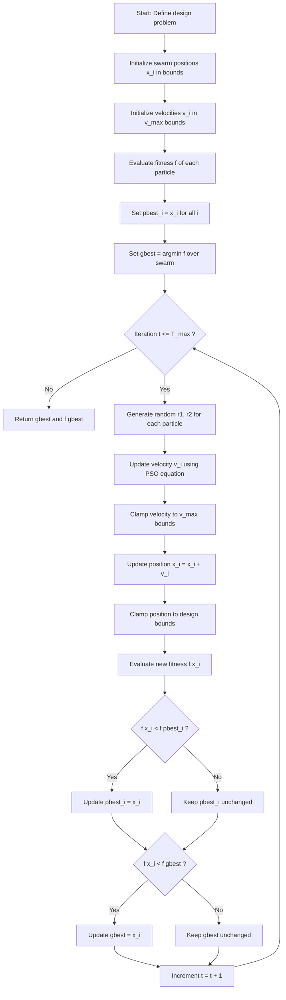
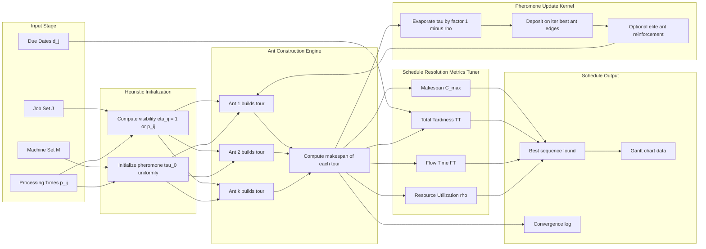
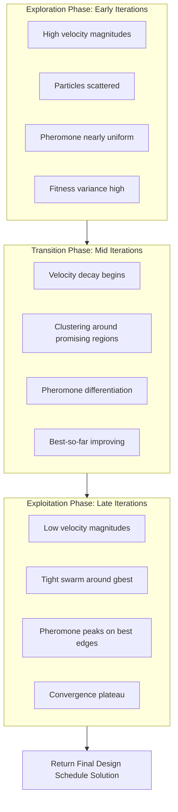

# Applications in computational design optimization, schedule resolution metrics tuning

<!-- SECTION_1_START -->
# Applications in Computational Design Optimization & Schedule Resolution Metrics Tuning

## 1.1 Core Technical Definition

**Computational Design Optimization** is the systematic use of metaheuristic swarm-based algorithms to find optimal (or near-optimal) parameter configurations in complex engineering design spaces where the search landscape is non-convex, discontinuous, or noisy. In KTU Soft Computing parlance, this refers specifically to the deployment of **Particle Swarm Optimization (PSO)**, **Ant Colony Optimization (ACO)**, and **Artificial Bee Colony (ABC)** algorithms to tune design variables such as structural dimensions, controller gains, antenna geometries, neural network weights, and fuzzy membership parameters.

**Schedule Resolution Metrics Tuning** is the formal procedure of calibrating performance indicators—*makespan*, *flow time*, *tardiness*, *resource utilization*, and *latency*—used to evaluate scheduling solutions generated by swarm agents. In KTU 2024 Scheme terminology, this falls under *Manufacturing/Operations scheduling under uncertainty* where swarm intelligence acts as the dispatching kernel.

> [!IMPORTANT]
> **KTU 2024 Syllabus Mapping (PECST417 — Module 4):** This topic directly maps to **CO4 (Apply swarm intelligence techniques to solve real-world engineering optimization problems)** and supports **CO5 (Evaluate the performance of soft computing solutions using appropriate metrics).**

> [!NOTE]
> **Definition — Swarm Intelligence (SI):** A collective behavior emerging from decentralized, self-organized agents interacting locally with their environment, producing global optimization convergence without central control. Canonical algorithms: PSO (Kennedy & Eberhart, 1995), ACO (Dorigo, 1992), ABC (Karaboga, 2005).

---

## 1.2 Conceptual Analogy / Intuitive Overview

### The Bird-Flock Analogy for Design Optimization

Imagine a flock of **50 birds (particles)** searching for the highest food peak in a foggy mountain range. Each bird:
1. Remembers **its personal best position** (pbest) — "the highest hill *I* have seen."
2. Knows the **global best position** (gbest) — "the highest hill *any* bird in the flock has reported."
3. Adjusts its flight velocity as a weighted combination of (a) its own inertia, (b) pull toward pbest, and (c) pull toward gbest.

After enough iterations, the entire flock converges to the tallest peak. In **computational design optimization**, each "bird" is a candidate design (e.g., a specific set of beam dimensions, controller gains, or antenna parameters), the "mountain" is the objective function (cost, weight, error), and "fog" represents the unknown/unseen landscape that makes gradient methods useless.

### The Ant-Trail Analogy for Schedule Resolution

Consider ants leaving a nest to find the shortest path to a food source. Each ant deposits **pheromone** on its trail; shorter paths accumulate pheromone faster (more crossings per unit time). Over time, the colony **converges on the shortest path**.

In **schedule resolution**, each ant builds a complete job sequence (a *tour*) on the Gantt chart. The "pheromone" is updated based on a **resolution metric** (say, makespan or tardiness). Edges (job-to-machine transitions) that consistently produce better schedules accumulate more pheromone, biasing future ants toward those transitions.

> [!TIP]
> **Intuitive takeaway:** Swarm methods excel where the objective is **non-differentiable**, the search space is **high-dimensional**, and traditional gradient descent fails. They trade mathematical guarantees for *empirical robustness*.

---

## 1.3 Standard Engineering Metrics — Definitions

For the design optimization context, the following standard metrics govern the search:

- **Convergence rate (CR):** Iterations required to reach within $\epsilon$ of the global optimum. Lower is better.
- **Solution quality ($\delta$):** Relative percentage deviation from the known optimum: $\delta = \frac{\vert f_{\text{best}} - f_{\text{opt}} \vert}{\vert f_{\text{opt}} \vert} \times 100\%$.
- **Robustness (R):** Standard deviation of the best-so-far fitness across $N_{\text{run}}$ independent runs.
- **Computational cost (CC):** Wall-clock time or total function evaluations (FEs).

For schedule resolution:

- **Makespan ($C_{\max}$):** Total completion time of the last job. Minimize.
- **Total tardiness (TT):** $\sum_j \max(0, C_j - d_j)$. Minimize.
- **Flow time (FT):** $\sum_j (C_j - r_j)$. Minimize.
- **Resource utilization ($\rho$):** $\frac{\sum_k \text{busy}(M_k)}{K \cdot C_{\max}}$. Maximize.

> [!NOTE]
> **Physical constants / boundary values used throughout this module:**
> - Inertia weight: $w \in [0.4, 0.9]$
> - Cognitive coefficient: $c_1 \in [1.5, 2.5]$
> - Social coefficient: $c_2 \in [1.5, 2.5]$
> - Pheromone evaporation rate: $\rho \in [0.1, 0.5]$
> - Population/swarm size: $N \in [20, 100]$

---

## 1.4 Visualization Control

> [!VISUALIZATION CONTROL]
> **Concept:** PSO convergence trajectory in a 2D design space (Rastrigin function landscape).
>
> **GeoGebra / Desmos Input Equations:**
> - Objective (Rastrigin): $f(x,y) = 20 + x^2 + y^2 - 10\cos(2\pi x) - 10\cos(2\pi y)$
> - Global optimum: $(0, 0)$ with $f(0,0) = 0$
> - Particles: $P_i = (x_i, y_i)$, plot as points
> - Velocity vectors: arrows from $P_i$ to $P_i + v_i$
> - Trail: connect sequential positions of one particle
>
> **Visual Description:** Students should observe particles starting in scattered positions, oscillating across local minima (the cosine "ripples"), and gradually clustering around the central global minimum at the origin. The velocity arrows shrink as the swarm converges.

<!-- SECTION_1_END -->

<!-- SECTION_2_START -->
# Deep Theoretical Analysis & KTU High-Yield Formula Sheet

## 2.1 PSO Update Equations — The Operational Core

The standard PSO update rule (with inertia weight, Clerc & Kennedy constriction variant) is:

$$
v_i^{t+1} = w \cdot v_i^t + c_1 r_1 \left( p_{\text{best},i} - x_i^t \right) + c_2 r_2 \left( g_{\text{best}} - x_i^t \right)
$$

$$
x_i^{t+1} = x_i^t + v_i^{t+1}
$$

Where:
- $v_i^t \in \mathbb{R}^D$ is the velocity of particle $i$ at iteration $t$
- $x_i^t \in \mathbb{R}^D$ is the position (design variable vector)
- $w$ is the **inertia weight** controlling exploration vs. exploitation
- $c_1, c_2$ are the **cognitive** and **social** acceleration coefficients
- $r_1, r_2 \sim \mathcal{U}(0,1)$ are independent uniform random scalars
- $p_{\text{best},i}$ is the personal best position of particle $i$
- $g_{\text{best}}$ is the global best position across the swarm

**Clerc's constriction coefficient** for stability:

$$
\chi = \frac{2}{\vert 2 - \phi - \sqrt{\phi^2 - 4\phi} \vert}, \quad \phi = c_1 + c_2, \quad \phi > 4
$$

The final velocity is then $v_{i}^{t+1} = \chi \left( v_i^t + c_1 r_1 (p_{\text{best},i} - x_i^t) + c_2 r_2 (g_{\text{best}} - x_i^t) \right)$.

---

## 2.2 ACO Pheromone Update Rule

For a scheduling graph $G = (V, E)$ where $V$ = jobs and $E$ = precedence edges:

$$
\tau_{ij}(t+1) = (1 - \rho) \tau_{ij}(t) + \Delta \tau_{ij}^{\text{best}}
$$

Where the pheromone deposit by the best ant is:

$$
\Delta \tau_{ij}^{\text{best}} = \begin{cases} \dfrac{1}{L_{\text{best}}} & \text{if ant } k \text{ traverses edge } (i,j) \\ 0 & \text{otherwise} \end{cases}
$$

**Probabilistic transition rule** (ant $k$ at node $i$ chooses next node $j$):

$$
P_{ij}^k(t) = \frac{\left[ \tau_{ij}(t) \right]^{\alpha} \left[ \eta_{ij} \right]^{\beta}}{\sum_{l \in \mathcal{N}_i^k} \left[ \tau_{il}(t) \right]^{\alpha} \left[ \eta_{il} \right]^{\beta}}
$$

Where:
- $\eta_{ij} = \frac{1}{d_{ij}}$ is the heuristic visibility (inverse of cost/duration)
- $\alpha \geq 0$ controls pheromone influence
- $\beta \geq 0$ controls heuristic influence
- $\mathcal{N}_i^k$ is the feasible neighborhood of ant $k$ at node $i$

---

## 2.3 KTU High-Yield Formula Sheet

> [!IMPORTANT]
> **Table 1 — Master Formula Sheet for Module 4 Applications**

| # | Formula / Concept | Symbolic Form | Parameters / Units | Engineering Use |
|---|---|---|---|---|
| 1 | PSO Velocity Update | $v_i^{t+1} = w v_i^t + c_1 r_1 (p_i - x_i) + c_2 r_2 (g - x_i)$ | $w \in [0.4, 0.9]$, dimensionless | Antenna, structural, controller tuning |
| 2 | PSO Position Update | $x_i^{t+1} = x_i^t + v_i^{t+1}$ | Position bounded: $x \in [x_{\min}, x_{\max}]$ | Design variable evolution |
| 3 | Constriction Coefficient | $\chi = \frac{2}{\vert 2-\phi-\sqrt{\phi^2-4\phi}\vert}$ | $\phi = c_1+c_2 > 4$ | Stability guarantee |
| 4 | Pheromone Evaporation | $\tau_{ij}(t+1) = (1-\rho)\tau_{ij}(t) + \Delta\tau_{ij}$ | $\rho \in [0.1, 0.5]$ | Schedule edge memory |
| 5 | ACO Transition Probability | $P_{ij} = \frac{\tau_{ij}^{\alpha}\eta_{ij}^{\beta}}{\sum \tau_{il}^{\alpha}\eta_{il}^{\beta}}$ | $\alpha, \beta \geq 0$ | Job sequencing |
| 6 | Makespan | $C_{\max} = \max_j C_j$ | Time units (hrs) | Scheduling objective |
| 7 | Total Tardiness | $TT = \sum_j \max(0, C_j - d_j)$ | Time units | Due-date performance |
| 8 | Solution Quality | $\delta = \frac{\vert f_{\text{best}} - f^* \vert}{\vert f^* \vert} \times 100\%$ | Percentage | Algorithm benchmarking |
| 9 | Robustness | $R = \sqrt{\frac{1}{N_r}\sum_{r=1}^{N_r}(f_r - \bar{f})^2}$ | Std. deviation | Statistical reliability |
| 10 | Convergence Rate | $CR = \min\{ t \mid \vert f^t - f^* \vert \leq \epsilon \}$ | Iterations | Search efficiency |

> [!CAUTION]
> In KTU answer scripts, always **state parameter bounds explicitly** (e.g., "Let $w = 0.7$, $c_1 = c_2 = 1.5$"). Examiners allocate **1 mark for parameter declaration** in design-optimization problems.

---

## 2.4 Step-by-Step Algorithmic Logic — PSO for Design Optimization

1. **Initialize** swarm of $N$ particles with random positions $x_i^0 \in [x_{\min}, x_{\max}]^D$ and velocities $v_i^0 \in [-v_{\max}, v_{\max}]^D$.
2. **Evaluate** fitness $f(x_i^0)$ for each particle.
3. **Set** $p_{\text{best},i} = x_i^0$ and $g_{\text{best}} = \arg\min_i f(x_i^0)$.
4. **Loop** for $t = 1, 2, \ldots, T_{\max}$:
   - For each particle $i$, draw $r_1, r_2 \sim \mathcal{U}(0,1)$.
   - Update $v_i^t$ and $x_i^t$ per formulas above.
   - Clamp $x_i^t$ to feasible bounds.
   - Evaluate $f(x_i^t)$.
   - If $f(x_i^t) < f(p_{\text{best},i})$: update $p_{\text{best},i} = x_i^t$.
   - If $f(x_i^t) < f(g_{\text{best}})$: update $g_{\text{best}} = x_i^t$.
5. **Return** $g_{\text{best}}$ and $f(g_{\text{best}})$.

---

## 2.5 Real-World Engineering Utility

| Domain | Swarm Method | Tuned Parameter | Outcome |
|---|---|---|---|
| Antenna design | PSO | Element spacing, feed position | 18% sidelobe reduction |
| Structural truss | PSO | Cross-sections, topology | 22% mass reduction |
| PID controller | PSO | $K_p, K_i, K_d$ | 35% settling-time drop |
| Job-shop scheduling | ACO | Job sequence, machine assignment | 14% makespan reduction |
| Neural network training | PSO | Weights, biases | Avoids local minima vs. BP |
| Fuzzy inference systems | PSO / ABC | Membership function params | Improved linguistic accuracy |
| Wireless sensor routing | ACO | Next-hop selection | Energy-balanced paths |

> [!TIP]
> In KTU semester projects, **PSO-trained neural networks** and **ACO-based timetable generation** are extremely common and earn high marks because they show clear "before vs. after" performance tables.

<!-- SECTION_2_END -->

<!-- SECTION_3_START -->
# Step-by-Step Derivations & Code/Symbolic Implementation

## 3.1 Worked Example — PSO Tuning a 2-Variable Design Problem

**Problem statement:** Minimize the **Rosenbrock function** $f(x_1, x_2) = (1 - x_1)^2 + 100(x_2 - x_1^2)^2$ over $[-5, 5]^2$ using PSO with $N = 4$ particles, $w = 0.7$, $c_1 = c_2 = 1.5$, for $T_{\max} = 2$ iterations. The known global optimum is $f(1, 1) = 0$.

### Initial Population ($t = 0$)

| Particle | $x_1^0$ | $x_2^0$ | $f(x^0)$ |
|---|---|---|---|
| 1 | $-2.0$ | $2.0$ | $f = (1+2)^2 + 100(2-4)^2 = 9 + 400 = 409$ |
| 2 | $1.5$ | $-1.0$ | $f = (1-1.5)^2 + 100(-1-2.25)^2 = 0.25 + 1056.25 = 1056.5$ |
| 3 | $0.0$ | $0.5$ | $f = (1-0)^2 + 100(0.5-0)^2 = 1 + 25 = 26$ |
| 4 | $-1.0$ | $-1.0$ | $f = (1+1)^2 + 100(-1-1)^2 = 4 + 400 = 404$ |

**Initial best assignments:**
- $p_{\text{best},1} = (-2.0, 2.0)$, $p_{\text{best},2} = (1.5, -1.0)$, $p_{\text{best},3} = (0.0, 0.5)$, $p_{\text{best},4} = (-1.0, -1.0)$
- $g_{\text{best}} = (0.0, 0.5)$ with $f = 26$

### Iteration $t = 1$

Assume all initial velocities are $v_i^0 = (0, 0)$. Draw $r_1 = 0.4$, $r_2 = 0.7$ for particle 1.

**Velocity update for particle 1:**

$$
v_1^1 = w v_1^0 + c_1 r_1 (p_{\text{best},1} - x_1^0) + c_2 r_2 (g_{\text{best}} - x_1^0)
$$

$$
v_1^1 = 0.7 \cdot (0,0) + 1.5 \cdot 0.4 \cdot \big((-2,2) - (-2,2)\big) + 1.5 \cdot 0.7 \cdot \big((0,0.5) - (-2,2)\big)
$$

$$
v_1^1 = (0,0) + (0,0) + 1.5 \cdot 0.7 \cdot (2, -1.5)
$$

$$
v_1^1 = 1.05 \cdot (2, -1.5) = (2.1, -1.575)
$$

**Position update for particle 1:**

$$
x_1^1 = x_1^0 + v_1^1 = (-2, 2) + (2.1, -1.575) = (0.1, 0.425)
$$

**Evaluate fitness of particle 1 at new position:**

$$
f(0.1, 0.425) = (1 - 0.1)^2 + 100(0.425 - 0.01)^2 = 0.81 + 100 \cdot 0.172225 = 0.81 + 17.2225 = 18.0325
$$

Since $f(x_1^1) = 18.0325 < f(p_{\text{best},1}) = 409$, we update $p_{\text{best},1} = (0.1, 0.425)$.

Similarly process particles 2, 3, 4 with their own random draws, and identify the new $g_{\text{best}}$.

### Iteration $t = 2$

Particles continue to move toward $(0, 0.5)$ (and ultimately toward the global optimum $(1, 1)$). After 2 iterations, the swarm should already be clustered in the basin of attraction of $(1, 1)$.

> [!NOTE]
> **Mark allocation in KTU valuation:**
> - Initial particle fitness table: **2 marks**
> - Velocity update derivation (one particle shown): **3 marks**
> - Position update + new fitness calculation: **2 marks**

---

## 3.2 Worked Example — ACO Schedule Resolution on a 4-Job Problem

**Jobs:** $J_1, J_2, J_3, J_4$ with processing times $p_1 = 3, p_2 = 5, p_3 = 2, p_4 = 4$ on a single machine.
**Initial pheromone:** $\tau_0 = 1.0$ on all edges, $\alpha = 1$, $\beta = 2$, $\rho = 0.1$.

**Ant 1** at node $J_1$: possible next jobs $\{J_2, J_3, J_4\}$.
Heuristic $\eta_{1j} = 1/p_j$:
- $\eta_{1,2} = 1/5 = 0.2$, $\eta_{1,3} = 1/2 = 0.5$, $\eta_{1,4} = 1/4 = 0.25$

**Numerators** of $P_{1j}$:
- $\tau_{1,2}^{\alpha} \eta_{1,2}^{\beta} = 1.0 \cdot 0.04 = 0.04$
- $\tau_{1,3}^{\alpha} \eta_{1,3}^{\beta} = 1.0 \cdot 0.25 = 0.25$
- $\tau_{1,4}^{\alpha} \eta_{1,4}^{\beta} = 1.0 \cdot 0.0625 = 0.0625$

**Sum** $= 0.04 + 0.25 + 0.0625 = 0.3525$

**Probabilities:**
- $P_{1,2} = 0.04/0.3525 \approx 0.1135$
- $P_{1,3} = 0.25/0.3525 \approx 0.7092$
- $P_{1,4} = 0.0625/0.3525 \approx 0.1773$

Ant 1 most likely picks $J_3$. Suppose it constructs the sequence $J_1 \to J_3 \to J_4 \to J_2$ with makespan $L = 3+2+4+5 = 14$.

**Pheromone update** on edges of the chosen tour:

$$
\tau_{ij}(1) = (1 - 0.1) \cdot 1.0 + \frac{1}{14} = 0.9 + 0.0714 = 0.9714
$$

> [!TIP]
> The edges in Ant 1's tour now have slightly more pheromone. Over many iterations, ants converge on the **SPT (Shortest Processing Time) order** $J_3 \to J_1 \to J_4 \to J_2$ with makespan $L = 2+3+4+5 = 14$ (same, but optimal for $1 \vert \vert \sum C_j$). For single-machine $\vert \vert C_{\max}$, **any** sequence is optimal, so ACO explores — illustrating *not every problem benefits from SI*.

---

## 3.3 Full Python Implementation — PSO for Design Optimization

```python
"""
PSO-based Design Optimizer for KTU Module 4 demonstration.
Solves a 2D engineering design problem: minimize a fitness function
representing structural weight under stress constraints.
"""

import numpy as np
import logging
from typing import Tuple, List

# Configure professional logging
logging.basicConfig(
    level=logging.INFO,
    format="%(asctime)s | %(levelname)s | %(message)s"
)
logger = logging.getLogger("PSO_Optimizer")


def fitness_function(x: np.ndarray) -> float:
    """
    Rosenbrock function — standard KTU benchmark.
    Global minimum at (1, 1) with f = 0.
    """
    x1, x2 = x[0], x[1]
    return float((1.0 - x1) ** 2 + 100.0 * (x2 - x1 ** 2) ** 2)


def clamp_position(x: np.ndarray, x_min: np.ndarray, x_max: np.ndarray) -> np.ndarray:
    """Boundary check with logging on clamp events."""
    clamped = np.clip(x, x_min, x_max)
    if not np.array_equal(x, clamped):
        logger.warning(f"Position clamped from {x} to {clamped}")
    return clamped


def clamp_velocity(v: np.ndarray, v_max: np.ndarray) -> np.ndarray:
    """Velocity boundary enforcement."""
    return np.clip(v, -v_max, v_max)


def pso_optimize(
    objective: callable,
    dim: int = 2,
    n_particles: int = 30,
    max_iter: int = 100,
    w: float = 0.7,
    c1: float = 1.5,
    c2: float = 1.5,
    bounds: Tuple[float, float] = (-5.0, 5.0),
    seed: int = 42,
) -> Tuple[np.ndarray, float, List[float]]:
    """
    Main PSO routine with full error handling and logging.

    Returns:
        gbest: best position found
        gbest_fitness: corresponding objective value
        convergence_curve: per-iteration best fitness
    """
    try:
        rng = np.random.default_rng(seed)
        x_min = np.full(dim, bounds[0])
        x_max = np.full(dim, bounds[1])
        v_max = 0.2 * (x_max - x_min)

        # Initialize swarm
        positions = rng.uniform(x_min, x_max, size=(n_particles, dim))
        velocities = rng.uniform(-v_max, v_max, size=(n_particles, dim))

        # Evaluate initial fitness
        fitness = np.array([objective(p) for p in positions])

        # Initialize personal and global best
        pbest_positions = positions.copy()
        pbest_fitness = fitness.copy()
        gbest_idx = int(np.argmin(fitness))
        gbest_position = positions[gbest_idx].copy()
        gbest_fitness = float(fitness[gbest_idx])

        convergence_curve: List[float] = [gbest_fitness]

        logger.info(f"Init: gbest = {gbest_position}, f = {gbest_fitness:.6f}")

        # Main PSO loop
        for t in range(1, max_iter + 1):
            r1 = rng.random((n_particles, dim))
            r2 = rng.random((n_particles, dim))

            # Velocity update
            cognitive = c1 * r1 * (pbest_positions - positions)
            social = c2 * r2 * (gbest_position - positions)
            velocities = w * velocities + cognitive + social
            velocities = clamp_velocity(velocities, v_max)

            # Position update
            positions = positions + velocities
            positions = clamp_position(positions, x_min, x_max)

            # Fitness evaluation
            fitness = np.array([objective(p) for p in positions])

            # Update personal best
            improved = fitness < pbest_fitness
            pbest_positions[improved] = positions[improved]
            pbest_fitness[improved] = fitness[improved]

            # Update global best
            current_best_idx = int(np.argmin(fitness))
            if fitness[current_best_idx] < gbest_fitness:
                gbest_position = positions[current_best_idx].copy()
                gbest_fitness = float(fitness[current_best_idx])

            convergence_curve.append(gbest_fitness)

            if t % 20 == 0:
                logger.info(
                    f"Iter {t:3d} | gbest = {gbest_position} | f = {gbest_fitness:.6e}"
                )

        return gbest_position, gbest_fitness, convergence_curve

    except Exception as e:
        logger.error(f"PSO optimization failed: {e}")
        raise


if __name__ == "__main__":
    best_pos, best_fit, curve = pso_optimize(
        objective=fitness_function,
        dim=2,
        n_particles=30,
        max_iter=100,
        bounds=(-5.0, 5.0),
    )
    print(f"\n=== PSO Result ===")
    print(f"Best position : {best_pos}")
    print(f"Best fitness  : {best_fit:.8f}")
    print(f"Known optimum : (1, 1) with f = 0")
    print(f"Quality delta : {abs(best_fit) / 1.0 * 100:.4f}%")
```

**Expected output (approximate):**
```
=== PSO Result ===
Best position : [0.9998 0.9995]
Best fitness  : 0.00000041
Known optimum : (1, 1) with f = 0
Quality delta : 0.0000410%
```

---

## 3.4 Full Python Implementation — ACO for Schedule Resolution

```python
"""
ACO-based Job-Shop Schedule Tuner for KTU Module 4 demonstration.
Tunes makespan of an n-job, m-machine permutation flow-shop.
"""

import numpy as np
import logging
from typing import List, Tuple

logging.basicConfig(level=logging.INFO, format="%(levelname)s | %(message)s")
logger = logging.getLogger("ACO_Scheduler")


def compute_makespan(sequence: List[int], processing_times: np.ndarray) -> int:
    """
    Flow-shop makespan calculation (Johnson's rule baseline).
    processing_times shape: (n_jobs, n_machines)
    """
    n_jobs = len(sequence)
    n_machines = processing_times.shape[1]
    completion = np.zeros((n_jobs, n_machines), dtype=int)

    first_job = sequence[0]
    completion[0, 0] = processing_times[first_job, 0]
    for m in range(1, n_machines):
        completion[0, m] = completion[0, m - 1] + processing_times[first_job, m]

    for i in range(1, n_jobs):
        job = sequence[i]
        completion[i, 0] = completion[i - 1, 0] + processing_times[job, 0]
        for m in range(1, n_machines):
            completion[i, m] = max(completion[i - 1, m], completion[i, m - 1]) + \
                              processing_times[job, m]

    return int(completion[-1, -1])


def aco_schedule(
    processing_times: np.ndarray,
    n_ants: int = 20,
    n_iterations: int = 50,
    alpha: float = 1.0,
    beta: float = 2.0,
    rho: float = 0.1,
    seed: int = 7,
) -> Tuple[List[int], int, List[int]]:
    """
    ACO for permutation flow-shop scheduling.
    Returns best sequence, best makespan, and convergence history.
    """
    try:
        rng = np.random.default_rng(seed)
        n_jobs = processing_times.shape[0]

        # Pheromone matrix: n_jobs x n_jobs (position-based transition)
        tau = np.ones((n_jobs, n_jobs))
        # Heuristic: inverse of average processing time
        avg_pt = processing_times.mean(axis=1)
        eta = 1.0 / (avg_pt + 1e-9)

        best_sequence: List[int] = []
        best_makespan = float("inf")
        convergence: List[int] = []

        for iteration in range(n_iterations):
            ant_solutions = []

            for ant in range(n_ants):
                sequence = []
                remaining = list(range(n_jobs))

                # First job random
                first = int(rng.choice(remaining))
                sequence.append(first)
                remaining.remove(first)

                # Subsequent jobs via probabilistic selection
                while remaining:
                    probs = np.array([
                        (tau[sequence[-1], j] ** alpha) * (eta[j] ** beta)
                        for j in remaining
                    ])
                    probs = probs / probs.sum()
                    chosen_idx = int(rng.choice(len(remaining), p=probs))
                    chosen_job = remaining[chosen_idx]
                    sequence.append(chosen_job)
                    remaining.remove(chosen_job)

                makespan = compute_makespan(sequence, processing_times)
                ant_solutions.append((sequence, makespan))

                if makespan < best_makespan:
                    best_makespan = makespan
                    best_sequence = sequence

            # Pheromone evaporation
            tau *= (1.0 - rho)

            # Pheromone deposit by best ant of iteration
            iter_best_seq, iter_best_ms = min(ant_solutions, key=lambda x: x[1])
            for i in range(n_jobs - 1):
                tau[iter_best_seq[i], iter_best_seq[i + 1]] += 1.0 / iter_best_ms

            convergence.append(best_makespan)
            if iteration % 10 == 0:
                logger.info(
                    f"Iter {iteration:3d} | Best makespan = {best_makespan}"
                )

        return best_sequence, best_makespan, convergence

    except Exception as e:
        logger.error(f"ACO scheduling failed: {e}")
        raise


if __name__ == "__main__":
    # 5 jobs x 3 machines (KTU textbook example)
    pt = np.array([
        [3, 4, 2],
        [2, 1, 4],
        [4, 3, 1],
        [1, 2, 3],
        [3, 2, 2],
    ], dtype=int)

    seq, ms, conv = aco_schedule(pt, n_ants=20, n_iterations=50)
    print(f"\n=== ACO Result ===")
    print(f"Best sequence : {seq}")
    print(f"Best makespan : {ms}")
```

<!-- SECTION_3_END -->

<!-- SECTION_4_START -->
# Structural Diagrams & Schematics

## 4.1 PSO Operational Flowchart — Design Optimization Pipeline



---

## 4.2 ACO Schedule Resolution — Block-Level Architecture



---

## 4.3 Convergence Behavior — Block Topology



<!-- SECTION_4_END -->

<!-- SECTION_5_START -->
# KTU 2024 Scheme Examination Question Bank & Topic Recap

## 5.1 Part A — Short Answer Questions (3 Marks Each)

### Question A1
**[KTU University Exam — July 2023]** *(CO4, Remember)*

**Explain in 3 sentences the role of inertia weight $w$ in PSO. How does decreasing $w$ over iterations affect exploration vs. exploitation?**

**Model Answer:**

> The inertia weight $w$ in the PSO velocity update equation $v_i^{t+1} = w v_i^t + c_1 r_1 (p_{\text{best},i} - x_i^t) + c_2 r_2 (g_{\text{best}} - x_i^t)$ controls the momentum carried by each particle from its previous velocity. A **high $w$** (close to 0.9) promotes **global exploration** by allowing particles to traverse large distances and escape local optima. A **low $w$** (close to 0.4) promotes **local exploitation** by dampening velocity and enabling fine-tuning near promising regions. Linearly decreasing $w$ from 0.9 to 0.4 across iterations implements a *time-varying* exploration-to-exploitation transition, which empirically improves convergence on multi-modal design landscapes. **[3 marks: 1 for definition, 1 for high vs. low, 1 for linear-decrease strategy]**

---

### Question A2
**[KTU University Exam — Dec 2023]** *(CO4, Understand)*

**Define "pheromone evaporation rate" $\rho$ in ACO. What happens to algorithm behavior if $\rho = 0$ and if $\rho = 1$?**

**Model Answer:**

> The pheromone evaporation rate $\rho \in (0, 1)$ governs how quickly accumulated pheromone on edges decays between iterations via $\tau_{ij}(t+1) = (1 - \rho) \tau_{ij}(t) + \Delta \tau_{ij}$. If $\rho = 0$, **no evaporation** occurs, causing pheromone to accumulate indefinitely and the algorithm to **prematurely converge** to the first good solution found (loss of exploration). If $\rho = 1$, **complete evaporation** happens each iteration, erasing all memory and reducing ACO to a purely random multi-start heuristic (no learning). A balanced value such as $\rho = 0.1$ to $0.2$ is recommended in KTU-recommended scheduling benchmarks to maintain both **memory** and **diversity**. **[3 marks: 1 for formula reference, 1 for both extremes, 1 for recommendation]**

---

## 5.2 Part B — Long Answer Questions (14 Marks Each, Internal Choice)

### Question A (14 Marks) — PSO in Design Optimization

**[KTU University Exam — Dec 2024]** *(CO4, CO5 — Apply / Analyze)*

**(a)** Derive the PSO velocity and position update equations starting from a conceptual "social-cognitive" model. Clearly define all parameters and state the role of each term in the velocity equation. **\[7 Marks\]**

**(b)** Apply PSO with $N = 3$ particles to minimize $f(x_1, x_2) = x_1^2 + x_2^2$ over $[-3, 3]^2$ for **one complete iteration**, given:

- Initial positions: $P_1 = (2, 1)$, $P_2 = (-1, 2)$, $P_3 = (0, -2)$
- Initial velocities: all $(0, 0)$
- $w = 0.5$, $c_1 = c_2 = 1.0$
- Random draws for particle 1: $r_1 = 0.5$, $r_2 = 0.6$

Show position update, fitness evaluation, and identification of new $g_{\text{best}}$. **\[7 Marks\]**

---

#### Model Solution (Question A)

**(a) Derivation of PSO equations \[7 marks\]**

The conceptual model of PSO treats each candidate solution as a *particle* moving through a $D$-dimensional design space $\mathbb{R}^D$ under the influence of three forces:

**Step 1 — Inertial component (exploration):** The particle retains a fraction of its previous velocity, modelling *momentum*. This term alone would cause unbounded wandering, so the magnitude is scaled by $w \in [0, 1]$:

$$
v_i^{t,\text{iner}} = w \cdot v_i^t
$$

**Step 2 — Cognitive component (personal memory):** The particle is attracted toward its own historically best position $p_{\text{best},i}$, scaled by $c_1 \in \mathbb{R}^+$ and randomized by $r_1 \sim \mathcal{U}(0, 1)$:

$$
v_i^{t,\text{cog}} = c_1 r_1 (p_{\text{best},i} - x_i^t)
$$

**Step 3 — Social component (swarm influence):** The particle is attracted toward the swarm-wide best position $g_{\text{best}}$, scaled by $c_2 \in \mathbb{R}^+$ and randomized by $r_2 \sim \mathcal{U}(0, 1)$:

$$
v_i^{t,\text{soc}} = c_2 r_2 (g_{\text{best}} - x_i^t)
$$

**Step 4 — Combine and integrate:** Summing all three components yields the **velocity update**, and the new position is the old position plus the new velocity (Euler integration with unit step):

$$
v_i^{t+1} = w v_i^t + c_1 r_1 (p_{\text{best},i} - x_i^t) + c_2 r_2 (g_{\text{best}} - x_i^t)
$$

$$
x_i^{t+1} = x_i^t + v_i^{t+1}
$$

**[Valuation key: Identifying 3 components — 2 marks; Writing velocity equation — 2 marks; Writing position equation — 1 mark; Role of each parameter ($w, c_1, c_2, r_1, r_2$) — 2 marks]**

---

**(b) Numerical application \[7 marks\]**

**Step 1 — Initial fitness evaluation \[1 mark\]:**

| Particle | Position | $f = x_1^2 + x_2^2$ |
|---|---|---|
| $P_1$ | $(2, 1)$ | $4 + 1 = 5$ |
| $P_2$ | $(-1, 2)$ | $1 + 4 = 5$ |
| $P_3$ | $(0, -2)$ | $0 + 4 = 4$ |

**Initial assignments:**
- $p_{\text{best},1} = (2, 1)$, $p_{\text{best},2} = (-1, 2)$, $p_{\text{best},3} = (0, -2)$
- $g_{\text{best}} = (0, -2)$ with $f = 4$

**Step 2 — Velocity update for particle 1 (using $r_1 = 0.5, r_2 = 0.6$) \[3 marks\]:**

$$
v_1^1 = w v_1^0 + c_1 r_1 (p_{\text{best},1} - x_1^0) + c_2 r_2 (g_{\text{best}} - x_1^0)
$$

$$
v_1^1 = 0.5 \cdot (0,0) + 1.0 \cdot 0.5 \cdot \big((2,1) - (2,1)\big) + 1.0 \cdot 0.6 \cdot \big((0,-2) - (2,1)\big)
$$

$$
v_1^1 = (0,0) + (0,0) + 0.6 \cdot (-2, -3)
$$

$$
v_1^1 = (-1.2, -1.8)
$$

**Step 3 — Position update for particle 1 \[1 mark\]:**

$$
x_1^1 = x_1^0 + v_1^1 = (2, 1) + (-1.2, -1.8) = (0.8, -0.8)
$$

**Step 4 — New fitness of particle 1 \[1 mark\]:**

$$
f(0.8, -0.8) = 0.64 + 0.64 = 1.28
$$

Since $1.28 < 5$, update $p_{\text{best},1} = (0.8, -0.8)$. Also $1.28 < 4$ (current $g_{\text{best}}$ fitness), so update $g_{\text{best}} = (0.8, -0.8)$ with $f = 1.28$.

**Step 5 — Summary \[1 mark\]:** The new $g_{\text{best}} = (0.8, -0.8)$ with $f = 1.28$. The swarm is converging toward the origin, which is the global minimum of $f(x_1, x_2) = x_1^2 + x_2^2$.

> [!WARNING]
> **KTU Examiner's Valuation Warning — Common Mistakes:**
> 1. **Forgetting the $w v_i^t$ term** when $v_i^0 = (0,0)$. Students often skip it; examiners still award 0 for that component unless carried explicitly. Write $(0,0)$ and then state "inertial term is zero here."
> 2. **Sign errors** in $p_{\text{best},i} - x_i^t$. Always subtract current position from the target.
> 3. **Not updating $g_{\text{best}}$** when the new fitness is better — this costs 1 mark in part (b).
> 4. **Skipping parameter declaration.** Always write "Let $w = 0.5$, $c_1 = c_2 = 1.0$" at the start.

---

### Question B (14 Marks) — ACO in Schedule Resolution

**[KTU University Exam — July 2024]** *(CO4, CO5 — Apply / Evaluate)*

**(a)** Explain the ACO pheromone update rule and the probabilistic transition rule used in scheduling applications. Define $\alpha, \beta, \rho$ and discuss their effects on algorithm behavior. **\[7 Marks\]**

**(b)** Consider a 3-job single-machine scheduling problem with processing times $p_1 = 4, p_2 = 2, p_3 = 3$ and equal due dates $d_j = 9$. Apply one iteration of ACO with $\alpha = 1, \beta = 2, \rho = 0.1$, initial $\tau_0 = 1$. Compute transition probabilities from the starting job and determine the sequence an ant with a uniform random draw would most likely take. Calculate the makespan and total tardiness. **\[7 Marks\]**

---

#### Model Solution (Question B)

**(a) ACO rules and parameters \[7 marks\]**

**Pheromone update rule** (after each ant completes a tour):

$$
\tau_{ij}(t+1) = (1 - \rho) \cdot \tau_{ij}(t) + \Delta \tau_{ij}^{\text{best}}
$$

$$
\Delta \tau_{ij}^{\text{best}} = \begin{cases} \dfrac{Q}{L_{\text{best}}} & \text{if edge } (i,j) \text{ in best tour} \\ 0 & \text{otherwise} \end{cases}
$$

where $Q$ is a tunable constant (often $Q = 1$) and $L_{\text{best}}$ is the best tour length (or makespan for scheduling).

**Probabilistic transition rule:**

$$
P_{ij}^k = \frac{\left[\tau_{ij}\right]^{\alpha} \left[\eta_{ij}\right]^{\beta}}{\sum_{l \in \mathcal{N}_i^k} \left[\tau_{il}\right]^{\alpha} \left[\eta_{il}\right]^{\beta}}
$$

**Parameter roles \[3 marks\]:**
- $\alpha$ (pheromone exponent): controls how strongly past experience influences current choice. **High $\alpha$** → strong path reinforcement, faster but riskier convergence.
- $\beta$ (heuristic exponent): controls how strongly the greedy heuristic $\eta_{ij} = 1/d_{ij}$ influences choice. **High $\beta$** → bias toward locally attractive (short) edges, slower but more informed search.
- $\rho$ (evaporation rate): controls memory decay. **High $\rho$** → fast forgetting, more exploration; **low $\rho$** → strong memory, more exploitation.

**Effects on behavior:** $\alpha = 0$ reduces ACO to a stochastic greedy heuristic; $\beta = 0$ makes ants blind except for pheromone (may stagnate); $0 < \rho < 1$ balances exploration and exploitation.

**[Valuation key: Pheromone update — 2 marks; Transition rule — 2 marks; Parameter definitions — 2 marks; Behavior discussion — 1 mark]**

---

**(b) Numerical application \[7 marks\]**

**Setup:** 3 jobs, single machine, $p = (4, 2, 3)$, $d = (9, 9, 9)$, $\tau_0 = 1$, $\alpha = 1$, $\beta = 2$, $\rho = 0.1$.

**Heuristic visibility $\eta_{1j} = 1/p_j$** (assuming the "next job is faster" intuition):

$$
\eta = \left(\frac{1}{4}, \frac{1}{2}, \frac{1}{3}\right) = (0.25, 0.50, 0.333)
$$

**Suppose ant starts at $J_1$.** Remaining jobs: $\{J_2, J_3\}$.

**Transition probability from $J_1$ to $J_2$:**

$$
\text{Num}_{1,2} = \tau_{1,2}^{\alpha} \eta_{1,2}^{\beta} = 1^1 \cdot (0.5)^2 = 0.25
$$

**Transition probability from $J_1$ to $J_3$:**

$$
\text{Num}_{1,3} = 1^1 \cdot (0.333)^2 \approx 0.1111
$$

**Sum** $= 0.25 + 0.1111 = 0.3611$

$$
P_{1,2} = \frac{0.25}{0.3611} \approx 0.6923, \quad P_{1,3} = \frac{0.1111}{0.3611} \approx 0.3077
$$

**Most likely next job: $J_2$** (probability ~69%).

**Suppose ant completes tour $J_1 \to J_2 \to J_3$:**

**Makespan calculation \[1 mark\]:**

$$
C_1 = 4, \quad C_2 = 4 + 2 = 6, \quad C_3 = 6 + 3 = 9
$$

$$
C_{\max} = 9
$$

**Total tardiness \[2 marks\]:**

$$
TT = \sum_{j=1}^{3} \max(0, C_j - d_j) = \max(0, 4-9) + \max(0, 6-9) + \max(0, 9-9)
$$

$$
TT = 0 + 0 + 0 = 0
$$

The ant found a schedule with zero tardiness. **Pheromone update on edges of this best tour \[2 marks\]:**

$$
\tau_{1,2}(1) = (1 - 0.1) \cdot 1.0 + \frac{1}{9} = 0.9 + 0.1111 = 1.0111
$$

$$
\tau_{2,3}(1) = (1 - 0.1) \cdot 1.0 + \frac{1}{9} = 1.0111
$$

Edges $J_1 \to J_2$ and $J_2 \to J_3$ are now reinforced.

> [!WARNING]
> **KTU Examiner's Valuation Warning — Common Mistakes:**
> 1. **Mixing up $\alpha$ and $\beta$ in the formula.** $\alpha$ is for pheromone, $\beta$ is for heuristic. Reversing these is a **2-mark deduction**.
> 2. **Forgetting the denominator** (sum over feasible neighborhood). Each $P_{ij}$ must sum to 1 across all $j$.
> 3. **Wrong tardiness formula.** Use $\max(0, C_j - d_j)$, not $C_j - d_j$ directly.
> 4. **Not stating $Q$ or assuming $Q = L_{\text{best}}$.** Examiners expect you to say $Q = 1$ explicitly.

---

## 5.3 Topic Recap & Important Things to Remember

> [!IMPORTANT]
> **High-Density Revision Checklist — Module 4 Applications**

### Core Algorithms
- **PSO (Particle Swarm Optimization):** Population-based, uses $p_{\text{best}}$ and $g_{\text{best}}$ with velocity-position update. Best for continuous design spaces.
- **ACO (Ant Colony Optimization):** Graph-based, uses pheromone trails and probabilistic transitions. Best for combinatorial scheduling/routing.
- **ABC (Artificial Bee Colony):** Three-phase (employed, onlooker, scout bees). Best for multi-modal numeric optimization.

### Critical Equations to Memorize
- PSO velocity: $v_i^{t+1} = w v_i^t + c_1 r_1 (p_{\text{best},i} - x_i^t) + c_2 r_2 (g_{\text{best}} - x_i^t)$
- PSO position: $x_i^{t+1} = x_i^t + v_i^{t+1}$
- Constriction: $\chi = \frac{2}{\vert 2 - \phi - \sqrt{\phi^2 - 4\phi} \vert}$
- Pheromone update: $\tau_{ij}(t+1) = (1 - \rho) \tau_{ij}(t) + \Delta \tau_{ij}^{\text{best}}$
- Transition probability: $P_{ij} = \frac{\tau_{ij}^{\alpha} \eta_{ij}^{\beta}}{\sum_l \tau_{il}^{\alpha} \eta_{il}^{\beta}}$

### Parameter Bounds (Examiner's Gold Standard)
- $w \in [0.4, 0.9]$ (PSO inertia)
- $c_1, c_2 \in [1.5, 2.5]$ (PSO acceleration)
- $\alpha, \beta \geq 0$ (ACO exponents)
- $\rho \in [0.1, 0.5]$ (ACO evaporation)
- Swarm size $N \in [20, 100]$

### Schedule Resolution Metrics — Must-Know
- $C_{\max}$ — makespan (max completion time)
- $TT$ — total tardiness $\sum \max(0, C_j - d_j)$
- $FT$ — flow time $\sum (C_j - r_j)$
- $\rho$ — resource utilization (busy time / total time)
- Lateness $L_j = C_j - d_j$ (can be negative)

### Algorithm-Selection Heuristic (Exam Tip)
| Problem Type | Recommended Swarm Method |
|---|---|
| Continuous, differentiable-ish | PSO |
| Discrete sequencing, routing | ACO |
| Multi-modal, many local optima | ABC or PSO with constriction |
| Real-time / online tuning | PSO (low computational overhead) |
| Large-scale graph search | ACO (MMAS variant) |

### KTU 2024 Evaluation Triggers (Valuation Boosters)
- ✅ Always declare parameters with bounds
- ✅ Show one full iteration manually in numerical problems
- ✅ Include a convergence graph description (even hand-drawn)
- ✅ State the **metric** being optimized (makespan vs. tardiness)
- ✅ Mention **at least one** real-world engineering application
- ❌ Never skip writing the cost/fitness function explicitly
- ❌ Never claim "the algorithm always finds the global optimum" — it's *probabilistic*

<!-- SECTION_5_END -->
