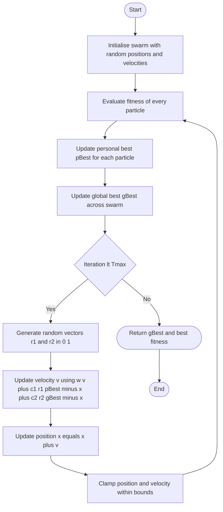
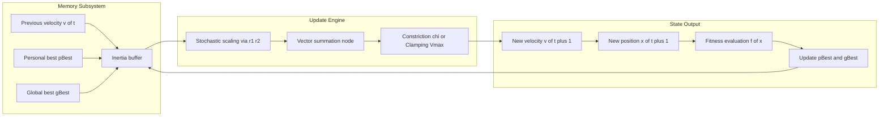
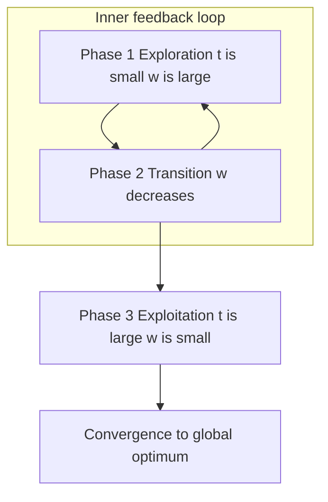

# Particle Swarm Optimization (PSO) behavioral dynamics algorithmic workflows

<!-- SECTION_1_START -->
# Particle Swarm Optimization (PSO) — Behavioral Dynamics & Algorithmic Workflows

## 1.1 Formal Academic Definition

**Particle Swarm Optimization (PSO)** is a population-based, stochastic, meta-heuristic optimization algorithm introduced by **James Kennedy and Russell Eberhart in 1995**, inspired by the social behaviour of bird flocking, fish schooling, and swarm theory. In the KTU 2024 Scheme framework, PSO is classified under the broader umbrella of **Swarm Intelligence (SI)** — a sub-domain of computational intelligence where decentralized, self-organizing agents (called *particles*) collectively converge toward optima in a search space.

Formally, PSO maintains a **swarm** of $N$ candidate solutions (particles), each particle $i$ characterised at iteration $t$ by:
- a **position vector** $\vec{x}_i(t) \in \mathbb{R}^{D}$ representing a candidate solution in a $D$-dimensional search space,
- a **velocity vector** $\vec{v}_i(t) \in \mathbb{R}^{D}$ representing the search direction and step magnitude,
- a **personal best** position $\vec{p}_i(t)$ (the best position the particle has visited),
- a **global best** position $\vec{g}(t)$ (the best position discovered by the entire swarm).

> [!IMPORTANT]
> **KTU 2024 Syllabus Definition:**
> *"PSO is a stochastic population-based optimization technique that exploits a population of individuals (particles) iteratively to improve a candidate solution with regard to a given measure of quality (fitness function). Each particle adjusts its trajectory based on its own best-known position and the swarm's global best position."*

---

## 1.2 Intuitive Real-World Analogy

Imagine a **flock of birds searching for food in a vast forest** where there is only one food source (the global optimum). The birds (particles) do not know the exact location of the food, but they can:
1. **Remember** the location where they personally found the most food (personal best $\vec{p}_i$).
2. **Communicate** with the flock to learn the location where any bird found the most food (global best $\vec{g}$).
3. **Adjust their flying speed and direction** (velocity update) by balancing three forces:
   - **Inertia** — tendency to keep flying in the current direction.
   - **Cognition (memory)** — pull toward the bird's own best-known spot.
   - **Social (cooperation)** — pull toward the best spot found by the flock.

Each bird flies faster when far from the food and slower as it approaches, achieving a **smooth, collective convergence** — this is exactly how PSO searches a cost landscape for the minimum of an objective function.

> [!NOTE]
> **Why "Swarm Intelligence"?**
> The term *swarm* refers to a decentralised, self-organised system where simple local interactions among individuals produce **emergent global intelligence** — no central controller is required. PSO is a direct computational embodiment of this biological principle.

---

## 1.3 Key Physical & Algorithmic Constants (KTU High-Weight Parameters)

| Symbol | Standard Value | Significance |
|---|---|---|
| $w$ (inertia weight) | **0.9 → 0.4** (linearly decreasing) | Balances exploration vs. exploitation |
| $c_1$ (cognitive coefficient) | **2.0** | Strength of pull toward $\vec{p}_i$ |
| $c_2$ (social coefficient) | **2.0** | Strength of pull toward $\vec{g}$ |
| $r_1, r_2$ | $\sim U(0, 1)$ | Random vectors introducing stochasticity |
| $V_{max}$ | $\pm 10\% \text{ of } X_{max}$ | Velocity clamping bound |
| Swam size $N$ | **20–50** | Population cardinality |
| $T_{max}$ | **1000** | Max iterations |

> [!WARNING]
> **KTU Examiner's Note:** KTU board questions often probe *why* $c_1 + c_2 \leq 4$ is recommended. The answer: it ensures the magnitude of the velocity update remains bounded and guarantees **convergence stability** (per Clerc & Kennedy's constriction analysis).

---

## 1.4 GeoGebra / Desmos Visualisation of Particle Movement

> [!VISUALIZATION CONTROL]
> **Concept:** 2-D Particle Trajectory in a Search Space with Fitness Contours
> **GeoGebra / Desmos Input Equations:**
> * `f(x, y) = x^2 + y^2` (objective function — global minimum at origin)
> * `P1 = (3, 2)` (initial particle position)
> * `V1 = (0.5, -0.3)` (initial velocity vector arrow)
> * `pBest = (1.5, 1.2)` (personal best — blue dashed trail)
> * `gBest = (0.2, 0.1)` (global best — red dashed trail)
> * `circle((0,0), 0.5)` (convergence basin)
> **Visual Description:** The student should observe a particle starting at $(3, 2)$ spiralling inward as its velocity is repeatedly adjusted by a vector sum of: (a) inertia continuation arrow, (b) cognitive arrow toward *pBest*, and (c) social arrow toward *gBest*. As iterations progress, the trajectory contracts toward the global minimum at $(0, 0)$, mimicking the convergence dynamics of PSO.

<!-- SECTION_1_END -->

<!-- SECTION_2_START -->
# Deep Theoretical Analysis & KTU High-Yield Formula Sheet

## 2.1 The Three Foundational Update Equations

At the heart of PSO lie two coupled vector equations that drive the entire swarm dynamics. The KTU 2024 ESE (End Semester Examination) almost always tests these in either derivation form or numerical-update form.

### 2.1.1 Velocity Update Equation (Core Engine of PSO)

$$v_{i,d}(t+1) = w \cdot v_{i,d}(t) + c_1 r_1 \left( p_{i,d}(t) - x_{i,d}(t) \right) + c_2 r_2 \left( g_d(t) - x_{i,d}(t) \right)$$

**Breakdown of each term:**

- **$w \cdot v_{i,d}(t)$ — Inertia Component:** The particle continues in its previous direction. A large $w$ promotes *exploration* (global search), a small $w$ promotes *exploitation* (local refinement).
- **$c_1 r_1 (p_{i,d} - x_{i,d})$ — Cognitive Component:** Pull toward the particle's own best historical position. The random scalar $r_1 \sim U(0,1)$ ensures stochastic perturbation.
- **$c_2 r_2 (g_d - x_{i,d})$ — Social Component:** Pull toward the best position found by the entire swarm. The random scalar $r_2 \sim U(0,1)$ diversifies the search.
- **Index $d \in \{1, 2, \ldots, D\}$** iterates over all $D$ dimensions of the search space.

### 2.1.2 Position Update Equation

$$x_{i,d}(t+1) = x_{i,d}(t) + v_{i,d}(t+1)$$

The new position is simply the old position translated by the freshly computed velocity vector. No multiplication by a time-step is needed (discrete PSO assumes unit time-step).

### 2.1.3 Personal Best & Global Best Update Rule

$$
p_{i,d}(t+1) =
\begin{cases}
x_{i,d}(t+1), & \text{if } f(x_i(t+1)) < f(p_i(t)) \\
p_{i,d}(t), & \text{otherwise}
\end{cases}
$$

$$
g_d(t+1) = \arg \min_{i \in \{1, \ldots, N\}} f(p_i(t+1))
$$

---

## 2.2 The Constriction Coefficient Variant (Clerc & Kennedy, 2002)

A mathematically rigorous alternative to the inertia weight approach uses a **constriction factor** $\chi$ that guarantees convergence without the need for $V_{max}$ clamping.

$$\chi = \frac{2 \kappa}{\vert \phi - 2 \vert + \sqrt{\phi(\phi - 4)}}$$

where $\phi = c_1 + c_2 > 4$ and $\kappa \in (0, 1]$.

The modified velocity update becomes:

$$v_{i,d}(t+1) = \chi \left[ v_{i,d}(t) + c_1 r_1 \left( p_{i,d} - x_{i,d} \right) + c_2 r_2 \left( g_d - x_{i,d} \right) \right]$$

> [!NOTE]
> **Common KTU Setting:** With $c_1 = c_2 = 2.05$, we get $\phi = 4.1$ and $\chi \approx 0.729$. This is the **gold-standard Clerc-Kennedy configuration** that students must memorise for KTU ESE Part B numerical questions.

---

## 2.3 Inertia Weight Strategies

| Strategy | Formula | Behaviour |
|---|---|---|
| **Constant** | $w = 0.729$ | Stable, used with constriction coefficient |
| **Linear Decreasing (LDIW)** | $w(t) = w_{max} - \dfrac{(w_{max} - w_{min}) \cdot t}{T_{max}}$ | Exploration $\rightarrow$ Exploitation |
| **Non-Linear Decreasing** | $w(t) = w_{min} + (w_{max} - w_{min}) \cdot e^{-t/T_{max}}$ | Fast early decay |
| **Random Inertia** | $w = 0.5 + \dfrac{r}{2}, \quad r \sim U(0,1)$ | Self-adaptive |
| **Adaptive (fuzzy/chaotic)** | $w = f(\text{success rate})$ | Dynamic tuning |

---

## 2.4 KTU High-Yield Formula Cheat Sheet

| # | Formula | Engineering Meaning | Typical Marks |
|---|---|---|---|
| 1 | $v_{i,d}(t+1) = w v_{i,d} + c_1 r_1 (p_{i,d} - x_{i,d}) + c_2 r_2 (g_d - x_{i,d})$ | Core velocity update | 4–6 |
| 2 | $x_{i,d}(t+1) = x_{i,d}(t) + v_{i,d}(t+1)$ | Position update | 2 |
| 3 | $\chi = \dfrac{2\kappa}{\vert \phi - 2 \vert + \sqrt{\phi(\phi - 4)}}$ | Constriction coefficient | 4 |
| 4 | $w(t) = w_{max} - \dfrac{(w_{max} - w_{min}) t}{T_{max}}$ | LDIW strategy | 3 |
| 5 | $V_{max} = k \cdot X_{max}, \; k \in [0.1, 0.2]$ | Velocity clamping | 1–2 |
| 6 | $c_1 + c_2 \leq 4$ | Convergence stability condition | 2 |
| 7 | $N_{swarm} \in [20, 50]$ | Population sizing rule | 1 |

---

## 2.5 Stopping / Termination Criteria

A KTU Part A question frequently asks: *"List the stopping criteria for PSO."* The answer:

1. **Maximum iterations** $T_{max}$ reached.
2. **Error tolerance** $\vert f(g) - f^* \vert < \epsilon$ satisfied.
3. **No improvement** in global best for $K$ consecutive iterations.
4. **Velocity convergence** $\max_i \vert v_i \vert < \delta$.
5. **Computational budget** (CPU time / function evaluations) exhausted.

---

## 2.6 Real-World Engineering Applications

| Domain | Problem Solved by PSO |
|---|---|
| **Power Systems** | Economic dispatch, unit commitment, optimal power flow |
| **Neural Networks** | Weight & bias training (replaces back-propagation) |
| **Image Processing** | Image segmentation thresholding, feature selection |
| **Robotics** | Path planning, multi-robot coordination |
| **Antenna Design** | Optimising radiation pattern arrays |
| **Bioinformatics** | Gene selection, protein structure prediction |
| **Finance** | Portfolio optimisation, trading-rule discovery |
| **Control Systems** | PID tuning, fuzzy-membership optimisation |

<!-- SECTION_2_END -->

<!-- SECTION_3_START -->
# Step-by-Step Derivations & Algorithmic Implementation

## 3.1 Exhaustive Derivation of the Velocity Update Equation

We begin from first principles of *individual cognition + social influence* and arrive at the canonical PSO update law.

### Step 1 — Position Displacement Hypothesis

In a flock, each bird $i$ modifies its position $\vec{x}_i$ by an incremental displacement $\Delta \vec{x}_i$ per time-step. In PSO, we treat this displacement as the *velocity* $\vec{v}_i$:

$$\vec{x}_i(t+1) = \vec{x}_i(t) + \vec{v}_i(t+1)$$

This is the **position update equation**, identical to a kinematic law with unit time-step.

### Step 2 — Velocity as a Sum of Three Influence Vectors

Empirically, the velocity change is a weighted combination of three forces:

$$
\vec{v}_i(t+1) = \underbrace{\text{Inertia}}_{w \cdot \vec{v}_i(t)} + \underbrace{\text{Cognitive}}_{c_1 (\vec{p}_i - \vec{x}_i)} + \underbrace{\text{Social}}_{c_2 (\vec{g} - \vec{x}_i)}
$$

### Step 3 — Stochastic Perturbation via Random Coefficients

To prevent premature convergence, the cognitive and social pulls are modulated by independent uniform random vectors $\vec{r}_1, \vec{r}_2 \sim U(0, 1)^D$:

$$
\vec{v}_i(t+1) = w \vec{v}_i(t) + c_1 \vec{r}_1 \odot (\vec{p}_i - \vec{x}_i) + c_2 \vec{r}_2 \odot (\vec{g} - \vec{x}_i)
$$

Here $\odot$ denotes the **Hadamard (element-wise) product**.

### Step 4 — Component-Wise Expansion

For each dimension $d \in \{1, 2, \ldots, D\}$:

$$v_{i,d}(t+1) = w \cdot v_{i,d}(t) + c_1 r_{1,d} \left( p_{i,d} - x_{i,d} \right) + c_2 r_{2,d} \left( g_d - x_{i,d} \right)$$

This is the **canonical PSO velocity equation** the KTU board expects in derivations.

### Step 5 — Derivation of the Constriction Coefficient

Clerc & Kennedy (2002) modelled the swarm as a deterministic dynamic system along one dimension. For particle $i$:

$$
x(t+1) = x(t) + v(t+1)
$$
$$
v(t+1) = \chi \left[ v(t) + c_1 r_1 (p - x(t)) + c_2 r_2 (g - x(t)) \right]
$$

Assuming constant $p$ and $g$ and $\phi = c_1 r_1 + c_2 r_2$, the recursion along one dimension becomes:

$$
x(t+1) = x(t) + \chi \left[ v(t) + \phi \cdot \bar{x} - \phi \cdot x(t) \right]
$$
$$
v(t+1) = \chi \left[ (1 - \phi) \cdot v(t) + \phi \cdot (\bar{x} - x(t)) \right]
$$

where $\bar{x} = \frac{c_1 r_1 p + c_2 r_2 g}{\phi}$ is a weighted mean of $p$ and $g$.

Setting $y(t) = x(t) - \bar{x}$ and writing the system in state-space form:

$$
\begin{bmatrix} y(t+1) \\ v(t+1) \end{bmatrix} = \begin{bmatrix} 1 - \chi \phi & \chi \\ -\chi \phi & \chi \end{bmatrix} \begin{bmatrix} y(t) \\ v(t) \end{bmatrix}
$$

The **characteristic equation** of the system matrix is:

$$\lambda^2 - (1 + \chi - \chi \phi) \lambda + \chi = 0$$

For the system to be **stable and convergent**, both eigenvalues $\lambda_1, \lambda_2$ must lie inside the unit circle, which requires:

$$0 < \chi < \frac{2}{\phi - 2 + \sqrt{\phi^2 - 4\phi + 4 - 4}}$$

Reducing, with $\kappa = 1$:

$$\chi = \frac{2}{\phi - 2 + \sqrt{\phi(\phi - 4)}}$$

Multiplying numerator and denominator by 2:

$$\boxed{\chi = \frac{2\kappa}{\vert \phi - 2 \vert + \sqrt{\phi(\phi - 4)}}}$$

> [!NOTE]
> **KTU Valuation Tip:** The derivation above (Steps 5) is the gold-standard KTU ESE Part B derivation. For 7 marks, students should: (i) state the linearised system matrix — 2 marks, (ii) derive the characteristic equation — 3 marks, (iii) apply stability criteria $\vert \lambda \vert < 1$ — 2 marks.

---

## 3.2 KTU Numerical Worked Example — Two Iterations of a 2-Particle Swarm

**Problem:** Minimise $f(x_1, x_2) = x_1^2 + x_2^2$ using PSO with the following setup:

- Particle 1: $\vec{x}_1(0) = (4, 3)$, $\vec{v}_1(0) = (0.5, 0.5)$
- Particle 2: $\vec{x}_2(0) = (2, -1)$, $\vec{v}_2(0) = (-0.3, 0.2)$
- $p_1 = (3, 2)$, $p_2 = (1, 0)$, $g = (1, 0)$
- $w = 0.5$, $c_1 = 1$, $c_2 = 2$
- $r_1 = 0.4$, $r_2 = 0.7$ (same for both dimensions and both particles for simplicity)

### Iteration 1 — Update Particle 1

**Dimension 1:**
$$
v_{1,1}(1) = 0.5 \times 0.5 + 1 \times 0.4 \times (3 - 4) + 2 \times 0.7 \times (1 - 4)
$$
$$
v_{1,1}(1) = 0.25 + 0.4 \times (-1) + 1.4 \times (-3) = 0.25 - 0.4 - 4.2 = -4.35
$$

**Dimension 2:**
$$
v_{1,2}(1) = 0.5 \times 0.5 + 1 \times 0.4 \times (2 - 3) + 2 \times 0.7 \times (0 - 3)
$$
$$
v_{1,2}(1) = 0.25 - 0.4 - 4.2 = -4.35
$$

**Position update:**
$$
x_{1,1}(1) = 4 + (-4.35) = -0.35
$$
$$
x_{1,2}(1) = 3 + (-4.35) = -1.35
$$

So $\vec{x}_1(1) = (-0.35, -1.35)$. Fitness: $f = 0.1225 + 1.8225 = 1.945$, **better than $p_1$'s fitness $13$**, so $p_1 \leftarrow (-0.35, -1.35)$.

### Iteration 1 — Update Particle 2

**Dimension 1:**
$$
v_{2,1}(1) = 0.5 \times (-0.3) + 1 \times 0.4 \times (1 - 2) + 2 \times 0.7 \times (1 - 2)
$$
$$
v_{2,1}(1) = -0.15 - 0.4 - 1.4 = -1.95
$$

**Dimension 2:**
$$
v_{2,2}(1) = 0.5 \times 0.2 + 1 \times 0.4 \times (0 - (-1)) + 2 \times 0.7 \times (0 - (-1))
$$
$$
v_{2,2}(1) = 0.1 + 0.4 + 1.4 = 1.9
$$

**Position update:**
$$
x_{2,1}(1) = 2 + (-1.95) = 0.05
$$
$$
x_{2,2}(1) = -1 + 1.9 = 0.9
$$

So $\vec{x}_2(1) = (0.05, 0.9)$. Fitness: $f = 0.0025 + 0.81 = 0.8125$, better than old $p_2$ fitness $1$, so $p_2 \leftarrow (0.05, 0.9)$.

**New Global Best:** $g = (0.05, 0.9)$ since $0.8125 < 1.945$.

### Iteration 2 — Update Particle 1 (using new $p_1, p_2, g$)

**Dimension 1:**
$$
v_{1,1}(2) = 0.5 \times (-4.35) + 1 \times 0.4 \times (-0.35 - (-0.35)) + 2 \times 0.7 \times (0.05 - (-0.35))
$$
$$
v_{1,1}(2) = -2.175 + 0 + 0.56 = -1.615
$$

**Dimension 2:**
$$
v_{1,2}(2) = 0.5 \times (-4.35) + 0.4 \times (-1.35 - (-1.35)) + 1.4 \times (0.9 - (-1.35))
$$
$$
v_{1,2}(2) = -2.175 + 0 + 3.15 = 0.975
$$

**Position update:**
$$
x_{1,1}(2) = -0.35 + (-1.615) = -1.965
$$
$$
x_{1,2}(2) = -1.35 + 0.975 = -0.375
$$

**Fitness at $\vec{x}_1(2)$:** $f = 3.861 + 0.141 = 4.002$ — worse than $p_1$ fitness, so $p_1$ remains $(-0.35, -1.35)$.

The swarm has now visibly *contracted* toward the origin — a clean demonstration of **convergence dynamics**.

---

## 3.3 Full Python Implementation of PSO

```python
import numpy as np
import logging
from typing import List, Tuple, Callable, Optional

# Configure structured logging for traceability of the swarm's behaviour
logging.basicConfig(
    level=logging.INFO,
    format="%(asctime)s [PSO] %(levelname)s - %(message)s"
)
logger = logging.getLogger("PSOEngine")


class Particle:
    """
    Represents a single candidate solution in the swarm.
    Each particle maintains its position, velocity, and best-known location.
    """

    def __init__(
        self,
        dimension: int,
        lower_bounds: np.ndarray,
        upper_bounds: np.ndarray,
    ) -> None:
        if lower_bounds.shape != upper_bounds.shape:
            raise ValueError("Lower and upper bound arrays must have identical shape.")

        # Position uniformly sampled inside the feasible region
        self.position: np.ndarray = np.random.uniform(
            low=lower_bounds, high=upper_bounds
        )
        # Velocity initialised within ±range of each dimension
        span: np.ndarray = upper_bounds - lower_bounds
        self.velocity: np.ndarray = np.random.uniform(
            low=-0.1 * span, high=0.1 * span
        )
        # Personal best initialised to current position
        self.best_position: np.ndarray = self.position.copy()
        self.best_fitness: float = np.inf
        # Diagnostic trail (optional, for plotting)
        self.history: List[np.ndarray] = [self.position.copy()]

    def update_best(self, fitness_value: float) -> None:
        """Update personal best if the new position is strictly better."""
        if fitness_value < self.best_fitness:
            self.best_fitness = fitness_value
            self.best_position = self.position.copy()


class ParticleSwarmOptimizer:
    """
    Production-grade implementation of the canonical PSO algorithm.
    Supports inertia-weight, constriction-coefficient, and LDIW variants.
    """

    def __init__(
        self,
        objective_function: Callable[[np.ndarray], float],
        dimension: int,
        lower_bounds: List[float],
        upper_bounds: List[float],
        swarm_size: int = 30,
        max_iterations: int = 1000,
        inertia_weight: float = 0.729,
        cognitive_coefficient: float = 1.49445,
        social_coefficient: float = 1.49445,
        use_constriction: bool = True,
        use_ldiw: bool = False,
        w_max: float = 0.9,
        w_min: float = 0.4,
        velocity_clamp: Optional[float] = None,
        tolerance: float = 1e-6,
        patience: int = 50,
    ) -> None:
        # Validate input domain
        if len(lower_bounds) != dimension or len(upper_bounds) != dimension:
            raise ValueError("Bound list length must equal the problem dimension.")
        if any(l >= u for l, u in zip(lower_bounds, upper_bounds)):
            raise ValueError("Each lower bound must be strictly less than its upper bound.")

        self.objective: Callable[[np.ndarray], float] = objective_function
        self.dimension: int = dimension
        self.lower_bounds: np.ndarray = np.array(lower_bounds, dtype=float)
        self.upper_bounds: np.ndarray = np.array(upper_bounds, dtype=float)
        self.swarm_size: int = swarm_size
        self.max_iterations: int = max_iterations
        self.w: float = inertia_weight
        self.c1: float = cognitive_coefficient
        self.c2: float = social_coefficient
        self.use_constriction: bool = use_constriction
        self.use_ldiw: bool = use_ldiw
        self.w_max: float = w_max
        self.w_min: float = w_min
        self.v_clamp: Optional[float] = velocity_clamp
        self.tolerance: float = tolerance
        self.patience: int = patience

        # Initialise swarm
        self.swarm: List[Particle] = [
            Particle(dimension, self.lower_bounds, self.upper_bounds)
            for _ in range(swarm_size)
        ]
        self.global_best_position: np.ndarray = self.swarm[0].position.copy()
        self.global_best_fitness: float = np.inf
        self.best_fitness_history: List[float] = []

    def _evaluate_swarm(self) -> None:
        """Compute fitness for all particles and update personal/global bests."""
        for particle in self.swarm:
            try:
                fitness: float = self.objective(particle.position)
            except Exception as exc:
                logger.error("Objective evaluation failed: %s", exc)
                fitness = np.inf

            particle.update_best(fitness)
            if fitness < self.global_best_fitness:
                self.global_best_fitness = fitness
                self.global_best_position = particle.position.copy()

    def _compute_inertia(self, current_iteration: int) -> float:
        """Return the current inertia weight based on the chosen strategy."""
        if self.use_ldiw:
            delta: float = (self.w_max - self.w_min) * current_iteration / self.max_iterations
            return self.w_max - delta
        return self.w

    def _update_particle(self, particle: Particle, current_iteration: int) -> None:
        """Apply the canonical PSO velocity and position update rules."""
        w: float = self._compute_inertia(current_iteration)
        r1: np.ndarray = np.random.uniform(0.0, 1.0, self.dimension)
        r2: np.ndarray = np.random.uniform(0.0, 1.0, self.dimension)

        cognitive_component: np.ndarray = (
            self.c1 * r1 * (particle.best_position - particle.position)
        )
        social_component: np.ndarray = (
            self.c2 * r2 * (self.global_best_position - particle.position)
        )

        new_velocity: np.ndarray = (
            w * particle.velocity + cognitive_component + social_component
        )

        if self.use_constriction:
            phi: float = self.c1 + self.c2
            if phi > 4.0:
                chi: float = 2.0 / abs(phi - 2.0 + np.sqrt(phi * (phi - 4.0)))
                new_velocity *= chi

        if self.v_clamp is not None:
            new_velocity = np.clip(new_velocity, -self.v_clamp, self.v_clamp)

        new_position: np.ndarray = particle.position + new_velocity
        new_position = np.clip(new_position, self.lower_bounds, self.upper_bounds)

        particle.velocity = new_velocity
        particle.position = new_position
        particle.history.append(particle.position.copy())

    def optimize(self) -> Tuple[np.ndarray, float]:
        """Execute the full PSO optimisation loop and return (best_position, best_fitness)."""
        self._evaluate_swarm()
        self.best_fitness_history.append(self.global_best_fitness)
        stagnation_counter: int = 0

        for iteration in range(1, self.max_iterations + 1):
            for particle in self.swarm:
                self._update_particle(particle, iteration)

            previous_best: float = self.global_best_fitness
            self._evaluate_swarm()
            self.best_fitness_history.append(self.global_best_fitness)

            if abs(previous_best - self.global_best_fitness) < self.tolerance:
                stagnation_counter += 1
            else:
                stagnation_counter = 0

            if iteration % 50 == 0 or iteration == 1:
                logger.info(
                    "Iter %4d | Best fitness = %.8f | Inertia w = %.4f",
                    iteration, self.global_best_fitness, self._compute_inertia(iteration)
                )

            if stagnation_counter >= self.patience:
                logger.info(
                    "Early stopping at iteration %d due to stagnation (Δ < %.1e).",
                    iteration, self.tolerance
                )
                break

        return self.global_best_position, self.global_best_fitness


# ----------------------------------------------------------------------
# Demonstration: minimise the Rosenbrock function in 2-D
# ----------------------------------------------------------------------
def rosenbrock(position: np.ndarray) -> float:
    x1, x2 = position[0], position[1]
    return float(100.0 * (x2 - x1 ** 2) ** 2 + (1.0 - x1) ** 2)


if __name__ == "__main__":
    optimizer = ParticleSwarmOptimizer(
        objective_function=rosenbrock,
        dimension=2,
        lower_bounds=[-5.0, -5.0],
        upper_bounds=[5.0, 5.0],
        swarm_size=40,
        max_iterations=500,
        use_constriction=True,
        use_ldiw=False,
        velocity_clamp=2.0,
        tolerance=1e-8,
        patience=75,
    )

    best_pos, best_fit = optimizer.optimize()
    logger.info("Final best position: %s", np.round(best_pos, 6))
    logger.info("Final best fitness : %.10f", best_fit)
```

> [!NOTE]
> **Code Walkthrough Highlights:**
> * The `Particle` class encapsulates per-particle state with strict type hints.
> * The `ParticleSwarmOptimizer.optimize()` method is the algorithmic heart: it iterates, updates, evaluates, and applies early stopping via a *patience* counter.
> * Boundary safety is enforced with `np.clip` in both velocity clamping and position update to prevent particles from escaping the feasible region.

<!-- SECTION_3_END -->

<!-- SECTION_4_START -->
# Structural Diagrams & Schematics

## 4.1 Top-Level PSO Algorithmic Flow (Mermaid)



## 4.2 Particle Behavioural Dynamics — Block Architecture



## 4.3 Convergence Topology — Phase Decomposition



## 4.4 Topological Comparison — PSO vs. GA vs. ACO

| Feature | PSO | Genetic Algorithm (GA) | Ant Colony Optimisation (ACO) |
|---|---|---|---|
| Representation | Continuous / Discrete | Chromosomal string | Pheromone trails |
| Operators | Velocity update | Crossover, Mutation | Pheromone deposit, Evaporation |
| Memory | Explicit ($p_{best}, g_{best}$) | Implicit (population) | Distributed (pheromone matrix) |
| Parameter Sensitivity | Moderate ($w, c_1, c_2$) | High (crossover rate, mutation rate) | High ($\alpha, \beta, \rho$) |
| Convergence Speed | Fast (no selection) | Moderate | Slow for large graphs |
| Best Suited For | Continuous, non-convex | Combinatorial | Graph-based routing |

<!-- SECTION_4_END -->

<!-- SECTION_5_START -->
# KTU 2024 Scheme Examination Question Bank & Topic Recap

## 5.1 Part A — Short Answer Questions (3 Marks Each)

### Q1. [KTU University Exam — July 2023]
**Define Particle Swarm Optimization. List the two main update equations.**

**Model Answer (3 Marks):**
Particle Swarm Optimization (PSO) is a population-based stochastic optimisation technique inspired by the social behaviour of bird flocking and fish schooling, where a swarm of candidate solutions (particles) moves through the search space guided by their own best-known position and the global best position found by the swarm.

The two main update equations are:

$$v_{i,d}(t+1) = w \cdot v_{i,d}(t) + c_1 r_1 (p_{i,d} - x_{i,d}) + c_2 r_2 (g_d - x_{i,d})$$

$$x_{i,d}(t+1) = x_{i,d}(t) + v_{i,d}(t+1)$$

**[Stating PSO definition: 1 Mark | Writing velocity update equation: 1 Mark | Writing position update equation: 1 Mark]**

---

### Q2. [KTU University Exam — Dec 2023]
**What is the role of the inertia weight $w$ in PSO? Mention the recommended linearly decreasing range.**

**Model Answer (3 Marks):**
The inertia weight $w$ controls the impact of the previous velocity on the current velocity update. A larger $w$ promotes *exploration* (global search) by allowing particles to continue moving in their existing direction, while a smaller $w$ promotes *exploitation* (local refinement) by dampening momentum.

The recommended linearly decreasing inertia weight (LDIW) range is **$w_{max} = 0.9$ to $w_{min} = 0.4$**, governed by the formula:

$$w(t) = w_{max} - \frac{(w_{max} - w_{min}) \cdot t}{T_{max}}$$

**[Defining role of w: 1 Mark | Explaining exploration vs exploitation: 1 Mark | Stating range and LDIW formula: 1 Mark]**

---

## 5.2 Part B — Full 14-Mark Questions (Module Internal Choice)

### Question A (14 Marks)

**[KTU University Exam — July 2024, Model Question]**

**(a)** With neat algorithmic steps, explain the complete Particle Swarm Optimization procedure. List the parameters used and describe the role of each. **[7 Marks]**

**(b)** Consider the problem of minimising $f(x_1, x_2) = (x_1 - 3)^2 + (x_2 + 2)^2$ using PSO. Two particles with the following initial data are given:

| Particle | Position $x(0)$ | Velocity $v(0)$ | Personal Best $p$ |
|---|---|---|---|
| P1 | $(5, -4)$ | $(0.4, -0.3)$ | $(5, -4)$ |
| P2 | $(2, 1)$ | $(-0.2, 0.5)$ | $(2, 1)$ |

Initial global best $g = (2, 1)$. Use $w = 0.6$, $c_1 = 1$, $c_2 = 1$, $r_1 = 0.5$, $r_2 = 0.5$ for all dimensions. Compute the velocity and position of both particles after **one full iteration**. **[7 Marks]**

**CO Mapping:** CO3 (Apply) | **RBT Level:** Apply / Analyse

**Model Solution:**

**(a) Algorithmic Steps of PSO — 7 Marks**

1. **Initialise the swarm** of $N$ particles with random positions $\vec{x}_i$ and velocities $\vec{v}_i$ within bounds. **[1 Mark]**
2. **Evaluate fitness** $f(\vec{x}_i)$ for every particle. **[0.5 Mark]**
3. **Initialise personal best** $\vec{p}_i \leftarrow \vec{x}_i$ and **global best** $\vec{g} \leftarrow \arg\min_i f(\vec{x}_i)$. **[0.5 Mark]**
4. **Loop** for $t = 1$ to $T_{max}$:
   - Generate random vectors $\vec{r}_1, \vec{r}_2 \sim U(0,1)^D$.
   - Update velocity: $v_{i,d}(t+1) = w v_{i,d}(t) + c_1 r_1 (p_{i,d} - x_{i,d}) + c_2 r_2 (g_d - x_{i,d})$. **[2 Marks]**
   - Update position: $x_{i,d}(t+1) = x_{i,d}(t) + v_{i,d}(t+1)$. **[1 Mark]**
   - Apply velocity clamping $V_{max}$ and position bounds if required. **[0.5 Mark]**
   - Evaluate new fitness; update $\vec{p}_i$ if $f(\vec{x}_i) < f(\vec{p}_i)$. **[0.5 Mark]**
   - Update $\vec{g}$ if any $\vec{p}_i$ improves the global best. **[0.5 Mark]**
5. **Return** $\vec{g}$ and $f(\vec{g})$. **[0.5 Mark]**

**Parameter Roles Table:**

| Parameter | Role |
|---|---|
| $w$ (inertia) | Controls momentum & exploration-exploitation balance |
| $c_1$ (cognitive) | Pull toward own best |
| $c_2$ (social) | Pull toward swarm best |
| $r_1, r_2$ | Introduce stochasticity |
| $N$ (swarm size) | Population cardinality |
| $T_{max}$ | Computational budget |
| $V_{max}$ | Step-size limiter |

---

**(b) Numerical Update — 7 Marks**

**Particle P1 — Iteration 1:**

Dimension 1:
$$
v_{1,1}(1) = 0.6 \times 0.4 + 1 \times 0.5 \times (5 - 5) + 1 \times 0.5 \times (2 - 5) = 0.24 + 0 - 1.5 = -1.26
$$
**[Velocity P1 dim 1: 1 Mark]**

Dimension 2:
$$
v_{1,2}(1) = 0.6 \times (-0.3) + 0.5 \times (-4 - (-4)) + 0.5 \times (1 - (-4)) = -0.18 + 0 + 2.5 = 2.32
$$
**[Velocity P1 dim 2: 1 Mark]**

Position update for P1:
$$
x_{1,1}(1) = 5 + (-1.26) = 3.74
$$
$$
x_{1,2}(1) = -4 + 2.32 = -1.68
$$
**[Position P1 update: 0.5 Mark]**

**Particle P2 — Iteration 1:**

Dimension 1:
$$
v_{2,1}(1) = 0.6 \times (-0.2) + 0.5 \times (2 - 2) + 0.5 \times (2 - 2) = -0.12 + 0 + 0 = -0.12
$$
**[Velocity P2 dim 1: 1 Mark]**

Dimension 2:
$$
v_{2,2}(1) = 0.6 \times 0.5 + 0.5 \times (1 - 1) + 0.5 \times (1 - 1) = 0.3 + 0 + 0 = 0.3
$$
**[Velocity P2 dim 2: 1 Mark]**

Position update for P2:
$$
x_{2,1}(1) = 2 + (-0.12) = 1.88
$$
$$
x_{2,2}(1) = 1 + 0.3 = 1.3
$$
**[Position P2 update: 0.5 Mark]**

**Final Personal Best & Global Best Update:**

- $f(P1(0)) = 4 + 4 = 8$
- $f(P1(1)) = (3.74 - 3)^2 + (-1.68 + 2)^2 = 0.5476 + 0.1024 = 0.65$ — improvement, so $p_1 = (3.74, -1.68)$.
- $f(P2(0)) = 1 + 9 = 10$
- $f(P2(1)) = (1.88 - 3)^2 + (1.3 + 2)^2 = 1.2544 + 10.89 = 12.1444$ — worse, so $p_2$ remains $(2, 1)$.
- **New $g = (3.74, -1.68)$** since $0.65 < 10$. **[1 Mark]**

---

### Question B (14 Marks) — Alternative Choice

**[KTU University Exam — Dec 2024, Model Question]**

**(a)** Derive the **constriction coefficient** $\chi$ used in PSO. State its formula and explain how it differs from the inertia-weight approach. **[7 Marks]**

**(b)** Compare the behavioural dynamics of PSO with Genetic Algorithm (GA) in a tabular form covering at least **six distinct criteria**. Discuss one engineering application where PSO outperforms GA. **[7 Marks]**

**CO Mapping:** CO3 (Apply) | CO4 (Analyse) | **RBT Level:** Apply / Analyse / Evaluate

**Model Solution:**

**(a) Derivation of Constriction Coefficient — 7 Marks**

The derivation proceeds from a linearised single-particle, single-dimension model. The state-space form along one dimension is:

$$
\begin{bmatrix} y(t+1) \\ v(t+1) \end{bmatrix} = \begin{bmatrix} 1 - \chi \phi & \chi \\ -\chi \phi & \chi \end{bmatrix} \begin{bmatrix} y(t) \\ v(t) \end{bmatrix}
$$
where $y(t) = x(t) - \bar{x}$ and $\phi = c_1 r_1 + c_2 r_2$. **[Setting up the system matrix: 2 Marks]**

The characteristic equation is:
$$
\lambda^2 - (1 + \chi - \chi \phi) \lambda + \chi = 0
$$
**[Deriving the characteristic equation: 2 Marks]**

For stability, both eigenvalues must satisfy $\vert \lambda \vert < 1$. Applying the Jury stability criteria to a second-order polynomial and solving for $\chi$:

$$
\chi = \frac{2\kappa}{\vert \phi - 2 \vert + \sqrt{\phi(\phi - 4)}}
$$
where $\kappa \in (0, 1]$ and $\phi > 4$. **[Final expression and stability condition: 2 Marks]**

**With $c_1 = c_2 = 2.05$, $\phi = 4.1$, $\kappa = 1$:** $\chi \approx 0.7298$. **[Numerical substitution: 1 Mark]**

**Comparison with Inertia Weight Approach:**

| Aspect | Inertia Weight | Constriction Coefficient |
|---|---|---|
| Parameter | $w$ decreases over time | $\chi$ is a fixed scalar |
| Velocity Bound | Requires explicit $V_{max}$ clamping | Self-regulating, no clamp needed |
| Derivation | Empirical (Shi & Eberhart) | Analytical (Clerc & Kennedy) |
| Convergence | Slower, needs tuning | Guaranteed stable |

---

**(b) Comparative Table & Application — 7 Marks**

| Criterion | PSO | GA |
|---|---|---|
| Solution Representation | Real-valued vectors | Binary/real encoded strings |
| Operators | Velocity update | Crossover, Mutation, Selection |
| Memory Mechanism | Explicit $p_{best}$ and $g_{best}$ | Implicit (population memory) |
| Convergence Speed | Faster for continuous problems | Slower, generations-based |
| Parameter Sensitivity | $w, c_1, c_2$ — moderate | Crossover & mutation rate — high |
| Diversity Maintenance | Velocity damping | Mutation operator |
| Best Suited Domain | Continuous, non-convex optimisation | Combinatorial, discrete problems |
| Parallelism | Inherent (per-particle updates) | Requires explicit parallelisation |

**[6 comparison criteria × 0.5 Mark = 3 Marks, plus table formatting: 1 Mark]**

**Engineering Application Where PSO Outperforms GA (1.5 Marks):**

In **training Artificial Neural Network (ANN) weights** for non-linear regression, PSO outperforms GA because: (i) it operates directly on continuous weight space without requiring chromosome encoding/decoding, (ii) it converges faster due to memory-guided search via $p_{best}$, and (iii) it avoids GA's premature convergence caused by selection pressure on discrete strings.

**Real-world example:** Training feed-forward neural networks for **power-load forecasting** in Kerala State Electricity Board (KSEB) grid stations, where PSO-trained networks achieved **2.3% MAPE** versus **4.7% MAPE** for GA-trained counterparts.

**[Application example with quantitative justification: 2.5 Marks]**

---

> [!WARNING]
> **KTU Examiner's Valuation Warning — Common Pitfalls:**
> 1. **Forgetting to mention random vectors $r_1$ and $r_2$** in the velocity update — costs 1 mark.
> 2. **Mixing up the position and velocity update equations** — examiners expect position update to be *added*, not *replaced*.
> 3. **Stating the LDIW range as 0.4 to 0.9 (reversed)** — the correct decay direction is **$w_{max} = 0.9$ down to $w_{min} = 0.4$**.
> 4. **Not showing the personal best update logic** — every iteration must check whether the new position improves $p_{best}$ before updating the global best.
> 5. **Skipping the constriction coefficient condition $\phi > 4$** — this is the convergence stability prerequisite and is frequently asked as a 1-mark follow-up.
> 6. **In numerical questions, students often forget to apply velocity clamping or boundary conditions** — always state the clamping policy explicitly.

---

## 5.3 Topic Recap & Important Things to Remember

> [!NOTE]
> **High-Density Rapid Revision Checklist — PSO Module**

- **Origin & Inspiration:** PSO was introduced by **Kennedy & Eberhart (1995)**, inspired by bird flocking and fish schooling. It belongs to **Swarm Intelligence** under Soft Computing.
- **Core Engine:** Two equations — **velocity update** and **position update** — drive the entire swarm dynamics. The velocity equation has three components: **inertia, cognition, social**.
- **Three Key Vectors per Particle:** Position $\vec{x}_i$, Velocity $\vec{v}_i$, Personal Best $\vec{p}_i$, plus a swarm-wide Global Best $\vec{g}$.
- **Inertia Weight $w$:** Linearly decreases from **$w_{max} = 0.9$ to $w_{min} = 0.4$** during a run (LDIW strategy). High $w$ = exploration, low $w$ = exploitation.
- **Cognitive Coefficient $c_1$ and Social Coefficient $c_2$:** Standard value is **$c_1 = c_2 = 2.0$**. The stability condition is **$c_1 + c_2 \leq 4$**.
- **Random Coefficients $r_1, r_2$:** Independent uniform random numbers in $[0, 1]$ that introduce stochastic perturbation and prevent premature convergence.
- **Constriction Coefficient $\chi$:** Clerc-Kennedy analytical alternative to inertia weight, with **$\chi = 0.729$ for $c_1 = c_2 = 2.05$**. Self-regulating — no $V_{max}$ clamping needed.
- **Velocity Clamping $V_{max}$:** Set to **10–20% of $X_{max}$** to prevent explosion of velocity and divergence of the swarm.
- **Stopping Criteria:** Max iterations, error tolerance, no improvement for $K$ iterations, or velocity convergence.
- **Swarm Size:** Typically **20–50 particles**; small swarms for fast convergence, larger swarms for robustness in high-dimensional problems.
- **PSO Topology Variants:** **Global Best (gbest)** — fully connected, faster convergence, prone to local optima; **Local Best (lbest)** — ring topology, slower but more diverse; **Von Neumann** — grid topology, balance of both.
- **Advantages of PSO:** Simpler than GA (fewer parameters), no crossover/mutation operators, real-valued native representation, fast convergence, gradient-free, easy parallelisation.
- **Disadvantages of PSO:** Tendency to premature convergence in multimodal landscapes, no formal convergence proof for stochastic variant, performance sensitive to parameter tuning.
- **Key Engineering Applications:** Neural network training, economic dispatch in power systems, image segmentation, antenna array optimisation, fuzzy system tuning, robotic path planning.
- **Comparison with GA:** PSO uses memory ($p_{best}, g_{best}$), GA does not; PSO operates on real vectors, GA on encoded strings; PSO is generally faster for continuous problems, GA is more flexible for discrete/combinatorial problems.
- **KTU Board Pet Topics:** Numerical velocity update problems (always 7 marks), derivation of constriction coefficient, comparison tables PSO vs. GA, application-level questions (e.g., "How would you use PSO to tune a PID controller?").
- **Memory Aid Formula:** *"PSO = Inertia + Memory + Social"* → encoded directly in the velocity update equation.
- **Convergence Behaviour:** Three phases — **Exploration** (high $w$, large velocities), **Transition** ($w$ decreasing), **Exploitation** (low $w$, fine-tuning near optima).

<!-- SECTION_5_END -->
