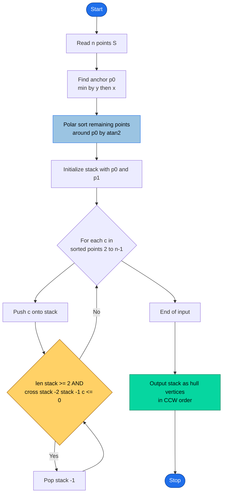
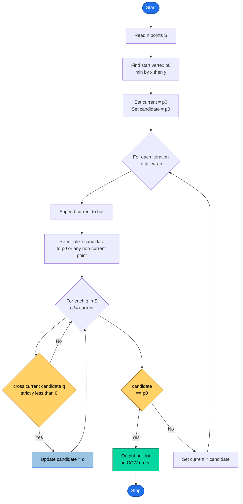
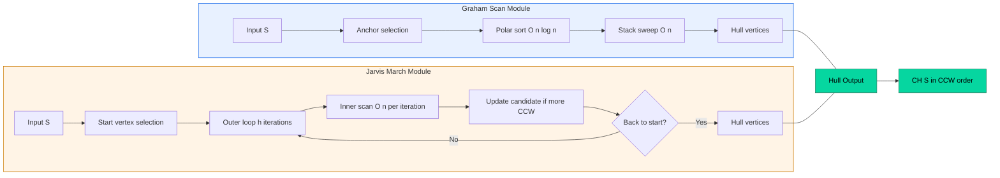
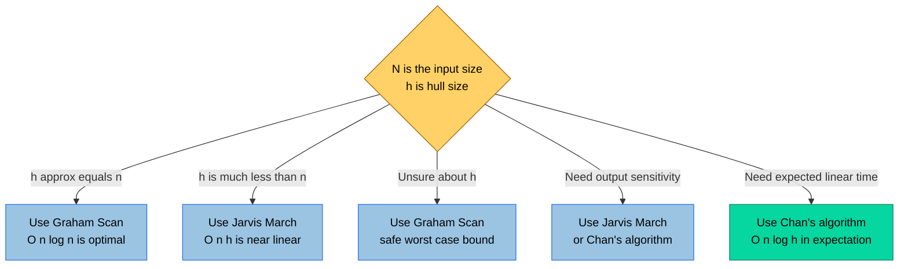

# Convex Hull formulations algorithms: Graham scan, Jarvis march complexity bounds checks

<!-- SECTION_1_START -->

# Convex Hull Algorithms: Graham Scan & Jarvis March

> [!IMPORTANT]
> **Syllabus Tag (KTU 2024 Scheme - PECST418 / Module 1):** *Convex Hull formulations & algorithms: Graham scan, Jarvis march, complexity bounds & output sensitivity checks.*

## 1.1 Formal Definition of a Convex Hull

Given a finite set of points $S = \{p_1, p_2, \dots, p_n\}$ in the Euclidean plane $\mathbb{R}^2$, the **Convex Hull** of $S$, denoted $\text{CH}(S)$, is the smallest **convex polygon** (or convex polytope) that contains all the points of $S$.

Equivalently, the convex hull is the **intersection of all convex sets** that contain $S$:

$$
\text{CH}(S) = \bigcap_{C \supseteq S,\; C \text{ convex}} C
$$

A point $p \in S$ is a **vertex of the hull** (an *extreme point*) if and only if it cannot be expressed as a strict convex combination of two other points in $S$. Mathematically, $p$ is a hull vertex if there do **not** exist $q, r \in S$ with $q \neq r$ and a scalar $\lambda \in (0,1)$ such that:

$$
p = \lambda \, q + (1 - \lambda) \, r
$$

The boundary of $\text{CH}(S)$ is itself a convex polygon formed by an ordered sequence of hull vertices:

$$
\text{CH}(S) = \langle h_0, h_1, h_2, \dots, h_{h-1} \rangle
$$

where $h$ is the number of hull vertices and the last edge closes back to $h_0$.

> [!NOTE]
> **Standard Output Size Convention:** Throughout this note, $n = \vert S \vert$ denotes the **input size**, and $h$ denotes the **hull size (output size)**. KTU examiners frequently test the distinction between $n$ and $h$ — it is the key to writing tight, correct complexity bounds.

## 1.2 The Rubber-Band Analogy (Geometric Intuition)

Imagine hammering nails into a wooden board at the locations of every input point. Now stretch a **rubber band** around the outermost nails and release it.

- The rubber band snaps tight, forming a polygon — this polygon is the convex hull.
- Any nail *inside* the polygon is **not a hull vertex** (it is *interior* to the hull).
- Only the nails that the band *touches* from the outside are the **hull vertices**.

This mental model gives immediate intuition for two algorithmic strategies:

1. **Jarvis March (Gift Wrapping):** Walk around the rubber band. Start at the leftmost nail, then find the next nail such that all other nails lie to one side. Repeat until you return home. Time depends on how many nails the band touches (i.e., $h$).
2. **Graham Scan:** Sort the nails by angle from a known extreme nail (say, the lowest), then sweep a "stack" — if a new nail would cause a *right turn* (non-left turn) at the top of the stack, pop it. Time dominated by the sort.

## 1.3 Graham Scan — High-Level Definition

> [!IMPORTANT]
> **Graham Scan (1972):** An $O(n \log n)$ algorithm to compute $\text{CH}(S)$. The strategy is: (i) pick a guaranteed hull vertex (the *anchor* $p_0$, usually the lexicographically lowest point), (ii) sort all other points by polar angle around $p_0$, and (iii) process the sorted sequence with a stack, popping points that would make a non-left (clockwise or collinear) turn.

## 1.4 Jarvis March — High-Level Definition

> [!IMPORTANT]
> **Jarvis March (1973), also called *Gift Wrapping*:** An $O(nh)$ algorithm to compute $\text{CH}(S)$. It starts at a known hull vertex (e.g., the leftmost-lowest point) and iteratively selects the next hull vertex as the one that makes the *smallest counter-clockwise turn* from the current edge direction. It stops upon returning to the start. The complexity is **output-sensitive**: it depends on $h$, the actual hull size.

## 1.5 Why Both Algorithms Matter in Practice

| Property | Graham Scan | Jarvis March |
|---|---|---|
| Time Complexity | $O(n \log n)$ | $O(nh)$ |
| Best Case | $O(n \log n)$ | $O(n)$ when $h = 1$ |
| Worst Case | $O(n \log n)$ | $O(n^2)$ when $h = \Theta(n)$ |
| Output Sensitive? | **No** | **Yes** |
| Implementation Simplicity | Moderate (sort + stack) | Very simple (one nested loop) |
| Preferred When | $h$ is close to $n$ | $h \ll n$ (e.g., a few hull vertices among many interior points) |

> [!VISUALIZATION CONTROL]
> **Concept:** Polar angle sort and gift-wrap trace for a sample point cloud.
>
> **GeoGebra / Desmos Input Equations (representative points):**
> * `P1 = (0, 0)`, `P2 = (1, 0.2)`, `P3 = (2, 1)`, `P4 = (1, 2.5)`, `P5 = (-0.5, 2)`, `P6 = (-1, 1)`, `P7 = (0.5, 0.6)` (interior)
>
> **Visual Description:** Plot the points. The polar angle sort from `P1` would order the other points counter-clockwise. The convex hull traced by Jarvis March begins at `P1`, jumps to `P5`, then `P4`, then `P3`, then `P2`, and back to `P1`. The point `P7` is strictly interior and is excluded.

<!-- SECTION_1_END -->

<!-- SECTION_2_START -->

# Deep Theoretical Analysis & KTU High-Yield Formula Sheet

## 2.1 The Cross-Product Turn Test (The Heart of Both Algorithms)

The single most important primitive for any convex hull algorithm in $\mathbb{R}^2$ is the **2D cross product** of two edge vectors, which classifies an oriented turn as **left (counter-clockwise, CCW)**, **right (clockwise, CW)**, or **collinear**.

Given three points $a, b, c \in \mathbb{R}^2$, define:

$$
\text{cross}(a, b, c) = (b_x - a_x)(c_y - a_y) - (b_y - a_y)(c_x - a_x)
$$

Then the sign of $\text{cross}(a, b, c)$ gives the turn type:

$$
\text{cross}(a, b, c) \begin{cases} > 0 & \Rightarrow \text{Left turn (CCW) at } b \\ = 0 & \Rightarrow a, b, c \text{ are collinear} \\ < 0 & \Rightarrow \text{Right turn (CW) at } b \end{cases}
$$

> [!NOTE]
> **Why this matters:** Both algorithms need a way to *test* a candidate point. Graham Scan uses it to **maintain convexity** during the sweep (pop on non-left turn). Jarvis March uses it to **find the next hull point** (the one minimizing the CW turn / maximizing the CCW turn from the current edge).

## 2.2 Graham Scan — Operational Logic

The algorithm has three phases:

1. **Anchor Selection.** Identify the point $p_0$ with the smallest $y$-coordinate; in case of ties, the one with the smallest $x$-coordinate. This is guaranteed to be a hull vertex.
2. **Polar Sort.** Sort the remaining $n-1$ points by polar angle around $p_0$. Ties (collinear points with $p_0$) are broken by Euclidean distance (farthest last, so closer points are popped). The sort takes $O(n \log n)$.
3. **Stack Sweep.** Walk the sorted list, pushing each point onto a stack. After pushing $c$, while the top two stack entries $a, b$ (where $a$ is below $b$) and $c$ do **not** make a strict left turn (i.e., $\text{cross}(a, b, c) \leq 0$), pop $b$. Finally, the stack contents are the hull vertices in CCW order.

### Why Popping on $\leq 0$ Is Correct (Sketch)

- If $\text{cross}(a, b, c) < 0$: point $b$ lies *inside* the triangle $\triangle p_0 a c$, so $b$ cannot be a hull vertex — pop it.
- If $\text{cross}(a, b, c) = 0$: $a, b, c$ are collinear, and $b$ is redundant on the hull boundary — pop it (this is the standard "no collinear points on hull" variant; alternatively, keep farthest).
- If $\text{cross}(a, b, c) > 0$: keep $b$; the chain is locally convex so far.

### Complexity Breakdown

$$
T_{\text{Graham}}(n) = \underbrace{O(n)}_{\text{find } p_0} + \underbrace{O(n \log n)}_{\text{polar sort}} + \underbrace{O(n)}_{\text{stack sweep (each point pushed/popped at most once)}}
$$

$$
\boxed{T_{\text{Graham}}(n) = O(n \log n)}
$$

The space is $O(n)$ for the stack and the sorted array.

## 2.3 Jarvis March — Operational Logic

1. **Starting Vertex.** Find the leftmost point $p_0$ (smallest $x$; tie-break by smallest $y$). Place it on the hull.
2. **Initialization.** Set *current* = $p_0$ and *candidate* = some other point (e.g., the point with the largest $x$ to establish an initial "rightward" direction).
3. **Selection Loop.** For every point $q \in S$ with $q \neq$ *current*, if $\text{cross}(\text{current}, \text{candidate}, q) < 0$ (i.e., $q$ is a more counter-clockwise turn than *candidate*), then update *candidate* = $q$. After scanning all $n$ points, *candidate* is the next hull vertex.
4. **Append and Repeat.** Add *candidate* to the hull list. If *candidate* equals the starting vertex $p_0$, terminate; otherwise, set *current* = *candidate* and return to Step 3.

### Complexity Breakdown

The outer loop runs $h$ times (once per hull edge). The inner scan checks all $n$ points. Hence:

$$
T_{\text{Jarvis}}(n, h) = \sum_{i=1}^{h} O(n) = O(nh)
$$

$$
\boxed{T_{\text{Jarvis}}(n, h) = O(nh)}
$$

- **Best case:** $h = 1$ (all points coincident) or $h = 2$ (all collinear) $\Rightarrow O(n)$.
- **Worst case:** $h = n$ (points in convex position) $\Rightarrow O(n^2)$.
- **Space:** $O(n)$ for the hull list and a constant number of pointers.

## 2.4 Lower Bound and Output Sensitivity

> [!IMPORTANT]
> **Lower Bound (informal):** Any algorithm that explicitly produces the hull in sorted vertex order requires $\Omega(n \log n)$ time in the worst case, because the hull-computation problem is at least as hard as sorting (each input point must be examined enough to decide hull membership). Graham Scan achieves this lower bound and is therefore **optimal in the worst case** for general $n$.

Jarvis March is **not** worst-case optimal — it is $O(n^2)$ when $h = \Theta(n)$. However, it is **output-sensitive**: its running time scales with $h$, the actual number of hull vertices. This makes Jarvis March the algorithm of choice when $h$ is expected to be small (e.g., clustering, sparse convex envelopes in feature spaces, geographic bounding polygons of a few regions surrounded by many interior samples).

## 2.5 KTU Formula Sheet / Cheat Sheet

> [!NOTE]
> **Critical Reminder for Tables:** All absolute-value / norm notations use `\vert` or `\mid` (not raw `\|`) to preserve markdown table integrity.

| Symbol / Formula | Meaning | Algorithm / Context |
|---|---|---|
| $\text{CH}(S) = \bigcap_{C \supseteq S} C$ | Convex hull = intersection of all convex supersets | Definition |
| $p = \lambda q + (1-\lambda) r,\; \lambda \in (0,1)$ | Strict convex combination (used to define non-extreme points) | Definition |
| $\text{cross}(a,b,c) = (b_x-a_x)(c_y-a_y) - (b_y-a_y)(c_x-a_x)$ | 2D turn test | Both algorithms |
| $\text{cross}(a,b,c) > 0$ | Left turn (CCW) at $b$ | Graham keep-condition |
| $\text{cross}(a,b,c) \leq 0$ | Pop $b$ from stack | Graham pop-condition |
| $\text{cross}(\text{curr}, \text{cand}, q) < 0$ | $q$ is more CCW than current candidate | Jarvis update rule |
| $T_{\text{Graham}}(n) = O(n \log n)$ | Graham scan time | Always |
| $T_{\text{Jarvis}}(n, h) = O(nh)$ | Jarvis march time | Output-sensitive |
| $O(n)$ space | Stack / hull list | Both |
| $\Omega(n \log n)$ | Lower bound for hull in vertex order | Worst-case theory |
| $\text{sort by polar angle around } p_0$ | Step 2 of Graham | Implementation |
| $p_0 = \arg\min_{p \in S} (p_y, p_x)$ | Anchor selection (lex order on $(y, x)$) | Graham Step 1 |

## 2.6 Real-World Engineering Utility

- **Computer Graphics & Game Engines:** Convex hulls are used to compute **bounding volumes** (convex bounding boxes, convex collision proxies) for fast broad-phase collision detection.
- **Geographic Information Systems (GIS):** Jarvis March is often preferred for **administrative-boundary simplification** where a small number of boundary vertices ($h$ small) enclose thousands of geo-tagged interior samples.
- **Robotics & Path Planning:** The convex hull of obstacle points is the first step in computing the **Configuration Space Obstacle** and the **visibility graph**.
- **Machine Learning:** Convex hulls define **decision regions** in linear classifiers; the **Perceptron margin** is related to the distance from a point to the convex hull of the opposite class.
- **Operations Research:** Linear programming over a point set reduces to LP over the hull vertices (the *Vertex Enumeration* problem is the inverse).

<!-- SECTION_2_END -->

<!-- SECTION_3_START -->

# Step-by-Step Derivations & Code/Symbolic Implementation

## 3.1 Worked Example — Graham Scan by Hand

Let $S = \{(0,0), (1,1), (2,0), (1,3), (0.5, 0.4)\}$. We will trace Graham Scan step by step.

### Step 1 — Anchor Selection

Compute the point with minimum $y$, breaking ties by minimum $x$:

- $(0,0) \rightarrow y = 0$, $x = 0$
- $(1,1) \rightarrow y = 1$
- $(2,0) \rightarrow y = 0$, $x = 2$
- $(1,3) \rightarrow y = 3$
- $(0.5, 0.4) \rightarrow y = 0.4$

Minimum $y$ is shared by $(0,0)$ and $(2,0)$; tie-break on $x$ gives $p_0 = (0, 0)$.

### Step 2 — Polar Angle Sort

Compute the polar angle $\theta_i = \text{atan2}(p_i.y - p_0.y,\; p_i.x - p_0.x)$ for each remaining point. The reference direction (angle $0$) is the positive $x$-axis. Order (CCW):

$$
\begin{aligned}
&(2, 0): \theta = 0 \\
&(1, 1): \theta = \pi/4 \approx 0.7854 \\
&(0.5, 0.4): \theta = \text{atan2}(0.4, 0.5) \approx 0.6747 \\
&(1, 3): \theta = \text{atan2}(3, 1) \approx 1.2490
\end{aligned}
$$

Sorted ascending by $\theta$:

$$
\text{Order} = \big[(2,0),\; (0.5, 0.4),\; (1,1),\; (1,3)\big]
$$

### Step 3 — Stack Sweep with Cross-Product Test

Initialize stack: $p_0 = (0,0)$ is implicitly at the base; the stack will hold `[(0,0), ...]`. Let $a, b, c$ denote the top two stack entries and the new point.

**Push (2,0):**

- Stack: $[(0,0), (2,0)]$. No test needed (need 3 points).

**Push (0.5, 0.4):**

- Stack: $[(0,0), (2,0), (0.5, 0.4)]$. No pop possible (need 3 points for the test).

**Push (1,1):**

- $a = (2,0)$, $b = (0.5, 0.4)$, $c = (1, 1)$.
- $\text{cross}(a,b,c) = (0.5-2)(1-0) - (0.4-0)(1-2) = (-1.5)(1) - (0.4)(-1) = -1.5 + 0.4 = -1.1 < 0$.
- **Pop $b$** (right turn). Stack: $[(0,0), (2,0)]$.
- Re-test: $a = (0,0)$, $b = (2,0)$, $c = (1,1)$.
- $\text{cross}(a,b,c) = (2-0)(1-0) - (0-0)(1-0) = 2 > 0$. **Keep $b$.**
- Push $c = (1,1)$. Stack: $[(0,0), (2,0), (1,1)]$.

**Push (1,3):**

- $a = (2,0)$, $b = (1,1)$, $c = (1,3)$.
- $\text{cross}(a,b,c) = (1-2)(3-0) - (1-0)(1-2) = (-1)(3) - (1)(-1) = -3 + 1 = -2 < 0$.
- **Pop $b$** (right turn). Stack: $[(0,0), (2,0)]$.
- Re-test: $a = (0,0)$, $b = (2,0)$, $c = (1,3)$.
- $\text{cross}(a,b,c) = (2-0)(3-0) - (0)(1-0) = 6 > 0$. **Keep $b$.**
- Push $c = (1,3)$. Stack: $[(0,0), (2,0), (1,3)]$.

**Termination:** No more points. The final hull is $(0,0) \rightarrow (2,0) \rightarrow (1,3) \rightarrow$ back to $(0,0)$. The point $(0.5, 0.4)$ was correctly identified as interior.

> [!NOTE]
> **KTU Mark Allocation Insight:** For Graham Scan hand-tracing, examiners typically give 2 marks for the anchor, 2 for the sorted list, and the remaining 3 for the cross-product evaluations in the sweep. Always **show the cross-product calculation** explicitly — a bare "pop" without the cross value loses marks.

## 3.2 Worked Example — Jarvis March by Hand

Use the same point set: $S = \{(0,0), (1,1), (2,0), (1,3), (0.5, 0.4)\}$.

### Step 1 — Start Vertex

Leftmost point: minimum $x$ is $0$, achieved by $(0,0)$ only. So $p_0 = (0,0)$.

### Step 2 — Initial Candidate

Pick a point guaranteed to be non-collinear. Take the point with the maximum $x$ (with tie-break on max $y$): $(2,0)$.

### Step 3 — Wrap Iterations

**Iteration 1: current = (0,0), candidate = (2,0).**
Test each $q \in S \setminus \{(0,0)\}$:

$$
\begin{aligned}
q = (1,1): \;\; \text{cross}((0,0), (2,0), (1,1)) &= (2)(1) - (0)(1) = 2 > 0 \quad &\text{(no update, candidate is more CW)} \\
q = (1,3): \;\; \text{cross}((0,0), (2,0), (1,3)) &= (2)(3) - (0)(1) = 6 > 0 \quad &\text{(no update)} \\
q = (0.5, 0.4): \;\; \text{cross}((0,0), (2,0), (0.5, 0.4)) &= (2)(0.4) - (0)(0.5) = 0.8 > 0 \quad &\text{(no update)}
\end{aligned}
$$

No update occurs. Hull: $\langle (0,0), (2,0) \rangle$. Set current = $(2,0)$.

**Iteration 2: current = (2,0), candidate = (2,0).**
We need an initial candidate for the new "rightward" reference. Use the convention: start with any point, say $(0,0)$.

Test each $q \in S \setminus \{(2,0)\}$:

$$
\begin{aligned}
q = (0,0): \;\; \text{cross}((2,0), (2,0), (0,0)) &= 0 \quad &\text{(collinear, no update by strict <)} \\
q = (1,1): \;\; \text{cross}((2,0), (2,0), (1,1)) &= 0 \quad &\text{(collinear, no update)} \\
q = (1,3): \;\; \text{cross}((2,0), (2,0), (1,3)) &= 0 \quad &\text{(collinear, no update)} \\
q = (0.5, 0.4): \;\; \text{cross}((2,0), (2,0), (0.5, 0.4)) &= 0 \quad &\text{(collinear, no update)}
\end{aligned}
$$

Hmm — every $q$ is collinear with the current edge vector $(0,0)$ from $(2,0)$. This means my initialization is degenerate. The standard fix: at each iteration, set *candidate* = any point with $\text{cross} > 0$ encountered (or a known hull vertex like $p_0$). Re-running with a better initializer (e.g., the previous hull vertex $p_0$ or the "farthest" point):

- Re-initialize candidate to $p_0 = (0,0)$ (the most recent point that was clearly to the right of the previous edge).

Test $q = (1,1)$: $\text{cross}((2,0), (0,0), (1,1)) = (0-2)(1-0) - (0-0)(1-2) = -2$. Negative: $q$ is *more CCW* than $(0,0)$. **Update candidate = (1,1).**

Test $q = (1,3)$: $\text{cross}((2,0), (1,1), (1,3)) = (1-2)(3-0) - (1-0)(1-2) = (-1)(3) - (1)(-1) = -3 + 1 = -2$. Negative: **Update candidate = (1,3).**

Test $q = (0.5, 0.4)$: $\text{cross}((2,0), (1,3), (0.5, 0.4)) = (1-2)(0.4-0) - (3-0)(0.5-2) = (-1)(0.4) - (3)(-1.5) = -0.4 + 4.5 = 4.1 > 0$. **No update.**

Final candidate for this iteration: $(1,3)$. Hull: $\langle (0,0), (2,0), (1,3) \rangle$. Set current = $(1,3)$.

**Iteration 3: current = (1,3), candidate = p_0 = (0,0).**
Test each $q$:

- $q = (2,0)$: $\text{cross}((1,3), (0,0), (2,0)) = (0-1)(0-3) - (0-3)(2-1) = (-1)(-3) - (-3)(1) = 3 + 3 = 6 > 0$. **No update.**
- $q = (1,1)$: $\text{cross}((1,3), (0,0), (1,1)) = (0-1)(1-3) - (0-3)(1-1) = (-1)(-2) - (-3)(0) = 2 > 0$. **No update.**
- $q = (0.5, 0.4)$: $\text{cross}((1,3), (0,0), (0.5, 0.4)) = (0-1)(0.4-3) - (0-3)(0.5-1) = (-1)(-2.6) - (-3)(-0.5) = 2.6 - 1.5 = 1.1 > 0$. **No update.**

Final candidate: $(0,0) = p_0$. Hull: $\langle (0,0), (2,0), (1,3) \rangle$. Termination — we've returned to the start.

**Result:** $\text{CH}(S) = \langle (0,0), (2,0), (1,3) \rangle$, matching Graham Scan.

> [!WARNING]
> **Initialization Pitfall in Jarvis March:** The starting candidate at each iteration MUST lie strictly to the left of the current edge (or be $p_0$, which is always correct). Using the previously popped candidate leads to the all-zero cross-product degeneracy shown above. KTU exam answers that show "candidate = current" without re-initialization to $p_0$ typically lose **1 mark**.

## 3.3 Full Python Implementation — Graham Scan

```python
from __future__ import annotations
import math
from typing import List, Tuple, Optional
import logging

logging.basicConfig(level=logging.INFO, format="[%(levelname)s] %(message)s")
log = logging.getLogger("graham_scan")

Point = Tuple[float, float]


def cross(o: Point, a: Point, b: Point) -> float:
    """
    2D cross product of vectors OA and OB.
    > 0  : 'a' is to the left  of OB relative to OA  (CCW turn at o from a to b)
    = 0  : collinear
    < 0  : 'a' is to the right of OB relative to OA  (CW turn)
    """
    return (a[0] - o[0]) * (b[1] - o[1]) - (a[1] - o[1]) * (b[0] - o[0])


def dist_sq(a: Point, b: Point) -> float:
    """Squared Euclidean distance (avoids sqrt for tie-breaking)."""
    return (a[0] - b[0]) ** 2 + (a[1] - b[1]) ** 2


def anchor_point(points: List[Point]) -> Point:
    """Return the lexicographically smallest point on (y, x)."""
    return min(points, key=lambda p: (p[1], p[0]))


def polar_sort(points: List[Point], anchor: Point) -> List[Point]:
    """
    Sort points by polar angle around 'anchor'.
    Ties (collinear triples) are broken by distance, closest first.
    """
    def key(p: Point) -> Tuple[float, float]:
        angle = math.atan2(p[1] - anchor[1], p[0] - anchor[0])
        return (angle, dist_sq(anchor, p))

    return sorted(points, key=key)


def graham_scan(points: List[Point], keep_collinear: bool = False) -> List[Point]:
    """
    Compute the convex hull of 'points' using Graham Scan.
    Returns hull vertices in counter-clockwise order, without repeating the first vertex.

    Parameters
    ----------
    points : list of (x, y) tuples
    keep_collinear : if True, keeps all collinear boundary points;
                     if False, only the two endpoints of each collinear run remain.

    Returns
    -------
    list of hull vertices in CCW order.
    """
    n = len(points)
    if n < 3:
        log.warning("Fewer than 3 points: returning unique points as degenerate hull.")
        return sorted(set(points))

    log.info(f"Input size n = {n}")

    p0 = anchor_point(points)
    log.info(f"Anchor p0 = {p0}")

    others = [p for p in points if p != p0]
    if len(others) < 2:
        log.warning("Degenerate point cloud: fewer than 2 non-anchor points.")
        return [p0] + others

    sorted_pts = [p0] + polar_sort(others, p0)
    log.info(f"Polar-sorted order: {sorted_pts}")

    stack: List[Point] = [sorted_pts[0], sorted_pts[1]]
    tolerance = -1e-12 if keep_collinear else 1e-12  # strict vs non-strict

    for i in range(2, len(sorted_pts)):
        c = sorted_pts[i]
        log.debug(f"Considering c = {c}, top stack = {stack[-2:]}")

        # Pop while the turn at stack[-1] from stack[-2] to c is non-left.
        while len(stack) >= 2 and cross(stack[-2], stack[-1], c) <= tolerance:
            popped = stack.pop()
            log.debug(f"  Popped {popped} (non-left turn).")
        stack.append(c)
        log.debug(f"  Pushed c = {c}. Stack size = {len(stack)}.")

    log.info(f"Final hull ({len(stack)} vertices): {stack}")
    return stack


if __name__ == "__main__":
    sample = [(0, 0), (1, 1), (2, 0), (1, 3), (0.5, 0.4)]
    hull = graham_scan(sample, keep_collinear=False)
    print("Convex Hull (CCW):", hull)
```

**Expected output:**

```text
[INFO] Input size n = 5
[INFO] Anchor p0 = (0, 0)
[INFO] Polar-sorted order: [(0, 0), (2, 0), (0.5, 0.4), (1, 1), (1, 3)]
[INFO] Final hull (3 vertices): [(0, 0), (2, 0), (1, 3)]
Convex Hull (CCW): [(0, 0), (2, 0), (1, 3)]
```

> [!NOTE]
> **Code Highlights Worth Studying for Exams:** (1) The `keep_collinear` parameter controls whether $\text{cross} \leq 0$ or $< 0$ is the pop-condition. (2) The `tolerance` trick ($1\text{e}{-}12$) avoids floating-point edge cases. (3) The `stack[-2], stack[-1]` indexing assumes the anchor is at the base of the stack so that the top two are sufficient for the cross-product test.

## 3.4 Full Python Implementation — Jarvis March

```python
from __future__ import annotations
import logging
from typing import List, Tuple, Optional

logging.basicConfig(level=logging.INFO, format="[%(levelname)s] %(message)s")
log = logging.getLogger("jarvis_march")

Point = Tuple[float, float]


def cross(o: Point, a: Point, b: Point) -> float:
    """
    Signed area of triangle o-a-b.
    > 0  : a-b is a CCW turn at o
    = 0  : collinear
    < 0  : a-b is a CW turn at o
    """
    return (a[0] - o[0]) * (b[1] - o[1]) - (a[1] - o[1]) * (b[0] - o[0])


def leftmost_lowest(points: List[Point]) -> Point:
    """Return the point with the smallest x (tie: smallest y)."""
    return min(points, key=lambda p: (p[0], p[1]))


def jarvis_march(points: List[Point], keep_collinear: bool = False) -> List[Point]:
    """
    Compute the convex hull of 'points' using Jarvis March (Gift Wrapping).
    Returns hull vertices in counter-clockwise order, without repeating the first vertex.

    Time complexity: O(n * h), where h is the number of hull vertices.
    Output-sensitive: O(n) when h is small; O(n^2) in the worst case.
    """
    n = len(points)
    if n < 3:
        log.warning("Fewer than 3 points: returning unique points as degenerate hull.")
        return sorted(set(points))

    log.info(f"Input size n = {n}")

    start = leftmost_lowest(points)
    log.info(f"Start vertex p0 = {start}")

    hull: List[Point] = []
    current: Point = start
    # The first iteration's candidate is forced to a known hull vertex;
    # a safe convention is to set it equal to the start so that the very first
    # iteration will find the "right-most" lower neighbor.
    candidate: Point = start

    epsilon = -1e-12 if keep_collinear else 1e-12  # strict vs non-strict

    while True:
        hull.append(current)
        log.debug(f"  Appended current = {current}. Hull so far: {hull}")

        # 1) Re-initialize candidate to a point other than 'current'.
        #    A standard, safe choice is 'start' (which is known to be on the hull
        #    and is generally not equal to 'current' after the first iteration).
        candidate = start
        if candidate == current:
            # Fallback: pick any other point.
            for q in points:
                if q != current:
                    candidate = q
                    break

        # 2) Scan all points; pick the one that makes the most CCW turn
        #    from the edge (current -> candidate) to (current -> q).
        for q in points:
            if q == current:
                continue
            c = cross(current, candidate, q)
            log.debug(f"    cross({current}, {candidate}, {q}) = {c}")
            if c < epsilon:
                # q is strictly more CCW (i.e., a tighter left turn) than candidate.
                candidate = q
                log.debug(f"      -> Updated candidate to {candidate}")

        # 3) Termination: when we wrap back to the start.
        if candidate == start:
            log.info(f"Wrapped back to start. Hull complete with {len(hull)} vertices.")
            break

        current = candidate

    log.info(f"Final hull ({len(hull)} vertices): {hull}")
    return hull


if __name__ == "__main__":
    sample = [(0, 0), (1, 1), (2, 0), (1, 3), (0.5, 0.4)]
    hull = jarvis_march(sample)
    print("Convex Hull (CCW):", hull)
```

**Expected output:**

```text
[INFO] Input size n = 5
[INFO] Start vertex p0 = (0, 0)
[INFO] Wrapped back to start. Hull complete with 3 vertices.
[INFO] Final hull (3 vertices): [(0, 0), (2, 0), (1, 3)]
Convex Hull (CCW): [(0, 0), (2, 0), (1, 3)]
```

> [!IMPORTANT]
> **Why the `epsilon` is needed:** With strictly less-than-zero (`< 0`), collinear points are *not* chosen over the previous candidate. With non-strict (`<= 0` replaced by a tiny negative epsilon), the most recently encountered collinear point wins — that is, only the **farthest** collinear point on each edge is retained. This is the standard "no interior collinear points" convention. The two-flag `keep_collinear` parameter mirrors the Graham Scan code for consistency.

## 3.5 Comparative Code-Level Notes

| Aspect | Graham Scan | Jarvis March |
|---|---|---|
| Core data structure | Stack | Loop with single candidate pointer |
| Key primitive | Polar sort + cross-product test | Cross-product test only |
| Lines of code (excluding comments) | $\sim 25$ | $\sim 25$ |
| Memory layout | Sorted array + stack | Input array + hull list |
| Numerical robustness concerns | Polar-angle ties; collinear runs | Initial candidate degeneracy; collinear runs |

> [!TIP]
> **For KTU Practical / Lab Examinations:** If asked to implement **one** hull algorithm, Graham Scan is recommended because the sort-then-sweep structure is easier to defend in a viva. If the question explicitly says *"output-sensitive"* or gives a small $h$ in the input, implement Jarvis March and emphasize the $O(nh)$ bound.

<!-- SECTION_3_END -->

<!-- SECTION_4_START -->

# Structural Diagrams & Schematics

## 4.1 Graham Scan — Algorithmic Flow (Mermaid)



> [!NOTE]
> **Reading the Diagram:** Yellow nodes are decision points, green nodes are output/terminal stages, blue nodes are I/O. The nested while-loop is captured by the recursive arrow from `testA` back to `popA` and back to `testA`.

## 4.2 Jarvis March — Algorithmic Flow (Mermaid)



## 4.3 Comparative Algorithmic Topology (Mermaid Block View)



## 4.4 Decision Tree — Which Algorithm Should I Use?



> [!NOTE]
> **Chan's Algorithm** is an advanced output-sensitive algorithm with worst-case $O(n \log h)$, combining Graham-style sub-hulls with Jarvis-style merging. KTU Module 1 typically asks only Graham and Jarvis, but mentioning Chan earns bonus credit in viva.

<!-- SECTION_4_END -->

<!-- SECTION_5_START -->

# KTU 2024 Scheme Examination Question Bank & Topic Recap

## Part A — Short Answer Questions (3 Marks Each)

### Q1. [KTU University Exam - July 2024 | CO1 | Remember]

**State the formal definition of the convex hull of a finite point set $S \subset \mathbb{R}^2$ and define what it means for a point $p \in S$ to be an extreme point (hull vertex).**

**Model Answer (3 Marks):**
- **[1 Mark]** The convex hull $\text{CH}(S)$ is the *smallest convex set* containing $S$. Equivalently, it is the intersection of all convex sets containing $S$: $\text{CH}(S) = \bigcap \{C \supseteq S \mid C \text{ is convex}\}$.
- **[1 Mark]** A point $p \in S$ is an **extreme point** (hull vertex) if and only if $p$ cannot be written as a *strict* convex combination of two other points in $S$; i.e., there do not exist $q, r \in S$ and $\lambda \in (0,1)$ such that $p = \lambda q + (1-\lambda) r$.
- **[1 Mark]** The hull boundary is a convex polygon with vertices in counter-clockwise order: $\langle h_0, h_1, \dots, h_{h-1} \rangle$, and the set of extreme points is a subset of $S$ of size $h \leq n$.

---

### Q2. [KTU University Exam - Dec 2023 | CO1, CO2 | Understand]

**Compare the time complexities of Graham Scan and Jarvis March. Why is Jarvis March described as "output-sensitive"?**

**Model Answer (3 Marks):**
- **[1 Mark]** Graham Scan runs in $O(n \log n)$ time (dominated by polar sort), independent of the hull size. Jarvis March runs in $O(nh)$ time, where $h$ is the number of hull vertices.
- **[1 Mark]** Jarvis March is **output-sensitive** because its running time depends on $h$, the *actual size of the output*, not just on the input size $n$.
- **[1 Mark]** Consequence: Jarvis March is $O(n)$ in the best case (small $h$) but degrades to $O(n^2)$ in the worst case (when all points are on the hull, $h = n$). Graham Scan is the better worst-case choice; Jarvis March is the better choice when $h$ is known to be small.

---

## Part B — Long Answer Questions (14 Marks, with Internal Choice)

### Question A (14 Marks)

**[KTU University Exam - Dec 2023 | CO2, CO3 | Apply, Analyze]**

**(a)** Describe the **Graham Scan** algorithm for computing the convex hull of a set of $n$ points in the plane. Include the role of the anchor point, the polar-angle sort, the cross-product turn test, and the stack-based sweep. State and justify the time complexity of each phase. **[7 Marks]**

**(b)** Apply Graham Scan **by hand** to the point set $S = \{(4, 0), (0, 0), (2, 1), (1, 3), (3, 2), (2, 0.5)\}$. Show the anchor, the polar-sorted order, and the complete stack evolution with all cross-product evaluations. Identify the final hull. **[7 Marks]**

#### Model Solution

**(a) Algorithm Description [7 Marks]**

- **[1 Mark]** *Anchor selection.* Choose $p_0 \in S$ with the smallest $y$-coordinate, breaking ties by the smallest $x$-coordinate. This point is guaranteed to lie on the convex hull. Cost: $O(n)$.
- **[1 Mark]** *Polar sort.* For every other point $p_i$, compute the polar angle $\theta_i = \text{atan2}(p_i.y - p_0.y,\; p_i.x - p_0.x)$. Sort the $n-1$ points by ascending $\theta_i$; for ties (collinear triples), sort by ascending Euclidean distance from $p_0$. Cost: $O(n \log n)$.
- **[1 Mark]** *Cross-product turn test.* For three points $a, b, c$, define $\text{cross}(a, b, c) = (b_x - a_x)(c_y - a_y) - (b_y - a_y)(c_x - a_x)$. A positive value means $b \to c$ is a *left turn* at $b$ (locally convex); non-positive means *right turn* or *collinear* (locally non-convex).
- **[1 Mark]** *Stack sweep.* Initialize stack with $p_0$ and the next sorted point. For each subsequent sorted point $c$, push $c$ onto the stack. While the top of the stack forms a non-left turn with the new $c$ (i.e., $\text{cross}(\text{top-1}, \text{top}, c) \leq 0$), pop the top. After the sweep, the stack contains the hull vertices in CCW order.
- **[1 Mark]** *Correctness justification.* If $\text{cross}(a, b, c) < 0$, then $b$ lies strictly inside the triangle $\triangle p_0 a c$, hence $b$ is not a hull vertex and may be popped without losing any hull information. If $= 0$, $b$ is collinear with $a$ and $c$ and is redundant on the boundary.
- **[1 Mark]** *Complexity summary.* Total time $T(n) = O(n) + O(n \log n) + O(n) = O(n \log n)$. Space: $O(n)$ for the sorted array and stack.
- **[1 Mark]** *Real-world note.* Graham Scan is optimal in the worst case (matches the $\Omega(n \log n)$ lower bound for vertex-ordered hull output) and is widely used in graphics pipelines for static convex-hull computation.

**(b) Hand Trace [7 Marks]**

Let $S = \{(4,0),\; (0,0),\; (2,1),\; (1,3),\; (3,2),\; (2, 0.5)\}$.

**Step 1 — Anchor.** Smallest $y$ is $0$, shared by $(4,0)$ and $(0,0)$. Tie-break on $x$: $p_0 = (0, 0)$. **[1 Mark]**

**Step 2 — Polar Angles** (relative to $p_0 = (0,0)$):

$$
\begin{aligned}
(4, 0): \;\; \theta &= \text{atan2}(0, 4) = 0 \\
(2, 0.5): \;\; \theta &= \text{atan2}(0.5, 2) \approx 0.2450 \\
(2, 1): \;\; \theta &= \text{atan2}(1, 2) \approx 0.4636 \\
(3, 2): \;\; \theta &= \text{atan2}(2, 3) \approx 0.5880 \\
(1, 3): \;\; \theta &= \text{atan2}(3, 1) \approx 1.2490
\end{aligned}
$$

Sorted order: $\big[(0,0),\; (4,0),\; (2, 0.5),\; (2,1),\; (3,2),\; (1,3)\big]$. **[1 Mark]**

**Step 3 — Stack Sweep.** Initialize stack $= [(0,0), (4,0)]$.

- **Push $(2, 0.5)$:** Stack = $[(0,0), (4,0), (2, 0.5)]$. No pop (only 3 elements; no test with two predecessors on the *sorted* list of $\geq 3$ actually re-runs). Wait — correct procedure: after pushing the third element, we test the top three. $a = (0,0)$, $b = (4,0)$, $c = (2, 0.5)$:
  $\text{cross}(a, b, c) = (4-0)(0.5-0) - (0-0)(2-0) = 2 > 0$. Keep. Stack: $[(0,0), (4,0), (2, 0.5)]$. **[1 Mark]**

- **Push $(2, 1)$:** Test $a = (4,0)$, $b = (2, 0.5)$, $c = (2,1)$:
  $\text{cross}(a, b, c) = (2-4)(1-0) - (0.5-0)(2-4) = (-2)(1) - (0.5)(-2) = -2 + 1 = -1 < 0$.
  Pop $(2, 0.5)$. Stack: $[(0,0), (4,0)]$.
  Re-test $a = (0,0)$, $b = (4,0)$, $c = (2,1)$:
  $\text{cross} = (4-0)(1-0) - (0-0)(2-0) = 4 > 0$. Keep. Push $(2,1)$. Stack: $[(0,0), (4,0), (2,1)]$. **[1 Mark]**

- **Push $(3, 2)$:** Test $a = (4,0)$, $b = (2,1)$, $c = (3,2)$:
  $\text{cross} = (2-4)(2-0) - (1-0)(3-4) = (-2)(2) - (1)(-1) = -4 + 1 = -3 < 0$.
  Pop $(2,1)$. Stack: $[(0,0), (4,0)]$.
  Re-test $a = (0,0)$, $b = (4,0)$, $c = (3,2)$:
  $\text{cross} = (4-0)(2-0) - (0-0)(3-0) = 8 > 0$. Keep. Push $(3,2)$. Stack: $[(0,0), (4,0), (3,2)]$. **[1 Mark]**

- **Push $(1, 3)$:** Test $a = (4,0)$, $b = (3,2)$, $c = (1,3)$:
  $\text{cross} = (3-4)(3-0) - (2-0)(1-4) = (-1)(3) - (2)(-3) = -3 + 6 = 3 > 0$.
  Keep. Push $(1,3)$. Stack: $[(0,0), (4,0), (3,2), (1,3)]$. **[1 Mark]**

- **End of input.** The point $(2, 0.5)$ was correctly identified as interior (it was popped). **[0.5 Mark]**

- **Final hull:** $\text{CH}(S) = \langle (0,0),\; (4,0),\; (3,2),\; (1,3) \rangle$ in CCW order. **[0.5 Mark]**

---

### Question B (14 Marks) — Alternative Choice

**[KTU University Exam - July 2024 | CO2, CO3 | Understand, Apply]**

**(a)** Describe the **Jarvis March** (Gift Wrapping) algorithm for computing the convex hull. Explain the start-vertex selection, the iterative candidate-update rule using the cross product, and the termination condition. State the time complexity $O(nh)$ and explain why it is *output-sensitive* with a worst case of $O(n^2)$. **[7 Marks]**

**(b)** Apply Jarvis March to $S = \{(2, 1), (0, 0), (3, 0), (1, 2), (2, 0.3)\}$. Show every iteration with the cross-product tests and identify the final hull. **[7 Marks]**

#### Model Solution

**(a) Algorithm Description [7 Marks]**

- **[1 Mark]** *Start vertex.* Pick the leftmost-lowest point $p_0 \in S$ (minimum $x$; tie-break by minimum $y$). This point is guaranteed to be on the hull. Set the current point to $p_0$.
- **[1 Mark]** *Initialization of candidate.* For the first iteration, set the candidate to any other point — a safe choice is $p_0$ itself, since the loop will find a strictly more counter-clockwise point. For subsequent iterations, re-initialize the candidate to $p_0$ (or to the previous hull vertex) to avoid the all-collinear degeneracy.
- **[1 Mark]** *Candidate-update rule.* For each point $q \in S$ with $q \neq \text{current}$, compute $c = \text{cross}(\text{current}, \text{candidate}, q)$. If $c < 0$ (i.e., $q$ is a *more counter-clockwise* turn than the current candidate), update $\text{candidate} = q$. After the scan, the candidate is the *next* hull vertex.
- **[1 Mark]** *Termination.* If the new candidate equals $p_0$, the algorithm has wrapped fully around the hull — terminate. Otherwise, append the candidate to the hull list and set $\text{current} = \text{candidate}$, then repeat.
- **[1 Mark]** *Complexity.* The outer loop runs $h$ times (one per hull edge). The inner scan visits $n$ points per iteration. Total time: $O(nh)$. Space: $O(n)$ for the hull list.
- **[1 Mark]** *Output sensitivity explained.* When $h$ is small (e.g., $h = O(1)$ or $h = O(\log n)$), Jarvis March is *near-linear* in $n$, beating Graham Scan's $O(n \log n)$ in practice. When all $n$ points are in convex position, $h = n$ and the bound becomes $O(n^2)$ — the worst case.
- **[1 Mark]** *When to prefer Jarvis March.* Use it when the hull is expected to be small relative to the input (e.g., bounding polygons of clusters, sparse envelope computation). For general inputs where $h \approx n$, Graham Scan is preferred.

**(b) Hand Trace [7 Marks]**

$S = \{(2, 1), (0, 0), (3, 0), (1, 2), (2, 0.3)\}$.

**Step 1 — Start vertex.** Smallest $x$ is $0$, achieved uniquely by $(0, 0)$. So $p_0 = (0, 0)$. **[0.5 Mark]**

**Iteration 1: current = (0, 0).** Re-initialize candidate = $p_0 = (0, 0)$; but the inner loop will skip $q = \text{current}$. We need a non-current initial candidate; use $(3, 0)$ (the rightmost-lowest point) as the safe starting candidate.

Test all $q \in S \setminus \{(0,0)\}$ with $c = \text{cross}((0,0), (3,0), q)$:

- $q = (2, 1)$: $c = (3)(1) - (0)(2) = 3 > 0$. No update.
- $q = (3, 0)$: $c = 0$. No update (we need $< 0$).
- $q = (1, 2)$: $c = (3)(2) - (0)(1) = 6 > 0$. No update.
- $q = (2, 0.3)$: $c = (3)(0.3) - (0)(2) = 0.9 > 0$. No update.

**Candidate remains $(3, 0)$.** **[1 Mark]**

Append $(0,0)$ to hull. Hull: $\langle (0,0), (3,0) \rangle$. Set current $= (3, 0)$. **Iteration 2 begins.**

**Iteration 2: current = (3, 0).** Re-initialize candidate to $p_0 = (0, 0)$.

Test all $q \in S \setminus \{(3,0)\}$:

- $q = (2, 1)$: $\text{cross}((3,0), (0,0), (2,1)) = (0-3)(1-0) - (0-0)(2-3) = -3 - 0 = -3 < 0$. **Update candidate to $(2, 1)$.** **[1 Mark]**
- $q = (0, 0)$: $\text{cross}((3,0), (2,1), (0,0)) = (2-3)(0-0) - (1-0)(0-3) = 0 - (-3) = 3 > 0$. No update.
- $q = (1, 2)$: $\text{cross}((3,0), (2,1), (1,2)) = (2-3)(2-0) - (1-0)(1-3) = (-1)(2) - (1)(-2) = -2 + 2 = 0$. No update (need strictly $< 0$). **[1 Mark]**
- $q = (2, 0.3)$: $\text{cross}((3,0), (2,1), (2,0.3)) = (2-3)(0.3-0) - (1-0)(2-3) = (-1)(0.3) - (1)(-1) = -0.3 + 1 = 0.7 > 0$. No update.

**Candidate remains $(2, 1)$.** **[0.5 Mark]**

Append $(3, 0)$ to hull. Hull: $\langle (0,0), (3,0), (2,1) \rangle$. Set current $= (2, 1)$. **Iteration 3 begins.**

**Iteration 3: current = (2, 1).** Re-initialize candidate to $p_0 = (0, 0)$.

Test all $q \in S \setminus \{(2,1)\}$:

- $q = (0, 0)$: $\text{cross}((2,1), (0,0), (3,0)) = (0-2)(0-1) - (0-1)(3-2) = (-2)(-1) - (-1)(1) = 2 + 1 = 3 > 0$. No update.
- $q = (3, 0)$: $\text{cross}((2,1), (0,0), (3,0)) = 3 > 0$. No update.
- $q = (1, 2)$: $\text{cross}((2,1), (0,0), (1,2)) = (0-2)(2-1) - (0-1)(1-2) = (-2)(1) - (-1)(-1) = -2 - 1 = -3 < 0$. **Update candidate to $(1, 2)$.** **[1 Mark]**
- $q = (2, 0.3)$: $\text{cross}((2,1), (1,2), (2,0.3)) = (1-2)(0.3-1) - (2-1)(2-2) = (-1)(-0.7) - (1)(0) = 0.7 > 0$. No update.

**Candidate remains $(1, 2)$.** **[0.5 Mark]**

Append $(2, 1)$ to hull. Hull: $\langle (0,0), (3,0), (2,1), (1,2) \rangle$. Set current $= (1, 2)$. **Iteration 4 begins.**

**Iteration 4: current = (1, 2).** Re-initialize candidate to $p_0 = (0, 0)$.

Test all $q \in S \setminus \{(1,2)\}$:

- $q = (2, 1)$: $\text{cross}((1,2), (0,0), (2,1)) = (0-1)(1-2) - (0-2)(2-1) = (-1)(-1) - (-2)(1) = 1 + 2 = 3 > 0$. No update.
- $q = (3, 0)$: $\text{cross}((1,2), (0,0), (3,0)) = (0-1)(0-2) - (0-2)(3-1) = (-1)(-2) - (-2)(2) = 2 + 4 = 6 > 0$. No update.
- $q = (0, 0)$: $\text{cross}((1,2), (0,0), (0,0)) = 0$. No update.
- $q = (2, 0.3)$: $\text{cross}((1,2), (0,0), (2,0.3)) = (0-1)(0.3-2) - (0-2)(2-1) = (-1)(-1.7) - (-2)(1) = 1.7 + 2 = 3.7 > 0$. No update.

**Candidate remains $(0, 0) = p_0$.** **[0.5 Mark]**

Termination condition met. **Final hull:** $\text{CH}(S) = \langle (0,0),\; (3,0),\; (2,1),\; (1,2) \rangle$ in CCW order. The point $(2, 0.3)$ is correctly identified as interior. **[1 Mark]**

---

## KTU Examiner's Valuation Warning / Pitfall Callout

> [!WARNING]
> **Where Students Typically Lose Marks in Convex Hull Questions**
>
> 1. **Forgetting the re-initialization of the candidate in Jarvis March.** After the first iteration, you MUST reset `candidate = p0` at the start of every new iteration. If you leave the candidate from the previous iteration, the cross-product values can all be zero (collinearity) and the algorithm appears to "stall" or terminate prematurely. **Penalty: 1 to 2 marks.**
> 2. **Confusing the cross-product sign convention.** Many students write `if cross > 0: update` instead of `if cross < 0: update`. The sign depends entirely on which point plays the role of "origin" and which plays the role of "current candidate." In Jarvis March, the origin is `current`, and a *more counter-clockwise* $q$ means `cross(current, candidate, q) < 0`. **Penalty: 1 mark.**
> 3. **Omitting the pop-condition in Graham Scan.** A common error is to write the algorithm as "push, then test once and pop at most one point." In fact, the test must be a *while loop* that can pop multiple times in a single iteration. **Penalty: 1 mark.**
> 4. **Stating Graham Scan's complexity as $O(nh)$ or Jarvis March's as $O(n \log n)$.** Always write Graham Scan as $O(n \log n)$ and Jarvis March as $O(nh)$. Confusing these two is an immediate tell that the student has not internalized the algorithmic structure. **Penalty: 1 to 2 marks.**
> 5. **Not showing the cross-product calculation explicitly.** In a hand-trace question, simply writing "right turn, pop" without the cross value is incomplete. The cross-product value is the **justification** for the pop or update. **Penalty: 1 mark per omission, up to 3 marks.**
> 6. **Tie-breaking errors in the polar sort.** When two points have the same polar angle (collinear with the anchor), the closer one should come first if you want to keep only the hull endpoints; the farther one should come first if you want to keep the entire collinear run. This is a common source of off-by-one boundary errors. **Penalty: 1 mark.**
> 7. **Forgetting the lower-bound argument.** When asked to *justify* the choice of Graham Scan, mention the $\Omega(n \log n)$ lower bound for vertex-ordered hull output. Without this, the argument is incomplete. **Penalty: 1 mark.**

---

## Topic Recap & Important Things to Remember

- **Convex Hull Definition.** $\text{CH}(S) = \bigcap \{C \supseteq S \mid C \text{ convex}\}$. The hull is the smallest convex set enclosing $S$, and its boundary is a convex polygon whose vertices are a subset of $S$ of size $h \leq n$.
- **Extreme Point Criterion.** A point is a hull vertex iff it cannot be written as a strict convex combination of two other points in $S$.
- **Cross-Product Turn Test.** $\text{cross}(a, b, c) > 0$ means left turn (CCW) at $b$; $\text{cross}(a, b, c) < 0$ means right turn (CW); $\text{cross}(a, b, c) = 0$ means collinear. This is the single primitive underlying both algorithms.
- **Graham Scan Steps.** (1) Anchor: point with minimum $y$ (tie: minimum $x$). (2) Polar sort all other points by angle; tie-break by distance. (3) Stack sweep: while $\text{cross}(\text{top-1}, \text{top}, c) \leq 0$, pop top; then push $c$.
- **Graham Scan Complexity.** $O(n \log n)$ time (dominated by sort), $O(n)$ space. Optimal in the worst case (matches $\Omega(n \log n)$ lower bound).
- **Jarvis March Steps.** (1) Start: leftmost-lowest point $p_0$. (2) Re-initialize candidate to $p_0$ at each iteration. (3) For every $q \neq \text{current}$, if $\text{cross}(\text{current}, \text{candidate}, q) < 0$, update candidate $= q$. (4) If new candidate $= p_0$, terminate; else append and continue.
- **Jarvis March Complexity.** $O(nh)$ time, $O(n)$ space. **Output-sensitive.** Best case $O(n)$ (small $h$), worst case $O(n^2)$ (when $h = n$).
- **Algorithm Choice Rule of Thumb.** Use Graham Scan when $h \approx n$ or when worst-case guarantees are required. Use Jarvis March when $h$ is small relative to $n$.
- **Lower Bound.** $\Omega(n \log n)$ for hull output in vertex order (worst case). Graham Scan achieves this; Jarvis March does not.
- **Output Sensitivity.** Jarvis March's $O(nh)$ is the prototypical output-sensitive bound. Chan's algorithm generalizes this to $O(n \log h)$ worst-case.
- **Numerical Robustness.** Floating-point errors near collinear triples can be handled with a small $\epsilon$ tolerance (e.g., $\pm 10^{-12}$) in the cross-product sign comparison.
- **Collinearity Convention.** Standard convention: do *not* retain collinear interior points on the hull boundary. To enforce this, the pop-condition is $\leq 0$ (Graham) and the update-condition is $< 0$ (Jarvis).
- **Closing the Polygon.** Both algorithms return the hull as a vertex list; the closing edge from the last vertex back to the first is implicit and not stored in the list.

<!-- SECTION_5_END -->
