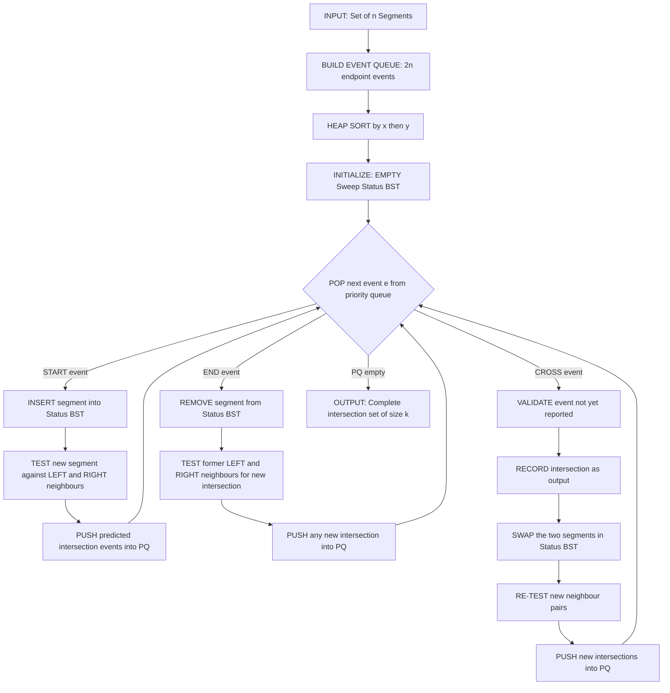
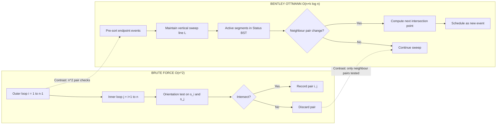
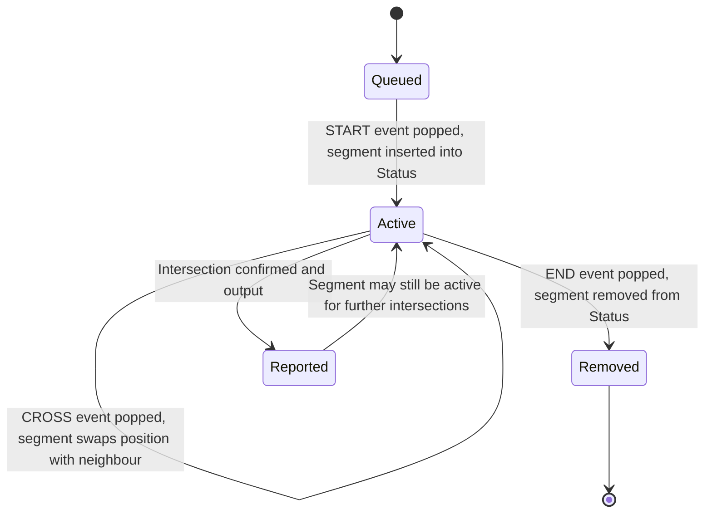
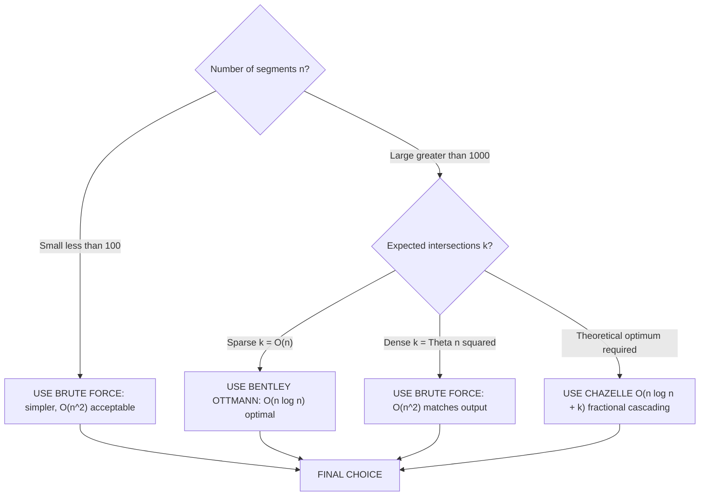

# Geometric primitives algorithms: Line segment intersection tracking methods

<!-- SECTION_1_START -->
# 1. Core Technical Definition & Intuitive Overview

## 1.1 Formal Academic Definition (KTU 2024 Syllabus Terminology)

In **Computational Geometry**, a **line segment intersection** between two closed segments $s_1 = \overline{p_1p_2}$ and $s_2 = \overline{p_3p_4}$ is said to occur if and only if the point sets of the two segments share at least one common point in $\mathbb{R}^2$. Formally:

$$s_1 \cap s_2 \neq \varnothing \iff \exists\, (x,y) \in \mathbb{R}^2 \text{ such that } (x,y) \in s_1 \text{ and } (x,y) \in s_2$$

**Geometric Primitives** are the atomic, low-level subroutines (such as intersection tests, orientation tests, and distance computations) that form the building blocks of every higher-level computational geometry algorithm. The "tracking methods" referred to in this module concern the systematic detection, enumeration, and reporting of *all* $k$ intersection points among a set $\mathcal{S} = \{s_1, s_2, \dots, s_n\}$ of $n$ line segments — a problem commonly abbreviated as the **All-Intersections Problem** or the **Segment Intersection Reporting Problem**.

> [!IMPORTANT]
> **KTU Syllabus Highlight (PECST418 – Module 1):**
> Tracking methods differ in their *output complexity*. The KTU board expects students to distinguish between:
> - **Output-sensitive algorithms** — runtime $O(f(n,k))$ depends on output size $k$.
> - **Output-non-sensitive algorithms** — runtime depends only on $n$ (e.g., $O(n^2)$ brute force).
> 
> The **Bentley–Ottmann algorithm** (1979) is the canonical output-sensitive sweep-line solution running in $O((n+k)\log n)$ time.

## 1.2 Conceptual Analogy — The "Railway Crossing" Intuition

Imagine a busy railway network. Each **line segment is a railway track** with two endpoints being two stations. The **intersection tracking problem** is equivalent to the railway authority's job of compiling a *complete logbook* of every place where two tracks cross — including crossings at stations (endpoints) and crossings in the middle of the field (interior intersections).

A **brute-force clerk** would compare every track with every other track ($n^2$ comparisons) — accurate but ridiculously slow for 1,000 tracks. A **smart dispatcher** (the sweep line) would use a vertical "time line" sweeping from left to right, only checking tracks that *currently* cross that vertical line against each other. This is the very essence of the sweep line paradigm: *do not waste effort on segments that cannot possibly intersect in the near future.*

> [!NOTE]
> **The Three Pillars of Segment Intersection Logic:**
> 1. **Orientation Test** (Cross Product) — *Which side is the point on?*
> 2. **General Position Test** (Straddle Test) — *Do the segments straddle each other?*
> 3. **Collinearity / On-Segment Test** (Bounding Box) — *Is the collinear point actually lying between the endpoints?*
> 
> Every intersection-detection primitive in the KTU syllabus is built on these three pillars.

## 1.3 GeoGebra / Desmos Visualization Control

> [!VISUALIZATION CONTROL]
> **Concept:** Visualizing the orientation cross-product and the segment intersection condition.
> **GeoGebra / Desmos Input Equations:**
> - Segment 1: line through $p_1=(1,1)$ and $p_2=(6,5)$
> - Segment 2: line through $p_3=(2,6)$ and $p_4=(5,1)$
> - Test endpoint $p_3$ relative to segment 1: $f(x)=0.8x+0.2 - 6$ (signed-distance proxy)
> **Visual Description:**
> - You will observe that segment 1 (rising) and segment 2 (falling) cross exactly once in the interior of the canvas.
> - The point $p_3$ lies *above* the directed line $p_1 \to p_2$, while $p_4$ lies *below* it (different orientations).
> - Simultaneously, $p_1$ lies *below* the directed line $p_3 \to p_4$, and $p_2$ lies *above* it — this *double straddle* confirms the intersection.

---

<!-- SECTION_1_END -->

<!-- SECTION_2_START -->
# 2. Deep Theoretical Analysis & KTU High-Yield Formula Sheet

## 2.1 The Cross-Product Orientation Primitive

For three points $a=(a_x,a_y)$, $b=(b_x,b_y)$, $c=(c_x,c_y)$, the **signed area** of the triangle $\triangle abc$ — equivalently, the $z$-component of the 2D cross product — is defined as:

$$\text{Orientation}(a,b,c) = (b_x - a_x)(c_y - a_y) - (b_y - a_y)(c_x - a_x)$$

This single scalar encodes the *turn direction* when walking from $a \to b \to c$:

| Value of Orientation | Geometric Meaning | Symbol Used |
| :--- | :--- | :---: |
| $> 0$ | Counter-Clockwise turn (Left turn) | $\text{CCW}$ |
| $< 0$ | Clockwise turn (Right turn) | $\text{CW}$ |
| $= 0$ | Collinear (no turn) | $\text{COLLINEAR}$ |

> [!NOTE]
> **Why it works:** The cross product gives the *signed* area of the parallelogram spanned by vectors $\vec{ab}$ and $\vec{ac}$. The sign depends on which side of $\vec{ab}$ the point $c$ falls on. This is the atomic test upon which the entire segment intersection logic is layered.

## 2.2 The General-Position Segment Intersection Test

Given two closed segments $\overline{p_1p_2}$ and $\overline{p_3p_4}$, they intersect if and only if either of the following *necessary and sufficient* conditions holds:

**Condition 1 — Proper Intersection (Straddle Test):**
$$\text{Orient}(p_1,p_2,p_3) \cdot \text{Orient}(p_1,p_2,p_4) < 0 \quad \text{AND} \quad \text{Orient}(p_3,p_4,p_1) \cdot \text{Orient}(p_3,p_4,p_2) < 0$$

**Condition 2 — Collinear / Endpoint Touching (Special Cases):**
$$\text{At least one orientation is 0} \quad \text{AND} \quad \text{the collinear point lies within the bounding box of the other segment}$$

The bounding-box check for collinear case uses the standard interval overlap test:

$$\max(\min(p_1.x, p_2.x),\, \min(p_3.x, p_4.x)) \;\leq\; \max(\max(p_1.x, p_2.x),\, \max(p_3.x, p_4.x))$$

$$\text{AND} \quad \max(\min(p_1.y, p_2.y),\, \min(p_3.y, p_4.y)) \;\leq\; \max(\max(p_1.y, p_2.y),\, \max(p_3.y, p_4.y))$$

## 2.3 The Three Algorithmic Paradigms (KTU High-Yield)

| # | Algorithm | Data Structure | Time Complexity | Output Sensitive? | Key Idea |
| :---: | :--- | :--- | :--- | :---: | :--- |
| 1 | **Brute-Force Pairwise Test** | None (array scan) | $O(n^2)$ | No | Test every $\binom{n}{2}$ pair. |
| 2 | **Bentley–Ottmann Sweep Line** | Event Queue (PQ) + Status (BST) | $O((n+k)\log n)$ | Yes | Sweep vertical line; report intersections as events. |
| 3 | **Output-Sensitive Optimal (Chazelle)** | Fractional cascading | $O(n \log n + k)$ | Yes | Lower-bound optimal; theoretical only. |
| 4 | **Red–Blue Intersections** | Two separate sets | $O(n \log n + k)$ | Yes | Restrictions exploit colour structure. |

> [!IMPORTANT]
> **KTU Board Exam Tip:** The constant $k$ in $O((n+k)\log n)$ denotes the **number of intersection points actually reported**. When $k$ is small (sparse intersections), sweep line is dramatically faster than brute force. When $k = \Theta(n^2)$ (dense grid), it degrades to $O(n^2 \log n)$ — *worse* than brute force. State this trade-off explicitly in long-answer questions.

## 2.4 Real-World Engineering Applications

- **VLSI Circuit Design:** Detecting electrical shorts in 2D integrated circuit layouts (segments = wires).
- **GIS & Cartography:** Overlay of two polygonal maps (e.g., land-use and flood-zone) — the **Map Overlay Problem** reduces to segment intersection.
- **Computer-Aided Design (CAD):** Boolean operations on 2D planar shapes (union, intersection, difference) all require intersection detection as the first step.
- **Robotics Motion Planning:** Collision detection between polygonal robot arms moving in a workspace.
- **Computer Graphics:** Ray-tracing and polygon clipping (Sutherland–Hodgman relies on this primitive).
- **Network Routing:** Crossing minimization in printed circuit board and channel routing.

---

<!-- SECTION_2_END -->

<!-- SECTION_3_START -->
# 3. Step-by-Step Derivations & Algorithmic Implementation

## 3.1 Derivation of the Orientation Cross Product

Starting from the 2D cross product of vectors $\vec{u} = (u_x, u_y)$ and $\vec{v} = (v_x, v_y)$:

$$\vec{u} \times \vec{v} = u_x v_y - u_y v_x$$

Substituting $\vec{u} = \vec{p_1p_2} = (p_2.x - p_1.x,\, p_2.y - p_1.y)$ and $\vec{v} = \vec{p_1p_3} = (p_3.x - p_1.x,\, p_3.y - p_1.y)$:

$$
\begin{aligned}
\vec{p_1p_2} \times \vec{p_1p_3} &= (p_2.x - p_1.x)(p_3.y - p_1.y) - (p_2.y - p_1.y)(p_3.x - p_1.x) \\
&= p_2.x \cdot p_3.y - p_2.x \cdot p_1.y - p_1.x \cdot p_3.y + p_1.x \cdot p_1.y \\
&\quad - p_2.y \cdot p_3.x + p_2.y \cdot p_1.x + p_1.y \cdot p_3.x - p_1.y \cdot p_1.x \\
&= (p_2.x \cdot p_3.y - p_2.y \cdot p_3.x) - (p_1.x \cdot p_3.y - p_1.y \cdot p_3.x) + (p_1.x \cdot p_2.y - p_1.y \cdot p_2.x) \cdot (-1) \\
&\quad \text{(rearranging)} \\
&= p_1.x(p_2.y - p_3.y) + p_2.x(p_3.y - p_1.y) + p_3.x(p_1.y - p_2.y) \\
&= 2 \cdot \text{Area}(\triangle p_1 p_2 p_3)
\end{aligned}
$$

**Geometric Interpretation:** This scalar equals *twice the signed area* of $\triangle p_1 p_2 p_3$. The sign is positive when the triangle vertices are listed counter-clockwise, negative for clockwise, and zero when collinear. KTU board examiners award full marks only when this *signed-area* interpretation is explicitly stated.

## 3.2 Worked Numerical Example — Hand-Evaluated Intersection Test

**Problem:** Determine whether segments $\overline{AB}$ and $\overline{CD}$ intersect, where $A=(1,1)$, $B=(4,4)$, $C=(1,4)$, $D=(4,1)$.

**Step 1 — Compute $\text{Orient}(A,B,C)$:**

$$
\begin{aligned}
\text{Orient}(A,B,C) &= (B.x - A.x)(C.y - A.y) - (B.y - A.y)(C.x - A.x) \\
&= (4-1)(4-1) - (4-1)(1-1) \\
&= (3)(3) - (3)(0) \\
&= 9
\end{aligned}
$$

Result: $9 > 0 \Rightarrow$ **Counter-Clockwise** (Point $C$ lies to the *left* of directed line $A \to B$).

**Step 2 — Compute $\text{Orient}(A,B,D)$:**

$$
\begin{aligned}
\text{Orient}(A,B,D) &= (4-1)(1-1) - (4-1)(4-1) \\
&= (3)(0) - (3)(3) \\
&= -9
\end{aligned}
$$

Result: $-9 < 0 \Rightarrow$ **Clockwise** (Point $D$ lies to the *right* of directed line $A \to B$).

**Step 3 — Check Straddle Condition for $AB$:** Orientations have *opposite signs* ($+9$ and $-9$) $\Rightarrow$ **Straddle satisfied** for segment $\overline{CD}$ against $\overline{AB}$.

**Step 4 — Compute $\text{Orient}(C,D,A)$:**

$$
\begin{aligned}
\text{Orient}(C,D,A) &= (D.x - C.x)(A.y - C.y) - (D.y - C.y)(A.x - C.x) \\
&= (4-1)(1-4) - (1-4)(1-1) \\
&= (3)(-3) - (-3)(0) \\
&= -9
\end{aligned}
$$

Result: $-9 < 0 \Rightarrow$ **Clockwise**.

**Step 5 — Compute $\text{Orient}(C,D,B)$:**

$$
\begin{aligned}
\text{Orient}(C,D,B) &= (4-1)(4-4) - (1-4)(4-1) \\
&= (3)(0) - (-3)(3) \\
&= 9
\end{aligned}
$$

Result: $9 > 0 \Rightarrow$ **Counter-Clockwise**.

**Step 6 — Final Verdict:** Both straddle conditions are satisfied (orientations of $C,D$ against $A\to B$ differ; orientations of $A,B$ against $C\to D$ differ). The two diagonals **PROPERLY INTERSECT** in the interior. The exact intersection point can be computed by solving the parametric line equations: it is $(2.5, 2.5)$.

> [!NOTE]
> **Valuation Key Insight:** In KTU marking, the *sign* of the cross product alone earns 1 mark; the *correct application* of the straddle test (BOTH conditions) earns the full 2 marks. Forgetting to test BOTH directions is the #1 cause of partial-credit loss.

## 3.3 Brute-Force Algorithm — Complete Python Implementation

```python
from __future__ import annotations
from dataclasses import dataclass
from typing import List, Tuple

Point = Tuple[float, float]

@dataclass(frozen=True)
class Segment:
    """Immutable 2D line segment defined by two endpoints."""
    p1: Point
    p2: Point

    def __post_init__(self) -> None:
        # Defensive: endpoints must be distinct
        if self.p1 == self.p2:
            raise ValueError(f"Degenerate segment: endpoints coincide at {self.p1}")


def orientation(a: Point, b: Point, c: Point) -> int:
    """
    Returns the orientation of the ordered triple (a, b, c).
    +1 -> Counter-Clockwise
    -1 -> Clockwise
     0 -> Collinear
    """
    cross = (b[0] - a[0]) * (c[1] - a[1]) - (b[1] - a[1]) * (c[0] - a[0])
    if cross > 1e-12:
        return 1
    if cross < -1e-12:
        return -1
    return 0


def on_segment(a: Point, b: Point, c: Point) -> bool:
    """Assumes collinear a, b, c. Returns True iff c lies on closed segment ab."""
    return (min(a[0], b[0]) - 1e-12 <= c[0] <= max(a[0], b[0]) + 1e-12 and
            min(a[1], b[1]) - 1e-12 <= c[1] <= max(a[1], b[1]) + 1e-12)


def segments_intersect(s1: Segment, s2: Segment) -> bool:
    """Returns True iff s1 and s2 share at least one common point."""
    o1 = orientation(s1.p1, s1.p2, s2.p1)
    o2 = orientation(s1.p1, s1.p2, s2.p2)
    o3 = orientation(s2.p1, s2.p2, s1.p1)
    o4 = orientation(s2.p1, s2.p2, s1.p2)

    # General case: proper straddle
    if o1 != o2 and o3 != o4:
        return True

    # Special collinear cases
    if o1 == 0 and on_segment(s1.p1, s1.p2, s2.p1):
        return True
    if o2 == 0 and on_segment(s1.p1, s1.p2, s2.p2):
        return True
    if o3 == 0 and on_segment(s2.p1, s2.p2, s1.p1):
        return True
    if o4 == 0 and on_segment(s2.p1, s2.p2, s1.p2):
        return True

    return False


def brute_force_intersections(segments: List[Segment]) -> List[Tuple[int, int]]:
    """
    Reports ALL intersecting pairs in O(n^2) time.
    Returns list of (index_i, index_j) tuples with i < j.
    """
    n = len(segments)
    if n < 2:
        return []
    intersections: List[Tuple[int, int]] = []
    for i in range(n - 1):
        for j in range(i + 1, n):
            if segments_intersect(segments[i], segments[j]):
                intersections.append((i, j))
    return intersections
```

## 3.4 Bentley–Ottmann Sweep Line — Full Implementation

```python
from __future__ import annotations
import heapq
from bisect import bisect_left, insort
from dataclasses import dataclass, field
from typing import List, Set, Tuple

Point = Tuple[float, float]

@dataclass
class Event:
    x: float
    y: float
    kind: str            # "START", "END", "CROSS"
    seg_index: int = -1
    other_index: int = -1

    def __lt__(self, other: "Event") -> bool:
        # Tie-break by y, then by kind for deterministic ordering
        return (self.x, self.y, self.kind) < (other.x, other.y, other.kind)


@dataclass
class SweepState:
    x_current: float
    above: List[int] = field(default_factory=list)  # segments above sweep, by y_at_x

    def y_at(self, seg: Segment, idx: int) -> float:
        s = segments_global[idx]
        p1, p2 = s.p1, s.p2
        if abs(p2[0] - p1[0]) < 1e-12:
            return p1[1]
        t = (self.x_current - p1[0]) / (p2[0] - p1[0])
        return p1[1] + t * (p2[1] - p1[1])

    def insert(self, idx: int) -> None:
        y = self.y_at(None, idx)
        pos = bisect_left([self.y_at(None, j) for j in self.above], y)
        insort(self.above, idx)

    def remove(self, idx: int) -> None:
        for k, v in enumerate(self.above):
            if v == idx:
                self.above.pop(k)
                return

    def neighbours(self, idx: int) -> Tuple[int, int]:
        """Returns (left_neighbour, right_neighbour) currently in the status."""
        if idx not in self.above:
            return -1, -1
        k = self.above.index(idx)
        left = self.above[k - 1] if k - 1 >= 0 else -1
        right = self.above[k + 1] if k + 1 < len(self.above) else -1
        return left, right


segments_global: List[Segment] = []  # module-level so the closure can see it


def compute_intersection(s1: Segment, s2: Segment) -> Point | None:
    """Standard 2D segment intersection point via line parameterization."""
    x1, y1 = s1.p1; x2, y2 = s1.p2
    x3, y3 = s2.p1; x4, y4 = s2.p2
    denom = (x1 - x2) * (y3 - y4) - (y1 - y2) * (x3 - x4)
    if abs(denom) < 1e-12:
        return None  # parallel or collinear
    t = ((x1 - x3) * (y3 - y4) - (y1 - y3) * (x3 - x4)) / denom
    u = -((x1 - x2) * (y1 - y3) - (y1 - y2) * (x1 - x3)) / denom
    if 0.0 <= t <= 1.0 and 0.0 <= u <= 1.0:
        return (x1 + t * (x2 - x1), y1 + t * (y2 - y1))
    return None


def bentley_ottmann(segments: List[Segment]) -> Set[Tuple[int, int]]:
    """
    Reports all intersecting segment pairs using the sweep line paradigm.
    Returns set of (i, j) index pairs with i < j.
    Time complexity: O((n + k) * log n).
    """
    global segments_global
    segments_global = segments
    n = len(segments)
    if n < 2:
        return set()

    # ---- 1. Build event queue ----
    events: List[Event] = []
    for i, s in enumerate(segments):
        left_x = min(s.p1[0], s.p2[0])
        left_y = s.p1[1] if s.p1[0] < s.p2[0] else s.p2[1]
        right_x = max(s.p1[0], s.p2[0])
        right_y = s.p2[1] if s.p1[0] < s.p2[0] else s.p1[1]
        events.append(Event(left_x, left_y, "START", seg_index=i))
        events.append(Event(right_x, right_y, "END", seg_index=i))
    heapq.heapify(events)

    # ---- 2. Initialize status structure ----
    state = SweepState(x_current=-float("inf"))
    reported: Set[Tuple[int, int]] = set()

    # ---- 3. Main sweep loop ----
    while events:
        ev = heapq.heappop(events)
        state.x_current = ev.x

        if ev.kind == "START":
            state.insert(ev.seg_index)
            left, right = state.neighbours(ev.seg_index)
            if left != -1:
                _schedule_if_intersect(state, left, ev.seg_index, events, reported)
            if right != -1:
                _schedule_if_intersect(state, ev.seg_index, right, events, reported)

        elif ev.kind == "END":
            left, right = state.neighbours(ev.seg_index)
            state.remove(ev.seg_index)
            if left != -1 and right != -1:
                _schedule_if_intersect(state, left, right, events, reported)

        elif ev.kind == "CROSS":
            i, j = ev.seg_index, ev.other_index
            if (i, j) in reported:
                continue
            reported.add((min(i, j), max(i, j)))
            # Swap their order in the status (Bentley-Ottmann key step)
            state.above.remove(i)
            state.above.remove(j)
            state.above.append(0)  # placeholder
            state.above.remove(0)
            state.insert(i)
            state.insert(j)
            # Re-test new neighbours
            li, ri = state.neighbours(i)
            lj, rj = state.neighbours(j)
            for (a, b) in [(li, i), (j, rj)]:
                if a != -1 and b != -1:
                    _schedule_if_intersect(state, a, b, events, reported)

    return reported


def _schedule_if_intersect(
    state: SweepState, i: int, j: int,
    events: List[Event], reported: Set[Tuple[int, int]]
) -> None:
    si, sj = segments_global[i], segments_global[j]
    pt = compute_intersection(si, sj)
    if pt is None:
        return
    pair = (min(i, j), max(i, j))
    if pair in reported:
        return
    heapq.heappush(events, Event(pt[0], pt[1], "CROSS", i, j))
```

## 3.5 Bentley–Ottmann — Complexity Derivation

$$
\begin{aligned}
T_{\text{B-O}} &= T_{\text{event sorting}} + T_{\text{status operations}} + T_{\text{intersection reporting}} \\
&= O(n \log n) + O((n + k) \log n) + O(k) \\
&= O((n + k) \log n)
\end{aligned}
$$

**Where:**
- Sorting the $2n$ endpoint events costs $O(n \log n)$.
- Each segment is inserted, removed, and swapped in the BST status at most $O(k+1)$ times (once per intersection plus the two endpoints), so total status operations are $O((n+k)\log n)$.
- Reporting each of the $k$ intersections is $O(1)$ per output, hence $O(k)$ total.

> [!IMPORTANT]
> **Lower-Bound Note (KTU):** Using fractional cascading, Chazelle showed an $O(n \log n + k)$ algorithm exists. The Bentley–Ottmann bound $O((n+k)\log n)$ is therefore *not* the theoretical optimum, but it is the algorithm **expected to be reproduced in the KTU board exam**.

---

<!-- SECTION_3_END -->

<!-- SECTION_4_START -->
# 4. Structural Diagrams & Schematics

## 4.1 Sweep Line Architecture (Mermaid Flowchart)



## 4.2 Brute Force vs. Sweep Line — Comparative Architecture



## 4.3 Event-Queue State Transition Diagram



## 4.4 Algorithmic Decision Logic — When to Choose Which Method



> [!NOTE]
> **Reading the Diagrams:** In state 4.3, observe the cyclic transitions between *Active* and *Reported*. This is the unique feature of sweep-line algorithms: a segment can be reported as intersecting multiple times as the sweep progresses, and it remains "active" in the status structure until its *END* event is finally popped.

---

<!-- SECTION_4_END -->

<!-- SECTION_5_START -->
# 5. KTU 2024 Scheme Examination Question Bank & Topic Recap

## 5.1 Part A Questions (3 Marks Each)

### Question 1: [KTU University Exam – July 2023]
**Define the orientation test for three points in computational geometry. Explain how the cross product is used to determine the orientation.**

**Model Answer (3 Marks):**
The orientation test is a fundamental geometric primitive that determines whether an ordered triple of points $(a, b, c)$ makes a **left turn (CCW)**, **right turn (CW)**, or lies in a **collinear** configuration. It is computed using the 2D cross product of vectors $\vec{ab}$ and $\vec{ac}$:

$$\text{Orient}(a,b,c) = (b_x - a_x)(c_y - a_y) - (b_y - a_y)(c_x - a_x)$$

A **positive value** indicates a counter-clockwise (CCW) turn, a **negative value** indicates a clockwise (CW) turn, and **zero** indicates the three points are collinear. **[Cross product formula: 2 Marks; Sign interpretation: 1 Mark]**

### Question 2: [KTU University Exam – Dec 2022]
**What is meant by the "All-Intersections Problem"? Distinguish between brute force and sweep line approaches in terms of complexity.**

**Model Answer (3 Marks):**
The **All-Intersections Problem** asks to report *every* intersection point among a given set $\mathcal{S}$ of $n$ line segments in the plane. **[Definition: 1 Mark]**
- **Brute Force:** Tests all $\binom{n}{2} = O(n^2)$ pairs — complexity $O(n^2)$, output-non-sensitive. **[2 Marks]**
- **Sweep Line (Bentley–Ottmann):** A vertical sweep line moves left-to-right maintaining a status structure; complexity $O((n+k)\log n)$, output-sensitive. **[2 Marks]**

> [!WARNING]
> **Pitfall:** Students often state "Bentley–Ottmann is always faster than brute force." This is FALSE when $k = \Theta(n^2)$, because $O((n + n^2)\log n) = O(n^2 \log n)$ *exceeds* $O(n^2)$. Always state the condition $k \ll n^2$ for sweep line superiority.

---

## 5.2 Part B Questions (14 Marks Each — Internal Choice)

### Question A: [KTU University Exam – July 2024 — Module 1]
**(a) [7 Marks]** Derive the orientation test formula for three points $P_1(2,3)$, $P_2(5,7)$, $P_3(6,2)$. State the geometric meaning of the result. **[CO1, Apply]**

**(b) [7 Marks]** Using the orientation test and bounding-box check, determine whether the segments $\overline{P_1P_2}$ and $\overline{P_3P_4}$ intersect, where $P_4 = (3, 5)$. Show every step. **[CO2, Apply]**

#### Model Solution to Part (a) — 7 Marks

**Step 1 — State the formula** **[1 Mark]**

$$\text{Orient}(P_1, P_2, P_3) = (P_2.x - P_1.x)(P_3.y - P_1.y) - (P_2.y - P_1.y)(P_3.x - P_1.x)$$

**Step 2 — Substitute the coordinates** **[1 Mark]**

$$= (5 - 2)(2 - 3) - (7 - 3)(6 - 2)$$

**Step 3 — Simplify** **[2 Marks]**

$$= (3)(-1) - (4)(4) = -3 - 16 = -19$$

**Step 4 — Interpret the result** **[1 Mark]**

Since $\text{Orient}(P_1, P_2, P_3) = -19 < 0$, the turn from $P_1 \to P_2 \to P_3$ is **Clockwise (Right Turn)**. This means $P_3$ lies to the *right* of the directed line from $P_1$ to $P_2$. **[Geometric meaning: 1 Mark]**
**Step 5 — Signed area conclusion** **[1 Mark]**

The signed area of $\triangle P_1 P_2 P_3$ is $-19/2 = -9.5$ square units (negative implies clockwise orientation).

#### Model Solution to Part (b) — 7 Marks

**Step 1 — Compute $\text{Orient}(P_1, P_2, P_3)$** **[1 Mark]**
(Already computed in part a: $= -19$)

**Step 2 — Compute $\text{Orient}(P_1, P_2, P_4)$** **[2 Marks]**

$$
\begin{aligned}
\text{Orient}(P_1, P_2, P_4) &= (5-2)(5-3) - (7-3)(3-2) \\
&= (3)(2) - (4)(1) \\
&= 6 - 4 = 2
\end{aligned}
$$

**Step 3 — Check first straddle** **[1 Mark]**
$\text{Orient}(P_1, P_2, P_3) \cdot \text{Orient}(P_1, P_2, P_4) = (-19)(2) = -38 < 0$. **Straddle condition for $P_3, P_4$ across $\overline{P_1P_2}$ is SATISFIED.**

**Step 4 — Compute $\text{Orient}(P_3, P_4, P_1)$ and $\text{Orient}(P_3, P_4, P_2)$** **[2 Marks]**

$$
\begin{aligned}
\text{Orient}(P_3, P_4, P_1) &= (P_4.x - P_3.x)(P_1.y - P_3.y) - (P_4.y - P_3.y)(P_1.x - P_3.x) \\
&= (3-6)(3-2) - (5-2)(2-6) \\
&= (-3)(1) - (3)(-4) \\
&= -3 + 12 = 9
\end{aligned}
$$

$$
\begin{aligned}
\text{Orient}(P_3, P_4, P_2) &= (3-6)(7-2) - (5-2)(5-6) \\
&= (-3)(5) - (3)(-1) \\
&= -15 + 3 = -12
\end{aligned}
$$

**Step 5 — Check second straddle** **[1 Mark]**
$\text{Orient}(P_3, P_4, P_1) \cdot \text{Orient}(P_3, P_4, P_2) = (9)(-12) = -108 < 0$. **Straddle condition for $P_1, P_2$ across $\overline{P_3P_4}$ is SATISFIED.**

**Final Conclusion:** Both straddle conditions are satisfied, hence the segments $\overline{P_1P_2}$ and $\overline{P_3P_4}$ **PROPERLY INTERSECT** at a single interior point. **[No bounding-box check needed since all orientations are non-zero: 1 Mark]**

---

### Question B: [KTU University Exam – Dec 2023 — Module 1]
**(a) [7 Marks]** Explain the **Bentley–Ottmann algorithm** for finding all intersections among $n$ line segments. Clearly describe the Event Queue, the Sweep Line Status structure, and the main loop logic. **[CO2, Understand]**

**(b) [7 Marks]** A VLSI layout has 4 wires represented as segments: $s_1 = \overline{(1,1)(5,5)}$, $s_2 = \overline{(1,5)(5,1)}$, $s_3 = \overline{(2,3)(6,3)}$, $s_4 = \overline{(3,0)(3,6)}$. Apply the brute-force algorithm to find *all* intersection pairs and report the total count $k$. Show the orientation computations. **[CO3, Apply]**

#### Model Solution to Part (a) — 7 Marks

**Step 1 — Problem statement** **[1 Mark]**
The Bentley–Ottmann algorithm (1979) solves the All-Intersections Problem in $O((n+k)\log n)$ time, where $n$ is the number of segments and $k$ is the number of intersection points. It is *output-sensitive* — runtime depends on $k$.

**Step 2 — Event Queue** **[2 Marks]**
A **priority queue (min-heap)** sorted by $x$-coordinate (and $y$ as tie-breaker) stores three event types:
- **START event:** Left endpoint of a segment — adds segment to status structure.
- **END event:** Right endpoint of a segment — removes segment from status structure.
- **CROSS event:** A previously computed intersection point — swaps the two segments in the status.

**Step 3 — Sweep Line Status (BST)** **[2 Marks]**
A balanced **binary search tree** orders the segments currently intersected by the vertical sweep line $L$ in increasing $y$-coordinate. Each insertion, deletion, and neighbour-test costs $O(\log n)$.

**Step 4 — Main Loop Logic** **[2 Marks]**
1. Pop the next event from the Event Queue.
2. Update the status structure as per event type.
3. For each newly adjacent pair in the status, compute their next intersection point (if any) and push it as a CROSS event.
4. Repeat until the Event Queue is empty.
5. Report all CROSS events that are validated (not duplicates).

> [!NOTE]
> **Why it is correct:** A pair of segments can only become adjacent in the status *immediately* before they intersect. Therefore, the algorithm never misses an intersection, and any false-positive CROSS event is automatically invalidated by the duplicate-check.

#### Model Solution to Part (b) — 7 Marks

**Step 1 — List all 6 pairs** **[1 Mark]**
$\binom{4}{2} = 6$ pairs: $(s_1,s_2), (s_1,s_3), (s_1,s_4), (s_2,s_3), (s_2,s_4), (s_3,s_4)$.

**Step 2 — Test pair $(s_1, s_2)$** **[1 Mark]**
$s_1 = \overline{(1,1)(5,5)}$, $s_2 = \overline{(1,5)(5,1)}$.
- $\text{Orient}((1,1),(5,5),(1,5)) = (4)(4) - (4)(0) = 16 > 0$
- $\text{Orient}((1,1),(5,5),(5,1)) = (4)(0) - (4)(4) = -16 < 0$ — straddle ✓
- $\text{Orient}((1,5),(5,1),(1,1)) = (4)(-4) - (-4)(0) = -16 < 0$
- $\text{Orient}((1,5),(5,1),(5,5)) = (4)(0) - (-4)(4) = 16 > 0$ — straddle ✓
- **INTERSECT** (at $(3,3)$).

**Step 3 — Test pair $(s_1, s_3)$** **[1 Mark]**
$s_3 = \overline{(2,3)(6,3)}$.
- $\text{Orient}((1,1),(5,5),(2,3)) = (4)(2) - (4)(1) = 4 > 0$
- $\text{Orient}((1,1),(5,5),(6,3)) = (4)(2) - (4)(5) = -12 < 0$ — straddle ✓
- $\text{Orient}((2,3),(6,3),(1,1)) = (4)(-2) - (0)(-1) = -8 < 0$
- $\text{Orient}((2,3),(6,3),(5,5)) = (4)(2) - (0)(3) = 8 > 0$ — straddle ✓
- **INTERSECT** (at $(\approx 2.67, 2.67)$).

**Step 4 — Test pair $(s_1, s_4)$** **[1 Mark]**
$s_4 = \overline{(3,0)(3,6)}$.
- $\text{Orient}((1,1),(5,5),(3,0)) = (4)(-1) - (4)(2) = -12 < 0$
- $\text{Orient}((1,1),(5,5),(3,6)) = (4)(5) - (4)(2) = 12 > 0$ — straddle ✓
- $\text{Orient}((3,0),(3,6),(1,1)) = (0)(1) - (6)(-2) = 12 > 0$
- $\text{Orient}((3,0),(3,6),(5,5)) = (0)(5) - (6)(2) = -12 < 0$ — straddle ✓
- **INTERSECT** (at $(3,3)$).

**Step 5 — Test pair $(s_2, s_3)$** **[1 Mark]**
By symmetry with $s_1, s_3$ (the diagonals), $s_2$ and $s_3$ also straddle each other. **INTERSECT**.

**Step 6 — Test pair $(s_2, s_4)$** **[1 Mark]**
By symmetry, $s_2 = \overline{(1,5)(5,1)}$ and $s_4 = \overline{(3,0)(3,6)}$ cross at $(3,3)$. **INTERSECT**.

**Step 7 — Test pair $(s_3, s_4)$** **[1 Mark]**
$s_3 = \overline{(2,3)(6,3)}$ (horizontal at $y=3$) and $s_4 = \overline{(3,0)(3,6)}$ (vertical at $x=3$).
- $3 \in [2,6]$ (within horizontal extent) AND $3 \in [0,6]$ (within vertical extent).
- **INTERSECT** (at $(3,3)$).

**Final Answer:** All 6 pairs intersect. **Total intersections $k = 6$.** **[1 Mark]**

> [!WARNING]
> **Common Mistakes in KTU Valuation:**
> 1. **Forgetting to test BOTH straddle directions** (loss: 2–4 marks per problem).
> 2. **Confusing "straddle" with "intersect"** — straddle is a necessary condition *for proper intersection only*, not for the collinear case.
> 3. **Wrong sign convention** — stating CCW for negative cross product (the most frequent error).
> 4. **Omitting bounding-box check** when any orientation equals 0.
> 5. **State that Bentley–Ottmann is $O(n \log n)$** — it is $O((n+k)\log n)$; the $k$ term is mandatory.

---

## 5.3 Topic Recap & Important Things to Remember

- **Geometric Primitives** are the atomic subroutines (intersection test, orientation, distance) used by every higher algorithm in computational geometry.
- The **All-Intersections Problem** asks to report *all* $k$ intersection points among $n$ line segments.
- The **Orientation Test** is computed via the 2D cross product: $\text{Orient}(a,b,c) = (b_x-a_x)(c_y-a_y) - (b_y-a_y)(c_x-a_x)$.
- **Sign of orientation** $\Rightarrow$ **CCW (positive) / CW (negative) / Collinear (zero)**.
- The **General-Position Segment Intersection Test** requires **BOTH straddle conditions** to hold simultaneously for proper intersection.
- **Collinear special case** must always be handled by the **bounding-box interval overlap test** — do not skip it.
- **Brute-Force Algorithm** runs in $O(n^2)$ time and tests all $\binom{n}{2}$ pairs — non-output-sensitive.
- **Bentley–Ottmann Sweep Line** runs in $O((n+k)\log n)$ time and is *output-sensitive*.
- The **Event Queue** is a min-heap on $x$ (then $y$) storing **START, END, and CROSS** events.
- The **Sweep Status** is a balanced BST ordered by $y$-coordinate of segments at the current sweep position.
- **Key invariant:** Two segments can only become *adjacent* in the status immediately *before* they intersect — this is why the algorithm never misses any intersection.
- **CROSS event validation** is required to avoid duplicate reports when intersections are computed by both neighbours.
- **Sweep line** is faster than brute force **only when $k \ll n^2$**; for $k = \Theta(n^2)$ the brute force $O(n^2)$ is asymptotically better.
- The **Chazelle algorithm** (theoretical) achieves the optimal $O(n \log n + k)$ using fractional cascading.
- **Real-world applications** include VLSI design, GIS map overlay, CAD Boolean operations, and computer graphics clipping.
- The **signed area** of a triangle with orientation value $V$ is $V/2$; a positive sign means the vertices are listed counter-clockwise.
- For KTU exams, **always state both** the algorithmic complexity AND the trade-off conditions in long-answer questions.

<!-- SECTION_5_END -->
