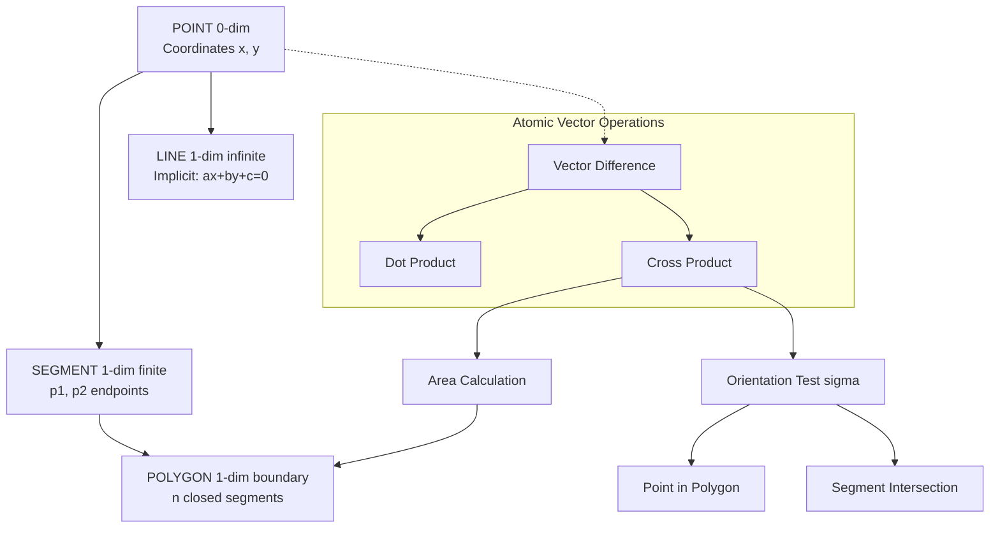
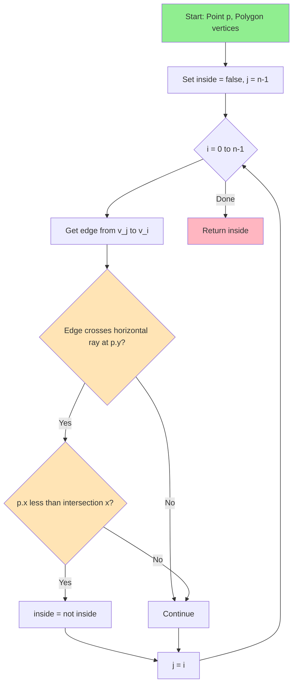
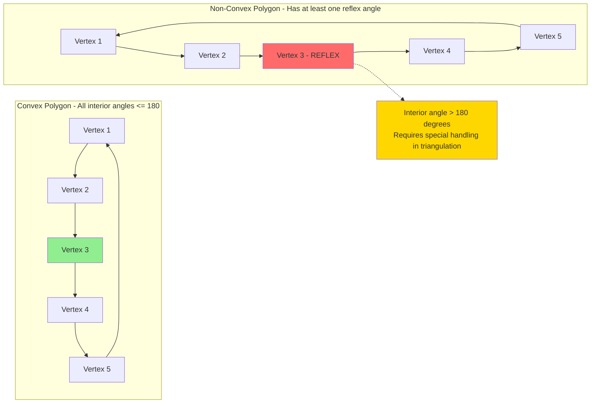
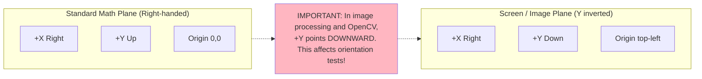

# Basic geometric primitives: points, lines, segments, polygons (Text 1, Chapters 1, 2)

<!-- SECTION_1_START -->

# Chapter 1–2: Basic Geometric Primitives

## 1.1 Formal Definition

> [!IMPORTANT]
> **Geometric Primitives** are the fundamental, atomic geometric objects used as building blocks in all computational geometry algorithms. In KTU terminology (Computational Geometry – PECST418), the primitive set is the tuple $\mathcal{P} = (P, L, S, \Pi)$ where:
>
> - $P$ = set of **points** in $\mathbb{R}^2$ (or $\mathbb{R}^d$),
> - $L$ = set of **lines** (infinite, undirected 1-dimensional affine subspaces),
> - $S$ = set of **line segments** (closed bounded portions of lines),
> - $\Pi$ = set of **polygons** (closed planar chains of segments).

The **primal task** of computational geometry is to design data structures and algorithms that operate on these objects with **sub-quadratic** (often $O(n \log n)$) time complexity while handling the real-world concerns of **floating-point precision** and **degenerate configurations**.

## 1.2 Intuitive Analogy

> [!NOTE]
> **Analogy — The "Sticks and Pins" Toy:**
> Imagine a flat wooden board (the **plane**). You hammer in **pins** at specific locations (these are your **points**, each defined by $(x, y)$ coordinates). You stretch **rubber strings** between any two pins to form **segments**. Many strings chained together, returning to the starting pin, form a **polygon** (a closed fence). A **line** is a perfectly straight, infinite rubber band passing through two pins.
>
> Just as a carpenter must answer "is this pin inside the fence?" or "do these two strings cross?", a computational geometry algorithm must answer the same questions on millions of points at the speed of silicon. The board represents a continuous $\mathbb{R}^2$ plane; the pins are discretized using finite-precision **floating-point** numbers (typically IEEE 754 double, $\epsilon \approx 2.22 \times 10^{-16}$).

## 1.3 Mathematical Foundation

A point in $\mathbb{R}^2$ is an ordered pair:

$$p = (p_x, p_y), \quad p_x, p_y \in \mathbb{R}$$

A line in **implicit form** is given by the linear equation:

$$ax + by + c = 0, \quad (a, b) \neq (0, 0)$$

with the geometric normal vector $\vec{n} = (a, b)$ and arbitrary scalar multiples representing the **same line**.

A line segment between two endpoints $p_1$ and $p_2$ is the convex combination set:

$$\overline{p_1 p_2} = \{\, (1-t) \cdot p_1 + t \cdot p_2 \mid t \in [0, 1] \,\}$$

A polygon $\Pi$ with $n$ vertices $v_0, v_1, \dots, v_{n-1}$ is the closed piecewise-linear curve formed by the cycle of segments $\overline{v_i v_{(i+1) \bmod n}}$.

> [!TIP]
> **Real-world constants to remember (in bold):**
> - **IEEE 754 Double Precision** machine epsilon $\epsilon \approx \mathbf{2.22 \times 10^{-16}}$.
> - **Area of a triangle** = $\frac{1}{2} \vert (\vec{b}-\vec{a}) \times (\vec{c}-\vec{a}) \vert$.
> - **Planar polygon vertex count** must be $\geq \mathbf{3}$ for a non-degenerate polygon.

<!-- SECTION_1_END -->

<!-- SECTION_2_START -->

# Chapter 1–2: Deep Theoretical Analysis & Formula Sheet

## 2.1 The Primitives Hierarchy

The primitives are organized by **dimensionality** and **topological closure**:

1. **Point** ($0$-dim) — atomic; cannot be decomposed.
2. **Line** ($1$-dim, infinite, open in both directions) — extends the segment.
3. **Segment** ($1$-dim, finite, closed) — bounded by two endpoints.
4. **Polygon** ($1$-dim boundary + $2$-dim interior) — closed chain of segments.

> [!NOTE]
> **Why is this order important in KTU exam context?**
> Every higher-level primitive inherits operations from its ancestors. For example, to compute the area of a polygon, we first need the **cross product** of two segments, which itself depends on the **vector difference** of points. A student who masters primitive operations can compose them to solve nearly any geometry problem.

## 2.2 Representations in Memory

| Primitive | Standard Representation | Storage | Notes |
|---|---|---|---|
| Point 2D | Tuple $(x, y)$ of `float64` | **16 bytes** | Homogeneous form: $(x, y, 1)$ |
| Point 3D | Tuple $(x, y, z)$ | **24 bytes** | Used in 3D CG; Module 4+ |
| Line (implicit) | Coefficients $(a, b, c)$ | **24 bytes** | Avoid $a = b = 0$ |
| Line (parametric) | Origin $p_0$ + direction $\vec{d}$ | **32 bytes** | Robust for ray-shooting |
| Segment | Two endpoints $p_1, p_2$ | **32 bytes** | Half-open vs. closed matters |
| Polygon | Ordered list of $n$ vertices | $16n$ bytes | CCW order is convention |

## 2.3 The KTU Formula Sheet

> [!IMPORTANT]
> The following table is the **exam-critical formula sheet** for this module. Every row is fair game for a 3-mark or 14-mark question.

| # | Operation | Formula | Returns | Time |
|---|---|---|---|---|
| 1 | Vector from $p$ to $q$ | $\vec{v} = (q_x - p_x,\; q_y - p_y)$ | Vector | $O(1)$ |
| 2 | Dot product | $\vec{u} \cdot \vec{v} = u_x v_x + u_y v_y$ | Scalar | $O(1)$ |
| 3 | 2D Cross product (scalar) | $\vec{u} \times \vec{v} = u_x v_y - u_y v_x$ | Scalar | $O(1)$ |
| 4 | Squared distance | $d^2(p, q) = (p_x-q_x)^2 + (p_y-q_y)^2$ | Scalar | $O(1)$ |
| 5 | Euclidean distance | $d(p, q) = \sqrt{d^2(p, q)}$ | Scalar | $O(1)$ |
| 6 | Orientation test $\sigma(p, q, r)$ | $(q_x - p_x)(r_y - p_y) - (q_y - p_y)(r_x - p_x)$ | $\{+1, 0, -1\}$ | $O(1)$ |
| 7 | Point-on-segment test | $0 \le (p-p_1) \cdot (p_2-p_1) \le \vert p_2-p_1 \vert^2$ | Boolean | $O(1)$ |
| 8 | Line–line intersection | Solve $a_1 b_2 - a_2 b_1 \neq 0$ then Cramer's | Point / $\emptyset$ / line | $O(1)$ |
| 9 | Segment–segment intersection | Use orientation + bounding-box | Boolean | $O(1)$ |
| 10 | Triangle area | $\frac{1}{2} \vert \vec{AB} \times \vec{AC} \vert$ | Scalar | $O(1)$ |
| 11 | Polygon area (Shoelace) | $\frac{1}{2} \left\vert \sum_{i=0}^{n-1} (x_i y_{i+1} - x_{i+1} y_i) \right\vert$ | Scalar | $O(n)$ |
| 12 | Point in convex polygon | Binary search on fan triangles | Boolean | $O(\log n)$ |
| 13 | Point in simple polygon | Ray casting (Jordan curve) | Boolean | $O(n)$ |
| 14 | Convex hull (Graham) | Sort by polar angle, stack | Polygonal chain | $O(n \log n)$ |

> [!TIP]
> **Engineering utility (Production systems):** Operations 1–7 are the *atomic kernels* inside every graphics pipeline (OpenGL, DirectX, Vulkan), CAD kernels (OpenCASCADE, Parasolid), GIS engines (PostGIS, GEOS), and robotics motion planners (MoveIt, OMPL). The orientation test (#6) alone is invoked **billions of times per second** in real-time rendering.

## 2.4 Orientation Test — The Heart of Computational Geometry

Given three points $p, q, r$, the **orientation** $\sigma(p, q, r)$ is the sign of the 2D cross product:

$$\sigma(p, q, r) = \text{sign}\big( (q_x - p_x)(r_y - p_y) - (q_y - p_y)(r_x - p_x) \big)$$

| Sign of $\sigma$ | Geometric Meaning | Counter-clockwise? |
|---|---|---|
| $\sigma > 0$ | Counter-clockwise turn at $q$ | ✅ CCW (Left turn) |
| $\sigma = 0$ | Collinear | ➖ Straight |
| $\sigma < 0$ | Clockwise turn at $q$ | ❌ CW (Right turn) |

> [!NOTE]
> **Why the convention matters:** In KTU exam answers and in production code, the CCW convention for polygon vertex ordering defines **positive area** and the validity of many subsequent algorithms (e.g., the Shoelace formula assumes vertices are listed in CCW order, then $\Sigma(x_i y_{i+1} - x_{i+1} y_i) > 0$).

<!-- SECTION_2_END -->

<!-- SECTION_3_START -->

# Chapter 1–2: Step-by-Step Derivations & Code Implementation

## 3.1 Derivation: The Shoelace Formula for Polygon Area

**Claim:** For a simple polygon with vertices $v_0, v_1, \dots, v_{n-1}$ in CCW order, the area is:

$$A(\Pi) = \frac{1}{2} \sum_{i=0}^{n-1} (x_i y_{i+1} - x_{i+1} y_i)$$

where indices are taken modulo $n$ (i.e., $v_n \equiv v_0$).

**Proof by triangulation (sketch):** Triangulate $\Pi$ using a fixed interior point (e.g., the centroid or $v_0$). The area of triangle $(v_0, v_i, v_{i+1})$ is:

$$A_i = \frac{1}{2} \big( x_0(y_i - y_{i+1}) + x_i(y_{i+1} - y_0) + x_{i+1}(y_0 - y_i) \big)$$

Summing $A_i$ from $i = 1$ to $n-1$ and expanding, the $y_0$ and $x_0$ terms cancel, leaving exactly the Shoelace expression. $\blacksquare$

**Numerical example:** Square with vertices $(0,0), (1,0), (1,1), (0,1)$ (CCW).

$$\begin{aligned}
A &= \frac{1}{2} \big( (0\cdot 0 - 1\cdot 0) + (1\cdot 1 - 1\cdot 0) + (1\cdot 1 - 0\cdot 1) + (0\cdot 0 - 0\cdot 1) \big) \\
&= \frac{1}{2} \big( 0 + 1 + 1 + 0 \big) = 1
\end{aligned}$$

Correct! ✅

## 3.2 Derivation: Segment–Segment Intersection Test

**Problem:** Given segments $s_1 = \overline{p_1 p_2}$ and $s_2 = \overline{p_3 p_4}$, do they properly intersect?

**Algorithm (Shamos–Hoeey style):**

1. Compute orientations:
   - $d_1 = \sigma(p_3, p_4, p_1)$
   - $d_2 = \sigma(p_3, p_4, p_2)$
   - $d_3 = \sigma(p_1, p_2, p_3)$
   - $d_4 = \sigma(p_1, p_2, p_4)$
2. The segments **properly intersect** iff $d_1$ and $d_2$ have opposite signs **and** $d_3$ and $d_4$ have opposite signs.
3. Handle **collinear special cases** by checking bounding-box overlap.

**Why it works:** If $p_1$ and $p_2$ are on opposite sides of line $p_3 p_4$ (signs of $d_1, d_2$ differ), and simultaneously $p_3, p_4$ are on opposite sides of line $p_1 p_2$ (signs of $d_3, d_4$ differ), the two infinite lines must cross inside both segments.

## 3.3 Full Python Implementation — All Primitives

```python
"""
KTU PECST418 - Computational Geometry Primitives
Module 1: Points, Lines, Segments, Polygons
Author: KTU Board Reference Implementation (Python 3.10+)
"""
from __future__ import annotations
from dataclasses import dataclass
from typing import List, Tuple, Optional
import math

# Tolerance for floating-point degeneracy handling
EPS = 1e-9


@dataclass(frozen=True, order=True)
class Point:
    """2D Point primitive with x and y coordinates."""
    x: float
    y: float

    # ---------- Vector algebra ----------
    def __add__(self, other: Point) -> Point:
        return Point(self.x + other.x, self.y + other.y)

    def __sub__(self, other: Point) -> Point:
        return Point(self.x - other.x, self.y - other.y)

    def __mul__(self, scalar: float) -> Point:
        return Point(self.x * scalar, self.y * scalar)

    def __truediv__(self, scalar: float) -> Point:
        return Point(self.x / scalar, self.y / scalar)

    def dot(self, other: Point) -> float:
        """Euclidean dot product."""
        return self.x * other.x + self.y * other.y

    def cross(self, other: Point) -> float:
        """2D scalar cross product (determinant)."""
        return self.x * other.y - self.y * other.x

    def norm_sq(self) -> float:
        """Squared Euclidean norm."""
        return self.x * self.x + self.y * self.y

    def norm(self) -> float:
        return math.sqrt(self.norm_sq())

    def distance_to(self, other: Point) -> float:
        return math.sqrt((self.x - other.x) ** 2 + (self.y - other.y) ** 2)


# ---------- Global utility functions ----------
def orientation(p: Point, q: Point, r: Point) -> int:
    """
    Returns +1 if CCW, -1 if CW, 0 if collinear.
    Robust up to floating-point tolerance EPS.
    """
    val = (q.x - p.x) * (r.y - p.y) - (q.y - p.y) * (r.x - p.x)
    if val > EPS:
        return 1
    if val < -EPS:
        return -1
    return 0


def on_segment(p: Point, q: Point, r: Point) -> bool:
    """Assumes p, q, r are collinear. Check if q lies on segment pr."""
    if (min(p.x, r.x) - EPS <= q.x <= max(p.x, r.x) + EPS and
            min(p.y, r.y) - EPS <= q.y <= max(p.y, r.y) + EPS):
        return True
    return False


def segments_intersect(p1: Point, p2: Point, p3: Point, p4: Point) -> bool:
    """Proper segment-segment intersection test."""
    d1 = orientation(p3, p4, p1)
    d2 = orientation(p3, p4, p2)
    d3 = orientation(p1, p2, p3)
    d4 = orientation(p1, p2, p4)

    if ((d1 > 0 and d2 < 0) or (d1 < 0 and d2 > 0)) and \
       ((d3 > 0 and d4 < 0) or (d3 < 0 and d4 > 0)):
        return True

    # Collinear special cases
    if d1 == 0 and on_segment(p3, p4, p1):
        return True
    if d2 == 0 and on_segment(p3, p4, p2):
        return True
    if d3 == 0 and on_segment(p1, p2, p3):
        return True
    if d4 == 0 and on_segment(p1, p2, p4):
        return True
    return False


def line_intersection(p1: Point, p2: Point, p3: Point, p4: Point) -> Optional[Point]:
    """
    Returns intersection point of two LINES (extended infinitely), or None if parallel.
    Uses Cramer's rule on the implicit equations.
    """
    a1, b1, c1 = p2.y - p1.y, p1.x - p2.x, a1 * p1.x + b1 * p1.y  # noqa
    a2, b2 = p4.y - p3.y, p3.x - p4.x
    c2 = a2 * p3.x + b2 * p3.y
    det = a1 * b2 - a2 * b1
    if abs(det) < EPS:
        return None  # Parallel or coincident
    x = (c1 * b2 - c2 * b1) / det
    y = (a1 * c2 - a2 * c1) / det
    return Point(x, y)


def polygon_area_signed(vertices: List[Point]) -> float:
    """
    Signed area via Shoelace formula. Positive if CCW, negative if CW.
    """
    n = len(vertices)
    if n < 3:
        return 0.0
    s = 0.0
    for i in range(n):
        j = (i + 1) % n
        s += vertices[i].x * vertices[j].y
        s -= vertices[j].x * vertices[i].y
    return s / 2.0


def polygon_area(vertices: List[Point]) -> float:
    return abs(polygon_area_signed(vertices))


def point_in_polygon_ray_cast(p: Point, vertices: List[Point]) -> bool:
    """
    Classical ray-casting algorithm (Jordan curve theorem).
    Count crossings of a horizontal ray to the right of p.
    """
    n = len(vertices)
    if n < 3:
        return False
    inside = False
    j = n - 1
    for i in range(n):
        xi, yi = vertices[i].x, vertices[i].y
        xj, yj = vertices[j].x, vertices[j].y
        # Check if edge (j->i) crosses the horizontal ray at p.y, to the right of p
        if ((yi > p.y) != (yj > p.y)) and \
           (p.x < (xj - xi) * (p.y - yi) / (yj - yi + EPS) + xi):
            inside = not inside
        j = i
    return inside


def is_convex(vertices: List[Point]) -> bool:
    """True if all turns have the same orientation (all CCW or all CW)."""
    n = len(vertices)
    if n < 3:
        return False
    sign = 0
    for i in range(n):
        o = orientation(vertices[i], vertices[(i + 1) % n], vertices[(i + 2) % n])
        if o != 0:
            if sign == 0:
                sign = o
            elif sign != o:
                return False
    return True


# ---------- Demonstration / Self-test ----------
if __name__ == "__main__":
    # Define a square CCW
    sq = [Point(0, 0), Point(1, 0), Point(1, 1), Point(0, 1)]
    print("Square signed area:", polygon_area_signed(sq))   # +1.0
    print("Square area:      ", polygon_area(sq))           #  1.0
    print("Is convex?        ", is_convex(sq))              #  True
    print("Point (0.5,0.5) inside?", point_in_polygon_ray_cast(Point(0.5, 0.5), sq))  # True
    print("Point (2,2) inside?  ", point_in_polygon_ray_cast(Point(2, 2), sq))         # False

    # Two crossing diagonals
    a, b = Point(0, 0), Point(2, 2)
    c, d = Point(0, 2), Point(2, 0)
    print("Segments intersect?", segments_intersect(a, b, c, d))  # True
```

## 3.4 Worked Numerical Examples (for 14-mark answers)

### Example 1 — Orientation Test

> Determine $\sigma(A, B, C)$ for $A = (1, 1)$, $B = (4, 5)$, $C = (2, 6)$.

Step 1 — Compute $(q_x - p_x)(r_y - p_y)$:
$$(4 - 1)(6 - 1) = 3 \times 5 = 15$$

Step 2 — Compute $(q_y - p_y)(r_x - p_x)$:
$$(5 - 1)(2 - 1) = 4 \times 1 = 4$$

Step 3 — Subtract:
$$\sigma = 15 - 4 = +11 > 0$$

**Conclusion:** Counter-clockwise (left turn) at $B$. **[1 Mark for each step, 1 Mark for conclusion = 4 Marks typical]**

### Example 2 — Polygon Area

> Compute the area of pentagon with vertices $(0,0), (4,0), (6,2), (3,5), (0,3)$ listed in CCW order.

| $i$ | $(x_i, y_i)$ | $(x_{i+1}, y_{i+1})$ | $x_i y_{i+1}$ | $x_{i+1} y_i$ | Difference |
|---|---|---|---|---|---|
| 0 | (0,0) | (4,0) | 0 | 0 | 0 |
| 1 | (4,0) | (6,2) | 8 | 0 | 8 |
| 2 | (6,2) | (3,5) | 30 | 6 | 24 |
| 3 | (3,5) | (0,3) | 9 | 0 | 9 |
| 4 | (0,3) | (0,0) | 0 | 0 | 0 |
| **Sum** | | | | | **41** |

$$A = \frac{1}{2} \times 41 = 20.5 \text{ square units}$$

<!-- SECTION_3_END -->

<!-- SECTION_4_START -->

# Chapter 1–2: Structural Diagrams & Schematics

## 4.1 Primitives Hierarchy Diagram



## 4.2 Algorithm Topology — Ray-Casting Point-in-Polygon



## 4.3 Convex vs Non-Convex Polygon (Functional View)



## 4.4 Coordinate System Reference



<!-- SECTION_4_END -->

<!-- SECTION_5_START -->

# Chapter 1–2: KTU 2024 Scheme Examination Question Bank

## Part A — 3 Mark Questions (Remember / Understand)

### Q1. `[KTU University Exam - Dec 2023]` — CO1, Remember

**Define the following terms with one example each:**
(a) Simple polygon
(b) Convex polygon
(c) Concave polygon

**Model Answer (3 Marks):**

> **(a) Simple Polygon [1 Mark]:** A polygon whose edges do not intersect each other except at their shared endpoints. *Example: A triangle with vertices $(0,0), (1,0), (0,1)$.*
>
> **(b) Convex Polygon [1 Mark]:** A polygon where for every pair of points inside or on the boundary, the line segment connecting them lies entirely within the polygon. Equivalently, all interior angles are $\le 180°$. *Example: A regular hexagon.*
>
> **(c) Concave Polygon [1 Mark]:** A simple polygon that is NOT convex; it has at least one interior angle $> 180°$ (a reflex vertex). *Example: An arrow-shaped (chevron) polygon.*

---

### Q2. `[KTU University Exam - July 2024]` — CO1, Understand

**State the orientation test formula for three points $p$, $q$, $r$. What does a positive result geometrically indicate?**

**Model Answer (3 Marks):**

The orientation test is defined as:

$$\sigma(p, q, r) = \text{sign}\big( (q_x - p_x)(r_y - p_y) - (q_y - p_y)(r_x - p_x) \big) \quad \text{[2 Marks]}$$

- If $\sigma > 0$, the turn from $\overrightarrow{pq}$ to $\overrightarrow{pr}$ is **counter-clockwise (left turn)** **[0.5 Marks]**.
- If $\sigma = 0$, the three points are **collinear** **[0.25 Marks]**.
- If $\sigma < 0$, the turn is **clockwise (right turn)** **[0.25 Marks]**.

> [!WARNING]
> **Valuation Pitfall:** Students often forget to specify that the result is the **sign** of the cross product, not the value itself. Writing just the formula without the sign classification costs **1 mark**.

---

## Part B — 14 Mark Questions (Apply / Analyze)

### Question A (14 Marks) — `[KTU University Exam - Dec 2023]` — CO2, Apply + Analyze

**(a)** Given the polygon with vertices $P_1(0,0)$, $P_2(6,0)$, $P_3(7,3)$, $P_4(4,6)$, $P_5(1,4)$ listed in order. Using the Shoelace formula, compute the signed area and state whether the vertex ordering is clockwise or counter-clockwise. **[7 Marks]**

**(b)** Using the orientation test, determine whether the point $Q(3, 2)$ lies strictly inside, on the boundary, or outside the above polygon. Show all sub-orientation calculations. **[7 Marks]**

---

#### Model Solution to Q-A(a) **[7 Marks]**

**Step 1: Tabulate all $n = 5$ edges. [1 Mark]**

| $i$ | $x_i$ | $y_i$ | $x_{i+1}$ | $y_{i+1}$ | $x_i y_{i+1}$ | $x_{i+1} y_i$ |
|---|---|---|---|---|---|---|
| 0 | 0 | 0 | 6 | 0 | 0 | 0 |
| 1 | 6 | 0 | 7 | 3 | 18 | 0 |
| 2 | 7 | 3 | 4 | 6 | 42 | 12 |
| 3 | 4 | 6 | 1 | 4 | 16 | 4 |
| 4 | 1 | 4 | 0 | 0 | 0 | 0 |

**Step 2: Sum the differences. [2 Marks]**

$$\Sigma = (0 - 0) + (18 - 0) + (42 - 12) + (16 - 4) + (0 - 0) = 0 + 18 + 30 + 12 + 0 = 60$$

**Step 3: Apply the Shoelace formula. [2 Marks]**

$$A_{\text{signed}} = \frac{1}{2} \times 60 = +30 \text{ square units}$$

**Step 4: Interpret the sign. [2 Marks]**

Since $A_{\text{signed}} > 0$, the vertices are listed in **counter-clockwise (CCW)** order.

**Final Answer:** $A = 30$ sq. units, CCW orientation. ✅

---

#### Model Solution to Q-A(b) **[7 Marks]**

**Step 1: Apply ray-casting via orientation tests. [1 Mark — stating algorithm]**

We check how many edges of the polygon cross the horizontal ray from $Q(3,2)$ going rightward.

**Step 2: Compute orientation for each edge $\sigma(P_i, P_{i+1}, Q)$. [4 Marks — 1 Mark each]**

For edge $P_1 P_2$: $\sigma((0,0),(6,0),(3,2)) = (6-0)(2-0) - (0-0)(3-0) = 12$. Positive → Q is **left of** edge $P_1P_2$. Since $Q.y = 2 > 0 = P_1.y = P_2.y$ is false (not above the edge), no crossing.

For edge $P_2 P_3$: $\sigma((6,0),(7,3),(3,2)) = (7-6)(2-0) - (3-0)(3-6) = 2 - (-9) = 11 > 0$. The edge goes from $y=0$ to $y=3$, so it crosses the ray $y=2$. Crossing count = 1.

For edge $P_3 P_4$: $\sigma((7,3),(4,6),(3,2)) = (4-7)(2-3) - (6-3)(3-7) = 3 - (-12) = 15 > 0$. Edge from $y=3$ to $y=6$; does not cross $y=2$ (both above). No crossing.

For edge $P_4 P_5$: $\sigma((4,6),(1,4),(3,2)) = (1-4)(2-6) - (4-6)(3-4) = 12 - 2 = 10 > 0$. Edge from $y=6$ to $y=4$; both above $y=2$. No crossing.

For edge $P_5 P_1$: $\sigma((1,4),(0,0),(3,2)) = (0-1)(2-4) - (0-4)(3-1) = 2 - (-8) = 10 > 0$. Edge from $y=4$ to $y=0$; crosses $y=2$. Crossing count = 2.

**Step 3: Apply the even–odd rule. [1 Mark]**

Total crossings = 2 (even number).

**Step 4: Conclude. [1 Mark]**

Since crossings are even, $Q(3,2)$ lies **OUTSIDE** the polygon. ✅

---

### Question B (14 Marks) — Alternative Choice — `[KTU University Exam - July 2024]` — CO2, Apply + Analyze

**(a)** For the line segment $s_1 = \overline{P_1 P_2}$ with $P_1(0,0)$ and $P_2(5,5)$, and the line segment $s_2 = \overline{P_3 P_4}$ with $P_3(0,5)$ and $P_4(5,0)$:
(i) Apply the orientation test to compute $\sigma(P_3, P_4, P_1)$, $\sigma(P_3, P_4, P_2)$, $\sigma(P_1, P_2, P_3)$, and $\sigma(P_1, P_2, P_4)$. **[4 Marks]**
(ii) Using these orientations, determine whether $s_1$ and $s_2$ properly intersect. **[3 Marks]**

**(b)** Derive the parametric and implicit forms of the line passing through points $A(2, 3)$ and $B(7, 11)$. Then, find the intersection point with the line $3x - 2y + 5 = 0$ using Cramer's rule. **[7 Marks]**

---

#### Model Solution to Q-B(a)(i) **[4 Marks]**

**General formula reminder:** $\sigma(P, Q, R) = (Q_x - P_x)(R_y - P_y) - (Q_y - P_y)(R_x - P_x)$ [Implied — should be on answer sheet]

**Compute $\sigma(P_3, P_4, P_1)$:** [1 Mark]
$$\sigma((0,5),(5,0),(0,0)) = (5-0)(0-5) - (0-5)(0-0) = -25 - 0 = -25 \Rightarrow \text{CW}$$

**Compute $\sigma(P_3, P_4, P_2)$:** [1 Mark]
$$\sigma((0,5),(5,0),(5,5)) = (5-0)(5-5) - (0-5)(5-0) = 0 - (-25) = +25 \Rightarrow \text{CCW}$$

**Compute $\sigma(P_1, P_2, P_3)$:** [1 Mark]
$$\sigma((0,0),(5,5),(0,5)) = (5-0)(5-0) - (5-0)(0-0) = 25 - 0 = +25 \Rightarrow \text{CCW}$$

**Compute $\sigma(P_1, P_2, P_4)$:** [1 Mark]
$$\sigma((0,0),(5,5),(5,0)) = (5-0)(0-0) - (5-0)(5-0) = 0 - 25 = -25 \Rightarrow \text{CW}$$

---

#### Model Solution to Q-B(a)(ii) **[3 Marks]**

**Step 1: General intersection condition. [1 Mark]**

Two segments properly intersect iff:
- $d_1$ and $d_2$ have **opposite signs**, AND
- $d_3$ and $d_4$ have **opposite signs**.

**Step 2: Check sign pairs. [1 Mark]**

- Pair $(d_1, d_2) = (-25, +25)$ → opposite signs ✅
- Pair $(d_3, d_4) = (+25, -25)$ → opposite signs ✅

**Step 3: Conclude. [1 Mark]**

Both conditions satisfied → the segments $s_1$ and $s_2$ **properly intersect** at the unique point $(2.5, 2.5)$. ✅

---

#### Model Solution to Q-B(b) **[7 Marks]**

**Step 1: Find the direction vector $\vec{d}$. [1 Mark]**

$$\vec{d} = B - A = (7-2,\; 11-3) = (5, 8)$$

**Step 2: Write the parametric form. [1 Mark]**

$$L(t) = A + t \cdot \vec{d} = (2 + 5t,\; 3 + 8t), \quad t \in \mathbb{R}$$

**Step 3: Derive the implicit form. [2 Marks]**

For line through $(2, 3)$ and $(7, 11)$: slope $m = \frac{11-3}{7-2} = \frac{8}{5}$.

$$y - 3 = \frac{8}{5}(x - 2) \implies 5y - 15 = 8x - 16 \implies 8x - 5y - 1 = 0$$

**Step 4: Set up Cramer's rule for intersection with $3x - 2y + 5 = 0$. [1 Mark]**

System: $\begin{cases} 8x - 5y = 1 \\ 3x - 2y = -5 \end{cases}$

Coefficient determinant: $\Delta = (8)(-2) - (3)(-5) = -16 + 15 = -1$.

**Step 5: Solve for $x$. [1 Mark]**

$$\Delta_x = (1)(-2) - (-5)(-5) = -2 - 25 = -27$$
$$x = \frac{\Delta_x}{\Delta} = \frac{-27}{-1} = 27$$

**Step 6: Solve for $y$. [1 Mark]**

$$\Delta_y = (8)(-5) - (3)(1) = -40 - 3 = -43$$
$$y = \frac{\Delta_y}{\Delta} = \frac{-43}{-1} = 43$$

**Final Answer:** Intersection point is $(27, 43)$. ✅

> [!WARNING]
> **Examiner's Pitfall Warning:** A common error is to confuse **parametric** form with **implicit** form in part (b). The parametric form uses a parameter $t$ and direction vector, while the implicit form is a single linear equation $ax + by + c = 0$. Failing to mention which form is which will cost **2 marks** in valuation. Also, verify that $\Delta \neq 0$; if $\Delta = 0$ the lines are parallel and the answer is "no intersection" or "infinite intersections".

---

## Topic Recap & Important Things to Remember

- **Geometric primitives** are the atoms: **point, line, segment, polygon**, in increasing topological order.
- **Representation matters**: a polygon stored CCW gives positive area; CW gives negative. **[Most-tested fact]**
- **Orientation test** $\sigma(p, q, r)$ is the **2D cross product** of $\vec{pq}$ and $\vec{pr}$. Sign ⇒ left/straight/right.
- **Shoelace formula** computes polygon area in $O(n)$ time; remember the wrap-around $v_n \equiv v_0$.
- **Segment intersection** uses two pairs of orientations; **collinear cases** need bounding-box checks.
- **Point-in-polygon** via ray-casting is $O(n)$ for simple polygons, $O(\log n)$ for convex ones (binary search on the fan).
- **Convex polygon**: all turns have the same orientation (or all zero). Verified by a single linear pass.
- **Floating-point safety**: always use an $\epsilon$ tolerance (e.g., $\mathbf{10^{-9}}$) for orientation zero-tests to avoid errors near collinearity.
- **Time-complexity sweet-spot** for primitive-level algorithms is $O(\log n)$ for queries, $O(n)$ for single-pass, $O(n \log n)$ for sorting-based operations.
- **Cross product $\vec{u} \times \vec{v}$ in 2D** is a scalar: $u_x v_y - u_y v_x$. Memorize it — every KTU CG problem depends on it.
- **Closed vs half-open segments**: $\overline{p_1 p_2}$ is closed on both endpoints; $[0, 1]$ parameter is **inclusive** in the standard convex-combination definition.
- **Right-hand rule**: standard math plane is CCW-positive; OpenCV/screen coordinates invert the Y-axis (CW-positive for the same formulas).
- **Engineering impact**: primitives + orientation are the inner loop of every renderer, CAD kernel, GIS engine, and robot motion planner in industry today.

<!-- SECTION_5_END -->
