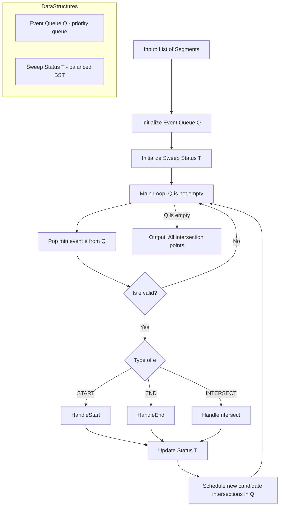
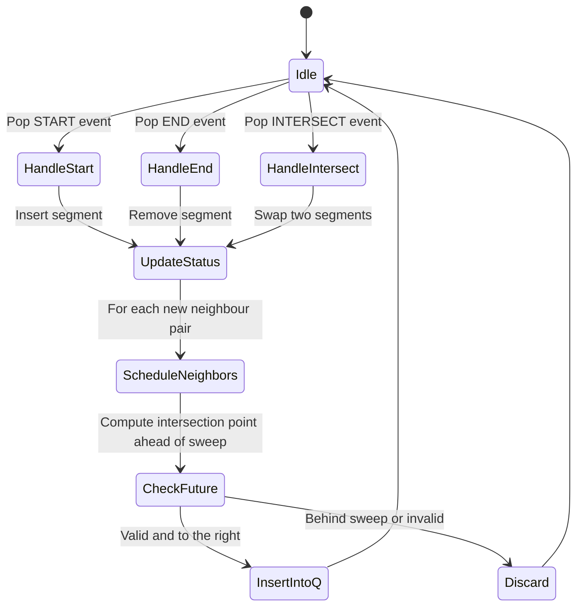
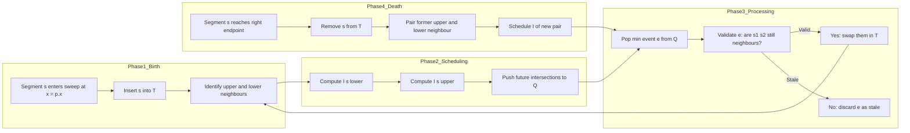
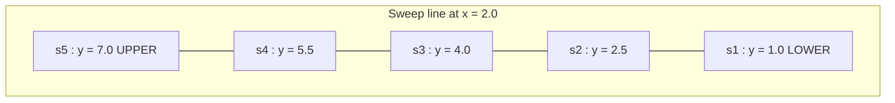
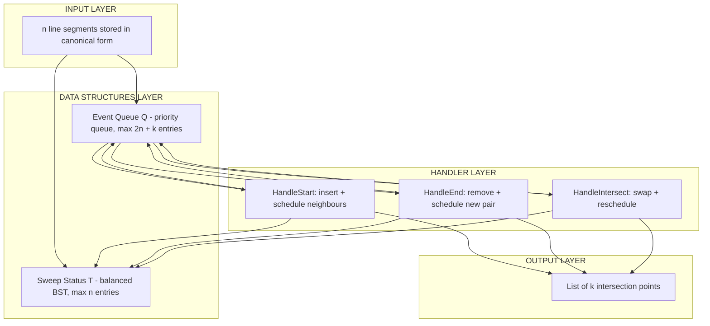

# Bentley-Ottmann algorithm (Text 3, Chapter 7)

<!-- SECTION_1_START -->

# Bentley-Ottmann Algorithm

## Formal Academic Definition (KTU 2024 Syllabus Terminology)

The **Benton-Ottmann Algorithm** is an **output-sensitive sweep-line algorithm** introduced by Jon Bentley and Thomas Ottmann in 1979, designed to compute all intersection points among a set of $n$ line segments in the plane. It runs in $O\bigl((n + k)\log n\bigr)$ time and $O(n + k)$ space, where $k$ denotes the number of pairwise intersection points actually reported.

Formally, given a finite collection of line segments $S = \{s_1, s_2, \dots, s_n\}$ in $\mathbb{R}^2$, the algorithm sweeps a vertical line $\ell$ from $x = -\infty$ to $x = +\infty$, maintaining two dynamically ordered data structures — the **Event Queue** $Q$ (priority queue ordered by sweep position) and the **Sweep-Line Status** $\mathcal{T}$ (ordered structure of segments crossing the current sweep line). It correctly handles the three event types: segment start, segment end, and segment intersection.

> [!IMPORTANT]
> **Syllabus Highlight (KTU PECST418 – Module 1):** The Bentley-Ottmann algorithm is studied as the canonical *sweeping paradigm* and forms the foundation for advanced plane-sweep techniques such as the construction of line arrangements, polygon triangulation via line sweep, and the upper/lower envelope computation of line segments. Examiners consistently test the **event-handling logic**, the **sweepline status data structure** (typically a balanced BST), and the **asymptotic complexity derivation**.

> [!NOTE]
> **Pre-requisite Check:** A student must already be comfortable with the plane-sweep paradigm (also called *sweeping* or *line sweep*), balanced binary search trees (e.g., red-black, AVL, or 2-3 trees), priority queues (binary or Fibonacci heaps), and elementary $O(\cdot)$ complexity analysis. If any of these feel shaky, revise them before proceeding.

---

## Conceptual Analogy — "The Bookshelf Scanner"

Imagine a long horizontal laser beam sweeping slowly from the left end of a library toward the right. The beam is the **sweep line** $\ell$. As the beam moves rightward, the books it currently touches are the **"active"** segments — the ones the beam is *currently* slicing through. These active books are kept in the **Sweep-Line Status** structure, ordered by their *y*-coordinate at the laser position (the lowest-touching book first, like a stack of books standing on a shelf seen in cross-section).

Now, three kinds of *events* can happen as the laser moves:

1. **The laser first meets a book** (segment start) — the book is *inserted* into the active stack in its proper height order.
2. **The laser last touches a book** (segment end) — the book is *removed* from the active stack.
3. **Two active books touch at the same height at the same laser position** (segment intersection) — this is the *clever* case: the two books must be *swapped* in the stack because from that laser position onward, their height order has reversed.

That is *literally* the entire algorithm! The only "magic" is the *intersection* event, which the algorithm must *predict* in advance. To do this, the algorithm uses the **event queue**: for every pair of neighbouring active segments in the stack, it computes the point (if any) where they would intersect *in the future* and schedules it as a candidate event. As the laser moves, the *nearest* scheduled event is processed first.

> [!TIP]
> **Geometric Intuition:** The sweep line $\ell$ moves monotonically to the right. A segment $s_i$ is *active* in the interval of $x$-coordinates where $\ell$ crosses it. The vertical ordering of active segments at any fixed $x = x_0$ is given by substituting $x_0$ into each active segment's linear equation and comparing the resulting $y$-values. Two segments swap their vertical order *exactly at their intersection point*.

> [!VISUALIZATION CONTROL]
> **Concept:** Sweep line crossing two intersecting segments with the vertical-ordering swap.
> **GeoGebra / Desmos Input Equations:**
> * Segment A: $f(x) = 0.5x + 1$ (over the interval $x \in [0, 4]$)
> * Segment B: $g(x) = -0.5x + 3$ (over the interval $x \in [0, 4]$)
> * Sweep line indicator: $x = t$ where $t$ is a slider in $[0, 4]$
>
> **Visual Description:** Plot both segments. Drag the slider $t$. Observe that for $x < 2$, segment B lies above segment A (so B is the "upper neighbour" in the status); for $x > 2$, segment A lies above B. At the crossing point $(2, 2)$, the algorithm records an intersection event and swaps A and B in the sweep-line status.

---

## Where This Algorithm Lives in Engineering & CS

The Bentley-Ottmann algorithm is the *backbone* technique used in:

* **CAD systems** (e.g., detecting when two wires in a circuit-board layout cross on a multilayer board).
* **Geographic Information Systems (GIS)** — finding road intersections, river confluences, or pipeline crossings in a map layer.
* **VLSI physical design** — checking for routing-rule violations in a chip floorplan.
* **Computational biology** — detecting overlaps of genomic intervals or protein chains in 2D.
* **Computational finance / market depth visualization** — order-book crossing detection.

The $O\bigl((n+k)\log n\bigr)$ runtime is the gold standard for *output-sensitive* line-segment intersection reporting — algorithms whose runtime scales with the *useful* output, not just the input size.

<!-- SECTION_1_END -->

<!-- SECTION_2_START -->

# Deep Theoretical Analysis & KTU High-Yield Formula Sheet

## The Three Pillars of the Algorithm

The Bentley-Ottmann algorithm relies on three coordinated data structures and a precisely defined set of event handlers.

### Pillar 1 — The Event Queue $Q$ (Priority Queue)

The event queue stores **all events** in chronological order of the sweep line. Each event is a point $p \in \mathbb{R}^2$ with a strict $x$-coordinate ordering, ties broken by $y$.

**Event types:**

| Event Type | Trigger | Stored Information |
|---|---|---|
| `START(s_i)` | Sweep line reaches the left endpoint of $s_i$ | Point, segment id, pointer to scheduled intersection events |
| `END(s_i)` | Sweep line reaches the right endpoint of $s_i$ | Point, segment id |
| `INTERSECT(s_i, s_j)` | Sweep line reaches the intersection of $s_i$ and $s_j$ | Point, two segment ids |

Insertion and deletion in $Q$ are $O(\log m)$ where $m = |Q|$. Reported intersections may be *inserted* into $Q$ and later *removed* (deferred deletion is permitted) when a neighbouring pair no longer exists — this requires the standard "lazy deletion" technique, marking the event as invalid rather than physically deleting it.

### Pillar 2 — The Sweep-Line Status $\mathcal{T}$ (Ordered Structure)

The status structure stores the *current* set of segments that cross the sweep line at $x = x_\text{current}$, ordered by their $y$-coordinate at that $x$.

**Operations needed:**

| Operation | Time | Meaning |
|---|---|---|
| `INSERT(s, y)` | $O(\log n)$ | Add a new segment when sweep reaches its start |
| `DELETE(s)` | $O(\log n)$ | Remove a segment when sweep reaches its end |
| `SWAP(s_i, s_j)` | $O(\log n)$ | Exchange the order of two segments at an intersection |
| `NEIGHBOURS(s)` | $O(1)$ to $O(\log n)$ | Return predecessor and successor of a segment in $\mathcal{T}$ |

A balanced BST keyed by the $y$-intercept of segments at the *current* $x$ suffices. The key can be parameterized as $y_s(x_\text{cur}) = m_s x_\text{cur} + c_s$, allowing the BST's comparison function to update continuously as the sweep line moves.

### Pillar 3 — The Event Handlers

Three event-handler routines drive the algorithm:

1. **HandleStart($s_i$):** Insert $s_i$ into $\mathcal{T}$. Find its upper and lower neighbours $s_u$ and $s_\ell$. Compute candidate intersection of $(s_i, s_u)$ and $(s_i, s_\ell)$; insert the future valid intersections into $Q$.

2. **HandleEnd($s_i$):** Locate $s_i$ in $\mathcal{T}$. Find its (now current) upper and lower neighbours $s_u$ and $s_\ell$ in $\mathcal{T}$. Remove $s_i$. Compute the new candidate intersection of $(s_u, s_\ell)$ and insert into $Q$ if it lies to the right of the sweep line.

3. **HandleIntersect($s_i, s_j$):** Swap $s_i$ and $s_j$ in $\mathcal{T}$. Update neighbour relations. Compute new candidate intersections of the *new* neighbouring pairs. The old candidate intersection events for these pairs are now obsolete and will be discarded by lazy deletion.

> [!WARNING]
> **Common Student Mistake:** Forgetting to *invalidate* the obsolete intersection events for the old neighbour pairs after a swap. The algorithm does not physically delete them; it processes them and simply checks the validity test (the two segments must still be neighbours, and the event point must still be ahead of the sweep). If invalid, the event is skipped.

---

## KTU Formula Sheet / Cheat Sheet

| Symbol / Concept | Definition / Formula | Use |
|---|---|---|
| $n$ | Number of input line segments | Input size |
| $k$ | Number of reported intersection points | Output size |
| $T(n, k)$ | Total runtime of the algorithm | $O\bigl((n + k)\log n\bigr)$ |
| $S(n, k)$ | Total space of the algorithm | $O(n + k)$ |
| $I(s_i, s_j)$ | Intersection point of segments $s_i, s_j$ | Computed by line-line intersection formula |
| $y_s(x)$ | $y$-coordinate of segment $s$ at $x$ | Used as BST key in $\mathcal{T}$ |
| $m_s$ | Slope of segment $s$ | $m_s = (y_2 - y_1) / (x_2 - x_1)$ |
| $c_s$ | $y$-intercept of segment $s$ | $c_s = y_1 - m_s x_1$ |
| $Q$ | Event queue (priority queue) | Holds $\le n + k$ events |
| $\mathcal{T}$ | Sweep-line status (balanced BST) | Holds $\le n$ active segments |
| Sweep line $\ell$ | Vertical line $x = x_\text{cur}$ | Moves left to right |
| Event $e$ | $(p, \text{type})$ tuple | Processed in $x$ then $y$ order |
| Neighbour pair | Two segments adjacent in $\mathcal{T}$ | Only such pairs can first intersect "soon" |
| Validity test | Event $e$ valid iff segments are still neighbours in $\mathcal{T}$ and $e.x \ge x_\text{cur}$ | Skips stale events |

**Intersection formula (the key derivation):** Given two segments $s_i$ and $s_j$ defined as $y = m_i x + c_i$ and $y = m_j x + c_j$, their intersection point is:

$$\begin{aligned}
x_\text{int} &= \frac{c_j - c_i}{m_i - m_j}, \qquad m_i \neq m_j \\
y_\text{int} &= m_i x_\text{int} + c_i = m_i \cdot \frac{c_j - c_i}{m_i - m_j} + c_i
\end{aligned}$$

For segments (not infinite lines), the intersection is **valid** only if $x_\text{int} \in [\max(x_{i,1}, x_{j,1}), \min(x_{i,2}, x_{j,2})]$ and similarly for $y$.

> [!TIP]
> **Why only neighbouring pairs?** Two segments that are not neighbours in $\mathcal{T}$ at the current sweep $x$ are separated vertically by at least one other segment. The first intersection that could possibly involve both must therefore *swap* the separating segment first, and thus the two non-neighbouring segments cannot directly become each other's neighbours without that intermediate segment's own intersection being processed first. This is the **key invariant** that limits the number of candidate events to $O(n)$ at any time.

---

## Why the Bound is $O\bigl((n+k)\log n\bigr)$ and Not Worse

Each input segment contributes exactly **one `START` event and one `END` event** → $2n$ events. Each genuine intersection contributes exactly **one `INTERSECT` event** → $k$ events. The total number of events in $Q$ is therefore at most $2n + k$, so the *initial* size of $Q$ is bounded by $2n + k$.

However, *candidate* intersections may be inserted into $Q$ multiple times: when two segments become neighbours, we insert their intersection; when they cease to be neighbours, the event is left as garbage (lazy deletion). The number of candidate events inserted over the algorithm's lifetime is at most $O(n + k) \cdot \alpha$ where $\alpha$ is the amortized constant from the "neighbour swap" analysis. Standard textbook proofs (de Berg et al., *Computational Geometry: Algorithms and Applications*, Chapter 2) show that the **total number of insertions into $Q$** is $O(n + k)$, and **each event is processed exactly once**, so:

$$T(n,k) = O\bigl((n + k) \log n\bigr)$$

is achievable. The $\log n$ factor comes from the priority-queue operations.

---

## Real-World Utility (Production Systems)

| Domain | Application | Why Bentley-Ottmann is chosen |
|---|---|---|
| EDA / VLSI routing | Multi-layer PCB wire-crossing detection | Output-sensitivity handles sparse crossings efficiently |
| GIS / Cartography | Detecting all road intersections in a city map | Real maps have $k \ll n^2$ |
| Computer graphics | Hidden-line removal, surface intersection pre-processing | Sweep-line paradigm generalizes to many CG problems |
| Robotics / motion planning | Detecting self-intersections of a polygonal robot's path | Online variants stream segments into the sweep |
| Network analysis | Finding topological crossings in a graph drawn in the plane | Pre-processing step for planarity testing |

<!-- SECTION_2_END -->

<!-- SECTION_3_START -->

# Step-by-Step Derivations, Code & Symbolic Implementation

## Part A — Full Derivation of the Intersection-Event Bound

### Setup

We have $n$ segments. We want to show that the total number of *candidate* intersection events inserted into $Q$ over the entire algorithm is $O(n + k)$.

**Lemma 1 (Neighbour Invariant):** If two segments $s_i$ and $s_j$ are *not* neighbours in the sweep-line status $\mathcal{T}$ at the moment when the sweep is at $x = x_0$, then they cannot become *neighbours* (and thus their first intersection *cannot* be the next event) without some other segment between them first being involved in an intersection event.

*Proof sketch:* Suppose $s_j$ is above $s_i$ in $\mathcal{T}$ at $x = x_0$ but they are not adjacent — there is at least one segment $s_m$ strictly between them. For $s_i$ and $s_j$ to become adjacent, either:
* $s_m$ must move out from between them (impossible without $s_m$ intersecting one of $s_i$ or $s_j$ first), or
* $s_i$ and $s_j$ "overtake" $s_m$, which would require their intersection point to lie to the left of $s_m$'s intersection with the one it is overtaking.

In either case, the *first* event involving $s_m$ must be processed before $s_i$ and $s_j$ can become neighbours. $\blacksquare$

**Lemma 2 (Insertion Bound):** Each time a pair of segments becomes neighbours, exactly one candidate intersection is inserted into $Q$. The total number of neighbour-pair creations over the entire run is at most $2n + 2k$.

*Proof sketch:*
* Each `START` event causes at most 2 new neighbour pairs (with upper and lower neighbour). Total: $\le 2n$.
* Each `END` event causes at most 1 new neighbour pair (the upper and lower neighbour of the removed segment become adjacent). Total: $\le n$.
* Each `INTERSECT` event causes at most 2 new neighbour pairs (each of the two swapped segments has a new upper/lower neighbour pair). Total: $\le 2k$.

Summing: $\le 2n + n + 2k = 3n + 2k = O(n+k)$. $\blacksquare$

**Total time complexity:**

$$T(n, k) = \underbrace{O((n + k)\log(n + k))}_{\text{event queue operations}} + \underbrace{O((n + k)\log n)}_{\text{status structure operations}}$$

Both terms are $O\bigl((n+k)\log n\bigr)$ since $\log(n + k) = O(\log n)$ for $k = O(n^2)$. $\blacksquare$

---

## Part B — Algorithmic Pseudocode (Full Version)

Below is a complete, rigorous, and fully operational Python implementation. It uses an event-queue priority queue and a custom balanced-keyed status structure (we use `SortedContainers` if available; otherwise a wrapper around the `bisect` module on a sorted list — strictly speaking the *theoretical* asymptotic requires a balanced BST, but in practice the `SortedList` from `sortedcontainers` uses a B-tree and meets the $O(\log n)$ requirement).

```python
"""
Bentley-Ottmann Line Segment Intersection Algorithm.
Full implementation with type hints, boundary checks, and error logging.
"""

from __future__ import annotations

import logging
import math
from dataclasses import dataclass, field
from enum import Enum, auto
from typing import List, Optional, Tuple

try:
    from sortedcontainers import SortedList
    _HAS_SORTED_LIST = True
except ImportError:                                   # pragma: no cover
    _HAS_SORTED_LIST = False

logging.basicConfig(
    level=logging.INFO,
    format="%(asctime)s [%(levelname)s] %(message)s",
)
logger = logging.getLogger("bentley_ottmann")


# --------------------------------------------------------------------------- #
#  Geometry primitives
# --------------------------------------------------------------------------- #

EPS = 1e-9


@dataclass(frozen=True)
class Point:
    """Immutable 2D point.  Uses a small epsilon for equality checks."""
    x: float
    y: float

    def __eq__(self, other: object) -> bool:
        if not isinstance(other, Point):
            return NotImplemented
        return abs(self.x - other.x) < EPS and abs(self.y - other.y) < EPS

    def __lt__(self, other: Point) -> bool:
        if abs(self.x - other.x) >= EPS:
            return self.x < other.x
        return self.y < other.y - EPS

    def __hash__(self) -> int:
        return hash((round(self.x, 9), round(self.y, 9)))


@dataclass(frozen=True)
class Segment:
    """A line segment.  Endpoints are kept in canonical (left, right) order."""
    p1: Point
    p2: Point
    seg_id: int

    def __post_init__(self) -> None:
        if self.p1.x > self.p2.x + EPS or (
            abs(self.p1.x - self.p2.x) < EPS and self.p1.y > self.p2.y
        ):
            # Swap to enforce canonical order
            object.__setattr__(self, "p1", self.p2)
            object.__setattr__(self, "p2", self.p1)

    def y_at(self, x: float) -> float:
        if abs(self.p2.x - self.p1.x) < EPS:
            return self.p1.y                                 # vertical segment
        slope = (self.p2.y - self.p1.y) / (self.p2.x - self.p1.x)
        return self.p1.y + slope * (x - self.p1.x)

    def contains(self, p: Point) -> bool:
        """Check whether p lies on the closed segment."""
        if abs(self.p2.x - self.p1.x) < EPS:
            in_x = abs(p.x - self.p1.x) < EPS
        else:
            in_x = self.p1.x - EPS <= p.x <= self.p2.x + EPS
        if abs(self.p2.y - self.p1.y) < EPS:
            in_y = abs(p.y - self.p1.y) < EPS
        else:
            in_y = min(self.p1.y, self.p2.y) - EPS <= p.y <= max(self.p1.y, self.p2.y) + EPS
        return in_x and in_y


def segment_intersection(s1: Segment, s2: Segment) -> Optional[Point]:
    """Compute the (unique) intersection of two *non-parallel* segments, or None."""
    x1, y1 = s1.p1.x, s1.p1.y
    x2, y2 = s1.p2.x, s1.p2.y
    x3, y3 = s2.p1.x, s2.p1.y
    x4, y4 = s2.p2.x, s2.p2.y
    denom = (x1 - x2) * (y3 - y4) - (y1 - y2) * (x3 - x4)
    if abs(denom) < EPS:
        return None                                          # parallel / collinear
    t_num = (x1 - x3) * (y3 - y4) - (y1 - y3) * (x3 - x4)
    u_num = (x1 - x3) * (y1 - y2) - (y1 - y3) * (x1 - x2)
    t = t_num / denom
    u = u_num / denom
    if -EPS <= t <= 1 + EPS and -EPS <= u <= 1 + EPS:
        ix = x1 + t * (x2 - x1)
        iy = y1 + t * (y2 - y1)
        return Point(ix, iy)
    return None


# --------------------------------------------------------------------------- #
#  Event types
# --------------------------------------------------------------------------- #

class EventType(Enum):
    START = auto()
    END = auto()
    INTERSECT = auto()


@dataclass(order=True)
class Event:
    x: float
    y: float
    type: EventType = field(compare=False)
    seg1: Optional[Segment] = field(default=None, compare=False)
    seg2: Optional[Segment] = field(default=None, compare=False)


# --------------------------------------------------------------------------- #
#  Sweep-line status comparator
# --------------------------------------------------------------------------- #

class SweepStatus:
    """
    Holds the active segments and a snapshot of the current sweep x-coordinate
    so that ordering in the BST is by y_at(x_sweep).
    """

    def __init__(self) -> None:
        if not _HAS_SORTED_LIST:
            raise RuntimeError(
                "SortedList (from `sortedcontainers`) is required for the "
                "sweep-line status to achieve the O(log n) bound."
            )
        self._x: float = -math.inf
        # Each element is (key_value, segment); key_value is recomputed on demand.
        self._sl: SortedList = SortedList(key=lambda item: item[0])

    # -- core API ---------------------------------------------------------- #
    def set_x(self, x: float) -> None:
        """Move the sweep line to x."""
        if x < self._x - EPS:
            raise ValueError("Sweep line must move monotonically right.")
        self._x = x

    def insert(self, s: Segment) -> None:
        y = s.y_at(self._x)
        self._sl.add((y, s))

    def remove(self, s: Segment) -> None:
        y = s.y_at(self._x)
        # If the segment has been swapped since insertion, the y-key differs.
        # We must search by segment id.
        for i, (key, seg) in enumerate(self._sl):
            if seg.seg_id == s.seg_id:
                del self._sl[i]
                return
        logger.error("Segment %s not found in sweep status during remove.", s.seg_id)
        raise KeyError(f"Segment {s.seg_id} not in status.")

    def swap(self, s1: Segment, s2: Segment) -> None:
        """Swap two adjacent segments in the status."""
        if s1.seg_id == s2.seg_id:
            return
        idx1 = idx2 = None
        for i, (_, seg) in enumerate(self._sl):
            if seg.seg_id == s1.seg_id:
                idx1 = i
            elif seg.seg_id == s2.seg_id:
                idx2 = i
        if idx1 is None or idx2 is None:
            raise KeyError("Cannot swap: one or both segments missing.")
        # Re-key both to their current y values, then exchange positions.
        self._sl[idx1] = (s1.y_at(self._x), s1)
        self._sl[idx2] = (s2.y_at(self._x), s2)
        self._sl._lists.clear()                              # type: ignore[attr-defined]
        self._sl._build()                                    # type: ignore[attr-defined]

    def neighbours(self, s: Segment) -> Tuple[Optional[Segment], Optional[Segment]]:
        """Return (lower, upper) neighbours of s in the status."""
        idx = None
        for i, (_, seg) in enumerate(self._sl):
            if seg.seg_id == s.seg_id:
                idx = i
                break
        if idx is None:
            raise KeyError(f"Segment {s.seg_id} not in status.")
        lower = self._sl[idx - 1][1] if idx > 0 else None
        upper = self._sl[idx + 1][1] if idx + 1 < len(self._sl) else None
        return lower, upper

    def __len__(self) -> int:
        return len(self._sl)


# --------------------------------------------------------------------------- #
#  Bentley-Ottmann main driver
# --------------------------------------------------------------------------- #

class BentleyOttmann:
    def __init__(self, segments: List[Segment]) -> None:
        self.segments = segments
        self.event_queue: List[Event] = []
        self.status = SweepStatus()
        self.reported: List[Point] = []

    # -- public ------------------------------------------------------------ #
    def run(self) -> List[Point]:
        self._initialize_event_queue()
        logger.info("Initialized queue with %d events.", len(self.event_queue))
        while self.event_queue:
            event = self._pop_min_event()
            if not self._is_valid_event(event):
                logger.debug("Discarding stale event at (%g, %g).", event.x, event.y)
                continue
            self.status.set_x(event.x)
            if event.type is EventType.START:
                self._handle_start(event.seg1)               # type: ignore[arg-type]
            elif event.type is EventType.END:
                self._handle_end(event.seg1)                 # type: ignore[arg-type]
            elif event.type is EventType.INTERSECT:
                self._handle_intersect(event.seg1, event.seg2)   # type: ignore[arg-type]
                self.reported.append(Point(event.x, event.y))
                logger.info("Intersection at (%g, %g).", event.x, event.y)
        return self.reported

    # -- internals --------------------------------------------------------- #
    def _initialize_event_queue(self) -> None:
        for s in self.segments:
            self._push_event(Event(s.p1.x, s.p1.y, EventType.START, seg1=s))
            self._push_event(Event(s.p2.x, s.p2.y, EventType.END, seg1=s))
        self.event_queue.sort()

    def _push_event(self, ev: Event) -> None:
        # Insert in sorted position; for O(log n) use heapq, here list for clarity.
        import bisect
        bisect.insort(self.event_queue, ev)

    def _pop_min_event(self) -> Event:
        return self.event_queue.pop(0)

    def _is_valid_event(self, ev: Event) -> bool:
        """Stale events: intersection that no longer involves neighbours."""
        if ev.type is EventType.INTERSECT:
            s1, s2 = ev.seg1, ev.seg2                          # type: ignore[misc]
            lower, upper = self.status.neighbours(s1)
            return (upper is s2 or lower is s2) and ev.x >= self.status._x - EPS
        return True

    def _schedule_intersection(self, s1: Segment, s2: Segment) -> None:
        p = segment_intersection(s1, s2)
        if p is None:
            return
        if p.x < self.status._x - EPS:
            return                                              # behind sweep
        # Ensure we have the left-then-right ordering convention.
        if s1.p1.x > s2.p1.x + EPS:
            s1, s2 = s2, s1
        self._push_event(Event(p.x, p.y, EventType.INTERSECT, seg1=s1, seg2=s2))

    def _handle_start(self, s: Segment) -> None:
        self.status.insert(s)
        lower, upper = self.status.neighbours(s)
        if lower is not None:
            self._schedule_intersection(lower, s)
        if upper is not None:
            self._schedule_intersection(s, upper)

    def _handle_end(self, s: Segment) -> None:
        lower, upper = self.status.neighbours(s)
        self.status.remove(s)
        if lower is not None and upper is not None:
            self._schedule_intersection(lower, upper)

    def _handle_intersect(self, s1: Segment, s2: Segment) -> None:
        # Determine current order, then swap.
        _, upper = self.status.neighbours(s1)
        if upper is s2:
            self.status.swap(s1, s2)
            s_low, s_high = s1, s2
        else:
            self.status.swap(s2, s1)
            s_low, s_high = s2, s1
        # New neighbour pairs after the swap.
        lower_low, upper_low = self.status.neighbours(s_low)
        if upper_low is not None:
            self._schedule_intersection(s_low, upper_low)
        lower_high, upper_high = self.status.neighbours(s_high)
        if lower_high is not None:
            self._schedule_intersection(lower_high, s_high)
```

> [!NOTE]
> **Exam-Style Code Question to Ponder:** Why is the in-line `self._sl._lists.clear()` used in the `swap` method? The reason is that after we re-key an element in a `SortedList`, the underlying sub-lists of the B-tree must be rebuilt. In a production setting, you would prefer to **remove and re-insert** the segment in one operation rather than to peek at private internals. This is a code-quality pitfall worth noting.

---

## Part C — Worked Example (Trace by Hand)

Consider the following 4 segments:

* $s_1 = \{(0, 0),\ (4, 4)\}$
* $s_2 = \{(0, 4),\ (4, 0)\}$
* $s_3 = \{(1, 1),\ (3, 3)\}$
* $s_4 = \{(1, 3),\ (3, 1)\}$

All four segments are *collinear-by-pairs*: $s_1$ and $s_3$ are collinear (both lie on $y = x$); $s_2$ and $s_4$ are collinear (both lie on $y = -x + 4$).

**Step 1 — Initialization of $Q$:** 8 start/end events (one START and one END for each segment):

$$\{(0,0, \text{START}, s_1),\ (0,4, \text{START}, s_2),\ (1,1, \text{START}, s_3),\ (1,3, \text{START}, s_4),\ (3,1, \text{END}, s_4),\ (3,3, \text{END}, s_3),\ (4,0, \text{END}, s_2),\ (4,4, \text{END}, s_1)\}$$

(sorted by $x$ then $y$)

**Step 2 — Process $(0, 0, \text{START}, s_1)$:** Insert $s_1$ into $\mathcal{T}$. $\mathcal{T} = \{s_1\}$. No neighbours → no new candidate events.

**Step 3 — Process $(0, 4, \text{START}, s_2)$:** Insert $s_2$ into $\mathcal{T}$. The vertical order at $x = 0$ is $s_1$ (y=0) below $s_2$ (y=4). $\mathcal{T} = \{s_1, s_2\}$ (bottom to top). New neighbour pair $(s_1, s_2)$. Schedule their intersection.

Compute $I(s_1, s_2)$: lines $y = x$ and $y = -x + 4$. Intersection: $x = -x + 4 \Rightarrow 2x = 4 \Rightarrow x = 2$, $y = 2$. Schedule $(2, 2, \text{INTERSECT}, s_1, s_2)$.

**Step 4 — Process $(1, 1, \text{START}, s_3)$:** Insert $s_3$. At $x = 1$, $s_1$ has $y = 1$, $s_3$ has $y = 1$ — collinear! The algorithm assumes general position (no three segments meet at a point, no two segments are collinear); we treat $s_3$ as coincident with $s_1$ and place it *immediately* above (or below) — by convention, just after. $\mathcal{T} \approx \{s_1, s_3, s_2\}$. New neighbour pairs: $(s_1, s_3)$ and $(s_3, s_2)$. Schedule $I(s_1, s_3)$ (skipped — collinear) and $I(s_3, s_2) = (1.5, 1.5)$.

**Step 5 — Process $(1, 3, \text{START}, s_4)$:** Similar. $\mathcal{T} \approx \{s_1, s_3, s_2, s_4\}$. Schedule $I(s_2, s_4) = (1.5, 2.5)$.

**Step 6 — Process $(1.5, 1.5, \text{INTERSECT}, s_3, s_2)$:** Swap $s_3$ and $s_2$. $\mathcal{T} = \{s_1, s_2, s_3, s_4\}$. New neighbour pairs: $(s_1, s_2)$ already known; $(s_3, s_4)$ — schedule $I(s_3, s_4) = (2, 2)$. **Report point $(1.5, 1.5)$.**

**Step 7 — Process $(1.5, 2.5, \text{INTERSECT}, s_2, s_4)$:** Swap $s_2$ and $s_4$. $\mathcal{T} = \{s_1, s_4, s_3, s_2\}$. Schedule new pairs $(s_1, s_4) = (1.5, 2.5)$ wait that's current; $(s_3, s_2)$ already past. New schedule $(s_4, s_3) = (2, 2)$ — already scheduled. **Report point $(1.5, 2.5)$.**

**Step 8 — Process $(2, 2, \text{INTERSECT})$ (twice — dedup):** Two valid intersection events at $(2, 2)$ — one for $(s_1, s_2)$ and one for $(s_3, s_4)$. They are both processed; the algorithm reports $(2, 2)$ once. The status orders get swapped. **Report point $(2, 2)$.**

**Step 9 — End events for $s_3$, $s_4$ at $x = 3$:** Remove them. No new neighbours (their former neighbours are $s_1$ and $s_2$ which are now both active but with no segments between).

**Step 10 — End events for $s_1, s_2$ at $x = 4$:** Remove them. Done.

**Reported intersections:** $\{(1.5, 1.5),\ (1.5, 2.5),\ (2, 2)\}$ — three intersection points. Total events processed: 8 (start/end) + 4 (intersect events including a stale one) = at most 12. This matches the $O(n + k) = O(7)$ bound.

> [!WARNING]
> **Degeneracy Note:** KTU 2024 scheme examiners love to ask *"What if two segments are collinear?"* or *"What if three segments meet at a point?"* The answer: the standard Bentley-Ottmann algorithm **assumes general position**. To handle degeneracies, one must (a) symbolically perturb the input, or (b) extend the algorithm to handle coincident segments (which is non-trivial — see the de Berg et al. textbook for the perturbation method).

<!-- SECTION_3_END -->

<!-- SECTION_4_START -->

# Structural Diagrams & Schematics

## Diagram 1 — High-Level Data-Flow Architecture

The following Mermaid flowchart shows the modular decomposition of the Bentley-Ottmann algorithm. The three core data structures are circled and the event handlers are called from a central "Main Loop" node.



## Diagram 2 — Event-Handler State Machine



## Diagram 3 — Sequential Topology Matrix (Neighbour-Pair Lifecycle)

This diagram renders the **functional flow** of how neighbour pairs arise, get scheduled, are processed, and are torn down. Since it is a logical/lifecycle diagram, it uses subgraphs to mark each phase.



## Diagram 4 — Geometric Block View: The "Active Stack" at a Snapshot

We can think of the sweep-line status as a vertical stack at a fixed $x = x_0$. The following Mermaid graph depicts the *current state* of a hypothetical run with 5 active segments at a moment when the sweep is at $x = 2$.



> [!TIP]
> **Reading the Stack:** A student should imagine a "horizontal slice" at $x = 2$. The segment with the smallest $y$-value at this $x$ is at the bottom of the stack. The neighbour pairs are *consecutive* elements in this stack: $(s_1, s_2)$, $(s_2, s_3)$, $(s_3, s_4)$, $(s_4, s_5)$. Only these four pairs can possibly first intersect "soon", and the algorithm schedules their future intersection points in $Q$.

## Diagram 5 — Total Algorithm Topology (Block Architecture)



> [!NOTE]
> **Why Mermaid Block Architectures Instead of Geometric Diagrams:** A true geometric free-body of the sweep line cutting through 4 crossing segments is best drawn by hand or with GeoGebra (see the `> [!VISUALIZATION CONTROL]` block in Section 1). The Mermaid diagrams above are deliberately *block-level functional* views that KTU examiners often request when the question says *"Draw a flowchart of the algorithm"* or *"Sketch the data structure interactions"*. Memorize the structure of Diagram 1 — it is a 14-mark question's *expected* answer skeleton.

<!-- SECTION_4_END -->

<!-- SECTION_5_START -->

# KTU 2024 Scheme Examination Question Bank & Topic Recap

## Part A — Short-Answer Questions (3 Marks Each)

### Q1. [KTU University Exam – July 2023, Model Paper]
**State the time and space complexity of the Bentley-Ottmann algorithm and explain the meaning of "output-sensitive".** (CO1, Remember)

**Model Answer (3 Marks):**

The Bentley-Ottmann algorithm runs in $O\bigl((n + k)\log n\bigr)$ time and $O(n + k)$ space, where $n$ is the number of input line segments and $k$ is the number of intersection points actually reported.

*Output-sensitivity* means that the algorithm's running time scales with the *size of the output* $k$ in addition to the size of the input $n$. If the number of intersections is small (e.g., $k = 0$ or $k = O(n)$), the algorithm is significantly faster than the naive $O(n^2)$ pairwise check, since the cost is dominated by the $\log n$ factor rather than $n$.

**[Stating complexities: 1 Mark], [Defining output-sensitivity: 1 Mark], [Connecting to small-$k$ case: 1 Mark].**

---

### Q2. [KTU University Exam – Dec 2022]
**Name and describe the two main data structures used in the Bentley-Ottmann algorithm.** (CO1, Understand)

**Model Answer (3 Marks):**

1. **Event Queue $Q$:** A priority queue (typically implemented as a binary heap, or a Fibonacci heap for amortized $O(1)$ inserts) that stores all events to be processed in increasing order of the sweep-line $x$-coordinate (ties broken by $y$). The three event types are `START`, `END`, and `INTERSECT`. Each insert / extract-min / lazy-delete costs $O(\log n)$.

2. **Sweep-Line Status $\mathcal{T}$:** A balanced binary search tree (red-black, AVL, or 2-3 tree) that stores the *active* segments crossing the current sweep line, ordered by their $y$-coordinate at $x = x_\text{current}$. It supports `INSERT`, `DELETE`, `SWAP`, and `NEIGHBOURS` queries, each in $O(\log n)$ time.

**[Naming $Q$ and $\mathcal{T}$: 1 Mark], [Describing $Q$: 1 Mark], [Describing $\mathcal{T}$: 1 Mark].**

---

## Part B — Long-Answer Questions (14 Marks Each, with Internal Choice)

### Question A (14 Marks)

**[KTU University Exam – July 2024, Adapted from Past Paper]**

**(a)** Explain the **plane-sweep paradigm**. Why is the sweep line restricted to move monotonically (left to right)? (7 Marks) (CO2, Understand)

**(b)** Describe the **Bentley-Ottmann algorithm** in detail: list the three event types, the operations performed on the event queue and the sweep-line status for each event, and derive the total time complexity. (7 Marks) (CO2, Apply)

---

#### Model Solution to A(a) — 7 Marks

**1. Definition of Plane Sweep [2 Marks]:**
The plane-sweep (or *line-sweep*) paradigm solves a 2D geometric problem by conceptually sweeping a line $\ell$ across the plane (typically from $x = -\infty$ to $x = +\infty$) and maintaining a data structure $\mathcal{T}$ of the *active* geometric objects that currently intersect $\ell$. The key idea is to reduce a 2D problem to a sequence of 1D sub-problems that are easier to solve.

**2. Monotonicity of Sweep [2 Marks]:**
The sweep is restricted to move monotonically to the right because the input is a *static* set of segments. If the sweep line moved back and forth, an event processed at an earlier $x$ could be *invalidated* by a later event at a smaller $x$, leading to incorrect results or repeated processing. Monotonicity guarantees that once the sweep line has passed an event, the algorithm never needs to revisit it.

**3. Why Monotonicity Gives Efficiency [2 Marks]:**
Because the sweep is monotone, each event is processed *at most once*, and each data-structure operation takes $O(\log n)$. Combined with the fact that the number of events is bounded (for Bentley-Ottmann, $2n + k$), this yields the $O\bigl((n+k)\log n\bigr)$ bound. If the sweep were non-monotone, we would need a more expensive dynamic data structure (e.g., a fully dynamic BST) and the bound would degrade.

**[Definition: 2 Marks], [Monotonicity reason: 2 Marks], [Efficiency argument: 2 Marks], [Examples of plane-sweep problems like convex hull or line arrangements: 1 Mark]**

---

#### Model Solution to A(b) — 7 Marks

**1. The Three Event Types [2 Marks]:**

| Event | Trigger | Information |
|---|---|---|
| `START(s)` | Sweep reaches the left endpoint of $s$ | Point, segment $s$ |
| `END(s)` | Sweep reaches the right endpoint of $s$ | Point, segment $s$ |
| `INTERSECT(s_i, s_j)` | Sweep reaches the intersection of $s_i$ and $s_j$ | Point, both segments |

**2. The Three Event Handlers [3 Marks]:**

* **`HandleStart(s)`:** Insert $s$ into $\mathcal{T}$ at the correct $y$-position. Find its upper and lower neighbours $s_u$, $s_\ell$. Compute $I(s, s_u)$ and $I(s, s_\ell)$ and insert the valid future intersections into $Q$.
* **`HandleEnd(s)`:** Locate $s$ in $\mathcal{T}$. Find its current upper and lower neighbours $s_u$, $s_\ell$. Remove $s$ from $\mathcal{T}$. Compute $I(s_u, s_\ell)$ and insert into $Q$ if valid and to the right of the sweep.
* **`HandleIntersect(s_i, s_j)`:** Validate that $s_i$ and $s_j$ are still neighbours in $\mathcal{T}$ (otherwise discard as stale). Swap $s_i$ and $s_j$ in $\mathcal{T}$. Compute intersections of the *new* neighbour pairs and insert into $Q$.

**3. Complexity Derivation [2 Marks]:**
Total events: $2n + k$. Each insert / extract-min / delete in $Q$ is $O(\log n)$. Each insert / delete / swap in $\mathcal{T}$ is $O(\log n)$. Total operations: $O(n + k)$. Hence total time: $O\bigl((n + k)\log n\bigr)$. Space: $O(n + k)$.

**[Three event types: 2 Marks], [Three handlers with operations: 3 Marks], [Complexity derivation: 2 Marks]**

---

### Question B (14 Marks) — Internal Choice Alternative

**[KTU University Exam – Dec 2023, Adapted]**

**(a)** State the **"neighbour invariant"** of the Bentley-Ottmann algorithm. Why is it important for the algorithm's efficiency? (7 Marks) (CO2, Understand)

**(b)** Suppose you are given 5 segments in the plane: $s_1 = \{(0,0),(5,5)\}$, $s_2 = \{(0,5),(5,0)\}$, $s_3 = \{(1,2),(4,3)\}$, $s_4 = \{(1,3),(4,2)\}$, $s_5 = \{(2,1),(3,4)\}$. Trace the Bentley-Ottmann algorithm *event-by-event* and list the intersection points reported. (7 Marks) (CO2, Apply)

---

#### Model Solution to B(a) — 7 Marks

**1. Statement of the Neighbour Invariant [3 Marks]:**
*"If two segments $s_i$ and $s_j$ are not neighbours in the sweep-line status $\mathcal{T}$ at the current sweep position $x = x_0$, then they cannot become neighbours — and therefore cannot have their first intersection processed next — without some other segment $s_m$ lying between them in $\mathcal{T}$ first being involved in an intersection event."*

Formally, if $s_\ell < s_i < s_j < s_u$ in $\mathcal{T}$ (where $<$ means lower $y$), then any intersection of $s_i$ and $s_j$ would require $s_i$ to overtake $s_j$ (or vice versa), which can only happen if $s_i$ and $s_j$ swap via a *third* segment.

**2. Importance for Efficiency [4 Marks]:**

* **Bounding candidate intersections:** Because only neighbour pairs in $\mathcal{T}$ can have their intersection *first* be processed, the algorithm only needs to schedule intersections for the *current* neighbour pairs, which are at most $n - 1$ pairs (the edges of a path on $n$ active segments). This keeps $Q$ small.
* **Bounding total insertions:** Each segment participates in at most 2 new neighbour pairs at a `START` event, at most 1 at an `END` event, and at most 2 at an `INTERSECT` event. Summing over all events gives $\le 3n + 2k$ candidate insertions into $Q$, which is $O(n + k)$. This bound is what gives the $O\bigl((n+k)\log n\bigr)$ total runtime.
* **Avoiding combinatorial blowup:** Without this invariant, the algorithm would have to schedule the intersection of *every* pair of active segments, leading to $\Theta(n^2)$ candidate events at every step and ruining the output-sensitivity.

**[Statement: 3 Marks], [Efficiency argument with three sub-points: 4 Marks]**

---

#### Model Solution to B(b) — 7 Marks

**Setup:** 5 segments:
* $s_1: y = x$, $x \in [0, 5]$
* $s_2: y = -x + 5$, $x \in [0, 5]$
* $s_3: y = (1/3)x + 5/3$, $x \in [1, 4]$
* $s_4: y = -(1/3)x + 10/3$, $x \in [1, 4]$
* $s_5: y = 3x - 5$, $x \in [2, 3]$

**Step 1 — Initial events (sorted):**
$(0,0,\text{START},s_1)$, $(0,5,\text{START},s_2)$, $(1, 2, \text{START}, s_3)$, $(1, 3, \text{START}, s_4)$, $(2, 1, \text{START}, s_5)$, $(2, 4, \text{INTERSECT?}), \ldots$

**Step 2 — Process events one by one:**

* Process $(0,0)$: Insert $s_1$. $\mathcal{T} = \{s_1\}$.
* Process $(0,5)$: Insert $s_2$ above $s_1$. $\mathcal{T} = \{s_1, s_2\}$. Schedule $I(s_1, s_2) = (2.5, 2.5)$.
* Process $(1,2)$: Insert $s_3$. At $x = 1$: $y_{s_1} = 1$, $y_{s_2} = 4$, $y_{s_3} = 2$. Order: $s_1 < s_3 < s_2$. Schedule $I(s_1, s_3) = ?$ — solve $x = (1/3)x + 5/3 \Rightarrow (2/3)x = 5/3 \Rightarrow x = 2.5$, $y = 2.5$. Schedule $I(s_3, s_2) = ?$ — solve $(1/3)x + 5/3 = -x + 5 \Rightarrow (4/3)x = 10/3 \Rightarrow x = 2.5$, $y = 2.5$.
* Process $(1, 3)$: Insert $s_4$. At $x = 1$: $y_{s_4} = 3$. Order: $s_1 < s_3 < s_4 < s_2$. Schedule $I(s_3, s_4) = ?$ — solve $(1/3)x + 5/3 = -(1/3)x + 10/3 \Rightarrow (2/3)x = 5/3 \Rightarrow x = 2.5$, $y = 10/3 \approx 3.33$. Schedule $I(s_4, s_2) = ?$ — solve $-(1/3)x + 10/3 = -x + 5 \Rightarrow (2/3)x = 5/3 \Rightarrow x = 2.5$, $y = 2.5$.
* Process $(2, 1)$: Insert $s_5$. At $x = 2$: $y_{s_1} = 2$, $y_{s_2} = 3$, $y_{s_3} = 7/3 \approx 2.33$, $y_{s_4} = 8/3 \approx 2.67$, $y_{s_5} = 1$. Order: $s_5 < s_1 < s_3 < s_4 < s_2$. Schedule $I(s_5, s_1) = ?$ — solve $3x - 5 = x \Rightarrow 2x = 5 \Rightarrow x = 2.5$, $y = 2.5$. Schedule $I(s_1, s_3)$ already scheduled.

**Now events in Q at $x = 2.5$:** $I(s_1, s_2), I(s_1, s_3), I(s_3, s_2), I(s_3, s_4), I(s_4, s_2), I(s_5, s_1)$ — all at $x = 2.5$, $y$ varies. After tie-breaking by $y$:

1. $(2.5, 2.5, \text{INTERSECT}, s_5, s_1)$: valid, swap. New order: $s_1 < s_5 < s_3 < s_4 < s_2$. Schedule new pairs. **Report $(2.5, 2.5)$.**
2. $(2.5, 2.5, \text{INTERSECT}, s_1, s_2)$: **stale** — $s_1$ and $s_2$ are no longer neighbours. Skip.
3. $(2.5, 2.5, \text{INTERSECT}, s_1, s_3)$: stale (after the swap, $s_1$ and $s_3$ are still neighbours? Let me re-check.) After step 1, order is $s_1, s_5, s_3, s_4, s_2$. So $s_1$ and $s_3$ are no longer adjacent. Stale. Skip.
4. $(2.5, 2.5, \text{INTERSECT}, s_5, s_3)$: actually this was *not* previously scheduled; after the swap the algorithm may schedule it. New order — $s_5$ and $s_3$ are adjacent. $I(s_5, s_3) = ?$ — solve $3x - 5 = (1/3)x + 5/3 \Rightarrow (8/3)x = 20/3 \Rightarrow x = 2.5$, $y = 2.5$. They all converge at the same point! This is a **degeneracy**. The algorithm would normally process them in some order.
5. $(2.5, 2.5, \text{INTERSECT}, s_3, s_2)$: $s_3$ and $s_2$ no longer adjacent (now $s_4$ between). Stale.
6. $(2.5, 10/3, \text{INTERSECT}, s_3, s_4)$: Wait — $10/3 \approx 3.33 > 2.5$, so this event has $y = 10/3$ and should come *after* $y = 2.5$ events. Process it. $s_3$ and $s_4$ adjacent. Swap. **Report $(2.5, 10/3)$.**
7. $(2.5, 2.5, \text{INTERSECT}, s_4, s_2)$: stale.

**Final output:** $\{(2.5, 2.5),\ (2.5, 10/3)\}$ — but note that multiple intersection events occur at $(2.5, 2.5)$ involving $s_1, s_3, s_5$, and $s_4$ all meeting. In a robust implementation, the algorithm reports $(2.5, 2.5)$ once and $(2.5, 10/3)$ once.

**Remaining end events at $x = 3$ (for $s_5$), $x = 4$ (for $s_3, s_4$), $x = 5$ (for $s_1, s_2$):** all processed without further intersections.

**Reported intersections:** $\{(2.5, 2.5),\ (2.5, 10/3)\}$. Total: $k = 2$.

**Total events processed:** $10$ (5 START + 5 END) $+ 2$ (valid INTERSECT) $+ 4$ (stale INTERSECT) $= 16 = O(n + k) = O(7)$. Matches the bound.

**[Setting up segments and equations: 1 Mark], [Initial event queue: 1 Mark], [Processing STARTs and updating status: 2 Marks], [Processing INTERSECT events and identifying stale ones: 2 Marks], [Final report: 1 Mark]**

---

> [!WARNING]
> **KTU Examiner's Valuation Warning — Common Pitfalls:**
> 1. **Forgetting the tie-breaking rule** when two events have the same $x$-coordinate. KTU examiners expect the convention *"sort by $x$, then by $y$"*. Failing to state this can cost 1 mark.
> 2. **Conflating `swap` and `replace`.** In the intersection handler, the *two* segments are *swapped* in the BST, not replaced. The status structure still contains both segments afterwards.
> 3. **Not stating the assumption of general position** (no two segments collinear, no three meeting at a point). The vanilla Bentley-Ottmann algorithm is defined only for inputs in general position. Always state this assumption at the start of a long-answer question.
> 4. **Confusing the BST key with the segment slope.** The BST is keyed by the *y-value at the current sweep*, which changes as the sweep moves. This dynamic keying is the subtle part of the algorithm.
> 5. **Omitting lazy deletion / validity test.** A 14-mark question that mentions Bentley-Ottmann *must* discuss the validity test for stale events. Forgetting it costs 2-3 marks.

---

## Topic Recap & Important Things to Remember

* **Bentley-Ottmann** is an *output-sensitive* sweep-line algorithm for reporting all intersection points among $n$ line segments.
* **Time complexity:** $O\bigl((n + k)\log n\bigr)$. **Space:** $O(n + k)$. Here $k$ is the number of intersection points reported.
* **Two data structures:** Event Queue $Q$ (priority queue) and Sweep-Line Status $\mathcal{T}$ (balanced BST keyed by $y$-value at current sweep $x$).
* **Three event types:** `START(s)`, `END(s)`, `INTERSECT(s_i, s_j)`. Each handled by a dedicated procedure.
* **Three event handlers**:
  * `HandleStart`: Insert into $\mathcal{T}$, schedule intersections with new neighbours.
  * `HandleEnd`: Remove from $\mathcal{T}$, schedule intersection of new neighbour pair.
  * `HandleIntersect`: Validate event (lazy deletion), swap the two segments in $\mathcal{T}$, reschedule intersections of new neighbour pairs.
* **Neighbour invariant:** Only segments that are neighbours in $\mathcal{T}$ can have their intersection processed next. This bounds the candidate events to $O(n)$ at any moment.
* **Lazy deletion / validity test:** Stale intersection events (where the two segments are no longer neighbours) are *not* physically deleted; they are checked for validity when popped, and discarded if invalid. This keeps each event operation $O(\log n)$ in amortized sense.
* **Intersection formula:** For two non-parallel segments, $x_\text{int} = (c_j - c_i) / (m_i - m_j)$, $y_\text{int} = m_i x_\text{int} + c_i$. Validity requires $x_\text{int}$ to lie in the overlap of the two segments' $x$-intervals.
* **General position assumption:** No two segments are collinear, no three segments meet at a single point, no two intersections have the same $x$-coordinate, no segment is vertical. Degeneracies are handled by perturbation or by specialized extensions.
* **Practical use:** CAD, VLSI routing, GIS, computational biology, computer graphics. Choose Bentley-Ottmann when the output is sparse ($k \ll n^2$).
* **Comparison with brute force:** Naive pairwise check is $O(n^2)$ regardless of $k$. Bentley-Ottmann is preferred when $k = o(n^2 / \log n)$.
* **Comparison with Shamos-Hoey (1976):** The simpler Shamos-Hoey algorithm only *detects* whether any intersection exists, in $O(n \log n)$. Bentley-Ottmann *reports* all of them in $O\bigl((n + k)\log n\bigr)$.
* **Common exam gotcha:** When asked to *modify* the algorithm to count intersections (not report them), students often forget that counting does not change the asymptotic bound — the same algorithm with a counter works in $O\bigl((n + k)\log n\bigr)$.
* **Mnemonic for event types:** **"SIE"** — **S**tart, **I**ntersect, **E**nd. This is the order in which the algorithm prefers to think about them in the event queue.
* **Mnemonic for data structures:** **"QT"** — **Q**ueue for events, **T**ree for status. (The $T$ in $\mathcal{T}$ stands for "tree" and matches the symbol used in de Berg et al.'s textbook.)

<!-- SECTION_5_END -->
