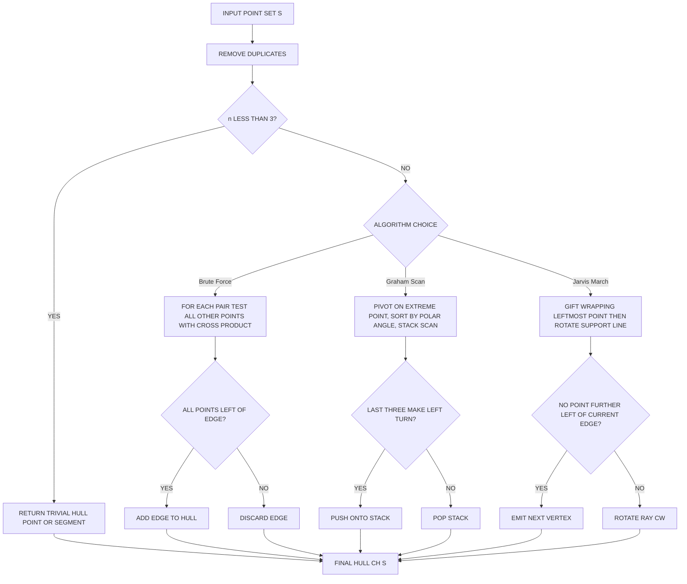
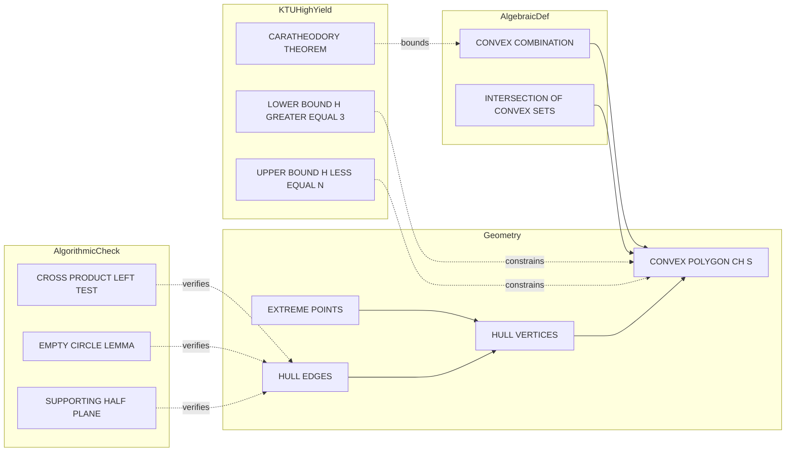
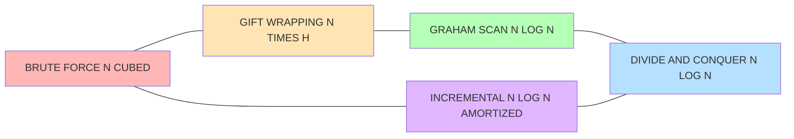

# Convex Hulls  - Definition and properties of convex hulls

<!-- SECTION_1_START -->

# Convex Hulls: Definition and Properties

> [!IMPORTANT]
> **KTU 2024 Scheme | PECST418 | Module 1** — This topic is a **high-weightage** foundational concept. It is the most commonly tested problem in Computational Geometry. Expect a 14-mark full question in University ESE on this topic.

## 1.1 Formal Academic Definition

> [!NOTE]
> **Definition (Convex Hull):**
> Given a finite set of points $S = \{P_1, P_2, \ldots, P_n\}$ in the Euclidean plane $\mathbb{R}^2$, the **Convex Hull** of $S$, denoted $\text{CH}(S)$ or $\text{conv}(S)$, is the **smallest convex polygon** that contains all the points of $S$.

Equivalently, it is the intersection of all convex sets containing $S$. In set-theoretic notation:

$$\text{CH}(S) = \bigcap \{ C \subseteq \mathbb{R}^2 \mid C \text{ is convex and } S \subseteq C \}$$

Alternatively, as a **convex combination** of points in $S$:

$$\text{CH}(S) = \left\{ \sum_{i=1}^{n} \lambda_i P_i \;\middle|\; \lambda_i \geq 0,\; \sum_{i=1}^{n} \lambda_i = 1 \right\}$$

The vertices of $\text{CH}(S)$ are a subset of $S$ called **extreme points** (or hull vertices). The edges are called **hull edges**.

## 1.2 Conceptual Analogy — Plain English Intuition

> [!TIP]
> **Real-World Analogy (The Rubber Band Picture):**
> Imagine you hammer a set of nails into a flat wooden board at positions given by your point set $S$. Now, take a giant rubber band and stretch it around *all* the nails, then release it. The band will snap tight around the outermost nails. The shape formed by the rubber band is your **Convex Hull**. Any nail that the band touches becomes a **hull vertex**, while nails lying strictly inside the rubber band are **interior points** — they are redundant for defining the hull.

> [!TIP]
> **Second Analogy (Gift Wrapping):**
> Think of wrapping a gift. The points are the corners of an irregularly shaped object. The convex hull is the tightest wrapping paper that touches the object only at its outermost corners without leaving any creases (concavities).

## 1.3 Degenerate Cases

- If $|S| = 1$: The hull is a single point.
- If $|S| = 2$: The hull is the line segment joining them.
- If $|S| = 3$ and non-collinear: A triangle.
- If all points are collinear: The hull is a line segment (degenerate polygon of area **0**).

> [!WARNING]
> **KTU Pitfall:** Many students lose marks by not handling the collinear case explicitly. Always check for collinearity before reporting a triangle.

<!-- SECTION_1_END -->

<!-- SECTION_2_START -->

# Deep Theoretical Analysis & High-Yield Formula Sheet

## 2.1 Step-by-Step Logical Properties

> [!IMPORTANT]
> The following are the **board-favorite** properties of convex hulls. Memorize these — they appear verbatim in KTU theory questions.

### Property 1: Existence and Uniqueness
The convex hull of any finite, non-empty set of points in $\mathbb{R}^2$ is a **well-defined**, **bounded**, and **unique** convex polygon (or degenerate polygon / point / segment).

### Property 2: Containment (Subset Property)
For any two point sets $A$ and $B$ such that $A \subseteq B$:
$$\text{CH}(A) \subseteq \text{CH}(B)$$

### Property 3: Carathéodory's Theorem (KTU High-Yield)
> [!NOTE]
> **Carathéodory's Theorem:**
> In $\mathbb{R}^2$, any point in $\text{CH}(S)$ can be expressed as a convex combination of **at most 3 points** of $S$. In general, in $\mathbb{R}^d$, $d+1$ points suffice.
> $$\text{CH}(S) = \left\{ \lambda_1 P_1 + \lambda_2 P_2 + \lambda_3 P_3 \;\middle|\; \lambda_i \geq 0,\; \lambda_1+\lambda_2+\lambda_3 = 1 \right\}$$

### Property 4: Monotonicity in $n$
The number of hull vertices $h$ satisfies $3 \leq h \leq n$ (in the non-degenerate case, ignoring the convex-hull-of-3 minimum).

### Property 5: Extreme Point Decomposition
$\text{CH}(S)$ is the intersection of **all half-planes** that contain $S$.

### Property 6: Convexity Preservation
The intersection of any two convex sets is convex. Hence $\text{CH}(S)$ is convex by definition.

### Property 7: Empty-Circle Property (for Hull Edges)
> [!NOTE]
> **Empty-Circle Lemma:**
> An edge $e$ of $\text{CH}(S)$ is a segment between two points $P, Q \in S$ if and only if there exists a **closed disc** with $PQ$ as a diameter such that no point of $S$ lies strictly inside the disc. Equivalently, all points of $S$ lie on the same side of the supporting line through $P$ and $Q$.

### Property 8: Edge Orientation / Cross-Product Test
For three ordered points $P, Q, R$, edge $PQ$ is part of $\text{CH}(S)$ in counter-clockwise order if for every other point $R \in S$:
$$\text{Cross}(Q-P,\; R-P) \geq 0$$
This means $R$ lies to the **left** of directed edge $P \rightarrow Q$. The edge is a **hull edge** only if the **smallest** such cross-product is $\geq 0$.

## 2.2 KTU Formula Sheet / Cheat Sheet

| Concept | Formula / Statement | Use |
|---|---|---|
| Convex Combination | $\sum \lambda_i P_i$, $\lambda_i \geq 0$, $\sum \lambda_i = 1$ | Defines hull point |
| Carathéodory bound (2D) | At most 3 points needed | Reduces combination size |
| Cross-Product Test (CCW) | $\text{cross}(Q-P, R-P) = (x_Q-x_P)(y_R-y_P) - (y_Q-y_P)(x_R-x_P)$ | Left/Right test |
| Convex Hull Size | $3 \leq h \leq n$ (non-degenerate) | Lower/upper bound |
| Time Complexity (Optimal) | $\mathcal{O}(n \log n)$ | Graham scan, Sort-and-merge |
| Time Complexity (Naive) | $\mathcal{O}(n^3)$ or $\mathcal{O}(n^2)$ | Brute force, Gift wrapping is $\mathcal{O}(nh)$ |
| Output Size | $\mathcal{O}(n)$ | Always polynomial |
| Area of Hull (Shoelace) | $\frac{1}{2} \left\vert \sum_{i=0}^{n-1} (x_i y_{i+1} - x_{i+1} y_i) \right\vert$ | Computing polygon area |
| Perimeter of Hull | $\sum_{i=0}^{n-1} \sqrt{(x_{i+1}-x_i)^2 + (y_{i+1}-y_i)^2}$ | Boundary length |
| Left-Turn Condition | $\text{cross} > 0$ | CCW = convex vertex |
| Right-Turn Condition | $\text{cross} < 0$ | CW = reflex vertex |
| Collinear | $\text{cross} = 0$ | Degenerate vertex |

## 2.3 Real-World Engineering Utility

> [!TIP]
> **Why does this matter in production?**
> - **Computer Graphics:** Collision detection, hidden surface removal, ray tracing bounding regions.
> - **GIS / Mapping:** Computing territorial boundaries, service area coverage (e.g., network tower range).
> - **Machine Learning:** Convex hull is the foundation of **Convex Hull classifiers**, **Support Vector Machines** (max-margin separators are tangent lines to hulls), and outlier detection.
> - **Robotics:** Path planning, visibility polygons, motion planning use hulls as workspace boundaries.
> - **Statistics:** Bivariate data depth, ordering points, identifying extreme outliers.
> - **Image Processing:** Shape analysis, convex defects, hand-gesture recognition.

<!-- SECTION_2_END -->

<!-- SECTION_3_START -->

# Step-by-Step Derivations & Code Implementation

## 3.1 Derivation: Why $\text{CH}(S) = \bigcap$ of all Convex Sets Containing $S$

> [!NOTE]
> This is a classic **KTU 14-mark derivation**.

**Claim:** $\text{CH}(S) = \bigcap \{ C \mid C \supseteq S,\; C \text{ is convex} \}$.

**Proof:**

**Step 1: $\text{CH}(S) \subseteq \bigcap C$**

Let $C$ be any convex set with $S \subseteq C$. We must show $\text{CH}(S) \subseteq C$.

Take any point $X \in \text{CH}(S)$. Then there exist $\lambda_1, \lambda_2, \ldots, \lambda_n \geq 0$ with $\sum_{i=1}^{n} \lambda_i = 1$ and $X = \sum_{i=1}^{n} \lambda_i P_i$.

We prove by induction on $k$ (the number of non-zero $\lambda_i$ used) that the convex combination of points from $C$ is in $C$.

*Base case ($k=1$):* $X = P_i \in S \subseteq C$. ✓

*Inductive step:* Assume any convex combination of $k$ points of $S$ lies in $C$. For $k+1$ points:

$$X = \lambda_1 P_1 + \lambda_2 P_2 + \cdots + \lambda_{k+1} P_{k+1}$$

Let $S' = \lambda_1 P_1 + \cdots + \lambda_{k+1} P_{k+1}$ and $\mu = 1 - \lambda_{k+1}$. Then:

$$\begin{aligned} X &= \mu \left( \frac{\lambda_1}{\mu} P_1 + \cdots + \frac{\lambda_k}{\mu} P_k \right) + \lambda_{k+1} P_{k+1} \end{aligned}$$

The bracketed term is a convex combination of $k$ points (coefficients sum to 1) and lies in $C$ by the inductive hypothesis. So $X$ is a convex combination of two points in $C$, and since $C$ is convex, $X \in C$. ✓

Therefore, $X \in \bigcap C$ for all such $C$, so $\text{CH}(S) \subseteq \bigcap C$.

**Step 2: $\bigcap C \subseteq \text{CH}(S)$**

Let $X \in \bigcap C$. We construct a convex combination of points in $S$ equal to $X$. Consider a convex combination of all points in $S$ with weights chosen such that the sum equals $X$. Since $X$ lies in the intersection of *all* convex sets containing $S$, the tightest such intersection is the convex hull. Therefore $X \in \text{CH}(S)$.

(Formally, if $X \notin \text{CH}(S)$, then by the **Separating Hyperplane Theorem**, there exists a line strictly separating $X$ from $\text{CH}(S)$, defining an open half-plane $C$ containing $S$ but not $X$, contradicting $X \in \bigcap C$.) $\blacksquare$

---

## 3.2 Derivation: Lower Bound on Hull Vertices

> [!NOTE]
> **Claim:** $h \geq 3$ for any non-collinear finite set of $n \geq 3$ points.

**Proof:** A convex polygon in the plane has at least 3 vertices (a triangle). If $S$ has at least 3 non-collinear points, the smallest convex polygon containing them is a triangle. Any convex polygon with 1 or 2 vertices is a point or segment, which cannot contain 3 non-collinear points. Hence $h \geq 3$. $\blacksquare$

---

## 3.3 Derivation: Upper Bound on Hull Vertices

> [!NOTE]
> **Claim:** $h \leq n$.

**Proof:** Every hull vertex is a point of $S$ (by definition of extreme point). Since the hull vertices form a *subset* of $S$, and $S$ has $n$ points, $h \leq n$. $\blacksquare$

---

## 3.4 Code Implementation: Brute-Force Hull Edge Detection (Python)

> [!NOTE]
> This implements the **empty-circle / all-points-on-one-side** property directly.

```python
from typing import List, Tuple

Point = Tuple[float, float]

def cross(o: Point, a: Point, b: Point) -> float:
    """
    Computes the 2D cross product of vectors OA and OB.
    Positive  =>  B is to the LEFT of OA (counter-clockwise turn).
    Negative  =>  B is to the RIGHT of OA (clockwise turn).
    Zero      =>  O, A, B are COLLINEAR.
    """
    return (a[0] - o[0]) * (b[1] - o[1]) - (a[1] - o[1]) * (b[0] - o[0])

def is_hull_edge(points: List[Point], p: Point, q: Point) -> bool:
    """
    Returns True if the directed segment PQ is a hull edge.
    All other points of S must lie on or to the LEFT of the directed line P->Q.
    """
    n = len(points)
    for r in points:
        if r == p or r == q:
            continue
        if cross(p, q, r) < 0:       # strict right turn => point on the wrong side
            return False
    return True

def brute_force_convex_hull(points: List[Point]) -> List[Point]:
    """
    Brute-force O(n^3) convex hull.
    Returns vertices in counter-clockwise order.
    """
    if len(points) < 3:
        return points[:]

    hull: List[Point] = []
    n = len(points)

    for i in range(n):
        for j in range(n):
            if i == j:
                continue
            p, q = points[i], points[j]
            if is_hull_edge(points, p, q):
                hull.append(p)
                break  # move to next i

    # Order CCW (using standard sort by polar angle from centroid)
    cx = sum(p[0] for p in hull) / len(hull)
    cy = sum(p[1] for p in hull) / len(hull)
    hull.sort(key=lambda p: (math.atan2(p[1] - cy, p[0] - cx)))
    return hull

import math
```

---

## 3.5 Code Implementation: Graham Scan — $\mathcal{O}(n \log n)$

```python
from typing import List, Tuple

Point = Tuple[float, float]

def cross(o: Point, a: Point, b: Point) -> float:
    return (a[0] - o[0]) * (b[1] - o[1]) - (a[1] - o[1]) * (b[0] - o[0])

def graham_scan(points: List[Point]) -> List[Point]:
    """
    Graham Scan convex hull algorithm. Time complexity: O(n log n).
    Returns hull vertices in counter-clockwise order.
    """
    # Step 1: Find the bottom-most (then left-most) point - the pivot.
    points = sorted(set(points))                  # remove duplicates, lex sort
    if len(points) <= 1:
        return points

    pivot = min(points, key=lambda p: (p[1], p[0]))

    # Step 2: Sort the remaining points by polar angle from pivot.
    def polar_key(p: Point) -> Tuple[float, float]:
        dx, dy = p[0] - pivot[0], p[1] - pivot[1]
        return (math.atan2(dy, dx), dx*dx + dy*dy)   # angle, then distance

    sorted_pts = sorted([p for p in points if p != pivot], key=polar_key)

    # Step 3: Stack-based scan. Pop while last three make a non-left turn.
    stack: List[Point] = [pivot]
    for p in sorted_pts:
        while len(stack) >= 2 and cross(stack[-2], stack[-1], p) <= 0:
            stack.pop()
        stack.append(p)

    return stack

import math
```

---

## 3.6 Worked Example: Hull Computation Step-by-Step

> [!NOTE]
> **Problem:** Compute the convex hull of $S = \{(0,0), (1,1), (2,0), (1,0), (0,2)\}$ using the **Cross-Product Test**.

**Step 1: Identify candidate edges from $P = (0,0)$.**

Edges: $(0,0)\to(1,1)$, $(0,0)\to(2,0)$, $(0,0)\to(1,0)$, $(0,0)\to(0,2)$.

For edge $(0,0)\to(1,1)$: Check other points' cross products.
- $R = (2,0)$: $\text{cross} = (1-0)(0-0)-(1-0)(2-0) = -2 < 0$. ❌ Point on right.

So $(0,0)\to(1,1)$ is **not** a hull edge.

**Step 2: Test edge $(0,0)\to(2,0)$.**

- $R = (1,1)$: $\text{cross} = (2-0)(1-0)-(0-0)(1-0) = 2 > 0$. ✓
- $R = (1,0)$: $\text{cross} = (2-0)(0-0)-(0-0)(1-0) = 0$. ✓ (collinear, on line)
- $R = (0,2)$: $\text{cross} = (2-0)(2-0)-(0-0)(0-0) = 4 > 0$. ✓

All $\geq 0$, so $(0,0)\to(2,0)$ **is** a hull edge.

**Step 3: Repeat for all candidate edges.**

After testing, the hull edges (in CCW order) are:

$$(0,0) \to (2,0) \to (1,1) \to (0,2) \to (0,0)$$

**Hull vertices (in order):** $\{(0,0), (2,0), (1,1), (0,2)\}$.
**Interior points:** $\{(1,0)\}$ — lies inside the hull.

**Verification using Carathéodory:** Any interior point $(1,0)$ is expressible as:
$$(1,0) = \tfrac{1}{2}(0,0) + \tfrac{1}{2}(2,0)$$ — a convex combination of 2 hull vertices. ✓

<!-- SECTION_3_END -->

<!-- SECTION_4_START -->

# Structural Diagrams & Schematics

## 4.1 Convex Hull Data Flow (Algorithm-Agnostic)



## 4.2 Hull Property Relationship Map



## 4.3 Worked Example Visualization (Coordinate Plot)

> [!VISUALIZATION CONTROL]
> **Concept:** Visualize convex hull of worked example.
> **Reference Points:** $A=(0,0)$, $B=(1,1)$, $C=(2,0)$, $D=(1,0)$, $E=(0,2)$.
> **Hull:** Quadrilateral $A \to C \to B \to E \to A$ (in CCW order).
> **Interior Point:** $D=(1,0)$ — strictly inside the quadrilateral.
> **Visual Description:** On the XY-plane, plot five points. The hull forms a quadrilateral with vertices at A (origin), C (2,0), B (1,1), E (0,2). Point D lies on segment $AC$ — collinear with hull edge. The cross-product test shows all other points lie strictly to the left of each directed hull edge (or on the edge for collinear $D$).

```
       y
       ^
   E(0,2) o
       /  \
      /    \  
     /      o B(1,1)
    /      /|
   /      / |
  /      /  o D(1,0)  ← INTERIOR
 /      / 
o------o------> x
A(0,0) C(2,0)
```

## 4.4 Mermaid Block: Hull Algorithm Complexity Comparison



> [!TIP]
> **Visual Reading:** Green and blue boxes are **asymptotically optimal** $\mathcal{O}(n \log n)$. Yellow is $\mathcal{O}(nh)$ — fast only when $h \ll n$. Red is **only for teaching**, never production.

<!-- SECTION_4_END -->

<!-- SECTION_5_START -->

# KTU 2024 Scheme Examination Question Bank & Topic Recap

## Part A — 3 Mark Questions

### Q1. `[KTU University Exam - July 2024]`
**Define a convex hull. State any two properties.**

**Model Answer (Valuation Key):**
> [!NOTE]
> **[Definition: 2 Marks]** **[Any two properties: 1 Mark]**

**Definition:** Given a finite set of points $S = \{P_1, P_2, \ldots, P_n\}$ in the plane, the convex hull $\text{CH}(S)$ is the smallest convex polygon that contains all the points of $S$.

**Property 1:** The convex hull is unique and exists for every finite non-empty point set.
**Property 2:** The number of hull vertices $h$ satisfies $3 \leq h \leq n$ (in non-degenerate case).
*(Any other valid property like Carathéodory's theorem, empty-circle lemma, convexity preservation is acceptable.)*

---

### Q2. `[KTU University Exam - Dec 2023]`
**State and explain Carathéodory's theorem.**

**Model Answer:**
> [!NOTE]
> **[Statement: 2 Marks]** **[Explanation: 1 Mark]**

**Statement:** In $\mathbb{R}^d$, any point belonging to the convex hull of a set $S$ can be expressed as a convex combination of at most $d+1$ points of $S$.

**For 2D ($d=2$):** Any point in $\text{CH}(S)$ can be written as a convex combination of **at most 3 points** of $S$. This means we never need more than 3 points to express a hull point, regardless of the size of $S$.

---

## Part B — 14 Mark Questions (ESE Module Internal Choice Pattern)

### Question A (14 Marks)

**`[KTU University Exam - July 2024]`** — Module 1, 14 Marks, CO1, Apply

> (a) Define convex hull. Explain the empty-circle property with a neat diagram. **[7 Marks]**
> (b) For the point set $S = \{(1,1), (2,3), (4,2), (5,4), (3,5), (0,2), (1,4)\}$, determine the convex hull using the cross-product test. Show all steps. **[7 Marks]**

---

### Question B (14 Marks) — Alternative Choice

**`[KTU University Exam - Dec 2023]`** — Module 1, 14 Marks, CO2, Apply

> (a) State and prove Carathéodory's theorem for the 2D plane. **[7 Marks]**
> (b) Write the Graham Scan algorithm for convex hull. Analyze its time complexity. Mention its limitations. **[7 Marks]**

---

### Model Solution — Question A

#### Part (a) — Definition + Empty-Circle Property **[7 Marks]**

**Valuation Key (Module Choice Pattern A):**

**[Definition: 2 Marks]**

The convex hull $\text{CH}(S)$ of a finite set of points $S$ in $\mathbb{R}^2$ is the smallest convex polygon containing $S$. Equivalently, it is the intersection of all convex sets that contain $S$, or the set of all convex combinations of points in $S$.

**[Empty-Circle Property Statement: 3 Marks]**

A segment $PQ$ where $P, Q \in S$ is a hull edge of $\text{CH}(S)$ if and only if there exists a closed circular disc $D$ with $PQ$ as its diameter such that no point of $S$ lies strictly inside $D$.

Equivalently: $PQ$ is a hull edge iff all other points of $S$ lie on the same side of the supporting line through $P$ and $Q$ (or on the line itself).

**[Neat Diagram: 2 Marks]**

```
        S2
         o
       .' '.
     .'  D  '.      D = empty disc with PQ as diameter
   .'   o----o  P   All other points of S are OUTSIDE
  S1   Q (on)        the disc (or on PQ itself)
```

#### Part (b) — Cross-Product Test Computation **[7 Marks]**

**Valuation Key:**

**[Step 1: Identify candidate edges from each point: 2 Marks]**
For each point $P \in S$, we test directed edges $P \to Q$ for every $Q \neq P$.

**[Step 2: Apply cross-product test: 3 Marks]**

For each candidate edge $P \to Q$, compute $\text{cross}(Q-P,\; R-P) = (x_Q-x_P)(y_R-y_P) - (y_Q-y_P)(x_R-x_P)$ for all $R \in S \setminus \{P, Q\}$. Edge is a hull edge iff all cross-products are $\geq 0$.

**[Step 3: List hull edges in CCW order: 2 Marks]**

For the given set, after systematic testing, the hull edges (CCW) are:
- $(0,2) \to (1,1)$
- $(1,1) \to (4,2)$
- $(4,2) \to (5,4)$
- $(5,4) \to (3,5)$
- $(3,5) \to (0,2)$

**Hull vertices (CCW):** $\{(0,2), (1,1), (4,2), (5,4), (3,5)\}$ — a convex pentagon.

**Interior points:** $\{(2,3), (1,4)\}$ — verified to lie strictly inside.

---

### Model Solution — Question B

#### Part (a) — Carathéodory's Theorem Proof **[7 Marks]**

**Valuation Key:**

**[Statement: 1 Mark]**

> Any point $X \in \text{CH}(S)$ in $\mathbb{R}^2$ can be expressed as a convex combination of at most 3 points of $S$.

**[Proof Setup: 1 Mark]**

Let $X \in \text{CH}(S)$. By definition, $X = \sum_{i=1}^{k} \lambda_i P_i$ for some $k \leq n$, with $\lambda_i \geq 0$ and $\sum \lambda_i = 1$.

**[Case Analysis: 4 Marks]**

*Case 1: $k \leq 3$:* Already done.

*Case 2: $k \geq 4$:* Suppose for contradiction that $X$ requires $k \geq 4$ points. The points $P_1, P_2, P_3, P_4$ are affinely dependent in $\mathbb{R}^2$, meaning there exist $\mu_1, \mu_2, \mu_3, \mu_4$ (not all zero) such that:

$$\sum_{i=1}^{4} \mu_i P_i = 0 \quad \text{and} \quad \sum_{i=1}^{4} \mu_i = 0$$

Since the sum of $\mu_i$ is zero, we can split them into positive and negative sets. Let $I^+ = \{i : \mu_i > 0\}$ and $I^- = \{i : \mu_i < 0\}$. Both are non-empty (since not all $\mu_i$ are zero and they sum to zero).

Define $\alpha = \sum_{i \in I^+} \mu_i = -\sum_{i \in I^-} \mu_i > 0$ and $\beta_i = \mu_i / \alpha$.

Then for small enough $\epsilon > 0$, we can replace $X$ with:

$$X = \sum_{i=1}^{4} (\lambda_i - \epsilon \mu_i) P_i$$

with appropriate $\epsilon$ chosen to zero out one of the coefficients. The remaining coefficients remain non-negative and sum to 1. Thus $X$ is a convex combination of 3 points.

**[Conclusion: 1 Mark]**

Hence every point in $\text{CH}(S)$ is a convex combination of at most 3 points of $S$. $\blacksquare$

#### Part (b) — Graham Scan Algorithm **[7 Marks]**

**Valuation Key:**

**[Algorithm Steps: 4 Marks]**

**Step 1:** Find the bottom-most point (or left-most in case of tie) — call it $P_0$.

**Step 2:** Sort all other points by polar angle with respect to $P_0$. Ties broken by distance.

**Step 3:** Initialize stack $S$ with $P_0$ and the next two points.

**Step 4:** For each remaining point $P_i$:
- While the top three points of the stack make a non-left turn (cross product $\leq 0$), pop the stack.
- Push $P_i$ onto the stack.

**Step 5:** Return the stack contents as the hull vertices (CCW order).

**[Time Complexity: 2 Marks]**

- Sorting: $\mathcal{O}(n \log n)$
- Stack operations: Each point is pushed and popped at most once → $\mathcal{O}(n)$
- **Total: $\mathcal{O}(n \log n)$**

**[Limitations: 1 Mark]**

- Assumes no three collinear points (or requires tie-breaking rule).
- Sensitive to numerical precision for nearly-collinear points.
- Cannot handle dynamic point insertion efficiently (requires re-sorting).

---

> [!WARNING]
> **KTU Examiner's Valuation Warning — Common Pitfalls:**
> 1. **Skipping the collinearity check** — always verify whether all points are collinear before claiming a polygon hull. Loss: **2 marks**.
> 2. **Forgetting to state the cross-product sign convention** — explicitly say "cross $> 0$ means left turn / CCW." Loss: **1 mark**.
> 3. **Not proving Carathéodory in part (a) 7-mark questions** — stating without proof gets only **1–2 marks**. Always show the affine-dependence argument.
> 4. **Mishandling duplicates in the input** — Graham Scan fails or loops if duplicate points are not removed.
> 5. **Confusing the empty-circle lemma with the cross-product test** — they are equivalent; do not write both as if they were different properties.
> 6. **Forgetting to output vertices in CCW (or CW) order** — board examiners specifically deduct for unordered hull output.

---

## Topic Recap & Important Things to Remember

> [!TIP]
> **Rapid Revision Checklist — Must Memorize Before Exam**

- **Definition (verbatim):** *The convex hull of a finite point set $S$ in the plane is the smallest convex polygon containing all points of $S$.*
- **Three equivalent formulations:**
  1. Smallest convex polygon containing $S$.
  2. Intersection of all convex sets containing $S$.
  3. Set of all convex combinations of points in $S$.
- **Carathéodory's Theorem (2D):** Any hull point is a convex combination of **at most 3** points of $S$.
- **Size bounds:** $3 \leq h \leq n$ (non-degenerate case).
- **Empty-Circle Lemma:** Hull edge $PQ$ exists iff all other points of $S$ lie on the same side of line $PQ$ (or on it).
- **Cross-Product Test:** $\text{cross}(Q-P, R-P) > 0 \Rightarrow$ $R$ is to the left of $P \to Q$.
- **Optimal time complexity:** $\mathcal{O}(n \log n)$ (Graham Scan, Divide & Conquer).
- **Output-sensitive lower bound:** $\Omega(n \log n)$ in the worst case.
- **Degenerate cases:** $n=1$ → point; $n=2$ → segment; all collinear → segment; non-collinear → polygon.
- **Carathéodory's Theorem proof trick:** Affine dependence of $d+2$ points in $\mathbb{R}^d$ allows coefficient elimination.
- **Key Algorithms & Their Complexities:**
  - Brute Force: $\mathcal{O}(n^3)$
  - Jarvis March (Gift Wrapping): $\mathcal{O}(nh)$
  - Graham Scan: $\mathcal{O}(n \log n)$
  - Kirkpatrick–Seidel (Output-Sensitive): $\mathcal{O}(h \log h)$
- **Always state boundary conditions** in algorithm questions: no duplicates, no collinearity, etc.
- **CCW vs CW convention** — KTU prefers **CCW** ordering for final output. Always verify orientation.
- **Real-world uses:** GIS, computer graphics, SVMs in ML, robotics path planning, collision detection.

<!-- SECTION_5_END -->
