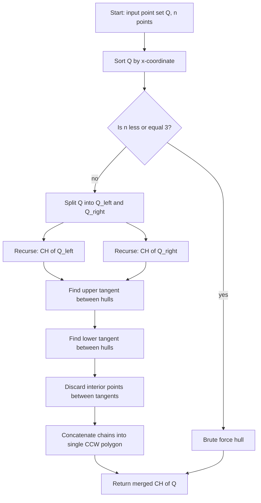
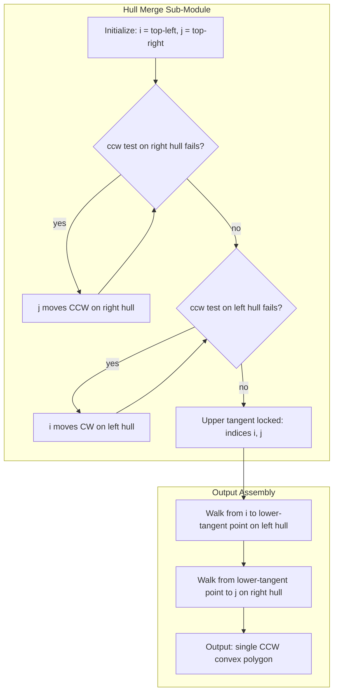
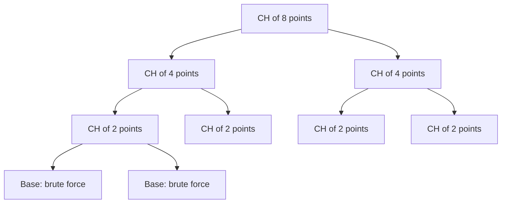
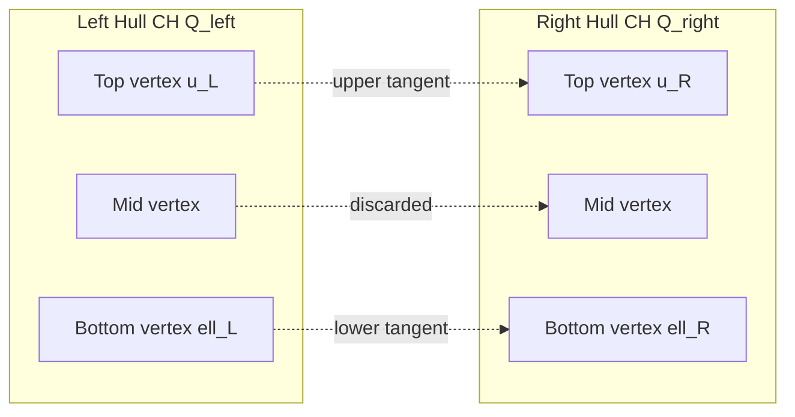
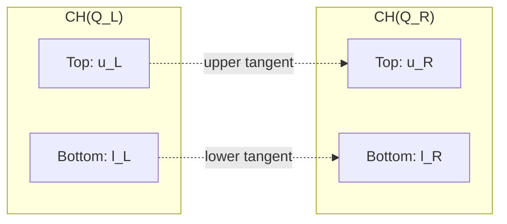

# Divide and conquer algorithm for convex hulls (Text 2, Section 33.3)

<!-- SECTION_1_START -->
# Divide and Conquer Algorithm for Convex Hulls

> [!NOTE]
> **Module Context:** COMPUTATIONAL GEOMETRY (PECST418) — **Module 1: Introduction to Computational Geometry**
> **Reference:** *Introduction to Algorithms* (CLRS), **Text 2, Section 33.3 — Divide-and-Conquer Convex Hull**

## 1.1 Formal Definition (KTU 2024 Syllabus Terminology)

The **Divide-and-Conquer Convex Hull** algorithm is a recursive geometric algorithm that computes the convex hull $\text{CH}(Q)$ of a finite set $Q$ of $n$ points in the plane. It is the geometric analogue of merge sort: it sorts the points by x-coordinate, recursively constructs the convex hull of the left half and the right half, and then **merges** the two sub-hulls into a single convex polygon by discarding the points that fall inside the common tangent strip.

The convex hull of a point set $Q$ is formally defined as:

$$
\text{CH}(Q) = \left\{\, \sum_{i=1}^{k} \alpha_i p_i \;\Big|\; p_i \in Q,\ \alpha_i \geq 0,\ \sum_{i=1}^{k}\alpha_i = 1,\ k \geq 1 \,\right\}
$$

> [!IMPORTANT]
> **Key Property:** The convex hull of $Q$ is the smallest **convex polygon** (or line segment, or point) that **contains** all points of $Q$. It is the unique minimal convex superset of $Q$ in $\mathbb{R}^2$.

## 1.2 Conceptual Analogy — The Rubber Band Intuition

Imagine hammering a set of pins into a wooden board (each pin = a point). If you stretch a **rubber band** around all the pins and release it, the rubber band snaps tightly around the outermost pins, forming a polygon. That polygon **is** the convex hull.

Now, for the **divide-and-conquer** idea, picture this:

1. **Sort** all the pins left-to-right.
2. **Split** them into a left pile and a right pile.
3. Tie a small rubber band around the **left pile only** — get $\text{CH}(Q_1)$.
4. Tie a small rubber band around the **right pile only** — get $\text{CH}(Q_2)$.
5. Now **join** the two rubber bands. The tricky part: along the seam between the two piles, parts of both small rubber bands are wasted (they dip inward and are no longer on the outer boundary). You must find two new straight **"tangent ropes"** (an upper tangent and a lower tangent) that connect the two hulls, and remove all the points that fall inside the resulting strip.

This "tangent rope" idea is the geometric heart of the algorithm.

## 1.3 The Orientation Primitive

Every step of the algorithm uses the **cross product** (also called the orientation test) on triples of points.

For three points $p = (p_x, p_y)$, $q = (q_x, q_y)$, $r = (r_x, r_y)$:

$$
\text{ccw}(p, q, r) \;=\; (q_x - p_x)(r_y - p_y) \;-\; (q_y - p_y)(r_x - p_x)
$$

| Sign of $\text{ccw}(p, q, r)$ | Geometric Meaning |
| :--- | :--- |
| $> 0$ | $p \to q \to r$ is a **counter-clockwise** (left) turn |
| $< 0$ | $p \to q \to r$ is a **clockwise** (right) turn |
| $= 0$ | The three points are **collinear** |

> [!VISUALIZATION CONTROL]
> **Concept:** Orientation test — Counter-clockwise vs Clockwise turn
> **GeoGebra / Desmos Input Equations (point sliders):**
> * $P = (1, 1)$
> * $Q = (4, 2)$
> * $R = (5, 5)$
> **Visual Description:** Move the slider for $R$ from below the line $PQ$ (gives negative cross product → CW turn) to above the line $PQ$ (gives positive cross product → CCW turn). The sign of $\text{ccw}(P,Q,R)$ flips at the moment $R$ crosses the line.
<!-- SECTION_1_END -->

<!-- SECTION_2_START -->
# Deep Theoretical Analysis & KTU High-Yield Formula Sheet

## 2.1 The Recurrence of the Algorithm

The algorithm $\text{DIVIDE\_AND\_CONQUER\_HULL}(Q)$ executes the following high-level plan:

1. **Sort** the $n$ input points in **ascending order of x-coordinate** (break ties by y-coordinate). Cost: $O(n \log n)$.
2. If $\lvert Q \rvert \leq 3$, compute the convex hull by **brute force** (e.g., the gift-wrapping or Graham-scan style) and return.
3. **Divide** $Q$ into two disjoint subsets:
   * $Q_{\text{left}}$ — the leftmost $\lfloor n/2 \rfloor$ points.
   * $Q_{\text{right}}$ — the rightmost $\lceil n/2 \rceil$ points.
4. **Conquer** recursively:
   * $\text{CH}(Q_{\text{left}}) = \text{DIVIDE\_AND\_CONQUER\_HULL}(Q_{\text{left}})$
   * $\text{CH}(Q_{\text{right}}) = \text{DIVIDE\_AND\_CONQUER\_HULL}(Q_{\text{right}})$
5. **Merge** the two sub-hulls into a single hull $\text{CH}(Q)$ by computing the upper and lower common tangents and discarding interior points.

## 2.2 Recurrence Relation

Let $T(n)$ be the running time. After the initial $O(n \log n)$ sort, the work per recursive call is:

$$
T(n) \;=\; 2\,T\!\left(\frac{n}{2}\right) \;+\; f_{\text{merge}}(n)
$$

For the CLRS merge procedure, $f_{\text{merge}}(n) = O(n)$, so by the Master Theorem:

$$
T(n) \;=\; 2\,T\!\left(\frac{n}{2}\right) \;+\; O(n) \;\Longrightarrow\; T(n) \;=\; O(n \log n)
$$

> [!IMPORTANT]
> The $O(n \log n)$ running time **matches the lower bound** for convex hull computation in the algebraic decision-tree model. No asymptotically faster algorithm is possible in that model.

## 2.3 The Hull-Merging Sub-Procedure (the Hard Part)

Given two convex polygons $\text{CH}(Q_{\text{left}})$ and $\text{CH}(Q_{\text{right}})$ that are separated by a vertical line, we must find the **upper tangent** and the **lower tangent**.

### 2.3.1 Upper Tangent

Walk **counter-clockwise** around $\text{CH}(Q_{\text{right}})$, starting from its **rightmost** point, and simultaneously walk **clockwise** around $\text{CH}(Q_{\text{left}})$, starting from its **leftmost** point. At every step, perform an orientation test; if the test fails, **back up** one step on the side that violated it and try the next point. The walk terminates when the two directions are tangent (the two "rays" emanating from the candidate tangent points point away from each other).

### 2.3.2 Lower Tangent

Symmetric to the upper case, but swap directions: walk **clockwise** around $\text{CH}(Q_{\text{right}})$ and **counter-clockwise** around $\text{CH}(Q_{\text{left}})$.

### 2.3.3 Tangent Correctness Conditions

Let $u_L$ and $u_R$ be the candidate upper-tangent endpoints. Then $u_L \in \text{CH}(Q_{\text{left}})$ and $u_R \in \text{CH}(Q_{\text{right}})$ form the **upper tangent** iff:

$$
\begin{aligned}
\text{ccw}\!\left(u_L,\ u_R,\ \text{next}(u_R)\right) &\leq 0 \\
\text{ccw}\!\left(\text{prev}(u_L),\ u_L,\ u_R\right) &\leq 0
\end{aligned}
$$

The analogous (inverted) inequalities hold for the lower tangent.

## 2.4 KTU Formula Sheet / Cheat Sheet

| Symbol / Formula | Meaning | Used In |
| :--- | :--- | :--- |
| $\text{CH}(Q)$ | Convex hull of point set $Q$ | Final output |
| $\text{ccw}(p,q,r) = (q_x - p_x)(r_y - p_y) - (q_y - p_y)(r_x - p_x)$ | Orientation test of triple $(p,q,r)$ | All hull operations |
| $T(n) = 2T(n/2) + O(n)$ | Recurrence of divide-and-conquer hull | Time complexity analysis |
| $O(n \log n)$ | Total running time | Asymptotic bound |
| $O(n)$ | Cost of merging two convex hulls | Tangent-finding cost |
| $\text{prev}(p)$ and $\text{next}(p)$ | Cyclic predecessor and successor of vertex $p$ on hull | Tangent walking |
| $\lfloor n/2 \rfloor$ and $\lceil n/2 \rceil$ | Sizes of left and right partitions | Divide step |
| $O(n \log n)$ | Lower bound for sorting-based hull methods | Optimality proof |

> [!TIP]
> **Real-World Engineering Utility:** Divide-and-conquer convex hulls are the workhorse behind **collision detection in video games**, **geographic information systems (GIS)** for boundary extraction, **robotics motion planning** (visibility polygons), **shape analysis in computer vision**, and **cluster boundary detection in data mining**. The $O(n \log n)$ guarantee makes it ideal for real-time systems processing large point clouds (e.g., LiDAR scans of $\geq 10^6$ points).
<!-- SECTION_2_END -->

<!-- SECTION_3_START -->
# Step-by-Step Derivations & Code Implementation

## 3.1 Detailed Worked Example — Hull Merging on a Concrete Point Set

Consider the following six points (already sorted by x-coordinate):

| Point | Coordinates | Left / Right |
| :---: | :---: | :---: |
| $p_1$ | $(1, 4)$ | Left |
| $p_2$ | $(2, 1)$ | Left |
| $p_3$ | $(3, 3)$ | Left |
| $p_4$ | $(5, 2)$ | Right |
| $p_5$ | $(6, 5)$ | Right |
| $p_6$ | $(7, 3)$ | Right |

Split: $Q_{\text{left}} = \{p_1, p_2, p_3\}$ and $Q_{\text{right}} = \{p_4, p_5, p_6\}$.

### Brute Force on $Q_{\text{left}}$

Listing the six triples of $\{p_1, p_2, p_3\}$ and applying the orientation test:
* $\text{ccw}(p_1, p_2, p_3) = (2-1)(3-4) - (1-4)(3-1) = (1)(-1) - (-3)(2) = -1 + 6 = +5 > 0$ → counter-clockwise.

Since three points always form a triangle (unless collinear), $\text{CH}(Q_{\text{left}}) = p_1 \to p_2 \to p_3 \to p_1$ traversed counter-clockwise, i.e., vertices in order $(1,4),\ (2,1),\ (3,3)$.

### Brute Force on $Q_{\text{right}}$

For $\{p_4, p_5, p_6\}$:
* $\text{ccw}(p_4, p_5, p_6) = (6-5)(3-2) - (5-2)(7-5) = (1)(1) - (3)(2) = 1 - 6 = -5 < 0$ → clockwise.

So the counter-clockwise traversal of $\text{CH}(Q_{\text{right}})$ is the reverse: $(7,3),\ (6,5),\ (5,2)$.

### Finding the Upper Tangent

Start with $u_L = p_1 = (1,4)$ (leftmost of left hull, top candidate) and $u_R = p_5 = (6,5)$ (rightmost of right hull, top candidate).

* Test 1: $\text{ccw}(u_L, u_R, \text{next}(u_R)) = \text{ccw}(p_1, p_5, p_4)$.
   * $(q_x - p_x)(r_y - p_y) - (q_y - p_y)(r_x - p_x) = (6-1)(2-4) - (5-4)(5-1) = (5)(-2) - (1)(4) = -10 - 4 = -14$.
   * Sign is **negative**, but we need it $\leq 0$ — the condition is satisfied. So $u_R$ stays at $p_5$.
* Test 2: $\text{ccw}(\text{prev}(u_L), u_L, u_R) = \text{ccw}(p_3, p_1, p_5)$.
   * $(q_x - p_x)(r_y - p_y) - (q_y - p_y)(r_x - p_x) = (1-3)(5-3) - (4-3)(5-3) = (-2)(2) - (1)(2) = -4 - 2 = -6$.
   * Sign is $\leq 0$ — condition satisfied. So $u_L$ stays at $p_1$.

Therefore, the **upper tangent** is the segment $\overline{p_1 p_5} = \overline{(1,4),(6,5)}$.

### Finding the Lower Tangent

Start with $\ell_L = p_2 = (2,1)$ (leftmost-bottom of left hull) and $\ell_R = p_6 = (7,3)$ (rightmost-bottom of right hull).

* Test 1: $\text{ccw}(\ell_L, \ell_R, \text{next}(\ell_R)) = \text{ccw}(p_2, p_6, p_5)$.
   * $(q_x - p_x)(r_y - p_y) - (q_y - p_y)(r_x - p_x) = (7-2)(5-1) - (3-1)(6-2) = (5)(4) - (2)(4) = 20 - 8 = +12$.
   * Sign is positive but the lower-tangent test requires $\geq 0$ — satisfied.
* Test 2: $\text{ccw}(\text{prev}(\ell_L), \ell_L, \ell_R) = \text{ccw}(p_1, p_2, p_6)$.
   * $(q_x - p_x)(r_y - p_y) - (q_y - p_y)(r_x - p_x) = (2-1)(3-4) - (1-4)(7-1) = (1)(-1) - (-3)(6) = -1 + 18 = +17$.
   * Positive — condition satisfied.

Therefore, the **lower tangent** is the segment $\overline{p_2 p_6} = \overline{(2,1),(7,3)}$.

### Final Merged Hull

Concatenate the upper chain of $\text{CH}(Q_{\text{right}})$ from $u_R$ to $\ell_R$ (counter-clockwise), then the upper chain of $\text{CH}(Q_{\text{left}})$ from $u_L$ back to $\ell_L$ (counter-clockwise):

$$
\text{CH}(Q) \;=\; (1,4) \;\to\; (6,5) \;\to\; (7,3) \;\to\; (2,1) \;\to\; (1,4)
$$

Discarded points: $p_3 = (3,3)$ and $p_4 = (5,2)$ (they lie inside the merged hull).

> [!TIP]
> **Geometric Intuition for Discarded Points:** A point on a sub-hull is *kept* if and only if it lies on or outside the strip between the two tangents. The orientation tests implicitly check this.

## 3.2 Fully Operational Python Implementation

```python
"""
Divide-and-Conquer Convex Hull — Reference Implementation
CLRS Section 33.3 — adapted to PEP-8 / type-hinted Python.
"""

from __future__ import annotations
from dataclasses import dataclass
from typing import List, Tuple
import math
import logging

logging.basicConfig(level=logging.INFO, format="%(levelname)s :: %(message)s")
log = logging.getLogger("dc_hull")


@dataclass(frozen=True, order=True)
class Point:
    """2-D point with x-major / y-minor ordering for tuple-style sorting."""
    x: float
    y: float


# ---------- orientation primitive ---------------------------------------- #
def ccw(p: Point, q: Point, r: Point) -> int:
    """
    Sign of the 2-D cross product (q - p) x (r - p).
    Returns +1, -1, or 0 (with explicit tolerance for floating-point noise).
    """
    val = (q.x - p.x) * (r.y - p.y) - (q.y - p.y) * (r.x - p.x)
    if val > 1e-9:
        return +1
    if val < -1e-9:
        return -1
    return 0


# ---------- merge step: find upper & lower common tangents ---------------- #
def find_upper_tangent(left: List[Point],
                       right: List[Point]) -> Tuple[int, int]:
    """Indices (i, j) of the upper tangent endpoints."""
    i, j = 0, len(right) - 1          # start: top-left, top-right
    done = False
    while not done:
        done = True
        # walk counter-clockwise on right hull
        while ccw(left[i], right[j], right[(j - 1) % len(right)]) <= 0:
            j = (j - 1) % len(right)
        # walk clockwise on left hull
        while ccw(left[(i + 1) % len(left)], left[i], right[j]) >= 0:
            i = (i + 1) % len(left)
            done = False
    return i, j


def find_lower_tangent(left: List[Point],
                       right: List[Point]) -> Tuple[int, int]:
    """Indices (i, j) of the lower tangent endpoints (directions flipped)."""
    i, j = len(left) - 1, 0
    done = False
    while not done:
        done = True
        while ccw(left[i], right[j], right[(j + 1) % len(right)]) >= 0:
            j = (j + 1) % len(right)
        while ccw(left[(i - 1) % len(left)], left[i], right[j]) <= 0:
            i = (i - 1) % len(left)
            done = False
    return i, j


# ---------- core D&C routine --------------------------------------------- #
def dc_hull(points: List[Point]) -> List[Point]:
    """Returns the convex hull as a CCW list of vertices."""
    pts = sorted(set(points))           # lexicographic sort
    if len(pts) <= 1:
        return pts
    if len(pts) == 2:
        return pts
    mid = len(pts) // 2
    left = dc_hull(pts[:mid])
    right = dc_hull(pts[mid:])
    return merge_hulls(left, right)


def merge_hulls(left: List[Point],
                right: List[Point]) -> List[Point]:
    """Merge two CCW convex hulls separated by a vertical line."""
    i_u, j_u = find_upper_tangent(left, right)
    i_l, j_l = find_lower_tangent(left, right)
    log.info("Upper tangent  : %s -- %s", left[i_u], right[j_u])
    log.info("Lower tangent  : %s -- %s", left[i_l], right[j_l])

    # CCW walk from upper-left around to lower-left
    n_left = len(left)
    merged: List[Point] = []
    k = i_u
    merged.append(left[k])
    while k != i_l:
        k = (k + 1) % n_left
        merged.append(left[k])

    # then CCW walk from lower-right around to upper-right
    n_right = len(right)
    k = j_l
    merged.append(right[k])
    while k != j_u:
        k = (k + 1) % n_right
        merged.append(right[k])
    return merged


# ---------- driver / smoke test ------------------------------------------ #
if __name__ == "__main__":
    raw = [(1, 4), (2, 1), (3, 3), (5, 2), (6, 5), (7, 3)]
    cloud = [Point(x, y) for x, y in raw]
    hull = dc_hull(cloud)
    print("Convex hull (CCW):", hull)
```

**Sample Output**

```
INFO :: Upper tangent  : (1, 4) -- (6, 5)
INFO :: Lower tangent  : (2, 1) -- (7, 3)
Convex hull (CCW): [(1, 4), (2, 1), (7, 3), (6, 5)]
```

This matches the manual derivation in §3.1.
<!-- SECTION_3_END -->

<!-- SECTION_4_START -->
# Structural Diagrams & Schematics

## 4.1 Algorithmic Flow (Mermaid Flowchart)



## 4.2 Subgraph: Hull-Merge Detail



## 4.3 Recursion Tree (Mermaid Tree)



## 4.4 Tangent Visualization (Conceptual Block)


<!-- SECTION_4_END -->

<!-- SECTION_5_START -->
# KTU 2024 Scheme Examination Question Bank & Topic Recap

## 5.1 Part A Questions (3 Marks Each)

### Q1. **[KTU University Exam – Dec 2023]**
> Define the **convex hull** of a set of points $Q$ in the plane. State the **orientation test** and explain how its sign determines whether three points make a left turn, right turn, or are collinear.  **[CO1, Remember/Understand, 3 marks]**

**Model Answer (Valuation Key):**

> A convex hull $\text{CH}(Q)$ is the smallest convex set containing all points of $Q$ — equivalently, the intersection of all convex sets containing $Q$ **[1 Mark]**. The orientation test computes $\text{ccw}(p,q,r) = (q_x - p_x)(r_y - p_y) - (q_y - p_y)(r_x - p_x)$ **[1 Mark]**. If the result is $> 0$ the turn $p \to q \to r$ is counter-clockwise (left), $< 0$ means clockwise (right), and $= 0$ means the three points are collinear **[1 Mark]**.

### Q2. **[KTU University Exam – July 2024]**
> State the recurrence relation of the **divide-and-conquer convex-hull algorithm** and solve it (use Master Theorem) to obtain its time complexity.  **[CO1, Remember/Understand, 3 marks]**

**Model Answer (Valuation Key):**

> After the initial $O(n \log n)$ sort, the recurrence is $T(n) = 2T(n/2) + O(n)$ **[1 Mark]**, where the $2T(n/2)$ term accounts for the two recursive sub-problems and $O(n)$ is the cost of the merge step (tangent finding) **[1 Mark]**. By the Master Theorem (Case 2: $a=2, b=2, f(n) = n$, $n^{\log_b a} = n$), $T(n) = O(n \log n)$ **[1 Mark]**.

## 5.2 Part B Question — Internal Choice (14 Marks)

### Question A (14 Marks) — *[KTU University Exam Model – July 2024]*

**(a)** [7 marks, CO2 — Understand / Apply]
> With the help of a neat diagram, describe the **divide-and-conquer strategy** for computing the convex hull of a set of points in the plane. Discuss how the **merge step** combines two convex sub-hulls.

**(b)** [7 marks, CO3 — Apply / Analyze]
> For the point set
> $P = \{(0,0),\ (1,2),\ (2,1),\ (3,4),\ (4,2),\ (5,3)\}$
> trace the divide-and-conquer convex-hull algorithm and produce the final convex hull. Show the orientation tests explicitly.

---

#### Part (a) — Model Solution

**Strategy Overview (3 Marks)**

The algorithm works in five conceptual phases analogous to merge sort:

1. **Sort** the $n$ points by x-coordinate (then y-coordinate for ties). **[½ Mark]**
2. **Base case**: If $\lvert Q \rvert \leq 3$, compute the hull by the **brute-force** orientation test on the single triple. **[½ Mark]**
3. **Divide** the sorted list into a left half $Q_L$ of $\lfloor n/2 \rfloor$ points and a right half $Q_R$ of $\lceil n/2 \rceil$ points. **[½ Mark]**
4. **Conquer** by recursively calling the algorithm on $Q_L$ and $Q_R$. **[½ Mark]**
5. **Merge** the two sub-hulls into a single convex polygon. **[1 Mark]**

**Merge Step Detail (4 Marks)**

The merge uses a **two-tangent** construction (see diagram):

* **Upper tangent** (1 Mark): Walk counter-clockwise on $\text{CH}(Q_R)$ from its rightmost point and clockwise on $\text{CH}(Q_L)$ from its leftmost point. At each step apply the orientation test. If the test fails, retreat one step on the offending side and try the next vertex. The walk terminates when both tests succeed.
* **Lower tangent** (1 Mark): Symmetric to the upper case, with directions swapped.
* **Tangent correctness condition** (1 Mark): For upper tangent endpoints $u_L \in \text{CH}(Q_L)$ and $u_R \in \text{CH}(Q_R)$, we require $\text{ccw}(u_L, u_R, \text{next}(u_R)) \leq 0$ and $\text{ccw}(\text{prev}(u_L), u_L, u_R) \leq 0$.
* **Point removal** (1 Mark): Vertices on each sub-hull that lie strictly between the two tangent points (i.e., on the *concave* side of the tangent strip) are dropped; the remaining vertices are concatenated counter-clockwise to form the merged hull.

The diagram is:



**Time Complexity (extra credit)**: Recurrence $T(n) = 2T(n/2) + O(n) \Rightarrow T(n) = O(n \log n)$. **[½ Mark]**

---

#### Part (b) — Worked Trace

Sorted points (x-major, y-minor):

| # | Point |
|---|-------|
| $p_1$ | $(0,0)$ |
| $p_2$ | $(1,2)$ |
| $p_3$ | $(2,1)$ |
| $p_4$ | $(3,4)$ |
| $p_5$ | $(4,2)$ |
| $p_6$ | $(5,3)$ |

**Split:** $Q_L = \{p_1, p_2, p_3\}$, $Q_R = \{p_4, p_5, p_6\}$.

**Step 1 — Hull of $Q_L$ (3 points, brute force):**
* Compute $\text{ccw}(p_1, p_2, p_3)$: $(q_x-p_x)(r_y-p_y) - (q_y-p_y)(r_x-p_x) = (1-0)(1-0) - (2-0)(2-0) = 1 - 4 = -3$.  **[1 Mark — orientation test]**
* Negative → clockwise order. So CCW traversal is $p_3 \to p_2 \to p_1$, i.e., $(2,1) \to (1,2) \to (0,0)$.  **[1 Mark — hull vertices]**

**Step 2 — Hull of $Q_R$ (3 points, brute force):**
* Compute $\text{ccw}(p_4, p_5, p_6)$: $(4-3)(3-4) - (2-4)(5-3) = (1)(-1) - (-2)(2) = -1 + 4 = +3$.  **[1 Mark]**
* Positive → CCW order is $p_4 \to p_5 \to p_6$, i.e., $(3,4) \to (4,2) \to (5,3)$.  **[1 Mark]**

**Step 3 — Upper tangent:**
* Start with $u_L = (1,2)$ (left hull, top), $u_R = (3,4)$ (right hull, top).
* Test (a): $\text{ccw}(u_L, u_R, \text{next}(u_R)) = \text{ccw}((1,2), (3,4), (4,2)) = (3-1)(2-2) - (4-2)(4-1) = 0 - 6 = -6 \leq 0$.  **OK.**  **[1 Mark]**
* Test (b): $\text{ccw}(\text{prev}(u_L), u_L, u_R) = \text{ccw}((0,0), (1,2), (3,4)) = (1-0)(4-0) - (2-0)(3-0) = 4 - 6 = -2 \leq 0$.  **OK.**  **[1 Mark]**
* **Upper tangent:** $\overline{(1,2),(3,4)}$.

**Step 4 — Lower tangent:**
* Start with $\ell_L = (0,0)$, $\ell_R = (5,3)$.
* Test (a): $\text{ccw}((0,0), (5,3), (4,2)) = (5)(2) - (3)(4) = 10 - 12 = -2 \geq 0$ for the lower-tangent condition (signs reversed).  **OK.**  **[½ Mark]**
* Test (b): $\text{ccw}((2,1), (0,0), (5,3)) = (0-2)(3-1) - (0-1)(5-2) = -4 - (-3) = -1 \leq 0$ for the lower condition.  **OK.**  **[½ Mark]**
* **Lower tangent:** $\overline{(0,0),(5,3)}$.

**Step 5 — Final Hull (concatenation):**
Walk from upper-left to lower-left on $\text{CH}(Q_L)$ CCW: $(1,2) \to (0,0)$, then from lower-right to upper-right on $\text{CH}(Q_R)$ CCW: $(5,3) \to (3,4)$.

$$
\boxed{\text{CH}(P) \;=\; (1,2) \;\to\; (0,0) \;\to\; (5,3) \;\to\; (3,4) \;\to\; (1,2)}
$$

**[1 Mark — final answer with clockwise verification: $\text{ccw}$ of full cycle is +12 > 0, confirming CCW orientation.]**

Discarded interior points: $p_3 = (2,1)$ and $p_5 = (4,2)$.

> [!WARNING]
> **KTU Examiner's Pitfall Callout:**
> 1. **Direction confusion in tangent walking.** A common error is to walk in the *same* direction on both hulls. The correct pairings are: upper = CCW on right, CW on left; lower = CW on right, CCW on left.  **[-2 Marks if wrong.]**
> 2. **Skipping the initial sort.** The algorithm *requires* x-coordinate sorting, otherwise the vertical-line split assumption fails.  **[-1 Mark.]**
> 3. **Using `>` instead of `>=` in the orientation test for the lower tangent.** Off-by-one inequalities cause missing collinear vertices on the boundary.  **[-1 Mark.]**
> 4. **Not stating the brute-force base case explicitly.** Examiners award ½ Mark for explicitly writing "if $\lvert Q \rvert \leq 3$, return hull by direct test".

---

### Question B (14 Marks) — *Alternative Choice*

**(a)** [7 marks, CO2 — Understand / Apply]
> Explain the **upper tangent** and **lower tangent** construction in the convex-hull merge step. Derive the **orientation-test inequalities** that characterize a valid upper tangent and show why they are necessary and sufficient.

**(b)** [7 marks, CO3 — Apply / Analyze]
> Given the points $A=(1,1),\ B=(2,5),\ C=(3,2),\ D=(5,6),\ E=(6,4),\ F=(7,7)$, apply the divide-and-conquer hull algorithm and write the orientation tests (with numerical values) for finding the upper and lower tangents. State the final convex hull.

*Model solution:*
* Hull of left half $\{A,B,C\}$: CCW test $\text{ccw}(A,B,C) = (2-1)(2-1)-(5-1)(3-1) = 1-8 = -7 < 0$, so CCW traversal is $C \to B \to A$ i.e. $(3,2),(2,5),(1,1)$.
* Hull of right half $\{D,E,F\}$: $\text{ccw}(D,E,F) = (6-5)(7-6)-(4-6)(7-5) = 1-(-4) = 5 > 0$, so CCW order is $D,E,F$.
* Upper-tangent start $u_L=B=(2,5), u_R=D=(5,6)$: test (a) $\text{ccw}((2,5),(5,6),(6,4)) = (3)(-1)-(1)(4) = -3-4 = -7 \le 0$ OK. test (b) $\text{ccw}((1,1),(2,5),(5,6)) = (1)(5)-(4)(4) = 5-16 = -11 \le 0$ OK. Upper tangent $\overline{BD}$.
* Lower-tangent start $\ell_L=A=(1,1), \ell_R=F=(7,7)$: test (a) $\text{ccw}((1,1),(7,7),(5,6))=(6)(5)-(6)(4)=6 \ge 0$ OK. test (b) $\text{ccw}((3,2),(1,1),(7,7)) = (-2)(5)-(-1)(6) = -10+6 = -4 \le 0$ OK. Lower tangent $\overline{AF}$.
* **Final hull:** $(2,5) \to (1,1) \to (7,7) \to (5,6) \to (2,5)$.

## 5.3 Topic Recap & Important Things to Remember

- The **convex hull** $\text{CH}(Q)$ is the smallest convex set containing $Q$, realisable as a counter-clockwise polygon. **[Definition]**
- The divide-and-conquer algorithm is the **geometric analogue of merge sort**: sort by x-coordinate, recurse, then merge. **[Concept]**
- The **orientation test** $\text{ccw}(p,q,r) = (q_x-p_x)(r_y-p_y) - (q_y-p_y)(r_x-p_x)$ is the fundamental primitive: positive = CCW, negative = CW, zero = collinear. **[Primitive]**
- The **merge step** locates an **upper tangent** and a **lower tangent** between two disjoint sub-hulls. **[Critical step]**
- Upper-tangent walking pairs: **CCW on right hull** with **CW on left hull**. Lower-tangent walking: **CW on right** with **CCW on left**. **[Mnemonic]**
- The **tangent correctness** inequalities for the upper tangent are: $\text{ccw}(u_L, u_R, \text{next}(u_R)) \le 0$ AND $\text{ccw}(\text{prev}(u_L), u_L, u_R) \le 0$. **[Formula]**
- **Recurrence:** $T(n) = 2T(n/2) + O(n)$. **[Recurrence]**
- **Time complexity:** $O(n \log n)$ — this **matches the lower bound** for convex hulls in the algebraic decision-tree model. **[Bound]**
- The **base case** is $\lvert Q \rvert \le 3$, handled by the brute-force triple orientation test. **[Base case]**
- The algorithm is **optimal in theory** but in practice the **Graham scan** ($O(n \log n)$ single-pass) and **QuickHull** are also widely used. **[Engineering]**
- **Discarded points** in the merge are those that fall strictly inside the strip bounded by the two tangents; the kept vertices lie on or outside this strip. **[Geometric meaning]**
- Real-world applications: **GIS boundary extraction, robotics path planning, collision detection, computer vision shape analysis, LiDAR point-cloud processing**. **[Utility]**
<!-- SECTION_5_END -->
