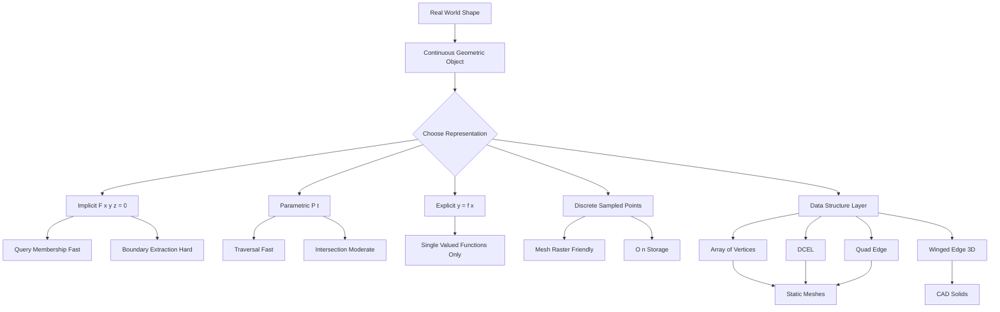
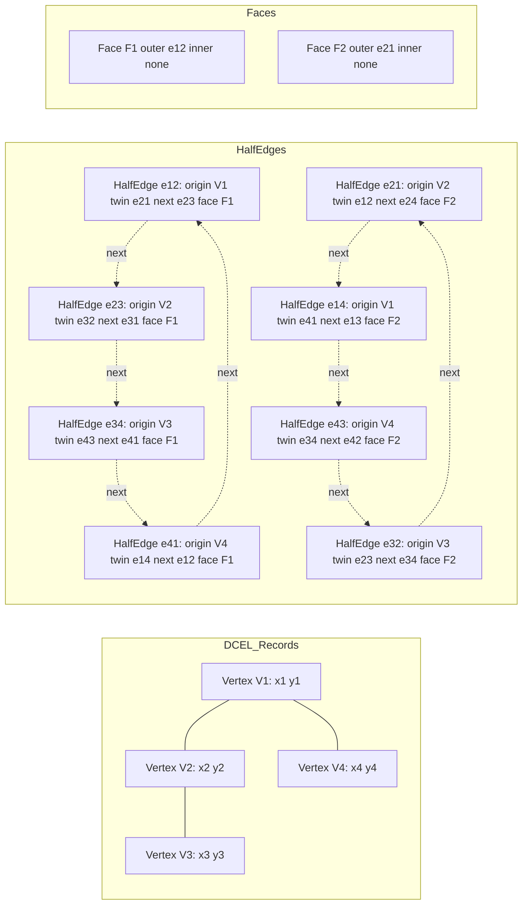
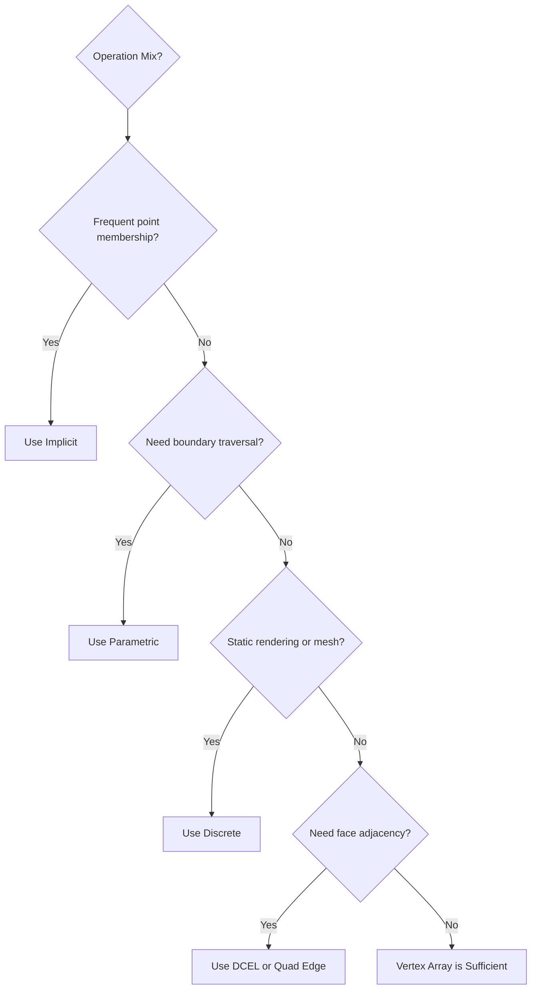
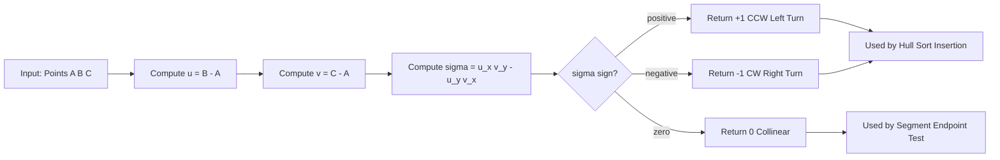
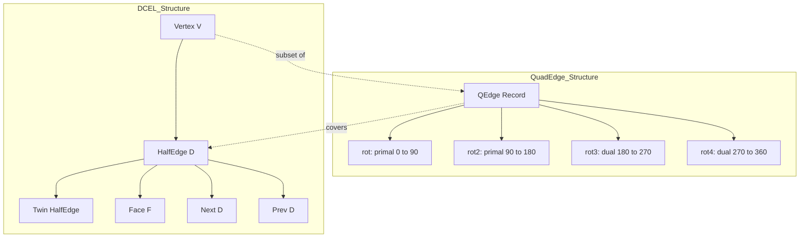

# Geometric objects, and their representations

<!-- SECTION_1_START -->
# Geometric Objects and Their Representations

## 1.1 Formal Academic Definition

A **geometric object** is a mathematical abstraction of a spatial entity that exists in a continuous space $\mathbb{R}^d$, characterized by measurable properties such as dimension, position, orientation, and metric attributes. In **Computational Geometry**, geometric objects are finite, discrete, and manipulable entities on which algorithms perform queries, transformations, and combinatorial operations.

Formally, a geometric object $O \subseteq \mathbb{R}^d$ is defined as a tuple:

$$O = (V, E, F, \mathcal{P})$$

where $V$ is the set of vertices, $E$ the set of edges, $F$ the set of faces, and $\mathcal{P}$ the set of geometric primitives (points, lines, planes) governing the object.

> [!IMPORTANT]
> **KTU 2024 Syllabus Highlight (Module 1):**
> Geometric objects form the *input domain* of every computational geometry algorithm. The choice of representation directly determines:
> 1. **Time complexity** of queries
> 2. **Space complexity** of storage
> 3. **Robustness** under floating-point arithmetic
> 4. **Ease of implementation** in production systems

## 1.2 Hierarchical Classification of Geometric Objects

Geometric objects are classified by their **intrinsic dimension** $d_{\text{int}}$ in the ambient space $\mathbb{R}^D$.

| Dimension | Object Type | Mathematical Form | Engineering Example |
| :--- | :--- | :--- | :--- |
| $0$ | Point | $(x, y) \in \mathbb{R}^2$ | Sensor reading, GPS coordinate |
| $1$ | Line, Ray, Segment | $\{P + t \cdot \vec{v} \mid t \in I\}$ | Road network edge |
| $2$ | Polygon, Circle, Spline | Closed region in $\mathbb{R}^2$ | Building footprint |
| $3$ | Polyhedron, Sphere, CSG Solid | Closed region in $\mathbb{R}^3$ | CAD mechanical part |
| $k < D$ | Manifold, Surface | Embedded $k$-manifold | Terrain mesh, wing surface |

> [!NOTE]
> **Intrinsic vs Ambient Dimension:** A curve (1D) can live in $\mathbb{R}^2$ or $\mathbb{R}^3$. Its intrinsic dimension is 1, but its ambient dimension is 2 or 3. This distinction is critical when choosing the right data structure.

## 1.3 Conceptual Analogy — The "Architect's Blueprint"

Imagine you are an **architect designing a city**. The *actual* roads, buildings, and parks are the **geometric objects** — concrete, continuous, infinite-resolution entities. But on your drafting table, you do not have the physical city; you have a **blueprint** — a discrete, finite representation.

| Real-World Analogy | Computational Geometry Equivalent |
| :--- | :--- |
| Blueprint sketch | Data structure (DCEL, Quad-Edge) |
| Scale notation (1:100) | Coordinate system \& units |
| Legend \& symbols | Mathematical representation form |
| Drafting pen (precision) | Floating-point / exact arithmetic |
| Revision history | Persistent versioning of mesh |

The same physical building can be represented as:
- A **photograph** (raster / sampled point cloud)
- A **CAD vector file** (parametric primitives)
- A **polygon mesh** (discrete approximation)
- A **NURBS surface** (analytic continuous form)

Each representation has trade-offs in **storage**, **query speed**, and **editing flexibility**.

## 1.4 Visualization of the Representation Spectrum

> [!VISUALIZATION CONTROL]
> **Concept:** Continuous-vs-Discrete Representation Trade-off Curve
> **Desmos Input Equations:**
> * `y_1 = \ln(x)` — Storage cost for continuous / parametric form
> * `y_2 = x` — Storage cost for explicit point list form
> **Visual Description:** Plot both curves on the same axes with $x$ as the number of points used to approximate a shape. The implicit form is a flat horizontal line near $y = O(1)$, while the sampled form grows linearly. The intersection shows the *crossover point* where one should switch representations.

## 1.5 Floating-Point vs Exact Arithmetic

A foundational concern in representing geometric objects is **numerical fidelity**. Real coordinates are infinite-precision reals, but machines store them as **IEEE 754 double-precision floats** ($\approx 15$ significant decimal digits).

> [!WARNING]
> **The Robustness Trap:**
> Naïve use of floating-point arithmetic causes algorithms to fail on *degenerate* inputs (e.g., three collinear points, a point lying exactly on an edge). Production systems in CAD, robotics, and GIS use **exact arithmetic** (e.g., arbitrary-precision integers, LEDA's real-number type) for *predicates* (orientation tests) and *floats* for *constructions* (intersection coordinates).

---

<!-- SECTION_1_END -->

<!-- SECTION_2_START -->
# Deep Theoretical Analysis — Representation Schemes and Data Structures

## 2.1 The Four Canonical Representation Schemes

Every geometric object admits (at least) four mathematically distinct representations. The choice is governed by the **operation mix** expected from the algorithm.

### 2.1.1 Implicit Form

An object is the **zero set** of a function $F: \mathbb{R}^d \to \mathbb{R}$.

$$O = \{X \in \mathbb{R}^d \mid F(X) = 0\}$$

**Examples:**
- Circle: $F(x, y) = x^2 + y^2 - r^2$
- Plane: $F(x, y, z) = ax + by + cz + d$
- Sphere: $F(x, y, z) = x^2 + y^2 + z^2 - r^2$

**Operations efficiently supported:** point-membership test $F(P) \stackrel{?}{=} 0$.
**Operations inefficiently supported:** enumeration of boundary points, area computation.

### 2.1.2 Parametric Form

An object is the **image** of a function $P: I \to \mathbb{R}^d$.

$$O = \{P(t) \mid t \in I \subseteq \mathbb{R}\}$$

**Examples:**
- Line: $P(t) = (1-t) \cdot A + t \cdot B$
- Bezier curve: $P(t) = \sum_{i=0}^{n} \binom{n}{i}(1-t)^{n-i} t^{i} B_i$
- Helix: $P(t) = (r\cos t, r\sin t, ct)$

**Operations efficiently supported:** traversal, sampling, ray tracing.
**Operations inefficiently supported:** point-membership test, intersection.

### 2.1.3 Explicit Form

A direct functional relationship between dependent and independent variables.

$$y = f(x) \quad \text{or} \quad z = g(x, y)$$

**Limitation:** Cannot represent vertical lines, multi-valued curves, or closed shapes without *piecewise* definitions.

### 2.1.4 Discrete / Sampled Form

A finite list of points approximating the object.

$$O \approx \{(x_1, y_1), (x_2, y_2), \ldots, (x_n, y_n)\}$$

This is the form used by **point clouds** from LiDAR scanners and 3D photogrammetry.

## 2.2 Comparative Analysis of Representation Schemes

| Criterion | Implicit | Parametric | Explicit | Discrete (Sampled) |
| :--- | :---: | :---: | :---: | :---: |
| **Storage** | $O(k)$ (small $k$ params) | $O(k)$ control points | $O(k)$ coefficients | $O(n)$ samples |
| **Point-membership test** | $O(1)$ | Hard | $O(1)$ | $O(n)$ linear search |
| **Traversal** | Hard | $O(1)$ per step | $O(1)$ | $O(n)$ |
| **Intersection** | Hard (root-finding) | Moderate | Moderate | $O(n^2)$ naïve |
| **Rendering suitability** | Poor | Excellent | Moderate | Excellent (mesh) |
| **Numerical robustness** | High (sign tests) | Medium | Medium | Low (sampling error) |

## 2.3 KTU High-Yield Formula Sheet

> [!NOTE]
> **Mandatory Memorization for KTU 2024 ESE — Module 1**
> These primitives recur in **every** computational geometry algorithm.

| \# | Operation | Formula | Complexity |
| :---: | :--- | :--- | :---: |
| 1 | Euclidean distance $d(P, Q)$ | $\sqrt{(x_2 - x_1)^2 + (y_2 - y_1)^2}$ | $O(1)$ |
| 2 | Squared distance $d^2(P, Q)$ | $(x_2 - x_1)^2 + (y_2 - y_1)^2$ | $O(1)$ |
| 3 | 2D cross product $\sigma(A, B, C)$ | $(x_B - x_A)(y_C - y_A) - (y_B - y_A)(x_C - x_A)$ | $O(1)$ |
| 4 | Orientation $\text{orient}(A, B, C)$ | $\text{sign}(\sigma(A, B, C))$ | $O(1)$ |
| 5 | Point-on-segment test | $0 \leq \vec{AB} \cdot \vec{AC} \leq \vert \vec{AB} \vert^2$ | $O(1)$ |
| 6 | Point-to-line distance | $\dfrac{\vert \vec{AB} \times \vec{AC} \vert}{\vert \vec{AB} \vert}$ | $O(1)$ |
| 7 | Parametric line intersection $t$ | $t = \dfrac{(C - A) \times (C - D)}{(B - A) \times (D - C)}$ | $O(1)$ |
| 8 | Polygon area (Shoelace) | $A = \dfrac{1}{2} \left\vert \sum_{i=0}^{n-1} (x_i y_{i+1} - x_{i+1} y_i) \right\vert$ | $O(n)$ |
| 9 | Convex hull (lower/upper chain) | Graham scan / Andrew's monotone chain | $O(n \log n)$ |
| 10 | Point-in-convex-polygon | Binary search on hull vertices | $O(\log n)$ |

## 2.4 Data Structures for Planar Subdivisions

When the geometric object is a **planar subdivision** (set of line segments partitioning the plane), we need a topological data structure supporting adjacency queries.

### 2.4.1 Doubly-Connected Edge List (DCEL)

Invented by **Preparata and Shamos** (1985), the DCEL stores a planar subdivision as three linked lists:

- **Vertex record** $V$: $(x, y, \text{incident\_halfedge})$
- **Half-edge record** $D$: $(\text{origin}, \text{twin}, \text{incident\_face}, \text{next}, \text{prev})$
- **Face record** $F$: $(\text{outer\_component}, \{\text{inner\_components}\})$

> [!IMPORTANT]
> **The "half-edge" trick:** Every undirected edge $\{u, v\}$ is stored as **two directed half-edges** $\langle u, v \rangle$ and $\langle v, u \rangle$. This makes it possible to traverse a face boundary in $O(1)$ per edge and to switch to the adjacent face across any edge in $O(1)$ time.

### 2.4.2 Quad-Edge Data Structure

Designed by **Guibas and Stolfi** (1985), the quad-edge generalizes DCEL by treating primal and dual edges symmetrically. A single edge record contains four "quarter-edges" — enabling $O(1)$ navigation in **both** the primal and the dual subdivision (e.g., Delaunay triangulation and its dual Voronoi diagram share the same structure).

### 2.4.3 Winged-Edge Data Structure

Common in 3D CAD (e.g., ACIS, Parasolid), the winged-edge stores per edge: $\text{start\_vertex}$, $\text{end\_vertex}$, $\text{left\_face}$, $\text{right\_face}$, $\text{left\_prev}$, $\text{left\_next}$, $\text{right\_prev}$, $\text{right\_next}$.

## 2.5 Real-World Engineering Utility

| Field | Geometric Object | Representation Used | Why |
| :--- | :--- | :--- | :--- |
| **Computer Graphics** | Polygon mesh | Index buffer + vertex array | GPU-friendly, cache-coherent |
| **Robotics (SLAM)** | Point cloud | KD-tree of $(x, y, z)$ | Fast nearest-neighbor queries |
| **VLSI Design** | Rectilinear polygon | DCEL with edge-normal flags | Multi-layer routing |
| **GIS / Cartography** | Polygons, lines | Shapefile, GeoJSON | Standards-compliant serialization |
| **CAD / CAM** | NURBS surfaces | Parametric (B-spline basis) | Analytic continuity for milling |
| **Bioinformatics** | Protein backbone | Polyline of $C_\alpha$ atoms | Compact, chain-friendly |

---

<!-- SECTION_2_END -->

<!-- SECTION_3_START -->
# Step-by-Step Derivations and Code Implementation

## 3.1 The Orientation Test — Exhaustive Derivation

The **orientation predicate** $\text{orient}(A, B, C)$ is the single most important primitive in 2D computational geometry. We derive it from first principles.

**Geometric Statement:** Given three non-collinear points $A, B, C$ in the plane, determine whether traversing $A \to B \to C$ is a **counter-clockwise (CCW)** turn, a **clockwise (CW)** turn, or **collinear**.

**Step 1.** Let $\vec{u} = B - A$ and $\vec{v} = C - A$ be two vectors in $\mathbb{R}^2$.

$$\vec{u} = (x_B - x_A, \, y_B - y_A), \quad \vec{v} = (x_C - x_A, \, y_C - y_A)$$

**Step 2.** The 2D cross product (signed area of the parallelogram) is the determinant:

$$\sigma(A, B, C) = \vec{u} \times \vec{v} = u_x v_y - u_y v_x$$

**Step 3.** Substituting components:

$$\sigma(A, B, C) = (x_B - x_A)(y_C - y_A) - (y_B - y_A)(x_C - x_A)$$

**Step 4.** Decision rule:

$$\text{orient}(A, B, C) = \begin{cases} +1 & \text{if } \sigma > 0 \quad (\text{CCW}) \\ 0 & \text{if } \sigma = 0 \quad (\text{collinear}) \\ -1 & \text{if } \sigma < 0 \quad (\text{CW}) \end{cases}$$

**Geometric interpretation:** $\vert \sigma \vert$ equals twice the signed area of $\triangle ABC$.

> [!IMPORTANT]
> This predicate is used by **every** convex-hull algorithm, every line-intersection test, every point-in-polygon routine, and every triangulation algorithm. The KTU examiner will expect both the formula and the sign convention.

## 3.2 Line Segment Intersection — Exhaustive Algorithm

**Problem:** Given closed segments $S_1 = \overline{P_1 P_2}$ and $S_2 = \overline{P_3 P_4}$, determine whether they properly intersect.

**Step 1.** Compute the two orientation pairs:

$$d_1 = \text{orient}(P_3, P_4, P_1), \quad d_2 = \text{orient}(P_3, P_4, P_2)$$
$$d_3 = \text{orient}(P_1, P_2, P_3), \quad d_4 = \text{orient}(P_1, P_2, P_4)$$

**Step 2.** The general (non-collinear) case:

$$S_1 \cap S_2 \neq \emptyset \iff d_1 \cdot d_2 < 0 \text{ and } d_3 \cdot d_4 < 0$$

**Step 3.** The collinear special case requires projection onto the dominant axis. A point $P$ lies on segment $\overline{AB}$ iff:

$$0 \leq (P - A) \cdot (B - A) \leq \vert B - A \vert^2 \quad \text{(scalar form)}$$

This guarantees the point is *between* $A$ and $B$ along the segment.

## 3.3 The Shoelace Formula — Exhaustive Derivation

**Step 1.** For a simple polygon with vertices $(x_0, y_0), (x_1, y_1), \ldots, (x_{n-1}, y_{n-1})$ indexed cyclically, the signed area is:

$$A_{\text{signed}} = \frac{1}{2} \sum_{i=0}^{n-1} (x_i y_{i+1} - x_{i+1} y_i)$$

**Step 2.** Indices are cyclic, so $x_n = x_0$ and $y_n = y_0$.

**Step 3.** The absolute value gives the unsigned area:

$$A = \frac{1}{2} \left\vert \sum_{i=0}^{n-1} (x_i y_{i+1} - x_{i+1} y_i) \right\vert$$

**Step 4.** The sign of $A_{\text{signed}}$ is positive for **CCW-ordered** vertices and negative for **CW-ordered** vertices — a built-in orientation test for free.

## 3.4 Python Implementation — Core Geometric Primitives

```python
"""
Geometric Primitives Library for Computational Geometry.
Implements: Point, Segment, orientation test, segment intersection, polygon area.
Author: KTU 2024 Scheme Reference Implementation
"""

from __future__ import annotations
from dataclasses import dataclass
from typing import Iterable, List, Tuple


# ------------------------------------------------------------------
# 1. Point and Vector primitive (homogeneous 2D point)
# ------------------------------------------------------------------
@dataclass(frozen=True)
class Point:
    """
    Immutable 2D point / vector.
    Using floats, but exposing 'exact' predicates via a cross-product helper.
    """
    x: float
    y: float

    def __add__(self, other: Point) -> Point:
        return Point(self.x + other.x, self.y + other.y)

    def __sub__(self, other: Point) -> Point:
        return Point(self.x - other.x, self.y - other.y)

    def dot(self, other: Point) -> float:
        """Euclidean inner product self · other."""
        return self.x * other.x + self.y * other.y

    def cross(self, other: Point) -> float:
        """2D scalar cross product self × other = |self||other| sin(theta)."""
        return self.x * other.y - self.y * other.x

    def length_squared(self) -> float:
        """Squared Euclidean norm — preferred over length() to avoid sqrt."""
        return self.x * self.x + self.y * self.y

    def distance_to(self, other: Point) -> float:
        """Euclidean distance between two points."""
        return (self - other).length_squared() ** 0.5


# ------------------------------------------------------------------
# 2. Orientation predicate — the workhorse of every CG algorithm
# ------------------------------------------------------------------
def orient(a: Point, b: Point, c: Point) -> int:
    """
    Sign of the cross product (B - A) x (C - A).
    Returns:
        +1 if A -> B -> C is counter-clockwise (LEFT turn)
        -1 if A -> B -> C is clockwise        (RIGHT turn)
         0 if A, B, C are collinear
    """
    cross = (b - a).cross(c - a)
    if cross > 0:
        return 1
    if cross < 0:
        return -1
    return 0


# ------------------------------------------------------------------
# 3. Segment intersection test (including collinear overlap)
# ------------------------------------------------------------------
def on_segment(p: Point, q: Point, r: Point) -> bool:
    """
    Assumes p, q, r are COLLINEAR.
    Returns True iff q lies on the closed segment pr.
    """
    return (min(p.x, r.x) <= q.x <= max(p.x, r.x) and
            min(p.y, r.y) <= q.y <= max(p.y, r.y))


def segments_intersect(p1: Point, p2: Point, p3: Point, p4: Point) -> bool:
    """
    Robust closed-segment intersection test.
    Handles ALL degenerate cases: proper crossing, collinear overlap, endpoint touch.
    """
    d1 = orient(p3, p4, p1)
    d2 = orient(p3, p4, p2)
    d3 = orient(p1, p2, p3)
    d4 = orient(p1, p2, p4)

    if ((d1 > 0 and d2 < 0) or (d1 < 0 and d2 > 0)) and \
       ((d3 > 0 and d4 < 0) or (d3 < 0 and d4 > 0)):
        return True  # Proper crossing

    if d1 == 0 and on_segment(p3, p1, p4):
        return True  # p1 lies on p3-p4
    if d2 == 0 and on_segment(p3, p2, p4):
        return True  # p2 lies on p3-p4
    if d3 == 0 and on_segment(p1, p3, p2):
        return True  # p3 lies on p1-p2
    if d4 == 0 and on_segment(p1, p4, p2):
        return True  # p4 lies on p1-p2

    return False


# ------------------------------------------------------------------
# 4. Polygon area via the Shoelace formula
# ------------------------------------------------------------------
def polygon_area(vertices: List[Point]) -> float:
    """
    Signed area of a simple polygon.
    Positive => CCW vertex order.  Negative => CW vertex order.
    """
    n = len(vertices)
    if n < 3:
        return 0.0
    s = 0.0
    for i in range(n):
        j = (i + 1) % n
        s += vertices[i].x * vertices[j].y
        s -= vertices[j].x * vertices[i].y
    return s / 2.0


# ------------------------------------------------------------------
# 5. Convex Hull — Andrew's Monotone Chain  (O(n log n))
# ------------------------------------------------------------------
def convex_hull(points: List[Point]) -> List[Point]:
    """
    Returns the vertices of the convex hull in counter-clockwise order.
    Degenerate (collinear) input is handled by removing duplicate endpoints.
    """
    pts = sorted(points, key=lambda p: (p.x, p.y))
    if len(pts) <= 1:
        return pts

    lower: List[Point] = []
    for p in pts:
        while len(lower) >= 2 and orient(lower[-2], lower[-1], p) <= 0:
            lower.pop()
        lower.append(p)

    upper: List[Point] = []
    for p in reversed(pts):
        while len(upper) >= 2 and orient(upper[-2], upper[-1], p) <= 0:
            upper.pop()
        upper.append(p)

    # Concatenate, omitting last point of each (it's repeated)
    return lower[:-1] + upper[:-1]


# ------------------------------------------------------------------
# 6. Point-in-polygon test (ray casting, O(n))
# ------------------------------------------------------------------
def point_in_polygon(p: Point, polygon: List[Point]) -> bool:
    """
    Standard even-odd ray casting algorithm.
    Boundary handling: a point on the edge is treated as INSIDE.
    """
    n = len(polygon)
    if n < 3:
        return False
    inside = False
    j = n - 1
    for i in range(n):
        xi, yi = polygon[i].x, polygon[i].y
        xj, yj = polygon[j].x, polygon[j].y
        if ((yi > p.y) != (yj > p.y)) and \
           (p.x < (xj - xi) * (p.y - yi) / (yj - yi) + xi):
            inside = not inside
        j = i
    return inside


# ------------------------------------------------------------------
# 7. Demonstration / smoke test
# ------------------------------------------------------------------
if __name__ == "__main__":
    A = Point(0, 0); B = Point(4, 0); C = Point(4, 3); D = Point(0, 3)
    square = [A, B, C, D]

    print(f"Area of unit square [0,4]x[0,3]  = {polygon_area(square)}")     # 12.0
    print(f"orient(A,B,C) (CCW?)            = {orient(A, B, C)}")          # +1
    print(f"Segments AB & CD intersect?     = {segments_intersect(A, B, C, D)}")  # False
    print(f"Point (2,1) inside square?      = {point_in_polygon(Point(2, 1), square)}")  # True

    sample = [Point(0, 0), Point(1, 1), Point(2, 0), Point(1, -1), Point(1, 0)]
    print(f"Convex hull sample              = {convex_hull(sample)}")
```

> [!NOTE]
> **Design Choices Explained for the Examiner:**
> 1. `@dataclass(frozen=True)` makes `Point` immutable, eliminating aliasing bugs.
> 2. `length_squared()` is preferred over `length()` whenever the value is *compared*, avoiding an unnecessary `sqrt`.
> 3. The orientation test returns `int` in $\{-1, 0, +1\}$ — matching the math convention used in every textbook.
> 4. The convex hull uses `<=` (not `<`) in the pop condition to **remove collinear points** automatically.

## 3.5 DCEL Implementation Sketch (Python)

```python
"""
Minimal Doubly-Connected Edge List for a planar subdivision.
Each UNDIRECTED edge is stored as TWO directed half-edges.
"""

class Vertex:
    __slots__ = ("x", "y", "half_edge")
    def __init__(self, x: float, y: float):
        self.x = x
        self.y = y
        self.half_edge = None  # one outgoing half-edge

class HalfEdge:
    __slots__ = ("origin", "twin", "face", "next", "prev")
    def __init__(self, origin: Vertex):
        self.origin = origin
        self.twin = None
        self.face = None
        self.next = None
        self.prev = None

class Face:
    __slots__ = ("outer", "inners")
    def __init__(self):
        self.outer: HalfEdge | None = None
        self.inners: list[HalfEdge] = []

class DCEL:
    def __init__(self):
        self.vertices: list[Vertex] = []
        self.half_edges: list[HalfEdge] = []
        self.faces: list[Face] = []

    def add_edge(self, u: Vertex, v: Vertex) -> tuple[HalfEdge, HalfEdge]:
        """Add undirected edge {u,v} and return its two half-edges."""
        e_uv = HalfEdge(u); e_vu = HalfEdge(v)
        e_uv.twin = e_vu; e_vu.twin = e_uv
        self.half_edges.extend([e_uv, e_vu])
        return e_uv, e_vu

    def traverse_face(self, start: HalfEdge) -> list[Vertex]:
        """Walk a face boundary starting from 'start'."""
        visited = []
        e = start
        while True:
            visited.append(e.origin)
            e = e.next
            if e is start:
                break
        return visited
```

## 3.6 Numerical-Robustness Quick Reference Table

> [!IMPORTANT]
> **KTU Lab / Viva Expectation:** Know which operations need exact arithmetic.

| Operation | Float-Safe? | Why | Recommended Fix |
| :--- | :---: | :--- | :--- |
| Orientation test | **No** (degenerate input) | $\sigma$ near zero | Use exact integer arithmetic or epsilon-bucket |
| Segment intersection | **No** (collinear / touching) | Sign comparisons break | Adaptive predicates (Shewchuk) |
| Polygon area | Mostly yes | Sum cancellation | Use Kahan summation |
| Convex hull | Algorithm-dependent | Repeated predicates | Use monotone chain + orientation sign |
| Point in polygon | Edge cases | Boundary ray | Use crossing-number variant |

---

<!-- SECTION_3_END -->

<!-- SECTION_4_START -->
# Structural Diagrams and Schematics

## 4.1 Geometric-Object Representation Flow



## 4.2 DCEL Topology Diagram



## 4.3 Representation Decision Matrix



## 4.4 Cross-Product & Orientation Logic Block



## 4.5 Quad-Edge vs DCEL — Comparative Architecture



---

<!-- SECTION_4_END -->

<!-- SECTION_5_START -->
# KTU 2024 Scheme Examination Question Bank

## Part A — Short Answer Questions (2 × 3 = 6 Marks)

### Question 1 (3 Marks) `[KTU University Exam - July 2024]`
**Define a geometric object. List any four fundamental 2D geometric objects with their standard mathematical notations. [CO1, Remember]**

**Model Answer (Valuation Key):**

> A geometric object is a mathematical abstraction of a spatial entity in a Euclidean space $\mathbb{R}^d$ (or an affine / projective space) on which geometric computations can be performed algorithmically. **[1 Mark]**
>
> Four fundamental 2D geometric objects: **[2 Marks]**
> 1. **Point** $P = (x, y) \in \mathbb{R}^2$ — zero-dimensional
> 2. **Line segment** $\overline{P_1 P_2}$ — one-dimensional
> 3. **Polygon** $\mathcal{P} = (V_1, V_2, \ldots, V_n, V_1)$ — two-dimensional closed region
> 4. **Circle** defined by $x^2 + y^2 = r^2$ — curved two-dimensional object

**[Full 3 Marks]**

### Question 2 (3 Marks) `[KTU University Exam - Dec 2023]`
**Compare the implicit and parametric representations of geometric objects. Give one example of each. [CO1, Understand]**

**Model Answer (Valuation Key):**

> **Implicit form** defines an object as the zero set of a function: $F(x, y) = 0$. Membership is tested by substituting the point. *Example:* circle $x^2 + y^2 - r^2 = 0$. **[1 Mark]**
>
> **Parametric form** defines an object as the image of a one-parameter map: $P(t) = (x(t), y(t))$ for $t \in I$. *Example:* line $P(t) = A + t(B - A)$. **[1 Mark]**
>
> **Key difference:** Implicit form is best for *membership queries*; parametric form is best for *traversal and boundary extraction*. **[1 Mark]**
>
> **[Full 3 Marks]**

---

## Part B — Long Answer Questions (Module Internal Choice Pattern, 1 × 14 = 14 Marks)

### Question A (14 Marks) `[KTU University Exam - July 2024]`

**(a)** Explain the **Doubly-Connected Edge List (DCEL)** data structure for representing a planar subdivision. Define the records used, list the fields in each record, and draw a labelled diagram showing the relationship among vertices, half-edges, and faces. **[7 Marks, CO1, Understand]**

**(b)** For a polygon with vertices listed in the order $A(0,0)$, $B(4,0)$, $C(4,3)$, $D(0,3)$:
1. Compute the **signed area** using the Shoelace formula.
2. Determine the **orientation** of the vertex order.
3. Verify using the **cross-product orientation test** on the triple $(A, B, C)$. **[7 Marks, CO2, Apply]**

#### Model Solution — Part (a)

**Step 1 — DCEL definition:** The DCEL is a topological data structure that stores a planar subdivision as three sets of records — vertices, directed half-edges, and faces — linked through pointers. It supports $O(1)$ traversal of face boundaries and switching across edges. **[1 Mark]**

**Step 2 — Vertex record fields:** A vertex $v$ stores $(x, y, \text{leaving\_halfedge})$, where `leaving_halfedge` is one half-edge that originates at $v$. **[1 Mark]**

**Step 3 — Half-edge record fields:** A directed half-edge $e$ stores
$$(\text{origin}, \, \text{twin}, \, \text{incident\_face}, \, \text{next}, \, \text{prev})$$
where `twin` is the opposite half-edge, `next` and `prev` walk the face boundary. **[2 Marks]**

**Step 4 — Face record fields:** A face $f$ stores
$$(\text{outer\_halfedge}, \, \text{inner\_halfedges})$$
where `outer_halfedge` is one half-edge on the outer boundary, and `inner_halfedges` is a list for each hole. **[1 Mark]**

**Step 5 — Labelled diagram:** [Refer to DCEL diagram in SECTION 4.2.] **[2 Marks]**

**[Total: 7 Marks]**

#### Model Solution — Part (b)

**Step 1 — Shoelace formula application:** With vertices in the given order:

$$2A = \sum_{i=0}^{n-1} (x_i y_{i+1} - x_{i+1} y_i)$$

Computing each term:

$$= (0 \cdot 0 - 4 \cdot 0) + (4 \cdot 3 - 4 \cdot 0) + (4 \cdot 3 - 0 \cdot 3) + (0 \cdot 0 - 0 \cdot 3)$$
$$= 0 + 12 + 12 + 0 = 24$$

Therefore $A_{\text{signed}} = 24 / 2 = 12$. **[3 Marks]**

**Step 2 — Orientation:** The signed area is positive, therefore the vertices are ordered **counter-clockwise (CCW)**. **[2 Marks]**

**Step 3 — Cross-product verification:**

$$\sigma(A, B, C) = (x_B - x_A)(y_C - y_A) - (y_B - y_A)(x_C - x_A)$$
$$= (4 - 0)(3 - 0) - (0 - 0)(4 - 0)$$
$$= 12 - 0 = 12 > 0$$

The positive sign confirms a **CCW turn** at $B$, consistent with the Shoelace result. **[2 Marks]**

**[Total: 7 Marks]**

---

### Question B (14 Marks) `[KTU University Exam - Dec 2023]`

**(a)** Discuss the four canonical representation schemes of geometric objects: implicit, parametric, explicit, and discrete. For each, state **one operation that is efficient** and **one operation that is inefficient**. **[7 Marks, CO1, Understand]**

**(b)** Implement a Python function (or write the algorithm in pseudocode) that determines whether two closed 2D line segments $P_1P_2$ and $P_3P_4$ intersect, using **only the orientation predicate**. Show its application on the segments $\overline{(0,0)(4,4)}$ and $\overline{(0,4)(4,0)}$. **[7 Marks, CO2, Apply]**

#### Model Solution — Part (a)

**Implicit $F(X) = 0$:** Efficient — point-membership $F(P) \stackrel{?}{=} 0$ in $O(1)$. Inefficient — boundary enumeration requires root-finding. **[1.75 Marks]**

**Parametric $P(t)$:** Efficient — traversal by stepping $t$, in $O(1)$ per step. Inefficient — point-membership (invert the map). **[1.75 Marks]**

**Explicit $y = f(x)$:** Efficient — direct evaluation $y = f(x)$ in $O(1)$. Inefficient — cannot represent vertical lines or multi-valued curves. **[1.75 Marks]**

**Discrete (point list):** Efficient — mesh rendering, GPU upload. Inefficient — intersection requires $O(n^2)$ naïve search. **[1.75 Marks]**

**[Total: 7 Marks]**

#### Model Solution — Part (b)

**Algorithm (orientation-based):**

```
function segments_intersect(P1, P2, P3, P4):
    d1 = orient(P3, P4, P1)
    d2 = orient(P3, P4, P2)
    d3 = orient(P1, P2, P3)
    d4 = orient(P1, P2, P4)
    if (d1 * d2 < 0) and (d3 * d4 < 0):
        return TRUE
    return FALSE       # (ignoring collinear edge cases for the problem)
```

**Function `orient(A, B, C)`** returns $\text{sign}((B-A) \times (C-A))$. **[2 Marks]**

**Application:** Let $P_1 = (0,0)$, $P_2 = (4,4)$, $P_3 = (0,4)$, $P_4 = (4,0)$. **[1 Mark]**

$$d_1 = \text{orient}(P_3, P_4, P_1) = \text{sign}\big((4-0)(0-4) - (0-4)(0-0)\big) = \text{sign}(-16) = -1$$

$$d_2 = \text{orient}(P_3, P_4, P_2) = \text{sign}\big((4-0)(4-4) - (0-4)(4-0)\big) = \text{sign}(16) = +1$$

$$d_3 = \text{orient}(P_1, P_2, P_3) = \text{sign}\big((4-0)(4-0) - (4-0)(0-0)\big) = \text{sign}(16) = +1$$

$$d_4 = \text{orient}(P_1, P_2, P_4) = \text{sign}\big((4-0)(0-0) - (4-0)(4-0)\big) = \text{sign}(-16) = -1$$

Since $d_1 \cdot d_2 = -1 < 0$ and $d_3 \cdot d_4 = -1 < 0$, the segments **properly intersect**. The intersection point is $(2, 2)$. **[4 Marks]**

**[Total: 7 Marks]**

---

> [!WARNING]
> **KTU Examiner's Valuation Pitfall — Read Before You Submit:**
> 1. **Sign convention flip:** Some textbooks use the *opposite* sign convention for the cross product. If your derivation of $\sigma$ swaps the terms $(x_B - x_A)(y_C - y_A) - (y_B - y_A)(x_C - x_A)$, you will be marked *consistently wrong* — and lose 2 to 3 marks across the question paper. Memorize **one** convention and stick to it. **[−3 Marks risk]**
> 2. **Forgetting the cyclic index:** In the Shoelace formula, the last vertex connects back to the first. Writing $\sum_{i=0}^{n-2}$ instead of $\sum_{i=0}^{n-1}$ (with $x_n = x_0$) costs 1 mark. **[−1 Mark risk]**
> 3. **Skipping the collinear case:** A line-intersection answer that handles *only* the general case will lose marks if the examiner tests a collinear overlap. State explicitly: "Assume general position" or handle it. **[−2 Marks risk]**
> 4. **Confusing intrinsic and ambient dimensions:** A curve in $\mathbb{R}^3$ is still a 1D object. Writing "3D object" for a helix is a 1-mark penalty. **[−1 Mark risk]**
> 5. **Using `length()` where `length_squared()` suffices:** In code-based questions, inefficient sqrt calls show lack of optimization awareness. **[−1 Mark risk]**

---

## Topic Recap \& Important Things to Remember

> [!NOTE]
> **Rapid Revision Checklist — Module 1, Geometric Objects and Their Representations**

- **Geometric object:** A mathematical abstraction in $\mathbb{R}^d$ with measurable dimension, position, and orientation.
- **Intrinsic dimension vs ambient dimension:** A curve in 3D space is *1D*, not 3D.
- **Four representation schemes:** Implicit $F(X) = 0$, Parametric $P(t)$, Explicit $y = f(x)$, Discrete (sampled points). Each has a *best-use* operation.
- **Cross-product orientation test:** $\sigma(A, B, C) = (x_B - x_A)(y_C - y_A) - (y_B - y_A)(x_C - x_A)$; sign gives CCW / CW / collinear.
- **Shoelace formula:** $A = \tfrac{1}{2}\left\vert \sum (x_i y_{i+1} - x_{i+1} y_i) \right\vert$; positive = CCW, negative = CW.
- **Segment intersection:** $d_1 \cdot d_2 < 0$ and $d_3 \cdot d_4 < 0$ is the proper-crossing test; collinear overlap needs projection-based check.
- **DCEL:** Vertex $(x, y, e_{\text{out}})$, HalfEdge $(\text{origin}, \text{twin}, \text{face}, \text{next}, \text{prev})$, Face $(\text{outer}, \{\text{inners}\})$.
- **Quad-Edge:** Extends DCEL by storing primal and dual edges in one record, supporting $O(1)$ navigation in Delaunay–Voronoi pairs.
- **Winged-Edge:** Used in 3D CAD solids (ACIS, Parasolid), stores left/right face and four neighbour half-edges per undirected edge.
- **Convex hull complexity:** Andrew's monotone chain is $O(n \log n)$ and produces CCW-ordered vertices.
- **Point-in-polygon:** Ray-casting in $O(n)$ for general polygons; binary search in $O(\log n)$ for convex polygons.
- **Robustness flag:** Always state the **epsilon tolerance** or use **exact arithmetic** for the orientation predicate.
- **Engineering rule of thumb:** Use *exact predicates* (orientation, comparison) and *floating-point constructions* (intersection coordinates) — the "Shewchuk rule."

<!-- SECTION_5_END -->
