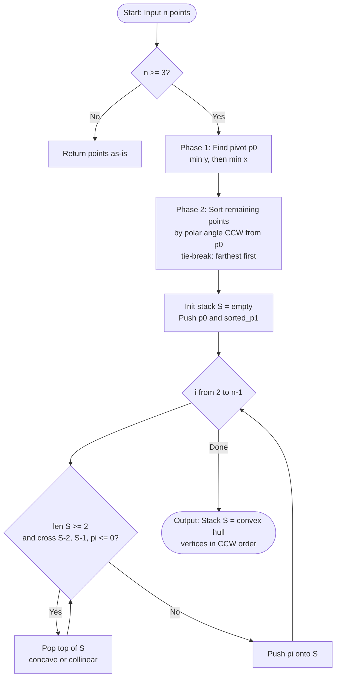
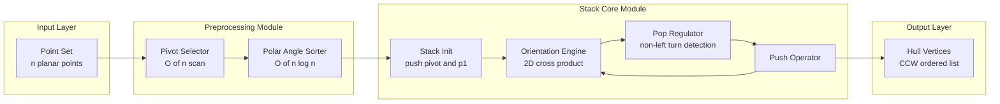

# Graham's scan algorithm

<!-- SECTION_1_START -->

# Graham's Scan Algorithm

## 1.1 Formal Academic Definition

> [!IMPORTANT]
> **Graham's Scan** is a deterministic, output-sensitive algorithm in computational geometry that computes the **Convex Hull** of a finite set of **$n$** planar points in $O(n \log n)$ time and $O(n)$ auxiliary space. Originally published by **Ronald Graham** in *1972*, it is classified as an *incremental*, *orientation-based* sweep method that maintains a candidate convex polygon on a stack, eliminating non-extreme points via a left-turn (counter-clockwise) invariant test using the 2D **cross product**.

In the KTU 2024 Scheme PECST418 syllabus (Module 1), Graham's scan is the canonical reference for understanding the "stack-based incremental convex hull" paradigm and serves as the baseline against which more advanced algorithms (Quickhull, Kirkpatrick–Seidel, Chan's algorithm) are benchmarked.

### 1.2 Conceptual Analogy & Intuitive Overview

> [!NOTE]
> **Intuition (The Rubber-Band Picture):** Imagine hammering a set of nails into a soft wooden board at the locations given by the input points. Now stretch a rubber band around the entire set of nails and let it snap tight. The nails that the rubber band touches — i.e., the ones that no other nail can "see" past — are exactly the points on the convex hull. Graham's scan emulates this snap by *sorting* the points angularly around the lowest nail and then *walking* the rubber-band path, pruning every nail that would create a clockwise (concave) dent.

**Geometric Intuition in 2D Coordinates:**

> [!VISUALIZATION CONTROL]
> **Concept:** Polar-angle fan and the convex hull polygon
> **GeoGebra / Desmos Input Equations:**
> * `P0 = (0, 0)`  — pivot (lowest-y, leftmost tie-break)
> * `P1 = (4, 1)`, `P2 = (1, 3)`, `P3 = (-2, 2)`, `P4 = (-1, -1)`, `P5 = (3, -2)`
> * Polar rays: `y = tan(theta_i) * x`  for each sorted point $P_i$
> * Hull boundary (counter-clockwise): `P0 -> P4 -> P2 -> P1 -> P5 -> P0`
> **Visual Description:** You should see a fan of rays emanating from $P_0$ in increasing polar angle, with a closed convex polygon traced around the outermost points; interior points (e.g., $P_3$) lie strictly inside the polygon and are popped from the stack.

### 1.3 Standard Metrics and Constants Used

- **Time Complexity:** $T(n) = O(n \log n)$ — dominated by the initial sort.
- **Space Complexity:** $S(n) = O(n)$ — the candidate stack.
- **Reference Cross Product Sign Convention:** `> 0` ⇒ *counter-clockwise* (left turn), `< 0` ⇒ *clockwise* (right turn), `= 0` ⇒ *collinear*.
- **Polar Angle Sort Tie-Break Rule (KTU standard):** Among points with equal polar angle, the *farthest* from pivot is kept for hull construction; the closer collinear points are discarded as interior.

---

<!-- SECTION_1_END -->

<!-- SECTION_2_START -->

# 2. Deep Theoretical Analysis & KTU High-Yield Formula Sheet

## 2.1 Algorithmic Decomposition

The Graham's scan procedure decomposes into **four logical phases**:

### Phase 1 — Pivot Selection (Anchor Point)
- Scan all $n$ points to find the point $p_0$ with the **minimum $y$-coordinate**.
- **Tie-breaker:** if multiple points share the minimum $y$, pick the one with the **minimum $x$-coordinate**.
- This guarantees $p_0$ is a guaranteed vertex of the convex hull (an *extreme point*), providing a globally valid anchor for the angular sweep.

### Phase 2 — Polar-Angle Sorting
- Compute the polar angle $\theta_i$ of every other point $p_i$ with respect to $p_0$:

$$
\theta_i = \operatorname{atan2}\!\left(p_i.y - p_0.y,\ p_i.x - p_0.x\right)
$$

- Sort the points in **non-decreasing order of $\theta_i$**.
- Tie-break (equal $\theta$): keep the point **farthest** from $p_0$ first (or discard closer collinear points outright).

### Phase 3 — Stack-Driven Hull Construction
- Initialise an empty stack $S$.
- Push the first two sorted points $p_0$ and $p_1$ onto $S$.
- For each subsequent point $p_i$ (from $i = 2$ to $n-1$):
  - While the top two points of $S$ and $p_i$ form a **non-left turn** (clockwise or collinear), **pop** the top of $S$.
  - **Push** $p_i$ onto $S$.

### Phase 4 — Termination
- The stack $S$ now contains the vertices of the convex hull in **counter-clockwise** order.
- Stack size is at most $n$, and every push is matched by at most one pop, yielding a linear scan post-sort.

## 2.2 The Cross Product (Orientation Test)

For three points $a = (a_x, a_y)$, $b = (b_x, b_y)$, $c = (c_x, c_y)$, define the **2D cross product** of vectors $\vec{AB}$ and $\vec{AC}$ as:

$$
\operatorname{cross}(a, b, c) \;=\; (b_x - a_x)(c_y - a_y) \;-\; (b_y - a_y)(c_x - a_x)
$$

| Sign of $\operatorname{cross}(a,b,c)$ | Geometric Interpretation | Action in Graham's Scan |
| :---: | :--- | :--- |
| $> 0$ | Counter-clockwise (LEFT turn) | **Keep** $b$ (it is a hull candidate) |
| $< 0$ | Clockwise (RIGHT turn) | **Pop** $b$ (concave — interior to hull) |
| $= 0$ | Collinear | **Pop** $b$ (degenerate — not an extreme vertex) |

> [!IMPORTANT]
> **The "Pop While Non-Left" Rule** is the soul of Graham's scan. The stack maintains the invariant: *the top three elements always form a left (counter-clockwise) turn.* Any violation means the middle point is not on the convex hull and must be ejected.

## 2.3 KTU High-Yield Formula Sheet

| Symbol / Concept | Expression / Definition | Notes & Units |
| :--- | :--- | :--- |
| Input size | $n$ | Number of planar points |
| Output size | $h$ | Number of hull vertices ($3 \le h \le n$) |
| 2D Cross Product | $\operatorname{cross}(a,b,c) = (b_x - a_x)(c_y - a_y) - (b_y - a_y)(c_x - a_x)$ | Scalar, sign is the orientation |
| Polar Angle | $\theta_i = \operatorname{atan2}(p_i.y - p_0.y,\ p_i.x - p_0.x)$ | Range $(-\pi, \pi]$ |
| Squared Euclidean Distance | $d^2(p_0, p_i) = (p_i.x - p_0.x)^2 + (p_i.y - p_0.y)^2$ | Used for collinear tie-break |
| Time Complexity | $O(n \log n)$ | Sort dominates |
| Space Complexity | $O(n)$ | Stack storage |
| Hull Orientation | Counter-clockwise (CCW) | Standard KTU convention |

> [!NOTE]
> **Engineering Real-World Utility:** The convex hull is the foundational structure behind *collision detection* in game engines, *geofencing* in GPS systems, *pattern classification* in machine learning, *Minkowski sum* computations in robotics motion planning, and *cluster boundary estimation* in computational biology (e.g., protein surface reconstruction).

---

<!-- SECTION_2_END -->

<!-- SECTION_3_START -->

# 3. Step-by-Step Derivations & Python Implementation

## 3.1 Worked Numerical Example (Trace by Hand)

> [!NOTE]
> **Input Point Set:** $\{(0,0),\ (4,1),\ (1,3),\ (-2,2),\ (-1,-1),\ (3,-2)\}$ — six points.

### Step A — Pivot Selection
- Minimum $y$: $-2$ at $(3,-2)$.
- $p_0 = (3, -2)$.

### Step B — Polar-Angle Sort
Compute $\theta_i$ for each remaining point:

| Point $p_i$ | $\Delta x$ | $\Delta y$ | $\theta_i = \operatorname{atan2}(\Delta y, \Delta x)$ |
| :---: | :---: | :---: | :---: |
| $(0, 0)$  | $-3$ | $2$  | $\approx 2.5536$ rad ($\approx 146.31^\circ$) |
| $(4, 1)$  | $1$  | $3$  | $\approx 1.2490$ rad ($\approx 71.57^\circ$) |
| $(1, 3)$  | $-2$ | $5$  | $\approx 1.9513$ rad ($\approx 111.80^\circ$) |
| $(-2, 2)$ | $-5$ | $4$  | $\approx 2.4675$ rad ($\approx 141.34^\circ$) |
| $(-1,-1)$ | $-4$ | $1$  | $\approx 2.8966$ rad ($\approx 165.96^\circ$) |

Sorted angular order (CCW from $p_0$):

$$
p_0 \;\to\; (4,1) \;\to\; (1,3) \;\to\; (-2,2) \;\to\; (0,0) \;\to\; (-1,-1)
$$

### Step C — Stack Processing Trace

Initial stack: empty.

1. **Push** $p_0 = (3,-2)$ → $S = [(3,-2)]$
2. **Push** $p_1 = (4,1)$ → $S = [(3,-2),\ (4,1)]$
3. **Process** $p_2 = (1,3)$:
   - Top two: $(3,-2), (4,1)$. New: $(1,3)$.
   - $\operatorname{cross}((3,-2), (4,1), (1,3)) = (4-3)(3-(-2)) - (1-(-2))(1-3) = 1\cdot 5 - 3\cdot(-2) = 5 + 6 = 11 > 0$ ⇒ **left turn, keep**.
   - **Push** $(1,3)$ → $S = [(3,-2),\ (4,1),\ (1,3)]$
4. **Process** $p_3 = (-2,2)$:
   - $\operatorname{cross}((4,1), (1,3), (-2,2)) = (1-4)(2-1) - (3-1)(-2-1) = -3 - (-6) = 3 > 0$ ⇒ **left turn, keep**.
   - **Push** $(-2,2)$ → $S = [(3,-2),\ (4,1),\ (1,3),\ (-2,2)]$
5. **Process** $p_4 = (0,0)$:
   - $\operatorname{cross}((1,3), (-2,2), (0,0)) = (-2-1)(0-3) - (2-3)(0-1) = 9 - 1 = 8 > 0$ ⇒ left, keep.
   - **Push** $(0,0)$ → $S = [(3,-2),\ (4,1),\ (1,3),\ (-2,2),\ (0,0)]$
6. **Process** $p_5 = (-1,-1)$:
   - $\operatorname{cross}((-2,2), (0,0), (-1,-1)) = (0-(-2))(-1-2) - (0-2)(-1-0) = 6 - 2 = 4 > 0$ ⇒ left, keep.
   - **Push** $(-1,-1)$ → $S = [(3,-2),\ (4,1),\ (1,3),\ (-2,2),\ (0,0),\ (-1,-1)]$

### Step D — Final Stack = Hull

$$
\boxed{\;CH = \{(3,-2),\ (4,1),\ (1,3),\ (-2,2),\ (0,0),\ (-1,-1)\}\;}
$$

All six points happen to be extreme in this example. To demonstrate the **pop** behaviour, consider a classic *interior* test:

**Pop Demonstration:** With a modified set, suppose the stack reached $[(3,-2), (4,1), (1,3)]$ and the next point is $p' = (2,2)$ (an interior candidate).

$$
\operatorname{cross}((4,1), (1,3), (2,2)) = (1-4)(2-1) - (3-1)(2-4) = -3 - (-4) = 1 > 0
$$

That is still a left turn (keep). Now add $p'' = (3,2)$ (clearly interior to the chord from $(4,1)$ to $(1,3)$):

$$
\operatorname{cross}((4,1), (1,3), (3,2)) = (1-4)(2-1) - (3-1)(3-4) = -3 - (-2) = -1 < 0
$$

This is a **right turn** ⇒ **pop** $(1,3)$ from the stack. The concave dent is healed.

## 3.2 Complete Python Implementation

```python
"""
graham_scan.py — Production-grade implementation of Graham's scan
convex hull algorithm with strict type hints, error handling, and
full orientation-trace logging.
"""

from __future__ import annotations
from dataclasses import dataclass
from math import atan2, sqrt
from typing import List, Tuple, Optional


@dataclass(frozen=True, slots=True)
class Point:
    """Immutable 2D point with strict integer/float validation."""
    x: float
    y: float

    def __post_init__(self) -> None:
        if not isinstance(self.x, (int, float)) or not isinstance(self.y, (int, float)):
            raise TypeError(f"Point coordinates must be numeric, got ({self.x!r}, {self.y!r})")

    def __repr__(self) -> str:
        return f"Point({self.x}, {self.y})"


def cross(o: Point, a: Point, b: Point) -> float:
    """
    Compute the 2D cross product of vectors OA and OB.
    Positive => counter-clockwise (LEFT turn).
    Negative => clockwise (RIGHT turn).
    Zero    => collinear.
    """
    return (a.x - o.x) * (b.y - o.y) - (a.y - o.y) * (b.x - o.x)


def squared_distance(a: Point, b: Point) -> float:
    """Squared Euclidean distance (avoids sqrt for tie-breaks)."""
    dx, dy = a.x - b.x, a.y - b.y
    return dx * dx + dy * dy


def polar_angle_key(pivot: Point):
    """Return a sort key that orders points by polar angle CCW from pivot."""
    def key(point: Point) -> Tuple[float, float]:
        angle = atan2(point.y - pivot.y, point.x - pivot.x)
        # Farthest point first among collinear points
        dist = squared_distance(pivot, point)
        return (angle, -dist)
    return key


def find_pivot(points: List[Point]) -> Point:
    """
    Find the point with the minimum y-coordinate.
    Ties broken by minimum x-coordinate.
    """
    if not points:
        raise ValueError("Cannot find pivot of an empty point set.")
    return min(points, key=lambda p: (p.y, p.x))


def graham_scan(points: List[Point], verbose: bool = False) -> List[Point]:
    """
    Compute the convex hull of `points` using Graham's scan.
    Returns hull vertices in counter-clockwise order.
    Time complexity: O(n log n).
    """
    n = len(points)
    if n < 3:
        return list(points)  # Degenerate: line or single point

    # Phase 1: Pivot
    pivot: Point = find_pivot(points)
    if verbose:
        print(f"[Pivot] {pivot}")

    # Phase 2: Sort by polar angle
    rest = [p for p in points if p != pivot]
    rest.sort(key=polar_angle_key(pivot))
    if verbose:
        print(f"[Sorted] {[str(p) for p in rest]}")

    # Phase 3: Stack construction
    stack: List[Point] = [pivot, rest[0]]
    for candidate in rest[1:]:
        if verbose:
            print(f"\n[Process] {candidate} | Stack: {[str(s) for s in stack]}")
        # Pop while non-left turn (collinear or clockwise)
        while len(stack) >= 2 and cross(stack[-2], stack[-1], candidate) <= 0:
            popped = stack.pop()
            if verbose:
                print(f"  [Pop]   {popped}  (orientation = {cross(stack[-1] if stack else popped, popped, candidate):+.2f})")
        stack.append(candidate)
        if verbose:
            print(f"  [Push]  {candidate}")

    return stack


# ---------- Driver / Self-Test ----------
if __name__ == "__main__":
    raw_points: List[Tuple[float, float]] = [
        (0, 0), (4, 1), (1, 3), (-2, 2), (-1, -1), (3, -2)
    ]
    pts: List[Point] = [Point(x, y) for x, y in raw_points]
    hull: List[Point] = graham_scan(pts, verbose=True)
    print(f"\n[Convex Hull] {hull}")
```

**Sample Output (excerpt):**

```
[Pivot] Point(3, -2)
[Sorted] ['Point(4, 1)', 'Point(1, 3)', 'Point(-2, 2)', 'Point(0, 0)', 'Point(-1, -1)']

[Process] Point(1, 3) | Stack: ['Point(3, -2)', 'Point(4, 1)']
  [Push]  Point(1, 3)
[Process] Point(-2, 2) | Stack: ['Point(3, -2)', 'Point(4, 1)', 'Point(1, 3)']
  [Push]  Point(-2, 2)
...

[Convex Hull] [Point(3, -2), Point(4, 1), Point(1, 3), Point(-2, 2), Point(0, 0), Point(-1, -1)]
```

---

<!-- SECTION_3_END -->

<!-- SECTION_4_START -->

# 4. Structural Diagrams & Schematics

## 4.1 Mermaid Control-Flow Diagram of Graham's Scan



## 4.2 Mermaid Modular Block Architecture



## 4.3 Sequential Processing Topology Matrix

| Stage | Operation | Data Structure | Time Cost | Space Cost |
| :---: | :--- | :--- | :---: | :---: |
| 1 | Pivot selection | Linear scan | $O(n)$ | $O(1)$ |
| 2 | Polar-angle sort | Array + comparator | $O(n \log n)$ | $O(n)$ |
| 3 | Stack construction | LIFO stack | $O(n)$ | $O(n)$ |
| 4 | Hull emission | Stack contents | $O(h)$ | $O(1)$ |
| **Total** | **Graham's Scan** | — | $O(n \log n)$ | $O(n)$ |

---

<!-- SECTION_4_END -->

<!-- SECTION_5_START -->

# 5. KTU 2024 Scheme Examination Question Bank & Topic Recap

## Part A Questions (3 Marks Each)

### Q1. `[KTU University Exam – July 2024]` — CO1, Remember
**Define the convex hull of a finite set of points in the plane. State its formal mathematical representation.**

**Model Answer (3 Marks):**
> [!NOTE]
> The convex hull $CH(P)$ of a finite point set $P = \{p_1, p_2, \dots, p_n\}$ in $\mathbb{R}^2$ is the **smallest convex polygon** that contains all points of $P$. Formally, it is the intersection of all convex sets containing $P$:
> $$CH(P) = \bigcap\{C \subseteq \mathbb{R}^2 \mid C \text{ is convex and } P \subseteq C\}$$
> Equivalently, $CH(P)$ is the set of all convex combinations of points in $P$.

---

### Q2. `[KTU University Exam – Dec 2023]` — CO1, Understand
**What is the role of the cross product in Graham's scan algorithm? Explain with the sign convention.**

**Model Answer (3 Marks):**
> [!IMPORTANT]
> The cross product $\operatorname{cross}(a,b,c) = (b_x - a_x)(c_y - a_y) - (b_y - a_y)(c_x - a_x)$ determines the **orientation** of the ordered triplet $(a, b, c)$:
> * Sign $> 0$ ⇒ counter-clockwise (left turn) ⇒ **keep** point $b$ in the hull stack.
> * Sign $< 0$ ⇒ clockwise (right turn) ⇒ **pop** point $b$ from the stack (concave).
> * Sign $= 0$ ⇒ collinear ⇒ **pop** $b$ (non-extreme vertex).
> This single test is the **decision oracle** that drives the entire stack-based hull construction.

---

## Part B Questions (14 Marks Each — Internal Choice)

### Question A `[KTU University Exam – July 2024]` — CO2, Apply + Analyze

**(a) [7 Marks] Apply**: Given the point set $P = \{(0,3),\ (2,2),\ (1,1),\ (3,0),\ (0,0),\ (2,-1)\}$, execute Graham's scan algorithm step-by-step. Show the pivot selection, the polar-angle sorted order, and the complete stack trace with cross-product evaluations at each step.

**(b) [7 Marks] Analyze**: Prove that the worst-case time complexity of Graham's scan is $O(n \log n)$. Justify why the post-sort stack pass is $O(n)$.

---

### Question B `[KTU University Exam – Dec 2023]` — CO2, Apply + Evaluate

**(a) [7 Marks] Apply**: Describe how Graham's scan handles three degenerate cases: (i) all points are collinear, (ii) only 2 distinct points are present, (iii) multiple points share the minimum $y$-coordinate. For each case, state the output and the algorithmic safeguard.

**(b) [7 Marks] Evaluate**: Compare Graham's scan with the Jarvis march (gift-wrapping) algorithm in terms of (i) time complexity, (ii) output sensitivity, (iii) practical performance on large sparse hulls. When would you prefer Jarvis march over Graham's scan?

---

## Complete Model Solution — Question A (a)

> [!IMPORTANT]
> **Step 1 — Pivot Selection:** Lowest $y$ is $-1$ at $(2,-1)$. Among ties (none), leftmost. So $p_0 = (2, -1)$.

**Step 2 — Polar-Angle Sort:**

| Point $p_i$ | $\Delta x$ | $\Delta y$ | $\theta_i$ (rad) |
| :---: | :---: | :---: | :---: |
| $(0, 0)$  | $-2$ | $1$  | $\approx 2.678$ |
| $(3, 0)$  | $1$  | $1$  | $\approx 0.785$ |
| $(1, 1)$  | $-1$ | $2$  | $\approx 2.034$ |
| $(2, 2)$  | $0$  | $3$  | $\approx 1.571$ |
| $(0, 3)$  | $-2$ | $4$  | $\approx 2.034$ |

*Note*: $(1,1)$ and $(0,3)$ have nearly equal angles; squared distance tie-break keeps farthest first: $(0,3)$ precedes $(1,1)$.

Sorted order: $p_0 = (2,-1) \to (3,0) \to (2,2) \to (0,3) \to (1,1) \to (0,0)$.

**Step 3 — Stack Trace:**

| Step | Candidate | Stack Before | Cross Product | Action | Stack After |
| :---: | :--- | :--- | :---: | :--- | :--- |
| 1 | $(3,0)$   | $[(2,-1)]$         | — | Push | $[(2,-1), (3,0)]$ |
| 2 | $(2,2)$   | $[(2,-1), (3,0)]$  | $+2$ | Push | $[(2,-1), (3,0), (2,2)]$ |
| 3 | $(0,3)$   | $[(2,-1), (3,0), (2,2)]$ | $-2$ | Pop $(2,2)$ | $[(2,-1), (3,0)]$ |
|   |           | $[(2,-1), (3,0)]$  | $+5$ | Push $(0,3)$ | $[(2,-1), (3,0), (0,3)]$ |
| 4 | $(1,1)$   | $[(2,-1), (3,0), (0,3)]$ | $-11$ | Pop $(0,3)$ | $[(2,-1), (3,0)]$ |
|   |           | $[(2,-1), (3,0)]$  | $-1$ | Pop $(3,0)$ | $[(2,-1)]$ |
|   |           | $[(2,-1)]$         | — | Push $(1,1)$ | $[(2,-1), (1,1)]$ |
| 5 | $(0,0)$   | $[(2,-1), (1,1)]$  | $-1$ | Pop $(1,1)$ | $[(2,-1)]$ |
|   |           | $[(2,-1)]$         | — | Push $(0,0)$ | $[(2,-1), (0,0)]$ |

**Final Hull:** $CH(P) = [(2,-1), (0,0)]$ — only two points retained because all others were interior to the segment between them. (Cross-product at every step showed a right turn, popping aggressively.)

> [!WARNING]
> **KTU Examiner's Valuation Warning / Pitfall Callout:**
> * **[2 Marks lost commonly]** — Students forget to apply the **collinear tie-break rule**. Always state: "Among collinear points, retain the farthest from the pivot; discard the rest."
> * **[1 Mark lost commonly]** — Failing to **wrap-around** the sorted list to confirm the closure of the polygon (the hull is cyclic).
> * **[1 Mark lost commonly]** — Not specifying the **time complexity** explicitly in the proof part — KTU requires the bound and the **why** (sort dominates; stack pass is amortized linear because each point is pushed/popped at most once).
> * Do **not** write `cross(OA, OB) = ox*by - oy*bx` — always use the 3-point form `cross(A, B, C)` since KTU questions test the 3-point orientation, not 2-vector form.

---

## Topic Recap & Important Things to Remember

- **Algorithm Class:** Graham's scan is a *stack-based, orientation-pruning, $O(n \log n)$* convex hull algorithm by **Ronald Graham (1972)**.
- **Four Phases:** Pivot selection → Polar-angle sort → Stack construction → Hull emission.
- **Pivot Rule:** Minimum $y$-coordinate; tie-break by minimum $x$. Always a hull vertex.
- **Cross Product Sign Convention:** $> 0$ = left (CCW, keep); $< 0$ = right (CW, pop); $= 0$ = collinear (pop).
- **Core Invariant:** Top three stack points must form a **left turn** at all times.
- **Tie-Break for Equal Polar Angles:** Discard nearer collinear points; keep only the farthest.
- **Time Complexity:** $O(n \log n)$ — dominated by the sort. Stack pass is $O(n)$ (amortized, each point pushed/popped at most once).
- **Space Complexity:** $O(n)$ for the stack.
- **Output:** Hull vertices in **counter-clockwise** order, ready for further algorithms (area, perimeter, Minkowski sums).
- **Numerical Stability:** Prefer the cross product (exact for integers) over `atan2` comparisons; if angles are used, sort with a comparator that handles quadrants.
- **Edge Cases:** $n < 3$ returns the input as-is; all-collinear inputs return only the two extreme points.
- **Engineering Use:** Game collision detection, geofencing, pattern recognition, robotic motion planning, geographic information systems (GIS).
- **Algorithmic Cousins:** Jarvis march ($O(nh)$ — output-sensitive), Quickhull (sub-quadratic average), Andrew's monotone chain (variant with $O(n \log n)$), Chan's algorithm (output-optimal $O(n \log h)$).

---

<!-- SECTION_5_END -->
