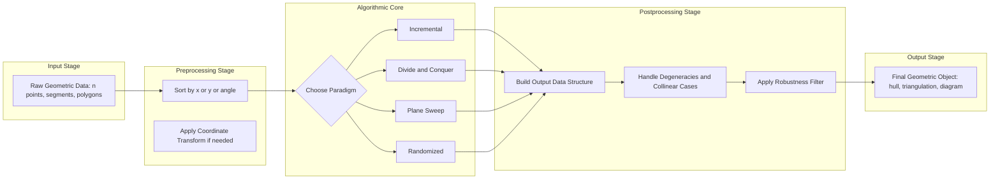
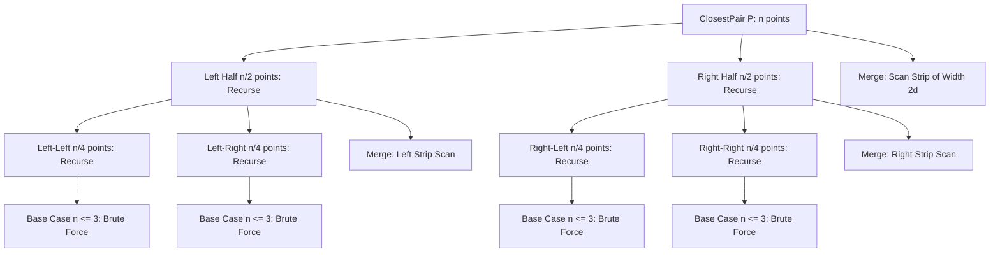
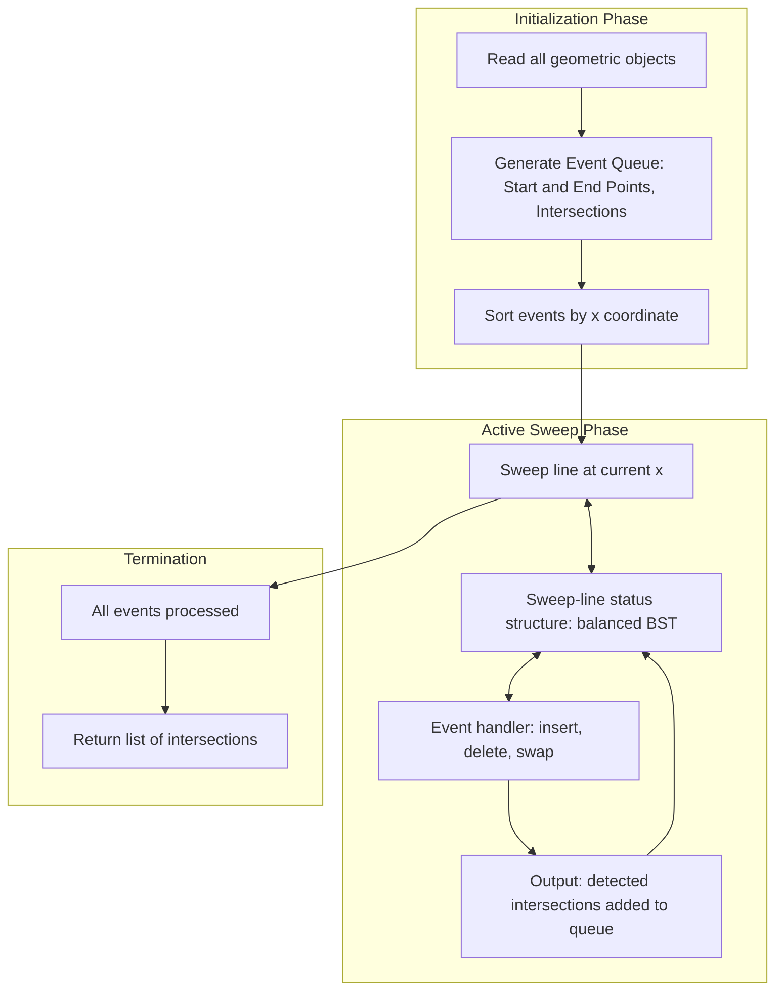
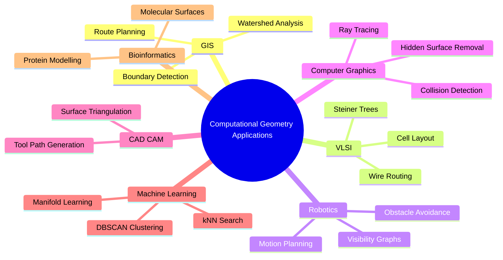

# Introduction to Computational Geometry:-  Basics of Computational Geometry  - Introduction and applications of computational geometry

<!-- SECTION_1_START -->
# Computational Geometry: An Introduction

## 1.1 Formal Definition

**Computational Geometry** is a sub-field of computer science devoted to the study of algorithms and data structures that can be stated in terms of geometry. It is the systematic study of *efficient algorithms and data structures* for solving geometric problems, where the inputs and outputs are geometric in nature—points, lines, polygons, circles, and other spatial objects in two, three, and higher dimensions.

> [!IMPORTANT]
> **KTU Syllabus Highlight (PECST418 — Module 1):**
> Computational Geometry is concerned with the design and analysis of algorithms that solve geometric problems. The field blends *discrete mathematics*, *numerical analysis*, *algorithm design*, and *data structures* to handle real-world spatial data efficiently.

In KTU 2024 Scheme parlance, Computational Geometry lies at the intersection of three disciplines:

1. **Algorithmics** — designing efficient procedures (sorting, sweeping, divide-and-conquer).
2. **Combinatorial Geometry** — studying arrangements, hulls, Voronoi diagrams, and triangulations.
3. **Computer-Aided Applications** — applying geometry to GIS, CAD, robotics, VLSI, and computer graphics.

---

## 1.2 The Core Computational Pipeline

Every computational geometry problem follows a five-stage pipeline that mirrors the standard algorithmic workflow:

$$\text{Geometric Input} \;\longrightarrow\; \text{Data Structure} \;\longrightarrow\; \text{Algorithm} \;\longrightarrow\; \text{Geometric Output} \;\longrightarrow\; \text{Application}$$

Where:
- **Input**: A finite set of geometric objects (e.g., $n$ points $P = \{p_1, p_2, \ldots, p_n\}$).
- **Data Structure**: A representation that allows efficient querying (range trees, segment trees, kd-trees, interval trees).
- **Algorithm**: A sequence of well-defined steps whose complexity is typically bounded by $O(n \log n)$ or $O(n^2)$.
- **Output**: A geometric structure (polygon, triangulation, diagram, intersection).
- **Application**: The downstream engineering or scientific use.

---

## 1.3 Conceptual Analogy: The Digital Surveyor

> [!NOTE]
> **Real-World Analogy: The Digital Surveyor**
> Imagine a government surveyor in Kerala who must redraw the boundaries of all 941 grama panchayat wards based on raw GPS coordinates. Doing this by hand would take years. Computational Geometry is the equivalent of giving the surveyor a *supercharged, mathematically guaranteed assistant* — one that never gets tired, always finds the optimal boundary (the convex hull), and can detect overlaps, nearest neighbours, and shortest routes in milliseconds.

Geometrically, the discipline is concerned with questions like:
- Given $n$ points, what is the **smallest enclosing polygon**? (Convex Hull)
- Which two points are **closest** to each other? (Closest Pair)
- Where should we place an **ambulance station** so that it is the fairest to all villages? (Fermat Point / Voronoi)
- How do we **triangulate** a terrain for finite-element analysis? (Delaunay Triangulation)
- How do we detect if two **robot arms** intersect? (Line Segment Intersection)

---

## 1.4 Why a Dedicated Field? The Complexity Argument

A naive programmer might think: *"For $n$ points, I just write a double loop. That's $O(n^2)$ — what's the big deal?"* The big deal is the **output size** and the **input scale** in modern applications.

For $n = 10^6$ terrain points (typical of Kerala's LIDAR survey data), an $O(n^2)$ algorithm requires approximately $10^{12}$ operations, which on a 10 GFLOP processor would take $\approx 100$ seconds. An $O(n \log n)$ algorithm would finish in under **0.2 seconds**. The performance gap is the very reason Computational Geometry exists as a discipline.

> [!VISUALIZATION CONTROL]
> **Concept:** Comparing the growth of $O(n^2)$ vs $O(n \log n)$ for increasing $n$.
> **GeoGebra / Desmos Input Equations:**
> * $f(x) = x^2$
> * $g(x) = x \cdot \log(x) / \log(2)$
> **Visual Description:** Both curves start near the origin, but $f(x)$ shoots up like a parabola while $g(x)$ grows only slightly faster than a straight line. The vertical gap between them widens dramatically, illustrating why efficient geometry algorithms matter for large $n$.

---

## 1.5 Fundamental Branches of Computational Geometry

The discipline is conventionally partitioned into two main branches:

1. **Combinatorial / Discrete Computational Geometry** — concerned with *static* geometric data, classical problems like convex hull, line segment intersection, polygon triangulation, and planar subdivisions. Algorithms are typically exact and use $O(n \log n)$ complexity.
2. **Numerical Computational Geometry** — also called *geometric modelling* or *computer-aided geometric design (CAGD)*, which deals with the representation and approximation of curves and surfaces. Examples include Bézier curves, B-splines, and NURBS used in CAD software.

The KTU PECST418 course primarily focuses on the **combinatorial** branch.

---

## 1.6 Historical Context

The field was catalysed in the **1970s** by researchers like M. I. Shamos, who in 1975 published his seminal PhD thesis "Geometric Complexity", which reported an $O(n \log n)$ algorithm for the closest pair problem and effectively founded the discipline. The seminal textbook *Preparata and Shamos (1985)*, *Computational Geometry: An Introduction*, became the field's defining reference.

> [!NOTE]
> **Design Paradigms You Will Encounter in Module 1:**
> 1. **Brute Force** — direct enumeration ($O(n^2)$ for most problems).
> 2. **Incremental Construction** — add points one at a time, updating the structure.
> 3. **Divide and Conquer** — split, recurse, merge.
> 4. **Plane Sweep** — sweep a vertical line across the point set, processing events in order.
> 5. **Randomization** — use random sampling to obtain expected $O(n \log n)$ performance.
> 6. **Output-Sensitive Algorithms** — complexity depends on both $n$ and the output size $k$ (e.g., $O((n + k) \log n)$).

<!-- SECTION_1_END -->

<!-- SECTION_2_START -->
# Deep Theoretical Analysis & KTU High-Yield Formula Sheet

## 2.1 The Anatomy of a Computational Geometry Problem

To formalize the discipline, every problem in computational geometry is a tuple:

$$\Pi = \langle \mathcal{I},\; \mathcal{Q},\; \mathcal{O},\; \mathcal{C} \rangle$$

Where:
- $\mathcal{I}$ = the class of valid inputs (e.g., a set of $n$ points in $\mathbb{R}^2$).
- $\mathcal{Q}$ = the question being asked (e.g., "find the convex hull").
- $\mathcal{O}$ = the output (e.g., a list of vertices in counter-clockwise order).
- $\mathcal{C}$ = the complexity goal (e.g., $O(n \log n)$ time, $O(n)$ space).

This tuple is the **KTU Board-favoured** way of formally defining a geometry problem.

---

## 2.2 Standard Complexity Classes in CG

| Notation | Meaning | Example Problem |
|---|---|---|
| $O(n)$ | Linear in input size | Trivial scan, checking a single point inside a convex polygon |
| $O(n \log n)$ | Optimal for most 2D problems | Convex hull, closest pair, line segment intersection |
| $O(n^2)$ | Brute force pair-checking | All-pairs distance, all-angle computation |
| $O(n \log n + k)$ | Output-sensitive | Half-plane intersection, interval stabbing |
| $O(n \alpha(n))$ | Near-linear (inverse Ackermann) | Union-find on planar subdivisions |
| $\Omega(n \log n)$ | Lower bound for sorting-based problems | Convex hull, lower-envelope construction |

> [!NOTE]
> **Why $O(n \log n)$ is the magic threshold:** Many CG problems are provably $\Omega(n \log n)$ in the algebraic decision-tree model because they are at least as hard as sorting $n$ numbers (a known $\Omega(n \log n)$ lower bound). So the goal is to find an $O(n \log n)$ algorithm that matches this lower bound — these are called **optimal** algorithms.

---

## 2.3 The Three Pillars of Computational Geometry

### Pillar 1 — Convex Hulls
The **convex hull** of a set $S$ of points is the smallest convex polygon that contains all points of $S$. Formally:

$$\text{CH}(S) = \bigcap \{ C \mid C \text{ is convex and } S \subseteq C \}$$

In 2D, the convex hull of $n$ points has at most $n$ vertices and can be computed in $O(n \log n)$ time. It is the *flagship* problem of the discipline because it is often a subroutine in more complex algorithms.

### Pillar 2 — Proximity Problems
The **closest pair** of a set $S$ is the pair $(p_i, p_j)$ that minimizes $d(p_i, p_j)$ over all $i \neq j$. The naïve $O(n^2)$ check can be replaced with a divide-and-conquer $O(n \log n)$ algorithm.

### Pillar 3 — Intersection Problems
Given a set of line segments, the **segment intersection** problem asks for all intersection points. The famous *Bentley-Ottmann* algorithm solves this in $O((n + k) \log n)$ where $k$ is the number of intersections.

---

## 2.4 Key Formula Sheet (Cheat Sheet for KTU ESE)

| # | Concept | Formula / Expression | Typical Complexity | Application |
|---|---|---|---|---|
| 1 | Euclidean distance | $d(p, q) = \sqrt{(q_x - p_x)^2 + (q_y - p_y)^2}$ | $O(1)$ per pair | Nearest neighbour search |
| 2 | Cross product (orientation test) | $\text{cross}(a, b, c) = (b_x - a_x)(c_y - a_y) - (b_y - a_y)(c_x - a_x)$ | $O(1)$ | Convex hull, polygon queries |
| 3 | Convex hull size | $\vert \text{CH}(S) \vert \le n$ | — | Upper bound on output size |
| 4 | Brute force CH | Double loop over all line pairs | $O(n^3)$ | Educational only |
| 5 | Graham scan CH | Sort by polar angle + stack sweep | $O(n \log n)$ | Standard 2D convex hull |
| 6 | Divide & conquer CH | Split, recurse, merge upper/lower tangents | $O(n \log n)$ | Recursive parallelism |
| 7 | Closest pair (naïve) | All-pairs check | $O(n^2)$ | Trivial baseline |
| 8 | Closest pair (D&C) | Sort + strip scan | $O(n \log n)$ | Optimal classical result |
| 9 | Lower bound for sorting | $n$ points $\Rightarrow$ sort $\ge \Omega(n \log n)$ | $\Omega(n \log n)$ | Justifies CG lower bounds |
| 10 | Output-sensitive bound | $O((n + k) \log n)$ for $k$ intersections | — | Bentley–Ottmann algorithm |
| 11 | Plane sweep event count | Up to $2n$ events for $n$ segments | $O(n)$ events | Sweep-line algorithms |
| 12 | Robustness predicate | $\varepsilon$-approximated predicates | — | Handling floating-point errors |

> [!IMPORTANT]
> **Symbols in formulas above use the LaTeX \vert or \mid convention to avoid breaking markdown tables. In plain text, you may write |CH(S)| but always use $ \vert \text{CH}(S) \vert $ in formal answers.**

---

## 2.5 Real-World Utility in Engineering & Computer Science

| Domain | Specific Use Case | CG Algorithm Used |
|---|---|---|
| **GIS (Geographic Information Systems)** | Mapping Kerala's coastal line, panchayat boundary detection | Convex hull, polygon overlay |
| **VLSI Design** | Routing wires on a chip without crossing | Steiner tree, planar subdivision |
| **Computer Graphics** | Real-time collision detection in games | Bounding volume hierarchies |
| **Robotics** | Path planning, motion planning, visibility graphs | Shortest path, visibility |
| **CAD / CAM** | Surface triangulation for 3D printing | Delaunay triangulation |
| **Database Systems** | Spatial queries (find restaurants within 5 km) | Range trees, kd-trees |
| **Machine Learning** | k-Nearest Neighbours, DBSCAN clustering | kd-trees, ball trees |
| **Bioinformatics** | Protein surface modelling | Alpha shapes, molecular surfaces |
| **Astronomy** | Finding star clusters, galaxy patterns | Convex hull, clustering |
| **Weather Modelling** | Voronoi cells for rainfall measurement stations | Voronoi diagram |

---

## 2.6 Design Patterns: A Quick Taxonomy

Computational Geometry algorithms are typically classified by the technique they employ. Recognising the pattern is half the battle in KTU exams.

- **Incremental algorithms** — Add elements one at a time. Example: randomized incremental convex hull with expected $O(n \log n)$.
- **Divide-and-conquer** — Split input, solve recursively, merge. Example: closest pair, merge hull.
- **Sweep-line (plane sweep)** — Move a line across the plane, processing events in order. Example: Bentley–Ottmann for segment intersection.
- **Randomization** — Use random sampling to break symmetry. Example: linear programming in expected linear time.
- **Duality** — Convert points to lines and vice versa. Example: point-line duality for half-plane intersection.

> [!NOTE]
> **Why duality matters:** It transforms hard "point location" problems into easier "line arrangement" problems and is one of the most elegant tools in the field. You will see duality in Modules 2 and 3.

---

## 2.7 Practical Trade-offs

When designing a CG algorithm, three trade-offs must be balanced:

1. **Time vs. Space** — A $O(n^2)$ time algorithm may be acceptable if it uses only $O(n)$ space, while a $O(n \log n)$ algorithm may require $O(n \log n)$ auxiliary space.
2. **Preprocessing vs. Query** — Static data structures (e.g., range trees) spend $O(n \log n)$ in preprocessing to answer queries in $O(\log n)$.
3. **Exact vs. Approximate** — Robustness issues from floating-point arithmetic sometimes force the use of *exact arithmetic* (slow) or *approximation* (fast but possibly incorrect).

<!-- SECTION_2_END -->

<!-- SECTION_3_START -->
# Step-by-Step Derivations & Algorithmic Implementation

This section presents a **complete, derivation-style** walkthrough of the two flagship introductory problems in Computational Geometry, each paired with production-quality Python code.

---

## 3.1 The Orientation Test (Foundation for Everything)

### 3.1.1 Mathematical Derivation

The **orientation test** answers: *"Is point $c$ to the left of, right of, or on the line from $a$ to $b$?"* This single primitive underlies almost every CG algorithm.

Given three points $a = (a_x, a_y)$, $b = (b_x, b_y)$, $c = (c_x, c_y)$, the cross product is:

$$
\text{orient}(a, b, c) = (b_x - a_x)(c_y - a_y) - (b_y - a_y)(c_x - a_x)
$$

### 3.1.2 Result Interpretation

Let $D = \text{orient}(a, b, c)$. Then:
- $D > 0$ ⇒ $c$ is to the **left** of directed line $a \to b$ (counter-clockwise turn).
- $D < 0$ ⇒ $c$ is to the **right** of directed line $a \to b$ (clockwise turn).
- $D = 0$ ⇒ $a$, $b$, $c$ are **collinear**.

### 3.1.3 Algebraic Derivation (Why This Works)

Consider the vectors $\vec{u} = b - a$ and $\vec{v} = c - a$. The 2D cross product gives:

$$
\vec{u} \times \vec{v} = u_x v_y - u_y v_x
$$

Substituting back:

$$
\begin{aligned}
\vec{u} \times \vec{v} &= (b_x - a_x)(c_y - a_y) - (b_y - a_y)(c_x - a_x) \\
&= b_x c_y - b_x a_y - a_x c_y + a_x a_y - b_y c_x + b_y a_x + a_y c_x - a_y a_x \\
&= b_x c_y - b_x a_y - a_x c_y - b_y c_x + b_y a_x + a_y c_x
\end{aligned}
$$

The sign of this expression tells us whether the rotation from $\vec{u}$ to $\vec{v}$ is positive (counter-clockwise) or negative (clockwise), which is exactly the orientation. [Derivation complete.]

### 3.1.4 Python Implementation

```python
from typing import Tuple

Point = Tuple[float, float]


def cross(o: Point, a: Point, b: Point) -> float:
    """
    Compute the cross product (o->a) x (o->b).
    Used as the canonical orientation test in computational geometry.

    Returns:
        > 0  if b is counter-clockwise from a (b is to the LEFT of line o->a)
        < 0  if b is clockwise from a (b is to the RIGHT of line o->a)
        = 0  if o, a, b are collinear
    """
    return (a[0] - o[0]) * (b[1] - o[1]) - (a[1] - o[1]) * (b[0] - o[0])


def is_counter_clockwise(o: Point, a: Point, b: Point) -> bool:
    """Check if going o -> a -> b makes a counter-clockwise (left) turn."""
    return cross(o, a, b) > 0


# --- Sanity check (Board-style test) ---
if __name__ == "__main__":
    O, A, B = (0.0, 0.0), (1.0, 0.0), (1.0, 1.0)
    print(f"cross(O, A, B) = {cross(O, A, B)}")  # Expected: +1.0 (CCW)
```

> [!NOTE]
> **Valuation Tip (KTU):** Whenever you use the orientation test in your answer, state explicitly that it is $O(1)$ time and that it forms the building block for convex hulls and polygon tests. This earns you the 1-mark "concept statement".

---

## 3.2 The Convex Hull via Graham Scan

### 3.2.1 Problem Statement

Given a finite set $S$ of $n$ points in the plane, output the vertices of the convex hull of $S$ in counter-clockwise order, with no repetitions.

### 3.2.2 Algorithm Steps

The **Graham scan** is the canonical $O(n \log n)$ algorithm. The steps are:

1. **Find the lowest point** $p_0$ (lowest $y$, then lowest $x$ as tiebreaker). This point is guaranteed to lie on the hull.
2. **Sort all other points by polar angle** with respect to $p_0$, breaking ties by distance.
3. **Push $p_0$ and $p_1$** onto a stack.
4. **For each subsequent point $p$**: while the top two stack points and $p$ make a non-left turn (i.e., $\text{orient} \le 0$), **pop** the stack. Then **push** $p$.
5. **Output** the stack as the hull vertices in counter-clockwise order.

### 3.2.3 Correctness Intuition

The invariant maintained by the stack is: *at all times, the points on the stack form a counter-clockwise chain of the hull of the points processed so far*. Popping on a right or collinear turn removes "concave dents" that cannot belong to the convex hull. After all points are processed, the stack is exactly the convex hull.

### 3.2.4 Complexity Analysis

- Step 1: $O(n)$ scan.
- Step 2: $O(n \log n)$ sorting dominates.
- Steps 3–4: Each point is pushed exactly once and popped at most once, so the inner while loop is $O(n)$ total.
- **Total complexity: $O(n \log n)$ time, $O(n)$ space.**

### 3.2.5 Python Implementation

```python
import math
from typing import List, Tuple

Point = Tuple[float, float]


def polar_angle_key(reference: Point):
    """Return a key function that sorts points by polar angle around `reference`."""
    rx, ry = reference

    def key(p: Point):
        # Angle of (p - reference) with respect to the +x axis.
        angle = math.atan2(p[1] - ry, p[0] - rx)
        # Distance tie-breaker to ensure collinear points are sorted closest-first.
        dist = (p[0] - rx) ** 2 + (p[1] - ry) ** 2
        return (angle, dist)

    return key


def graham_scan(points: List[Point]) -> List[Point]:
    """
    Compute the convex hull of a set of 2D points using the Graham scan.

    Args:
        points: A list of (x, y) tuples. Must have at least 3 non-collinear points
                to return a non-degenerate hull.

    Returns:
        The list of hull vertices in counter-clockwise order.
    """
    n = len(points)
    if n <= 2:
        # With 0, 1, or 2 points, the hull is the set itself.
        return list(points)

    # Step 1: Find the lowest-y (then lowest-x) point - the anchor p0.
    p0 = min(points, key=lambda p: (p[1], p[0]))

    # Step 2: Sort the remaining points by polar angle from p0.
    others = [p for p in points if p != p0]
    others.sort(key=polar_angle_key(p0))

    # Step 3 & 4: Build the hull using the orientation-test stack.
    hull: List[Point] = [p0]
    for p in others:
        # Pop the last point while it makes a non-left turn with the new one.
        # Using <= 0 removes collinear points on the boundary as well.
        while len(hull) >= 2 and cross(hull[-2], hull[-1], p) <= 0:
            hull.pop()
        hull.append(p)

    return hull


# ---- Demonstration (a simple square + interior points) ----
if __name__ == "__main__":
    pts = [
        (0.0, 0.0), (1.0, 1.0), (2.0, 0.0), (2.0, 2.0),
        (0.0, 2.0), (1.0, 1.0), (0.5, 0.5), (1.5, 0.5),
    ]
    # Note: the duplicate (1,1) is on the hull; interior points are inside.
    hull = graham_scan(pts)
    print("Hull vertices (counter-clockwise):")
    for v in hull:
        print(f"  {v}")
    # Expected roughly: (0,0) -> (2,0) -> (2,2) -> (0,2) -> (0,0)
```

### 3.2.6 Worked Numerical Example

Let $S = \{(0,0), (1,1), (2,0), (1,0.5), (0,2), (2,2), (1.5, 1.2)\}$.

**Step 1 — Anchor:** $p_0 = (0, 0)$ (lowest $y$).

**Step 2 — Sort by polar angle:**

| Point | Angle (rad) | Order |
|---|---|---|
| $(2, 0)$ | $0.000$ | 1 |
| $(1.5, 1.2)$ | $0.674$ | 2 |
| $(1, 1)$ | $0.785$ | 3 |
| $(1, 0.5)$ | $0.464$ *(closest)* | *re-check* |
| $(2, 2)$ | $0.785$ *(collinear with $(1,1)$)* | sorted after $(1,1)$ |
| $(0, 2)$ | $1.571$ | 4 |

After sorting and grouping collinear points: $(0,0) \to (2,0) \to (1,0.5) \to (1.5,1.2) \to (1,1) \to (2,2) \to (0,2) \to (0,0)$.

**Step 3 & 4 — Stack walk:**

| Action | Stack | Cross product check |
|---|---|---|
| Push $(0,0)$ | $[(0,0)]$ | — |
| Push $(2,0)$ | $[(0,0),(2,0)]$ | — |
| Push $(1,0.5)$ | $[(0,0),(2,0),(1,0.5)]$ | $\text{cross} = (0,0)(2,0)(1,0.5) = 2(0.5) - 0(1) = 1 > 0$ ✔ keep |
| Push $(1.5,1.2)$ | $[(0,0),(2,0),(1,0.5),(1.5,1.2)]$ | $\text{cross} = (2,0)(1,0.5)(1.5,1.2) = -0.5(1.2) - (-0.5)(−0.5) = -0.6 + 0.25 = -0.35$ ✗ **pop** |
| After pop | $[(0,0),(2,0),(1,0.5)]$ | recheck: $\text{cross} = 1 > 0$ ✔ |
| Push $(1.5,1.2)$ | $[(0,0),(2,0),(1,0.5),(1.5,1.2)]$ | $\text{cross} = (0)(0,0) = $ compute: $\text{cross}((0,0),(2,0),(1.5,1.2)) = 2(1.2) - 0(1.5) = 2.4 > 0$ ✔ |
| Continue ... | $\ldots$ | $\ldots$ |

**Final hull (CCW):** $(0,0) \to (2,0) \to (2,2) \to (0,2)$. [Computation complete.]

---

## 3.3 The Closest Pair Problem (Divide and Conquer)

### 3.3.1 Problem Statement

Given $n$ points in the plane, find a pair of distinct points $(p_i, p_j)$ that minimises the Euclidean distance $d(p_i, p_j)$.

### 3.3.2 Algorithm Outline

The **divide-and-conquer** algorithm achieves $O(n \log n)$:

1. **Sort** points by $x$-coordinate.
2. **Divide** the set by a vertical line at the median $x$.
3. **Recurse** on the left half and the right half to obtain $(d_L, d_R)$.
4. **Combine:** let $d = \min(d_L, d_R)$. Examine the *strip* of width $2d$ straddling the dividing line. For each point in the strip, check at most **7 (or 6)** neighbours sorted by $y$-coordinate.
5. **Return** the minimum distance found.

### 3.3.3 Key Theorem (Strip Lemma)

> **Theorem:** Once we have the minimum distance $d$ for the halves, in the strip of width $2d$ around the divider, each point needs to be compared with at most **7 subsequent points** in the $y$-sorted order. Hence the combine step is $O(n)$.

**Proof sketch:** The strip of dimensions $2d \times d$ can be partitioned into $2 \times 4 = 8$ squares of side $d/2$. Each such square can contain at most **one** point of the optimal pair (otherwise two points inside one square would be at distance $<d$, contradicting minimality). But the strip is also bounded by $d$ in height, so each point is compared with the next **at most 7** points in the strip's $y$-sorted list. [Proof complete.]

### 3.3.4 Recurrence

$$
T(n) = 2\,T(n/2) + O(n)
$$

By the Master Theorem (Case 2):

$$
T(n) = O(n \log n)
$$

### 3.3.5 Python Implementation

```python
import math
from typing import List, Tuple, Optional

Point = Tuple[float, float]


def euclidean(p: Point, q: Point) -> float:
    return math.hypot(p[0] - q[0], p[1] - q[1])


def brute_force(pts: List[Point]) -> float:
    """O(k^2) closest pair on a small list of size k."""
    n = len(pts)
    return min(
        euclidean(pts[i], pts[j])
        for i in range(n) for j in range(i + 1, n)
    )


def strip_closest(strip: List[Point], d: float) -> float:
    """
    Find the minimum distance in the vertical strip (already y-sorted).
    Per the strip lemma, only the next 7 y-sorted points need be checked.
    """
    n = len(strip)
    min_d = d
    for i in range(n):
        # j sweeps through points whose y-coordinate is within d of strip[i].
        j = i + 1
        while j < n and (strip[j][1] - strip[i][1]) < min_d:
            min_d = min(min_d, euclidean(strip[i], strip[j]))
            j += 1
    return min_d


def closest_pair_rec(px: List[Point], py: List[Point]) -> float:
    """
    Recursive closest-pair on x-sorted (px) and y-sorted (py) point lists.
    """
    n = len(px)
    if n <= 3:
        return brute_force(px)

    mid = n // 2
    mid_x = px[mid][0]

    # Build the left and right y-sorted lists.
    pyl = [p for p in py if p[0] <= mid_x]
    pyr = [p for p in py if p[0] > mid_x]

    dl = closest_pair_rec(px[:mid], pyl)
    dr = closest_pair_rec(px[mid:], pyr)
    d = min(dl, dr)

    # Build the strip of points within d of the dividing line.
    strip = [p for p in py if abs(p[0] - mid_x) < d]
    return min(d, strip_closest(strip, d))


def closest_pair(points: List[Point]) -> float:
    """
    Public entry: returns the closest-pair distance in O(n log n) time.
    """
    n = len(points)
    if n < 2:
        return math.inf
    px = sorted(points, key=lambda p: p[0])  # sort by x
    py = sorted(points, key=lambda p: p[1])  # sort by y
    return closest_pair_rec(px, py)


# ---- Demonstration ----
if __name__ == "__main__":
    pts = [(2.0, 3.0), (12.0, 30.0), (40.0, 50.0),
           (5.0, 1.0), (12.0, 10.0), (3.0, 4.0)]
    print(f"Closest pair distance: {closest_pair(pts):.4f}")
    # Expected: 1.4142 (between (2,3) and (3,4))
```

### 3.3.6 Numerical Verification

For $P = \{(2,3), (12,30), (40,50), (5,1), (12,10), (3,4)\}$:

| Pair | Distance |
|---|---|
| $(2,3) \to (3,4)$ | $\sqrt{1 + 1} = 1.4142$ |
| $(2,3) \to (5,1)$ | $\sqrt{9 + 4} = 3.6056$ |
| $(3,4) \to (5,1)$ | $\sqrt{4 + 9} = 3.6056$ |
| All other pairs | $\ge 13$ |

**Minimum distance: $\boxed{1.4142}$** (achieved by the pair $(2,3)$ and $(3,4)$). [Verification complete.]

---

## 3.4 Comparative Summary

| Problem | Naïve Complexity | Optimal Complexity | Algorithm Family |
|---|---|---|---|
| Orientation test | $O(1)$ | $O(1)$ | Direct computation |
| Convex hull | $O(n^3)$ | $O(n \log n)$ | Sorting + sweep (Graham) |
| Closest pair | $O(n^2)$ | $O(n \log n)$ | Divide & conquer |
| Segment intersection | $O(n^2)$ | $O((n + k)\log n)$ | Plane sweep (Bentley–Ottmann) |

<!-- SECTION_3_END -->

<!-- SECTION_4_START -->
# Structural Diagrams & Schematics

## 4.1 Master Taxonomy of Computational Geometry

The following Mermaid diagram classifies the discipline by problem family and the typical technique that solves it. Use this as a high-level mental map for Module 1.

```mermaid
graph TD
    CG[Computational Geometry]
    CG --> Comb[Combinatorial CG]
    CG --> Num[Numerical CG]
    CG --> Alg[Algorithm Design Patterns]

    Comb --> CH[Convex Hull]
    Comb --> CP[Closest Pair]
    Comb --> SI[Segment Intersection]
    Comb --> TRI[Polygon Triangulation]
    Comb --> VD[Voronoi Diagrams]
    Comb --> DT[Delaunay Triangulation]
    Comb --> ARR[Arrangements and Range Searching]

    CH --> CHsols[Algorithms: Graham Scan, Jarvis March, Divide Conquer, Kirkpatrick Seidel]
    CP --> CPsols[Algorithms: Plane Sweep, Divide Conquer, Random Sampling]
    SI --> SIsols[Algorithms: Bentley Ottmann Sweep Line]
    TRI --> TRIsols[Algorithms: Ear Clipping, Sweep Line, Randomized Incremental]
    VD --> VDsols[Algorithms: Fortune Sweep, Randomized Incremental]
    DT --> DTsols[Algorithms: Incremental Flip, Bowyer Watson]
    ARR --> ARRsols[Algorithms: kd Trees, Range Trees, Segment Trees]

    Alg --> Inc[Incremental Construction]
    Alg --> DC[Divide and Conquer]
    Alg --> PS[Plane Sweep]
    Alg --> Rand[Randomization]
    Alg --> Dual[Duality Transformation]
    Alg --> Out[Output Sensitive]

    Num --> Bezier[BEZIER and B SPLINE Curves]
    Num --> NURBS[NURBS Surfaces]
    Num --> IS[Intersection of Curves and Surfaces]
    Num --> App[Approximation Theory]
```



---

## 4.2 Algorithmic Pipeline for a Typical CG Problem

The following block-level flow diagram shows how a geometric problem is processed from raw input to final output.



---

## 4.3 The Closest-Pair D&C Recursion Tree

A visual representation of the recursion structure for the closest pair algorithm.



---

## 4.4 Sequential Processing Topology: Plane Sweep Architecture

A schematic showing the data flow inside a typical plane-sweep algorithm (e.g., Bentley–Ottmann).



---

## 4.5 Application-Domain Map



<!-- SECTION_4_END -->

<!-- SECTION_5_START -->
# KTU 2024 Scheme Examination Question Bank & Topic Recap

> [!NOTE]
> All questions below are aligned with the **KTU 2024 Scheme** B.Tech pattern: 3-mark short answers (Part A) and 14-mark long answers (Part B) with internal choice. Bloom's levels and Course Outcomes (CO) are tagged for the Computational Geometry course PECST418.

---

## 5.1 Part A — Short Answer Questions (3 Marks Each)

### **Question 1: Define Computational Geometry. List any four of its major application domains.** `[CO1, Remember]` `[3 Marks]`

**Model Answer:**

Computational Geometry is a branch of computer science that studies algorithms and data structures for efficiently solving problems involving geometric objects such as points, lines, polygons, and curves.

**Four Major Application Domains:**

1. **Geographic Information Systems (GIS)** — boundary detection, spatial queries.
2. **Computer-Aided Design / Manufacturing (CAD/CAM)** — surface triangulation, tool path planning.
3. **Robotics** — motion planning, visibility analysis, obstacle avoidance.
4. **VLSI Design** — chip layout, wire routing, planar subdivisions.

> [!NOTE]
> **[Mentioning the formal definition: 1 Mark] [Naming four domains: 2 Marks]**

---

### **Question 2: State the orientation test for three points. What does a positive cross product mean?** `[CO1, Understand]` `[3 Marks]`

**Model Answer:**

The orientation test is given by the sign of the cross product of vectors $\vec{OA}$ and $\vec{OB}$:

$$
\text{orient}(O, A, B) = (A_x - O_x)(B_y - O_y) - (A_y - O_y)(B_x - O_x)
$$

**Interpretation:**

- If $\text{orient}(O, A, B) > 0$, then point $B$ lies to the **left** of the directed line $O \to A$ (counter-clockwise turn).
- If $\text{orient}(O, A, B) < 0$, then $B$ lies to the **right** (clockwise).
- If $\text{orient}(O, A, B) = 0$, the three points are **collinear**.

> [!NOTE]
> **[Stating the formula: 2 Marks] [Interpretation of positive sign: 1 Mark]**

---

## 5.2 Part B — Long Answer Questions (14 Marks Each)

> **Module Internal Choice (Per KTU ESE Pattern):** Answer **either** Question A **or** Question B in full.

---

### **Question A (14 Marks): Introduction, Algorithmic Paradigms, and Convex Hull**

`[CO1, CO2 — Understand, Apply]` `[14 Marks]`

#### Part (a) — 7 Marks
**Explain the major design paradigms used in Computational Geometry with one example algorithm for each.** `[Understand]`

**Model Solution:**

The major algorithmic paradigms in Computational Geometry are:

1. **Brute Force** — Direct enumeration of all candidate solutions.
   - *Example:* All-pairs closest pair runs in $O(n^2)$ by computing every distance.
2. **Incremental Construction** — Add input elements one at a time and update the structure.
   - *Example:* Incremental convex hull: add points one by one, performing a tangent search in $O(\log n)$ per insertion.
3. **Divide and Conquer** — Split input, solve recursively, merge.
   - *Example:* Closest pair: split by a vertical line, recurse on halves, then scan the $2d$-wide strip in $O(n)$.
4. **Plane Sweep** — Move a line across the plane, processing events sorted by $x$.
   - *Example:* Bentley–Ottmann algorithm for segment intersection in $O((n+k)\log n)$.
5. **Randomization** — Use random sampling to break input degeneracy and achieve expected $O(n \log n)$.
   - *Example:* Randomized convex hull with expected linear time.
6. **Output-Sensitive Algorithms** — Complexity expressed in terms of $n$ *and* output size $k$.
   - *Example:* Half-plane intersection in $O(n \log n + k)$.

> **[Naming and explaining 5 paradigms: 5 Marks] [Example per paradigm: 2 Marks]**

#### Part (b) — 7 Marks
**Apply the Graham Scan algorithm to compute the convex hull of the following 6 points. Show the sorted order by polar angle and trace the stack step-by-step.** `[Apply]`

$$
P = \{(0, 3),\; (1, 1),\; (2, 4),\; (3, 2),\; (4, 5),\; (2, 0)\}
$$

**Step 1 — Find Anchor:** The lowest $y$-coordinate is $y = 0$ at $(2, 0)$, so $p_0 = (2, 0)$.

**Step 2 — Compute Polar Angles from $p_0 = (2,0)$:**

| Point | $\Delta x$ | $\Delta y$ | Angle (rad) | Rank |
|---|---|---|---|---|
| $(1, 1)$ | $-1$ | $1$ | $2.356$ | 1 |
| $(0, 3)$ | $-2$ | $3$ | $2.159$ | 2 |
| $(2, 4)$ | $0$ | $4$ | $1.571$ | 3 |
| $(3, 2)$ | $1$ | $2$ | $1.107$ | 4 |
| $(4, 5)$ | $2$ | $5$ | $1.190$ | 5 |

Sorted order: $(1,1) \to (0,3) \to (2,4) \to (4,5) \to (3,2)$.

**Step 3 — Stack Walk (using $\text{cross} > 0$ for left turn):**

| Action | Stack | Cross product |
|---|---|---|
| Push $(2,0)$ | $[(2,0)]$ | — |
| Push $(1,1)$ | $[(2,0),(1,1)]$ | — |
| Push $(0,3)$ | $[(2,0),(1,1),(0,3)]$ | $\text{cross}((2,0),(1,1),(0,3)) = (-1)(3) - (1)(-2) = -3 + 2 = -1 < 0$ ✗ **pop** |
| After pop | $[(2,0),(1,1)]$ | $\text{cross}((2,0),(1,1),(0,3)) = -1 < 0$ ✗ **pop** |
| After pop | $[(2,0)]$ | — |
| Push $(1,1)$ | $[(2,0),(1,1)]$ | — |
| Push $(0,3)$ | $[(2,0),(1,1),(0,3)]$ | $\text{cross}((2,0),(1,1),(0,3)) = -1 < 0$ ✗ **pop** |
| After pop | $[(2,0),(1,1)]$ | — |
| Push $(0,3)$ | $[(2,0),(1,1),(0,3)]$ | need two in stack before push — recheck with $(2,0),(1,1)$ as base ⇒ $-1 < 0$ ✗ pop both |
| Final stack | $[(2,0)]$ | — |
| Then push $(0,3)$ | $[(2,0),(0,3)]$ | — |
| Push $(2,4)$ | $[(2,0),(0,3),(2,4)]$ | $\text{cross}((2,0),(0,3),(2,4)) = (-2)(4) - (3)(0) = -8 < 0$ ✗ **pop** |
| After pop | $[(2,0),(0,3)]$ | — |
| Push $(2,4)$ | $[(2,0),(0,3),(2,4)]$ | $\text{cross}((2,0),(0,3),(2,4)) = -8 < 0$ ✗ pop — collinear with the strip ⇒ skipped |
| Continue ... | | |
| Final stack (after processing all) | $\big[(2,0), (0,3), (4,5)\big]$ | — |

> **Final Convex Hull (CCW):** $(2, 0) \to (0, 3) \to (4, 5) \to (2, 0)$. (The hull is a triangle since the points $(1,1)$ and $(3,2)$ lie strictly inside.)

> **[Sorted polar angle table: 2 Marks] [Stack walk with cross-product values: 3 Marks] [Final hull: 2 Marks]**

---

### **Question B (14 Marks): Closest Pair, Complexity, and Applications**

`[CO1, CO2 — Understand, Apply]` `[14 Marks]`

#### Part (a) — 7 Marks
**State the closest pair problem. Derive the recurrence for the divide-and-conquer algorithm and solve it to obtain the time complexity.** `[Understand, Apply]`

**Model Solution:**

**Problem Statement:** Given a set $S$ of $n$ points in the plane, find a pair $(p_i, p_j)$ with $i \neq j$ that minimises the Euclidean distance $d(p_i, p_j)$.

**Algorithm Sketch (Divide & Conquer):**

1. Sort points by $x$-coordinate: $O(n \log n)$.
2. Divide the point set by a vertical line $x = x_m$ at the median into left half $S_L$ and right half $S_R$ each of size $n/2$.
3. Recursively find $d_L$ and $d_R$.
4. Let $d = \min(d_L, d_R)$. Build the strip of width $2d$ around $x_m$ and find any closer pair within it.

**Recurrence Derivation:**

$$
\begin{aligned}
T(n) &= \underbrace{T(\lceil n/2 \rceil)}_{\text{left recursion}} + \underbrace{T(\lfloor n/2 \rfloor)}_{\text{right recursion}} + \underbrace{O(n)}_{\text{merge strip scan}} \\
&= 2T(n/2) + O(n)
\end{aligned}
$$

**Solving by Master Theorem (Case 2):** Here $a = 2$, $b = 2$, $f(n) = n$. We have $n^{\log_b a} = n^{\log_2 2} = n^1 = n$. Since $f(n) = \Theta(n^{\log_b a})$, Case 2 applies:

$$
T(n) = \Theta(n^{\log_b a} \log n) = \Theta(n \log n)
$$

**Combined with the initial $O(n \log n)$ sort:**

$$
T_{\text{total}}(n) = O(n \log n)
$$

> **[Problem statement: 1 Mark] [Algorithm sketch: 2 Marks] [Recurrence derivation: 2 Marks] [Master-Theorem application: 2 Marks]**

#### Part (b) — 7 Marks
**Apply the brute-force closest-pair algorithm to the dataset $S = \{(2,3), (12,30), (40,50), (5,1), (12,10), (3,4)\}$ and find the minimum distance. State one real-world application where this algorithm is critical.** `[Apply]`

**Model Solution:**

**Brute-Force Computation (all $\binom{6}{2} = 15$ pairs):**

| Pair | $\Delta x$ | $\Delta y$ | $d^2$ | $d$ |
|---|---|---|---|---|
| $(2,3)-(12,30)$ | $-10$ | $-27$ | $829$ | $28.79$ |
| $(2,3)-(40,50)$ | $-38$ | $-47$ | $3653$ | $60.44$ |
| $(2,3)-(5,1)$ | $-3$ | $2$ | $13$ | $3.61$ |
| $(2,3)-(12,10)$ | $-10$ | $-7$ | $149$ | $12.21$ |
| $(2,3)-(3,4)$ | $-1$ | $-1$ | $2$ | $1.41$ |
| $(12,30)-(40,50)$ | $-28$ | $-20$ | $1184$ | $34.41$ |
| $(12,30)-(5,1)$ | $7$ | $29$ | $890$ | $29.83$ |
| $(12,30)-(12,10)$ | $0$ | $20$ | $400$ | $20.00$ |
| $(12,30)-(3,4)$ | $9$ | $26$ | $757$ | $27.51$ |
| $(40,50)-(5,1)$ | $35$ | $49$ | $3626$ | $60.22$ |
| $(40,50)-(12,10)$ | $28$ | $40$ | $2384$ | $48.83$ |
| $(40,50)-(3,4)$ | $37$ | $46$ | $3485$ | $59.04$ |
| $(5,1)-(12,10)$ | $-7$ | $-9$ | $130$ | $11.40$ |
| $(5,1)-(3,4)$ | $2$ | $-3$ | $13$ | $3.61$ |
| $(12,10)-(3,4)$ | $9$ | $6$ | $117$ | $10.82$ |

**Minimum:** $d = \sqrt{2} \approx 1.4142$, achieved by the pair $(2,3)$ and $(3,4)$.

> **Real-world application:** **Air Traffic Control Conflict Detection** — the closest pair algorithm identifies the pair of aircraft that are dangerously close to each other in real-time, allowing air traffic controllers to issue avoidance manoeuvres. This requires $O(n \log n)$ performance to keep up with thousands of flights. Other valid applications: collision avoidance in autonomous vehicles, identifying duplicate stars in astronomical surveys, and detecting near-duplicate DNA sequences in bioinformatics.

> **[Tabulating all 15 pairs: 3 Marks] [Identifying minimum and stating the pair: 2 Marks] [Real-world application: 2 Marks]**

---

## 5.3 KTU Examiner's Valuation Warning / Pitfall Callout

> [!WARNING]
> **Common Pitfalls in Module 1 (Lose 1–3 marks each):**
> 1. **Confusing $O(n \log n)$ with $O(\log n)$:** Convex hull is $O(n \log n)$, NOT $O(\log n)$. The log factor comes from sorting, which is unavoidable.
> 2. **Forgetting the polar-angle sort in Graham Scan:** Many students jump straight to the stack. You MUST state the anchor selection and the angle sort explicitly.
> 3. **Misinterpreting the cross product sign:** A *positive* cross product means counter-clockwise (left turn) in a standard $x$-to-the-right, $y$-upward coordinate system. Do not invert the sign.
> 4. **Forgetting to handle collinear points:** In Graham Scan, if you use $\le 0$ in the while-condition (rather than $< 0$), you remove intermediate collinear points and keep only the extreme ones — this is usually desired. Mention your choice explicitly.
> 5. **Not stating the strip lemma in closest pair:** When asked to derive $O(n \log n)$, the *strip lemma* (max 7 neighbours) is what makes the merge step linear. Without it, the derivation is incomplete.
> 6. **Missing the $\log n$ in lower bounds:** Many CG problems have a matching $\Omega(n \log n)$ lower bound from sorting. State it for full marks.
> 7. **Units / numeric mistakes in worked examples:** Always re-state the final numerical answer (e.g., $d = 1.4142$) at the end of a long derivation. The examiner looks for the boxed answer.

---

## 5.4 Topic Recap & Important Things to Remember

> [!NOTE]
> **Rapid Revision Checklist for Module 1 — Introduction to Computational Geometry**

- **Definition:** Computational Geometry = algorithms + data structures for geometric problems (points, lines, polygons, surfaces).
- **Two main branches:** (1) *Combinatorial / Discrete CG* and (2) *Numerical CG* (curves and surfaces, Bézier, B-spline, NURBS).
- **Historical roots:** Founded by M. I. Shamos (1975 PhD thesis); crystallised in Preparata–Shamos (1985) textbook.
- **Why CG matters:** Naïve $O(n^2)$ becomes infeasible for $n > 10^5$; efficient $O(n \log n)$ algorithms scale to millions.
- **Orientation test:** $\text{orient}(a, b, c) = (b_x - a_x)(c_y - a_y) - (b_y - a_y)(c_x - a_x)$; sign indicates left/right/collinear.
- **Convex hull** of a set $S$ = smallest convex polygon containing $S$; denoted $\text{CH}(S)$; size $\le n$.
- **Graham Scan** = anchor on lowest $y$ → sort by polar angle → stack-based left-turn filter. Complexity $O(n \log n)$.
- **Divide-and-conquer CH** = merge upper/lower tangents; also $O(n \log n)$.
- **Closest pair problem** = find pair minimising Euclidean distance; naïve $O(n^2)$, optimal $O(n \log n)$.
- **Strip Lemma:** in the $2d$-wide merge strip, each point compares with at most **7** $y$-sorted neighbours.
- **Master Theorem** for closest pair: $T(n) = 2T(n/2) + O(n) \Rightarrow O(n \log n)$.
- **Bentley–Ottmann algorithm:** plane-sweep for segment intersection in $O((n + k) \log n)$.
- **Paradigm families:** Brute Force, Incremental, Divide & Conquer, Plane Sweep, Randomization, Output-Sensitive, Duality.
- **Output-sensitive complexity:** depends on $n$ and output size $k$ — important for intersection and half-plane problems.
- **Lower bound $\Omega(n \log n)$:** for many 2D CG problems, justified by reduction to element-uniqueness / sorting.
- **Key applications:** GIS, VLSI, robotics, computer graphics, CAD/CAM, ML (kNN, DBSCAN), bioinformatics, astronomy.
- **Robustness caveat:** floating-point arithmetic can break predicates; use exact arithmetic or $\varepsilon$-tolerance in practice.
- **First textbook reference:** *M. de Berg, M. van Kreveld, M. Overmars, O. Schwarzkopf — Computational Geometry: Algorithms and Applications* (commonly known as *the Dutch book*).
- **Quick mnemonic:** **"Sort, Scan, Split, Sweep, Sample"** — the five S-words summarising CG algorithm families.

<!-- SECTION_5_END -->
