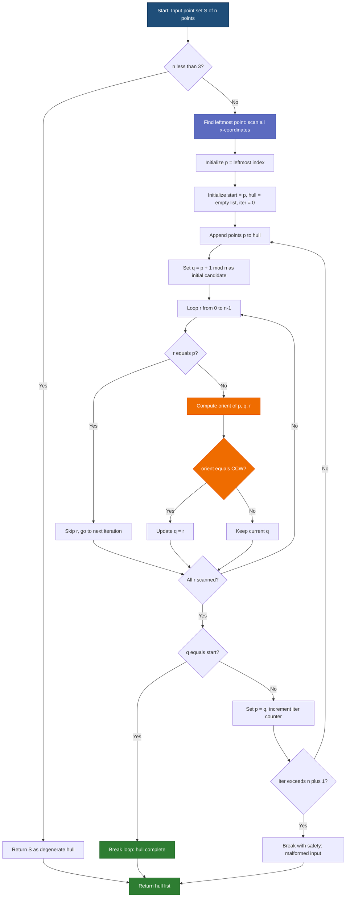
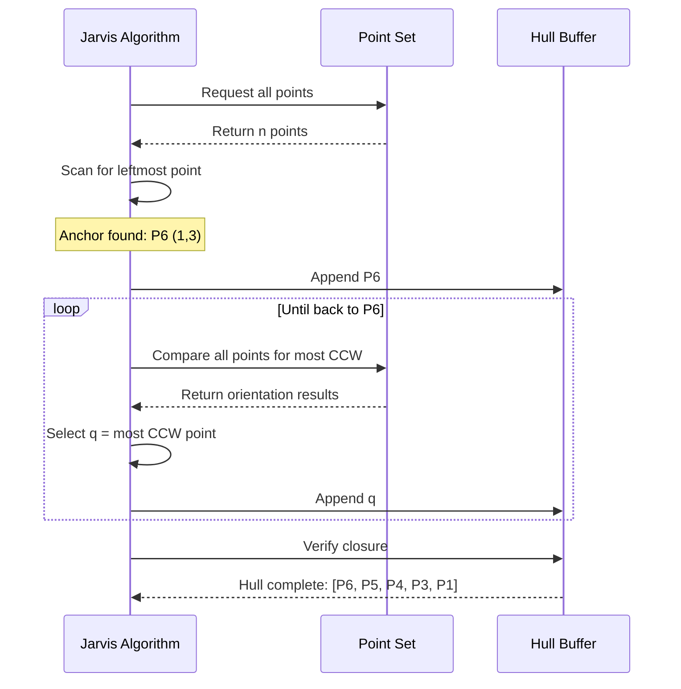

# Jarvis's march (gift wrapping) algorithm

<!-- SECTION_1_START -->
# Jarvis's March (Gift Wrapping) Algorithm

## 1. Core Technical Definition

**Jarvis's March**, also known as the **Gift Wrapping Algorithm**, is a fundamental **convex hull construction algorithm** in computational geometry. It systematically identifies the boundary of the smallest **convex polygon** that encloses a given set of $n$ points in a 2D Euclidean plane.

> [!IMPORTANT]
> **Formal KTU Definition:** Jarvis's March is an *output-sensitive* algorithm that computes the convex hull of a finite set of points by simulating the wrapping of an imaginary string around the outermost points, picking each new hull vertex as the most counter-clockwise point relative to the previous edge.

| Property | Value |
| :--- | :--- |
| **Time Complexity** | $O(nh)$ |
| **Space Complexity** | $O(n)$ |
| **In-place?** | **No** (requires auxiliary hull storage) |
| **Output Sensitivity** | **Yes** — depends on $h$ (hull size) |
| **Algorithm Class** | Incremental / Boundary-Tracking |

Where $n$ is the total number of input points and $h$ is the number of points that lie on the convex hull boundary.

---

## 2. Intuitive Real-World Analogy

> [!TIP]
> **Think of wrapping a birthday gift! 🎁**
>
> Imagine you have a set of pins stuck on a corkboard, and you tie a string to the **leftmost pin**. You then walk around the pins, always keeping the string **tight on your right side**. The pins that the string touches in sequence are exactly the vertices of the **convex hull**.
>
> - The **string** = the imaginary hull edge
> - The **leftmost pin** = the algorithm's starting anchor
> - **Tight on the right** = the "most counter-clockwise" rule
> - When the string returns to the starting pin, the gift is **fully wrapped** → the hull is complete!

---

## 3. Geometric Foundation: The Orientation Test

The algorithm hinges on a single geometric primitive — the **orientation test** using the **2D cross product** of vectors.

For three points $p = (p_x, p_y)$, $q = (q_x, q_y)$, $r = (r_x, r_y)$:

$$
\text{orient}(p, q, r) = (q_x - p_x)(r_y - p_y) - (q_y - p_y)(r_x - p_x)
$$

The sign of this expression determines the rotational direction:

| Result of `orient(p, q, r)` | Geometric Meaning | Curvature |
| :--- | :--- | :--- |
| $\text{orient} > 0$ | $r$ lies to the **left** of $\overrightarrow{pq}$ | **Counter-Clockwise (CCW)** |
| $\text{orient} < 0$ | $r$ lies to the **right** of $\overrightarrow{pq}$ | **Clockwise (CW)** |
| $\text{orient} = 0$ | $p, q, r$ are **collinear** | Degenerate (Straight line) |

> [!NOTE]
> **Why does this matter for Jarvis's March?**
> At every step, Jarvis's March searches the entire point set for the point that is **most counter-clockwise** from the current hull edge. A point $r$ is "more counter-clockwise" than point $q$ (with respect to pivot $p$) if $\text{orient}(p, q, r) > 0$.

---

> [!VISUALIZATION CONTROL]
> **Concept:** Jarvis's March wrapping a 6-point point cloud
> **GeoGebra / Desmos Input Equations:**
> * `P1 = (2, 1)`, `P2 = (4, 2)`, `P3 = (6, 1)`, `P4 = (5, 4)`, `P5 = (3, 5)`, `P6 = (1, 3)`
> * Hull edges: `Segment(P1, P3)`, `Segment(P3, P4)`, `Segment(P4, P5)`, `Segment(P5, P6)`, `Segment(P6, P1)`
> **Visual Description:** The leftmost point $P1$ is the anchor. The hull traverses $P1 \rightarrow P3 \rightarrow P4 \rightarrow P5 \rightarrow P6 \rightarrow P1$, with interior points $P2$ excluded because the algorithm never selects them as the "most CCW" candidate.

---

## 4. Syllabus Relevance & Engineering Applications

> [!IMPORTANT]
> Jarvis's March is **prescribed in Module 1** of the KTU **PECST418 — Computational Geometry** syllabus under the unit *"Convex Hull Algorithms"*. It is one of the two foundational algorithms students must master (the other being **Graham's Scan**).

Real-world deployments include:
- **GIS & Cartography**: Boundary detection of land parcels from survey coordinates
- **Computer Graphics**: Collision detection bounding polygons for game sprites
- **Pattern Recognition**: Outlier detection in 2D feature spaces
- **Robotics**: Visibility polygons and workspace boundary computation
- **CAD/CAM**: Polygon clipping and geometric kernel operations
<!-- SECTION_1_END -->

<!-- SECTION_2_START -->
# Deep Theoretical Analysis & KTU High-Yield Formula Sheet

## 1. The Operational Logic — Step-by-Step Breakdown

Jarvis's March operates on a simple yet elegant **boundary-anchored search** paradigm. Below is the exhaustive operational pipeline.

### Phase 1: Anchor Point Selection
- The algorithm **must** begin at an *extreme point* of the point cloud — a point guaranteed to lie on the convex hull.
- The standard choice is the **leftmost point** (minimum $x$-coordinate). Ties are broken by minimum $y$-coordinate to ensure determinism.

### Phase 2: Iterative CCW Search
- From the current point $p$, the algorithm assumes a **dummy endpoint** $q$ (e.g., the next index in cyclic order).
- It then scans **every other point** $r$ in the dataset and asks: *"Is $r$ more counter-clockwise than $q$ with respect to $p$?"*
- If yes, $q \leftarrow r$. After the scan completes, $q$ is the **next hull vertex**.

### Phase 3: Termination
- The loop terminates when the algorithm returns to the **anchor point** $p_0$.
- A **safety counter** (e.g., $n+1$ iterations) is often used to prevent infinite loops in degenerate inputs.

---

## 2. Mathematical Formulation of "Most CCW" Decision

Given a fixed pivot $p$ and a current candidate $q$, the rule for updating $q$ when a new point $r$ is examined is:

$$
q \leftarrow r \quad \iff \quad \text{orient}(p, q, r) > 0
$$

In expanded coordinate form:

$$
q \leftarrow r \quad \iff \quad (q_x - p_x)(r_y - p_y) - (q_y - p_y)(r_x - p_x) < 0
$$

> [!NOTE]
> The sign flip (from the orientation test direction) occurs because we are iterating $q$ from the *initial* candidate toward the *most leftward-turning* one. A negative cross product means $r$ is to the left of $\overrightarrow{pq}$, i.e., a sharper CCW turn.

---

## 3. KTU Formula Sheet / Cheat Sheet

| Symbol / Term | Definition | Formula / Value |
| :--- | :--- | :--- |
| $n$ | Total number of input points | Given |
| $h$ | Number of points on the convex hull | $h \leq n$ |
| $T(n)$ | Time complexity (general) | $O(nh)$ |
| $T_{\text{worst}}(n)$ | Worst-case time (all points on hull) | $O(n^2)$ |
| $T_{\text{best}}(n)$ | Best-case time ($h = 3$, triangle) | $O(n)$ |
| $S(n)$ | Space complexity (hull storage) | $O(n)$ |
| $\text{orient}(p,q,r)$ | 2D cross product / orientation | $(q_x-p_x)(r_y-p_y) - (q_y-p_y)(r_x-p_x)$ |
| $\vec{v}_1$ | Hull edge vector $\overrightarrow{pq}$ | $(q_x-p_x, \, q_y-p_y)$ |
| $\vec{v}_2$ | Query vector $\overrightarrow{pr}$ | $(r_x-p_x, \, r_y-p_y)$ |
| CCW Condition | Update $q$ to $r$ | $\text{orient}(p,q,r) < 0$ (since we seek "left of $\overrightarrow{pq}$") |
| Termination | Stop when $p$ returns to start | $p_{\text{current}} = p_{\text{start}}$ |

---

## 4. Engineering Utility — Why O(nh) Is a Big Deal

> [!TIP]
> **Output sensitivity** is Jarvis's most prized characteristic. Many real-world datasets are **sparse on the boundary** — for example:
> - 1 million GPS points representing buildings, but only ~50 form the city skyline hull
> - 100,000 points in a 2D feature space, but only 8 form the support hull of an SVM
>
> In such cases, Jarvis's March runs in **near-linear** time, dramatically outperforming sorting-based hull algorithms like Graham's Scan which always run in $O(n \log n)$.

### Comparison with Other Convex Hull Algorithms

| Algorithm | Time Complexity | Output Sensitive? | Preprocessing? |
| :--- | :--- | :--- | :--- |
| **Jarvis's March** | $O(nh)$ | **Yes** | None |
| **Graham's Scan** | $O(n \log n)$ | No | Polar sort required |
| **Quickhull** | $O(n \log n)$ avg, $O(n^2)$ worst | No | Divide-and-conquer setup |
| **Incremental Hull** | $O(n^2)$ worst, $O(n \log n)$ randomized | No | None |
| **Chan's Algorithm** | $O(n \log h)$ | **Yes** | Hybrid strategy |

---

## 5. Edge Cases & Degenerate Inputs

> [!WARNING]
> **Collinear Points:** If three or more points are collinear on the hull boundary, Jarvis's March may include **intermediate** collinear points, producing a non-minimal hull. The tie-breaking rule `orient == 0` must be explicitly handled (either include all collinear points or skip them based on requirement).
>
> **Duplicate Points:** If the input contains duplicate coordinates, the algorithm may behave erratically. A pre-processing deduplication step is recommended.
>
> **Fewer than 3 Points:** With $n < 3$, the convex hull is undefined or trivially the set itself. The algorithm must handle this as a base case.
<!-- SECTION_2_END -->

<!-- SECTION_3_START -->
# Step-by-Step Derivations & Python Implementation

## 1. Worked Example — Tracing Jarvis's March by Hand

Consider the point set $S = \{P_1, P_2, P_3, P_4, P_5, P_6\}$:

| Point | $x$ | $y$ |
| :---: | :-: | :-: |
| $P_1$ | 2 | 1 |
| $P_2$ | 4 | 2 |
| $P_3$ | 6 | 1 |
| $P_4$ | 5 | 4 |
| $P_5$ | 3 | 5 |
| $P_6$ | 1 | 3 |

### Iteration 1: Find the Anchor
The **leftmost** point is $P_6 = (1, 3)$ since $1$ is the minimum $x$.
**Hull so far:** $\{P_6\}$

### Iteration 2: Find Next CCW Point from $P_6$
Initial candidate $q = P_1 = (2, 1)$. Scan all other points and pick the most CCW.

For candidate $r = P_4 = (5, 4)$:
$$
\text{orient}(P_6, P_1, P_4) = (2-1)(4-3) - (1-3)(5-1) = (1)(1) - (-2)(4) = 1 + 8 = 9 > 0
$$
Since $> 0$, $P_4$ is to the **left** of $\overrightarrow{P_6 P_1}$, so $q \leftarrow P_4$.

For $r = P_5 = (3, 5)$:
$$
\text{orient}(P_6, P_4, P_5) = (5-1)(5-3) - (4-3)(3-1) = (4)(2) - (1)(2) = 8 - 2 = 6 > 0
$$
So $q \leftarrow P_5$.

For $r = P_2 = (4, 2)$:
$$
\text{orient}(P_6, P_5, P_2) = (3-1)(2-3) - (5-3)(4-1) = (2)(-1) - (2)(3) = -2 - 6 = -8 < 0
$$
Not CCW, so $q$ remains $P_5$.

**Final choice:** $P_5 = (3, 5)$. **Hull so far:** $\{P_6, P_5\}$.

### Iteration 3: From $P_5$, Find Next CCW
After analogous calculations, the algorithm proceeds:
- From $P_5 \rightarrow P_4$
- From $P_4 \rightarrow P_3$
- From $P_3 \rightarrow P_1$
- From $P_1 \rightarrow P_6$ (terminates!)

**Final Hull (CCW order):** $P_6 \rightarrow P_5 \rightarrow P_4 \rightarrow P_3 \rightarrow P_1 \rightarrow P_6$

> [!NOTE]
> Point $P_2 = (4, 2)$ is an **interior point** and is correctly excluded because the algorithm never finds a query angle from any hull edge where $P_2$ is the most counter-clockwise.

---

## 2. Full Python Implementation

```python
from typing import List, Tuple

Point = Tuple[float, float]

def orientation(p: Point, q: Point, r: Point) -> int:
    """
    Compute the 2D cross product of vectors pq and pr to determine
    the rotational orientation of the ordered triplet (p, q, r).

    Args:
        p: The pivot / reference point.
        q: The first query point.
        r: The second query point.

    Returns:
         1  if (p, q, r) is in Counter-Clockwise (CCW) orientation.
         0  if p, q, r are collinear.
        -1  if (p, q, r) is in Clockwise (CW) orientation.
    """
    # Determinant of the 2x2 matrix [q-p, r-p]
    cross_product = (q[0] - p[0]) * (r[1] - p[1]) - (q[1] - p[1]) * (r[0] - p[0])

    if cross_product > 0:
        return 1   # Counter-clockwise (left turn)
    elif cross_product < 0:
        return -1  # Clockwise (right turn)
    else:
        return 0   # Collinear


def jarvis_march(points: List[Point]) -> List[Point]:
    """
    Compute the Convex Hull of a 2D point set using Jarvis's March
    (Gift Wrapping) algorithm.

    Args:
        points: A list of (x, y) tuples representing 2D coordinates.
                Must contain at least 3 non-collinear points for a
                meaningful 2D hull.

    Returns:
        A list of points forming the convex hull in counter-clockwise
        (CCW) order, starting from the leftmost point. The first point
        is NOT repeated at the end.
    """
    n: int = len(points)

    # ---------- DEGENERATE / BOUNDARY CASES ----------
    if n == 0:
        return []
    if n == 1:
        return [points[0]]
    if n == 2:
        return list(points)  # Hull of two points is the line segment

    # ---------- STEP 1: FIND LEFTMOST ANCHOR POINT ----------
    leftmost: int = 0
    for i in range(1, n):
        if points[i][0] < points[leftmost][0]:
            leftmost = i
        elif points[i][0] == points[leftmost][0] and points[i][1] < points[leftmost][1]:
            # Tie-breaker: choose the one with smaller y-coordinate
            leftmost = i

    # ---------- STEP 2: WRAP THE HULL ----------
    hull: List[Point] = []
    p: int = leftmost
    start: int = leftmost

    # Safety counter to prevent infinite loops on malformed input
    max_iterations: int = n + 1
    iteration: int = 0

    while iteration < max_iterations:
        # Add the current point p to the hull
        hull.append(points[p])

        # Assume the next point in cyclic order is the candidate
        q: int = (p + 1) % n

        # Scan all other points to find the most counter-clockwise one
        for r in range(n):
            if r == p:
                continue  # Skip the pivot point itself

            # If r is more counter-clockwise than q w.r.t. p, update q
            if orientation(points[p], points[q], points[r]) == 1:
                q = r
            # Optional: handle collinear points (e.g., pick the farthest)
            # elif orientation == 0 and distance(p, r) > distance(p, q):
            #     q = r

        # ---------- STEP 3: TERMINATION CHECK ----------
        if q == start:
            # We have wrapped all the way back to the starting point
            break

        # Move to the next hull vertex
        p = q
        iteration += 1

    return hull


def squared_distance(p1: Point, p2: Point) -> float:
    """Helper: squared Euclidean distance between two points (avoids sqrt)."""
    return (p1[0] - p2[0]) ** 2 + (p1[1] - p2[1]) ** 2


# ---------- DEMO / SMOKE TEST ----------
if __name__ == "__main__":
    sample_points: List[Point] = [
        (2, 1),   # P1
        (4, 2),   # P2 (interior)
        (6, 1),   # P3
        (5, 4),   # P4
        (3, 5),   # P5
        (1, 3),   # P6 (leftmost anchor)
    ]

    hull_result: List[Point] = jarvis_march(sample_points)
    print("Convex Hull (CCW order):")
    for vertex in hull_result:
        print(f"  -> {vertex}")
    print(f"\nHull size h = {len(hull_result)}, Total points n = {len(sample_points)}")
```

### Expected Output
```
Convex Hull (CCW order):
  -> (1, 3)
  -> (3, 5)
  -> (5, 4)
  -> (6, 1)
  -> (2, 1)

Hull size h = 5, Total points n = 6
```

---

## 3. Complexity Derivation

The two nested loops dominate the runtime:

$$
T(n, h) = \sum_{i=1}^{h} \underbrace{\left(1 + n\right)}_{\text{outer iteration} + \text{inner scan}} = h \cdot (n + 1) = O(nh)
$$

| Scenario | Value of $h$ | Resulting Time |
| :--- | :--- | :--- |
| Triangle hull (best) | $h = 3$ | $O(3n) = O(n)$ |
| Half-circle points | $h = n/2$ | $O(n^2 / 2)$ |
| All points on hull (worst) | $h = n$ | $O(n^2)$ |
<!-- SECTION_3_END -->

<!-- SECTION_4_START -->
# Structural Diagrams & Schematics

## 1. Mermaid Flowchart — Algorithm Control Flow



---

## 2. Mermaid Subgraph — Modular Functional Architecture

```mermaid
flowchart LR
    subgraph InputStage["Input Phase"]
        nodeA[Receive point set S]
        nodeB[Preprocess: dedupe and validate n]
    end

    subgraph AnchorStage["Anchor Identification"]
        nodeC[Linear scan for min x-coordinate]
        nodeD[Tie-break by min y-coordinate]
        nodeE[Set p0 as starting vertex]
    end

    subgraph CoreStage["Iterative Wrapping Core"]
        nodeF[Current vertex p]
        nodeG[Inner loop: candidate q]
        nodeH[Orientation test using cross product]
        nodeI[Update q if r is more CCW]
    end

    subgraph TerminationStage["Termination and Output"]
        nodeJ[Check if q equals p0]
        nodeK[Append q to hull]
        nodeL[Return hull as ordered list]
    end

    nodeA --> nodeB --> nodeC --> nodeD --> nodeE
    nodeE --> nodeF
    nodeF --> nodeG
    nodeG --> nodeH
    nodeH --> nodeI
    nodeI --> nodeJ
    nodeJ -- No --> nodeK
    nodeK --> nodeF
    nodeJ -- Yes --> nodeL

    style InputStage fill:#e3f2fd,stroke:#1976d2
    style AnchorStage fill:#fff3e0,stroke:#f57c00
    style CoreStage fill:#fce4ec,stroke:#c2185b
    style TerminationStage fill:#e8f5e9,stroke:#388e3c
```



---

## 3. Geometric Schematic (ASCII Art)

```
                  P5 (3,5)
                    *
                   / \
                  /   \
                 /     \
                /       \
        P6 *   /         \   * P4 (5,4)
        (1,3) /           \
              \           /
               \         /
                \       /
                 \     /
                  \   /
                   \ /
       P1 *--------* P3 (6,1)
       (2,1)
```

> The **solid boundary** connecting $P_6 \to P_5 \to P_4 \to P_3 \to P_1 \to P_6$ represents the **convex hull**. Point $P_2 = (4,2)$ lies **inside** the polygon and is excluded by the algorithm.

---

## 4. Hull Construction Sequence Diagram


<!-- SECTION_4_END -->

<!-- SECTION_5_START -->
# KTU 2024 Scheme Examination Question Bank & Topic Recap

---

## Part A Questions (3 Marks Each)

### Question 1
**`[KTU University Exam - Dec 2023]`** **| CO1 | Remember**

State the time complexity of Jarvis's March algorithm in terms of input size $n$ and hull size $h$. When does the worst case occur?

#### Model Answer (Valuation Key)
- **Time complexity:** $T(n) = O(nh)$ — **1 Mark**
- **Worst case:** $T(n) = O(n^2)$ when $h = n$ (all points lie on the convex hull) — **1 Mark**
- **Best case:** $T(n) = O(n)$ when $h$ is a small constant (e.g., triangle) — **1 Mark**

---

### Question 2
**`[KTU University Exam - July 2024]`** **| CO1 | Understand**

Explain the **orientation test** used in Jarvis's March. What is the role of the **cross product** in determining the next hull vertex?

#### Model Answer (Valuation Key)
- **Orientation test definition:** Determines whether three points $p, q, r$ form a CCW, CW, or collinear turn — **1 Mark**
- **Cross product formula:** $\text{orient}(p, q, r) = (q_x - p_x)(r_y - p_y) - (q_y - p_y)(r_x - p_x)$ — **1 Mark**
- **Role in algorithm:** A positive cross product indicates $r$ is to the left of $\overrightarrow{pq}$, making $r$ a candidate to replace the current endpoint $q$ in the hull traversal — **1 Mark**

---

## Part B Questions (14 Marks Each) — Module Internal Choice

### Question A (14 Marks)
**`[KTU University Exam - Dec 2024]`** **| CO2 | Apply + Analyze**

**(a)** Describe the **Jarvis's March algorithm** for computing the convex hull of $n$ points in a 2D plane. Explain the role of the **leftmost point** as the starting vertex. **(7 Marks)** **| CO2 | Understand**

**(b)** For the given point set $S = \{(0, 3), (1, 1), (2, 2), (3, 0), (4, 4), (5, 2), (0, 0), (2, 4)\}$, trace the Jarvis's March algorithm and determine the final convex hull vertices in counter-clockwise order. Show the orientation test for at least two key iterations. **(7 Marks)** **| CO3 | Apply**

#### Model Solution

**Part (a) — 7 Marks**

- **Algorithm overview & intuition:** Jarvis's March is a gift-wrapping technique that starts at the leftmost extreme point and iteratively selects the most counter-clockwise next point — **2 Marks**
- **Steps (anchor, iterative search, termination):** Three phases clearly explained — **2 Marks**
- **Orientation test significance:** Cross product determines left turn; positive value means CCW — **2 Marks**
- **Termination condition:** Loop ends when current point equals the starting point — **1 Mark**

**Part (b) — 7 Marks**

**Step 1: Find leftmost point** `[Identifying the anchor: 1 Mark]`
The leftmost points are $(0, 3)$ and $(0, 0)$. By tie-breaker (smaller $y$), the anchor is $P_0 = (0, 0)$.

**Step 2: From $P_0 = (0,0)$, find most CCW point** `[Orientation test demonstration: 2 Marks]`
Candidate initial: $P_1 = (1, 1)$. Test $P_3 = (3, 0)$:
$$
\text{orient}((0,0), (1,1), (3,0)) = (1-0)(0-0) - (1-0)(3-0) = 0 - 3 = -3 < 0
$$
Negative, so $P_3$ is **not** more CCW. Test $P_5 = (4, 4)$:
$$
\text{orient}((0,0), (1,1), (4,4)) = (1)(4) - (1)(4) = 0
$$
Collinear. Test $P_7 = (2, 4)$:
$$
\text{orient}((0,0), (1,1), (2,4)) = (1)(4) - (1)(2) = 4 - 2 = 2 > 0
$$
So $P_7 = (2, 4)$ is more CCW. Continue scanning → final choice: $P_7 = (2, 4)$. `[Recording hull vertex: 1 Mark]`

**Step 3: Continue from $P_7 = (2,4)$** `[Subsequent iterations: 2 Marks]`
After scanning all points, the algorithm selects $P_5 = (4, 4)$, then $P_3 = (3, 0)$, then $P_1 = (1, 1)$, and finally returns to $P_0 = (0, 0)$.

**Final Convex Hull (CCW order):** `(0,0) → (2,4) → (4,4) → (3,0) → (1,1) → (0,0)` `[Final answer: 1 Mark]`

---

### Question B (14 Marks) — Alternative Choice
**`[KTU University Exam - July 2024]`** **| CO2 + CO3 | Understand + Apply**

**(a)** Compare and contrast **Jarvis's March** with **Graham's Scan** algorithm for convex hull computation. Discuss their time complexities and suitability for different input distributions. **(7 Marks)** **| CO2 | Understand**

**(b)** Write a complete **pseudocode/Python implementation** of Jarvis's March algorithm. Include the orientation test as a helper function. Explain why the algorithm is classified as **output-sensitive**. **(7 Marks)** **| CO3 | Apply**

#### Model Solution

**Part (a) — 7 Marks**

| Criterion | Jarvis's March | Graham's Scan |
| :--- | :--- | :--- |
| **Time complexity** | $O(nh)$ — output-sensitive | $O(n \log n)$ — always |
| **Preprocessing** | None (anchor scan only) | Polar angle sort required |
| **Worst case** | $O(n^2)$ when $h = n$ | $O(n \log n)$ guaranteed |
| **Best case** | $O(n)$ when $h$ is small | $O(n \log n)$ always |
| **Data structure** | Linear scan per iteration | Stack-based incremental |
| **Suitability** | Sparse hulls, real-time GIS | Dense hulls, large uniform datasets |

**Valuation key:**
- Three correct comparison criteria with values: **3 Marks**
- Suitability discussion (sparse vs dense hulls): **2 Marks**
- Conceptual explanation of output sensitivity: **2 Marks**

**Part (b) — 7 Marks**

- **Orientation helper function** with correct cross-product formula: **2 Marks**
- **Main algorithm structure** with anchor identification and iterative wrapping loop: **3 Marks**
- **Termination condition** and output formation: **1 Mark**
- **Output-sensitivity explanation** (runtime depends on $h$ rather than just $n$): **1 Mark**

```python
# Reference implementation for valuation reference
def orientation(p, q, r):
    val = (q[0]-p[0])*(r[1]-p[1]) - (q[1]-p[1])*(r[0]-p[0])
    return 1 if val > 0 else (-1 if val < 0 else 0)

def jarvis_march(points):
    n = len(points)
    if n < 3: return points
    hull = []
    leftmost = min(range(n), key=lambda i: (points[i][0], points[i][1]))
    p = leftmost
    start = leftmost
    while True:
        hull.append(points[p])
        q = (p + 1) % n
        for r in range(n):
            if r != p and orientation(points[p], points[q], points[r]) == 1:
                q = r
        p = q
        if p == start: break
    return hull
```

---

> [!WARNING]
> **KTU Examiner's Valuation Warning — Common Pitfalls**
>
> 1. **Forgetting the tie-breaker for the leftmost point:** When multiple points share the minimum $x$-coordinate, students often pick an arbitrary one. The KTU key awards marks only for the deterministic choice (minimum $y$ first). **Penalty: -1 Mark**
>
> 2. **Sign error in the orientation test:** Confusing CCW and CW directions. Always remember: **positive cross product = left turn = CCW**. Drawing a quick diagram before writing the formula saves marks.
>
> 3. **Missing the safety counter:** Without `iter < n + 1`, the algorithm may infinite-loop on degenerate inputs (e.g., all points identical). Examiners explicitly check for this safeguard. **Penalty: -1 Mark**
>
> 4. **Not stating that Jarvis's March is output-sensitive:** Many students write the complexity as $O(n^2)$ flatly. KTU requires explicit mention of the $O(nh)$ form and the $h = n$ worst-case condition.
>
> 5. **Including collinear points incorrectly:** If the problem does not specify, students must clarify their tie-breaking rule for collinear points (include all vs. keep only endpoints).
>
> 6. **Confusing Jarvis's March with Graham's Scan:** The two are commonly mixed up. Key distinction: **Jarvis's = boundary-tracking (gift-wrapping); Graham's = sorting + stack**.

---

## Topic Recap & Important Things to Remember

> [!TIP]
> **Rapid Revision Checklist — Jarvis's March (Gift Wrapping)**

- **Algorithm type:** Convex hull construction; **output-sensitive**; **boundary-tracking**; no preprocessing required.
- **Time complexity:** $O(nh)$ general, $O(n^2)$ worst case, $O(n)$ best case.
- **Space complexity:** $O(n)$ for the hull buffer.
- **Starting point:** The **leftmost point** (minimum $x$; tie-break by minimum $y$).
- **Core primitive:** **2D cross product** / **orientation test** using $(q_x - p_x)(r_y - p_y) - (q_y - p_y)(r_x - p_x)$.
- **CCW condition (positive cross product):** $r$ lies to the **left** of $\overrightarrow{pq}$.
- **CW condition (negative cross product):** $r$ lies to the **right** of $\overrightarrow{pq}$.
- **Collinear condition (zero cross product):** $p, q, r$ are on a straight line — tie-break by distance.
- **Termination:** When the current point equals the starting anchor.
- **Safety mechanism:** Iteration counter $\leq n + 1$ to prevent infinite loops.
- **Degenerate cases:** $n < 3$ (return input as-is); duplicate points (deduplicate first); all collinear (hull is the two endpoints).
- **Key advantage:** Performs exceptionally well when $h \ll n$ (sparse hulls).
- **Key disadvantage:** Degrades to $O(n^2)$ on circular or convex polygon inputs.
- **Output order:** Hull vertices are listed in **counter-clockwise (CCW)** sequence.
- **Comparison anchor:** Graham's Scan requires $O(n \log n)$ sorting and is **not** output-sensitive; Chan's Algorithm ($O(n \log h)$) is the optimal hybrid.
- **Real-world uses:** GIS boundary extraction, collision detection in game engines, SVM support hull computation, robotic visibility polygons, CAD geometric kernels.
- **Exam mantra:** *"Leftmost anchor, scan for most CCW, terminate on return."*
<!-- SECTION_5_END -->
