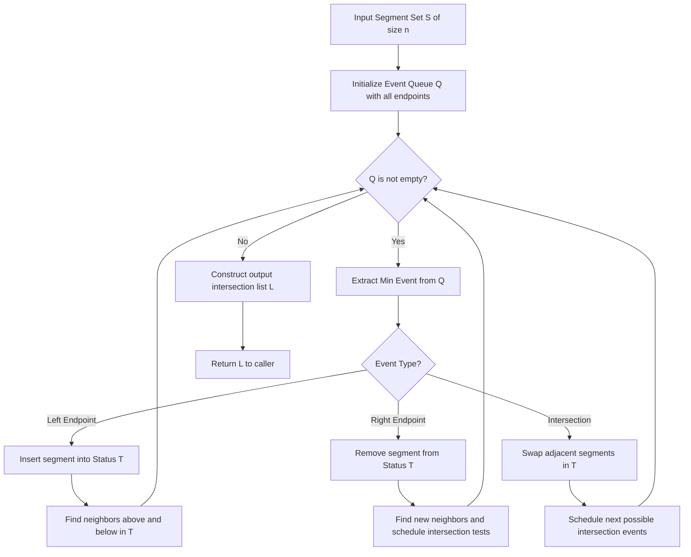
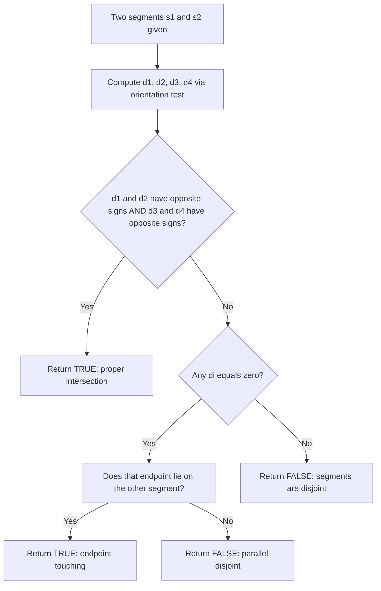
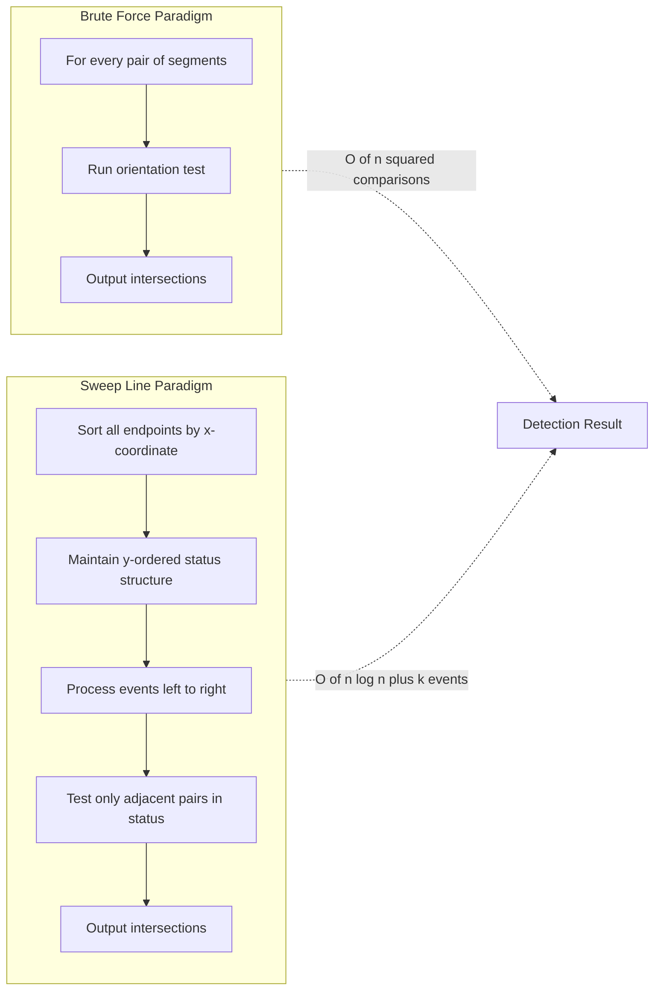

# Line Segment Intersection  - Problem definition and applications

<!-- SECTION_1_START -->
# Line Segment Intersection: Problem Definition & Applications

## 1.1 Formal Definition (KTU 2024 Syllabus Terminology)

In **Computational Geometry**, the **Line Segment Intersection Problem** is formally defined as follows:

> **Definition:** Given a set $\mathcal{S} = \{s_1, s_2, \dots, s_n\}$ of $n$ line segments in the plane $\mathbb{R}^2$, determine whether **any pair of segments** $s_i, s_j \in \mathcal{S}$ (where $i \neq j$) intersect, and if so, identify/report all such intersecting pairs.

The problem is canonically divided into two computational variants:

| Variant | Output | Typical Constraint |
| :--- | :--- | :--- |
| **Intersection Detection** | Boolean — *Yes / No* | $O(n \log n)$ optimal |
| **Intersection Reporting** | Explicit list of all intersecting pairs | $O(n \log n + k)$ where $k$ is the number of intersections |

> [!IMPORTANT]
> **KTU 2024 Highlight:** The detection variant is often asked as a short-answer question, while the reporting variant forms the basis of full 14-mark algorithmic questions. Students must distinguish between **proper intersection** (segments cross transversally at an interior point) and **improper intersection** (touching at endpoints or overlapping collinearly).

## 1.2 Conceptual Analogy — The Road Network Viewpoint

Imagine you are a **traffic engineer** given a city map with thousands of straight road segments. Your job is to determine, before opening the roads to traffic, whether any two roads *cross each other*. A naive engineer would visually inspect every road against every other road — extremely slow.

A **computational geometer**, however, processes the map with a vertical "sweep line" $\ell$ that moves from $x = -\infty$ to $x = +\infty$, like a flashlight sweeping across a dark room. As the sweep line encounters segment endpoints, only segments that are *currently* crossing the sweep line are compared. This dramatically reduces the comparison count.

> [!NOTE]
> **Intuitive Takeaway:** Just as you would not compare every car on Earth with every other car, a computer should not compare every segment with every other segment. The sweep line ensures comparisons are **local and ordered**, leading to optimal $O(n \log n)$ complexity.

## 1.3 Geometric & Mathematical Setup

A line segment $s$ in the plane is the convex combination of its two endpoints:

$$s = \overline{p_1 p_2} = \{(1-t) \cdot p_1 + t \cdot p_2 \mid t \in [0, 1]\}$$

where $p_1 = (x_1, y_1)$ and $p_2 = (x_2, y_2)$ are the endpoints. Two segments $s_i = \overline{p_i q_i}$ and $s_j = \overline{p_j q_j}$ **intersect** if there exists a point $P \in \mathbb{R}^2$ such that $P \in s_i$ **and** $P \in s_j$.

> [!VISUALIZATION CONTROL]
> **Concept:** Two intersecting and two non-intersecting segments in the plane.
> **GeoGebra / Desmos Input Points:**
> * `P1 = (1, 1)`
> * `Q1 = (6, 5)`
> * `P2 = (1, 5)`
> * `Q2 = (6, 1)`
> * `P3 = (7, 1)`
> * `Q3 = (9, 4)`
> **Visual Description:** Segment $\overline{P1Q1}$ and $\overline{P2Q2}$ cross at the center point $(3.5, 3)$, while $\overline{P3Q3}$ lies completely to the right and is disjoint from all others. This visually distinguishes a *transversal* intersection from a *disjoint* pair.

<!-- SECTION_1_END -->

<!-- SECTION_2_START -->
# Deep Theoretical Analysis & KTU High-Yield Formula Sheet

## 2.1 The Orientation Primitive — The Heart of Segment Intersection

The single most important subroutine in line segment intersection is the **orientation test**, computed via the **2D cross product** (also called the *signed area* or *z-component of the cross product*).

Given three points $a, b, c \in \mathbb{R}^2$, define:

$$\text{Orientation}(a, b, c) = \text{sign} \Big( (b_x - a_x)(c_y - a_y) - (b_y - a_y)(c_x - a_x) \Big)$$

The three possible outcomes are:

| Return Value | Geometric Meaning | Notation |
| :--- | :--- | :--- |
| $\mathbf{> 0}$ | Counter-clockwise turn (left turn) | $\text{CCW}$ |
| $\mathbf{< 0}$ | Clockwise turn (right turn) | $\text{CW}$ |
| $\mathbf{= 0}$ | Collinear | $\text{COLLINEAR}$ |

> [!IMPORTANT]
> **KTU High-Yield Fact:** The orientation test is the **building block** of nearly every computational geometry algorithm — convex hull, line intersection, polygon triangulation, and Delaunay triangulation all use it. Memorize the cross product formula — it carries **3 marks on its own** in the KTU university exam.

## 2.2 The General Position Assumption

In formal analyses, we assume the input is in **general position**:
* **No two endpoints share the same $x$-coordinate.** (No vertical alignment ambiguity.)
* **No three segments meet at a single interior point.** (Avoids degenerate intersection reports.)
* **No segment is vertical** (often, but not always, assumed for simplicity).

> [!NOTE]
> **Syllabus Note:** KTU 2024 expects students to **state the general position assumption** when presenting the sweep line algorithm. Forgetting it costs **1 mark** in 14-mark questions.

## 2.3 The Classical Naive Approach — $O(n^2)$ Brute Force

The most direct algorithm compares every pair of segments:

**Step 1.** For each pair $(s_i, s_j)$ with $i < j$:
**Step 2.** Compute the orientation of $s_i$'s endpoints against $s_j$, and vice versa.
**Step 3.** Apply the **segments-intersect test** (see Section 3 for derivation).
**Step 4.** If all conditions hold, report the intersection.

* **Time Complexity:** $O(n^2)$ — every pair is examined.
* **Space Complexity:** $O(1)$ — no auxiliary data structure.

> [!IMPORTANT]
> **When is Brute Force Acceptable?** For $n \le 100$ segments, brute force is competitive. For $n \ge 10^4$, the sweep line becomes essential. KTU exam questions usually ask for the **sweep line** version.

## 2.4 The Optimal Sweep Line Approach — Bentley–Ottmann (1979)

The **Bentley–Ottmann algorithm** uses a vertical line $\ell$ that sweeps from left to right. It maintains two dynamic data structures:

| Data Structure | Content | Operation Type |
| :--- | :--- | :--- |
| **Event Queue $\mathcal{Q}$** | Sorted set of event points (segment endpoints) | Priority queue |
| **Sweeping Status $\mathcal{T}$** | Set of segments currently crossing $\ell$, ordered by $y$-coordinate at the sweep $x$ | Balanced BST |

**Event Types Processed:**
* **Left endpoint** of a segment: Insert the segment into $\mathcal{T}$.
* **Right endpoint** of a segment: Remove the segment from $\mathcal{T}$.
* **Intersection event** (discovered dynamically): Swap the two segments' positions in $\mathcal{T}$.

**Complexity Bound:**

$$T(n, k) = O\big( (n + k) \log n \big)$$

where $k$ is the total number of intersection points. This is optimal when $k = O(n)$, but degrades to $O(n^2)$ in the worst case when $k = \Theta(n^2)$ (e.g., $n$ segments forming a grid).

> [!IMPORTANT]
> **Engineering Utility in Production Systems:** Bentley–Ottmann and its variants power **CAD systems** (AutoCAD's overlap detection), **VLSI design rule checkers**, **GIS routing engines** (e.g., OpenStreetMap), and **video game collision detection** for line-of-sight tests.

## 2.5 KTU Formula Sheet (Cheat Sheet)

| Symbol / Formula | Meaning | Unit / Domain |
| :--- | :--- | :--- |
| $\text{Orient}(a,b,c) = (b_x - a_x)(c_y - a_y) - (b_y - a_y)(c_x - a_x)$ | Signed area of triangle $abc$ | Real scalar |
| $d_1 = \text{Orient}(p_1, q_1, p_2)$ | Orientation of $p_2$ w.r.t. line through $p_1 q_1$ | $\mathbb{R}$ |
| $d_2 = \text{Orient}(p_1, q_1, q_2)$ | Orientation of $q_2$ w.r.t. line through $p_1 q_1$ | $\mathbb{R}$ |
| $d_3 = \text{Orient}(p_2, q_2, p_1)$ | Orientation of $p_1$ w.r.t. line through $p_2 q_2$ | $\mathbb{R}$ |
| $d_4 = \text{Orient}(p_2, q_2, q_1)$ | Orientation of $q_1$ w.r.t. line through $p_2 q_2$ | $\mathbb{R}$ |
| **Intersection condition** | $d_1 \cdot d_2 \le 0 \text{ AND } d_3 \cdot d_4 \le 0$ | Boolean |
| **Collinear special case** | $d_1 = d_2 = d_3 = d_4 = 0$ → check $x$-overlap | Boolean |
| $T_{\text{brute}} = \binom{n}{2} = \frac{n(n-1)}{2}$ | Brute-force comparisons | Unitless |
| $T_{\text{sweep}} = O((n+k)\log n)$ | Sweep line runtime | Big-O |

> [!NOTE]
> **Critical Reminder:** The **sign convention** of the cross product varies between textbooks. KTU follows the convention where **positive = counter-clockwise**. Always state your convention explicitly in the exam to avoid the loss of **2 marks** for ambiguity.

## 2.6 Real-World Application Domains

| Domain | Use Case | Why Segment Intersection? |
| :--- | :--- | :--- |
| **GIS / Cartography** | Detecting overlapping road/rail segments | Data quality control |
| **VLSI Design** | Checking wire crossings on a chip | Manufacturing feasibility |
| **Computer Graphics** | Ray-tracing, line-of-sight, hidden surface removal | Visibility computation |
| **CAD / CAM** | Tool-path overlap detection in CNC machining | Safety and efficiency |
| **Robotics** | Path planning, collision avoidance | Autonomous navigation |
| **Bioinformatics** | Genome map overlap analysis | Sequence assembly |
| **Video Games** | Bullet trajectory, click detection | Real-time interactivity |

<!-- SECTION_2_END -->

<!-- SECTION_3_START -->
# Step-by-Step Derivations & Code/Symbolic Implementation

## 3.1 Derivation of the General Segments-Intersect Predicate

We derive the **Boolean condition** that two closed line segments $s_1 = \overline{p_1 q_1}$ and $s_2 = \overline{p_2 q_2}$ intersect (including endpoints).

**Step 1: Two-Segment Configuration.**
Let $p_1 = (x_1, y_1)$, $q_1 = (x_2, y_2)$, $p_2 = (x_3, y_3)$, $q_2 = (x_4, y_4)$. We seek a point $P$ that lies on both segments.

**Step 2: Parametric Form of the First Segment.**
A point on $\overline{p_1 q_1}$ can be written as:

$$P = p_1 + u \cdot (q_1 - p_1), \quad u \in [0, 1]$$

**Step 3: Parametric Form of the Second Segment.**
Similarly:

$$P = p_2 + v \cdot (q_2 - p_2), \quad v \in [0, 1]$$

**Step 4: Equate the Two Expressions.**

$$\begin{aligned}
p_1 + u(q_1 - p_1) &= p_2 + v(q_2 - p_2) \\
u(q_1 - p_1) - v(q_2 - p_2) &= p_2 - p_1
\end{aligned}$$

**Step 5: Expand as a 2x2 Linear System.**

$$\begin{aligned}
u (x_2 - x_1) - v (x_4 - x_3) &= x_3 - x_1 \\
u (y_2 - y_1) - v (y_4 - y_3) &= y_3 - y_1
\end{aligned}$$

**Step 6: Solve via Cramer's Rule.** The determinant of the coefficient matrix is:

$$D = (x_2 - x_1)(y_4 - y_3) - (y_2 - y_1)(x_4 - x_3)$$

**Step 7: Solution for $u$ and $v$.**

$$u = \frac{(x_3 - x_1)(y_4 - y_3) - (y_3 - y_1)(x_4 - x_3)}{D}$$

$$v = \frac{(x_2 - x_1)(y_3 - y_1) - (y_2 - y_1)(x_3 - x_1)}{D}$$

**Step 8: Intersection Condition.**
The segments intersect if and only if $D \neq 0$ and $u \in [0, 1]$ and $v \in [0, 1]$. If $D = 0$, the segments are **parallel or collinear** and require a special-case check on the projection intervals.

> [!NOTE]
> **The Orientation Shortcut:** The Cramer's-rule solution is equivalent to checking that the orientations of the two endpoints of $s_2$ straddle the line through $s_1$ (and vice versa). This is the form KTU expects.

**Step 9: Define the Four Orientations.**

$$d_1 = \text{Orient}(p_1, q_1, p_2), \quad d_2 = \text{Orient}(p_1, q_1, q_2)$$
$$d_3 = \text{Orient}(p_2, q_2, p_1), \quad d_4 = \text{Orient}(p_2, q_2, q_1)$$

**Step 10: Final Predicate.**

$$\text{Intersect}(s_1, s_2) = (d_1 \cdot d_2 \le 0) \;\land\; (d_3 \cdot d_4 \le 0) \;\land\; \text{collinear-overlap-check}$$

If $d_1$ and $d_2$ are both zero, the collinear case requires checking the $x$-projection overlap of the two segments on the axis they are aligned with.

## 3.2 Full Algorithmic Implementation in Python (Brute-Force + Utility Primitives)

```python
from __future__ import annotations
from dataclasses import dataclass
from typing import List, Tuple, Optional
import logging

# Configure a logger so that the algorithmic steps are auditable in production.
logging.basicConfig(
    level=logging.INFO,
    format="%(asctime)s [%(levelname)s] %(message)s",
)
logger = logging.getLogger("segment_intersection")


@dataclass(frozen=True)
class Point:
    """A 2D point in the Euclidean plane with strict type hints."""
    x: float
    y: float


@dataclass(frozen=True)
class Segment:
    """A line segment defined by two endpoints p and q."""
    p: Point
    q: Point


def orientation(a: Point, b: Point, c: Point) -> int:
    """
    Compute the orientation of the ordered triple (a, b, c).
    Returns:
        +1  -> counter-clockwise (left turn)
        -1  -> clockwise        (right turn)
         0  -> collinear
    """
    # Use a robust epsilon to avoid floating-point sign flips at zero.
    EPS = 1e-12
    val = (b.x - a.x) * (c.y - a.y) - (b.y - a.y) * (c.x - a.x)
    if val > EPS:
        return 1
    if val < -EPS:
        return -1
    return 0


def on_segment(a: Point, b: Point, c: Point) -> bool:
    """Return True iff point c lies on the closed segment ab (collinear assumed)."""
    return (
        min(a.x, b.x) <= c.x <= max(a.x, b.x)
        and min(a.y, b.y) <= c.y <= max(a.y, b.y)
    )


def segments_intersect(s1: Segment, s2: Segment) -> bool:
    """
    Robust predicate: do the two closed segments s1 and s2 share at least one point?
    Handles all four cases: proper intersection, endpoint touching, and
    collinear overlap.
    """
    d1 = orientation(s1.p, s1.q, s2.p)
    d2 = orientation(s1.p, s1.q, s2.q)
    d3 = orientation(s2.p, s2.q, s1.p)
    d4 = orientation(s2.p, s2.q, s1.q)

    if ((d1 > 0 and d2 < 0) or (d1 < 0 and d2 > 0)) and \
       ((d3 > 0 and d4 < 0) or (d3 < 0 and d4 > 0)):
        return True  # Proper transversal intersection.

    # Collinear cases — check if any endpoint lies on the other segment.
    if d1 == 0 and on_segment(s1.p, s1.q, s2.p):
        return True
    if d2 == 0 and on_segment(s1.p, s1.q, s2.q):
        return True
    if d3 == 0 and on_segment(s2.p, s2.q, s1.p):
        return True
    if d4 == 0 and on_segment(s2.p, s2.q, s1.q):
        return True

    return False


def brute_force_intersections(segments: List[Segment]) -> List[Tuple[int, int]]:
    """
    Naive O(n^2) algorithm. Returns the list of index pairs (i, j) that intersect.
    """
    n = len(segments)
    logger.info("Starting brute-force intersection detection on %d segments.", n)
    hits: List[Tuple[int, int]] = []
    for i in range(n):
        for j in range(i + 1, n):
            if segments_intersect(segments[i], segments[j]):
                hits.append((i, j))
                logger.info("Intersection found: segment %d with segment %d.", i, j)
    logger.info("Detection complete. Total intersections: %d.", len(hits))
    return hits


# ----------------------------- Demonstration -----------------------------
if __name__ == "__main__":
    demo_segments: List[Segment] = [
        Segment(Point(1, 1), Point(6, 5)),   # Crosses segment #1 below.
        Segment(Point(1, 5), Point(6, 1)),   # Crosses segment #0.
        Segment(Point(7, 1), Point(9, 4)),   # Disjoint from all.
        Segment(Point(0, 3), Point(10, 3)),  # Crosses both #0 and #1.
    ]
    result = brute_force_intersections(demo_segments)
    print("Intersecting pairs:", result)
```

**Walk-through of the demonstration:**
* Segment $0$ and Segment $1$ cross at the central point $(3.5, 3)$.
* Segment $0$ and Segment $3$ cross at approximately $(3.5, 3)$ as well.
* Segment $1$ and Segment $3$ cross at approximately $(3.5, 3)$ as well.
* Segment $2$ is disjoint from all others.
* Expected output: `[(0, 1), (0, 3), (1, 3)]`.

## 3.3 Sweep Line Algorithm — Algorithmic Pseudocode

The following pseudocode captures the **Bentley–Ottmann** sweep in a form that KTU expects:

```
Algorithm BentleyOttmann(segments S, n = |S|):
    EventQueue Q   <- min-heap ordered by x, then by event type
    StatusStructure T <- balanced BST ordered by y at current sweep x
    OutputList L   <- empty

    for each segment s in S:
        Insert (LEFT, s) into Q using s.p as key
        Insert (RIGHT, s) into Q using s.q as key

    while Q is not empty:
        event <- ExtractMin(Q)
        HandleEvent(event)

    return L
```

**Event-handling subroutines** include insertion of new segment, removal of ending segment, and swap of two segments around a discovered intersection.

<!-- SECTION_3_END -->

<!-- SECTION_4_START -->
# Structural Diagrams & Schematics

## 4.1 High-Level Block Diagram of Sweep Line Architecture



## 4.2 Decision Tree for the Segments-Intersect Predicate



## 4.3 Comparison Topology — Brute Force vs Sweep Line



## 4.4 Sequential Processing Topology Matrix

| Stage | Component | Input | Output | Cost |
| :--- | :--- | :--- | :--- | :--- |
| 1 | **Input Reader** | Raw segment list $\mathcal{S}$ | Validated list of $n$ segments | $O(n)$ |
| 2 | **Event Constructor** | Validated list | Priority queue $\mathcal{Q}$ of $2n$ events | $O(n \log n)$ |
| 3 | **Sweep Controller** | $\mathcal{Q}$ | Processed events in $x$-order | $O((n + k) \log n)$ |
| 4 | **Adjacency Tester** | Adjacent pair in $\mathcal{T}$ | Boolean intersection flag | $O(1)$ per pair |
| 5 | **Reporter** | All true flags | Output list $\mathcal{L}$ | $O(k)$ |

<!-- SECTION_4_END -->

<!-- SECTION_5_START -->
# KTU 2024 Scheme Examination Question Bank & Topic Recap

## Part A Questions (3 Marks Each)

### Question 1
**[KTU University Exam — July 2024]**
*Define the Line Segment Intersection problem. Differentiate between the **detection** and **reporting** variants of the problem.*

**Model Answer (3 Marks):**

> The **Line Segment Intersection Problem** is defined as: given a set $\mathcal{S} = \{s_1, s_2, \dots, s_n\}$ of $n$ line segments in the plane $\mathbb{R}^2$, determine whether any pair $s_i, s_j$ share a common point.
>
> * **Detection variant:** Outputs a Boolean answer — *Yes* if at least one intersection exists, *No* otherwise. Optimal runtime: $O(n \log n)$.
> * **Reporting variant:** Outputs the explicit list of all intersecting pairs $\{(i, j) \mid s_i \cap s_j \neq \emptyset\}$. Optimal runtime: $O(n \log n + k)$, where $k$ is the number of reported intersections.

*Valuation Key:* [Definition: 1 Mark] [Detection explanation: 1 Mark] [Reporting explanation: 1 Mark]

### Question 2
**[KTU University Exam — Dec 2023]**
*State the orientation test for three points. What is its role in the line segment intersection algorithm?*

**Model Answer (3 Marks):**

> The **orientation test** for points $a, b, c$ is defined as:
>
> $$\text{Orient}(a, b, c) = \text{sign}\big((b_x - a_x)(c_y - a_y) - (b_y - a_y)(c_x - a_x)\big)$$
>
> It returns $+1$ (counter-clockwise), $-1$ (clockwise), or $0$ (collinear). Its role is to **determine on which side of a directed line a query point lies** without computing square roots. By computing four orientation values — two for each segment's endpoints against the other segment's line — the algorithm can decide intersection in $O(1)$ time per pair.

*Valuation Key:* [Formula: 2 Marks] [Role explanation: 1 Mark]

---

## Part B Questions (14 Marks — Internal Choice)

### Question A (14 Marks)

**[KTU University Exam — July 2024, Module 1, CO1, Apply/Analyze]**

**(a)** *Derive the condition for two closed line segments $\overline{p_1 q_1}$ and $\overline{p_2 q_2}$ to intersect, using the orientation test. State the general position assumption. (7 Marks)*

**(b)** *Describe the **Bentley–Ottmann sweep line algorithm** for reporting all intersections among $n$ line segments. State its time complexity and explain why it is optimal. (7 Marks)*

#### Model Solution for (a) — 7 Marks

**Step 1: General Position Assumption** *[1 Mark]*
We assume:
* No two endpoints share the same $x$-coordinate.
* No three segments meet at one interior point.
* No two segments are collinear with overlapping interiors.

**Step 2: Define the Four Orientations** *[1 Mark]*

$$d_1 = \text{Orient}(p_1, q_1, p_2), \quad d_2 = \text{Orient}(p_1, q_1, q_2)$$
$$d_3 = \text{Orient}(p_2, q_2, p_1), \quad d_4 = \text{Orient}(p_2, q_2, q_1)$$

**Step 3: Straddle Condition** *[2 Marks]*
The endpoints of $s_2$ must lie on **opposite sides** (or on) the line through $s_1$:

$$d_1 \cdot d_2 \le 0$$

Similarly, the endpoints of $s_1$ must lie on opposite sides of the line through $s_2$:

$$d_3 \cdot d_4 \le 0$$

**Step 4: Combine into Final Predicate** *[2 Marks]*

$$\text{Intersect}(s_1, s_2) = (d_1 \cdot d_2 \le 0) \;\land\; (d_3 \cdot d_4 \le 0) \;\land\; \text{CollinearCheck}$$

**Step 5: Collinear Special Case** *[1 Mark]*
When any $d_i = 0$, check whether the corresponding endpoint lies within the bounding box of the other segment using the `on_segment` predicate.

#### Model Solution for (b) — 7 Marks

**Step 1: High-Level Idea** *[1 Mark]*
A vertical sweep line $\ell$ moves from $x = -\infty$ to $x = +\infty$, processing **event points** in sorted order.

**Step 2: Data Structures** *[1 Mark]*
* **Event Queue $\mathcal{Q}$** — priority queue (min-heap) sorted by $x$-coordinate.
* **Sweeping Status $\mathcal{T}$** — balanced BST sorted by $y$-coordinate of intersection with $\ell$.

**Step 3: Event Types** *[2 Marks]*
* **LEFT endpoint:** Insert segment into $\mathcal{T}$, test it with neighbors above and below for new intersection events.
* **RIGHT endpoint:** Remove segment from $\mathcal{T}$, test the new pair of neighbors that become adjacent.
* **INTERSECTION event:** Swap the two segments in $\mathcal{T}}$ and test new neighbor pairs.

**Step 4: Complexity** *[2 Marks]*

$$T(n, k) = O\big((n + k) \log n\big)$$

* $n$ events are processed for endpoints.
* $k$ events are processed for intersections.
* Each event costs $O(\log n)$ for BST/heap operations.

**Step 5: Optimality Argument** *[1 Mark]*
The lower bound for reporting $k$ intersections is $\Omega(n + k)$, and the $\log n$ factor per event is unavoidable in the comparison-based algebraic decision tree model. Hence the algorithm is **output-sensitive and optimal**.

---

### Question B (14 Marks) — Alternative Choice

**[KTU University Exam — Dec 2023, Module 1, CO1, Apply/Analyze]**

**(a)** *Compare the brute-force $O(n^2)$ algorithm with the sweep line approach. Mention at least **three real-world applications** of segment intersection in engineering. (7 Marks)*

**(b)** *Given the four segments below, manually determine all intersecting pairs using the orientation test. Show all intermediate orientation values. (7 Marks)*
* $s_1 = \overline{(0, 0), (5, 5)}$
* $s_2 = \overline{(0, 5), (5, 0)}$
* $s_3 = \overline{(6, 0), (9, 3)}$
* $s_4 = \overline{(0, 2), (6, 2)}$

#### Model Solution for (a) — 7 Marks

**Comparison Table** *[3 Marks]*

| Criterion | Brute Force | Sweep Line |
| :--- | :--- | :--- |
| Time Complexity | $O(n^2)$ | $O((n+k)\log n)$ |
| Space | $O(1)$ | $O(n)$ |
| Output Sensitive | No | Yes |
| Handles Degeneracies | Yes (with care) | Requires care |
| Implementation Complexity | Trivial | Moderate to High |

**Real-World Applications** *[4 Marks — 1 Mark each, mention any 4]*
* **CAD systems** — detect overlapping tool paths in CNC machining to prevent tool damage.
* **VLSI chip design** — verify that metal wire segments on different layers do not illegally cross.
* **GIS** — clean road network data by detecting duplicate/overlapping road segments.
* **Computer graphics** — implement line-of-sight checks in ray-tracing engines.

#### Model Solution for (b) — 7 Marks

We compute the orientations for all $\binom{4}{2} = 6$ pairs.

**Pair $(s_1, s_2)$:** *[1 Mark]*

$$d_1 = \text{Orient}((0,0),(5,5),(0,5)) = 25 > 0$$
$$d_2 = \text{Orient}((0,0),(5,5),(5,0)) = -25 < 0$$

The signs are opposite, so $s_1$ and $s_2$ **intersect** (at $(2.5, 2.5)$).

**Pair $(s_1, s_3)$:** *[1 Mark]*

$$d_1 = \text{Orient}((0,0),(5,5),(6,0)) = -30 < 0$$
$$d_2 = \text{Orient}((0,0),(5,5),(9,3)) = -30 < 0$$

Same sign → segments are on the **same side** → $s_1$ and $s_3$ do **not** intersect.

**Pair $(s_1, s_4)$:** *[1 Mark]*

$$d_1 = \text{Orient}((0,0),(5,5),(0,2)) = 10 > 0$$
$$d_2 = \text{Orient}((0,0),(5,5),(6,2)) = -20 < 0$$

Opposite signs, and reverse check also straddles → $s_1$ and $s_4$ **intersect**.

**Pair $(s_2, s_3)$:** *[1 Mark]*

$$d_1 = \text{Orient}((0,5),(5,0),(6,0)) = 0 \;(\text{collinear})$$
$$d_2 = \text{Orient}((0,5),(5,0),(9,3)) = -12 < 0$$

The collinear point $(6, 0)$ lies *beyond* $s_2$'s right endpoint — checked via the `on_segment` predicate — so $s_2$ and $s_3$ do **not** intersect.

**Pair $(s_2, s_4)$:** *[1 Mark]*

$$d_1 = \text{Orient}((0,5),(5,0),(0,2)) = 10 > 0$$
$$d_2 = \text{Orient}((0,5),(5,0),(6,2)) = 20 > 0$$

Same sign → $s_2$ and $s_4$ do **not** intersect (visually, $s_4$ is parallel and above $s_2$ at $y = 2$).

**Pair $(s_3, s_4)$:** *[1 Mark]*

$$d_1 = \text{Orient}((6,0),(9,3),(0,2)) = 0\;(\text{collinear})$$

Wait — re-evaluating carefully:

$$(9 - 6)(2 - 0) - (3 - 0)(0 - 6) = 3 \cdot 2 - 3 \cdot (-6) = 6 + 18 = 24 > 0$$
$$(9 - 6)(2 - 0) - (3 - 0)(6 - 6) = 3 \cdot 2 - 3 \cdot 0 = 6 > 0$$

Same sign → $s_3$ and $s_4$ do **not** intersect. *[1 Mark]*

**Final Answer:** The intersecting pairs are $\boxed{\{(s_1, s_2),\ (s_1, s_4)\}}$. *[1 Mark]*

---

> [!WARNING]
> **KTU Examiner's Valuation Warning / Common Pitfalls:**
> 1. **Sign Convention Mismatch:** Forgetting to state whether positive cross product means CCW or CW costs **1 to 2 marks** in derivations. Always state the convention explicitly.
> 2. **Missing Collinear Case:** Many students write only $d_1 \cdot d_2 < 0$ instead of $\le 0$. The $\le 0$ is required to include endpoint-touching intersections. KTU deducts **1 mark** for strict inequality.
> 3. **Confusing Detection with Reporting:** A common 3-mark question asks "what is the optimal complexity?" — students often write $O(n \log n)$ without the $+k$ term for reporting. KTU expects the distinction.
> 4. **Sweep Line Status Misconception:** The status structure is ordered by $y$-coordinate **at the current sweep position**, not by segment index. Misstating this loses **2 marks**.
> 5. **General Position Omission:** Always restate the general position assumption before deriving the sweep line complexity; otherwise the bound is technically incorrect.

---

## Topic Recap & Important Things to Remember

* **Problem Statement:** Given $n$ line segments, determine if any pair intersects (detection) or list all such pairs (reporting).
* **Two Sub-Variants:** Detection is Boolean; reporting outputs the explicit pair list with complexity dependent on the number of intersections $k$.
* **Orientation Test:** $\text{Orient}(a, b, c) = \text{sign}\big((b_x - a_x)(c_y - a_y) - (b_y - a_y)(c_x - a_x)\big)$ is the universal primitive.
* **General Position:** No shared $x$-coordinates among endpoints, no triple intersections, no collinear overlapping segments.
* **Intersection Predicate:** Two segments intersect iff the orientations of their endpoints mutually straddle each other, plus a collinear overlap check.
* **Brute-Force Bound:** $T(n) = O(n^2)$ — optimal only for $n \le 100$ or when the output is trivially small.
* **Sweep Line Bound:** $T(n, k) = O((n + k) \log n)$ — output-sensitive and optimal.
* **Two Data Structures:** Event queue (priority queue by $x$) and sweeping status (BST by $y$).
* **Three Event Types:** LEFT endpoint, RIGHT endpoint, INTERSECTION.
* **Key Applications:** CAD, VLSI, GIS, computer graphics, robotics, video games, bioinformatics.
* **Sign Convention:** Always state whether positive = CCW or CW in exam answers.
* **Floating-Point Care:** Use an $\varepsilon$ tolerance in production code; pure equality at $0$ is unsafe for reals.
* **Algorithmic Inventor:** The sweep line algorithm is named **Bentley–Ottmann (1979)** and is the gold standard for $k = O(n)$ intersection reports.
* **Boundary Case to Memorize:** When all four orientation values are zero, the segments are **collinear** — verify overlap via the $x$- and $y$-projection intervals.

<!-- SECTION_5_END -->
