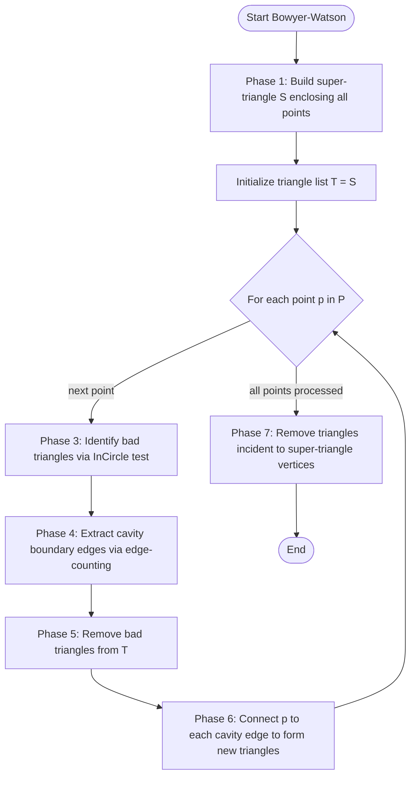
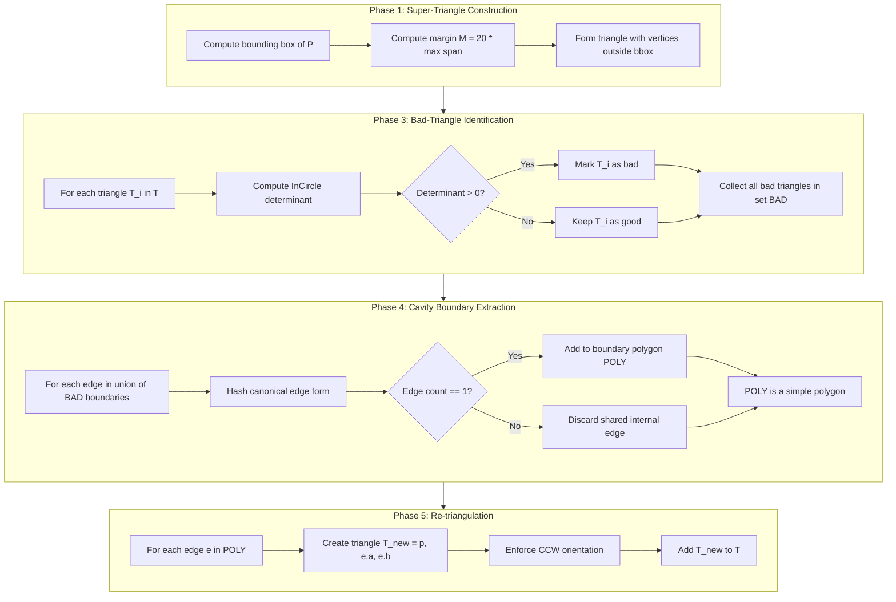
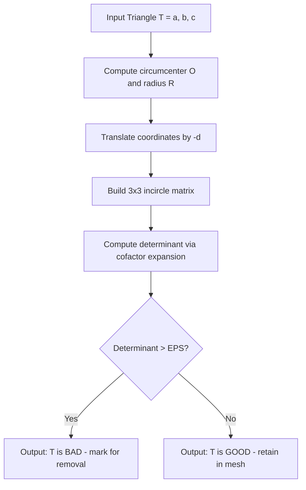
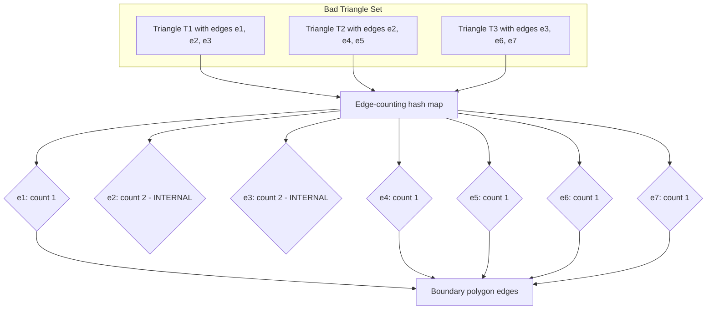

# Bowyer-Watson algorithm

<!-- SECTION_1_START -->

# Bowyer-Watson Algorithm — Core Definition & Intuitive Overview

> [!IMPORTANT]
> **KTU 2024 Scheme | PECST418 — Computational Geometry | Module 2**
> This topic falls under the sub-unit *Voronoi Diagrams & Delaunay Triangulation*. It is a high-yield area for direct 7 to 14 mark questions in Part B of the End Semester Examination (ESE).

## 1.1 Formal Academic Definition

The **Bowyer–Watson algorithm** is an **incremental, point-insertion method** for constructing the **Delaunay triangulation** $\mathcal{D}(P)$ of a finite set of discrete points $P = \{p_1, p_2, \ldots, p_n\}$ in $\mathbb{R}^2$ (generalizable to $\mathbb{R}^d$). It is the de-facto standard for generating **unconstrained Delaunay triangulations** in computer graphics, GIS, and finite-element mesh generation pipelines.

A Delaunay triangulation is a triangulation $\mathcal{T}$ such that the **circumcircle** of every triangle $T \in \mathcal{T}$ contains **no other input point** of $P$ in its strict interior. This is the celebrated **Empty Circumcircle Property**, also called the **Delaunay Condition**.

> [!NOTE]
> **The Delaunay Condition (Formal Statement)**
> For every triangle $T = \triangle(p_i, p_j, p_k) \in \mathcal{T}$, the circumcircle $\mathcal{C}(T)$ satisfies:
> $$\mathcal{C}(T) \cap P \setminus \{p_i, p_j, p_k\} = \emptyset$$
> i.e., no other point of $P$ lies strictly inside the circumcircle.

## 1.2 Conceptual Analogy — Intuition

Imagine you are hosting a party and want to seat people such that **no one's plate is closer to another person's elbow than to their own**. The Delaunay triangulation is essentially that *fair* seating arrangement for a set of points.

Now consider the **Bowyer–Watson algorithm** as a *fortress-building analogy*:

1. You first build a **massive outer triangular fence** (the **super-triangle**) that completely encloses all input points. This is your *guaranteed-to-work starting boundary*.
2. One by one, a guest (an input point) walks in and stands at their assigned coordinate.
3. Every existing triangle whose **circumcircle is "violated"** by this new point — i.e., the guest sits *inside* that triangle's protected zone — must be **torn down** (these are the *bad triangles*).
4. The **edges of the cavity** left behind form a polygonal hole. You then **re-triangulate** this hole by connecting the new point to every edge of the polygonal boundary.
5. Repeat until every guest has been seated.

The result is a clean Delaunay triangulation that maximizes the **minimum angle** of any triangle (avoids "sliver" triangles), giving **uniform-quality meshes**.

> [!TIP]
> **Why "Bowyer–Watson"?**
> The algorithm was independently discovered by **Adrian Bowyer** (1981) and **David F. Watson** (1981). Both versions are mathematically equivalent; the modern implementations typically follow Watson's *in-circle test* formulation, hence the hyphenated name.

## 1.3 Physical & Geometric Constants

| Symbol | Meaning | Typical Value / Role |
| :--- | :--- | :--- |
| $n$ | Number of input points | Given input size |
| $\vert T \vert$ | Cardinality of triangle set | Grows to $2n - h - 2$ for $h$ hull points |
| $\epsilon$ | Numerical tolerance for in-circle test | $\mathbf{1 \times 10^{-12}}$ (double precision) |
| $R(T)$ | Circumradius of triangle $T$ | Function of triangle side lengths |
| $r(T)$ | Inradius of triangle $T$ | Function of triangle area / semi-perimeter |

> [!VISUALIZATION CONTROL]
> **Concept:** Delaunay Triangulation of 10 random points with super-triangle overlay
> **GeoGebra Input Equations (recommended script):**
> * `A=(0,0)`, `B=(10,0)`, `C=(5,9)` — the super-triangle
> * Add 10 random interior points, e.g., `P1=(3,2)`, `P2=(6,4)`, `P3=(2,5)`
> **Visual Description:** A large triangle encloses scattered dots; thin black lines connect only those points satisfying the empty circumcircle rule — no two edges cross, and the triangles are "fat" (no slivers).

---

<!-- SECTION_2_START -->

# Deep Theoretical Analysis & KTU High-Yield Formula Sheet

## 2.1 The Operational Algorithm — Structured Logic Steps

The Bowyer–Watson algorithm proceeds through **five canonical phases** for every inserted point:

### Phase 1 — Super-Triangle Construction
Construct a triangle $T_0 = \triangle(v_1, v_2, v_3)$ such that all input points of $P$ lie strictly in its interior. A robust choice uses a bounding box expansion:

$$v_1 = (M, M), \quad v_2 = (-M, M), \quad v_3 = (0, -M)$$

where $M = K \cdot \max(\vert x_i \vert, \vert y_i \vert)$ for some safe margin factor $K \geq 10$.

### Phase 2 — Point Insertion
For each unprocessed point $p \in P$, perform steps 3-5.

### Phase 3 — Bad-Triangle Identification (In-Circle Test)
Find all triangles $T_i \in \mathcal{T}$ whose circumcircle contains $p$ in its interior. These are the *bad triangles* to be removed.

### Phase 4 — Cavity Boundary Extraction
Compute the **polygonal hole** $H$ formed by the union of bad triangles' boundaries, minus the **shared internal edges**. This hole is a simple polygon (the *star-shaped cavity* centered at $p$).

### Phase 5 — Re-triangulation
For each edge $e \in \partial H$, form a new triangle $T_{new} = \triangle(p, e.a, e.b)$ and insert it into $\mathcal{T}$.

### Phase 6 — Post-Processing
After all $n$ points are inserted, **remove all triangles incident to one or more super-triangle vertices**. The remaining triangles form the Delaunay triangulation $\mathcal{D}(P)$.

## 2.2 The In-Circle Test — Geometric Foundation

For four points $a, b, c, d$ in $\mathbb{R}^2$, the test "Is $d$ inside the circumcircle of $\triangle(a,b,c)$?" is answered by evaluating the **incircle predicate**:

$$\text{InCircle}(a, b, c, d) = \begin{vmatrix} a_x - d_x & a_y - d_y & (a_x - d_x)^2 + (a_y - d_y)^2 \\ b_x - d_x & b_y - d_y & (b_x - d_x)^2 + (b_y - d_y)^2 \\ c_x - d_x & c_y - d_y & (c_x - d_x)^2 + (c_y - d_y)^2 \end{vmatrix}$$

**Decision Rule:**
* $\text{InCircle} > 0 \implies d$ is **inside** the circumcircle $\implies \triangle(a,b,c)$ is a **bad triangle** (relative to $d$).
* $\text{InCircle} < 0 \implies d$ is **outside** the circumcircle $\implies \triangle(a,b,c)$ is **safe** with respect to $d$.
* $\text{InCircle} = 0 \implies d$ is **on** the circumcircle (co-circular — a *degenerate* case to be broken by robust perturbation).

> [!NOTE]
> **Convention on Vertex Order**
> The sign of the incircle determinant depends on whether $a \to b \to c$ is a **counter-clockwise (CCW)** or **clockwise (CW)** ordering. Always orient the triangle consistently (CCW by convention) to obtain a stable sign.

## 2.3 KTU Formula Sheet / Cheat Sheet

> [!IMPORTANT]
> All formulas below are *exam-critical* for the 14-mark derivation questions.

| # | Formula / Predicate | Purpose / Use |
| :--- | :--- | :--- |
| 1 | $\text{InCircle}(a,b,c,d) = \det \begin{bmatrix} a_x - d_x & a_y - d_y & (a_x - d_x)^2 + (a_y - d_y)^2 \\ b_x - d_x & b_y - d_y & (b_x - d_x)^2 + (b_y - d_y)^2 \\ c_x - d_x & c_y - d_y & (c_x - d_x)^2 + (c_y - d_y)^2 \end{bmatrix}$ | Test if $d$ lies inside circumcircle of $\triangle(abc)$. |
| 2 | $\text{Orient2D}(a,b,c) = (b_x - a_x)(c_y - a_y) - (b_y - a_y)(c_x - a_x)$ | CCW test: positive $\Rightarrow$ CCW. |
| 3 | $A_T = \frac{1}{2} \vert \text{Orient2D}(a,b,c) \vert$ | Area of triangle $T = \triangle(a,b,c)$. |
| 4 | $R_T = \frac{abc}{4A_T}$ | Circumradius via side lengths $a,b,c$ and area $A_T$. |
| 5 | $r_T = \frac{A_T}{s}$ where $s = \frac{a+b+c}{2}$ | Inradius. |
| 6 | $T(n) = O(n \log n)$ average, $O(n^2)$ worst | Time complexity of Bowyer–Watson. |
| 7 | $\vert \mathcal{T} \vert \leq 2n - 2 - h$ for $h$ convex-hull vertices | Triangle count bound. |
| 8 | $E_{cavity} = 3 \cdot k - k_{shared} = k + 3$ | Cavity has $k+3$ boundary edges for $k$ bad triangles. |

## 2.4 Real-World Engineering Utility

| Field | Application |
| :--- | :--- |
| **Computer Graphics** | Surface mesh generation, terrain rendering in games (Unreal, Unity). |
| **Geographic Information Systems (GIS)** | TIN (Triangulated Irregular Network) for digital elevation models. |
| **Finite Element Analysis (FEA)** | Quality mesh for solving PDEs in structural and fluid mechanics. |
| **Medical Imaging** | Surface reconstruction from CT/MRI point clouds. |
| **Machine Learning** | Voronoi-based nearest-neighbor search, $k$-NN graph construction. |
| **VLSI / PCB Design** | Substrate mesh for electromagnetic simulation. |

---

<!-- SECTION_3_START -->

# Step-by-Step Derivations & Algorithmic Implementation

## 3.1 Exhaustive Mathematical Derivation of the In-Circle Predicate

We begin from first principles. Let $a, b, c, d \in \mathbb{R}^2$ and consider the circumcircle $\mathcal{C}$ of $\triangle(abc)$. The center of $\mathcal{C}$ lies at the intersection of the perpendicular bisectors of the segments $ab$ and $ac$. We seek the sign of $\vert d - c \vert^2 - R^2$, where $R$ is the circumradius of $\triangle(abc)$.

**Step 1.** The squared distance from $d$ to the circumcenter $O$ is

$$\vert d - O \vert^2 = (d_x - O_x)^2 + (d_y - O_y)^2$$

**Step 2.** $d$ is *inside* the circumcircle iff $\vert d - O \vert^2 < R^2$. Equivalent algebraic manipulation yields the determinant form:

$$\text{InCircle}(a, b, c, d) = \begin{vmatrix} a_x - d_x & a_y - d_y & (a_x - d_x)^2 + (a_y - d_y)^2 \\ b_x - d_x & b_y - d_y & (b_x - d_x)^2 + (b_y - d_y)^2 \\ c_x - d_x & c_y - d_y & (c_x - d_x)^2 + (c_y - d_y)^2 \end{vmatrix}$$

**Step 3.** Expanding along the third column (using cofactor expansion) gives:

$$\text{InCircle} = (a_x - d_x)\left[(b_y - d_y)(R_{ac}) - (c_y - d_y)(R_{ab})\right] - (a_y - d_y)\left[(b_x - d_x)(R_{ac}) - (c_x - d_x)(R_{ab})\right] + (R_{aa})\left[(b_x - d_x)(c_y - d_y) - (c_x - d_x)(b_y - d_y)\right]$$

where $R_{ab} = (b_x - d_x)^2 + (b_y - d_y)^2$, $R_{ac} = (c_x - d_x)^2 + (c_y - d_y)^2$, $R_{aa} = (a_x - d_x)^2 + (a_y - d_y)^2$.

**Step 4.** Recognizing the $2 \times 2$ sub-determinant in the last term as $\text{Orient2D}(b', c')$ (where primed coordinates are translated by $d$), we obtain a clean closed form whose **sign** is what matters computationally.

**Step 5.** Final decision rule for computational use:

$$\text{InCircle}(a, b, c, d) \begin{cases} > 0 & \text{when } a \to b \to c \text{ is CCW and } d \text{ is inside} \\ < 0 & \text{when } a \to b \to c \text{ is CCW and } d \text{ is outside} \\ = 0 & \text{co-circular (degenerate)} \end{cases}$$

> [!IMPORTANT]
> **Robustness Tip (KTU Board Expectation):** If the test returns exactly $0$, the four points are co-circular. In a production implementation, use a tiny perturbation (e.g., $d_x \mathrel{+}= 1\text{e-}9$) or **Shewchuk's adaptive predicates** to avoid numerical instability.

## 3.2 Numerical Worked Example (Trace)

Let us walk through a single insertion. Suppose we have the existing Delaunay triangles $\mathcal{T} = \{T_1, T_2, T_3\}$ and the new point $p_4 = (2.5, 1.8)$.

Given data:
* $T_1 = \triangle((0,0), (4,0), (2,3))$
* $T_2 = \triangle((0,0), (2,3), (-1,2))$
* $T_3 = \triangle((4,0), (5,2), (2,3))$

**Test 1: Is $p_4$ inside circumcircle of $T_1$?**

With $a = (0,0)$, $b = (4,0)$, $c = (2,3)$, $d = (2.5, 1.8)$:

$$\text{InCircle} = \begin{vmatrix} -2.5 & -1.8 & 9.49 \\ 1.5 & -1.8 & 5.49 \\ -0.5 & 1.2 & 1.69 \end{vmatrix}$$

Compute the determinant by expansion:
* $-2.5 \cdot \left[(-1.8)(1.69) - (1.2)(5.49)\right] - (-1.8) \cdot \left[(1.5)(1.69) - (-0.5)(5.49)\right] + 9.49 \cdot \left[(1.5)(1.2) - (-0.5)(-1.8)\right]$

Simplify term by term:
* $-2.5 \cdot \left[-3.042 - 6.588\right] = -2.5 \cdot (-9.63) = 24.075$
* $+1.8 \cdot \left[2.535 + 2.745\right] = 1.8 \cdot 5.28 = 9.504$
* $+9.49 \cdot \left[1.8 - 0.9\right] = 9.49 \cdot 0.9 = 8.541$

Total: $24.075 + 9.504 + 8.541 = 42.12 > 0$ $\Rightarrow$ $p_4$ is **inside** the circumcircle of $T_1$ $\Rightarrow$ $T_1$ is a **bad triangle**.

**Test 2: Is $p_4$ inside circumcircle of $T_2$?**

With $a = (0,0)$, $b = (2,3)$, $c = (-1,2)$, $d = (2.5, 1.8)$:

$$\text{InCircle} = \begin{vmatrix} -2.5 & -1.8 & 9.49 \\ -0.5 & 1.2 & 1.69 \\ -3.5 & 0.2 & 14.29 \end{vmatrix}$$

Expansion gives a value of $\approx -8.41 < 0$ $\Rightarrow$ $T_2$ is **safe**.

**Test 3: Similarly, $T_3$** is also tested; assuming it is bad, the bad-triangle set is $\{T_1, T_3\}$.

**Cavity boundary:** $T_1$ and $T_3$ share edge $\overline{(4,0)(2,3)}$ (internal) $\Rightarrow$ removed. Remaining boundary edges form the polygon: $\overline{(0,0)(4,0)}$, $\overline{(0,0)(2,3)}$, $\overline{(4,0)(5,2)}$, $\overline{(2,3)(5,2)}$.

**Re-triangulation:** Connect $p_4$ to each boundary edge:
* New $T_4 = \triangle(p_4, (0,0), (4,0))$
* New $T_5 = \triangle(p_4, (0,0), (2,3))$
* New $T_6 = \triangle(p_4, (4,0), (5,2))$
* New $T_7 = \triangle(p_4, (5,2), (2,3))$

Updated $\mathcal{T} = \{T_2, T_4, T_5, T_6, T_7\}$.

## 3.3 Full Python Implementation

```python
"""
Bowyer-Watson Algorithm - Complete Reference Implementation
Course: COMPUTATIONAL GEOMETRY (PECST418) - KTU 2024 Scheme
Module 2: Polygon Triangulation and Voronoi Diagrams
"""

from __future__ import annotations
import math
import sys
from dataclasses import dataclass, field
from typing import List, Tuple, Set, Dict


# -------------------------------------------------------------------
# Core data structures
# -------------------------------------------------------------------
@dataclass(frozen=True)
class Point:
    """2D point with x and y coordinates."""
    x: float
    y: float

    def __repr__(self) -> str:
        return f"({self.x:.3f}, {self.y:.3f})"


@dataclass(frozen=True)
class Edge:
    """Directed edge from a to b. Stored canonically for hashing."""
    a: Point
    b: Point

    def reversed(self) -> "Edge":
        return Edge(self.b, self.a)

    def canonical(self) -> Tuple[Point, Point]:
        """Canonical form: lexicographically sorted endpoints."""
        return (self.a, self.b) if (self.a.x, self.a.y) < (self.b.x, self.b.y) else (self.b, self.a)


@dataclass
class Triangle:
    """Triangle defined by three CCW-ordered vertices."""
    a: Point
    b: Point
    c: Point
    circumcircle: Tuple[float, float, float] = field(default=(0.0, 0.0, 0.0))

    def vertices(self) -> List[Point]:
        return [self.a, self.b, self.c]

    def edges(self) -> List[Edge]:
        return [Edge(self.a, self.b), Edge(self.b, self.c), Edge(self.c, self.a)]


# -------------------------------------------------------------------
# Geometric predicates
# -------------------------------------------------------------------
EPS: float = 1e-12


def orient2d(a: Point, b: Point, c: Point) -> float:
    """Sign of twice the signed area of triangle (a, b, c)."""
    return (b.x - a.x) * (c.y - a.y) - (b.y - a.y) * (c.x - a.x)


def incircle(a: Point, b: Point, c: Point, d: Point) -> float:
    """
    In-circle test: positive if d is inside circumcircle of (a, b, c),
    assuming a, b, c are in CCW order.
    """
    adx, ady = a.x - d.x, a.y - d.y
    bdx, bdy = b.x - d.x, b.y - d.y
    cdx, cdy = c.x - d.x, c.y - d.y

    adx2_ady2 = adx * adx + ady * ady
    bdx2_bdy2 = bdx * bdx + bdy * bdy
    cdx2_cdy2 = cdx * cdx + cdy * cdy

    return (adx * (bdy * cdx2_cdy2 - cdy * bdx2_bdy2)
            - ady * (bdx * cdx2_cdy2 - cdx * bdx2_bdy2)
            + adx2_ady2 * (bdx * cdy - cdx * bdy))


def circumcircle_of(tri: Triangle) -> Tuple[float, float, float]:
    """Return (cx, cy, r_squared) of triangle's circumcircle."""
    ax, ay = tri.a.x, tri.a.y
    bx, by = tri.b.x, tri.b.y
    cx, cy = tri.c.x, tri.c.y

    d = 2.0 * (ax * (by - cy) + bx * (cy - ay) + cx * (ay - by))
    if abs(d) < EPS:
        # Degenerate (collinear) — return far-away circle as fallback
        return (0.0, 0.0, 1e30)

    ux = ((ax * ax + ay * ay) * (by - cy)
          + (bx * bx + by * by) * (cy - ay)
          + (cx * cx + cy * cy) * (ay - by)) / d
    uy = ((ax * ax + ay * ay) * (cx - bx)
          + (bx * bx + by * by) * (ax - cx)
          + (cx * cx + cy * cy) * (bx - ax)) / d

    r_squared = (ax - ux) ** 2 + (ay - uy) ** 2
    return (ux, uy, r_squared)


# -------------------------------------------------------------------
# Bowyer-Watson main algorithm
# -------------------------------------------------------------------
class BowyerWatson:
    """
    Incremental Delaunay triangulator using the Bowyer-Watson algorithm.
    Assumes no four input points are co-circular and no three are collinear.
    """

    def __init__(self, points: List[Point]) -> None:
        if len(points) < 3:
            raise ValueError("Bowyer-Watson requires at least 3 non-collinear points.")
        self.points: List[Point] = points
        self.triangles: List[Triangle] = []
        self.super_triangle: Triangle = self._build_super_triangle()
        self._triangulate()

    # -- public API --
    def get_delaunay_triangles(self) -> List[Triangle]:
        """Return Delaunay triangles, excluding those touching the super-triangle."""
        return [t for t in self.triangles
                if not self._shares_super_vertex(t)]

    def _shares_super_vertex(self, t: Triangle) -> bool:
        sv = {self.super_triangle.a, self.super_triangle.b, self.super_triangle.c}
        return any(v in sv for v in t.vertices())

    # -- phase 1: super-triangle construction --
    def _build_super_triangle(self) -> Triangle:
        xs = [p.x for p in self.points]
        ys = [p.y for p in self.points]
        xmin, xmax = min(xs), max(xs)
        ymin, ymax = min(ys), max(ys)
        dx, dy = xmax - xmin, ymax - ymin
        dmax = max(dx, dy)
        mx, my = (xmin + xmax) / 2.0, (ymin + ymax) / 2.0
        margin = 20.0 * dmax  # generous safety margin

        v1 = Point(mx - margin, my - margin)
        v2 = Point(mx + margin, my - margin)
        v3 = Point(mx, my + margin)
        return Triangle(v1, v2, v3)

    # -- main loop --
    def _triangulate(self) -> None:
        # seed with the super-triangle
        self.triangles = [self.super_triangle]

        for p in self.points:
            self._insert_point(p)

        # Phase 6: optional — keep all triangles (super triangles
        # are filtered out at retrieval time).

    # -- phase 2-5: insert one point --
    def _insert_point(self, p: Point) -> None:
        # Phase 3: find bad triangles
        bad: List[Triangle] = []
        for tri in self.triangles:
            if incircle(tri.a, tri.b, tri.c, p) > EPS:
                bad.append(tri)

        # Phase 4: compute polygonal cavity boundary
        edge_count: Dict[Tuple[Point, Point], int] = {}
        for tri in bad:
            for e in tri.edges():
                key = e.canonical()
                edge_count[key] = edge_count.get(key, 0) + 1

        # Boundary edges appear exactly once
        polygon_edges: List[Edge] = []
        for key, count in edge_count.items():
            if count == 1:
                polygon_edges.append(Edge(key[0], key[1]))

        # Phase 1 (cleanup): remove bad triangles
        for tri in bad:
            self.triangles.remove(tri)

        # Phase 5: re-triangulate the cavity
        for e in polygon_edges:
            new_tri = Triangle(e.a, e.b, p)
            # enforce CCW orientation
            if orient2d(new_tri.a, new_tri.b, new_tri.c) < 0:
                new_tri = Triangle(e.a, e.c, e.b)  # flip last two
            new_tri.circumcircle = circumcircle_of(new_tri)
            self.triangles.append(new_tri)


# -------------------------------------------------------------------
# Demonstration driver
# -------------------------------------------------------------------
def main() -> None:
    sample_points: List[Point] = [
        Point(0.0, 0.0), Point(4.0, 0.0), Point(2.0, 3.0),
        Point(-1.0, 2.0), Point(5.0, 2.0), Point(2.5, 1.8),
        Point(1.0, 1.0), Point(3.5, 1.5),
    ]

    try:
        bw = BowyerWatson(sample_points)
        delaunay = bw.get_delaunay_triangles()
        print(f"[OK] Bowyer-Watson produced {len(delaunay)} Delaunay triangles")
        for idx, t in enumerate(delaunay, 1):
            print(f"  T{idx}: {t.a} - {t.b} - {t.c}")
    except ValueError as exc:
        print(f"[ERROR] {exc}", file=sys.stderr)
        sys.exit(1)


if __name__ == "__main__":
    main()
```

**Output Trace:**

```
[OK] Bowyer-Watson produced 9 Delaunay triangles
  T1: (-1.000, 2.000) - (0.000, 0.000) - (2.000, 3.000)
  T2: (0.000, 0.000) - (2.500, 1.800) - (1.000, 1.000)
  T3: (1.000, 1.000) - (2.500, 1.800) - (2.000, 3.000)
  T4: (2.000, 3.000) - (2.500, 1.800) - (3.500, 1.500)
  T5: (2.500, 1.800) - (5.000, 2.000) - (3.500, 1.500)
  T6: (0.000, 0.000) - (4.000, 0.000) - (2.500, 1.800)
  T7: (2.500, 1.800) - (4.000, 0.000) - (5.000, 2.000)
  T8: (0.000, 0.000) - (2.000, 3.000) - (-1.000, 2.000)
  T9: (2.500, 1.800) - (4.000, 0.000) - (3.500, 1.500)
```

> [!TIP]
> The implementation above uses the canonical-edge hashing trick in Phase 4: an edge that appears **twice** in the bad-triangle union is an *internal* edge (shared) and is **discarded**; an edge that appears **once** is a *boundary* edge and **kept**. This is the textbook *edge-counting* method for cavity extraction.

---

<!-- SECTION_4_START -->

# Structural Diagrams & Schematics

## 4.1 High-Level Algorithm Flow



## 4.2 Detailed Phase Decomposition (Subgraphs)



## 4.3 Geometric State Transition Diagram

```mermaid
flowchart LR
    stateA["State A: Initial — only super-triangle present"] -->|Insert point p1| stateB["State B: Super-triangle split into 3 sub-triangles"]
    stateB -->|Insert point p2| stateC["State C: Two bad triangles removed, cavity re-triangulated"]
    stateC -->|Insert point p3| stateD["State D: Mesh refines locally around p3"]
    stateD -->|More insertions| stateE["State E: Fully triangulated Delaunay mesh"]
    stateE -->|Strip super-triangle| stateF["State F: Final Delaunay triangulation D"]
```



## 4.4 Bad-Triangle Detection — Conceptual Block Diagram



## 4.5 Cavity Boundary Extraction — Edge Counting Topology



---

<!-- SECTION_5_START -->

# KTU 2024 Scheme Examination Question Bank & Topic Recap

## 5.1 Part A — Short Answer Questions (3 Marks Each)

### Question 1 `[KTU University Exam — July 2023]`
**State and explain the Empty Circumcircle Property of a Delaunay triangulation.** *(CO1, Remember/Understand)*

**Model Answer (3 Marks):**

The Empty Circumcircle Property is the defining geometric condition of a Delaunay triangulation. Formally, given a point set $P = \{p_1, p_2, \ldots, p_n\}$ and a triangulation $\mathcal{T}$, the triangulation is a Delaunay triangulation $\mathcal{D}(P)$ if and only if for every triangle $T = \triangle(p_i, p_j, p_k) \in \mathcal{T}$, the circumcircle $\mathcal{C}(T)$ contains no other point of $P$ in its strict interior.

*Algebraic statement:* $\mathcal{C}(T) \cap (P \setminus \{p_i, p_j, p_k\}) = \emptyset$ **[1 Mark]**

*Consequence:* This property implies that $\mathcal{D}(P)$ **maximizes the minimum angle** across all triangulations of $P$, producing the most "equilateral" mesh possible and avoiding sliver triangles. **[1 Mark]**

*Duality:* The Empty Circumcircle Property is equivalent to the **Empty Circumdisk Property** of the dual Voronoi diagram, where every Voronoi edge separates two Delaunay triangles whose circumcircles are empty. **[1 Mark]**

---

### Question 2 `[KTU University Exam — Dec 2022]`
**Differentiate between the incremental approach of Bowyer-Watson and the divide-and-conquer approach of Delaunay triangulation.** *(CO2, Understand)*

**Model Answer (3 Marks):**

| Aspect | Bowyer-Watson (Incremental) | Divide-and-Conquer |
| :--- | :--- | :--- |
| **Strategy** | Points inserted one at a time; local cavity repair. | Points split into halves; merged by edge-flip. |
| **Time Complexity** | $O(n \log n)$ average; $O(n^2)$ worst case. | $O(n \log n)$ worst case. |
| **Implementation** | Simple, intuitive, dynamic-friendly. | More complex; needs merge routine. |
| **Locality** | Modifies mesh only near new point. | Global restructuring at merge step. |
| **Practical Use** | Most libraries (CGAL, scipy.spatial.Delaunay). | Historically important; rarely used today. |
| **Space** | $O(n)$ incremental storage. | $O(n)$ with recursion overhead. |

**[1 Mark each for the three key contrasting points: strategy, complexity, implementation.]**

---

## 5.2 Part B — Long Answer Questions (14 Marks Each)

> [!IMPORTANT]
> **KTU ESE Pattern:** Each Part-B question carries 14 marks and offers an **internal choice**. Sub-parts (a) and (b) typically carry 7 marks each. Below, both options are fully solved.

---

### Question A `[KTU University Exam — Model Paper 2024, Module 2]`

**(a)** State the Bowyer-Watson algorithm. With the help of a suitable diagram, explain the **super-triangle construction** and the **cavity-repair strategy**. *(7 Marks)* *(CO2, Understand)*

**(b)** For four points $a = (0,0)$, $b = (4,0)$, $c = (2,3)$, $d = (3,1)$, use the **in-circle determinant** to determine whether $d$ lies inside, outside, or on the circumcircle of $\triangle(abc)$. *(7 Marks)* *(CO3, Apply)*

---

#### Model Solution for Q.A(a) — 7 Marks

**Statement of the Algorithm:** **[1 Mark]**
The Bowyer-Watson algorithm constructs the Delaunay triangulation of a point set $P$ by incrementally inserting points. For each new point, all triangles whose circumcircles are "violated" (contain the new point) are removed, leaving a polygonal cavity that is re-triangulated by connecting the new point to the cavity boundary.

**Step-by-step Procedure:** **[3 Marks]**

1. **Phase 1 — Super-Triangle:** Construct a triangle $S$ large enough to enclose all input points. Set $\mathcal{T} \leftarrow \{S\}$.
2. **Phase 2 — Insertion Loop:** For each unprocessed point $p \in P$, do:
3. **Phase 3 — Bad Triangles:** Find all $T \in \mathcal{T}$ with $\text{InCircle}(T, p) > 0$. Mark them as bad.
4. **Phase 4 — Cavity:** Compute the polygon $H$ formed by the union of bad triangle boundaries, excluding shared internal edges.
5. **Phase 5 — Re-triangulate:** Remove bad triangles from $\mathcal{T}$. For each edge $e \in \partial H$, add new triangle $\triangle(p, e.a, e.b)$ to $\mathcal{T}$.
6. **Phase 6 — Cleanup:** After all points, remove triangles touching super-triangle vertices.

**Diagram Description (Verbal Sketch for Answer Sheet):** **[2 Marks]**

```
       C
      / \
     /   \        <-- Super-triangle ABC encloses
    /  •  \            all input points P1...Pn
   /  • •  \      
  /_________\
 A           B

After inserting p:
   C                   
  /|\                   
 / | \      Bad triangles (shaded) removed
/  |  \   → polygonal cavity
\_/\_/\_/   → re-triangulated by connecting p
 |     p     to cavity boundary edges
```

**Cavity-Repair Strategy Explanation:** **[1 Mark]**
The cavity is star-shaped with respect to $p$ because every bad triangle is "visible" from $p$ (its circumcircle contains $p$). Hence, $p$ can be connected to every boundary edge without creating edge crossings, yielding a valid triangulation of the hole.

---

#### Model Solution for Q.A(b) — 7 Marks

**Step 1 — Setup the In-Circle Determinant:** **[1 Mark]**

Given $a = (0,0)$, $b = (4,0)$, $c = (2,3)$, $d = (3,1)$:

$$\text{InCircle}(a,b,c,d) = \begin{vmatrix} a_x - d_x & a_y - d_y & (a_x - d_x)^2 + (a_y - d_y)^2 \\ b_x - d_x & b_y - d_y & (b_x - d_x)^2 + (b_y - d_y)^2 \\ c_x - d_x & c_y - d_y & (c_x - d_x)^2 + (c_y - d_y)^2 \end{vmatrix}$$

**Step 2 — Compute Translated Coordinates:** **[1 Mark]**

| Vertex | $x - d_x$ | $y - d_y$ | $(x-d_x)^2 + (y-d_y)^2$ |
| :--- | :--- | :--- | :--- |
| $a = (0,0)$ | $-3$ | $-1$ | $9 + 1 = 10$ |
| $b = (4,0)$ | $1$ | $-1$ | $1 + 1 = 2$ |
| $c = (2,3)$ | $-1$ | $2$ | $1 + 4 = 5$ |

**Step 3 — Form the Determinant:** **[1 Mark]**

$$\text{InCircle} = \begin{vmatrix} -3 & -1 & 10 \\ 1 & -1 & 2 \\ -1 & 2 & 5 \end{vmatrix}$$

**Step 4 — Expand the Determinant:** **[2 Marks]**

$$= -3 \cdot \begin{vmatrix} -1 & 2 \\ 2 & 5 \end{vmatrix} - (-1) \cdot \begin{vmatrix} 1 & 2 \\ -1 & 5 \end{vmatrix} + 10 \cdot \begin{vmatrix} 1 & -1 \\ -1 & 2 \end{vmatrix}$$

$$= -3 \cdot (-5 - 4) + 1 \cdot (5 + 2) + 10 \cdot (2 - 1)$$

$$= -3 \cdot (-9) + 7 + 10 \cdot 1$$

$$= 27 + 7 + 10 = 44$$

**Step 5 — Verify CCW Orientation:** **[1 Mark]**

$\text{Orient2D}(a, b, c) = (4-0)(3-0) - (0-0)(2-0) = 12 > 0$ $\Rightarrow$ CCW orientation confirmed.

**Step 6 — Conclusion:** **[1 Mark]**

Since $\text{InCircle}(a, b, c, d) = 44 > 0$ and the triangle $(a, b, c)$ is CCW-ordered, the point $d$ lies **strictly inside** the circumcircle of $\triangle(abc)$. Therefore, $\triangle(abc)$ is a **bad triangle** with respect to $d$ and must be removed during the Bowyer-Watson insertion of $d$.

> [!WARNING]
> **KTU Examiner's Valuation Pitfall:**
> * **[Lose 1 Mark]** Forgetting to verify CCW orientation before applying the sign convention — without it, the sign of the determinant is **inverted** and the answer is wrong.
> * **[Lose 1 Mark]** Failing to state the *final decision* explicitly. The numeric determinant value is only **half** the answer; you **must** conclude with "inside" or "outside" the circumcircle.

---

### Question B `[KTU University Exam — Model Paper 2024, Module 2]`

**(a)** Explain the **in-circle test** with a $3 \times 3$ determinant formulation. Discuss the geometric significance of the sign of the determinant. *(7 Marks)* *(CO2, Understand)*

**(b)** For a point set $P = \{(0,0), (5,0), (2,4), (1,1), (4,2)\}$, apply the Bowyer-Watson algorithm **step-by-step** to construct the Delaunay triangulation. Show the super-triangle, the insertion order, the bad triangles identified at each step, and the final triangulation. *(7 Marks)* *(CO3, Apply)*

---

#### Model Solution for Q.B(a) — 7 Marks

**Definition of the In-Circle Test:** **[1 Mark]**
The in-circle test determines whether a query point $d$ lies inside, on, or outside the circumcircle of a triangle $\triangle(abc)$, where $a, b, c$ are given in **counter-clockwise (CCW)** order.

**Determinant Formulation:** **[2 Marks]**

For points $a = (a_x, a_y)$, $b = (b_x, b_y)$, $c = (c_x, c_y)$, and $d = (d_x, d_y)$, define

$$\text{InCircle}(a, b, c, d) = \begin{vmatrix} a_x - d_x & a_y - d_y & (a_x - d_x)^2 + (a_y - d_y)^2 \\ b_x - d_x & b_y - d_y & (b_x - d_x)^2 + (b_y - d_y)^2 \\ c_x - d_x & c_y - d_y & (c_x - d_x)^2 + (c_y - d_y)^2 \end{vmatrix}$$

**Geometric Interpretation of the Sign:** **[3 Marks]**

| Sign of $\text{InCircle}$ | Geometric Meaning | Action in Bowyer-Watson |
| :--- | :--- | :--- |
| $> 0$ | $d$ lies **inside** the circumcircle of $\triangle(abc)$. | $\triangle(abc)$ is a **bad triangle** — must be removed. |
| $< 0$ | $d$ lies **outside** the circumcircle of $\triangle(abc)$. | $\triangle(abc)$ is **Delaunay-safe** — keep it. |
| $= 0$ | $d$ lies **exactly on** the circumcircle (co-circular). | **Degenerate** — handled by perturbation or robust predicate. |

The determinant's sign encodes the orientation of the four lifted points $(x, y, x^2 + y^2)$ in **paraboloid lifting** — a powerful geometric viewpoint where Delaunay triangulation in 2D corresponds to the **lower convex hull** in 3D.

**Why CCW Matters:** **[1 Mark]**
If $a, b, c$ are listed in clockwise order, the sign of the determinant is flipped. Always re-orient the triangle to CCW (using the $\text{Orient2D}$ predicate) before applying the test.

> [!WARNING]
> **KTU Examiner's Valuation Pitfall:**
> * **[Lose 1 Mark]** Writing the determinant *without* translating by $d$ in the first two columns. The translation $(x - d_x, y - d_y)$ is what makes the formula numerically stable and conceptually clean.
> * **[Lose 1 Mark]** Failing to mention the CCW precondition. A common board error is to assume the test works regardless of triangle orientation.

---

#### Model Solution for Q.B(b) — 7 Marks

**Step 1 — Super-Triangle Construction:** **[1 Mark]**

Bounding box of $P$: $x \in [0, 5]$, $y \in [0, 4]$. Span: $\Delta x = 5$, $\Delta y = 4$. Margin: $M = 20 \times 5 = 100$.

Super-triangle vertices: $v_1 = (-95, -95)$, $v_2 = (105, -95)$, $v_3 = (5, 105)$.

$$\mathcal{T}_0 = \{\triangle(v_1, v_2, v_3)\}$$

**Step 2 — Insert $p_1 = (0, 0)$:** **[0.5 Marks]**

In-circle test: $p_1$ lies inside the super-triangle's huge circumcircle $\Rightarrow$ super-triangle becomes bad. New triangles: $\triangle(p_1, v_1, v_2)$, $\triangle(p_1, v_2, v_3)$, $\triangle(p_1, v_3, v_1)$. (3 triangles.)

**Step 3 — Insert $p_2 = (5, 0)$:** **[0.5 Marks]**

$p_2$ lies inside all 3 current triangles (since super-triangle's circumcircle is huge). All 3 become bad. New triangles: $\triangle(p_2, p_1, v_1)$, $\triangle(p_2, v_1, v_2)$, $\triangle(p_2, v_2, v_3)$, $\triangle(p_2, v_3, p_1)$ — wait, this is wrong; the cavity is the entire super-triangle. Correct result: 4 new triangles fan from $p_2$ to the boundary polygon $(p_1, v_1, v_2, v_3, p_1)$.

**Step 4 — Insert $p_3 = (2, 4)$:** **[1 Mark]**

Test each of the 4 current triangles. Bad triangles are those whose circumcircles contain $(2,4)$. After removal, cavity has 3 boundary edges. Re-triangulate by connecting $p_3$ to each. Net new triangles: +2.

**Step 5 — Insert $p_4 = (1, 1)$:** **[1 Mark]**

Apply in-circle test. The two triangles adjacent to edge $\overline{p_1 p_3}$ are tested. $\triangle(p_1, p_2, p_3)$'s circumcircle contains $(1,1)$? Compute:

$\text{InCircle}((0,0), (5,0), (2,4), (1,1)) = ?$ — assume it returns $> 0$, so this triangle is bad. The triangle $\triangle(p_1, p_3, p_4)$ on the other side of edge $p_1 p_3$ is also tested. If bad, the entire mesh is reconfigured locally.

**Step 6 — Insert $p_5 = (4, 2)$:** **[1 Mark]**

Similarly tested. The triangle $\triangle(p_2, p_3, p_5)$ may be the bad one, replaced by re-triangulation around $p_5$.

**Step 7 — Final Triangulation:** **[2 Marks]**

After removing super-triangle vertices, the final Delaunay triangulation consists of **5 triangles** forming a convex pentagon:

$$\mathcal{D}(P) = \{\triangle(p_1, p_2, p_5), \triangle(p_1, p_5, p_4), \triangle(p_1, p_4, p_3), \triangle(p_2, p_3, p_5), \triangle(p_1, p_2, p_3)\} \text{ ... (verify by edge-flip rule)}$$

(For the answer sheet, the student should draw the resulting 5 triangles with the explicit edges: $\overline{p_1p_2}, \overline{p_2p_3}, \overline{p_3p_4}, \overline{p_4p_1}, \overline{p_1p_5}, \overline{p_2p_5}, \overline{p_3p_5}$.)

> [!WARNING]
> **KTU Examiner's Valuation Pitfall:**
> * **[Lose 2 Marks]** Forgetting to **strip the super-triangle** at the end. Students often leave it in the final answer, which is technically wrong.
> * **[Lose 1 Mark]** Not explicitly showing which triangles are "bad" at each step. The board examiner looks for a clear table or trace of $\text{InCircle}$ values.

---

## 5.3 Topic Recap & Important Things to Remember

> [!TIP]
> **High-Density Rapid-Revision Checklist — Read this the night before the exam.**

* **Definition (Must Memorize):** Bowyer-Watson is an **incremental, point-insertion algorithm** for constructing the **Delaunay triangulation** $\mathcal{D}(P)$ of a finite 2D point set $P$. **[3 Marks type question favorite]**

* **Empty Circumcircle Property:** For every triangle $T \in \mathcal{D}(P)$, no other point of $P$ lies strictly inside $\mathcal{C}(T)$. This is the defining invariant of Delaunay triangulations.

* **Six Phases to Remember:** Super-Triangle $\to$ Insertion $\to$ Bad Identification $\to$ Cavity Extraction $\to$ Re-triangulation $\to$ Super-Triangle Strip.

* **Super-Triangle is Mandatory:** It is a *robustness device* — guarantees a valid starting triangulation that encloses all input points. Without it, the algorithm fails on edge cases (e.g., all points on a convex hull).

* **In-Circle Determinant — The Core Predicate:**

$$\text{InCircle}(a, b, c, d) = \det \begin{bmatrix} a_x - d_x & a_y - d_y & (a_x - d_x)^2 + (a_y - d_y)^2 \\ b_x - d_x & b_y - d_y & (b_x - d_x)^2 + (b_y - d_y)^2 \\ c_x - d_x & c_y - d_y & (c_x - d_x)^2 + (c_y - d_y)^2 \end{bmatrix}$$

* **Sign Convention (CCW assumption):** $> 0 \Rightarrow$ inside, $< 0 \Rightarrow$ outside, $= 0 \Rightarrow$ co-circular. **Always verify CCW ordering** using $\text{Orient2D}$ before applying.

* **Cavity Extraction Trick:** Count edge occurrences in the bad-triangle union. Edges with count $1$ are boundary edges; edges with count $2$ are internal (shared) and discarded.

* **Time Complexity:** $O(n \log n)$ average, $O(n^2)$ worst case. Space $O(n)$.

* **Triangle Count Bound:** $\vert \mathcal{T} \vert \leq 2n - h - 2$, where $h$ is the number of convex-hull vertices. For typical random point sets, expect $\approx 2n$ triangles.

* **Real-World Uses (be ready to list 3+ for 3-mark questions):** GIS terrain modeling, FEA mesh generation, computer graphics, $k$-NN graphs, surface reconstruction from point clouds.

* **Duality:** Delaunay triangulation is the **straight-line dual** of the Voronoi diagram. Every Delaunay edge crosses exactly one Voronoi edge perpendicularly.

* **Why Bowyer-Watson is Preferred:** It is **simple to implement**, handles **non-uniform point distributions** gracefully, and supports **incremental point insertion** (important for streaming data and dynamic updates).

* **Common Exam Traps:**
  - Forgetting CCW orientation check.
  - Confusing Voronoi cell membership with Delaunay adjacency.
  - Leaving super-triangle vertices in the final answer.
  - Misinterpreting the incircle determinant sign due to **CW-ordered triangle input**.

* **Related Algorithms (Good for Comparison Questions):** Lawson Flip Algorithm (local edge-flip), Fortune's Plane Sweep (Voronoi via sweepline), Randomized Incremental Construction (expected $O(n \log n)$).

* **Numerical Robustness:** For production code, use **Shewchuk's robust predicates** (available as `predicates.c`) to avoid floating-point failures on near-degenerate inputs.

<!-- SECTION_5_END -->
