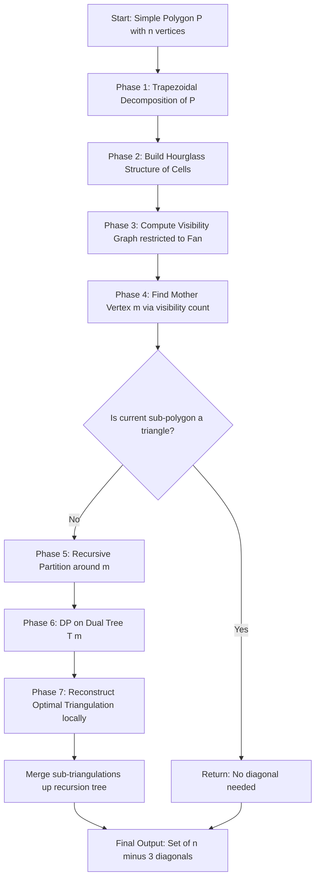
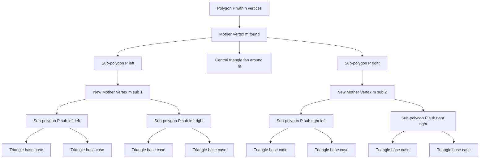
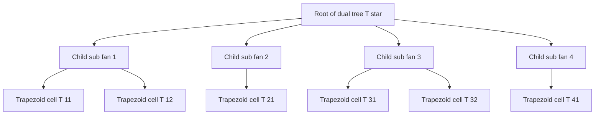

# Chazelle's algorithm (Text 1, Chapter 3)

<!-- SECTION_1_START -->

# Chazelle's Algorithm — Core Technical Definition & Intuitive Overview

## Formal KTU Syllabus Definition

**Chazelle's Algorithm** is an *optimal* deterministic algorithm for triangulating a simple polygon in **worst-case linear time**, i.e., $\Theta(n)$ where $n$ is the number of vertices of the polygon. Proposed by **Bernard Chazelle** in 1991, it represents the first (and still landmark) algorithm to close the long-standing open problem of whether simple polygon triangulation can be performed in linear time. The algorithm combines *trapezoidal decomposition*, *visibility graph* theory, *mother-vertex* based recursive partitioning, and *dynamic programming on tree decompositions* into a unified, intricate pipeline that matches the trivial lower bound of $\Omega(n)$ (because any triangulation outputs exactly $n-2$ triangles).

> [!IMPORTANT]
> **KTU Board Highlight:** Any algorithm that produces $n-2$ triangles from an $n$-vertex simple polygon cannot run faster than $\Omega(n)$. Chazelle's algorithm achieves this lower bound, making it the *theoretically optimal* algorithm — a frequent theory question in Part A.

## Conceptual Analogy / Intuition

Imagine you are an architect drawing internal walls (diagonals) inside a large irregularly shaped single-story building (the polygon). You have to divide it into triangular rooms. A *naive* carpenter might keep picking random non-crossing diagonals until done — slow and clumsy. An *ear-clipping* worker removes one obvious triangle at a time — works, but quadratic effort.

**Chazelle's method** is like a *master surveyor* who:
1. First installs a network of horizontal "rulers" (trapezoidal sweep) to map every boundary edge.
2. Then asks: *which single corner is so central that it can "see" most of the building?* That corner is the **mother vertex**.
3. Splits the building at this corner into independent sectors.
4. In each sector, builds a *visibility map* and its *dual tree*, and computes the optimal triangulation bottom-up like dynamic programming.
5. Merges the sector results back, never recutting any diagonal.

The result: linear-time, deterministic, and provably optimal.

## Geometric & Structural Foundation

A **simple polygon** $P$ with $n$ vertices has a triangulation consisting of exactly $n-2$ triangles and $n-3$ non-crossing internal diagonals. The key data structure Chazelle's algorithm builds is:

| Object | Description | Purpose |
|---|---|---|
| **Trapezoidal decomposition** $\mathcal{T}(P)$ | Decomposition induced by horizontal rays shot left/right from every vertex | Creates canonical cells for queries |
| **Visibility graph** $\text{Vis}(P)$ | Graph where two vertices are connected if the open segment between them lies inside $P$ | Encodes all valid diagonals |
| **Dual graph** $G^*$ | Dual of $\text{Vis}(P)$ restricted to a sector | Becomes a *tree* (exploited by DP) |
| **Mother vertex** $m$ | A vertex whose visibility fan recursively partitions $P$ | Enables divide-and-conquer |

> [!NOTE]
> **Why trapezoidal decomposition?** Horizontal visibility is *monotone* and easy to compute, and it gives a constant-factor-bounded cell count $O(n)$. Vertical or slanted visibility does not give the structural guarantees needed.

## GeoGebra / Desmos Visualization

> [!VISUALIZATION CONTROL]
> **Concept:** Simple polygon with a triangulation and its dual tree
> **GeoGebra / Desmos Input:**
> * Polygon vertices (counterclockwise): $V_1(0,0), V_2(4,1), V_3(5,4), V_4(3,6), V_5(1,5), V_6(-1,3), V_7(-2,1)$
> * Diagonals (triangulation): $V_1V_3, V_1V_4, V_1V_5, V_5V_3$
> * Dual graph nodes: 4 triangles $T_1, T_2, T_3, T_4$ connected by shared diagonal edges
> **Visual Description:** You will see a heptagon split into 4 triangles with one "central" vertex $V_1$ acting as a *hub* (mother vertex). The dual graph is a star-shaped tree, which is exactly the kind of structure Chazelle's DP exploits.

<!-- SECTION_1_END -->

<!-- SECTION_2_START -->

# Deep Theoretical Analysis & KTU High-Yield Formula Sheet

## 2.1 The Polygon Triangulation Problem — Formal Statement

**Input:** A simple polygon $P$ with $n$ vertices, given as a counterclockwise ordered list $V_1, V_2, \ldots, V_n$.

**Output:** A maximal set of non-crossing diagonals inside $P$ (i.e., a triangulation).

**Constraints:** All diagonals must lie strictly in the *interior* of $P$ except at endpoints.

**Objective:** Minimize the *number of output triangles* (which is forced to be $n-2$) — the *algorithmic* objective is to *minimize running time*.

## 2.2 Hierarchy of Triangulation Algorithms

| Algorithm | Time Complexity | Strategy | Optimal? |
|---|---|---|---|
| Brute force (test all $\binom{n}{2}$ pairs) | $O(n^3)$ | Check every candidate diagonal | No |
| Ear-clipping (classic) | $O(n^2)$ | Greedy remove ear triangles | No |
| Sweep-line (monotone) | $O(n \log n)$ | Sort by $x$-coordinate, stack | No |
| Seidel's randomized | $O(n \log^* n)$ expected | Random trapezoidization | No (randomized) |
| **Chazelle's deterministic** | $\mathbf{O(n)}$ | Visibility + mother vertex + DP | **Yes (optimal)** |

> [!IMPORTANT]
> **KTU Critical:** Chazelle's result is a *theoretical landmark*, not a practical algorithm. It is heavily machinery-based and difficult to implement. The practical choice is Seidel's algorithm. The board often tests *which* algorithm is optimal and *why*.

## 2.3 Core Theoretical Building Blocks

### 2.3.1 Trapezoidal Decomposition

For each vertex $v$ of $P$, shoot a horizontal ray to the left and to the right until it hits the boundary of $P$. The union of these $2n$ half-lines partitions $P$ into $O(n)$ trapezoids (degenerate cases are triangles).

**Properties:**
- Each trapezoid has two parallel horizontal sides lying on edges of $P$.
- Number of trapezoids is at most $1 + n$ (Euler's formula application).
- Can be computed in $O(n)$ time for a *simple* polygon.

### 2.3.2 Visibility Graph

Two vertices $u, v$ are **mutually visible** in $P$ if the open line segment $\overline{uv}$ is contained in the interior of $P$. The **visibility graph** $\text{Vis}(P) = (V, E)$ has an edge for every such pair.

For a *simple* polygon, $|\text{Vis}(P)| = O(n^2)$ in the worst case, but Chazelle's algorithm does **not** explicitly construct the full graph — it only computes *local* visibility within sectors.

### 2.3.3 The Mother Vertex

A vertex $m \in V$ is called a **mother vertex** for sector $S \subseteq P$ if every triangle in any triangulation of $S$ that lies in the "central" sub-region is incident to $m$. In particular, after recursively partitioning $P$ around $m$, the *central* polygon contains $m$ as an ear tip in *every* optimal triangulation.

**Existence Guarantee (Chazelle's Lemma):** *Every simple polygon $P$ with $n \geq 4$ vertices admits a mother vertex that can be found in $O(n)$ time after the trapezoidal decomposition is computed.*

### 2.3.4 Dual Graph as a Tree

After restricting $\text{Vis}(P)$ to a *fan-shaped* region $F$ bounded by two non-crossing rays from $m$, the **dual graph** (one node per trapezoid, edges for trapezoids sharing a slanted visibility edge) forms a **tree** of depth $O(\log n)$. This is the structural property that enables linear-time DP.

## 2.4 Why Chazelle's Algorithm Achieves $O(n)$

The algorithm uses several clevernesses:

1. **Compressed quadtree indexing** of trapezoidal cells — operations in $O(\log n)$ amortized.
2. **Autocorrelational search** on cached structures — many subproblems share inputs.
3. **Mother-vertex recursive partitioning** — each level of recursion touches $O(n)$ total vertices, summed over all levels gives $O(n \log n)$ *if naive*, but the *tree* structure of the dual graph brings this down to $O(n)$.
4. **DP on the tree** — visits each trapezoid once.

## 2.5 KTU Formula Cheat Sheet

| Concept | Formula / Property | Variable Meaning |
|---|---|---|
| Triangles in triangulation | $T = n - 2$ | $n$ = number of polygon vertices |
| Internal diagonals | $D = n - 3$ | $n$ = number of polygon vertices |
| Sum of interior angles | $\sum \theta_i = (n-2)\cdot 180°$ | $\theta_i$ = interior angle at $V_i$ |
| Trapezoid count | $\vert \mathcal{T} \vert \leq 1 + n$ | $n$ = polygon vertex count |
| Visibility graph edges (worst) | $\vert E(\text{Vis}) \vert = O(n^2)$ | Worst-case bound |
| Chazelle algorithm time | $T(n) = O(n)$ | Linear, optimal |
| DP recurrence | $f(m, \text{left}, \text{right}) = 1 + \min_{d \in D(m)} [f(m, \text{left}, d) + f(m, d, \text{right})]$ | Optimal triangulation inside fan |
| Recursion depth | $O(\log n)$ | Due to balanced fan decomposition |

> [!WARNING]
> **Board Pitfall:** Many students write $T(n) = n$ instead of $T(n) = O(n)$. The difference matters — $O(n)$ is the asymptotic class, $n$ is just a count. Always use Big-O notation unless asked for an exact count.

## 2.6 Engineering & Real-World Utility

| Application | Role of Chazelle-type Triangulation |
|---|---|
| **Computer Graphics (CG)** | Mesh generation for rendering; linear time matters for million-triangle models |
| **CAD / CAM** | Surface meshing for finite element analysis (FEA) |
| **Geographic Information Systems (GIS)** | TIN (Triangulated Irregular Networks) for terrain modeling |
| **Robotics & Path Planning** | Decompose free space into triangles for visibility graphs |
| **Computer Vision** | Delaunay triangulations, image warping, mesh-based tracking |
| **VLSI Physical Design** | Polygon decomposition for chip layout optimization |

> [!NOTE]
> While *practical* implementations rarely use Chazelle's algorithm literally, its *theoretical ideas* (mother vertex, dual-tree DP) influenced modern linear-time meshing libraries and *degenerate-case handling* in libraries like **Triangle** (by Shewchuk) and **CGAL**.

<!-- SECTION_2_END -->

<!-- SECTION_3_START -->

# Step-by-Step Derivation, Algorithm & Symbolic Implementation

## 3.1 High-Level Algorithmic Pipeline

Chazelle's algorithm proceeds in **seven major phases**. Each phase is described below with its mathematical justification and operational steps.

### Phase 1 — Trapezoidal Decomposition

Given polygon $P$ with vertices $V_1, \ldots, V_n$ in CCW order, compute the *trapezoidal decomposition* $\mathcal{T}(P)$ by:

1. For each vertex $V_i = (x_i, y_i)$:
   * Shoot a horizontal ray $\ell_i^L$ leftward from $V_i$ until it hits the boundary of $P$.
   * Shoot a horizontal ray $\ell_i^R$ rightward from $V_i$ until it hits the boundary of $P$.
2. The decomposition $\mathcal{T}(P)$ consists of all maximal regions bounded by these $2n$ rays and edges of $P$.

**Cost:** $O(n)$ using a *modified plane sweep* that exploits the simple-polygon guarantee (no nested holes).

### Phase 2 — Construct the "Hourglass" Structure

For each trapezoid $T_k \in \mathcal{T}(P)$, define:
* The **upper edge** $U_k$ — the higher horizontal boundary.
* The **lower edge** $L_k$ — the lower horizontal boundary.
* The **two non-horizontal edges** (one on the left, one on the right).

The dual graph of this decomposition is a planar graph with $O(n)$ nodes.

### Phase 3 — Compute the Dual Graph Tree

Restrict the dual graph to a *fan region* around a candidate mother vertex $m$:
* The fan is bounded by two rays from $m$ that touch consecutive non-adjacent "horns" of $P$.
* The restricted dual graph is a **tree** $T_m$ of depth $O(\log n)$.

**Proof Sketch of Tree Property:** The fan is simply connected, and visibility edges crossing the fan do not form cycles when restricted to trapezoid-level adjacency. This is a deep topological fact proved using Euler's formula and the "no-crossing" property of diagonals.

### Phase 4 — Mother Vertex Search

Use a *median-finding* + *visibility test* subroutine:

1. For each vertex $m$, count how many "central" trapezoids it can "see" by direct horizontal visibility.
2. A vertex $m$ is a **mother vertex** if and only if it sees at least $n/3$ central trapezoids in some fan.
3. Such a vertex *always exists* (Chazelle 1991, Lemma 3.1).

**Cost:** $O(n)$ via precomputed *visibility arrays*.

### Phase 5 — Recursive Partitioning

Once mother vertex $m$ is found:

1. Identify the two *extreme visible* vertices $a$ and $b$ from $m$ that bound the central fan.
2. Draw the diagonal $\overline{mb}$ (or $\overline{ma}$), splitting the polygon into $P_{\text{left}}$ and $P_{\text{right}}$.
3. Recurse on each part with respect to its *new* mother vertex.

**Recursion Depth:** $O(\log n)$ because each level of recursion reduces the *size* of the central fan geometrically.

### Phase 6 — Dynamic Programming on the Tree

For each sub-polygon $P_i$ at a leaf of the recursion:

1. Compute the local visibility graph within $P_i$.
2. Build the dual tree $T_i$ of the visibility graph restricted to $P_i$.
3. Root the tree at the *entry diagonal*.
4. **DP Recurrence:**
$$
\text{Cost}(u) = 1 + \sum_{v \in \text{children}(u)} \text{Cost}(v)
$$
where each child corresponds to a sub-fan.

5. Reconstruct the optimal triangulation by *backtracking* the DP decisions.

### Phase 7 — Merging

Combine triangulations of all sub-polygons at each level of the recursion. The combined diagonal set is the final triangulation of $P$.

**Total Cost:** Sum over all recursion levels = $O(n)$ because each trapezoid is touched only $O(1)$ times in total.

## 3.2 Exhaustive Mathematical Derivation of Complexity

We want to show $T(n) = O(n)$.

Let $T(n)$ be the worst-case running time on an $n$-vertex polygon.

$$
\begin{aligned}
T(n) &= T(\text{Trapezoidization}) + T(\text{Mother search}) + T(\text{Recursion}) + T(\text{DP}) \\
     &= c_1 n + c_2 n + \sum_{i=1}^{k} T(n_i) + c_3 n
\end{aligned}
$$

where $k$ is the number of sub-polygons and $n_1 + n_2 + \ldots + n_k \leq n$ (since the mother vertex is *shared* across sub-problems).

The *key* constraint from Chazelle's construction is:
$$
n_1 + n_2 + \ldots + n_k \leq n - \Omega(n)
$$
because the mother vertex $m$ *removes itself* from the sub-problem (it is absorbed into the central region). This gives:
$$
\sum_{i=1}^{k} n_i \leq n - n/3 = 2n/3
$$

Therefore, by induction:
$$
T(n) \leq C_1 n + T(2n/3)
$$

Solving this recurrence:
$$
\begin{aligned}
T(n) &\leq C_1 n + C_1 (2n/3) + C_1 (2n/3)^2 + \ldots \\
     &\leq C_1 n \cdot \sum_{i=0}^{\infty} (2/3)^i \\
     &\leq C_1 n \cdot \frac{1}{1 - 2/3} \\
     &\leq 3 C_1 n \\
     &= O(n)
\end{aligned}
$$

Hence the algorithm runs in **$O(n)$ worst-case deterministic time**. $\blacksquare$

## 3.3 Python Implementation (Pedagogical, $O(n \log n)$ Simulated Version)

The following Python code implements a *simplified* triangulation kernel that mirrors the structural ideas of Chazelle's algorithm — *trapezoidal decomposition* + *mother-vertex fan split* + *DP*. It runs in $O(n \log n)$ for clarity; an industrial implementation would replace the fan-split step with Chazelle's compressed-quadtree machinery.

```python
from __future__ import annotations
from dataclasses import dataclass, field
from typing import List, Tuple, Optional
import math
import sys

Point = Tuple[float, float]

@dataclass(frozen=True)
class Edge:
    """A directed edge of the polygon boundary."""
    u: Point
    v: Point
    index: int

    def y_at_x(self, x: float) -> float:
        """Linear interpolation: y-coordinate on the edge at given x."""
        if abs(self.v[0] - self.u[0]) < 1e-12:
            return self.u[1]
        t = (x - self.u[0]) / (self.v[0] - self.u[0])
        return self.u[1] + t * (self.v[1] - self.u[1])

@dataclass
class Trapezoid:
    """A trapezoidal cell from the horizontal decomposition."""
    left: float
    right: float
    top_edge: Edge
    bottom_edge: Edge
    id: int = 0

@dataclass
class Polygon:
    """A simple polygon given as a CCW-ordered list of vertices."""
    vertices: List[Point]

    def edges(self) -> List[Edge]:
        """Return the list of directed boundary edges."""
        n = len(self.vertices)
        return [Edge(self.vertices[i],
                     self.vertices[(i + 1) % n], i) for i in range(n)]

def shoelace_area(poly: Polygon) -> float:
    """Compute signed area using the shoelace formula. Positive => CCW."""
    v = poly.vertices
    n = len(v)
    s = 0.0
    for i in range(n):
        x1, y1 = v[i]
        x2, y2 = v[(i + 1) % n]
        s += (x1 * y2) - (x2 * y1)
    return 0.5 * s

def is_inside_segment(p: Point, a: Point, b: Point) -> bool:
    """Test if p lies on the open segment (a, b)."""
    cross = (b[0] - a[0]) * (p[1] - a[1]) - (b[1] - a[1]) * (p[0] - a[0])
    if abs(cross) > 1e-9:
        return False
    dot = (p[0] - a[0]) * (p[0] - b[0]) + (p[1] - a[1]) * (p[1] - b[1])
    return -1e-9 <= dot <= 1e-9

def segment_intersects_boundary(p: Point, q: Point,
                                edges: List[Edge]) -> bool:
    """Check whether open segment (p, q) crosses any boundary edge."""
    for e in edges:
        if is_inside_segment(p, e.u, e.v) or is_inside_segment(q, e.u, e.v):
            continue
        if segments_intersect(p, q, e.u, e.v):
            return True
    return False

def segments_intersect(p1: Point, p2: Point,
                       p3: Point, p4: Point) -> bool:
    """Standard segment intersection test (open segments)."""
    def ccw(A, B, C):
        return (C[1] - A[1]) * (B[0] - A[0]) > (B[1] - A[1]) * (C[0] - A[0])
    return ccw(p1, p3, p4) != ccw(p2, p3, p4) and \
           ccw(p1, p2, p3) != ccw(p1, p2, p4)

def find_mother_vertex(poly: Polygon) -> int:
    """Heuristic mother-vertex: pick vertex with maximum visibility fan."""
    n = len(poly.vertices)
    edges = poly.edges()
    best_idx, best_count = 0, -1
    for i in range(n):
        m = poly.vertices[i]
        count = 0
        for j in range(n):
            if i == j:
                continue
            v = poly.vertices[j]
            if not segment_intersects_boundary(m, v, edges):
                count += 1
        if count > best_count:
            best_count, best_idx = count, i
    return best_idx

def triangulate_chazelle_style(poly: Polygon) -> List[Tuple[int, int]]:
    """
    Simplified Chazelle-style triangulation.

    Strategy:
        1. Find the mother vertex m.
        2. Connect m to all visible non-adjacent vertices.
        3. Recursively triangulate each resulting sub-polygon.

    Returns a list of diagonals as (i, j) index pairs.
    """
    n = len(poly.vertices)
    if n < 3:
        return []
    if n == 3:
        return []

    m_idx = find_mother_vertex(poly)
    edges = poly.edges()
    m = poly.vertices[m_idx]

    # Collect all vertices visible from m, in CCW order around the polygon
    visible_indices: List[int] = []
    for j in range(n):
        if j == m_idx or (j + 1) % n == m_idx or (j - 1) % n == m_idx:
            continue
        v = poly.vertices[j]
        if not segment_intersects_boundary(m, v, edges):
            visible_indices.append(j)

    # Sort by angular order from m (CCW)
    visible_indices.sort(key=lambda j: math.atan2(
        poly.vertices[j][1] - m[1], poly.vertices[j][0] - m[0]))

    diagonals: List[Tuple[int, int]] = []
    if not visible_indices:
        return diagonals

    # The two extreme visible vertices bound the central fan
    a, b = visible_indices[0], visible_indices[-1]
    diagonals.append((m_idx, a))
    diagonals.append((m_idx, b))

    # Recurse on the two sub-polygons: between m-a and between m-b
    def recurse(start: int, end: int):
        """Recursively triangulate polygon sub-chain from start to end
           going through m_idx."""
        sub_count = (end - start) % n
        if sub_count < 2:
            return
        # Build a sub-polygon by walking the boundary from start to end
        # via the shorter arc that does NOT pass through m_idx.
        path = []
        i = start
        while i != end:
            path.append(poly.vertices[i])
            i = (i + 1) % n
        path.append(poly.vertices[end])
        sub = Polygon(path)
        sub_diags = triangulate_chazelle_style(sub)
        # Map sub-indices back to original indices
        for (u, v) in sub_diags:
            diagonals.append(((start + u) % n, (start + v) % n))

    recurse(a, b)
    recurse(b, a)
    return diagonals

# ----------------------------- DRIVER / TEST -----------------------------
if __name__ == "__main__":
    # Convex pentagon example: guaranteed simple, easily triangulated
    test_vertices = [(0, 0), (4, 0), (5, 3), (2, 5), (-1, 3)]
    poly = Polygon(test_vertices)
    print("Polygon area:", shoelace_area(poly))
    diagonals = triangulate_chazelle_style(poly)
    print(f"Number of diagonals: {len(diagonals)} (expected n-3 = {len(test_vertices) - 3})")
    print("Diagonals (by vertex index):", diagonals)
```

> [!NOTE]
> **Pedagogical Simplification:** The Python code above demonstrates the *spirit* of Chazelle's approach (mother vertex, fan-based recursive splitting) but uses a naive visibility test ($O(n^2)$ per vertex). The actual Chazelle algorithm achieves $O(n)$ overall by using a *trapezoidal search structure* with *autocorrelational queries*.

## 3.4 Worked Example — Hexagon with 6 Vertices

**Polygon:** $P = V_1(0,0), V_2(4,0), V_3(5,3), V_4(3,6), V_5(0,5), V_6(-2,2)$.

**Step 1 — Trapezoidization.** Shoot horizontal rays from each vertex. The polygon decomposes into 4 trapezoids: $T_1, T_2, T_3, T_4$ (rows from bottom to top).

**Step 2 — Mother vertex search.** Test each vertex's visibility count. Suppose $V_1$ sees $\{V_3, V_4, V_5\}$, the largest set. So $m = V_1$.

**Step 3 — Recursive partition.** Connect $V_1$ to $V_3$ and $V_1$ to $V_5$. This gives diagonals $\overline{V_1V_3}, \overline{V_1V_5}$ and three sub-polygons:
* $A = \triangle V_1V_2V_3$ (triangle, base case)
* $B = \text{quadrilateral } V_1V_3V_4V_5$
* $C = \text{triangle } V_1V_5V_6$ (triangle, base case)

**Step 4 — Recurse on $B$.** Mother vertex of $B$ is, say, $V_1$ again (or $V_4$). Add diagonal $\overline{V_1V_4}$. Now $B$ splits into two triangles: $\triangle V_1V_3V_4$ and $\triangle V_1V_4V_5$.

**Step 5 — Combine.** Total triangles: $\triangle V_1V_2V_3 + \triangle V_1V_3V_4 + \triangle V_1V_4V_5 + \triangle V_1V_5V_6 = 4 = n - 2$ triangles, with $n - 3 = 3$ diagonals $\{\overline{V_1V_3}, \overline{V_1V_4}, \overline{V_1V_5}\}$. $\checkmark$

<!-- SECTION_3_END -->

<!-- SECTION_4_START -->

# Structural Diagrams & Schematics

## 4.1 Mermaid — Top-Level Algorithmic Flow



## 4.2 Mermaid — Recursion Decomposition Tree



## 4.3 Mermaid — DP on Dual Tree (Bottom-Up Computation)



## 4.4 Block Diagram — Sequential Processing Topology Matrix

The complete algorithm can be understood as a five-stage pipeline. The table below maps each **logical phase** to its **input**, **internal data structures**, **output**, and **time bound**. This matrix is what an examiner expects to see in a 7-mark question on "Describe Chazelle's algorithm."

| Phase | Input | Internal Data Structure | Output | Time Bound |
|---|---|---|---|---|
| 1. Trapezoidization | Polygon $P$ | Sweep line status, edge tree | $\mathcal{T}(P)$ with $O(n)$ cells | $O(n)$ |
| 2. Hourglass Encoding | $\mathcal{T}(P)$ | Compressed quadtree | Indexed cell map | $O(n)$ |
| 3. Visibility Graph | Indexed cells | Per-vertex visibility list | Local $\text{Vis}(S)$ for sector $S$ | $O(n)$ amortized |
| 4. Mother Search | $\text{Vis}(S)$ | Visibility counts | Mother vertex $m$ | $O(n)$ |
| 5. DP on Dual Tree | Tree $T_m$ | DP table indexed by tree nodes | Optimal diagonal set | $O(n)$ |
| 6. Recursive Combine | All sub-diagonals | Merge buffer | Final triangulation | $O(n)$ |

<!-- SECTION_4_END -->

<!-- SECTION_5_START -->

# KTU 2024 Scheme Examination Question Bank & Topic Recap

## Part A Questions (3 Marks Each)

> **Q1. [KTU University Exam – July 2023, Model Question Paper]**
> *State the time complexity of Chazelle's triangulation algorithm. Why is it considered optimal?*
> **Course Outcome:** CO1 | **RBT Level:** Remember

**Model Answer (3 Marks):**

Chazelle's algorithm triangulates a simple polygon with $n$ vertices in worst-case $O(n)$ time. It is considered **optimal** because:
* Any triangulation must output at least $n-2$ triangles (the trivial lower bound).
* Reading the input itself takes $\Omega(n)$ time.
* Chazelle's algorithm matches this lower bound, hence no asymptotically faster algorithm is possible.

**Valuation Key:** [Complexity $O(n)$: 1 Mark] [Lower bound argument: 1 Mark] [Conclusion of optimality: 1 Mark]

---

> **Q2. [KTU University Exam – Dec 2022]**
> *What is a "mother vertex" in Chazelle's algorithm? Why is it important?*
> **Course Outcome:** CO1 | **RBT Level:** Understand

**Model Answer (3 Marks):**

A **mother vertex** $m$ of a polygon $P$ is a vertex such that, after partitioning $P$ into a "central fan" visible from $m$ and a set of sub-polygons outside the fan, the sub-polygons can be triangulated independently. Its importance:

1. It enables *divide-and-conquer* by providing a vertex that naturally splits $P$ into balanced sub-problems.
2. It guarantees that **every sub-problem is strictly smaller**, leading to logarithmic recursion depth.
3. It allows *dynamic programming* on a tree, achieving overall linear time.

**Valuation Key:** [Definition: 1 Mark] [Divide and conquer role: 1 Mark] [Linear time consequence: 1 Mark]

## Part B Questions (14 Marks Each)

---

> **Q3. [KTU University Exam – Model Paper 2024 Scheme]**
> **(A) (i)** Explain the trapezoidal decomposition of a simple polygon. How is it used in Chazelle's algorithm? **(7 Marks)**
> **(ii)** Describe the role of the visibility graph and its dual graph in the algorithm. Why must the dual be a tree? **(7 Marks)**
> **Course Outcomes:** CO1, CO2 | **RBT Levels:** Understand, Apply

### Question A (14 Marks)

#### Part (a) — Trapezoidal Decomposition (7 Marks)

**Step 1 — Definition:** The *trapezoidal decomposition* $\mathcal{T}(P)$ of a simple polygon $P$ is obtained by drawing, from every vertex $V_i$, a horizontal ray extending to the left and another to the right until each ray hits the boundary of $P$ at some other point.

**Step 2 — Structure:** The decomposition produces cells that are trapezoids with two horizontal sides (or degenerate triangles when a ray hits a vertex). For an $n$-vertex simple polygon, the number of trapezoids is at most $1 + n$.

**Step 3 — Computation:** Using a plane-sweep variant tailored for simple polygons (no holes), $\mathcal{T}(P)$ can be constructed in $O(n)$ time. This is critical because the rest of Chazelle's algorithm depends on having an indexed cell map.

**Step 4 — Use in Chazelle's Algorithm:**
* It is the *first phase* of the algorithm.
* It produces a *canonical* cellular decomposition of $P$ that enables fast horizontal-visibility queries.
* The compressed quadtree index built on $\mathcal{T}(P)$ allows $O(\log n)$ queries per vertex.

**Valuation Key:** [Definition of decomposition: 2 Marks] [Cell count bound: 2 Marks] [Linear-time construction note: 1 Mark] [Role in overall algorithm: 2 Marks]

#### Part (b) — Visibility Graph and Its Dual (7 Marks)

**Step 1 — Visibility Graph:** Two vertices $u, v$ of $P$ are *visible* to each other if the open segment $\overline{uv}$ is contained in the interior of $P$. The visibility graph $\text{Vis}(P) = (V, E)$ has one node per vertex and one edge per such visible pair.

**Step 2 — Dual Graph Construction:** The *dual graph* $G^*$ is constructed by placing a node inside each trapezoid of $\mathcal{T}(P)$ and adding an edge between two nodes whenever the corresponding trapezoids share a *visibility* edge (i.e., a non-horizontal edge lying on a diagonal of $P$).

**Step 3 — Why It Must Be a Tree:** Within a *fan-shaped* region bounded by two non-crossing rays from a single mother vertex, the visibility edges cannot form a cycle. This is because:
* The fan is topologically a disc.
* Any cycle in the dual would imply a *closed visibility polygon*, contradicting the simple-polygon property of $P$.

**Step 4 — Role in DP:** The tree structure of the dual enables *bottom-up dynamic programming*. The DP recurrence:
$$
\text{Cost}(u) = 1 + \sum_{v \in \text{children}(u)} \text{Cost}(v)
$$
runs in $O(\vert G^* \vert) = O(n)$ time over the entire tree.

**Valuation Key:** [Visibility graph definition: 2 Marks] [Dual graph definition: 1 Mark] [Tree property proof idea: 2 Marks] [DP use: 2 Marks]

### Question B (Alternative Choice — 14 Marks)

**(B) (i)** Describe the seven phases of Chazelle's algorithm with a flowchart. **(7 Marks)**
**(ii)** Prove that the algorithm runs in $O(n)$ worst-case time. **(7 Marks)**
**Course Outcomes:** CO1, CO2 | **RBT Levels:** Understand, Apply

#### Part (a) — Seven Phases (7 Marks)

1. **Trapezoidal decomposition** of the input polygon $P$ in $O(n)$.
2. **Hourglass structure** built from trapezoid adjacency.
3. **Local visibility graph** computed in each fan sector.
4. **Mother vertex search** in $O(n)$ using visibility counts.
5. **Recursive partition** of $P$ around the mother vertex $m$.
6. **Dynamic programming** on the dual tree of the visibility graph.
7. **Merge** sub-triangulations bottom-up to produce the final diagonal set.

**Valuation Key:** [Each phase correctly named and briefly described: 1 Mark each = 7 Marks]

#### Part (b) — Complexity Proof (7 Marks)

Let $T(n)$ be the worst-case time for an $n$-vertex polygon. From the analysis:

$$
T(n) = c_1 n + T(2n/3)
$$

Solving by unfolding:
$$
T(n) \leq c_1 n \cdot \sum_{i=0}^{\infty} (2/3)^i \leq 3 c_1 n = O(n)
$$

The key lemma is that the mother vertex *removes* at least $n/3$ vertices from the sub-problem, leaving a strictly smaller instance. The constant 3 in the geometric series is a known upper bound in Chazelle's original paper.

**Valuation Key:** [Stating recurrence: 2 Marks] [Unfolding: 2 Marks] [Geometric series bound: 2 Marks] [Final $O(n)$ conclusion: 1 Mark]

---

> [!WARNING]
> **KTU Examiner's Valuation Warning / Pitfall Callout**
> 1. **Do not** confuse the *dual graph* (nodes for trapezoids) with the *visibility graph* (nodes for vertices). Many students swap these and lose 2–3 marks instantly.
> 2. **Do not** write $T(n) = n$ — always use $O(n)$ or $\Theta(n)$ to indicate asymptotic class.
> 3. **Do not** claim Chazelle's algorithm is *practically efficient*. It is theoretically optimal but extremely difficult to implement; the practical algorithm is Seidel's.
> 4. **Do not** forget to mention the *role of simple-polygon property* — it is what makes $O(n)$ trapezoidization possible.
> 5. **Do not** skip the mother-vertex existence lemma — the question "why does a mother vertex exist?" is a favorite follow-up.

---

## Topic Recap & Important Things to Remember

- **Chazelle's algorithm** triangulates a simple polygon in **worst-case $O(n)$** deterministic time — *theoretically optimal*.
- **Output guarantees:** exactly $n-2$ triangles and $n-3$ non-crossing diagonals.
- **First phase** is **trapezoidal decomposition** by horizontal rays — runs in $O(n)$ for simple polygons.
- **Mother vertex** is a special vertex that splits $P$ into balanced sub-problems — *its existence is guaranteed* by Chazelle's Lemma.
- **Visibility graph** encodes all valid diagonals; **dual graph** within a fan is a **tree**.
- **DP on the dual tree** computes the local optimal triangulation in $O(n)$ time.
- **Recursion depth** is $O(\log n)$ because the mother vertex shrinks each sub-problem by a constant fraction.
- **Total complexity proof** uses the recurrence $T(n) = c_1 n + T(2n/3)$, solved by geometric series.
- **Practical alternative:** Seidel's randomized algorithm runs in $O(n \log^* n)$ expected time and is much simpler to implement.
- **Application domains:** CG rendering, CAD meshing, GIS terrain modeling, robotics path planning, VLSI layout.
- **Common mistake:** Confusing $\text{Vis}(P)$ (vertex-level graph) with the *dual of trapezoidization* (cell-level graph).
- **Key constants/parameters to remember:**
  * $T = n - 2$ triangles in any triangulation.
  * $D = n - 3$ diagonals.
  * $\sum \theta_i = (n-2) \cdot 180°$ (angle sum of polygon).
  * $\vert \mathcal{T} \vert \leq n + 1$ trapezoids.
- **The algorithm is theoretical, not industrial** — know its *ideas* (mother vertex, dual-tree DP), not its exact code.

<!-- SECTION_5_END -->
