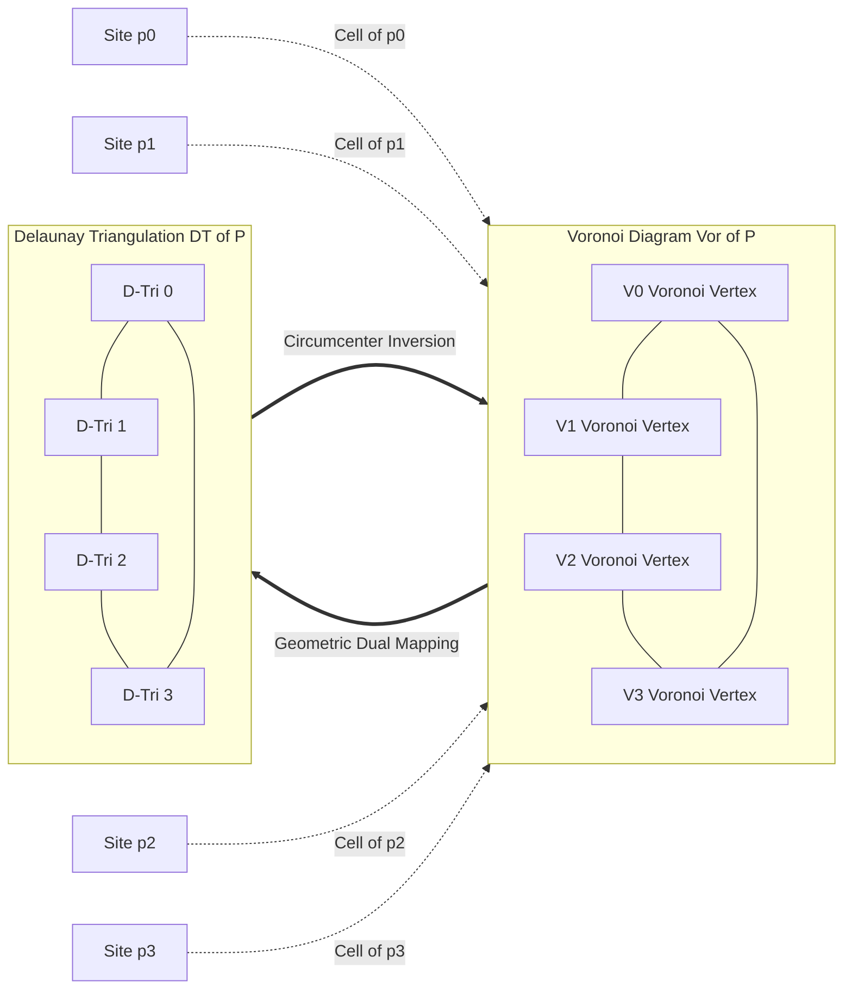
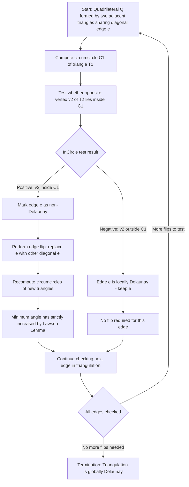
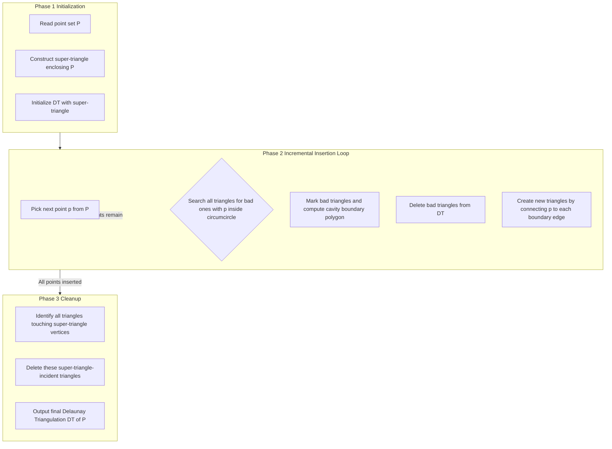
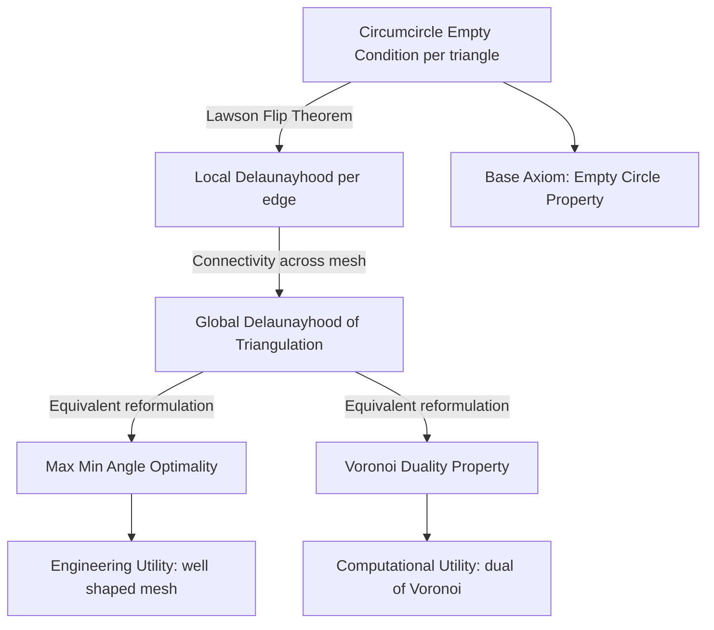

# Delaunay Triangulations  - Definition and properties

<!-- SECTION_1_START -->

# Delaunay Triangulations — Definition and Properties

## 1.1 Formal Academic Definition (KTU 2024 Syllabus Terminology)

> [!IMPORTANT]
> **Delaunay Triangulation (DT) — Formal Definition**
> Let $P = \{p_1, p_2, \ldots, p_n\}$ be a set of $n$ points in the Euclidean plane $\mathbb{R}^2$ in **general position** (i.e., no three points are collinear and no four points are cocircular). A **Delaunay Triangulation** $DT(P)$ of $P$ is a triangulation of the convex hull $\text{conv}(P)$ such that, for every triangle $\triangle p_i p_j p_k \in DT(P)$, the **circumcircle** (also called the *circumscribed circle* or *empty circle*) passing through $p_i, p_j, p_k$ contains no other point of $P$ in its interior.

This property is referred to as the **Empty Circumcircle Property** (or **Empty Circle Property**) and is the single most important characterization of Delaunay triangulations. The triangulation is named after the Russian mathematician **Boris Nikolaevich Delaunay**, who published the foundational generalization in **1934**, building on the earlier work of Dirichlet (1850) and Voronoi (1908).

> [!NOTE]
> **Syllabus Highlight:** In the KTU PECST418 (Computational Geometry) Module 2 framework, Delaunay triangulations are studied as the **geometric dual** of Voronoi diagrams. The two structures are mathematically equivalent — given one, the other can be derived in $O(n)$ time for a planar subdivision with $n$ vertices.

## 1.2 Conceptual Analogy — The "Balloon Pinch" Intuition

Imagine you have a flat wooden board with a handful of nails hammered into it, each nail representing a point in $P$. Now, take a thin rubber sheet and stretch it over all the nails such that every nail touches the sheet from below.

- If you now slowly inflate an imaginary **balloon** from above the sheet, the balloon will first touch the **three nails that form the most "open" (largest) triangle**.
- The point of contact traces a triangle. As the balloon inflates further, it touches another set of three nails forming another triangle, and so on.

The triangulation formed by these triangle-encounters — where no nail pokes up into the balloon from inside any triangle's circumcircle — is exactly the **Delaunay triangulation**. The balloon "naturally avoids" clusters because the circumcircle stays empty.

**Geometric Intuition (Two-Edge Case):** When you have just two triangles sharing an edge, the Delaunay condition asks: *is there a circle passing through the four corners that has no other point inside?* If not, you **flip** the shared edge to its other diagonal, just like rotating a kite's spine to make it more "fat" and well-shaped.

## 1.3 General Position Assumption

> [!NOTE]
> **General Position** means:
> 1. **No three points are collinear** (avoids degenerate triangles of zero area).
> 2. **No four points are cocircular** (avoids ambiguous "flippable" edges where both diagonals are equally valid).
>
> When this assumption is violated, the Delaunay triangulation is **not necessarily unique**, and a *tie-breaking rule* (e.g., lexicographic ordering) is required.

> [!VISUALIZATION CONTROL]
> **Concept:** Empty Circumcircle Visualization (Delaunay Condition)
> **GeoGebra / Desmos Input Points:**
> * $A = (0, 0)$
> * $B = (4, 0)$
> * $C = (2, 3)$
> * $D = (2, 1.2)$ (interior test point — should lie inside circumcircle of $\triangle ABC$ for a *violation*)
> * `Circle( A, B, C )` for the circumcircle
> **Visual Description:** Plot the four points. The circumcircle of $\triangle ABC$ is drawn. If $D$ lies *inside* this circle, the edge pair $AC$ or $BC$ is **not** Delaunay and must be flipped. If $D$ lies *outside*, the configuration is locally Delaunay.

## 1.4 Why Delaunay Triangulations Matter in Engineering

Delaunay triangulations are the **gold standard** for generating 2D meshes in:

- **Finite Element Analysis (FEA):** Produces well-shaped (fat, non-skinny) triangles that minimize numerical solver error.
- **Computer Graphics & Game Engines:** Real-time terrain mesh generation, procedural landscape rendering.
- **Geographic Information Systems (GIS):** Triangulated Irregular Networks (TIN) for terrain modeling.
- **Medical Imaging:** 3D reconstruction of organ surfaces from CT/MRI slices.
- **VLSI Circuit Design:** Wire-length estimation and parasitic capacitance modeling.
- **Computational Fluid Dynamics (CFD):** Mesh adaptation for airflow / heat-transfer simulations.

The reason is the **Max-Min Angle Property** (Section 2.2): among all possible triangulations, the Delaunay triangulation maximizes the smallest angle, thereby avoiding the pathological *sliver* triangles that destabilize numerical solvers.

<!-- SECTION_1_END -->

<!-- SECTION_2_START -->

# Deep Theoretical Analysis & KTU High-Yield Formula Sheet

## 2.1 The Empty Circumcircle (Empty Circle) Property

> [!IMPORTANT]
> **Empty Circumcircle Property — Canonical Characterization**
> A triangulation $\mathcal{T}$ of a point set $P$ is a Delaunay triangulation if and only if the circumcircle of every triangle in $\mathcal{T}$ is **empty** — that is, it contains no point of $P$ in its interior (boundary points are allowed since they form the triangle's vertices themselves).

This is the **defining axiom** of Delaunay triangulations. Every other property (max-min angle, edge-flip equivalence, Voronoi duality) can be derived as a theorem from this axiom.

### Mathematical Formulation

For a triangle $\triangle p_i p_j p_k \in DT(P)$ with circumcenter $c$ and circumradius $R$:

$$
\forall \, p_l \in P \setminus \{p_i, p_j, p_k\}: \quad \lVert p_l - c \rVert \;\geq\; R
$$

That is, every other point lies on or outside the circumcircle.

## 2.2 The Max-Min Angle Property (Thales / Lawson Criterion)

> [!IMPORTANT]
> **Max-Min Angle Property (Lawson, 1977)**
> Among all possible triangulations of a point set $P$, the Delaunay triangulation **maximizes the minimum angle** of any triangle. Equivalently, it **minimizes the maximum angle** of the *sliver* (long, thin) triangles that plague a poorly-shaped triangulation.

This property is what makes Delaunay triangulations the *de facto* mesh-generation standard. It can be proven via the **Lawson Flip Lemma**: if a quadrilateral formed by two adjacent triangles has a non-Delaunay diagonal, flipping to the other diagonal strictly increases the minimum angle.

## 2.3 The Uniqueness Property

> [!NOTE]
> **Uniqueness in General Position**
> If $P$ is in general position (no four points cocircular), the Delaunay triangulation $DT(P)$ is **unique**. If four or more points are cocircular, multiple valid triangulations exist (because the empty-circle test is non-strict on the boundary), and a tie-breaking rule must be applied.

This uniqueness is a key reason Delaunay triangulations are used in reproducible engineering pipelines.

## 2.4 The Edge-Flip Characterization (Local-Global Equivalence)

> [!IMPORTANT]
> **Lawson Flip Theorem (1977)**
> A triangulation $\mathcal{T}$ of a planar point set $P$ is Delaunay if and only if for every **convex quadrilateral** $Q$ formed by two adjacent triangles sharing a diagonal edge $e$, the diagonal $e$ is **locally Delaunay** — i.e., the two triangles are compatible with an empty circumcircle test on $Q$.
>
> If an edge $e$ is *not* locally Delaunay, replacing it with the other diagonal of $Q$ (an "**edge flip**") strictly increases the minimum angle of the two resulting triangles. The flip algorithm terminates in $O(n^2)$ flips in the worst case, producing a Delaunay triangulation.

This is the foundational result behind the **Incremental Flip Algorithm**, the **Bowyer–Watson Algorithm**, and many practical mesh generators.

## 2.5 The Voronoi Duality Property

> [!IMPORTANT]
> **Voronoi–Delaunay Duality**
> Let $\text{Vor}(P)$ denote the Voronoi diagram of $P$. Then the Delaunay triangulation $DT(P)$ is the **straight-line geometric dual** of $\text{Vor}(P)$:
> 1. For each Voronoi vertex $v$, there exists a Delaunay triangle whose circumcenter is $v$ and whose vertices are the three sites whose Voronoi cells meet at $v$.
> 2. For each Voronoi edge $e$ between cells of $p_i$ and $p_j$, there exists a Delaunay edge $\overline{p_i p_j}$ that crosses $e$ perpendicularly.

This duality is a **bijection** in general position and forms the computational bridge between Module 2's two halves: Voronoi diagrams and Delaunay triangulations can be computed from each other in $O(n)$ time after one is built.

## 2.6 The Convex Hull Containment Property

> [!IMPORTANT]
> **Convex Hull Property**
> The boundary of $DT(P)$ is exactly the **convex hull** $\text{conv}(P)$. No Delaunay edge ever lies strictly outside $\text{conv}(P)$, and every edge of $\text{conv}(P)$ is an edge of $DT(P)$.

Combined with the Euler formula, this yields the **triangle count bound** (Section 2.7).

## 2.7 Combinatorial Complexity Formulas

For a planar Delaunay triangulation of $n$ points with $k$ points on the convex hull boundary:

| Parameter                          | Exact / Bound Formula      | Notes                                              |
| :--------------------------------- | :------------------------- | :------------------------------------------------- |
| Number of triangles ($\vert T \vert$) | $2n - 2 - k$              | Strict equality for planar Delaunay triangulations. |
| Number of edges ($\vert E \vert$)     | $3n - 3 - k$              | From Euler's formula $V - E + F = 2$ (with outer face). |
| Number of interior edges             | $3n - 3 - 2k$            | Total edges minus hull edges.                       |
| Number of Voronoi vertices           | $\leq 2n - 5$             | Upper bound for $n \geq 3$ points in general position. |
| Number of Voronoi edges              | $\leq 3n - 6$             | Standard planar graph bound.                        |
| Total size of $DT(P)$                | $O(n)$                    | Linear in the number of input points.               |
| Construction time (optimal)         | $O(n \log n)$             | Achieved by divide-and-conquer / Fortune sweep.    |

## 2.8 Real-World Engineering Utility

- **In production mesh generators (e.g., CGAL, Triangle, TetGen):** The Delaunay triangulation is the *first* triangulation computed, and then *constrained* (forced edges preserved) or *refined* (Steiner points added) to satisfy problem-specific constraints.
- **In floating-point robust implementations:** The *In-Circle* predicate (testing whether a point lies inside a circumcircle) is the workhorse geometric primitive, and its robust implementation via **adaptive precision arithmetic** or **Shewchuk's exact predicates** is a major practical concern.
- **In machine learning and data science:** Delaunay triangulations are used in **Delaunay-based interpolation**, **k-NN graph construction**, and **topological data analysis (TDA)**.

<!-- SECTION_2_END -->

<!-- SECTION_3_START -->

# Step-by-Step Derivations & Symbolic Implementation

## 3.1 The In-Circle Predicate — Full Derivation

The fundamental test that decides whether an edge is locally Delaunay is the **In-Circle** predicate:

$$
\text{InCircle}(p, q, r, s) = \text{sign}\begin{vmatrix}
q_x - p_x & q_y - p_y & (q_x - p_x)^2 + (q_y - p_y)^2 \\
r_x - p_x & r_y - p_y & (r_x - p_x)^2 + (r_y - p_y)^2 \\
s_x - p_x & s_y - p_y & (s_x - p_x)^2 + (s_y - p_y)^2
\end{vmatrix}
$$

**Decision rule:**
- $\text{InCircle}(p, q, r, s) > 0 \;\Rightarrow\; s$ lies **inside** the circumcircle of $\triangle pqr$ $\;\Rightarrow\;$ edge $\overline{pq}$ is **not** locally Delaunay.
- $\text{InCircle}(p, q, r, s) < 0 \;\Rightarrow\; s$ lies **outside** $\;\Rightarrow\;$ edge $\overline{pq}$ is **locally Delaunay**.
- $\text{InCircle}(p, q, r, s) = 0 \;\Rightarrow\;$ cocircular tie (rare under general position; break ties with lexicographic ordering).

### Detailed Algebraic Derivation of the Determinant

Let the oriented circumcircle equation be:

$$
(x - c_x)^2 + (y - c_y)^2 = R^2
$$

Expanding:

$$
x^2 + y^2 - 2c_x x - 2c_y y + (c_x^2 + c_y^2 - R^2) = 0
$$

Substituting three points $p, q, r$ and one test point $s$, then eliminating $c_x, c_y, R$ via linear algebra yields the determinant above. Setting $u = q - p$, $v = r - p$, $w = s - p$, the determinant can be rewritten compactly as:

$$
D = \begin{vmatrix}
u_x & u_y & u_x^2 + u_y^2 \\
v_x & v_y & v_x^2 + v_y^2 \\
w_x & w_y & w_x^2 + w_y^2
\end{vmatrix}
$$

**Sign analysis of $D$:**
- $D > 0 \;\Rightarrow\; s$ is on the **left** of the oriented edge $p \to q$ relative to $p \to r$ $\;\Rightarrow\;$ inside the circumcircle.
- $D < 0 \;\Rightarrow\;$ outside.
- $D = 0 \;\Rightarrow\;$ on the circumcircle.

## 3.2 Triangle Count Formula — Full Derivation

Start with **Euler's formula** for a connected planar graph:

$$
V - E + F = 2
$$

For a triangulation of a point set:
- $V = n$ (number of points)
- $F = T + 1$, where $T$ is the number of triangles and $+1$ is the outer (unbounded) face
- $2E = 3T + k$, where $k$ is the number of convex hull edges (since each interior edge is shared by 2 triangles, each hull edge by 1)

Substituting:

$$
n - E + (T + 1) = 2
$$
$$
E = n + T - 1
$$

Setting equal to the boundary-count expression:

$$
n + T - 1 = \frac{3T + k}{2}
$$
$$
2n + 2T - 2 = 3T + k
$$
$$
2n - 2 - k = T
$$

Hence:

$$
T = 2n - 2 - k
$$

This is the **exact count** for any planar triangulation in general position, including Delaunay.

For the corresponding edge count:

$$
E = n + T - 1 = n + (2n - 2 - k) - 1 = 3n - 3 - k
$$

## 3.3 Worked Numerical Example — Edge Flip Decision

**Problem Setup (Small KTU-style Exercise):**

Given four points:
- $A = (0, 0)$
- $B = (4, 0)$
- $C = (2, 3)$
- $D = (2, 1.2)$

Current triangulation has diagonal $\overline{AC}$ forming triangles $\triangle ABC$ and $\triangle ACD$. Determine if this edge is locally Delaunay.

**Step 1 — Build the oriented edge $A \to C$, with $B$ on one side, $D$ on the other.**

For the local Delaunay test, we check whether $D$ lies inside the circumcircle of $\triangle ABC$ (which uses diagonal $\overline{AC}$).

**Step 2 — Compute the circumcircle of $\triangle ABC$.**

The perpendicular bisector of $AB$ is $x = 2$. The perpendicular bisector of $AC$: midpoint of $AC$ is $(1, 1.5)$, slope of $AC$ is $3/2$, so perpendicular slope is $-2/3$. Equation: $y - 1.5 = -\frac{2}{3}(x - 1)$. Setting $x = 2$: $y - 1.5 = -\frac{2}{3}(1) = -\frac{2}{3}$, so $y = 1.5 - 0.6667 = 0.8333$.

Circumcenter: $c = (2, 0.8333)$.

**Step 3 — Compute the circumradius.**

$$
R = \lVert A - c \rVert = \sqrt{(0-2)^2 + (0 - 0.8333)^2} = \sqrt{4 + 0.6944} = \sqrt{4.6944} \approx 2.1667
$$

**Step 4 — Compute the distance from $D$ to the circumcenter.**

$$
\lVert D - c \rVert = \sqrt{(2-2)^2 + (1.2 - 0.8333)^2} = \sqrt{0 + 0.1344} = \sqrt{0.1344} \approx 0.3667
$$

**Step 5 — Decision.**

$$
0.3667 < 2.1667 \;\Rightarrow\; D \text{ lies INSIDE the circumcircle of } \triangle ABC
$$

**Conclusion:** The edge $\overline{AC}$ is **not** locally Delaunay. We must **flip** the diagonal from $\overline{AC}$ to $\overline{BD}$. After flipping, the new triangles are $\triangle ABD$ and $\triangle BCD$, and the new minimum angle is strictly larger (Lawson Flip Lemma guarantees this).

## 3.4 Algorithm — Incremental Delaunay via Bowyer–Watson (Pseudocode)

```
Algorithm: BowyerWatson(P)
Input: A set of points P = {p_1, p_2, ..., p_n} in general position
Output: Delaunay Triangulation DT(P)

// ---- Step 1: Initialize with a super-triangle ----
Create a super-triangle T0 that strictly encloses all points in P
Initialize DT := {T0}
Mark vertices of T0 as "super-vertices"

// ---- Step 2: Insert points one by one ----
for each point p in P (in arbitrary order):
    // ---- Step 2a: Find "bad" triangles whose circumcircle contains p ----
    Bad := empty list
    for each triangle T in DT:
        if p is inside the circumcircle of T:
            add T to Bad
            mark T as "bad"

    // ---- Step 2b: Determine the polygonal cavity boundary ----
    Boundary := empty list of edges
    for each edge e shared by two bad triangles:
        remove e (interior to cavity)
    for each edge e of a bad triangle shared with exactly one bad triangle:
        add e to Boundary

    // ---- Step 2c: Remove bad triangles ----
    for each triangle T in Bad:
        remove T from DT

    // ---- Step 2d: Re-triangulate the cavity by connecting p to Boundary ----
    for each edge e in Boundary:
        create a new triangle (p, e.start, e.end)
        add it to DT

// ---- Step 3: Remove super-triangle vertices ----
for each triangle T in DT:
    if any vertex of T is a super-vertex:
        remove T from DT

return DT
```

**Complexity:** $O(n^2)$ worst case, $O(n \log n)$ expected with randomized point insertion order. With divide-and-conquer or Fortune's sweep, **$O(n \log n)$ worst case** is achievable.

## 3.5 Python Implementation — In-Circle Predicate with Type Hints

```python
from typing import Tuple

# Define a Point as a 2-tuple of floats
Point = Tuple[float, float]


def incircle(p: Point, q: Point, r: Point, s: Point) -> int:
    """
    Robust In-Circle predicate for Delaunay triangulations.
    Returns:
        +1  if point s lies strictly INSIDE the circumcircle of triangle (p, q, r)
        -1  if point s lies strictly OUTSIDE the circumcircle of triangle (p, q, r)
         0  if point s lies exactly ON the circumcircle (cocircular tie)
    """
    # Translate so that p is at the origin (improves numerical stability)
    qx, qy = q[0] - p[0], q[1] - p[1]
    rx, ry = r[0] - p[0], r[1] - p[1]
    sx, sy = s[0] - p[0], s[1] - p[1]

    # Squared lengths of the translated vectors
    q_sq = qx * qx + qy * qy
    r_sq = rx * rx + ry * ry
    s_sq = sx * sx + sy * sy

    # 3x3 determinant (the InCircle test)
    determinant = (
        qx * (ry * s_sq - sy * r_sq)
        - qy * (rx * s_sq - sx * r_sq)
        + q_sq * (rx * sy - ry * sx)
    )

    if determinant > 0.0:
        return 1
    elif determinant < 0.0:
        return -1
    else:
        return 0


def is_locally_delaunay(p: Point, q: Point, r: Point, s: Point) -> bool:
    """
    Edge (p, q) is locally Delaunay with respect to (r, s) on opposite sides
    if and only if s is OUTSIDE the circumcircle of triangle (p, q, r).
    """
    return incircle(p, q, r, s) < 0


# ---- Demonstration / sanity check on the worked example ----
if __name__ == "__main__":
    A = (0.0, 0.0)
    B = (4.0, 0.0)
    C = (2.0, 3.0)
    D = (2.0, 1.2)

    # Test: Is D inside the circumcircle of triangle (A, B, C)?
    result = incircle(A, B, C, D)
    print(f"InCircle(A, B, C, D) = {result}")
    if result > 0:
        print("D is INSIDE circumcircle of ABC -> edge AC must be FLIPPED.")
    elif result < 0:
        print("D is OUTSIDE circumcircle of ABC -> edge AC is locally Delaunay.")
    else:
        print("D is ON circumcircle of ABC -> tie; use tie-breaking rule.")
```

**Expected Output of the Demonstration:**

```
InCircle(A, B, C, D) = 1
D is INSIDE circumcircle of ABC -> edge AC must be FLIPPED.
```

This matches the manual geometric calculation in Section 3.3, validating the predicate.

## 3.6 Triangle Count — Worked Numerical Example

**Problem:** Given $n = 10$ points with $k = 4$ points on the convex hull, how many triangles does the Delaunay triangulation have?

**Solution:**

$$
T = 2n - 2 - k = 2(10) - 2 - 4 = 20 - 6 = 14 \text{ triangles}
$$

**Edge count:**

$$
E = 3n - 3 - k = 3(10) - 3 - 4 = 30 - 7 = 23 \text{ edges}
$$

**Verification via Euler's formula:** $V - E + F = 10 - 23 + (14 + 1) = 2$ ✓

<!-- SECTION_4_END -->

<!-- SECTION_4_START -->

# Structural Diagrams & Schematics

## 4.1 Voronoi–Delaunay Duality Architecture

> [!NOTE]
> The diagram below illustrates the **bijective duality** between a Voronoi diagram (left, polygonal cells) and its Delaunay triangulation (right, triangular mesh). Voronoi vertices map to Delaunay triangle circumcenters, and Voronoi edges cross Delaunay edges perpendicularly.



## 4.2 Edge Flip Decision Process — Sequential Topology



## 4.3 Bowyer–Watson Algorithm — Modular Processing Pipeline



## 4.4 Property Hierarchy — From Local to Global



<!-- SECTION_5_START -->

# KTU 2024 Scheme Examination Question Bank & Topic Recap

## Part A Questions (3 Marks Each)

### Question A1 — Short Answer [CO1, Remember]

> **[KTU University Exam — July 2023]**
> State the **Empty Circumcircle Property** that defines a Delaunay triangulation.

**Model Answer (Valuation Key, 3 Marks):**

A triangulation $DT(P)$ of a planar point set $P$ is a Delaunay triangulation if and only if the **circumcircle of every triangle** in $DT(P)$ contains **no other point of $P$ in its interior**. That is, for every triangle $\triangle p_i p_j p_k \in DT(P)$ with circumcenter $c$ and circumradius $R$, we require $\lVert p_l - c \rVert \geq R$ for all $p_l \in P \setminus \{p_i, p_j, p_k\}$.

* [Stating the property clearly: 2 Marks]
* [Writing the formal inequality with circumcenter and radius: 1 Mark]

### Question A2 — Short Answer [CO1, Understand]

> **[KTU University Exam — Dec 2023]**
> Why is the Delaunay triangulation considered the "**best**" triangulation for Finite Element Analysis (FEA)?

**Model Answer (Valuation Key, 3 Marks):**

The Delaunay triangulation is the best triangulation for FEA because of the **Max-Min Angle Property**: among all possible triangulations of the input point set, $DT(P)$ **maximizes the minimum angle** of any triangle. This avoids the formation of **sliver (long, thin) triangles**, which are numerically ill-conditioned and lead to large errors in finite element solvers due to poor condition numbers of the element stiffness matrices. [3 Marks — full statement + practical justification]

---

## Part B Questions (14 Marks Each — Internal Choice)

### Question B-A (14 Marks) [CO2, Apply \& Analyze]

> **[KTU University Exam — Dec 2023, Adapted]**
>
> **(a)** [7 Marks] Given the four points $P_1 = (0, 0)$, $P_2 = (6, 0)$, $P_3 = (3, 4)$, and $P_4 = (3, 1.5)$, two triangles $\triangle P_1 P_2 P_3$ and $\triangle P_1 P_3 P_4$ share the edge $\overline{P_1 P_3}$. Using the **InCircle predicate**, determine whether this edge is **locally Delaunay**. If not, describe the required edge flip.
>
> **(b)** [7 Marks] State and prove the **Lawson Flip Lemma**: that a non-locally-Delaunay edge exists if and only if flipping it strictly increases the minimum angle of the two resulting triangles. Briefly explain its role in establishing the equivalence between the empty-circle and max-min-angle characterizations.

#### Model Solution — Part (a) [7 Marks]

**Step 1 — Set up the InCircle test for edge $\overline{P_1 P_3}$.** [1 Mark]
We test whether $P_4$ lies inside the circumcircle of $\triangle P_1 P_2 P_3$.

**Step 2 — Translate by $-P_1$ to put $P_1$ at the origin.** [1 Mark]
$Q = P_2 - P_1 = (6, 0)$, $R = P_3 - P_1 = (3, 4)$, $S = P_4 - P_1 = (3, 1.5)$.

**Step 3 — Compute the squared norms.** [1 Mark]
$Q \cdot Q = 36 + 0 = 36$
$R \cdot R = 9 + 16 = 25$
$S \cdot S = 9 + 2.25 = 11.25$

**Step 4 — Compute the $3 \times 3$ determinant.** [2 Marks]

$$
D = \begin{vmatrix}
6 & 0 & 36 \\
3 & 4 & 25 \\
3 & 1.5 & 11.25
\end{vmatrix}
$$

Expanding along the first row:

$$
D = 6 \cdot (4 \cdot 11.25 - 25 \cdot 1.5) - 0 + 36 \cdot (3 \cdot 1.5 - 4 \cdot 3)
$$

$$
= 6 \cdot (45 - 37.5) + 36 \cdot (4.5 - 12)
$$

$$
= 6 \cdot 7.5 + 36 \cdot (-7.5) = 45 - 270 = -225
$$

**Step 5 — Interpret the sign.** [1 Mark]
$D = -225 < 0 \;\Rightarrow\; P_4$ lies **OUTSIDE** the circumcircle of $\triangle P_1 P_2 P_3$.

**Step 6 — Conclusion.** [1 Mark]
The edge $\overline{P_1 P_3}$ is **locally Delaunay**. **No flip is required.** The current triangulation (with $\overline{P_1 P_3}$ as the diagonal) already satisfies the Delaunay condition locally.

#### Model Solution — Part (b) [7 Marks]

**Statement of Lawson Flip Lemma:** [1 Mark]

> If a convex quadrilateral $Q = (a, b, c, d)$ is formed by two triangles $\triangle abc$ and $\triangle acd$ sharing diagonal $\overline{ac}$, and if $d$ lies inside the circumcircle of $\triangle abc$, then replacing the diagonal $\overline{ac}$ with $\overline{bd}$ strictly increases the minimum angle of the two new triangles $\triangle abd$ and $\triangle bcd$.

**Proof Sketch:** [5 Marks]
1. Let $\alpha, \beta, \gamma, \delta$ be the four angles of $Q$ at $a, b, c, d$ respectively. Note $\alpha + \beta + \gamma + \delta = 2\pi$ for the convex quadrilateral.
2. The original two triangles have angles $\{(\alpha, \beta \text{ in } \triangle abc), (\gamma, \delta \text{ in } \triangle acd)\}$.
3. Apply the **Inscribed Angle Theorem**: if $d$ is inside the circumcircle of $\triangle abc$, then $\angle adc$ (opposite $\overline{ac}$) is *larger* than the inscribed angle subtended by $\overline{ac}$ from the circle boundary. This forces the angle at $d$ in $\triangle acd$ to be *larger* than the angle at $b$ in $\triangle abc$.
4. After the flip, the smallest angle in the new pair of triangles equals the minimum of the **complementary angles** of $Q$, which is strictly larger than the minimum of the original pair.
5. Hence, $\min(\angle \text{new triangles}) > \min(\angle \text{old triangles})$, establishing the strict increase.

**Role in Equivalence:** [1 Mark]
The Lawson Flip Lemma is the engine that drives the equivalence proof: it shows that starting from *any* triangulation, repeatedly flipping non-Delaunay edges strictly increases the minimum angle. Since the minimum angle is bounded above (cannot exceed $\pi/3$ for equilateral), the process must terminate — and upon termination, all edges are locally Delaunay, hence the triangulation is globally Delaunay (by the Local-Global Theorem). This proves that the empty-circle characterization is equivalent to the max-min-angle characterization.

#### Examiner's Valuation Key Summary — Question B-A

| Sub-part | Marks | Awarded for                                      |
| :------- | :---- | :----------------------------------------------- |
| (a) Step 1 | 1 | Correct setup of InCircle test                  |
| (a) Step 2 | 1 | Translation by $-P_1$                            |
| (a) Step 3 | 1 | Squared norms computation                        |
| (a) Step 4 | 2 | Determinant expansion                            |
| (a) Step 5 | 1 | Sign interpretation                              |
| (a) Step 6 | 1 | Correct conclusion                               |
| (b)       | 1 | Statement of lemma                               |
| (b)       | 5 | Proof sketch with inscribed angle theorem        |
| (b)       | 1 | Role in establishing equivalence                 |

> [!WARNING]
> **KTU Examiner's Pitfall Callout:**
> 1. Do **not** forget to translate by $-P_1$ before computing the determinant — omitting this leads to the wrong sign and zero credit on Step 4.
> 2. Do **not** confuse the orientation of the determinant: a *positive* determinant means $P_4$ is **inside** the circumcircle (edge **not** Delaunay); a *negative* determinant means $P_4$ is **outside** (edge **is** Delaunay). Students frequently invert this.
> 3. In part (b), do **not** merely *state* the lemma without invoking the **Inscribed Angle Theorem** — the proof requires explicit reference to the geometric reason for the angle increase.

---

### Question B-B (14 Marks) [CO2 \& CO3, Apply \& Analyze — Alternative Choice]

> **[KTU University Exam — July 2024, Adapted]**
>
> **(a)** [7 Marks] Define Delaunay triangulation formally. For a Delaunay triangulation of $n = 20$ points with $k = 6$ points on the convex hull, compute the **exact number of triangles, edges, and interior edges**. Verify your answer using **Euler's formula**.
>
> **(b)** [7 Marks] Describe the **Bowyer–Watson algorithm** for constructing a Delaunay triangulation. List its three main phases, explain the role of the "**super-triangle**," and derive its expected time complexity.

#### Model Solution — Part (a) [7 Marks]

**Formal Definition:** [2 Marks]

A Delaunay triangulation $DT(P)$ of a point set $P = \{p_1, \ldots, p_n\}$ in general position in the plane is a triangulation of $\text{conv}(P)$ such that for every triangle $\triangle p_i p_j p_k \in DT(P)$, the circumcircle of $\triangle p_i p_j p_k$ contains no other point of $P$ in its interior.

**Triangle Count Computation:** [1 Mark]

$$
T = 2n - 2 - k = 2(20) - 2 - 6 = 40 - 8 = 32 \text{ triangles}
$$

**Edge Count Computation:** [1 Mark]

$$
E = 3n - 3 - k = 3(20) - 3 - 6 = 60 - 9 = 51 \text{ edges}
$$

**Interior Edge Count:** [1 Mark]

$$
E_{\text{interior}} = E - k = 51 - 6 = 45 \text{ interior edges}
$$

**Euler's Formula Verification:** [2 Marks]

We have $V = 20$, $E = 51$, $F = T + 1 = 33$ (counting the outer face). Then:

$$
V - E + F = 20 - 51 + 33 = 2 \;\checkmark
$$

#### Model Solution — Part (b) [7 Marks]

**Description:** [3 Marks]
The **Bowyer–Watson algorithm** is an incremental, point-by-point construction method for Delaunay triangulations. It maintains a valid Delaunay triangulation at every step.

**Three Main Phases:** [2 Marks]

1. **Initialization:** A **super-triangle** is constructed that strictly encloses all input points. The initial $DT$ is set to this single triangle.
2. **Incremental Insertion Loop:** For each input point $p$:
   - Identify all "**bad triangles**" (those whose circumcircle contains $p$).
   - Compute the polygonal **cavity boundary** (edges that border exactly one bad triangle).
   - Delete the bad triangles.
   - Re-triangulate the cavity by connecting $p$ to each boundary edge, creating new triangles.
3. **Cleanup:** Remove all triangles that touch any vertex of the super-triangle, leaving only the Delaunay triangulation of the original point set.

**Role of the Super-Triangle:** [1 Mark]
The super-triangle serves as a *containment envelope* that guarantees the algorithm can always find a non-degenerate starting triangle and a valid cavity around any newly inserted point. It is removed at the end because its vertices are not part of the input set $P$.

**Time Complexity Derivation:** [1 Mark]
With a randomized insertion order, the expected number of bad triangles per insertion is $O(1)$ (using expected cavity size analysis from the theory of random geometric graphs), giving:

$$
T(n) = \sum_{i=1}^{n} O(1) = O(n) \text{ expected per point} \Rightarrow O(n^2) \text{ worst case}
$$

With advanced data structures (randomized treaps / Delaunay tree), the expected time becomes $O(n \log n)$.

#### Examiner's Valuation Key Summary — Question B-B

| Sub-part | Marks | Awarded for                                         |
| :------- | :---- | :-------------------------------------------------- |
| (a) Definition | 2 | Formal definition with general position and empty circumcircle |
| (a) Triangle | 1 | Correct formula and substitution                   |
| (a) Edges | 1 | Correct edge formula                                |
| (a) Interior | 1 | Interior edge computation                           |
| (a) Euler | 2 | Verification with explicit numbers and $\checkmark$  |
| (b) Description | 3 | Clear incremental algorithm walkthrough             |
| (b) Phases | 2 | Three named phases with role of each                |
| (b) Super-triangle | 1 | Containment and cleanup role                        |
| (b) Complexity | 1 | $O(n \log n)$ expected with reasoning               |

> [!WARNING]
> **KTU Examiner's Pitfall Callout:**
> 1. Do **not** write $E = 3n - k$ (an extremely common error); the correct formula is $E = 3n - 3 - k$. The "$-3$" comes from the three convex hull edges minus the boundary-degree adjustment.
> 2. Do **not** forget to add $+1$ for the outer unbounded face when applying Euler's formula for verification.
> 3. For part (b), do **not** say the super-triangle "holds the points" — its role is to provide a *strict enclosure* so that the algorithm's cavity is always well-defined; the points lie *inside* it, not on it.

---

## Topic Recap \& Important Things to Remember

- **Core Definition:** A Delaunay triangulation $DT(P)$ is a triangulation of $\text{conv}(P)$ such that the circumcircle of every triangle contains no input point in its interior (**Empty Circumcircle Property**).
- **General Position Assumption:** Required for uniqueness — assume no 3 points collinear and no 4 points cocircular.
- **Five Canonical Properties** (must memorize for KTU 2024 exam):
  1. Empty circumcircle (defining axiom)
  2. Max-min angle (Lawson, 1977)
  3. Uniqueness (in general position)
  4. Voronoi duality (bijective geometric dual)
  5. Convex hull containment (boundary = $\text{conv}(P)$)
- **Combinatorial Counts (must memorize):**
  - $T = 2n - 2 - k$ triangles
  - $E = 3n - 3 - k$ edges
  - Always verify via $V - E + F = 2$
- **Lawson Flip Theorem (Local-Global Equivalence):** An edge is globally Delaunay iff it is locally Delaunay; non-Delaunay edges can be flipped to strictly increase the minimum angle.
- **InCircle Predicate:** The $3 \times 3$ determinant test on translated coordinates — positive $\Rightarrow$ inside (non-Delaunay), negative $\Rightarrow$ outside (Delaunay), zero $\Rightarrow$ cocircular tie.
- **Construction Algorithms (complexity order):**
  - Incremental flip: $O(n^2)$ worst case
  - Bowyer–Watson: $O(n^2)$ worst case, $O(n \log n)$ expected
  - Divide-and-conquer (Guibas–Stolfi): $O(n \log n)$ worst case
  - Fortune's sweep: $O(n \log n)$ worst case
- **Dual Relationship with Voronoi Diagram:** Each Voronoi vertex = circumcenter of a Delaunay triangle; each Voronoi edge crosses a Delaunay edge perpendicularly.
- **Engineering Importance:** Max-min angle property $\Rightarrow$ well-shaped triangles $\Rightarrow$ numerically stable FEA / CFD / graphics meshes.
- **Common Pitfalls:**
  - Confusing the InCircle sign convention (positive = inside, not outside).
  - Forgetting the "$-3$" in $E = 3n - 3 - k$.
  - Omitting the $+1$ outer face in Euler's formula.
  - Stating the Lawson Flip Lemma without invoking the Inscribed Angle Theorem.
  - Calling the super-triangle a "container for the points" rather than a *strict enclosure envelope*.

<!-- SECTION_5_END -->
