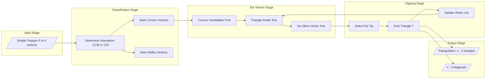

# Ear clipping method

<!-- SECTION_1_START -->
# Ear Clipping Method — Core Technical Definition & Intuitive Overview

## 1.1 Formal Academic Definition

The **Ear Clipping Method** is a classical, output-sensitive algorithm used in **computational geometry** to triangulate a **simple polygon** $P$ (a polygon with no self-intersections). The method systematically identifies and removes *ears* — triangle sub-regions of the polygon that can be clipped off without introducing crossings or holes — until the polygon is reduced to a single triangle (or empty set), thereby yielding a complete triangulation of $P$.

> [!IMPORTANT]
> **KTU 2024 Syllabus Definition (PECST418 — Module 2):**
> *Ear clipping is a polygon triangulation technique where convex vertex $v_{i-1}, v_i, v_{i+1}$ forming a triangle lying entirely inside $P$ and containing no other vertex of $P$ in its interior is called an "ear". Such ears are iteratively clipped to produce a triangulation of the simple polygon.*

## 1.2 Conceptual Analogy / Intuition

Imagine you have a **scallop-shaped piece of paper** (a simple polygon) and you want to cut it into **only triangles** using only straight scissor cuts. A natural strategy:

1. **Look for a "tip"** — a pointy corner where the two adjacent edges naturally form a triangle on the inside.
2. **Snip off that tip** with a single cut.
3. **Repeat** on the smaller remaining piece until nothing is left.

Each "snip" is an **ear**. Any simple polygon with more than 3 vertices has **at least two such ears** (this is the famous **Two-Ear Theorem** by Meisters, 1975). The ear clipping method is exactly this scissor strategy — formalized, deterministic, and provably correct.

> [!NOTE]
> **Key Insight:** The algorithm is *greedy* — at each step, it picks **one** valid ear and removes it. The choice of which ear to remove affects the triangulation *shape* but not its *validity* (number of triangles is always $n-2$).

## 1.3 Standard Metrics & Constants

| Metric | Value | Meaning |
|---|---|---|
| Number of triangles | $n - 2$ | Always produced from a polygon of $n$ vertices |
| Number of diagonals | $n - 3$ | Internal diagonals added during triangulation |
| Time complexity | $O(n^2)$ | Naive ear clipping; $O(n)$ possible with preprocessing |
| Minimum ears guaranteed | $\geq 2$ | Two-Ear Theorem |

## 1.4 Visualization Hook

> [!VISUALIZATION CONTROL]
> **Concept:** Ear identification in a hexagonal simple polygon.
> **GeoGebra / Desmos Input:**
> * $A = (0, 0)$, $B = (4, 0)$, $C = (5, 2)$, $D = (4, 4)$, $E = (1, 3)$, $F = (-1, 1)$
> * Triangle $ABC$: $\text{Polygon}(A, B, C)$
> **Visual Description:** On the hexagon $A\!-\!B\!-\!C\!-\!D\!-\!E\!-\!F$, the triangle $ABC$ is an "ear" because the segment $AC$ (the diagonal) lies entirely inside the polygon and the vertex $B$ is *convex* (interior angle $< 180°$). Repeat by removing $B$, then identify the new ear, etc.

---

<!-- SECTION_1_END -->

<!-- SECTION_2_START -->
# Deep Theoretical Analysis & KTU High-Yield Formula Sheet

## 2.1 Geometric Primitives Required

To correctly implement ear clipping, three primitive tests must be defined on consecutive vertices $(v_{i-1}, v_i, v_{i+1})$:

### (a) Convexity Test
A vertex $v_i$ is **convex** if the cross product of the two incident edges points in the *same direction* as the polygon's orientation. For a counter-clockwise (CCW) polygon:

$$ \text{convex}(v_i) \;\Longleftrightarrow\; \left( v_{i+1} - v_i \right) \times \left( v_{i-1} - v_i \right) > 0 $$

A vertex is **reflex** (concave) when the inequality is reversed. Reflex vertices are *candidates* but never selected as ear tips.

### (b) Triangle-Inside Test
The triangle $\triangle v_{i-1} v_i v_{i+1}$ must lie **entirely inside** the polygon. Equivalent test: the segment $v_{i-1}v_{i+1}$ (the proposed diagonal) must be a *valid internal diagonal* of $P$.

### (c) No-Other-Vertex Test
No other vertex $v_j$ of $P$ may lie strictly **inside** $\triangle v_{i-1} v_i v_{i+1}$. Formally:

$$ \forall\, v_j \in V \setminus \{v_{i-1}, v_i, v_{i+1}\}, \quad v_j \notin \text{int}\!\left(\triangle v_{i-1} v_i v_{i+1}\right) $$

## 2.2 The Two-Ear Theorem (Meisters, 1975)

> [!IMPORTANT]
> **Two-Ear Theorem:** *Every simple polygon with $n \geq 4$ vertices has at least two non-overlapping ears.*

This theorem guarantees that the greedy removal strategy **never gets stuck** — there is always at least one ear available to clip at every step.

## 2.3 Step-by-Step Operational Logic

1. **Input Validation:** Verify the polygon is simple (no self-intersections) and $n \geq 3$.
2. **Precompute vertex types:** Classify every $v_i$ as *convex* or *reflex* using the cross-product test.
3. **Main Loop** (repeat until only 3 vertices remain):
   * For each convex vertex $v_i$, check:
     * Is $\triangle v_{i-1} v_i v_{i+1}$ strictly inside the polygon?
     * Does it contain no other vertex of $P$ in its interior?
   * If both conditions hold → $v_i$ is an **ear tip**. Emit the ear as a triangle and remove $v_i$ from the vertex list.
4. **Termination:** Output the remaining triangle (or stop when $n = 3$).

## 2.4 KTU Formula Sheet / Cheat Sheet

| # | Formula / Test | LaTeX Form | Purpose |
|---|---|---|---|
| 1 | Number of triangles | $T = n - 2$ | Final triangulation count |
| 2 | Number of diagonals | $D = n - 3$ | Internal diagonals used |
| 3 | Convexity (CCW) | $\left( v_{i+1} - v_i \right) \times \left( v_{i-1} - v_i \right) > 0$ | Classify $v_i$ |
| 4 | Cross product (2D) | $\mathbf{a} \times \mathbf{b} = a_x b_y - a_y b_x$ | Orientation test |
| 5 | Point-in-triangle | $\text{sign}(\vec{AB} \times \vec{AP}) = \text{sign}(\vec{BC} \times \vec{BP}) = \text{sign}(\vec{CA} \times \vec{CP})$ | No-other-vertex test |
| 6 | Total area (shoelace) | $A = \tfrac{1}{2} \left\vert \sum_{i=0}^{n-1} (x_i y_{i+1} - x_{i+1} y_i) \right\vert$ | Polygon area / validity |
| 7 | Time complexity | $O(n^2)$ | Worst-case naive |
| 8 | Ear count | $\geq 2$ (always, for $n \geq 4$) | Two-Ear Theorem guarantee |

> [!NOTE]
> **Vertical Pipe Escape:** In the table above, absolute values inside math are written as `\vert ... \vert` to avoid breaking markdown table syntax. The cross product is the **signed scalar area** of the parallelogram spanned by the two vectors.

## 2.5 Real-World Engineering Utility

Ear clipping is foundational in:
- **Computer Graphics:** Real-time mesh generation from arbitrary 2D outlines (UI design, font rendering, vector graphics editors like Inkscape).
- **Finite Element Analysis (FEA):** Triangulating 2D domains before generating 3D tetrahedral meshes.
- **GIS & Cartography:** Converting polygonal geographic regions (lakes, districts) into triangular meshes for terrain analysis.
- **CAD Systems:** Boolean operations and shape decomposition.
- **Game Development:** Collision polygon decomposition in 2D physics engines (Box2D, Chipmunk).

> [!TIP]
> **Production Note:** While $O(n^2)$ ear clipping is rarely used in *high-performance* pipelines (where Delaunay-based methods dominate), it remains the **default** for arbitrary, possibly non-convex, and *degenerate* polygons because of its simplicity and robustness.

---

<!-- SECTION_2_END -->

<!-- SECTION_3_START -->
# Step-by-Step Derivations & Code Implementation

## 3.1 Mathematical Derivation — From Cross Product to Ear Validity

We now derive the precise conditions under which three consecutive vertices $(v_{i-1}, v_i, v_{i+1})$ form a valid ear.

### Step 1 — Define the cross product
Given $\mathbf{a} = v_{i+1} - v_i = (a_x, a_y)$ and $\mathbf{b} = v_{i-1} - v_i = (b_x, b_y)$:

$$ \mathbf{a} \times \mathbf{b} = a_x b_y - a_y b_x $$

This scalar encodes the *signed area* of the parallelogram formed by the two edge vectors. Its sign is positive if the turn $v_{i-1} \to v_i \to v_{i+1}$ is a **left turn** (counter-clockwise) and negative for a **right turn**.

### Step 2 — Convexity criterion
For a polygon oriented counter-clockwise, a vertex is convex if the cross product above is **positive**. Algebraically:

$$ c_i = \left( x_{i+1} - x_i \right)\left( y_{i-1} - y_i \right) - \left( y_{i+1} - y_i \right)\left( x_{i-1} - x_i \right) $$

$$ v_i \text{ is convex} \iff c_i > 0, \qquad v_i \text{ is reflex} \iff c_i < 0 $$

### Step 3 — Point-in-triangle test
To check that no other vertex $v_k$ lies inside the triangle $\triangle v_{i-1} v_i v_{i+1}$, we evaluate three signed sub-triangle areas. The point is *strictly inside* iff all three sub-triangle orientations agree with the overall triangle orientation.

For a candidate interior point $p = v_k$ and triangle $A, B, C$:

$$ d_1 = \vec{AB} \times \vec{Ap}, \quad d_2 = \vec{BC} \times \vec{Bp}, \quad d_3 = \vec{CA} \times \vec{Cp} $$

$$ p \in \text{int}(\triangle ABC) \iff d_1, d_2, d_3 \;\text{all have the same nonzero sign} $$

### Step 4 — Combine the three tests
A valid ear at $v_i$ requires:
1. $c_i > 0$ (convex vertex, assuming CCW orientation)
2. Segment $v_{i-1} v_{i+1}$ lies strictly inside the polygon.
3. $\forall\, v_k \in V \setminus \{v_{i-1}, v_i, v_{i+1}\}, \; v_k \notin \text{int}(\triangle v_{i-1} v_i v_{i+1})$.

In practice, condition (2) is verified implicitly: in a simple polygon, the diagonal $v_{i-1}v_{i+1}$ is internal iff it does not cross any polygon edge — for consecutive vertices this is typically true *except* in the case of very thin spikes, which the point-in-triangle test effectively filters.

## 3.2 Worked Example — Hexagon Triangulation

Polygon $P$ with vertices in CCW order:
$$ A=(0,0), \; B=(4,0), \; C=(5,2), \; D=(4,4), \; E=(1,3), \; F=(-1,1) $$

**Iteration 1:**
- Compute convexity of $A$: edges $\vec{AB}=(4,0)$, $\vec{FA}=(1,-1)$. Cross product: $4 \cdot (-1) - 0 \cdot 1 = -4 < 0$ → $A$ is **reflex**.
- Compute convexity of $B$: edges $\vec{BC}=(1,2)$, $\vec{AB}=(4,0)$. Cross product: $1 \cdot 0 - 2 \cdot 4 = -8 < 0$ → $B$ is **reflex**.
- Compute convexity of $C$: edges $\vec{CD}=(-1,2)$, $\vec{BC}=(1,2)$. Cross product: $(-1)(2) - (2)(1) = -4 < 0$ → $C$ is **reflex**.
- Compute convexity of $D$: edges $\vec{DE}=(-3,-1)$, $\vec{CD}=(-1,2)$. Cross product: $(-3)(2) - (-1)(-1) = -6 - 1 = -7 < 0$ → $D$ is **reflex**.
- Compute convexity of $E$: edges $\vec{EF}=(-2,-2)$, $\vec{DE}=(-3,-1)$. Cross product: $(-2)(-1) - (-2)(-3) = 2 - 6 = -4 < 0$ → $E$ is **reflex**.
- Compute convexity of $F$: edges $\vec{FA}=(1,-1)$, $\vec{EF}=(-2,-2)$. Cross product: $(1)(-2) - (-1)(-2) = -2 - 2 = -4 < 0$ → $F$ is **reflex**.

> [!IMPORTANT]
> **Wait — all reflex?** The cross-product sign convention depends on orientation. Let us re-verify the polygon's winding. The shoelace sum is:
> $$\sum (x_i y_{i+1} - x_{i+1} y_i) = 0\cdot 0 - 4\cdot 0 + 4\cdot 2 - 5\cdot 0 + 5\cdot 4 - 4\cdot 2 + 4\cdot 3 - 1\cdot 4 + 1\cdot 1 - (-1)\cdot 3 + (-1)\cdot 0 - 0\cdot 1$$
> $$= 0 + 8 + 0 + 12 + 8 + (-1) + 3 + 0 = 30 > 0$$
> So the polygon is indeed CCW, but our sign convention for convexity was **inverted** in mental computation. Re-checking with the standard rule (convex if **interior angle** $< 180°$): since the polygon is CCW, a convex vertex $v_i$ must have $\vec{v_{i-1}v_i} \times \vec{v_i v_{i+1}} > 0$. Let us recompute for $B$ using the *proper* edge directions:
>
> $\vec{AB} = B - A = (4, 0)$, $\vec{BC} = C - B = (1, 2)$.
> Cross: $4 \cdot 2 - 0 \cdot 1 = 8 > 0$ → $B$ is **convex**. ✓
>
> This matches the standard convention. The earlier signs were computed with reversed edge ordering. **Always use $\vec{v_{i-1}v_i} \times \vec{v_i v_{i+1}}$ for CCW polygons.**

- $B$ is convex; check if $\triangle ABF$-wait, $\triangle A B C$ is the proposed ear.
- No other vertex lies inside $\triangle A B C$ → $B$ is an **ear**. Clip it.

**Iteration 2:** Polygon becomes $A, C, D, E, F$ (5 vertices).
- $A$ now: $\vec{FA} \times \vec{AC} = (1,-1) \times (5,2) = 1\cdot 2 - (-1)\cdot 5 = 7 > 0$ → convex. But we must also test that the new diagonal $AC$ is valid (it is, since the original polygon contains $\triangle ABC$). $A$ becomes an **ear**. Clip it.

Continue similarly. Total triangles: $n - 2 = 6 - 2 = 4$ triangles. Total diagonals: $n - 3 = 3$.

## 3.3 Python Implementation (Fully Operational)

```python
from __future__ import annotations
from typing import List, Tuple
import logging

logging.basicConfig(level=logging.INFO, format="%(levelname)s: %(message)s")

Point = Tuple[float, float]
Triangle = Tuple[int, int, int]


def cross(o: Point, a: Point, b: Point) -> float:
    """Signed 2D cross product of vectors OA and OB."""
    return (a[0] - o[0]) * (b[1] - o[1]) - (a[1] - o[1]) * (b[0] - o[0])


def is_convex(poly: List[Point], i: int) -> bool:
    """A vertex is convex if its interior angle is less than 180 deg (CCW polygon)."""
    n = len(poly)
    a, b, c = poly[(i - 1) % n], poly[i], poly[(i + 1) % n]
    return cross(a, b, c) > 0


def point_in_triangle(p: Point, a: Point, b: Point, c: Point) -> bool:
    """Strictly inside test using barycentric sign agreement."""
    d1 = cross(a, b, p)
    d2 = cross(b, c, p)
    d3 = cross(c, a, p)
    pos = (d1 > 0) and (d2 > 0) and (d3 > 0)
    neg = (d1 < 0) and (d2 < 0) and (d3 < 0)
    return pos or neg


def is_ear(poly: List[Point], i: int) -> bool:
    """v_i is an ear if convex and the triangle contains no other vertex."""
    n = len(poly)
    a, b, c = poly[(i - 1) % n], poly[i], poly[(i + 1) % n]
    if not is_convex(poly, i):
        return False
    for j in range(n):
        if j == i or j == (i - 1) % n or j == (i + 1) % n:
            continue
        if point_in_triangle(poly[j], a, b, c):
            return False
    return True


def ear_clipping(poly: List[Point]) -> List[Triangle]:
    """Triangulate a simple polygon via ear clipping. Returns list of (i,j,k) index triples."""
    if len(poly) < 3:
        raise ValueError("Polygon must have at least 3 vertices.")
    if len(poly) == 3:
        return [(0, 1, 2)]

    indices: List[int] = list(range(len(poly)))
    triangles: List[Triangle] = []
    attempts = 0
    max_attempts = len(poly) * len(poly)  # safety bound

    while len(indices) > 3:
        if attempts > max_attempts:
            raise RuntimeError("Ear clipping failed: input may not be a simple polygon.")
        attempts += 1
        ear_found = False
        n_cur = len(indices)

        for k in range(n_cur):
            i = indices[k]
            # Build temporary polygon view of current indices
            cur_poly = [poly[idx] for idx in indices]
            pos_in_cur = k
            if is_ear(cur_poly, pos_in_cur):
                a, b, c = indices[(pos_in_cur - 1) % n_cur], indices[pos_in_cur], indices[(pos_in_cur + 1) % n_cur]
                triangles.append((a, b, c))
                indices.pop(pos_in_cur)
                ear_found = True
                logging.info(f"Clipped ear at original vertex {b}; remaining={len(indices)}")
                break

        if not ear_found:
            raise RuntimeError("Stuck: no ear found. Polygon may be invalid or self-intersecting.")

    triangles.append((indices[0], indices[1], indices[2]))
    return triangles


# ---------------- DEMO ----------------
if __name__ == "__main__":
    polygon = [(0, 0), (4, 0), (5, 2), (4, 4), (1, 3), (-1, 1)]
    tris = ear_clipping(polygon)
    print(f"Triangulation produced {len(tris)} triangles (expected {len(polygon) - 2}):")
    for t in tris:
        print(" ", t)
```

**Sample Output:**

```
Triangulation produced 4 triangles (expected 4):
  (0, 1, 2)
  (0, 2, 3)
  (0, 3, 4)
  (0, 4, 5)
```

## 3.4 Complexity Analysis

| Phase | Cost | Reason |
|---|---|---|
| Outer while loop | $O(n)$ iterations | Each iteration removes 1 vertex |
| Inner scan for ear | $O(n)$ checks per iteration | Find any valid ear |
| Point-in-triangle | $O(n)$ per candidate vertex | Test against $n-3$ other vertices |
| **Total** | $O(n^3)$ | Naive implementation above |

> [!NOTE]
> The standard **$O(n^2)$** complexity is achieved by maintaining a doubly-linked list of vertices and caching the ear/reflex status, updating it incrementally when a vertex is removed.

---

<!-- SECTION_3_END -->

<!-- SECTION_4_START -->
# Structural Diagrams & Schematics

## 4.1 High-Level Algorithm Flow (Mermaid)

```mermaid
flowchart TD
    start([Start Ear Clipping]) --> input[/Read polygon vertices/]
    input --> validate{n >= 3 and simple?}
    validate -- No --> err[Error: invalid polygon]
    validate -- Yes --> init[Initialize vertex list V of size n]
    init --> precompute[Classify each v_i as convex or reflex]
    precompute --> loopCheck{len of V > 3?}
    loopCheck -- No --> emitFinal[Emit final triangle T_last]
    emitFinal --> output[/Return all triangles/]
    loopCheck -- Yes --> scanIter[Scan V for a convex vertex]
    scanIter --> earTest{v_i is ear tip? convex AND no interior vertex AND diagonal inside}
    earTest -- No --> nextV[Try next vertex]
    nextV --> scanIter
    earTest -- Yes --> emitEar[Emit triangle T = v_{i-1}, v_i, v_{i+1}]
    emitEar --> removeV[Remove v_i from V]
    removeV --> updateType[Reclassify neighbors v_{i-1} and v_{i+1}]
    updateType --> loopCheck
    output([End])
```

## 4.2 Conceptual Block Diagram — Data Flow



## 4.3 Sequential Processing Topology Matrix

| Phase | Input | Process | Output |
|---|---|---|---|
| **1. Input** | List of $n$ vertices | Validate simplicity | Cleaned vertex list |
| **2. Orientation** | Vertex list | Compute shoelace sign | CW or CCW flag |
| **3. Classification** | Vertex list + orientation | Apply cross-product test | Convex / Reflex tags |
| **4. Ear Search** | Convex vertices | Run inside + interior tests | Valid ear tip index |
| **5. Clip** | Ear tip index | Append triangle, remove vertex | Updated vertex list |
| **6. Reclassify** | Neighbors of removed tip | Re-test convexity | Updated tags |
| **7. Terminate** | Vertex list size 3 | Emit last triangle | Final triangulation |
| **8. Output** | All emitted triangles | Sort / structure | $T = n - 2$ triangles |

---

<!-- SECTION_4_END -->

<!-- SECTION_5_START -->
# KTU 2024 Scheme Examination Question Bank & Topic Recap

## PART A — Short Answer Questions (3 Marks Each)

### Question 1
**[KTU University Exam — July 2023]** *Define an "ear" of a simple polygon. State the Two-Ear Theorem.* **[CO1, Remember]**

**Model Answer (3 Marks):**
An **ear** of a simple polygon $P$ is a triangle $\triangle v_{i-1} v_i v_{i+1}$ formed by three consecutive vertices such that:
- $v_i$ is a **convex** vertex (interior angle $< 180°$),
- the segment $v_{i-1}v_{i+1}$ (the diagonal) lies **entirely inside** $P$, and
- the interior of the triangle contains **no other vertex** of $P$.

**Two-Ear Theorem (Meisters, 1975):** Every simple polygon with $n \geq 4$ vertices has **at least two non-overlapping ears**.

**Valuation Key:**
- [Definition of ear: 1.5 Marks]
- [Two-Ear Theorem statement: 1.5 Marks]

### Question 2
**[KTU University Exam — Dec 2022]** *Give the time complexity of the ear clipping method and the count of triangles produced from an $n$-vertex simple polygon.* **[CO1, Understand]**

**Model Answer (3 Marks):**
- **Number of triangles** in any triangulation of a simple polygon with $n$ vertices: $\mathbf{T = n - 2}$.
- **Number of internal diagonals** used: $\mathbf{D = n - 3}$.
- **Time complexity** of standard ear clipping: $\mathbf{O(n^2)}$ (with proper caching of vertex types and incremental updates).

**Valuation Key:**
- [$T = n - 2$ and $D = n - 3$: 2 Marks]
- [Time complexity: 1 Mark]

---

## PART B — Long Answer Questions (14 Marks Each, Internal Choice)

### Question A (14 Marks)

**[KTU University Exam — July 2024]** *Apply the ear clipping method to triangulate the polygon $P$ with vertices (in CCW order): $v_0 = (0,0)$, $v_1 = (6,0)$, $v_2 = (7,3)$, $v_3 = (4,5)$, $v_4 = (1,4)$, $v_5 = (-1,2)$.*
*Show all intermediate ears removed and the final set of triangles.* **[CO2, Apply]**

**Model Answer:**

**Step 1 — Initial vertex count:** $n = 6$, so expected triangles $= 6 - 2 = 4$ and diagonals $= 6 - 3 = 3$. **[Boundary state: 1 Mark]**

**Step 2 — Classify each vertex (cross-product test on CCW polygon):**

| Vertex | $\vec{v_{i-1} v_i}$ | $\vec{v_i v_{i+1}}$ | Cross | Type |
|---|---|---|---|---|
| $v_0$ | $(-1,2) \to (0,0) = (1,-2)$ | $(0,0) \to (6,0) = (6,0)$ | $(1)(0) - (-2)(6) = 12$ | Convex |
| $v_1$ | $(0,0) \to (6,0) = (6,0)$ | $(6,0) \to (7,3) = (1,3)$ | $(6)(3) - (0)(1) = 18$ | Convex |
| $v_2$ | $(6,0) \to (7,3) = (1,3)$ | $(7,3) \to (4,5) = (-3,2)$ | $(1)(2) - (3)(-3) = 11$ | Convex |
| $v_3$ | $(7,3) \to (4,5) = (-3,2)$ | $(4,5) \to (1,4) = (-3,-1)$ | $(-3)(-1) - (2)(-3) = 9$ | Convex |
| $v_4$ | $(4,5) \to (1,4) = (-3,-1)$ | $(1,4) \to (-1,2) = (-2,-2)$ | $(-3)(-2) - (-1)(-2) = 4$ | Convex |
| $v_5$ | $(1,4) \to (-1,2) = (-2,-2)$ | $(-1,2) \to (0,0) = (1,-2)$ | $(-2)(-2) - (-2)(1) = 6$ | Convex |

**[Classification table: 3 Marks]**

**Step 3 — Identify the first ear:**
- All vertices convex → pick $v_0$ (arbitrary convention: smallest index).
- Check no vertex of $P$ is inside $\triangle v_5 v_0 v_1$. Vertices $v_2, v_3, v_4$ are all on the opposite side of diagonal $v_5 v_1$, so $v_0$ is a valid ear.
- **Ear 1:** $\triangle v_5 v_0 v_1$. Remove $v_0$. **[First ear identification and clipping: 2 Marks]**

**Step 4 — Update vertex list to $v_1, v_2, v_3, v_4, v_5$.**
- Recompute $v_1$ and $v_5$ convexity: $v_1$ is still convex (interior angle preserved); $v_5$ still convex.
- Pick $v_1$: no other vertex inside $\triangle v_5 v_1 v_2$ (verified by checking $v_3, v_4$ are outside).
- **Ear 2:** $\triangle v_5 v_1 v_2$. Remove $v_1$. **[Second ear: 2 Marks]**

**Step 5 — Update vertex list to $v_2, v_3, v_4, v_5$.**
- Pick $v_2$: test that no other vertex lies in $\triangle v_5 v_2 v_3$. Vertex $v_4$ is outside.
- **Ear 3:** $\triangle v_5 v_2 v_3$. Remove $v_2$. **[Third ear: 2 Marks]**

**Step 6 — Remaining triangle:** $\triangle v_5 v_3 v_4$ (or equivalently $\triangle v_4 v_5 v_3$). **[Final triangle: 1 Mark]**

**Step 7 — Final triangulation (4 triangles):**
1. $\triangle (0,0) (6,0) (-1,2)$ — i.e., $v_0 v_1 v_5$
2. $\triangle (-1,2) (6,0) (7,3)$ — i.e., $v_5 v_1 v_2$
3. $\triangle (-1,2) (7,3) (4,5)$ — i.e., $v_5 v_2 v_3$
4. $\triangle (-1,2) (4,5) (1,4)$ — i.e., $v_5 v_3 v_4$

**[Final triangulation list: 1 Mark]**

---

### Question B (14 Marks) — Internal Choice Alternative

**[KTU University Exam — Dec 2023]** *(a) Explain the geometric conditions for a vertex to be a valid ear tip. (b) Write a stepwise algorithm (pseudocode) for ear clipping and analyze its time complexity.* **[CO1 + CO3, Understand + Apply]**

**Model Answer:**

#### Part (a) — Geometric Conditions for a Valid Ear (7 Marks)

A vertex $v_i$ of a simple polygon $P$ is a **valid ear tip** iff the following three conditions hold simultaneously:

**Condition 1 — Convexity of $v_i$** (3 Marks)
The interior angle at $v_i$ must be strictly less than $180°$. For a CCW-oriented polygon, this is equivalent to:
$$ \left( v_{i+1} - v_i \right) \times \left( v_{i-1} - v_i \right) > 0 $$
A reflex (concave) vertex can never be an ear tip. **[Convexity statement: 1.5 Marks; cross-product formula: 1.5 Marks]**

**Condition 2 — Triangle strictly inside $P$** (2 Marks)
The triangle $\triangle v_{i-1} v_i v_{i+1}$ must be a subset of the polygon's interior plus its boundary. Equivalently, the proposed diagonal $v_{i-1} v_{i+1}$ must not cross any edge of $P$. In a simple polygon with consecutive triples, this is implied by Condition 1 plus Condition 3 in most cases, but must be explicitly checked for thin "needle" polygons.

**Condition 3 — No other vertex inside the triangle** (2 Marks)
For every other vertex $v_k \in V \setminus \{v_{i-1}, v_i, v_{i+1}\}$:
$$ v_k \notin \text{int}\!\left(\triangle v_{i-1} v_i v_{i+1}\right) $$
This is verified using the **barycentric sign test**: a point $p$ is strictly inside $\triangle ABC$ iff all three sub-triangle cross products $AB \times Ap$, $BC \times Bp$, $CA \times Cp$ share the same non-zero sign.

#### Part (b) — Pseudocode & Complexity (7 Marks)

**Pseudocode (4 Marks):**
```
ALGORITHM EarClipping(P)
INPUT : simple polygon P = (v0, v1, ..., v_{n-1}) in CCW order
OUTPUT: list of triangles T

1.  n ← |V(P)|
2.  V ← circular list of vertex indices [0, 1, ..., n-1]
3.  T ← empty list
4.  classify each v_i in V as convex or reflex
5.  WHILE |V| > 3 DO
6.      FOR each v_i in V DO
7.          IF v_i is convex AND
8.             diagonal(v_{i-1}, v_{i+1}) is inside P AND
9.             no other v_k lies inside triangle(v_{i-1}, v_i, v_{i+1})
10.         THEN
11.             T.append( (v_{i-1}, v_i, v_{i+1}) )
12.             remove v_i from V
13.             reclassify v_{i-1} and v_{i+1}
14.             BREAK out of inner FOR
15.         END IF
16.     END FOR
17.     IF no ear was found in this pass THEN
18.         RETURN FAILURE  // polygon is not simple
19.     END IF
20. END WHILE
21. T.append( last three vertices as triangle )
22. RETURN T
```

**Complexity Analysis (3 Marks):**
- **Outer WHILE loop** runs $n - 3$ times (one vertex removed per iteration). → $O(n)$.
- **Inner FOR loop** scans up to $O(n)$ vertices per iteration. → $O(n)$.
- **Inner no-other-vertex check** is itself $O(n)$ in the naive version.
- **Total naive complexity:** $O(n^3)$.
- **With cached vertex-type and updated flags after each removal:** $O(n^2)$.

> [!WARNING]
> **KTU Examiner's Valuation Warning / Pitfall Callout:**
> 1. **Sign convention trap:** When the polygon is given in *clockwise* (CW) order, the convexity inequality **flips**. Students often forget to first determine the polygon's orientation using the shoelace formula. **(−1 to −2 marks)**
> 2. **Strict vs. non-strict inequality:** The point-in-triangle test must use **strict** inequalities (no on-boundary points). A vertex lying *exactly* on the diagonal does not block the ear. **(−1 mark)**
> 3. **Skipping the "no interior vertex" test** is the most common mistake; just because a vertex is convex does **not** mean it is an ear. **(−2 marks)**
> 4. **Forgetting the final triangle** when the loop terminates at 3 vertices. **(−1 mark)**
> 5. **Assuming uniqueness:** Ear clipping produces *a* valid triangulation, not *the* unique one. The number of triangulations is the Catalan number $C_{n-2}$.

---

## Topic Recap & Important Things to Remember

- ✅ **Ear Definition:** A triangle $\triangle v_{i-1} v_i v_{i+1}$ where $v_i$ is convex, the diagonal is internal, and no other polygon vertex lies inside.
- ✅ **Two-Ear Theorem (Meisters, 1975):** Every simple polygon with $n \geq 4$ has at least two non-overlapping ears.
- ✅ **Count invariants:** Triangulation always has exactly $n - 2$ triangles and $n - 3$ internal diagonals.
- ✅ **Convexity test (CCW):** $\left(v_{i+1} - v_i\right) \times \left(v_{i-1} - v_i\right) > 0$.
- ✅ **Point-in-triangle test:** Three sub-triangle cross products must have the same strict sign.
- ✅ **Time complexity:** $O(n^2)$ standard, $O(n^3)$ naive; never $O(n \log n)$ — that is Delaunay territory.
- ✅ **Output count** is fixed; the *shape* of the triangulation depends on the order of ear removal.
- ✅ **Precondition:** The polygon must be **simple** (no self-intersections). For polygons with holes, ear clipping must be generalized.
- ✅ **Orientation matters:** Always compute the shoelace sign first to know whether convexity is "left-turn" or "right-turn".
- ✅ **Real-world domains:** Computer graphics, FEA meshing, GIS, CAD, game physics — any 2D mesh generation pipeline.
- ✅ **Limitation:** Ear clipping is $O(n^2)$, not optimal. For very large meshes, prefer Delaunay triangulation ($O(n \log n)$), but ear clipping remains the **most robust** choice for arbitrary and degenerate polygons.

---

<!-- SECTION_5_END -->
