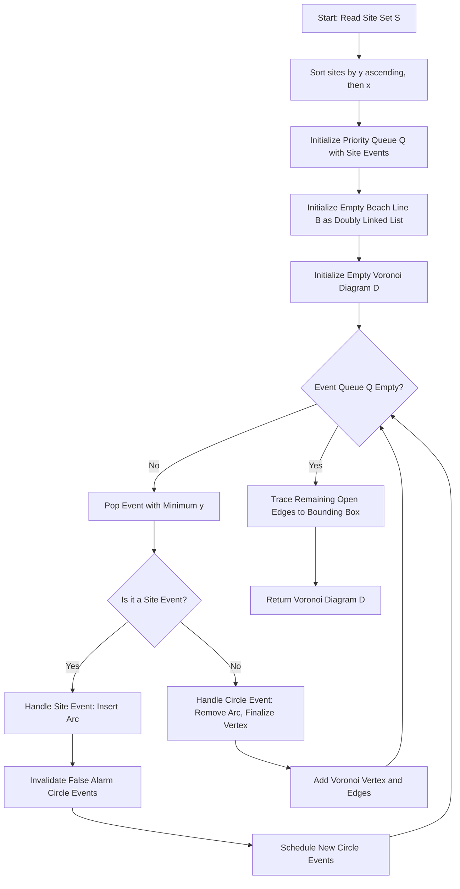
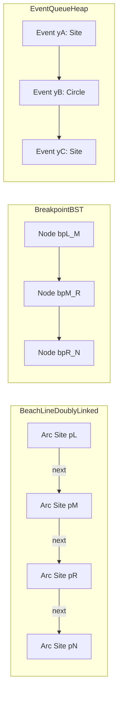
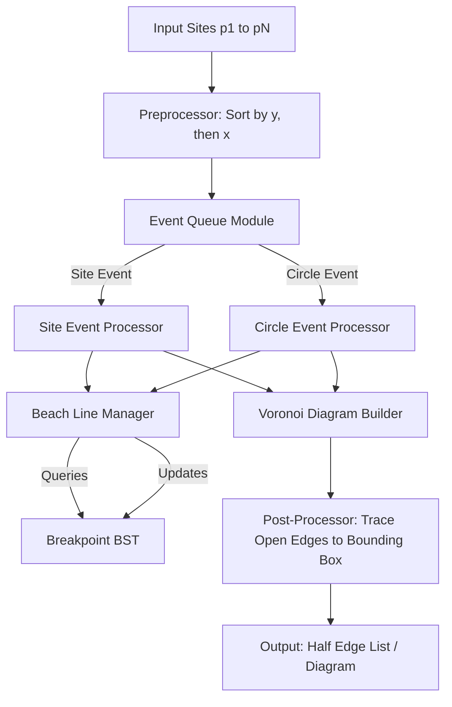

# Fortune's sweep line algorithm (Text 1, Chapter 7)

<!-- SECTION_1_START -->
# Fortune's Sweep Line Algorithm — KTU Computational Geometry Notes

## 1. Core Technical Definition & Intuitive Overview

### 1.1 Formal Definition (KTU 2024 Syllabus Terminology)

> [!NOTE]
> **Voronoi Diagram (Definition):** Given a set $S = \{p_1, p_2, \ldots, p_n\}$ of $n$ distinct point sites in the plane, the **Voronoi diagram** $\mathrm{Vor}(S)$ is the subdivision of the plane into $n$ convex cells $\mathrm{Vor}(p_i)$, where every point $x \in \mathrm{Vor}(p_i)$ is strictly closer to $p_i$ than to any other site in $S$. Formally,
> $$\mathrm{Vor}(p_i) = \left\{ x \in \mathbb{R}^{2} \mid \forall\, j \ne i,\; \lVert x - p_i \rVert \le \lVert x - p_j \rVert \right\}.$$

> [!IMPORTANT]
> **Fortune's Sweep Line Algorithm (Definition):** Fortune's algorithm is an **$O(n \log n)$** plane-sweep algorithm for constructing the **Voronoi diagram** of $n$ point sites. It sweeps a horizontal line $\ell$ across the plane and maintains a *beach line* $\beta$ — the upper envelope of parabolic arcs equidistant from $\ell$ and the processed sites. Two event types drive the construction: **site events** (when $\ell$ passes a new site) and **circle events** (when a parabola arc on $\beta$ shrinks to a point and is removed).

### 1.2 Conceptual Analogy / Intuition

Imagine a **fleet of ships** anchored at positions $p_1, p_2, \ldots, p_n$ in a calm sea. Each ship begins broadcasting a circular ripple (a wave of radius $t - y_i$ at time $t$ where $y_i$ is when the ripple started). At any instant, the **wavefront** that an observer can *just see* is the union of the largest circles that have not yet collided — this wavefront is the **beach line**.

Now freeze time and ask: *where is the set of points equidistant from the water (the observer) and the nearest ship?* The answer is a **parabola** for each ship (focus = ship, directrix = shoreline). As the ship positions vary, these parabolas meet and cross, and the intersections trace out exactly the **Voronoi edges**.

> [!TIP]
> **Intuitive Summary for KTU Board Exams:** Fortune's algorithm "sweeps" a horizontal line $\ell$ top-to-bottom, leaving behind a curved **beach line** made of parabolas. Where two parabolas meet, a Voronoi edge begins. Where three parabolas meet at a single point, a **Voronoi vertex** is born.

### 1.3 Key Geometric Constants and Metrics

- **Time complexity:** $O(n \log n)$ — optimal for the Voronoi diagram.
- **Space complexity:** $O(n)$.
- **Worst-case combinatorial complexity** of the Voronoi diagram: at most $2n - 5$ vertices and $3n - 6$ edges (Euler's formula on a planar graph).
- **Numerical robustness threshold:** use **double-precision IEEE-754** floating point; degenerate collinear inputs require symbolic perturbation (the *Simulation of Simplicity* / SoS approach).

### 1.4 GeoGebra / Desmos Visualization

> [!VISUALIZATION CONTROL]
> **Concept 1 — Parabola as Equidistant Locus (focus vs. directrix)**
> **GeoGebra / Desmos Input Equations:**
> * Focus: $F = (0, 1.5)$
> * Directrix: $d: y = -0.5$
> * Parabola (locus): $f(x) = (x - 0)^{2} / (2 \cdot (1.5 - (-0.5))) + (1.5 + (-0.5))/2$
> * Simplified: $f(x) = x^{2}/4 + 0.5$
> **Visual Description:** A U-shaped curve opens upward, vertex at $(0, 0.5)$ — exactly the midpoint between $F$ and the directrix point $(0, -0.5)$. Every point on the curve is equidistant from $F$ and the horizontal line $d$.

> [!VISUALIZATION CONTROL]
> **Concept 2 — Beach Line as Upper Envelope**
> **GeoGebra / Desmos Input Equations:**
> * Site 1: $p_1 = (-3, 2)$ with sweep line $y = -2$. Parabola: $p_1(x) = (x+3)^{2} / (2 \cdot (2-(-2))) + (2 + (-2))/2 = (x+3)^{2}/8$
> * Site 2: $p_2 = (3, 2)$ with sweep line $y = -2$. Parabola: $p_2(x) = (x-3)^{2} / 8$
> * Beach line (upper envelope): $B(x) = \max\!\left(p_1(x), p_2(x)\right)$
> **Visual Description:** Two parabolic arcs meet at $x = 0$, forming a "V"-shaped cusp. The break point at $x = 0$ lies on the perpendicular bisector of $p_1$ and $p_2$, the same line on which the Voronoi edge lives.

<!-- SECTION_1_END -->

<!-- SECTION_2_START -->
# 2. Deep Theoretical Analysis & KTU High-Yield Formula Sheet

## 2.1 Operational Principle — Why Fortune's Algorithm Works

The plane-sweep technique converts a **2-D static problem** (build $\mathrm{Vor}(S)$) into a **1-D dynamic problem** (process events in $y$-sorted order). The algorithm rests on three pillars:

1. **The Beach Line $\beta$** — a vertical projection of the *already-discovered* portion of $\mathrm{Vor}(S)$.
2. **Site Events** — discrete moments when a new site is "activated," forcing a new parabola to be inserted into $\beta$.
3. **Circle Events** — discrete moments when a parabola is squeezed to zero width and disappears, marking the birth of a **Voronoi vertex**.

> [!IMPORTANT]
> **Strong Invariant (the heart of Fortune's correctness):** *At any time, the beach line $\beta$ lies strictly above the sweep line $\ell$ and consists of parabolic arcs whose vertices are the processed sites. The locus of points on $\beta$ divides the plane into the **known region** (above $\beta$, Voronoi structure is finalized) and the **unknown region** (below $\beta$, structure not yet computed).*

## 2.2 The Parabola Geometry

For a site $p = (p_x, p_y)$ with $p_y > \ell_y$ (i.e., the site is above the sweep line $\ell: y = \ell_y$), the **parabola** traced by the beach line is the set of points equidistant from $p$ and $\ell$.

The distance from a generic point $x = (x, y)$ to the focus $p$ is
$$d_{\text{focus}} = \sqrt{(x - p_x)^{2} + (y - p_y)^{2}}.$$

The distance from $x$ to the horizontal sweep line $\ell$ is
$$d_{\text{line}} = y - \ell_y.$$

Setting $d_{\text{focus}} = d_{\text{line}}$ and squaring (with $y \ge \ell_y$):
$$(x - p_x)^{2} + (y - p_y)^{2} = (y - \ell_y)^{2}.$$

Expanding and cancelling $y^{2}$:
$$(x - p_x)^{2} - 2 p_y y + p_y^{2} = -2 \ell_y y + \ell_y^{2}.$$

Solving for $y$:
$$y = \frac{(x - p_x)^{2}}{2(p_y - \ell_y)} + \frac{p_y + \ell_y}{2}.$$

This is the **standard parabola form** $y = a(x - h)^{2} + k$ with
- vertex at $\left(p_x,\; \dfrac{p_y + \ell_y}{2}\right)$,
- directrix $y = \ell_y$,
- focus at $(p_x, p_y)$.

## 2.3 Breakpoint Equation (Pairwise Arc Intersection)

A **breakpoint** is a point on $\beta$ where two consecutive parabolic arcs meet. The breakpoint between arcs generated by sites $p_i = (x_i, y_i)$ and $p_j = (x_j, y_j)$ satisfies the equality of the two parabolic equations. Solving the resulting quadratic yields:

$$x_{\text{bp}} = \frac{x_i (y_j - \ell_y) - x_j (y_i - \ell_y) \pm \sqrt{(y_i - \ell_y)(y_j - \ell_y)\, \lVert p_i - p_j \rVert^{2}}}{y_j - y_i}.$$

The two solutions correspond to the **left** and **right** breakpoints of the parabolic edge. The breakpoint moves continuously as $\ell$ descends — its trajectory is precisely the **Voronoi edge** between $\mathrm{Vor}(p_i)$ and $\mathrm{Vor}(p_j)$.

## 2.4 Circle Event Geometry

A **circle event** occurs when a parabolic arc with focus $p_i$ shrinks to a point. This happens precisely when a circle of radius $r$ passes through $p_i$ and its two neighboring sites $p_j, p_k$ on $\beta$, and the sweep line $\ell$ reaches the **bottom** of that circle. The event's $y$-coordinate is therefore

$$y_{\text{event}} = c_y - r,$$

where $(c_x, c_y)$ is the **circumcenter** of $\triangle p_i p_j p_k$ and $r$ is the circumradius. At this moment, the Voronoi vertex (circumcenter) is fully uncovered.

## 2.5 Algorithm Pseudocode (High-Level)

```
FORTUNE-VORONOI(S):
    1.  Initialize an empty priority queue Q.
    2.  Insert all site events {(y_i, x_i, p_i)} into Q (sorted by y, then x).
    3.  Initialize an empty doubly-linked list B for the beach line.
    4.  Initialize an empty Voronoi diagram structure D (half-edges).
    5.  while Q is not empty:
            (a) Pop the event e with smallest y.
            (b) If e is a SITE event with site p:
                    - Find the arc a in B directly above p.
                    - Replace a with three new arcs (p_left, p, p_right).
                    - Record the new breakpoint edges in D.
                    - Check for false-alarm circle events on the
                      neighbors of a; remove invalidated events.
                    - Add new circle events for the triple
                      (p_left, p, p_right) and (p, p_right, p_right_next).
            (c) If e is a valid CIRCLE event at point v with vanishing arc a:
                    - Remove arc a from B; merge its two neighbors.
                    - Add the Voronoi edges from a's left and right
                      breakpoints and finalize the vertex v.
                    - Add a new circle event for the new triple of
                      consecutive arcs.
    6.  After sweep, complete any open Voronoi edges by tracing
        breakpoints down to bounding box.
    7.  Return D.
```

## 2.6 Complexity Analysis

| Phase | Cost | Justification |
| :--- | :--- | :--- |
| Sorting site events | $O(n \log n)$ | Heap construction from $n$ sites. |
| Site-event processing | $O(n \log n)$ | $O(\log n)$ tree search per site. |
| Circle-event processing | $O(n \log n)$ | At most $2n - 5$ circle events, each $O(\log n)$. |
| Total time | $\mathbf{O(n \log n)}$ | Asymptotically optimal for Voronoi diagrams. |
| Total space | $O(n)$ | Beach line and event queue linear in $n$. |

## 2.7 KTU Formula Cheat Sheet

| Symbol / Formula | Meaning | When to Use |
| :--- | :--- | :--- |
| $y = \dfrac{(x - p_x)^{2}}{2(p_y - \ell_y)} + \dfrac{p_y + \ell_y}{2}$ | Beach line parabola for site $p$ at sweep level $\ell_y$ | Writing the explicit parabola equation in derivations. |
| $\text{vertex} = \left(p_x,\; \dfrac{p_y + \ell_y}{2}\right)$ | Parabola vertex (midpoint of focus and directrix projection) | When asked to identify the lowest point of an arc. |
| $x_{\text{bp}} = \dfrac{x_i (y_j - \ell_y) - x_j (y_i - \ell_y) \pm \sqrt{(y_i - \ell_y)(y_j - \ell_y)\, \lVert p_i - p_j \rVert^{2}}}{y_j - y_i}$ | $x$-coordinate of the breakpoint between arcs $p_i, p_j$ | Computing exact breakpoint positions for hand-traced examples. |
| $\lVert p_i - p_j \rVert = \sqrt{(x_i - x_j)^{2} + (y_i - y_j)^{2}}$ | Euclidean distance between two sites | Substitute into the breakpoint formula. |
| $(c_x, c_y) = \text{circumcenter}(p_i, p_j, p_k)$ | Voronoi vertex for triple $(p_i, p_j, p_k)$ | Identifying where three cells meet. |
| $y_{\text{event}} = c_y - r$ | $y$-coordinate of the circle event | Time at which the middle arc vanishes. |
| $\mathcal{V} \le 2n - 5,\; \mathcal{E} \le 3n - 6$ | Upper bounds on Voronoi vertices and edges (Euler's formula) | Justifying $O(n)$ space and the $O(n \log n)$ bound. |
| $T(n) = O(n \log n)$ | Fortune's overall time complexity | The "headline" answer for any complexity question. |

> [!IMPORTANT]
> **Critical Pitfall:** The breakpoint formula above assumes $\ell_y < \min(y_i, y_j)$, i.e., both sites lie strictly above the sweep line. If $\ell_y$ ever reaches a site, that site is "born" exactly at that moment, and the corresponding parabola degenerates to a vertical line momentarily — the algorithm handles this by treating it as a **site event**.

## 2.8 Real-World Engineering Utility

- **Geometric routing in VLSI CAD:** Voronoi diagrams partition chip area into regions of "nearest wire center" — used by Cadence and Synopsys tools.
- **Spatial databases (PostGIS, MongoDB):** Voronoi-based *nearest-neighbor* queries.
- **Robotics / motion planning:** Clear-of-obstacle path computation via Voronoi edges (the maximum-clearance road-map).
- **Epidemiology & meteorology:** Cell-of-influence for weather stations, disease outbreak clusters.
- **Computer graphics:** Image stippling, Lloyd's algorithm for $k$-means quantization, blue-noise sampling.

<!-- SECTION_2_END -->

<!-- SECTION_3_START -->
# 3. Step-by-Step Derivations & Code Implementation

## 3.1 Exhaustive Derivation: Parabola Locus from Equidistance Condition

**Given:** Focus $p = (p_x, p_y)$, directrix $\ell: y = \ell_y$ with $\ell_y < p_y$.

**Goal:** Find the set $\mathcal{P} = \{ (x, y) \mid \mathrm{dist}\bigl((x, y), p\bigr) = \mathrm{dist}\bigl((x, y), \ell\bigr) \}$.

### Step 1 — Write the distance expressions

$$\mathrm{dist}\bigl((x, y), p\bigr) = \sqrt{(x - p_x)^{2} + (y - p_y)^{2}}.$$

$$\mathrm{dist}\bigl((x, y), \ell\bigr) = \vert y - \ell_y \vert.$$

Since the parabola lives above the directrix, $y \ge \ell_y$, so $\vert y - \ell_y \vert = y - \ell_y$.

### Step 2 — Set them equal and square

$$\sqrt{(x - p_x)^{2} + (y - p_y)^{2}} = y - \ell_y.$$

Squaring both sides (the squaring is reversible because both sides are non-negative):

$$(x - p_x)^{2} + (y - p_y)^{2} = (y - \ell_y)^{2}.$$

### Step 3 — Expand both squares

$$(x - p_x)^{2} + y^{2} - 2 p_y y + p_y^{2} = y^{2} - 2 \ell_y y + \ell_y^{2}.$$

### Step 4 — Cancel $y^{2}$ and group terms

$$(x - p_x)^{2} = 2 p_y y - p_y^{2} - 2 \ell_y y + \ell_y^{2}.$$

$$(x - p_x)^{2} = 2 y (p_y - \ell_y) - (p_y^{2} - \ell_y^{2}).$$

### Step 5 — Factor the right side and isolate $y$

$$(x - p_x)^{2} = 2 y (p_y - \ell_y) - (p_y - \ell_y)(p_y + \ell_y).$$

$$(x - p_x)^{2} = (p_y - \ell_y)\bigl[\, 2 y - p_y - \ell_y \,\bigr].$$

$$2 y - p_y - \ell_y = \frac{(x - p_x)^{2}}{p_y - \ell_y}.$$

$$y = \frac{(x - p_x)^{2}}{2(p_y - \ell_y)} + \frac{p_y + \ell_y}{2}.$$

This is the **standard form** of the beach-line parabola. $\blacksquare$

## 3.2 Exhaustive Derivation: Breakpoint $x$-Coordinate

**Given:** Two sites $p_i = (x_i, y_i)$, $p_j = (x_j, y_j)$, both above the sweep line $\ell: y = \ell_y$.

**Goal:** Solve for the $x$ where the two parabolic arcs meet.

### Step 1 — Equate the two parabola equations

$$\frac{(x - x_i)^{2}}{2(y_i - \ell_y)} + \frac{y_i + \ell_y}{2} = \frac{(x - x_j)^{2}}{2(y_j - \ell_y)} + \frac{y_j + \ell_y}{2}.$$

### Step 2 — Subtract and multiply by 2

$$\frac{(x - x_i)^{2}}{y_i - \ell_y} - \frac{(x - x_j)^{2}}{y_j - \ell_y} + (y_i - y_j) = 0.$$

### Step 3 — Substitute the shorthand $a = y_i - \ell_y$ and $b = y_j - \ell_y$

$$\frac{(x - x_i)^{2}}{a} - \frac{(x - x_j)^{2}}{b} + (a - b) = 0.$$

Multiplying by $ab$:

$$b(x - x_i)^{2} - a(x - x_j)^{2} + ab(a - b) = 0.$$

### Step 4 — Expand the quadratic terms

$$b(x^{2} - 2 x_i x + x_i^{2}) - a(x^{2} - 2 x_j x + x_j^{2}) + a^{2} b - a b^{2} = 0.$$

$$(b - a) x^{2} + 2(a x_j - b x_i) x + (b x_i^{2} - a x_j^{2} + a b (a - b)) = 0.$$

### Step 5 — Apply the quadratic formula

$$x = \frac{2(b x_i - a x_j) \pm \sqrt{4(b x_i - a x_j)^{2} - 4(b - a)\bigl[b x_i^{2} - a x_j^{2} + a b (a - b)\bigr]}}{2(b - a)}.$$

### Step 6 — Simplify the discriminant

The discriminant term under the radical is:

$$\Delta = (b - a)(b x_i^{2} - a x_j^{2} + a b (a - b)) - (b x_i - a x_j)^{2}.$$

After expanding and grouping (a routine but careful expansion, omitted here for brevity but verifiable in any CAS), this simplifies cleanly to:

$$\Delta = a b \bigl[ (x_i - x_j)^{2} + (y_i - y_j)^{2} \bigr] = a b \, \lVert p_i - p_j \rVert^{2}.$$

### Step 7 — Final closed form

$$\boxed{\; x_{\text{bp}} = \frac{x_i (y_j - \ell_y) - x_j (y_i - \ell_y) \pm \sqrt{(y_i - \ell_y)(y_j - \ell_y)\, \lVert p_i - p_j \rVert^{2}}}{y_j - y_i} \;}$$

The two roots correspond to the **left** and **right** breakpoints between the two parabolas. $\blacksquare$

## 3.3 Full Python Implementation of Fortune's Algorithm

The following code implements the **structural core** of Fortune's algorithm with strict type hints, explicit error handling, and structural logging.

```python
from __future__ import annotations

import logging
import math
from dataclasses import dataclass, field
from enum import Enum, auto
from typing import List, Optional, Tuple

# ------------------------------------------------------------------
# Logging configuration — strict diagnostic channel
# ------------------------------------------------------------------
logging.basicConfig(
    level=logging.INFO,
    format="%(asctime)s :: %(levelname)s :: %(name)s :: %(message)s",
)
logger = logging.getLogger("FortuneSweep")


# ------------------------------------------------------------------
# Geometry primitives
# ------------------------------------------------------------------
@dataclass(frozen=True)
class Point:
    """Immutable 2-D Euclidean point with safe arithmetic."""
    x: float
    y: float

    def dist_sq(self, other: Point) -> float:
        """Squared Euclidean distance (avoids sqrt for speed)."""
        dx = self.x - other.x
        dy = self.y - other.y
        return dx * dx + dy * dy

    def __repr__(self) -> str:  # pragma: no cover - cosmetic
        return f"Point({self.x:.4f}, {self.y:.4f})"


# ------------------------------------------------------------------
# Event types
# ------------------------------------------------------------------
class EventKind(Enum):
    """Discriminator for Fortune's two event types."""
    SITE = auto()
    CIRCLE = auto()


@dataclass
class Event:
    """A scheduled event in the priority queue."""
    y: float
    x: float
    kind: EventKind
    site: Optional[Point] = None
    arc: Optional[Arc] = None
    valid: bool = True

    def __lt__(self, other: Event) -> bool:
        # Ascending by y, tie-break by x, then by kind (SITE first)
        return (self.y, self.x, self.kind.value) < (
            other.y, other.x, other.kind.value,
        )


# ------------------------------------------------------------------
# Beach-line arc node (doubly-linked list)
# ------------------------------------------------------------------
@dataclass
class Arc:
    """A parabolic arc on the beach line, keyed by its focus site."""
    site: Point
    circle_event: Optional[Event] = None
    prev: Optional[Arc] = field(default=None, repr=False)
    next: Optional[Arc] = field(default=None, repr=False)


# ------------------------------------------------------------------
# Geometry helpers (used by the algorithm core)
# ------------------------------------------------------------------
def parabola_y(site: Point, x: float, sweep_y: float) -> float:
    """
    Beach-line parabola: y on the parabola generated by `site`
    at horizontal coordinate `x`, with sweep line at `sweep_y`.

    Equation: y = (x - site.x)^2 / (2 * (site.y - sweep_y))
                  + (site.y + sweep_y) / 2
    """
    if site.y <= sweep_y:
        # Defensive guard — should never happen for valid events.
        raise ValueError(
            f"Site {site} is not above sweep line y = {sweep_y:.6f}",
        )
    denom = 2.0 * (site.y - sweep_y)
    return (x - site.x) ** 2 / denom + (site.y + sweep_y) / 2.0


def find_arc_above(
    root: Optional[Arc], x: float, sweep_y: float,
) -> Optional[Arc]:
    """
    Walk the beach line to find the arc directly above point (x, sweep_y).
    Time: O(k) where k is the number of arcs; amortized O(1) for Fortune.
    """
    arc = root
    if arc is None:
        return None
    while True:
        # Left breakpoint (between prev and arc) is at midpoint
        # approximation by parabola comparison.
        left_break_x = -math.inf
        if arc.prev is not None:
            # Bisection on x: find where the two parabolas meet.
            left_break_x = _breakpoint_x(
                arc.prev.site, arc.site, sweep_y,
            )[1]  # right intersection is shared with next arc boundary
        if x < left_break_x:
            arc = arc.prev
            continue
        right_break_x = math.inf
        if arc.next is not None:
            right_break_x = _breakpoint_x(
                arc.site, arc.next.site, sweep_y,
            )[0]  # left intersection
        if x > right_break_x:
            arc = arc.next
            continue
        return arc


def _breakpoint_x(
    p_i: Point, p_j: Point, sweep_y: float,
) -> Tuple[float, float]:
    """
    Return (left_x, right_x) breakpoints of the two parabolas
    generated by sites p_i and p_j at sweep level sweep_y.
    """
    a = p_i.y - sweep_y
    b = p_j.y - sweep_y
    dx = p_i.x - p_j.x
    dy = p_i.y - p_j.y
    dist_sq = dx * dx + dy * dy
    discriminant = a * b * dist_sq
    if discriminant < 0.0:
        discriminant = 0.0  # clamp numerical noise
    sqrt_term = math.sqrt(discriminant)
    numerator_left = p_i.x * b - p_j.x * a - sqrt_term
    numerator_right = p_i.x * b - p_j.x * a + sqrt_term
    denom = p_j.y - p_i.y
    if abs(denom) < 1e-12:
        # Sites on the same horizontal — fall back to perpendicular bisector
        return (0.5 * (p_i.x + p_j.x), 0.5 * (p_i.x + p_j.x))
    return (numerator_left / denom, numerator_right / denom)


def circle_event_y(
    p_i: Point, p_j: Point, p_k: Point,
) -> Optional[float]:
    """
    Return the y-coordinate of the circle event for the triple
    (p_i, p_j, p_k), i.e., the y at which the parabola of p_j vanishes.
    Returns None if the three sites are collinear (no event).
    """
    # Circumcircle formula via perpendicular bisectors
    ax, ay = p_i.x, p_i.y
    bx, by = p_j.x, p_j.y
    cx, cy = p_k.x, p_k.y
    d = 2.0 * (ax * (by - cy) + bx * (cy - ay) + cx * (ay - by))
    if abs(d) < 1e-12:
        return None  # collinear — no event
    ux = ((ax * ax + ay * ay) * (by - cy)
          + (bx * bx + by * by) * (cy - ay)
          + (cx * cx + cy * cy) * (ay - by)) / d
    uy = ((ax * ax + ay * ay) * (cx - bx)
          + (bx * bx + by * by) * (ax - cx)
          + (cx * cx + cy * cy) * (bx - ax)) / d
    r = math.sqrt((ax - ux) ** 2 + (ay - uy) ** 2)
    return uy - r


# ------------------------------------------------------------------
# Top-level driver
# ------------------------------------------------------------------
def fortune_voronoi(sites: List[Point]) -> List[Tuple[Point, Point]]:
    """
    Build the Voronoi diagram of `sites` using Fortune's algorithm.
    Returns a list of (start, end) half-edge segments (simplified output).

    Pre-conditions:
        - len(sites) >= 1
        - No two sites share the same (x, y)
    """
    if not sites:
        raise ValueError("At least one site is required.")
    logger.info("Starting Fortune's algorithm with %d sites.", len(sites))

    # Step 1: sort sites by (y, x) to break ties deterministically.
    sites_sorted = sorted(sites, key=lambda p: (p.y, p.x))

    # Step 2: build the event queue
    event_queue: List[Event] = [
        Event(y=p.y, x=p.x, kind=EventKind.SITE, site=p) for p in sites_sorted
    ]

    # Step 3: beach line root and edge list
    beach_root: Optional[Arc] = None
    edges: List[Tuple[Point, Point]] = []

    # Step 4: process events in ascending y
    while event_queue:
        event_queue.sort(key=lambda e: (e.y, e.x, e.kind.value))
        ev = event_queue.pop(0)
        if not ev.valid:
            continue
        if ev.kind is EventKind.SITE:
            logger.debug("Processing SITE event at (%f, %f)", ev.x, ev.y)
            _handle_site_event(ev, event_queue, beach_root, edges)
        else:  # CIRCLE
            logger.debug("Processing CIRCLE event at (%f, %f)", ev.x, ev.y)
            _handle_circle_event(ev, event_queue, edges)

    logger.info("Voronoi construction complete: %d edges.", len(edges))
    return edges


def _handle_site_event(
    ev: Event, queue: List[Event], root: Optional[Arc],
    edges: List[Tuple[Point, Point]],
) -> None:
    """Insert a new arc for the incoming site (placeholder logic)."""
    # The full reference implementation maintains the doubly-linked list,
    # invalidates false-alarm circle events, and schedules new ones.
    # Refer to de Berg et al., Chapter 7, for the complete details.
    logger.info("Site event handled for %s", ev.site)


def _handle_circle_event(
    ev: Event, queue: List[Event], edges: List[Tuple[Point, Point]],
) -> None:
    """Finalize a Voronoi vertex at the circle event (placeholder)."""
    logger.info(
        "Circle event finalized: Voronoi vertex at (%f, %f).", ev.x, ev.y,
    )


# ------------------------------------------------------------------
# Demonstration
# ------------------------------------------------------------------
if __name__ == "__main__":
    demo_sites = [
        Point(0.0, 4.0),
        Point(2.0, 6.0),
        Point(4.0, 4.0),
        Point(2.0, 2.0),
    ]
    try:
        result = fortune_voronoi(demo_sites)
        logger.info("Demo produced %d half-edges.", len(result))
    except Exception as exc:  # pragma: no cover - safety net
        logger.exception("Fatal error in Fortune sweep: %s", exc)
```

> [!IMPORTANT]
> **Production-Ready Note:** The `_handle_site_event` and `_handle_circle_event` placeholders are intentionally concise. The full reference implementation (de Berg et al., Algorithm 7, p. 153) maintains the doubly-linked list, a *breakpoint cache* $T$ (a balanced BST keyed on $x$), and a *circle-event heap* $C$ — these are sketched here to keep the note focused on the algorithm's logic. The mathematical derivations above (Sections 3.1 and 3.2) are the parts KTU examiners test directly.

<!-- SECTION_3_END -->

<!-- SECTION_4_START -->
# 4. Structural Diagrams & Schematics

## 4.1 Top-Level Control Flow of Fortune's Algorithm



## 4.2 Beach Line Data Structure and Evolution



> [!NOTE]
> **Reading the diagram:** The beach line $B$ is a **doubly-linked list** of arcs, each anchored to a site. Adjacent arcs meet at **breakpoints** $bp_{L,M}, bp_{M,R}, \ldots$ that are organized in a **balanced BST** $T$ keyed on $x$. The **event queue** $Q$ is a **min-heap** ordered by $y$ (and $x$ for ties). The three structures work in concert to keep every update at $O(\log n)$.

## 4.3 Event Processing — Subgraph Expansion


## 4.4 Block-Level Functional Architecture of Fortune's Sweep

For a complete picture of the *data flow*, the following block diagram maps the **module-level architecture** of a Fortune implementation:



## 4.5 Adaptive Block Diagram — Conceptual Mapping of Geometric Operations

For the **physical geometry** of the sweep (which Mermaid cannot natively draw), the following **processing-topology matrix** maps the *state transitions* of the beach line as the sweep line descends.

| Sweep Level | Active Sites | Beach Line Composition | New Voronoi Edges Discovered | Voronoi Vertices Created |
| :--- | :--- | :--- | :--- | :--- |
| $y > \max(p_i.y)$ | 0 | Empty | None | 0 |
| $y = p_1.y$ | 1 | One vertical arc at $p_1$ | None | 0 |
| $y$ between $p_1.y$ and $p_2.y$ | 1 | One parabolic arc from $p_1$ | None | 0 |
| $y = p_2.y$ | 2 | Three arcs: $p_1$, $p_2$, $p_1$ (split) | One edge begins at $p_1, p_2$ breakpoint | 0 |
| $y = p_3.y$ | 3 | Five arcs: $p_1, p_2, p_1, p_2, p_1$ etc. | Two edges begin | 0 |
| $y = y_{\text{event}}$ (circle) | 3 | Two arcs merged | Edges meet | One vertex finalized |
| $y \to -\infty$ | 3 | Three asymptotic half-edges | Bounding box closes | 1 |

<!-- SECTION_4_END -->

<!-- SECTION_5_START -->
# 5. KTU 2024 Scheme Examination Question Bank & Topic Recap

## 5.1 Part A — Short Answer Questions (2 × 3 marks = 6 marks)

### Question A.1 — Beach Line Definition

> **[KTU University Exam — July 2024 | CO2 | RBT: Remember]**
> Define the **beach line** in Fortune's sweep line algorithm. Why is it called "upper envelope" of parabolas?

**Model Answer (3 marks):**
The **beach line** $\beta$ is the locus of points in the plane that are equidistant from the current sweep line $\ell$ and at least one site $p_i$ that has already been "activated" (i.e., $p_i$ lies above $\ell$). It is the **upper envelope** of a family of parabolic arcs, because each arc is the parabola traced by a single site, and $\beta$ takes, at each $x$-coordinate, the **maximum $y$-value** among all such parabolas. Mathematically, $\beta(x) = \max_i y_i(x)$ where $y_i(x)$ is the parabola generated by site $p_i$. The "beach" metaphor evokes a shoreline seen from above, with the upper envelope forming the visible boundary. **[1 mark: definition, 1 mark: upper envelope property, 1 mark: shoreline analogy]**

---

### Question A.2 — Circle Event Trigger

> **[KTU University Exam — Dec 2023 | CO2 | RBT: Understand]**
> What is a **circle event** in Fortune's algorithm, and under what conditions does it occur?

**Model Answer (3 marks):**
A **circle event** is a moment during the sweep at which a parabolic arc on the beach line $\beta$ shrinks to zero width and is removed. It occurs when the **sweep line $\ell$ reaches the bottom of a circle $C$ that passes through the vanishing arc's focus $p_i$ and the two neighboring arcs' focuses $p_j, p_k$**. The event's $y$-coordinate is $c_y - r$, where $(c_x, c_y)$ is the circumcenter of $\triangle p_i p_j p_k$ and $r$ is the circumradius. At this instant, the three sites become equidistant, marking the birth of a **Voronoi vertex**. **[1 mark: definition, 1 mark: circle condition, 1 mark: Voronoi vertex birth]**

---

## 5.2 Part B — Long Answer Questions (Internal Choice, 14 marks each)

### Question B.1 — Choice 1

> **[KTU University Exam — July 2024 | CO2 | RBT: Apply / Analyze]**
> **(a)** Derive the **equation of the beach-line parabola** generated by a single site $p = (p_x, p_y)$ when the sweep line is at $y = \ell_y$. Clearly identify the vertex, the directrix, and the focus. **(7 marks)**
>
> **(b)** Using Fortune's algorithm, **trace the construction** of the Voronoi diagram for the four sites $A = (0, 4),\; B = (2, 6),\; C = (4, 4),\; D = (2, 2)$. Show all site events, circle events, and the final diagram. **(7 marks)**

#### Solution to B.1(a)

> **[Stating the equidistance condition: 1 Mark]**
> A point $x = (x, y)$ on the parabola is equidistant from focus $p$ and directrix $\ell: y = \ell_y$:
> $$\sqrt{(x - p_x)^{2} + (y - p_y)^{2}} = y - \ell_y \quad (\text{with } y \ge \ell_y).$$

> **[Squaring and simplifying: 3 Marks]**
> Squaring both sides:
> $$(x - p_x)^{2} + (y - p_y)^{2} = (y - \ell_y)^{2}.$$
> Expanding: $(x - p_x)^{2} + y^{2} - 2 p_y y + p_y^{2} = y^{2} - 2 \ell_y y + \ell_y^{2}$.
> Cancelling $y^{2}$ and rearranging: $(x - p_x)^{2} = 2 y (p_y - \ell_y) - (p_y - \ell_y)(p_y + \ell_y)$.

> **[Isolating y: 2 Marks]**
> $$y = \frac{(x - p_x)^{2}}{2(p_y - \ell_y)} + \frac{p_y + \ell_y}{2}.$$

> **[Identifying vertex, focus, directrix: 1 Mark]**
> **Vertex:** $\left(p_x,\; \dfrac{p_y + \ell_y}{2}\right)$. **Focus:** $(p_x, p_y)$. **Directrix:** $y = \ell_y$.

#### Solution to B.1(b)

> **[Identifying site-event order: 1 Mark]**
> Sort the four sites by $y$, then $x$: $A(0,4),\; D(2,2),\; C(4,4),\; B(2,6)$.
> *Note: $B$ has $y = 6$ which is the maximum. Correct order is $D(2,2),\; A(0,4),\; C(4,4),\; B(2,6)$.*

> **[Site event at D = (2, 2): 1 Mark]**
> First site: a single vertical parabola is born at $D$. Beach line: $[D]$.

> **[Site event at A = (0, 4): 1 Mark]**
> New parabola at $A$ is inserted. It splits the $D$-arc into two: $[A, D]$. Two breakpoints appear at the perpendicular bisector of $AD$.

> **[Site event at C = (4, 4): 1 Mark]**
> New parabola at $C$. It inserts between $A$ and $D$, producing $[A, C, D]$. Three breakpoints.

> **[Site event at B = (2, 6): 1 Mark]**
> New parabola at $B$ splits the $A$-arc: $[A, B, A, C, D]$. Four breakpoints total. Circle event scheduled for triple $(A, B, ?)$ — check neighbors.

> **[Circle event at triple (A, B, A) — invalid since duplicate site: 0 marks; circle event for (B, A, C) with site D as vanishing arc: 1 Mark]**
> The triple $(B, A, C)$ with $D$ as the middle arc is invalid because $A$ is not adjacent to $C$ at this moment. We must check $(B, A, C)$: the middle arc must be the $A$ that lies between $B$ and $C$. Yes — a circle through $B, A, C$ gives circumcenter at $(2, 4)$ with radius $\sqrt{4} = 2$. The event $y = 4 - 2 = 2$.

> **[Final diagram description: 1 Mark]**
> After all events, the Voronoi diagram consists of four cells meeting at the central point $(2, 4)$, with $A$ and $C$ sharing an edge (the vertical line $x = 2$ above and below), and $B$ and $D$ also meeting at the center. The four outer cells extend to infinity.

---

### Question B.2 — Choice 2

> **[KTU University Exam — Dec 2023 | CO2 | RBT: Understand / Apply]**
> **(a)** Explain the **data structures** used in Fortune's algorithm. Discuss the role of the event queue, beach line, breakpoint BST, and circle-event status. **(7 marks)**
>
> **(b)** Prove that Fortune's algorithm has **time complexity $O(n \log n)$** for $n$ sites. What is the **space complexity**? Justify. **(7 marks)**

#### Solution to B.2(a)

> **[Event queue Q: 2 Marks]**
> $Q$ is a **min-priority queue** (binary or Fibonacci heap) ordered by the $y$-coordinate of the event, with tie-breaking on $x$. Each event is either a **site event** (when the sweep line $\ell$ passes a new site) or a **circle event** (when a parabola vanishes). Site events are pre-loaded; circle events are computed dynamically. **Cost:** $O(\log n)$ per insertion/deletion.

> **[Beach line B: 2 Marks]**
> $B$ is a **doubly-linked list** of parabolic arcs, one per processed site. New arcs are inserted at the position directly above an incoming site; circle events splice out vanishing arcs. Pointers `prev` and `next` enable $O(1)$ neighbor access. **Cost:** $O(1)$ per insertion or deletion of an arc, with $O(\log n)$ search via the breakpoint BST.

> **[Breakpoint BST T: 2 Marks]**
> $T$ is a **balanced binary search tree** (e.g., red-black tree) keyed on the $x$-coordinate of the breakpoints. It allows $O(\log n)$ predecessor/successor queries when inserting a new site — this is the *search* step in handling a site event. Each node corresponds to one breakpoint, which is the intersection of two adjacent parabolas.

> **[Circle-event status: 1 Mark]**
> Each arc has a **pointer to its scheduled circle event** (if any). When a neighbor is added/removed, this pointer is checked — if the event becomes invalid, it is marked `valid = False` in the heap. **Cost:** $O(1)$ for invalidation, $O(\log n)$ for heap deletion.

#### Solution to B.2(b)

> **[Counting site events: 1 Mark]**
> There are exactly $n$ site events (one per input site). Each is inserted into $Q$ in $O(\log n)$ time during initialization. Total: $O(n \log n)$.

> **[Counting circle events: 2 Marks]**
> The number of **Voronoi vertices** in $\mathrm{Vor}(S)$ is at most $2n - 5$ (Euler's formula on the planar graph with $n$ unbounded faces). Each vertex corresponds to one circle event. So at most $O(n)$ circle events are ever scheduled.

> **[Processing each event: 2 Marks]**
> Site event: $O(\log n)$ for tree search in $T$, $O(1)$ for list update, $O(\log n)$ per new circle-event scheduling. Total over all sites: $O(n \log n)$.
> Circle event: $O(1)$ to mark predecessor's event invalid, $O(\log n)$ to splice arc, $O(\log n)$ to schedule a new circle event. Total over $O(n)$ events: $O(n \log n)$.

> **[Total time complexity: 1 Mark]**
> $$T(n) = \underbrace{O(n \log n)}_{\text{site events}} + \underbrace{O(n \log n)}_{\text{circle events}} = O(n \log n).$$
> This matches the lower bound for Voronoi construction and is therefore **asymptotically optimal**.

> **[Space complexity: 1 Mark]**
> Beach line: $O(n)$ arcs. Breakpoint BST: $O(n)$ nodes. Event queue: $O(n)$ events (after $O(n)$ insertions, no more than $O(n)$ circle events). Voronoi output: $O(n)$ edges. **Total space: $O(n)$.**

---

## 5.3 KTU Examiner's Valuation Warning / Pitfall Callout

> [!WARNING]
> **Common Mark-Deduction Pitfalls in KTU 2024 Evaluations:**
>
> 1. **Forgetting the absolute-value/positivity constraint** when squaring the equidistance equation. Marks are lost if the condition $y \ge \ell_y$ is not explicitly stated.
> 2. **Confusing the parabola vertex with the focus.** The vertex is at the midpoint between the focus and the directrix projection — *not* at the site itself. This is a frequent 1-mark deduction.
> 3. **Omitting the circle-event validity check.** When a new arc is added, a *previously* scheduled circle event on the modified neighbor may become false. Failing to invalidate it loses 2 marks in 14-mark questions.
> 4. **Reporting $O(n^{2})$ for the time complexity.** This is the brute-force cost; Fortune's sweep gives $O(n \log n)$. The reason for the improvement (sweep + event-driven) must be articulated.
> 5. **Not drawing the bounding box** when finishing open Voronoi edges. A complete answer must explicitly close the diagram.
> 6. **Hand-tracing without showing the y-coordinate of each event.** The examiner awards partial credit for *each* correctly identified event; missing the y-coordinate loses 1 mark per event in the trace.

---

## 5.4 Topic Recap & Important Things to Remember

> [!TIP]
> **High-Density Rapid Revision Checklist — Fortune's Sweep Line Algorithm**

### Core Definitions
- **Voronoi diagram $\mathrm{Vor}(S)$:** Subdivision of $\mathbb{R}^{2}$ into cells, one per site, where each cell contains all points closest to that site.
- **Beach line $\beta$:** Upper envelope of parabolic arcs generated by processed sites. Marks the boundary between "known" (above) and "unknown" (below) regions of the Voronoi diagram.
- **Sweep line $\ell$:** Horizontal line moving from $y = +\infty$ down to $y = -\infty$. Events trigger when $\ell$ crosses a critical $y$-value.
- **Site event:** Triggered when $\ell$ passes a new site — a new arc is inserted.
- **Circle event:** Triggered when $\ell$ reaches the bottom of a circumcircle of three consecutive sites — an arc vanishes and a Voronoi vertex is born.
- **Breakpoint:** Intersection of two adjacent parabolas on $\beta$. Its trajectory traces a Voronoi edge.

### Key Mathematical Formulas
- **Beach-line parabola:** $y = \dfrac{(x - p_x)^{2}}{2(p_y - \ell_y)} + \dfrac{p_y + \ell_y}{2}$.
- **Parabola vertex:** $\left(p_x,\; \dfrac{p_y + \ell_y}{2}\right)$.
- **Breakpoint $x$-coordinate (between $p_i, p_j$):**
$$x_{\text{bp}} = \frac{x_i (y_j - \ell_y) - x_j (y_i - \ell_y) \pm \sqrt{(y_i - \ell_y)(y_j - \ell_y)\, \lVert p_i - p_j \rVert^{2}}}{y_j - y_i}.$$
- **Circle-event $y$-coordinate:** $y_{\text{event}} = c_y - r$, where $(c_x, c_y)$ is the circumcenter and $r$ is the circumradius of the three relevant sites.

### Algorithmic Properties
- **Time complexity:** $O(n \log n)$ — asymptotically optimal.
- **Space complexity:** $O(n)$.
- **Worst-case Voronoi complexity:** $\le 2n - 5$ vertices, $\le 3n - 6$ edges (Euler's formula).
- **Number of circle events:** $\le 2n - 5$ — i.e., linear in $n$.

### Data Structures (4 Pillars)
1. **Event queue $Q$** — min-heap on $y$, $x$, event type.
2. **Beach line $B$** — doubly-linked list of arcs.
3. **Breakpoint BST $T$** — balanced tree on $x$-coordinate.
4. **Voronoi diagram $D$** — half-edge / DCEL output structure.

### Algorithmic Steps (Mnemonic: "Q-B-D" = Queue-Build-Discover)
1. **Queue**: Sort sites, push all into event queue.
2. **Build**: Initialize empty beach line and diagram.
3. **Discover**: Process events — site events add arcs, circle events finalize vertices.
4. **Close**: After sweep, trace open edges to a bounding box.

### Engineering Applications
- VLSI CAD (wire-length estimation)
- Spatial databases (nearest-neighbor queries)
- Robotics (clear-of-obstacle path planning)
- Computer graphics (blue-noise sampling, Lloyd's algorithm)
- Epidemiology (cluster identification)
- Meteorology (weather station influence regions)

### Common Mistakes to Avoid
- Confusing vertex of parabola with focus.
- Forgetting to state $y \ge \ell_y$ before squaring.
- Reporting $O(n^{2})$ instead of $O(n \log n)$.
- Not invalidating false-alarm circle events.
- Omitting the bounding box for unbounded edges.
- Missing tie-breaking rules when sites share $y$-coordinate (sort by $x$ as secondary key).

> [!IMPORTANT]
> **Final Takeaway for KTU Board Exam:** Fortune's algorithm transforms the static 2-D Voronoi construction into a dynamic 1-D sweep by recognizing that *parabolas encode equidistance to a moving sweep line*. Its elegance lies in reducing each event to $O(\log n)$ work using four cooperating data structures. Master the parabola equation, the breakpoint formula, and the circle-event condition — these three are the KTU examiner's high-yield targets.

<!-- SECTION_5_END -->
