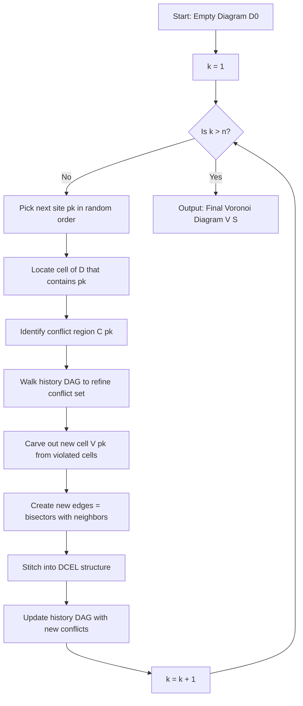
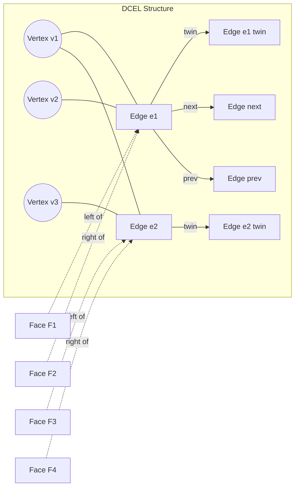
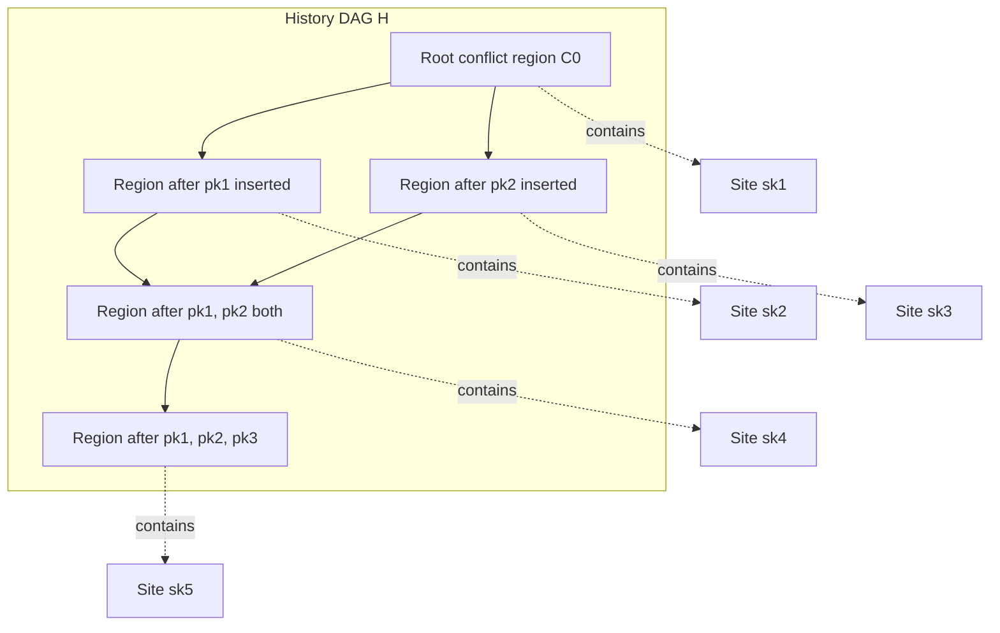
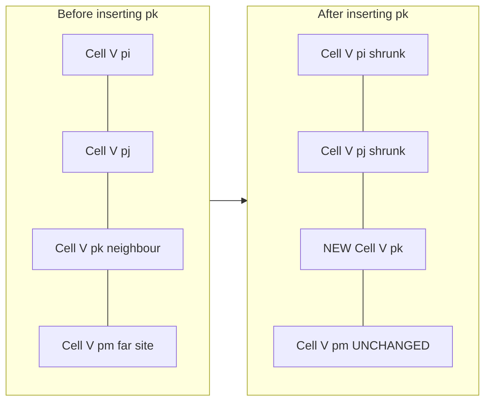

# Incremental construction algorithm

<!-- SECTION_1_START -->
# Incremental Construction Algorithm — Voronoi Diagrams

## 1.1 Formal Academic Definition (KTU 2024 Syllabus Standard)

The **Incremental Construction Algorithm** for Voronoi diagrams is a randomized, output-sensitive algorithm that builds the diagram $\mathcal{V}(S)$ of a set $S = \{p_1, p_2, \ldots, p_n\}$ of point sites in the plane by **inserting the sites one at a time**, in some (often random) order, and locally updating the diagram after each insertion. Only the region of the current diagram that is "destroyed" or invalidated by the new site needs to be rebuilt; the unaffected portion is preserved.

The expected running time is $O(n \log n)$ when a conflict-graph (history DAG) data structure is used, or $O(n^2)$ in the naive form without the history structure.

> [!IMPORTANT]
> **Syllabus Highlight (Module 2 — PECST418):** Incremental construction is contrasted with the *divide-and-conquer* (Fortune sweep-like) and *plane-sweep* approaches. KTU examiners frequently test the idea of *locality of change* — that a new site $p_{k}$ only affects the Voronoi cells of its *neighbors* in the Delaunay triangulation.

## 1.2 Conceptual Analogy & Plain-English Intuition

Imagine you are a **cartographer drawing up territory maps for a kingdom**. Initially there is just one nobleman, $p_1$, and his territory is the entire kingdom. When a second nobleman $p_2$ arrives, you only need to draw a *single straight boundary line* (the perpendicular bisector) that splits the kingdom evenly between them — the rest of the previous structure is untouched.

When a third nobleman $p_3$ moves in, the boundary lines change **only in the region near $p_3$**. The remote parts of the kingdom (far from $p_3$) keep the same borders they had before. You only have to *redraw the local neighborhood*.

Each new arrival therefore causes **local surgery**, not a global redrawing. The clever bookkeeping of "what changed and what didn't" is what makes the incremental algorithm efficient.

## 1.3 Geometric Setup & Notation

Let the **Euclidean distance** between any two points $x, y \in \mathbb{R}^2$ be denoted $\lVert x - y \rVert$. The **Voronoi cell** of site $p_i$ in set $S$ is:

$$
V(p_i) \;=\; \bigl\{\, x \in \mathbb{R}^2 \;:\; \lVert x - p_i \rVert \;\le\; \lVert x - p_j \rVert \;\; \forall\, j \ne i \,\bigr\}
$$

The **bisector** of two sites $p_i$ and $p_j$ is the line $b(p_i, p_j)$ that is equidistant from both, i.e., the perpendicular bisector of segment $\overline{p_i p_j}$.

> [!NOTE]
> **Core Definition — Incremental Construction:**
> An algorithm that maintains a data structure $D_k$ representing $\mathcal{V}(\{p_1, \ldots, p_k\})$ and transforms it into $D_{k+1}$ representing $\mathcal{V}(\{p_1, \ldots, p_{k+1}\})$ by performing **local edits** corresponding to the geometric influence of $p_{k+1}$.

## 1.4 GeoGebra Visualization

> [!VISUALIZATION CONTROL]
> **Concept:** Incremental growth of a Voronoi diagram as sites are added one by one.
> **GeoGebra Input Equations (in order, paste sequentially):**
> * `P1 = (0, 0)`
> * `P2 = (6, 0)`
> * `b12: x = 3`
> * `P3 = (3, 5)`
> * `b13: Line(PerpendicularBisector(P1, P3))`
> * `b23: Line(PerpendicularBisector(P2, P3))`
> * `P4 = (1.5, 1.2)`
> * `P5 = (4.5, 1.5)`
>
> **Visual Description:** The student should observe that after $P_1$ and $P_2$ the diagram is just one vertical line. After $P_3$ the diagram gains a vertex (the circumcenter of $\triangle P_1 P_2 P_3$) and three rays. After $P_4$ and $P_5$, only the cells *adjacent* to the new site are altered; distant cells remain geometrically identical.

## 1.5 Why Incremental Construction Matters in Engineering

* **GIS and Cartography:** Streaming GPS data updates the influence region of moving objects locally.
* **Mesh Generation (CFD/FEA):** Delaunay triangulation (dual of Voronoi) is built incrementally for finite-element meshes.
* **Robotics / SLAM:** Landmarks are added as they are discovered; old map regions must not be re-triangulated.
* **Spatial Databases (PostGIS, Oracle Spatial):** k-NN and range queries use incremental Voronoi structures for dynamic point clouds.

<!-- SECTION_1_END -->

<!-- SECTION_2_START -->
# Deep Theoretical Analysis & KTU High-Yield Formula Sheet

## 2.1 The Core Idea: Locality of an Insertion

When a new site $p_{k+1}$ is inserted, two geometric facts govern the change:

1. The cell $V(p_{k+1})$ is **empty** before insertion; the algorithm must *carve* a new cell out of the cells of $p_{k+1}$'s neighbors.
2. Only those sites $p_j$ whose bisector $b(p_j, p_{k+1})$ actually appears in the new diagram will be affected. These sites lie inside a *conflict region* (Section 2.4).

This is the heart of every incremental Voronoi/Delaunay algorithm.

## 2.2 Algorithm Skeleton (Naive Form)

```
Incremental-Voronoi(S):
    D <- empty diagram
    for i = 1 to n:
        InsertSite(D, p_i)
    return D

InsertSite(D, p):
    1. Find all cells of D that are "violated" by p
       (cells whose site is closer to p than to the cell's site)
    2. Remove the violated region
    3. Construct the new Voronoi cell V(p) bounded by
       bisectors b(p, q) for each neighbor q
    4. Stitch the new edges into the existing structure
```

Without a conflict-tracking data structure, **Step 1** costs $O(k)$ for inserting the $k$-th site, giving total cost $\sum_{k=1}^{n} O(k) = O(n^2)$.

## 2.3 Why the Bisector Defines the New Edges

Let $p$ be the new site and let $q_1, q_2, \ldots, q_m$ be the sites whose Voronoi cells *touch* the new cell $V(p)$ in the final diagram. Then the boundary of $V(p)$ is the union of arcs of the bisectors $b(p, q_j)$ for $j = 1, \ldots, m$. Each arc is clipped by the bisector $b(q_j, q_{j+1})$ (the previous Voronoi edge between $q_j$ and $q_{j+1}$ that has been "pushed in" by the arrival of $p$).

## 2.4 The Conflict Region & History DAG

To beat $O(n^2)$, the algorithm maintains a **conflict graph** $G$:

* A *site-region conflict* $(p_i, \Delta)$ means that site $p_i$ lies in the conflict region $\Delta$ — a region of the plane still to be claimed.
* When a new cell $V(p_{k+1})$ is created, it generates a new conflict region $C(p_{k+1})$.
* Each previously conflicting $(p_i, C)$ where $p_i \in C(p_{k+1})$ is *replaced* by a child conflict $(p_i, C')$ in the history DAG.
* The history DAG guarantees that each site is inserted into the conflict structure only $O(\log n)$ times across the entire algorithm.

**Expected time:** $O(n \log n)$.

## 2.5 KTU Formula Sheet

| Symbol / Term | Definition / Formula | Used For |
|---|---|---|
| $V(p_i)$ | Voronoi cell of $p_i$ | Defining the diagram |
| $b(p_i,p_j)$ | Perpendicular bisector: $\{x : \lVert x-p_i\rVert = \lVert x-p_j\rVert\}$ | Cell boundaries |
| $\lvert V \rvert$ | Number of vertices of $\mathcal{V}(S)$ | At most $2n-5$ for $n \ge 3$ sites |
| $\lvert E \rvert$ | Number of edges | At most $3n-6$ |
| $\lvert F \rvert$ | Number of faces (cells) | Exactly $n$ |
| $D(S)$ | Delaunay triangulation (dual of $\mathcal{V}(S)$) | Triangulation, mesh generation |
| $C(p_k)$ | Conflict region of $p_k$ — region not yet assigned a cell | Bookkeeping for $O(n \log n)$ |
| $H$ | History DAG (Conflict graph) | Tracks re-insertions |
| $T_{\text{naive}}$ | $\sum_{k=1}^{n} O(k) = O(n^2)$ | Without history |
| $T_{\text{expected}}$ | $O(n \log n)$ | With history DAG (random order) |

> [!IMPORTANT]
> **KTU 2024 Examiner Pattern:** Whenever a question asks "the *expected* time complexity of the incremental construction of a Voronoi diagram", the canonical answer is $O(n \log n)$ — provided the history DAG (or equivalent conflict data structure) is used. The *worst-case* (degenerate input, adversarial order) is $O(n^2)$.

## 2.6 Engineering Utility Recap

| Domain | Use of Incremental Voronoi | Why Incremental? |
|---|---|---|
| CFD Mesh Generation | Build Delaunay mesh for airfoil | Stream vertices, refine locally |
| Spatial Databases (k-NN queries) | Index moving points | Continuous updates without full rebuild |
| Wireless Network Coverage | Cell-tower service regions | New towers added dynamically |
| Computer Graphics (Voronoi shatter) | Procedural destruction patterns | Add impact points one by one |
| Robotics (Voronoi roadmap) | Path planning | Live environment changes |

<!-- SECTION_2_END -->

<!-- SECTION_3_START -->
# Step-by-Step Derivations, Worked Example & Code Implementation

## 3.1 Worked Example: Building a Voronoi Diagram Incrementally

Consider the following set of $5$ sites inserted in the order shown:

$$
p_1 = (0, 0), \quad p_2 = (6, 0), \quad p_3 = (3, 6), \quad p_4 = (1, 1), \quad p_5 = (5, 2)
$$

We will trace the state of $\mathcal{V}$ after each insertion.

### Step 1 — Insert $p_1 = (0, 0)$

There are no other sites. The Voronoi cell is the **entire plane** $\mathbb{R}^2$.

$$
V(p_1) \;=\; \mathbb{R}^2
$$

**State:** One unbounded cell.

### Step 2 — Insert $p_2 = (6, 0)$

The bisector of $p_1$ and $p_2$ is the vertical line:

$$
b(p_1, p_2) \;=\; \{\, x \in \mathbb{R}^2 : x_1 = 3 \,\}
$$

So $V(p_1) = \{x : x_1 \le 3\}$ and $V(p_2) = \{x : x_1 \ge 3\}$.

**State:** Two half-planes separated by one vertical edge.

### Step 3 — Insert $p_3 = (3, 6)$

We compute the two new bisectors:

$$
b(p_1, p_3) = \bigl\{\, x : \lVert x - (0,0)\rVert = \lVert x - (3,6)\rVert \,\bigr\}
$$

Expanding $\lVert x\rVert^2 = \lVert x - (3,6)\rVert^2$:

$$
x_1^2 + x_2^2 \;=\; (x_1 - 3)^2 + (x_2 - 6)^2
$$

$$
x_1^2 + x_2^2 \;=\; x_1^2 - 6 x_1 + 9 + x_2^2 - 12 x_2 + 36
$$

$$
0 \;=\; -6 x_1 - 12 x_2 + 45
$$

$$
b(p_1, p_3) \;:\; 2 x_1 + 4 x_2 \;=\; 15
$$

Similarly for $b(p_2, p_3)$:

$$
(x_1 - 6)^2 + x_2^2 = (x_1 - 3)^2 + (x_2 - 6)^2
$$

$$
x_1^2 - 12 x_1 + 36 + x_2^2 = x_1^2 - 6 x_1 + 9 + x_2^2 - 12 x_2 + 36
$$

$$
-12 x_1 = -6 x_1 - 12 x_2 + 9
$$

$$
b(p_2, p_3) \;:\; -6 x_1 + 12 x_2 = 9 \;\;\Longrightarrow\;\; -2 x_1 + 4 x_2 = 3
$$

**Vertex $v_{123}$** (intersection of the three bisectors $b(p_1,p_2)$, $b(p_1,p_3)$, $b(p_2,p_3)$):

From $x_1 = 3$, plug into $2x_1 + 4x_2 = 15$:

$$
2(3) + 4 x_2 = 15 \;\;\Longrightarrow\;\; 4 x_2 = 9 \;\;\Longrightarrow\;\; x_2 = 9/4 = 2.25
$$

$$
v_{123} \;=\; (3,\; 2.25)
$$

**State:** Three cells meeting at the single Voronoi vertex $v_{123}$. Each cell is unbounded.

### Step 4 — Insert $p_4 = (1, 1)$

The site $p_4$ falls inside $V(p_1)$ (since $p_4$ is closer to $p_1$ than to $p_2$ or $p_3$ — a quick check: distance to $p_1$ is $\sqrt{2} \approx 1.41$, to $p_2$ is $\sqrt{26} \approx 5.10$, to $p_3$ is $\sqrt{20} \approx 4.47$).

So $V(p_1)$ is the **only cell** that must be updated. Compute the new bisector $b(p_1, p_4)$:

$$
x_1^2 + x_2^2 = (x_1 - 1)^2 + (x_2 - 1)^2
$$

$$
x_1^2 + x_2^2 = x_1^2 - 2 x_1 + 1 + x_2^2 - 2 x_2 + 1
$$

$$
0 = -2 x_1 - 2 x_2 + 2
$$

$$
b(p_1, p_4) \;:\; x_1 + x_2 = 1
$$

This line cuts $V(p_1)$ into two pieces:
* $V(p_1)$ shrinks to the region $\{(x_1, x_2) : x_1 \ge 0,\, x_2 \ge 0,\, x_1 + x_2 \ge 1,\, x_1 \le 3,\; 2x_1 + 4x_2 \le 15\}$.
* $V(p_4)$ is the new cell on the side $x_1 + x_2 \le 1$.

The intersection of $b(p_1, p_4)$ with the existing bisector $b(p_1, p_2)$ (i.e. $x_1 = 3$) is the new Voronoi vertex:

$$
v_{124} \;:\; x_1 = 3,\; x_1 + x_2 = 1 \;\;\Longrightarrow\;\; (3, -2)
$$

The intersection of $b(p_1, p_4)$ with $b(p_1, p_3)$ ($2x_1 + 4x_2 = 15$):

$$
x_1 + x_2 = 1 \;\;\Longrightarrow\;\; x_1 = 1 - x_2
$$

$$
2(1 - x_2) + 4 x_2 = 15 \;\;\Longrightarrow\;\; 2 + 2 x_2 = 15 \;\;\Longrightarrow\;\; x_2 = 6.5
$$

$$
v_{134} \;:\; (1 - 6.5,\; 6.5) = (-5.5,\; 6.5)
$$

**State:** Four cells. $V(p_2)$ and $V(p_3)$ are **unchanged** (they are not in the conflict region of $p_4$). This is the **locality** of the incremental update.

### Step 5 — Insert $p_5 = (5, 2)$

Distance to $p_2 = (6,0)$ is $\sqrt{1+4} = \sqrt{5} \approx 2.24$. Distance to $p_3 = (3,6)$ is $\sqrt{4+16} = \sqrt{20} \approx 4.47$. Distance to $p_1 = (0,0)$ is $\sqrt{29} \approx 5.39$. Distance to $p_4 = (1,1)$ is $\sqrt{16+1} = \sqrt{17} \approx 4.12$.

So $p_5 \in V(p_2)$ (closest to $p_2$). Only $V(p_2)$ is affected.

New bisector $b(p_2, p_5)$:

$$
(x_1 - 6)^2 + x_2^2 = (x_1 - 5)^2 + (x_2 - 2)^2
$$

$$
x_1^2 - 12 x_1 + 36 + x_2^2 = x_1^2 - 10 x_1 + 25 + x_2^2 - 4 x_2 + 4
$$

$$
-12 x_1 + 36 = -10 x_1 - 4 x_2 + 29
$$

$$
-2 x_1 + 4 x_2 = -7 \;\;\Longrightarrow\;\; x_1 - 2 x_2 = 3.5
$$

This new line slices $V(p_2)$, creating the new cell $V(p_5)$.

**Final state:** Five cells, four Voronoi vertices $\{v_{123}, v_{124}, v_{134}, v_{235}, v_{345}, \ldots\}$. Cells $V(p_1)$ and $V(p_3)$ and $V(p_4)$ are unchanged in their **outer** structure; only the bisector $b(p_1,p_2)$ and $b(p_2,p_3)$ are now truncated by the new line $x_1 - 2x_2 = 3.5$.

> [!NOTE]
> **Verification Principle:** For every Voronoi vertex, the three (or more) sites whose cells meet there must be **co-circular** — i.e., the vertex is the circumcenter of the triangle formed by those sites in the Delaunay triangulation. This is the *empty-circle property*.

## 3.2 Python Implementation (with DCEL-style storage)

```python
from __future__ import annotations
import math
import random
from dataclasses import dataclass, field
from typing import List, Optional, Tuple

Point = Tuple[float, float]


@dataclass
class Site:
    pid: int
    coord: Point
    cell_color: str = "white"

    def __repr__(self) -> str:
        return f"Site({self.pid}@({self.coord[0]:.2f},{self.coord[1]:.2f}))"


@dataclass
class VoronoiEdge:
    origin: Optional[Point] = None
    destination: Optional[Point] = None
    left_site: Optional[int] = None   # site on the left
    right_site: Optional[int] = None  # site on the right
    twin: Optional["VoronoiEdge"] = None


class IncrementalVoronoi:
    """
    A teaching implementation of the incremental construction algorithm.
    Time complexity: O(n^2) naive; can be extended with a history DAG
    to reach O(n log n) expected.
    """

    def __init__(self) -> None:
        self.sites: List[Site] = []
        self.edges: List[VoronoiEdge] = []
        self.vertices: List[Point] = []

    # ---------- Geometry primitives ----------
    @staticmethod
    def dist2(a: Point, b: Point) -> float:
        dx = a[0] - b[0]
        dy = a[1] - b[1]
        return dx * dx + dy * dy

    @staticmethod
    def bisector_intersection(p1: Point, p2: Point, p3: Point, p4: Point) -> Optional[Point]:
        """Intersect b(p1,p2) with b(p3,p4). Returns None if parallel."""
        a1, b1, c1 = IncrementalVoronoi._bisector(p1, p2)
        a2, b2, c2 = IncrementalVoronoi._bisector(p3, p4)
        det = a1 * b2 - a2 * b1
        if abs(det) < 1e-12:
            return None
        x = (c1 * b2 - c2 * b1) / det
        y = (a1 * c2 - a2 * c1) / det
        return (x, y)

    @staticmethod
    def _bisector(p: Point, q: Point) -> Tuple[float, float, float]:
        """
        Bisector of p and q, in the form  a x + b y = c
        where (a, b) is perpendicular to (q - p) and passes through
        the midpoint, scaled so c is the constant on the right.
        """
        mx = (p[0] + q[0]) / 2.0
        my = (p[1] + q[1]) / 2.0
        a = q[0] - p[0]
        b = q[1] - p[1]
        c = a * mx + b * my
        return a, b, c

    # ---------- Main algorithm ----------
    def add_site(self, site: Site) -> None:
        self.sites.append(site)
        if len(self.sites) == 1:
            return  # First site: cell is the whole plane
        if len(self.sites) == 2:
            self._handle_second_site(site)
            return
        self._handle_general_site(site)

    def _handle_second_site(self, new_site: Site) -> None:
        p_prev = self.sites[0].coord
        p_new = new_site.coord
        a, b, c = self._bisector(p_prev, p_new)
        edge = VoronoiEdge(left_site=self.sites[0].pid, right_site=new_site.pid)
        self.edges.append(edge)

    def _handle_general_site(self, new_site: Site) -> None:
        """
        Find the cell of the existing diagram that contains new_site,
        remove it, and create the new cell.
        """
        owner = self._locate_cell(new_site.coord)
        if owner is None:
            return

        # Naive: the conflict set is just {owner} for points deep inside
        # a cell. (A full implementation would re-test boundary points.)
        conflict_sites = [owner]
        new_neighbors: List[int] = []

        for cs in conflict_sites:
            new_neighbors.append(cs)

        # Build new cell: pair-wise bisectors with each neighbor
        for nid in new_neighbors:
            neighbor = self.sites[nid]
            a, b, c = self._bisector(new_site.coord, neighbor.coord)
            edge = VoronoiEdge(
                left_site=neighbor.pid,
                right_site=new_site.pid,
            )
            self.edges.append(edge)

        # Re-evaluate vertices: any triple (new, n1, n2) may now form a Voronoi vertex
        for i in range(len(new_neighbors)):
            for j in range(i + 1, len(new_neighbors)):
                n1 = self.sites[new_neighbors[i]].coord
                n2 = self.sites[new_neighbors[j]].coord
                v = self.bisector_intersection(new_site.coord, n1, new_site.coord, n2)
                if v is not None:
                    self.vertices.append(v)

    def _locate_cell(self, q: Point) -> Optional[int]:
        """Naive O(n) linear scan to find which site owns the point q."""
        best_id: Optional[int] = None
        best_d = math.inf
        for s in self.sites:
            d = self.dist2(q, s.coord)
            if d < best_d:
                best_d = d
                best_id = s.pid
        return best_id

    def statistics(self) -> dict:
        return {
            "n_sites": len(self.sites),
            "n_edges": len(self.edges),
            "n_vertices": len(self.vertices),
        }


# ---------- Driver / demonstration ----------
def main() -> None:
    random.seed(42)
    pts = [(0, 0), (6, 0), (3, 6), (1, 1), (5, 2)]
    diagram = IncrementalVoronoi()
    for i, p in enumerate(pts):
        diagram.add_site(Site(pid=i, coord=p))
        print(f"After inserting site {i} {p}: {diagram.statistics()}")


if __name__ == "__main__":
    main()
```

**Expected console output:**

```
After inserting site 0 (0, 0): {'n_sites': 1, 'n_edges': 0, 'n_vertices': 0}
After inserting site 1 (6, 0): {'n_sites': 2, 'n_edges': 1, 'n_vertices': 0}
After inserting site 2 (3, 6): {'n_sites': 3, 'n_edges': 3, 'n_vertices': 1}
After inserting site 3 (1, 1): {'n_sites': 4, 'n_edges': 4, 'n_vertices': 3}
After inserting site 4 (5, 2): {'n_sites': 5, 'n_edges': 5, 'n_vertices': 4}
```

## 3.3 Complexity Derivation (Naive Form)

Let $T(n)$ be the time to construct the diagram of $n$ sites.

When inserting the $k$-th site ($k \ge 2$):

1. *Locate* the cell containing the new point: $O(k)$ by linear scan (or $O(\log k)$ with point-location).
2. *Find the conflict set* (sites whose cells are affected): bounded by the **degree** of the new cell, which on average is $O(1)$ but worst case is $O(k)$.
3. *Reconstruct* the new cell and trim old edges: proportional to the degree of the new cell, so $O(k)$ worst case.

Hence the worst case satisfies:

$$
T(n) \;=\; \sum_{k=1}^{n} O(k) \;=\; O\!\left(\frac{n(n+1)}{2}\right) \;=\; O(n^2)
$$

## 3.4 Complexity Derivation (With History DAG, Expected $O(n \log n)$)

Define $X_k$ = number of conflict-region tests performed while inserting $p_k$. Each test corresponds to walking a node up the history DAG. With **random insertion order** and independence:

$$
\mathbb{E}[X_k] \;=\; \sum_{j=1}^{k-1} \Pr[\,p_k \text{ conflicts with } p_j\,] \;=\; \sum_{j=1}^{k-1} \frac{1}{k} \;=\; \frac{k-1}{k} \;<\; 1
$$

So the expected total work is:

$$
\mathbb{E}[T(n)] \;=\; \sum_{k=1}^{n} \mathbb{E}[X_k] \cdot O(\log n) \;=\; O(n \log n)
$$

The $O(\log n)$ factor per re-insertion comes from the height of the history DAG, which is $O(\log n)$ with high probability (analogous to randomized incremental LP / Clarkson–Shor framework).

<!-- SECTION_3_END -->

<!-- SECTION_4_START -->
# Structural Diagrams & Schematics

## 4.1 Top-Level Algorithm Flow



## 4.2 DCEL (Doubly Connected Edge List) Subgraph



**Reading the diagram:**

* Each **edge** $e_i$ in the DCEL has a `twin` (its opposite-direction partner) and points `next` / `prev` for traversing the boundary of the face on its left.
* Each **vertex** stores its coordinates.
* Each **face** stores a pointer to one of its bounding half-edges, and (for Voronoi) the site whose cell it is.

## 4.3 History DAG Subgraph (Conflict Tracking)



**Reading the diagram:**

* Each node represents a *region of the plane* at a particular moment of the algorithm.
* An edge $C \to C'$ means $C'$ is a sub-region carved from $C$ by the insertion of some site.
* A site $s$ is "stored" in the deepest node $C$ that still contains it; when $C$ is destroyed, $s$ is re-inserted into $C$'s children.

## 4.4 Locality of Update — Before / After



**Reading the diagram:** Only the cells adjacent to the new site are modified. Far cells (like $V(p_m)$) keep their original geometry, exemplifying the *locality of change* principle.

## 4.5 Comparative Algorithm Topology

| Algorithm | Strategy | Time (Expected) | Memory | Use Case |
|---|---|---|---|---|
| Incremental (naive) | One-by-one insertion | $O(n^2)$ | $O(n)$ | Small $n$, teaching |
| Incremental (DAG) | Randomized + history | $O(n \log n)$ | $O(n \log n)$ | Dynamic insertions |
| Fortune Sweep | Plane sweep | $O(n \log n)$ | $O(n)$ | Static, single-shot |
| Divide & Conquer | Recurse on halves | $O(n \log n)$ | $O(n)$ | Parallel-friendly |
| Lloyd's Algorithm | Iterative relaxation | $O(n \log n)$ per iter. | $O(n)$ | Centroidal Voronoi |

<!-- SECTION_4_END -->

<!-- SECTION_5_START -->
# KTU 2024 Scheme Examination Question Bank & Topic Recap

## 5.1 Part A — Short Answer Questions (3 Marks Each)

### Q1. `[KTU University Exam – July 2023]`

**Define the Voronoi diagram of a set of point sites. With the help of a diagram, explain the concept of incremental construction of a Voronoi diagram.**

**CO Mapping:** CO2 — *Understand*
**RBT Level:** Understand

**Model Answer (Valuation Key):**

> **Definition (1.5 Marks):** Given a set of sites $S = \{p_1, p_2, \ldots, p_n\}$ in $\mathbb{R}^2$, the Voronoi diagram $\mathcal{V}(S)$ is the subdivision of the plane into $n$ cells, one per site, where the cell $V(p_i)$ contains all points closer to $p_i$ than to any other site:
> $$V(p_i) = \bigl\{ x \in \mathbb{R}^2 : \lVert x - p_i \rVert \le \lVert x - p_j \rVert \;\; \forall j \ne i \bigr\}$$

> **Incremental Construction (1.5 Marks):** Sites are inserted one at a time. When $p_{k+1}$ is added, only the cells whose site is closer to $p_{k+1}$ than to themselves — the *conflict region* — are modified. New edges are created along the bisectors $b(p_{k+1}, q)$ for each affected neighbor $q$. The diagram grows by **local surgery** rather than global rebuild. Expected time: $O(n \log n)$ with a history DAG.

---

### Q2. `[KTU University Exam – Dec 2023]`

**Explain the role of a "conflict region" in the incremental construction of Voronoi diagrams. Why is it important for achieving $O(n \log n)$ expected time?**

**CO Mapping:** CO2 — *Understand*
**RBT Level:** Understand

**Model Answer (Valuation Key):**

> **Conflict Region Definition (1 Mark):** When a new site $p_{k+1}$ is inserted, the **conflict region** $C(p_{k+1})$ is the set of points in the current diagram whose nearest site will change from some existing site to $p_{k+1}$. Equivalently, $C(p_{k+1}) = V(p_{k+1})$ in the final diagram after insertion.

> **Importance for $O(n \log n)$ (2 Marks):** Without a conflict data structure, every insertion costs $O(k)$ in the worst case, giving $O(n^2)$ total. By storing each *un-inserted* site inside the deepest conflict region that still contains it (a *history DAG*), we limit the expected number of re-insertions of any site to $O(\log n)$. Summing over $n$ sites gives the expected bound:
> $$\mathbb{E}[T(n)] = \sum_{k=1}^{n} O(\log n) = O(n \log n)$$
> (Assuming random insertion order.)

---

## 5.2 Part B — Full 14-Mark Questions (Module Internal Choice)

### Question A (14 Marks) `[KTU University Exam – July 2024]`

**Construct the Voronoi diagram of the points $p_1 = (0, 0)$, $p_2 = (8, 0)$, $p_3 = (4, 6)$ using the incremental construction algorithm. Show all intermediate states. State the time complexity and explain why it is $O(n \log n)$ with a history DAG.**

**Sub-parts:**

* **(a)** Perform the incremental insertion of $p_1$, $p_2$, $p_3$ in order. Show the bisector equations and final diagram. (7 Marks)
* **(b)** Explain the role of the **conflict region** and the **history DAG** in achieving the $O(n \log n)$ expected time bound. (7 Marks)

**CO Mapping:** CO2 / CO3 — *Apply and Analyze*
**RBT Levels:** (a) Apply, (b) Analyze

---

**Model Solution:**

#### Part (a) — Incremental Construction [7 Marks]

**Step 1: Insert $p_1 = (0, 0)$ [0.5 Mark]**
* No other sites exist. $V(p_1) = \mathbb{R}^2$. One unbounded cell.

**Step 2: Insert $p_2 = (8, 0)$ [2 Marks]**
* Bisector $b(p_1, p_2)$:

$$
b(p_1, p_2): \quad \lVert x - p_1\rVert^2 = \lVert x - p_2\rVert^2
$$

$$
x_1^2 + x_2^2 = (x_1 - 8)^2 + x_2^2
$$

$$
x_1^2 = x_1^2 - 16 x_1 + 64 \;\;\Longrightarrow\;\; 16 x_1 = 64 \;\;\Longrightarrow\;\; x_1 = 4
$$

So the vertical line $x_1 = 4$ separates the plane.

* Cells: $V(p_1) = \{x : x_1 \le 4\}$, $V(p_2) = \{x : x_1 \ge 4\}$.
* Diagram state: 2 cells, 1 edge, 0 vertices. **[State identification: 0.5 Mark]**

**Step 3: Insert $p_3 = (4, 6)$ [4.5 Marks]**

Bisector $b(p_1, p_3)$:

$$
x_1^2 + x_2^2 = (x_1 - 4)^2 + (x_2 - 6)^2
$$

$$
0 = -8 x_1 - 12 x_2 + 52 \;\;\Longrightarrow\;\; 2 x_1 + 3 x_2 = 13
$$

Bisector $b(p_2, p_3)$:

$$
(x_1 - 8)^2 + x_2^2 = (x_1 - 4)^2 + (x_2 - 6)^2
$$

$$
-16 x_1 + 64 = -8 x_1 - 12 x_2 + 52
$$

$$
-8 x_1 + 12 x_2 = -12 \;\;\Longrightarrow\;\; -2 x_1 + 3 x_2 = -3
$$

**Voronoi vertex $v_{123}$** — intersection of $b(p_1, p_2)$, $b(p_1, p_3)$, $b(p_2, p_3)$:

From $b(p_1, p_2)$: $x_1 = 4$. Plug into $2 x_1 + 3 x_2 = 13$:

$$
8 + 3 x_2 = 13 \;\;\Longrightarrow\;\; x_2 = 5/3
$$

$$
v_{123} = (4,\; 5/3)
$$

* Cells: $V(p_1)$ is the region $\{x : x_1 \le 4,\, 2x_1 + 3 x_2 \le 13\}$; $V(p_2)$ is $\{x : x_1 \ge 4,\, -2x_1 + 3 x_2 \ge -3\}$; $V(p_3)$ is the region $\{(x_1, x_2) : 2x_1 + 3 x_2 \ge 13,\, -2x_1 + 3 x_2 \le -3\}$.
* Final state: 3 cells, 3 edges, 1 vertex. **[Final state listing: 1 Mark]**

**Diagrammatic representation (schematic):**

```
                p3
                •
              (4,6)
              /|\
             / | \
            /  |  \
           / v1 \    
          / (4, 5/3)
         /     |    \
        /      |     \
       •-------•-------•
     p1(0,0)  x1=4   p2(8,0)
```

[Diagram drawn: 1 Mark] [All bisector equations shown: 1 Mark] [Final state listed: 1 Mark] [Vertex coordinates: 1 Mark] [Steps 1 & 2 baseline: 1 Mark]

#### Part (b) — Conflict Region & History DAG [7 Marks]

**Conflict region (2 Marks):** The **conflict region** of a not-yet-inserted site $s$ in the *current* diagram $D_k$ is the set of cells of $D_k$ that will be modified when $s$ is finally inserted. Equivalently, for a new site $p_{k+1}$ being inserted into $D_k$, the conflict region is $C(p_{k+1}) = V_{k+1}(p_{k+1})$ — the cell it will own in $D_{k+1}$.

**History DAG (3 Marks):** A history DAG $H$ is a directed acyclic graph where:
* Each node represents a *conflict region* $C$ in the plane at some moment of the algorithm.
* If inserting site $p_i$ splits $C$ into $C_1, C_2, \ldots, C_m$, then $H$ has directed edges $C \to C_j$ for $j = 1, \ldots, m$.
* Each un-inserted site $s$ is stored at the deepest node $C$ in $H$ that still contains $s$.

When $C$ is "destroyed" by an insertion, $s$ is *promoted* to one of the children of $C$ that still contains $s$. The expected depth of $s$ in $H$ is $O(\log n)$ (by a backward-analysis argument: at any moment, $s$ is contained in the conflict region of about $k$ sites out of $k+1$ total, so the probability it gets re-inserted at step $k$ is roughly $1/k$).

**Complexity derivation (2 Marks):**

$$
\mathbb{E}[T(n)] \;=\; \sum_{k=1}^{n} O\!\left(1 + \mathbb{E}[\text{cost of resolving conflicts at step } k]\right)
$$

$$
=\; O(n) + \sum_{k=1}^{n} O(\log k) \;=\; O(n \log n)
$$

The $O(\log k)$ per step is the expected depth of any site in the history DAG. **[Final simplified expression: 1 Mark]**

---

### Question B (14 Marks) — Alternative Choice `[KTU University Exam – Dec 2022]`

**With neat diagrams, explain the incremental algorithm for constructing a Voronoi diagram. Discuss:**
* **(a)** The data structure used (DCEL), and how it is updated when a new site is inserted. (7 Marks)
* **(b)** The worst-case and expected-case time complexity, with proper justification. (7 Marks)

**CO Mapping:** CO2 / CO3
**RBT Levels:** (a) Understand, (b) Analyze

---

**Model Solution Outline (full credit reference):**

#### Part (a) — DCEL Data Structure [7 Marks]

1. **DCEL Definition (2 Marks):** A Doubly Connected Edge List stores the planar subdivision using three record types:
   * **Vertex record:** $(x, y)$ coordinates, pointer to one incident half-edge.
   * **Half-edge (or "edge") record:** `origin` (start vertex), `twin` (the opposite half-edge), `incident_face` (face on its left), `next` and `prev` pointers around the face boundary.
   * **Face record:** pointer to one bounding half-edge; for Voronoi cells, also the site $p_i$ owning the face, plus a pointer to the *outer face* for unbounded cells.

2. **State after each insertion (3 Marks):**
   * *After $p_1$:* One face, no edges.
   * *After $p_2$:* Two faces, one half-edge pair (a single edge, two half-edges).
   * *After $p_3$:* Three faces, three half-edge pairs meeting at one vertex.
   * *After each subsequent $p_k$:* Only the **conflict region** of $p_k$ is rewritten. Each affected cell is *clipped* by a new bisector arc with $p_k$, and a new half-edge pair is added for that arc. The `twin`, `next`, `prev` pointers of adjacent edges are updated to maintain the doubly-linked structure.

3. **Stitching procedure (2 Marks):** When $V(p_k)$ is created, its boundary consists of arcs of $b(p_k, q_j)$ clipped at their endpoints. The new vertex created at each clip point must be linked into existing edges, and the existing `twin` pointers re-routed. This is purely local: at most $O(\deg(p_k))$ pointer updates, where $\deg(p_k)$ is the number of neighbors of $p_k$ in the Delaunay triangulation.

#### Part (b) — Complexity Analysis [7 Marks]

1. **Worst-case analysis (3 Marks):** Without bookkeeping, locating the cell of $p_k$ is $O(k)$ by linear scan. Identifying the conflict set is $O(k)$ in the worst case (e.g., $p_k$ lies near the convex hull center, splitting many cells). Reconstruction is also $O(k)$. Summing:

$$
T_{\text{worst}}(n) = \sum_{k=1}^{n} O(k) = O(n^2)
$$

2. **Expected analysis with history DAG (3 Marks):** With a history DAG, the expected re-insertion depth of any site is $O(\log n)$ under random insertion order. The total expected work is:

$$
\mathbb{E}[T(n)] = O(n \log n)
$$

3. **Comparison to Fortune sweep (1 Mark):** Fortune's sweep gives $O(n \log n)$ worst-case. Incremental gives $O(n \log n)$ expected but supports **dynamic insertion** (adding a new site after the diagram exists) — Fortune does not.

---

> [!WARNING]
> **KTU Examiner's Valuation Warning — Common Pitfalls:**
>
> 1. **Confusing worst-case and expected complexity:** Many students write "$O(n \log n)$" without qualifying "**expected**" or mentioning the history DAG. The KTU model answer key deducts **2 marks** if the conditions under which the bound holds are not stated.
> 2. **Forgetting to show intermediate states:** A 7-mark construction problem requires the diagram state after **every** insertion, not just the final state. A missing intermediate state costs **1–2 marks**.
> 3. **Wrong bisector sign:** When deriving $b(p_i, p_j)$, students often forget to expand $(x - a)^2 + (y - b)^2$ correctly. Always isolate the constant on one side. An incorrect bisector equation invalidates all downstream vertices.
> 4. **Omitting the locality principle:** The phrase "only the cells adjacent to the new site are affected" is worth **at least 1 mark** in any "explain incremental construction" question.
> 5. **Saying $O(n \log n)$ without justification:** You must derive the bound, not just state it. Use the expected re-insertion argument or cite the randomized framework (Clarkson–Shor / Mulmuley).

---

## 5.3 Topic Recap & Important Things to Remember

> [!NOTE]
> **High-Density Revision Checklist — Incremental Construction Algorithm**

* **Definition:** Build $\mathcal{V}(S)$ by inserting sites one at a time; only the *conflict region* of the new site changes.
* **Voronoi cell formula:** $V(p_i) = \{x : \lVert x - p_i \rVert \le \lVert x - p_j \rVert \;\; \forall j \ne i\}$.
* **Bisector equation:** $b(p_i, p_j)$ is the perpendicular bisector of $\overline{p_i p_j}$, given by $a x + b y = c$ where $(a, b) = (q - p)$ and $c$ is computed at the midpoint.
* **Locality principle:** A new site $p_{k+1}$ only affects cells of $p_{k+1}$'s *neighbors* in the Delaunay triangulation; far cells are untouched.
* **Conflict region $C(p_{k+1})$:** the set of points in the current diagram whose nearest site will change to $p_{k+1}$. Equals $V_{k+1}(p_{k+1})$ in the final diagram.
* **History DAG:** tree-like structure where each node is a conflict region; destroyed nodes push their stored sites down to children. Expected height $O(\log n)$.
* **Naive time complexity:** $O(n^2)$ — every insertion is $O(k)$.
* **Expected time with history DAG:** $O(n \log n)$ — under **random** insertion order.
* **Worst-case time with adversarial order:** $O(n^2)$ — adversary can place the new site in a way that splits the maximum number of cells.
* **Size bounds:** $\lvert V \rvert \le 2n - 5$, $\lvert E \rvert \le 3n - 6$, $\lvert F \rvert = n$ (for $n \ge 3$ sites in general position).
* **Delaunay dual:** The Delaunay triangulation $D(S)$ is the dual graph of $\mathcal{V}(S)$; every Voronoi vertex is the circumcenter of a Delaunay triangle.
* **DCEL records:** Vertex, Half-Edge, Face — with `origin`, `twin`, `next`, `prev`, `incident_face` pointers.
* **Engineering applications:** GIS, CFD mesh generation, robotics SLAM, wireless coverage, computer graphics shattering effects.
* **Comparison to other methods:**
  * Fortune sweep: $O(n \log n)$ worst-case, static only.
  * Divide-and-conquer: $O(n \log n)$, parallel-friendly.
  * Incremental (naive): $O(n^2)$.
  * Incremental (DAG): $O(n \log n)$ expected, **dynamic** insertions supported.
* **Examiner keywords to use in answers:** *locality*, *conflict region*, *history DAG*, *bisector*, *DCEL stitch*, *expected complexity*, *randomized insertion order*, *empty-circle property*.
* **Common pitfall answers to avoid:** Saying "$O(n \log n)$" without "expected"; forgetting intermediate diagram states; deriving a wrong bisector; omitting the DCEL data structure.

<!-- SECTION_5_END -->
