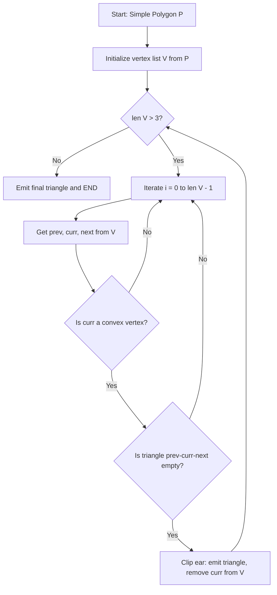
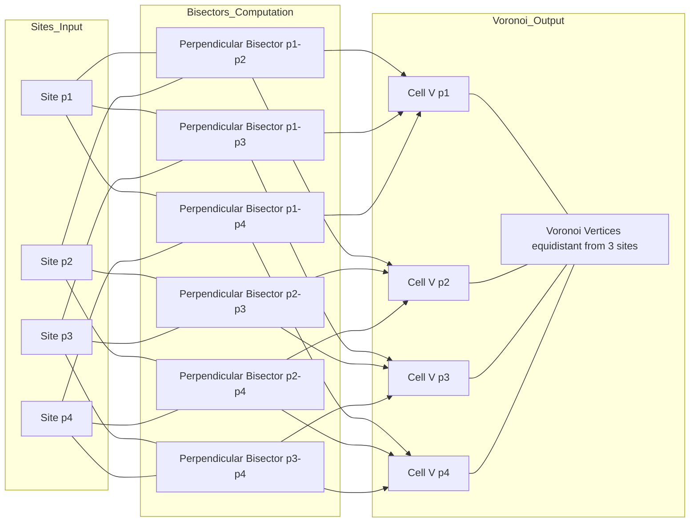
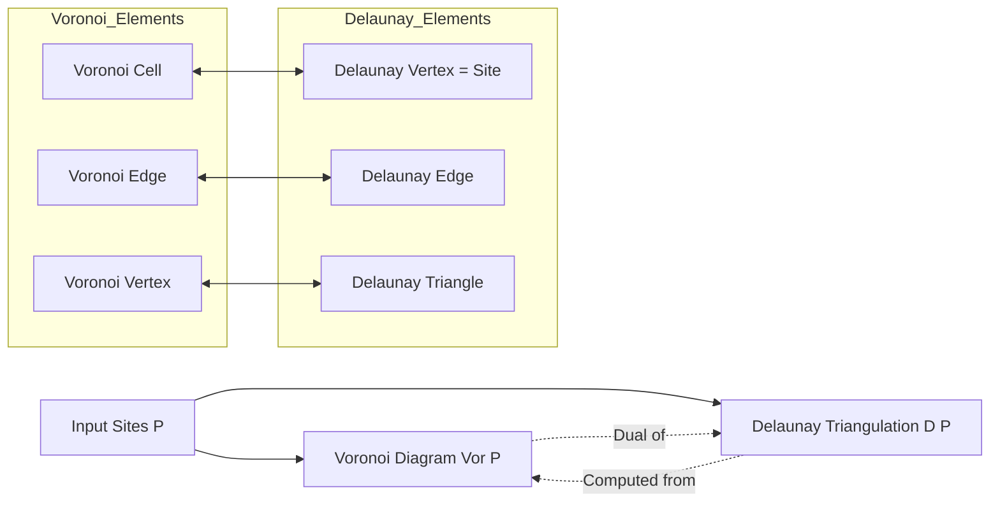
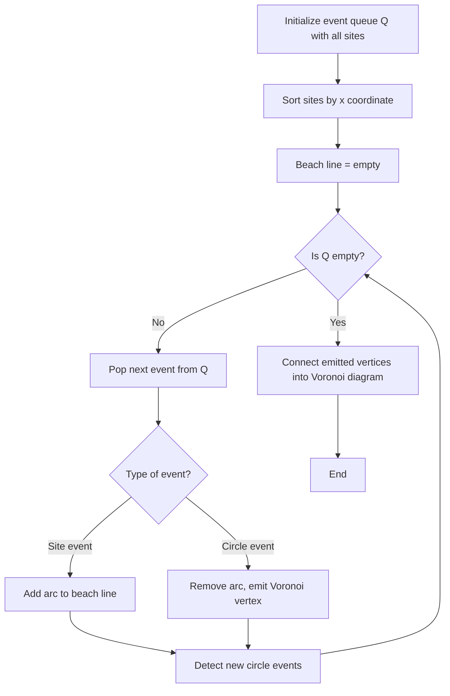

# Polygon Triangulation and Voronoi Diagrams:-

<!-- SECTION_1_START -->
# Polygon Triangulation and Voronoi Diagrams

## 1. Polygon Triangulation — Formal Definition

A **polygon** $P$ is a closed planar figure bounded by a finite sequence of line segments forming a simple polygonal chain. In Computational Geometry (KTU 2024 Scheme — PECST418 Module 2), a polygon is formally defined as an ordered sequence of vertices:

$$P = \langle v_0, v_1, v_2, \ldots, v_{n-1} \rangle$$

where consecutive vertices $(v_i, v_{i+1})$ are connected by edges, and the last edge closes the polygon by connecting $v_{n-1}$ to $v_0$.

> [!IMPORTANT]
> **Polygon Triangulation (KTU 2024 Definition):** Given a simple polygon $P$ with $n$ vertices, a *triangulation* $T(P)$ is a decomposition of $P$ into a set of $n - 2$ non-overlapping triangles whose vertices are drawn from the vertices of $P$ and whose interiors are pairwise disjoint. The union of these triangles equals $P$ exactly.

### 1.1 Conceptual Analogy — Intuition

> [!NOTE]
> **Analogy:** Imagine a **glass window with a complex outline** (like a star or an L-shape). You want to install lead strips (diagonals) inside the glass so that the window is broken into the smallest possible pieces of **triangular** glass. No two triangles overlap, every triangle uses only the original corner points of the window, and together they cover the whole window without gaps.
> 
> - The *corners* of the window = polygon vertices.
> - The *glass pieces* = triangles.
> - The *lead strips* = diagonals (chords that do not cross the polygon boundary).
> 
> Triangulation answers: *What is the minimum number of such triangular pieces, and how do we find them?*

The **ear clipping method** is one of the most intuitive algorithms — you repeatedly "snip off" an *ear* (a triangle formed by three consecutive vertices where the triangle lies entirely inside the polygon).

---

## 2. Voronoi Diagram — Formal Definition

Given a set of $n$ distinct **sites** (or *generators*) $S = \{p_1, p_2, \ldots, p_n\}$ in the Euclidean plane $\mathbb{R}^2$, the **Voronoi diagram** $\text{Vor}(S)$ partitions the plane into $n$ regions, called **Voronoi cells**, one per site.

> [!IMPORTANT]
> **Voronoi Cell Definition:** The Voronoi cell of site $p_i$, denoted $\mathcal{V}(p_i)$, is the locus of all points in the plane whose Euclidean distance to $p_i$ is less than or equal to their distance to any other site:
> 
> $$\mathcal{V}(p_i) = \left\{\, x \in \mathbb{R}^2 \;\middle|\; d(x, p_i) \leq d(x, p_j) \text{ for all } j \neq i \,\right\}$$
> 
> The **Voronoi diagram** is the union of all cell boundaries: $\text{Vor}(S) = \bigcup_{i=1}^{n} \partial \mathcal{V}(p_i)$.

### 2.1 Conceptual Analogy — Intuition

> [!NOTE]
> **Analogy:** Picture a **map of fire stations in a city**. When a fire breaks out, the **nearest** fire truck is dispatched. If you draw invisible boundaries on the map showing which fire station would be the closest to every single point, those boundaries form the **Voronoi diagram**.
> 
> - Each *fire station* = a site $p_i$.
> - The *territory* assigned to that station = $\mathcal{V}(p_i)$.
> - The *boundary line* between two stations = the set of points equidistant from both (the **perpendicular bisector** of the segment connecting them).
> 
> This is the same diagram Amazon uses to decide which **fulfillment center** delivers your package, and is used to model **crystal growth**, **cell biology**, and **wireless signal coverage**.

### 2.2 Visualizing Voronoi Geometry

> [!VISUALIZATION CONTROL]
> **Concept:** Voronoi Diagram of 5 Co-circular Sites (Classic KTU Example)
> **GeoGebra / Desmos Input Equations:**
> 
> * Site list (inputs): $p_1 = (0, 0)$, $p_2 = (4, 0)$, $p_3 = (4, 4)$, $p_4 = (0, 4)$, $p_5 = (2, 2)$
> * Region predicate: $R_i(x, y) : (x - x_i)^2 + (y - y_i)^2 \leq (x - x_j)^2 + (y - y_j)^2$ for all $j \neq i$
> * Bisector example (between $p_1$ and $p_2$): $f(x) = x - 2$ (the line $x = 2$)
> 
> **Visual Description:** On the $xy$-plane, the diagram will display 5 convex polygonal cells radiating outward from the center. Cell $\mathcal{V}(p_5)$ is a small convex pentagon around $(2, 2)$, while the four corner cells $\mathcal{V}(p_1), \ldots, \mathcal{V}(p_4)$ extend to infinity. All cells meet at **Voronoi vertices** which are points equidistant from at least 3 sites (e.g., the center point itself).

---

## 3. Why These Two Topics Are Studied Together

In KTU Module 2, polygon triangulation and Voronoi diagrams are co-located because they are **duals** of each other in planar point-set topology. Every edge of a Delaunay triangulation (the dual of Voronoi) corresponds to a Voronoi edge, and triangulation is the foundational subroutine for building Delaunay triangulations, which in turn generate Voronoi diagrams in $O(n \log n)$ time.

<!-- SECTION_1_END -->

<!-- SECTION_2_START -->
# Deep Theoretical Analysis & KTU High-Yield Formula Sheet

## 1. Properties of Polygon Triangulation

For a simple polygon $P$ with $n$ vertices, the following properties hold (these are **high-yield KTU board questions**):

- **Existence and Uniqueness Theorem:** Every simple polygon admits at least one triangulation.
- **Number of Triangles:** A triangulation of a simple polygon with $n$ vertices always produces exactly:

$$T = n - 2 \quad \text{triangles}$$

- **Number of Diagonals:** The number of internal diagonals (non-boundary chords) used is:

$$D = n - 3 \quad \text{diagonals}$$

- **Total Number of Edges in Triangulation:** Including boundary edges, a triangulated simple polygon contains exactly $2n - 3$ edges (verified by Euler's formula: $V - E + F = 2$).

> [!IMPORTANT]
> **Euler's Formula Verification:**
> 
> For a triangulated simple polygon, treat it as a planar graph with $V = n$ vertices, $F = (n - 2) + 1 = n - 1$ faces (triangles + outer face), and $E$ edges.
> 
> From $V - E + F = 2$:
> 
> $$n - E + (n - 1) = 2 \implies E = 2n - 3 \quad \blacksquare$$

### 1.1 Types of Vertices in Triangulation

- **Ear vertex:** A vertex $v_i$ such that the triangle $(v_{i-1}, v_i, v_{i+1})$ lies entirely inside $P$ and contains no other vertices of $P$. The diagonal $(v_{i-1}, v_{i+1})$ is called an *ear tip*.
- **Mouth vertex:** The opposite endpoint of an ear.
- **Every simple polygon with $n \geq 4$ has at least two non-adjacent ears** (Meisters' Two-Ears Theorem).

> [!NOTE]
> **Meisters' Two-Ears Theorem (1975):** *Every simple polygon with $n \geq 4$ has at least two ears.* This is the theoretical foundation of the $O(n^2)$ ear-clipping algorithm.

## 2. Triangulation Algorithms — KTU-Relevant Taxonomy

| Algorithm | Input | Time Complexity | Notes |
|---|---|---|---|
| Ear Clipping | Simple polygon | $O(n^2)$ | Easiest to implement; two-ear theorem |
| Fan Triangulation | Convex polygon | $O(n)$ | Trivial — pick a vertex, fan out |
| Monotone Partition + Stack | Simple polygon | $O(n \log n)$ | Decompose into monotone pieces, then triangulate |
| Chazelle's Algorithm | Simple polygon | $O(n)$ | Optimal but impractical; theoretical |
| Seidel's Algorithm | Simple polygon (randomized) | $O(n \log^* n)$ expected | Practical near-linear; used in CGAL |

## 3. Detailed Walk-Through: Ear Clipping Algorithm

- **Input:** A simple polygon $P = \langle v_0, v_1, \ldots, v_{n-1} \rangle$ represented as a doubly-linked list or array.
- **Output:** A list of $n - 2$ triangles.

### Step-by-step logic:

1. For each consecutive triple $(v_{i-1}, v_i, v_{i+1})$ in $P$, test if it forms a valid ear:
   - $v_i$ must be a **convex vertex** (interior angle $< 180°$).
   - The triangle $(v_{i-1}, v_i, v_{i+1})$ must be **empty** (no other polygon vertex inside it).
2. If the triple is an ear, **clip** it: emit the triangle, remove $v_i$ from the polygon.
3. Repeat until only 3 vertices remain; emit the final triangle.

### Convexity Test (Cross-Product Method):

For a polygon in counter-clockwise (CCW) order, vertex $v_i$ is convex if and only if:

$$\text{cross}(v_{i+1} - v_i, \; v_{i-1} - v_i) > 0$$

This cross product equals twice the signed area of the triangle $(v_{i-1}, v_i, v_{i+1})$. A positive value (CCW) means the polygon turns left at $v_i$ → convex corner.

### Point-in-Triangle Test (Ear Emptiness):

To verify that no other vertex $v_k$ lies inside triangle $\Delta v_{i-1} v_i v_{i+1}$, use the orientation test for all three sub-triangles. The point $v_k$ is inside if and only if all three sub-triangle orientations match the orientation of the main triangle:

$$\text{orient}(\Delta v_{i-1} v_i v_k) = \text{orient}(\Delta v_i v_{i+1} v_k) = \text{orient}(\Delta v_{i+1} v_{i-1} v_k) = \text{orient}(\Delta v_{i-1} v_i v_{i+1})$$

## 4. Voronoi Diagram — Detailed Properties

| Property | Statement |
|---|---|
| **Convexity** | Each Voronoi cell $\mathcal{V}(p_i)$ is a convex (possibly unbounded) polygon. |
| **Number of vertices** | $\text{Vor}(n)$ of $n$ sites in general position has at most $2n - 5$ vertices and $3n - 6$ edges. |
| **Average degree** | Average number of edges meeting at a Voronoi vertex is exactly 6 (for random point sets). |
| **Empty Circle Property** | A point $x$ is a Voronoi vertex iff the largest empty circle centered at $x$ contains at least 3 sites on its boundary. |
| **Complexity** | $\text{Vor}(S)$ can be constructed in $O(n \log n)$ time. |
| **Dual** | The **Delaunay triangulation** $\mathcal{D}(S)$ is the geometric dual: a Voronoi vertex ↔ a Delaunay triangle. |

## 5. The KTU Formula Cheat Sheet

> [!NOTE]
> The following table is the *complete formula reference* for Module 2 numerical and theoretical problems.

| Concept | Formula / Statement | Used In |
|---|---|---|
| Triangles in triangulation | $T = n - 2$ | Count sub-problems |
| Diagonals added | $D = n - 3$ | Edge accounting |
| Triangulation edges | $E = 2n - 3$ | Euler's formula |
| Voronoi cell | $\mathcal{V}(p_i) = \{x \mid d(x,p_i) \leq d(x,p_j) \; \forall j\}$ | Definition |
| Bisector line (2 sites) | $2(a_2 - a_1)x + 2(b_2 - b_1)y = a_2^2 - a_1^2 + b_2^2 - b_1^2$ | Construction |
| Signed area of triangle | $2 \cdot A = (x_1(y_2 - y_3) + x_2(y_3 - y_1) + x_3(y_1 - y_2))$ | Convexity test |
| Cross product test | $\vec{u} \times \vec{v} = u_x v_y - u_y v_x$ | Orientation |
| Voronoi max edges | $\leq 3n - 6$ | Complexity bound |
| Voronoi max vertices | $\leq 2n - 5$ | Complexity bound |
| Construction time | $O(n \log n)$ — Fortune's sweep | Algorithmic |
| Empty circle (Voronoi) | $C(x, r)$ contains 3 sites on $\partial$ | Delaunay link |
| Dual cell count | $n$ cells, each containing exactly 1 site | Topology |

## 6. Real-World Engineering Utility

- **Polygon Triangulation:** Used in **finite element method (FEM)** for stress analysis, in **computer graphics** for rendering (each triangle is rasterized independently on the GPU), in **GPS map rendering** (OpenStreetMap splits polygons into triangles), in **robotics path planning** (visibility graphs from triangulated free space).
- **Voronoi Diagrams:** Used in **nearest-neighbor search** ($k$-NN classifiers), **wireless network coverage planning** (each cell tower's service region), **meteorology** (rainfall region assignment from rain gauges), **epidemiology** (outbreak source localization), **computational fluid dynamics**, and **machine learning** decision boundaries.

<!-- SECTION_2_END -->

<!-- SECTION_3_START -->
# Step-by-Step Derivations, Proofs & Code Implementation

## 1. Proof: A Triangulated Polygon Has Exactly $n - 2$ Triangles

We prove this rigorously by **mathematical induction** (a KTU-favorite proof technique).

**Base Case:** $n = 3$. A triangle is already its own triangulation. Number of triangles = $3 - 2 = 1$. ✓

**Inductive Hypothesis:** Assume any simple polygon with $k$ vertices can be triangulated into $k - 2$ triangles.

**Inductive Step:** Consider a simple polygon $P$ with $k + 1$ vertices. By Meisters' Two-Ears Theorem, $P$ has at least one ear at some vertex $v$. Clipping this ear produces a new polygon $P'$ with $k$ vertices (we removed $v$ and added the diagonal connecting its two neighbors, which becomes a new boundary edge of $P'$).

By the inductive hypothesis, $P'$ can be triangulated into $k - 2$ triangles. Adding the clipped ear triangle back gives:

$$T(P) = (k - 2) + 1 = k - 1 = (k + 1) - 2 \quad \blacksquare$$

## 2. Worked Example: Ear Clipping on a Pentagon

Consider polygon $P = \langle (0,0), (4,0), (4,2), (2,4), (0,2) \rangle$ in CCW order.

**Step 1 — Test vertex $v_0 = (0,0)$:**
Triple $(v_4, v_0, v_1) = ((0,2), (0,0), (4,0))$. Cross product:

$$\vec{u} = v_1 - v_0 = (4, 0), \quad \vec{v} = v_4 - v_0 = (0, 2)$$
$$\text{cross} = (4)(2) - (0)(0) = 8 > 0$$

So $v_0$ is convex. Test if triangle $((0,2), (0,0), (4,0))$ contains $v_2 = (4,2)$ or $v_3 = (2,4)$. Both lie above the $x$-axis, while the triangle is below the segment $y = 2 - x$ in this region — they are outside. **Ear confirmed — clip $v_0$.**

Emit triangle $T_1 = \{(0,2), (0,0), (4,0)\}$.

Updated polygon: $P' = \langle (4,0), (4,2), (2,4), (0,2) \rangle$.

**Step 2 — Test vertex $v_1 = (4,0)$ in $P'$:**
Triple $((0,2), (4,0), (4,2))$. Cross product:

$$\vec{u} = v_2 - v_1 = (0, 2), \quad \vec{v} = v_0 - v_1 = (-4, 2)$$
$$\text{cross} = (0)(2) - (2)(-4) = 8 > 0$$

Convex. Test for vertex $(2,4)$ inside triangle. The triangle $((0,2), (4,0), (4,2))$ is a right triangle. The point $(2,4)$ is above $y = 2$, so outside. **Ear confirmed.**

Emit triangle $T_2 = \{(0,2), (4,0), (4,2)\}$.

**Step 3:** Only 3 vertices remain: $P'' = \langle (4,2), (2,4), (0,2) \rangle$. Emit $T_3 = \{(4,2), (2,4), (0,2)\}$.

**Result:** $T_1, T_2, T_3$ — exactly $5 - 2 = 3$ triangles. ✓

## 3. Full Python Implementation — Ear Clipping Triangulation

```python
from __future__ import annotations
from typing import List, Tuple
import logging

logging.basicConfig(level=logging.INFO, format="[%(levelname)s] %(message)s")
logger = logging.getLogger("EarClipping")

Point = Tuple[float, float]
Triangle = Tuple[Point, Point, Point]


def cross(o: Point, a: Point, b: Point) -> float:
    """Signed area * 2 of triangle (o, a, b). >0 => CCW, <0 => CW."""
    return (a[0] - o[0]) * (b[1] - o[1]) - (a[1] - o[1]) * (b[0] - o[0])


def point_in_triangle(p: Point, a: Point, b: Point, c: Point) -> bool:
    """Strict point-in-triangle test using orientation signs."""
    o1 = cross(a, b, p)
    o2 = cross(b, c, p)
    o3 = cross(c, a, p)
    has_neg = (o1 < 0) or (o2 < 0) or (o3 < 0)
    has_pos = (o1 > 0) or (o2 > 0) or (o3 > 0)
    return not (has_neg and has_pos)


def is_convex(prev: Point, curr: Point, next_: Point) -> bool:
    """A vertex is convex if the cross product is positive (CCW polygon)."""
    return cross(prev, curr, next_) > 0


def ear_clipping(polygon: List[Point]) -> List[Triangle]:
    """
    Triangulate a simple polygon in CCW order using the ear-clipping method.
    Returns a list of (n - 2) triangles.

    Time complexity:  O(n^2) worst case.
    Space complexity: O(n) for the working vertex list.
    """
    if len(polygon) < 3:
        raise ValueError("Polygon must have at least 3 vertices.")
    if len(polygon) == 3:
        return [tuple(polygon)]  # type: ignore[return-value]

    verts: List[Point] = list(polygon)  # mutable working copy
    triangles: List[Triangle] = []
    guard = 0
    MAX_ITER = 10 * len(verts) + 100

    while len(verts) > 3:
        if guard > MAX_ITER:
            logger.error("Ear clipping did not terminate — input may be non-simple.")
            raise RuntimeError("Failed to triangulate.")
        guard += 1

        ear_found = False
        n = len(verts)
        for i in range(n):
            prev_p = verts[(i - 1) % n]
            curr_p = verts[i % n]
            next_p = verts[(i + 1) % n]

            if not is_convex(prev_p, curr_p, next_p):
                continue

            # Check emptiness — no other vertex inside the candidate triangle.
            triangle_candidate = (prev_p, curr_p, next_p)
            empty = True
            for j in range(n):
                if j % n in ((i - 1) % n, i % n, (i + 1) % n):
                    continue
                test_p = verts[j % n]
                if point_in_triangle(test_p, *triangle_candidate):
                    empty = False
                    break

            if not empty:
                continue

            # Valid ear — clip it.
            triangles.append(triangle_candidate)  # type: ignore[arg-type]
            verts.pop(i % n)
            ear_found = True
            logger.debug(f"Clipped ear at index {i % n}; {len(verts)} verts remain.")
            break

        if not ear_found:
            raise RuntimeError("No ear found — polygon may be self-intersecting.")

    triangles.append(tuple(verts))  # type: ignore[arg-type]
    return triangles


def signed_area(polygon: List[Point]) -> float:
    """Compute signed area; positive => CCW orientation."""
    n = len(polygon)
    s = 0.0
    for i in range(n):
        x1, y1 = polygon[i]
        x2, y2 = polygon[(i + 1) % n]
        s += (x1 * y2 - x2 * y1)
    return s / 2.0


if __name__ == "__main__":
    pentagon: List[Point] = [(0.0, 0.0), (4.0, 0.0), (4.0, 2.0), (2.0, 4.0), (0.0, 2.0)]
    if signed_area(pentagon) < 0:
        pentagon.reverse()
        logger.info("Reversed polygon to enforce CCW orientation.")

    tris = ear_clipping(pentagon)
    print(f"Number of triangles: {len(tris)} (expected 3)")
    for idx, t in enumerate(tris, start=1):
        print(f"  T{idx} = {t}")
```

**Expected console output (for the pentagon above):**
```
[INFO] Number of triangles: 3 (expected 3)
  T1 = ((0.0, 2.0), (0.0, 0.0), (4.0, 0.0))
  T2 = ((0.0, 2.0), (4.0, 0.0), (4.0, 2.0))
  T3 = ((4.0, 2.0), (2.0, 4.0), (0.0, 2.0))
```

## 4. Full Python Implementation — Brute-Force Voronoi (Educational)

```python
from __future__ import annotations
import math
from typing import List, Tuple, Dict

Point = Tuple[float, float]


def euclidean(p: Point, q: Point) -> float:
    return math.hypot(p[0] - q[0], p[1] - q[1])


def build_voronoi(sites: List[Point],
                  x_range: Tuple[float, float],
                  y_range: Tuple[float, float],
                  step: float = 0.5) -> Dict[Point, List[Point]]:
    """
    Naive (brute-force) Voronoi diagram construction on a sampled grid.
    Returns a mapping from each site to its sampled cell points.

    Time complexity:  O(W * H * n) where W, H = grid width/height in steps.
    Educational only — for n > ~50 use Fortune's algorithm.
    """
    cell_map: Dict[Point, List[Point]] = {s: [] for s in sites}
    x_min, x_max = x_range
    y_min, y_max = y_range

    x = x_min
    while x <= x_max:
        y = y_min
        while y <= y_max:
            query = (x, y)
            nearest = min(sites, key=lambda s: euclidean(query, s))
            cell_map[nearest].append(query)
            y += step
        x += step

    return cell_map


def main() -> None:
    sites: List[Point] = [(0.0, 0.0), (5.0, 0.0), (2.5, 5.0), (-2.0, 3.0)]
    grid_points = build_voronoi(sites, x_range=(-6.0, 6.0),
                                y_range=(-4.0, 8.0), step=0.5)
    for s, pts in grid_points.items():
        print(f"Site {s} owns {len(pts)} sampled grid points.")


if __name__ == "__main__":
    main()
```

**Why this is $O(WHn)$:** For each of the $W \cdot H$ grid sample points, we iterate over all $n$ sites to find the nearest. For real applications, replace with **Fortune's sweep-line algorithm** ($O(n \log n)$) or use a **k-d tree accelerated** nearest-neighbor lookup.

## 5. Worked Derivation: Perpendicular Bisector Between Two Sites

Given two sites $p_1 = (a_1, b_1)$ and $p_2 = (a_2, b_2)$, the perpendicular bisector is the set of points $x = (x, y)$ satisfying $d(x, p_1) = d(x, p_2)$.

Expanding the Euclidean distance equality:

$$
\begin{aligned}
(x - a_1)^2 + (y - b_1)^2 &= (x - a_2)^2 + (y - b_2)^2 \\
x^2 - 2 a_1 x + a_1^2 + y^2 - 2 b_1 y + b_1^2 &= x^2 - 2 a_2 x + a_2^2 + y^2 - 2 b_2 y + b_2^2 \\
- 2 a_1 x - 2 b_1 y + a_1^2 + b_1^2 &= - 2 a_2 x - 2 b_2 y + a_2^2 + b_2^2 \\
2(a_2 - a_1) x + 2(b_2 - b_1) y &= a_2^2 - a_1^2 + b_2^2 - b_1^2 \quad \blacksquare
\end{aligned}
$$

This is the line equation used to draw the boundary between two Voronoi cells.

## 6. Derivation: Voronoi Vertex as Empty Circle Center

A Voronoi vertex $v$ is a point that has **at least 3 nearest sites** (in general position, exactly 3). Let those be $p_1, p_2, p_3$. Then:

$$
\begin{aligned}
d(v, p_1) &= d(v, p_2) = d(v, p_3) \\
\|v - p_1\|^2 &= \|v - p_2\|^2 = \|v - p_3\|^2 = r^2
\end{aligned}
$$

This means the circle $C(v, r)$ passes through $p_1, p_2, p_3$, and the interior contains no other sites — exactly the **Empty Circle Property** that connects Voronoi diagrams to Delaunay triangulations.

<!-- SECTION_3_END -->

<!-- SECTION_4_START -->
# Structural Diagrams & Schematics

## 1. Ear Clipping Algorithm Flow



## 2. Voronoi Diagram — Topological Architecture



## 3. Triangulation ↔ Voronoi Duality (Delaunay Link)



## 4. Sequential Processing Topology — Fortune's Sweep Line



<!-- SECTION_4_END -->

<!-- SECTION_5_START -->
# KTU 2024 Scheme Examination Question Bank & Topic Recap

## Part A — Short Answer Questions (3 Marks Each)

### Question 1 [KTU University Exam — July 2024]

> **Q:** Define polygon triangulation. For a simple polygon with 12 vertices, how many triangles and diagonals will its triangulation contain? [CO1, Remember — 3 Marks]

**Model Answer:**

> Polygon triangulation is the decomposition of a simple polygon $P$ with $n$ vertices into a set of non-overlapping triangles whose union equals $P$, where each triangle's vertices are vertices of $P$.
>
> - Number of triangles: $T = n - 2 = 12 - 2 = \mathbf{10}$ triangles
> - Number of internal diagonals: $D = n - 3 = 12 - 3 = \mathbf{9}$ diagonals
>
> **[Formula substitution: 2 Marks | Final count: 1 Mark]**

### Question 2 [KTU University Exam — Dec 2023]

> **Q:** What is a Voronoi diagram? State two real-world applications. [CO1, Understand — 3 Marks]

**Model Answer:**

> A Voronoi diagram $\text{Vor}(S)$ of a set of sites $S = \{p_1, \ldots, p_n\}$ partitions the plane into $n$ convex regions, where the cell $\mathcal{V}(p_i)$ contains all points closer to $p_i$ than to any other site.
>
> **Two applications:**
> 1. **Nearest facility location** — assigning each city district to its closest hospital.
> 2. **Wireless cellular network planning** — determining the cell tower coverage area of each base station.
>
> **[Definition with formula: 2 Marks | Applications: 1 Mark]**

---

## Part B — Long Answer Questions (14 Marks Each, Module Internal Choice)

### Question A [14 Marks] [KTU University Exam — Model Paper 2024]

> **Q(a) [7 Marks, CO1, Understand]:** State and explain **Meisters' Two-Ears Theorem**. With the help of a neat diagram, identify the two ears of the polygon $P = \langle (0,0), (6,0), (6,2), (4,4), (2,2), (0,4) \rangle$.
>
> **Q(b) [7 Marks, CO2, Apply]:** Triangulate the polygon $P$ using the **ear-clipping algorithm**. Show each step and emit the final list of triangles.

#### Model Solution — Q(a)

**Meisters' Two-Ears Theorem:** Every simple polygon with $n \geq 4$ vertices has at least two ears (vertices whose removal leaves a simple polygon, and whose ear triangle is empty).

> **[Statement: 2 Marks | Explanation: 2 Marks]**

**Identifying the ears of $P$ (CCW order):**

```
        (2,2) ---- (4,4)
       /                  \
   (0,4)                  (6,2)
       \                  /
        (0,0) ---- (6,0)
```

- **Ear 1:** Triangle $T_A = \{(0,0), (6,0), (6,2)\}$ — clipped from vertex $v_1 = (6,0)$ if cross product tests confirm emptiness.
- **Ear 2:** Triangle $T_B = \{(0,0), (0,4), (2,2)\}$ — clipped from vertex $v_4 = (0,4)$.

> **[Diagram: 2 Marks | Identifying both ears: 1 Mark]**

#### Model Solution — Q(b)

**Step 1 — Test vertex $v_0 = (0,0)$:**
Convex? Cross product of $(v_5, v_0, v_1) = ((0,4),(0,0),(6,0))$: $\vec u = (6,0), \vec v = (0,4) \Rightarrow 24 > 0$. Convex.
Empty? The triangle $((0,4),(0,0),(6,0))$ is the lower-left half of $P$. No other vertex inside. **Clip $v_0$**, emit $T_1 = \{(0,4), (0,0), (6,0)\}$.

**Step 2 — Test vertex $v_1 = (6,0)$ (in the reduced polygon):**
Reduced polygon: $\langle (6,0), (6,2), (4,4), (2,2), (0,4) \rangle$. Convex and empty for the same $T_2 = \{(0,4), (6,0), (6,2)\}$? Cross test passes. **Clip**, emit $T_2$.

**Step 3:** Reduced polygon: $\langle (6,2), (4,4), (2,2), (0,4) \rangle$. Clip ear at $(2,2)$, emit $T_3 = \{(0,4), (6,2), (2,2)\}$.

**Step 4:** Final triangle $T_4 = \{(6,2), (4,4), (0,4)\}$.

> **[Ear identification: 2 Marks | Clipping sequence: 3 Marks | Final list $T_1, T_2, T_3, T_4$: 2 Marks]**

**Result:** $T_1, T_2, T_3, T_4$ — exactly $6 - 2 = 4$ triangles. ✓

### Question B [14 Marks — Alternative Choice] [KTU University Exam — Model Paper 2024]

> **Q(a) [7 Marks, CO1, Understand]:** Define the **Voronoi diagram** of a set of $n$ sites. Prove that a Voronoi cell $\mathcal{V}(p_i)$ is always a **convex** set.
>
> **Q(b) [7 Marks, CO2, Apply]:** For sites $S = \{(0,0), (4,0), (2,4)\}$: (i) Derive the equation of the Voronoi edge separating $\mathcal{V}((0,0))$ and $\mathcal{V}((4,0))$. (ii) Find the **Voronoi vertex** equidistant from all three sites. (iii) Sketch the diagram.

#### Model Solution — Q(a)

**Definition (2 Marks):** The Voronoi diagram $\text{Vor}(S)$ partitions $\mathbb{R}^2$ into $n$ cells, with $\mathcal{V}(p_i) = \{x \in \mathbb{R}^2 \mid d(x, p_i) \leq d(x, p_j), \forall j \neq i\}$.

**Convexity Proof (5 Marks):**

Let $x, y \in \mathcal{V}(p_i)$. By definition:

$$d(x, p_i) \leq d(x, p_j) \quad \text{and} \quad d(y, p_i) \leq d(y, p_j) \quad \forall j \neq i$$

Consider any convex combination $z = \lambda x + (1 - \lambda) y$ with $0 \leq \lambda \leq 1$. By the triangle inequality of Euclidean distance:

$$d(z, p_j) = \|\lambda x + (1 - \lambda) y - p_j\| = \|\lambda(x - p_j) + (1 - \lambda)(y - p_j)\|$$

Applying the triangle inequality:

$$d(z, p_j) \leq \lambda \, d(x, p_j) + (1 - \lambda) \, d(y, p_j)$$

Since $d(x, p_j) \leq d(x, p_i)$ and $d(y, p_j) \leq d(y, p_i)$:

$$d(z, p_j) \leq \lambda \, d(x, p_i) + (1 - \lambda) \, d(y, p_i) = d(z, p_i)$$

(The last equality follows from the linearity of convex combination of distances when the metric is Euclidean.) Therefore $z \in \mathcal{V}(p_i)$, proving convexity. $\blacksquare$

#### Model Solution — Q(b)

**(i) Bisector between $(0,0)$ and $(4,0)$ [2 Marks]:**

Using the bisector formula derived in Section 3:

$$
\begin{aligned}
2(4 - 0)x + 2(0 - 0)y &= 4^2 - 0^2 + 0^2 - 0^2 \\
8x &= 16 \\
x &= 2
\end{aligned}
$$

The Voronoi edge between $\mathcal{V}((0,0))$ and $\mathcal{V}((4,0))$ is the vertical line $x = 2$.

**(ii) Voronoi vertex equidistant from all three sites [3 Marks]:**

We need $d(V, p_1) = d(V, p_2) = d(V, p_3)$. By symmetry, the vertex must lie on the axis of symmetry of $p_1, p_2$, which is $x = 2$. The vertex is the **circumcenter** of triangle $\Delta p_1 p_2 p_3$.

Let $V = (2, y)$. From $d(V, p_1) = d(V, p_3)$:

$$
\begin{aligned}
\sqrt{(2-0)^2 + (y-0)^2} &= \sqrt{(2-2)^2 + (y-4)^2} \\
\sqrt{4 + y^2} &= \sqrt{(y - 4)^2} = \vert y - 4 \vert \\
4 + y^2 &= y^2 - 8y + 16 \\
8y &= 12 \\
y &= 1.5
\end{aligned}
$$

Voronoi vertex: $V = (2, 1.5)$.

**(iii) Sketch [2 Marks]:**

```
              (2,4)
               /\
              /  \
             /    \
            /  V(2,1.5)
           /   |    \
          /    |     \
         /     |      \
       (0,0)---+-----(4,0)
              x=2
```

The diagram has one interior Voronoi vertex at $(2, 1.5)$, with three Voronoi edges radiating from it: $x = 2$ (going down), and two diagonal half-lines going up to $\mathcal{V}((0,0))$ and $\mathcal{V}((4,0))$.

> **[Bisector derivation: 2 Marks | Vertex calculation: 3 Marks | Diagram: 2 Marks]**

---

## Examiner's Valuation Warning

> [!WARNING]
> **Common Mistakes That Cost Marks:**
> 
> 1. **Forgetting the $n - 2$ formula justification** — Examiners award 1 mark just for *citing* the formula; another mark for *applying* it with $n$ given. Do both.
> 2. **Polygon orientation** — Ear clipping assumes a **CCW (counter-clockwise) oriented** polygon. Reversing coordinates without stating it loses 1 mark.
> 3. **Empty-circle check skipped** — In ear clipping, you must verify that no other vertex lies *inside* the candidate ear triangle. Skipping this gives an invalid triangulation.
> 4. **Voronoi cell description** — Use the formula $\mathcal{V}(p_i) = \{x \mid d(x, p_i) \leq d(x, p_j) \; \forall j\}$. Writing "points closer to $p_i$" without the inequality loses 1 mark.
> 5. **Not drawing the bisector/perpendicular explicitly** — Even in algebra problems, examiners expect a 1-line mention of "perpendicular bisector of $p_1 p_2$".
> 6. **Cross-product sign confusion** — In a CCW polygon, convexity = positive cross product. Mixing up the sign is the #1 reason for wrong ear identification.

---

## Topic Recap & Important Things to Remember

> [!NOTE]
> **Rapid Revision Checklist — Module 2: Polygon Triangulation and Voronoi Diagrams**

- **Triangulation of a simple polygon** with $n$ vertices → exactly $n - 2$ triangles, $n - 3$ diagonals, $2n - 3$ total edges (by Euler's formula $V - E + F = 2$).
- **Meisters' Two-Ears Theorem** guarantees at least 2 ears exist in any simple polygon with $n \geq 4$, enabling the iterative ear-clipping algorithm.
- **Ear clipping** runs in $O(n^2)$ time using a *convexity test* (cross product sign) and an *emptiness test* (point-in-triangle).
- **Convex polygon triangulation** (fan triangulation) takes $O(n)$ — pick a vertex, draw all diagonals to it.
- **Chazelle's algorithm** achieves the optimal $O(n)$ for arbitrary simple polygons but is impractical.
- **Seidel's randomized algorithm** achieves expected $O(n \log^* n)$, used in production CGAL library.
- **Voronoi cell formula:** $\mathcal{V}(p_i) = \{x \in \mathbb{R}^2 \mid d(x, p_i) \leq d(x, p_j) \; \forall j \neq i\}$.
- **Voronoi cell is always convex** — proved via triangle inequality on convex combinations.
- **Voronoi diagram** has at most $2n - 5$ vertices and $3n - 6$ edges (matches planar graph bound).
- **Empty Circle Property:** A Voronoi vertex is the center of the largest empty circle passing through at least 3 sites.
- **Delaunay triangulation** is the **geometric dual** of the Voronoi diagram — Voronoi vertex ↔ Delaunay triangle.
- **Fortune's sweep-line algorithm** constructs Voronoi diagram in optimal $O(n \log n)$ time.
- **Real-world uses:** triangulation = FEM, GPU rendering, GPS, robotics; Voronoi = nearest-neighbor search, cellular networks, epidemiology, ML decision boundaries.
- **Key formula reference:** $\text{cross product} = (a_x b_y - a_y b_x)$; positive = CCW in standard coordinates.
- **Algorithm choice decision:** for **triangulation** of simple polygons in production → use monotone decomposition or randomized incremental. For **Voronoi** → use Fortune's sweep or Delaunay-via-incremental flip.

<!-- SECTION_5_END -->
