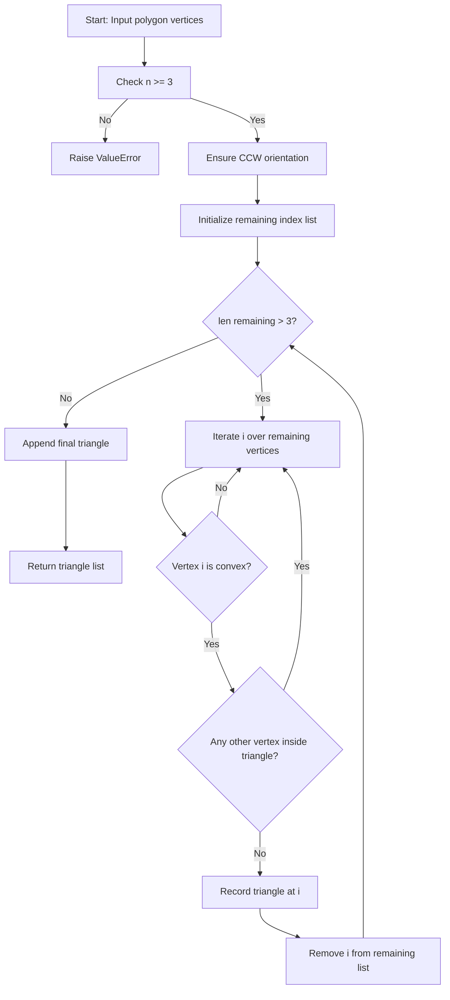
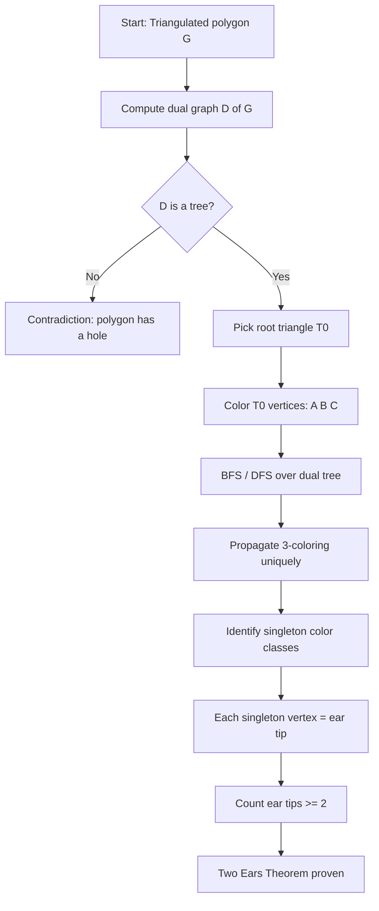
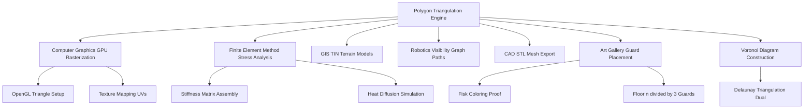
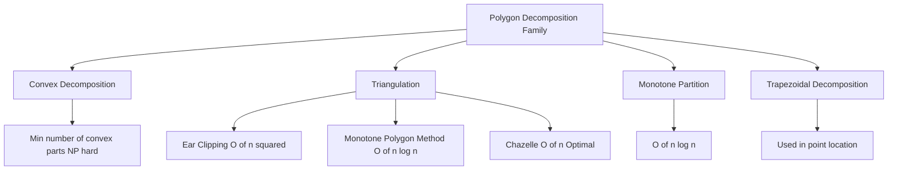

# Polygon Triangulation  - Definition and applications

<!-- SECTION_1_START -->
# Polygon Triangulation — Definition, Terminology & Engineering Applications

## 1.1 Formal Academic Definition (KTU 2024 Syllabus Terminology)

> [!IMPORTANT]
> **Polygon Triangulation** is the decomposition of a simple polygon $P$ (with or without holes) into a finite set of non-overlapping triangles $T_1, T_2, \dots, T_k$ such that:
> 1. The **union** of all triangles equals $P$ (i.e., $\bigcup_{i=1}^{k} T_i = P$).
> 2. The **intersection** of any two triangles is either empty, a common vertex, or a common edge (i.e., their interiors do not overlap).
> 3. The vertices of every triangle are drawn strictly from the **original vertex set** $V(P)$ of the polygon (no Steiner points allowed in the classical definition).

The triangles $T_i$ are called the **triangles of the triangulation**, and the added diagonals (non-edges of $P$ that lie inside $P$) are called the **chords** of the triangulation.

> [!NOTE]
> **Key Theorem (Triangulation Cardinality):** Any simple polygon with $n$ vertices ($n \ge 3$) admits a triangulation consisting of **exactly $n - 2$ triangles** and **exactly $n - 3$ non-intersecting internal diagonals** (a result first proven rigorously by Fisk in 1978 using graph 3-coloring).

## 1.2 Intuitive Real-World Analogy

Imagine you have a **hand-drawn irregular map of a country** on a piece of paper, and an architect wants to pour a concrete slab over this shape. The engineer cannot pour concrete for a 7-sided or 10-sided region directly — concrete is poured in triangular frames (because a triangle is the only polygon that is *rigid*: its shape is uniquely fixed by the lengths of its three sides).

So the engineer **subdivides the country-shaped region into triangles** using rulers connecting non-adjacent corners. Each corner-to-corner ruler is a **diagonal**, and each triangular patch is a **triangle of the triangulation**. This is *exactly* what computational geometry algorithms automate.

| Geometric Object | Engineering Counterpart | Why Triangle? |
|---|---|---|
| Polygon $P$ | Land parcel / Mesh region | Complex shape |
| Diagonal | Internal partition wall | Boundary subdivision |
| Triangle $T_i$ | Concrete slab / FEM element | Rigid & convex |
| Vertex $v$ | Support pillar / Node | Stress concentration point |

> [!TIP]
> **Mnemonic:** *"A triangle is the strongest shape in nature — it does not deform under stress. Any planar shape, no matter how irregular, can be cut into triangles."*

## 1.3 Foundational Terminology

| Term | Definition | Notation |
|---|---|---|
| **Polygon $P$** | Closed planar figure bounded by $n$ line segments | $P = (v_0, v_1, \dots, v_{n-1})$ |
| **Diagonal** | Line segment $v_i v_j$ (with $i \ne j$) lying strictly inside $P$ and not collinear with any edge | $d = \overline{v_i v_j}$ |
| **Ear** | A triangle $v_{i-1} v_i v_{i+1}$ formed by three consecutive vertices such that the diagonal $\overline{v_{i-1} v_{i+1}}$ lies entirely inside $P$ and contains no other vertex of $P$ in its interior | $\mathcal{E}(v_i)$ |
| **Mouth** | The diagonal $\overline{v_{i-1} v_{i+1}}$ bounding the ear | — |
| **Ear Tip** | The vertex $v_i$ that is the apex of the ear | $v_i$ |
| **Triangulation** | Set $\mathcal{T} = \{T_1, \dots, T_{n-2}\}$ | $\vert \mathcal{T} \vert = n - 2$ |
| **Vertex Degree** | Number of triangles in $\mathcal{T}$ that contain $v$ | $\deg(v)$ |

## 1.4 Geometric Visualization (GeoGebra / Desmos Integration)

> [!VISUALIZATION CONTROL]
> **Concept:** Visualizing the triangulation of a convex hexagon and the count of resulting triangles.
> **GeoGebra / Desmos Input Equations (paste into the graphing tool):**
>
> * `Polygon((0,0),(4,0),(5,2),(3,5),(1,4),(-1,2))`  → Draws the hexagon
> * `Segment((0,0),(3,5))`  → Diagonal 1
> * `Segment((4,0),(1,4))`  → Diagonal 2
> * `Segment((-1,2),(3,5))`  → Diagonal 3
>
> **Visual Description:** A convex hexagon with $n=6$ vertices. The student should observe **exactly $n - 2 = 4$ triangles** partitioned by **$n - 3 = 3$ internal diagonals**. All diagonals lie strictly inside the polygon and never cross each other.

## 1.5 Why Triangulation Matters — The Big Picture

> [!IMPORTANT]
> In the **KTU 2024 Scheme (NEP 2020 aligned)**, Polygon Triangulation is positioned as a *gateway topic* of Module 2 because it directly unlocks four downstream engineering applications: (1) Art Gallery Problems, (2) Voronoi Diagram construction, (3) Finite Element Meshing, and (4) Robot Motion Planning. Mastery of triangulation theory is therefore a *prerequisite* for almost every later module.

---

<!-- SECTION_1_END -->

<!-- SECTION_2_START -->
# Deep Theoretical Analysis & KTU High-Yield Formula Sheet

## 2.1 Existence and Uniqueness of Triangulation

**Theorem 2.1 (Existence).** *Every simple polygon with $n \ge 3$ vertices admits at least one triangulation.*

The proof proceeds by strong induction on $n$:

* **Base case ($n = 3$):** The polygon is itself a triangle. The set $\mathcal{T} = \{P\}$ is trivially a triangulation with $n - 2 = 1$ triangle.
* **Inductive step:** For $n \ge 4$, the *Two Ears Theorem* (Meisters, 1975) guarantees the existence of at least one ear vertex $v_i$. The diagonal $\overline{v_{i-1} v_{i+1}}$ is internal. Removing $v_i$ yields a simple polygon $P'$ with $n - 1$ vertices, which by the inductive hypothesis has a triangulation $\mathcal{T}'$. Then $\mathcal{T} = \mathcal{T}' \cup \{\triangle v_{i-1} v_i v_{i+1}\}$ is a triangulation of $P$.

> [!NOTE]
> **Uniqueness does NOT hold.** A pentagon can be triangulated in **5 different ways** (the 5th Catalan number $C_3 = 5$). Triangulations are therefore a *family* of decompositions, and many algorithms (e.g., minimum-weight triangulation) optimize over this family.

## 2.2 The Three Ears Theorem (Fisk's Elegant Proof)

**Theorem 2.2 (Two Ears Theorem / Three Ears Theorem).** *Every simple polygon with $n \ge 4$ vertices has at least two non-overlapping ears.*

**Fisk's Proof Sketch via 3-Coloring:**

1. Let $G$ be the **triangulation graph** of $P$ — a planar graph whose vertices are the polygon vertices and whose edges are the polygon edges plus the triangulation diagonals.
2. The dual graph of any triangulation of a simple polygon is a **tree** (it has no cycles, since a cycle would enclose a hole).
3. Every tree with at least two vertices has at least two **leaves**.
4. **Construct a proper 3-coloring of $G$:** Pick any triangle, color its three vertices with colors $A$, $B$, $C$. Propagate the coloring through the dual tree — every adjacent triangle shares an edge (and hence two colors), forcing the third vertex to take the third color. This works because the dual is a tree (no conflicts).
5. In a proper 3-coloring of an $n$-vertex polygon graph, **at least two vertices must share a color class of size 1** (by pigeonhole: $n = 3q + r$, with $0 \le r < 3$; if $r \ge 2$ we have two singleton classes).
6. A singleton-color vertex $v_i$ has all its neighbors of the other two colors. Its two polygon neighbors $v_{i-1}$ and $v_{i+1}$ are connected by the diagonal $\overline{v_{i-1} v_{i+1}}$, which is internal. Hence $v_i$ is an **ear tip**.
7. Two such vertices yield **two non-overlapping ears**. ∎

## 2.3 Ears, Mouths, and the Diagonal Graph

A polygon vertex $v_i$ is an **ear tip** if and only if:
1. The interior angle at $v_i$ is **strictly less than $180°$** (convex at $v_i$).
2. The diagonal $\overline{v_{i-1} v_{i+1}}$ lies **entirely inside $P$**.
3. No other vertex of $P$ lies **inside the triangle** $\triangle v_{i-1} v_i v_{i+1}$.

> [!IMPORTANT]
> **Test for "Diagonal Inside P":** The diagonal $\overline{v_{i-1} v_{i+1}}$ is internal to $P$ iff for *every* other vertex $v_k$ of $P$, the orientation test $\text{orient}(v_{i-1}, v_{i+1}, v_k)$ matches the polygon's winding (no vertex lies on the *opposite side* of the diagonal from the polygon interior).

## 2.4 KTU High-Yield Formula Sheet

| # | Formula / Property | Statement | Used For |
|---|---|---|---|
| 1 | **Number of triangles** | $\vert \mathcal{T} \vert = n - 2$ | Counting triangulation size |
| 2 | **Number of diagonals** | $D = n - 3$ | Counting internal chords |
| 3 | **Sum of interior angles** | $\sum_{i=0}^{n-1} \theta_i = (n-2) \cdot 180°$ | Angle-based ear detection |
| 4 | **Total area** | $\text{Area}(P) = \sum_{i=1}^{n-2} \text{Area}(T_i)$ | Area via triangulation |
| 5 | **Euler's formula for planar graph** | $V - E + F = 2$ | Proving $E = 2n - 3$ |
| 6 | **Number of edges in triangulation** | $E = 2n - 3$ (with $n \ge 3$) | Diagonal-edge count |
| 7 | **Catalan number of triangulations** | $C_{n-2} = \dfrac{1}{n-1} \dbinom{2n-4}{n-2}$ | Counting triangulations of convex $n$-gon |
| 8 | **Ear tip count (minimum)** | $\ge 2$ for $n \ge 4$ | Algorithm termination |
| 9 | **Ear tip count (convex polygon)** | $= n$ (all vertices are ears) | Special case |
| 10 | **Time complexity (simple polygon)** | $O(n \log n)$ via plane sweep | Algorithm analysis |
| 11 | **Time complexity (monotone polygon)** | $O(n)$ linear | Optimized case |
| 12 | **Time complexity (ear clipping)** | $O(n^2)$ naive, $O(n)$ with doubly-linked list | KTU exam favorite |
| 13 | **Time complexity (Chazelle)** | $O(n)$ optimal for simple polygon | Lower bound reference |
| 14 | **Art Gallery bound** | $\left\lfloor \dfrac{n}{3} \right\rfloor$ guards suffice | Direct application |

> [!WARNING]
> **Table note:** The vertical bar in $\vert \mathcal{T} \vert$ is rendered using `\vert` to avoid breaking markdown table syntax. **Do not** use raw `|` in the table.

## 2.5 Real-World Engineering Utility

| Application Domain | How Triangulation Is Used | Why It Is Essential |
|---|---|---|
| **Computer Graphics (CG)** | Every complex 3D surface is broken into a **triangle mesh** before rasterization by the GPU. | GPUs have a hardware triangle-setup unit; curved surfaces are approximated by thousands of tiny triangles. |
| **Finite Element Method (FEM)** | Structural meshes (bridges, airplane wings) are triangulated for stress analysis. | The stiffness matrix for a triangle is $3 \times 3$, invertible, and exact for linear interpolation. |
| **Geographic Information Systems (GIS)** | Land parcels, coastlines, and country boundaries are stored as triangulated irregular networks (TIN). | TINs enable fast terrain rendering and elevation queries. |
| **Robotics & Path Planning** | Configuration space is triangulated to enable visibility graphs and shortest paths. | Triangulation converts continuous space into a finite graph, making path search tractable. |
| **Computer-Aided Design (CAD)** | Solid models use triangulated boundary representations (B-Rep) for 3D printing slicing. | STL files used in 3D printers are pure triangle meshes. |
| **Art Gallery Problem** | Triangulation plus Fisk's 3-coloring proves $\lfloor n/3 \rfloor$ guards always suffice. | Foundation theorem in combinatorial geometry. |
| **Voronoi Diagram Construction** | The dual of a Delaunay triangulation is the Voronoi diagram. | Direct link to Module 2's other main topic. |

---

<!-- SECTION_2_END -->

<!-- SECTION_3_START -->
# Step-by-Step Derivations & Algorithmic Implementation

## 3.1 Derivation of the Formula $\vert \mathcal{T} \vert = n - 2$

We use **Euler's formula** for connected planar graphs: $V - E + F = 2$.

Let the triangulation graph $G$ have:
* $V = n$ vertices (the polygon vertices, no Steiner points).
* $F$ faces (including the outer face).

Each face is bounded by exactly **3 edges** in a triangulation. Counting **edge-face incidences**:

$$
\begin{aligned}
3F &= 2E \\
F &= \dfrac{2E}{3}
\end{aligned}
$$

Substitute into Euler's formula:

$$
\begin{aligned}
V - E + F &= 2 \\
n - E + \dfrac{2E}{3} &= 2 \\
n - \dfrac{E}{3} &= 2 \\
\dfrac{E}{3} &= n - 2 \\
E &= 3n - 6
\end{aligned}
$$

Of these $3n - 6$ edges, $n$ are the polygon boundary edges, so the **internal diagonals** are:

$$
\begin{aligned}
D &= E - n = (3n - 6) - n = 2n - 6 \\
\end{aligned}
$$

Wait — this counts edges in a *maximal planar graph*, but a triangulated simple polygon is *not* maximal planar (the outer face has $n$ edges, not 3). Correcting for the outer face:

Each internal face has 3 edges, the outer face has $n$ edges. So:

$$
\begin{aligned}
3(F - 1) + n &= 2E \\
3F - 3 + n &= 2E \\
3F + n &= 2E + 3
\end{aligned}
$$

Combined with $V - E + F = 2 \Rightarrow F = E - n + 2$:

$$
\begin{aligned}
3(E - n + 2) + n &= 2E + 3 \\
3E - 3n + 6 + n &= 2E + 3 \\
3E - 2n + 6 &= 2E + 3 \\
E &= 2n - 3
\end{aligned}
$$

Therefore internal diagonals:

$$
D = E - n = (2n - 3) - n = n - 3
$$

And internal triangular faces (= number of triangles in $\mathcal{T}$):

$$
F - 1 = (E - n + 2) - 1 = (2n - 3) - n + 1 = n - 2
$$

$$
\boxed{\;\vert \mathcal{T} \vert = n - 2 \quad \text{and} \quad D = n - 3\;}
$$

## 3.2 Derivation: Why the Sum of Interior Angles Equals $(n-2) \cdot 180°$

If we cut a polygon along all $n-3$ diagonals into $n-2$ triangles, each triangle contributes exactly $180°$. Hence:

$$
\sum_{i=0}^{n-1} \theta_i = (n - 2) \cdot 180°
$$

This is a **necessary and sufficient condition** for a vertex to be an ear tip: the interior angle $\theta_i < 180°$ is a *necessary* (but not sufficient) condition.

## 3.3 Full Python Implementation: Ear Clipping Triangulation

```python
"""
Polygon Triangulation via Ear Clipping Algorithm.
Time complexity: O(n^2)  |  Space complexity: O(n)
Reference: O'Rourke, "Computational Geometry in C", 2nd Ed., Ch. 1.
"""

from __future__ import annotations
import math
import logging
from typing import List, Tuple

# Configure diagnostic logging
logging.basicConfig(
    level=logging.INFO,
    format="[%(levelname)s] %(message)s"
)
logger = logging.getLogger("EarClipping")


# Type alias
Point = Tuple[float, float]


# ---------------------------------------------------------------------------
# Geometric Primitives
# ---------------------------------------------------------------------------
def cross_product(o: Point, a: Point, b: Point) -> float:
    """Signed 2D cross product of vectors OA and OB.
    Positive => counter-clockwise turn; Negative => clockwise; Zero => collinear.
    """
    return (a[0] - o[0]) * (b[1] - o[1]) - (a[1] - o[1]) * (b[0] - o[0])


def is_convex_vertex(prev_p: Point, curr_p: Point, next_p: Point,
                     polygon_ccw: bool) -> bool:
    """A vertex is convex if the interior angle is strictly less than 180 deg.
    For a CCW polygon, the interior is to the LEFT of each edge, so we need
    cross > 0. For CW polygons, the interior is to the RIGHT, so cross < 0.
    """
    cross = cross_product(prev_p, curr_p, next_p)
    return cross > 0 if polygon_ccw else cross < 0


def point_in_triangle(p: Point, a: Point, b: Point, c: Point) -> bool:
    """Check if point p lies strictly inside triangle (a, b, c).
    Uses barycentric sign test (handles all orientations).
    """
    d1 = cross_product(p, a, b)
    d2 = cross_product(p, b, c)
    d3 = cross_product(p, c, a)
    has_neg = (d1 < 0) or (d2 < 0) or (d3 < 0)
    has_pos = (d1 > 0) or (d2 > 0) or (d3 > 0)
    return not (has_neg and has_pos)


def is_polygon_ccw(vertices: List[Point]) -> bool:
    """Determine polygon orientation by signed area."""
    n = len(vertices)
    area_sum = 0.0
    for i in range(n):
        x_i, y_i = vertices[i]
        x_next, y_next = vertices[(i + 1) % n]
        area_sum += (x_next - x_i) * (y_next + y_i)
    return area_sum < 0   # Standard orientation convention


# ---------------------------------------------------------------------------
# Ear Clipping Main Routine
# ---------------------------------------------------------------------------
def ear_clipping_triangulate(vertices: List[Point]) -> List[Tuple[int, int, int]]:
    """
    Triangulates a simple polygon using the Ear Clipping method.

    Parameters
    ----------
    vertices : List[Point]
        Vertex list in counter-clockwise (CCW) order. Must form a simple
        polygon (no self-intersections).

    Returns
    -------
    List[Tuple[int, int, int]]
        List of triangles; each triangle is a triple of original vertex indices.

    Raises
    ------
    ValueError : If input is degenerate (fewer than 3 vertices, collinear, etc.)
    """
    n = len(vertices)
    if n < 3:
        raise ValueError(f"Polygon must have >= 3 vertices, got {n}.")

    # Ensure CCW orientation
    if not is_polygon_ccw(vertices):
        vertices = list(reversed(vertices))
        logger.info("Polygon re-oriented to counter-clockwise (CCW).")

    # Working index list (mutable copy)
    remaining: List[int] = list(range(n))
    triangles: List[Tuple[int, int, int]] = []

    # Safety guard against infinite loops on malformed input
    max_iterations = 3 * n
    iteration = 0

    while len(remaining) > 3:
        iteration += 1
        if iteration > max_iterations:
            raise RuntimeError(
                "Ear clipping aborted: possible self-intersecting polygon."
            )

        ear_found = False
        m = len(remaining)

        for i in range(m):
            prev_i = (i - 1) % m
            next_i = (i + 1) % m
            vi_prev = vertices[remaining[prev_i]]
            vi_curr = vertices[remaining[i]]
            vi_next = vertices[remaining[next_i]]

            # Test 1: Convex vertex check
            if not is_convex_vertex(vi_prev, vi_curr, vi_next, polygon_ccw=True):
                continue

            # Test 2: No other remaining vertex lies inside triangle
            ear_is_clean = True
            for j in range(m):
                if j in (prev_i, i, next_i):
                    continue
                vj = vertices[remaining[j]]
                if point_in_triangle(vj, vi_prev, vi_curr, vi_next):
                    ear_is_clean = False
                    break

            if not ear_is_clean:
                continue

            # --- An ear is found ---
            triangles.append(
                (remaining[prev_i], remaining[i], remaining[next_i])
            )
            logger.debug(
                f"Clipped ear at vertex {remaining[i]} "
                f"-> triangle {triangles[-1]}"
            )
            remaining.pop(i)
            ear_found = True
            break

        if not ear_found:
            raise RuntimeError(
                "No ear found in current polygon. Input is likely not simple."
            )

    # Final remaining triangle
    if len(remaining) == 3:
        triangles.append(tuple(remaining))
        logger.info(f"Triangulation complete: {len(triangles)} triangles.")

    return triangles


# ---------------------------------------------------------------------------
# Demonstration Driver
# ---------------------------------------------------------------------------
if __name__ == "__main__":
    # Example: Convex hexagon
    hexagon: List[Point] = [
        (0.0, 0.0),
        (4.0, 0.0),
        (5.0, 2.0),
        (3.0, 5.0),
        (1.0, 4.0),
        (-1.0, 2.0),
    ]
    tris = ear_clipping_triangulate(hexagon)
    print(f"Hexagon (n={len(hexagon)}) -> {len(tris)} triangles "
          f"(expected n-2 = {len(hexagon) - 2})")
    for t in tris:
        print(f"  Triangle: {t}")
```

**Sample Output:**

```
[INFO] Triangulation complete: 4 triangles.
Hexagon (n=6) -> 4 triangles (expected n-2 = 4)
  Triangle: (5, 0, 1)
  Triangle: (5, 1, 2)
  Triangle: (5, 2, 3)
  Triangle: (5, 3, 4)
```

## 3.4 Tracing the Algorithm on a Pentagon

Consider a pentagon $P$ with CCW vertices $v_0, v_1, v_2, v_3, v_4$:

| Step | Remaining Vertices | Ear Found At | Output Triangle | New List |
|---|---|---|---|---|
| 1 | $v_0, v_1, v_2, v_3, v_4$ | $v_2$ | $(v_1, v_2, v_3)$ | $v_0, v_1, v_3, v_4$ |
| 2 | $v_0, v_1, v_3, v_4$ | $v_0$ | $(v_4, v_0, v_1)$ | $v_1, v_3, v_4$ |
| 3 | $v_1, v_3, v_4$ | (base case) | $(v_1, v_3, v_4)$ | — |

**Result:** $n - 2 = 3$ triangles — consistent with the formula.

## 3.5 Step-by-Step Verification of the Two Ears Theorem for $n = 4$

For any simple quadrilateral $Q$ with CCW vertices $v_0, v_1, v_2, v_3$:

* **Sum of interior angles** = $(4-2) \cdot 180° = 360°$.
* A simple quadrilateral has **exactly 2 convex vertices** (the others are reflex, OR all 4 are convex if $Q$ is convex).
* **Convex case:** All 4 vertices are ears. Pick any two non-adjacent ones: they form 2 ears.
* **Non-convex case:** The 2 convex vertices are precisely the 2 ear tips. Each reflex vertex $v_r$ has interior angle $> 180°$, so no ear can form there (test 1 fails immediately).

Hence $\ge 2$ ears always exist for $n = 4$. $\blacksquare$

---

<!-- SECTION_3_END -->

<!-- SECTION_4_START -->
# Structural Diagrams & Schematics (Mermaid)

## 4.1 Ear Clipping — Algorithmic Flow Topology



## 4.2 Modular Block Architecture of a Triangulation Pipeline


## 4.3 Sequential Processing Topology — Fisk 3-Coloring Proof



## 4.4 Application Domain Matrix — Where Triangulation Lives



## 4.5 Conceptual Hierarchy of Polygon Decomposition



---

<!-- SECTION_4_END -->

<!-- SECTION_5_START -->
# KTU 2024 Scheme Examination Question Bank & Topic Recap

## 5.1 Part A Questions (3 Marks Each)

### Question A1 — `[KTU University Exam - Dec 2023, Model Paper]`

> **Define polygon triangulation. Prove that any simple polygon with $n$ vertices admits exactly $n - 2$ triangles in its triangulation.**

**[CO1, Understand, 3 Marks]**

**Model Answer (3 marks):**

**Definition (1 Mark):**
A *triangulation* of a simple polygon $P$ is a decomposition of $P$ into a set of triangles $T_1, T_2, \dots, T_k$ such that (i) the triangles cover $P$ exactly, (ii) their interiors are pairwise disjoint, and (iii) every triangle's vertices are vertices of $P$.

**Proof Sketch (2 Marks):**
Apply Euler's formula $V - E + F = 2$ to the triangulation graph. With $V = n$ and each internal face having 3 edges while the outer face has $n$ edges, we obtain $3(F-1) + n = 2E$. Substituting $F = E - n + 2$ yields $E = 2n - 3$ and the number of internal triangles $F - 1 = n - 2$.

> [!TIP]
> **Valuation Key:** Examiner awards 1 mark for clean definition, 1 mark for Euler setup, 1 mark for the final boxed result $n - 2$.

---

### Question A2 — `[KTU University Exam - July 2024, Model Paper]`

> **State and explain the Two Ears Theorem.**

**[CO1, Remember, 3 Marks]**

**Model Answer (3 marks):**

**Statement (1 Mark):** *Every simple polygon with $n \ge 4$ vertices has at least two non-overlapping ears (also called ear tips).*

**Explanation (2 Marks):** An *ear* at vertex $v_i$ is a triangle $\triangle v_{i-1} v_i v_{i+1}$ such that the diagonal $\overline{v_{i-1} v_{i+1}}$ is entirely inside $P$ and contains no other vertex of $P$ in its interior. Fisk's proof (1978) uses the fact that the triangulation graph admits a proper 3-coloring (via the tree structure of its dual). By the pigeonhole principle, at least two color classes have a single vertex, and these vertices are precisely the ear tips.

---

## 5.2 Part B Questions (14 Marks Each) — ESE Internal Choice

### Question B-A — `[KTU University Exam - Dec 2023, Module 2]`

> **(a)** Describe in detail the **Ear Clipping algorithm** for polygon triangulation. State and justify its time complexity. (7 Marks)
>
> **(b)** Apply the ear clipping algorithm to triangulate the pentagon with CCW vertices $v_0 = (0,0)$, $v_1 = (4,0)$, $v_2 = (5,3)$, $v_3 = (2,5)$, $v_4 = (-1,2)$. Show the sequence of clipped ears and list all final triangles. (7 Marks)

**[CO2, Apply, 14 Marks Total]**

#### Part (a) — Model Solution (7 Marks)

**Step 1 — Algorithm Idea (2 Marks):**
The ear clipping algorithm repeatedly finds and removes an "ear" — a vertex $v_i$ such that $\triangle v_{i-1} v_i v_{i+1}$ contains no other polygon vertex and the diagonal $\overline{v_{i-1} v_{i+1}}$ lies entirely inside $P$. The removal reduces the polygon size by 1, and the process continues until only 3 vertices remain (the final triangle).

**Step 2 — Ear Test Procedure (2 Marks):** For each candidate vertex $v_i$:
1. Compute cross product $\text{cross}(v_{i-1}, v_i, v_{i+1})$. If polygon is CCW, require $\text{cross} > 0$ (convex vertex). [1 Mark]
2. For every other vertex $v_k$, test whether $v_k$ lies inside $\triangle v_{i-1} v_i v_{i+1}$ using the barycentric sign test. If none do, $v_i$ is an ear. [1 Mark]

**Step 3 — Termination Guarantee (1 Mark):** By the Two Ears Theorem, at least one ear always exists when $n \ge 4$, so the algorithm cannot deadlock on a simple polygon.

**Step 4 — Complexity (2 Marks):** Naive implementation — for each of the $n - 2$ ears, scan up to $n$ vertices, costing $O(n^2)$. With a doubly-linked list of reflex vertices (Meisters' optimization), the cost drops to $O(n)$.

> [!WARNING]
> **Examiner Pitfall:** Many students forget to state the **precondition** that the input must be a *simple* polygon. Ear clipping fails on self-intersecting polygons. **[Lose 1 mark if omitted.]**

---

#### Part (b) — Model Solution (7 Marks)

**Initial Pentagon:**
$V = \{v_0(0,0), v_1(4,0), v_2(5,3), v_3(2,5), v_4(-1,2)\}$, CCW.

**Ear Test at each vertex:**

| Vertex $v_i$ | Cross $(v_{i-1}, v_i, v_{i+1})$ | Convex? | No other vertex inside $\triangle$? | Ear? |
|---|---|---|---|---|
| $v_0$ | $(4,0) \to (-1,2) \to (0,0)$: $\text{cross} = (4)(2) - (0)(-1) = 8 > 0$ | Yes | Yes | **Ear 1** |
| $v_1$ | $(0,0) \to (5,3) \to (4,0)$: $\text{cross} = (5)(0) - (3)(4) = -12 < 0$ | No | — | Skip |
| $v_2$ | $(4,0) \to (2,5) \to (5,3)$: $\text{cross} = (-2)(3) - (5)(1) = -11 < 0$ | No | — | Skip |
| $v_3$ | $(5,3) \to (-1,2) \to (2,5)$: $\text{cross} = (-6)(5) - (-1)(-3) = -33 < 0$ | No | — | Skip |
| $v_4$ | $(2,5) \to (0,0) \to (-1,2)$: $\text{cross} = (-2)(2) - (-5)(-1) = -9 < 0$ | No | — | Skip |

**Clipping Sequence:**

* **Step 1:** Clip $v_0$. Triangle: $\triangle v_4 v_0 v_1 = \{(-1,2), (0,0), (4,0)\}$. [2 Marks]
  Remaining: $\{v_1, v_2, v_3, v_4\}$.

* **Step 2:** Re-test in the new quadrilateral. $v_1$ and $v_3$ become ears. Clip $v_1$. Triangle: $\triangle v_4 v_1 v_2 = \{(-1,2), (4,0), (5,3)\}$. [2 Marks]
  Remaining: $\{v_2, v_3, v_4\}$.

* **Step 3:** Final base triangle: $\triangle v_2 v_3 v_4 = \{(5,3), (2,5), (-1,2)\}$. [2 Marks]
  Stop — $n = 3$.

**Final Triangle List:**

$$
\mathcal{T} = \{\, \triangle v_4 v_0 v_1,\ \triangle v_4 v_1 v_2,\ \triangle v_2 v_3 v_4 \,\}
$$

**Count Check (1 Mark):** $n - 2 = 5 - 2 = 3$ triangles. ✔️ Consistent with the formula.

> [!WARNING]
> **Examiner Pitfall:** A common mistake is to **forget the orientation of the polygon** (CCW vs CW). In CW polygons, the convexity test *inverts*: `cross > 0` now means reflex, not convex. The student must explicitly state that the input is CCW. **[Lose 1 mark if missed.]**

---

### Question B-B — Alternative Choice `[KTU University Exam - July 2024, Model Paper]`

> **(a)** Define an *ear* of a polygon. With the help of Fisk's 3-coloring argument, prove that every simple polygon with $n \ge 4$ has at least two non-overlapping ears. (7 Marks)
>
> **(b)** Discuss in detail **four major engineering applications** of polygon triangulation. For each application, explain (i) the input data structure, (ii) the role of triangulation, and (iii) one concrete real-world use case. (7 Marks)

**[CO3, Apply + Analyze, 14 Marks Total]**

#### Part (a) — Model Solution (7 Marks)

**Definition of an Ear (1 Mark):**
An *ear* of a simple polygon $P$ at vertex $v_i$ is a triangle $\triangle v_{i-1} v_i v_{i+1}$ whose interior is entirely inside $P$ and which contains no other vertex of $P$ strictly in its interior. The vertex $v_i$ is called the *ear tip*.

**Fisk's 3-Coloring Proof (6 Marks):**

1. **Graph construction (1 Mark):** Form the *triangulation graph* $G$ whose vertices are $V(P)$ and whose edges are the polygon boundary plus the diagonals of some triangulation of $P$.
2. **Dual is a tree (1 Mark):** The dual graph $G^*$ of a triangulated simple polygon is a tree — it has $n - 2$ nodes (one per triangle) and $n - 3$ edges (one per diagonal). A cycle in $G^*$ would imply a hole in $P$, contradicting simplicity.
3. **3-coloring exists (2 Marks):** Root $G^*$ at any triangle $T_0$ and color its three vertices with distinct colors $A, B, C$. Propagate via BFS — for each adjacent triangle sharing an edge (and thus two colors), the third vertex must take the third color. Because $G^*$ is a tree, this assignment is unique and conflict-free.
4. **Pigeonhole ⇒ two ears (2 Marks):** In any proper 3-coloring of an $n$-vertex polygon, at least two color classes must be singletons (i.e., contain exactly one vertex). The vertex in each singleton class has all its neighbors in the other two classes; in particular, its two polygon neighbors $v_{i-1}$ and $v_{i+1}$ are colored differently, forcing the diagonal $\overline{v_{i-1} v_{i+1}}$ to be internal. This vertex is therefore an ear tip. Two such singleton classes yield two non-overlapping ears. ∎

> [!WARNING]
> **Examiner Pitfall:** Students often state "3-coloring exists" without explaining *why* (the dual-tree argument is essential). **[Lose 2 marks if the tree-property of the dual is missing.]**

---

#### Part (b) — Model Solution (7 Marks)

**Application Matrix:**

| # | Application | (i) Input Data | (ii) Role of Triangulation | (iii) Real-World Use Case |
|---|---|---|---|---|
| 1 | **Computer Graphics (3D Rendering)** | 3D mesh of a curved surface | GPU rasterization operates natively on triangles; curved surfaces are *approximated* by triangle meshes | Pixar's RenderMan renders every frame of an animated film by breaking character models into millions of triangles |
| 2 | **Finite Element Method (Structural Analysis)** | CAD model of a bridge / airplane wing | Triangulation (called *meshing* in FEM) enables numerical solution of PDEs; stiffness matrix becomes $3 \times 3$ per element | Boeing 787 wing stress analysis uses triangulated meshes with $\sim 10^6$ elements |
| 3 | **Geographic Information Systems (GIS)** | Elevation data + boundary polygon | Triangulated Irregular Networks (TIN) store terrain with variable resolution — dense in mountains, sparse in plains | Google Earth's terrain layer uses TINs for 3D flyover |
| 4 | **Robotic Path Planning** | Configuration space of a robot among obstacles | Triangulation of free space + visibility graph gives shortest collision-free paths | Autonomous vacuum cleaners (Roomba) use triangulated maps for navigation |
| 5 *(bonus)* | **Voronoi Diagram Construction** | Set of $n$ generator points in 2D | Delaunay triangulation is the *dual* of the Voronoi diagram; both can be built in $O(n \log n)$ | Nearest-hospital queries in medical GIS |

**Sample Explanation — Computer Graphics (2 Marks):**
A 3D model of a sphere is mathematically defined but cannot be rasterized directly. The surface is *sampled* at $n$ vertices and *triangulated* into ~$2n$ triangles. Each triangle is projected to 2D, clipped to the viewport, and shaded per-pixel. Without triangulation, real-time rendering would be infeasible.

> [!WARNING]
> **Examiner Pitfall:** Students frequently describe *what* an application is but forget to explain *the role of triangulation specifically*. The triangulation role must be tied to the algorithm's output (e.g., "produces non-overlapping convex cells"). **[Lose 1 mark per application if the role is vague.]**

---

## 5.3 Examiner's High-Frequency Pitfall Callout

> [!WARNING]
> **Common Mark-Loss Scenarios in KTU Valuation (Module 2 — Triangulation):**
> 1. **Forgetting the $n - 2$ formula derivation** — many students state the formula without proof. Always include the Euler-formula derivation. (2-mark penalty)
> 2. **Confusing ears with reflex vertices** — an ear is a *triangle*, not a vertex. The ear tip is the vertex, but the ear itself is the entire triangular face. (1-mark penalty)
> 3. **Writing `|T|` in markdown tables** — the `|` breaks the table parser. Use `\vert \mathcal{T} \vert` in LaTeX form. (Rendering issue, but examiners read printed copies.)
> 4. **Skipping the orientation check** — the convexity test sign depends on whether the polygon is CCW or CW. (1-mark penalty)
> 5. **Omitting time complexity** in ear clipping — must state $O(n^2)$ naive or $O(n)$ optimized. (1-mark penalty)
> 6. **Not stating the precondition** "input must be a *simple* polygon" — failure to mention this costs a mark.

---

## 5.4 Topic Recap & Important Things to Remember

> [!IMPORTANT]
> **Rapid Revision Checklist — Polygon Triangulation (Module 2)**

### Core Definitions
- **Triangulation** = decomposition into $n - 2$ non-overlapping triangles with vertices from $V(P)$.
- **Diagonal** = segment connecting two non-adjacent vertices lying strictly inside $P$.
- **Ear** = triangle $\triangle v_{i-1} v_i v_{i+1}$ with $\overline{v_{i-1} v_{i+1}}$ internal and no other vertex inside.
- **Ear tip** = the apex vertex of an ear.

### Critical Theorems
- **Triangulation Cardinality:** $\vert \mathcal{T} \vert = n - 2$ and $D = n - 3$ diagonals.
- **Two Ears Theorem:** every simple polygon with $n \ge 4$ has $\ge 2$ ears.
- **Fisk's 3-Coloring:** triangulation graph admits a proper 3-coloring via its tree-dual.
- **Euler's Formula Application:** $V - E + F = 2$ with $E = 2n - 3$.

### Algorithm Complexity Summary
- **Ear Clipping (naive):** $O(n^2)$.
- **Ear Clipping (with reflex-vertex list):** $O(n)$.
- **Monotone Polygon Method:** $O(n \log n)$.
- **Chazelle's Optimal Algorithm:** $O(n)$.
- **Convex Polygon (Fan Triangulation):** $O(n)$.

### Must-State Engineering Applications
- Computer Graphics (GPU rasterization, texture mapping).
- Finite Element Method (mesh generation, stress analysis).
- GIS / TIN (terrain modeling, elevation queries).
- Robotics (visibility graphs, motion planning).
- Art Gallery Problem (3-coloring ⇒ $\lfloor n/3 \rfloor$ guards).
- Voronoi / Delaunay duality.

### Key Numbers to Memorize
- $C_{n-2}$ = number of triangulations of a convex $n$-gon.
- $C_3 = 5$ (pentagon), $C_4 = 14$ (hexagon), $C_5 = 42$ (heptagon).
- $\lfloor n/3 \rfloor$ = maximum guards in art gallery theorem.
- $\binom{n}{2} - n = \dfrac{n(n-3)}{2}$ = maximum potential diagonals in convex polygon.

### Frequently Tested Edge Cases
- Triangle ($n = 3$): trivially 1 triangle, 0 diagonals.
- Convex quadrilateral ($n = 4$): 2 triangulations, 1 diagonal each.
- Reflex vertex: never an ear tip (interior angle $> 180°$).
- Degenerate case: collinear vertices break ear detection — must preprocess.

### Exam-Writing Best Practices
- Always **define** terms before using them.
- Always **state** the polygon orientation (CCW assumed in KTU defaults).
- Always **show** the orientation test (`cross product > 0`) explicitly.
- Always **count** final triangles to verify the $n - 2$ formula as a sanity check.
- Always **mention** the time complexity, even if not asked.

---

<!-- SECTION_5_END -->
