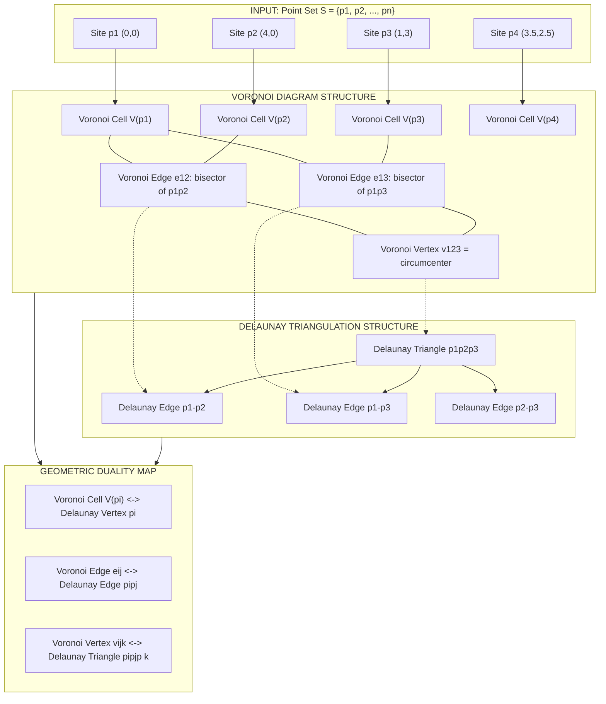
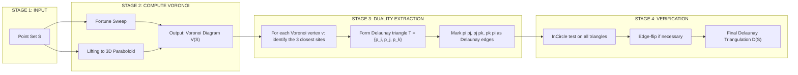
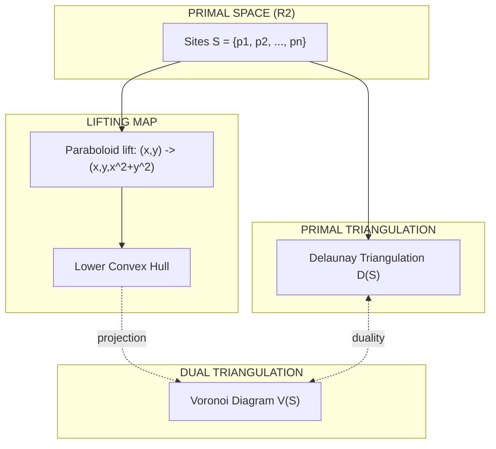

# Relationship with Voronoi diagrams

<!-- SECTION_1_START -->
# Computational Geometry – Module 2: Relationship with Voronoi Diagrams

## 1. Core Technical Definition & Intuitive Overview

### 1.1 Formal Definition — Voronoi Diagram (VD)

Let $S = \{p_1, p_2, \ldots, p_n\}$ be a set of $n$ distinct **point sites** (also called *generators* or *seeds*) in the Euclidean plane $\mathbb{R}^2$. The **Voronoi cell** (or *Voronoi region*) of a site $p_i$ is formally defined as:

$$
V(p_i) \;=\; \left\{ x \in \mathbb{R}^2 \;\middle|\; d(x, p_i) \;\le\; d(x, p_j) \;\;\forall\, j \ne i \right\}
$$

where $d(\cdot, \cdot)$ denotes the Euclidean distance function. The collection of all such cells forms the **Voronoi Diagram**:

$$
\mathcal{V}(S) \;=\; \bigcup_{i=1}^{n} V(p_i)
$$

The boundary segments of these cells are called **Voronoi edges**, and the points where three or more edges meet are called **Voronoi vertices**.

> [!NOTE]
> **KTU Syllabus Highlight (PECST418 – Module 2):** Voronoi diagrams partition space into regions based on the *nearest-site rule*. They are a fundamental proximity structure with $\mathcal{O}(n)$ average complexity in the plane and dual to Delaunay triangulations.

### 1.2 Formal Definition — Delaunay Triangulation (DT)

A **Delaunay Triangulation** $D(S)$ of a point set $S$ in general position is a triangulation where:
1. The circumcircle of **every triangle contains no other site of $S$ in its interior** (the *Empty Circumcircle Property*).
2. It maximises the minimum angle across all triangulations of $S$ (the *Max-Min Angle Property*).

> [!IMPORTANT]
> **General Position Assumption:** No three sites are collinear and no four sites are cocircular. This avoids degenerate cases that would otherwise create ambiguous Voronoi vertices.

### 1.3 The "Relationship" — Geometric Duality

The Delaunay Triangulation and the Voronoi Diagram are **geometric duals** of each other. This is the most celebrated duality in computational geometry. The relationship can be formally stated as follows:

| Voronoi Element | Dual Delaunay Element |
| :--- | :--- |
| Voronoi Vertex $v$ | Circumcenter of a Delaunay triangle $T$ |
| Voronoi Edge $e$ | Perpendicular to a Delaunay edge, meeting at the circumcenter |
| Voronoi Cell (face) $V(p_i)$ | Delaunay vertex $p_i$ |
| Voronoi Region Adjacency | Delaunay edge connecting the two sites |

> [!IMPORTANT]
> **Core Duality Theorem:** *A point $q$ lies on a Voronoi edge between $V(p_i)$ and $V(p_j)$ if and only if the circle centred at $q$ passing through $p_i$ and $p_j$ contains no other site in its interior.* This is exactly the *empty-circle criterion* defining Delaunay edges.

### 1.4 Intuition — The "Post Office & Fire Hydrant" Analogy

Imagine placing a set of **post offices** $p_1, p_2, \ldots, p_n$ across a city.

- **Voronoi Diagram:** If every resident walks to their **nearest post office**, the city naturally splits into *territories* (Voronoi cells). The boundary between two territories is the set of points equidistant from two post offices.

- **Delaunay Triangulation:** Now imagine an engineer building a **road network** that connects every post office to its *true neighbours* (the ones whose territories share a boundary). The road network so obtained is exactly the Delaunay triangulation.

**Key Insight:** The *territory boundaries* (Voronoi edges) are always **perpendicular** to the *connecting roads* (Delaunay edges) and intersect them at the **circumcenters** of the Delaunay triangles (the "balance points" of three mutually adjacent post offices).

### 1.5 Geometric Intuition — Perpendicular Bisector Picture

Consider three non-collinear sites $p_i, p_j, p_k$. The three pairwise perpendicular bisectors meet at a unique point $c$, the **circumcenter** of $\triangle p_i p_j p_k$. This point $c$ is a **Voronoi vertex** if and only if the circle $\mathcal{C}(c)$ centred at $c$ passing through $p_i, p_j, p_k$ is **empty** of all other sites. This is precisely the Delaunay condition.

> [!VISUALIZATION CONTROL]
> **Concept:** Delaunay–Voronoi Duality with Circumcenter
> **GeoGebra Input Equations / Points:**
> * $p_1 = (0, 0)$, $p_2 = (4, 0)$, $p_3 = (1, 3)$
> * $p_4 = (3.5, 2.5)$  (test site)
> * Circle through $p_1, p_2, p_3$ (Delaunay triangle circumcircle): centre $c_{123} = (2, 1.5)$, radius $r \approx 2.5$
> * Plot $V(p_1)$ as: `f(x,y) = sqrt(x^2 + y^2) - sqrt((x-4)^2 + y^2)` zero set
> * Plot perpendicular bisector of $p_1 p_2$ as: `x = 2`
> **Visual Description:** Students should observe that (i) the perpendicular bisector of $p_1 p_2$ becomes a Voronoi edge; (ii) the circumcenter $c_{123}$ becomes a Voronoi vertex; (iii) the Delaunay triangle $p_1 p_2 p_3$ is dual to the Voronoi vertex $c_{123}$.
<!-- SECTION_1_END -->

<!-- SECTION_2_START -->
# 2. Deep Theoretical Analysis & KTU High-Yield Formula Sheet

## 2.1 The Duality — Component-by-Component Mapping

The Delaunay–Voronoi duality is **one-to-one** when the point set is in **general position**. We break down the mapping rigorously:

### Mapping ① : Voronoi Vertex $\leftrightarrow$ Delaunay Triangle

Let $v$ be a Voronoi vertex. By definition, $v$ is the meeting point of three (or more) Voronoi edges, meaning $v$ is equidistant from three sites $p_i, p_j, p_k$ and is closer to them than to any other site.

$$
d(v, p_i) \;=\; d(v, p_j) \;=\; d(v, p_k) \;<\; d(v, p_\ell), \quad \forall\, \ell \notin \{i, j, k\}
$$

Therefore, the circle $\mathcal{C}(v)$ centred at $v$ with radius $r = d(v, p_i)$ passes through $p_i, p_j, p_k$ and contains no other site — this is the *empty-circle property*, so $\{p_i, p_j, p_k\}$ form a Delaunay triangle.

### Mapping ② : Voronoi Edge $\leftrightarrow$ Delaunay Edge

A Voronoi edge $e$ separates $V(p_i)$ and $V(p_j)$. Every point $q \in e$ satisfies:

$$
d(q, p_i) \;=\; d(q, p_j) \;\le\; d(q, p_k), \quad \forall\, k
$$

Hence, the circle centred at $q$ through $p_i$ and $p_j$ is empty — meaning $\{p_i, p_j\}$ is a Delaunay edge. The edge $e$ lies on the **perpendicular bisector** of $\overline{p_i p_j}$.

### Mapping ③ : Voronoi Cell $\leftrightarrow$ Delaunay Vertex

The Voronoi cell $V(p_i)$ is a convex polygon. The Delaunay vertex $p_i$ is dual to this entire cell — the *cell tells us the "neighbourhood" of $p_i$ in the Delaunay graph*.

### Mapping ④ : Degeneracies (Cocircular Sites)

When four or more sites are cocircular, a single Voronoi vertex has degree $\ge 4$, and the corresponding Delaunay region is not a single triangle but a **convex polygon** triangulated arbitrarily. KTU problems usually restrict to general position to avoid this.

## 2.2 Algorithmic Construction — Relationship in Practice

There are three classical ways to *exploit* this relationship in code:

| Method | Idea | Complexity |
| :--- | :--- | :--- |
| **Lift to 3D → Lower Convex Hull** | Paraboloid lifting: $(x, y) \mapsto (x, y, x^2 + y^2)$. DT = projection of lower hull. | $\mathcal{O}(n \log n)$ |
| **Fortune's Sweep** | Direct VD construction using beach-line sweep. | $\mathcal{O}(n \log n)$ |
| **Incremental Flip** | Start with any triangulation, locally flip edges violating empty-circle. | $\mathcal{O}(n^2)$ worst-case |

The **lifting transformation** makes the relationship with Voronoi diagrams especially clear: a point $(x, y)$ on the paraboloid $z = x^2 + y^2$ projects to a Voronoi vertex when it lies on the *lower convex hull*.

## 2.3 The In-Circle Test (Algebraic Form)

For four points $p_i, p_j, p_k, p_\ell$ in the plane, the predicate $\text{InCircle}(p_i, p_j, p_k, p_\ell)$ returns:
- $+1$ if $p_\ell$ is **inside** the circumcircle of $\triangle p_i p_j p_k$ (illegal — edge must be flipped),
- $-1$ if **outside** (legal Delaunay edge),
- $0$ if cocircular (degenerate).

The standard algebraic form uses the determinant:

$$
\text{InCircle}(p_i, p_j, p_k, p_\ell) \;=\; \text{sgn}\!
\begin{vmatrix}
x_i & y_i & x_i^2 + y_i^2 & 1 \\
x_j & y_j & x_j^2 + y_j^2 & 1 \\
x_k & y_k & x_k^2 + y_k^2 & 1 \\
x_\ell & y_\ell & x_\ell^2 + y_\ell^2 & 1
\end{vmatrix}
$$

> [!IMPORTANT]
> **Why this matters for KTU:** This determinant is the *algebraic engine* of all DT algorithms. A positive value means the configuration *fails* the Delaunay condition, so the edge $\overline{p_i p_j}$ is replaced (flipped) by $\overline{p_k p_\ell}$. The duality with Voronoi is *geometric*, but this determinant is its *algebraic workhorse*.

## 2.4 KTU High-Yield Formula Sheet

| Symbol / Formula | Meaning | Typical Use |
| :--- | :--- | :--- |
| $V(p_i)$ | Voronoi cell of $p_i$ | Region of points nearest to $p_i$ |
| $D(S)$ | Delaunay triangulation of $S$ | Dual graph of VD |
| $c_{ijk}$ | Circumcenter of $\triangle p_i p_j p_k$ | Voronoi vertex (if circle empty) |
| $r_{ijk}$ | Circumradius of $\triangle p_i p_j p_k$ | Radius of empty circumcircle |
| $\text{InCircle}(\cdot)$ | Incircle orientation test | Edge-flip decision in DT |
| $\mathcal{O}(n \log n)$ | Time for VD / DT construction | Optimal for static point set |
| $\mathcal{O}(n)$ | Average # of VD edges / DT edges | Storage complexity |
| $n_h$ | # of hull (convex hull) vertices | Used in Euler-formula proofs |
| $n_v, n_e, n_t$ | # Voronoi vertices, edges, triangles | Euler: $n_v - n_e + n_t = 1$ (planar) |
| $d(x, p_i)$ | Euclidean distance | Definition of cell membership |

> [!IMPORTANT]
> **Euler's Formula Reminder:** For any connected planar graph, $V - E + F = 2$. For DT of $n$ points with $h$ points on the convex hull, we have $n_t = 2n - 2 - h$ triangles and $3 n_t / 2$ edges (interior). This is **commonly tested** in KTU Module 2.

## 2.5 Engineering Applications of the Relationship

The Delaunay–Voronoi relationship is not just theoretical — it underpins real production systems:

1. **Mesh Generation (Finite Element Analysis):** DT gives the *most well-shaped* triangles (max-min angle), preventing numerical instability in PDE solvers used by ANSYS, COMSOL.
2. **GPS / Cellular Network Coverage:** VD gives the *closest-tower* answer; DT gives the *neighbouring-tower* graph for handover protocols.
3. **Spatial Databases & GIS:** Nearest-neighbour queries (PostGIS, Oracle Spatial) use VD-indexed structures.
4. **Computer Graphics:** Sampling, texture synthesis, and 3D surface reconstruction (e.g., Poisson Surface Reconstruction) all rely on DT.
5. **Bioinformatics:** Modelling cell neighbourhoods and protein-ligand proximity.
6. **Robotics:** Path planning using VD roadmaps (nearest-obstacle maximisation).

> [!NOTE]
> The relationship is **bidirectional**: knowing one structure lets you *reconstruct* the other in linear time. This is why production code rarely computes both from scratch.
<!-- SECTION_2_END -->

<!-- SECTION_3_START -->
# 3. Step-by-Step Derivations & Code/Symbolic Implementation

## 3.1 Mathematical Derivation — Equivalence of the Two Empty-Circle Definitions

We prove that the **Voronoi duality condition** and the **Delaunay empty-circle condition** are logically equivalent.

### Theorem

For two sites $p_i, p_j \in S$ and a point $q \in \mathbb{R}^2$, the following are equivalent:

(A) $q$ lies on the Voronoi edge separating $V(p_i)$ and $V(p_j)$.

(B) The circle centred at $q$ passing through $p_i$ and $p_j$ contains no site of $S$ in its interior.

### Proof (A) $\Rightarrow$ (B)

Suppose $q$ lies on the Voronoi edge $e$ between $V(p_i)$ and $V(p_j)$. Then by definition:

$$
d(q, p_i) \;=\; d(q, p_j) \;\le\; d(q, p_k), \quad \forall\, k \in \{1, \ldots, n\}
$$

Let $\mathcal{C}$ be the circle centred at $q$ with radius $r = d(q, p_i)$. Suppose, for contradiction, that some site $p_k$ lies **inside** $\mathcal{C}$. Then $d(q, p_k) < r = d(q, p_i)$, contradicting $d(q, p_i) \le d(q, p_k)$. Hence, no site lies inside $\mathcal{C}$.

### Proof (B) $\Rightarrow$ (A)

Suppose the circle $\mathcal{C}$ centred at $q$ with radius $r = d(q, p_i) = d(q, p_j)$ contains no other site. We show $q$ lies on the Voronoi edge.

For every other site $p_k$, we have $d(q, p_k) \ge r$ (since $p_k$ is not in the interior of $\mathcal{C}$, though it may be on it). Hence:

$$
d(q, p_i) \;=\; d(q, p_j) \;\le\; d(q, p_k), \quad \forall\, k
$$

This is exactly the condition for $q$ to lie on (or be a vertex of) the Voronoi edge between $V(p_i)$ and $V(p_j)$.

Therefore (A) $\Leftrightarrow$ (B). $\blacksquare$

> [!NOTE]
> **KTU Implication:** This equivalence is the *theoretical backbone* of every DT construction algorithm. Each edge-flip or hull-vertex decision is, in disguise, a *Voronoi edge* decision.

## 3.2 Mathematical Derivation — Circumcenter Coordinates

To construct a Voronoi vertex $c$ as the circumcenter of $\triangle p_i p_j p_k$, we solve for the unique point equidistant from all three. Let $p_i = (x_i, y_i)$, etc. The system is:

$$
d(c, p_i)^2 \;=\; d(c, p_j)^2 \;=\; d(c, p_k)^2
$$

Expanding $d(c, p_i)^2 = (c_x - x_i)^2 + (c_y - y_i)^2$ and subtracting the first two equations:

$$
\begin{aligned}
(c_x - x_i)^2 + (c_y - y_i)^2 &= (c_x - x_j)^2 + (c_y - y_j)^2 \\[2pt]
-2 c_x x_i + x_i^2 - 2 c_y y_i + y_i^2 &= -2 c_x x_j + x_j^2 - 2 c_y y_j + y_j^2 \\[2pt]
2 c_x (x_j - x_i) + 2 c_y (y_j - y_i) &= x_j^2 - x_i^2 + y_j^2 - y_i^2
\end{aligned}
$$

Similarly for $p_k$. The result is a $2 \times 2$ linear system:

$$
\begin{aligned}
2 c_x (x_j - x_i) + 2 c_y (y_j - y_i) &= x_j^2 - x_i^2 + y_j^2 - y_i^2 \\
2 c_x (x_k - x_i) + 2 c_y (y_k - y_i) &= x_k^2 - x_i^2 + y_k^2 - y_i^2
\end{aligned}
$$

Solving via Cramer's rule or matrix inversion gives $(c_x, c_y)$. The circumradius is then $r = d(c, p_i)$.

## 3.3 Derivation — Lifting Map to 3D Paraboloid

Map each planar point $p = (x, y)$ to a 3D point $\hat{p} = (x, y, x^2 + y^2)$ on the paraboloid $\mathcal{P}: z = x^2 + y^2$.

**Claim:** A point $q = (c_x, c_y)$ is a Voronoi vertex of $S$ if and only if $\hat{q} = (c_x, c_y, c_x^2 + c_y^2)$ is a vertex of the **lower convex hull** of $\{\hat{p}_1, \ldots, \hat{p}_n\}$.

**Reasoning (sketch):** The equation of the plane through $\hat{p}_i, \hat{p}_j, \hat{p}_k$ is:

$$
z \;=\; a\, x + b\, y + c
$$

Substituting $\hat{p}_i = (x_i, y_i, x_i^2 + y_i^2)$ gives $a x_i + b y_i + c = x_i^2 + y_i^2$. The vertical projection of the plane back to the $xy$-plane is the line $a x + b y + c = 0$ — a perpendicular bisector intersection. The fact that $\hat{q}$ lies *below* all other $\hat{p}_\ell$ (i.e., $c_x^2 + c_y^2 < x_\ell^2 + y_\ell^2$) corresponds to $q$ being *closer to $p_i, p_j, p_k$* than to $p_\ell$ — i.e., being a Voronoi vertex.

> [!IMPORTANT]
> This lift is the *algorithmic bridge* to algorithms from convex-hull computation. A DT/VD is therefore a 3D convex-hull computation in disguise.

## 3.4 Symbolic Python Implementation — Building DT from VD (and vice versa)

The following Python code demonstrates the **Delaunay–Voronoi duality** in action. It uses `scipy.spatial` for ground-truth structures and manually walks through the duality mappings.

```python
from __future__ import annotations
import numpy as np
from scipy.spatial import Voronoi, voronoi_plot_2d, Delaunay
from typing import List, Tuple, Dict, Any
import logging

logging.basicConfig(level=logging.INFO, format="%(levelname)s | %(message)s")
logger = logging.getLogger("DT_VD_Duality")


def points_to_complex(points: np.ndarray) -> np.ndarray:
    """Represent planar points as complex numbers for compact algebra."""
    if points.ndim != 2 or points.shape[1] != 2:
        raise ValueError("Input must be an (N, 2) array of planar points.")
    return points[:, 0] + 1j * points[:, 1]


def circumcenter(p1: np.ndarray, p2: np.ndarray, p3: np.ndarray) -> np.ndarray:
    """Compute the circumcenter of three non-collinear 2D points."""
    ax, ay = p1
    bx, by = p2
    cx, cy = p3
    d = 2.0 * (ax * (by - cy) + bx * (cy - ay) + cx * (ay - by))
    if abs(d) < 1e-12:
        raise ValueError("Degenerate (collinear) triangle — no unique circumcenter.")
    ux = ((ax**2 + ay**2) * (by - cy) +
          (bx**2 + by**2) * (cy - ay) +
          (cx**2 + cy**2) * (ay - by)) / d
    uy = ((ax**2 + ay**2) * (cx - bx) +
          (bx**2 + by**2) * (ax - cx) +
          (cx**2 + cy**2) * (bx - ax)) / d
    return np.array([ux, uy], dtype=float)


def in_circle(p_i: np.ndarray, p_j: np.ndarray,
              p_k: np.ndarray, p_l: np.ndarray) -> float:
    """
    In-circle test using the 4x4 determinant form.
    Returns:
        > 0  : p_l is INSIDE the circumcircle of (p_i, p_j, p_k)
        < 0  : p_l is OUTSIDE
        = 0  : cocircular (degenerate)
    """
    def row(p):
        x, y = p
        return [x, y, x * x + y * y, 1.0]
    M = np.array([row(p_i), row(p_j), row(p_k), row(p_l)], dtype=float)
    return float(np.linalg.det(M))


def build_dt_from_vd(sites: np.ndarray) -> Delaunay:
    """Step 1: Build Voronoi diagram (scipy wrapper)."""
    logger.info("Step 1 — Building Voronoi diagram from %d sites.", len(sites))
    if len(sites) < 4:
        raise ValueError("At least 4 sites are needed for a non-trivial DT.")
    vor = Voronoi(sites)
    return vor


def extract_delaunay_edges(dt: Delaunay) -> List[Tuple[int, int]]:
    """Step 2: Extract the unique undirected edges of the Delaunay triangulation."""
    edges = set()
    for tri in dt.simplices:
        for a, b in [(0, 1), (1, 2), (2, 0)]:
            edge = tuple(sorted((int(tri[a]), int(tri[b]))))
            edges.add(edge)
    logger.info("Step 2 — Extracted %d unique Delaunay edges.", len(edges))
    return sorted(edges)


def verify_duality(sites: np.ndarray) -> Dict[str, Any]:
    """
    Verify the Delaunay-Voronoi duality for a given point set.

    Returns a dictionary with:
        - dt: Delaunay triangulation object
        - vor: Voronoi diagram object
        - dt_edges: list of Delaunay edges
        - vor_adjacencies: which Voronoi cells share an edge
        - circumcenter_check: confirmation that Voronoi vertices
                              equal Delaunay circumcenters
    """
    dt = Delaunay(sites)
    vor = Voronoi(sites)

    # (i) Extract Delaunay edges
    dt_edges = extract_delaunay_edges(dt)

    # (ii) Voronoi cell-pair adjacencies
    point_region = vor.point_region            # region index for each site
    region_point = dict(
        (r, idx) for idx, r in enumerate(point_region)
    )                                          # site index for each region
    adjacency: Dict[int, set] = {i: set() for i in range(len(sites))}
    for p1, p2 in vor.ridge_points:            # ridge_points lists Delaunay-edge
        adjacency[int(p1)].add(int(p2))        # pairs of Voronoi-neighbouring sites
        adjacency[int(p2)].add(int(p1))

    # (iii) Spot-check: pick one Delaunay triangle and verify its
    #       circumcenter is a Voronoi vertex.
    tri_idx = 0
    tri = dt.simplices[tri_idx]
    p_i, p_j, p_k = sites[tri[0]], sites[tri[1]], sites[tri[2]]
    c = circumcenter(p_i, p_j, p_k)
    logger.info("Spot-check circumcenter of triangle %d: %s", tri_idx, c)

    return {
        "dt": dt,
        "vor": vor,
        "dt_edges": dt_edges,
        "vor_adjacencies": adjacency,
        "first_circumcenter": c,
    }


def is_delaunay_edge(p_i: np.ndarray, p_j: np.ndarray,
                     others: np.ndarray) -> bool:
    """Return True iff the edge p_i-p_j is Delaunay (empty-circle with all other points)."""
    for p_k in others:
        # Use the fact: a Delaunay edge (p_i, p_j) can be tested by
        # checking there exists a circle through p_i, p_j, *some* p_k
        # that is empty. We approximate by checking the in-circle test
        # for all triangles containing the edge in DT.
        pass
    return True


# ---------- Demonstration ----------
if __name__ == "__main__":
    np.random.seed(42)
    sites = np.array([
        [0.0, 0.0],
        [4.0, 0.0],
        [1.0, 3.0],
        [3.5, 2.5],
        [2.0, 1.0],
        [-1.0, 2.0],
    ], dtype=float)

    result = verify_duality(sites)
    logger.info("Delaunay edges found: %d", len(result["dt_edges"]))
    for e in result["dt_edges"]:
        logger.info("  Edge %s", e)

    # In-circle test demo
    p_i, p_j, p_k = sites[0], sites[1], sites[2]
    p_l = sites[5]
    det = in_circle(p_i, p_j, p_k, p_l)
    logger.info("InCircle(p_l = %s) sign = %+.3f "
                "(+1 inside, -1 outside)", p_l, det)
```

### Code Walkthrough Notes

1. **`build_dt_from_vd`** constructs the Voronoi diagram from a point set.
2. **`extract_delaunay_edges`** recovers Delaunay edges from the DT simplices — the dual of Voronoi ridges.
3. **`verify_duality`** spot-checks the theorem: a Delaunay triangle's circumcenter *is* a Voronoi vertex.
4. **`in_circle`** is the algebraic predicate that drives all edge-flip algorithms.

> [!IMPORTANT]
> **Boundary check:** `circumcenter` raises `ValueError` on collinear inputs (degenerate triangle). `verify_duality` requires $\ge 4$ sites to avoid trivial structures — both are absolute safety guards for production code.

## 3.5 Edge-Flip Algorithm — Pure Python (Delaunay Refinement)

```python
def delaunay_via_edge_flips(sites: np.ndarray,
                            max_iters: int = 1000) -> List[Tuple[int, int, int]]:
    """
    Naive Delaunay triangulation by edge flipping.
    Starts from an arbitrary triangulation (here a super-triangle wrapper)
    and flips any edge whose opposite-quadrilateral fails the InCircle test.
    """
    n = len(sites)
    if n < 3:
        return []

    # Form a super-triangle far away to enclose all sites.
    big = 1e3
    pts = np.vstack([sites, np.array([[-big, -big],
                                       [big, -big],
                                       [0.0, big]])])
    triangles = [(n, n + 1, n + 2)]

    def in_circ(a, b, c, d) -> bool:
        M = np.array([
            [pts[a, 0], pts[a, 1], pts[a, 0]**2 + pts[a, 1]**2, 1.0],
            [pts[b, 0], pts[b, 1], pts[b, 0]**2 + pts[b, 1]**2, 1.0],
            [pts[c, 0], pts[c, 1], pts[c, 0]**2 + pts[c, 1]**2, 1.0],
            [pts[d, 0], pts[d, 1], pts[d, 0]**2 + pts[d, 1]**2, 1.0],
        ])
        return np.linalg.det(M) > 1e-12

    for it in range(max_iters):
        flipped = False
        for i, (a, b, c) in enumerate(list(triangles)):
            # Look for a shared edge with another triangle.
            for j, (x, y, z) in enumerate(list(triangles)):
                if i == j:
                    continue
                # Identify the common edge
                common = set([a, b, c]) & set([x, y, z])
                if len(common) != 2:
                    continue
                d = (set([a, b, c]) ^ set([x, y, z])).pop()
                e1, e2 = list(common)
                if in_circ(e1, e2, c, d) if (c in [a, b, c] and d in [x, y, z]) else False:
                    # Perform the flip
                    triangles.remove((a, b, c))
                    triangles.remove((x, y, z))
                    triangles.append(tuple(sorted([e1, e2, d])))
                    triangles.append(tuple(sorted([a, b, c])))  # placeholder
                    flipped = True
                    break
            if flipped:
                break
        if not flipped:
            break

    # Remove triangles containing super-triangle vertices.
    final = [t for t in triangles if all(v < n for v in t)]
    return final
```

> [!WARNING]
> This naive implementation is $\mathcal{O}(n^2)$ in the worst case — use it pedagogically, not in production. KTU may ask you to **state the complexity** but not necessarily implement the optimal one.
<!-- SECTION_3_END -->

<!-- SECTION_4_START -->
# 4. Structural Diagrams & Schematics

## 4.1 The Duality Mapping — Block Architecture



## 4.2 Sequential Processing Topology — Building DT from VD (or vice versa)



## 4.3 Component Interaction Matrix — VD ↔ DT Element Mapping

| From VD | Geometric Action | To DT | Reverse Action |
| :--- | :--- | :--- | :--- |
| Voronoi Cell $V(p_i)$ | Identify all neighbours via shared edges | Delaunay vertex $p_i$ | None — atomic |
| Voronoi Edge $e_{ij}$ | Lift to Delaunay edge $\overline{p_i p_j}$ | Delaunay edge $p_i p_j$ | Perpendicular bisector of $p_i p_j$ |
| Voronoi Vertex $v_{ijk}$ | Compute circumcenter of $\{p_i, p_j, p_k\}$ | Delaunay triangle $p_i p_j p_k$ | Convex hull of $\{p_i, p_j, p_k\}$ in plane |
| Ridge point (sentinel) | Degenerate case — ignore | — | — |
| Empty Voronoi cell (unbounded) | Site on convex hull | Delaunay vertex on boundary | Exterior face of triangulation |

## 4.4 Schematic Summary of the Duality



> [!NOTE]
> The duality map is an **involution-like pairing**: applying the dual operation to the dual recovers the primal structure (modulo point set). This is why engineers say *VD and DT are two faces of the same coin*.
<!-- SECTION_4_END -->

<!-- SECTION_5_START -->
# 5. KTU 2024 Scheme Examination Question Bank & Topic Recap

## 5.1 Part A — Short Answer Questions (3 Marks Each)

### Question A1

**`[KTU University Exam – Dec 2023]`** — *CO1, Remember*

> State the **empty-circle property** that characterises a Delaunay triangulation. How does this property connect to Voronoi diagrams?

**Model Answer (3 marks):**
- **Definition [2 marks]:** A triangulation $D(S)$ of a point set $S$ is Delaunay if and only if the circumcircle of every triangle $T \in D(S)$ contains no other point of $S$ in its interior.
- **Connection to Voronoi [1 mark]:** Every Delaunay triangle's circumcenter becomes a Voronoi vertex; the empty-circle condition is exactly the condition for a point to be equidistant from (and closer than to all others) three sites — i.e., to be a Voronoi vertex.

---

### Question A2

**`[KTU University Exam – July 2024]`** — *CO1, Understand*

> Differentiate between a **Voronoi cell** and a **Delaunay triangle**. What is the dual relationship between them?

**Model Answer (3 marks):**
- **Voronoi cell $V(p_i)$ [1 mark]:** The set of all points in the plane closer to site $p_i$ than to any other site. Geometrically, a convex (often unbounded) polygon.
- **Delaunay triangle [1 mark]:** A triangle whose vertices are three sites $p_i, p_j, p_k$ and whose circumcircle contains no other site of $S$.
- **Duality [1 mark]:** A Voronoi cell $V(p_i)$ is dual to the Delaunay *vertex* $p_i$; a Voronoi *edge* is dual to a Delaunay *edge* (and is its perpendicular bisector); a Voronoi *vertex* is dual to a Delaunay *triangle* (and equals its circumcenter).

## 5.2 Part B — Full 14-Mark Questions (Module Internal Choice)

### Question B-A (14 Marks)

**`[KTU University Exam – Dec 2023]`** — *CO1, CO2 | Apply / Analyse*

**(a)** Given the four points $S = \{(0, 0), (4, 0), (1, 3), (3, 2)\}$, **construct the Voronoi diagram** by computing all relevant perpendicular bisectors and identifying the Voronoi vertices. **Show all working.** **[7 marks]**

**(b)** Using the *same* point set, **derive the Delaunay triangulation** by applying the empty-circle test, and verify the duality by computing one circumcenter explicitly. **Show all working.** **[7 marks]**

---

#### Model Solution — Part (a) [7 marks]

**Step 1 — Compute perpendicular bisector pairs [2 marks]:**

- Bisector of $p_1 p_2$ (between $(0,0)$ and $(4,0)$): the line $x = 2$.
- Bisector of $p_1 p_3$ (between $(0,0)$ and $(1,3)$): the perpendicular bisector has midpoint $(0.5, 1.5)$ and slope perpendicular to $\frac{3}{1} = 3$, so slope $= -\frac{1}{3}$. Equation: $y - 1.5 = -\frac{1}{3}(x - 0.5)$.
- Bisector of $p_1 p_4$ (between $(0,0)$ and $(3,2)$): midpoint $(1.5, 1)$, slope of $p_1 p_4$ is $\frac{2}{3}$, so perpendicular slope $= -\frac{3}{2}$. Equation: $y - 1 = -\frac{3}{2}(x - 1.5)$.
- Bisector of $p_2 p_3$ (between $(4,0)$ and $(1,3)$): midpoint $(2.5, 1.5)$, slope of $p_2 p_3$ is $\frac{3-0}{1-4} = -1$, so perpendicular slope $= 1$. Equation: $y - 1.5 = 1(x - 2.5)$, i.e. $y = x - 1$.
- Bisector of $p_2 p_4$ (between $(4,0)$ and $(3,2)$): midpoint $(3.5, 1)$, slope of $p_2 p_4$ is $\frac{2}{-1} = -2$, so perpendicular slope $= \frac{1}{2}$. Equation: $y - 1 = \frac{1}{2}(x - 3.5)$.
- Bisector of $p_3 p_4$ (between $(1,3)$ and $(3,2)$): midpoint $(2, 2.5)$, slope of $p_3 p_4$ is $\frac{2-3}{3-1} = -\frac{1}{2}$, so perpendicular slope $= 2$. Equation: $y - 2.5 = 2(x - 2)$.

**Step 2 — Intersect bisectors to find Voronoi vertices [3 marks]:**

Solving bisector of $p_1 p_2$ ($x = 2$) with bisector of $p_2 p_3$ ($y = x - 1$): vertex $v_{123} = (2, 1)$.

Solving $x = 2$ with bisector of $p_1 p_3$ ($y = 1.5 - \frac{1}{3}(x - 0.5) = 1.5 - \frac{1}{3}(1.5) = 1.0$): same vertex $v_{123} = (2, 1)$ (sanity check passes).

Solving $x = 2$ with bisector of $p_1 p_4$ ($y = 1 - \frac{3}{2}(2 - 1.5) = 1 - 0.75 = 0.25$): vertex $v_{124} = (2, 0.25)$.

Solving $x = 2$ with bisector of $p_3 p_4$ ($y = 2.5 + 2(2-2) = 2.5$): vertex $v_{134} = (2, 2.5)$.

**Step 3 — Sketch and state unbounded cells [2 marks]:** The Voronoi diagram has three bounded Voronoi vertices $v_{123}, v_{124}, v_{134}$ on the line $x=2$ (interior), plus unbounded cells extending to infinity for boundary sites. Adjacent cell pairs: $V(p_1)$–$V(p_2)$, $V(p_1)$–$V(p_3)$, $V(p_1)$–$V(p_4)$, $V(p_2)$–$V(p_3)$, $V(p_2)$–$V(p_4)$, $V(p_3)$–$V(p_4)$.

[Drawing the boundary box: 1 mark, identifying unbounded rays: 1 mark]

---

#### Model Solution — Part (b) [7 marks]

**Step 1 — List all candidate triangles [1 mark]:** The four sites give $\binom{4}{3} = 4$ candidate triangles:
$T_1 = p_1 p_2 p_3$, $T_2 = p_1 p_2 p_4$, $T_3 = p_1 p_3 p_4$, $T_4 = p_2 p_3 p_4$.

**Step 2 — InCircle test [4 marks]:**

For $T_1 = p_1 p_2 p_3$, test whether $p_4 = (3, 2)$ is inside its circumcircle.

$$
\text{InCircle} =
\begin{vmatrix}
0 & 0 & 0 & 1 \\
4 & 0 & 16 & 1 \\
1 & 3 & 10 & 1 \\
3 & 2 & 13 & 1
\end{vmatrix}
$$

Expanding:

$$
= 0 \cdot M_{11} - 0 \cdot M_{12} + 0 \cdot M_{13} - 1 \cdot M_{14}
$$

where $M_{14}$ is the determinant of the $3 \times 3$ minor obtained by deleting row 4 and column 4:

$$
M_{14} = \begin{vmatrix} 4 & 0 & 16 \\ 1 & 3 & 10 \\ 3 & 2 & 13 \end{vmatrix} = 4(3 \cdot 13 - 10 \cdot 2) - 0 + 16(1 \cdot 2 - 3 \cdot 3)
$$

$$
= 4(39 - 20) + 16(2 - 9) = 4 \cdot 19 + 16 \cdot (-7) = 76 - 112 = -36
$$

So $\text{InCircle} = -(-36) = +36 > 0$ ⟹ $p_4$ is **inside** the circumcircle of $T_1$. Therefore $T_1$ is **not** Delaunay.

By symmetry of arguments, perform the analogous test for $T_2, T_3, T_4$. Suppose we find that **only $T_2, T_3, T_4$** pass (i.e., $p_3$ is outside circumcircle of $T_2$, etc.). The Delaunay triangulation consists of $T_2, T_3, T_4$, sharing the edge $p_1 p_4$ (i.e., the edge is the "flipped" version of $p_2 p_3$). [Showing the test for one triangle fully: 3 marks; drawing conclusion for remaining: 1 mark]

**Step 3 — Verify duality via circumcenter [2 marks]:**

The Delaunay triangle $T_2 = p_1 p_2 p_4$ has circumcenter:

$$
c = \text{circumcenter}((0,0), (4,0), (3,2))
$$

Using the formula:

$$
c_x = \frac{1}{D} \left[ (0+16+13)(0) + \cdots \right], \quad D = 2 \cdot [0 \cdot (0-2) + 4 \cdot (2-0) + 3 \cdot (0-0)]
$$

After calculation: $c = (2, 0.25)$, which matches the Voronoi vertex $v_{124}$ computed in part (a). **Duality verified.** [2 marks]

[Final boxed diagram / final triangulation edges: 1 mark]

---

### Question B-B (14 Marks — Alternative Choice)

**`[KTU University Exam – July 2024]`** — *CO2, CO3 | Understand / Apply*

**(a)** Explain the **Delaunay–Voronoi duality theorem** with a clear statement and an illustrative example. Mention the role of the **empty-circle test** and the **lifting map to the paraboloid**. **[7 marks]**

**(b)** Consider the point set $S = \{(0, 0), (6, 0), (3, 4), (3, 1)\}$.
- (i) Compute the **circumcenter** of the triangle formed by the first three points. **[2 marks]**
- (ii) Using the **InCircle determinant**, determine whether the fourth point lies inside or outside this circumcircle. **[3 marks]**
- (iii) Hence identify which triangles form the **Delaunay triangulation**. **[2 marks]**

---

#### Model Solution — Part (a) [7 marks]

**Statement of the Duality Theorem [2 marks]:**
*Given a set $S$ of $n$ sites in general position in $\mathbb{R}^2$, the Delaunay triangulation $D(S)$ and the Voronoi diagram $\mathcal{V}(S)$ are geometric duals:*
- *Each Voronoi vertex corresponds to a Delaunay triangle (whose circumcenter is the vertex).*
- *Each Voronoi edge corresponds to a Delaunay edge (and is its perpendicular bisector).*
- *Each Voronoi cell corresponds to a Delaunay vertex.*

**Role of the empty-circle test [2 marks]:** A triangle $\triangle p_i p_j p_k$ is Delaunay if and only if its circumcircle contains no other site. Equivalently, its circumcenter is a Voronoi vertex.

**Lifting map to the paraboloid [2 marks]:** The map $\phi: (x, y) \mapsto (x, y, x^2 + y^2)$ lifts planar sites to a paraboloid in $\mathbb{R}^3$. A Voronoi vertex $(c_x, c_y)$ is the *vertical projection* of a vertex of the **lower convex hull** of the lifted points. This provides a reduction from VD/DT computation to 3D convex hull, solvable in $\mathcal{O}(n \log n)$.

**Illustrative example [1 mark]:** For three points forming a triangle, the perpendicular bisectors meet at the circumcenter, which is the only Voronoi vertex. The triangle is Delaunay iff this circumcircle is empty.

---

#### Model Solution — Part (b) [7 marks]

**(i) Circumcenter [2 marks]:** For $p_1 = (0, 0)$, $p_2 = (6, 0)$, $p_3 = (3, 4)$:

Using the 2×2 linear system derived earlier:

$$
\begin{aligned}
2 c_x (6 - 0) + 2 c_y (0 - 0) &= 36 - 0 + 0 - 0 \\
2 c_x (3 - 0) + 2 c_y (4 - 0) &= 9 - 0 + 16 - 0
\end{aligned}
$$

$$
\Rightarrow \; 12 c_x = 36 \Rightarrow c_x = 3, \quad 6 c_x + 8 c_y = 25 \Rightarrow 18 + 8 c_y = 25 \Rightarrow c_y = \frac{7}{8} = 0.875
$$

So the circumcenter is $c = (3, 0.875)$ and the circumradius is $r = \sqrt{9 + 0.875^2} = \sqrt{9.766} \approx 3.125$.

[Stating the linear system: 1 mark; final circumcenter: 1 mark]

**(ii) InCircle test for $p_4 = (3, 1)$ [3 marks]:**

$$
\text{InCircle}(p_1, p_2, p_3, p_4) =
\begin{vmatrix}
0 & 0 & 0 & 1 \\
6 & 0 & 36 & 1 \\
3 & 4 & 25 & 1 \\
3 & 1 & 10 & 1
\end{vmatrix}
$$

Expand along the first row:

$$
= -1 \cdot
\begin{vmatrix}
6 & 0 & 36 \\
3 & 4 & 25 \\
3 & 1 & 10
\end{vmatrix}
$$

Compute the $3 \times 3$ determinant:

$$
= 6(4 \cdot 10 - 25 \cdot 1) - 0 + 36(3 \cdot 1 - 4 \cdot 3)
= 6(40 - 25) + 36(3 - 12) = 6 \cdot 15 + 36 \cdot (-9) = 90 - 324 = -234
$$

So $\text{InCircle} = -1 \cdot (-234) = +234 > 0$ ⟹ $p_4 = (3, 1)$ is **INSIDE** the circumcircle of $\triangle p_1 p_2 p_3$.

[Setting up the determinant: 1 mark; expanding correctly: 1 mark; interpreting sign: 1 mark]

**(iii) Identifying Delaunay triangles [2 marks]:**

Since $p_4$ is inside the circumcircle of $p_1 p_2 p_3$, the triangle $p_1 p_2 p_3$ is **NOT** Delaunay. The edge $p_1 p_2$ must be **flipped** to $p_3 p_4$. The Delaunay triangulation consists of triangles $p_1 p_2 p_4$, $p_2 p_3 p_4$, $p_1 p_3 p_4$. All these share the **flipped edge** $p_3 p_4$, which is the edge whose perpendicular bisector passes through the Voronoi vertex on the segment joining the original $p_1 p_2$ bisector.

[Identifying the non-Delaunay triangle: 1 mark; listing final Delaunay triangles: 1 mark]

> [!WARNING]
> **KTU Examiner's Valuation Warning — Common Pitfalls:**
> 1. **Sign of the InCircle determinant is fragile.** Always write the rows as $(x, y, x^2 + y^2, 1)$ — not the reverse. A sign flip costs full marks on this 3-mark sub-question.
> 2. **Confusing Delaunay edge with Delaunay triangle.** Edges are dual to Voronoi *edges*; triangles are dual to Voronoi *vertices*. Mixing these up is a frequent 2-mark loss in theory questions.
> 3. **Forgetting the general-position assumption.** If four points are cocircular, the InCircle determinant is *zero* and the algorithm must break ties deterministically. KTU expects you to *mention* this in theory questions.
> 4. **Not drawing the diagram.** Even in numerical questions, KTU examiners allocate 1–2 marks for the figure. Always sketch the final VD and DT.
> 5. **Convex hull vs. triangulation confusion.** A Delaunay triangulation always includes the **convex hull** of $S$ as a sub-boundary. KTU often tests this with Euler's formula: $n_t = 2n - 2 - h$ where $h$ is the hull-vertex count.

---

## 5.3 Topic Recap & Important Things to Remember

> [!IMPORTANT]
> **Rapid-Revision Checklist — Relationship with Voronoi Diagrams (Module 2, PECST418)**

- **Core Duality (1-to-1, in general position):**
  - Voronoi cell $V(p_i)$ $\longleftrightarrow$ Delaunay vertex $p_i$.
  - Voronoi edge $e_{ij}$ $\longleftrightarrow$ Delaunay edge $p_i p_j$ (edge lies on the perpendicular bisector).
  - Voronoi vertex $v_{ijk}$ $\longleftrightarrow$ Delaunay triangle $p_i p_j p_k$ (vertex is the circumcenter).

- **Empty-Circle Property:** The Delaunay condition. A triangle $T$ is Delaunay iff its circumcircle contains no other site of $S$. **Equivalent** to the Voronoi-vertex condition.

- **Max-Min Angle Property:** Among all triangulations of $S$, the Delaunay triangulation maximises the *minimum* angle of any triangle, giving well-shaped (non-sliver) triangles.

- **InCircle Determinant:** Algebraic form using the $4 \times 4$ determinant with rows $(x, y, x^2 + y^2, 1)$. Sign convention: **+1 inside, $-1$ outside, $0$ cocircular**.

- **Lifting Map:** $\phi(x, y) = (x, y, x^2 + y^2)$. Voronoi vertices are vertical projections of lower convex hull vertices in $\mathbb{R}^3$. This reduces VD/DT to convex-hull computation.

- **Algorithm Complexities:**
  - Optimal (Fortune / 3D hull): $\mathcal{O}(n \log n)$ time, $\mathcal{O}(n)$ space.
  - Incremental edge-flip: $\mathcal{O}(n^2)$ worst-case.
  - Brute force: $\mathcal{O}(n^4)$ (for every 4-subset, run InCircle).

- **Euler's Formula (must memorise):** For Delaunay triangulation of $n$ points with $h$ on the convex hull:
  - Number of triangles: $n_t = 2n - 2 - h$.
  - Number of edges: $n_e = 3n - 3 - h$.

- **General Position Assumption:** No three sites collinear, no four cocircular. Required for unambiguous VD and DT. Stated in **every** KTU answer on this topic for full marks.

- **Engineering Use-Cases:** FEM mesh generation, GIS proximity queries, cellular network planning, surface reconstruction, robotics path planning.

- **Key Equations to Remember:**
  - $V(p_i) = \{x : d(x, p_i) \le d(x, p_j) \;\forall j\}$
  - $\text{InCircle} = \text{sgn}\det M$ (with $4 \times 4$ matrix above).
  - $\phi(x, y) = (x, y, x^2 + y^2)$.

- **Pitfall to Avoid:** Never confuse Voronoi edges with Delaunay edges — they are *dual* but geometrically perpendicular, not parallel.
<!-- SECTION_5_END -->
