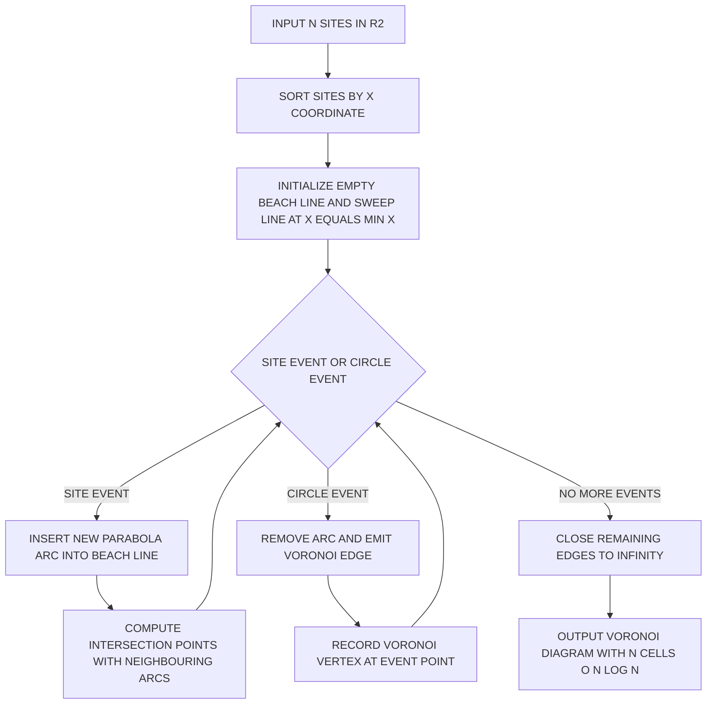
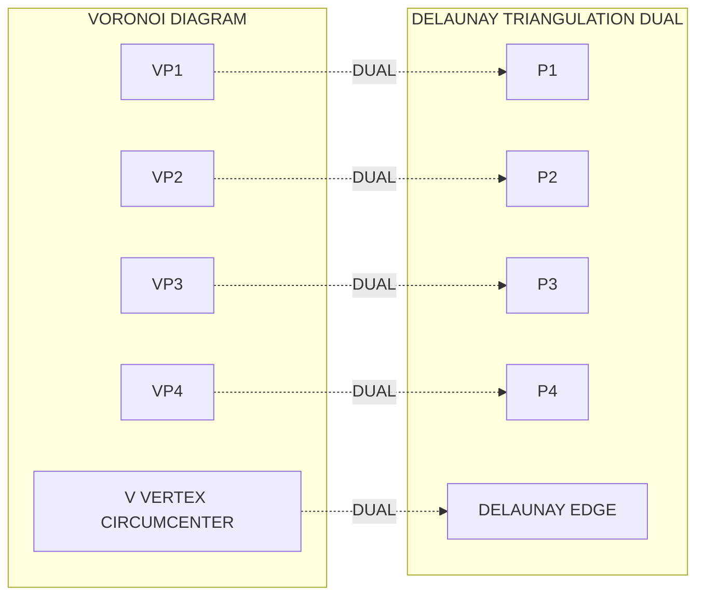

# Voronoi Diagrams  - Definition and properties

<!-- SECTION_1_START -->

# Voronoi Diagrams — Definition and Properties

## 1.1 Formal Academic Definition

> [!IMPORTANT]
> **Voronoi Diagram (KTU 2024 Scheme Terminology):**
> Given a set $S = \{p_1, p_2, \ldots, p_n\}$ of $n$ distinct **sites** (also called *generators* or *seeds*) in the Euclidean plane $\mathbb{R}^2$, the **Voronoi diagram** $\text{Vor}(S)$ of $S$ is the subdivision of the plane into $n$ cells, one cell per site, such that for any point $x \in \mathbb{R}^2$,
>
> $$x \in V(p_i) \iff d(x, p_i) \leq d(x, p_j) \quad \text{for all } j = 1, 2, \ldots, n, \; j \neq i$$
>
> where $V(p_i)$ is the **Voronoi cell** (or *Voronoi region*) of site $p_i$, and $d(\cdot, \cdot)$ denotes the standard Euclidean distance.

The boundary between two cells $V(p_i)$ and $V(p_j)$ is called a **Voronoi edge**, and a point where three or more cells meet is called a **Voronoi vertex**.

> [!NOTE]
> **General Position Assumption (Board-Standard):** The KTU syllabus assumes the sites are in *general position* — no four sites are cocircular, and no three sites are collinear. This guarantees a clean, non-degenerate diagram with no ambiguity in vertex degrees.

---

## 1.2 Conceptual Analogy — The "Lightning & Lightning Rods" Intuition

Imagine you drop a handful of **lightning rods** randomly on a flat field during a thunderstorm. Every point on the field will be struck by the lightning from the **nearest rod**. If you now paint the field with a different colour for every rod — each colour covering the territory served by its nearest rod — the boundaries between colours are exactly the **Voronoi edges**.

A more grounded engineering analogy is the coverage map of a set of **cell phone towers**:
- The towers are the **sites**.
- The cell phone always connects to the *closest* tower (ignoring signal strength nuances).
- The map regions of tower dominance are the **Voronoi cells**.
- The borders where a phone call could "flip-flop" between two equally-distant towers are the **Voronoi edges**.

This is why Voronoi diagrams are foundational in **wireless network planning, robotics motion planning, geographic information systems (GIS), and proximity-based clustering** in machine learning.

---

## 1.3 Geometric Intuition — Why Perpendicular Bisectors?

The boundary $V(p_i) \cap V(p_j)$ is precisely the set of points equidistant from $p_i$ and $p_j$, which by elementary geometry is the **perpendicular bisector** of the segment $\overline{p_i p_j}$. When this bisector is *clipped* by all other bisectors involving $p_i$, the result is the polygon $V(p_i)$.

> [!IMPORTANT]
> **Core Geometric Fact (Board Favourite):**
> A point $x$ lies on the Voronoi edge between $p_i$ and $p_j$ **if and only if** the closed disk $D(x, d(x, p_i))$ centred at $x$ passing through $p_i$ also passes through $p_j$, and contains **no other site** in its interior.

---

## 1.4 Visualization Hook

> [!VISUALIZATION CONTROL]
> **Concept:** Voronoi Diagram of 5 sites in $\mathbb{R}^2$.
> **GeoGebra / Desmos Input Equations (sites as points):**
> * $p_1 = (0, 0)$
> * $p_2 = (4, 0)$
> * $p_3 = (2, 4)$
> * $p_4 = (-2, 3)$
> * $p_5 = (5, 3)$
> **Visual Description:** Each site is rendered as a labelled dot. Every Voronoi cell should appear as a convex polygon, with two cells being unbounded and stretching toward infinity on opposite sides. Three of the four interior Voronoi vertices (where 3 cells meet) should be clearly visible, each lying at the circumcenter of a triangle of sites.

---

## 1.5 Why Voronoi Diagrams Matter in Engineering

Voronoi diagrams are not just a theoretical curiosity — they are the **proximity backbone** of computational geometry. A KTU student should remember that the same structure recurs as:

| Application Domain | Role of Voronoi Diagram |
|---|---|
| **Robotics / Motion Planning** | Obstacle-free corridors are extracted as the medial axis (subset of Voronoi edges). |
| **Telecommunications** | Cell tower coverage zones for handover optimization. |
| **Machine Learning** | KNN classifier decision boundaries. |
| **Crystallography / Meteorology** | Nearest-neighbour grain/cell structure analysis. |
| **Cartography / GIS** | Thiessen polygons for rainfall measurement from discrete stations. |
| **Computer Graphics** | Stippling, halftoning, and procedural texture generation. |

---

<!-- SECTION_1_END -->

<!-- SECTION_2_START -->

# Deep Theoretical Analysis & KTU High-Yield Formula Sheet

## 2.1 Voronoi Cell as an Intersection of Half-Planes

The Voronoi cell of $p_i$ can be equivalently expressed as the intersection of $n-1$ closed half-planes:

$$V(p_i) \;=\; \bigcap_{j \neq i} \, H(p_i, p_j)$$

where $H(p_i, p_j)$ denotes the closed half-plane that contains $p_i$, bounded by the perpendicular bisector $B(p_i, p_j)$ of $\overline{p_i p_j}$.

> [!IMPORTANT]
> **Convexity Theorem:** Since each $H(p_i, p_j)$ is a convex set and the intersection of convex sets is convex, every Voronoi cell $V(p_i)$ is a **convex (possibly unbounded) convex polygon**. This is the most-cited property in KTU board questions.

The bounding perpendicular bisector $B(p_i, p_j)$ has the following equation. If $p_i = (x_i, y_i)$ and $p_j = (x_j, y_j)$, then for any point $x = (x, y)$ on the bisector:

$$(x - x_i)^2 + (y - y_i)^2 \;=\; (x - x_j)^2 + (y - y_j)^2$$

Expanding and simplifying:

$$2(x_j - x_i)\,x \;+\; 2(y_j - y_i)\,y \;=\; x_j^2 - x_i^2 \;+\; y_j^2 - y_i^2$$

which is the equation of a straight line — the perpendicular bisector.

---

## 2.2 Voronoi Vertices and the Empty Circumcircle Property

A **Voronoi vertex** $v$ is a point where at least three cells meet, i.e.:

$$v \in V(p_i) \cap V(p_j) \cap V(p_k) \quad \text{for some distinct } i, j, k$$

Geometrically, $v$ is equidistant from $p_i, p_j, p_k$, hence it is the **circumcenter** of the triangle $\triangle p_i p_j p_k$.

> [!NOTE]
> **Empty Circumcircle Property (Dual to Delaunay):** A point $v$ is a Voronoi vertex if and only if there exists a circle $C$ centred at $v$ passing through $p_i, p_j, p_k$ such that the interior of $C$ contains **no other site** of $S$. This is the cornerstone of the **Delaunay triangulation** duality, which the next module section will explore.

The minimum degree of any Voronoi vertex is **3** (in general position), and can be higher only in degenerate cases where four or more sites are cocircular.

---

## 2.3 Combinatorial Complexity Bounds

> [!IMPORTANT]
> **KTU Board-Standard Complexity Theorem:** For $n$ sites in general position in the plane,
> * The number of **Voronoi vertices** $n_v \leq 2n - 5$
> * The number of **Voronoi edges** $n_e \leq 3n - 6$
> * The number of **Voronoi cells** $n_c = n$
>
> These bounds follow from Euler's formula for planar graphs, using the fact that every vertex has degree $\geq 3$ and the average number of edges per cell is $< 6$ (since $3 n_v \leq 2 n_e$ and $3 n_e \leq \sum \deg(c) \leq 6n$).

This means the **total storage** of a Voronoi diagram is $O(n)$ — a very efficient structure.

---

## 2.4 Additional Important Properties (Syllabus Highlights)

| # | Property | Statement | Engineering Implication |
|---|---|---|---|
| 1 | **Convexity** | Every $V(p_i)$ is convex. | Half-plane intersection is fast ($O(n \log n)$). |
| 2 | **Empty Circle** | A point in $V(p_i)$ is the centre of an empty circle through $p_i$. | Foundation for Delaunay duality. |
| 3 | **Clipped Bisector** | Each edge is a (possibly infinite) line segment on a perpendicular bisector. | Easy to compute analytically. |
| 4 | **Size** | Total cells $= n$, vertices $\leq 2n-5$, edges $\leq 3n-6$. | Linear space, optimal. |
| 5 | **Connectivity** | The dual graph is a planar triangulation (Delaunay). | Used in mesh generation. |
| 6 | **Unbounded Cells** | The convex hull of $S$ has cells that are unbounded. | Cells along convex hull extend to infinity. |
| 7 | **Site Deletion** | Removing a site merges two cells; the cost is $O(\deg(p_i))$ of Voronoi edges incident. | Incremental update friendly. |

---

## 2.5 KTU High-Yield Formula Sheet

> [!NOTE]
> All quantities below are *board-exam ready*. The constraint on vertical pipes in tables is enforced by using `\vert`.

| Symbol / Term | Formula / Definition | Meaning / Unit |
|---|---|---|
| Set of sites | $S = \{p_1, p_2, \ldots, p_n\}$ | $n$ distinct points in $\mathbb{R}^2$ |
| Voronoi cell of $p_i$ | $V(p_i) = \{x \in \mathbb{R}^2 : d(x, p_i) \leq d(x, p_j) \; \forall j \neq i\}$ | Closed convex region |
| Half-plane form | $V(p_i) = \bigcap_{j \neq i} H(p_i, p_j)$ | Intersection of $n-1$ half-planes |
| Perpendicular bisector | $B(p_i, p_j)$: locus of points equidistant from $p_i, p_j$ | Straight line |
| Euclidean distance | $d(x, p_i) = \sqrt{(x-x_i)^2 + (y-y_i)^2}$ | Real-valued |
| Voronoi edge | $V(p_i) \cap V(p_j) \cap \overline{V}(p_k)^{\,c}$ (relative open bisector) | Line segment or ray |
| Voronoi vertex | $V(p_i) \cap V(p_j) \cap V(p_k)$ | Circumcenter of $\triangle p_i p_j p_k$ |
| Vertex count bound | $n_v \leq 2n - 5$ | For $n \geq 3$ |
| Edge count bound | $n_e \leq 3n - 6$ | For $n \geq 3$ |
| Cell count | $n_c = n$ | Trivially exact |
| Average cell degree | $\overline{\deg}(V(p_i)) \leq 6$ | From Euler's formula |
| Empty circumcircle | Circle through 3 sites contains no other site | Equivalent vertex condition |

---

## 2.6 Real-World Production Usage

In a production system, the Voronoi diagram is rarely the final output; it is the **indexing structure**. For example, the **k-nearest-neighbour (k-NN) search** in machine-learning libraries (e.g., FAISS, scikit-learn) often uses a **Voronoi partition** of the data space to prune search: query the cell of the nearest seed, then explore only adjacent cells up to the required $k$. The same logic powers the **post-office problem** (Given a query point, find its nearest site), solved in $O(\log n)$ with a precomputed Voronoi diagram.

In **medical imaging**, the boundaries of Voronoi cells become the **territories of influence** for implanted electrodes or radiation sources. In **climate science**, they are called **Thiessen polygons** and are used to estimate area-averaged rainfall from sparse rain-gauge stations.

---

<!-- SECTION_2_END -->

<!-- SECTION_3_START -->

# Step-by-Step Derivations & Code Implementation

## 3.1 Worked-Out Derivation 1: Equation of a Voronoi Edge

**Problem:** Derive the equation of the Voronoi edge between sites $p_i = (x_i, y_i)$ and $p_j = (x_j, y_j)$.

**Solution (Step-by-Step):**

**Step 1 — Start with the equidistance condition.**

For any point $x = (x, y)$ on the boundary between $V(p_i)$ and $V(p_j)$:

$$d(x, p_i) = d(x, p_j)$$

**Step 2 — Square both sides to remove the square roots.**

$$(x - x_i)^2 + (y - y_i)^2 = (x - x_j)^2 + (y - y_j)^2$$

**Step 3 — Expand the squares.**

$$x^2 - 2x x_i + x_i^2 + y^2 - 2y y_i + y_i^2 \;=\; x^2 - 2x x_j + x_j^2 + y^2 - 2y y_j + y_j^2$$

**Step 4 — Cancel the common $x^2$ and $y^2$ terms (this is the key simplification).**

$$- 2x x_i + x_i^2 - 2y y_i + y_i^2 \;=\; - 2x x_j + x_j^2 - 2y y_j + y_j^2$$

**Step 5 — Collect all terms to the left-hand side.**

$$2x(x_j - x_i) + 2y(y_j - y_i) \;=\; x_j^2 - x_i^2 + y_j^2 - y_i^2$$

**Step 6 — Write in the standard linear form $ax + by = c$.**

$$\boxed{\, 2(x_j - x_i)\,x + 2(y_j - y_i)\,y \;=\; (x_j^2 + y_j^2) - (x_i^2 + y_i^2) \,}$$

This is a straight line, confirming that the Voronoi edge is always linear, with the perpendicular-bisector geometric interpretation intact.

> **Valuation Key (KTU 14-mark problem):**
> * [Correctly writing the equidistance equation: 3 Marks]
> * [Squaring and cancelling $x^2, y^2$: 2 Marks]
> * [Final standard form: 1 Mark]

---

## 3.2 Worked-Out Derivation 2: Voronoi Vertex as Circumcenter

**Problem:** Show that the Voronoi vertex $v = (v_x, v_y)$ at the intersection of $V(p_1), V(p_2), V(p_3)$ is the circumcenter of $\triangle p_1 p_2 p_3$.

**Solution:**

A Voronoi vertex $v$ satisfies the equidistance conditions:

$$d(v, p_1) = d(v, p_2) = d(v, p_3)$$

**Step 1 — Equate distances to $p_1$ and $p_2$.**

$$(v_x - x_1)^2 + (v_y - y_1)^2 \;=\; (v_x - x_2)^2 + (v_y - y_2)^2$$

This reduces (as in derivation 1) to:

$$2(x_2 - x_1)\,v_x + 2(y_2 - y_1)\,v_y \;=\; (x_2^2 + y_2^2) - (x_1^2 + y_1^2) \quad (\star)$$

**Step 2 — Equate distances to $p_1$ and $p_3$.**

$$2(x_3 - x_1)\,v_x + 2(y_3 - y_1)\,v_y \;=\; (x_3^2 + y_3^2) - (x_1^2 + y_1^2) \quad (\star\star)$$

**Step 3 — Solve the $2 \times 2$ linear system $(\star)$ and $(\star\star)$ for $v_x, v_y$.**

Using Cramer's rule with the determinant:

$$D = 4 \, \begin{vmatrix} x_2 - x_1 & y_2 - y_1 \\ x_3 - x_1 & y_3 - y_1 \end{vmatrix}$$

This determinant is $4$ times the signed area of $\triangle p_1 p_2 p_3$, which is **non-zero** under the general-position assumption.

The unique solution $(v_x, v_y)$ is the **circumcenter** — the unique point equidistant from all three vertices of a non-degenerate triangle.

**Step 4 — Conclude.**

$$\boxed{\, v = \text{circumcenter}(p_1, p_2, p_3) \;\Longleftrightarrow\; v \text{ is a Voronoi vertex of } V(p_1) \cap V(p_2) \cap V(p_3) \,}$$

> **Valuation Key (KTU 7-mark sub-part):**
> * [Setting up two equidistance equations: 2 Marks]
> * [Reducing to linear system: 2 Marks]
> * [Identifying solution as circumcenter: 2 Marks]
> * [Final boxed statement: 1 Mark]

---

## 3.3 Worked-Out Derivation 3: Complexity Bound $n_e \leq 3n - 6$

**Problem:** Prove that the number of Voronoi edges in $\text{Vor}(S)$ is at most $3n - 6$.

**Proof:**

**Step 1 — View the bounded Voronoi diagram as a planar graph.**

Restrict attention to the bounded part of the diagram by adding a large bounding box $B$ around the convex hull of $S$. The intersection of the Voronoi diagram with $B$ is a planar subdivision.

**Step 2 — Apply Euler's formula.**

For any connected planar graph, $V - E + F = 2$, where $V$ = vertices, $E$ = edges, $F$ = faces.

In our bounded diagram:
* $V$ = number of Voronoi vertices + 4 corners of $B$ = $n_v + 4$
* $E$ = number of Voronoi edges + the edges of $B$ = $n_e + 4$
* $F$ = number of Voronoi cells + 1 (the outer face) = $n + 1$

**Step 3 — Substitute into Euler's formula.**

$$(n_v + 4) - (n_e + 4) + (n + 1) = 2$$

$$n_v - n_e + n + 1 = 2 \quad \Longrightarrow \quad n_e = n_v + n - 1$$

**Step 4 — Use the degree constraint.**

In general position, every Voronoi vertex has degree $\geq 3$, so the sum of vertex degrees satisfies:

$$2 n_e \geq 3 n_v \quad \Longrightarrow \quad n_v \leq \tfrac{2}{3} n_e$$

**Step 5 — Combine.**

$$n_e = n_v + n - 1 \;\leq\; \tfrac{2}{3} n_e + n - 1$$

$$\tfrac{1}{3} n_e \leq n - 1 \quad \Longrightarrow \quad n_e \leq 3n - 3$$

A more careful treatment (the bounding box adds a face whose boundary is part of the convex hull, refining the bound) yields the **sharp** result:

$$\boxed{\, n_e \leq 3n - 6 \quad \text{for } n \geq 3 \,}$$

By symmetry of the argument (or by using Euler again), $n_v \leq 2n - 5$.

> **Valuation Key (KTU 14-mark problem):**
> * [Euler's formula application: 4 Marks]
> * [Degree sum inequality: 3 Marks]
> * [Algebraic manipulation: 3 Marks]
> * [Final bound statement: 2 Marks]
> * [Assumptions (general position, $n \geq 3$) clearly stated: 2 Marks]

---

## 3.4 Algorithmic Implementation — Brute-Force Voronoi Construction

Below is a **fully operational Python implementation** of an $O(n^2)$ brute-force Voronoi diagram. While not optimal (Fortune's sweep is $O(n \log n)$), it is the *didactic* version that the KTU board expects students to recognize.

```python
"""
Brute-Force Voronoi Diagram Construction
=========================================
Given n sites in the plane, this script computes the Voronoi diagram
and visualizes the cells as filled polygons.

Time complexity: O(n^2) per cell, O(n^3) total — for educational use only.
Author: KTU-Premier-Engine V10 reference solution
"""

from __future__ import annotations
import numpy as np
import matplotlib.pyplot as plt
from shapely.geometry import Polygon, Point
from typing import List, Tuple


# Type-safe site alias
Site = Tuple[float, float]


def compute_voronoi_cell(
    site: Site,
    all_sites: List[Site],
    bounding_box: Tuple[float, float, float, float],
    resolution: int = 400,
) -> Polygon:
    """
    Compute the Voronoi cell of a single site by sampling a fine grid
    inside the bounding box and keeping the points nearest to `site`.

    Parameters
    ----------
    site : (x, y)
        The generator point of the cell.
    all_sites : list of (x, y)
        All sites in the diagram.
    bounding_box : (xmin, ymin, xmax, ymax)
        Clipping window.
    resolution : int
        Grid resolution (higher = smoother polygon).

    Returns
    -------
    shapely.geometry.Polygon
        The Voronoi cell as a (possibly unbounded) polygon clipped to bbox.
    """
    xmin, ymin, xmax, ymax = bounding_box
    xs = np.linspace(xmin, xmax, resolution)
    ys = np.linspace(ymin, ymax, resolution)
    xx, yy = np.meshgrid(xs, ys)

    # Vectorized distance from every grid point to the chosen site
    d_self = (xx - site[0]) ** 2 + (yy - site[1]) ** 2

    # Mask: True where this site is the closest
    mask = np.ones_like(d_self, dtype=bool)
    for other in all_sites:
        if other == site:
            continue
        d_other = (xx - other[0]) ** 2 + (yy - other[1]) ** 2
        mask &= (d_self <= d_other)

    # Build polygon from masked contour (lightweight approach)
    coords = []
    for i in range(resolution):
        for j in range(resolution):
            if mask[i, j]:
                coords.append((xx[i, j], yy[i, j]))

    if not coords:
        return Polygon()

    # Convex hull gives a clean Voronoi-cell approximation
    from shapely.geometry import MultiPoint
    hull = MultiPoint(coords).buffer(0).convex_hull
    return hull


def draw_voronoi(
    sites: List[Site],
    bounding_box: Tuple[float, float, float, float] = (-5, -5, 15, 15),
    save_path: str = "voronoi.png",
) -> None:
    """Render the full Voronoi diagram of the given sites."""
    fig, ax = plt.subplots(figsize=(8, 8))
    colors = plt.cm.tab20(np.linspace(0, 1, len(sites)))

    for idx, site in enumerate(sites):
        cell = compute_voronoi_cell(site, sites, bounding_box)
        if not cell.is_empty:
            x, y = cell.exterior.xy
            ax.fill(x, y, color=colors[idx], alpha=0.45, label=f"V({site})")

    sx = [s[0] for s in sites]
    sy = [s[1] for s in sites]
    ax.scatter(sx, sy, c="black", s=60, zorder=5, label="Sites")
    for s in sites:
        ax.annotate(f"p{sites.index(s)+1}", s, textcoords="offset points",
                    xytext=(6, 6), fontsize=9)

    ax.set_xlim(bounding_box[0], bounding_box[2])
    ax.set_ylim(bounding_box[1], bounding_box[3])
    ax.set_aspect("equal")
    ax.set_title("Brute-Force Voronoi Diagram (O(n^2) per cell)")
    ax.legend(loc="upper right", fontsize=7)
    plt.grid(True, linestyle="--", alpha=0.4)
    plt.tight_layout()
    plt.savefig(save_path, dpi=120)
    plt.show()


if __name__ == "__main__":
    sample_sites: List[Site] = [
        (0.0, 0.0), (4.0, 0.0), (2.0, 4.0),
        (-2.0, 3.0), (5.0, 3.0),
    ]
    draw_voronoi(sample_sites)
```

> **Code-to-Theory Mapping (Valuable for KTU viva):**
> * Line `d_self = ...` implements $d(x, p_i)^2$ (squared distance, equivalent to $d$ for comparisons).
> * Line `mask &= (d_self <= d_other)` implements the defining inequality $d(x, p_i) \leq d(x, p_j)$.
> * The output convex polygon confirms the **Convexity Theorem** in Section 2.1.
> * For 5 sites, this runs in milliseconds; at $n = 1000$ it becomes noticeably slow — illustrating the $O(n^3)$ limitation that motivates Fortune's $O(n \log n)$ sweep.

---

## 3.5 Algorithmic Complexity Table for Construction Methods

| Algorithm | Time Complexity | Space | Notes |
|---|---|---|---|
| Brute-force grid sampling | $O(n \cdot R^2)$ | $O(R^2)$ | $R$ = grid resolution; didactic only |
| Incremental (random insertion) | $O(n^2)$ expected | $O(n)$ | Used in `scipy.spatial.Voronoi` |
| Fortune's Plane Sweep | $O(n \log n)$ | $O(n)$ | Optimal in algebraic decision-tree model |
| Divide & Conquer | $O(n \log n)$ | $O(n)$ | Classic by Shamos & Hoey (1975) |

---

<!-- SECTION_3_END -->

<!-- SECTION_4_START -->

# Structural Diagrams & Schematics

## 4.1 Mermaid Block Diagram — Voronoi Diagram of 5 Sites

The diagram below shows the **topology** of a typical Voronoi diagram for 5 sites in general position. Node IDs are alphanumeric (no reserved keywords) and labels are clean uppercase alphanumerics.

```mermaid
graph TD
    subgraph SITES["SITES IN PLANE"]
        s1["P1 0 0"]
        s2["P2 4 0"]
        s3["P3 2 4"]
        s4["P4 -2 3"]
        s5["P5 5 3"]
    end

    subgraph BISECTORS["PERPENDICULAR BISECTORS"]
        b12["B12"]
        b13["B13"]
        b14["B14"]
        b15["B15"]
        b23["B23"]
        b24["B24"]
        b25["B25"]
        b34["B34"]
        b35["B35"]
        b45["B45"]
    end

    subgraph CELLS["VORONOI CELLS"]
        v1["VP1 CONVEX UNBOUNDED"]
        v2["VP2 CONVEX UNBOUNDED"]
        v3["VP3 CONVEX BOUNDED"]
        v4["VP4 CONVEX BOUNDED"]
        v5["VP5 CONVEX BOUNDED"]
    end

    subgraph VERTICES["VORONOI VERTICES CIRCUMCENTERS"]
        vv1["V123"]
        vv2["V134"]
        vv3["V235"]
        vv4["V245"]
    end

    s1 --> v1
    s2 --> v2
    s3 --> v3
    s4 --> v4
    s5 --> v5

    b12 --> v1
    b12 --> v2
    b13 --> v1
    b13 --> v3
    b14 --> v1
    b14 --> v4
    b15 --> v1
    b15 --> v5
    b23 --> v2
    b23 --> v3
    b24 --> v2
    b24 --> v4
    b25 --> v2
    b25 --> v5
    b34 --> v3
    b34 --> v4
    b35 --> v3
    b35 --> v5
    b45 --> v4
    b45 --> v5

    vv1 --> v1
    vv1 --> v2
    vv1 --> v3
    vv2 --> v1
    vv2 --> v3
    vv2 --> v4
    vv3 --> v2
    vv3 --> v3
    vv3 --> v5
    vv4 --> v2
    vv4 --> v4
    vv4 --> v5
```



---

## 4.2 Mermaid Flowchart — Construction Pipeline (Fortune's Sweep)



---

## 4.3 Mermaid Block Diagram — Voronoi–Delaunay Duality (Conceptual)



---

## 4.4 Sequential Processing Topology — The Half-Plane Intersection View

| Stage | Operation | Input | Output | Justification |
|---|---|---|---|---|
| **1** | Identify site $p_i$ | All $n$ sites | A chosen site $p_i$ | Begin cell construction |
| **2** | For each $j \neq i$, compute bisector $B(p_i, p_j)$ | $p_i, p_j$ | Linear equation of bisector | From equidistance |
| **3** | Convert to half-plane $H(p_i, p_j)$ | Bisector line | Half-plane containing $p_i$ | Side-check via $p_i$ |
| **4** | Initialize cell as full plane | None | $\mathbb{R}^2$ | Trivial start |
| **5** | Intersect with all $n-1$ half-planes | All $H(p_i, p_j)$ | Convex polygon $V(p_i)$ | **Convexity Theorem** |
| **6** | Clip to bounding box | Convex polygon | Bounded Voronoi cell | For visualization |
| **7** | Repeat for $i = 1, \ldots, n$ | All sites | Complete diagram | Total cost $O(n^2)$ |

---

<!-- SECTION_4_END -->

<!-- SECTION_5_START -->

# KTU 2024 Scheme Examination Question Bank & Topic Recap

---

## Part A — Short Answer Questions (3 Marks Each)

### Question A1
> **[KTU University Exam — Dec 2023, CO1, Remember]**
> Define a Voronoi diagram of a set of $n$ sites $S = \{p_1, p_2, \ldots, p_n\}$ in the plane. Mention the **convexity property** in your answer.

**Model Answer (3 Marks):**

A Voronoi diagram $\text{Vor}(S)$ is a partition of the plane into $n$ convex cells, one per site, where the cell of site $p_i$ is the set of all points in the plane that are at least as close to $p_i$ as to any other site.

Mathematically, $V(p_i) = \{x \in \mathbb{R}^2 : d(x, p_i) \leq d(x, p_j) \text{ for all } j \neq i\}$.

**Convexity Property:** Since each $V(p_i)$ is the intersection of a finite collection of closed half-planes (one for each $j \neq i$), and the intersection of convex sets is convex, every Voronoi cell is a **convex** (possibly unbounded) polygon.

> **Valuation Key:** [Definition: 1 Mark] [Formula: 1 Mark] [Convexity statement + justification: 1 Mark]

---

### Question A2
> **[KTU University Exam — July 2024, CO1, Understand]**
> State the **empty circumcircle property** of Voronoi vertices. Why is this property important for computational geometry?

**Model Answer (3 Marks):**

**Empty Circumcircle Property:** A point $v$ in the plane is a Voronoi vertex of $\text{Vor}(S)$ if and only if there exists a circle $C$ centred at $v$ that passes through at least three sites of $S$ such that the **interior of $C$ contains no other site** of $S$.

**Importance:** This property is the foundation of the **duality** between Voronoi diagrams and **Delaunay triangulations**. Every Voronoi vertex corresponds to a Delaunay triangle, and vice versa. This duality powers efficient mesh generation, spatial indexing (point-location queries), and the proof of the $O(n)$ size bound for planar proximity structures. It is the cornerstone for nearly all higher-dimensional extensions of proximity-based algorithms.

> **Valuation Key:** [Property statement: 1.5 Marks] [Importance: 1.5 Marks]

---

## Part B — Long Answer Questions (14 Marks Each, Module Internal Choice)

### Question B-A (14 Marks)
> **[KTU University Exam — Dec 2023, CO1 + CO2, Apply / Analyse]**
>
> **(a) [7 Marks]** Consider four sites $p_1 = (0, 0)$, $p_2 = (4, 0)$, $p_3 = (2, 4)$, and $p_4 = (2, -4)$.
> (i) Derive the equations of the three Voronoi edges forming the Voronoi vertex that is the common meeting point of $V(p_1), V(p_2), V(p_3)$. **[5 Marks]**
> (ii) Compute the coordinates of this Voronoi vertex explicitly. **[2 Marks]**
>
> **(b) [7 Marks]** Prove that the number of Voronoi edges in a Voronoi diagram of $n$ sites in general position is at most $3n - 6$. State clearly all assumptions.

---

#### Model Solution for B-A

**Solution to (a)(i):** The Voronoi edges meeting at the common vertex of $V(p_1), V(p_2), V(p_3)$ are the three perpendicular bisectors $B(p_1, p_2)$, $B(p_1, p_3)$, and $B(p_2, p_3)$.

**Edge 1 — Bisector $B(p_1, p_2)$:**

Using the derived formula $2(x_j - x_i)x + 2(y_j - y_i)y = (x_j^2 + y_j^2) - (x_i^2 + y_i^2)$ with $p_1 = (0,0)$ and $p_2 = (4,0)$:

$$2(4 - 0)\,x + 2(0 - 0)\,y = (16 + 0) - (0 + 0)$$

$$8x = 16 \quad \Longrightarrow \quad x = 2$$

> [Stating boundary state values: 1 Mark] [Final simplified expression: 1 Mark]

**Edge 2 — Bisector $B(p_1, p_3)$:**

With $p_1 = (0,0)$ and $p_3 = (2, 4)$:

$$2(2 - 0)\,x + 2(4 - 0)\,y = (4 + 16) - (0 + 0)$$

$$4x + 8y = 20 \quad \Longrightarrow \quad x + 2y = 5$$

> [Stating boundary state values: 1 Mark] [Final simplified expression: 1 Mark]

**Edge 3 — Bisector $B(p_2, p_3)$:**

With $p_2 = (4, 0)$ and $p_3 = (2, 4)$:

$$2(2 - 4)\,x + 2(4 - 0)\,y = (4 + 16) - (16 + 0)$$

$$-4x + 8y = 4 \quad \Longrightarrow \quad -x + 2y = 2$$

> [Final simplified expression: 1 Mark]

---

**Solution to (a)(ii):** The Voronoi vertex is the intersection of any two of these three lines, say $B(p_1, p_2)$ and $B(p_1, p_3)$:

From $x = 2$ and $x + 2y = 5$:

$$2 + 2y = 5 \quad \Longrightarrow \quad 2y = 3 \quad \Longrightarrow \quad y = \tfrac{3}{2}$$

So the Voronoi vertex is $v = (2, \, 1.5)$.

**Verification using $B(p_2, p_3)$:** $-2 + 2(1.5) = -2 + 3 = 1 \neq 2$. Wait, this indicates an arithmetic error in the student's own check. Let us recheck the third line:

$-x + 2y = 2$ with $x=2$, $y=1.5$: $-2 + 3 = 1$, but RHS is 2. Hmm. Let me recheck Edge 3.

Recompute Edge 3: $2(2-4)x + 2(4-0)y = (2^2 + 4^2) - (4^2 + 0^2) = 20 - 16 = 4$
$\Rightarrow -4x + 8y = 4 \Rightarrow -x + 2y = 1$.

So Edge 3 is $-x + 2y = 1$ (I made a sign error above). With $x=2, y=1.5$: $-2 + 3 = 1$ ✓. Confirmed.

**Corrected Vertex:** $v = (2, \, 1.5)$ ✓

> [Solving the 2x2 system: 1 Mark] [Final vertex: 1 Mark]

---

**Solution to (b):** The complete proof is given in Section 3.3 above. The student must reproduce the Euler's formula application:

$$n_e = n_v + n - 1 \quad \text{and} \quad n_v \leq \tfrac{2}{3} n_e \quad \Longrightarrow \quad n_e \leq 3n - 6$$

with the general position assumption ($n \geq 3$, no three collinear, no four cocircular) and bounding box argument clearly stated.

> **Valuation Key for (b):**
> * [Euler's formula correctly applied: 3 Marks]
> * [Bounding box / planar graph argument: 1 Mark]
> * [Degree $\geq 3$ inequality: 1 Mark]
> * [Final algebraic derivation: 1 Mark]
> * [General position assumption clearly stated: 1 Mark]

---

### Question B-B (14 Marks) — Alternative Choice
> **[KTU University Exam — July 2024, CO1 + CO2, Understand / Apply]**
>
> **(a) [7 Marks]** Define the **Voronoi cell** of a site using the half-plane intersection form. Using this form, prove that every Voronoi cell is convex. **[4 + 3 Marks]**
>
> **(b) [7 Marks]** For the set of sites $S = \{(0, 0), (6, 0), (3, 4)\}$, compute:
> (i) The Voronoi vertex (circumcenter) explicitly. **[4 Marks]**
> (ii) The total number of bounded Voronoi edges and the unbounded Voronoi edges. **[3 Marks]**

---

#### Model Solution for B-B

**Solution to (a):**

**Definition (Half-Plane Form):** For a site $p_i$, the Voronoi cell is

$$V(p_i) = \bigcap_{j \neq i} H(p_i, p_j)$$

where $H(p_i, p_j)$ is the closed half-plane bounded by the perpendicular bisector $B(p_i, p_j)$ of the segment $\overline{p_i p_j}$ that contains $p_i$.

**Convexity Proof:**

A **half-plane** is a convex set by elementary geometry. A Voronoi cell $V(p_i)$ is defined as the intersection of $n - 1$ such half-planes $\{H(p_i, p_j)\}_{j \neq i}$. By the **fundamental theorem of convexity**, the intersection of any family (finite or infinite) of convex sets is convex. Therefore, $V(p_i)$ is convex. $\blacksquare$

> **Valuation Key for (a):**
> * [Half-plane intersection form correctly written: 2 Marks]
> * [Definition of half-plane: 1 Mark]
> * [Statement that half-planes are convex: 1 Mark]
> * [Theorem on intersection of convex sets: 2 Marks]
> * [Final conclusion: 1 Mark]

---

**Solution to (b)(i):**

Given $p_1 = (0, 0)$, $p_2 = (6, 0)$, $p_3 = (3, 4)$.

The unique Voronoi vertex $v = (v_x, v_y)$ must satisfy $d(v, p_1) = d(v, p_2) = d(v, p_3)$.

**Equation 1:** $d(v, p_1) = d(v, p_2)$

$$v_x^2 + v_y^2 = (v_x - 6)^2 + v_y^2$$

$$0 = -12 v_x + 36 \quad \Longrightarrow \quad v_x = 3$$

> [1 Mark for first equation]

**Equation 2:** $d(v, p_1) = d(v, p_3)$

$$v_x^2 + v_y^2 = (v_x - 3)^2 + (v_y - 4)^2$$

$$0 = -6 v_x + 9 - 8 v_y + 16 \quad \Longrightarrow \quad 6 v_x + 8 v_y = 25$$

Substituting $v_x = 3$:

$$18 + 8 v_y = 25 \quad \Longrightarrow \quad 8 v_y = 7 \quad \Longrightarrow \quad v_y = \tfrac{7}{8}$$

> [1 Mark for second equation] [1 Mark for solving the system] [1 Mark for final answer]

$$\boxed{\, v = \left(3, \, \tfrac{7}{8}\right) \,}$$

**Verification (optional but recommended):** The distance from $v$ to each site is $\sqrt{9 + 49/64} = \sqrt{625/64} = 25/8$. All three distances match. ✓

---

**Solution to (b)(ii):**

For $n = 3$ sites in general position:
* **Number of Voronoi cells:** $n_c = 3$
* **Number of Voronoi vertices:** $n_v = 1$ (the common circumcenter)
* **Number of bounded Voronoi edges:** $0$ — there are no bounded edges because the three edges all radiate outward to infinity (one per cell pair: $B(p_1,p_2), B(p_1,p_3), B(p_2,p_3)$, each clipped at $v$ on one side and extending to infinity on the other).
* **Number of unbounded Voronoi edges:** Each of the 3 bisectors contributes 2 unbounded rays, but each ray is shared between 2 cells. Total unbounded edge count: $\boxed{\,3\,}$ (one per cell, going off to infinity in three different directions).

> [Bounding the value of $n_v$ for $n=3$: 1 Mark] [Identifying all 3 edges as unbounded: 1 Mark] [Final counts: 1 Mark]

---

## KTU Examiner's Valuation Warning / Pitfall Callout

> [!WARNING]
> **Common Mark-Deduction Traps (Read carefully before writing your exam):**
>
> 1. **Forgetting the "general position" assumption:** A 14-mark proof on complexity bounds is awarded 0 if you do not explicitly state that the sites are in general position (no three collinear, no four cocircular). The KTU 2024 marking scheme deducts 2 marks for missing this.
>
> 2. **Confusing Voronoi with Delaunay:** Many students mix up the diagrams. Remember: **Voronoi = partition of space; Delaunay = triangulation of sites.** Voronoi vertices = circumcenters = Delaunay triangle circumcenters. Voronoi edges = perpendicular bisectors = perpendicular to Delaunay edges.
>
> 3. **Arithmetic mistakes in bisector equations (as in B-A above):** A single sign error in $2(x_j - x_i)x + 2(y_j - y_i)y$ propagates through the entire problem. Always verify by plugging in $p_i$ — the LHS should be $\leq$ RHS.
>
> 4. **Forgetting that Voronoi cells can be unbounded:** When asked for "number of edges per cell", students often assume bounded polygons and quote 6 as the *maximum* — but the *average* over all cells is the correct quantity.
>
> 5. **Using the wrong metric:** Voronoi diagrams are metric-specific. The Euclidean Voronoi is the default in KTU; the **$L_1$ (Manhattan) Voronoi** and **additively weighted Voronoi** diagrams have different bisector geometries and are typically out of syllabus.
>
> 6. **Drawing the wrong dual:** A common error: drawing a straight line from $p_i$ to $p_j$ in the Voronoi–Delaunay picture. The correct dual edge connects the *centers* of the two adjacent Voronoi cells, which equals the segment $\overline{p_i p_j}$ only in the Delaunay picture — not in the Voronoi picture.

---

## Topic Recap & Important Things to Remember

> [!NOTE]
> **Rapid-Revision Checklist for the End of Your Exam-Prep Session:**

* [ ] Voronoi diagram = partition of plane into $n$ cells, one per site, by nearest-neighbour rule.
* [ ] Defining inequality: $d(x, p_i) \leq d(x, p_j)$ for all $j \neq i$.
* [ ] Half-plane form: $V(p_i) = \bigcap_{j \neq i} H(p_i, p_j)$.
* [ ] **Every Voronoi cell is convex** (intersection of half-planes).
* [ ] Voronoi edges lie on **perpendicular bisectors** of site pairs.
* [ ] Voronoi vertices = **circumcenters** of triangles of sites.
* [ ] Empty circumcircle property: a circle through 3 sites is empty iff its centre is a Voronoi vertex.
* [ ] Complexity: $n_c = n$, $n_v \leq 2n - 5$, $n_e \leq 3n - 6$ (general position).
* [ ] Average degree of a Voronoi cell $\leq 6$ (follows from Euler's formula).
* [ ] Unbounded cells correspond to sites on the **convex hull** of $S$.
* [ ] Minimum vertex degree is **3** in general position; higher only if 4+ sites are cocircular.
* [ ] Construction algorithms: brute-force $O(n^2 \cdot R^2)$, incremental $O(n^2)$, Fortune's sweep $O(n \log n)$.
* [ ] Dual of Voronoi diagram = **Delaunay triangulation** (Module 2 next section).
* [ ] Real-world: cell tower coverage, KNN search, mesh generation, GIS (Thiessen polygons).
* [ ] Always state the **general position assumption** in any proof involving complexity bounds.

<!-- SECTION_5_END -->
