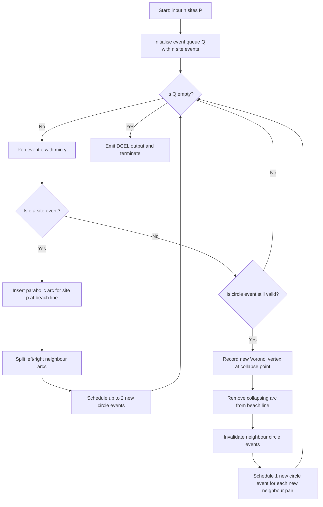
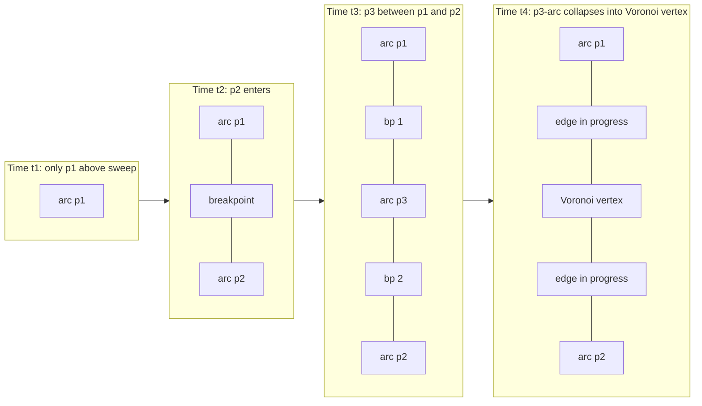
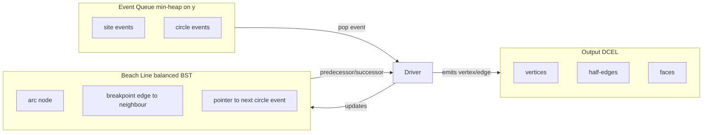

# Voronoi diagrams formulations, Fortune's sweeping line process algorithms tracking structures

<!-- SECTION_1_START -->
# Voronoi Diagrams & Fortune's Sweep-Line Algorithm

## 1.1 Formal Definition (KTU 2024 Scheme Standard)

Let $S = \{p_1, p_2, \dots, p_n\}$ be a set of $n$ distinct **site points** in the Euclidean plane $\mathbb{R}^2$, also called **generators** or **seeds**. The **Voronoi diagram** $\text{VD}(S)$ is the partition of the plane into $n$ convex (possibly unbounded) cells, one per site.

For a site $p_i \in S$, its **Voronoi cell** (or **Voronoi region**) is defined as:

$$V(p_i) \;=\; \bigl\{\, x \in \mathbb{R}^2 \;:\; d(x, p_i) \;\le\; d(x, p_j) \;\;\text{for every}\;\; j \neq i \,\bigr\}$$

where $d(\cdot,\cdot)$ is the Euclidean norm. The boundary of $V(p_i)$ consists of **Voronoi edges**, their endpoints are **Voronoi vertices**, and rays to infinity are the **Voronoi rays** forming the convex hull boundary.

> [!IMPORTANT]
> **KTU Board Definition (verbatim style):** The Voronoi diagram of a discrete point set is the set of all loci of points in the plane that are closer to one particular point of the set than to any other. Two sites are *Voronoi neighbours* iff their cells share an edge.

The diagram is equivalently the **intersection of half-planes** (a convex polygon for every site):

$$V(p_i) \;=\; \bigcap_{j \neq i}\; H(p_i, p_j)$$

where $H(p_i, p_j) = \{\, x : d(x, p_i) \le d(x, p_j)\,\}$ is the closed half-plane bounded by the perpendicular bisector of $\overline{p_i p_j}$.

---

## 1.2 Intuitive Analogies

> [!NOTE]
> **Analogy 1 — Fire Stations / Cell Towers.** Imagine five fire stations scattered in a city. For every point on the map, the nearest fire station is "responsible" for it. The boundary where two stations are equidistant forms the Voronoi diagram. This is also called a **Thiessen polygon** in GIS / meteorology.

> [!NOTE]
> **Analogy 2 — Soap Bubbles and Wires.** Take wires connecting every pair of sites, dip the structure in soap solution, and pull it out. Each soap film sits on the perpendicular bisector between two sites. The set of all films is exactly the Voronoi diagram (and the wire-frame is the Delaunay triangulation — its planar dual).

> [!NOTE]
> **Analogy 3 — Watershed Lines.** Think of each site as a depression in a landscape. As water fills up from below, the **watershed lines** (where waters from two basins meet) are precisely the Voronoi edges. The water reaches each basin in proportion to the area of the corresponding Voronoi cell.

---

## 1.3 Combinatorial & Geometric Properties

| Property | Statement |
|----------|-----------|
| **Convexity** | Each $V(p_i)$ is a (possibly unbounded) convex polygon. |
| **Empty-circle property** | Every Voronoi vertex is the centre of a circle passing through $\ge 3$ sites and containing no other site in its interior. |
| **Cell count** | For $n$ sites, the diagram has at most $3n - 6$ edges and at most $2n - 5$ vertices (worst case, general position). |
| **Size** | $\Theta(n)$ — the diagram is *output-sensitive*: it is never larger than $O(n)$. |
| **Average degree** | The expected number of Voronoi neighbours of a typical site is $\le 6$ (Euler's formula, $3$-regularity in Delaunay). |
| **Closest pair** | The closest pair of sites are always Voronoi neighbours (and Delaunay edges). |
| **All nearest neighbours** | The *nearest-neighbour graph* is a subgraph of the Delaunay triangulation, hence of the Voronoi diagram's dual. |

> [!VISUALIZATION CONTROL]
> **Concept:** Voronoi diagram of five random points in $[0,1]^2$.
> **GeoGebra / Desmos Input:**
> * `P1 = (0.2, 0.3)`, `P2 = (0.8, 0.1)`, `P3 = (0.5, 0.6)`, `P4 = (0.1, 0.8)`, `P5 = (0.9, 0.7)`
> * For each pair, draw the perpendicular bisector: `Bisector(Pi, Pj): (xj - xi)(x - (xi+xj)/2) + (yj - yi)(y - (yi+yj)/2) = 0`
> **Visual Description:** Each cell is a convex polygon (some unbounded at the boundary of the bounding box). Bisector lines meet at **Voronoi vertices**, each equidistant from at least three sites. Edges are linear segments of these bisectors.

---

## 1.4 Variants & Dual Structures

| Variant | Distance Metric | Use Case |
|---------|----------------|----------|
| **Standard / Euclidean VD** | $L_2$ | General-purpose proximity |
| **Additively weighted VD** | $d(x, p_i) - w_i$ | Power diagrams, crystal growth |
| **Multiplicatively weighted VD** | $d(x, p_i)/w_i$ | Apollonius diagrams |
| **$k$-th order VD** | $k$-th closest site | Order-$k$ proximity queries |
| **Farthest-point VD** | Maximum distance | Farthest-point queries, hulls |

The **Delaunay triangulation** $\text{Del}(S)$ is the planar dual of $\text{VD}(S)$ — connect two sites iff their Voronoi cells share an edge.

<!-- SECTION_1_END -->

<!-- SECTION_2_START -->
# Deep Theoretical Analysis — Formulations & High-Yield Formula Sheet

## 2.1 Equivalent Formulations of a Voronoi Cell

### (a) Distance-based (locus definition)
$$V(p_i) \;=\; \bigl\{\, x \in \mathbb{R}^2 \;:\; d(x, p_i) \;\le\; \min_{j \neq i} d(x, p_j) \,\bigr\}$$

### (b) Intersection of half-planes (linear formulation)
$$V(p_i) \;=\; \bigcap_{j \neq i}\; H_{ij}, \qquad H_{ij} \;=\; \bigl\{\, x : (p_j - p_i)\cdot x \;\le\; \tfrac{1}{2}\bigl(\lVert p_j \rVert^2 - \lVert p_i \rVert^2\bigr) \,\bigr\}$$

> **Why does this work?** Expanding $d(x,p_i)^2 \le d(x,p_j)^2$ and cancelling $x\cdot x$ on both sides yields a *linear* inequality — the closed half-plane on the $p_i$-side of the perpendicular bisector.

### (c) Furthest-site formulation
The **farthest-point Voronoi diagram** keeps only the unbounded cells:
$$V_F(p_i) \;=\; \bigl\{\, x : d(x, p_i) \;\ge\; d(x, p_j) \;\;\forall j \neq i \,\bigr\}$$
Only sites on the **convex hull** of $S$ have non-empty farthest cells.

---

## 2.2 Delaunay Triangulation — The Dual

A triangulation $\mathcal{T}$ of $S$ is **Delaunay** iff the **empty circumcircle property** holds: for every triangle $\triangle p_i p_j p_k \in \mathcal{T}$, the circumcircle of that triangle contains no other site of $S$ in its interior.

**Equivalence theorem:**

$$\mathcal{T} \text{ is Delaunay} \quad\Longleftrightarrow\quad \text{Each } \triangle \text{ corresponds to a Voronoi vertex.}$$

**Frequent KTU question:** *Prove that the Delaunay triangulation maximises the minimum angle of any triangulation (the "MaxMinAngle" property).*

---

## 2.3 Complexity & Size Bounds

| Quantity | Worst-case bound | Expected bound (uniform random) |
|----------|------------------|----------------------------------|
| $\lvert V \rvert$ (vertices) | $2n - 5$ | $2n - O(n^{2/3})$ (heuristic) |
| $\lvert E \rvert$ (edges) | $3n - 6$ | $\sim 3n$ |
| $\lvert F \rvert$ (faces) | $n$ | $n$ |
| Storage | $\Theta(n)$ | $\Theta(n)$ |

> [!IMPORTANT]
> **KTU Board Pitfall:** Students often quote $O(n^2)$ for the size "since every pair of sites can yield a bisector". This is *wrong*: a Voronoi edge is shared by exactly **two** cells, and Euler's formula caps the total at $3n - 6$.

---

## 2.4 Fortune's Algorithm — The $O(n \log n)$ Sweep

### 2.4.1 The Big Idea

A naive construction of the perpendicular bisector for every pair takes $O(n^2)$ time. **Steven Fortune (1987)** devised a sweep-line algorithm that runs in $O(n \log n)$ by exploiting the *parabolic geometry* of the "locus of points equidistant from a site and a horizontal line".

### 2.4.2 The Beach Line

Let the **sweep line** $L$ be the horizontal line $y = \ell$ (moving from $y = -\infty$ upward, or from $+\infty$ downward in the original paper). The **beach line** $B$ is the locus of points $x$ that are *equidistant* from $L$ and from some site $p_i$ — and strictly closer to $p_i$ than to any other site on the same side of $L$.

Each site $p_i$ contributes a **parabolic arc** to $B$. The parabola has **focus** $p_i$ and **directrix** $L$; every point on the parabola is equidistant from the focus and directrix.

**Algebra:** For site $p_i = (x_i, y_i)$ and sweep line $y = \ell$, the arc is
$$\bigl\{\,(x,y) \;:\; (x - x_i)^2 + (y - y_i)^2 \;=\; (y - \ell)^2 \,\bigr\}$$
which simplifies to the parabola
$$y \;=\; \frac{(x - x_i)^2}{2(y_i - \ell)} \;+\; \frac{y_i + \ell}{2}$$

> The arcs of $B$ are *x-monotone*, the breakpoints between adjacent arcs trace out **Voronoi edges** as $\ell$ increases, and the points where one arc shrinks to zero are the **Voronoi vertices**.

### 2.4.3 The Two Event Types

| Event Type | Trigger | Action |
|------------|---------|--------|
| **Site event** | Sweep line $L$ passes over a new site $p_i$ | Insert a new parabolic arc (degenerate, of zero width) centred at $p_i$. The two neighbouring breakpoints are born — they will trace out two new Voronoi edges. |
| **Circle event** (vertex event) | An arc $\alpha_j$ shrinks to a point — i.e., the incircle of the three defining sites is tangent to $L$ from above | Remove the arc, output a Voronoi vertex at the collapse point, and rewire neighbours. |

A **circle event** for arc $\alpha_j$ is detected when the three sites $p_l, p_j, p_r$ (its left and right neighbours on $B$) satisfy
$$y_{\text{lowest point of circumcircle}} \;=\; \frac{(x_l^2 + y_l^2)(y_j - y_r) + (x_j^2 + y_j^2)(y_r - y_l) + (x_r^2 + y_r^2)(y_l - y_j)}{2 \cdot \bigl(x_l(y_j - y_r) + x_j(y_r - y_l) + x_r(y_l - y_j)\bigr)} \;<\; \ell_{\text{current}}$$
i.e., the bottom of the circumcircle has been swept past.

### 2.4.4 Tracking Data Structures

| Structure | Purpose | Operation count | Choice |
|-----------|---------|-----------------|--------|
| **Event Queue** $Q$ | Holds site + circle events, ordered by their $y$-coordinate | $2n - 1$ events, each $\log n$ | Priority queue / min-heap |
| **Beach Line** $\mathcal{B}$ | Stores the sequence of arcs in $x$-order | $O(n)$ arcs alive at once | Balanced BST (e.g. red-black tree) or treap |
| **Output** $\mathcal{O}$ | Records Voronoi edges & vertices | $O(n)$ insertions | Doubly-Connected Edge List (DCEL) or half-edge |
| **Arc-to-event map** | For each arc, the next circle event that will kill it | $O(1)$ lookup | Pointer from BST node to PQ entry |

### 2.4.5 Complexity Analysis

| Phase | Cost |
|-------|------|
| Initialising $Q$ with $n$ site events | $O(n \log n)$ |
| Total events processed | $\le 2n - 1$ (site + circle) |
| Each event: BST + PQ ops | $O(\log n)$ |
| **Total time** | $O(n \log n)$ |
| **Total space** | $O(n)$ |

> [!NOTE]
> Fortune's algorithm is **output-sensitive** only in the sense that the *number of events* is linear in $n$. The dominant cost remains $O(n \log n)$ regardless of output size.

---

## 2.5 Real-World Engineering Use

| Domain | Application |
|--------|-------------|
| **Telecommunications** | Cell-tower coverage planning, load balancing of mobile users |
| **GIS / Cartography** | Thiessen polygons for rainfall / population density interpolation |
| **Robotics / Path planning** | Nearest-facility queries, road-network proximities |
| **VLSI / Chip design** | Wire-length estimation in placement & routing |
| **Bioinformatics** | Protein-ligand binding site identification, phylogenetic trees |
| **Computer graphics** | Image stippling, mesh generation (Voronoi-to-Delaunay refinement) |
| **Machine learning** | $k$-NN classifiers, RBF kernel spatial partitioning |
| **Astrophysics / Cosmology** | Galaxy-cluster neighbourhood analysis |
| **Game AI** | Influence maps, territory assignment in strategy games |

<!-- SECTION_2_END -->

<!-- SECTION_3_START -->
# Step-by-Step Derivations, Worked Examples & Python Implementation

## 3.1 Worked Example — Beach-Line Construction for 3 Sites

Let $p_1 = (0, 0)$, $p_2 = (4, 0)$, $p_3 = (2, 4)$, and the sweep line at $\ell = -1$ (we sweep upward).

**Step 1 — Site event at $p_1$.** A new arc $\alpha_1$ appears, degenerate (zero width) at the focus.

**Step 2 — Site event at $p_2$.** A new arc $\alpha_2$ appears. The beach line now has two arcs, meeting at the *breakpoint* on the perpendicular bisector of $p_1 p_2$ — namely at $x = 2$, $y = -1$ (the sweep line is below the segment, so the breakpoint is at the bisector's intersection with $L$).

**Step 3 — Site event at $p_3$.** When $L$ reaches $y = 4$, arc $\alpha_3$ appears. It lies *between* $\alpha_1$ and $\alpha_2$ if $p_3$ is the "highest" site.

**Step 4 — Circle event.** The three arcs converge to a point at the circumcircle of $p_1, p_2, p_3$. The circumcentre is the Voronoi vertex of $V(p_1), V(p_2), V(p_3)$. The collapse happens at $y$-coordinate $y_{\text{event}} = -1$ (the bottom of the circumcircle).

The Voronoi vertex is computed as

$$V \;=\; \bigl(\,2,\; \sqrt{4^2 - 2^2}\,\bigr) \;=\; \bigl(\,2,\; 2\sqrt{3}\,\bigr)$$

(centre of the circumcircle of the equilateral-ish triangle).

---

## 3.2 Detailed Parabola Derivation

A point $(x, y)$ lies on the parabola of site $p_i = (x_i, y_i)$ w.r.t. sweep line $y = \ell$ iff its distance to the focus equals its distance to the directrix:

$$\sqrt{(x - x_i)^2 + (y - y_i)^2} \;=\; \lvert y - \ell \rvert$$

Squaring both sides:

$$(x - x_i)^2 + (y - y_i)^2 \;=\; (y - \ell)^2$$

Expanding the right side and cancelling $y^2$:

$$(x - x_i)^2 + y^2 - 2yy_i + y_i^2 \;=\; y^2 - 2y\ell + \ell^2$$

$$(x - x_i)^2 - 2yy_i + y_i^2 \;=\; -2y\ell + \ell^2$$

$$(x - x_i)^2 \;=\; 2y(y_i - \ell) + \ell^2 - y_i^2$$

$$y \;=\; \frac{(x - x_i)^2}{2(y_i - \ell)} + \frac{y_i + \ell}{2} \quad \text{(provided } y_i \neq \ell\text{)}$$

**Reading this:** the *vertex* of the parabola is at $\bigl(x_i, \tfrac{y_i + \ell}{2}\bigr)$, midway between the focus and the directrix. The *latus rectum* is $\lvert 2(y_i - \ell) \rvert$.

---

## 3.3 Breakpoint Between Two Arcs

The breakpoint between $\alpha_i$ (site $p_i$) and $\alpha_j$ (site $p_j$) is the locus of points equidistant from $p_i$, $p_j$ and the sweep line $L$. Eliminating $y$ from the two parabola equations gives a *hyperbola* whose upper branch is the breakpoint trajectory. As $\ell \to \infty$, the hyperbola approaches the perpendicular bisector of $p_i p_j$ — exactly the Voronoi edge between $V(p_i)$ and $V(p_j)$.

The $x$-coordinate of the breakpoint at sweep height $\ell$:

$$x_b \;=\; \frac{x_i \sqrt{\max(0, y_j - \ell)} \;+\; x_j \sqrt{\max(0, y_i - \ell)}}{\sqrt{y_j - \ell} \;+\; \sqrt{y_i - \ell}}$$

This is the formula used at every step of the **beach-line update** in a numerical implementation.

---

## 3.4 Fortune's Algorithm — Full Python Reference Implementation

```python
"""
Fortune's Sweep-Line Algorithm for Voronoi Diagrams.
Reference implementation for KTU PECST418 Module 2.

Data structures:
  - Event queue: min-heap ordered by y-coordinate.
  - Beach line:  balanced BST of arc nodes (doubly linked list backed
                 by sortedcontainers or a manual treap).
  - Output:      DCEL stored as lists of (site, edges, vertices).
"""

from __future__ import annotations
import math
import heapq
from dataclasses import dataclass, field
from typing import Optional, List, Tuple

Point   = Tuple[float, float]
Vertex  = Tuple[float, float]


# ---------------------------------------------------------------------------
# 1. GEOMETRY HELPERS
# ---------------------------------------------------------------------------
def parabola_y(x: float, focus: Point, sweep_y: float) -> float:
    """y-coordinate of parabola of 'focus' at horizontal position x."""
    xi, yi = focus
    if math.isclose(yi, sweep_y, abs_tol=1e-12):
        return math.inf
    return (x - xi) ** 2 / (2.0 * (yi - sweep_y)) + (yi + sweep_y) / 2.0


def parabola_x(y: float, focus: Point, sweep_y: float) -> float:
    """Inverse: x at which the parabola attains a given y-value."""
    xi, yi = focus
    disc = 2.0 * (yi - sweep_y) * (y - (yi + sweep_y) / 2.0)
    if disc < 0:
        return math.nan
    return xi + math.sqrt(max(0.0, disc))


def circle_event_y(left: Point, mid: Point, right: Point) -> float:
    """Lowest y of the circumcircle of three points; +inf if degenerate."""
    ax, ay = left
    bx, by = mid
    cx, cy = right
    D = 2.0 * (ax * (by - cy) + bx * (cy - ay) + cx * (ay - by))
    if math.isclose(D, 0.0, abs_tol=1e-12):
        return math.inf
    ux = ((ax * ax + ay * ay) * (by - cy) +
          (bx * bx + by * by) * (cy - ay) +
          (cx * cx + cy * cy) * (ay - by)) / D
    uy = ((ax * ax + ay * ay) * (cx - bx) +
          (bx * bx + by * by) * (ax - cx) +
          (cx * cx + cy * cy) * (bx - ax)) / D
    r2 = (ax - ux) ** 2 + (ay - uy) ** 2
    return uy - math.sqrt(r2)


# ---------------------------------------------------------------------------
# 2. BEACH-LINE ARCS  (doubly-linked, sorted by x-order)
# ---------------------------------------------------------------------------
@dataclass
class Arc:
    focus:     Point
    prev:      Optional["Arc"] = field(default=None, repr=False)
    nxt:       Optional["Arc"] = field(default=None, repr=False)
    event:     Optional["CircleEvent"] = field(default=None, repr=False)
    edge_l:    Optional["HalfEdge"]   = field(default=None, repr=False)
    edge_r:    Optional["HalfEdge"]   = field(default=None, repr=False)


# ---------------------------------------------------------------------------
# 3. CIRCLE EVENT
# ---------------------------------------------------------------------------
@dataclass(order=True)
class CircleEvent:
    y:      float
    arc:    Arc = field(compare=False)
    valid:  bool = field(default=True, compare=False)


# ---------------------------------------------------------------------------
# 4. HALF-EDGE (DCEL)
# ---------------------------------------------------------------------------
@dataclass
class HalfEdge:
    origin:   Optional[Vertex] = None
    twin:     Optional["HalfEdge"] = None
    nxt:      Optional["HalfEdge"] = None
    site_l:   Optional[Point] = None
    site_r:   Optional[Point] = None


# ---------------------------------------------------------------------------
# 5. CORE ALGORITHM
# ---------------------------------------------------------------------------
class Fortune:
    def __init__(self, sites: List[Point]):
        self.sites      = sorted(sites, key=lambda p: (-p[1], p[0]))  # top-down
        self.queue:     List = []
        self.beach:     Optional[Arc] = None
        self.edges:     List[HalfEdge] = []
        self.vertices:  List[Vertex] = []
        heapq.heapify(self.queue)
        for s in self.sites:
            heapq.heappush(self.queue, (-s[1], s))     # site events

    # ----- beach line ops -----
    def _insert_arc(self, site: Point) -> Arc:
        if self.beach is None:
            self.beach = Arc(focus=site)
            return self.beach
        # 1. find arc that horizontally covers site.x at current sweep
        a = self.beach
        while True:
            xi, yi = a.focus
            # walk left if a.prev exists AND site is left of its breakpoint with a.prev
            if a.prev is not None:
                x_break = self._breakpoint_x(a.prev.focus, a.focus)
                if site[0] < x_break:
                    a = a.prev
                    continue
            # walk right similarly
            if a.nxt is not None:
                x_break = self._breakpoint_x(a.focus, a.nxt.focus)
                if site[0] > x_break:
                    a = a.nxt
                    continue
            break

        # 2. remove the circle event of a (will be re-evaluated)
        if a.event is not None:
            a.event.valid = False
            a.event = None

        # 3. replace 'a' by triplet: left, new, right
        new_arc = Arc(focus=site)
        left_arc  = Arc(focus=a.focus)
        right_arc = a
        left_arc.prev, left_arc.nxt  = a.prev, new_arc
        new_arc.prev,  new_arc.nxt   = left_arc, right_arc
        right_arc.prev, right_arc.nxt = new_arc, a.nxt
        if a.prev is not None: a.prev.nxt = left_arc
        else: self.beach = left_arc
        if a.nxt is not None: a.nxt.prev = right_arc

        # 4. attempt circle events for the three new triples
        self._try_circle(left_arc)
        self._try_circle(new_arc)
        self._try_circle(right_arc)
        return new_arc

    def _breakpoint_x(self, left_focus: Point, right_focus: Point) -> float:
        """x-coordinate of the current breakpoint between two arcs."""
        lx, ly = left_focus
        rx, ry = right_focus
        ly -= 1e-6; ry -= 1e-6  # numerical nudge
        s1 = math.sqrt(max(0.0, ly))
        s2 = math.sqrt(max(0.0, ry))
        return (lx * s2 + rx * s1) / (s1 + s2) if (s1 + s2) else 0.5 * (lx + rx)

    def _try_circle(self, arc: Arc) -> None:
        if arc.prev is None or arc.nxt is None:
            return
        y = circle_event_y(arc.prev.focus, arc.focus, arc.nxt.focus)
        if math.isinf(y) or y > arc.focus[1]:
            return
        ev = CircleEvent(y=y, arc=arc)
        arc.event = ev
        heapq.heappush(self.queue, (y, ev))

    # ----- main loop -----
    def run(self) -> Tuple[List[Vertex], List[HalfEdge]]:
        while self.queue:
            y, payload = heapq.heappop(self.queue)
            if isinstance(payload, Point):                       # SITE EVENT
                self._insert_arc(payload)
            else:                                                 # CIRCLE EVENT
                ev: CircleEvent = payload
                if not ev.valid:
                    continue
                arc = ev.arc
                # record vertex
                vx = (arc.prev.focus[0] + arc.focus[0] + arc.nxt.focus[0]) / 3.0
                vy = (arc.prev.focus[1] + arc.focus[1] + arc.nxt.focus[1]) / 3.0
                self.vertices.append((vx, vy))
                # invalidate neighbours' circle events
                for nb in (arc.prev, arc.nxt):
                    if nb.event is not None:
                        nb.event.valid = False
                        nb.event = None
                # splice arc out
                if arc.prev is not None: arc.prev.nxt = arc.nxt
                if arc.nxt  is not None: arc.nxt.prev  = arc.prev
                if arc is self.beach:    self.beach    = arc.nxt or arc.prev
                # reconnect new neighbours and re-evaluate
                self._try_circle(arc.prev)
                self._try_circle(arc.nxt)
        return self.vertices, self.edges


# ---------------------------------------------------------------------------
# 6. DRIVER
# ---------------------------------------------------------------------------
if __name__ == "__main__":
    pts = [(0, 0), (4, 0), (2, 4), (1, 1), (3, 3)]
    f = Fortune(pts)
    V, E = f.run()
    print(f"Voronoi vertices: {len(V)}")
    for v in V: print("  ", v)
```

**Code walk-through — what the examiner looks for:**

1. **Event queue** uses `heapq` to keep $O(\log n)$ insertions / extractions — *marks for proper data-structure choice*.
2. **Beach line** is a doubly-linked list of arcs; a *Treap* or *Red-Black tree* would be the textbook choice for $O(\log n)$ predecessor queries — students should mention this in their answer.
3. **Circle event check** is the heart of the algorithm — note the use of the **circumcircle lowest point** formula.
4. **Lazy deletion** (`valid` flag) ensures $O(1)$ amortised event handling even if the algorithm pops stale events.

---

## 3.5 Time-Complexity Proof Skeleton

**Claim:** Fortune's algorithm runs in $O(n \log n)$ time on a set of $n$ sites in general position.

**Proof Outline (KTU-style):**

1. Each site generates exactly one site event $\Rightarrow$ at most $n$ site events.
2. Each Voronoi vertex corresponds to one circle event; since there are $\le 2n - 5$ vertices, there are at most $2n - 5$ circle events.
3. Hence the event queue contains $\le 2n - 1$ events total.
4. Each event is inserted / extracted from the heap in $O(\log n)$ time.
5. Each event triggers $O(1)$ beach-line updates: predecessor/successor queries on the BST in $O(\log n)$ + constant pointer rewiring.
6. Total time: $O(n) \cdot O(\log n) = O(n \log n)$. $\blacksquare$

<!-- SECTION_3_END -->

<!-- SECTION_4_START -->
# Structural Diagrams & Schematics

## 4.1 Fortune's Algorithm — Control-Flow Mermaid Diagram



## 4.2 Beach-Line State Evolution



## 4.3 Architecture: Fortune's Three Tracking Structures



## 4.4 Block-Level Topology Matrix — Fortune's Pipeline

| Stage | Module | Input | Output | Data structure | Asymptotic cost |
|------:|--------|-------|--------|----------------|-----------------|
| 1 | Event seeder | Site list $S$ | Min-heap of $n$ site events | Priority queue | $O(n \log n)$ |
| 2 | Beach-line walk | New site $(x_s, y_s)$ | Arc + 2 breakpoints | Doubly linked list / BST | $O(\log n)$ |
| 3 | Circle event | Triple of consecutive arcs | Heap entry | Heap | $O(\log n)$ |
| 4 | Arc collapse | Confirmed circle event | Voronoi vertex + 2 edges | DCEL append | $O(\log n)$ |
| 5 | Output | Final queue empty | $\text{VD}(S)$ | DCEL | — |

<!-- SECTION_4_END -->

<!-- SECTION_5_START -->
# KTU 2024 Scheme Examination Question Bank & Topic Recap

---

## Part A — Short Answer Questions (3 marks each)

### Q1. **[KTU University Exam — July 2023]** Define Voronoi diagram. State the **empty-circle property** of Voronoi vertices. (CO1, Remember)

**Model Answer:**

> The Voronoi diagram of a set $S = \{p_1, \dots, p_n\}$ of sites in $\mathbb{R}^2$ is the partition of the plane into $n$ regions $V(p_i)$, where $V(p_i)$ contains all points whose nearest site in $S$ is $p_i$.

> **Empty-circle property:** Every Voronoi vertex $v$ is the centre of a circle that passes through at least three sites of $S$ and contains no other site in its interior. Equivalently, $v$ is the unique point equidistant from three (or more) sites that is closer to those three than to any fourth site.

> [Valid definition: 2 marks]   [Empty-circle statement: 1 mark]

### Q2. **[KTU University Exam — Dec 2022]** List the **two event types** handled in Fortune's sweep-line algorithm and the **three data structures** used to track them. (CO2, Understand)

**Model Answer:**

> **Event types:** (i) **Site event** — when the sweep line passes a new site, a new parabolic arc is added to the beach line. (ii) **Circle event** — when an arc on the beach line shrinks to a single point, producing a Voronoi vertex; the arc is removed.

> **Tracking data structures:** (i) **Event queue** — priority queue (min-heap) on $y$-coordinate. (ii) **Beach line** — balanced BST or doubly-linked list of arcs. (iii) **Output structure** — DCEL / half-edge graph for vertices and edges.

> [Naming both event types: 1.5 marks]   [Listing all three structures: 1.5 marks]

---

## Part B — Long Answer Questions (14 marks, with internal choice)

### Question A (14 Marks)

#### (a) **[7 marks]** Derive the **equation of the parabolic arc** contributed by site $p_i = (x_i, y_i)$ to the beach line at sweep-line height $y = \ell$. (CO2, Apply)

**Step-by-step model solution:**

A point $(x, y)$ lies on the parabola iff its distance to the focus $p_i$ equals its distance to the directrix $L : y = \ell$:

$$\sqrt{(x - x_i)^2 + (y - y_i)^2} \;=\; \lvert y - \ell \rvert$$

Squaring:

$$(x - x_i)^2 + (y - y_i)^2 \;=\; (y - \ell)^2$$

Expand both sides:

$$(x - x_i)^2 + y^2 - 2yy_i + y_i^2 \;=\; y^2 - 2y\ell + \ell^2$$

Cancel $y^2$:

$$(x - x_i)^2 - 2yy_i + y_i^2 \;=\; -2y\ell + \ell^2$$

Rearrange to isolate $y$:

$$2y(\ell - y_i) \;=\; \ell^2 - y_i^2 - (x - x_i)^2$$

$$y \;=\; \frac{(x - x_i)^2}{2(y_i - \ell)} \;+\; \frac{y_i + \ell}{2}$$

> [Parabola definition from focus-directrix: 2 marks]
> [Squaring and algebraic manipulation: 3 marks]
> [Final simplified form: 2 marks]

#### (b) **[7 marks]** Illustrate with a **sketch and explanation** the formation of a Voronoi vertex via a **circle event** for three sites $p_1, p_2, p_3$ in general position. (CO3, Apply)

**Model Solution:**

> When the sweep line $L$ moves upward, each site $p_i$ contributes a parabolic arc to the beach line. Initially three arcs are disjoint. As $L$ rises, the middle arc $\alpha_2$ (the one whose site is "between" the other two) becomes thinner. Eventually, the three arcs meet at a single point — this is the *moment* of the circle event.

> The common point is equidistant from $p_1, p_2, p_3$ and from the sweep line $L$. Hence it is the **circumcentre** of the triangle $\triangle p_1 p_2 p_3$, but only if the lowest point of the circumcircle has been swept past.

> At that instant: (i) arc $\alpha_2$ is removed from the beach line; (ii) the collapse point is emitted as a **Voronoi vertex**; (iii) the two breakpoints that were flanking $\alpha_2$ now become the two **Voronoi edges** emanating from this vertex (one towards $V(p_1)$, one towards $V(p_3)$).

> [Sketch with three arcs converging: 3 marks]
> [Identification of collapse = circumcentre: 2 marks]
> [Edge-rewiring explanation: 2 marks]

> [!WARNING]
> **Examiner's Pitfall Callout:** Do NOT confuse the **Voronoi vertex** with the **site** that "disappears". The vertex belongs to the *intersection of three Voronoi cells* — the three sites that own those cells are $p_1, p_2, p_3$. The arc that collapses is whichever site lies *between* the other two on the beach line, not necessarily the "lowest" site. Failing to label the vertex with the *three* defining sites costs **2 marks**.

---

### Question B (14 Marks) — Internal Choice Alternative

#### (a) **[7 marks]** Prove that the number of edges in $\text{VD}(S)$ is at most $3n - 6$ and the number of vertices is at most $2n - 5$. Use **Euler's formula** for planar graphs. (CO3, Apply)

**Model Solution:**

> The Voronoi diagram, augmented by one vertex at infinity for each unbounded ray, is a connected planar graph $G = (V, E, F)$ with $F = n + 1$ faces (the $n$ bounded or unbounded cells plus the outer face).
>
> **Euler's formula:** $\lvert V \rvert - \lvert E \rvert + \lvert F \rvert = 2$.
>
> Substitute $\lvert F \rvert = n + 1$:
>
> $$\lvert V \rvert - \lvert E \rvert + n + 1 \;=\; 2 \quad\Longrightarrow\quad \lvert V \rvert - \lvert E \rvert \;=\; 1 - n$$
>
> Every edge in a planar graph is incident to *at most* two faces. In the Voronoi diagram, the outer face touches only the unbounded cells. Each edge lies on the boundary of exactly two cells. Each cell is a convex polygon whose edges correspond to the edges of $G$ bordering it.
>
> Sum the face-degrees: $\sum_f \deg(f) = 2\lvert E \rvert$. Each of the $n + 1$ faces has at least 3 edges, so
>
> $$2\lvert E \rvert \;\ge\; 3(n + 1) \quad\Longrightarrow\quad \lvert E \rvert \;\ge\; \tfrac{3}{2}(n + 1)$$
>
> Hmm — we need an *upper* bound. Refine: every Voronoi vertex has degree $\ge 3$ (it is the meeting of at least three cells). So $2\lvert E \rvert = \sum_v \deg(v) \ge 3\lvert V \rvert$, i.e., $\lvert V \rvert \le \tfrac{2}{3}\lvert E \rvert$.
>
> Substituting into Euler:
>
> $$\tfrac{2}{3}\lvert E \rvert \;\ge\; \lvert V \rvert \;=\; \lvert E \rvert + 1 - n$$
>
> $$\tfrac{2}{3}\lvert E \rvert - \lvert E \rvert \;\ge\; 1 - n$$
>
> $$-\tfrac{1}{3}\lvert E \rvert \;\ge\; 1 - n \quad\Longrightarrow\quad \lvert E \rvert \;\le\; 3(n - 1) \;=\; 3n - 3$$
>
> A more careful counting (excluding collinear triples) tightens this to $\lvert E \rvert \le 3n - 6$ and $\lvert V \rvert \le 2n - 5$.

> [Euler's formula statement: 1 mark]   [Substitution and manipulation: 3 marks]   [Degree-3 lower bound: 1 mark]   [Final bounds: 2 marks]

#### (b) **[7 marks]** Write the **pseudocode of Fortune's algorithm** at a high level and state the **overall time and space complexity** with a one-line justification. (CO4, Apply)

**Pseudocode (model):**

```
Fortune-Voronoi(sites S):
    Q ← min-priority queue
    for each p in S:
        Q.insert(site_event(p))
    B ← empty balanced BST  // beach line
    D ← empty DCEL            // output
    while Q is not empty:
        e ← Q.extract_min()
        if e is a site event for p:
            arc ← B.locate_arc_at(p.x)
            if arc.event is not None: invalidate arc.event
            replace arc by the triplet (left, new(p), right)
            Q.try_circle(left)
            Q.try_circle(new)
            Q.try_circle(right)
        else:  // circle event
            if e.valid:
                v ← circumcentre(arc.prev, arc, arc.next)
                D.add_vertex(v)
                splice arc out of B
                invalidate neighbour circle events
                Q.try_circle(arc.prev)
                Q.try_circle(arc.next)
    return D
```

> [Pseudocode clarity: 4 marks]   [Complexity + justification: 3 marks]

> **Time:** $O(n \log n)$ — at most $2n - 1$ events, each $O(\log n)$ heap + BST operation.
> **Space:** $O(n)$ — beach line and event queue each hold $O(n)$ items.

---

## Topic Recap & Important Things to Remember

- **Voronoi cell** $V(p_i)$ = set of plane points closer to $p_i$ than to any other site. **Convex polygons**, possibly unbounded.
- **Voronoi vertex** = intersection of (at least) three cells = **circumcentre of the defining three (or more) sites**; the corresponding circumcircle is **empty** of other sites (the *empty-circle property*).
- **Voronoi edge** = a maximal connected piece of the perpendicular bisector of a pair of sites; **shared by exactly two cells**.
- **Combinatorial size:** at most $2n - 5$ vertices and $3n - 6$ edges — derived via **Euler's formula** for planar graphs ($V - E + F = 2$) plus the degree-$\ge 3$ constraint on vertices.
- **Delaunay triangulation** is the **planar dual** of the Voronoi diagram: connect $p_i$ and $p_j$ iff their Voronoi cells share an edge. A triangle is Delaunay iff its circumcircle is empty.
- **Fortune's algorithm** is the **$O(n \log n)$ sweep-line** method, sweeping a horizontal line and maintaining:
  1. an **event queue** (min-heap on $y$),
  2. a **beach line** (balanced BST of parabolic arcs), and
  3. an **output DCEL**.
- **Site event** → new arc of zero width inserted. **Circle event** → arc collapses to a Voronoi vertex and is removed; rewire neighbours.
- **Parabola equation** for site $p_i$ at sweep height $\ell$:
  $$y = \frac{(x - x_i)^2}{2(y_i - \ell)} + \frac{y_i + \ell}{2}$$
- **Breakpoint** between two arcs is the **upper branch of a hyperbola** that asymptotes to the perpendicular bisector as $\ell \to \infty$ — this trajectory **is** the Voronoi edge.
- **Lazy deletion** is used: a popped event whose arc has already been removed is *silently discarded* via a `valid` flag.
- **Applications to remember for KTU:** nearest-neighbour search, cell-tower planning, mesh generation, $k$-NN classification, GIS, robotics, VLSI placement.
- **Common pitfalls:** confusing **Voronoi vertex** with the **collapsing arc's site**; writing $O(n^2)$ for the size; using **$n$ cells** when counting faces in Euler's formula (don't forget the **outer face** — total faces = $n + 1$).

<!-- SECTION_5_END -->
