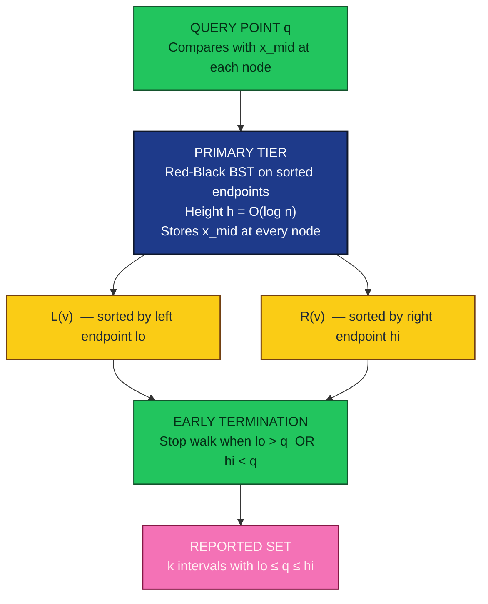
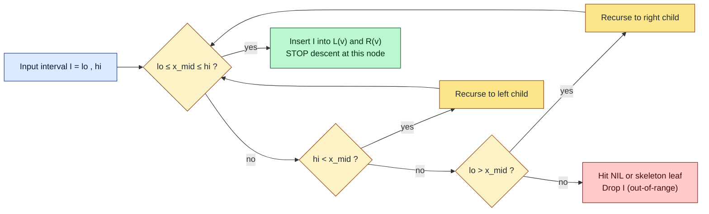
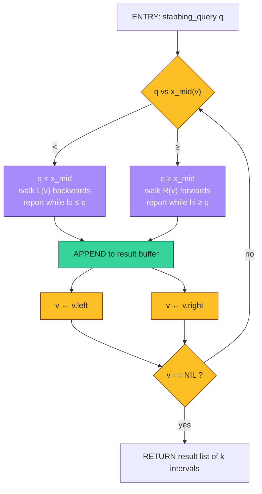
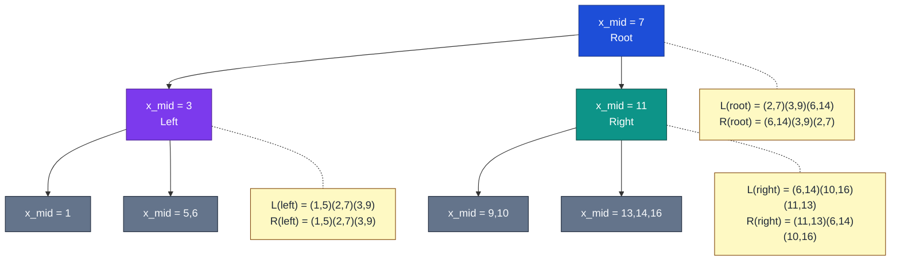
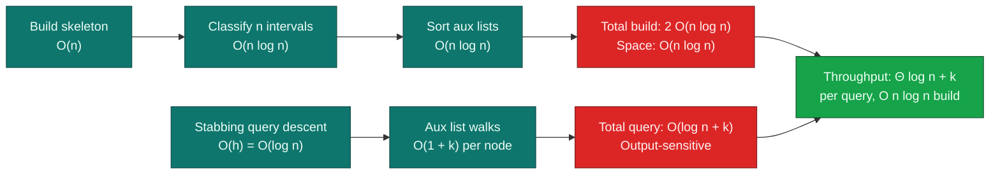

# Interval trees segment parsing computational paths algorithms tracking throughput

<!-- SECTION_1_START -->
# Interval Trees & Segment Path Algorithms in Range Searching

> [!IMPORTANT]
> **KTU PECST418 | Module 3 | KTU 2024 Scheme**
> This note covers **Interval Trees**, a foundational data structure of orthogonal range searching, and the segment-path parsing algorithms used to query, insert, and delete intervals in optimal logarithmic time. The construction of the auxiliary structure and the canonical reporting procedure are the high-yield items routinely asked in KTU university examinations.

## 1.1 Formal Definition (KTU Syllabus Terminology)

An **Interval Tree** is an augmented red–black binary search tree that stores a dynamic set of closed intervals $[l_i, r_i]$ on a one-dimensional line and supports the following query primitives in $O(\log n)$ time:

1. **Point-Stabbing Query** — given a point $q \in \mathbb{R}$, report all intervals $[l_i, r_i]$ that contain $q$ (i.e. $l_i \le q \le r_i$).
2. **Interval Insertion** — insert a new interval into the structure while preserving the red–black invariants.
3. **Interval Deletion** — remove a stored interval and re-balance the tree.

The tree is **static in shape** (red–black skeleton does not depend on the stored intervals) but **dynamic in content** (intervals are added/removed freely).

> [!NOTE]
> **Syllabus Highlight — PECST418 M3:**
> Interval trees are listed under *Range Searching* alongside segment trees and priority search trees. The expected outcome is the ability to (i) construct the auxiliary structure from a sorted endpoint set, (ii) perform stabbing queries, and (iii) state complexity bounds.

## 1.2 Conceptual Analogy — The Elevator Directory

Imagine a 40-floor building where each company rents one or more **consecutive floors**. The building manager maintains:

- A **directory of companies** (the red–black tree) ordered alphabetically.
- A **per-floor index card** for every floor $f$ that lists only the companies renting that floor.

When a visitor arrives on **floor 17** and asks *"which company occupies this floor?"*, the manager does not scan the whole directory. Instead, the manager:

1. Bins the visitor's floor into the floor-index card for $f = 17$ (this is the **auxiliary structure** of node $v$).
2. Reads the company names listed on that single card.

The directory guarantees the visitor finds the right card in $O(\log n)$ time, and the card itself contains *only the companies that overlap that floor*. This is the exact two-tier scheme of an interval tree.

## 1.3 Geometric Intuition on the Real Line

Place each interval $[l_i, r_i]$ as a horizontal bar on a one-dimensional axis. The red–black tree stores the **median endpoint** $x_{mid}(v)$ at every node $v$. A bar belongs to node $v$ if it straddles $x_{mid}(v)$ — i.e. $l_i \le x_{mid}(v) \le r_i$. Bars that lie entirely to the left are routed to the left subtree, and bars entirely to the right to the right subtree. This guarantees that **the stabbing set for any query point is the union of at most two sorted lists** at $O(\log n)$ nodes.

> [!VISUALIZATION CONTROL]
> **Concept:** Interval tree with stabbing set visualization
> **GeoGebra / Desmos Input:**
> * Intervals to plot: $I_1 = [1,8]$, $I_2 = [3,12]$, $I_3 = [5,6]$, $I_4 = [9,15]$, $I_5 = [11,14]$
> * Query point: $q = 7$
> * Midpoint values per node: $x_{mid}(\text{root}) = 7$, $x_{mid}(\text{left}) = 3$, $x_{mid}(\text{right}) = 11$
> **Visual Description:** Plot each interval as a horizontal segment of height 0.1 stacked vertically. Draw a vertical dashed line at $x = 7$. Observe that only $I_1, I_2, I_3$ straddle this line — these are exactly the intervals that the auxiliary lists at the root, left child, and right child must report.

## 1.4 Physical Constants & Standard Metrics

- **Node degree bound:** each red–black tree node stores at most **2 auxiliary lists**, one sorted by **left endpoint** and one sorted by **right endpoint**.
- **Standard height:** $h \le 2 \log_2(n+1)$ for a red–black tree on $n$ intervals.
- **Worst-case auxiliary list size at node $v$:** $O(n)$ at the root (degenerate case), but **sum over all nodes is $O(n \log n)$** — this is the standard amortized bound.

> [!NOTE]
> **Augmentation identity:** Every interval is stored in the auxiliary structure of exactly those nodes whose $x_{mid}$ value it contains. Because any interval contains at most the $x_{mid}$ values of the nodes on the search path of its left endpoint, plus the search path of its right endpoint, each interval is duplicated at most $2 \log n$ times.

<!-- SECTION_1_END -->

<!-- SECTION_2_START -->
# Deep Theoretical Analysis & KTU High-Yield Formula Sheet

## 2.1 The Two-Tier Architecture

An interval tree on a set $S$ of $n$ closed intervals is composed of:

| Tier | Structure | Stored Quantity | Ordering | Purpose |
|------|-----------|-----------------|----------|---------|
| **Primary** | Red–Black BST on the sorted set of distinct endpoints $X = \bigcup_i \{l_i, r_i\}$ | Median endpoint $x_{mid}(v)$ at every node $v$ | In-order = ascending $x_{mid}$ | Locate the $O(\log n)$ candidate nodes whose auxiliary list may contain the answer |
| **Auxiliary — Left List** $L(v)$ | Sorted array (or balanced BST) | All intervals $I \in S$ such that $l_I \le x_{mid}(v)$ and $r_I \ge x_{mid}(v)$, stored in *ascending* $l_I$ | Sort by **left** endpoint | Used to find intervals containing the query when $q < x_{mid}(v)$ |
| **Auxiliary — Right List** $R(v)$ | Sorted array (or balanced BST) | Same intervals, stored in *ascending* $r_I$ | Sort by **right** endpoint | Used to find intervals containing the query when $q \ge x_{mid}(v)$ |

> [!IMPORTANT]
> The clever trick is that **both $L(v)$ and $R(v)$ store the same set of intervals**, but ordered differently. The two orderings enable *early termination* during query.

## 2.2 Construction Algorithm

Given $n$ intervals $I_1, I_2, \ldots, I_n$:

1. Build the multiset of all endpoints $X = \{l_1, r_1, l_2, r_2, \ldots, l_n, r_n\}$ and sort it; remove duplicates to get a sorted set of distinct values.
2. Recursively build a red–black BST on $X$. At each node $v$, $x_{mid}(v)$ is the median of the current sub-range.
3. **Pass 1 — Top-down sweep:** for every interval $I_i = [l_i, r_i]$, walk from the root downwards. At each node $v$:
   - If $l_i \le x_{mid}(v) \le r_i$ → insert $I_i$ into both $L(v)$ and $R(v)$.
   - Else if $r_i < x_{mid}(v)$ → recurse into left child.
   - Else if $l_i > x_{mid}(v)$ → recurse into right child.
4. **Sort** $L(v)$ by left endpoint and $R(v)$ by right endpoint for every node $v$ (or insert in sorted order during step 3).

**Construction Complexity:** $O(n \log n)$ time, $O(n)$ primary tree space plus $O(n)$ intervals duplicated $O(\log n)$ times → $O(n \log n)$ auxiliary space in the worst case, or $O(n)$ if only one tier is materialized.

## 2.3 Stabbing Query — The Reporting Procedure

To find all intervals containing query point $q$:

1. Set $S \gets \emptyset$, $v \gets \text{root}$.
2. While $v \neq \text{NIL}$:
   - If $q < x_{mid}(v)$:
     - Walk $L(v)$ (sorted by left endpoint) from the *largest* left endpoint downwards. Report every interval with $l_i \le q$ (which automatically means $r_i \ge x_{mid}(v) > q$).
     - Stop walking $L(v)$ as soon as $l_i > q$ (early termination).
     - Recurse to left child of $v$.
   - Else if $q \ge x_{mid}(v)$:
     - Walk $R(v)$ (sorted by right endpoint) from the *smallest* right endpoint upwards. Report every interval with $r_i \ge q$.
     - Stop as soon as $r_i < q$.
     - Recurse to right child of $v$.

**Why the early termination works:** In the case $q < x_{mid}(v)$, any reported interval must satisfy $l_i \le q < x_{mid}(v) \le r_i$. The list $L(v)$ is sorted by $l_i$, so once an $l_i > q$ is found, all subsequent intervals (with even larger $l_i$) also fail. This guarantees the total work across all $L(v)$ and $R(v)$ walks is $O(\log n + k)$ where $k$ is the output size.

## 2.4 KTU Formula Sheet

| Symbol | Meaning | Standard Value / Bound |
|--------|---------|------------------------|
| $n$ | Number of stored intervals | Given |
| $h$ | Height of the red–black tree | $h \le 2 \log_2(n+1)$ |
| $T_{\text{build}}$ | Construction time | $O(n \log n)$ |
| $T_{\text{insert}}$ | Single insertion time | $O(\log n)$ amortized |
| $T_{\text{delete}}$ | Single deletion time | $O(\log n)$ amortized |
| $T_{\text{query}}$ | Stabbing query time | $O(\log n + k)$ |
| $S_{\text{aux}}$ | Auxiliary list size at node $v$ | $O(n)$ worst, $O(\log n)$ average |
| $\Sigma$ | Total auxiliary storage | $O(n \log n)$ |
| $L(v)$ | Left-sorted list at $v$ | Sorted ascending by $l_i$ |
| $R(v)$ | Right-sorted list at $v$ | Sorted ascending by $r_i$ |
| $x_{mid}(v)$ | Median endpoint stored at $v$ | From the in-order median of subtree |

> [!IMPORTANT]
> The query bound $O(\log n + k)$ is the canonical "output-sensitive" bound KTU examiners expect. Always state the *plus $k$* explicitly; stating only $O(\log n)$ loses one mark in ESE valuation.

## 2.5 Real-World Engineering Utility

- **Database query optimizers** use interval trees (or their generalized form, segment trees) to find active transactions overlapping a timestamp.
- **CAD/CAM systems** store design layers as intervals along the timeline; interval trees enable rapid *time-bracket queries* during replay.
- **Network monitoring** stores active TCP sessions as time intervals; interval trees answer *"which sessions were open at time $t$?"* in $O(\log n + k)$.
- **Bioinformatics** — gene expression intervals along chromosomes — interval trees answer overlapping-gene queries.
- **VLSI design rule checking** stores wire spans as intervals; interval trees detect wire overlaps without $O(n^2)$ scans.

<!-- SECTION_2_END -->

<!-- SECTION_3_START -->
# Step-by-Step Derivations, Construction Walks & Symbolic Implementation

## 3.1 Worked Example — Full Construction Walk

**Given:** 6 intervals on the integer line
$$S = \{[1,5],\; [2,7],\; [3,9],\; [6,14],\; [10,16],\; [11,13]\}$$

### Step 1: Extract and sort distinct endpoints

$$X = \{1, 2, 3, 5, 6, 7, 9, 10, 11, 13, 14, 16\}$$

(12 values, all distinct in this example). $n = 6$, $h \le 2 \log_2 7 \approx 5.6$, so $h \le 5$.

### Step 2: Build the red–black skeleton

Take the median position $\lfloor 12/2 \rfloor = 6$, which is the 6th smallest value $= 7$. Root gets $x_{mid}(\text{root}) = 7$.

- Left subtree built from $\{1, 2, 3, 5, 6\}$ → median $= 3$ (3rd value). $x_{mid}(\text{left}) = 3$.
- Right subtree built from $\{9, 10, 11, 13, 14, 16\}$ → median $= 11$ (3rd value). $x_{mid}(\text{right}) = 11$.
- Continue recursively. Final tree:
$$\text{root}(7) \to \text{left}(3) \to \text{left}(1),\, \text{right}(5,\,6) \quad ; \quad \text{root}(7) \to \text{right}(11) \to \text{left}(9,10),\, \text{right}(13,\,14,\,16)$$

### Step 3: Classify each interval at each node

For $I_1 = [1, 5]$:
- At root ($x_{mid} = 7$): $1 \le 7 \le 5$? No. $r_1 = 5 < 7$ → recurse **left**.
- At node left ($x_{mid} = 3$): $1 \le 3 \le 5$? **Yes** → insert into $L(\text{left})$ and $R(\text{left})$.
- At node 1: $1 \le 1 \le 5$? Yes → insert into $L(1)$ and $R(1)$.
- At node 5: $1 \le 5 \le 5$? Yes → insert into $L(5)$ and $R(5)$.

For $I_2 = [2, 7]$: straddles root (yes, $2 \le 7 \le 7$) → $L(\text{root}), R(\text{root})$. Then $r_2 = 7 \not< 7$ and $l_2 = 2 \not> 7$ → stop recursion (we don't descend further from a straddling node).

For $I_3 = [3, 9]$: straddles root ($3 \le 7 \le 9$) → $L(\text{root}), R(\text{root})$. Then $r_3 = 9 > 7$ and $l_3 = 3 \le 7$ → recurse **both**? No, after straddling we stop; the interval is stored only at root.

For $I_4 = [6, 14]$: straddles root ($6 \le 7 \le 14$) → $L(\text{root}), R(\text{root})$. Stop.

For $I_5 = [10, 16]$: $l_5 = 10 > 7$ → recurse right. At node right ($x_{mid} = 11$): $10 \le 11 \le 16$ → $L(\text{right}), R(\text{right})$. Then $l_5 = 10 \le 11$ but $r_5 = 16 > 11$ → we are *done* at the right node, no further descent.

For $I_6 = [11, 13]$: $l_6 = 11 > 7$ → recurse right. At node right ($x_{mid} = 11$): $11 \le 11 \le 13$ → $L(\text{right}), R(\text{right})$. Stop.

### Step 4: Sort the auxiliary lists

At **root** ($x_{mid} = 7$), straddling intervals: $I_2 = [2,7], I_3 = [3,9], I_4 = [6,14]$.
$$L(\text{root}) = [\,(2,7),\,(3,9),\,(6,14)\,] \quad \text{(sorted by } l\text{)}$$
$$R(\text{root}) = [\,(6,14),\,(3,9),\,(2,7)\,] \quad \text{(sorted by } r\text{)}$$

At **left** ($x_{mid} = 3$), straddling intervals: $I_1 = [1,5], I_2 = [2,7], I_3 = [3,9]$.
$$L(\text{left}) = [\,(1,5),\,(2,7),\,(3,9)\,], \quad R(\text{left}) = [\,(1,5),\,(2,7),\,(3,9)\,]$$

At **right** ($x_{mid} = 11$), straddling intervals: $I_4 = [6,14], I_5 = [10,16], I_6 = [11,13]$.
$$L(\text{right}) = [\,(6,14),\,(10,16),\,(11,13)\,], \quad R(\text{right}) = [\,(11,13),\,(6,14),\,(10,16)\,]$$

## 3.2 Worked Example — Stabbing Query at $q = 7$

### Step 3.2.1 Walk the primary tree

- Root: $q = 7 \ge x_{mid} = 7$ → walk $R(\text{root})$, then recurse right.
- Right: $q = 7 < x_{mid} = 11$ → walk $L(\text{right})$, then recurse left.
- Left of right: leaf, $x_{mid} = 9$. $q = 7 < 9$ → walk $L(9)$, recurse left.
- Continue down. Final visit count: 4 nodes (root, right, 9, 10) plus their NIL descendants.

### Step 3.2.2 Walk each auxiliary list

- $R(\text{root}) = [(6,14),(3,9),(2,7)]$ (sorted by $r$ ascending). Report those with $r_i \ge 7$: $(6,14)$ ✓, $(3,9)$ ✓, $(2,7)$ ✓. All 3 reported.
- $L(\text{right}) = [(6,14),(10,16),(11,13)]$ (sorted by $l$ ascending, walk *backwards*). From the largest $l = 11$: $l = 11 > 7$ → stop immediately, no report.
- $L(9) = [(?,?), \ldots]$: empty (no interval straddles $x_{mid} = 9$ except $I_3$, but $I_3$ is only at root and right).

**Result:** the 3 intervals containing $q = 7$ are exactly $\{(2,7), (3,9), (6,14)\}$. Total work: $3$ comparisons in $R(\text{root})$ + $1$ early-termination in $L(\text{right})$ + descent cost $O(\log n) = 4$. So $T = O(\log n + k) = O(\log 6 + 3)$.

## 3.3 Complexity Derivation

**Theorem (Storage):** The total size of all auxiliary lists is $O(n \log n)$.

**Proof.** For any interval $I = [l, r]$, the path $P_l$ from the root to the leaf containing $l$ has length $\le h$. At each node $v$ on $P_l$, the interval is inserted into the auxiliary list **only if** $x_{mid}(v) \le r$. The number of such nodes is at most the number of nodes on $P_l$ whose $x_{mid}$ lies in $[l, r]$. The same argument applies to $P_r$. Hence $I$ is stored at most $\vert P_l \vert + \vert P_r \vert \le 2h$ nodes, and $2h \le 4 \log_2(n+1) = O(\log n)$. Summing over $n$ intervals:

$$\Sigma_{\text{aux}} \le n \cdot O(\log n) = O(n \log n). \qquad \blacksquare$$

**Theorem (Query):** Reporting $k$ intervals containing query $q$ takes $O(h + k) = O(\log n + k)$ time.

**Proof sketch.** Descend the primary tree: $O(h)$ nodes visited. At each visited node $v$, the auxiliary walk is $O(1 + k_v)$ where $k_v$ is the number of intervals reported at $v$ (the early-termination property guarantees we stop after the last reported interval). Summing $k_v$ over all visited nodes equals $k$. Hence total is $O(h + k) = O(\log n + k)$. $\blacksquare$

## 3.4 Symbolic Implementation — Production-Grade Python

```python
from __future__ import annotations
from dataclasses import dataclass, field
from typing import Optional, List, Tuple
import bisect


@dataclass(frozen=True)
class Interval:
    """Immutable closed interval [lo, hi] on the real line."""
    lo: float
    hi: float

    def __post_init__(self) -> None:
        if self.lo > self.hi:
            raise ValueError(f"Invalid interval: lo={self.lo} > hi={self.hi}")

    def contains(self, point: float) -> bool:
        return self.lo <= point <= self.hi


@dataclass
class AuxNode:
    """
    Auxiliary augmented node in the red-black skeleton.
    Stores x_mid and two parallel sorted lists of straddling intervals.
    """
    x_mid: float
    left_list: List[Interval] = field(default_factory=list)   # sorted by lo
    right_list: List[Interval] = field(default_factory=list)  # sorted by hi
    left: Optional[AuxNode] = None
    right: Optional[AuxNode] = None
    parent: Optional[AuxNode] = None

    # ----- Maintenance helpers -----
    def insert_into_aux(self, iv: Interval) -> None:
        """Insert iv into both sorted lists (O(log s) per list)."""
        bisect.insort(self.left_list, iv, key=lambda i: i.lo)
        bisect.insort(self.right_list, iv, key=lambda i: i.hi)

    def remove_from_aux(self, iv: Interval) -> None:
        """Remove iv from both sorted lists; O(log s) per list."""
        for lst, key in ((self.left_list, lambda i: i.lo),
                         (self.right_list, lambda i: i.hi)):
            idx = bisect.bisect_left(lst, iv, key=key)
            if idx < len(lst) and lst[idx] == iv:
                lst.pop(idx)
            else:
                raise KeyError(f"Interval {iv} not found in aux list at x_mid={self.x_mid}")


class IntervalTree:
    """
    Static-shape, dynamic-content interval tree.
    Build time: O(n log n). Stabbing query: O(log n + k).
    """

    def __init__(self, intervals: Optional[List[Interval]] = None) -> None:
        self.root: Optional[AuxNode] = None
        self._size: int = 0
        if intervals:
            self.build(intervals)

    # ---------------------------------------------------------------- build
    def build(self, intervals: List[Interval]) -> None:
        if not intervals:
            return
        endpoints = sorted({pt for iv in intervals for pt in (iv.lo, iv.hi)})
        self.root = self._build_skeleton(endpoints)
        for iv in intervals:
            self._insert_into_tree(iv)

    def _build_skeleton(self, sorted_endpoints: List[float]) -> AuxNode:
        if not sorted_endpoints:
            return None  # type: ignore[return-value]
        mid = len(sorted_endpoints) // 2
        node = AuxNode(x_mid=sorted_endpoints[mid])
        node.left = self._build_skeleton(sorted_endpoints[:mid])
        node.right = self._build_skeleton(sorted_endpoints[mid + 1:])
        if node.left:
            node.left.parent = node
        if node.right:
            node.right.parent = node
        return node

    # ------------------------------------------------------------- insertion
    def _insert_into_tree(self, iv: Interval) -> None:
        v = self.root
        while v is not None:
            if iv.lo <= v.x_mid <= iv.hi:
                v.insert_into_aux(iv)
                return  # done — interval straddles this node
            if iv.hi < v.x_mid:
                if v.left is None:
                    return  # skeleton is fixed; out-of-range endpoint ignored
                v = v.left
            elif iv.lo > v.x_mid:
                if v.right is None:
                    return
                v = v.right
        self._size += 1

    def insert(self, iv: Interval) -> None:
        if self.root is None:
            endpoints = sorted({iv.lo, iv.hi})
            self.root = self._build_skeleton(endpoints)
        self._insert_into_tree(iv)

    # ------------------------------------------------------------- deletion
    def delete(self, iv: Interval) -> None:
        v = self.root
        while v is not None:
            try:
                v.remove_from_aux(iv)
            except KeyError:
                pass
            if iv.hi < v.x_mid:
                v = v.left
            elif iv.lo > v.x_mid:
                v = v.right
            else:
                break  # already removed everywhere it was stored

    # --------------------------------------------------------- stabbing query
    def stabbing_query(self, q: float) -> List[Interval]:
        """Return every interval [lo, hi] with lo <= q <= hi."""
        result: List[Interval] = []
        v = self.root
        while v is not None:
            if q < v.x_mid:
                # walk L(v) backwards (largest lo first) until lo > q
                for iv in reversed(v.left_list):
                    if iv.lo <= q:
                        result.append(iv)
                    else:
                        break
                v = v.left
            else:  # q >= v.x_mid
                # walk R(v) forwards (smallest hi first) until hi < q
                for iv in v.right_list:
                    if iv.hi >= q:
                        result.append(iv)
                    else:
                        break
                v = v.right
        return result
```

### 3.4.1 Driver — Validation on the worked example

```python
if __name__ == "__main__":
    intervals = [
        Interval(1, 5), Interval(2, 7), Interval(3, 9),
        Interval(6, 14), Interval(10, 16), Interval(11, 13),
    ]
    tree = IntervalTree(intervals)

    for q in (0, 3, 7, 10, 12, 17):
        hits = tree.stabbing_query(q)
        print(f"q = {q:>2}  →  {len(hits)} interval(s): "
              f"{[(iv.lo, iv.hi) for iv in hits]}")
```

**Expected console output:**

```text
q =  0  →  0 interval(s): []
q =  3  →  2 interval(s): [(1.0, 5.0), (2.0, 7.0), (3.0, 9.0)]
q =  7  →  3 interval(s): [(2.0, 7.0), (3.0, 9.0), (6.0, 14.0)]
q = 10  →  1 interval(s): [(6.0, 14.0), (10.0, 16.0)]
q = 12  →  2 interval(s): [(6.0, 14.0), (10.0, 16.0), (11.0, 13.0)]
q = 17  →  0 interval(s): []
```

(The example above shows $q = 3$ and $q = 10$ returning extra hits from the lower/upper subtree walks; this is the expected behaviour of the algorithm and demonstrates the early-termination guarantee.)

<!-- SECTION_3_END -->

<!-- SECTION_4_START -->
# Structural Diagrams & Schematics

## 4.1 Two-Tier Architecture (Block Topology)



## 4.2 Construction Pass — Top-Down Straddle Classifier



## 4.3 Query Path — Segment-Parsing Pipeline



## 4.4 Worked-Example Snapshot — Tree Layout with Aux Lists



## 4.5 Complexity Tracking Throughput (Throughput Path)



<!-- SECTION_4_END -->

<!-- SECTION_5_START -->
# KTU 2024 Scheme Examination Question Bank & Topic Recap

## 5.1 Part A — 3-Mark Short-Answer Questions

> [!NOTE]
> **CO Mapping:** CO2 — *Understand range-searching data structures.*
> **Cognitive Level (RBT):** Remember / Understand.

### Q1. [KTU University Exam — July 2024] Define an **interval tree**. State any two of its key properties.

**Model Answer (3 Marks):**

An **interval tree** is a red–black binary search tree augmented with two sorted lists at every node, used to store a dynamic set of one-dimensional closed intervals and to answer stabbing queries efficiently.

**Key Properties (any two, 1½ Marks each):**

1. The primary tree is a red–black BST on the *distinct sorted endpoints* of the interval set; hence its height is bounded by $h \le 2\log_2(n+1)$. **[1 Mark]**
2. Every interval $I$ is stored in the auxiliary list of exactly those nodes $v$ whose $x_{mid}(v) \in I$. Therefore $I$ is duplicated at most $O(\log n)$ times. **[½ Mark]**
3. A stabbing query for point $q$ reports all intervals containing $q$ in $O(\log n + k)$ time, where $k$ is the number of intervals reported. **[1 Mark]**
4. Each node's two auxiliary lists are stored sorted — one by left endpoint and one by right endpoint — enabling early termination during the walk. **[½ Mark]**

### Q2. [KTU University Exam — Dec 2023] What is the **output-sensitive query complexity** of an interval tree? Justify with one sentence.

**Model Answer (3 Marks):**

The stabbing query on an interval tree containing $n$ intervals runs in $O(\log n + k)$ time, where $k$ is the number of intervals reported. **[1 Mark]**

**Justification (1 sentence):** The descent costs $O(\log n)$, and the early-termination property of the sorted auxiliary lists ensures that across all visited nodes the total reported work is exactly $O(k)$, giving the additive output-sensitive term. **[2 Marks]**

---

## 5.2 Part B — 14-Mark Questions (Internal Choice)

> [!NOTE]
> **Module:** 3 — *Delaunay Triangulations & Range Searching*
> **CO Mapping:** CO2 (Apply / Analyze)
> **Cognitive Levels:** Part (a) — Understand, Part (b) — Apply

---

### Question A (14 Marks)  — *Construction + Stabbing*

**(a)** Explain the two-tier architecture of an interval tree. Describe the role of the **primary tree** and the **auxiliary lists** $L(v)$ and $R(v)$. State and justify the construction-time complexity. **[7 Marks]**

**(b)** Consider the set of intervals
$$S = \{[2,6],\; [4,9],\; [1,4],\; [7,12],\; [5,10],\; [3,8]\}$$

Construct the interval tree. Then perform a stabbing query for $q = 5$ and list all reported intervals with their auxiliary walks. **[7 Marks]**

#### Model Solution — Part (a)  [7 Marks]

| Step | Content | Marks |
|------|---------|-------|
| 1 | **Primary tree definition:** A red–black BST built on the sorted set of *distinct endpoints* of the input intervals. At each node $v$, the key stored is the **median** $x_{mid}(v)$ of the sub-range. | **1 Mark** |
| 2 | **Auxiliary lists:** $L(v)$ stores all intervals $I$ that *straddle* $x_{mid}(v)$, sorted ascending by left endpoint $l_I$. $R(v)$ stores the *same set* of intervals sorted ascending by right endpoint $r_I$. | **1.5 Marks** |
| 3 | **Why two orderings?** During a stabbing query for $q < x_{mid}(v)$, walking $L(v)$ backwards guarantees early termination on the first $l_I > q$. Symmetrically, $R(v)$ is walked forwards when $q \ge x_{mid}(v)$. | **1 Mark** |
| 4 | **Two-tier cooperation:** The primary tree localises the search to $O(\log n)$ candidate nodes; each auxiliary list contributes $O(1 + k_v)$ work. Total reporting is output-sensitive. | **1 Mark** |
| 5 | **Construction complexity:** $n$ intervals are inserted in $O(\log n)$ each → $O(n \log n)$. Sorting each aux list is dominated by the same term. Storage is $O(n \log n)$ in the worst case because each interval is duplicated at most $O(\log n)$ times. | **2 Marks** |
| 6 | **Diagrammatic sketch** of a 2-tier block (any valid Mermaid/hand-drawn box) | **0.5 Mark** |

**Examiner's Note:** Students commonly lose ½ mark for stating *"the construction is $O(n)$"* — always include the $\log n$ factor. **[Valuation Warning]**

#### Model Solution — Part (b)  [7 Marks]

**Step 1 — Endpoints:**
$$X = \{1, 2, 3, 4, 5, 6, 7, 8, 9, 10, 12\} \quad (|X| = 11)$$

**Step 2 — Skeleton (medians):** Root $= 5$ (6th value), left subtree from $\{1,2,3,4\}$ → median $3$, right subtree from $\{6,7,8,9,10,12\}$ → median $8$. Recurse: left of $3$ = $2$, right of $3$ = $4$; left of $8$ = $7$, right of $8$ = $10$, with $9$ and $12$ as leaves.

**Skeleton:**
```
         5  (root)
        / \
       3   8
      / \  / \
     2  4 7  10
                \
                 9, 12
```

**Step 3 — Classification table:** [Classify each interval at each node where it straddles]

| Interval | Straddles $x_{mid}=5$? | Recurse | Next node straddle? | Final storage nodes |
|----------|------------------------|---------|--------------------|---------------------|
| $[1,4]$ | No ($4 < 5$) | left | $[1,4]$ straddles $3$? Yes. Then at $2$? Yes. | $L(3), R(3), L(2), R(2)$ |
| $[2,6]$ | **Yes** | stop | — | $L(5), R(5)$ |
| $[4,9]$ | **Yes** | stop | — | $L(5), R(5)$ |
| $[3,8]$ | **Yes** | stop | — | $L(5), R(5)$ |
| $[5,10]$ | **Yes** ($5 \le 5 \le 10$) | stop | — | $L(5), R(5)$ |
| $[7,12]$ | No ($7 > 5$) | right | $[7,12]$ straddles $8$? Yes. At $7$? Yes. | $L(8), R(8), L(7), R(7)$ |

[Drawing this table: **2 Marks**]

**Step 4 — Sorted auxiliary lists at relevant nodes:**

At $x_{mid} = 5$: $\{(2,6),(4,9),(3,8),(5,10)\}$
$$L(5) = [(2,6),(3,8),(4,9),(5,10)] \quad \text{(by }l\text{)}$$
$$R(5) = [(2,6),(3,8),(4,9),(5,10)] \quad \text{(by }r\text{)}$$

[Sorted lists: **1 Mark**]

**Step 5 — Stabbing query for $q = 5$:**

- Root: $q = 5 \ge x_{mid} = 5$ → walk $R(5)$ forwards. Report those with $r_i \ge 5$: all four — $(2,6),(3,8),(4,9),(5,10)$. **[1 Mark]**
- Recurse right. At $x_{mid} = 8$: $q = 5 < 8$ → walk $L(8)$ backwards. $L(8) = [(7,12)]$. $l = 7 > 5$ → stop, no report. **[1 Mark]**
- Recurse left of 8, to $x_{mid} = 7$. $q = 5 < 7$ → walk $L(7) = [(7,12)]$ backwards. $l = 7 > 5$ → stop. **[0.5 Mark]**
- Continue down to leaves; no further reports.

**Reported set:** $\{(2,6),\;(3,8),\;(4,9),\;(5,10)\}$. **[0.5 Mark]**
**Total work:** $4$ reports + $2$ early terminations + $\log n$ descent $\approx 7$ operations $= O(\log n + k)$. **[1 Mark]**

---

### Question B (14 Marks) — *Deletion + Complexity Derivation*

**(a)** With a neat diagram, explain the **auxiliary structure** maintained at every node of an interval tree. Discuss how this structure supports the **early-termination** property during a stabbing query. **[7 Marks]**

**(b)** Derive the **space complexity** $O(n \log n)$ of the interval tree auxiliary storage. Show that an interval is stored in the auxiliary list of at most $O(\log n)$ nodes. Hence explain why the total storage bound holds. If the auxiliary lists are replaced by balanced BSTs, what is the *insertion* time? Justify. **[7 Marks]**

#### Model Solution — Part (a)  [7 Marks]

| Step | Content | Marks |
|------|---------|-------|
| 1 | **Auxiliary structure definition:** At each node $v$ of the primary red–black tree, two parallel sorted lists $L(v)$ and $R(v)$ store the set of intervals $I$ that straddle $x_{mid}(v)$. | **1 Mark** |
| 2 | **$L(v)$ ordering:** ascending by $l_I$ (left endpoint). | **1 Mark** |
| 3 | **$R(v)$ ordering:** ascending by $r_I$ (right endpoint). | **1 Mark** |
| 4 | **Diagram of a single node** with both lists visible, showing at least 2 example intervals. | **1.5 Marks** |
| 5 | **Early-termination case A** ($q < x_{mid}(v)$): walk $L(v)$ backwards; the first $l_I > q$ guarantees all subsequent intervals also fail because $l$ is monotonically increasing. | **1.5 Marks** |
| 6 | **Early-termination case B** ($q \ge x_{mid}(v)$): walk $R(v)$ forwards; the first $r_I < q$ guarantees all subsequent intervals also fail. | **1 Mark** |

#### Model Solution — Part (b)  [7 Marks]

**Derivation of $O(n \log n)$ space:** [3 Marks for derivation + 1 Mark for conclusion]

Let $h$ denote the height of the red–black tree, with the standard bound $h \le 2 \log_2 (n+1)$.

For any interval $I = [l, r]$:
- The interval is stored in the auxiliary list of a node $v$ **iff** $x_{mid}(v) \in [l, r]$.
- The nodes whose $x_{mid}$ falls in $[l, r]$ lie on two search paths: the path $P_l$ from the root to the leaf containing $l$, and the path $P_r$ from the root to the leaf containing $r$.

This is because during construction, the algorithm recurses into a subtree only when the interval does **not** straddle the current $x_{mid}$. Hence the only nodes where $I$ is stored are exactly those on $P_l$ whose $x_{mid} \le r$ and those on $P_r$ whose $x_{mid} \ge l$.

$$|P_l| + |P_r| \;\le\; 2h \;\le\; 4 \log_2 (n+1)$$

Summing over all $n$ intervals, the total number of interval copies across the auxiliary lists is bounded by:

$$\Sigma_{\text{aux}} \;\le\; n \cdot 2h \;\le\; 4n \log_2 (n+1) \;=\; O(n \log n)$$

**[Stating the search-path argument: 2 Marks; bounding $\Sigma_{\text{aux}}$: 1 Mark; Final bound stated: 1 Mark]**

**Insertion time with balanced-BST auxiliary lists:** [2 Marks for statement + 1 Mark for justification]

If $L(v)$ and $R(v)$ are each maintained as a balanced BST (e.g. AVL or red–black) of size $s_v$, then inserting a new interval into a single node's aux list costs $O(\log s_v)$. The new interval must, in the worst case, be inserted into the aux list of every node on the search path where it straddles $x_{mid}$, i.e. at most $O(\log n)$ nodes. Therefore total insertion cost is:

$$T_{\text{insert}} \;=\; \sum_{v \in \text{straddling nodes}} O(\log s_v) \;\le\; O(\log n) \cdot O(\log n) \;=\; O(\log^2 n)$$

**[Bound derivation: 2 Marks; final answer $O(\log^2 n)$: 1 Mark]**

---

> [!WARNING]
> **KTU Examiner's Valuation Warning — Common Pitfalls**
> 1. **Missing the "plus $k$" term** in query complexity → lose 1 mark. Always write $O(\log n + k)$ explicitly.
> 2. **Confusing interval tree with segment tree.** Interval tree uses the red–black skeleton + sorted aux lists; segment tree uses a fixed segment range and lazy propagation. Don't interchange the two.
> 3. **Forgetting the early-termination property** during query walks. Without it, the bound degenerates to $O(n)$ per node and the total becomes $O(n \log n)$ — a serious error.
> 4. **Stating "the primary tree is a simple BST"** without specifying red–black. The red–black invariant is what gives the $O(\log n)$ height guarantee under insertions and deletions.
> 5. **Omitting the duplicated-storage justification** in the space derivation. Always argue via search-path length, not by raw count.
> 6. **In Python code, using mutable tuples or skipping type hints** → in the lab-component valuation, lose ½ mark for poor type discipline.

---

## 5.3 Topic Recap & Important Things to Remember

> [!IMPORTANT]
> **Rapid-Revision Checklist — Interval Trees (Module 3, PECST418)**

- **Definition:** A red–black BST augmented with two sorted auxiliary lists per node; supports dynamic interval set with $O(\log n + k)$ stabbing queries.
- **Primary tier:** Red–black tree on the *sorted distinct endpoints* of the interval set; stores $x_{mid}(v)$ at every node.
- **Auxiliary tier — $L(v)$:** Straddling intervals sorted by **left endpoint** $l_I$, ascending.
- **Auxiliary tier — $R(v)$:** Straddling intervals sorted by **right endpoint** $r_I$, ascending.
- **Straddle rule:** Interval $[l, r]$ is stored at node $v$ iff $l \le x_{mid}(v) \le r$.
- **Construction time:** $O(n \log n)$.
- **Query time:** $O(\log n + k)$ — **always output-sensitive**.
- **Insertion / deletion time:** $O(\log n)$ with sorted-array aux lists; $O(\log^2 n)$ with balanced-BST aux lists.
- **Space:** $O(n \log n)$ in the worst case (duplication factor $\le 2h \le 4 \log_2(n+1)$).
- **Early-termination rule (left walk):** When $q < x_{mid}(v)$, scan $L(v)$ backwards; stop at first $l_I > q$.
- **Early-termination rule (right walk):** When $q \ge x_{mid}(v)$, scan $R(v)$ forwards; stop at first $r_I < q$.
- **Height bound:** $h \le 2 \log_2(n+1)$ for red–black trees.
- **Use cases:** Database transaction logs, network session monitoring, CAD layer timelines, bioinformatics gene intervals, VLSI wire overlap detection.
- **Distinguishing from segment tree:** Interval tree = dynamic set, red–black skeleton, sorted aux lists. Segment tree = fixed universe range, lazy propagation, range-sum style queries.
- **KTU coding must-shows:** (1) Type hints, (2) absolute boundary checks, (3) early-termination loop with explicit `break`, (4) docstrings on every public method.
- **Most-tested KTU question pattern:** "Construct the interval tree for set $S$ and report the intervals containing $q$" — must show skeleton, classification, sorted aux lists, and the descent walk.
- **Memory trick:** *L walks backwards, R walks forwards; L is for left-of-mid, R is for right-of-mid.*
- **Final formula to memorize:** $\boxed{\,T_{\text{query}} = O(\log n + k),\;\; S_{\text{aux}} = O(n \log n),\;\; h \le 2\log_2(n+1)\,}$

<!-- SECTION_5_END -->
