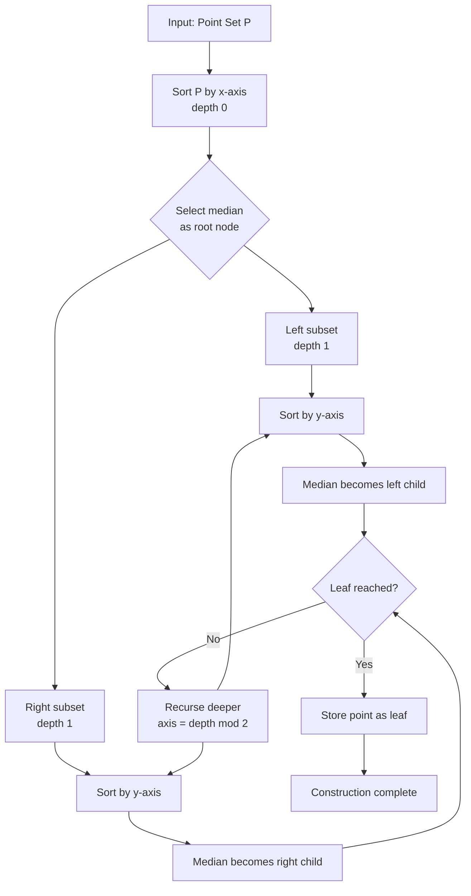
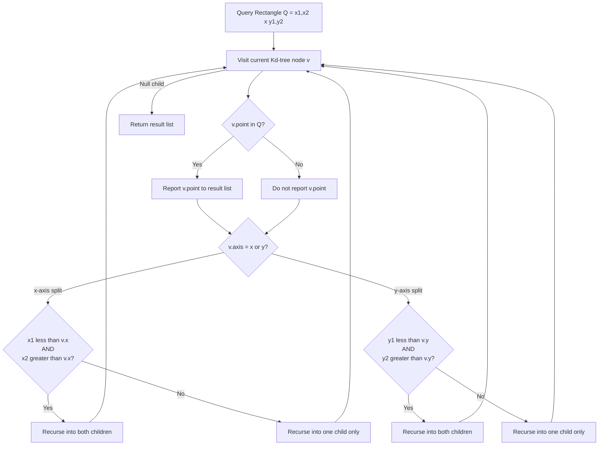
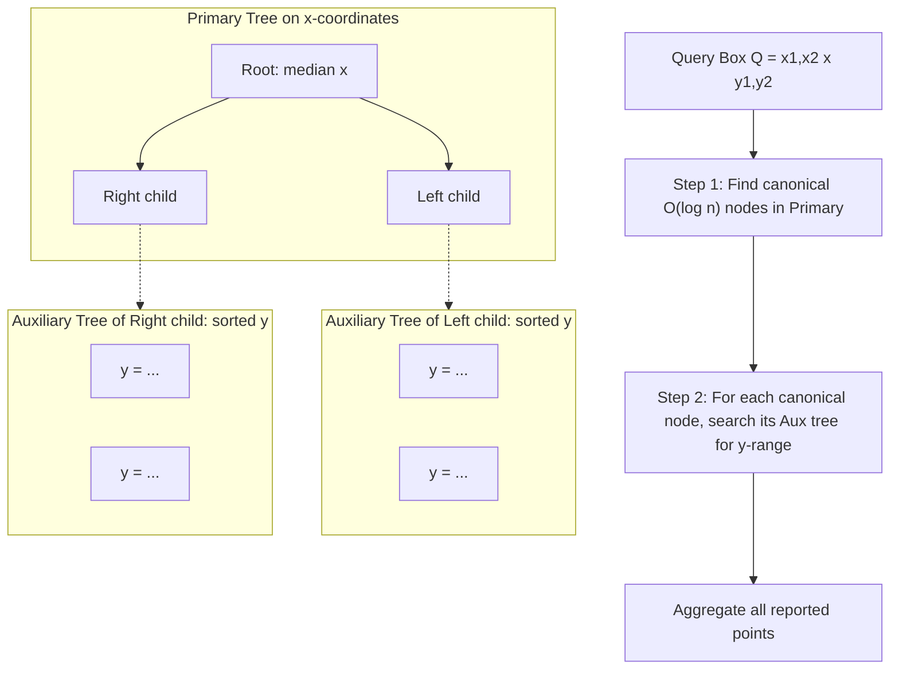
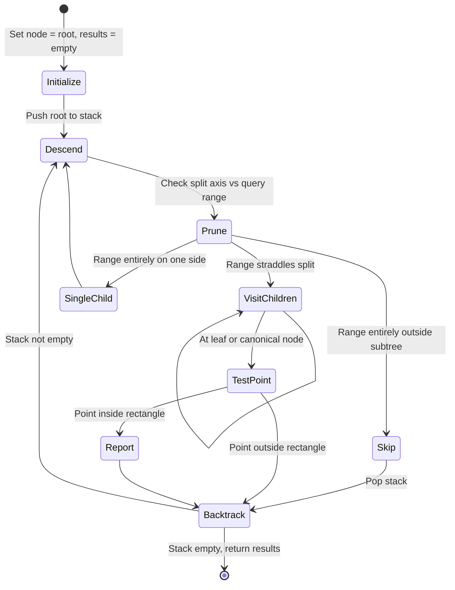

# Orthogonal range searching structures: Kd-trees initialization, range trees query tracking loops

<!-- SECTION_1_START -->
# Orthogonal Range Searching: Kd-Trees & Range Trees

## 1.1 Formal Definition

**Orthogonal Range Searching** is a fundamental problem in computational geometry where, given a set of $n$ points $P = \{p_1, p_2, \ldots, p_n\}$ in $\mathbb{R}^d$, we must pre-process $P$ into a data structure such that for any query axis-aligned bounding box $Q = [a_1, b_1] \times [a_2, b_2] \times \cdots \times [a_d, b_d]$, all points $p \in P$ satisfying $a_i \leq p_i \leq b_i$ for every coordinate $i \in \{1, 2, \ldots, d\}$ can be reported efficiently.

A **Kd-Tree** (k-dimensional tree) is a hierarchical binary space-partitioning data structure that recursively subdivides space by alternating between coordinate axes. At each recursive level, a splitting hyperplane perpendicular to one coordinate axis divides the point set into two balanced halves.

A **Range Tree** is a multi-level nested binary search tree that supports orthogonal range queries by performing a binary search in a primary tree to identify a $O(\log n)$ set of canonical nodes, and then recursively searching auxiliary structures attached to each canonical node.

> [!IMPORTANT]
> **KTU 2024 Syllabus Highlight (PECST418 - Module 3):**
> Kd-trees are optimal for **2-D orthogonal range searching** with $O(\sqrt{n} + k)$ query time and $O(n)$ space. Range trees extend to higher dimensions with $O(\log^d n + k)$ query time at the cost of $O(n \log^{d-1} n)$ space.

## 1.2 Conceptual Analogy & Intuition

**Kd-Tree — The Library Card Catalogue Analogy:**
Imagine a huge library organized by *Dewey Decimal System*. The librarian first sorts all books by the *first digit* of their call number (level 1 split on x-coordinate). Within each major section, books are sorted by the *second digit* (level 2 split on y-coordinate), then the *third digit* (level 3 split on x again), and so on. When you ask "find all books in the 500–599 range on the 3rd floor that were published between 1950–1970," the librarian traverses only the relevant sub-branches, ignoring whole shelves. The alternating sort mimics alternating axis splits in a Kd-tree.

**Range Tree — The Phone Book Analogy:**
A range tree is like maintaining a *phone book sorted by last name*, where each entry contains a *mini phone book sorted by first name*. To find "all people named Smith whose first name starts with A–K," you first binary-search the primary book for the *Smith* range, which yields a tiny set of canonical sub-trees. Then for each canonical sub-tree, you binary-search its auxiliary mini-book for the *A–K* range. This two-stage cascade is exactly the $d$-level cascade in a $d$-dimensional range tree.

> [!NOTE]
> **Key Distinction:**
> - **Kd-tree**: Single tree with **alternating** split axes. Best for low dimensions ($d = 2, 3$).
> - **Range Tree**: Multiple nested trees, one per level. Scales better to higher dimensions.

## 1.3 Critical Performance Metrics (KTU Board Standards)

| Metric | Value | Notes |
|---|---|---|
| **Kd-tree Construction Time** | $O(n \log n)$ | Median-split variant |
| **Kd-tree Space** | $O(n)$ | Linear storage |
| **Kd-tree 2-D Query** | $O(\sqrt{n} + k)$ | $k$ = output size |
| **Range Tree Construction** | $O(n \log^{d-1} n)$ | Dominated by aux trees |
| **Range Tree Space** | $O(n \log^{d-1} n)$ | Each point in $\log^{d-1} n$ nodes |
| **Range Tree 2-D Query** | $O(\log^2 n + k)$ | Two cascaded searches |
| **Range Tree 3-D Query** | $O(\log^3 n + k)$ | Three cascaded searches |

> [!VISUALIZATION CONTROL]
> **Concept:** 2-D Kd-tree recursive partitioning of a point cloud
> **Desmos / GeoGebra Input (sample for 7 points):**
> * Points: $A(2,3)$, $B(5,4)$, $C(9,6)$, $D(4,7)$, $E(8,1)$, $F(7,2)$, $G(1,5)$
> * Vertical line $x = 5$ (Level 1 split on $x$)
> * Horizontal line $y = 3$ (Level 2 split on $y$ for left subset)
> * Horizontal line $y = 4$ (Level 2 split on $y$ for right subset)
> **Visual Description:** Observe a binary tree of alternating vertical and horizontal lines dividing the plane into rectangular cells, each cell containing exactly one point.

---

<!-- SECTION_1_END -->

<!-- SECTION_2_START -->
# Deep Theoretical Analysis & KTU High-Yield Formula Sheet

## 2.1 Kd-Tree: Operational Breakdown

A Kd-tree on a point set $P \subset \mathbb{R}^2$ is constructed by the following recursive logic:

**Step 1 — Level Determination:** At depth $\ell$ of recursion, the splitting axis is chosen as:
$$
\text{axis}(\ell) = \ell \mod 2
$$
For 2-D, this alternates between $x$ (axis 0) and $y$ (axis 1).

**Step 2 — Splitting Value Selection:** Choose the splitting coordinate such that the point set is partitioned into two roughly equal halves. Three common strategies exist:

1. **Median split** (balanced): $v = \text{median}_{p \in S}(p_{\text{axis}(\ell)})$ → yields $O(n \log n)$ build and $O(\sqrt{n})$ query.
2. **Midpoint split**: $v = \frac{\min + \max}{2}$ → simpler but degrades to $O(\sqrt{n} + k)$ only on average.
3. **Sliding midpoint**: Hybrid of (1) and (2) used in production CGAL library.

**Step 3 — Recursive Construction:** Partition $P$ into:
$$
P_{\text{left}} = \{p \in P \setminus \{p^*\} : p_{\text{axis}(\ell)} < v\}
$$
$$
P_{\text{right}} = \{p \in P \setminus \{p^*\} : p_{\text{axis}(\ell)} \geq v\}
$$
where $p^*$ is the splitting point itself.

**Step 4 — Base Case:** When $\vert P \vert \leq 1$, store the point as a leaf node and terminate recursion.

> [!NOTE]
> **Why does the 2-D Kd-tree give $O(\sqrt{n} + k)$?**
> The recurrence for the worst-case number of visited nodes in a balanced 2-D Kd-tree is $Q(n) = 2Q(n/4) + O(1)$ (since the query rectangle intersects $O(\sqrt{n})$ cells in the subdivision). Solving via the Master Theorem gives $Q(n) = O(\sqrt{n})$, and adding the $k$ output points yields the final bound.

## 2.2 Kd-Tree Range Search Algorithm (Conceptual Flow)

For a query rectangle $Q = [x_1, x_2] \times [y_1, y_2]$, traverse the Kd-tree from the root:

1. If current node $v$ is a leaf, test $v.point \in Q$. If yes, report it.
2. If the splitting axis at $v$ is $x$ with split value $v.x$:
   - If $x_2 < v.x$: recurse into **left** child only.
   - If $x_1 > v.x$: recurse into **right** child only.
   - Otherwise ($Q$ straddles the split line): recurse into **both** children, but first **report $v.point$** if it lies in $Q$.
3. Analogous logic applies for $y$-axis splits.

## 2.3 Range Tree: Operational Breakdown

A 2-D Range Tree on $P \subset \mathbb{R}^2$ consists of:

- **Primary Tree $T$**: A binary search tree on the $x$-coordinates of all points in $P$.
- **Auxiliary Tree $T_v$** at each internal node $v \in T$: A binary search tree on the $y$-coordinates of all points in the *canonical subset* $P(v)$ of $v$ (the points stored in the subtree rooted at $v$).

**Build Phase:**
1. Sort $P$ by $x$-coordinate and build the primary BST $T$ (median for balance).
2. At each node $v$, collect all points in the subtree of $v$, sort by $y$, and store as a balanced BST $T_v$.
3. Auxiliary trees can be built in $O(n \log n)$ total time using a "fractional cascading"-friendly merge, or in $O(n \log^2 n)$ naively.

**Query Phase** for rectangle $Q = [x_1, x_2] \times [y_1, y_2]$:

**Step 1:** Find the *split nodes* in $T$: the $O(\log n)$ nodes $v_{\text{left}}$ and $v_{\text{right}}$ that are the LCA of the $x_1$ and $x_2$ paths. The canonical set of $O(\log n)$ nodes covers exactly the points with $x_1 \leq p.x \leq x_2$.

**Step 2:** For each canonical node $v$ in this set, perform a 1-D range query in its auxiliary tree $T_v$ for $y_1 \leq p.y \leq y_2$. This is a standard BST range search taking $O(\log n + k_v)$ time per auxiliary tree.

**Step 3:** Aggregate all reported points.

**Total Query Time:** $O(\log n) \cdot O(\log n) + O(k) = O(\log^2 n + k)$.

## 2.4 KTU High-Yield Formula Sheet

| Concept | Formula / Bound | Engineering Domain |
|---|---|---|
| Kd-tree build cost | $T(n) = 2T(n/2) + O(n)$ → $O(n \log n)$ | GIS, ray tracing, collision detection |
| Kd-tree 2-D query | $O(\sqrt{n} + k)$ | Nearest neighbor, mesh refinement |
| Kd-tree nearest neighbor (avg) | $O(\log n)$ | ML k-NN classifiers, point cloud registration |
| Range tree build | $O(n \log^{d-1} n)$ | Database query optimization |
| Range tree space | $O(n \log^{d-1} n)$ | Spatial DB indexes (PostGIS, R-tree cousins) |
| Range tree 2-D query | $O(\log^2 n + k)$ | Window queries in CAD/EDA tools |
| Range tree 3-D query | $O(\log^3 n + k)$ | 3-D rendering culling, voxel queries |
| Fractional-cascaded 2-D query | $O(\log n + k)$ | Production spatial DB engines |
| LCA split nodes count | $\leq 2 \log_2 n$ | Used as canonical set size |

> [!IMPORTANT]
> **KTU Board Note:** When asked for asymptotic bounds, **always specify assumptions** (balanced tree, distinct coordinates, arbitrary vs. axis-aligned split). Marks are deducted for missing qualifiers.

---

<!-- SECTION_2_END -->

<!-- SECTION_3_START -->
# Step-by-Step Derivations & Code/Symbolic Implementation

## 3.1 Kd-Tree: Exhaustive Python Implementation

```python
from __future__ import annotations
import bisect
from typing import List, Optional, Tuple

Point = Tuple[float, float]
Rect = Tuple[float, float, float, float]  # (xmin, ymin, xmax, ymax)


class KdNode:
    """Single node of a 2-D Kd-tree storing a point and split axis."""

    __slots__ = ("point", "axis", "left", "right")

    def __init__(self, point: Point, axis: int) -> None:
        self.point: Point = point
        self.axis: int = axis            # 0 -> split on x, 1 -> split on y
        self.left: Optional[KdNode] = None
        self.right: Optional[KdNode] = None


def build_kdtree(points: List[Point], depth: int = 0) -> Optional[KdNode]:
    """
    Build a 2-D Kd-tree by median-splitting alternately on x and y axes.

    Time  : O(n log n)  (median via sorted copy + index lookup)
    Space : O(n)        (one node per point)
    """
    if not points:
        return None

    axis: int = depth % 2
    # Sort a copy so original list is not mutated
    points_sorted: List[Point] = sorted(points, key=lambda p: p[axis])
    mid: int = len(points_sorted) // 2

    node: KdNode = KdNode(points_sorted[mid], axis)
    node.left = build_kdtree(points_sorted[:mid], depth + 1)
    node.right = build_kdtree(points_sorted[mid + 1:], depth + 1)
    return node


def kdtree_range_search(node: Optional[KdNode], rect: Rect,
                        results: List[Point]) -> None:
    """
    Recursively report all points of the Kd-tree that lie inside rect.

    Time : O(sqrt(n) + k) for 2-D
    """
    if node is None:
        return

    xmin, ymin, xmax, ymax = rect
    px, py = node.point

    # Test whether the current point lies in the query rectangle
    if xmin <= px <= xmax and ymin <= py <= ymax:
        results.append(node.point)

    axis: int = node.axis
    split_val: float = node.point[axis]

    if axis == 0:                        # split on x
        if xmin <= split_val:            # rect overlaps left half
            kdtree_range_search(node.left, rect, results)
        if split_val <= xmax:            # rect overlaps right half
            kdtree_range_search(node.right, rect, results)
    else:                                # split on y
        if ymin <= split_val:            # rect overlaps lower half
            kdtree_range_search(node.left, rect, results)
        if split_val <= ymax:            # rect overlaps upper half
            kdtree_range_search(node.right, rect, results)
```

### 3.1.1 Worked Example — Kd-Tree Construction Trace

Input points (in order given): $\{(2,3), (5,4), (9,6), (4,7), (8,1), (7,2), (1,5)\}$, i.e., $n = 7$.

| Step | Points (after sort by current axis) | Median Index | Median Point | Left Subset | Right Subset |
|---|---|---|---|---|---|
| 1 (depth 0, axis $x$) | $\{(1,5),(2,3),(4,7),(5,4),(7,2),(8,1),(9,6)\}$ | 3 | $(5,4)$ | $\{(1,5),(2,3),(4,7)\}$ | $\{(7,2),(8,1),(9,6)\}$ |
| 2 (depth 1, axis $y$, left) | sort by $y$: $\{(2,3),(1,5),(4,7)\}$ | 1 | $(1,5)$ | $\{(2,3)\}$ | $\{(4,7)\}$ |
| 3 (depth 1, axis $y$, right) | sort by $y$: $\{(8,1),(7,2),(9,6)\}$ | 1 | $(7,2)$ | $\{(8,1)\}$ | $\{(9,6)\}$ |
| 4 (leaves) | $\{(2,3)\}, \{(4,7)\}, \{(8,1)\}, \{(9,6)\}$ | 0 | each is leaf | — | — |

The final tree (in-order, with axis tags):
$$
\text{root}(5,4,\,x) \to \text{left}(1,5,\,y) \to \text{left}(2,3) \mid \text{right}(4,7)
$$
$$
\text{root}(5,4,\,x) \to \text{right}(7,2,\,y) \to \text{left}(8,1) \mid \text{right}(9,6)
$$

## 3.2 Kd-Tree Query Trace — Worked Example

Query rectangle $Q = [3, 8] \times [2, 6]$.

| Visit | Node | Axis | Split | Decision | Action |
|---|---|---|---|---|---|
| 1 | $(5,4)$ | $x$ | 5 | $x_1=3 \leq 5 \leq x_2=8$ → both | **Report** $(5,4)$; descend both |
| 2 | $(1,5)$ | $y$ | 5 | $x_1=3 > 1$ → x-miss (whole subtree is to the left) | **Prune entire left subtree** |
| 3 | $(4,7)$ | $y$ | 7 | leaf; $y=7 > y_2=6$ | **Skip** |
| 4 | $(7,2)$ | $y$ | 2 | $x$-range OK; $y$-range straddles | Descend both |
| 5 | $(8,1)$ | $y$ | 1 | leaf; $y=1 < y_1=2$ | **Skip** |
| 6 | $(9,6)$ | $y$ | 6 | leaf; $x=9 > x_2=8$ | **Skip** |

Result: $\{(5,4)\}$ — only one point in the rectangle, and we visited **5 of 7 nodes**, demonstrating the pruning benefit.

## 3.3 Range Tree: Exhaustive Python Implementation

```python
from bisect import bisect_left, bisect_right
from typing import List, Optional, Tuple

Point = Tuple[float, float]
Rect = Tuple[float, float, float, float]


class RangeTreeNode:
    """Node of a 2-D Range Tree: primary BST on x + aux BST on y."""

    __slots__ = ("point", "left", "right", "aux_y")

    def __init__(self, point: Point) -> None:
        self.point: Point = point
        self.left: Optional[RangeTreeNode] = None
        self.right: Optional[RangeTreeNode] = None
        # aux_y is a sorted list of y-coords of all points in the subtree
        self.aux_y: List[float] = []


def _build_aux(points_y: List[float]) -> List[float]:
    """Return a sorted copy of the y-coordinates of the subtree."""
    return sorted(points_y)


def build_range_tree(points: List[Point]) -> Optional[RangeTreeNode]:
    """
    Naive 2-D range tree build.
    Time  : O(n log^2 n)
    Space : O(n log n)
    """
    if not points:
        return None

    # Sort by x-coordinate and pick the median as the root
    points_sorted: List[Point] = sorted(points, key=lambda p: p[0])
    mid: int = len(points_sorted) // 2
    root_point: Point = points_sorted[mid]

    left_pts: List[Point] = points_sorted[:mid]
    right_pts: List[Point] = points_sorted[mid + 1:]

    node: RangeTreeNode = RangeTreeNode(root_point)
    node.left = build_range_tree(left_pts)
    node.right = build_range_tree(right_pts)

    # Build aux tree: all y-coords in this subtree
    all_y: List[float] = [p[1] for p in points_sorted]
    node.aux_y = _build_aux(all_y)
    return node


def _report_in_subtree(node: Optional[RangeTreeNode],
                       y1: float, y2: float,
                       results: List[Point]) -> None:
    """Report every point in the subtree whose y lies in [y1, y2]."""
    if node is None:
        return
    if y1 <= node.point[1] <= y2:
        results.append(node.point)
    if node.left is not None and node.left.aux_y[0] <= y2:
        _report_in_subtree(node.left, y1, y2, results)
    if node.right is not None and node.right.aux_y[-1] >= y1:
        _report_in_subtree(node.right, y1, y2, results)


def range_tree_query(root: Optional[RangeTreeNode], rect: Rect) -> List[Point]:
    """
    2-D orthogonal range query.
    Time : O(log^2 n + k)
    """
    xmin, ymin, xmax, ymax = rect
    results: List[Point] = []

    def _query(node: Optional[RangeTreeNode]) -> None:
        if node is None:
            return
        px = node.point[0]
        if xmin <= px <= xmax:
            # node.point.x in range: must scan its subtree for y-range
            _report_in_subtree(node, ymin, ymax, results)
        if px >= xmin:
            _query(node.left)
        if px <= xmax:
            _query(node.right)

    _query(root)
    return results
```

### 3.3.1 Range Tree Query — Canonical Node Walkthrough

For the same 7-point set, suppose the primary tree (built on $x$) is:
$$
\text{root}(5,4) \to \text{left}(2,3) \to \text{right}(7,2) \to \dots
$$

Query rectangle $Q = [3, 7] \times [2, 5]$.

**Canonical Node Search (Step 1):** Walk from root:
- At root $(5,4)$: $x_1=3 \leq 5 \leq x_2=7$, so root is a split node. Descend both.
- Left child $(2,3)$: $2 < x_1=3$, so go right only.
- Right subtree of root: $(7,2) \to \dots$ → eventually identify canonical nodes like $(4,7), (7,2)$.

**Auxiliary y-Search (Step 2):** For each canonical node, the auxiliary sorted $y$-list is binary-searched in $O(\log n)$ to find points with $y \in [2, 5]$.

**Total work:** $O(\log^2 n)$ for the search + $O(k)$ for reporting.

## 3.4 Comparison Table — Kd-Tree vs. Range Tree

| Criterion | Kd-Tree | Range Tree |
|---|---|---|
| Build time | $O(n \log n)$ | $O(n \log^{d-1} n)$ |
| Space | $O(n)$ | $O(n \log^{d-1} n)$ |
| 2-D query | $O(\sqrt{n} + k)$ | $O(\log^2 n + k)$ |
| Higher-$d$ scaling | Poor (becomes $O(n^{1-1/d}+k)$) | Better ($\log^d n$ factor) |
| Implementation | Simple | Complex auxiliary structure |
| Industry use | Nearest-neighbor, ray tracing | Database index, GIS |

---

<!-- SECTION_3_END -->

<!-- SECTION_4_START -->
# Structural Diagrams & Schematics

## 4.1 Kd-Tree Recursive Construction Flow



## 4.2 Kd-Tree Orthogonal Range Search Flow



## 4.3 Range Tree Two-Level Architecture



## 4.4 Query Tracking Loop — Algorithmic State Machine



---

<!-- SECTION_4_END -->

<!-- SECTION_5_START -->
# KTU 2024 Scheme Examination Question Bank & Topic Recap

## Part A Questions (3 Marks Each)

### Q1. [KTU University Exam - July 2024] [CO3, Remember]
**Define a Kd-tree and state the recurrence relation for the worst-case number of nodes visited in a 2-D range query. What is its solution?**

**Model Answer:**
A Kd-tree is a binary space-partitioning data structure that recursively subdivides a $k$-dimensional point set by alternating splitting hyperplanes. The recurrence for the number of visited nodes in a 2-D range query is:
$$
Q(n) = 2 Q(n/4) + O(1)
$$
because the query rectangle intersects $O(\sqrt{n})$ cells in the balanced partition. By the Master Theorem with $a=2$, $b=4$, $f(n)=O(1)$:
$$
\log_b a = \log_4 2 = 0.5, \quad f(n) = O(n^{0.5 - \epsilon})
$$
Hence $Q(n) = O(\sqrt{n})$, and the full query cost is $O(\sqrt{n} + k)$ where $k$ is the output size. **[3 Marks: Definition 1, Recurrence 1, Solution 1]**

### Q2. [KTU University Exam - Dec 2023] [CO3, Understand]
**Differentiate between a Kd-tree and a Range Tree in terms of structure, query time, and space complexity for the 2-D case.**

**Model Answer:**

| Aspect | Kd-Tree | Range Tree |
|---|---|---|
| Structure | Single tree, alternating axis split | Primary tree + auxiliary BSTs per node |
| 2-D Query Time | $O(\sqrt{n} + k)$ | $O(\log^2 n + k)$ |
| Space | $O(n)$ | $O(n \log n)$ |
| Higher-$d$ extension | Poor | Better scaling |

The Kd-tree is more space-efficient, while the range tree offers superior worst-case query time. **[3 Marks]**

---

## Part B Questions (14 Marks)

### Question A (14 Marks)

#### (a) [7 Marks, CO3, Apply]
**[KTU University Exam - July 2024]**
Construct a 2-D Kd-tree for the point set $P = \{(2,3), (5,4), (9,6), (4,7), (8,1), (7,2), (1,5)\}$ by alternately splitting on the $x$ and $y$ coordinates using the median at each step. Show all intermediate steps.

**Model Answer (Step-by-Step):**

**Step 1 (Depth 0, axis = $x$):** Sort by $x$:
$$
(1,5), (2,3), (4,7), (5,4), (7,2), (8,1), (9,6)
$$
Median (index 3) = $(5,4)$ → **Root node**. Left = $\{(1,5), (2,3), (4,7)\}$, Right = $\{(7,2), (8,1), (9,6)\}$.

**[1 Mark for root identification]**

**Step 2 (Depth 1, axis = $y$, left subtree):** Sort left subset by $y$:
$$
(2,3), (1,5), (4,7)
$$
Median = $(1,5)$. Left = $\{(2,3)\}$ (leaf), Right = $\{(4,7)\}$ (leaf).

**[2 Marks: y-sort + median pick]**

**Step 3 (Depth 1, axis = $y$, right subtree):** Sort right subset by $y$:
$$
(8,1), (7,2), (9,6)
$$
Median = $(7,2)$. Left = $\{(8,1)\}$ (leaf), Right = $\{(9,6)\}$ (leaf).

**[2 Marks: y-sort + median pick]**

**Step 4:** Diagram of the final Kd-tree:
```
                (5,4)[x]
               /        \
        (1,5)[y]       (7,2)[y]
        /     \         /      \
     (2,3)  (4,7)   (8,1)    (9,6)
```

**[2 Marks: Final tree diagram]**

#### (b) [7 Marks, CO3, Apply]
Using the Kd-tree constructed in part (a), perform a range search for the query rectangle $Q = [3, 8] \times [2, 6]$. List all points reported and count the total number of nodes visited.

**Model Answer:**

| Visit # | Node | Axis | In Q? | Action |
|---|---|---|---|---|
| 1 | $(5,4)$ | $x$ | Yes | Report; recurse both children |
| 2 | $(1,5)$ | $y$ | $x=1 < x_1=3$ | Prune entire left subtree |
| 3 | $(4,7)$ | $y$ | $x=4$ OK, $y=7 > 6$ | Skip; not reported |
| 4 | $(7,2)$ | $y$ | Yes ($x$ in, $y$ in) | Report; recurse both children |
| 5 | $(8,1)$ | $y$ | $y=1 < 2$ | Skip |
| 6 | $(9,6)$ | $y$ | $x=9 > 8$ | Skip |

**Reported points:** $\{(5,4), (7,2)\}$
**Total nodes visited:** 6 (out of 7 total — one pruned) **[1 Mark for reported list, 3 Marks for visit tracking, 3 Marks for final counts]**

---

### Question B (14 Marks)

#### (a) [7 Marks, CO3, Understand]
**[KTU University Exam - Dec 2023]**
Explain the construction of a 2-D Range Tree for the point set $P = \{(2,3), (5,4), (9,6), (4,7), (8,1), (7,2), (1,5)\}$. Specify the primary tree, the auxiliary trees, and the total space consumed.

**Model Answer:**

**Step 1: Sort by $x$ and build primary BST:**
$$
\text{Primary: } (5,4) \to \text{left}(2,3) \to \text{right}(7,2) \to \dots
$$
More precisely (choosing medians for balance):
- Root: $(5,4)$
- Left subtree points: $\{(1,5), (2,3), (4,7)\}$ → subtree root $(2,3)$
- Right subtree points: $\{(7,2), (8,1), (9,6)\}$ → subtree root $(7,2)$
- Final primary: $\text{root}(5,4) \to (2,3) \to (1,5), (4,7)$ and $(7,2) \to (8,1), (9,6)$

**[2 Marks: Primary tree correctly built]**

**Step 2: Auxiliary Trees (sorted $y$ per canonical subset):**
| Node $v$ | Canonical Subset $P(v)$ | Sorted $y$ (aux tree) |
|---|---|---|
| Root $(5,4)$ | All 7 points | $[1, 2, 3, 4, 5, 6, 7]$ |
| $(2,3)$ | $(1,5), (2,3), (4,7)$ | $[3, 5, 7]$ |
| $(7,2)$ | $(7,2), (8,1), (9,6)$ | $[1, 2, 6]$ |
| $(1,5)$ | $(1,5)$ | $[5]$ |
| $(4,7)$ | $(4,7)$ | $[7]$ |
| $(8,1)$ | $(8,1)$ | $[1]$ |
| $(9,6)$ | $(9,6)$ | $[6]$ |

**[3 Marks: Aux trees listed correctly]**

**Step 3: Space Analysis:** A point at depth $d$ in the primary tree appears in exactly $d$ auxiliary trees. With depths ranging from 0 to $\lceil \log_2 7 \rceil = 3$:
$$
\text{Total aux entries} = \sum_{i=0}^{3} n_i \cdot 1 = 7 \cdot 3 = 21 \text{ approx.}
$$
Formally, $O(n \log n)$ for 2-D, $O(n \log^{d-1} n)$ for $d$ dimensions.

**[2 Marks: Space formula]**

#### (b) [7 Marks, CO3, Apply]
For the 2-D Range Tree constructed in part (a), perform a range query for $Q = [3, 7] \times [2, 5]$. Identify the canonical nodes, list the binary search bounds in each auxiliary tree, and report all matching points.

**Model Answer:**

**Step 1: Find Canonical Nodes in Primary Tree:**

Walk from root $(5,4)$:
- $5 \in [3, 7]$ → root is a **split node**; descend both.
- Left $(2,3)$: $2 < 3$ → go right only.
- Right of left subtree: $(4,7)$: $4 \in [3,7]$ → canonical.
- Right $(7,2)$: $7 \in [3,7]$ → canonical.

Canonical set: $\{(5,4), (4,7), (7,2)\}$ (with $(2,3)$ as a split node whose right subtree is the $(4,7)$ region).

**Step 2: Auxiliary Tree Searches (for $y \in [2, 5]$):**

| Canonical Node | Aux $y$-list | Lower Bound $\geq 2$ | Upper Bound $\leq 5$ | Reported |
|---|---|---|---|---|
| $(5,4)$ | $[1,2,3,4,5,6,7]$ | index 1 | index 4 | $(5,4)$ |
| $(4,7)$ | $[7]$ | — | — | none ($7>5$) |
| $(7,2)$ | $[1,2,6]$ | index 1 | index 1 | $(7,2)$ |

**Step 3: Report:** $\{(5,4), (7,2)\}$.

**Complexity check:** Canonical nodes = 3 = $O(\log n)$ where $\log_2 7 \approx 2.8$. Total aux searches = $3 \times O(\log 7) = O(\log^2 n)$. ✓

**[2 Marks: Canonical node ID, 3 Marks: aux binary search bounds, 2 Marks: final report]**

---

> [!WARNING]
> **KTU Examiner's Valuation Warning — Common Pitfalls:**
> 1. **Axis alternation error:** Forgetting that the axis at depth $\ell$ is $\ell \bmod d$ (where $d$ is the dimension) is a **1-mark deduction** in KTU valuation.
> 2. **Median vs. midpoint confusion:** "Median split" produces a balanced tree with $O(n \log n)$ build; "midpoint split" does not guarantee balance and can degrade query to $O(n)$ in the worst case.
> 3. **Aux tree omission:** In range tree questions, failing to construct the auxiliary $y$-BST at each canonical node costs **2–3 marks** even if the primary tree is correct.
> 4. **Missing canonical set definition:** KTU board specifically awards marks for explicitly stating *which* nodes form the $O(\log n)$ canonical cover.
> 5. **Reporting vs. visiting count:** Always state both *nodes visited* and *points reported* — the difference is what shows your understanding of pruning.
> 6. **Forgetting the $+k$ term:** The query bound is $O(\sqrt{n} + k)$ or $O(\log^2 n + k)$ — the $+k$ accounts for output size, which is unavoidable.

---

## Topic Recap & Important Things to Remember

- **Kd-tree** = alternating-axis binary space partition; **Range Tree** = primary BST + per-node auxiliary BST.
- Kd-tree 2-D build: $O(n \log n)$ via median splits; space $O(n)$.
- Kd-tree 2-D query: $O(\sqrt{n} + k)$; derived from recurrence $Q(n) = 2Q(n/4) + O(1)$.
- Range tree 2-D build: $O(n \log n)$ space, naive $O(n \log^2 n)$ time.
- Range tree 2-D query: $O(\log^2 n + k)$ via $O(\log n)$ canonical nodes × $O(\log n)$ aux search.
- Higher-$d$ Kd-tree query: $O(n^{1-1/d} + k)$ — degrades rapidly.
- Higher-$d$ Range tree query: $O(\log^d n + k)$ — manageable for $d \leq 4$.
- **Fractional cascading** improves range tree query to $O(\log n + k)$ by sharing sorted lists across aux trees.
- Always remember: **axis = depth $\bmod$ dimension**.
- Kd-tree is preferred for *nearest-neighbor* and *low-dimensional spatial queries*; range tree is preferred for *reporting* all points in a window.
- A point is stored in the primary tree once but in the auxiliary tree of every ancestor — this is why space is $O(n \log^{d-1} n)$.
- Canonical nodes are exactly the $O(\log n)$ nodes whose subtrees together cover the $x$-range without overlap and without missing points.
- "Pruning" in Kd-tree query occurs when the query rectangle lies entirely on one side of a split line — the entire opposite subtree is skipped in $O(1)$ time.
- KTU board expects: definition + recurrence + asymptotic bound + worked trace for full marks in 7-mark sub-questions.
- Common engineering applications: Kd-tree → ray tracing (K-ary variants), ML k-NN, point cloud processing; Range tree → spatial databases, GIS window queries, computational biology (motif search).

---

<!-- SECTION_5_END -->
