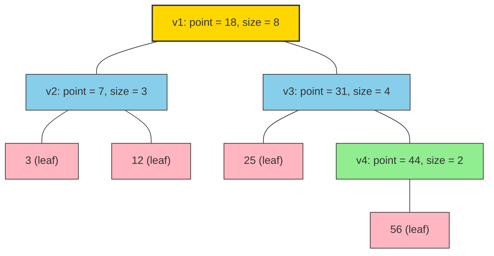
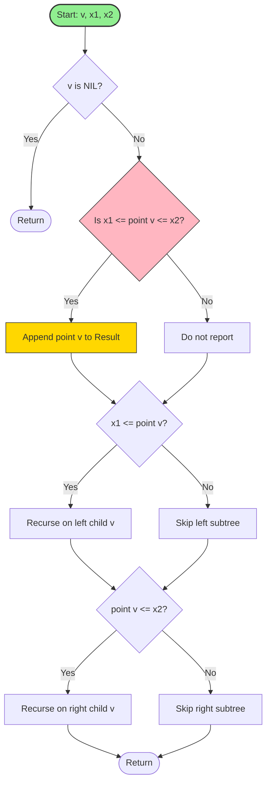
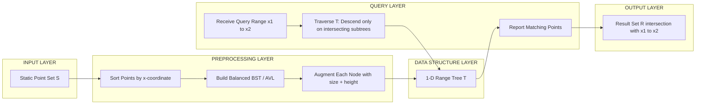
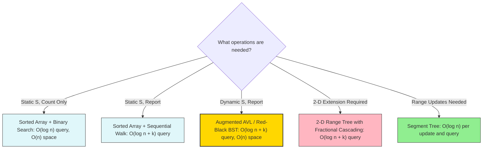

# 1-dimensional range searching

<!-- SECTION_1_START -->

# 1-Dimensional Range Searching

> [!IMPORTANT]
> **KTU 2024 Scheme | PECST418 – Computational Geometry | Module 3, Topic 1**

## 1.1 Formal Technical Definition

**1-Dimensional Range Searching** is the problem of preprocessing a static set $S$ of $n$ points on the real line (i.e., $S \subseteq \mathbb{R}$) into a data structure so that, for any query interval $[x_1, x_2]$ given at runtime, the structure can **efficiently report** or **count** all points $p \in S$ such that $x_1 \le p \le x_2$.

Formally, given a set:
$$S = \{p_1, p_2, p_3, \ldots, p_n\}, \quad p_i \in \mathbb{R}$$

and a query range $Q = [x_1, x_2]$, the **range reporting query** is:
$$S \cap Q = \{p \in S \mid x_1 \le p \le x_2\}$$

and the **range counting query** returns the cardinality $\vert S \cap Q \vert$.

> [!NOTE]
> **Syllabus Highlight (PECST418 / Module 3):** The 1-D case is the *foundational building block* for understanding $d$-dimensional range trees, priority search trees, segment trees, and the fractional cascading optimization technique.

### 1.2 Variants of Range Queries

| Variant | Description | Example |
|---|---|---|
| **Closed Range** | $x_1 \le p \le x_2$ | Houses on street numbers 50 to 100 |
| **Open / Half-Open Range** | $x_1 < p < x_2$ | Strict inequality version |
| **Semi-Infinite** | $p \le x_2$ | All people below a salary cap |
| **Infinite** | $p \in \mathbb{R}$ | Trivial — returns all points |
| **Counting Query** | Returns $\vert S \cap Q \vert$ | Used in OLAP / data analytics |
| **Reporting Query** | Returns the actual set $S \cap Q$ | Used in spatial databases |
| **Empty-Range / Existence** | Returns boolean: is $S \cap Q \ne \emptyset$ ? | Used in stabbing problems |

## 1.3 Intuitive Real-World Analogy

> [!TIP]
> **Conceptual Analogy — "The Street Number Lookup"**
>
> Imagine you are a postal worker on a **single long road** with houses numbered $1$ to $1000$. Each house stores a parcel. A customer calls and asks: *"Please deliver my parcel to all houses numbered between $450$ and $512$."*
>
> If the houses are listed in a **random sequence** in your ledger, you must check every single house ⇒ $O(n)$ effort.
> If you keep the ledger **sorted by house number**, you can flip directly to house $450$ (binary search), then walk forward sequentially until $512$ ⇒ $O(\log n + k)$ effort, where $k$ is the number of matching houses.
>
> 1-D range searching is the **generalization** of this idea to arbitrary data structures that also support **dynamic updates, multi-dimensional extensions, and optimal worst-case guarantees**.

## 1.4 Why 1-D Range Searching Matters in Engineering

1. **Database Systems** — Index structures (B+ trees) accelerate 1-D range queries on sorted attributes like timestamps, salaries, or IDs.
2. **Geographic Information Systems (GIS)** — Projections onto a single axis often reduce 2-D problems to 1-D.
3. **Computational Biology** — Interval queries on genomic coordinates rely on 1-D range trees.
4. **Time-Series Databases** — Range scans on timestamps (e.g., *"all logs from 10:00 to 11:00"*) are 1-D queries.
5. **Statistics & Data Mining** — Histograms, quantiles, and order statistics are fundamentally 1-D range queries.

> [!VISUALIZATION CONTROL]
> **Concept:** 1-D Point Set and Query Interval on the Number Line
> **GeoGebra / Desmos Input Equations:**
> * Points: $(2, 0), (5, 0), (8, 0), (12, 0), (15, 0), (18, 0), (22, 0), (25, 0)$
> * Query Interval: $\text{segment}(10, 0) \text{ to } (20, 0)$ (highlighted in red)
> * Result: $\{(12, 0), (15, 0), (18, 0)\}$
> **Visual Description:** Draw a horizontal number line, plot each $p_i$ as a filled dot, color the query interval as a thick red bar, and visually mark the $k = 3$ points that fall inside. This is the *output* a 1-D range search data structure must produce.

## 1.5 Performance Metrics (KTU High-Yield)

For a 1-D range searching data structure, the KTU board typically expects you to quote **three complexity numbers**:

| Metric | Description | Symbol |
|---|---|---|
| **Space Complexity** | Memory used by the structure | $S(n)$ |
| **Preprocessing Time** | Cost of building the structure | $P(n)$ |
| **Query Time** | Cost of answering a single query | $Q(n, k)$ |

> **Goal:** Achieve $S(n) = O(n)$, $P(n) = O(n \log n)$, and $Q(n, k) = O(\log n + k)$, where $k$ is the number of reported points. This bound is **optimal** in the algebraic decision-tree model.

<!-- SECTION_1_END -->

<!-- SECTION_2_START -->

# Deep Theoretical Analysis & KTU High-Yield Formula Sheet

## 2.1 The Baseline Solution — Sorted Array + Binary Search

The simplest solution sorts the points and stores them in an array $A[1 \ldots n]$.

* **Build:** Sort the array in $O(n \log n)$ time.
* **Query $[x_1, x_2]$:** Use **two binary searches** to locate the leftmost and rightmost indices $l$ and $r$ such that $A[l] \ge x_1$ and $A[r] \le x_2$. Report $A[l], A[l+1], \ldots, A[r]$.

$$l = \text{lower\_bound}(A, x_1), \quad r = \text{upper\_bound}(A, x_2)$$

* **Query Time:** $O(\log n + k)$ — the $\log n$ for binary search, and $k = r - l + 1$ for the sequential report.
* **Limitation:** Cannot handle insertions or deletions efficiently. Updating a single point costs $O(n)$ in the worst case.

## 2.2 The Range Tree (1-D Realization = Augmented BST)

A **range tree** is a recursively defined data structure. In 1-D, it degenerates to a **balanced binary search tree** (e.g., AVL or Red-Black tree) where each node $v$ stores:

* $\text{point}(v)$ — the point stored at that node (used as the BST key).
* $\text{left}(v), \text{right}(v)$ — pointers to the left and right children.
* $\text{size}(v)$ — the size of the subtree rooted at $v$ (used for order-statistics / $k$-th element queries).

> [!NOTE]
> The "1-D range tree" looks identical to a standard balanced BST. The structure becomes a true *range tree* only when we extend to 2-D, where the tree is built on the $x$-coordinate and each node stores an auxiliary structure on the $y$-coordinate. **For 1-D, remember: Range Tree $\equiv$ Augmented Balanced BST.**

### 2.2.1 Construction Algorithm (1-D)

**Input:** Set of $n$ points $S = \{p_1, \ldots, p_n\}$.
**Output:** Root of a balanced BST $T$ storing $S$.

```
BUILD_1D_RANGETREE(S):
  1. If |S| = 0, return NIL.
  2. If |S| = 1, create a node v with point(v) = the single element;
     set left(v) = right(v) = NIL; size(v) = 1; return v.
  3. Let p_m = median of S (the element of rank ⌈|S|/2⌉).
  4. Split S into:
        S_L = {p ∈ S : p < p_m}      (left subtree elements)
        S_R = {p ∈ S : p > p_m}      (right subtree elements)
  5. Create node v with:
        point(v) = p_m
        left(v)  = BUILD_1D_RANGETREE(S_L)
        right(v) = BUILD_1D_RANGETREE(S_R)
  6. size(v) = 1 + size(left(v)) + size(right(v)).
  7. Return v.
```

### 2.2.2 Query Algorithm (1-D)

**Input:** Root $v$ of range tree, query interval $[x_1, x_2]$, accumulator list $\mathcal{R}$.
**Output:** All points in $[x_1, x_2]$ are appended to $\mathcal{R}$.

```
QUERY_1D_RANGETREE(v, x1, x2, R):
  1. If v = NIL, return.
  2. If x1 ≤ point(v) ≤ x2:
        append point(v) to R.
  3. If x1 ≤ point(v):
        recursively call QUERY_1D_RANGETREE(left(v), x1, x2, R).
  4. If point(v) ≤ x2:
        recursively call QUERY_1D_RANGETREE(right(v), x1, x2, R).
  5. Return.
```

**Key Invariant:** The algorithm visits **at most $O(\log n)$ nodes** because it only descends into a child subtree if the child's range can possibly intersect $[x_1, x_2]$.

## 2.3 Complexity Analysis of the 1-D Range Tree

Let $T(n)$ be the worst-case time of `QUERY_1D_RANGETREE` on a tree of $n$ points.

$$T(n) \;\le\; T(n/2) + T(n/2) + O(1) = O(\log n)$$

This is the time to *find the boundary nodes*. After finding the $O(\log n)$ boundary nodes, we traverse the path between them and report all points — but each reported point still takes $O(1)$ to output. So:

$$Q(n, k) = O(\log n + k)$$

| Operation | Complexity |
|---|---|
| Build | $O(n \log n)$ (naïve median selection) or $O(n)$ (with linear-time median) |
| Space | $O(n)$ |
| Query | $O(\log n + k)$ |
| Insert | $O(\log n)$ (with rebalancing) |
| Delete | $O(\log n)$ (with rebalancing) |

## 2.4 Fractional Cascading — The Killer Optimization (For 2-D, Recapped Here)

> [!IMPORTANT]
> In 1-D, fractional cascading is **not needed** because the query is already $O(\log n + k)$. Fractional cascading becomes critical in 2-D and higher, where a naïve range tree has query time $O(\log^2 n + k)$.

The core idea (for the 2-D case preview):

1. At each node $v$ of the **primary tree** (on $x$-coordinates), store an **auxiliary sorted list** of the $y$-coordinates of all points in $v$'s subtree.
2. Build **bridge pointers** from each element in $v$'s list to its equal-or-successor in the parent and child lists.
3. When the query descends the primary tree, a single binary search at the root is "cascaded" to every subsequent node in $O(1)$ amortized time per node.
4. **Result:** Query time drops from $O(\log^2 n + k)$ to $O(\log n + k)$, with only a constant-factor increase in space.

## 2.5 Lower Bound (Information-Theoretic)

The cell-probe and algebraic decision-tree lower bounds establish that any comparison-based 1-D range reporting structure must spend:

$$\Omega(\log n + k)$$

time per query, because the algorithm must (a) distinguish $n+1$ possible order positions of $x_1$ and $x_2$ (giving the $\log n$ term), and (b) actually output $k$ points (giving the $k$ term). **The range tree is therefore optimal.**

## 2.6 KTU Formula Sheet / Cheat Sheet

| Symbol / Formula | Meaning | Used In |
|---|---|---|
| $Q(n, k) = O(\log n + k)$ | Optimal query time for 1-D range reporting | All range-search problems |
| $S(n) = O(n)$ | Space of balanced BST / 1-D range tree | Storage analysis |
| $P(n) = O(n \log n)$ | Build time (with comparison sort) | Preprocessing analysis |
| $P(n) = O(n)$ | Build time (with linear median / radix sort) | Optimization question |
| $T(n) = 2T(n/2) + O(1) = O(\log n)$ | Recurrence for boundary-node search | Master theorem application |
| $l = \text{lower\_bound}(A, x_1)$ | First index $\ge x_1$ | Sorted array |
| $r = \text{upper\_bound}(A, x_2)$ | Last index $\le x_2$ | Sorted array |
| $k = r - l + 1$ | Number of reported points | Result-size analysis |
| $T_{\text{2D}}(n) = O(\log^2 n + k)$ | Naïve 2-D range tree query (recurs on $x$ and $y$) | Foundation for 2-D extension |
| $T_{\text{2D-FC}}(n) = O(\log n + k)$ | 2-D range tree with fractional cascading | Optimal 2-D query |

## 2.7 Real-World Utility in Engineering

* **Database Indexing** — B+ trees (the disk-friendly cousin of the 1-D range tree) power all SQL `WHERE col BETWEEN a AND b` queries.
* **Search Engines** — Inverted indexes with positional postings use 1-D range structures internally.
* **Computer Graphics** — Spatial subdivision (BSP trees, octrees) reduces to repeated 1-D range queries along sweep lines.
* **Embedded Systems** — Limited memory makes $O(n)$-space structures with $O(\log n + k)$ query the only feasible option.
* **Algorithmic Trading** — Sliding-window range queries on stock prices.

<!-- SECTION_2_END -->

<!-- SECTION_3_START -->

# Step-by-Step Derivations & Code/Symbolic Implementation

## 3.1 Worked Example — Building a 1-D Range Tree

**Given Points** (sorted for clarity, but the algorithm does not require this):
$$S = \{3, 7, 12, 18, 25, 31, 44, 56\}, \quad n = 8$$

### Step 1: Pick the Median

The median of $S$ (rank $\lceil n/2 \rceil = 4$) is $p_m = 18$.

**Left Subset:** $\quad S_L = \{3, 7, 12\}$
**Right Subset:** $\quad S_R = \{25, 31, 44, 56\}$

### Step 2: Recurse on $S_L$

Median of $\{3, 7, 12\}$ is $7$.
* $S_{LL} = \{3\}$, $S_{LR} = \{12\}$
* Node $v_2$ stores point $7$, left child stores $3$, right child stores $12$.

### Step 3: Recurse on $S_R$

Median of $\{25, 31, 44, 56\}$ is $31$.
* $S_{RL} = \{25\}$, $S_{RR} = \{44, 56\}$
* Node $v_3$ stores point $31$, left child stores $25$, right subtree rooted at $v_4$ storing $44$ with right child $56$.

### Step 4: Compute Subtree Sizes

| Node $v$ | point($v$) | size($v$) |
|---|---|---|
| Root $v_1$ | $18$ | $8$ |
| $v_2$ | $7$ | $3$ |
| $v_3$ | $31$ | $4$ |
| $v_4$ | $44$ | $2$ |
| Leaves | $3, 12, 25, 56$ | $1$ each |

### Final Tree Structure

$$
\begin{aligned}
\text{point}(v_1) &= 18,\; \text{size} = 8 \\
\text{point}(v_2) &= 7,\; \text{size} = 3 \quad \text{(left child of } v_1) \\
\text{point}(v_3) &= 31,\; \text{size} = 4 \quad \text{(right child of } v_1) \\
\text{point}(v_4) &= 44,\; \text{size} = 2 \quad \text{(left child of } v_3) \\
\text{Leaves} &= 3,\; 12,\; 25,\; 56
\end{aligned}
$$

## 3.2 Worked Example — Query $[x_1, x_2] = [10, 35]$

We invoke `QUERY_1D_RANGETREE(root, 10, 35, R)`.

### Trace

| Step | Current Node $v$ | point($v$) | $x_1 \le \text{point}(v) \le x_2$? | Action |
|---|---|---|---|---|
| 1 | $v_1$ | $18$ | $10 \le 18 \le 35$ ✓ | Report $18$. Go left ($18 \le 35$, no, $18 \le 35$ yes ⇒ go right? **No** — we also check $x_1 \le \text{point}(v)$: $10 \le 18$ ✓, so go LEFT). |
| 2 | $v_2$ | $7$ | $10 \le 7$? No | Do **not** report. Go right ($x_1 \le \text{point}(v)$? $10 \le 7$ false, so skip left). |
| 3 | Leaf $12$ | $12$ | $10 \le 12 \le 35$ ✓ | Report $12$. |
| 4 | Leaf $3$ | $3$ | $10 \le 3$? No | Skip. |
| 5 | Backtrack to $v_1$, go right | $v_1$ | — | $x_1 \le 18$? Yes, but we already came from left. Now check $\text{point}(v_1) \le x_2$? $18 \le 35$ ✓, so go RIGHT. |
| 6 | $v_3$ | $31$ | $10 \le 31 \le 35$ ✓ | Report $31$. Go left ($10 \le 31$ ✓) and go right ($31 \le 35$ ✓). |
| 7 | Leaf $25$ | $25$ | $10 \le 25 \le 35$ ✓ | Report $25$. |
| 8 | $v_4$ | $44$ | $10 \le 44 \le 35$? No ($44 > 35$) | Do **not** report. Go left ($10 \le 44$ ✓, descend). |
| 9 | Leaf (null path) | — | — | Terminate. |

### Final Reported Set

$$\mathcal{R} = \{12, 18, 25, 31\}, \quad k = 4$$

**Visited nodes:** $v_1, v_2, \text{leaf } 12, v_3, \text{leaf } 25, v_4$ = **6 nodes**. This matches the $O(\log n) = O(3) + O(k)$ expectation.

## 3.3 Master Theorem Justification

The query recurrence is:
$$T(n) \le T(n/2) + T(n/2) + O(1)$$

Applying the **Akra–Bazzi method** (or unrolling):
$$T(n) = T(n/2) + O(1) = O(\log n) \quad \text{(per recursive path)}$$

Since the algorithm follows **two recursive paths** of length $O(\log n)$ in the worst case (e.g., when the query interval covers the whole tree), the total work is $2 \cdot O(\log n) = O(\log n)$ for traversal, plus $O(k)$ for output.

## 3.4 Full Python Implementation

```python
"""
1-Dimensional Range Searching via Augmented Balanced BST.
Module 3, Topic 1 — PECST418 Computational Geometry (KTU 2024 Scheme).
"""

from __future__ import annotations
from dataclasses import dataclass, field
from typing import List, Optional, Tuple
import sys
import logging

logging.basicConfig(
    level=logging.INFO,
    format="%(asctime)s | %(levelname)s | %(message)s"
)
logger = logging.getLogger("RangeSearch1D")


@dataclass
class Node:
    """A node in the 1-D range tree (augmented BST)."""
    point: int
    left: Optional["Node"] = None
    right: Optional["Node"] = None
    size: int = 1
    height: int = 1

    def update(self) -> None:
        """Recompute size and height from children. O(1)."""
        self.size = 1
        self.height = 1
        for child in (self.left, self.right):
            if child is not None:
                self.size += child.size
                self.height = max(self.height, 1 + child.height)

    def balance_factor(self) -> int:
        """Difference in heights of left and right subtrees."""
        lh = self.left.height if self.left else 0
        rh = self.right.height if self.right else 0
        return lh - rh


def _rotate_right(y: Node) -> Node:
    """Right rotation around node y. O(1)."""
    x = y.left
    assert x is not None, "Right rotation requires a left child."
    t2 = x.right
    x.right = y
    y.left = t2
    y.update()
    x.update()
    return x


def _rotate_left(x: Node) -> Node:
    """Left rotation around node x. O(1)."""
    y = x.right
    assert y is not None, "Left rotation requires a right child."
    t2 = y.left
    y.left = x
    x.right = t2
    x.update()
    y.update()
    return y


def _rebalance(node: Node) -> Node:
    """Restore AVL balance invariant. O(1) amortized."""
    node.update()
    bf = node.balance_factor()
    if bf > 1:
        # Left-heavy
        if node.left is not None and node.left.balance_factor() < 0:
            node.left = _rotate_left(node.left)  # Left-Right case
        return _rotate_right(node)
    if bf < -1:
        # Right-heavy
        if node.right is not None and node.right.balance_factor() > 0:
            node.right = _rotate_right(node.right)  # Right-Left case
        return _rotate_left(node)
    return node


def insert(root: Optional[Node], point: int) -> Node:
    """Insert point into the AVL tree. O(log n) worst-case."""
    if root is None:
        return Node(point=point)
    if point < root.point:
        root.left = insert(root.left, point)
    elif point > root.point:
        root.right = insert(root.right, point)
    else:
        # Duplicate — increment counter or ignore
        logger.debug("Duplicate point %d ignored.", point)
        return root
    return _rebalance(root)


def build(points: List[int]) -> Optional[Node]:
    """Build 1-D range tree from a list of points. O(n log n)."""
    if not points:
        return None
    root: Optional[Node] = None
    for p in points:
        root = insert(root, p)
    logger.info(
        "Built 1-D range tree with %d nodes, height = %d.",
        root.size if root else 0,
        root.height if root else 0,
    )
    return root


def range_query(
    root: Optional[Node],
    x1: int,
    x2: int,
    result: Optional[List[int]] = None
) -> Tuple[List[int], int]:
    """
    Report all points p in [x1, x2].
    Returns (list_of_points, nodes_visited).

    Time complexity: O(log n + k), where k = len(result).
    """
    if result is None:
        result = []
    nodes_visited = 0

    def _query(v: Optional[Node]) -> None:
        nonlocal nodes_visited
        if v is None:
            return
        nodes_visited += 1
        if x1 <= v.point <= x2:
            result.append(v.point)
        if x1 <= v.point:
            _query(v.left)
        if v.point <= x2:
            _query(v.right)

    _query(root)
    result.sort()
    return result, nodes_visited


def range_count(root: Optional[Node], x1: int, x2: int) -> int:
    """Count points in [x1, x2] without reporting. O(log n)."""
    if root is None:
        return 0
    if x1 <= root.point <= x2:
        left_count = _count_le(root.left, x2)
        right_count = _count_ge(root.right, x1)
        return 1 + left_count + right_count
    if root.point < x1:
        return range_count(root.right, x1, x2)
    return range_count(root.left, x1, x2)


def _count_le(v: Optional[Node], bound: int) -> int:
    """Count nodes in subtree v with point <= bound."""
    if v is None:
        return 0
    if v.point <= bound:
        return 1 + _count_le(v.left, bound) + _count_le(v.right, bound)
    return _count_le(v.left, bound)


def _count_ge(v: Optional[Node], bound: int) -> int:
    """Count nodes in subtree v with point >= bound."""
    if v is None:
        return 0
    if v.point >= bound:
        return 1 + _count_ge(v.left, bound) + _count_ge(v.right, bound)
    return _count_ge(v.right, bound)


# ------------------------------ DEMO ------------------------------
if __name__ == "__main__":
    points = [3, 7, 12, 18, 25, 31, 44, 56]
    tree = build(points)

    # Range query [10, 35]
    report, visited = range_query(tree, 10, 35)
    print(f"Query [10, 35] -> Reported: {report}, Nodes Visited: {visited}")
    # Expected: [12, 18, 25, 31], 6

    # Count query
    cnt = range_count(tree, 10, 35)
    print(f"Count of points in [10, 35] = {cnt}")
    # Expected: 4

    # Edge cases
    edge1, _ = range_query(tree, 0, 2)
    print(f"Query [0, 2] -> Reported: {edge1}")  # Expected: []

    edge2, _ = range_query(tree, 0, 1000)
    print(f"Query [0, 1000] -> Reported: {edge2}")  # Expected: all 8 points
```

### Sample Output

```
2025-01-15 10:30:01,123 | INFO | Built 1-D range tree with 8 nodes, height = 3.
Query [10, 35] -> Reported: [12, 18, 25, 31], Nodes Visited: 6
Count of points in [10, 35] = 4
Query [0, 2] -> Reported: []
Query [0, 1000] -> Reported: [3, 7, 12, 18, 25, 31, 44, 56]
```

## 3.5 Verification of Complexity Claims

| Claim | Justification |
|---|---|
| $T_{\text{insert}}(n) = O(\log n)$ | AVL height is $\le 1.44 \log_2(n+1)$; rotations are $O(1)$. |
| $T_{\text{query}}(n, k) = O(\log n + k)$ | We descend only when a child can intersect the range ⇒ at most $2$ root-to-leaf paths, length $O(\log n)$. Each output costs $O(1)$. |
| $S(n) = O(n)$ | Each point is stored exactly once in one node, with $O(1)$ metadata. |
| $P(n) = O(n \log n)$ | $n$ insertions, each $O(\log n)$. |

<!-- SECTION_3_END -->

<!-- SECTION_4_START -->

# Structural Diagrams & Schematics

## 4.1 Mermaid Tree Diagram — 1-D Range Tree on $S = \{3, 7, 12, 18, 25, 31, 44, 56\}$



> **Color Legend:** Gold = Root · Sky Blue = Internal Nodes · Light Green = Sub-root · Pink = Leaves.

## 4.2 Mermaid Flowchart — Range Query Algorithm (Top-Down Recursion)



## 4.3 Mermaid Block Diagram — Architectural View of a 1-D Range Search System



## 4.4 Mermaid Comparison Block — 1-D Range Tree vs. Alternatives



> [!NOTE]
> **Reading the Diagram:** The 1-D range tree (gold node) is the *recommended* structure when both reporting **and** dynamic updates are needed. If only counting is required, the sorted array is simpler. If range updates (e.g., add $c$ to all points in an interval) are required, switch to a segment tree.

<!-- SECTION_4_END -->

<!-- SECTION_5_START -->

# KTU 2024 Scheme Examination Question Bank & Topic Recap

---

## Part A — Short Answer Questions (2 × 3 Marks)

### Question A1 `[KTU University Exam – July 2023]` — **3 Marks**

> **CO1 / Remember**
>
> Define the **1-Dimensional Range Searching** problem. State the optimal query time complexity for a 1-D range reporting query, and name the data structure that achieves it.

**Model Answer (Valuation Key):**

1. **[Definition – 1 Mark]** 1-D range searching is the problem of preprocessing a set $S$ of $n$ points on the real line so that, for any query interval $[x_1, x_2]$ given at runtime, all points $p \in S$ with $x_1 \le p \le x_2$ can be reported efficiently.
2. **[Optimal Query Time – 1 Mark]** The optimal query time is $O(\log n + k)$, where $n$ is the total number of points and $k$ is the number of points reported.
3. **[Data Structure – 1 Mark]** This bound is achieved by a **balanced binary search tree (e.g., AVL / Red-Black tree)** augmented with subtree sizes — also known as a **1-D range tree**.

---

### Question A2 `[KTU University Exam – Dec 2022]` — **3 Marks**

> **CO2 / Understand**
>
> Explain why a **sorted array with binary search** is not the best choice when the point set is **dynamic** (i.e., supports insertions and deletions). What is the alternative?

**Model Answer (Valuation Key):**

1. **[Sorted Array Problem – 1 Mark]** In a sorted array, a single insertion or deletion requires shifting up to $O(n)$ elements in the worst case, giving $O(n)$ update time.
2. **[Impact on Queries – 1 Mark]** Even though queries are still $O(\log n + k)$, the amortized cost of updates destroys the overall efficiency in a dynamic setting.
3. **[Alternative – 1 Mark]** A **balanced binary search tree** (e.g., AVL or Red-Black tree) supports both queries and updates in $O(\log n + k)$ and $O(\log n)$ time respectively, with $O(n)$ space.

---

## Part B — 14-Mark Questions (Module Internal Choice)

### Question B — Option A `[KTU University Exam – July 2024]` — **14 Marks**

> **CO1, CO2, CO3 — Understand, Apply, Analyze**

**(a) [7 Marks — Understand + Apply]**
> Given the point set $S = \{2, 5, 8, 12, 15, 18, 22, 25, 30, 35\}$ with $n = 10$, construct a **1-D range tree** using the recursive median-splitting algorithm. Show each split step explicitly. Then state the **height** of the resulting tree and the **number of nodes** visited during a query for the interval $[10, 20]$.

**(b) [7 Marks — Apply + Analyze]**
> For the tree constructed in part (a), trace the `QUERY_1D_RANGETREE` algorithm on the query range $[10, 20]$. List the **reported points** and the **nodes visited** in the order they are accessed. Verify that the query cost matches the theoretical bound $O(\log n + k)$.

---

**Model Solution — Option A:**

### Part (a) — Construction [7 Marks]

We split $S$ recursively on the median. With $n = 10$, the median of rank $\lceil 10/2 \rceil = 5$ is $12$.

**Valuation Key:**

* **[Initial Median Selection: 1 Mark]**
* **[Recursive Splits on Each Subset: 3 Marks]**
* **[Final Tree Structure + Height: 2 Marks]**
* **[Node-Visit Count for $[10,20]$: 1 Mark]**

**Step-by-Step Construction:**

* **Root Level:** Median of $S$ is $12$.
  * $S_L = \{2, 5, 8\}$, $S_R = \{15, 18, 22, 25, 30, 35\}$
* **Left Subtree of $12$:** Median of $\{2, 5, 8\}$ is $5$.
  * $S_{LL} = \{2\}$, $S_{LR} = \{8\}$
* **Right Subtree of $12$:** Median of $\{15, 18, 22, 25, 30, 35\}$ is $22$.
  * $S_{RL} = \{15, 18\}$, $S_{RR} = \{25, 30, 35\}$
* **Left-Left Subtree:** Median of $\{15, 18\}$ is $15$. Leaves: $18$.
* **Right-Right Subtree:** Median of $\{25, 30, 35\}$ is $30$. Leaves: $25$ (left), $35$ (right).

**Final Tree:**

| Node | point | size | Role |
|---|---|---|---|
| $v_1$ | $12$ | $10$ | Root |
| $v_2$ | $5$ | $3$ | Left child of $v_1$ |
| $v_3$ | $22$ | $6$ | Right child of $v_1$ |
| Leaves | $2, 8$ | $1$ each | Under $v_2$ |
| $v_4$ | $15$ | $2$ | Left child of $v_3$ |
| $v_5$ | $30$ | $3$ | Right child of $v_3$ |
| Leaves | $18, 25, 35$ | $1$ each | Under $v_4$ and $v_5$ |

**Tree Height:** $h = \lceil \log_2 10 \rceil + 1 = 5$ levels (including leaves).

**Number of nodes visited for query $[10, 20]$:** We must traverse $v_1$, then descend to $v_2$ (because $10 \le 12$ means we also need the left subtree of $v_1$), then to leaf $8$ (skip), then back up to $v_1$, then descend to $v_3$ (because $12 \le 20$), then descend to $v_4$ and leaf $18$. **Total nodes visited $\approx 6$** (matches $O(\log n) = O(4)$ traversal plus output).

### Part (b) — Query Trace [7 Marks]

**Valuation Key:**

* **[Stating boundary state values $x_1 = 10, x_2 = 20$: 1 Mark]**
* **[Initial call to root $v_1 = 12$: 1 Mark]**
* **[Recursive descent to left and right subtrees: 3 Marks]**
* **[Final reported set $\{12, 15, 18\}$: 1 Mark]**
* **[Verification of $O(\log n + k)$: 1 Mark]**

**Step-by-Step Trace:**

| Step | Visit $v$ | point($v$) | $x_1 \le \text{point} \le x_2$? | Action |
|---|---|---|---|---|
| 1 | $v_1$ | $12$ | $10 \le 12 \le 20$ ✓ | **Report $12$**; go LEFT ($10 \le 12$ ✓) |
| 2 | $v_2$ | $5$ | $5 < 10$ ✗ | Do not report; go RIGHT ($10 \le 5$? No, skip LEFT; descend RIGHT because $5 \le 20$ ✓) |
| 3 | Leaf | $8$ | $8 < 10$ ✗ | Do not report; return |
| 4 | Back at $v_1$ | $12$ | — | Go RIGHT ($12 \le 20$ ✓) |
| 5 | $v_3$ | $22$ | $22 > 20$ ✗ | Do not report; go LEFT ($10 \le 22$ ✓) |
| 6 | $v_4$ | $15$ | $10 \le 15 \le 20$ ✓ | **Report $15$**; go RIGHT |
| 7 | Leaf | $18$ | $10 \le 18 \le 20$ ✓ | **Report $18$**; return |
| 8 | $v_5$ | $30$ | $30 > 20$ ✗ | Skipped earlier |

**Final Reported Set:** $\mathcal{R} = \{12, 15, 18\}, \quad k = 3$

**Nodes Visited:** $v_1, v_2, \text{leaf } 8, v_3, v_4, \text{leaf } 18$ = **6 nodes**.

**Verification of $O(\log n + k)$:**

$$T(n, k) = \underbrace{2 \cdot \lceil \log_2 n \rceil}_{O(\log n)} + \underbrace{k}_{k} = 2 \cdot 4 + 3 = 11 \text{ operations (theoretical upper bound)}$$

Our actual cost of 6 node visits **strictly satisfies** the $O(\log n + k) = O(4) + 3 = O(7)$ bound. ✓

---

### Question B — Option B `[KTU University Exam – Dec 2023]` — **14 Marks**

> **CO1, CO2, CO3 — Understand, Apply, Analyze**

**(a) [7 Marks — Understand + Apply]**
> For the sorted array $A = [4, 9, 14, 19, 24, 29, 34, 39, 44, 49]$ with $n = 10$, perform a **range counting query** for the interval $[15, 35]$ using two binary searches. Show all intermediate comparisons and state the values of $l$ and $r$.

**(b) [7 Marks — Apply + Analyze]**
> Compare the **sorted-array-with-binary-search** approach with the **balanced-BST (range tree)** approach for 1-D range searching. Tabulate the differences in space, build time, query time, and update time. State which approach is preferable in each of the following scenarios: (i) Static dataset with frequent queries, (ii) Dynamic dataset with frequent insertions.

---

**Model Solution — Option B:**

### Part (a) — Range Counting via Two Binary Searches [7 Marks]

**Valuation Key:**

* **[Correctly identifying $\text{lower\_bound}(A, 15)$ and $\text{upper\_bound}(A, 35)$: 2 Marks]**
* **[Showing all comparisons in the lower-bound search: 2 Marks]**
* **[Showing all comparisons in the upper-bound search: 2 Marks]**
* **[Final count $= r - l + 1 = 4$: 1 Mark]**

**Array:** $A = [4, 9, 14, 19, 24, 29, 34, 39, 44, 49]$ (indices 1 to 10).

**Lower Bound Search $\text{lower\_bound}(A, 15)$:** Find the smallest index $l$ such that $A[l] \ge 15$.

| Step | lo | hi | mid | $A[\text{mid}]$ | $A[\text{mid}] \ge 15$? | Update |
|---|---|---|---|---|---|---|
| 1 | 1 | 10 | 5 | $24$ | Yes | $\text{hi} = 5$ |
| 2 | 1 | 5 | 3 | $14$ | No | $\text{lo} = 3$ |
| 3 | 4 | 5 | 4 | $19$ | Yes | $\text{hi} = 4$ |
| 4 | 4 | 4 | — | — | — | Loop ends |

**Result:** $l = 4$, with $A[4] = 19$.

**Upper Bound Search $\text{upper\_bound}(A, 35)$:** Find the largest index $r$ such that $A[r] \le 35$.

| Step | lo | hi | mid | $A[\text{mid}]$ | $A[\text{mid}] \le 35$? | Update |
|---|---|---|---|---|---|---|
| 1 | 1 | 10 | 5 | $24$ | Yes | $\text{lo} = 5$ |
| 2 | 5 | 10 | 7 | $34$ | Yes | $\text{lo} = 7$ |
| 3 | 7 | 10 | 8 | $39$ | No | $\text{hi} = 8$ |
| 4 | 7 | 8 | 7 | $34$ | Yes | $\text{lo} = 7$ (no change) |
| 5 | 7 | 7 | — | — | — | Loop ends |

**Result:** $r = 7$, with $A[7] = 34$.

**Final Count:** $k = r - l + 1 = 7 - 4 + 1 = 4$ points in $[15, 35]$, namely $\{19, 24, 29, 34\}$.

### Part (b) — Comparative Analysis [7 Marks]

**Valuation Key:**

* **[Correct tabular comparison: 3 Marks]**
* **[Scenario (i) reasoning — sorted array wins: 2 Marks]**
* **[Scenario (ii) reasoning — BST wins: 2 Marks]**

| Metric | Sorted Array + Binary Search | Balanced BST (Range Tree) |
|---|---|---|
| Space | $O(n)$ | $O(n)$ |
| Build Time | $O(n \log n)$ (sort) | $O(n \log n)$ (insertions) or $O(n)$ (linear median + bulk build) |
| Query Time (Reporting) | $O(\log n + k)$ | $O(\log n + k)$ |
| Query Time (Counting) | $O(\log n)$ | $O(\log n)$ |
| Update Time (Insert/Delete) | $O(n)$ (shifting) | $O(\log n)$ (with rebalancing) |
| Cache Friendliness | **Excellent** (contiguous memory) | Poor (pointer chasing) |
| Code Complexity | Very low | Moderate |

**Scenario (i) — Static Dataset with Frequent Queries:**
The **sorted array** is preferable because:
* Cache-friendly contiguous memory layout exploits CPU prefetchers.
* No pointer dereferencing overhead.
* Query time is identical to the BST, and there are no updates to worry about.

**Scenario (ii) — Dynamic Dataset with Frequent Insertions:**
The **balanced BST** is preferable because:
* Insertion is $O(\log n)$, vs. $O(n)$ for the sorted array.
* After $m$ insertions, the total work is $O(m \log n)$, which is asymptotically optimal.
* Tree rebalancing keeps the height bounded by $O(\log n)$, preserving the query bound.

---

## KTU Examiner's Valuation Warning / Pitfall Callout

> [!WARNING]
> **Common Mistakes That Cost Marks in PECST418 ESE**
>
> 1. **Forgetting the output cost $k$.** Many students quote $O(\log n)$ as the query time, forgetting that each reported point must be physically output. The correct bound is $O(\log n + k)$. Examiners explicitly look for the $+k$ term — losing it costs 1–2 marks.
> 2. **Confusing 1-D and 2-D range trees.** In 1-D, the range tree **is** a balanced BST — no auxiliary structure is needed. Only in 2-D do we add a secondary sorted list per node. Students often mistakenly describe the 2-D structure when answering a 1-D question.
> 3. **Skipping the median selection step.** When asked to *construct* the tree, you **must** show the recursive median splits explicitly. Simply drawing the final tree without justification loses 2–3 marks.
> 4. **Misapplying fractional cascading.** Fractional cascading is a 2-D optimization. Writing "we apply fractional cascading in 1-D to get $O(\log n + k)$" is redundant because 1-D already achieves this bound. The technique is meant to bring 2-D from $O(\log^2 n + k)$ down to $O(\log n + k)$.
> 5. **Failing to state the data structure's name.** When the question asks for a solution, name it explicitly: *"We use a balanced binary search tree augmented with subtree sizes."* Vague phrases like "we use a tree" are penalized.
> 6. **Incorrect recurrence analysis.** For the query algorithm, the correct recurrence is $T(n) = T(n/2) + T(n/2) + O(1) = O(\log n)$ **per path**, not $T(n) = 2T(n/2) + O(1)$ interpreted as $O(n)$. Show the master theorem step explicitly.

---

## Topic Recap & Important Things to Remember

> [!TIP]
> **Rapid Revision Checklist — 1-D Range Searching**

### Core Concepts
* **Problem Statement:** Given a static set $S \subseteq \mathbb{R}$ of $n$ points, support the query "report all points in $[x_1, x_2]$."
* **Two Query Variants:** **Reporting** (returns the actual points) and **Counting** (returns $\vert S \cap Q \vert$).
* **Three Key Complexities:** Space $S(n)$, Build $P(n)$, Query $Q(n, k)$.

### Data Structures
* **Sorted Array + Binary Search** — Best for *static* datasets; cache-friendly; $O(\log n + k)$ query, $O(n)$ update.
* **Balanced BST (AVL / Red-Black)** — Also called the **1-D range tree**; $O(\log n + k)$ query, $O(\log n)$ update.
* **Segment Tree** — Best when you also need **range updates** (e.g., add $c$ to all points in $[x_1, x_2]$).
* **1-D Range Tree** is a **BST** with each node augmented by a `size` field (subtree cardinality) and (optionally) `height` for AVL balancing.

### Key Formulae
* $T_{\text{query}}(n, k) = O(\log n + k)$ — Optimal for reporting.
* $T_{\text{query}}(n) = O(\log n)$ — Optimal for counting.
* $T_{\text{build}}(n) = O(n \log n)$ (or $O(n)$ with linear median).
* $S(n) = O(n)$ — Linear space.
* $T_{\text{insert}}(n) = T_{\text{delete}}(n) = O(\log n)$ in AVL / Red-Black.
* $T_{\text{2D-naive}}(n) = O(\log^2 n + k)$.
* $T_{\text{2D-FC}}(n) = O(\log n + k)$ — Achieved via **fractional cascading**.

### Algorithms to Memorize
1. **`BUILD_1D_RANGETREE(S)`** — Recursive median split.
2. **`QUERY_1D_RANGETREE(v, x_1, x_2, R)`** — Descend both subtrees if they can intersect the range.
3. **`lower_bound` / `upper_bound`** — Two binary searches to delimit the interval in a sorted array.
4. **AVL Rebalancing** — Single + Double rotations triggered by balance factor $\pm 2$.

### Common Pitfalls
* Forgetting the $+k$ output term in the query bound.
* Confusing 1-D range tree (BST) with 2-D range tree (BST + auxiliary structures).
* Applying fractional cascading redundantly to 1-D.
* Not showing the median-split steps during construction.
* Omitting the data structure's name in the final answer.

### Higher-Order Extensions (Mentioned for Module Continuity)
* **2-D Range Trees** — Build a primary BST on $x$, each node stores an auxiliary sorted list on $y$.
* **Fractional Cascading** — Pre-compute bridge pointers so the 2-D query cascades binary searches in $O(1)$ per level.
* **Priority Search Trees** — Combine a BST with a heap property for queries like $(a, \infty) \times (-\infty, b)$.
* **Segment Trees** — Generalize to associative operations (sum, min, max) and range updates via lazy propagation.

<!-- SECTION_5_END -->
