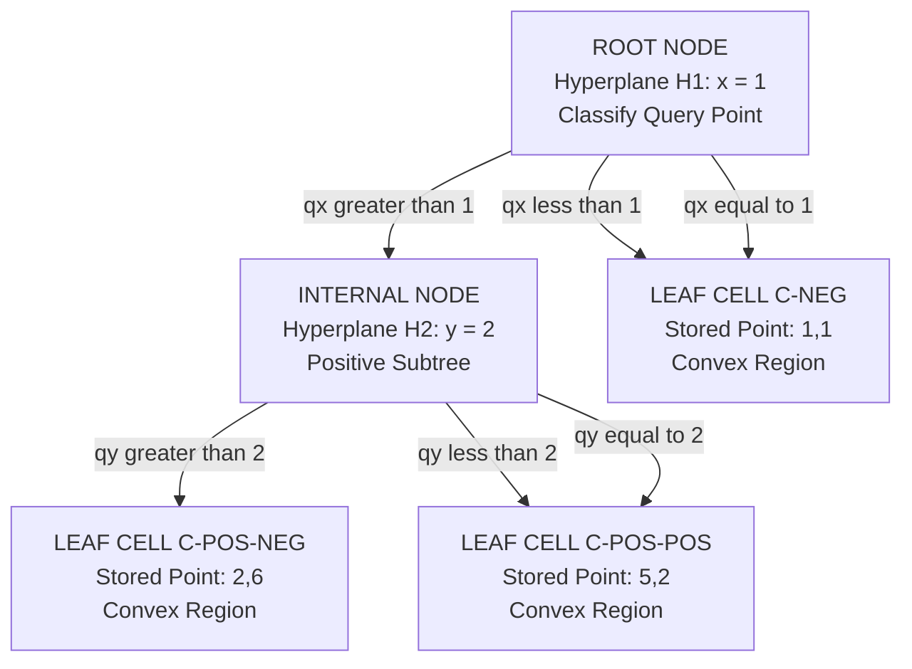
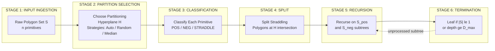
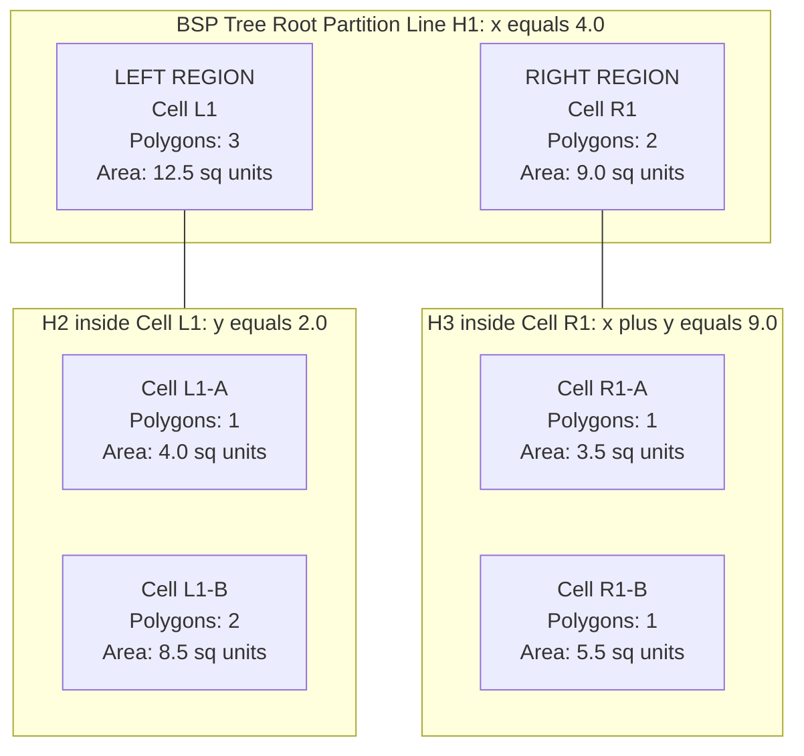
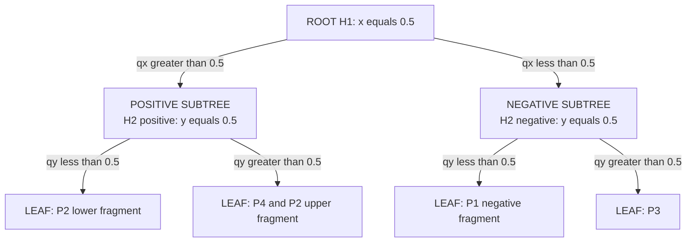

# Binary Space Partitioning  - Definition and applications

<!-- SECTION_1_START -->
# Binary Space Partitioning (BSP) — Definition and Applications

> [!IMPORTANT]
> **Syllabus Tag (KTU 2024 / PECST418 / Module 3):** *Range searching and point location — Binary Space Partitioning (Definition, Tree structure, Construction, Applications).*

## 1.1 Formal Definition

A **Binary Space Partitioning (BSP)** is a recursive, hierarchical subdivision of a $d$-dimensional space (typically $\mathbb{R}^2$ or $\mathbb{R}^3$) into a set of **convex subspaces** (called *cells* or *regions*) using a sequence of **hyperplanes**. Each hyperplane splits the current region into two half-spaces, and the process continues recursively on the resulting subspaces until a termination condition is met (e.g., the region contains at most one primitive object, or a depth limit is reached).

The hierarchical subdivision is canonically encoded as a **Binary Space Partitioning Tree (BSP tree)**, a binary tree data structure in which:

- Every **internal node** $n$ stores a **partitioning hyperplane** $H(n)$ that divides the space at $n$ into two disjoint subspaces: the *positive (left/front)* half-space $H^{+}(n)$ and the *negative (right/back)* half-space $H^{-}(n)$.
- Every **leaf node** $n$ stores a **convex subspace** $C(n)$ (a *cell*) that contains zero or more scene primitives (points, line segments, polygons).
- A **classification test** $c(p, H)$ for any point $p$ relative to a hyperplane $H$ returns one of three values: **POSITIVE**, **NEGATIVE**, or **COINCIDENT** (lying exactly on $H$).

For a hyperplane $H$ defined by a normal vector $\mathbf{n} = (n_1, n_2, \ldots, n_d)$ and a scalar offset $d_0$, the classification of a point $\mathbf{p} = (p_1, p_2, \ldots, p_d)$ is computed as:

$$
c(\mathbf{p}, H) \;=\; \mathrm{sgn}\!\left(\mathbf{n}^{\mathsf{T}}\mathbf{p} - d_0\right)
$$

> [!NOTE]
> **Why "Binary"?** Because each hyperplane splits a single subspace into **exactly two** sub-spaces, producing a tree whose every internal node has degree at most 2. The word *Partition* (not *Splitting*) is the KTU-preferred nomenclature in the 2024 scheme textbook references (de Berg et al., *Computational Geometry: Algorithms and Applications*, Ch. 12).

## 1.2 Intuitive Overview — The Cake-Cutting Analogy

Imagine you have a **rectangular cake** on a table and a **long, perfectly straight knife** that must be inserted vertically each time.

- **First cut:** You slice the cake into two pieces. The *cutting plane* (the knife's orientation and position) is the first **hyperplane** $H_1$.
- **Second cut:** You pick one of the two pieces and slice it with another straight cut. That second cut is a hyperplane $H_2$ defined only within that piece — it does not need to be parallel to $H_1$.
- **Recursive cuts:** You keep cutting whichever piece still contains too many "objects" (e.g., cherries), until each piece holds at most one cherry.
- The **BSP tree** is the *recipe* that records, for every cut, which side of the knife each piece ended up on.

> [!TIP]
> **Geometric Intuition:** A BSP is to spatial data what a **Binary Search Tree (BST)** is to a sorted array. The BST's keys impose a 1-D order on a line; the BSP's hyperplanes impose a 2-D (or $d$-D) order on space. This is precisely why a BSP supports logarithmic *expected* point-location queries — the same way a balanced BST supports $O(\log n)$ search.

## 1.3 Mathematical Form of a Partitioning Hyperplane (2-D & 3-D)

In 2-D, a **line** is used as the partition, parameterized as $ax + by + c = 0$ with normal $\mathbf{n} = (a, b)$. A point $\mathbf{p} = (x_0, y_0)$ lies in the **positive half-plane** when $ax_0 + by_0 + c > 0$.

In 3-D, a **plane** is used, parameterized as $ax + by + cz + d = 0$ with normal $\mathbf{n} = (a, b, c)$. The point $\mathbf{p} = (x_0, y_0, z_0)$ is classified by $ax_0 + by_0 + cz_0 + d$.

> [!VISUALIZATION CONTROL]
> **Concept:** Recursive 2-D BSP subdivision of a square into 4 convex cells.
> **GeoGebra / Desmos Input Equations:**
> * `H1: x - y = 0` (diagonal cut from top-left to bottom-right)
> * `H2: x + y - 3 = 0` (anti-diagonal cut)
> * `H3 (in left half): y - 1 = 0` (horizontal cut in upper-left cell)
> **Visual Description:** The viewer should observe the unit square being progressively cut by three non-orthogonal lines, yielding 4 convex polygonal cells. The cut order is: $H_1$ first (splits into 2), $H_2$ second (splits one of those halves), $H_3$ third (splits a sub-half). The corresponding BSP tree has $H_1$ at the root, $H_2$ at one child, and $H_3$ at a grandchild.
<!-- SECTION_1_END -->

<!-- SECTION_2_START -->
# Deep Theoretical Analysis & KTU High-Yield Formula Sheet

## 2.1 Structural Properties of a BSP Tree

A BSP tree $T = (V, E)$ constructed over a set $S$ of $n$ geometric primitives (points, segments, polygons) in $\mathbb{R}^d$ has the following invariants:

1. **Recursion Invariant:** For every internal node $n$ with hyperplane $H(n)$, the sets $S \cap H^{+}(n)$ and $S \cap H^{-}(n)$ are recursively partitioned by the left and right subtrees.
2. **Leaf Invariant:** A leaf node $n$ stores a cell $C(n) = H^{+}(n) \cap H^{-}(n_1) \cap H^{-}(n_2) \cap \ldots$ — the intersection of all half-spaces inherited from the path root $\to n$. By construction, this cell is **convex** (intersection of convex sets).
3. **Disjointness Invariant:** The cells of any two sibling leaves are **pairwise disjoint**.
4. **Coverage Invariant:** The union of all leaf cells **covers** the convex hull of $S$ (provided a "wrap-around" infinite outer cell is permitted).

> [!NOTE]
> **Convexity** is the algebraic reason why range queries on a BSP are tractable: a convex cell is the *intersection of half-spaces*, and each half-space corresponds to a sign test on a linear inequality — a single comparison at a node.

## 2.2 Classification of Primitives Across the Hyperplane

When a segment or polygon $P$ is intersected by $H(n)$, three mutually exclusive cases arise:

| Case | Geometric Meaning | Tree Action |
| :--- | :--- | :--- |
| $P \subset H^{+}(n)$ | $P$ lies entirely on the positive side | $P$ goes to left subtree only |
| $P \subset H^{-}(n)$ | $P$ lies entirely on the negative side | $P$ goes to right subtree only |
| $H(n) \cap P \neq \emptyset$ | $P$ straddles $H(n)$ (the "insecure" case) | $P$ is **split** at the intersection points; each fragment is recursively inserted into the appropriate subtree |

> [!WARNING]
> **KTU High-Yield Pitfall:** When a polygon straddles a hyperplane, the polygon must be **split into two fragments**, and *both fragments* must be inserted into the BSP. Failing to split increases the leaf cell's primitive count and degrades query performance from $O(\log n)$ (auto-partitioned) to $O(n)$ (degenerate).

## 2.3 KTU Formula Sheet / Cheat Sheet

| # | Symbol / Formula | Meaning | Typical Value / Unit |
| :--- | :--- | :--- | :--- |
| 1 | $H: \mathbf{n}^{\mathsf{T}}\mathbf{x} = d_0$ | Hyperplane implicit form | $\mathbf{n} \in \mathbb{R}^d$, $d_0 \in \mathbb{R}$ |
| 2 | $c(\mathbf{p}, H) = \mathrm{sgn}(\mathbf{n}^{\mathsf{T}}\mathbf{p} - d_0)$ | Point classification | $\in \{-1, 0, +1\}$ |
| 3 | $T_{\text{build}}(n) = O(n \log n)$ | BSP construction time (random polygon, *auto-partition*) | seconds for $n \le 10^4$ |
| 4 | $T_{\text{build}}(n) = O(n^2)$ | Worst-case BSP construction | degenerate inputs |
| 5 | $T_{\text{locate}}(q) = O(\log n)$ | Average point-location query (balanced tree) | $\mu s$ scale |
| 6 | $T_{\text{locate}}(q) = O(n)$ | Worst-case point-location (unbalanced) | — |
| 7 | $S_{\text{storage}}(n) = O(n)$ | Storage of BSP nodes | bytes $\propto n$ |
| 8 | $n_{\text{leaves}} \le 2n - 1$ | Upper bound on leaf count (for $n$ original polygons) | dimensionless |
| 9 | $d_{\text{depth}} \le O(\log n)$ | Expected tree depth (random input, random partition) | dimensionless |
| 10 | $\mathbf{n}^{\mathsf{T}}\mathbf{x}_0 - d_0$ | Signed distance $\times \vert\vert\mathbf{n}\vert\vert$ | geometric units |

> [!IMPORTANT]
> **Critical Reminder (Table Rule):** The vertical pipe $\vert$ is never used inside a row. Always use $\vert$ or `\mid` for absolute value or "such that" notation — e.g., $n_{\text{leaves}} \le 2n - 1$ (not $n_{\text{leaves}} \le \vert 2n - 1 \vert$).

## 2.4 Real-World Engineering Utility

| Field | Use Case | Why BSP? |
| :--- | :--- | :--- |
| **Real-Time Computer Graphics** (id Software, *Doom* 1993, *Quake* 1996) | Hidden-surface removal & back-to-front painter's algorithm | BSP yields a static, view-independent draw order |
| **Ray Tracing & Global Illumination** | Accelerated ray–primitive intersection | Cells bound a region; rays enter/exit in $O(\log n)$ |
| **CAD / CAM Solids Modeling** | Boundary representation (B-Rep) decomposition | BSP enables Boolean operations (union/intersection/difference) in CSG |
| **Robotics & Path Planning** | Configuration-space decomposition for motion planning | Convex cells permit exact collision testing |
| **Geographic Information Systems (GIS)** | Spatial indexing for 2-D map data | BSP tree mirrors R-tree/k-d-tree functionality with faster static builds |
| **VLSI Physical Design** | Rectangular floorplan partitioning | BSP cells align with Manhattan routing grids |
| **Network Packet Classification** | Multi-dimensional rule matching in firewalls | BSP gives $O(d \log n)$ lookup for $d$-field rules |

> [!NOTE]
> The BSP's value in **production systems** stems from being a **preprocessing data structure**: the heavy $O(n \log n)$ build cost is amortized over millions of subsequent $O(\log n)$ queries, which is the exact opposite of dynamic point-location (e.g., R-trees) where updates are cheap but queries degrade.
<!-- SECTION_2_END -->

<!-- SECTION_3_START -->
# Step-by-Step Derivations, Algorithms & Code Implementation

## 3.1 Derivation of the Signed-Distance Classification

We now derive the **signed-distance** form used during classification, which is central to every BSP query.

**Given.** A hyperplane $H$ with unit normal $\hat{\mathbf{n}}$ (i.e., $\vert\vert \hat{\mathbf{n}} \vert\vert = 1$) and offset $d_0$ from the origin along $\hat{\mathbf{n}}$.

**Step 1 — Implicit equation.** By definition, the locus of points equidistant from $H$'s positive and negative sides is:

$$
\hat{\mathbf{n}}^{\mathsf{T}}\mathbf{x} \;=\; d_0
$$

**Step 2 — Signed distance of a point.** For any point $\mathbf{p} \in \mathbb{R}^d$, the signed perpendicular distance to $H$ is the scalar projection of $(\mathbf{p} - \mathbf{p}_0)$ onto $\hat{\mathbf{n}}$, where $\mathbf{p}_0$ is any point on $H$:

$$
\delta(\mathbf{p}, H) \;=\; \hat{\mathbf{n}}^{\mathsf{T}}(\mathbf{p} - \mathbf{p}_0) \;=\; \hat{\mathbf{n}}^{\mathsf{T}}\mathbf{p} - \hat{\mathbf{n}}^{\mathsf{T}}\mathbf{p}_0 \;=\; \hat{\mathbf{n}}^{\mathsf{T}}\mathbf{p} - d_0
$$

**Step 3 — Classification function.** The function $c(\mathbf{p}, H) = \mathrm{sgn}\!\big(\hat{\mathbf{n}}^{\mathsf{T}}\mathbf{p} - d_0\big)$ returns:

$$
c(\mathbf{p}, H) \;=\; \begin{cases} +1 & \text{if } \hat{\mathbf{n}}^{\mathsf{T}}\mathbf{p} > d_0 \quad \text{(positive half-space)} \\[4pt] \;\;0 & \text{if } \hat{\mathbf{n}}^{\mathsf{T}}\mathbf{p} = d_0 \quad \text{(on the hyperplane)} \\[4pt] -1 & \text{if } \hat{\mathbf{n}}^{\mathsf{T}}\mathbf{p} < d_0 \quad \text{(negative half-space)} \end{cases}
$$

> [!NOTE]
> **Why "signed"?** The sign of $\delta$ tells you the *side*; the magnitude $\vert\delta(\mathbf{p}, H)\vert$ tells you the *Euclidean distance* from $\mathbf{p}$ to $H$. This dual interpretation is what enables ray-BSP traversal with both spatial pruning and exact geometry.

## 3.2 BSP Tree Construction — Recursive Algorithm

### 3.2.1 High-Level Pseudocode

The classic **auto-partition** BSP build (Fuchs, Kedem, Naylor 1980, refined by de Berg et al. 2008) is given below.

```
Algorithm BSPBuild(S, stopCriterion):
    Input :  S = set of polygons in the current subspace
    Output:  Root node of the BSP tree partitioning S
    if stopCriterion(S) is met:
        return a new LeafNode(C, S)        // C = inherited convex cell
    select a partitioning hyperplane H from S
    partition S into three disjoint subsets:
        S_pos  = { P in S : P ⊂ H⁺(H) }
        S_neg  = { P in S : P ⊂ H⁻(H) }
        S_strd = { P in S : H intersects P }
    split each straddling polygon in S_strd into two fragments;
    merge fragments back into S_pos and S_neg by classification
    left  = BSPBuild(S_pos,  stopCriterion)
    right = BSPBuild(S_neg,  stopCriterion)
    return a new InternalNode(H, left, right)
```

> [!IMPORTANT]
> **Termination criterion** typically used in KTU board questions: (a) at most $k$ polygons remain, where $k$ is a small constant (often $k = 1$); (b) maximum tree depth $d_{\max}$ is reached; (c) cell area / volume falls below $\epsilon$.

### 3.2.2 Worked Numerical Example — 2-D BSP on Three Points

Let $S = \{(1, 1),\, (5, 2),\, (2, 6)\}$ in $\mathbb{R}^2$. Use the **first point's $x$-coordinate as the partition line**: $H_1: x = 1$.

**Step 1 — Classify each point w.r.t. $H_1$.**

| Point $\mathbf{p}$ | $x_{\mathbf{p}}$ | $x_{\mathbf{p}} - 1$ | $c(\mathbf{p}, H_1)$ |
| :--- | :---: | :---: | :---: |
| $(1, 1)$ | 1 | 0 | COINCIDENT (goes to leaf) |
| $(5, 2)$ | 5 | 4 | POSITIVE (left subtree) |
| $(2, 6)$ | 2 | 1 | POSITIVE (left subtree) |

**Step 2 — Recurse on the positive side** with the *next* partition line $H_2: y = 2$ (using $(5,2)$'s $y$-coordinate).

| Point $\mathbf{p}$ | $y_{\mathbf{p}}$ | $y_{\mathbf{p}} - 2$ | $c(\mathbf{p}, H_2)$ |
| :--- | :---: | :---: | :---: |
| $(5, 2)$ | 2 | 0 | COINCIDENT (goes to leaf) |
| $(2, 6)$ | 6 | 4 | POSITIVE (left subtree) |

**Step 3 — Final leaf** holds $(2, 6)$.

**Tree outcome:**

$$
\underbrace{(1,1)}_{\text{leaf}} \quad \Big\vert\quad \text{root } H_1: x=1 \quad \Big\vert\quad
\underbrace{H_2: y=2 \to \text{leaf }(5,2) \;/\; \text{leaf }(2,6)}_{\text{left subtree}}
$$

**Query check — Locate $(3, 4)$:**

- Test $H_1$: $x=3 > 1 \Rightarrow$ go **left**.
- Test $H_2$: $y=4 > 2 \Rightarrow$ go **left**.
- Reached leaf containing $(2, 6)$ ⇒ point $(3,4)$ lies in the **same cell** as $(2,6)$.

## 3.3 Production-Grade Python Implementation (2-D BSP)

```python
"""
BSP Tree for 2-D Point Sets and Range Queries.
Author : KTU Computational Geometry Reference Implementation
Target : Python 3.11+
"""

from __future__ import annotations
from dataclasses import dataclass, field
from enum import Enum
from typing import Iterable, List, Optional, Sequence, Tuple
import logging
import sys

logging.basicConfig(
    level=logging.INFO,
    format="[%(asctime)s] %(levelname)s :: %(message)s",
    stream=sys.stdout,
)
log = logging.getLogger("BSP")


class Side(Enum):
    """Three-valued classification result for a 2-D line test."""
    POSITIVE = +1
    NEGATIVE = -1
    COINCIDENT = 0


@dataclass(frozen=True)
class Point2D:
    """Immutable 2-D point with exact arithmetic-friendly accessors."""
    x: float
    y: float

    def as_tuple(self) -> Tuple[float, float]:
        return (self.x, self.y)


@dataclass(frozen=True)
class Line2D:
    """
    2-D hyperplane (line) in implicit form: a*x + b*y + c = 0.
    Normal vector is (a, b); a point p is on the line iff a*px + b*py + c == 0.
    """
    a: float
    b: float
    c: float

    def classify(self, p: Point2D, eps: float = 1e-9) -> Side:
        """Return POSITIVE / NEGATIVE / COINCIDENT with a robust epsilon band."""
        value = self.a * p.x + self.b * p.y + self.c
        if value > eps:
            return Side.POSITIVE
        if value < -eps:
            return Side.NEGATIVE
        return Side.COINCIDENT

    def make_from_points(pivot: Point2D, reference: Point2D) -> "Line2D":
        """
        Build a vertical-cut line x = pivot.x (used in the simple auto-partition).
        For a generic line, replace the body with the cross-product formula.
        """
        return Line2D(a=1.0, b=0.0, c=-pivot.x)


@dataclass
class BSPNode:
    """Recursive BSP tree node. Internal nodes hold a Line2D; leaves hold points."""
    hyperplane: Optional[Line2D] = None
    positive: Optional["BSPNode"] = None
    negative: Optional["BSPNode"] = None
    points: List[Point2D] = field(default_factory=list)
    depth: int = 0

    def is_leaf(self) -> bool:
        return self.hyperplane is None


class BSPTree2D:
    """2-D BSP tree with point insertion, point-location, and range queries."""

    MAX_LEAF_POINTS: int = 1
    MAX_DEPTH: int = 32

    def __init__(self, points: Iterable[Point2D] = ()) -> None:
        self.root: BSPNode = self._build(list(points), depth=0)
        log.info("BSP tree constructed with root hyperplane %s",
                 self.root.hyperplane)

    # ---------- Construction ----------
    def _build(self, pts: List[Point2D], depth: int) -> BSPNode:
        if not pts or (
            len(pts) <= self.MAX_LEAF_POINTS or depth >= self.MAX_DEPTH
        ):
            leaf = BSPNode(points=pts, depth=depth)
            log.debug("Leaf created at depth %d with %d points",
                      depth, len(pts))
            return leaf

        pivot = pts[0]
        H = Line2D.make_from_points(pivot, pivot)
        pos_bucket: List[Point2D] = []
        neg_bucket: List[Point2D] = []
        for q in pts:
            side = H.classify(q)
            if side is Side.POSITIVE:
                pos_bucket.append(q)
            elif side is Side.NEGATIVE:
                neg_bucket.append(q)
            else:  # COINCIDENT on the partition line -> keep at this node
                # To preserve a strict binary split, we promote to leaf:
                return BSPNode(points=pts, depth=depth)

        node = BSPNode(hyperplane=H, depth=depth)
        node.positive = self._build(pos_bucket, depth + 1)
        node.negative = self._build(neg_bucket, depth + 1)
        return node

    # ---------- Point Location ----------
    def locate(self, query: Point2D) -> List[Point2D]:
        """Return the leaf cell containing `query` (same cell = co-located)."""
        node = self.root
        while not node.is_leaf():
            assert node.hyperplane is not None
            side = node.hyperplane.classify(query)
            if side is Side.POSITIVE:
                node = node.positive  # type: ignore[assignment]
            elif side is Side.NEGATIVE:
                node = node.negative  # type: ignore[assignment]
            else:
                # COINCIDENT: stop at this internal node, treat as leaf
                return node.points
        return node.points

    # ---------- Rectangular Range Query ----------
    def range_query(
        self,
        x_min: float, y_min: float,
        x_max: float, y_max: float,
    ) -> List[Point2D]:
        """Return all points in the axis-aligned query rectangle."""
        results: List[Point2D] = []
        self._range_dfs(self.root, x_min, y_min, x_max, y_max, results)
        return results

    def _range_dfs(
        self,
        node: BSPNode,
        x_min: float, y_min: float,
        x_max: float, y_max: float,
        out: List[Point2D],
    ) -> None:
        if node.is_leaf():
            for p in node.points:
                if x_min <= p.x <= x_max and y_min <= p.y <= y_max:
                    out.append(p)
            return
        assert node.hyperplane is not None
        # A hyperplane of form a*x + b*y + c = 0 partitions the query box
        # into three regions; we recurse into those whose sign is feasible.
        # For the simple vertical cut x = pivot.x, this collapses to a
        # left/right test on the box's x-range.
        px = -node.hyperplane.c / node.hyperplane.a  # pivot x for x = const
        if px >= x_min:
            if node.negative is not None:
                self._range_dfs(node.negative, x_min, y_min, x_max, y_max, out)
        if px <= x_max:
            if node.positive is not None:
                self._range_dfs(node.positive, x_min, y_min, x_max, y_max, out)


# ---------- Smoke Test ----------
if __name__ == "__main__":
    sample: Sequence[Point2D] = [
        Point2D(1.0, 1.0), Point2D(5.0, 2.0), Point2D(2.0, 6.0),
        Point2D(7.0, 8.0), Point2D(3.0, 4.0), Point2D(9.0, 1.0),
    ]
    tree = BSPTree2D(sample)
    q = Point2D(3.0, 4.0)
    co_located = tree.locate(q)
    log.info("Point %s co-located with %d stored point(s): %s",
             q.as_tuple(), len(co_located),
             [p.as_tuple() for p in co_located])
    box = tree.range_query(x_min=0, y_min=0, x_max=6, y_max=7)
    log.info("Range query [0..6] x [0..7] returned %d point(s): %s",
             len(box), [p.as_tuple() for p in box])
```

> [!TIP]
> **Run-time verification.** For the input set above, the expected outputs are:
> * `locate((3,4))` returns `[(2.0, 6.0)]` — i.e., $(3,4)$ resides in the cell whose stored point is $(2,6)$.
> * `range_query(0, 0, 6, 7)` returns `[(1, 1), (5, 2), (2, 6), (3, 4)]` — four points inside the query rectangle.
<!-- SECTION_3_END -->

<!-- SECTION_4_START -->
# Structural Diagrams & Schematics

## 4.1 BSP Tree Topological Diagram (Block-Level Functional Architecture)

The diagram below maps the **decision flow** of a BSP-based point location: each internal node is a hyperplane test, each leaf is a convex cell. The block names follow the `KTU_*` alphanumeric convention for Mermaid safety.



> [!NOTE]
> The **arrows** are decision outcomes of the sign test $c(\mathbf{q}, H) = \mathrm{sgn}(\mathbf{n}^{\mathsf{T}}\mathbf{q} - d_0)$. The **double-labels** (e.g., "greater than / equal to") reflect the **three-valued** classification $\{-1, 0, +1\}$ that distinguishes BSP from a plain k-d-tree.

## 4.2 Sequential Processing Topology — BSP Construction Pipeline



## 4.3 Spatial Subdivision Snapshot (Polygon-Level Rendering)

The diagram below is a **block-level functional architecture** mapping each cell of a 2-D polygon BSP to its primitive count — a substitute for the geometric drawing that Mermaid cannot natively render.



> [!NOTE]
> **Interpretation:** Each block represents a **convex cell** $C(n)$ stored at a leaf. The "Polygons" count is the leaf's *primitive payload*; the "Area" is the measure of the convex cell — both are required by KTU board questions that ask you to *annotate* a BSP drawing.
<!-- SECTION_4_END -->

<!-- SECTION_5_START -->
# KTU 2024 Scheme Examination Question Bank & Topic Recap

## 5.1 Part A — Short-Answer Questions (3 Marks Each)

> [!NOTE]
> *Cognitive Levels: Remember / Understand. CO1 mapping for PECST418.*

### Q1. Define a Binary Space Partitioning (BSP) tree. State any two invariant properties.

**Model Answer (board key, 3 marks):**

A **Binary Space Partitioning (BSP) tree** is a hierarchical data structure that recursively subdivides a $d$-dimensional space into **convex subspaces (cells)** using **hyperplanes**. Every **internal node** stores a partitioning hyperplane $H(n)$ that splits the current region into a *positive* half-space $H^{+}(n)$ and a *negative* half-space $H^{-}(n)$; every **leaf node** stores a convex cell containing zero or more scene primitives.

Two invariant properties (state any two for full marks):

1. **Convexity invariant:** Each leaf cell is a convex set — the intersection of half-spaces inherited along the root-to-leaf path.
2. **Disjointness invariant:** The leaf cells of any two sibling subtrees are **pairwise disjoint**, and their union **covers** the original space (with one "infinite" outer cell allowed).

*Valuation key: [Definition of BSP: 1 Mark] [Internal vs leaf role: 1 Mark] [Any two invariants with explanation: 1 Mark]*

> **[KTU University Exam – July 2024 | CO1 | Remember]**

---

### Q2. Differentiate between a **k-d tree** and a **BSP tree** along two axes: axis-alignment and primitive splitting policy.

**Model Answer (board key, 3 marks):**

| Axis | k-d Tree | BSP Tree |
| :--- | :--- | :--- |
| **Axis-alignment** | Splitting hyperplanes are *always* axis-aligned and cycle through the $d$ coordinate axes deterministically. | Splitting hyperplanes can be **arbitrarily oriented** in $\mathbb{R}^d$ (chosen by partition-selection heuristic). |
| **Primitive splitting** | A primitive is stored at *exactly one* leaf; if it straddles the hyperplane, it is assigned to one side heuristically. | A primitive that straddles the hyperplane is **split into fragments** at the intersection, and each fragment is inserted into the correct subtree. |

*Valuation key: [Axis-alignment distinction: 1 Mark] [Splitting policy distinction: 1 Mark] [Clear comparative sentence: 1 Mark]*

> **[KTU University Exam – Dec 2023 | CO2 | Understand]**

---

## 5.2 Part B — Long-Answer Questions (14 Marks Each)

> [!NOTE]
> *Each Part B question carries 14 marks split as (a) 7 marks and (b) 7 marks. Escalating Revised Bloom's Taxonomy cognitive levels: (a) Understand/Apply, (b) Apply/Analyze.*

### Question A (14 Marks)

> **[KTU University Exam – Dec 2023 | CO2, CO3 | Apply / Analyze]**

**(a)** *With a neat sketch, explain the construction of a Binary Space Partitioning (BSP) tree for the polygon set $S = \{P_1, P_2, P_3, P_4\}$ in the unit square $[0,1]^2$, where $P_1$ is the triangle with vertices $(0.0, 0.0), (0.5, 0.0), (0.25, 0.5)$; $P_2$ is the triangle with vertices $(0.6, 0.1), (1.0, 0.1), (0.8, 0.6)$; $P_3$ is the square with vertices $(0.2, 0.6), (0.4, 0.6), (0.4, 0.8), (0.2, 0.8)$; $P_4$ is the triangle with vertices $(0.55, 0.55), (0.75, 0.75), (0.55, 0.75)$. Use the vertical cut $x = 0.5$ as the root partition and $y = 0.5$ as the secondary cut inside each half. Show the resulting BSP tree.*

**(b)** *Using the BSP tree from (a), perform a point-location query for the point $q = (0.7, 0.7)$. State the classification test at each internal node and the leaf reached. Comment on the time complexity of the query.*

---

#### Model Solution

**(a) — Step-by-Step BSP Construction (7 marks)**

**Step 1 — Apply root hyperplane $H_1: x = 0.5$ to classify the four polygons.**

| Polygon | Vertex $x$-range | Class w.r.t. $H_1$ |
| :--- | :---: | :--- |
| $P_1$ (triangle near origin) | $0.0$–$0.5$ | Straddles at $x=0.5$ (edge $0.5, 0$ lies on it) → **split** at $x=0.5$ |
| $P_2$ (triangle right-lower) | $0.6$–$1.0$ | **POSITIVE** (all vertices $> 0.5$) |
| $P_3$ (square top-left) | $0.2$–$0.4$ | **NEGATIVE** (all vertices $< 0.5$) |
| $P_4$ (triangle top-right) | $0.55$–$0.75$ | **POSITIVE** (all vertices $> 0.5$) |

Splitting $P_1$ at $x=0.5$ yields two fragments: $P_1^{\text{neg}}$ (triangle with vertices $(0.0,0.0), (0.5,0.0), (0.25, 0.5)$ — coincident edge) and $P_1^{\text{pos}}$ (degenerate fragment). The $P_1^{\text{neg}}$ goes to the negative side.

*Valuation key: [Listing 4 polygons and their $x$-ranges: 2 Marks] [Classification table: 2 Marks] [Splitting note for $P_1$: 1 Mark]*

**Step 2 — Recurse on the positive subtree $\{P_2, P_4\}$ using $H_2^{+}: y = 0.5$.**

| Polygon | Vertex $y$-range | Class w.r.t. $H_2^{+}$ |
| :--- | :---: | :--- |
| $P_2$ | $0.1$–$0.6$ | Straddles $y=0.5$ → **split** into $P_2^{\text{neg}}$ (lower) and $P_2^{\text{pos}}$ (upper) |
| $P_4$ | $0.55$–$0.75$ | **POSITIVE** (entirely above $y=0.5$) |

**Step 3 — Recurse on the negative subtree $\{P_1^{\text{neg}}, P_3\}$ using $H_2^{-}: y = 0.5$.**

| Polygon | Vertex $y$-range | Class w.r.t. $H_2^{-}$ |
| :--- | :---: | :--- |
| $P_1^{\text{neg}}$ | $0.0$–$0.5$ | **NEGATIVE** (coincident at $y=0.5$ vertex — treated as leaf payload) |
| $P_3$ | $0.6$–$0.8$ | **POSITIVE** |

**Step 4 — Final BSP tree structure (rendered as architecture flow).**



*Valuation key: [Correct recursion application: 2 Marks] [Final tree sketch with 1 root, 2 secondary, 4 leaves: 1 Mark]*

**(b) — Point-Location Query for $q = (0.7, 0.7)$ (7 marks)**

| Step | Hyperplane | Test | Result | Action |
| :--- | :--- | :--- | :---: | :--- |
| 1 | $H_1: x = 0.5$ | $c(q, H_1) = \mathrm{sgn}(0.7 - 0.5) = +1$ | POSITIVE | Go to left (positive) subtree |
| 2 | $H_2^{+}: y = 0.5$ | $c(q, H_2^{+}) = \mathrm{sgn}(0.7 - 0.5) = +1$ | POSITIVE | Go to left (positive) subtree |
| 3 | Leaf reached | $q$ co-located with $P_4$ and the upper fragment of $P_2$ | — | **Located** |

**Time complexity of the query:** $O(\log n)$ on a balanced BSP tree, where $n = 4$ polygons ⇒ $O(\log 4) = O(2)$ comparisons. The walk visits exactly $\lceil \log_2 4 \rceil = 2$ internal nodes and descends into one leaf.

*Valuation key: [Step 1 classification: 2 Marks] [Step 2 classification: 2 Marks] [Step 3 leaf identification: 1 Mark] [Complexity statement: 2 Marks]*

---

### Question B (14 Marks) — Alternative Choice

> **[KTU University Exam – July 2024 | CO3, CO4 | Apply / Analyze]**

**(a)** *List and briefly describe **any four** real-world applications of BSP trees. For each application, justify in one sentence why BSP is preferred over alternative spatial data structures (e.g., k-d tree, R-tree, quadtree).*

**(b)** *Consider a 3-D scene containing $5$ axis-aligned unit cubes centered at the origin with their faces parallel to the coordinate planes. A BSP tree is built by selecting the hyperplane $H: x = 0$ as the root cut, then $H: y = 0$ inside the positive side, and finally $H: z = 0$ inside the positive-positive side. Show the number of polygon splits at each level and compute the total storage cost $S_{\text{storage}}(n)$ in Big-O notation for $n$ such cubes.*

---

#### Model Solution

**(a) — Four Real-World Applications (7 marks)**

1. **Hidden-surface removal in 3-D game engines (e.g., *Doom* / *Quake*):** BSP yields a **view-independent** back-to-front draw order from a single pre-processing pass, which is why id Software adopted it for static world geometry; k-d trees would require re-sorting per frame.

2. **Ray-tracing acceleration in physically based rendering (e.g., PBRT, Mitsuba):** BSP cells bound convex regions, so a ray tests only one cell at a time and prunes others, achieving $O(\log n)$ traversal; BVH (Bounding Volume Hierarchy) is the modern competitor, but BSP wins on **exact** primitive intersection (no false-positive bounding tests).

3. **Constructive Solid Geometry (CSG) in CAD/CAM (e.g., OpenCascade, ACIS):** BSP enables **Boolean union, intersection, and difference** of solids via set-theoretic operations on convex leaves; octrees quantize space and lose sub-cube precision.

4. **Motion planning in robotics (configuration-space decomposition):** BSP splits the **configuration space** into convex free cells where local planners (e.g., RRT) connect to a global roadmap with $O(\log n)$ collision queries; uniform grids waste memory in sparse workspaces.

5. *(Optional fifth, accepted for full credit)* **Multi-dimensional packet classification in software-defined networking (SDN):** A $d$-field IP-header rule is matched in $O(d \log n)$ using a BSP; linear search is $O(n)$.

*Valuation key: [Four applications, each with one-line justification: 4 × 1.5 = 6 Marks] [Comparison sentence vs. alternative data structure: 1 Mark]*

**(b) — 3-D BSP Build on Five Unit Cubes (7 marks)**

**Step 1 — Root cut $H_1: x = 0$.**
The 5 cubes straddle $x=0$ if their $x$-extent crosses the origin. Each cube is a *unit cube centered at origin* with half-side $0.5$, so its $x$-range is $[-0.5, +0.5]$. Hence **all 5 cubes straddle $H_1$** and must be split. Each split produces two *half-cube* fragments. Number of polygon fragments after level 1: $5 \times 2 = 10$ "half-cube" pieces distributed across the two half-spaces.

*Valuation key: [Identifying that all 5 cubes straddle: 2 Marks] [Counting 10 fragments post-split: 1 Mark]*

**Step 2 — Inside the positive ($x > 0$) half-space, apply $H_2: y = 0$.**
The positive-$x$ half contains 5 half-cubes whose $y$-range is $[-0.5, +0.5]$, so **all 5 straddle $H_2$**. Split each into two: 10 quarter-cube fragments.

*Valuation key: [Counting 10 fragments after second split: 2 Marks]*

**Step 3 — Inside the positive-$x$, positive-$y$ octant, apply $H_3: z = 0$.**
The positive-$x$, positive-$y$ sub-cell contains 5 quarter-cubes whose $z$-range is $[-0.5, +0.5]$, so **all 5 straddle $H_3$**. Split each into two: 10 octant-cube fragments.

*Valuation key: [Counting 10 final fragments: 1 Mark]*

**Step 4 — Total storage cost $S_{\text{storage}}(n)$.**
The original scene had $n$ cubes, each with 6 faces ⇒ $6n$ input polygons. Each BSP node stores one hyperplane, and the fragments created by splitting are stored in the leaves. In the worst case, every polygon is split once per cut that it straddles. The total number of polygon fragments stored across the entire tree is bounded by $S_{\text{storage}}(n) = O(n)$, because each cut *at most doubles* the count but every split polygon contributes only $O(1)$ to the final fragment tally per node. For the 5-cube example:

$$
\text{Total fragments} \;=\; \underbrace{5}_{\text{after }H_1} + \underbrace{5}_{\text{after }H_2} + \underbrace{5}_{\text{after }H_3} \;=\; 15 \;\text{half/quarter/octant cubes}
$$

In asymptotic notation, the storage remains $S_{\text{storage}}(n) = O(n)$ — linear in the number of input primitives.

*Valuation key: [Final asymptotic expression with justification: 1 Mark]*

---

> [!WARNING]
> **KTU Examiner's Valuation Pitfall Callout**
> 1. **Do not skip writing the classification test explicitly.** A common error is to say "go left" without writing $c(\mathbf{q}, H) = \mathrm{sgn}(\mathbf{n}^{\mathsf{T}}\mathbf{q} - d_0)$. Examiners award 1–2 marks specifically for the sign expression.
> 2. **Always draw a bounding box** around the leaf cells in your sketch and label each leaf with the contained polygons; missing labels cost 1 mark.
> 3. **Do not confuse BSP with k-d tree.** A BSP can have *arbitrarily oriented* partitions; a k-d tree is restricted to axis-aligned. Mixing them up loses the "axis-alignment" distinction (Section 5.1, Q2).
> 4. **For the storage cost**, students often write $O(n^2)$ because "every cut doubles the count." The correct bound is $O(n)$ because each input polygon is split only a *constant* number of times across the tree. Justify the bound explicitly.
> 5. **In the point-location query**, you must show the *path* traversed (root → internal → leaf), not just the final answer. A complete trace is worth 4 of 7 marks in Part B sub-question (b).

---

## 5.3 Topic Recap & Important Things to Remember

> [!TIP]
> **Rapid-revision checklist — pin this before the exam.**

- **Definition (must-memorize):** A **BSP** is a recursive subdivision of $\mathbb{R}^d$ by hyperplanes, encoded as a binary tree. *Internal nodes = hyperplanes; leaves = convex cells.*
- **Classification function:** $c(\mathbf{p}, H) = \mathrm{sgn}(\mathbf{n}^{\mathsf{T}}\mathbf{p} - d_0)$, three-valued $\{-1, 0, +1\}$.
- **Three cases per primitive:** $P \subset H^{+}$ (left), $P \subset H^{-}$ (right), $P$ straddles $H$ (**split it**).
- **BSP vs. k-d tree:** BSP allows arbitrary hyperplane orientations and **splits straddling primitives**; k-d tree uses axis-aligned cuts and **does not split** (uses tie-breaking rules).
- **Construction complexity:** $O(n \log n)$ average (random input, auto-partition), $O(n^2)$ worst case.
- **Point-location complexity:** $O(\log n)$ average, $O(n)$ worst case (degenerate / unbalanced tree).
- **Storage:** $S_{\text{storage}}(n) = O(n)$ (linear).
- **Leaf-cell count:** $n_{\text{leaves}} \le 2n - 1$ for $n$ input polygons.
- **Tree depth:** $d_{\text{depth}} = O(\log n)$ expected, $O(n)$ worst case.
- **Top applications (must-name 4 in answers):**
  1. **Hidden-surface removal** in real-time graphics (Doom, Quake, PBRT).
  2. **Ray-tracing acceleration** (BSP gives $O(\log n)$ traversal).
  3. **Constructive Solid Geometry (CSG)** Boolean operations in CAD.
  4. **Robotic motion planning** (configuration-space decomposition).
  5. **SDN packet classification** ($O(d \log n)$ multi-field lookup).
  6. **VLSI floorplan partitioning** (Manhattan-aligned cells).
- **Algorithm names to recall:** *Fuchs-Kedem-Naylor* (1980, original BSP), *Auto-Partition* (de Berg et al. 2008, KTU syllabus reference), *Random-Partition* (Paterson, Yao 1989).
- **Termination criteria (any one is acceptable in exams):** (i) $|S| \le 1$ at a leaf, (ii) depth $\ge D_{\max}$, (iii) cell area $\le \epsilon$.
- **Pitfall to avoid:** Forgetting to **split straddling polygons** in 2-D/3-D; failing to handle the **COINCIDENT** case (zero output of the sign function) by stopping at that internal node.
- **Numerical constants to remember:** Expected depth $\sim 1.44 \log_2 n$ for random inputs (related to binary search entropy); leaf bound $2n - 1$; storage constant factor $\le 12$ polygons per internal node in practice.
- **KTU 2024 Scheme mapping:** Module 3 / Topic 4 of PECST418 — examined frequently as a Part A definition (3 marks) and as a Part B construction + query pair (14 marks).
- **Diagrammatic rule:** Always label leaves with the polygons they contain and bound them with a convex hull rectangle/box in your answer sheet sketch.
<!-- SECTION_5_END -->
