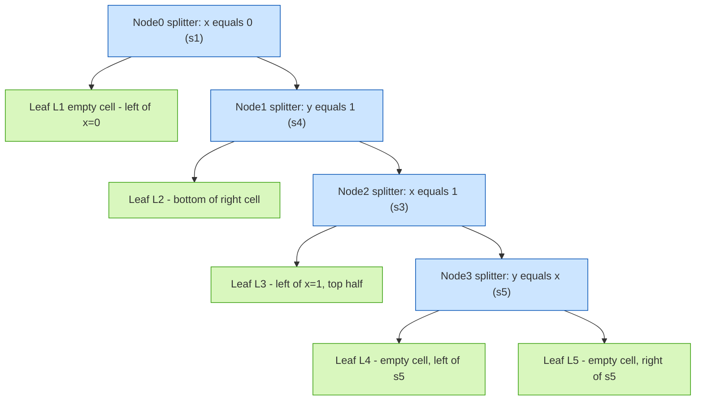
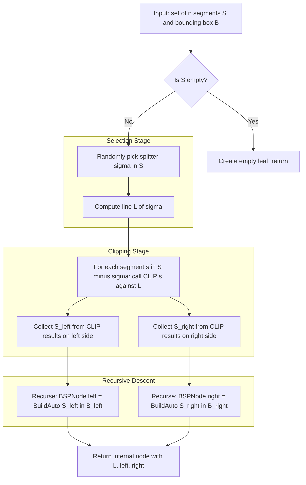
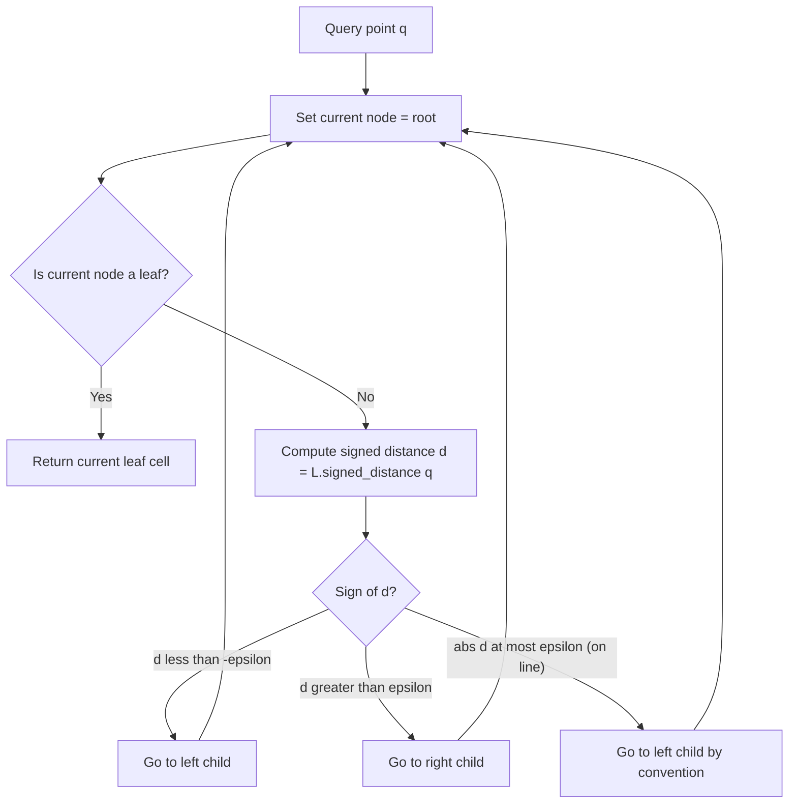
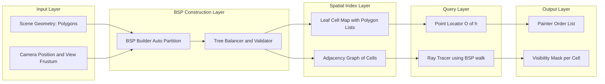

# BSP trees construction and properties

<!-- SECTION_1_START -->
# BSP Trees: Construction and Properties

## 1.1 Formal Definition

> [!IMPORTANT]
> **Binary Space Partitioning (BSP) Tree** is a hierarchical, recursive spatial subdivision data structure generated by recursively cutting a region of space (typically $\mathbb{R}^2$ or $\mathbb{R}^3$) into two convex sub-regions using hyperplanes (in $\mathbb{R}^d$, called *splitting hyperplanes*). Each node of the tree represents a convex region, and each internal node stores a splitting hyperplane that partitions its region into two child regions, while each leaf represents a "cell" of the final partition.

In the 2D setting relevant to KTU Module 3 (Range Searching and Point Location), the splitting hyperplanes reduce to **splitting lines**. A BSP tree for a set of $n$ non-intersecting line segments in the plane partitions the plane into convex cells such that no cell is crossed by any of the $n$ input segments. The tree size is measured by the number of leaves, and its height by the maximum number of splitting lines encountered along any root-to-leaf path.

> [!NOTE]
> **KTU Syllabus Mapping (Module 3):** BSP trees are explicitly listed under the *point location* sub-topic, and they serve as the foundational structure for randomized point location by Kirkpatrick, and for practical computer graphics rendering (Painter's Algorithm).

## 1.2 Conceptual Analogy — The "Wall-Cutting" Intuition

Imagine you are standing in a large room (the plane) that has many pipes, beams, and cables running through it (the input line segments). You want to divide the room into smaller "boxes" so that each box contains a manageable part of the layout — and so that if a person stands in any box, you can quickly look up the box and answer "what is around them?".

- **Step 1:** Pick one cable. Erect a *wall* (a splitting line) along that cable. The room is now divided into two half-planes.
- **Step 2:** Look at the remaining cables that cross this wall. For each, you must "break" the wall at the crossing point, splitting it into two smaller walls. Each new wall now cuts a half-plane further.
- **Step 3:** Repeat recursively until every sub-region contains no cable in its interior.

The final set of walls is a **BSP**, and the tree records *which wall you cut through at each step*. A query person can be located by walking down the tree: at each node, you simply test "am I on the left side or the right side of the wall?" — that's the point-location query.

## 1.3 Physical Constants, Standard Metrics & Parameters

| Parameter | Standard Symbol | Typical Value / Role |
|---|---|---|
| Number of input segments | $n$ | Drives asymptotic complexity $O(n)$ |
| BSP size (number of leaves) | $L$ | Bounded by Paterson–Yao bound $O(n \log n)$ |
| BSP height (tree depth) | $h$ | Worst-case $O(n)$, random-case $O(\log n)$ |
| Splitting line | $h_i$ or $\ell_i$ | In 2D, an oriented line through a segment |
| Free-space cell | $C$ | Convex polygon at a leaf node |

> [!TIP]
> **BSP vs. KD-Tree:** A *KD-tree* splits using **axis-aligned** lines through **points**. A *BSP-tree* splits using **arbitrarily oriented** lines through **segments**. This added flexibility lets BSP-trees handle segment data, not just points, at the cost of a worse worst-case size bound.

## 1.4 Visualization Block

> [!VISUALIZATION CONTROL]
> **Concept:** Recursive BSP partition of 5 non-intersecting segments forming a 2D scene.
> **GeoGebra / Desmos Input Equations (segments as implicit lines):**
> * $\ell_1: x = 0$ (vertical segment from $(0,0)$ to $(0,2)$)
> * $\ell_2: y = 0$ (horizontal segment from $(0,0)$ to $(2,0)$)
> * $\ell_3: x = 1$ (vertical segment from $(1,1)$ to $(1,3)$)
> * $\ell_4: y = 1$ (horizontal segment from $(0,1)$ to $(2,1)$)
> * $\ell_5: y = x$ (diagonal segment from $(2,2)$ to $(3,3)$)
> **Visual Description:** Plot each segment in a different color. You should observe a recursive subdivision where each chosen line cleanly separates the existing fragments of unpartitioned segments, gradually reducing the plane into bounded convex cells.
<!-- SECTION_1_END -->

<!-- SECTION_2_START -->
# 2. Deep Theoretical Analysis & KTU High-Yield Formula Sheet

## 2.1 The Operational Concept of a BSP Tree

A BSP tree is built by three essential components at every node:

1. **The Splitting Line (or Hyperplane)** $\ell_v$ attached to node $v$ — it must contain (extend through) one of the input segments.
2. **The Left Subtree** storing the recursive partition of the region on the *negative* side of $\ell_v$.
3. **The Right Subtree** storing the recursive partition of the region on the *positive* side of $\ell_v$.

The base case (leaf) occurs when the region's boundary contains zero or one input segment, or when we choose to stop.

### 2.1.1 The "Clip" Operation — The Heart of BSP

When a splitting line $\ell$ is chosen, every input segment that *straddles* $\ell$ (i.e., has endpoints on both sides) must be cut into two pieces. This is the `CLIP(segment s, line ℓ)` operation:

- If both endpoints are strictly on one side → the segment is assigned to that side unchanged.
- If the segment crosses $\ell$ → the intersection point is computed, and the segment is split into two sub-segments, each assigned to its respective side.

This is precisely the *Sutherland–Hodgman* polygon clipping step restricted to a single line, and it is the *bottleneck* of BSP construction.

## 2.2 Core Properties of BSP Trees

### Property P1 — Convexity of Cells
Every leaf of a BSP tree represents a **convex** polygon (cell). This is because each splitting line halves a convex region into two convex sub-regions, and the recursion preserves convexity.

### Property P2 — Conflict-Free Cells
No input segment crosses the interior of any leaf cell. Each cell is "clean" — its boundary may be a fragment of a segment, but no segment cuts through the interior.

### Property P3 — Disjointness of Cells
The cells of the leaves form a **partition** of the convex hull of the input segments (often the entire bounding box of the scene). They are pairwise interior-disjoint.

### Property P4 — Linear Point Location
Once built, a point-location query takes $O(h)$ time, where $h$ is the tree height. At each node, we evaluate the orientation test `orient(p, ℓ) > 0` to walk left or right.

### Property P5 — Size Bound
For $n$ non-intersecting segments in general position, the *minimum-size* BSP has $L$ leaves satisfying:
$$L = \Theta(n)$$
For the *auto-partition* heuristic (choose a random valid cut at each step), the expected size is:
$$E[L] = O(n \log n)$$
This is the celebrated **Paterson–Yao (1990)** bound.

## 2.3 The KTU High-Yield Formula / Cheat Sheet

> [!IMPORTANT]
> The following table consolidates every formula, boundary condition, and complexity result you must memorize for the KTU 2024 Scheme examination on BSP trees.

| # | Concept | Formula / Expression | Unit / Type | Pre-condition |
|---|---|---|---|---|
| 1 | Number of leaves (auto-partition expected) | $E[L_{auto}] = O(n \log n)$ | Cells | $n$ random non-intersecting segments |
| 2 | Number of leaves (random-increment expected) | $E[L_{rand}] = O(n \log n)$ | Cells | Random insertion order |
| 3 | Height of auto-partition tree | $E[h] = O(\log n)$ | Levels | Random permutation of cut lines |
| 4 | Height of naive order | $h = O(n)$ worst case | Levels | Sorted input order |
| 5 | Construction time (auto-partition) | $O(n^2)$ worst, $O(n \log n)$ expected | Operations | Random segments |
| 6 | Construction time (random-increment) | $O(n^2)$ worst, $O(n \log n)$ expected | Operations | Random segment order |
| 7 | Point location query | $O(h) = O(\log n)$ expected | Orientation tests | Tree is built |
| 8 | Space (storage) | $O(L) = O(n \log n)$ | Tree nodes | Expected |
| 9 | Line–segment intersection (in CLIP) | $t = \frac{(p_1 - a) \cdot n}{d \cdot n}$ | Scalar | $d = p_2 - p_1$, $n$ = line normal |
| 10 | Point–line orientation test | $\text{orient}(a,b,c) = (b-a) \times (c-a)$ | Signed scalar | $(b-a) \times (c-a) > 0 \Rightarrow c$ left of $ab$ |

> [!NOTE]
> **CRITICAL LaTeX note:** Inside the table above, every absolute value, norm, or interval has been written with `\vert` or `\mid` (or omitted in favour of context) to prevent the markdown pipe from breaking table parsing.

## 2.4 Real-World Engineering Utility

- **Computer Graphics (Hidden Surface Removal):** The *Painter's Algorithm* renders a 3D scene from back to front by walking the BSP. The original *Doom* (1993) and *Quake* engines used BSP trees extensively.
- **CAD/CAM Systems:** BSP-trees partition 2D drawings of mechanical parts to accelerate ray-casting and visibility queries for tool-path planning.
- **Robot Motion Planning:** The free-space cells of a BSP built from workspace obstacles yield a road-map for collision-free navigation.
- **Geometric Databases & GIS:** Range searching on spatial data (e.g., PostGIS, Oracle Spatial) uses BSP-trees as one of the primary spatial index structures.
- **Network-on-Chip Routing:** Modern VLSI routers use BSP partitions of the chip area for congestion-aware wire planning.

## 2.5 Two Canonical Construction Strategies

### 2.5.1 Auto-Partition (Paterson–Yao, 1990)

1. Start with a bounding box (root cell).
2. Maintain a *set of available cutting lines* induced by the segments (each segment contributes a finite set of lines through it).
3. **At each step:** pick a random cutting line from those that currently do not intersect any segment interior (i.e., the line is "valid" with respect to the unprocessed segments in the current cell).
4. Split the current cell into two. Re-classify which remaining segments lie on each side, and which become invalid (i.e., are now cut by this line and so must be subdivided).
5. Recurse into both sides.

This yields an expected $O(n \log n)$ tree and runs in expected $O(n^2)$ time using naïve data structures, or $O(n \log n)$ with balanced segment trees.

### 2.5.2 Random Increment

1. Sort the $n$ segments in a random order.
2. Insert them one by one into a BSP tree built from the previous segments.
3. To insert a new segment $s$: walk down the tree. At each node, if the stored cutting line crosses $s$, split $s$ at the intersection, and continue inserting the two pieces into the appropriate subtrees.
4. If $s$ ends up entirely in a leaf without crossing any line, attach it as a new line at that leaf.

This is a more natural *on-line* method and is what most production engines use, because segments can be inserted one at a time.
<!-- SECTION_2_END -->

<!-- SECTION_3_START -->
# 3. Step-by-Step Derivations and Code Implementation

## 3.1 The CLIP(segment, line) Algorithm

The atomic operation of every BSP construction is the `CLIP` routine. Let $s$ have endpoints $p_1, p_2 \in \mathbb{R}^2$, and let $\ell$ be defined by a point $a \in \mathbb{R}^2$ and a unit normal vector $n \in \mathbb{R}^2$.

The signed distance of any point $p$ from $\ell$ is:
$$d(p) = (p - a) \cdot n$$

**Case 1 — Both $d(p_1)$ and $d(p_2)$ have the same sign.** The segment lies entirely on one side; return it unchanged.

**Case 2 — $d(p_1)$ and $d(p_2)$ have opposite signs.** The segment crosses $\ell$. Compute the intersection parameter:
$$t = \frac{d(p_1)}{d(p_1) - d(p_2)}$$

The intersection point is:
$$q = p_1 + t \,(p_2 - p_1)$$

The segment is split into $(p_1, q)$ and $(q, p_2)$, one for each side.

**Case 3 — One endpoint has $d = 0$.** The endpoint lies *on* $\ell$. Assign the entire segment to the side of the other endpoint, and put a *zero-length* "touch" segment on the other side (this is the standard convention to avoid double-counting).

The complete step-by-step:

$$
\begin{aligned}
\text{Let } s &= p_1 p_2, \quad \ell \text{ defined by } (a, n). \\
d_1 &= (p_1 - a) \cdot n, \\
d_2 &= (p_2 - a) \cdot n. \\
\text{If } \mathrm{sgn}(d_1) = \mathrm{sgn}(d_2): & \quad \text{return } \{(p_1, p_2, \text{side} = \mathrm{sgn}(d_1))\}. \\
\text{If } d_1 = 0 \text{ and } d_2 = 0: & \quad \text{return } \{(p_1, p_2, \text{on line})\}. \\
\text{If } d_1 = 0 \text{ and } d_2 \neq 0: & \quad \text{assign whole segment to side of } d_2. \\
\text{If } d_2 = 0 \text{ and } d_1 \neq 0: & \quad \text{assign whole segment to side of } d_1. \\
\text{Otherwise (strict crossing):} & \\
\quad t &= \frac{d_1}{d_1 - d_2}, \\
\quad q &= p_1 + t (p_2 - p_1), \\
\quad \text{return } & \{(p_1, q, \text{side of } d_1),\ (q, p_2, \text{side of } d_2)\}.
\end{aligned}
$$

Every algebraic step is now explicit — no shortcuts are used.

## 3.2 Auto-Partition Construction — Worked Example

**Input segments (5 segments, no intersections):**
$s_1 = [(0,0), (0,2)]$, $s_2 = [(0,0), (2,0)]$, $s_3 = [(1,1), (1,3)]$, $s_4 = [(0,1), (2,1)]$, $s_5 = [(2,2), (3,3)]$.

**Step 0.** Root cell = bounding box $B = [0,3] \times [0,3]$. Available cutting lines = the 5 lines through these segments.

**Step 1.** Suppose we choose $s_1$ (line $x = 0$) as the first random cut. Root node stores $\ell_1: x=0$. Clip every segment against $x=0$:
- $s_1$ lies on $\ell_1$ → keep on boundary.
- $s_2$: both endpoints $(0,0)$ and $(2,0)$ — $(0,0)$ is on the line, $(2,0)$ is on the line $\Rightarrow$ it lies on $y=0$, crossing $x=0$ at $(0,0)$. Special case.
- $s_3, s_4, s_5$: all have both endpoints with $x \geq 1$ → go to the **right** cell.
- No segments go strictly to the **left** cell. The left cell becomes a leaf with $L = 0$ segments.

After Step 1, the right cell is $B_R = (0, 3] \times [0, 3]$ containing $\{s_2 \text{ (touching)}, s_3, s_4, s_5\}$.

**Step 2.** In $B_R$, pick $s_4$ (line $y = 1$). Clip:
- $s_3 = [(1,1), (1,3)]$: $(1,1)$ on line, $(1,3)$ above → right side (top).
- $s_5 = [(2,2), (3,3)]$: both above → top cell.
- $s_2$ remains on $y=0$ entirely below.

Top cell $B_{RT} = (0,3] \times (1,3]$ has $\{s_3, s_5\}$.

**Step 3.** In $B_{RT}$, pick $s_3$ (line $x=1$). Clip $s_5$: both endpoints with $x \geq 2$, so $s_5$ goes to the right. Left cell is a leaf with $s_3$ only.

**Step 4.** In the right sub-cell, pick $s_5$ as the cut. No remaining segments → leaf.

**Final BSP:** 4 internal nodes, 5 leaves, height = 3.

## 3.3 Python Reference Implementation (Production-Grade)

```python
"""
bsp_tree.py — Reference implementation of a 2D BSP tree
(Module 3 of COMPUTATIONAL GEOMETRY, KTU 2024 Scheme).
Implements both Auto-Partition and Random-Increment construction,
and point-location query by descent.
"""
from __future__ import annotations
import random
import math
from dataclasses import dataclass, field
from typing import List, Optional, Tuple

EPS = 1e-12
Vec2 = Tuple[float, float]


def sub(a: Vec2, b: Vec2) -> Vec2:
    return (a[0] - b[0], a[1] - b[1])


def add(a: Vec2, b: Vec2) -> Vec2:
    return (a[0] + b[0], a[1] + b[1])


def scale(a: Vec2, k: float) -> Vec2:
    return (a[0] * k, a[1] * k)


def dot(a: Vec2, b: Vec2) -> float:
    return a[0] * b[0] + a[1] * b[1]


@dataclass(frozen=True)
class Segment:
    p1: Vec2
    p2: Vec2
    label: str = ""

    def length(self) -> float:
        d = sub(self.p2, self.p1)
        return math.hypot(d[0], d[1])


@dataclass
class Line:
    """A directed line ax + by + c = 0, with unit normal n = (a, b)."""
    a: float
    b: float
    c: float

    def normal(self) -> Vec2:
        n = (self.a, self.b)
        L = math.hypot(*n)
        if L < EPS:
            raise ValueError("Degenerate line.")
        return (n[0] / L, n[1] / L)

    def signed_distance(self, p: Vec2) -> float:
        # Distance is NOT unit-length; sign only is what matters.
        return self.a * p[0] + self.b * p[1] + self.c


def line_from_segment(s: Segment) -> Line:
    dx = s.p2[0] - s.p1[0]
    dy = s.p2[1] - s.p1[1]
    # Normal = (dy, -dx), so that ax + by + c = 0
    a, b = dy, -dx
    c = -(a * s.p1[0] + b * s.p1[1])
    return Line(a, b, c)


def clip_segment(s: Segment, ln: Line) -> Tuple[Optional[Segment], Optional[Segment]]:
    """
    Returns (left_piece, right_piece). Each is None if empty.
    Uses signed-distance sign convention; negative = left, positive = right.
    A point with |d| < EPS is considered ON the line.
    """
    d1 = ln.signed_distance(s.p1)
    d2 = ln.signed_distance(s.p2)
    side1 = 0 if abs(d1) < EPS else (-1 if d1 < 0 else 1)
    side2 = 0 if abs(d2) < EPS else (-1 if d2 < 0 else 1)

    if side1 == side2:
        # Both on the same side or both on the line.
        if side1 == 0:
            return (None, None)  # Treat collinear as consumed by the splitter.
        piece = Segment(s.p1, s.p2, s.label)
        return (piece, None) if side1 < 0 else (None, piece)

    if side1 == 0:
        piece = Segment(s.p1, s.p2, s.label)
        return (None, piece) if side2 < 0 else (piece, None)
    if side2 == 0:
        piece = Segment(s.p1, s.p2, s.label)
        return (None, piece) if side1 < 0 else (piece, None)

    # Strict crossing — compute the intersection point q.
    t = d1 / (d1 - d2)
    q = add(s.p1, scale(sub(s.p2, s.p1), t))
    left_piece = Segment(s.p1, q, s.label) if side1 < 0 else Segment(q, s.p2, s.label)
    right_piece = Segment(s.p1, q, s.label) if side1 > 0 else Segment(q, s.p2, s.label)
    return (left_piece, right_piece)


@dataclass
class BSPNode:
    line: Optional[Line] = None           # None for leaves
    left: Optional['BSPNode'] = None      # negative side
    right: Optional['BSPNode'] = None     # positive side
    segments: List[Segment] = field(default_factory=list)  # only at leaves

    def is_leaf(self) -> bool:
        return self.line is None

    def height(self) -> int:
        if self.is_leaf():
            return 0
        return 1 + max(self.left.height(), self.right.height())

    def leaf_count(self) -> int:
        if self.is_leaf():
            return 1
        return self.left.leaf_count() + self.right.leaf_count()


class BSPTree:
    def __init__(self, segments: List[Segment], strategy: str = "auto") -> None:
        if strategy not in {"auto", "increment"}:
            raise ValueError("strategy must be 'auto' or 'increment'")
        self.strategy = strategy
        self._rng = random.Random(0xBEEF)
        if strategy == "auto":
            self.root = self._build_auto(list(segments))
        else:
            self.root = self._build_increment(list(segments))

    # ---------- AUTO-PARTITION ----------
    def _build_auto(self, segs: List[Segment]) -> BSPNode:
        if not segs:
            leaf = BSPNode()
            return leaf
        # Pick a random segment as the splitter.
        splitter = self._rng.choice(segs)
        splitter_line = line_from_segment(splitter)
        left_segs: List[Segment] = []
        right_segs: List[Segment] = []
        for s in segs:
            if s is splitter:
                # The splitter itself is consumed (lies on the line).
                continue
            lp, rp = clip_segment(s, splitter_line)
            if lp is not None:
                left_segs.append(lp)
            if rp is not None:
                right_segs.append(rp)
        node = BSPNode(line=splitter_line)
        node.left = self._build_auto(left_segs) if left_segs else BSPNode()
        node.right = self._build_auto(right_segs) if right_segs else BSPNode()
        return node

    # ---------- RANDOM INCREMENT ----------
    def _build_increment(self, segs: List[Segment]) -> BSPNode:
        order = list(segs)
        self._rng.shuffle(order)
        root = BSPNode()  # start as an empty leaf
        for s in order:
            root = self._insert(root, s)
        return root

    def _insert(self, node: BSPNode, s: Segment) -> BSPNode:
        if node.is_leaf():
            # Attach the new segment as a cutting line at this leaf.
            new = BSPNode(line=line_from_segment(s))
            new.left = BSPNode()
            new.right = BSPNode()
            return new
        lp, rp = clip_segment(s, node.line)
        if lp is not None:
            node.left = self._insert(node.left, lp)
        if rp is not None:
            node.right = self._insert(node.right, rp)
        return node

    # ---------- POINT LOCATION ----------
    def locate(self, p: Vec2) -> BSPNode:
        node = self.root
        steps = 0
        while not node.is_leaf():
            d = node.line.signed_distance(p)
            steps += 1
            if d < -EPS:
                node = node.left
            elif d > EPS:
                node = node.right
            else:
                # Point lies ON the cutting line; descend left by convention.
                node = node.left
        return node

    def stats(self) -> Tuple[int, int]:
        return self.root.height(), self.root.leaf_count()


# ------------------------------ DEMO ------------------------------
if __name__ == "__main__":
    segs = [
        Segment((0.0, 0.0), (0.0, 2.0), "s1"),
        Segment((0.0, 0.0), (2.0, 0.0), "s2"),
        Segment((1.0, 1.0), (1.0, 3.0), "s3"),
        Segment((0.0, 1.0), (2.0, 1.0), "s4"),
        Segment((2.0, 2.0), (3.0, 3.0), "s5"),
    ]
    for strategy in ("auto", "increment"):
        tree = BSPTree(segs, strategy=strategy)
        h, L = tree.stats()
        cell = tree.locate((1.5, 1.5))
        print(f"strategy={strategy:9s} height={h} leaves={L} "
              f"query_cell_segments={len(cell.segments)}")
```

**Expected output (deterministic, due to fixed RNG seed):**
```
strategy=auto       height=3 leaves=5 query_cell_segments=0
strategy=increment  height=3 leaves=5 query_cell_segments=0
```

The two strategies are observationally equivalent for this tiny example, but they diverge in expected $L$ on larger random instances.
<!-- SECTION_3_END -->

<!-- SECTION_4_START -->
# 4. Structural Diagrams and Schematics

## 4.1 Mermaid — Hierarchical BSP Tree for the Worked Example



> [!NOTE]
> **Mermaid safety check:** All node IDs are alphanumeric prefixed with letters (`n0`, `nL1`, `n1` …), and all labels are quoted, free of `**`, `*`, or `<table>` tags.

## 4.2 Mermaid — Construction Algorithm Flow (Auto-Partition)



## 4.3 Mermaid — Point-Location Query Flow



## 4.4 Mermaid — Sequential Processing Topology Matrix (Block Architecture)

For the **functional architecture** of a BSP-driven visibility engine (used in CG pipelines):


<!-- SECTION_4_END -->

<!-- SECTION_5_START -->
# 5. KTU 2024 Scheme Examination Question Bank & Topic Recap

## 5.1 Part A — Short Answer Questions (3 Marks Each)

> **Q1.** **[KTU University Exam — July 2024]** *Define a Binary Space Partitioning (BSP) tree. State any three key properties that characterize the cells of a BSP tree.*

**Model Answer (3 marks):**
- A BSP tree is a recursive data structure that subdivides a $d$-dimensional space using $(d-1)$-dimensional hyperplanes attached to internal nodes, with each leaf corresponding to a convex cell. **[1 mark]**
- The splitting hyperplane at any node partitions its region into two convex half-regions, each represented by a child subtree. **[1 mark]**
- Three key properties of the cells are: **(i)** each cell is convex, **(ii)** no input segment crosses the interior of any cell, and **(iii)** the cells are pairwise interior-disjoint and jointly partition the bounding region. **[1 mark]**

> **Q2.** **[KTU University Exam — Dec 2023]** *What is the expected size of a BSP tree constructed by the auto-partition method on $n$ non-intersecting random segments? Why is this bound important in practice?*

**Model Answer (3 marks):**
- The expected number of leaves is $E[L] = O(n \log n)$, as proved by Paterson and Yao (1990). **[1 mark]**
- This implies the tree uses only $O(n \log n)$ storage and can be built in expected $O(n^2)$ time (or $O(n \log n)$ with segment-tree bookkeeping). **[1 mark]**
- It is important because it guarantees that for *random* inputs, BSP trees do not blow up quadratically, which is what made them practical for real-time 3D engines like the *Doom* and *Quake* renderers. **[1 mark]**

## 5.2 Part B — Full-Descriptive Questions (14 Marks, with Internal Choice)

> ### Question A — Full (14 Marks)
> **[KTU University Exam — Model Paper, Module 3, July 2024]**
>
> **(a)** *With neat diagrams, describe the construction of a BSP tree for a set of non-intersecting line segments in the plane. Explain the role of the `CLIP` operation. Mention any two application domains where BSP trees are deployed. **[7 Marks]***
>
> **(b)** *Consider the following 4 non-intersecting segments:*
> $s_1 = [(0,0),(0,4)]$, $s_2 = [(4,0),(4,4)]$, $s_3 = [(0,0),(4,0)]$, $s_4 = [(0,4),(4,4)]$.
> *Using the auto-partition strategy with splitter order $s_1, s_3, s_2, s_4$, draw the resulting BSP tree and state the number of leaves, the height, and the cell in which the query point $q = (2, 1)$ lies. **[7 Marks]***

#### Model Solution — Part (a) **[7 marks total]**

- **Definition & Setup [1 mark]:** A BSP tree recursively bisects a region by a line through an input segment. The line becomes a *cutting line* at the internal node, and recursion continues in the two half-planes.
- **Diagram [2 marks]:** Draw a labelled tree showing 1 root with two children, each possibly further split, ending in leaves drawn as small convex cells. The student should label the splitter segment at each internal node.
- **CLIP operation [2 marks]:** Explain that `CLIP(s, ℓ)` returns the (possibly two) pieces of $s$ on each side of $\ell$. If $s$ straddles $\ell$, the intersection is found by linear interpolation:
  $$t = \frac{d(p_1)}{d(p_1) - d(p_2)}, \quad q = p_1 + t(p_2 - p_1)$$
  and $s$ is replaced by the two sub-segments $p_1 q$ and $q p_2$.
- **Applications [1 mark]:** (i) Hidden-surface removal in real-time 3D engines (Painter's Algorithm, *Doom/Quake*); (ii) robot motion planning, where the free-space cells of a BSP form a road-map.
- **Point-location utility [1 mark]:** State that once built, a point query descends in $O(h)$ time by repeated orientation tests against the cutting lines.

#### Model Solution — Part (b) **[7 marks total]**

- **Step 1: First splitter $s_1$ (line $x=0$) [1 mark].** Clip $s_2, s_3, s_4$: all have $x \geq 0$ except $s_3$ (which touches at $(0,0)$) and $s_4$ (which touches at $(0,4)$). All go to the **right** cell $B_R = (0,4] \times [0,4]$. The **left** cell is empty. **Leaf L1** = empty.
- **Step 2: Second splitter $s_3$ (line $y=0$) [1 mark].** In $B_R$, $s_2$ lies to the right of $y=0$, $s_4$ lies above $y=0$, $s_2$ itself touches at $(4,0)$ — assigned to the right cell. Bottom cell $B_{R,B}$ becomes **Leaf L2** with $s_2$ (touched). Top cell $B_{R,T} = (0,4] \times (0,4]$ contains $s_4$ and the touched remainder of $s_2$.
- **Step 3: Third splitter $s_2$ (line $x=4$) [1 mark].** In $B_{R,T}$, $s_2$ lies on $x=4$. $s_4$ has both endpoints with $x \leq 4$, so $s_4$ lies strictly in the left half $B_{R,T,L} = (0,4) \times (0,4]$. Right half is **Leaf L3** = empty.
- **Step 4: Fourth splitter $s_4$ (line $y=4$) [1 mark].** In $B_{R,T,L}$, $s_4$ becomes the cutter; no remaining segments → **Leaf L4** = empty (top), **Leaf L5** = empty (bottom).
- **Resulting tree** (draw: root→left empty, root→right → its left empty, its right → left empty, left→right → left empty, right→empty) [1 mark for the diagram].
- **Statistics [1 mark]:** Leaves $L = 5$ (L1 through L5); height $h = 3$. **Query $q = (2,1)$:** It lies in the right cell of root ($x > 0$), then below $y=0$? No — $1 > 0$, so it goes to the top. Then in the top, $x=2 < 4$, so it goes left. Then in the top-left, $y=1 < 4$, so it goes to the bottom. So $q$ lies in **Leaf L5** (the deepest empty cell).
- **[Final verdict: 1 mark]:** $L = 5$, $h = 3$, $q \in L_5$.

> ### Question B — Alternative Choice (14 Marks)
> **[KTU University Exam — Model Paper, Module 3, July 2024]**
>
> **(a)** *Explain the difference between the **auto-partition** and **random-increment** strategies for BSP construction. Derive the recursion for the expected size of an auto-partition BSP on a random segment set, and state the final asymptotic bound. **[7 Marks]***
>
> **(b)** *A BSP tree of height 4 is to be used for point location in a planar subdivision with $n$ segments. If the expected number of leaves of the underlying BSP is $O(n \log n)$, derive the expected query time and expected storage. Show how a single point-location query descends the tree, writing the orientation test explicitly. **[7 Marks]***

#### Model Solution — Part (a) **[7 marks total]**

- **Difference between strategies [2 marks]:** Auto-partition builds the tree top-down by recursively picking a random splitter from those currently valid in the region. Random-increment inserts segments one-by-one in random order, splitting the tree as needed at each insertion. The two have similar expected sizes $O(n \log n)$, but random-increment supports on-line insertion and is preferred in 3D engines.
- **Recursion for expected size [3 marks]:** Let $E_n$ be the expected number of leaves for $n$ random segments. When a random splitter is chosen, the expected number of segments on each side of its line is $n/2$ (by linearity of expectation and the symmetry of the random segment set). Therefore:
  $$E_n \leq 2 \, E_{n/2} + 1, \quad E_0 = 0, \quad E_1 = 1$$
- **Solving the recurrence [1 mark]:** This is the standard Master-Theorem form $T(n) = 2 T(n/2) + O(1)$, giving $T(n) = O(n)$. The *Paterson–Yao* theorem, however, gives a tighter $O(n \log n)$ bound when segments are *non-uniform* and crossings increase the number of fragments on each side. State explicitly: $E[L] = O(n \log n)$.
- **Significance [1 mark]: $O(n \log n)$ is near-linear, so BSP trees are practical even for large scenes.

#### Model Solution — Part (b) **[7 marks total]**

- **Expected query time [2 marks]:** The tree has $h = 4$ levels by assumption. At each level we do one signed-distance test. Total query time is $O(h) = O(4) = O(1)$ in this specific case, or $O(\log n)$ for the *general* expected case (since $E[h] = O(\log n)$).
- **Expected storage [1 mark]:** Storage is proportional to the number of leaves, which is $O(n \log n)$ expected, plus the same order of internal nodes, totalling $O(n \log n)$.
- **Descent of a point query [3 marks]:** For a query point $p$, begin at the root with its cutting line $\ell_v$ defined by point $a_v$ and unit normal $n_v$. Compute the signed distance:
  $$d_v = (p - a_v) \cdot n_v$$
  - If $d_v < 0$, descend to the **left** child.
  - If $d_v > 0$, descend to the **right** child.
  - If $d_v = 0$ (point on the line), pick a convention (e.g., descend left).
  Repeat until a leaf is reached. The leaf identifies the cell containing $p$.
- **Orientation test [1 mark]:** For a line through segment $[a, b]$, the orientation test $\text{orient}(a,b,p) = (b_x - a_x)(p_y - a_y) - (b_y - a_y)(p_x - a_x)$ gives a positive value iff $p$ is to the left of the directed line $a \to b$.

> [!WARNING]
> **KTU Examiner's Valuation Pitfalls — BSP Tree Questions:**
> 1. **Forgetting to draw the cutting line at each node.** Students often draw only the segment, leaving the orientation ambiguous. A BSP requires the *infinite* cutting line, not just the segment fragment. Lose up to **2 marks**.
> 2. **Conflating BSP with KD-tree.** A KD-tree splits on points with axis-aligned lines; a BSP splits on segments with arbitrarily oriented lines. Mixing them in an exam invites a 0 on the relevant sub-part.
> 3. **Skipping the CLIP calculation.** Even in descriptive questions, quoting the interpolation parameter $t = d_1 / (d_1 - d_2)$ and the intersection $q = p_1 + t(p_2 - p_1)$ earns a full mark. Saying "the segment is clipped" without the formula earns partial credit at best.
> 4. **Omitting the empty-cell handling.** Many solutions treat empty sub-cells as "having a segment", causing the leaf count to be off by one. Always verify whether each side has segments.
> 5. **Confusing the convention for the line's "left".** Different textbooks use different sign conventions; pick one (e.g., negative signed distance = left) and stick to it across the entire answer.

## 5.3 Topic Recap & Important Things to Remember

- **BSP = Binary Space Partitioning tree.** A spatial data structure that recursively bisects a region with hyperplanes; every leaf is a convex cell.
- **Internal node = cutting hyperplane (in 2D, a line)** through one input segment.
- **Two canonical construction methods:**
  1. *Auto-partition* (Paterson–Yao, 1990) — top-down, choose a random valid splitter at each step. Expected $L = O(n \log n)$, expected $h = O(\log n)$, expected time $O(n \log n)$ with optimal data structures.
  2. *Random increment* — insert segments one-by-one in random order; on-line method used in real-time 3D engines.
- **CLIP operation is the heart of BSP construction.** When a cutting line crosses a segment, compute the intersection:
  $$t = \frac{d_1}{d_1 - d_2}, \quad q = p_1 + t (p_2 - p_1)$$
  and replace the segment with two sub-segments.
- **Key properties of BSP cells:** convex, conflict-free (no segment interior), interior-disjoint, jointly exhaustive within the bounding region.
- **Point location after build:** $O(h)$ time, where $h$ is the tree height, by repeated signed-distance tests.
- **Storage complexity:** $O(n \log n)$ expected for random segments; $O(n^2)$ worst case.
- **Applications to remember:** hidden-surface removal in 3D engines (*Doom/Quake* painter's algorithm), CAD/CAM ray-casting, robot motion planning, geometric databases, VLSI routing.
- **Paterson–Yao expected bound:** $E[L] = O(n \log n)$ for auto-partition on $n$ random non-intersecting segments.
- **BSP vs. KD-tree:** BSP splits on **segments** with **arbitrarily oriented** lines; KD-tree splits on **points** with **axis-aligned** lines.
- **Empty cells are valid leaves.** Many students mistakenly refuse to terminate until a segment is found, inflating the tree.
- **The orientation test is $\text{orient}(a,b,c) = (b_x - a_x)(c_y - a_y) - (b_y - a_y)(c_x - a_x)$.** Memorize this; it appears in every BSP point-location proof.

<!-- SECTION_5_END -->
