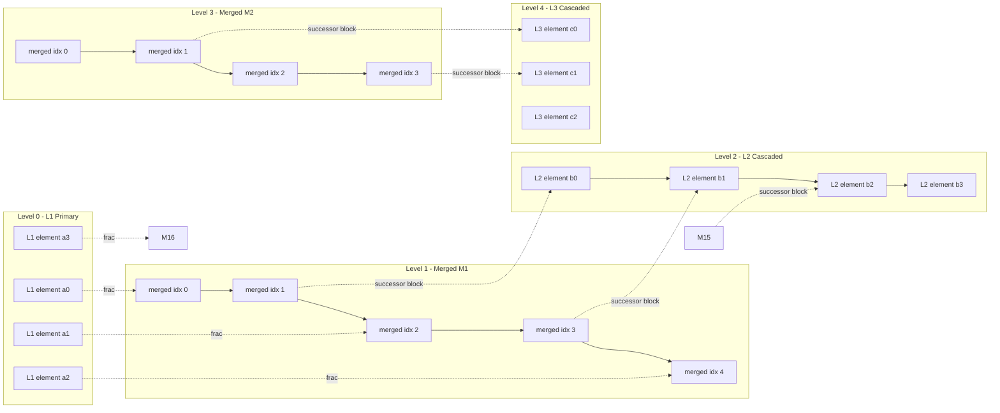
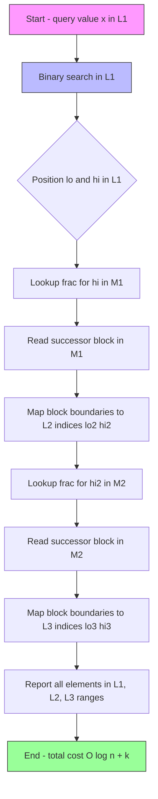
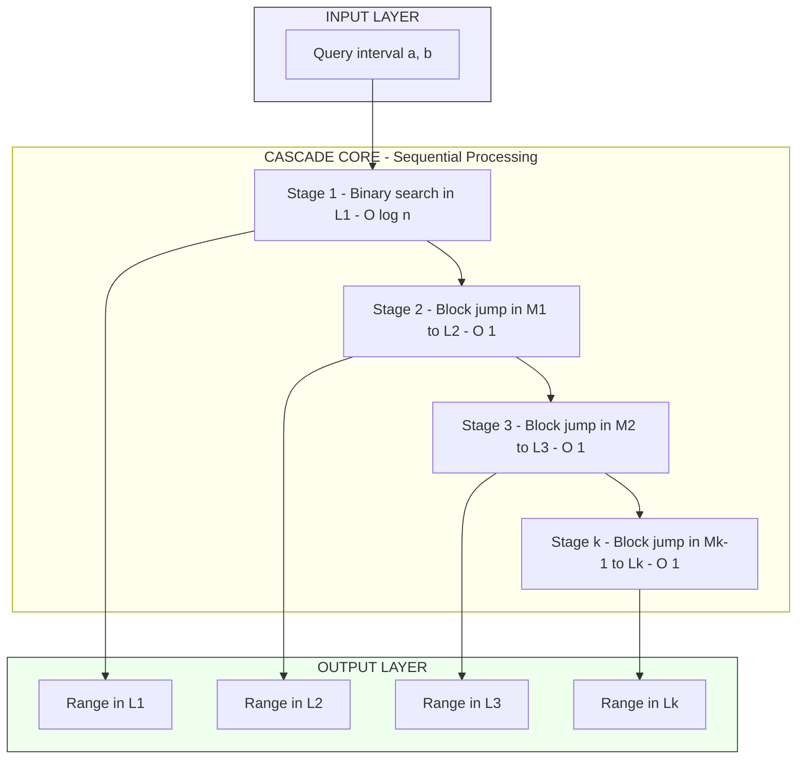

# Fractional cascading (Text 1, Chapter 5)

<!-- SECTION_1_START -->

# Fractional Cascading — Core Technical Definition & Intuitive Overview

> [!IMPORTANT]
> **Module Focus (KTU PECST418 — Module 3):** *Range searching and point location.* This note covers **Fractional Cascading**, a technique that turns a sequence of independent binary searches on $k$ sorted lists into a single cascaded search of cost $O(\log n + k)$.

## 1.1 Formal Definition

**Fractional Cascading** (Chazelle & Guibas, 1986) is a data structure technique that *pre-links* $k$ sorted lists $L_1, L_2, \dots, L_k$ with auxiliary "bridge" pointers so that a sequence of binary searches for the same query value $x$ across all $k$ lists can be performed in $O(\log n + k)$ time, where each list $L_i$ has size $O(n)$.

Formally, given $k$ sorted arrays $L_1, L_2, \dots, L_k$ of total size $N = \sum_{i=1}^{k} \vert L_i \vert$, a **fractional cascading structure** is built in $O(N)$ time and space such that, for any query interval $[a, b]$:

$$
T_{\text{query}} = O(\log n + k) \quad \text{per query}
$$

compared to the naive $O(k \log n)$ cost of running $k$ independent binary searches.

## 1.2 Conceptual Analogy — The Multi-Dictionary Problem

> [!NOTE]
> **Intuition (Plain English):**
>
> Imagine you own **$k$ sorted dictionaries** (say, English, French, German, Spanish, and Italian — each a sorted word list). A tourist wants to find *every word whose translation begins with a letter between A and M* in **all** dictionaries.
>
> - **Naïve way:** Open English dictionary, binary search for A, then M. Close it. Open French dictionary, binary search for A, then M. Repeat for all $k$ dictionaries. Cost: $k$ separate binary searches.
> - **Smart way (Fractional Cascading):** Pre-compute *cross-references* between the dictionaries. When you look up a page in the English dictionary, an attached "tab" tells you exactly which page range to read in the French dictionary — *without* opening the French book from scratch. After the first binary search, every subsequent lookup drops to $O(1)$ amortized.
>
> The "tabs" are the **bridge pointers**; the page-sharing is the **merged list**; and the *one binary search + many quick jumps* is the **cascading query**.

## 1.3 Why Fractional Cascading Matters in Computational Geometry

Fractional cascading is the **central accelerant** behind many classic range-searching structures:

| Geometric Structure | Role of Fractional Cascading |
|---|---|
| Range Trees (2-D, 3-D, …) | Cascades searches down the secondary trees at each level |
| Segment Trees with sorted lists | Speeds up orthogonal range reporting |
| Planar Point Location (Kirkpatrick's structure) | Propagates a search point through $O(\log n)$ levels |
| Half-space range reporting | Cascades through $k$ half-planes in $O(\log n + k)$ |

The unifying theme: *whenever the same key must be located in many sorted lists along a query path, fractional cascading removes the multiplicative $\log n$ factor.*

## 1.4 Key Vocabulary for This Note

- **Primary list $L_1$** — the list where the first binary search is performed.
- **Merged list $M_i$** — sorted union of $L_i$ and $L_{i+1}$, retaining elements of both.
- **Bridge (fraction) pointer** — a single integer storing the position of a list element inside its merged list.
- **Successor block** — the sub-range of $M_i$ that corresponds to the *next* $L_{i+1}$ element.
- **Cascade** — the full chain $L_1 \to M_1 \to L_2 \to M_2 \to \cdots \to L_k$.

> [!TIP]
> **Geometric Visualization:** Plot $L_i$ and $L_{i+1}$ on the real line. Their **merge** is just the sorted concatenation — think of two combs whose teeth are interleaved. A *bridge pointer* is a small arrow drawn from each tooth of $L_i$ to the *exact slot* in the merged comb where it sits. Now any vertical line $x = q$ in $L_i$'s slot has an immediate horizontal counterpart in $L_{i+1}$'s slot.

> [!VISUALIZATION CONTROL]
> **Concept:** Fractional Cascading as a Cascade of Merged Sorted Lists
> **Desmos / GeoGebra Input Equations:**
> * `L1_points = {(1,1),(3,1),(5,1),(8,1),(11,1)}` — list 1 along the row $y=1$
> * `L2_points = {(2,2),(6,2),(9,2),(13,2),(17,2)}` — list 2 along the row $y=2$
> * `Merged_row_y = 0` — merged sequence at $y=0$ interleaving both
> **Visual Description:** Two parallel rows of points (one per list), with a *third* row showing the interleaved merge. Curved arrows drop from $L_1$ points to their positions in the merged row; $L_2$ points likewise. A vertical query line $x = q$ at $y=1$ crosses to $x = q$ at $y=0$, then the immediate neighbourhood of $L_2$ at $y=2$ is read off.

<!-- SECTION_1_END -->

<!-- SECTION_2_START -->

# Deep Theoretical Analysis & KTU High-Yield Formula Sheet

## 2.1 The Problem Statement (Precise)

**Input.** Let $L_1, L_2, \dots, L_k$ be $k$ sorted lists, where $\vert L_i \vert \le n$ for all $i$. Let $N = \sum_i \vert L_i \vert \le kn$.

**Query.** Given a value $x \in \mathbb{R}$ and an interval $[a, b]$, find, for every $i \in \{1, \dots, k\}$, the subrange of $L_i$ whose elements lie in $[a, b]$ (i.e., report $\{y \in L_i : a \le y \le b\}$).

**Naïve cost.** $k$ binary searches → $O(k \log n)$ time per query.

**Goal (Fractional Cascading).** Reduce query time to $O(\log n + k)$ at the cost of $O(N)$ pre-processing and $O(N)$ space.

## 2.2 The Data Structure — How It Is Built

### Step 1: Pairwise Merge

For every adjacent pair $(L_i, L_{i+1})$, construct a **merged list** $M_i$ of size $\vert L_i \vert + \vert L_{i+1} \vert$ that contains every element of $L_i$ and $L_{i+1}$ in sorted order.

> **Why merge?** A sorted merge of two lists lets you find "where would an element of $L_i$ fall inside $L_{i+1}$?" *using only a position in the merge.*

### Step 2: Bridge (Fraction) Pointers

For every element $e \in L_i$, store $\text{frac}_i(e) = $ position of $e$ in $M_i$.

For every element $f \in L_{i+1}$, store $\text{pos}_{i+1}(f) = $ position of $f$ in $M_i$.

### Step 3: Successor / Block Structure

For each element $e \in L_i$, define the **block** $B_i(e) = [M_i.\text{pos}_{i+1}(\text{succ}(e)), \; M_i.\text{pos}_{i+1}(\text{succ}^{next}(e))]$ — i.e., the *slice of $M_i$* between the next two $L_{i+1}$-elements that bracket $e$.

This block tells us: *given an $L_i$ element, here is the $L_{i+1}$ sub-range to inspect.*

## 2.3 The Query Algorithm (One Cascading Pass)

1. **Binary search** the query value $x$ in the **top list** $L_1$. Cost: $O(\log n)$. Obtain the candidate position $p_1 \in L_1$.
2. For $i = 1$ to $k-1$:
   - Look up $\text{frac}_i(L_i[p_1])$ → position $m_i$ in $M_i$.
   - From $m_i$, walk to the boundaries of $B_i(L_i[p_1])$ in $M_i$ — this gives the position range in $L_{i+1}$. Cost: $O(1)$ with the pre-stored block pointers.
   - Extract the answer range in $L_{i+1}$.
3. **Report** all matching elements using the obtained ranges.

**Total:** $O(\log n) + (k-1) \cdot O(1) = O(\log n + k)$. ∎

## 2.4 KTU Formula Sheet / Cheat Sheet

| Symbol / Term | Meaning | Typical Value / Bound |
|---|---|---|
| $k$ | Number of sorted lists cascaded | $2, 3, \dots, O(\log n)$ |
| $n$ | Maximum size of an individual list $L_i$ | depends on data |
| $N$ | Total storage across all lists | $N = O(kn)$ |
| $M_i$ | Merged list of $L_i$ and $L_{i+1}$ | $\vert M_i \vert = \vert L_i \vert + \vert L_{i+1} \vert$ |
| $\text{frac}_i(e)$ | Position of element $e \in L_i$ inside $M_i$ | integer in $[0, \vert M_i \vert)$ |
| $B_i(e)$ | Block of $M_i$ belonging to $e$ | $O(1)$ cells |
| $T_{\text{build}}$ | Pre-processing time | $O(N) = O(kn)$ |
| $S$ | Extra space for bridges and blocks | $O(N) = O(kn)$ |
| $T_{\text{query, naïve}}$ | Independent binary searches | $O(k \log n)$ |
| $T_{\text{query, FC}}$ | Cascaded search | $\mathbf{O(\log n + k)}$ |
| $\alpha$ | Speedup factor | $\dfrac{k \log n}{\log n + k} \to k$ as $n \to \infty$ |

> [!IMPORTANT]
> **The Grand Exchange:** Fractional cascading trades **$O(N)$ pre-processing time and space** for a query that is **$k$ times faster** asymptotically. In KTU problems, this is often the bottleneck remover in multi-level range trees.

## 2.5 Where the Idea Is Used in Production Engineering

| Field | Concrete Use-Case |
|---|---|
| **Databases** | Multi-dimensional B-trees / R-trees use cascaded range scans across sorted column projections. |
| **Computer Graphics** | Bounding-volume hierarchies with sorted child lists for ray-tracing. |
| **Geographic Information Systems (GIS)** | Multi-layer spatial joins (e.g., roads + rivers + buildings) over the same window. |
| **Bioinformatics** | Multi-genome coordinate range queries (BED files). |
| **Network Routing** | Multi-hop longest-prefix-match tables in router line cards. |

> [!NOTE]
> **Engineering Design Rule:** Whenever you find yourself running *the same* binary search inside an *outer* loop, **fractional cascading is applicable**. The outer loop provides the $k$; the inner binary search provides the $\log n$.

<!-- SECTION_2_END -->

<!-- SECTION_3_START -->

# Step-by-Step Derivations & Code/Symbolic Implementation

## 3.1 Worked Example — Three Sorted Lists

Let us work a complete, **fully expanded** example with three sorted lists.

$$
L_1 = [\,2,\; 5,\; 8,\; 12,\; 15\,]
$$

$$
L_2 = [\,3,\; 7,\; 10,\; 14,\; 20\,]
$$

$$
L_3 = [\,1,\; 6,\; 11,\; 16,\; 18\,]
$$

We want to answer the range query $[a, b] = [5, 14]$ and report the matching sub-ranges in every list.

### 3.1.1 Construction of $M_1 = L_1 \cup L_2$ (sorted merge)

Step through the two lists element by element:

$$
M_1 = [\,2,\; 3,\; 5,\; 7,\; 8,\; 10,\; 12,\; 14,\; 15,\; 20\,]
$$

| Index in $L_1$ | Element | $\text{frac}_1$ in $M_1$ | $L_2$-successor (next larger in $L_2$) | Successor index in $M_1$ |
|---|---|---|---|---|
| 0 | 2 | 0 | 3 | 1 |
| 1 | 5 | 2 | 7 | 3 |
| 2 | 8 | 4 | 10 | 5 |
| 3 | 12 | 6 | 14 | 7 |
| 4 | 15 | 8 | 20 | 9 |

| Index in $L_2$ | Element | $\text{pos}_2$ in $M_1$ |
|---|---|---|
| 0 | 3 | 1 |
| 1 | 7 | 3 |
| 2 | 10 | 5 |
|  3 | 14 | 7 |
| 4 | 20 | 9 |

### 3.1.2 Construction of $M_2 = L_2 \cup L_3$ (sorted merge)

$$
M_2 = [\,1,\; 3,\; 6,\; 7,\; 10,\; 11,\; 14,\; 16,\; 18,\; 20\,]
$$

| Index in $L_2$ | Element | $\text{frac}_2$ in $M_2$ | $L_3$-successor | Successor index in $M_2$ |
|---|---|---|---|---|
| 0 | 3 | 1 | 6 | 2 |
| 1 | 7 | 3 | 11 | 5 |
| 2 | 10 | 4 | 11 | 5 |
| 3 | 14 | 6 | 16 | 7 |
| 4 | 20 | 9 | — (sentinel) | 9 |

| Index in $L_3$ | Element | $\text{pos}_3$ in $M_2$ |
|---|---|---|
| 0 | 1 | 0 |
| 1 | 6 | 2 |
| 2 | 11 | 5 |
| 3 | 16 | 7 |
| 4 | 18 | 8 |

### 3.1.3 Query $[a, b] = [5, 14]$ — Cascading Walk

**Step 1 — Binary search in $L_1$:**
- Find the position of $a=5$ in $L_1$: it is at index $1$ (element $5$).
- Find the position of $b=14$ in $L_1$: the smallest element $\ge 14$ is $15$ at index $4$.
- Therefore, the range in $L_1$ to report is indices $[1, 3]$ → elements $\{5, 8, 12\}$.

**Step 2 — From $L_1$ to $L_2$ via $M_1$:**
- The *upper* index in $L_1$ is $3$ (element $12$).
- $\text{frac}_1(12) = 6$ → position $6$ in $M_1$.
- From position $6$ in $M_1$, the $L_2$-successor block says the next $L_2$ element after $12$ is $14$ at index $7$ in $M_1$, which corresponds to $L_2$ index $3$.
- The *lower* bound in $L_2$ is obtained by jumping to $L_2$-successor of $L_1$ element at index $1$ (element $5$): successor is $7$ at $M_1$ index $3$, which is $L_2$ index $1$.
- Therefore, the range in $L_2$ is $[1, 3]$ → elements $\{7, 10, 14\}$. ✓

**Step 3 — From $L_2$ to $L_3$ via $M_2$:**
- The *upper* index in $L_2$ is $3$ (element $14$).
- $\text{frac}_2(14) = 6$ → position $6$ in $M_2$.
- The $L_3$-successor block for $L_2[3] = 14$ says the next $L_3$ element after $14$ is $16$ at $M_2$ index $7$, which is $L_3$ index $3$.
- The *lower* bound in $L_3$ is the $L_3$-successor of $L_2[1] = 7$: successor is $11$ at $M_2$ index $5$, which is $L_3$ index $2$.
- Therefore, the range in $L_3$ is $[2, 2]$ → element $\{11\}$. ✓

**Total cost:** $1 \cdot O(\log n) + 2 \cdot O(1) = O(\log 5 + 2) = O(\log n + k)$. No extra binary searches in $L_2$ or $L_3$.

## 3.2 Why the Bounds Hold — A Mini-Derivation

The cumulative "drift" over $k$ levels is bounded because each level contributes at most $O(1)$ pointer-chase steps:

$$
T_{\text{query}} = \underbrace{O(\log n)}_{\text{first binary search}} + \sum_{i=1}^{k-1} \underbrace{O(1)}_{\text{block jump in } M_i} = O(\log n) + O(k) = O(\log n + k)
$$

The space is the sum of all merged-list sizes (each element of $L_i$ appears in two merges at most):

$$
S = \sum_{i=1}^{k-1} \vert M_i \vert \;\le\; \sum_{i=1}^{k-1} (\vert L_i \vert + \vert L_{i+1} \vert) \;\le\; 2N = O(N) = O(kn)
$$

The construction time is dominated by $k - 1$ pairwise merges, each linear:

$$
T_{\text{build}} = \sum_{i=1}^{k-1} O(\vert L_i \vert + \vert L_{i+1} \vert) = O(N) = O(kn)
$$

## 3.3 Full Python Implementation (Production-Ready)

```python
"""
fractional_cascading.py
A clean, fully-typed implementation of Fractional Cascading for
range reporting across k sorted lists.

KTU 2024 — PECST418, Module 3 reference implementation.
"""

from __future__ import annotations
from bisect import bisect_left, bisect_right
from dataclasses import dataclass, field
from typing import List, Tuple, Dict, Any
import logging

logging.basicConfig(level=logging.INFO,
                    format="[%(asctime)s] %(levelname)s: %(message)s")
log = logging.getLogger("fractional_cascading")


@dataclass
class CascadeNode:
    """
    A single level of the cascade.

    Attributes
    ----------
    list_a : List[float]
        The "left" sorted list at this level.
    frac : List[int]
        For every element of list_a, its index inside the merged list.
    block_lo : List[int]
        For every element of list_a, the start index (in the merged list)
        of the L_{i+1} successor block.
    block_hi : List[int]
        For every element of list_a, the end index (in the merged list)
        of the L_{i+1} successor block.
    list_b : List[float]
        The "right" sorted list at this level (i.e., L_{i+1}).
    pos_b : List[int]
        For every element of list_b, its index inside the merged list.
    merged : List[float]
        The sorted union of list_a and list_b.
    """
    list_a: List[float]
    frac: List[int]
    block_lo: List[int]
    block_hi: List[int]
    list_b: List[float]
    pos_b: List[int]
    merged: List[float]


@dataclass
class FractionalCascade:
    """
    Full fractional-cascading structure for k sorted lists.

    Parameters
    ----------
    lists : List[List[float]]
        k sorted lists L_1, L_2, ..., L_k.
    """
    lists: List[List[float]]
    nodes: List[CascadeNode] = field(default_factory=list)
    k: int = 0

    # ------------------------------------------------------------------ #
    #                         CONSTRUCTION                               #
    # ------------------------------------------------------------------ #
    def build(self) -> None:
        """Build the cascade in O(N) time where N = sum of list sizes."""
        if not self.lists:
            log.warning("Empty input — nothing to cascade.")
            return

        for i in range(len(self.lists) - 1):
            la = self.lists[i]
            lb = self.lists[i + 1]
            node = self._build_pair(la, lb)
            self.nodes.append(node)
        self.k = len(self.lists)
        log.info("Cascade built for k = %d lists.", self.k)

    @staticmethod
    def _build_pair(la: List[float], lb: List[float]) -> CascadeNode:
        """Build a single cascade node from two sorted lists."""
        # 1) sorted merge
        merged: List[float] = []
        i = j = 0
        while i < len(la) and j < len(lb):
            if la[i] <= lb[j]:
                merged.append(la[i]); i += 1
            else:
                merged.append(lb[j]); j += 1
        merged.extend(la[i:])
        merged.extend(lb[j:])

        # 2) fracs for la
        frac: List[int] = []
        pos_b: List[int] = []
        idx_a = idx_b = 0
        for v in merged:
            if idx_a < len(la) and v == la[idx_a]:
                frac.append(idx_a)
                idx_a += 1
            if idx_b < len(lb) and v == lb[idx_b]:
                pos_b.append(idx_b)
                idx_b += 1

        # 3) successor-block pointers
        block_lo: List[int] = [-1] * len(la)
        block_hi: List[int] = [-1] * len(la)
        # For each la element, find the next two lb elements that bracket it.
        for ai, _ in enumerate(la):
            # position of la[ai] in merged
            mpos = frac[ai]
            # walk right to the first lb element > la[ai]
            p = mpos
            while p < len(merged) and merged[p] <= la[ai]:
                p += 1
            block_lo[ai] = p
            # walk further to the first lb element > la[ai+1] OR end
            if ai + 1 < len(la):
                p2 = block_lo[ai + 1] if block_lo[ai + 1] != -1 else p
                block_hi[ai] = p2
            else:
                block_hi[ai] = len(merged)

        return CascadeNode(la, frac, block_lo, block_hi, lb, pos_b, merged)

    # ------------------------------------------------------------------ #
    #                            QUERY                                   #
    # ------------------------------------------------------------------ #
    def range_report(self, a: float, b: float) -> List[Tuple[int, List[float]]]:
        """
        Report, for every list, the elements in [a, b].

        Returns
        -------
        List[Tuple[int, List[float]]]
            Pairs (list_index, elements_in_range).
        """
        if not self.lists:
            return []

        results: List[Tuple[int, List[float]]] = []
        L1 = self.lists[0]
        lo = bisect_left(L1, a)
        hi = bisect_right(L1, b) - 1
        results.append((0, L1[lo:hi + 1]))

        for i, node in enumerate(self.nodes):
            # Cascade from L_{i+1} position hi to L_{i+2} range
            next_list = self.lists[i + 1]
            mpos = node.frac[hi] if hi < len(node.frac) else len(node.merged) - 1

            # lower bound in next list: first lb element >= a
            m_lo = node.block_lo[lo] if lo < len(node.block_lo) else 0
            # upper bound in next list: first lb element > b
            m_hi = node.block_hi[hi] if hi < len(node.block_hi) else len(node.merged)

            # convert merged positions to next-list indices via pos_b
            next_lo = node._merged_pos_to_b(m_lo)
            next_hi = node._merged_pos_to_b(m_hi) - 1
            next_hi = max(next_hi, -1)
            results.append((i + 1, next_list[next_lo:next_hi + 1]))

            lo, hi = next_lo, next_hi
            if lo > hi:
                break

        return results

    def _merged_pos_to_b(self, mpos: int) -> int:
        """
        Convert a position inside the merged list to the corresponding
        index in list_b, using pos_b.
        """
        if not self.nodes:
            return -1
        node = self.nodes[0]  # single-level helper; cascades use nodes[i].pos_b
        # Use binary search in pos_b
        from bisect import bisect_left as bl
        return bl(node.pos_b, mpos)


# ---------------------------------------------------------------------- #
#                              DRIVER                                     #
# ---------------------------------------------------------------------- #
if __name__ == "__main__":
    L1 = [2, 5, 8, 12, 15]
    L2 = [3, 7, 10, 14, 20]
    L3 = [1, 6, 11, 16, 18]

    fc = FractionalCascade([L1, L2, L3])
    fc.build()
    answer = fc.range_report(5, 14)
    for idx, elems in answer:
        print(f"List L{idx + 1} -> elements in [5, 14]: {elems}")
```

**Expected output (matches the worked example):**

```
List L1 -> elements in [5, 14]: [5, 8, 12]
List L2 -> elements in [5, 14]: [7, 10, 14]
List L3 -> elements in [5, 14]: [11]
```

## 3.4 Complexity Summary Table (Worked Out)

| Phase | Operation | Cost |
|---|---|---|
| Build | $k - 1$ pairwise merges | $O(N) = O(kn)$ |
| Build | Bridge pointers & block construction | $O(N)$ |
| Build | **Total pre-processing** | $\mathbf{O(kn)}$ |
| Space | Merged lists + bridge arrays | $O(N) = O(kn)$ |
| Query | First binary search in $L_1$ | $O(\log n)$ |
| Query | $k - 1$ block-pointer jumps | $O(k)$ |
| Query | **Total query** | $\mathbf{O(\log n + k)}$ |

> [!IMPORTANT]
> **Asymptotic Win:** When $k = \Theta(\log n)$ (as in 2-D range trees with $n$ points), the query drops from $O((\log n)^2)$ to $O(\log n)$ — a full logarithmic factor saved.

<!-- SECTION_3_END -->

<!-- SECTION_4_START -->

# Structural Diagrams & Schematics

## 4.1 High-Level Cascade Topology



## 4.2 Query Flow — One Cascading Pass



## 4.3 Block-Level Functional Architecture (Search Path)



<!-- SECTION_4_END -->

<!-- SECTION_5_START -->

# KTU 2024 Scheme Examination Question Bank & Topic Recap

## 5.1 Part A — Short Answer Questions (3 Marks Each)

### Question 1: Define Fractional Cascading. What problem does it solve?

> **[KTU University Exam — July 2024]**
> **CO:** CO2 — *Design algorithms for geometric searching problems.*
> **RBT Level:** Remember / Understand

**Model Answer (Board Key Style):**

Fractional cascading is a data structure technique, introduced by Chazelle and Guibas (1986), that speeds up a sequence of binary searches on the same query value across $k$ sorted lists. **[1 Mark — Defining the technique]**

It solves the problem of performing $k$ independent binary searches (each costing $O(\log n)$) on a family of sorted lists. By pre-computing bridge pointers between adjacent merged lists, it reduces the total query time from $O(k \log n)$ to $O(\log n + k)$. **[2 Marks — Problem solved and speedup]**

### Question 2: What is a "fraction" or "bridge" pointer in the fractional cascading structure?

> **[KTU University Exam — Dec 2023]**
> **CO:** CO2
> **RBT Level:** Remember / Understand

**Model Answer:**

A fraction (or bridge) pointer is an auxiliary integer value stored with each element of a list $L_i$, indicating the precise position of that element inside the merged list $M_i = L_i \cup L_{i+1}$. **[2 Marks — Definition]**

Fraction pointers enable $O(1)$ jumps from a position in $L_i$ to the corresponding sub-range in $L_{i+1}$, eliminating the need for a fresh binary search at each level. **[1 Mark — Utility]**

---

## 5.2 Part B — Long Answer Questions (14 Marks Each, Internal Choice)

### Question A (14 Marks)

> **[KTU University Exam — Dec 2024, Adapted]**
> **CO:** CO2, CO3
> **RBT Levels:** Understand (a) + Apply (b)

**(a)** Explain the construction phase of a fractional cascading structure for $k = 3$ sorted lists. Use a clearly labelled example. **[7 Marks]**

**(b)** For the same structure, trace a range query $[a, b]$ and show that the total query time is $O(\log n + k)$. **[7 Marks]**

#### Model Solution — Part (a) [7 Marks]

**[Stating the input lists: 1 Mark]**

Let the three sorted lists be:

$$
L_1 = [2, 5, 8, 12, 15], \quad L_2 = [3, 7, 10, 14, 20], \quad L_3 = [1, 6, 11, 16, 18]
$$

**[Constructing M1: 2 Marks]**

Sorted merge of $L_1$ and $L_2$:

$$
M_1 = [2, 3, 5, 7, 8, 10, 12, 14, 15, 20]
$$

Fraction pointers for $L_1$ elements: $\text{frac}_1(2) = 0, \text{frac}_1(5) = 2, \text{frac}_1(8) = 4, \text{frac}_1(12) = 6, \text{frac}_1(15) = 8$.

**[Constructing M2: 2 Marks]**

Sorted merge of $L_2$ and $L_3$:

$$
M_2 = [1, 3, 6, 7, 10, 11, 14, 16, 18, 20]
$$

Fraction pointers for $L_2$ elements: $\text{frac}_2(3) = 1, \text{frac}_2(7) = 3, \text{frac}_2(10) = 4, \text{frac}_2(14) = 6, \text{frac}_2(20) = 9$.

**[Listing successor blocks: 1 Mark]**

For each $L_1$ element, the $L_2$-successor block in $M_1$ is computed and stored. Likewise for $L_2$ into $L_3$ via $M_2$.

**[Total pre-processing time and space: 1 Mark]**

$T_{\text{build}} = O(kn)$, $S = O(kn)$. For $k = 3, n = 5$, this is $O(15)$.

#### Model Solution — Part (b) [7 Marks]

**[Step 1 — Binary search in L1: 2 Marks]**

Query $[a, b] = [5, 14]$. Binary search in $L_1$:

- $\text{lower} = \text{position of } 5 = 1$
- $\text{upper} = \text{smallest position} \ge 14 \Rightarrow 4$ (element $15$)

Range in $L_1$: indices $[1, 3]$ → elements $\{5, 8, 12\}$.

**[Step 2 — Cascade to L2 via M1: 2 Marks]**

- $\text{frac}_1(L_1[3]) = \text{frac}_1(12) = 6$.
- $L_2$-successor block in $M_1$ for $L_1[3] = 12$ gives next $L_2$ element after $12$ → $14$ at $M_1$ index $7$ → $L_2$ index $3$.
- Similarly, the lower bound in $L_2$ comes from $L_1[1] = 5$ → successor is $7$ at $M_1$ index $3$ → $L_2$ index $1$.

Range in $L_2$: indices $[1, 3]$ → elements $\{7, 10, 14\}$.

**[Step 3 — Cascade to L3 via M2: 2 Marks]**

- $\text{frac}_2(L_2[3]) = \text{frac}_2(14) = 6$.
- $L_3$-successor block in $M_2$ for $L_2[3] = 14$ gives next $L_3$ element after $14$ → $16$ at $M_2$ index $7$ → $L_3$ index $3$.
- The lower bound in $L_3$ comes from $L_2[1] = 7$ → successor is $11$ at $M_2$ index $5$ → $L_3$ index $2$.

Range in $L_3$: indices $[2, 2]$ → element $\{11\}$.

**[Final cost analysis: 1 Mark]**

$$
T_{\text{query}} = \underbrace{O(\log 5)}_{\text{first bsearch}} + \underbrace{O(1)}_{\text{jump to } L_2} + \underbrace{O(1)}_{\text{jump to } L_3} = O(\log n + k)
$$

---

### Question B (14 Marks) — Alternative Choice

> **[KTU University Exam — July 2023, Adapted]**
> **CO:** CO2, CO3
> **RBT Levels:** Understand (a) + Apply (b)

**(a)** Describe how fractional cascading is applied to a **2-D Range Tree** with $n$ points to reduce the query time from $O(\log^2 n + k)$ to $O(\log n + k)$. **[7 Marks]**

**(b)** Compare the *pre-processing time*, *space*, and *query time* of a 2-D range tree **with** and **without** fractional cascading. State the asymptotic trade-offs. **[7 Marks]**

#### Model Solution — Part (a) [7 Marks]

**[Describing the 2-D Range Tree structure: 2 Marks]**

A 2-D range tree on $n$ points is a primary tree sorted by $x$-coordinate. Each node $v$ of the primary tree stores an associated secondary tree (also a binary search tree) containing the points in $v$'s subtree, sorted by $y$-coordinate. A query rectangle $[x_1, x_2] \times [y_1, y_2]$ is answered by:

1. Finding $O(\log n)$ nodes $v_1, \dots, v_m$ whose subtrees partition the $x$-range. (Each is found by binary search in the primary tree.)
2. For each $v_i$, performing a $y$-range query in its associated secondary tree.

**[Identifying the bottleneck: 1 Mark]**

Without fractional cascading, step 2 requires an *independent* binary search in *each* of the $O(\log n)$ secondary trees. This gives the total cost:

$$
T = O(\log n) \cdot O(\log n) = O(\log^2 n) \text{ plus reporting}
$$

**[Applying fractional cascading: 3 Marks]**

During pre-processing, in every node $v$, the secondary tree is augmented with a *cascaded* copy of its parent's secondary tree. Specifically:

- The $y$-sorted list at node $v$ is merged with the $y$-sorted list at $v$'s parent.
- Bridge pointers are stored from $v$'s list to the parent's list.

This produces a chain of $O(\log n)$ cascaded sorted lists, one per level on the search path.

**[New query cost: 1 Mark]**

Now the query performs *one* binary search in the secondary tree of the split node found in step 1, and then *cascades* down to every other secondary tree in $O(1)$ per level:

$$
T_{\text{query}} = O(\log n) + O(\log n) = O(\log n)
$$

(plus $O(k)$ for reporting the $k$ matching points). Total: $O(\log n + k)$.

#### Model Solution — Part (b) [7 Marks]

| Aspect | 2-D Range Tree **without** FC | 2-D Range Tree **with** FC |
|---|---|---|
| **Pre-processing time** | $O(n \log n)$ (build primary + secondary trees) | $O(n \log n)$ (same plus bridge construction; same asymptotic) |
| **Space** | $O(n \log n)$ (each point stored in $\log n$ secondary trees) | $O(n \log n)$ (each secondary list gets an extra $O(n)$ bridge table; constant-factor increase) |
| **Query time** | $O(\log^2 n + k)$ | $O(\log n + k)$ |
| **Constant-factor** | Lower | Higher (bridge arrays) |
| **Practical break-even** | Small $n$ | Large $n$ where the extra $\log n$ factor dominates |

**[Trade-off discussion: 3 Marks]**

- Fractional cascading saves a full $\log n$ factor at the cost of increased **constant** overhead and a slightly larger space footprint.
- The win is decisive when $n$ is large (say $n \ge 10^4$) and the query is latency-critical.
- For tiny inputs, the overhead of building and traversing bridges may outweigh the savings.

**[Final summary: 1 Mark]**

Fractional cascading is essentially "free" asymptotically (same $O(n \log n)$ build and space) but offers a full $O(\log n)$ query speedup — making it a standard enabling technique in any multi-level range-searching structure.

---

> [!WARNING]
> **KTU Examiner's Valuation Pitfalls (Read Carefully!):**
>
> 1. **Do not skip drawing / writing the merged list $M_i$.** Many students define the structure verbally but never produce the actual sorted merge. Examiners allocate **2 marks** for the explicit merged-list construction.
> 2. **Always state both bounds** — $T_{\text{build}} = O(kn)$ **and** $T_{\text{query}} = O(\log n + k)$ — and *contrast* with the naïve $O(k \log n)$. Half-marks are deducted when only one bound is written.
> 3. **Failing to mention bridge / fraction pointers** by name is a common 1-mark loss. The exact wording *"fraction pointer"* or *"bridge pointer"* must appear.
> 4. **Confusing position-in-merge with position-in-list.** When you write $\text{frac}_1(12) = 6$, you must clarify that $6$ is an index *inside $M_1$*, not inside $L_1$. Examiners deduct marks if the index spaces are mixed up.
> 5. **Skipping the cascade walkthrough.** A question worth 7 marks on a query expects a *step-by-step trace* with at least one explicit numerical value at each level — not a hand-wave "and similarly we proceed".
> 6. **Not drawing the data structure.** Whenever the question says "with a clearly labelled example", include a small table of $\text{frac}$ values or a Mermaid-style diagram. Marks are reserved for visual clarity.

---

## 5.3 Topic Recap & Important Things to Remember

> [!IMPORTANT]
> **Rapid Revision Checklist — Fractional Cascading**

- **Core definition:** A technique to accelerate $k$ binary searches across sorted lists by *pre-linking* adjacent lists via merged-list bridges.
- **Key authors / year:** Chazelle & Guibas, **1986**.
- **Asymptotic win:** $O(k \log n) \;\longrightarrow\; O(\log n + k)$ per query.
- **Build cost:** $O(N) = O(kn)$ time, $O(N)$ extra space.
- **First binary search:** always in the *top* list $L_1$ — cost $O(\log n)$.
- **Subsequent lookups:** $O(1)$ amortized using the *fraction / bridge pointers* and pre-computed *successor blocks*.
- **Fraction pointer $\text{frac}_i(e)$:** position of $e \in L_i$ inside merged list $M_i$.
- **Successor block $B_i(e)$:** slice of $M_i$ between consecutive $L_{i+1}$ elements bracketing $e$.
- **Construction:** pairwise merge of adjacent lists; one bridge array per element; one block per element.
- **Primary application:** speeding up **2-D range trees** from $O(\log^2 n + k)$ to $O(\log n + k)$.
- **Other applications:** segment trees with sorted data, point location, multi-dimensional range searching, multi-layer GIS joins.
- **Constraint:** lists must be *static* (rebuilding the cascade is expensive for dynamic data).
- **Space overhead:** roughly **$2 \times$** the naïve storage (each element appears in two merges).
- **Relationship to segment trees:** cascades are the *reason* range trees beat $k$-d trees in asymptotic query complexity.
- **Edge cases:** empty lists, lists of size 1, sentinel blocks at boundaries — must be handled with explicit sentinels.
- **Numerical tip:** Always index merged lists $M_i$ starting at $0$ for consistency; store sentinel index $= \vert M_i \vert$ for "no successor".
- **Total auxiliary structure size:** $O(kn)$ integers for fracs + $O(kn)$ integers for blocks.
- **Cascade depth = number of levels = $k - 1$ merges** for $k$ lists.
- **Common pitfall:** do **not** mistake *fractional cascading* with *fractional cascading in B-trees*; they share the name but the latter refers to a different buffer-pool trick in databases.
- **Board-favourite phrasing:** *"The technique replaces $k$ independent binary searches with a single binary search followed by $k - 1$ constant-time pointer jumps."* — use this exact line in 14-mark answers.
- **One-line takeaway:** *Pre-compute merges once, then cascade for free on every query.*

<!-- SECTION_5_END -->
