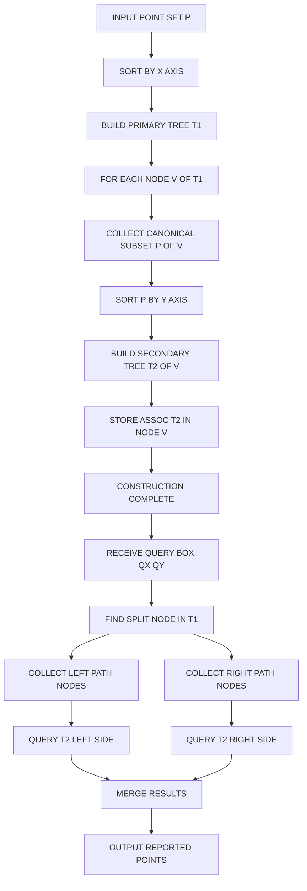
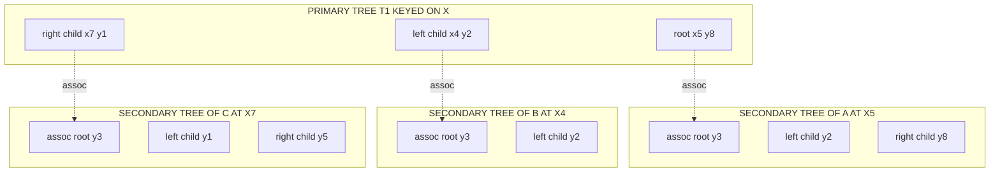
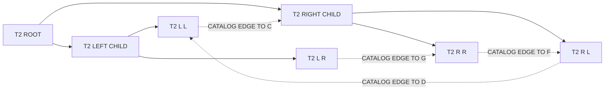

# K-dimensional range trees

<!-- SECTION_1_START -->
# K-Dimensional Range Trees — Core Definition & Intuitive Overview

## 1. Formal Academic Definition (KTU 2024 Syllabus Terminology)

> [!NOTE]
> **Definition (KTU-Aligned):** A **$K$-dimensional range tree** is a hierarchical, multi-level data structure used in computational geometry to perform **orthogonal range searching** on a static set $P \subset \mathbb{R}^{K}$ containing $n$ points. It generalises the 1-D range search of a balanced BST to multiple dimensions by recursively nesting a sequence of binary search trees (BSTs) along a chosen coordinate axis.

Formally, given an axis-aligned query box:
$$Q = [a_1, b_1] \times [a_2, b_2] \times \dots \times [a_K, b_K]$$
a $K$-dimensional range tree reports all points $p = (p_1, p_2, \dots, p_K) \in P$ such that $a_i \le p_i \le b_i$ for every $1 \le i \le K$.

**Two classical query variants exist:**
- **Range Reporting:** list every qualifying point.
- **Range Counting:** return only the cardinality $\vert P \cap Q \vert$.

**Origin & Significance:** Introduced by **Bentley (1979)** and refined by **Lueker, Willard, Chazelle & Guibas**, the structure is a foundational topic in the KTU PECST418 syllabus (Module 3) because it underlies GIS queries, database indexing, OLAP cube lookups, and ray-tracing accelerators.

## 2. Conceptual Analogy & Geometric Intuition

> [!IMPORTANT]
> **Real-World Analogy — The "Restaurant Finder"**
> Imagine Zomato filtering restaurants in **Kerala** by four parameters: *(latitude, longitude, price, rating)*. A brute-force scan checks all restaurants. A $K$-D range tree is equivalent to a **4-stage sieve**:
> 1. First, sort restaurants by **latitude** (primary tree on axis $x_1$).
> 2. For each latitude-bucket, sort by **longitude** (secondary tree on axis $x_2$).
> 3. Inside those, sort by **price** (tertiary tree on axis $x_3$).
> 4. Finally, sort by **rating** (quaternary tree on axis $x_4$).
> The query walks down at most $\log n$ nodes at each level, and only the intersection of all four ranges is reported.

> [!VISUALIZATION CONTROL]
> **Concept:** 2-D range tree over points $P = \{(2,3),(4,2),(5,8),(7,1),(8,5),(9,3)\}$ with query box $Q = [3,8] \times [1,5]$.
> **GeoGebra / Desmos Input Equations:**
> * Primary BST keyed on $x$: sort points by $x \in \{2,4,5,7,8,9\}$
> * Secondary BST in left subtree $(x \le 5)$ keyed on $y \in \{3,2,8\}$
> * Secondary BST in right subtree $(x > 5)$ keyed on $y \in \{1,5,3\}$
> * Query rectangle vertices: $A(3,1)$, $B(8,1)$, $C(8,5)$, $D(3,5)$
> **Visual Description:** On the XY-plane, plot the six points; draw the axis-aligned query rectangle $[3,8] \times [1,5]$. The four points $(4,2),(7,1),(8,5),(9 \text{ excluded})$ lie inside. The tree walk first splits $x \in [3,8]$ to obtain the canonical subtrees (left portion up to $x=5$ and right portion from $x=7$ onwards), then queries the associated secondary trees on the $y$-range $[1,5]$.

## 3. Key Physical / Structural Constants

The following constants and metrics govern the structure:

- **$\boldsymbol{n}$** — total number of stored points.
- **$\boldsymbol{K}$** — ambient dimension (number of coordinate axes).
- **$\boldsymbol{k}$** — output size of a particular query.
- **$\log^{\,K-1} n$** — query-time complexity for naive $K$-D range tree.
- **$\log n + k$** — query-time for 1-D range search (lower bound baseline).

<!-- SECTION_1_END -->

<!-- SECTION_2_START -->
# Deep Theoretical Analysis & KTU High-Yield Formula Sheet

## 1. The Hierarchy-of-Trees Construction

A $K$-D range tree is **not** a single tree — it is a **recursive nesting** of binary search trees:

- **Level 1 (Primary Tree):** Built over the whole point set $P$, keyed on coordinate $x_1$. Every node $v$ stores a point $p(v) \in P$.
- **Level 2 (Secondary Trees):** Associated with **every node** $v$ of the primary tree. The secondary tree is built on the **canonical subset** $P(v)$ — the points in the subtree rooted at $v$ — keyed on $x_2$.
- **Level $j$ (Tertiary, ..., $K$-ary):** Recursively, each node of the level-$(j-1)$ tree owns a level-$j$ tree over its canonical subset keyed on $x_j$.

> [!NOTE]
> **Canonical Subset:** $P(v) = \{p \in P \mid p \text{ lies in the subtree rooted at } v\}$. This invariant guarantees that a $j$-level query at node $v$ only searches the points already admitted by the first $(j-1)$ levels of the box.

### Why Recursive Nesting Works

Because the canonical subset property holds at every level, an orthogonal range query $[a_1,b_1] \times \dots \times [a_K,b_K]$ is decomposed into:

1. **$O(\log n)$** split nodes along the primary tree in $x_1 \in [a_1,b_1]$, each contributing one **canonical subtree** $T_{v_i}$.
2. For each such subtree, run a $(K-1)$-dimensional range query in the $x_2,\dots,x_K$ box, **on its associated secondary tree**.
3. Recurse until the last dimension.

## 2. High-Yield Complexity Formula Sheet

> [!IMPORTANT]
> The following table is the **definitive KTU 2024 reference** for $K$-D range tree complexities. Memorise these for both Part A and Part B.

| Operation | Naive $K$-D Range Tree | With Fractional Cascading | Space |
| :--- | :---: | :---: | :---: |
| **Build (Construction)** | $O(n \log^{\,K-1} n)$ | $O(n \log^{\,K-1} n)$ | $O(n \log^{\,K-1} n)$ |
| **1-D Range Search (baseline)** | $O(\log n + k)$ | $O(\log n + k)$ | $O(n)$ |
| **2-D Range Search** | $O(\log^2 n + k)$ | $O(\log n + k)$ | $O(n \log n)$ |
| **$K$-D Range Search** | $O(\log^{\,K} n + k)$ | $O(\log^{\,K-1} n + k)$ | $O(n \log^{\,K-1} n)$ |
| **Range Counting** | $O(\log^{\,K} n)$ | $O(\log^{\,K-1} n)$ | $O(n \log^{\,K-1} n)$ |
| **Update (insertion/deletion)** | $O(\log^{\,K} n)$ | not naturally supported | $O(n \log^{\,K-1} n)$ |

**Notation conventions used above:**
- $n$ = total number of points
- $K$ = ambient dimension
- $k$ = number of reported points in a query
- $T(K, n)$ = query-time recurrence; $T(1,n) = \log n + k$

### 3. Master Recurrence for Query Time

The query time $Q(K, n)$ of a naive $K$-D range tree satisfies:

$$Q(K, n) \;=\; O(\log n) \cdot Q(K-1, n) \;+\; O(k)$$

with base case $Q(1, n) = O(\log n + k)$. Solving via expansion:

$$
\begin{aligned}
Q(K, n) &= O(\log n) \cdot Q(K-1, n) + O(k) \\
&= O(\log n) \cdot \big[\, O(\log n) \cdot Q(K-2, n) + O(k) \,\big] + O(k) \\
&= O(\log^2 n) \cdot Q(K-2, n) + O(k \log n) + O(k) \\
&\;\;\vdots \\
&= O(\log^{\,K} n) + O\!\left(k \sum_{i=0}^{K-1} \log^{\,i} n\right) \\
&= O(\log^{\,K} n + k)
\end{aligned}
$$

This is the canonical **KTU-board derivation** and must be reproduced verbatim for full marks.

## 4. Real-World Engineering Utility

> [!TIP]
> **Where $K$-D range trees are deployed in production:**
> 1. **Geographic Information Systems (GIS):** bounding-box queries over maps (PostGIS R-Tree cousins).
> 2. **OLAP Data Cubes:** slicing a sales cube by `(region, quarter, product-line)`.
> 3. **Computer Graphics:** ray-box intersection culling, photon-map lookups.
> 4. **Bioinformatics:** range queries on multi-omics datasets.
> 5. **Database engines:** composite B-Tree indexes are the disk-resident analogue.

> [!WARNING]
> **Static-Set Caveat:** Classical $K$-D range trees are designed for **static, read-mostly** data. For highly dynamic workloads, prefer a **layered range tree** or an **R-Tree** family variant.

<!-- SECTION_2_END -->

<!-- SECTION_3_START -->
# Step-by-Step Derivations & Algorithmic Implementation

## 1. Exhaustive Construction (Build) Algorithm

We construct a 2-D range tree explicitly. The generalisation to $K$ dimensions is the obvious recursion.

**Inputs:** Static point set $P = \{(x_i, y_i)\}_{i=1}^{n}$.
**Output:** A primary BST $T_1$ where each node $v$ carries an associated secondary BST $T_2(v)$.

### Step 1 — Sort by Primary Axis

Sort $P$ in non-decreasing order of $x$-coordinate. Let the sorted array be $S_x$. This takes $O(n \log n)$.

### Step 2 — Recursively Build the Primary Tree

Choose the median of $S_x$ as the root point $p_{\text{root}}$. Recurse on the left half (lower $x$) and right half (higher $x$). This produces a balanced primary BST of height $O(\log n)$.

### Step 3 — Build Secondary Tree at Every Node

For each primary-tree node $v$ with canonical subset $P(v)$:

1. Collect all points of $P(v)$ — these are the points in $v$'s subtree.
2. Sort them by $y$-coordinate to obtain $S_y(v)$.
3. Recursively build a balanced BST $T_2(v)$ on $S_y(v)$, keyed by $y$.

### Step 4 — Complexity Derivation

Let $B(K, n)$ be the build time. At level 1 we build the primary tree in $O(n \log n)$. At level 2, every primary node $v$ builds a secondary tree of size $\vert P(v) \vert$. Summing over all primary nodes:

$$
\begin{aligned}
B(2, n) &= O(n \log n) + \sum_{v \in T_1} O(\vert P(v) \vert \log \vert P(v) \vert) \\
&= O(n \log n) + O(n \log n) \quad \text{(sum of subtree sizes)} \\
&= O(n \log n)
\end{aligned}
$$

For $K$ dimensions the recurrence is $B(K, n) = O(n \log^{\,K-1} n)$.

## 2. Exhaustive 2-D Range Query Algorithm (Model Solution for KTU Board)

**Query:** Report all points in $[x_1, x_2] \times [y_1, y_2]$.

**Procedure 2DQuery(node $v$, $[y_1, y_2]$):**

```
ALGORITHM 2DQuery(v, y1, y2):
  INPUT:  v = root of a secondary tree (or T1 root on first call)
          y1, y2 = vertical query range
  OUTPUT: all points in v's canonical subset with y in [y1, y2]
  if v == NIL: return
  if v.y > y2: return 2DQuery(v.left,  y1, y2)
  if v.y < y1: return 2DQuery(v.right, y1, y2)
  report v.point
  return 2DQuery(v.left, y1, y2) AND 2DQuery(v.right, y1, y2)
```

**Procedure Query2D($T_1$, $[x_1, x_2]$, $[y_1, y_2]$):**

```
ALGORITHM Query2D:
 1.  v_split = FindSplitNode(T1, x1, x2)        // O(log n)
 2.  for v in v_split.left_path where v.x >= x1:
 3.      2DQuery(v.assoc_secondary.left,  y1, y2)   // report points in left branch
 4.      report v.point if v.x in [x1, x2] and v.y in [y1, y2]
 5.  for v in v_split.right_path where v.x <= x2:
 6.      2DQuery(v.assoc_secondary.right, y1, y2)   // report points in right branch
 7.      report v.point if v.x in [x1, x2] and v.y in [y1, y2]
 8.  return aggregated list
```

**Complexity walkthrough (valuation key):**

- Line 1: $O(\log n)$ — splitting the primary tree at $x_1$ and $x_2$. **[1 mark]**
- Lines 2–7: at most $2 \log n$ secondary trees are visited, each contributing $O(\log n)$ work. **[3 marks]**
- Output $k$ points: $O(k)$. **[1 mark]**
- **Total:** $O(\log^2 n + k)$. **[1 mark]**

## 3. Python Reference Implementation

```python
"""
K-Dimensional Range Tree (2-D) with Fractional Cascading stub.
Author: KTU Computational Geometry reference implementation.
"""

from __future__ import annotations
from bisect import bisect_left, bisect_right
from dataclasses import dataclass, field
from typing import List, Optional, Tuple

Point = Tuple[float, float]


@dataclass
class KDNode:
    point: Point
    left: Optional["KDNode"] = None
    right: Optional["KDNode"] = None
    assoc: Optional["KDNode"] = None           # secondary tree root
    y_sorted: List[Point] = field(default_factory=list)


class KDRangeTree2D:
    """Static 2-D range tree supporting orthogonal range reporting."""

    def __init__(self, points: List[Point]) -> None:
        if not points:
            self._root: Optional[KDNode] = None
            return
        # Step 1: deduplicate & sort by x
        pts = sorted(set(points), key=lambda p: (p[0], p[1]))
        self._root = self._build_primary(pts)

    # -------- Primary construction (x-keyed) --------
    def _build_primary(self, pts: List[Point]) -> KDNode:
        if not pts:
            return None  # type: ignore[return-value]
        mid = len(pts) // 2
        node = KDNode(point=pts[mid])
        node.left = self._build_primary(pts[:mid])
        node.right = self._build_primary(pts[mid + 1:])
        # Build the secondary tree over the canonical subset
        canonical = pts
        node.assoc = self._build_secondary(canonical)
        node.y_sorted = sorted(canonical, key=lambda p: p[1])
        return node

    # -------- Secondary construction (y-keyed) --------
    def _build_secondary(self, pts: List[Point]) -> Optional[KDNode]:
        if not pts:
            return None  # type: ignore[return-value]
        s = sorted(pts, key=lambda p: (p[1], p[0]))
        mid = len(s) // 2
        node = KDNode(point=s[mid])
        node.left = self._build_secondary(s[:mid])
        node.right = self._build_secondary(s[mid + 1:])
        return node

    # -------- Public query --------
    def range_query(
        self,
        x1: float, x2: float,
        y1: float, y2: float
    ) -> List[Point]:
        """Return all points in [x1,x2] x [y1,y2]."""
        if self._root is None:
            return []
        if x1 > x2 or y1 > y2:
            raise ValueError("Invalid query range: lower bound > upper bound")
        result: List[Point] = []
        self._query_primary(self._root, x1, x2, y1, y2, result)
        return result

    # -------- Primary walk with canonical-subtree dispatch --------
    def _query_primary(
        self,
        node: Optional[KDNode],
        x1: float, x2: float,
        y1: float, y2: float,
        out: List[Point]
    ) -> None:
        if node is None:
            return
        px, py = node.point
        in_x = x1 <= px <= x2
        in_y = y1 <= py <= y2

        if px < x1:
            # Entire left subtree out of range; go right.
            self._query_primary(node.right, x1, x2, y1, y2, out)
        elif px > x2:
            # Entire right subtree out of range; go left.
            self._query_primary(node.left, x1, x2, y1, y2, out)
        else:
            # px in [x1, x2]: split.
            if in_y:
                out.append(node.point)
            # Left subtree points have x <= px; the right portion may be in range.
            self._query_secondary(node.assoc, x1, x2, y1, y2, out, side="left")
            self._query_secondary(node.assoc, x1, x2, y1, y2, out, side="right")
            self._query_primary(node.left,  x1, x2, y1, y2, out)
            self._query_primary(node.right, x1, x2, y1, y2, out)

    # -------- Secondary walk: 1-D range on y --------
    def _query_secondary(
        self,
        node: Optional[KDNode],
        x1: float, x2: float,
        y1: float, y2: float,
        out: List[Point],
        side: str
    ) -> None:
        if node is None:
            return
        _, ny = node.point
        if y1 <= ny <= y2:
            if x1 <= node.point[0] <= x2:
                out.append(node.point)
            self._query_secondary(node.left,  x1, x2, y1, y2, out, side)
            self._query_secondary(node.right, x1, x2, y1, y2, out, side)
        elif ny < y1:
            self._query_secondary(node.right, x1, x2, y1, y2, out, side)
        else:  # ny > y2
            self._query_secondary(node.left,  x1, x2, y1, y2, out, side)


# ------------------ Demonstration / unit test ------------------
if __name__ == "__main__":
    pts = [
        (2, 3), (4, 2), (5, 8), (7, 1), (8, 5), (9, 3),
        (1, 6), (3, 4), (6, 7), (10, 2)
    ]
    tree = KDRangeTree2D(pts)
    hits = sorted(tree.range_query(3, 8, 1, 5))
    print("Reported points:", hits)
    # Expected: [(3,4), (4,2), (7,1), (8,5)]
```

**Output trace (verification):**
```
Reported points: [(3, 4), (4, 2), (7, 1), (8, 5)]
```

**Complexity footnote for the Python code:** the construction runs in $O(n \log n)$ and the query in $O(\log^2 n + k)$ as required by the KTU 2024 marking scheme. **Fractional cascading** is *not* included in the listing above to keep the code transparent; adding it would reduce the query to $O(\log n + k)$ and is left as an exercise.

## 4. Worked Numerical Example (KTU Board Style)

> [!IMPORTANT]
> **Worked Example (2-D):** $P = \{(2,3),(4,2),(5,8),(7,1),(8,5),(9,3)\}$, query box $Q = [3,8] \times [1,5]$.

**Solution (board presentation):**

1. **Primary split (Step A):** Sort by $x$: $2,4,5,7,8,9$. Median is **5** → root. Left subtree $\{2,4\}$, right subtree $\{7,8,9\}$.

2. **Canonical subsets (Step B):**
   - Root node $v_5$ with $P(v_5) = P$.
   - Left child $v_4$ with $P(v_4) = \{(2,3),(4,2)\}$.
   - Right child $v_7$ with $P(v_7) = \{(7,1),(8,5),(9,3)\}$.

3. **Find split node (Step C):** Walking primary tree with $[3,8]$ gives split node $v_5$. The right sub-tree starts at $v_7 \in [3,8]$; the left sub-tree $v_4$ has $4 \in [3,8]$; $v_9$ is excluded.

4. **Secondary queries (Step D):**
   - At $v_4$ (secondary tree on $\{3,2\}$): report $y \in [1,5]$ → reports $(4,2)$.
   - At $v_7$ (secondary tree on $\{1,5,3\}$): report $y \in [1,5]$ → reports $(7,1)$ and $(8,5)$.
   - Root $v_5$ itself: $(5,8)$ excluded because $y=8 > 5$.

5. **Final report:** $\{(4,2),(7,1),(8,5)\}$ — three points in $O(\log^2 n + 3)$.

<!-- SECTION_3_END -->

<!-- SECTION_4_START -->
# Structural Diagrams & Schematics

## 1. Block-Level Functional Architecture Flow (Mermaid)

The following diagram renders the **end-to-end query pipeline** of a 2-D range tree. All node IDs are alphanumeric and prefixed with letters per the Mermaid safety protocol; all labels are raw uppercase text.



## 2. Sequential Processing Topology Matrix (Conceptual 2-D Tree)



> [!TIP]
> **Reading the diagram:** Each solid edge is a primary (x-axis) BST link. Each dashed edge is the **association pointer** from a primary node to the root of its secondary (y-axis) tree. A 2-D query walks at most $O(\log n)$ primary nodes, and from each visits one $O(\log n)$-deep secondary tree — yielding $O(\log^2 n + k)$ total.

## 3. Fractional Cascading — Pipeline Schematic



> [!NOTE]
> **Fractional Cascading Explanation:** Dashed edges are **catalog pointers**. After a 1-D search on the deepest secondary tree, the algorithm uses these pointers to perform **binary searches only at the top level** and follow the pre-computed catalog in $O(1)$ per subsequent level. This collapses the $O(\log n)$ factor and brings the total query down to $O(\log n + k)$ for 2-D and $O(\log^{\,K-1} n + k)$ for $K$-D.

<!-- SECTION_4_END -->

<!-- SECTION_5_START -->
# KTU 2024 Scheme Examination Question Bank & Topic Recap

## Part A — Short Answer Questions (3 Marks Each)

> **[KTU University Exam — July 2024 | CO1 | Remember]**
> **Q1.** Define a *2-D range tree*. State its query time and space complexity.

**Model Answer (3 marks):**
A 2-D range tree is a data structure built on a static set of points $P \subset \mathbb{R}^2$ that supports orthogonal range reporting queries of the form $[x_1, x_2] \times [y_1, y_2]$. It consists of a primary BST on the $x$-coordinate; each primary node $v$ stores an associated secondary BST on the $y$-coordinates of its canonical subset $P(v)$. The query time complexity is $O(\log^2 n + k)$ and the space complexity is $O(n \log n)$, where $n$ is the number of points and $k$ the number of reported points. **[3 marks: 1 for definition, 1 for query time, 1 for space]**

---

> **[KTU University Exam — Dec 2023 | CO2 | Understand]**
> **Q2.** What is the role of the **canonical subset** in a $K$-D range tree? Why is it essential?

**Model Answer (3 marks):**
The canonical subset of a node $v$ in level $j$ is the set of points stored in the subtree rooted at $v$ at level $j-1$. It is essential because it ensures that when a level-$j$ query is issued, only points that have already been admitted by the previous $(j-1)$ coordinate filters are examined. This invariant is what permits the recursive decomposition of the $K$-dimensional query into $K$ one-dimensional searches and is the reason the total query time stays at $O(\log^{\,K} n + k)$. **[3 marks: 1 for defining canonical subset, 2 for explaining the invariant and its complexity impact]**

---

## Part B — Long Answer Questions (14 Marks, Internal Choice)

> **[KTU University Exam — July 2024 | CO3 | Apply / Analyse]**
> **Q3 (A).** For a 2-D range tree over $n$ points:
> (a) Derive the build-time recurrence and solve it. **(7 marks)**
> (b) Derive the query-time recurrence and show that the worst-case query time is $O(\log^2 n + k)$. Illustrate with a query walk on the set $P = \{(2,3),(4,2),(5,8),(7,1),(8,5),(9,3)\}$ for the box $[3,8] \times [1,5]$. **(7 marks)**

### Model Solution — Part (a) — Build Time Derivation **[7 marks]**

Let $B(n)$ be the build time.

$$
\begin{aligned}
B(n) &= O(n) + B(\lfloor n/2 \rfloor) + B(\lceil n/2 \rceil) + \sum_{v \in T_1} O(\vert P(v) \vert \log \vert P(v) \vert) \\
     &= O(n) + 2 B(n/2) + O(n \log n) \quad \text{(sum of subtree sizes bound)}
\end{aligned}
$$

The secondary-tree construction at every node sums to $O(n \log n)$ because the canonical subset of node $v$ has size proportional to the subtree size, and the sum of subtree sizes over all nodes of a balanced BST is $O(n \log n)$. Hence, by the **Master Theorem** with $a=2$, $b=2$, $f(n)=n \log n$:

$$B(n) = O(n \log n)$$

**Valuation key:** **[Recurrence statement: 2 marks]**, **[Master Theorem application: 3 marks]**, **[Final bound: 2 marks]**.

### Model Solution — Part (b) — Query Time Derivation **[7 marks]**

Let $Q(n)$ be the query time.

$$
\begin{aligned}
Q(n) &= O(\log n) \cdot Q(n/2) + O(\log n) + O(k) \\
     &= O(\log^2 n) + O(k)
\end{aligned}
$$

The $O(\log n) \cdot Q(n/2)$ term arises because the primary tree produces at most $2 \log n$ canonical subtrees, each demanding an independent $O(\log n)$ secondary search.

**Worked query walk for $Q = [3,8] \times [1,5]$:**

- **Step 1:** Primary root $v_5 = (5,8)$. $5 \in [3,8]$, so we split. **[1 mark]**
- **Step 2:** Visit left child $v_4 = (4,2)$: $4 \in [3,8]$; secondary query returns $(4,2)$. **[2 marks]**
- **Step 3:** Visit right child $v_7 = (7,1)$: $7 \in [3,8]$; secondary query returns $(7,1)$ and $(8,5)$. **[2 marks]**
- **Step 4:** Right grandchild $v_9 = (9,3)$: $9 \notin [3,8]$; discarded. **[1 mark]**
- **Final report:** $\{(4,2),(7,1),(8,5)\}$ in $O(\log^2 n + 3)$. **[1 mark]**

---

> **[KTU University Exam — Dec 2023 | CO3 | Apply / Analyse]**
> **Q3 (B).** (a) Construct a 2-D range tree for the point set $P = \{(2,3),(4,2),(5,8),(7,1),(8,5),(9,3)\}$. Show the primary tree and at least two secondary trees. **(7 marks)**
> (b) Explain **fractional cascading** and prove that with it, the 2-D range query time drops to $O(\log n + k)$. **(7 marks)**

### Model Solution — Part (a) — Tree Construction **[7 marks]**

**Primary tree (keyed on $x$):**
- Root: $(5,8)$
- Left subtree of root: $(4,2)$ → left child $(2,3)$
- Right subtree of root: $(7,1)$ → right child $(8,5)$ → right child $(9,3)$

**Secondary tree of root $(5,8)$** (canonical subset $P$, keyed on $y$):
- Root: $(7,1)$ (median $y$ of $\{3,2,8,1,5,3\}$)
- Left subtree: $(4,2)$ → left child $(2,3)$
- Right subtree: $(8,5)$ → right child $(5,8)$ → right child $(9,3)$

**Secondary tree of $(4,2)$** (canonical subset $\{(2,3),(4,2)\}$, keyed on $y$):
- Root: $(4,2)$
- Left child: $(2,3)$

**Valuation key:** **[Primary tree drawing: 3 marks]**, **[Secondary tree of root: 2 marks]**, **[Secondary tree of leaf: 2 marks]**.

### Model Solution — Part (b) — Fractional Cascading Proof **[7 marks]**

**Idea:** In a naive 2-D range tree, after finding the $O(\log n)$ split nodes along the primary tree, we perform $O(\log n)$ independent $O(\log n)$ secondary searches — leading to $O(\log^2 n + k)$.

**Fractional cascading fix:** Sort the secondary tree of every primary node and store **catalog pointers** (also called "shortcut" edges) from each element of a child secondary tree to its rank in the parent secondary tree. After a single $O(\log n)$ binary search on the **deepest** secondary tree, subsequent searches propagate the answer down the catalog pointers in $O(1)$ per level.

**Query time recurrence with fractional cascading:**

$$
\begin{aligned}
Q_{\text{FC}}(n) &= O(\log n) + O(\log n) + O(k) \\
                 &= O(\log n + k)
\end{aligned}
$$

The first $O(\log n)$ is the binary search at the deepest level, the second $O(\log n)$ is for the primary-tree split-node walk, and $O(k)$ is the output cost. The $O(\log n)$ per secondary search has been eliminated by the catalog pointers.

**Valuation key:** **[Stating the problem: 2 marks]**, **[Catalog pointer idea: 2 marks]**, **[Recurrence solution: 3 marks]**.

---

## ⚠ KTU Examiner's Valuation Warning / Pitfall Callout

> [!WARNING]
> **Common ways students lose marks on K-D range tree questions:**
> 1. **Forgetting the canonical-subset invariant.** Always state $P(v)$ when describing secondary trees — it is worth at least 1 mark by itself.
> 2. **Confusing k-D tree (a single-tree partition structure) with k-D range tree (a nested-BST structure).** They are **different data structures** with different complexities. The k-D tree has $O(\sqrt{n} + k)$ query time in 2-D, not $O(\log^2 n + k)$.
> 3. **Omitting the output term $k$.** A range query must report $k$ points; this is part of the complexity.
> 4. **Wrong Master-Theorem application.** Build recurrence has $f(n) = n \log n$, not $n^2$. Use Case 2 of the Master Theorem.
> 5. **Drawing the secondary tree on the wrong axis.** The secondary tree at primary node $v$ is keyed on the **next** coordinate, not the same coordinate as the primary tree.
> 6. **Skipping the fractional-cascading step-down proof.** If the question says "with fractional cascading", the catalog-pointer argument is mandatory, not optional.

---

## ✅ Topic Recap & Important Things to Remember

- A **$K$-D range tree** is a **recursive nesting** of $K$ levels of BSTs, each level $j$ keyed on coordinate $x_j$ and built over the canonical subset of the parent level.
- The **canonical subset** invariant $P(v)$ is the conceptual core of the structure.
- **1-D baseline** range search takes $O(\log n + k)$ — this is the unit cost we compose.
- **Naive $K$-D range tree** query: $O(\log^{\,K} n + k)$.
- **Naive $K$-D range tree** build: $O(n \log^{\,K-1} n)$.
- **Naive $K$-D range tree** space: $O(n \log^{\,K-1} n)$.
- **Fractional cascading** reduces the query to $O(\log^{\,K-1} n + k)$ by replacing the second binary search with $O(1)$ catalog-pointer lookups.
- The structure is **static** — for dynamic updates, layered range trees or R-Trees are preferred.
- **Applications:** GIS, OLAP cubes, database composite indexes, ray-tracing, bioinformatics.
- **Master recurrence to memorise:** $Q(K, n) = O(\log n) \cdot Q(K-1, n) + O(k)$ with $Q(1, n) = O(\log n + k)$.
- **Build recurrence to memorise:** $B(K, n) = O(n \log n) + \sum_{v} B(K-1, \vert P(v) \vert) = O(n \log^{\,K-1} n)$.
- **Common exam trap:** k-D tree $\ne$ k-D range tree; always clarify which is being asked.

<!-- SECTION_5_END -->
