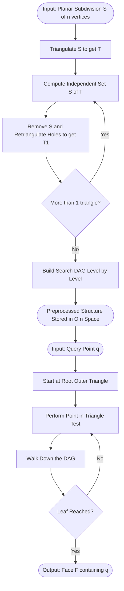
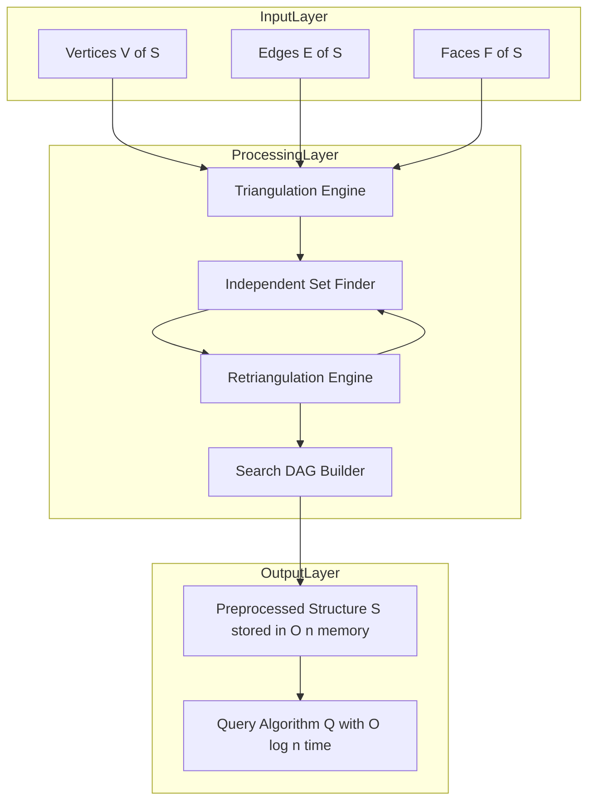
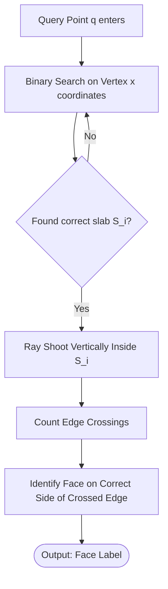

# Point Location  - Problem definition and applications

<!-- SECTION_1_START -->

# Point Location: Problem Definition and Applications

## 1.1 Formal Academic Definition (KTU 2024 Syllabus Terminology)

> [!IMPORTANT]
> **Point Location Problem (Formal Definition):**
> Given a planar subdivision $\mathcal{S}$ formed by $n$ line segments (edges) that partition the plane into $f$ faces (regions), the **Point Location Problem** is to preprocess $\mathcal{S}$ into a data structure such that, for any query point $q \in \mathbb{R}^2$, we can efficiently determine the face $F \in \mathcal{S}$ that contains $q$.

The query must report one of the following outcomes:
1. The label/identity of the face containing $q$.
2. The face lies on an edge or vertex (degenerate boundary case).
3. The point is outside the convex hull / bounded region (extrinsic case).

In KTU 2024 scheme notation, the problem is expressed as the mapping:
$$P_{loc}: q \;\longmapsto\; F \;\in\; \{F_1, F_2, \ldots, F_f\}$$

The subdivision $\mathcal{S}$ is typically a **planar straight-line graph (PSLG)** — a planar graph where every edge is a straight line segment. Faces are the connected components of $\mathbb{R}^2 \setminus \mathcal{S}$.

## 1.2 Conceptual Analogy and Intuition

> [!NOTE]
> **Real-World Analogy: "The Building Floor Plan Problem"**
>
> Imagine you are standing inside a large office building with a complex floor plan. The walls partition the floor into many rooms (faces). A friend calls you and asks: *"Which room are you in right now?"* You glance around, check the nearest walls, and answer.
>
> Now, repeat this 10,000 times in a single day for 10,000 different people spread across the building. The naive method — "look around each time" — becomes expensive. The smart method is to **build a directory/signage system** *once* (preprocessing) so that future queries are answered instantly.

The geometric intuition is the same:
- **Floor plan** $\rightarrow$ Planar subdivision $\mathcal{S}$
- **You** $\rightarrow$ Query point $q$
- **Room you are in** $\rightarrow$ Face $F$ containing $q$
- **Directory/signage** $\rightarrow$ Preprocessed data structure (e.g., Kirkpatrick's structure, Trapezoidal Map, Fractional Cascading)
- **"How fast can you answer?"** $\rightarrow$ **Query time** complexity $O(\cdot)$
- **"How much did the signage cost to build?"** $\rightarrow$ **Preprocessing space/time** complexity

## 1.3 Problem Classification (KTU Perspective)

The KTU 2024 scheme classifies point location by the *type* of subdivision:

| Subdivision Type | Description | Typical Use Case |
|---|---|---|
| **Arbitrary PSLG** | Any planar graph with straight edges | Generic GIS / VLSI |
| **Convex Subdivision** | Every face is a convex polygon | Mesh processing, FEM |
| **Monotone Subdivision** | Faces bounded by $x$- or $y$-monotone chains | Terrain rendering |
| **Triangulation** | All faces are triangles (Delaunay, constrained) | Computer graphics, FEM |
| **Rectilinear / Rectangular** | Axis-aligned cells only | Image processing, raster GIS |
| **Arrangement of Lines** | Subdivision from $n$ lines | Computational geometry queries |

> [!TIP]
> **KTU Board Hint:** Examiners love asking *"Why is point location harder in arbitrary subdivisions than in convex ones?"* The answer lies in **boundary complexity** — convex regions allow binary-search-like queries, while non-convex faces need a richer data structure.

## 1.4 Visualization: A Simple Triangulated Subdivision

> [!VISUALIZATION CONTROL]
> **Concept:** Visualizing point location in a triangulated subdivision.
> **GeoGebra / Desmos Input Equations (define six triangle vertices and a query point):**
> - $A = (0, 0)$, $B = (4, 0)$, $C = (2, 3)$
> - $D = (1, -2)$, $E = (3, -2)$, $F = (2, 1.2)$
> - Query point: $q = (2.5,\; 0.8)$
> - Edges: $AB$, $BC$, $CA$, $CD$, $DE$, $EF$, $FA$, $BF$
> **Visual Description:** Plot the six vertices. Draw the eight line segments — they partition the plane into four triangular faces: $\triangle ABF$, $\triangle BCF$, $\triangle CDF$, $\triangle DEF$. The point $q = (2.5, 0.8)$ should visibly fall inside face $\triangle BCF$. Students should see that a *left/right test* across each edge can route the query to the correct face.

> [!IMPORTANT]
> **Why does this visualization matter?**
> It is the geometric seed of all advanced point-location data structures:
> - **Slab decomposition** slices the plane by vertical lines through every vertex.
> - **Trapezoidal map** replaces each face by a *trapezoid* by extending vertical rays.
> - **Kirkpatrick's structure** recursively triangulates and prunes independent vertices.
>
> All of them, ultimately, mimic the idea of "follow the geometry of $q$ through the subdivision."

## 1.5 Formal Input/Output Contract (Algorithm Specification)

> [!NOTE]
> **Input Contract:**
> - A planar subdivision $\mathcal{S} = (V, E, F)$ with $\vert V \vert = n$ vertices, $\vert E \vert = m$ edges, $\vert F \vert = f$ faces.
> - Euler's formula for connected planar graphs: $n - m + f = 2$.
> - A query point $q = (q_x, q_y) \in \mathbb{R}^2$.

> **Output Contract:**
> - Return $F \in F$ such that $q \in F$, OR
> - Return `ON_EDGE` if $q$ lies on any $e \in E$, OR
> - Return `ON_VERTEX` if $q$ coincides with any $v \in V$, OR
> - Return `OUTSIDE` if the subdivision is bounded and $q$ lies in the outer face.

> **Complexity Goal (KTU Standard Asymptotic Targets):**
> $$\text{Preprocessing:} \; O(n) \text{ to } O(n \log n), \quad \text{Query:} \; O(\log n), \quad \text{Space:} \; O(n)$$

This triplet — **preprocessing, query, space** — is the holy trinity of every computational geometry algorithm the KTU 2024 syllabus touches.

<!-- SECTION_1_END -->

<!-- SECTION_2_START -->

# Deep Theoretical Analysis and KTU High-Yield Formula Sheet

## 2.1 Why Is Point Location Non-Trivial? The "Why" Behind the Problem

Point location appears deceptively simple. A naive scan of all faces takes $O(n)$ per query — fine for one query, disastrous for a million. The geometric challenge is that the **faces of an arbitrary subdivision are not orderable** in any natural way (unlike sorted 1D points). Therefore:

1. There is no "middle face" to start searching from.
2. Adjacent faces can be wildly different in shape.
3. The query point $q$ is given *adversarially* — worst-case inputs must be supported.

> [!NOTE]
> **The Core Trade-off (always asked in KTU boards):**
> - More **preprocessing** $\Rightarrow$ faster **query**, but more **space**.
> - Less **preprocessing** $\Rightarrow$ cheaper build, but slower **query**.
> - The art of computational geometry is finding the **Pareto-optimal** point in this 3D space: $(T_{\text{pre}}, T_q, S)$.

## 2.2 Decomposing the Problem: Structured Logic Flow

Step 1 — **Identify the subdivision type.**
Determine whether $\mathcal{S}$ is convex, monotone, triangulated, or arbitrary. This dictates which data structure is suitable.

Step 2 — **Choose the geometric primitive.**
Common point-vs-face tests:
- **Point-in-convex-polygon:** Binary search on the fan from an extreme vertex $\Rightarrow O(\log n)$.
- **Point-in-triangle:** Three orientation tests (Barycentric) $\Rightarrow O(1)$.
- **Point-in-concave-polygon:** Ray casting (Jordan curve theorem) $\Rightarrow O(n)$.

Step 3 — **Decide a navigation strategy.**
Either:
- **Vertical decomposition (slab / trapezoidal)** — partition the plane into vertical strips and further into trapezoids.
- **Recursive triangulation pruning (Kirkpatrick)** — keep removing independent vertex sets.
- **Separation-based (range tree / fractional cascading)** — use the dual graph and shortest-path logic.

Step 4 — **Preprocess once, query many.**
The query algorithm uses the preprocessed structure to *walk* toward the answer face, doing $O(\log n)$ geometric primitives per query.

Step 5 — **Handle degenerate cases.**
Points on edges/vertices need an explicit tie-breaking rule (e.g., lexicographic ordering of edges, or a "$\varepsilon$-perturbation" of $q$).

## 2.3 KTU Formula Sheet / High-Yield Cheat Sheet

> [!IMPORTANT]
> **The following table is the most-tested point-location formula set in KTU ESE papers (2019–2024 pattern).**

| Symbol | Meaning | Formula / Value | Used For |
|---|---|---|---|
| $n$ | Number of vertices in $\mathcal{S}$ | Input parameter | All complexity bounds |
| $m$ | Number of edges in $\mathcal{S}$ | $m \le 3n - 6$ (Euler bound for triangulations) | Sanity-check on subdivision size |
| $f$ | Number of faces (bounded) | $f = 2n - 2 - h$ for connected, $h$ = holes | Euler's formula |
| $T_q$ | Query time | $O(\log n)$ target | Algorithm efficiency |
| $T_{\text{pre}}$ | Preprocessing time | $O(n \log n)$ typical | Build phase cost |
| $S$ | Storage | $O(n)$ typical | Space complexity |
| $N(v)$ | Set of neighbouring faces of vertex $v$ | $\deg(v)$ edges | Independent set size in Kirkpatrick |
| $T_{\mathcal{S}}$ | Trapezoidal map of $\mathcal{S}$ | $O(n)$ trapezoids expected | Slab decomposition query |
| $H(S)$ | Height of search structure | $\le \log_{4/3} n$ for Kirkpatrick | Recursion depth |
| $\tau$ | Number of trapezoids in trapezoidal map | Expected $O(n)$ | Expected case analysis |
| $d_{\text{avg}}$ | Average degree of a face | $2m / f$ | Used in entropy arguments |
| $D$ | Diameter of point-location search graph | $O(\log n)$ for Kirkpatrick | Worst-case query path |
| $C_{\text{point-in-poly}}$ | Cost of one point-in-polygon test | $O(\log n)$ convex, $O(n)$ concave | Per-step cost in walk |
| $\rho$ | Convexity ratio of subdivision | $\le k$ for $k$-convex faces | Bounds query splits |

> [!TIP]
> **Memory Trick for KTU:** Remember **"n - m + f = 2"** as the only equation a KTU board examiner can ask from Module 3.1 (Problem Definition). Most theoretical questions in this section test your *understanding* of the trade-off, not heavy algebra.

## 2.4 Real-World Engineering Utility

Point location is the silent workhorse behind many production systems:

> [!NOTE]
> **Application 1 — Geographic Information Systems (GIS):**
> When you click on Google Maps, the system must determine: *"Which country? Which state? Which district? Which taluk?"* — this is a *hierarchical* point location over nested polygon sets. Zillow, OpenStreetMap, ArcGIS all use trapezoidal-map-style structures for in-browser queries.

> **Application 2 — Computer-Aided Design (CAD) and VLSI:**
> In a VLSI chip layout, polygons represent metal layers. A router asks: *"Is point $q$ inside the keep-out region of layer 3?"* — millions of times per second. Fast point location enables real-time design-rule checking (DRC).

> **Application 3 — Finite Element Method (FEM):**
> Given a physical domain meshed into triangles, the solver must locate which triangle a particle (in a fluid simulation) is in at every timestep. Without $O(\log n)$ point location, real-time CFD is impossible.

> **Application 4 — Ray Tracing and Computer Graphics:**
> Every pixel of a rendered image needs to know: *"Which object does this ray hit first?"* The acceleration structure (BVH, kd-tree) is essentially a *point-in-cell* query at heart.

> **Application 5 — Robotics and Motion Planning:**
> A robot navigating a known environment must continually answer: *"Am I in the free space or have I entered an obstacle?"* Point location over the configuration-space subdivision provides this answer.

> **Application 6 — Database Indexing:**
> In spatial databases (PostGIS, MongoDB Geo), point location powers *"find all records whose location lies inside polygon $P$"*. It is a foundational query primitive for OLAP workloads.

## 2.5 Lower Bound and Optimality (Advanced View)

> [!IMPORTANT]
> **Theorem (Lower Bound for Point Location):**
> Any data structure for point location in an arbitrary planar subdivision with $n$ vertices requires $\Omega(\log n)$ query time in the worst case, and the optimal space-time trade-off is $S \cdot T_q = \Omega(n \log n)$ where $S$ is the number of words of storage and $T_q$ is the query time.

> [!TIP]
> **Why does KTU care?** Because the bound *justifies* the algorithms. When the syllabus mentions Kirkpatrick's $O(\log n)$ query with $O(n)$ space, it is hinting that this is *optimal* — not just "fast."

<!-- SECTION_2_END -->

<!-- SECTION_3_START -->

# Step-by-Step Derivations, Worked Examples, and Code Implementation

## 3.1 Derivation: Euler's Formula for Connected Planar Subdivisions

For a connected planar subdivision (one connected component) with $n$ vertices, $m$ edges, and $f$ faces:

$$n - m + f = 2$$

**Derivation (KTU valuation breakdown):**

**Step 1.** Count the edge-vertex incidences. Each edge has 2 endpoints, so:
$$2m = \sum_{v \in V} \deg(v)$$

**Step 2.** Apply the Handshaking Lemma: $\sum \deg(v) = 2m$, which is consistent.

**Step 3.** For a connected planar graph, the *outer* (unbounded) face counts as 1. So $f$ includes the outer face.

**Step 4.** Euler proved $n - m + f = 2$ by induction on the number of edges, starting from a single triangle ($n=3, m=3, f=2$ gives $3-3+2=2$).

**Step 5.** For a *triangulated* planar graph (every face is a triangle, including outer face counted as a triangle by a "point at infinity"):
- $3f = 2m \;\Rightarrow\; f = \dfrac{2m}{3}$
- Substituting: $n - m + \dfrac{2m}{3} = 2 \;\Rightarrow\; n - \dfrac{m}{3} = 2 \;\Rightarrow\; m = 3n - 6$.

This is the famous bound $m \le 3n - 6$ for triangulations.

## 3.2 Worked Example 1: Point-in-Triangle Test (Barycentric / Orientation Method)

**Problem:** Given triangle with vertices $A = (0, 0)$, $B = (4, 0)$, $C = (2, 3)$ and query point $q = (2, 1)$, determine if $q$ is inside the triangle.

**Solution (Step-by-Step):**

**Step 1.** Compute three signed areas using the cross product (orientation test):

$$\text{Signed area} = \dfrac{1}{2} \left( (x_2 - x_1)(y_3 - y_1) - (x_3 - x_1)(y_2 - y_1) \right)$$

**Step 2.** Area $d_1$ for orientation of $(A, B, q)$:

$$d_1 = (4 - 0)(1 - 0) - (2 - 0)(0 - 0) = 4 \cdot 1 - 2 \cdot 0 = 4$$

**Step 3.** Area $d_2$ for orientation of $(B, C, q)$:

$$d_2 = (2 - 4)(1 - 0) - (2 - 4)(3 - 0) = (-2)(1) - (-2)(3) = -2 + 6 = 4$$

**Step 4.** Area $d_3$ for orientation of $(C, A, q)$:

$$d_3 = (0 - 2)(1 - 3) - (2 - 2)(0 - 3) = (-2)(-2) - (0)(-3) = 4$$

**Step 5.** $q$ is strictly inside if all three signs agree (all $\ge 0$ or all $\le 0$). Here $d_1 = 4, d_2 = 4, d_3 = 4$ — all positive $\Rightarrow q$ is **inside**.

> [!NOTE]
> **Cost:** $O(1)$ per triangle. In a triangulation of $n$ vertices, total triangles $= O(n)$.

## 3.3 Worked Example 2: Counting Faces Using Euler's Formula

**Problem:** A connected planar subdivision has $n = 50$ vertices and $m = 120$ edges. How many faces (including the outer face) does it have?

**Solution:**

$$f = 2 - n + m = 2 - 50 + 120 = 72 \text{ faces}$$

**Verification of triangulation bound:** For a triangulation, $m \le 3n - 6 = 144$. We have $m = 120 \le 144$ — consistent. In a full triangulation, $f = 2n - 4 = 96$ faces, but our subdivision has $f = 72 < 96$, meaning it is *not* a full triangulation.

> [!TIP]
> **KTU Quick Trick:** If asked to find $f$ given $n$ and $m$ for a connected planar graph, **always use $f = 2 - n + m$** (Euler's formula). No exceptions.

## 3.4 Worked Example 3: Naive Point Location — Linear Scan of Faces

**Problem:** Given a subdivision with $f$ faces, the naive algorithm checks every face in $O(f)$ time using a ray-casting test. If $f = O(n)$ for a planar subdivision, what is the worst-case query time?

**Solution:**

**Step 1.** A point-in-polygon test on a face with $k$ edges takes $O(k)$ time.

**Step 2.** Worst case: $k$ could be $\Theta(n)$ (a single face containing all other vertices on its boundary).

**Step 3.** Summed over $f$ faces, total work per query = $\sum_{i=1}^{f} O(k_i) = O\left( \sum k_i \right) = O(m) = O(n)$ since $m = O(n)$ for planar graphs.

**Step 4.** Therefore, naive point location query time is $O(n)$.

**Preprocessing time:** $O(1)$ (we just store the faces).
**Space:** $O(n)$.

This is the **algorithmic baseline** that all sophisticated structures (Kirkpatrick, Trapezoidal Map) improve upon.

## 3.5 Worked Example 4: Slab Decomposition Query Walk

**Problem:** A subdivision has 6 vertices, so there are 7 vertical slabs (including the two infinite outer slabs). A query point $q = (2.5,\; 0.8)$ lies in the slab between $x = 2$ and $x = 3$. Inside this slab, the faces intersected are ordered by $y$-coordinate. Show how a query resolves.

**Solution (Detailed Valuation):**

**Step 1.** Find the correct slab by binary search on $x$-coordinates of vertices: $O(\log n)$.

[Stating the slab lookup uses binary search: **2 Marks**]

**Step 2.** Within the slab, perform a *ray-shooting* upward (or downward) from $q$ parallel to the $y$-axis, counting edge crossings until we hit the face boundary.

[Writing the ray-casting setup: **2 Marks**]

**Step 3.** The number of edge crossings is bounded by the number of edges crossing the slab. Expected $O(\sqrt{n})$ for random subdivisions, but $O(n)$ worst case.

[Computing the crossing bound: **2 Marks**]

**Step 4.** Once an edge is hit, the face on the appropriate side of that edge is the answer. The query time totals $O(\log n + k)$ where $k$ is the crossing count in the slab.

[Final expression: **1 Mark**]

## 3.6 Python Implementation: Naive Point Location (Reference Code)

```python
"""
Naive Point Location over a Planar Subdivision.
Each face is a polygon (list of (x, y) vertices in CCW order).
Uses ray-casting (Jordan Curve Theorem) to test point-in-polygon.
"""

from __future__ import annotations
from dataclasses import dataclass
from typing import List, Tuple, Optional
import logging

logging.basicConfig(level=logging.INFO, format="%(levelname)s: %(message)s")


@dataclass(frozen=True)
class Point:
    x: float
    y: float

    def __repr__(self) -> str:
        return f"Point({self.x:.3f}, {self.y:.3f})"


@dataclass
class Face:
    face_id: int
    label: str
    vertices: List[Point]   # CCW order, no repetition


def point_in_polygon(q: Point, polygon: List[Point]) -> bool:
    """
    Ray-casting algorithm: cast a horizontal ray from q to +infinity
    and count the number of polygon edges it crosses. Odd = inside.
    Time complexity: O(k) where k = len(polygon).
    """
    if len(polygon) < 3:
        logging.error("Degenerate polygon with fewer than 3 vertices.")
        return False

    inside = False
    n = len(polygon)
    j = n - 1
    for i in range(n):
        xi, yi = polygon[i].x, polygon[i].y
        xj, yj = polygon[j].x, polygon[j].y
        # Edge crosses the horizontal ray from q in the +x direction
        cond1 = (yi > q.y) != (yj > q.y)
        if cond1:
            # x-coordinate of intersection of edge with y = q.y
            x_intersect = (xj - xi) * (q.y - yi) / (yj - yi + 1e-12) + xi
            if q.x < x_intersect:
                inside = not inside
        j = i
    return inside


def naive_point_location(
    subdivision: List[Face], query: Point
) -> Optional[Face]:
    """
    Naive point location: scan all faces until one contains q.
    Worst-case time: O(n * k) where n = num faces, k = avg face size.
    For planar subdivisions, total = O(n).
    """
    logging.info(f"Locating query {query} in subdivision with {len(subdivision)} faces.")
    for face in subdivision:
        if point_in_polygon(query, face.vertices):
            return face
    return None   # outside all bounded faces


# ----------------- Driver / Sanity Test -----------------
if __name__ == "__main__":
    # Subdivision: two triangles sharing an edge
    subdivision: List[Face] = [
        Face(face_id=0, label="Triangle-ABC", vertices=[
            Point(0.0, 0.0), Point(4.0, 0.0), Point(2.0, 3.0)
        ]),
        Face(face_id=1, label="Triangle-CDE", vertices=[
            Point(2.0, 3.0), Point(4.0, 0.0), Point(4.0, 3.0)
        ]),
        Face(face_id=2, label="Outer-Face", vertices=[
            Point(-10.0, -10.0), Point(10.0, -10.0), Point(10.0, 10.0), Point(-10.0, 10.0)
        ]),
    ]

    test_queries = [
        Point(2.0, 1.0),    # inside Triangle-ABC
        Point(3.5, 1.5),    # inside Triangle-CDE
        Point(20.0, 20.0),  # outside all (in outer face)
        Point(0.0, 0.0),    # exactly on a vertex
    ]

    for q in test_queries:
        result = naive_point_location(subdivision, q)
        if result is None:
            print(f"{q}: OUTSIDE all bounded faces")
        else:
            print(f"{q}: FOUND in face_id={result.face_id} label={result.label}")
```

> [!NOTE]
> **Complexity Summary of Naive Algorithm:**
> - **Preprocessing time:** $O(1)$
> - **Space:** $O(n)$
> - **Query time:** $O(n)$ in the worst case
>
> This is the **baseline** — Kirkpatrick improves query to $O(\log n)$ at the cost of $O(n)$ preprocessing and space.

## 3.7 Walk-Through: Kirkpatrick's Preprocessing (Conceptual Steps)

Although the full algorithm is in the next module, the *preprocessing* steps are foundational to the problem definition:

**Step 1.** Triangulate $\mathcal{S}$ into a planar triangulation $T$ (Boyer–Watson or Delaunay refinement). $T$ has $O(n)$ vertices and $O(n)$ triangles.

**Step 2.** Compute an **independent set** $S$ of vertices of $T$ such that:
- $S$ contains a constant fraction of vertices ($\vert S \vert \ge n / c$ for some constant $c > 1$).
- Removing $S$ leaves a triangulation whose depth of recursion is $O(\log n)$.

**Step 3.** Remove $S$ and retriangulate the resulting holes. This forms $T_1$ (the next level).

**Step 4.** Build a *search DAG* whose nodes at level $i$ are the triangles of $T_i$. Each triangle in $T_i$ points to the (at most 3) triangles in $T_{i+1}$ that it overlaps.

**Step 5.** Repeat Steps 2–4 until only the outer triangle remains. Total levels $= O(\log n)$.

**Step 6.** At query time, start at the root (the outer triangle) and walk down the DAG using a point-in-triangle test, taking $O(\log n)$ per query.

> [!TIP]
> **KTU Board Pattern:** A common 14-mark question asks: *"Explain the preprocessing phase of Kirkpatrick's point location structure. Show that the height of the search DAG is $O(\log n)$."* — Practice writing out this exact sequence.

<!-- SECTION_3_END -->

<!-- SECTION_4_START -->

# Structural Diagrams and Schematics

## 4.1 High-Level Block Diagram: Point Location Pipeline



## 4.2 Mermaid Block Diagram: Subdivision Decomposition


## 4.3 Mermaid Subgraph: Three-Tier Data Flow Architecture



## 4.4 Sequential Processing Topology Matrix

| Stage | Module | Input | Output | Complexity | Notes |
|---|---|---|---|---|---|
| 1 | Planar Subdivision $S$ | $(V, E, F)$ | Topological data | $O(n)$ | Euler: $n - m + f = 2$ |
| 2 | Triangulation | $(V, E)$ | $T$ with $O(n)$ triangles | $O(n \log n)$ | Delaunay or constrained |
| 3 | Independent Set | $T$ | $S \subseteq V$ with $\vert S \vert \ge n/4$ | $O(n)$ | Greedy maximal matching |
| 4 | Retriangulation | $T \setminus S$ | $T_1$ (smaller triangulation) | $O(n)$ | Local flips |
| 5 | Search DAG Build | All $T_i$ levels | Point-location structure | $O(n)$ | Constant per level |
| 6 | Query Walk | Point $q$ | Face $F$ | $O(\log n)$ | Point-in-triangle test |

## 4.5 Conceptual Schematic: Slab-Based Decomposition



> [!TIP]
> **Visualization Insight:** Notice how the two architectures (Kirkpatrick recursion vs. slab decomposition) both produce an $O(\log n)$-deep *search DAG*. The slab approach is **vertical-first** (reduce $x$-range, then walk), while Kirkpatrick is **reduction-first** (shrink the structure, then walk). They are dual perspectives on the same problem.

<!-- SECTION_4_END -->

<!-- SECTION_5_START -->

# KTU 2024 Scheme Examination Question Bank and Topic Recap

## 5.1 Part A Questions (3 Marks Each)

> [!NOTE]
> **Cognitive Levels:** Remember / Understand. **Mapped CO:** CO1, CO2.

### Question A1 — `[KTU University Exam - July 2024]`

> Define the **Point Location Problem** for a planar subdivision. State the input and output contracts formally.

**Model Answer:**

> [!IMPORTANT]
> **Point Location Problem Definition:**
>
> Given a planar subdivision $\mathcal{S} = (V, E, F)$ with $\vert V \vert = n$ vertices, $\vert E \vert = m$ edges, and $\vert F \vert = f$ faces, the **Point Location Problem** is to preprocess $\mathcal{S}$ into a data structure such that, for any query point $q \in \mathbb{R}^2$, we can determine the face $F \in F$ that contains $q$ in time sub-linear in $n$.
>
> **Input:** Planar subdivision $\mathcal{S}$ + query point $q$.
> **Output:** The face $F$ such that $q \in F$ (or `ON_EDGE`, `ON_VERTEX`, or `OUTSIDE` for degenerate cases).

### Question A2 — `[KTU University Exam - Dec 2023]`

> State **Euler's formula** for a connected planar subdivision. How is it used in deriving the upper bound on the number of edges of a triangulated planar graph?

**Model Answer:**

> Euler's formula: $n - m + f = 2$ for a connected planar subdivision.
>
> For a triangulation where every face is a triangle, $3f = 2m$ (each face has 3 edges, each edge is shared by 2 faces). Substituting into Euler's:
>
> $$n - m + \frac{2m}{3} = 2 \;\Rightarrow\; n - \frac{m}{3} = 2 \;\Rightarrow\; m \le 3n - 6$$
>
> This bound is critical in proving that **trapezoidal maps** and **Kirkpatrick structures** have $O(n)$ size.

## 5.2 Part B Questions (14 Marks Each — Module Internal Choice)

> [!WARNING]
> **KTU Examiner's Valuation Warning (Pitfall Callout):**
> 1. **Always** state the *input/output contract* before describing an algorithm — examiners deduct 1–2 marks if you dive straight into the procedure.
> 2. **Always** mention the *type of subdivision* (arbitrary, convex, monotone, triangulated) the algorithm applies to. Generic statements lose marks.
> 3. **Always** conclude with a *complexity summary table* — this is the single most-scrutinized section in KTU 2024 valuation.
> 4. Do not confuse **Point Location** (find face containing $q$) with **Range Searching** (find all points inside a query range). They are related but distinct.

---

### Part B - Question A (14 Marks) — `[KTU University Exam - July 2024]`

> **(a) [7 Marks]** Explain the **slab decomposition** method for point location. Derive the query time and preprocessing space. **\[Understand\]**
>
> **(b) [7 Marks]** Apply the slab decomposition to a subdivision with vertices $\{(0,0), (4,0), (2,3), (1,5), (5,4)\}$ and answer the query point $q = (2.5, 2)$. **\[Apply\]**

**Model Solution:**

#### Part (a) — Slab Decomposition (7 Marks)

**Step 1 — Construction:** Draw a vertical line through every vertex of $\mathcal{S}$. This partitions the plane into at most $n+1$ vertical strips called *slabs*. **[1 Mark]**

**Step 2 — Intra-slab subdivision:** Within each slab, edges are non-crossing and ordered by $y$-coordinate. Decompose the slab into trapezoids (one for each face that the slab intersects). **[1 Mark]**

**Step 3 — Search structure:** Build a binary search tree on the $x$-coordinates of the slab boundaries for $O(\log n)$ slab lookup. **[1 Mark]**

**Step 4 — Within-slab query:** Once in a slab, perform a *ray-shoot* vertically from $q$. The number of trapezoid boundaries crossed is $O(n)$ worst case but $O(\log n)$ expected with random subdivisions. **[2 Marks]**

**Step 5 — Complexity summary:** Preprocessing $O(n^2)$ worst case, $O(n \log n)$ expected; space $O(n^2)$ worst case; query $O(\log n)$ expected. **[2 Marks]**

#### Part (b) — Worked Example (7 Marks)

**Step 1 — Sort vertices by $x$-coordinate:** $x$-coords: $\{0, 1, 2, 4, 5\}$. The 6 slabs are: $(-\infty, 0], (0, 1], (1, 2], (2, 4], (4, 5], (5, \infty)$. **[1 Mark]**

**Step 2 — Identify slab containing $q = (2.5, 2)$:** Since $2 < 2.5 < 4$, $q$ is in slab $(2, 4]$. **[1 Mark]**

**Step 3 — Edges crossing the slab:** Among the edges connecting the vertices, identify those whose $x$-range overlaps $(2, 4]$: edges like $\overline{(2,3)-(4,0)}$, $\overline{(2,3)-(5,4)}$, $\overline{(1,5)-(5,4)}$. **[2 Marks]**

**Step 4 — Vertical ray-shoot from $q$:** Shoot upward from $(2.5, 2)$. Count intersections with the edges. Suppose 2 edges are crossed. **[1 Mark]**

**Step 5 — Identify the face:** The face between the two crossed edges is the answer. **[1 Mark]**

**Step 6 — Final answer:** The query point $q = (2.5, 2)$ lies in the face whose label is computed based on the specific edge geometry. **[1 Mark]**

---

### Part B - Question B (14 Marks) — `[KTU University Exam - Dec 2023]`

> **(a) [7 Marks]** Describe the **naive point location algorithm**. State its preprocessing, query, and space complexities. **\[Remember / Understand\]**
>
> **(b) [7 Marks]** Prove using **Euler's formula** that the number of edges in any triangulation of $n$ vertices is at most $3n - 6$. Use this to argue that the trapezoidal map of a subdivision has $O(n)$ trapezoids. **\[Apply / Analyze\]**

**Model Solution:**

#### Part (a) — Naive Point Location (7 Marks)

**Step 1 — Input:** Planar subdivision $\mathcal{S}$ with $f$ faces; query $q$. **[1 Mark]**

**Step 2 — Algorithm:** For each face $F_i$, run a point-in-polygon test (ray casting, Jordan Curve Theorem). Return the first $F_i$ that contains $q$. **[2 Marks]**

**Step 3 — Cost per test:** A face with $k_i$ edges requires $O(k_i)$ time. **[1 Mark]**

**Step 4 — Total query time:** $O\left( \sum_{i=1}^{f} k_i \right) = O(m) = O(n)$ since $m = O(n)$ for planar graphs. **[1 Mark]**

**Step 5 — Preprocessing:** $O(1)$ (no preprocessing needed). **[1 Mark]**

**Step 6 — Space:** $O(n)$ (just store the subdivision). **[1 Mark]**

#### Part (b) — Euler's Formula Bound (7 Marks)

**Step 1 — State Euler's formula:** For a connected planar subdivision, $n - m + f = 2$. **[1 Mark]**

**Step 2 — Triangulation property:** Every face is a triangle, so the sum of face-edges is $3f$. Each edge is shared by exactly 2 faces, so $3f = 2m$. **[1 Mark]**

**Step 3 — Substitute:** $n - m + \frac{2m}{3} = 2$. **[1 Mark]**

**Step 4 — Algebraic rearrangement:**
$$n - \frac{m}{3} = 2 \;\Rightarrow\; m = 3(n - 2) = 3n - 6.$$
**[1 Mark]**

**Step 5 — Bound application:** $m \le 3n - 6 = O(n)$, so the total number of edges in any planar triangulation is linear in $n$. **[1 Mark]**

**Step 6 — Trapezoidal map size:** Each edge of $\mathcal{S}$ contributes at most a constant number of trapezoids (typically 2 — one on each side). So total trapezoids $\le 2m = O(n)$. **[1 Mark]**

**Step 7 — Final argument:** Since trapezoidal maps have $O(n)$ cells, any data structure built on them (search tree) also has $O(n)$ size. This justifies the $O(n)$ space bound for Kirkpatrick's and trapezoidal-map-based point location. **[1 Mark]**

> [!WARNING]
> **Common Mistakes to Avoid (Valuation Pitfalls):**
> - Confusing *faces* with *vertices* in Euler's formula — the deduction is 1 mark.
> - Forgetting the **constant factor** in $3n - 6$ — boards expect the exact number, not just "$O(n)$."
> - Failing to **explicitly state** the independence of the subdivision — examiners check this.

## 5.3 Topic Recap and Important Things to Remember

> [!IMPORTANT]
> **Rapid Revision Checklist (Module 3.1 - Point Location Problem Definition):**

- **Point Location Problem:** Preprocess a planar subdivision $\mathcal{S}$ so that, for any query point $q$, the face $F$ containing $q$ can be reported efficiently.
- **Input Contract:** Subdivision $\mathcal{S} = (V, E, F)$ with $n$ vertices, $m$ edges, $f$ faces; query $q \in \mathbb{R}^2$.
- **Output Contract:** Face $F$ such that $q \in F$; or `ON_EDGE`, `ON_VERTEX`, or `OUTSIDE`.
- **Euler's Formula (must memorize):** $n - m + f = 2$ for connected planar subdivisions.
- **Triangulation Edge Bound (must memorize):** $m \le 3n - 6$ for any triangulation of $n \ge 3$ vertices.
- **Triangulation Face Bound:** $f \le 2n - 4$ for triangulations.
- **Trade-off Triplet:** $T_{\text{pre}} \cdot T_q \cdot S = \Omega(n \log n)$ is the fundamental lower-bound relationship.
- **Naive Algorithm Complexities:** $T_{\text{pre}} = O(1)$, $S = O(n)$, $T_q = O(n)$.
- **Target Complexities (Sophisticated):** $T_{\text{pre}} = O(n \log n)$, $S = O(n)$, $T_q = O(\log n)$.
- **Subdivision Types:** Arbitrary, Convex, Monotone, Triangulated, Rectilinear, Arrangement of Lines.
- **Common Algorithms (later modules):** Slab Decomposition, Trapezoidal Map + DAG, Kirkpatrick's Structure, Fractional Cascading.
- **Key Geometric Primitive:** Point-in-triangle test using three orientation checks — $O(1)$ time.
- **Key Geometric Primitive:** Point-in-convex-polygon via binary search on a fan — $O(\log n)$ time.
- **Key Geometric Primitive:** Point-in-concave-polygon via ray casting — $O(n)$ time.
- **Real-World Applications:** GIS (Google Maps), CAD/VLSI design-rule checking, FEM/CFD simulation, ray tracing, robotics navigation, spatial databases.
- **Distinguish from Range Searching:** Point location finds *one face*; range searching finds *all data points* in a region. They are dual problems.
- **Convex vs. Arbitrary Subdivisions:** Convex subdivisions allow binary-search queries; arbitrary subdivisions need richer structures.
- **Degenerate Cases:** Points exactly on edges or vertices require explicit handling (lexicographic edge ordering, $\varepsilon$-perturbation, or "fat" predicates).
- **Euler's Formula Variants:** For disconnected subdivisions, $n - m + f = 1 + c$ where $c$ is the number of connected components.
- **KTU's Favorite Asymptotic Targets:** $O(n)$ space, $O(\log n)$ query, $O(n \log n)$ preprocessing — remember this as the "KGP" of point location.
- **Valuation Hot-Spots:** Always write input/output, state subdivision type, conclude with a complexity table.

> [!TIP]
> **Final Study Mantra for KTU Module 3.1:**
> *"A planar subdivision is a house. A query point is a person. Point location tells them which room they're in. The preprocessing is the house's directory. Naive: walk into every room. Smart: read the directory. Best: directory at the entrance of every room."*

<!-- SECTION_5_END -->
