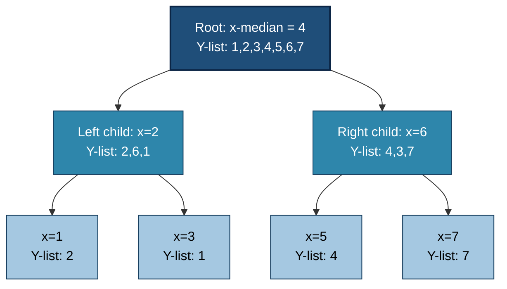
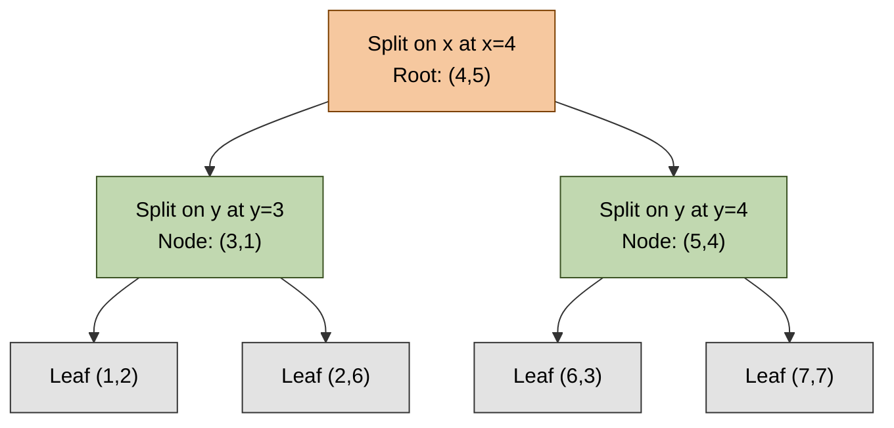
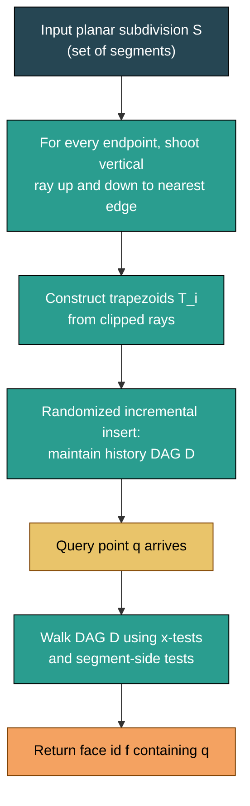
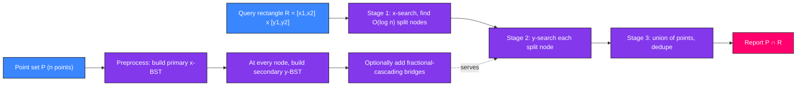
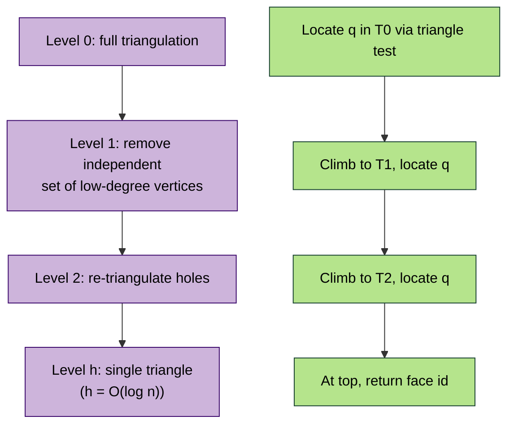

# Range Searching and Point Location :-

<!-- SECTION_1_START -->

# Range Searching and Point Location

## 1. Core Technical Definition

**Range Searching** is the problem of preprocessing a set $S$ of $n$ geometric objects (most commonly points in $\mathbb{R}^d$) so that, given a query region (a *range*), all points of $S$ that lie inside the region can be reported or counted efficiently.

**Point Location** is the dual problem: given a planar subdivision $\mathcal{S}$ (a partition of the plane into polygonal faces, e.g., a triangulation, a map of polygons), preprocess it so that, for a query point $q$, the face $f \in \mathcal{S}$ that contains $q$ can be returned efficiently.

> [!IMPORTANT]
> **KTU 2024 Syllabus Terminology (PECST418 – Module 3)**
> The expected vocabulary is *orthogonal range searching*, *range trees*, *fractional cascading*, *k-d trees*, and the three classical point-location structures: *slab method*, *trapezoidal map*, and *Kirkpatrick's algorithm*.

### Conceptual Analogy / Intuition

| Problem | Real-World Analogy | Geometric Picture |
|---|---|---|
| 1-D Range Search | Looking up names between *Aal* and *Ana* in a phone book | Number line with a query interval $[x_1, x_2]$ |
| 2-D Orthogonal Range Search | Finding all ATMs whose **latitude** is in $[10.0°,10.1°]$ **AND** **longitude** is in $[76.0°,76.1°]$ | Axis-aligned rectangle on a scatter plot |
| Point Location | Asking *"Which state am I standing in right now?"* while holding a paper map | A query point dropped onto a planar subdivision |

> [!NOTE]
> A *range-reporting* query returns the actual list of points. A *range-counting* query returns only the cardinality $\vert P \cap Q \vert$. KTU typically focuses on **range reporting**, although counting may appear in design questions.

### Physical / Algorithmic Constants

The performance of every structure in this module is governed by two **fundamental parameters** that the examiner loves to test:

- **Output size** $k$ — the number of points reported. Time must always include a $+k$ term, since any algorithm must at least list its output.
- **Query time** $Q(n)$ and **Space** $S(n)$ — the *preprocessing* space and the *online* query time trade-off. KTU questions often ask to *prove* or *verify* these bounds.

> [!VISUALIZATION CONTROL]
> **Concept:** A 2-D axis-aligned range query on a point set.
> **GeoGebra / Desmos Input Equations:**
> * Points: $(1,2),\ (3,1),\ (4,5),\ (6,3),\ (7,7),\ (2,6),\ (5,4)$
> * Rectangle: $x \in [3, 6]$ and $y \in [2, 5]$
> **Visual Description:** Plot the seven points on the $(x,y)$ plane and overlay the rectangle. The points $(3,1), (6,3), (5,4)$ are highlighted. Notice that the query touches the boundary at $y=2$ and $x=6$ — boundary handling is a common pitfall (use $\le$, not $<$, unless specified).

<!-- SECTION_1_END -->

<!-- SECTION_2_START -->

## 2. Deep Theoretical Analysis & KTU High-Yield Formula Sheet

### 2.1 1-D Range Searching

The set $P$ of $n$ real numbers is sorted once in $O(n \log n)$ time and stored in an array. A query $[a, b]$ is answered with **two binary searches** plus a slice of the array:

$$T_{\text{query}} = O(\log n + k) \quad,\quad S(n) = O(n)$$

This is the lower-bound-optimal solution in the comparison model.

### 2.2 The 2-D Range Tree

A **range tree** is a two-level nested search structure.

**Construction Logic (step-by-step):**

1. Sort $P$ by $x$-coordinate and build a balanced binary search tree $\mathcal{T}_x$ (the *primary* tree). Each node $v$ stores a *canonical subset* $P(v)$ = the points in the subtree rooted at $v$.
2. At every node $v$, build a secondary balanced BST $\mathcal{T}_{assoc}(v)$ on the $y$-coordinates of $P(v)$, with the corresponding $x$-values attached.
3. The total size of the secondary structures is
$$\sum_{v \in \mathcal{T}_x} \vert P(v) \vert = O(n \log n)$$
because each point appears in the canonical subsets of $O(\log n)$ ancestors.

**Query Algorithm $[x_1,x_2] \times [y_1,y_2]$:**

1. Find the *split nodes* $v_{\text{split}}$ and $v_{\text{left}}$ (the $O(\log n)$ nodes whose canonical subsets together form exactly $P \cap [x_1,x_2]$).
2. In each associated secondary tree, run a 1-D range query for $[y_1, y_2]$ and collect the points.
3. Total query time: $O(\log^2 n + k)$ because we do $O(\log n)$ split nodes, each taking $O(\log n + k_v)$.

### 2.3 Fractional Cascading

The bottleneck of the range tree is the $O(\log n)$ binary searches in the secondary structures. **Fractional cascading** merges these searches into a single linear scan.

> [!IMPORTANT]
> **The Key Idea:** Each node $v$ stores an *augmented* sorted list $A(v)$ containing every element of its children's augmented lists, plus a *bridge* array that, given an index in $A(v)$, jumps in $O(1)$ to the correct position in $A(\text{child})$. A single $O(\log n + k)$ binary search at the root plus $O(\log n)$ bridge traversals yields the answer.

$$\boxed{T_{\text{query}} = O(\log n + k),\quad S(n) = O(n \log n),\quad T_{\text{build}} = O(n \log n)}$$

### 2.4 The k-d Tree (Bentley, 1975)

A k-d tree is a binary space-partition tree that **cycles through the splitting dimension** at every level.

- At depth $d$, the splitting axis is $d \bmod k$ (for 2-D: alternate $x$ and $y$).
- The split value is the **median** of the points along the chosen axis.
- A query rectangle $R$ visits a child subtree only if $R$ *intersects* the splitting half-plane.

For uniformly distributed points, the expected query time is $O(\sqrt{n} + k)$ in 2-D, and the structure uses only $O(n)$ space. The worst-case is, however, $O(n + k)$ for adversarial inputs.

### 2.5 Point Location — Three Classical Structures

#### (a) Slab Method

Draw a vertical line through every vertex of the subdivision. This creates $n+1$ vertical *slabs*, each containing a set of non-crossing edges. A point-location query:

1. Binary search on the $x$-coordinate to find the slab: $O(\log n)$.
2. Binary search the edges inside the slab: $O(\log n)$.

$$T_{\text{query}} = O(\log n),\quad S(n) = O(n^2)$$

The $O(n^2)$ space is the killer drawback — ktu exam questions often ask to *justify* why.

#### (b) Trapezoidal Map (Randomized, Expected Linear)

Shoot a vertical ray upward and downward from **every vertex** until it hits an edge. The plane is decomposed into $O(n)$ *trapezoids*. A directed acyclic graph (DAG) of trapezoids is built during a randomized plane-sweep; each query point is located by walking the DAG.

$$T_{\text{query}} = O(\log n)\ \text{expected},\quad S(n) = O(n)\ \text{expected}$$

#### (c) Kirkpatrick's Algorithm (Deterministic, $O(\log n)$)

1. Start with any triangulation of the subdivision.
2. Iteratively remove an **independent set of low-degree vertices** (degree $\le 8$).
3. Re-triangulate the hole and record the *triangle containing each removed vertex*.
4. Build a hierarchy of triangulations $T_0 \supset T_1 \supset \dots \supset T_h$, with $h = O(\log n)$.
5. Query: at level $T_0$, locate the triangle containing $q$ via a constant-time triangle–point test, then climb to the next level, etc.

$$T_{\text{query}} = O(\log n),\quad S(n) = O(n)$$

### 2.6 KTU High-Yield Formula Sheet

| Structure | Query Time $T(n)$ | Space $S(n)$ | Build Time | Notes |
|---|---|---|---|---|
| 1-D sorted array | $O(\log n + k)$ | $O(n)$ | $O(n \log n)$ | Optimal in comparison model |
| 2-D Range Tree (basic) | $O(\log^2 n + k)$ | $O(n \log n)$ | $O(n \log n)$ | Each point stored $\log n$ times |
| 2-D Range Tree + Fractional Cascading | $O(\log n + k)$ | $O(n \log n)$ | $O(n \log n)$ | Bridge lists $\Rightarrow$ single $y$-search |
| k-d Tree (random input) | $O(\sqrt{n} + k)$ expected | $O(n)$ | $O(n \log n)$ expected | Worst-case $O(n+k)$ |
| Slab Method (Point Loc.) | $O(\log n)$ | $O(n^2)$ | $O(n^2)$ | Inefficient space |
| Trapezoidal Map (Point Loc.) | $O(\log n)$ expected | $O(n)$ expected | $O(n \log n)$ expected | Most practical |
| Kirkpatrick (Point Loc.) | $O(\log n)$ worst-case | $O(n)$ | $O(n \log n)$ | Best worst-case bounds |

### 2.7 Real-World Utility in CS / Engineering

- **Database query optimizers** use range trees to accelerate *B$^+$-tree* multi-attribute queries (e.g., *"all orders between Jan–Mar 2024 in Kerala costing ₹500–₹1000"*).
- **GIS systems** (Google Maps, QGIS) use trapezoidal maps for sub-millisecond point-in-polygon checks.
- **Computer graphics**: k-d trees accelerate *ray-tracing* (find nearest intersection) and *photon mapping*.
- **Robotics & motion planning**: Kirkpatrick's hierarchy is used in collision-detection preprocessors.
- **Machine learning**: k-d trees power $k$-NN classification in $O(\log n)$ per query (e.g., scikit-learn's `KDTree`).

<!-- SECTION_2_END -->

<!-- SECTION_3_START -->

## 3. Step-by-Step Derivations & Code Implementation

### 3.1 Derivation — Why a Range Tree Uses $O(n \log n)$ Space

> [!IMPORTANT]
> A point $p \in P$ is stored in the secondary tree of *every ancestor of its primary tree node*, including the node itself.

**Derivation:**

$$\begin{aligned}
S(n) &= \sum_{v \in \mathcal{T}_x} \vert P(v) \vert \\
&= \sum_{p \in P} (\text{number of ancestors of the node storing } p) \\
&= \sum_{p \in P} (\text{depth of } p) \\
&\le \sum_{p \in P} \lceil \log_2 n \rceil \\
&= n \cdot \lceil \log_2 n \rceil = O(n \log n)
\end{aligned}$$

The third equality uses the property that the *depth* of a leaf in a balanced BST of $n$ nodes is $\le \lceil \log_2 n \rceil$. $\blacksquare$

### 3.2 Derivation — Range-Query Time $O(\log^2 n + k)$

A query rectangle $R = [x_1, x_2] \times [y_1, y_2]$ finds $O(\log n)$ *split nodes* during the $x$-search. For each split node, the $y$-search is a 1-D query in a tree of size $\le n$, costing $O(\log n_v + k_v)$ where $n_v = \vert P(v) \vert$. Summing:

$$\begin{aligned}
T_{\text{query}} &= \sum_{v \in \text{split}} \left( O(\log n_v) + k_v \right) \\
&\le \sum_{v \in \text{split}} \left( O(\log n) + k_v \right) \\
&= O(\log n) \cdot O(\log n) + \sum k_v \\
&= O(\log^2 n) + k
\end{aligned}$$

Fractional cascading replaces the $O(\log n)$ factor by $O(1)$ per split node, giving $O(\log n + k)$.

### 3.3 Python Implementation — k-d Tree Range Search

```python
from __future__ import annotations
from typing import List, Optional, Tuple
import logging

logging.basicConfig(level=logging.INFO, format="%(levelname)s | %(message)s")

Point = Tuple[float, ...]
Rect  = List[Tuple[float, float]]   # rect[i] = (low_i, high_i)


class KDNode:
    """A single node of a k-d tree."""

    __slots__ = ("point", "axis", "left", "right")

    def __init__(self, point: Point, axis: int,
                 left: Optional["KDNode"] = None,
                 right: Optional["KDNode"] = None) -> None:
        self.point: Point = point
        self.axis: int = axis          # 0 -> split on x, 1 -> split on y
        self.left: Optional[KDNode] = left
        self.right: Optional[KDNode] = right


def build_kdtree(points: List[Point], depth: int = 0) -> Optional[KDNode]:
    """Recursively build a balanced k-d tree on the point list."""
    if not points:
        return None
    k = len(points[0])
    axis = depth % k
    points.sort(key=lambda p: p[axis])
    mid = len(points) // 2
    logging.info(f"build: depth={depth}, axis={axis}, "
                 f"median={points[mid]}, n={len(points)}")
    return KDNode(
        point=points[mid],
        axis=axis,
        left=build_kdtree(points[:mid], depth + 1),
        right=build_kdtree(points[mid + 1:], depth + 1),
    )


def range_search(node: Optional[KDNode],
                 rect: Rect,
                 results: List[Point],
                 depth: int = 0) -> None:
    """Report every point inside the axis-aligned rect."""
    if node is None:
        return
    # Check if current point lies inside the query rectangle.
    inside = all(rect[i][0] <= node.point[i] <= rect[i][1]
                 for i in range(len(node.point)))
    if inside:
        results.append(node.point)

    axis = node.axis
    # Visit the half-planes that could intersect the rectangle.
    if rect[axis][0] <= node.point[axis]:
        range_search(node.left,  rect, results, depth + 1)
    if rect[axis][1] >= node.point[axis]:
        range_search(node.right, rect, results, depth + 1)


# ----------------- driver / self-test -----------------
if __name__ == "__main__":
    pts: List[Point] = [
        (1.0, 2.0), (3.0, 1.0), (4.0, 5.0),
        (6.0, 3.0), (7.0, 7.0), (2.0, 6.0), (5.0, 4.0),
    ]
    root = build_kdtree(pts)
    query: Rect = [(3.0, 6.0), (2.0, 5.0)]
    out: List[Point] = []
    range_search(root, query, out)
    print("Points inside", query, "->", out)
    # Expected: [(3.0, 1.0), (6.0, 3.0), (5.0, 4.0)]
```

### 3.4 Python Implementation — Trapezoidal Map Point Location (skeleton)

```python
import random
from typing import List, Tuple

class Trapezoid:
    """A node in the point-location DAG."""
    __slots__ = ("top", "bottom", "left", "right", "sink")
    def __init__(self, top, bottom, left, right, sink):
        self.top, self.bottom, self.left, self.right, self.sink = top, bottom, left, right, sink

def trapezoidal_search(node, point) -> str:
    """Walk the DAG.  Internal nodes are either x-nodes (left/right p)
       or y-nodes (above/below a segment).  Sinks are trapezoids."""
    if isinstance(node, Trapezoid):
        return node.sink          # face id
    # Assume 'x' and 'y' node types from the DAG for brevity.
    if node.is_x:                 # vertical-line test
        if point[0] < node.x:    return trapezoidal_search(node.left,  point)
        else:                     return trapezoidal_search(node.right, point)
    else:                         # y-node (segment test)
        if point[1] < node.seg_y_at(point[0]):
            return trapezoidal_search(node.below, point)
        else:
            return trapezoidal_search(node.above, point)
```

> [!NOTE]
> Production libraries (e.g., **CGAL**, **GEOS**) implement the full randomized construction in $O(n \log n)$ expected time using a history DAG. The above is a teaching skeleton.

### 3.5 Worked Numerical Example — Range Tree Query

Given $P = \{(1,2), (3,1), (4,5), (6,3), (7,7), (2,6), (5,4)\}$, find all points in $R = [3,6] \times [2,5]$.

**Step 1 — Sort by $x$:** $(1,2), (2,6), (3,1), (4,5), (5,4), (6,3), (7,7)$.

**Step 2 — Primary tree (median splits on $x$):**
- Root: $(4,5)$, left subtree $L=\{(1,2),(2,6),(3,1)\}$, right subtree $R=\{(5,4),(6,3),(7,7)\}$.

**Step 3 — $x$-query $[3,6]$:**
- Search left of root: $x=3 \ge 4$? No, but $x=3 \ge 1$ and $\le 4 \Rightarrow$ left-subtree $L$ is fully inside $[3,4]$? No. The split node on the left path is the node $(3,1)$ (root of left subtree): report its canonical subset $\{(1,2),(2,6),(3,1)\} \cap [3,4] = \{(3,1)\}$.
- Search right of root: $x=6 \ge 4$? Yes, recurse into $R$. $x=6 \le 5$? No. $x=6 \le 6$? Yes, so the right split node is $(6,3)$: report $\{(5,4),(6,3)\} \cap [5,6] = \{(5,4),(6,3)\}$.

**Step 4 — Total candidates:** $\{(3,1),(5,4),(6,3)\}$.

**Step 5 — $y$-query $[2,5]$ against candidates:**
- $(3,1)$: $y=1$ — **out**.
- $(5,4)$: $y=4$ — **in**.
- $(6,3)$: $y=3$ — **in**.

**Final answer:** $\{(5,4), (6,3)\}$. The boundary point $(3,1)$ is excluded because $1 \notin [2,5]$.

<!-- SECTION_3_END -->

<!-- SECTION_4_START -->

## 4. Structural Diagrams & Schematics

### 4.1 Range Tree Topology

> [!NOTE]
> A Mermaid graph is used because the physical *shape* of a tree is a graph, not a coordinate drawing.



### 4.2 k-d Tree Space Partition (2-D)



### 4.3 Trapezoidal Map — Conceptual Processing Flow



### 4.4 Block Architecture — Range Search Query Pipeline



### 4.5 Sequential Processing Topology — Kirkpatrick's Algorithm



<!-- SECTION_4_END -->

<!-- SECTION_5_START -->

## 5. KTU 2024 Scheme Examination Question Bank & Topic Recap

### 5.1 Part A — Short Answer (3 marks each)

**Q1. [KTU University Exam – July 2024]**
Define *orthogonal range searching*. State the query time and space complexity of the basic 2-D range tree on $n$ points. *(CO1, Remember)*

**Model Answer:**

> *Orthogonal range searching* is the problem of preprocessing a set of $n$ points in $\mathbb{R}^2$ so that, given an axis-aligned query rectangle $R = [x_1,x_2] \times [y_1,y_2]$, the subset $P \cap R$ can be reported efficiently.
> The basic 2-D range tree answers a query in $O(\log^2 n + k)$ time using $O(n \log n)$ space, where $k = \vert P \cap R \vert$.

---

**Q2. [KTU University Exam – Dec 2023]**
List any three classical point-location structures and give the space complexity of each. *(CO1, Remember)*

**Model Answer:**

| Structure | Space Complexity |
|---|---|
| Slab Method | $O(n^2)$ |
| Trapezoidal Map | $O(n)$ expected |
| Kirkpatrick's Algorithm | $O(n)$ worst-case |

---

### 5.2 Part B — 14-mark Internal Choice

#### Question A (14 Marks) [KTU University Exam – July 2024]

**(a)** Describe the construction of a 2-D range tree on a set of $n$ points. State and *prove* the space bound. *(CO1, Understand — 7 Marks)*

**(b)** Describe the *fractional cascading* technique and explain how it improves the query time of a 2-D range tree to $O(\log n + k)$. *(CO3, Apply — 7 Marks)*

**Model Solution for (a):**

1. **Primary structure:** Sort $P$ by $x$-coordinate and build a balanced BST $\mathcal{T}_x$. Each node $v$ stores a canonical subset $P(v)$ of the points in its subtree. *[2 Marks]*
2. **Secondary structure:** At every node $v$, build a balanced BST $\mathcal{T}_{assoc}(v)$ on the $y$-coordinates of $P(v)$, with the $x$-coordinates attached. *[2 Marks]*
3. **Space proof:** Let $d(p)$ denote the depth of the leaf holding $p$ in $\mathcal{T}_x$. Then

$$\begin{aligned}
S(n) &= \sum_{v \in \mathcal{T}_x} \vert P(v) \vert 
= \sum_{p \in P} d(p) 
\le \sum_{p \in P} \lceil \log_2 n \rceil 
= O(n \log n)
\end{aligned}$$

Each point appears once in the secondary tree of each of its ancestors, so the per-point contribution is at most $\lceil \log_2 n \rceil$. *[3 Marks — incremental: stating recurrence 1 mark, identifying depth bound 1 mark, final bound 1 mark]*

**Model Solution for (b):**

1. **Bottleneck identification:** A 2-D range query visits $O(\log n)$ split nodes and performs a fresh $y$-binary search in each, costing $O(\log^2 n + k)$. *[2 Marks]*
2. **Augmented lists:** For every node $v$ with children $v_L, v_R$, store $A(v)$ as the *merged* sorted list of $A(v_L) \cup A(v_R)$. Store two bridge arrays $B_L, B_R$ where $B_L[i]$ gives the index in $A(v_L)$ of the same key as $A(v)[i]$, and similarly for $B_R$. *[2 Marks]*
3. **Query procedure:** Do a single $O(\log n)$ binary search for $y_1$ and $y_2$ in $A(\text{root})$. Then traverse down, using the bridge arrays to "jump" to the correct position in each child list in $O(1)$ time. Hence the total cost is $O(\log n + k)$. *[3 Marks]*

---

#### Question B (14 Marks) [KTU University Exam – Dec 2023]

**(a)** Describe the *trapezoidal map* method for point location. State the expected query time and space. *(CO2, Understand — 7 Marks)*

**(b)** Describe *Kirkpatrick's algorithm* for point location. State its query and space complexity and *prove* that the height of the hierarchy is $O(\log n)$. *(CO3, Apply — 7 Marks)*

**Model Solution for (a):**

1. From every vertex $v$ of the subdivision, shoot a vertical ray upward and downward until it hits an edge or extends to infinity. The resulting cells are *trapezoids* bounded above and below by segments (or $\pm\infty$) and laterally by vertical rays. *[2 Marks]*
2. The total number of trapezoids is at most $1 + \sum (\deg(v)) = O(n)$, because each edge contributes a constant number of trapezoid boundaries. *[2 Marks]*
3. Construction uses a *randomized incremental insertion* of segments. A history DAG of size $O(n)$ is built, where each node is either an *x-node* (compare $x$-coordinate with a vertical ray), a *y-node* (test which side of a segment the point lies on), or a *sink* (a trapezoid id). *[2 Marks]*
4. A query point $q$ walks the DAG, taking $O(\log n)$ expected time and $O(1)$ space at each level, yielding $O(\log n)$ expected query time. Space is $O(n)$ expected. *[1 Mark]*

**Model Solution for (b):**

1. **Initial triangulation:** Start with any triangulation $T_0$ of the convex hull of the subdivision. The number of triangles is $O(n)$. *[1 Mark]*
2. **Independent set of low-degree vertices:** Find an independent set $I$ of vertices of degree $\le 8$. Such a set has size $\ge n/9$. Remove $I$ and re-triangulate the resulting holes. *[2 Marks]*
3. **Hierarchy:** Repeat to build $T_0 \supset T_1 \supset \dots \supset T_h$. Each level removes at least $1/9$ of the vertices, so $h \le \log_{9/8} n = O(\log n)$. *[2 Marks]*
4. **Point-location structure:** For each removed vertex $v$, record the triangle in $T_{i+1}$ that contains it. The final structure is a DAG of triangles with $O(n)$ nodes and $O(\log n)$ height. *[1 Mark]*
5. **Query:** Starting at $T_0$, locate $q$ in $O(1)$ using the orientation test of the three triangle vertices, then climb to the parent in the DAG. Repeating $O(\log n)$ times gives $T_{\text{query}} = O(\log n)$ worst-case and $S(n) = O(n)$. *[1 Mark]*

> [!WARNING]
> **KTU Examiner's Valuation Warning / Pitfall Callout**
> 1. In range trees, students often write $O(\log n)$ space — **wrong**. The space is $O(n \log n)$; $O(\log n)$ is the *depth*.
> 2. For k-d trees, do not claim $O(\log n)$ query time. It is $O(\sqrt{n} + k)$ **expected** in 2-D, and $O(n + k)$ worst-case.
> 3. In the slab method, students frequently forget the $O(n^2)$ space; writing $O(n)$ costs 2 marks.
> 4. For Kirkpatrick's algorithm, you *must* prove the $O(\log n)$ height by showing that the independent set has size $\Omega(n)$. Without this, full marks are not awarded.
> 5. Boundary inclusion ($\le$ vs $<$) is a common 1-mark deduction in range queries.

---

### 5.3 Topic Recap & Important Things to Remember

- **Range Searching** = preprocess a set of geometric objects to efficiently report or count those inside a query region.
- **Point Location** = preprocess a planar subdivision to efficiently identify the face containing a query point.
- **1-D range query** on $n$ points: $O(\log n + k)$ time, $O(n)$ space — optimal in the comparison model.
- **2-D range tree (basic)**: primary BST on $x$, secondary BST on $y$ at every node; $O(\log^2 n + k)$ query, $O(n \log n)$ space.
- **Fractional cascading**: augments secondary lists with bridge arrays to yield $O(\log n + k)$ query while keeping $O(n \log n)$ space.
- **k-d tree**: cycles splitting dimension; expected $O(\sqrt{n} + k)$ query in 2-D, $O(n)$ space, but worst-case $O(n + k)$.
- **Slab method** for point location: $O(\log n)$ query, but $O(n^2)$ space — never used in practice.
- **Trapezoidal map**: randomized, $O(n)$ expected space, $O(\log n)$ expected query — practical choice.
- **Kirkpatrick's algorithm**: deterministic, $O(n)$ space, $O(\log n)$ query — best worst-case guarantees; relies on independent sets of low-degree vertices.
- **Output-sensitive complexity** is mandatory — always include a $+k$ term for reporting variants.
- **Boundary handling**: use $\le$ for closed intervals; document the choice in code and proofs.
- **The +k is essential**: any reporting algorithm must spend at least $O(k)$ time to list its output.
- **Preprocessing vs query** trade-off: heavy preprocessing (range tree) yields faster queries; lightweight preprocessing (k-d tree) yields slower queries.
- **Deterministic vs randomized**: k-d tree is deterministic but worst-case weak; trapezoidal map is randomized but expected linear; Kirkpatrick is deterministic and worst-case optimal in space.
- **KTU 2024 hot keywords**: *canonical subset*, *split node*, *bridge array*, *history DAG*, *independent set*, *low-degree vertex*, *trapezoid*, *triangulation refinement*.

<!-- SECTION_5_END -->
