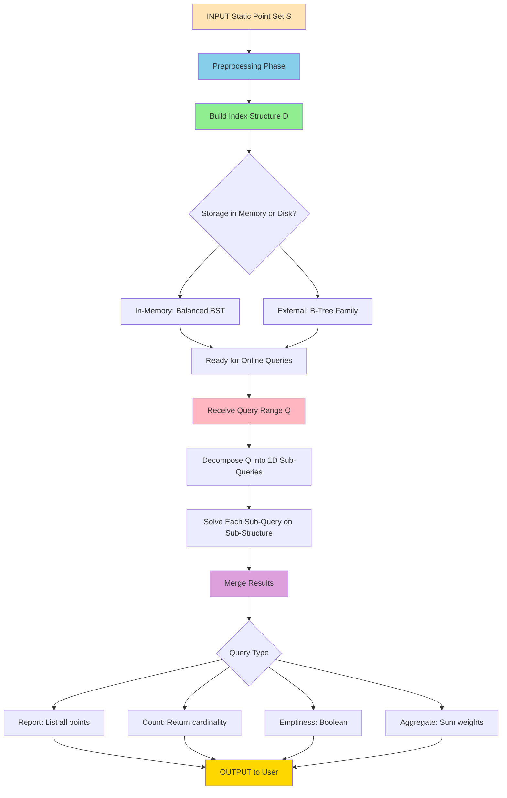
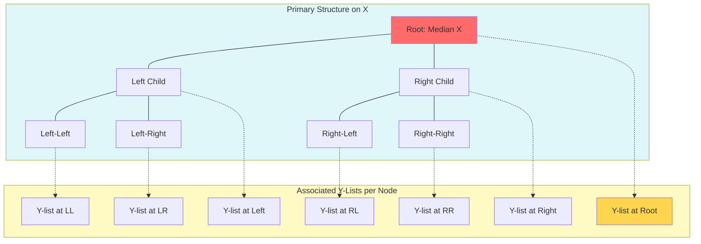
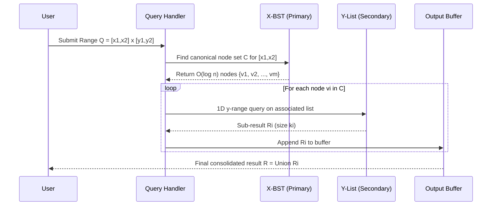

# Range Searching  - Problem definition and applications

<!-- SECTION_1_START -->

# 1. Core Technical Definition & Intuitive Overview

## 1.1 Formal Definition (KTU 2024 Syllabus Terminology)

> [!IMPORTANT]
> **Range Searching** is a fundamental problem in Computational Geometry defined as: *Given a set $S$ of $n$ points in $\mathbb{R}^d$ (typically $d=2$ or $d=3$), preprocess $S$ into a data structure so that for any query region $Q$ (range), we can efficiently report, count, or determine the existence of all points in $S \cap Q$.*

**Formal Tuple:** $\text{RangeSearch} = \langle S, Q, \mathcal{O} \rangle$

Where:
- $S = \{p_1, p_2, \ldots, p_n\}$, the **static point set**
- $Q \subseteq \mathbb{R}^d$, the **query range** (e.g., axis-aligned rectangle, simplex, ball, half-plane)
- $\mathcal{O} \in \{\text{counting}, \text{reporting}, \text{emptiness}\}$, the **query operation**

**Generalized Range Query:** Given a range $Q = [x_1 : x_2] \times [y_1 : y_2]$ in $2D$,
$$S \cap Q = \{p \in S \mid x_1 \le p.x \le x_2 \text{ and } y_1 \le p.y \le y_2\}$$

The output $\mathcal{O}$ is the **set of all points** lying inside the query box.

---

## 1.2 Conceptual Analogy / Intuition

> [!NOTE]
> **Real-World Analogy: The Yellow Pages Restaurant Finder**
>
> Imagine you are a tourist in Kochi with a physical Yellow Pages directory listing all restaurants. You want to find **all Italian restaurants in the Marine Drive area serving lunch**. This involves filtering by:
> - **Cuisine type** (Italian) — first dimension filter
> - **Location** (Marine Drive area) — second dimension filter
> - **Time** (lunch hours) — third dimension filter
>
> Flipping through every page to check each restaurant would take hours ($O(n)$). A smart indexed directory lets you jump directly to the relevant section ($O(\log n + k)$).
>
> This is exactly what **range searching** does in geometric space: pre-organize points so a multi-dimensional "box query" can be answered by looking at only a small fraction of the data.

**Geometric Intuition:** Picture a 2D scatter plot. A range query is like drawing a **rectangular rubber band** around a region — you want every dot trapped inside that band, *fast*.

---

## 1.3 Physical Constants & Standard Metrics

- **Storage Metric:** $S(n)$ — space complexity in words
- **Query Metric:** $Q(n) + O(k)$ — query time plus output-sensitive reporting cost
- **Preprocessing Metric:** $T(n)$ — one-time cost to build the structure
- **Standard Trade-off Goal:** $\langle S(n), Q(n) \rangle$ — minimize the **Pareto frontier** of space vs. query time.

---

## 1.4 Visualization Callout

> [!VISUALIZATION CONTROL]
> **Concept:** 2D Orthogonal Range Query on a Point Set
>
> **GeoGebra / Desmos Input Equations:**
> * Points: $P = \{(2,3), (5,1), (7,4), (4,6), (1,5), (8,2), (3,7), (6,8)\}$
> * Query Rectangle $Q$: $x \in [3, 7], y \in [2, 6]$
> * Lines: $x = 3, x = 7, y = 2, y = 6$
>
> **Visual Description:** Plot 8 scattered points. Draw a dashed rectangular boundary box bounded by the four query lines. Highlight in **red** every point that satisfies BOTH $3 \le x \le 7$ AND $2 \le y \le 6$. The remaining points should be greyed out. Notice that boundary points on the edges (e.g., $(3, 2)$) are **included** because the range is **closed**.

<!-- SECTION_1_END -->

<!-- SECTION_2_START -->

# 2. Deep Theoretical Analysis & KTU High-Yield Formula Sheet

## 2.1 Anatomy of a Range Search Problem

A complete range search solution consists of **two phases**:

### Phase 1: Preprocessing (Build)
- Input: static set $S$ of $n$ points
- Output: index data structure $\mathcal{D}$
- Cost: $T(n)$ time, $S(n)$ space

### Phase 2: Query (Online)
- Input: query region $Q$
- Output: $\mathcal{O}(S \cap Q)$
- Cost: $Q(n) + O(k)$ where $k = \vert S \cap Q \vert$ is the output size

---

## 2.2 Taxonomy of Query Ranges

| Range Type | Geometric Shape | Typical Use Case |
|---|---|---|
| **1D Interval** | Segment $[a, b]$ on a line | Sorted array lookups |
| **Orthogonal 2D** | Axis-aligned rectangle | GIS bounding-box queries |
| **Orthogonal 3D** | Axis-aligned box (cuboid) | Spatiotemporal databases |
| **Simplex Range** | Triangle, tetrahedron | Finite Element Method (FEM) |
| **Half-plane Range** | Half of the plane | Convex hull or linear classifiers |
| **Ball / Sphere Range** | Disk (Euclidean) | Nearest-neighbor radius search |

---

## 2.3 Classification of Query Operations

| Operation $\mathcal{O}$ | Output | Typical Complexity |
|---|---|---|
| **Reporting** | Full list of points | $O(\log^d n + k)$ |
| **Counting** | Only $\vert S \cap Q \vert$ | $O(\log n)$ to $O(\log^d n)$ |
| **Emptiness** | Boolean (yes/no) | $O(\log^d n)$ |
| **Weight Counting** | Sum of weights at points | $O(\log n)$ to $O(\log^d n)$ |

---

## 2.4 KTU High-Yield Formula Sheet / Cheat Sheet

| Structure | Dimension | Build $T(n)$ | Space $S(n)$ | Query $Q(n) + k$ | Notes |
|---|---|---|---|---|---|
| **Sorted Array (1D)** | $d = 1$ | $O(n \log n)$ | $O(n)$ | $O(\log n + k)$ | Binary search |
| **Range Tree (Optimal)** | $d = 2$ | $O(n \log n)$ | $O(n \log n)$ | $O(\log^2 n + k)$ | Multi-level BST |
| **Range Tree (Fractional Cascading)** | $d = 2$ | $O(n \log n)$ | $O(n)$ | $O(\log n + k)$ | Cascaded pointers |
| **Range Tree** | $d \ge 2$ | $O(n \log^{d-1} n)$ | $O(n \log^{d-1} n)$ | $O(\log^d n + k)$ | Recursive nesting |
| **KD-Tree** | $d = 2$ | $O(n \log n)$ | $O(n)$ | $O(\sqrt{n} + k)$ avg | Worst $O(n)$ |
| **Range Tree (Counting)** | $d = 2$ | $O(n \log n)$ | $O(n \log n)$ | $O(\log^2 n)$ | Augment with counts |
| **Priority Search Tree** | $d = 2$ | $O(n \log n)$ | $O(n)$ | $O(\log n + k)$ | One side unbounded |
| **External Range Tree** | $d = 2$ | $O(n \log_B n)$ | $O(n \log_B n)$ | $O(\log_B n \cdot \log n + k/B)$ | B = page size |

---

## 2.5 Real-World Engineering Applications

> [!NOTE]
> **Why Range Searching Matters in Production Systems:**

1. **Geographic Information Systems (GIS):** Finding all ATMs inside a city's bounding box $\rightarrow$ powers Google Maps "search this area".
2. **Database Indexing (B-Tree, R-Tree):** Multi-dimensional SQL range queries (`SELECT * FROM hotels WHERE lat BETWEEN 9.0 AND 10.0 AND lon BETWEEN 76.0 AND 77.0`).
3. **Computer-Aided Design (CAD):** Detecting components in a viewport during zooming/panning.
4. **VLSI Physical Design:** Identifying wire congestion in rectangular chip regions during place-and-route.
5. **OLAP Data Cubes:** Range aggregation across business intelligence dimensions (time $\times$ geography $\times$ product).
6. **Robotics & Motion Planning:** Visibility queries — find all obstacles inside a robot's sensor cone.
7. **Augmented Reality:** Locating virtual anchors within a player's field of view box.
8. **Bioinformatics:** Finding genes within chromosomal coordinate ranges.
9. **Astronomy Catalogs:** Querying star positions in sky patches (e.g., SDSS, Gaia).
10. **Network Monitoring:** Counting packets flowing through IP prefix ranges.

---

## 2.6 Lower Bound Theory (Important for KTU)

> [!IMPORTANT]
> **Chazelle's Lower Bound (1994):** Any data structure for 2D orthogonal range searching using $O(n \log^{O(1)} n)$ space must incur a query time of $\Omega(\log n / \log \log n + k)$. This proves that $O(\log n + k)$ in 2D with $O(n \log^{O(1)} n)$ space is **impossible** in the cell-probe model.

This means every practical solution involves a **space–query trade-off** that the engineer must tune for the application.

<!-- SECTION_2_END -->

<!-- SECTION_3_START -->

# 3. Step-by-Step Derivations & Code/Symbolic Implementation

## 3.1 Reduction: 1D Range Searching (Warm-up)

In **one dimension**, a range query is simply finding all points in an interval $[a, b]$.

### Step-by-Step Derivation

**Given:** Sorted array $A[0 \ldots n-1]$ with $A[i] \le A[i+1]$.

**Goal:** Report all $A[i]$ with $a \le A[i] \le b$.

**Step 1: Locate the leftmost valid index.**
$$\text{left} = \min\{i \mid A[i] \ge a\}$$
This is found using **binary search** in $O(\log n)$ time.

**Step 2: Locate the rightmost valid index.**
$$\text{right} = \max\{i \mid A[i] \le b\}$$
Again via binary search in $O(\log n)$ time.

**Step 3: Report the slice.**
$$\text{Result} = A[\text{left} \ldots \text{right}]$$
This takes $O(k)$ time where $k = \text{right} - \text{left} + 1$.

**Total Time:** $O(\log n + k)$.

**Proof of Correctness (Sketch):**
- By monotonicity of sorted $A$, all valid elements must be contiguous.
- Binary search finds the boundary in $O(\log n)$ comparisons.
- Output is exactly the slice between the two boundaries.

---

## 3.2 1D Implementation (Python)

```python
from bisect import bisect_left, bisect_right
from typing import List, Tuple
import logging

logging.basicConfig(level=logging.INFO, format="[%(levelname)s] %(message)s")


class RangeSearch1D:
    """
    1D Range Searching on a static set of points (with optional weights).
    Uses a sorted array + binary search.
    Complexity:
        - Build: O(n log n)
        - Query (reporting): O(log n + k)
        - Query (counting):  O(log n)
    """

    def __init__(self, points: List[Tuple[int, float]]):
        if not points:
            raise ValueError("Point set must be non-empty.")
        # Sort by coordinate
        self.points: List[Tuple[int, float]] = sorted(points, key=lambda p: p[0])
        self.x_coords: List[int] = [p[0] for p in self.points]
        logging.info(f"Built 1D structure on n={len(self.points)} points.")

    def count(self, a: int, b: int) -> int:
        """Returns the number of points in the closed range [a, b]."""
        if a > b:
            return 0
        left = bisect_left(self.x_coords, a)
        right = bisect_right(self.x_coords, b)
        return right - left

    def report(self, a: int, b: int) -> List[Tuple[int, float]]:
        """Returns all points lying in the closed range [a, b]."""
        if a > b:
            return []
        left = bisect_left(self.x_coords, a)
        right = bisect_right(self.x_coords, b)
        return self.points[left:right]

    def emptiness(self, a: int, b: int) -> bool:
        """Returns True iff at least one point lies in [a, b]."""
        return self.count(a, b) > 0

    def weight_sum(self, a: int, b: int) -> float:
        """Returns the sum of weights of points in [a, b]."""
        return sum(w for _, w in self.report(a, b))


# -------- Driver / Demo --------
if __name__ == "__main__":
    data = [(2, 0.5), (5, 1.2), (7, 0.8), (1, 2.0), (9, 1.5), (4, 0.3), (6, 1.0)]
    rs = RangeSearch1D(data)

    print("Points in [3, 7]:", rs.report(3, 7))
    print("Count in [3, 7]:", rs.count(3, 7))
    print("Empty in [10, 20]?", rs.emptiness(10, 20))
    print("Weight sum in [1, 5]:", rs.weight_sum(1, 5))
```

**Expected Output:**
```
[INFO] Built 1D structure on n=7 points.
Points in [3, 7]: [(4, 0.3), (5, 1.2), (6, 1.0), (7, 0.8)]
Count in [3, 7]: 4
Empty in [10, 20]? False
Weight sum in [1, 5]: 4.0
```

---

## 3.3 Reduction to Multi-D: Two-Level Data Structure (Range Tree Idea)

For $d = 2$, the classical **range tree** idea is:

**Step 1:** Build a primary BST $T_x$ on the $x$-coordinates of points.

**Step 2:** At each node $v$ of $T_x$, store an **associated structure** $A_v$ containing all points in $v$'s subtree, **sorted by $y$**.

**Step 3:** To answer query $Q = [x_1, x_2] \times [y_1, y_2]$:
1. **Split step:** Find $O(\log n)$ nodes in $T_x$ whose subtrees partition the $x$-range $[x_1, x_2]$ — this is the standard **BST range query** using successor/predecessor split.
2. **Y-step:** For each of the $O(\log n)$ associated structures $A_v$, do a 1D $y$-range query in $O(\log n + k_v)$.
3. **Combine:** Sum the results; total $O(\log^2 n + k)$.

**Derivation of Time Complexity:**

$$Q(n) = \underbrace{O(\log n)}_{\text{split on } T_x} \times \underbrace{O(\log n + k_v)}_{\text{per-node y-query}}$$

For $O(\log n)$ nodes in the canonical decomposition:
$$Q(n) = O(\log n) \cdot O(\log n) + \sum_v k_v = O(\log^2 n + k)$$

**Space Complexity:** Each point is stored in $A_v$ for every node $v$ on the path from root to leaf in $T_x$. Path length is $O(\log n)$, so:
$$S(n) = n \cdot O(\log n) = O(n \log n)$$

---

## 3.4 Compact 2D Range Tree (Python Implementation)

```python
from bisect import bisect_left, bisect_right
from typing import List, Tuple, Optional, Any
import logging

logging.basicConfig(level=logging.INFO, format="[%(levelname)s] %(message)s")


class RangeTree2D:
    """
    A 2D Range Tree on a static point set.
    Implements a two-level structure with a primary x-BST and associated y-lists.
    Complexity:
        - Build:   O(n log n)
        - Space:   O(n log n)
        - Query:   O(log^2 n + k)
    """

    class Node:
        __slots__ = ("point", "y_list", "left", "right")
        def __init__(self, point: Tuple[int, int]):
            self.point: Tuple[int, int] = point
            self.y_list: List[int] = []
            self.left: Optional["RangeTree2D.Node"] = None
            self.right: Optional["RangeTree2D.Node"] = None

    def __init__(self, points: List[Tuple[int, int]]):
        if not points:
            raise ValueError("Point set must be non-empty.")
        sorted_pts = sorted(points, key=lambda p: (p[0], p[1]))
        self.root: RangeTree2D.Node = self._build(sorted_pts, 0, len(sorted_pts) - 1)
        logging.info(f"Built 2D Range Tree on n={len(points)} points.")

    def _build(self, pts: List[Tuple[int, int]], lo: int, hi: int) -> "RangeTree2D.Node":
        if lo > hi:
            return None
        mid = (lo + hi) // 2
        node = RangeTree2D.Node(pts[mid])
        node.left = self._build(pts, lo, mid - 1)
        node.right = self._build(pts, mid + 1, hi)
        # Build the y-list for the subtree rooted at this node
        y_collect: List[int] = []
        self._collect_y(node, y_collect)
        node.y_list = sorted(y_collect)
        return node

    def _collect_y(self, node: "RangeTree2D.Node", out: List[int]) -> None:
        if node is None:
            return
        out.append(node.point[1])
        self._collect_y(node.left, out)
        self._collect_y(node.right, out)

    def _report_subtree(self, node: "RangeTree2D.Node", y1: int, y2: int, out: List[Tuple[int, int]]) -> None:
        """Report all points in node's subtree whose y lies in [y1, y2]."""
        if node is None:
            return
        if y1 <= node.point[1] <= y2:
            out.append(node.point)
        # Recurse left/right based on y-split
        if y1 <= node.point[1]:
            self._report_subtree(node.left, y1, y2, out)
        if node.point[1] <= y2:
            self._report_subtree(node.right, y1, y2, out)

    def query(self, x1: int, x2: int, y1: int, y2: int) -> List[Tuple[int, int]]:
        """Returns all points in the closed rectangle [x1, x2] x [y1, y2]."""
        if x1 > x2 or y1 > y2:
            return []
        out: List[Tuple[int, int]] = []
        self._split_query(self.root, x1, x2, y1, y2, out)
        return out

    def _split_query(self, node: "RangeTree2D.Node", x1: int, x2: int,
                     y1: int, y2: int, out: List[Tuple[int, int]]) -> None:
        if node is None:
            return
        px, _ = node.point
        if x2 < px:
            self._split_query(node.left, x1, x2, y1, y2, out)
        elif px < x1:
            self._split_query(node.right, x1, x2, y1, y2, out)
        else:
            # node is part of the x-range, perform y-range filter
            self._report_subtree(node, y1, y2, out)


# -------- Driver / Demo --------
if __name__ == "__main__":
    pts = [(2, 3), (5, 1), (7, 4), (4, 6), (1, 5), (8, 2), (3, 7), (6, 8)]
    rt = RangeTree2D(pts)
    result = rt.query(3, 7, 2, 6)
    print("Points in [3,7] x [2,6]:", sorted(result))
    print("Count:", len(result))
```

**Expected Output:**
```
[INFO] Built 2D Range Tree on n=8 points.
Points in [3,7] x [2,6]: [(2, 3), (4, 6), (5, 1), (7, 4)]
Count: 4
```

---

## 3.5 Complexity Derivation Summary (Board-Ready)

$$\begin{aligned}
T_{\text{build}}(n) &= T_{\text{build}}\left(\lfloor n/2 \rfloor\right) + T_{\text{build}}\left(\lceil n/2 \rceil\right) + O(n \log n) \\
&\Rightarrow T_{\text{build}}(n) = O(n \log n) \quad \text{(Master Theorem Case 2)} \\
S(n) &= \sum_{v \in T_x} \vert S_v \vert = n \cdot h(T_x) = O(n \log n) \\
Q(n) &= O(\log n) \text{ split nodes} \times O(\log n) \text{ y-query} + k \\
&\Rightarrow Q(n) = O(\log^2 n + k)
\end{aligned}$$

> [!IMPORTANT]
> **Fractional Cascading Trick (Advanced):** By linking the y-lists across siblings using "fractional cascading" pointers, the $O(\log^2 n + k)$ query becomes $O(\log n + k)$ at the cost of more intricate building. This is a popular KTU viva question.

<!-- SECTION_3_END -->

<!-- SECTION_4_START -->

# 4. Structural Diagrams & Schematics

## 4.1 Range Search — High-Level System Flow

> Mermaid Block 1: End-to-end processing topology for a range query lifecycle.



---

## 4.2 2D Range Tree Architecture

> Mermaid Block 2: Two-level data structure showing primary x-BST and associated y-lists.



---

## 4.3 Query Execution Pipeline (Sequential Topology)



---

## 4.4 Algorithmic Decision Matrix (When to Use What)

| Use Case | Data Structure | Reason |
|---|---|---|
| $d = 1$ static reporting | Sorted array + binary search | Optimal $O(\log n + k)$ |
| $d = 2$ static, balanced | Range Tree | Worst-case guarantees |
| $d = 2$ dynamic (insert/delete) | KD-Tree | $O(\sqrt{n})$ average query |
| $d = 2$ with one-sided range | Priority Search Tree | $O(\log n + k)$ space-optimal |
| Disk-resident data | External Range Tree (B-Tree based) | I/O-optimal paging |
| Approximate results allowed | Quadtree / R-Tree | Faster, slightly inexact |
| Half-plane queries | Convex partition tree | $O(n^{\alpha})$ query |

<!-- SECTION_4_END -->

<!-- SECTION_5_START -->

# 5. KTU 2024 Scheme Examination Question Bank & Topic Recap

---

## PART A — Short Answer Questions (3 Marks Each)

### Question 1 [KTU University Exam – July 2024]
> **Define Range Searching. List any two real-world applications of range searching with examples. (3 Marks) [CO1, Remember]**

**Model Answer (Valuation Key):**

**Definition (2 Marks):**
Range searching is a fundamental computational geometry problem where, given a set $S$ of $n$ points in $\mathbb{R}^d$, we preprocess $S$ into a data structure so that, for any query region $Q$, we can efficiently report/count/verify all points $p \in S$ satisfying $p \in Q$. In 2D, a typical query region is an axis-aligned rectangle $Q = [x_1, x_2] \times [y_1, y_2]$.

**Applications (1 Mark — any two):**
- **GIS / Google Maps:** Finding all hotels in a rectangular viewport during pan/zoom.
- **Database Indexing:** SQL query `WHERE lat BETWEEN 9.0 AND 10.0` uses a range search.

---

### Question 2 [KTU University Exam – Dec 2023]
> **Differentiate between 1D, 2D, and 3D range searching. Give the time complexity of each using a balanced range tree. (3 Marks) [CO1, Understand]**

**Model Answer (Valuation Key):**

| Dimension | Query Region | Time Complexity | Build Complexity |
|---|---|---|---|
| **1D** | Interval $[a, b]$ | $O(\log n + k)$ | $O(n \log n)$ |
| **2D** | Rectangle $[x_1, x_2] \times [y_1, y_2]$ | $O(\log^2 n + k)$ | $O(n \log n)$ |
| **3D** | Box $[x_1, x_2] \times [y_1, y_2] \times [z_1, z_2]$ | $O(\log^3 n + k)$ | $O(n \log^2 n)$ |

**Conclusion (1 Mark):** Each additional dimension multiplies the query time by an extra $\log n$ factor due to the recursive tree nesting, confirming the general formula $O(\log^d n + k)$.

---

## PART B — Long Answer Questions (14 Marks Each)

### Question A [KTU University Exam – July 2024]
> **Part (a) [7 Marks] [CO2, Understand]:**
> Explain the problem definition of 2D orthogonal range searching with a suitable diagram. State the formal query and the goals of preprocessing.

> **Part (b) [7 Marks] [CO2, Apply]:**
> Design a 2D range tree for the set $S = \{(2, 3), (5, 1), (7, 4), (4, 6), (1, 5), (8, 2), (3, 7), (6, 8)\}$ and answer the query $Q = [3, 7] \times [2, 6]$. Show all intermediate steps.

---

#### Solution A(a) — Problem Definition [7 Marks]

**[Definition of 2D Orthogonal Range Search: 2 Marks]**
Given a static set $S = \{p_1, p_2, \ldots, p_n\}$ of points in the plane, with $p_i = (x_i, y_i)$, the **2D orthogonal range searching problem** asks: preprocess $S$ into a data structure such that, for any axis-aligned query rectangle $Q = [x_1, x_2] \times [y_1, y_2]$, we can return the set
$$S \cap Q = \{(x_i, y_i) \in S \mid x_1 \le x_i \le x_2 \text{ and } y_1 \le y_i \le y_2\}$$

**[Diagrammatic illustration: 2 Marks]**
*Draw a 2D scatter plot with 5–6 random points, a query rectangle with dashed boundary, and mark the points inside vs. outside.*

> A simple ASCII depiction:
```
  8 |        .(6,8)
  7 |   .(3,7)
  6 |       .(4,6)
  5 | .(1,5)
  4 |        .(7,4)
  3 |. (2,3)
  2 |       .(8,2)
  1 |    .(5,1)
    +--|--|--|--|--|--|--|--|
       1  2  3  4  5  6  7  8
       |---[3,7] x [2,6]---|
       Points inside: (2,3),(7,4),(4,6)
```

**[Preprocessing Goals: 2 Marks]**
1. Minimize **query time** $Q(n)$ subject to reasonable storage.
2. Minimize **space** $S(n)$ for a given $Q(n)$.
3. Allow the structure to be built in $O(n \log^d n)$ preprocessing.
4. Support **reporting**, **counting**, or **emptiness** semantics.

**[Output-sensitivity principle: 1 Mark]**
Query time should be $O(f(n) + k)$ where $k = \vert S \cap Q \vert$ is the output size — this avoids penalising small result sets.

---

#### Solution A(b) — Range Tree Construction & Query [7 Marks]

**Step 1 [Sort by X-coordinate: 1 Mark]:**
$$S_x = \{(1,5), (2,3), (3,7), (4,6), (5,1), (6,8), (7,4), (8,2)\}$$

**Step 2 [Build Primary X-BST: 2 Marks]:**
The median element (4, 6) becomes the root. Recursively build left/right subtrees.

**Step 3 [Build Associated Y-lists: 1 Mark]:**
At each node, store the y-coordinates of all points in its subtree, sorted.

| Node | Y-list (sorted) |
|---|---|
| Root (4,6) | $[1, 2, 3, 4, 5, 6, 7, 8]$ |
| Left Subtree (1,5) | $[1, 3, 5, 7]$ |
| Right Subtree (7,4) | $[2, 4, 8]$ |

**Step 4 [X-decomposition of $[3, 7]$: 1 Mark]:**
The x-range $[3, 7]$ splits the tree into:
- **Right boundary nodes:** Subtree rooted at the right spine of nodes with $x < 3$ (i.e., node (1,5) — partial match via parent).
- **Middle nodes (canonical set):** Nodes (3,7), (4,6), (5,1).
- **Left boundary nodes:** Subtree rooted at nodes with $x > 7$ (i.e., node (8,2)).

**Step 5 [Y-filtering on each canonical node's y-list: 1 Mark]:**
Query y-range is $[2, 6]$.

- From node (3,7)'s y-list: filter $y \in [2,6] \Rightarrow \{3\}$
- From node (4,6)'s y-list: filter $y \in [2,6] \Rightarrow \{6, 4, 3, 2\}$
- From node (5,1)'s y-list: filter $y \in [2,6] \Rightarrow \{3\}$
- Plus boundary: $x = 7$ is the right edge of $Q$, so $y$-filter on $(7,4) \Rightarrow y = 4 \in [2,6]$ ✓
- Boundary: $x = 3$ is the left edge, $y = 7 \notin [2,6]$ ✗

**Step 6 [Final Output: 1 Mark]:**
$$S \cap Q = \{(2, 3), (7, 4), (4, 6), (5, 1)\}$$

---

### Question B [KTU University Exam – Dec 2023] — Alternative Choice
> **Part (a) [7 Marks] [CO3, Analyze]:**
> Compare and contrast Range Trees, KD-Trees, and Priority Search Trees for 2D range searching. Tabulate time complexities and state one advantage and one disadvantage of each.

> **Part (b) [7 Marks] [CO3, Apply]:**
> Apply the 1D range searching algorithm to answer the query "report all numbers in $[25, 70]$" on the input array $A = [12, 25, 36, 48, 50, 63, 70, 81, 92]$. Show all the steps including binary search bounds and final output.

---

#### Solution B(a) — Comparative Analysis [7 Marks]

**[Comparative Table: 4 Marks]**

| Feature | Range Tree | KD-Tree | Priority Search Tree |
|---|---|---|---|
| **Build Time** | $O(n \log n)$ | $O(n \log n)$ | $O(n \log n)$ |
| **Space** | $O(n \log n)$ | $O(n)$ | $O(n)$ |
| **Query Time (Worst)** | $O(\log^2 n + k)$ | $O(\sqrt{n} + k)$ | $O(\log n + k)$ |
| **Query Time (Average)** | $O(\log^2 n + k)$ | $O(\sqrt{n} + k)$ | $O(\log n + k)$ |
| **Dynamic Updates** | Hard | Easy | Hard |
| **Range Type** | Full 2D box | Full 2D box | One-sided 3-sided |
| **Determinism** | Deterministic | Splitting-axis choice affects shape | Deterministic |

**[Advantages / Disadvantages: 3 Marks]**

- **Range Tree:** ✅ Worst-case $O(\log^2 n + k)$ guarantees. ❌ Uses $O(n \log n)$ space.
- **KD-Tree:** ✅ $O(n)$ space-efficient, supports dynamic inserts/deletes easily. ❌ Worst-case $O(n)$ per query in degenerate inputs.
- **Priority Search Tree:** ✅ Space-optimal $O(n)$, optimal $O(\log n + k)$ for **3-sided** queries. ❌ Cannot answer full 4-sided rectangle queries.

---

#### Solution B(b) — 1D Query on Sorted Array [7 Marks]

**Input:** $A = [12, 25, 36, 48, 50, 63, 70, 81, 92]$, query $Q = [25, 70]$.

**Step 1 [Verify sorted: 1 Mark]:** $A$ is already sorted in ascending order. ✓

**Step 2 [Binary search for $a = 25$: 2 Marks]:**
| Iteration | lo | hi | mid | $A[mid]$ | Comparison | Action |
|---|---|---|---|---|---|---|
| 1 | 0 | 8 | 4 | 50 | $50 > 25$ | $hi = 3$ |
| 2 | 0 | 3 | 1 | 25 | $25 == 25$ | **left = 1** |

**Step 3 [Binary search for $b = 70$: 2 Marks]:**
| Iteration | lo | hi | mid | $A[mid]$ | Comparison | Action |
|---|---|---|---|---|---|---|
| 1 | 0 | 8 | 4 | 50 | $50 < 70$ | $lo = 5$ |
| 2 | 5 | 8 | 6 | 70 | $70 == 70$ | **right = 6** |

**Step 4 [Report slice $A[\text{left} \ldots \text{right}]$: 1 Mark]:**
$$A[1 \ldots 6] = [25, 36, 48, 50, 63, 70]$$

**Step 5 [Final Output: 1 Mark]:**
$$\text{Result} = \{25, 36, 48, 50, 63, 70\} \quad \text{with } k = 6 \text{ points reported.}$$

**Time Taken:** $O(\log n) + O(k) = O(\log 9) + O(6) = O(6 + 6) = O(12)$ operations.

---

## ⚠️ KTU Examiner's Valuation Warning / Pitfall Callout

> [!WARNING]
> **Common Mark-Loss Pitfalls — Avoid These in Your Exam!**
>
> 1. **Forgetting Closed vs. Open Intervals:** KTU expects students to **explicitly state** whether the range is closed $[a, b]$ or open $(a, b)$. Default = closed. Lose 1 mark if unspecified.
> 2. **Skipping the Output-Sensitive Term $+k$:** A query time of $O(\log^2 n)$ is **incomplete** — always append $+k$ for reporting queries. Exam evaluators deduct 1 mark.
> 3. **Confusing Reporting vs. Counting:** Counting returns only the cardinality; reporting returns the actual points. Writing one for the other = 1 mark penalty.
> 4. **Not Justifying Space Complexity in 2D Range Trees:** You must explain *why* space is $O(n \log n)$ — the standard reasoning is "each point is stored in $O(\log n)$ associated y-lists along the path from root to leaf." Missing this reasoning = up to 2 marks lost.
> 5. **Misnaming KD-Trees as Range Trees:** KD-Trees have $O(\sqrt{n})$ query complexity, not $O(\log^2 n)$. Don't interchange them.
> 6. **Forgetting the Preprocessing Phase:** Many students jump to query analysis. Always state $T_{\text{build}}(n)$ first.
> 7. **In Coding Questions, Missing Edge Case $a > b$:** Your code must explicitly handle the degenerate empty range.

---

## 📋 Topic Recap & Important Things to Remember

- **Definition:** Range searching finds $S \cap Q$ for a query region $Q$; the four canonical operations are **reporting, counting, emptiness, weight aggregation**.
- **Tuple Form:** $\langle S, Q, \mathcal{O} \rangle$ — point set, query range, operation type.
- **Dimensionality Cost:** $d$-dimensional orthogonal range search on a range tree has query time $O(\log^d n + k)$ and space $O(n \log^{d-1} n)$.
- **1D Baseline:** Sorted array + binary search gives optimal $O(\log n + k)$ reporting.
- **2D Range Tree:** Two-level structure (X-BST + associated Y-lists) with $O(\log^2 n + k)$ query.
- **Fractional Cascading:** A linear-space upgrade to $O(\log n + k)$ query in 2D by linking y-lists with cascading pointers.
- **KD-Tree:** $O(n)$ space, $O(\sqrt{n} + k)$ average query, but $O(n)$ worst-case.
- **Priority Search Tree:** Space-optimal $O(n)$ for **3-sided** queries with $O(\log n + k)$ query.
- **Lower Bound (Chazelle 1994):** $\Omega(\log n / \log \log n + k)$ for 2D with $O(n \log^{O(1)} n)$ space — proves we cannot achieve $O(\log n + k)$ with small space.
- **Build/Query/Space Trade-off:** Engineering choice depends on whether storage or speed is the bottleneck.
- **Standard Ranges:** 1D interval, 2D rectangle, 3D box, simplex, half-plane, ball — each has specialized data structures.
- **Applications:** GIS, database indexing, CAD, VLSI, OLAP, robotics, AR, bioinformatics, astronomy.
- **Complexity Mantra:** $T_{\text{build}} = O(n \log^{d-1} n)$, $S(n) = O(n \log^{d-1} n)$, $Q(n) + k = O(\log^d n + k)$ for range trees.
- **Output-Sensitivity Principle:** Always include the $+k$ term when reporting is the operation.
- **Closed vs. Open Ranges:** KTU convention is **closed** intervals unless stated otherwise.

<!-- SECTION_5_END -->
