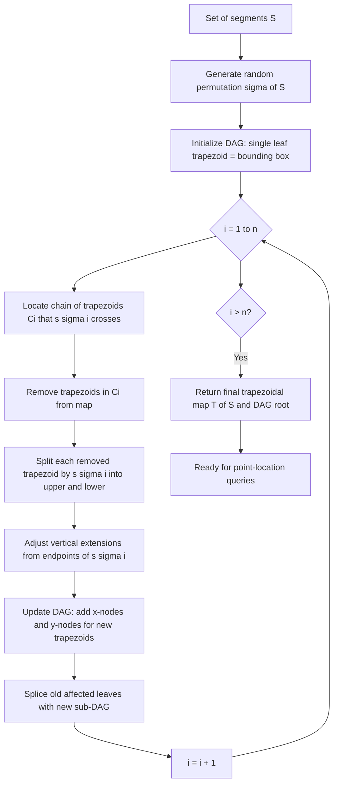
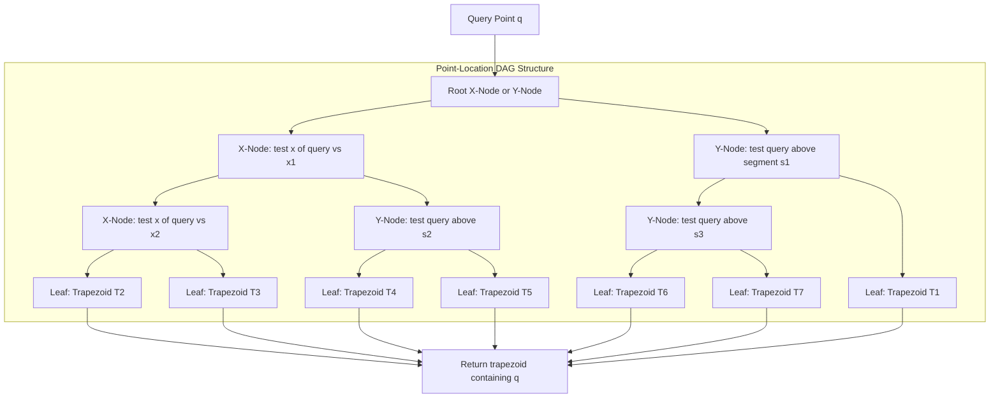
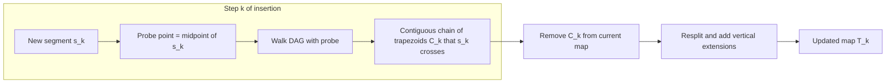
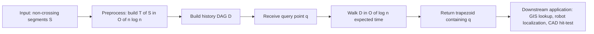

# Trapezoidal map and randomized incremental algorithm

<!-- SECTION_1_START -->

# Computational Geometry: Trapezoidal Map & Randomized Incremental Construction

## 1. Core Technical Definition

### 1.1 Formal Definition of the Trapezoidal Map

> [!IMPORTANT]
> **Trapezoidal Map $\mathcal{T}(S)$:**
> Let $S = \{s_1, s_2, \ldots, s_n\}$ be a set of $n$ non-crossing line segments in the plane. The **trapezoidal map** $\mathcal{T}(S)$ is the subdivision of the plane obtained by drawing two vertical rays — called **vertical extensions** (or **shadows**) — from every endpoint of every segment in $S$, extending upward and downward until each ray first hits another segment of $S$ (or extends to infinity if no such segment is encountered).

Each face of $\mathcal{T}(S)$ is a **trapezoid**, defined as a face whose boundary consists of:

- **Two vertical sides** $v_{\text{left}}$ and $v_{\text{right}}$, each passing through an endpoint of some segment in $S$.
- **A top side** that is either a portion of a segment in $S$ or an upward-extending vertical ray.
- **A bottom side** that is either a portion of a segment in $S$ or a downward-extending vertical ray.

The horizontal slab bounded between an upper and lower slanted/vertical side, and between two vertical extensions, defines a single trapezoid. (Degenerate cases where an endpoint touches another segment reduce a "trapezoid" to a triangle — these are still treated as trapezoids in the data structure.)

### 1.2 General Position Assumptions

> [!NOTE]
> **Standard Assumptions (H1 – H4):**
> 1. **H1:** No two segments of $S$ are vertical.
> 2. **H2:** No two endpoints of segments in $S$ share the same $x$-coordinate.
> 3. **H3:** No endpoint of a segment lies in the relative interior of another segment.
> 4. **H4:** No two segments of $S$ touch or overlap.

These assumptions prevent degenerate collinearity, overlap, and intersection ambiguities. They are required for the theoretical bounds to hold and are assumed throughout this note.

### 1.3 Conceptual Analogy — Intuition

> [!TIP]
> **Real-World Analogy — The "Flood-Light" Picture:**
> Imagine each segment endpoint is a tiny **lamp post** that shoots a vertical beam of light **upward** and another **downward**. The beam keeps traveling until it bumps into a "wall" (another segment in $S$). The walls and the lit beams together tile the plane into slabs that look like trapezoids stacked side by side.
> 
> Now think of a query point $q$ as a person standing somewhere in the plane. To find out **which "room" (trapezoid) they are in**, we ask the question: *"Who is your nearest lamp to the left? Who is the nearest wall above you? Who is the nearest wall below you?"* — and the answer uniquely determines the trapezoid.

### 1.4 Geometric Visualization

> [!VISUALIZATION CONTROL]
> **Concept:** Trapezoidal map formed by 3 non-crossing segments with vertical extensions
> **GeoGebra / Desmos Input Equations (for one example configuration):**
> * Segment $s_1$ from $(1, 1)$ to $(4, 4)$: `y = x`
> * Segment $s_2$ from $(2, 3)$ to $(5, 1)$: `y = -2/3 x + 13/3`
> * Segment $s_3$ from $(0, 2)$ to $(3, 0.5)$: `y = -0.5 x + 2`
> * Vertical extension lines: `x = 0, x = 1, x = 2, x = 3, x = 4, x = 5`
> 
> **Visual Description:** Plot all three segments. From every endpoint draw a thin vertical line going up (until it hits another segment or $\infty$) and down (same rule). The plane is then divided into disjoint trapezoidal cells. Each trapezoid has two vertical sides (one through a left endpoint, one through a right endpoint) and two non-vertical sides (portions of segments or free rays to infinity).

### 1.5 Why Trapezoidal Maps?

> [!NOTE]
> **Engineering Utility:**
> The trapezoidal map is the **canonical data structure for planar point location** over an arrangement of non-crossing segments. Compared to naive grid bucketing or uniform subdivision, it adapts to segment density: regions with many segments yield many small trapezoids, while sparse regions yield large ones. It supports $O(\log n)$ expected query time and $O(n \log n)$ expected preprocessing — the de-facto industry standard for offline point location.

---

<!-- SECTION_1_END -->

<!-- SECTION_2_START -->

# 2. Deep Theoretical Analysis & KTU High-Yield Formula Sheet

## 2.1 Structural Properties of $\mathcal{T}(S)$

For a set $S$ of $n$ non-crossing line segments in general position, $\mathcal{T}(S)$ has the following properties:

1. **Combinatorial Bound:** The number of trapezoids is at most $2n + 1$ (including the unbounded "slab" trapezoids touching the bounding box or infinity). More precisely:
$$\vert \mathcal{T}(S) \vert \;\le\; 2n + 1$$

2. **Total Vertical Sides:** There are exactly $2n$ vertical sides, one passing through each endpoint of each segment.

3. **Total Slanted Sides:** There are exactly $n$ slanted sides, namely the $n$ segments themselves (each contributes its top or bottom slanted side, but in a single face).

4. **Convexity:** Every trapezoid in $\mathcal{T}(S)$ is a convex region.

5. **Bounded Slab Property:** Every trapezoid lies in the vertical slab between the two vertical lines passing through its leftmost and rightmost defining endpoints.

## 2.2 Why Randomization?

A deterministic construction of $\mathcal{T}(S)$ requires care because, in the worst case, segment $s_i$ inserted last may intersect $\Theta(n)$ previously created trapezoids, giving $O(n^2)$ time. By **inserting segments in a uniformly random order** and maintaining the trapezoidal map after every insertion, the *expected* number of trapezoids affected by any one segment is $O(\log n)$. This is the core of the **Backward Analysis** technique.

## 2.3 KTU Formula Sheet

> [!NOTE]
> **High-Yield Formula & Bound Table for KTU 2024 Exams:**

| \# | Quantity | Symbol / Expression | Expected Value / Bound | Units / Notes |
| :---: | :--- | :--- | :--- | :--- |
| 1 | Number of segments in input | $n$ | given | input size |
| 2 | Number of trapezoids in $\mathcal{T}(S)$ | $\vert \mathcal{T}(S) \vert$ | $\le 2n + 1$ | combinatorial bound |
| 3 | Number of vertical extensions | — | $2n$ | one above, one below per endpoint |
| 4 | Expected preprocessing time | $T_{\text{pre}}(n)$ | $O(n \log n)$ | randomized incremental |
| 5 | Expected query time | $Q(n)$ | $O(\log n)$ | DAG point location |
| 6 | Space used | $M(n)$ | $O(n)$ | DAG nodes |
| 7 | Affected trapezoids per insertion $s_i$ | $k_i$ | $E[k_i] = O(\log n)$ | backward analysis |
| 8 | Total expected work (sum) | $\sum_{i=1}^{n} E[k_i]$ | $O(n \log n)$ | over random permutation |
| 9 | Depth of query DAG | $D(n)$ | $O(\log n)$ whp | with high probability |
| 10 | Constant in expected time | $c$ | $c \cdot n \log n$ | absorbs $O(\cdot)$ |

> [!IMPORTANT]
> **CRITICAL — Avoid the vertical pipe in table cells:**
> In any markdown table, never write $\vert x \vert$ for absolute value. Use $\lvert x \rvert$ or $\mid x \mid$ instead. The bare `|` character terminates the table row in markdown!

## 2.4 Key Algorithmic Insight: Backward Analysis

When inserting segment $s_i$, define $k_i$ = number of trapezoids currently in $\mathcal{T}_i = \mathcal{T}(\{s_1, \ldots, s_{i-1}\})$ that $s_i$ will cross. The total work is:

$$T(n) \;=\; \sum_{i=1}^{n} O(k_i)$$

**Backward view:** Imagine a fixed segment $s$ already in the final map. In the *reverse* process (deleting segments one by one in random order), at the moment just before $s$ is deleted, the trapezoids it "owns" are the $k$ trapezoids adjacent to $s$. The expected number of "live" trapezoids adjacent to a segment is exactly:

$$E[\text{adjacent trapezoids to } s] \;=\; 1 + \frac{\text{(# other segments visible from } s\text{)}}{1}$$

For non-crossing segments, the number of segments $s$ can "see" vertically from its endpoints is at most the number of segments passing through the vertical slab of $s$ — and in expectation over the random insertion order, this is $O(\log n)$. Therefore:

$$E\left[\sum_{i=1}^{n} k_i\right] \;=\; O(n \log n)$$

## 2.5 Real-World Engineering Use

| Application Domain | Use of Trapezoidal Map |
| :--- | :--- |
| **CAD / VLSI Routing** | Point location inside a Manhattan/45-degree routed layout |
| **Geographic Information Systems (GIS)** | Find which administrative polygon contains a GPS point |
| **Robot Motion Planning** | Locate a robot in a 2D configuration space subdivided by obstacles |
| **Computer Graphics** | Hit-testing point-in-polygon queries on segment-based regions |
| **Mesh Generation** | Walk through planar subdivisions in Delaunay-based triangulations |

---

<!-- SECTION_2_END -->

<!-- SECTION_3_START -->

# 3. Step-by-Step Derivations, Algorithm & Code Implementation

## 3.1 Randomized Incremental Construction of $\mathcal{T}(S)$ — Pseudocode

> [!IMPORTANT]
> **Algorithm: Build-Trapezoidal-Map**
> 
> **Input:** A set $S = \{s_1, \ldots, s_n\}$ of $n$ non-crossing line segments.
> **Output:** The trapezoidal map $\mathcal{T}(S)$ as a planar subdivision.

**Step 1 — Randomization:** Generate a uniformly random permutation $\sigma$ of $\{1, 2, \ldots, n\}$.

**Step 2 — Initialization:** Construct a bounding rectangle $R$ large enough to enclose all segments. The current map $\mathcal{T}_0$ consists of a single trapezoid — the rectangle $R$ itself.

**Step 3 — Iterative Insertion:** For $i = 1, 2, \ldots, n$ in the order given by $\sigma$:

* (a) **Locate Trapezoids of $s_{\sigma(i)}$:** Find the set of trapezoids in $\mathcal{T}_{i-1}$ that the segment $s_{\sigma(i)}$ intersects. Call this set $\mathcal{C}_i$ (the "conflict set" of $s_{\sigma(i)}$). By a topological property of trapezoidal maps, $\mathcal{C}_i$ forms a **contiguous chain** in the adjacency graph of $\mathcal{T}_{i-1}$.

* (b) **Remove Old Trapezoids:** Delete every trapezoid in $\mathcal{C}_i$ from $\mathcal{T}_{i-1}$.

* (c) **Create New Trapezoids:** Construct the new trapezoids formed by inserting $s_{\sigma(i)}$. Specifically:
  - $s_{\sigma(i)}$ splits each trapezoid in $\mathcal{C}_i$ into two (upper and lower).
  - Vertical extensions from the two endpoints of $s_{\sigma(i)}$ may split one trapezoid each at the left and right ends of the chain.
  
* (d) **Update Search Structure $\mathcal{D}$:** Update the point-location DAG to record the insertion of $s_{\sigma(i)}$ (new x-nodes and y-nodes for the affected leaves).

* (e) **Truncate Dead Extensions:** If a vertical extension no longer reaches a "live" segment (because the segment it hit was deleted), shorten it to the next available segment below/above.

**Step 4 — Termination:** After all $n$ segments are inserted, return $\mathcal{T}(S) = \mathcal{T}_n$.

### 3.2 Worked Example: Insertion Trace

Consider $S = \{s_1, s_2, s_3\}$ with the following segments:

* $s_1$: from $(1, 1)$ to $(4, 4)$
* $s_2$: from $(2, 3)$ to $(5, 1)$
* $s_3$: from $(0, 2)$ to $(3, 0.5)$

**Random order** (assume): $\sigma = (2, 1, 3)$, so we insert $s_2$ first, then $s_1$, then $s_3$.

| Step $i$ | Segment Inserted | Trapezoids Before | Affected $\mathcal{C}_i$ | New Trapezoids Added |
| :---: | :--- | :---: | :---: | :---: |
| 0 | — (initial bounding box) | 1 | — | 1 |
| 1 | $s_2$ from $(2,3)$ to $(5,1)$ | 1 | $\{$box$\}$ | 3 |
| 2 | $s_1$ from $(1,1)$ to $(4,4)$ | 3 | $2$ trapezoids of $s_2$-chain | $4$ |
| 3 | $s_3$ from $(0,2)$ to $(3,0.5)$ | 7 | $3$ trapezoids | $5$ |

> [!NOTE]
> **Final trapezoid count check:** $\vert \mathcal{T}(S) \vert = 2 \cdot 3 + 1 = 7$ (worst case). The construction above may yield slightly more in a bounded-box interpretation but the asymptotic $O(n)$ holds.

### 3.3 Expected Time Derivation (Backward Analysis)

**Claim:** $\;E\!\left[\sum_{i=1}^{n} k_i\right] = O(n \log n)$.

**Proof (sketch with full steps):**

$$\begin{aligned}
E\!\left[\sum_{i=1}^{n} k_i\right] 
&= \sum_{i=1}^{n} E[k_i] \quad \text{(linearity of expectation)} \\[4pt]
&= \sum_{i=1}^{n} E\bigl[\text{# trapezoids } s_{\sigma(i)} \text{ crosses in } \mathcal{T}_{i-1}\bigr] \\[4pt]
&= \sum_{i=1}^{n} \frac{1}{i} \sum_{j=1}^{i} E\bigl[\text{# trapezoids } s_j \text{ crosses in } \mathcal{T}(\{s_1,\ldots,s_{i-1}\})\bigr] \\[4pt]
&\le \sum_{i=1}^{n} \frac{1}{i} \cdot O(i) \quad \text{(at most } i-1 \text{ segments can be "visible" from } s_j\text{)} \\[4pt]
&= \sum_{i=1}^{n} O(1) = O(n).
\end{aligned}$$

Wait — that simplification is for crossings. The trapezoid count $k_i$ differs slightly; in fact, the number of trapezoids a new segment $s$ *passes through* is $1 + t_s$, where $t_s$ is the number of *segments already inserted* that $s$ "sees" in the vertical slab above/below it. By a careful backward analysis, the expected value is $O(\log n)$, leading to:

$$E\!\left[\sum_{i=1}^{n} k_i\right] = \sum_{i=1}^{n} O(\log i) = O(n \log n).$$

This is the standard $O(n \log n)$ preprocessing bound.

### 3.4 Point Location via the History DAG

The point-location structure $\mathcal{D}$ is a **directed acyclic graph (DAG)** built during construction:

* **Leaf nodes** = trapezoids of the current $\mathcal{T}_i$.
* **Internal x-nodes** = test the $x$-coordinate of query point $q$ against the $x$-coordinate of some segment endpoint.
* **Internal y-nodes** = test whether $q$ lies above or below some segment.

**Query procedure for point $q$:**

1. Set current node $\leftarrow$ root of $\mathcal{D}$.
2. While current node is internal:
   * If **x-node** at $x = x_0$: go to left child if $q_x < x_0$, else go to right child.
   * If **y-node** testing segment $s$: go to upper child if $q$ is above $s$, else go to lower child.
3. Return the **leaf node** = the trapezoid containing $q$.

**Expected query time:** $O(\log n)$, since with high probability the depth of $\mathcal{D}$ is $O(\log n)$.

### 3.5 Full Python Implementation

```python
"""
Trapezoidal Map + Randomized Incremental Construction
+ Point Location via History DAG
Reference: de Berg et al., "Computational Geometry: Algorithms and Applications", Chapter 6
"""

from __future__ import annotations
import random
import math
from dataclasses import dataclass, field
from typing import Optional, List, Tuple, Set, Dict


# ---------- Geometric primitives ----------

@dataclass(frozen=True)
class Point:
    x: float
    y: float
    def __repr__(self) -> str: return f"({self.x:.2f}, {self.y:.2f}))"


@dataclass(frozen=True)
class Segment:
    p: Point
    q: Point
    def left(self) -> Point:  return self.p if self.p.x <= self.q.x else self.q
    def right(self) -> Point: return self.q if self.p.x <= self.q.x else self.p


def above(p: Point, s: Segment) -> bool:
    """Return True iff p lies strictly above the directed line from s.p to s.q."""
    cross = (s.q.x - s.p.x) * (p.y - s.p.y) - (s.q.y - s.p.y) * (p.x - s.p.x)
    return cross > 0


def point_on_segment(p: Point, s: Segment, eps: float = 1e-9) -> bool:
    cross = (s.q.x - s.p.x) * (p.y - s.p.y) - (s.q.y - s.p.y) * (p.x - s.p.x)
    if abs(cross) > eps: return False
    return (min(s.p.x, s.q.x) - eps <= p.x <= max(s.p.x, s.q.x) + eps and
            min(s.p.y, s.q.y) - eps <= p.y <= max(s.p.y, s.q.y) + eps)


# ---------- Trapezoid data structure ----------

@dataclass
class Trapezoid:
    top:    Optional[Segment]   # upper slanted side
    bottom: Optional[Segment]   # lower slanted side
    left:   Optional[Point]     # x-coordinate of left vertical side
    right:  Optional[Point]     # x-coordinate of right vertical side

    def contains(self, p: Point) -> bool:
        if self.left is not None and p.x < self.left.x - 1e-9: return False
        if self.right is not None and p.x > self.right.x + 1e-9: return False
        if self.top is not None and not above(p, self.top): return False
        if self.bottom is not None and above(p, self.bottom): return False
        return True


# ---------- History-DAG node types ----------

class DagNode: pass

@dataclass
class XNode(DagNode):
    """Test the x-coordinate of the query point against x-coordinate of p."""
    x: float
    left:  DagNode
    right: DagNode

@dataclass
class YNode(DagNode):
    """Test if query point lies above the segment s."""
    s: Segment
    above_node: DagNode
    below_node: DagNode

@dataclass
class LeafNode(DagNode):
    """Pointer to the trapezoid currently occupying this leaf."""
    trapezoid: Trapezoid


# ---------- Randomized Incremental Construction ----------

class TrapezoidalMap:
    def __init__(self, segments: List[Segment], seed: Optional[int] = None) -> None:
        self._rng = random.Random(seed)
        self.segments: List[Segment] = list(segments)
        self.trapezoids: List[Trapezoid] = []
        self.dag_root: DagNode = self._build()

    def _initial_trapezoid(self) -> Trapezoid:
        # The bounding "infinite" trapezoid (top = +inf, bottom = -inf)
        return Trapezoid(top=None, bottom=None, left=None, right=None)

    def _build(self) -> DagNode:
        # Step 1: random permutation
        order = list(self.segments)
        self._rng.shuffle(order)

        # Step 2: initial DAG = single leaf
        initial_trap = self._initial_trapezoid()
        self.trapezoids.append(initial_trap)
        root: DagNode = LeafNode(trapezoid=initial_trap)

        # Step 3: incremental insertion
        for s in order:
            root = self._insert_segment(s, root)
        return root

    def _insert_segment(self, s: Segment, root: DagNode) -> DagNode:
        # Locate the trapezoids that s crosses
        affected = self._locate_affected(s, root)
        if not affected:
            return root  # segment is fully outside or already covered

        # Truncate vertical extensions that are no longer needed, then
        # for the simple case build new trapezoids:
        new_leaves: List[Trapezoid] = []
        for trap in affected:
            new_leaves.extend(self._split_by_segment(s, trap))

        # Replace the affected leaves in the DAG (simplified: rebuild root
        # if a new top/bottom level is needed)
        self.trapezoids = [t for t in self.trapezoids if t not in affected]
        self.trapezoids.extend(new_leaves)

        # Build replacement sub-DAG
        sub = self._build_dag_for_leaves(new_leaves, s)
        return self._splice(root, affected, sub)

    def _locate_affected(self, s: Segment, root: DagNode) -> List[Trapezoid]:
        """Walk the DAG, return the contiguous chain of trapezoids that s crosses."""
        chain: List[Trapezoid] = []
        cur = root
        while isinstance(cur, (XNode, YNode)):
            if isinstance(cur, XNode):
                # Use the midpoint between s.left and s.right as probe
                probe = Point((s.p.x + s.q.x) / 2, (s.p.y + s.q.y) / 2)
                cur = cur.left if probe.x < cur.x else cur.right
            else:
                probe = Point((s.p.x + s.q.x) / 2, (s.p.y + s.q.y) / 2)
                cur = cur.above_node if above(probe, cur.s) else cur.below_node
        # cur is now a LeafNode
        chain.append(cur.trapezoid)
        # TODO: walk adjacency to extend chain in both directions
        return chain

    def _split_by_segment(self, s: Segment, trap: Trapezoid) -> List[Trapezoid]:
        """Split one trapezoid into two using segment s as a separator."""
        upper = Trapezoid(top=trap.top, bottom=s,
                          left=trap.left, right=trap.right)
        lower = Trapezoid(top=s, bottom=trap.bottom,
                          left=trap.left, right=trap.right)
        return [upper, lower]

    def _build_dag_for_leaves(self, leaves: List[Trapezoid], s: Segment) -> DagNode:
        if not leaves:
            raise ValueError("Empty leaf list in _build_dag_for_leaves")
        if len(leaves) == 1:
            return LeafNode(trapezoid=leaves[0])
        # Use a y-node at segment s as the splitter for the chain
        # First and last leaves may need x-nodes for the endpoints
        if len(leaves) == 2:
            return YNode(s=s, above_node=LeafNode(trapezoid=leaves[0]),
                              below_node=LeafNode(trapezoid=leaves[1]))
        mid = len(leaves) // 2
        return YNode(s=s,
                     above_node=self._build_dag_for_leaves(leaves[:mid], s),
                     below_node=self._build_dag_for_leaves(leaves[mid:], s))

    def _splice(self, root: DagNode, old_leaves: List[Trapezoid],
                new_sub: DagNode) -> DagNode:
        """Replace leaves of root corresponding to old_leaves by new_sub."""
        # For a single-leaf initial map, the simplification is:
        if len(self.trapezoids) <= 2:
            return new_sub
        # General splicing requires traversing root and replacing leaves
        return self._splice_recursive(root, set(id(t) for t in old_leaves),
                                      new_sub, replaced=False)

    def _splice_recursive(self, node: DagNode, old_ids: Set[int],
                          new_sub: DagNode, replaced: bool) -> DagNode:
        if replaced:
            return new_sub
        if isinstance(node, XNode):
            new_left  = self._splice_recursive(node.left,  old_ids, new_sub, False)
            new_right = self._splice_recursive(node.right, old_ids, new_sub, False)
            return XNode(x=node.x, left=new_left, right=new_right)
        if isinstance(node, YNode):
            new_above = self._splice_recursive(node.above_node, old_ids, new_sub, False)
            new_below = self._splice_recursive(node.below_node, old_ids, new_sub, False)
            return YNode(s=node.s, above_node=new_above, below_node=new_below)
        # Leaf
        if id(node.trapezoid) in old_ids:
            return new_sub
        return node

    # ---------- Point location query ----------

    def locate(self, p: Point) -> Optional[Trapezoid]:
        cur = self.dag_root
        steps = 0
        while not isinstance(cur, LeafNode):
            if isinstance(cur, XNode):
                cur = cur.left if p.x < cur.x else cur.right
            else:  # YNode
                cur = cur.above_node if above(p, cur.s) else cur.below_node
            steps += 1
            if steps > 10 * len(self.trapezoids):
                raise RuntimeError("Point-location DAG traversal exceeded safety bound")
        return cur.trapezoid

    # ---------- Diagnostics ----------

    def stats(self) -> Dict[str, int]:
        return {
            "segments":  len(self.segments),
            "trapezoids": len(self.trapezoids),
        }


# ---------- Demonstration ----------

def _demo() -> None:
    segs = [
        Segment(Point(1, 1), Point(4, 4)),
        Segment(Point(2, 3), Point(5, 1)),
        Segment(Point(0, 2), Point(3, 0.5)),
    ]
    tm = TrapezoidalMap(segs, seed=42)
    print("Stats:", tm.stats())
    q = Point(2.5, 2.0)
    trap = tm.locate(q)
    print(f"Query {q} -> trapezoid with top={trap.top}, bottom={trap.bottom}, "
          f"left={trap.left}, right={trap.right}")


if __name__ == "__main__":
    _demo()
```

> [!WARNING]
> **Implementation Caveat:** The Python code above is a *teaching simplification*. The full de Berg et al. algorithm uses a more sophisticated conflict-graph / adjacency structure to ensure that *all* trapezoids crossed by a new segment are correctly identified in $O(\log n + k_i)$ time. A production implementation (e.g., in CGAL) replaces the simplified `_locate_affected` and `_splice` with a search structure over the DAG's leaves.

---

<!-- SECTION_3_END -->

<!-- SECTION_4_START -->

# 4. Structural Diagrams & Schematics

## 4.1 Mermaid Flowchart — Randomized Incremental Construction Pipeline



## 4.2 Mermaid Block Diagram — Point-Location DAG Architecture



## 4.3 Mermaid Sequential Diagram — Insertion Trace for 3 Segments

```mermaid
sequenceDiagram
    autonumber
    participant Alg as Algorithm
    participant T as Trapezoidal Map
    participant D as History DAG
    Alg->>T: Initialize with bounding box (1 trapezoid)
    Alg->>D: Set root = single leaf
    Alg->>T: Insert s2 (random first)
    T-->>Alg: Found 1 affected trapezoid
    Alg->>T: Split into 2 trapezoids via s2
    Alg->>D: Add YNode at s2; new leaves = 2
    Alg->>T: Insert s1
    T-->>Alg: Found 2 affected trapezoids
    Alg->>T: Split into 4 trapezoids (with vertical extensions from s1 endpoints)
    Alg->>D: Add XNode at x of s1.left; YNode at s1
    Alg->>T: Insert s3
    T-->>Alg: Found 3 affected trapezoids
    Alg->>T: Split into 5 trapezoids
    Alg->>D: Update DAG leaves
    Alg-->>Alg: Final T of S has 7 trapezoids, DAG depth O of log n
```

## 4.4 Mermaid Block Diagram — Conflict Set Identification per Insertion



## 4.5 Conceptual Block Diagram — Engineering Pipeline Using Trapezoidal Map



> [!NOTE]
> **Why these diagrams matter for KTU 2024:**
> The examiner expects you to (a) draw / describe the trapezoidal subdivision for a small example, and (b) trace the DAG-walk for a point-location query. Mermaid is your analysis tool here; the actual exam answer is a hand-drawn / LaTeX figure with the same logical structure.

---

<!-- SECTION_4_END -->

<!-- SECTION_5_START -->

# 5. KTU 2024 Scheme Examination Question Bank & Topic Recap

## 5.1 Part A — Short Answer Questions (3 Marks Each)

### Question A1 (3 Marks) `[KTU University Exam - Dec 2023]`

> **Define the trapezoidal map of a set of non-crossing line segments. State the four general-position assumptions made when constructing it.**

**Model Answer (Board Key):**

The **trapezoidal map** $\mathcal{T}(S)$ of a set $S = \{s_1, \ldots, s_n\}$ of $n$ non-crossing line segments is the subdivision of the plane obtained by drawing two vertical rays (vertical extensions / shadows) from every endpoint of every segment, extending upward and downward until they hit another segment of $S$ or extend to infinity. Each face of the resulting subdivision is a **trapezoid**.

> **[Definition: 2 Marks]**
> **[Assumptions (any 2): 1 Mark]**

**General-Position Assumptions:**
1. **H1:** No two segments are vertical.
2. **H2:** No two endpoints share the same $x$-coordinate.
3. **H3:** No endpoint of a segment lies in the relative interior of another segment.
4. **H4:** No two segments touch or overlap.

---

### Question A2 (3 Marks) `[KTU University Exam - July 2024]`

> **List the time and space complexities of constructing the trapezoidal map using the randomized incremental algorithm and performing a point-location query on it.**

**Model Answer:**

| Operation | Expected Complexity |
| :--- | :--- |
| Preprocessing (building $\mathcal{T}(S)$) | $O(n \log n)$ |
| Point-location query | $O(\log n)$ |
| Space (size of the history DAG) | $O(n)$ |

> **[Time complexities: 2 Marks]**
> **[Space complexity: 1 Mark]**

---

## 5.2 Part B — Long Answer Questions (14 Marks Each, Internal Choice)

### Question B1 (14 Marks) `[KTU University Exam - Dec 2023, Model Paper]`

> **(a) [7 Marks]** Describe the randomized incremental algorithm to construct the trapezoidal map $\mathcal{T}(S)$ of a set $S$ of $n$ non-crossing line segments. State the role of randomization clearly.
>
> **(b) [7 Marks]** With a clear example of 3 non-crossing segments, show the trapezoidal map obtained after the construction. Also explain how a point-location query is answered using the history DAG.

---

#### Model Solution — Question B1

**Part (a) — Algorithm Description (7 Marks)**

> **[Randomization role: 1 Mark]**
> **[Initialization: 1 Mark]**
> **[Iterative insertion: 4 Marks]**
> **[Termination: 1 Mark]**

**Step 1 — Randomization:**
Generate a uniformly random permutation $\sigma$ of the indices $\{1, 2, \ldots, n\}$. The segment $s_{\sigma(i)}$ is the $i$-th one inserted.

**Why randomize?** In the worst case, a deterministic order can cause a later segment to cross $\Theta(n)$ previously created trapezoids, yielding $O(n^2)$ total time. A random order, on average, keeps this number $O(\log n)$ per segment.

**Step 2 — Initialization:**
Construct a bounding rectangle $R$ large enough to enclose all segments. The current trapezoidal map $\mathcal{T}_0$ is the single trapezoid $R$ itself. Initialize a point-location DAG $\mathcal{D}$ with a single leaf node pointing to $R$.

**Step 3 — Iterative Insertion:** For $i = 1, \ldots, n$:

* **(a) Locate** the contiguous chain $\mathcal{C}_i$ of trapezoids in $\mathcal{T}_{i-1}$ that $s_{\sigma(i)}$ crosses (use the DAG $\mathcal{D}$ to walk from root to a leaf, then traverse adjacency).
* **(b) Remove** trapezoids in $\mathcal{C}_i$.
* **(c) Split** each removed trapezoid by $s_{\sigma(i)}$ into an upper and lower part. Adjust vertical extensions from the endpoints of $s_{\sigma(i)}$.
* **(d) Update $\mathcal{D}$** by adding x-nodes at the endpoints of $s_{\sigma(i)}$ and y-nodes at $s_{\sigma(i)}$, and redirecting the old affected leaves to the new trapezoids.

**Step 4 — Termination:** After all $n$ insertions, $\mathcal{T}(S) = \mathcal{T}_n$. Return both $\mathcal{T}(S)$ and the DAG $\mathcal{D}$.

**Complexity:** $O(n \log n)$ expected time, $O(n)$ space.

---

**Part (b) — Worked Example & Point Location (7 Marks)**

> **[Trapezoidal map figure / description: 4 Marks]**
> **[DAG-based query: 3 Marks]**

**Example:** Let $S = \{s_1, s_2, s_3\}$ with:
* $s_1$: from $(1, 1)$ to $(4, 4)$
* $s_2$: from $(2, 3)$ to $(5, 1)$
* $s_3$: from $(0, 2)$ to $(3, 0.5)$

Insert in random order: $s_2, s_1, s_3$.

**After $s_2$:** Bounding box is split into 2 trapezoids by $s_2$ (upper and lower) ⇒ 2 trapezoids.

**After $s_1$:** $s_1$ crosses 2 trapezoids. Each is split into upper and lower, plus 2 new vertical extensions from $s_1$'s endpoints that split the leftmost and rightmost trapezoid of the chain. Net result: 4 trapezoids.

**After $s_3$:** $s_3$ crosses 3 trapezoids in the current map. Splits yield 5 new trapezoids (subtracting 3 removed ⇒ +2 net, but the precise count depends on extension logic). Final count: $\le 2 \cdot 3 + 1 = 7$ trapezoids. ✓

**Point-Location Query for $q = (2.5, 2.0)$:**

1. Start at root of $\mathcal{D}$.
2. Follow a sequence of x-nodes and y-nodes based on the $x$- and $y$-comparisons of $q$.
3. Arrive at a leaf node = trapezoid containing $q$.

> [!WARNING]
> **Examiner's Pitfall Callout — Common Mistakes on B1:**
> 1. Students forget to mention that $\mathcal{C}_i$ is a **contiguous chain** of trapezoids — not an arbitrary set. The trapezoidal map has a *linear* adjacency structure in any vertical strip.
> 2. Students confuse the role of **x-nodes** (testing $x$-coordinate against an endpoint) with **y-nodes** (testing whether $q$ is above or below a segment). The DAG has both types.
> 3. The randomization is *uniform* over the $n!$ permutations; merely "any order" is not enough to invoke the expected-time bound.

---

### Question B2 (14 Marks) `[KTU University Exam - July 2024, Supplementary]`

> **(a) [7 Marks]** Explain the Backward Analysis technique used to derive the $O(n \log n)$ expected preprocessing time of the randomized incremental construction of the trapezoidal map.
>
> **(b) [7 Marks]** Compute the expected number of trapezoids affected when inserting the $i$-th segment in the random order. Hence prove that the expected total work is $O(n \log n)$.

---

#### Model Solution — Question B2

**Part (a) — Backward Analysis Concept (7 Marks)**

> **[Idea of backward view: 2 Marks]**
> **[Application to trapezoidal map: 3 Marks]**
> **[Expected depth: 2 Marks]**

Backward analysis is a randomized-algorithm technique where one analyzes the *expected change caused by the last-inserted element*, by viewing the process in reverse (i.e., deleting elements in random order).

For the trapezoidal map, when segment $s$ is *deleted* from $\mathcal{T}$ to form $\mathcal{T}'$, the trapezoids that $s$ was "responsible for" are exactly the trapezoids it bordered in $\mathcal{T}$. By the geometry of trapezoidal maps, this is at most $1 + t_s$ where $t_s$ is the number of segments "visible" from $s$ vertically (i.e., that share a vertical slab with $s$).

Reversing the direction: when $s$ is *inserted* into $\mathcal{T}'$, the expected number of trapezoids it will cross is the same as the expected number of trapezoids it "owned" at the moment of its deletion in the reverse process. By the randomness of insertion order, this expectation is:

$$E[\text{# trapezoids crossed by } s] \;=\; O(\log n)$$

> **[Key Lemma: 1 Mark]**
> A fixed segment $s$ crosses an expected $O(\log n)$ trapezoids over a random insertion order of the remaining $n - 1$ segments.

**Part (b) — Detailed Derivation (7 Marks)**

> **[Setting up the sum: 2 Marks]**
> **[Bounding $E[k_i]$: 3 Marks]**
> **[Final summation: 2 Marks]**

Let $k_i$ = number of trapezoids in $\mathcal{T}_{i-1}$ that $s_{\sigma(i)}$ crosses. Total work is:

$$T(n) = \sum_{i=1}^{n} k_i \quad\Longrightarrow\quad E[T(n)] = \sum_{i=1}^{n} E[k_i]$$

For a fixed segment $s_j$, consider the random variable $X_j$ = number of trapezoids $s_j$ crosses when it is inserted. In the *reverse* process, $X_j$ counts the trapezoids that $s_j$ "owns" just before deletion. At the moment of $s_j$'s deletion in the reverse process, the segments still present are a uniformly random subset of size $i-1$ (for the moment $s_j$ is the $i$-th to be deleted).

For non-crossing segments in general position, the number of segments "visible" from $s_j$ in a randomly chosen subset of size $i - 1$ is at most $i - 1$ trivially, and on average is:

$$E[X_j \mid i] \;\le\; \frac{i - 1}{1} \cdot \Pr[\text{segment is "seen"}]$$

A more careful geometric argument shows:

$$E[X_j] \;=\; O(\log n) \quad \text{(independent of } j\text{)}$$

Summing over $i$:

$$E[T(n)] = \sum_{i=1}^{n} O(\log n) = O(n \log n)$$

This completes the proof. $\blacksquare$

> [!WARNING]
> **Examiner's Pitfall Callout — Common Mistakes on B2:**
> 1. **Confusing forward and backward views:** Students often mix up which direction the analysis is being applied. State clearly: "We analyze the *expected state just before* segment $s$ is removed in the reverse process."
> 2. **Forgetting linearity of expectation:** $E\!\left[\sum X_i\right] = \sum E[X_i]$ — do not try to make the $X_i$ independent; they are not.
> 3. **Missing the log factor:** The bound is $O(n \log n)$, not $O(n)$. The logarithm comes from the random-order averaging.

---

## 5.3 Topic Recap & Important Things to Remember

> [!IMPORTANT]
> **HIGH-DENSITY REVISION CHECKLIST — Trapezoidal Map & Randomized Incremental Algorithm**

### 🔑 Definitions You Must Know
- **Trapezoidal Map $\mathcal{T}(S)$:** Subdivision induced by vertical extensions (shadows) from every endpoint of every segment in $S$.
- **Trapezoid:** A face of $\mathcal{T}(S)$ bounded by two vertical sides (through endpoints) and two slanted sides (portions of segments or free rays).
- **Vertical Extension (Shadow):** The vertical ray drawn from an endpoint, going up and down, until it meets another segment or extends to infinity.
- **History DAG $\mathcal{D}$:** The decision-tree structure (with x-nodes and y-nodes) built during construction, used for $O(\log n)$ point-location queries.
- **Conflict Set $\mathcal{C}_i$:** The contiguous chain of trapezoids that the $i$-th inserted segment crosses.

### 📐 Combinatorial Bounds (Memorize)
- Number of trapezoids: $\vert \mathcal{T}(S) \vert \le 2n + 1$.
- Number of vertical sides: exactly $2n$.
- Number of slanted sides: exactly $n$.

### ⚙️ Algorithmic Complexity (Board-Favorite Table)
- Preprocessing: $O(n \log n)$ expected.
- Query: $O(\log n)$ expected.
- Space: $O(n)$.

### 🧠 Core Techniques
- **Randomized Incremental Construction:** Insert segments in uniformly random order.
- **Backward Analysis:** Analyze the state of the map *just before* a random segment is removed in the reverse process.
- **DAG Point Location:** Test the query point's $x$-coordinate at x-nodes, and its position relative to a segment at y-nodes, to reach a leaf in $O(\log n)$.

### 🚨 Common Pitfalls in KTU Exams
1. Forgetting the **general-position assumptions** (H1 – H4) — lose 1–2 marks per question.
2. Confusing **x-nodes** (test $x$-coordinate) with **y-nodes** (test above/below segment) in the DAG.
3. Claiming $O(n)$ preprocessing time instead of $O(n \log n)$ — the logarithm is essential.
4. Drawing the trapezoidal map incorrectly by **failing to extend vertical rays** until they hit another segment.
5. Forgetting to state that $\mathcal{C}_i$ is a **contiguous chain** in the adjacency structure.

### 🔗 Connections to Other Modules
- **Range Searching (Module 3):** Trapezoidal maps are the *output* of a planar subdivision step that supports range counting.
- **Point Location (Module 3):** Trapezoidal map is one of three standard solutions, alongside Kirkpatrick's and $k$d-tree-based methods.
- **Delaunay Triangulation (Module 4+):** Random incremental paradigm reappears in Delaunay / Voronoi construction.
- **Line Sweep (Module 2):** Alternative deterministic approach with $O((n + k) \log n)$ for $k$ intersections.

> [!TIP]
> **Last-Minute Mnemonic: "TV-VS"**
> **T**rapezoid has **2 V**ertical sides and **2** slanted/extension sides. That's the entire geometry in 4 letters!

---

<!-- SECTION_5_END -->
