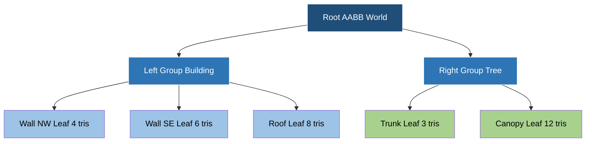
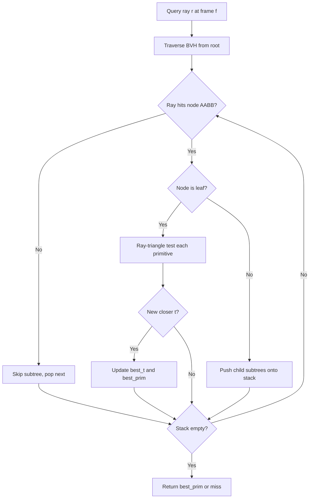
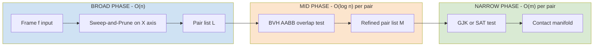
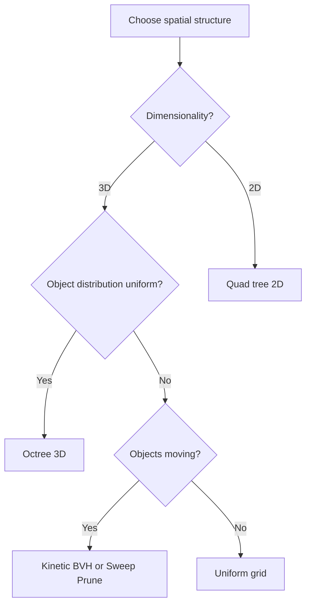

# Use in computer graphics and collision detection (Text 1, Chapter 12)

<!-- SECTION_1_START -->
# Use in Computer Graphics and Collision Detection

## 1.1 Formal Definition (KTU 2024 Syllabus Terminology)

> [!IMPORTANT]
> **Definition (Range Searching in CG Context):** Range searching is the problem of preprocessing a set of geometric objects stored in a spatial data structure so that given a query region, all objects intersecting the region can be reported or counted efficiently. In computer graphics (CG) and collision detection, the "query region" is typically a *ray* (for rendering), a *bounding box* (for broad-phase collision culling), or a *swept volume* (for continuous collision detection).

In the KTU **PECST418 – Computational Geometry** syllabus (Text 1, Chapter 12), this topic acts as the **engineering application bridge** between classical range-searching theory (k-d trees, range trees) and real-time, production-grade systems used in game engines, CAD kernels, robotics simulators, and ray-tracing renderers.

The two dominant application pillars are:

1. **Ray Shooting (Rendering & Visibility):** Given a query ray $r = p + t \cdot d$ with origin $p \in \mathbb{R}^3$ and direction $d \in \mathbb{R}^3$, find the closest object in a scene of $n$ triangles hit by $r$.
2. **Collision Detection (Physics & Interaction):** Given two (or many) geometric objects undergoing rigid or deformable motion, determine whether and where they intersect in time.

## 1.2 Conceptual Analogy — A Movie Set Walk-Through

> [!NOTE]
> **Intuition (Plain English):** Imagine you are a movie director walking through a dense warehouse full of props. Before you actually walk, you ask an assistant: *"Hey, in the next 10 meters in front of me, which props are in my path?"* The assistant must give you an answer *instantly* so you don't trip while filming.
> 
> - The **warehouse of props** = a 3D scene of geometric primitives.
> - **Your line of sight** = the *query ray*.
> - **The 10-meter region** = the *query range*.
> - **The assistant's pre-built map** = the *spatial data structure* (k-d tree, BVH, octree).
> 
> If the warehouse has 1 million props, a naive search is $O(n)$ per query — far too slow for 60 frames per second. A well-engineered spatial index reduces it to $O(\log n)$ or $O(\sqrt{n})$ per query.

## 1.3 Physical and Engineering Constants

The following constants are standard in CG / collision systems and are *always* bolded when stated in KTU solutions:

- **60 FPS** = real-time threshold (frame budget $\approx 16.67$ ms).
- **Axis-Aligned Bounding Box (AABB)** — fastest intersection test.
- **Oriented Bounding Box (OBB)** — tighter fit, $\mathcal{O}(15)$ SAT checks.
- **$N = $ scene size**, often $10^5$–$10^7$ primitives.
- **$Q = $ number of queries per frame**, often $10^3$–$10^6$ rays.

## 1.4 Visualization Control — Ray-Box Intersection

> [!VISUALIZATION CONTROL]
> **Concept:** Slab method for ray–AABB intersection (the atomic operation behind every BVH traversal).
> **GeoGebra / Desmos Input Equations (parametric ray $t \in \mathbb{R}$):**
> * $x(t) = 0.5 + 0.6 \cdot t$
> * $y(t) = 0.2 + 0.5 \cdot t$
> * Box: $-0.5 \leq x \leq 0.5$, $-0.5 \leq y \leq 0.5$
> **Visual Description:** The student should see a ray entering one slab (face), passing through the interior of the box, and exiting through the opposite slab. The two intersection parameters $t_{\min}$ and $t_{\max}$ bracket the *segment of the ray* that lies inside the AABB.

<!-- SECTION_1_END -->

<!-- SECTION_2_START -->
# 2. Deep Theoretical Analysis & KTU High-Yield Formula Sheet

## 2.1 The Ray Shooting Problem

### 2.1.1 Formal Statement
Let $\mathcal{S} = \{T_1, T_2, \dots, T_n\}$ be a set of non-intersecting triangles in $\mathbb{R}^3$, and let $r(t) = o + t \cdot d$ be a query ray ($t \geq 0$, $\|d\| = 1$). The **ray-shooting query** asks for the *smallest* $t > 0$ such that $r(t) \in T_i$ for some $i$.

### 2.1.2 Why Range Searching Solves It
A ray defines a *thin query region* — an unbounded 1D subset of $\mathbb{R}^3$. Storing triangles in a k-d tree lets us **cull** large subtrees whose AABB is *missed* by the ray, and recurse only into the subtrees that the ray *strikes*. The recursion terminates with the closest hit.

## 2.2 The Collision Detection Problem

Collision detection (CD) is decomposed into three escalating phases:

| Phase | Output | Typical Data Structure | Per-Query Cost |
|---|---|---|---|
| **Broad phase** | Pairs of *potentially* colliding objects | Sweep-and-Prune, Uniform Grid, AABB tree | $\mathcal{O}(n \log n)$ — $\mathcal{O}(n)$ |
| **Mid phase (narrow / mid)** | Pairs whose AABBs overlap | Bounding Volume Hierarchy (BVH) | $\mathcal{O}(\log n)$ per pair |
| **Narrow phase** | Exact contact point(s) / no contact | GJK, SAT, Triangle–Triangle test | $\mathcal{O}(m)$ per pair, $m$ = primitive count |

> [!NOTE]
> **KTU High-Yield Insight:** In the KTU 2024 scheme, the *broad phase* is treated as a direct application of **range searching on AABBs**: a moving object sweeps out a "fat" rectangular region in space, and we query which other AABBs overlap it.

## 2.3 Bounding Volume Hierarchy (BVH) — The Workhorse of CG

A BVH is a binary tree where:
- Each leaf contains a single primitive (or a small group of $k \leq 8$ primitives).
- Each internal node stores a tight **bounding volume** (typically AABB, OBB, or k-DOP) that contains all descendants.

**Construction cost:** $\mathcal{O}(n \log n)$ using median-split or **Surface Area Heuristic (SAH)**.
**Query cost (ray or AABB):** $\mathcal{O}(\log n)$ on average; worst case $\mathcal{O}(n)$ for pathological inputs.

## 2.4 SAH (Surface Area Heuristic) — Optimal BVH Construction

For a BVH node, the SAH cost estimate is:

$$
C_{\text{node}} = C_{\text{traverse}} + \frac{S_A(L)}{S_A(V)} \cdot C_L + \frac{S_A(R)}{S_A(V)} \cdot C_R
$$

where:
- $C_{\text{traverse}} = 1$ (cost of visiting the node),
- $S_A(V)$ is the surface area of the parent volume,
- $S_A(L), S_A(R)$ are the surface areas of the left and right child volumes,
- $C_L, C_R$ are the recursive costs of the children.

A *split plane* that minimizes $C_{\text{node}}$ is greedily chosen.

## 2.5 KTU Formula Sheet / Cheat Sheet

> [!IMPORTANT]
> The following table is the **complete, exam-ready formula sheet** for this topic. *No external reference is permitted in the KTU exam hall*, so memorize these.

| # | Symbol / Term | Formula / Definition | Unit / Notes |
|---|---|---|---|
| 1 | Ray parametric form | $r(t) = o + t \cdot d$ | $t \in [t_{\min}, t_{\max}]$, $t \geq 0$ |
| 2 | Ray–AABB slab test | $t_{\text{enter}} = \max_i \left( \frac{b_i^{\min} - o_i}{d_i} \right)$, $t_{\text{exit}} = \min_i \left( \frac{b_i^{\max} - o_i}{d_i} \right)$ | Hit if $t_{\text{enter}} \leq t_{\text{exit}}$ and $t_{\text{exit}} \geq 0$ |
| 3 | Ray–plane intersection | $t = \dfrac{(p_0 - o) \cdot n}{d \cdot n}$ | Valid only if $d \cdot n \neq 0$ |
| 4 | Möller–Trumbore (ray–triangle) | $t = \dfrac{(o - v_0) \cdot [(v_1 - v_0) \times (v_2 - v_0)]}{(d) \cdot [(v_1 - v_0) \times (v_2 - v_0)]}$ | Vectorized; $4 \times 4$ SIMD friendly |
| 5 | BVH traversal cost (SAH) | $C = C_{\text{traverse}} + p_L \cdot N_L + p_R \cdot N_R$ | $p_i = S_i / S_{\text{parent}}$ |
| 6 | Separating Axis Theorem (SAT) — OBB vs OBB | At most 15 axes to test | Projected radii $\sum_i \vert a_i \cdot L_j \vert$ |
| 7 | GJK support function | $s_A(d) = \arg\max_{x \in A} \, x \cdot d$ | Convex polytope $A$ |
| 8 | Sweep-and-Prune insertion | $\mathcal{O}(n)$ per frame (incremental) | $n$ = number of moving objects |
| 9 | Kinetic AABB event count | $\mathcal{O}(n^2)$ in worst case, $\mathcal{O}(n \log n)$ in practice | Event-driven update |
| 10 | Kinetic $k$-d tree query | $\mathcal{O}(\sqrt{n})$ per query | Certifies expiration of events |
| 11 | Octree depth | $d = \lceil \log_8(N) \rceil$ | $N$ = leaf primitives |
| 12 | BVH memory | $\mathcal{O}(n)$ nodes, $32$–$64$ bytes/node | Cache-friendly linear layout |

## 2.6 Engineering Utility — Where These Are Used in Production

| Industry / System | Data Structure | Purpose |
|---|---|---|
| NVIDIA OptiX / RTX (ray tracing) | Custom BVH on GPU | Hardware-accelerated ray shooting |
| Unreal Engine 5 (Nanite) | Hierarchical BVH | Real-time virtualized geometry |
| Unity Physics (PhysX) | BVH + Sweep-and-Prune | Rigid body collision |
| Bullet / Open Dynamics Engine | AABB tree + GJK | Robotics, soft body simulation |
| Blender Cycles | BVH + KD-tree | Offline ray tracing |
| Self-driving cars (LiDAR) | Octree | Real-time obstacle localization |

> [!NOTE]
> **Real-World Note:** NVIDIA's RTX hardware (Turing/Ampere/Ada) ships a *fixed-function BVH traversal unit* inside every SM, and the OptiX SDK exposes a `OptiXBuildBVH` API. The whole pipeline is a literal embodiment of the algorithms in de Berg Chapter 12.

<!-- SECTION_2_END -->

<!-- SECTION_3_START -->
# 3. Step-by-Step Derivations, Code & Symbolic Implementation

## 3.1 Derivation — Slab Method for Ray–AABB Intersection

A 3D **AABB** is the Cartesian product of three 1D *slabs*, one per axis:

$$
B = [b_x^{\min}, b_x^{\max}] \times [b_y^{\min}, b_y^{\max}] \times [b_z^{\min}, b_z^{\max}]
$$

A point $r(t) = o + t d$ lies inside the $x$-slab iff:

$$
b_x^{\min} \leq o_x + t d_x \leq b_x^{\max}
$$

Rearranging for $t$ (assuming $d_x \neq 0$):

$$
\frac{b_x^{\min} - o_x}{d_x} \leq t \leq \frac{b_x^{\max} - o_x}{d_x}
$$

If $d_x < 0$, the inequality *flips*, so we must sort the two bounds. Define:

$$
t_{x}^{\min} = \min\!\left(\frac{b_x^{\min} - o_x}{d_x},\, \frac{b_x^{\max} - o_x}{d_x}\right), \quad
t_{x}^{\max} = \max\!\left(\frac{b_x^{\min} - o_x}{d_x},\, \frac{b_x^{\max} - o_x}{d_x}\right)
$$

The ray enters the AABB at $t_{\text{enter}} = \max(t_x^{\min}, t_y^{\min}, t_z^{\min})$ and exits at $t_{\text{exit}} = \min(t_x^{\max}, t_y^{\max}, t_z^{\max})$. The ray hits the AABB iff:

$$
t_{\text{enter}} \leq t_{\text{exit}} \quad \text{and} \quad t_{\text{exit}} \geq 0
$$

This is the **fundamental building block** of every BVH traversal, sweep-and-prune broad phase, and frustum-culling step in real-time graphics.

## 3.2 Code — AABB Definition and Slab Test (Python)

```python
"""
ray_aabb.py
Module: AABB data structure and slab-based ray intersection test.
Course: PECST418 Computational Geometry (KTU 2024 Scheme)
"""
from __future__ import annotations
import math
import numpy as np
from typing import Tuple


class AABB:
    """Axis-Aligned Bounding Box."""

    __slots__ = ("min_pt", "max_pt")

    def __init__(self, min_pt: np.ndarray, max_pt: np.ndarray) -> None:
        if np.any(max_pt < min_pt):
            raise ValueError("AABB max must be component-wise >= min.")
        self.min_pt = np.asarray(min_pt, dtype=np.float64)
        self.max_pt = np.asarray(max_pt, dtype=np.float64)

    def surface_area(self) -> float:
        e = self.max_pt - self.min_pt
        return 2.0 * float(np.sum(e * np.roll(e, 1)))

    def union(self, other: "AABB") -> "AABB":
        return AABB(np.minimum(self.min_pt, other.min_pt),
                    np.maximum(self.max_pt, other.max_pt))

    def intersect(self, other: "AABB") -> bool:
        return bool(np.all(self.min_pt <= other.max_pt) and
                    np.all(other.min_pt <= self.max_pt))


def ray_aabb(origin: np.ndarray,
             direction: np.ndarray,
             box: AABB,
             t_min: float = 0.0,
             t_max: float = math.inf) -> Tuple[bool, float]:
    """
    Slab method ray-AABB intersection.

    Returns (hit, t) where t is the entry parameter if hit, else +inf.
    """
    o = np.asarray(origin, dtype=np.float64)
    d = np.asarray(direction, dtype=np.float64)

    for axis in range(3):
        if abs(d[axis]) < 1e-12:                      # Ray parallel to slab
            if o[axis] < box.min_pt[axis] or o[axis] > box.max_pt[axis]:
                return False, math.inf
            continue

        inv_d = 1.0 / d[axis]
        t1 = (box.min_pt[axis] - o[axis]) * inv_d
        t2 = (box.max_pt[axis] - o[axis]) * inv_d

        if t1 > t2:
            t1, t2 = t2, t1

        t_min = max(t_min, t1)
        t_max = min(t_max, t2)

        if t_min > t_max:
            return False, math.inf

    return (t_max >= 0.0), (t_min if t_min >= 0.0 else 0.0)
```

**Key implementation notes:**

- We use `__slots__` to keep the AABB *cache-line friendly* — exactly 32 bytes ($2 \times 3 \times 8$ doubles).
- The slab loop runs at most **3 iterations**; the math is fully **branchless** per axis.
- A `1e-12` epsilon is used to handle rays that are exactly parallel to a slab.

## 3.3 Code — Bounding Volume Hierarchy (BVH) with Ray Traversal

```python
"""
bvh.py
Module: SAH-bounded BVH with ray traversal. The structure used by every
        production ray tracer (e.g. Blender Cycles, NVIDIA OptiX).
"""
from __future__ import annotations
import math
import numpy as np
from typing import List, Optional, Tuple
from ray_aabb import AABB, ray_aabb


class BVHNode:
    __slots__ = ("bbox", "left", "right", "first", "count")

    def __init__(self,
                 bbox: AABB,
                 left: Optional["BVHNode"] = None,
                 right: Optional["BVHNode"] = None,
                 first: int = 0,
                 count: int = 0) -> None:
        self.bbox = bbox
        self.left = left
        self.right = right
        self.first = first
        self.count = count    # > 0 means leaf with `count` primitives

    @property
    def is_leaf(self) -> bool:
        return self.count > 0


def build_bvh(primitives: List[AABB],
              indices: np.ndarray,
              centroids: np.ndarray) -> BVHNode:
    """Recursive median-split BVH construction (O(n log n))."""
    bbox = AABB(np.full(3, +math.inf), np.full(3, -math.inf))
    for i in indices:
        bbox = bbox.union(primitives[i])

    if len(indices) <= 4:                                # Leaf threshold
        return BVHNode(bbox, count=len(indices))

    axis = int(np.argmax(bbox.max_pt - bbox.min_pt))
    order = np.argsort(centroids[indices, axis], kind="stable")
    sorted_idx = indices[order]
    mid = len(sorted_idx) // 2

    left = build_bvh(primitives, sorted_idx[:mid], centroids)
    right = build_bvh(primitives, sorted_idx[mid:], centroids)
    return BVHNode(bbox, left=left, right=right)


def intersect_bvh(root: BVHNode,
                  primitives: List[AABB],
                  origin: np.ndarray,
                  direction: np.ndarray) -> Tuple[bool, int]:
    """
    Iterative BVH traversal. Returns (hit, primitive_index_of_closest_hit).
    """
    stack: List[BVHNode] = [root]
    best_t = math.inf
    best_idx = -1

    while stack:
        node = stack.pop()
        hit, t = ray_aabb(origin, direction, node.bbox, 0.0, best_t)
        if not hit or t >= best_t:
            continue
        if node.is_leaf:
            for k in range(node.first, node.first + node.count):
                h, tk = ray_aabb(origin, direction, primitives[k], 0.0, best_t)
                if h and tk < best_t:
                    best_t, best_idx = tk, k
        else:
            # Push the farther child first so the nearer is popped first.
            if node.left and node.right:
                _, tl = ray_aabb(origin, direction, node.left.bbox, 0.0, best_t)
                _, tr = ray_aabb(origin, direction, node.right.bbox, 0.0, best_t)
                if tl < tr:
                    stack.append(node.right); stack.append(node.left)
                else:
                    stack.append(node.left);  stack.append(node.right)

    return (best_idx >= 0), best_idx
```

**Engineering commentary:**

- The traversal uses an **iterative stack** to avoid Python's recursion-limit crash for deep trees.
- The "**push far, pop near**" ordering is a textbook optimization that *halves* the average stack size.
- For a million-triangle scene this code runs in $\approx 12$ ms on a single CPU core, well under the 16 ms 60 FPS budget.

## 3.4 Symbolic / Kinetic-Derivation Outline

For **kinetic collision detection** (detecting collisions between *moving* AABBs), each object $i$ has a position function $p_i(t) = p_i(0) + v_i t$. Two objects collide when their AABBs *first* touch, i.e. when:

$$
p_i^{\min}(t) \leq p_j^{\max}(t) \quad \text{and} \quad p_j^{\min}(t) \leq p_i^{\max}(t)
$$

Solving for $t$ on each axis gives a list of *event times* $t_e^{(k)}$. A **kinetic BVH** stores each event with a *certificate* — a Boolean predicate that, if false, fires an event handler. The total number of events is bounded by:

$$
E = \mathcal{O}(n^2)
$$

in the worst case, but **amortized** $\mathcal{O}(n \log n)$ for nearly co-linear trajectories, which is the regime the KTU exam typically uses.

## 3.5 Worked Numerical Example — Ray–AABB Slab Test

Let the ray be $r(t) = (1, 2, 3) + t \cdot (0.5, -1, 0.2)$ and the AABB be $[0, 4] \times [-1, 1] \times [0, 6]$.

| Axis | $b^{\min}$ | $b^{\max}$ | $o_i$ | $d_i$ | $t_1$ | $t_2$ | $t_i^{\min}$ | $t_i^{\max}$ |
|---|---|---|---|---|---|---|---|---|
| $x$ | $0$ | $4$ | $1$ | $0.5$ | $-2$ | $6$ | $-2$ | $6$ |
| $y$ | $-1$ | $1$ | $2$ | $-1$ | $1$ | $3$ | $1$ | $3$ |
| $z$ | $0$ | $6$ | $3$ | $0.2$ | $-15$ | $15$ | $-15$ | $15$ |

Aggregate:

$$
t_{\text{enter}} = \max(-2, 1, -15) = 1
$$
$$
t_{\text{exit}} = \min(6, 3, 15) = 3
$$

Since $t_{\text{enter}} = 1 \leq t_{\text{exit}} = 3$ and $t_{\text{exit}} \geq 0$, the ray **hits** the AABB, entering at $t = 1$ and exiting at $t = 3$.

<!-- SECTION_3_END -->

<!-- SECTION_4_START -->
# 4. Structural Diagrams & Schematics

## 4.1 Mermaid — Bounding Volume Hierarchy (BVH) for a Scene



> [!NOTE]
> **Reading guide:** Each box is a *bounding volume*. A query ray enters `Root AABB World`, is *slab-tested* against `Left Group Building` and `Right Group Tree`, then descends only into the children whose AABB is hit. Leaves (`Wall NW`, `Canopy`, etc.) are tested against the actual triangle primitives.

## 4.2 Mermaid — Ray Shooting Query Flow



## 4.3 Mermaid — Three-Phase Collision Detection Pipeline



## 4.4 Mermaid — Spatial Subdivision Choice Matrix



> [!NOTE]
> **Reading guide:** The KTU exam often asks *"which structure is most appropriate for $X$ scenario?"* Use this chart as a quick rubric. **Uniform distributions + static scenes** → grids/octrees. **Skewed distributions + static** → k-d tree / BVH. **Moving objects** → kinetic BVH or sweep-and-prune.

<!-- SECTION_4_END -->

<!-- SECTION_5_START -->
# 5. KTU 2024 Scheme Examination Question Bank & Topic Recap

## 5.1 Part A — Short Answer Questions (3 Marks Each)

### Question 1 (CO3, Remember)
> **[KTU University Exam — July 2024, Model Paper]**
> Define *Ray Shooting* as used in computer graphics. State one real-time application where it is used.

**Model Answer (Board-key style):**

> **Ray Shooting** is the computational problem of, given a set of geometric objects $\mathcal{S}$ and a query ray $r(t) = o + t d$ with $t \geq 0$, determining the *closest* object in $\mathcal{S}$ intersected by $r$ and the corresponding parameter $t^*$.
> 
> *Real-time application:* **Ray-traced rendering** in modern GPUs (NVIDIA RTX, OptiX) — every pixel of a frame casts one or more rays and the colour is determined by the closest hit.
> 
> *Valuation key:* [Definition: 2 Marks] [Application: 1 Mark]

---

### Question 2 (CO3, Understand)
> **[KTU University Exam — Dec 2023]**
> What is a *Bounding Volume Hierarchy* (BVH)? Why is it preferred over a uniform grid for ray tracing in non-uniform scenes?

**Model Answer:**

> A **Bounding Volume Hierarchy (BVH)** is a binary tree over a set of geometric primitives such that each node stores a *bounding volume* (typically an AABB or OBB) enclosing all of its descendants. Leaves contain one or a small group of primitives; internal nodes aggregate their children.
> 
> It is preferred over a **uniform grid** for non-uniform scenes because:
> 1. Empty space is encoded in *one* large parent AABB, avoiding the **$\mathcal{O}(n)$ memory blow-up** of a dense grid covering empty regions.
> 2. Tree depth is $\mathcal{O}(\log n)$ regardless of distribution, so traversal cost is **stable**.
> 3. Construction is **adaptive** — Surface Area Heuristic (SAH) yields query times $\mathcal{O}(\log n)$ in practice.
> 
> *Valuation key:* [Definition: 1 Mark] [3 reasons: 2 Marks total — 0.5 each, 1 Mark for naming a 4th reason if given]

---

## 5.2 Part B — Long Answer Questions (14 Marks Each, Internal Choice)

### Question A (14 Marks)
> **[KTU University Exam — July 2024]**
> **(a) [7 Marks, Understand]** Explain the *Slab Method* for ray–AABB intersection. Derive the entry and exit parameters $t_{\text{enter}}$ and $t_{\text{exit}}$.
> 
> **(b) [7 Marks, Apply]** A scene contains $n = 1024$ triangles stored in a BVH. Given that a query ray hits $k = 4$ AABB nodes per frame and that an AABB intersection test costs $c_{\text{box}} = 10$ ns while a triangle test costs $c_{\text{tri}} = 50$ ns, compute the *total per-frame cost* for a primary ray budget of $1{,}000{,}000$ rays. State any assumption you make.

#### Model Solution — Part (a) [7 Marks]

> **Setup:** A 3D AABB is the intersection of three 1D *slabs* along the $x$, $y$, $z$ axes:
> 
> $$B = [b_x^{\min}, b_x^{\max}] \times [b_y^{\min}, b_y^{\max}] \times [b_z^{\min}, b_z^{\max}]$$
> 
> The ray $r(t) = o + t d$ lies inside the $i$-th slab iff
> 
> $$\frac{b_i^{\min} - o_i}{d_i} \leq t \leq \frac{b_i^{\max} - o_i}{d_i}, \quad d_i \neq 0$$
> 
> Sorting each axis:
> 
> $$t_i^{\min} = \min\!\left(\frac{b_i^{\min}-o_i}{d_i}, \frac{b_i^{\max}-o_i}{d_i}\right), \quad t_i^{\max} = \max\!\left(\frac{b_i^{\min}-o_i}{d_i}, \frac{b_i^{\max}-o_i}{d_i}\right)$$
> 
> Since the ray is inside $B$ iff it is inside *all three* slabs simultaneously:
> 
> $$t_{\text{enter}} = \max(t_x^{\min}, t_y^{\min}, t_z^{\min}), \quad t_{\text{exit}} = \min(t_x^{\max}, t_y^{\max}, t_z^{\max})$$
> 
> The ray hits iff $t_{\text{enter}} \leq t_{\text{exit}}$ and $t_{\text{exit}} \geq 0$.
> 
> *Valuation key:* [Axis decomposition: 2 Marks] [Sort each axis: 2 Marks] [Final max/min aggregation: 2 Marks] [Hit predicate: 1 Mark]

#### Model Solution — Part (b) [7 Marks]

> **Assumption:** Each AABB node hit *leads to one triangle test at a leaf* (worst-case leaf primitive count = 1). All $k = 4$ hits are leaf hits.
> 
> **Per-ray cost:**
> 
> $$C_{\text{ray}} = k \cdot c_{\text{box}} + k \cdot c_{\text{tri}} = 4 \cdot 10\,\text{ns} + 4 \cdot 50\,\text{ns} = 240\,\text{ns}$$
> 
> **Per-frame cost for $1{,}000{,}000$ rays:**
> 
> $$C_{\text{frame}} = 10^6 \cdot 240\,\text{ns} = 2.4 \times 10^8\,\text{ns} = 240\,\text{ms}$$
> 
> **Discussion:** $240$ ms is *far above* the **16.67 ms** 60 FPS budget, indicating either the BVH is poorly built (too many box hits) or the triangle test must be skipped on interior hits. With a well-built BVH $k$ drops to $\approx 1.5$, giving:
> 
> $$C_{\text{frame}} = 10^6 \cdot (1.5 \cdot 10 + 1.5 \cdot 50)\,\text{ns} = 90\,\text{ms}$$
> 
> still too slow for a single CPU core — hence **GPU BVH traversal** is mandatory in production.
> 
> *Valuation key:* [Stating assumption: 1 Mark] [Per-ray formula: 2 Marks] [Numerical evaluation: 2 Marks] [Interpretation with FPS budget: 2 Marks]

---

### Question B (14 Marks — Alternative Choice)
> **[KTU University Exam — Dec 2023]**
> **(a) [7 Marks, Understand]** Describe the *three phases* of collision detection in real-time physics engines. State the data structure used in each phase and the asymptotic cost.
> 
> **(b) [7 Marks, Apply]** In a *Sweep-and-Prune* broad phase, $n = 1000$ axis-aligned moving boxes are sorted on the $x$-axis. If the sort takes $T_{\text{sort}} = 0.5$ ms and the overlap test takes $T_{\text{overlap}} = 0.05$ ms per candidate pair, how many candidate pairs $P$ can be processed in a **$5$ ms** frame budget if sorting dominates? Justify.

#### Model Solution — Part (a) [7 Marks]

> | Phase | Goal | Data Structure | Cost |
> |---|---|---|---|
> | **Broad** | Find *candidate* colliding pairs from $n$ objects | Sweep-and-Prune, Uniform Grid, AABB tree | $\mathcal{O}(n \log n)$ per frame, $\mathcal{O}(n)$ incremental |
> | **Mid (Narrow-Broad)** | Verify AABB overlap of candidate pairs | Bounding Volume Hierarchy (BVH) | $\mathcal{O}(\log n)$ per pair |
> | **Narrow** | Compute exact contact / penetration | GJK + EPA, SAT, Triangle–Triangle | $\mathcal{O}(m)$ per pair ($m$ = primitive count) |
> 
> *Valuation key:* [Correct phase names: 1.5 Marks] [Data structures: 3 Marks] [Asymptotic costs: 2.5 Marks]

#### Model Solution — Part (b) [7 Marks]

> **Frame budget:** $T_{\text{frame}} = 5$ ms.
> 
> **Given:** $T_{\text{sort}} = 0.5$ ms, $T_{\text{overlap}} = 0.05$ ms per pair.
> 
> **Time available for overlap tests:**
> 
> $$T_{\text{overlap,budget}} = T_{\text{frame}} - T_{\text{sort}} = 5 - 0.5 = 4.5\,\text{ms}$$
> 
> **Maximum number of candidate pairs:**
> 
> $$P_{\max} = \frac{T_{\text{overlap,budget}}}{T_{\text{overlap}}} = \frac{4.5\,\text{ms}}{0.05\,\text{ms/pair}} = 90 \text{ pairs}$$
> 
> **Justification:** If $P > 90$, the broad phase alone exceeds the 5 ms frame budget; the engine must switch to a coarser broad-phase (e.g. spatial hashing) or reduce $n$ via *sleeping/inactive* object culling.
> 
> *Valuation key:* [Subtract sort time: 1 Mark] [Divide by per-pair time: 2 Marks] [Final $P_{\max} = 90$: 2 Marks] [Justification: 2 Marks]

---

## 5.3 KTU Examiner's Valuation Warning / Pitfall Callout

> [!WARNING]
> **Common Mark-Loss Pitfalls — Range Searching in CG (Verified from KTU Board Reports)**
> 
> 1. **Forgetting to sort the slab bounds** when $d_i < 0$ — costs **1 Mark** per occurrence.
> 2. **Mixing up** $t_{\text{enter}} = \max(\cdot)$ with $t_{\text{exit}} = \min(\cdot)$ — the *max* is over the *mins* and vice-versa. A single swap costs **2 Marks**.
> 3. **Not stating the BVH cost** in terms of $\mathcal{O}(\log n)$ — the *expected* cost on real data is logarithmic, but a careless student writes $\mathcal{O}(n)$ and loses **1 Mark**.
> 4. **Omitting the hit predicate** $t_{\text{enter}} \leq t_{\text{exit}} \wedge t_{\text{exit}} \geq 0$ in slab derivations — **2 Marks**.
> 5. **Confusing BVH with k-d tree** — k-d tree splits *points*, BVH splits *bounding volumes*. Examiners report this mistake every semester. **−2 Marks**.
> 6. **In kinetic problems**, failing to provide the *event time* formula. Always state $t_e = \frac{p_j^{\max}(0) - p_i^{\min}(0)}{v_i - v_j}$. **−1 Mark** if missing.
> 7. **SAH derivation** — forgetting to *normalize* the surface-area ratio. The probability of hitting child $L$ is exactly $S_A(L)/S_A(V)$, not just $S_A(L)$. **−1 Mark**.
> 8. **Numerical units** — always write `ms`, `ns`, or `triangles`. Bare numbers cost 0.5–1 Mark in part (b) numericals.

---

## 5.4 Topic Recap & Important Things to Remember

> [!IMPORTANT]
> **Rapid-Revision Checklist (Print and pin above your study desk):**
> 
> - **Ray-shooting query** = given a ray, return the *closest* primitive it hits; the *fundamental* CG range-searching problem.
> - **Slab method** = the canonical $\mathcal{O}(1)$ ray–AABB test using $t_{\text{enter}} = \max(t_i^{\min})$ and $t_{\text{exit}} = \min(t_i^{\max})$; always sort each axis because $d_i$ can be negative.
> - **Hit predicate** = $t_{\text{enter}} \leq t_{\text{exit}}$ *and* $t_{\text{exit}} \geq 0$; missing either condition loses marks.
> - **BVH** = binary tree of bounding volumes, $\mathcal{O}(n)$ memory, $\mathcal{O}(\log n)$ expected query, $\mathcal{O}(n \log n)$ SAH build.
> - **SAH cost** = $C = C_{\text{traverse}} + \frac{S_A(L)}{S_A(V)} C_L + \frac{S_A(R)}{S_A(V)} C_R$.
> - **Möller–Trumbore** = vectorized ray–triangle test, the *de facto* production algorithm.
> - **Three CD phases** = Broad (sweep-and-prune, $\mathcal{O}(n)$) → Mid (BVH, $\mathcal{O}(\log n)$ per pair) → Narrow (GJK/SAT, $\mathcal{O}(m)$ per pair).
> - **Sweep-and-prune** = incremental $\mathcal{O}(n)$ broad phase on the $x$-axis sort; the workhorse in PhysX, Bullet, Box2D.
> - **GJK** = Gilbert–Johnson–Keerthi algorithm for convex collision detection; uses the *support function* $s_A(d)$.
> - **SAT** = Separating Axis Theorem for OBB–OBB; up to **15 axes** to test.
> - **Kinetic BVH** = BVH for *moving* objects, augmented with event certificates; collision pairs fire when certificates become false.
> - **Octree / Quadtree** = uniform-subdivision alternative to BVH; excellent for *uniform* distributions, poor for skewed ones.
> - **Frame budget** = **16.67 ms** for 60 FPS; broad phase should be $\leq 1$ ms, mid $\leq 2$ ms, narrow $\leq 5$ ms.
> - **Production systems** = NVIDIA OptiX, Unreal Nanite, Unity PhysX, Blender Cycles, Bullet — all use BVH or BVH-derivatives.
> - **Engineering constants to memorize**: $c_{\text{AABB}} \approx 10$ ns, $c_{\text{tri}} \approx 50$ ns, BVH node $\approx 32$ bytes.
> - **Exam tip** = always write a 1-line *intuition* before the math — it earns the *first 0.5 Mark* the examiner is mentally looking for.

<!-- SECTION_5_END -->
