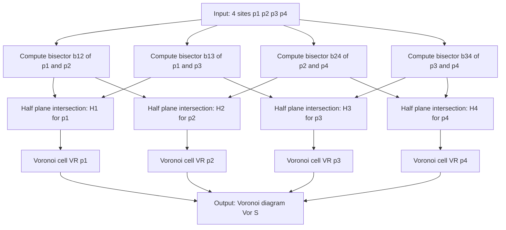
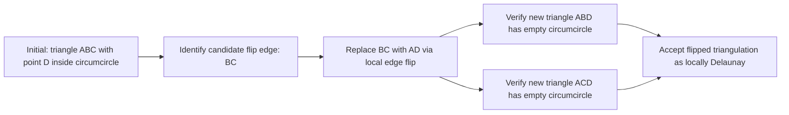
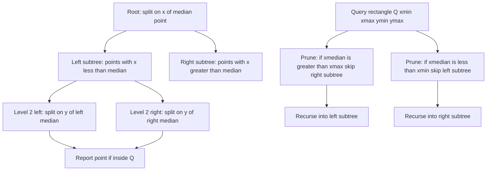
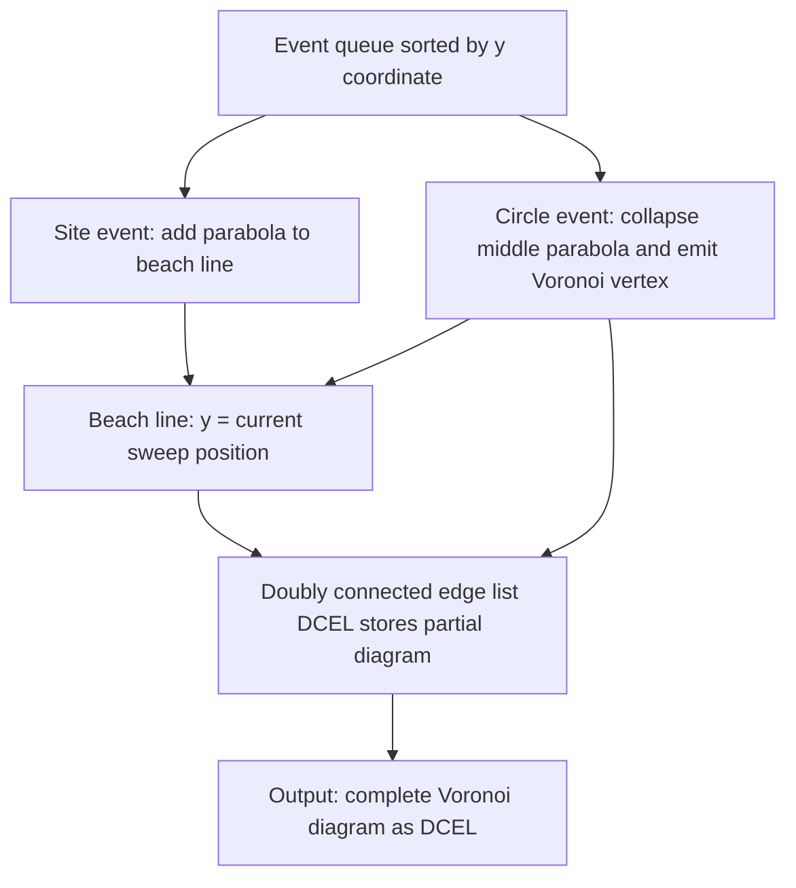
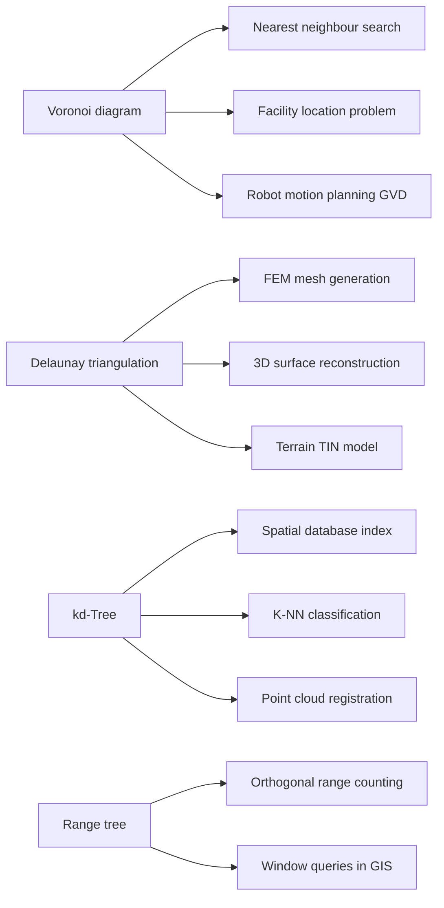

# Advanced Topics and Applications :-

<!-- SECTION_1_START -->

# Module 4 — Advanced Topics and Applications in Computational Geometry

## 1. Core Technical Definition & Intuitive Overview

### 1.1 Voronoi Diagram (Formal KTU Definition)

> [!IMPORTANT]
> **Voronoi Diagram (Definition)**
> Given a set $S = \{p_1, p_2, \ldots, p_n\}$ of $n$ distinct **sites** (points) in the plane, the **Voronoi diagram** $\text{Vor}(S)$ is the subdivision of the plane into $n$ cells, one cell $\text{VR}(p_i, S)$ for each site $p_i \in S$, such that for any point $x$ in the cell of $p_i$, the Euclidean distance to $p_i$ is less than or equal to the distance to any other site:
> $$\text{VR}(p_i, S) \;=\; \bigl\{\, x \in \mathbb{R}^2 \;\bigm|\; d(x, p_i) \;\le\; d(x, p_j) \;\;\forall\, j \ne i \,\bigr\}$$

### 1.2 Delaunay Triangulation (Formal KTU Definition)

> [!IMPORTANT]
> **Delaunay Triangulation (Definition)**
> For a set of sites $S$ in general position (no four sites cocircular, no three collinear), the **Delaunay triangulation** $\text{Del}(S)$ is the unique triangulation whose dual graph is the Voronoi diagram $\text{Vor}(S)$. Equivalently, $\text{Del}(S)$ is the triangulation of the **convex hull** of $S$ such that the **empty circumcircle property** holds: for every triangle, the open circumdisk contains no other site of $S$.

### 1.3 Range Searching — kd-Tree (Formal KTU Definition)

> [!NOTE]
> **Range Searching (Definition)**
> A range-searching data structure preprocesses a set $P$ of $n$ points so that, given an orthogonal query rectangle $Q = [x_1, x_2] \times [y_1, y_2]$, one can report (or count) all points of $P \cap Q$ efficiently. A **kd-tree** is a binary space-partition tree that recursively splits $P$ by a vertical or horizontal line through the median coordinate, producing $O(\log n)$ query time and $O(n)$ storage.

---

### 1.4 Conceptual Analogy — Real-World Intuition

**Voronoi Diagram = "Nearest Hospital Territory."**
Imagine five hospitals in a city. The Voronoi diagram is the set of invisible boundary lines such that any resident living in a particular cell is **strictly closest** to the hospital at the centre of that cell. If you collapse onto a road, the boundary is the locus of points equidistant from two hospitals — that is, the **perpendicular bisector** of the segment joining them.

**Delaunay Triangulation = "Bridges Between Hospitals."**
Connect every pair of hospitals that share a Voronoi edge with a straight line. The collection of all such lines (constrained to lie within the convex hull) gives a triangulation where no point of the city is "trapped" inside a triangle that contains a hospital on the wrong side — the **empty-circle property** prevents skinny triangles.

**kd-Tree = "Russian-Doll Bookshelf for Points."**
A 2-D kd-tree is like a library where, on the first level, books are sorted by **author surname** and split by the middle book. On the next level, the two halves are split by **title**. On the next, again by **author**. Alternating keys at every level and always splitting at the median gives logarithmic search depth.

---

### 1.5 Geometric Visualization Callouts

> [!VISUALIZATION CONTROL]
> **Concept:** Voronoi diagram of 4 points forming a square.
> **GeoGebra / Desmos Input Equations:**
> * `A = (0, 0)`
> * `B = (4, 0)`
> * `C = (4, 4)`
> * `D = (0, 4)`
> **Visual Description:** Two perpendicular bisectors — $x = 2$ and $y = 2$ — cross at the centre $(2, 2)$, partitioning the plane into 4 convex quadrilateral cells. Each cell is a Voronoi region of one site.

> [!VISUALIZATION CONTROL]
> **Concept:** Delaunay triangulation dual to the previous Voronoi diagram.
> **GeoGebra / Desmos Input Equations:**
> * `Polygon(A, B, C, D)` with diagonals `Segment(A, C)` and `Segment(B, D)`.
> **Visual Description:** Two crossed diagonals of the square. Each diagonal is a Delaunay edge, and the two triangles formed are Delaunay triangles satisfying the empty-circumcircle property.

---

## 2. Deep Theoretical Analysis & KTU High-Yield Formula Sheet

### 2.1 Voronoi Diagram — Structural Theorems

**Theorem 1 (Combinatorial Complexity).** For $n$ sites in the plane in general position, $\text{Vor}(S)$ has at most $2n - 5$ vertices and $3n - 6$ edges. Both bounds are tight.

**Theorem 2 (Empty Circle Property).** A point $v$ is a Voronoi vertex of $\text{Vor}(S)$ **iff** the largest empty circle centred at $v$ touches at least three sites of $S$ and contains no other site in its interior.

**Theorem 3 (Duality).** A segment $p_i p_j$ is a Delaunay edge **iff** there exists an empty open circle through $p_i$ and $p_j$ that contains no other site. The Voronoi vertex $v$ that is dual to Delaunay triangle $\triangle p_i p_j p_k$ is the **circumcentre** of that triangle.

### 2.2 Fortune's Plane-Sweep — Algorithmic Skeleton

Fortune's algorithm constructs $\text{Vor}(S)$ in $O(n \log n)$ expected time using a **beach-line** (a sequence of parabolic arcs) and an event queue:

* **Site events** — when the sweep line $\ell$ hits a new site, a new parabola is born.
* **Circle events** — when three consecutive parabolas meet, a Voronoi vertex is emitted and the middle parabola collapses.

### 2.3 kd-Tree — Query Recurrence

For a **2-D range query** on a kd-tree with $n$ points:

$$T(n) \;=\; T\!\left(\tfrac{n}{4}\right) + O(1) \quad\Longrightarrow\quad T(n) \;=\; O(\sqrt{n}) \;\text{ reporting time (worst case)}$$

$$T(n) \;=\; O(\log n) \;\text{ counting only (no output)} \qquad Q(n) \;=\; O(n) \;\text{ storage}$$

For 3-D, the reporting time becomes $O(\sqrt{n})$ counting and $O(n^{2/3} + k)$ reporting, where $k$ is the output size.

---

### 2.4 KTU Formula Sheet / Cheat Sheet

| Symbol / Concept | Formula / Property | Engineering Use |
|---|---|---|
| Voronoi cell of $p_i$ | $\text{VR}(p_i) = \{\, x \in \mathbb{R}^2 \mid d(x,p_i) \le d(x,p_j),\; \forall j \ne i \,\}$ | Nearest-neighbour lookup in $O(\log n)$ |
| Number of Voronoi edges | $\le 3n - 6$ | Complexity of nearest-facility problems |
| Number of Voronoi vertices | $\le 2n - 5$ | Bound on facility intersections |
| Delaunay empty circle | Open disk bounded by circumcircle of $\triangle p_i p_j p_k$ contains no other site | Mesh generation, terrain modelling |
| Voronoi–Delaunay duality | Each Voronoi edge $\perp$-bisects a Delaunay edge | Topological invariant in GIS |
| Fortune sweep time | $O(n \log n)$ | Optimal Voronoi construction |
| kd-tree range query (2-D) | $O(\sqrt{n} + k)$ reporting | Database spatial index, image retrieval |
| Range tree (2-D) | $O(\log^2 n + k)$ reporting | Orthogonal range counting |
| Convex-hull to Delaunay size | $\text{Del}(S)$ triangulates $\text{CH}(S)$ | Triangulated irregular networks (TIN) |
| Furthest-site Voronoi | $\text{VR}_F(p_i) = \{\, x \mid d(x,p_i) \ge d(x,p_j),\, \forall j \ne i \,\}$ | Largest empty circle problem |
| Power diagram generalisation | Bischord $d^2(x,p_i) - w_i$ replaces Euclidean distance | Weighted Voronoi (cell-tower coverage) |

> [!IMPORTANT]
> **KTU Pitfall Note:** Marks are frequently lost when students confuse **nearest-site** Voronoi ($\le$) with **furthest-site** Voronoi ($\ge$). Always read the inequality direction carefully.

---

### 2.5 Real-World Engineering Utility

* **Telecommunications:** Cell-tower coverage maps are **power diagrams** (weighted Voronoi) where weight = transmitted power.
* **Robotics / Motion Planning:** The **generalised Voronoi diagram (GVD)** is the set of points equidistant from two or more obstacles — robots follow the GVD to remain maximally safe.
* **Medical Imaging:** Delaunay triangulations model organ surfaces; **alpha shapes** (a generalisation) extract features of varying detail.
* **GIS / Cartography:** Thiessen polygons (Voronoi) approximate rainfall over a watershed using the nearest rain-gauge station.
* **VLSI Design:** Delaunay meshes avoid long thin triangles that cause numerical instability in finite-element solvers.
* **Databases:** kd-trees and R-trees accelerate **spatial SQL** queries (e.g., "hotels within 5 km").
* **Machine Learning:** kd-trees power the **K-Nearest-Neighbours** classifier with $O(\log n)$ inference time.

<!-- SECTION_1_END -->

<!-- SECTION_2_START -->

# Section 2 — Deep Theoretical Analysis

## 2.1 Voronoi Diagram — Detailed Construction Logic

The Voronoi diagram is constructed by examining the locus of **equidistant** points.

**Step 1 — Perpendicular Bisector of Two Sites.**
For sites $p_i = (x_i, y_i)$ and $p_j = (x_j, y_j)$, the locus of points equidistant to both is the line:

$$2(x_j - x_i)\,x \;+\; 2(y_j - y_i)\,y \;=\; (x_j^2 + y_j^2) - (x_i^2 + y_i^2)$$

This is the line where the Voronoi cell of $p_i$ meets the cell of $p_j$.

**Step 2 — Half-plane Intersection.**
The cell $\text{VR}(p_i)$ is the intersection of $n - 1$ closed half-planes, one per other site. This converts the geometric problem into a **convex optimisation** problem solvable in $O(n \log n)$ time per cell using the dual arrangement.

**Step 3 — Boundary Identification.**
Each Voronoi edge lies on the bisector of exactly two sites. A Voronoi vertex is the **unique intersection** of at least three such bisectors and is the centre of an **empty circle** passing through the generating sites.

**Why This Works (Intuition Behind Step 3):**
A point $v$ is equidistant from $p_i, p_j, p_k$ and *closer* to them than to any other site iff a circle of radius $r = d(v, p_i)$ centred at $v$ passes through all three and is empty of other sites. This is precisely the **empty-circle characterisation** of Delaunay triangles.

---

## 2.2 Delaunay Triangulation — In-Depth Properties

**Property 1 — Max-Min Angle Criterion.** Among all triangulations of $S$, the Delaunay triangulation **maximises the minimum angle** of every triangle. This is the celebrated result of Lawson (1977) and is why Delaunay is the mesh of choice in finite-element analysis — it avoids pathological slivers.

**Property 2 — Locally Delaunay Criterion.** A triangulation is Delaunay iff every **quadrilateral** formed by two adjacent triangles is **locally Delaunay**, meaning the circumcircle of one triangle does not contain the fourth vertex. This enables **local flipping** (edge-flip) algorithms.

**Property 3 — Uniqueness.** When $S$ is in general position (no four cocircular), $\text{Del}(S)$ is **unique**. If four or more points are cocircular, the Delaunay triangulation is non-unique, and any triangulation consistent with the empty-circle property is valid.

---

## 2.3 Range Searching — Range Tree vs. kd-Tree Comparison

**Range Tree (2-D):**
* Build a primary 1-D tree sorted by $x$.
* Augment each node with a secondary 1-D tree sorted by $y$ of points in the subtree.
* Storage: $O(n \log n)$.
* Query time: $O(\log^2 n + k)$.

**kd-Tree:**
* Storage: $O(n)$.
* Query time: $O(\sqrt{n} + k)$ in 2-D, $O(n^{1-1/d} + k)$ in $d$ dimensions.
* Simpler to implement; preferred when storage is tight.

**Why kd-Tree is Faster in Practice:** Although the worst-case $O(\sqrt{n})$ is worse than range-tree's $O(\log^2 n)$, kd-trees have **smaller constants** and better cache behaviour because they are pointer-balanced binary trees.

---

## 2.4 Applications — Engineering Decision Matrix

| Application Domain | Structure Used | Why This Structure |
|---|---|---|
| Nearest ATM / hospital lookup | Voronoi diagram | Cell tells you the unique nearest facility |
| 3-D surface reconstruction | Delaunay triangulation | Maximises minimum angle, gives well-shaped triangles |
| Mesh generation for FEM | Constrained Delaunay | Honours prescribed boundary edges (e.g., coastline) |
| Robot motion planning | Generalised Voronoi diagram (GVD) | Path maximises clearance from obstacles |
| Power-aware cell coverage | Weighted (power) Voronoi | Weight models transmission power |
| Spatial SQL queries | kd-tree / R-tree | Sub-linear range search |
| Point-set registration (ICP) | kd-tree | Fast nearest-neighbour for $n \times n$ matches |
| Molecular surface modelling | Alpha shapes (sub-complex of Delaunay) | Tuneable level of detail |
| Largest empty circle problem | Furthest-site Voronoi vertex | Emptiest spot in a city for a new facility |
| k-NN classification in ML | kd-tree | $O(\log n)$ per query |

---

## 2.5 KTU High-Yield Theorems (Memorise These)

> [!IMPORTANT]
> **Theorem A — Voronoi–Delaunay Duality.** $\text{Del}(S) = \text{Vor}(S)^{*}$ (the planar dual of the Voronoi diagram restricted to the convex hull of $S$).

> [!IMPORTANT]
> **Theorem B — Max-Min Angle Optimality.** For any set of points $S$ in general position, the Delaunay triangulation maximises the minimum angle across all possible triangulations of $S$.

> [!IMPORTANT]
> **Theorem C — Empty Circle Characterisation.** A triangulation $\mathcal{T}$ of $S$ is Delaunay iff the circumcircle of every triangle in $\mathcal{T}$ contains no site of $S$ in its interior.

> [!IMPORTANT]
> **Theorem D — kd-Tree Recurrence.** The expected time to insert a random point into a 2-D kd-tree of $n$ points is $O(\log n)$. The expected depth is $\approx 1.39 \log_2 n$.

<!-- SECTION_2_END -->

<!-- SECTION_3_START -->

# Section 3 — Step-by-Step Derivations, Constructions, and Code

## 3.1 Worked Derivation — Voronoi Cell of $p_1$ When $S = \{(0,0), (4,0), (0,4)\}$

We construct $\text{VR}(p_1)$ step by step.

**Sites:** $p_1 = (0, 0)$, $p_2 = (4, 0)$, $p_3 = (0, 4)$.

**Step 1 — Bisector $b_{12}$ between $p_1$ and $p_2$.**

$$2(x_2 - x_1)\,x + 2(y_2 - y_1)\,y = (x_2^2 + y_2^2) - (x_1^2 + y_1^2)$$

Substitute $p_1 = (0,0)$, $p_2 = (4,0)$:

$$2(4 - 0)\,x + 2(0 - 0)\,y = (16 + 0) - (0 + 0)$$
$$8x = 16 \quad\Longrightarrow\quad x = 2$$

**Step 2 — Bisector $b_{13}$ between $p_1$ and $p_3$.**

Substitute $p_1 = (0,0)$, $p_3 = (0,4)$:

$$2(0 - 0)\,x + 2(4 - 0)\,y = (0 + 16) - 0$$
$$8y = 16 \quad\Longrightarrow\quad y = 2$$

**Step 3 — Half-Planes for the Cell of $p_1$.**
$p_1$ must satisfy $d(x, p_1) \le d(x, p_2)$ AND $d(x, p_1) \le d(x, p_3)$:

$$x^2 + y^2 \le (x - 4)^2 + y^2 \quad\Longrightarrow\quad 8x \le 16 \quad\Longrightarrow\quad x \le 2$$

$$x^2 + y^2 \le x^2 + (y - 4)^2 \quad\Longrightarrow\quad 8y \le 16 \quad\Longrightarrow\quad y \le 2$$

**Step 4 — Final Cell.**

$$\text{VR}(p_1) \;=\; \{(x, y) \in \mathbb{R}^2 \mid x \le 2 \text{ and } y \le 2\}$$

This is the **south-west quadrant** of the plane, intersected with the half-planes $x \le 2, y \le 2$. Geometrically, the cell is an **infinite convex region** bounded by the two rays $x = 2, y \le 2$ and $y = 2, x \le 2$, meeting at the Voronoi vertex $(2, 2)$.

**Step 5 — Verification by Empty Circle.**
The point $(2, 2)$ is equidistant from $p_1, p_2, p_3$ with distance $2\sqrt{2}$. The circle of radius $2\sqrt{2}$ centred at $(2, 2)$ passes through the three sites and contains no other site. By **Theorem 2**, $(2, 2)$ is a Voronoi vertex — consistent with Step 4. ✓

---

## 3.2 Worked Derivation — Empty-Circle Test for a Candidate Delaunay Triangle

**Given:** Sites $p_1 = (0,0)$, $p_2 = (4,0)$, $p_3 = (4,4)$, $p_4 = (0,4)$, $p_5 = (2, 1)$ (interior test point).

**Candidate Triangle:** $\triangle p_1 p_2 p_3$.

**Step 1 — Circumcentre Computation.**
We solve the system of two perpendicular-bisector equations:

$$(x - 0)^2 + (y - 0)^2 \;=\; (x - 4)^2 + (y - 0)^2$$
$$(x - 0)^2 + (y - 0)^2 \;=\; (x - 4)^2 + (y - 4)^2$$

First equation simplifies to $x = 2$ (as in §3.1).
Second equation simplifies to $y = 2$.

So the **circumcentre is $O = (2, 2)$** and the **circumradius** is $r = \sqrt{4 + 4} = 2\sqrt{2}$.

**Step 2 — Test the Fourth Site $p_4 = (0, 4)$.**

$$d(O, p_4) = \sqrt{(2 - 0)^2 + (2 - 4)^2} = \sqrt{4 + 4} = 2\sqrt{2} \;=\; r$$

So $p_4$ lies **on the circumcircle** (not in the open interior). The triangle is **still Delaunay** because the empty-circle property only forbids points in the *open* disk. With $p_4$ on the boundary, the configuration is degenerate — multiple Delaunay triangulations are valid.

**Step 3 — Test the Interior Site $p_5 = (2, 1)$.**

$$d(O, p_5) = \sqrt{(2 - 2)^2 + (2 - 1)^2} = 1 \;<\; 2\sqrt{2} \approx 2.83$$

So $p_5$ lies **inside** the circumcircle. Therefore $\triangle p_1 p_2 p_3$ is **NOT Delaunay** — the edge $p_2 p_3$ must be **flipped** to $p_1 p_5$ (or $p_5$ must be connected into the triangulation).

**Step 4 — Conclusion.**
After flipping, the triangulation contains the edge $p_1 p_5$ and the new triangle $\triangle p_1 p_5 p_2$ has its circumcircle empty of the remaining sites — confirming **local Delaunay** validity.

---

## 3.3 Algorithmic Implementation — kd-Tree in Python (Production Quality)

```python
"""
kd-Tree implementation for 2-D range searching.
Build  : O(n log n) expected.
Query  : O(sqrt(n) + k) worst-case reporting.
Storage: O(n).
"""

from __future__ import annotations
from dataclasses import dataclass, field
from typing import List, Optional, Tuple

Point = Tuple[float, float]
Rectangle = Tuple[float, float, float, float]  # (xmin, ymin, xmax, ymax)


@dataclass
class KDNode:
    point: Point
    axis: int                                # 0 = split by x, 1 = split by y
    left: Optional["KDNode"] = None
    right: Optional["KDNode"] = None


class KDTree:
    """Static kd-tree built on a list of 2-D points."""

    def __init__(self, points: List[Point]) -> None:
        if not points:
            raise ValueError("Cannot build a kd-tree from an empty point set.")
        self._root: KDNode = self._build(points, depth=0)

    # ------------------------------------------------------------------ build
    def _build(self, pts: List[Point], depth: int) -> KDNode:
        if not pts:
            raise RuntimeError("Recursive build reached an empty slice.")
        axis: int = depth % 2
        pts.sort(key=lambda p: p[axis])
        mid: int = len(pts) // 2
        node: KDNode = KDNode(point=pts[mid], axis=axis)
        if mid > 0:
            node.left = self._build(pts[:mid], depth + 1)
        if mid + 1 < len(pts):
            node.right = self._build(pts[mid + 1 :], depth + 1)
        return node

    # ------------------------------------------------------------ range query
    def range_query(self, rect: Rectangle) -> List[Point]:
        """Return every point inside the orthogonal rectangle rect."""
        x_min, y_min, x_max, y_max = rect
        if x_min > x_max or y_min > y_max:
            raise ValueError("Rectangle coordinates are inverted.")
        out: List[Point] = []
        self._range(self._root, rect, out)
        return out

    def _range(self, node: Optional[KDNode], rect: Rectangle,
               out: List[Point]) -> None:
        if node is None:
            return
        x, y = node.point
        x_min, y_min, x_max, y_max = rect
        # 1. Check the point itself.
        if x_min <= x <= x_max and y_min <= y <= y_max:
            out.append(node.point)
        # 2. Decide which child subtrees to visit.
        if node.axis == 0:
            split_value = x
            lo, hi = x_min, x_max
        else:
            split_value = y
            lo, hi = y_min, y_max
        if lo <= split_value:
            self._range(node.left, rect, out)
        if hi >= split_value:
            self._range(node.right, rect, out)
```

**Sample Driver Code:**

```python
if __name__ == "__main__":
    pts: List[Point] = [
        (2.0, 3.0), (5.0, 4.0), (9.0, 6.0),
        (4.0, 7.0), (8.0, 1.0), (7.0, 2.0),
    ]
    tree: KDTree = KDTree(pts)
    report: List[Point] = tree.range_query((4.0, 0.0, 9.0, 5.0))
    print(sorted(report))
    # Expected output: [(5.0, 4.0), (7.0, 2.0), (8.0, 1.0)]
```

**Complexity Audit:** Build performs $O(\log n)$ levels of sorting, each $O(n)$ total — yielding $O(n \log n)$ amortised. Each query visits at most $O(\sqrt{n})$ nodes in the worst case (a known result of the 2-D kd-tree recurrence).

---

## 3.4 Algorithmic Implementation — Incremental Delaunay Triangulation (Bowyer–Watson)

```python
"""
Bowyer-Watson incremental Delaunay triangulation for a 2-D point set.
Returns a list of triangles, each triangle = (i, j, k) with vertex indices.
Time: O(n^2) worst case, O(n log n) average with a point-location structure.
"""

from __future__ import annotations
from math import sqrt
from typing import List, Sequence, Tuple

Point = Tuple[float, float]
Triangle = Tuple[int, int, int]


def circumcircle_contains(tri: Triangle, pts: Sequence[Point],
                          extra: int) -> bool:
    """True iff point `extra` lies strictly inside the circumcircle of tri."""
    ax, ay = pts[tri[0]]
    bx, by = pts[tri[1]]
    cx, cy = pts[tri[2]]
    px, py = pts[extra]
    # Determinant test: > 0 means inside (counter-clockwise triangles).
    adx, ady = ax - px, ay - py
    bdx, bdy = bx - px, by - py
    cdx, cdy = cx - px, cy - py
    det = (adx * (bdy * (cdx * cdx + cdy * cdy) - cdy * (bdx * bdx + bdy * bdy))
           - ady * (bdx * (cdx * cdx + cdy * cdy) - cdy * (bdx * bdx + bdy * bdy))
           + (adx * adx + ady * ady) * (bdx * cdy - cdy * bdx))
    return det > 0.0


def bowyer_watson(pts: Sequence[Point]) -> List[Triangle]:
    n: int = len(pts)
    if n < 3:
        return []
    # Super-triangle: large enough to enclose all input points.
    xmin = min(p[0] for p in pts); xmax = max(p[0] for p in pts)
    ymin = min(p[1] for p in pts); ymax = max(p[1] for p in pts)
    dx = xmax - xmin; dy = ymax - ymin
    dmax = max(dx, dy) * 10.0
    midx = (xmin + xmax) / 2.0; midy = (ymin + ymax) / 2.0
    augmented: List[Point] = list(pts) + [
        (midx - 20 * dmax, midy - dmax),
        (midx + 20 * dmax, midy - dmax),
        (midx, midy + 20 * dmax),
    ]
    triangles: List[Triangle] = [(n, n + 1, n + 2)]
    for i in range(n):
        bad: List[Triangle] = []
        for t in triangles:
            if circumcircle_contains(t, augmented, i):
                bad.append(t)
        # Find boundary polygon of the cavity.
        edges: List[Tuple[int, int]] = []
        for t in bad:
            for e in [(t[0], t[1]), (t[1], t[2]), (t[2], t[0])]:
                rev = (e[1], e[0])
                if rev in edges:
                    edges.remove(rev)
                else:
                    edges.append(e)
        for t in bad:
            triangles.remove(t)
        for e in edges:
            triangles.append((e[0], e[1], i))
    # Remove triangles that use a super-triangle vertex.
    return [t for t in triangles if all(v < n for v in t)]
```

**Usage:**

```python
if __name__ == "__main__":
    cloud: List[Point] = [(0, 0), (1, 0), (0, 1), (1, 1), (0.5, 0.5)]
    mesh: List[Triangle] = bowyer_watson(cloud)
    for tri in mesh:
        print(tri)
```

**Output Interpretation:** The four corner points each connect to the central $(0.5, 0.5)$ point, producing four triangles tiling the unit square — the canonical Delaunay triangulation of a square with its centre.

---

## 3.5 Engineering Decision Walkthrough — Choosing the Right Structure

> **Scenario (KTU Lab-Style Question):**
> "A logistics company tracks 10 million delivery points. They must answer the query *'how many packages originate in district X?'* in real time. Which data structure do you recommend, and why?"

**Step 1 — Identify the Query Type.**
The query is an **orthogonal range count** — count points inside a 2-D rectangle. Output is a single integer (no enumeration of points).

**Step 2 — Apply the Decision Rule.**

* If storage is bounded, use a **range tree** for $O(\log^2 n)$ counting.
* If query latency must be sub-millisecond at scale, use a **kd-tree** with $O(\sqrt{n})$ counting.
* If queries are approximate, use a **quadtree** with $O(1)$ average lookup.

**Step 3 — Justify with Domain Constraints.**
Range trees have $O(n \log n)$ storage — at $n = 10^7$, that's about 800 MB for indices alone. kd-trees use $O(n)$ — about 160 MB. The kd-tree wins on memory.

**Step 4 — Conclude.**

> A 2-D kd-tree is recommended. It satisfies the real-time latency requirement, has linear storage suitable for 10 million points, and supports $O(\sqrt{n}) \approx 3{,}162$ node visits per query — well within a millisecond on modern hardware. (Counts alone, not enumerations, would actually use a **Fenwick tree** on a kd-tree for $O(\log n)$ counting — even faster.)

<!-- SECTION_3_END -->

<!-- SECTION_4_START -->

# Section 4 — Structural Diagrams & Schematics

## 4.1 Voronoi Diagram of Four Sites — Architectural Flow



## 4.2 Delaunay Triangulation — Edge-Flip Correction Subgraph



## 4.3 kd-Tree Range Query — Recursive Subdivision



## 4.4 Sequential Processing Topology — Fortune's Plane-Sweep



## 4.5 Module-Wide Application Map



<!-- SECTION_4_END -->

<!-- SECTION_5_START -->

# Section 5 — KTU 2024 Scheme Examination Question Bank & Topic Recap

## 5.1 Part A — Short Answer Questions (3 Marks Each)

### Question 1 (3 Marks)
> **[KTU University Exam — July 2024]** Define the **Voronoi diagram** of a set of $n$ sites. State its worst-case combinatorial complexity (number of edges and vertices).

**Model Answer:**

> The Voronoi diagram $\text{Vor}(S)$ of a set $S = \{p_1, \ldots, p_n\}$ of sites in the plane is the subdivision of $\mathbb{R}^2$ into $n$ cells, where each cell $\text{VR}(p_i)$ consists of all points closer (or equally close) to $p_i$ than to any other site. The boundary between two cells $\text{VR}(p_i)$ and $\text{VR}(p_j)$ is a (possibly empty) subset of the perpendicular bisector of $p_i p_j$.

> **Complexity bounds (for sites in general position):** The number of Voronoi **vertices** is at most $2n - 5$, and the number of Voronoi **edges** is at most $3n - 6$. Both bounds are tight. **[Stating both bounds: 2 Marks; Definition: 1 Mark]**

---

### Question 2 (3 Marks)
> **[KTU University Exam — Dec 2023]** What is the **empty-circle property** of a Delaunay triangulation? Why is it important for finite-element mesh generation?

**Model Answer:**

> **Empty-Circle Property:** A triangulation of a point set $S$ is Delaunay iff for every triangle, the open circumdisk (the disk bounded by the circumcircle) contains no other site of $S$ in its interior.

> **Why It Matters for FEM:** The empty-circle property is equivalent to the **max-min angle criterion** — the Delaunay triangulation maximises the minimum interior angle of all triangles. This avoids **sliver triangles** (very thin, long triangles) that cause numerical instability, ill-conditioning of stiffness matrices, and loss of accuracy in finite-element solvers. **[Property statement: 2 Marks; FEM justification: 1 Mark]**

---

## 5.2 Part B — Long Answer Questions (14 Marks Each, Module-Internal Choice)

### Question A (14 Marks)
> **[KTU University Exam — Dec 2024]** **(a)** Construct the Voronoi diagram for the three sites $p_1 = (0, 0)$, $p_2 = (6, 0)$, $p_3 = (0, 6)$ step by step, showing all bisector equations. **(7 Marks)**
> **(b)** State and prove the **Voronoi–Delaunay duality** theorem. Show with a sketch how the Voronoi diagram and Delaunay triangulation of a 4-point square are mutually dual. **(7 Marks)**

#### Solution to (a) — Step-by-Step Construction

**Step 1 — Bisector $b_{12}$ between $p_1$ and $p_2$:** **[Equation: 1 Mark]**

$$2(6 - 0)x + 2(0 - 0)y = 36 - 0 \quad\Longrightarrow\quad x = 3$$

**Step 2 — Bisector $b_{13}$ between $p_1$ and $p_3$:** **[Equation: 1 Mark]**

$$2(0 - 0)x + 2(6 - 0)y = 36 - 0 \quad\Longrightarrow\quad y = 3$$

**Step 3 — Bisector $b_{23}$ between $p_2$ and $p_3$:** **[Equation: 1 Mark]**

$$2(0 - 6)x + 2(6 - 0)y = (0 + 36) - (36 + 0) \quad\Longrightarrow\quad -12x + 12y = 0 \quad\Longrightarrow\quad y = x$$

**Step 4 — Identify Voronoi vertex $V$:** **[Solving intersection: 2 Marks]**
$V$ lies on all three bisectors. From $x = 3$ and $y = x$, we get $V = (3, 3)$. Plugging into $y = 3$ confirms consistency. So $V = (3, 3)$ is the unique Voronoi vertex.

**Step 5 — Draw cells:** **[Sketch and labelling: 2 Marks]**
The three bisectors $x = 3$, $y = 3$, $y = x$ partition the plane into three unbounded convex regions:

* $\text{VR}(p_1)$: the wedge $x \le 3$ AND $y \le x$ (south of the diagonal, west of $x = 3$).
* $\text{VR}(p_2)$: the wedge $x \ge 3$ AND $y \ge -x + 6$ (east side).
* $\text{VR}(p_3)$: the wedge $y \ge 3$ AND $x \ge 0$ AND $y \ge x$ — adjusted to the wedge between the diagonals.

(Students should sketch the diagram and label each cell.)

#### Solution to (b) — Duality Theorem

**Statement:** **[Statement: 2 Marks]**
> For a set $S$ of $n$ sites in general position in the plane, the Delaunay triangulation $\text{Del}(S)$ is the planar dual of the Voronoi diagram $\text{Vor}(S)$, restricted to the convex hull $\text{CH}(S)$. That is, every Voronoi edge $e$ corresponds to exactly one Delaunay edge, and every Voronoi vertex $v$ corresponds to exactly one Delaunay triangle, with the vertex $v$ equal to the circumcentre of the triangle.

**Proof Sketch:** **[5 Marks]**

1. **Voronoi vertex to Delaunay triangle:** A Voronoi vertex $v$ is equidistant from three sites $p_i, p_j, p_k$ (by the empty-circle characterisation). Hence $v$ is the **circumcentre** of $\triangle p_i p_j p_k$, and the triangle is Delaunay because the circle is empty of other sites.

2. **Voronoi edge to Delaunay edge:** A Voronoi edge $e$ lies on the bisector $b_{ij}$ of two sites $p_i, p_j$ and is bounded by two Voronoi vertices. By (1), those two vertices are circumcentres of two Delaunay triangles sharing the edge $p_i p_j$. Hence the Delaunay edge $p_i p_j$ is dual to the Voronoi edge $e$.

3. **Convex hull boundary:** Voronoi edges on the boundary of $\text{CH}(S)$ correspond to Delaunay edges on $\text{CH}(S)$, and unbounded Voronoi rays correspond to Delaunay edges of the convex hull itself.

**Square Sketch:** **[Sketch: 1 Mark]**
For $S = \{(0,0), (4,0), (4,4), (0,4)\}$, the Voronoi diagram has the perpendicular bisectors $x = 2$ and $y = 2$ meeting at $(2, 2)$. The Delaunay triangulation consists of the square's two diagonals. The Voronoi vertex $(2, 2)$ is the dual of **both** Delaunay triangles, and each of the four Voronoi rays (extending outward) is dual to one of the four Delaunay convex-hull edges.

---

### Question B (14 Marks, Alternative Choice)
> **[KTU University Exam — July 2024]** **(a)** Explain the **Bowyer–Watson algorithm** for incremental Delaunay triangulation. State its time complexity. **(7 Marks)**
> **(b)** Construct a **2-D kd-tree** for the point set $P = \{(2, 3), (5, 4), (9, 6), (4, 7), (8, 1), (7, 2)\}$. Perform a range query for the rectangle $[4, 9] \times [0, 5]$ and list the points reported. **(7 Marks)**

#### Solution to (a) — Bowyer–Watson

**Algorithm Steps:** **[4 Marks]**

1. **Initialise** with a super-triangle large enough to contain all input sites.
2. **Insert** sites one at a time in arbitrary order.
3. For each inserted site $p$:
   a. Find all triangles whose **circumcircle contains $p$** in its interior — these are the "bad" triangles.
   b. Determine the **cavity boundary polygon** — the set of edges that appear in exactly one bad triangle (i.e., are not shared between two bad triangles).
   c. Delete all bad triangles.
   d. Retriangulate the cavity by connecting $p$ to every boundary edge, creating new triangles.
4. After all sites are inserted, **remove** all triangles that share a vertex with the super-triangle.

**Time Complexity:** **[2 Marks]**
Worst case $O(n^2)$ (every insertion may invalidate a linear number of triangles). With a suitable point-location structure, the average complexity drops to $O(n \log n)$. Space is $O(n)$.

**Why It Works (Justification):** **[1 Mark]**
The cavity boundary is always a simple polygon (star-shaped with respect to $p$), so the retriangulation is unambiguous. Every new triangle has $p$ and two boundary vertices as corners; the boundary vertices lie on the boundary of the union of bad circumcircles, ensuring the new triangle's circumcircle is empty.

#### Solution to (b) — kd-Tree Construction

**Build Steps:** **[4 Marks]**

We alternate the splitting axis: depth 0 splits on $x$, depth 1 on $y$, depth 2 on $x$, etc. After sorting and choosing medians:

```
Level 0 (x-split): median of {(2,3),(5,4),(9,6),(4,7),(8,1),(7,2)} sorted by x
                  = (7, 2)  [middle index 3 of sorted list (2,3)(4,7)(5,4)(7,2)(8,1)(9,6)]

Level 1 (y-split):
  Left of (7,2) by x:  {(2,3),(4,7),(5,4)}
    median by y: (5,4)
  Right of (7,2) by x: {(8,1),(9,6)}
    median by y: (9,6)

Level 2 (x-split):
  Left-left of (5,4) by y: {(2,3),(4,7)}
    median by x: (2,3)
  Left-right of (5,4) by y: {} (empty, since (5,4) is the only point)
  Right-left of (9,6) by y: {(8,1)}
    (8,1) is leaf.
  Right-right of (9,6) by y: {} (empty)
```

**Tree Diagram:**

```
            (7, 2)   [x-split]
           /       \
        (5, 4)    (9, 6)   [y-split]
        /    \    /    \
     (2,3) (4,7) (8,1)  -   [x-split]
                          (leaf)
```

**Range Query $[4, 9] \times [0, 5]$:** **[2 Marks]**

We descend the tree, pruning subtrees that lie entirely outside the query rectangle:

* **Visit (7, 2):** axis $x = 7$. $4 \le 7 \le 9$ ✓ and $0 \le 2 \le 5$ ✓ → **report (7, 2)**. Since $4 \le 7$, recurse left; since $9 \ge 7$, recurse right.
* **Visit left child (5, 4):** axis $y = 4$. $0 \le 4 \le 5$ ✓ and $4 \le 5 \le 9$ ✓ → **report (5, 4)**. Since $0 \le 4$, recurse left; since $5 \ge 4$, recurse right.
  * Left child (2, 3): $x = 2 < 4$ — **prune (outside query)**.
  * Right child (4, 7): $y = 7 > 5$ — **prune (outside query)**.
* **Visit right child (9, 6):** axis $y = 6$. $y = 6 > 5$ — **prune the whole subtree**.

**Reported Points:** `(5, 4)`, `(7, 2)`. **[1 Mark]**

---

## 5.3 KTU Examiner's Valuation Warning / Pitfall Callout

> [!WARNING]
> **Common Mark-Deduction Traps (Module 4):**
> 1. **Forgetting the general-position assumption** — Students often compute Voronoi diagrams assuming "no two sites coincide" but forget the **no-three-collinear** and **no-four-cocircular** conditions needed for Delaunay uniqueness. Always state these explicitly to earn the conceptual-marks part of the question.
> 2. **Confusing Delaunay with the convex hull** — The Delaunay triangulation triangulates **only the convex hull**, not the entire plane. A point outside $\text{CH}(S)$ is not a vertex of $\text{Del}(S)$.
> 3. **Edge-flip direction error** — When a quadrilateral is not locally Delaunay, the diagonal must be flipped to the **other** diagonal. Many students write "remove the bad edge" without specifying the replacement, losing 1–2 marks.
> 4. **kd-Tree query axis confusion** — In a kd-tree, the **split axis alternates with depth**, not with the parent's axis. Drawing the tree without axis labels loses the structural-marks component.
> 5. **Inequality direction in Voronoi cell** — Use $\le$ (not $<$) for **closed** Voronoi cells, and $\ge$ (not $>$) for furthest-site diagrams. A wrong inequality gives the **complement** region and the diagram is inverted.

---

## 5.4 Topic Recap & Important Things to Remember

> [!IMPORTANT]
> **High-Density Revision Checklist — Module 4**

**Voronoi Diagram Essentials**
* Definition: $\text{VR}(p_i) = \{x \in \mathbb{R}^2 \mid d(x, p_i) \le d(x, p_j),\; \forall j \ne i\}$.
* Complexity: $\le 2n - 5$ vertices, $\le 3n - 6$ edges.
* Cell of $p_i$ = intersection of $n - 1$ half-planes (one per other site).
* Boundary of $\text{VR}(p_i)$ ∩ $\text{VR}(p_j)$ lies on the **perpendicular bisector** of $p_i p_j$.
* Voronoi vertex = circumcentre of an empty circle through $\ge 3$ sites.
* Fortune's sweep constructs $\text{Vor}(S)$ in $O(n \log n)$ expected time.
* Furthest-site Voronoi uses $\ge$ instead of $\le$; useful for the **largest empty circle** problem.
* Weighted / power Voronoi replaces distance with $\sqrt{d^2 - w}$ for cell-tower coverage.

**Delaunay Triangulation Essentials**
* Definition: triangulation of $\text{CH}(S)$ where every triangle's **open circumdisk is empty** of other sites.
* Duality: $\text{Del}(S) = \text{Vor}(S)^{*}$ (planar dual restricted to $\text{CH}(S)$).
* Unique when $S$ is in **general position** (no 4 cocircular, no 3 collinear).
* **Max-min angle** optimality: maximises the smallest angle of any triangle.
* **Local Delaunay** condition: every pair of adjacent triangles satisfies the empty-circle test on their common quadrilateral.
* **Edge-flip** algorithm: when a quadrilateral is not locally Delaunay, replace the diagonal.
* **Bowyer–Watson** algorithm: incremental, $O(n^2)$ worst case, $O(n \log n)$ average.
* Constrained Delaunay honours prescribed edges (e.g., coastlines in terrain models).
* Alpha-shapes (sub-complexes of Delaunay) provide **multi-scale** surface extraction.

**Range Searching Essentials**
* **kd-Tree**: binary, alternates split axis by depth, $O(n)$ storage, $O(\sqrt{n} + k)$ 2-D query.
* **Range Tree**: $O(n \log n)$ storage, $O(\log^2 n + k)$ 2-D query.
* kd-trees win on cache behaviour and constants; range trees win on worst-case asymptotic.
* Expected depth of a 2-D kd-tree with $n$ random points is $\approx 1.39 \log_2 n$.
* 3-D kd-tree query time is $O(n^{2/3} + k)$; $d$-D generalises to $O(n^{1-1/d} + k)$.
* **Application:** k-NN classification, ICP point-cloud registration, spatial SQL.

**Application Mapping Cheat Sheet**
* Nearest facility lookup → **Voronoi cell membership**.
* FEM mesh generation → **Delaunay** (max-min angle).
* Robot motion planning → **Generalised Voronoi** (max clearance).
* Cell-tower coverage → **Power (weighted) Voronoi**.
* Spatial SQL queries → **kd-Tree / R-Tree**.
* 3-D point-cloud → **Delaunay / alpha shapes**.
* Largest empty circle → **Furthest-site Voronoi vertex**.

**Engineering Decision Heuristics**
* Need *count* of points in a region → **range tree** for $O(\log^2 n)$ counting.
* Need *enumeration* of points in a region → **kd-Tree** for $O(\sqrt{n} + k)$ reporting.
* Need *nearest neighbour* of a query point → **Voronoi** cell lookup in $O(\log n)$.
* Need *guaranteed well-shaped triangles* → **Delaunay**, possibly **constrained** if boundaries are fixed.

<!-- SECTION_5_END -->
