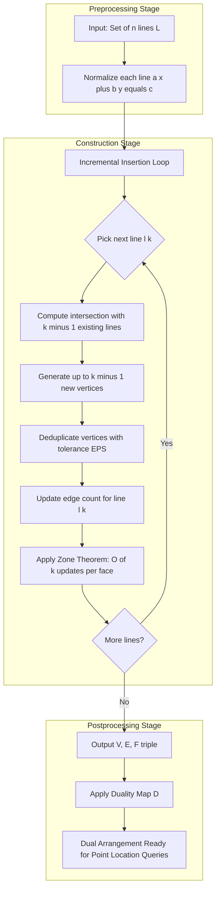
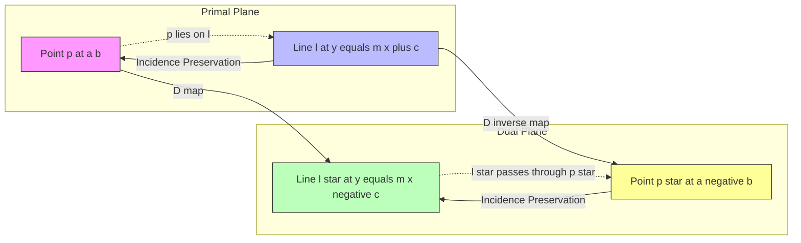
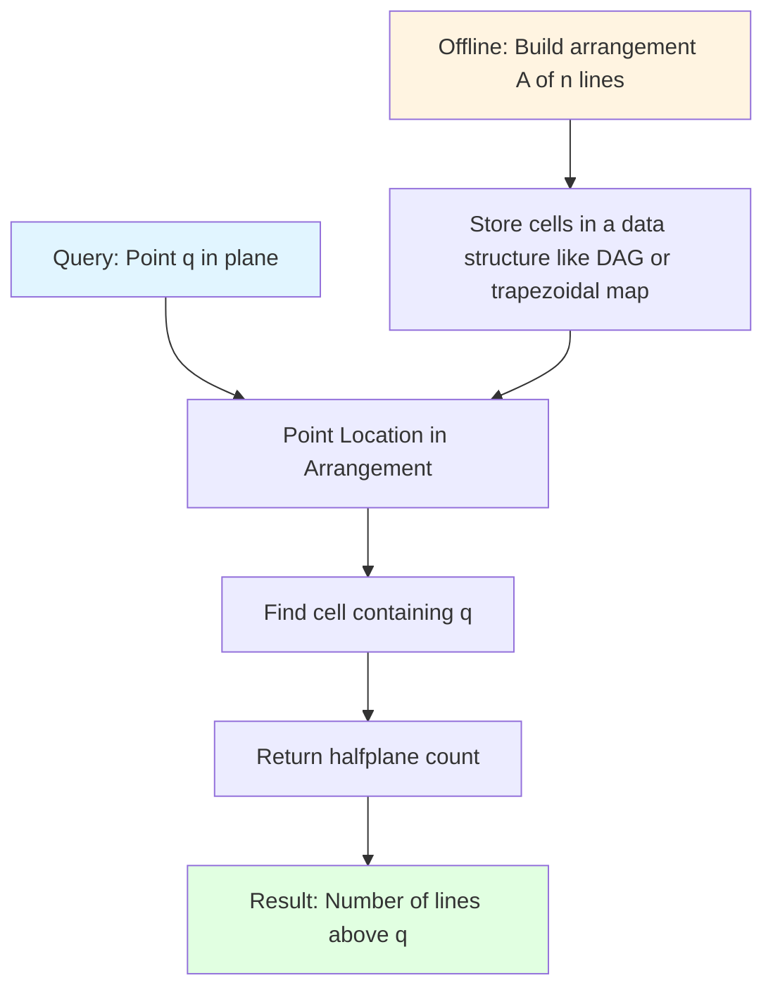

# Arrangements of Lines and Duality  - Arrangements of lines and complexity

<!-- SECTION_1_START -->
# Arrangements of Lines and Duality — Complexity Analysis

> [!IMPORTANT]
> **KTU 2024 Scheme Focus (Module 4 — PECST418):** This topic is a **high-yield, board-favorite** area covering the combinatorial structure of line arrangements, the point-line duality transformation, and the asymptotic complexity bounds that govern output-sensitive geometric algorithms.

## 1.1 Formal Definition

An **arrangement** $\mathcal{A}(L)$ of a finite set $L = \{\ell_1, \ell_2, \ldots, \ell_n\}$ of lines in the **real plane** $\mathbb{R}^2$ is the **planar subdivision** induced by the union of all lines in $L$. It is the decomposition of $\mathbb{R}^2$ into a finite collection of disjoint **vertices** (intersection points), **edges** (maximal line segments/rays between vertices), and **faces** (maximal connected open regions containing no line).

Formally, an arrangement is a cell complex $(V, E, F)$ where:
- $V$ = set of all intersection points of line pairs in $L$
- $E$ = set of edges, each being a maximal connected portion of a line not containing any vertex in its relative interior
- $F$ = set of 2-dimensional cells (bounded and unbounded) of the subdivision

The **combinatorial complexity** of an arrangement refers to the total count $\lvert V \rvert + \lvert E \rvert + \lvert F \rvert$ of its cells, expressed as a function of $n = \lvert L \rvert$.

> [!NOTE]
> **KTU Syllabus Terminology Check:** The 2024 PECST418 syllabus uses the term *"combinatorial complexity"* to refer to the asymptotic growth of the cell count, not the geometric measure (length/area). Always quote it as a function of $n$.

## 1.2 Conceptual Analogy — Intuitive Overview

Imagine a **cracked glass plate** with $n$ straight cracks, no two parallel and no three concurrent. The cracks divide the plate into many small pieces.

- Each **crack intersection** = a **vertex** of the arrangement.
- Each **unbroken segment of a crack** between two intersections = an **edge**.
- Each **small piece of glass** (including the outer fragments) = a **face**.

Now the question becomes: *"How many pieces can $n$ lines cut the plane into at most?"* — this is the classical **cake-cutting** problem, and the answer is **$\Theta(n^2)$**.

For **duality**, think of a **light table projection**: every point $(a, b)$ in the primal plane corresponds to a unique line $y = ax - b$ in the dual plane, and every line in the primal corresponds to a unique point in the dual. This transformation swaps the roles of *"being on"* and *"intersecting"*, which is the foundational trick for converting 3D problems into 2D ones (e.g., halfspace range searching, convex hulls in 3D reduce to 2D arrangements).

## 1.3 Key Constants and Asymptotic Bounds

> [!IMPORTANT]
> **Critical Asymptotic Constants:**
> - $n$ = number of lines
> - **Maximum number of vertices:** $\binom{n}{2} = \dfrac{n(n-1)}{2} = \Theta(n^2)$
> - **Maximum number of edges:** $n^2$ = $\Theta(n^2)$
> - **Maximum number of faces:** $\dfrac{n^2 + n + 2}{2} = \Theta(n^2)$
> - **Maximum depth (stack size) at a point:** $\Theta(n)$
> - **Zone complexity of a line in an arrangement of $n$ lines:** $\Theta(n)$

## 1.4 Visualization of a Line Arrangement

> [!VISUALIZATION CONTROL]
> **Concept:** A simple arrangement of 4 lines and its cell decomposition.
> **GeoGebra / Desmos Input Equations:**
> * `f1(x) = x`
> * `f2(x) = -x + 4`
> * `f3(x) = 0.5*x + 1`
> * `f4(x) = -2*x + 5`
> **Visual Description:** Plot the four linear functions on a shared Cartesian plane. Mark every pairwise intersection with a solid dot (vertex). The screen is divided into **11 bounded and unbounded regions (faces)**: $\binom{4}{2} + 4 + 1 = 11$. Students should observe the **convex polygonal nature** of bounded faces and the **wedge / angular sector** shape of unbounded faces.

<!-- SECTION_1_END -->

<!-- SECTION_2_START -->
# Deep Theoretical Analysis & KTU High-Yield Formula Sheet

## 2.1 Combinatorial Anatomy of an Arrangement

The arrangement $\mathcal{A}(L)$ is a 2-dimensional **planar cell complex** characterized by three mutually dependent counts. For $n$ lines in **general position** (no two parallel, no three concurrent):

### 2.1.1 Counting Vertices, Edges, and Faces

**Vertices (V):** Every pair of lines $\ell_i, \ell_j$ intersects in exactly one point (in general position). The number of unordered pairs is the binomial coefficient $\binom{n}{2}$.

$$\lvert V \rvert = \binom{n}{2} = \frac{n(n-1)}{2}$$

**Edges (E):** Each of the $n$ lines is cut by the other $n-1$ lines into $n$ pieces (one segment/ray per gap between consecutive intersections, plus the two unbounded rays). Total edges = $n \times n = n^2$.

$$\lvert E \rvert = n^2$$

**Faces (F):** By **Euler's formula** for connected planar subdivisions, $V - E + F = 1 + C$ where $C$ is the number of connected components (here $C = 1$ for a single arrangement). The unbounded face is included, so:

$$\lvert F \rvert = E - V + 2 = n^2 - \frac{n(n-1)}{2} + 2 = \frac{n^2 + n + 2}{2}$$

> [!NOTE]
> **Why this matters in KTU exams:** Examiners *love* asking students to derive $\lvert F \rvert$ using Euler's formula. Memorize the substitution $V = \binom{n}{2}$, $E = n^2$.

### 2.1.2 The General-Position Assumption

The above formulas assume **general position**: no two lines are parallel, and no three lines are concurrent. The KTU syllabus phrases this as *"lines are in simple arrangement"*. When degeneracies exist, the counts are **strictly smaller** because:
- Parallel pairs remove vertices.
- $k$-fold concurrency $\binom{k}{2}$ replaces $\binom{k}{2}$ concurrent vertices with a single vertex of degree $2k$.

## 2.2 Point-Line Duality — Theoretical Foundation

A **duality transformation** is a bijective map $\mathcal{D} : \mathbb{R}^2 \to \mathbb{R}^2$ that converts points to lines and vice versa, preserving **incidence**.

The **standard point-line duality** is given by:

$$\mathcal{D} : p = (a, b) \;\longmapsto\; \ell_p : y = ax - b$$

The **inverse** duality is:

$$\mathcal{D}^{-1} : \ell : y = mx + c \;\longmapsto\; p_\ell = (m, -c)$$

### 2.2.1 Incidence Preservation

A point $p$ lies on a line $\ell$ in the primal plane **if and only if** the dual point $p^*$ lies on the dual line $\ell^*$ in the dual plane. This is the **incidence-preserving property** that makes duality algorithmically useful.

> [!IMPORTANT]
> **Properties of Standard Duality:**
> - **Point $\to$ Line:** $(a, b) \mapsto y = ax - b$
> - **Line $\to$ Point:** $y = mx + c \mapsto (m, -c)$
> - **Above/below** a line in primal $\Leftrightarrow$ **Left/right** of a point in dual
> - **Vertical lines** in primal have **no finite dual** — they map to points at infinity (handled by projective duality)

## 2.3 KTU Formula Sheet

| **Concept** | **Formula / Bound** | **Tightness** | **Notes** |
|---|---|---|---|
| Vertices in simple arrangement | $\lvert V \rvert = \binom{n}{2}$ | Tight (achieved by general position) | Each pair of lines gives 1 vertex |
| Edges in simple arrangement | $\lvert E \rvert = n^2$ | Tight | Each line has $n$ edges |
| Faces in simple arrangement | $\lvert F \rvert = \frac{n^2 + n + 2}{2}$ | Tight | Includes the unbounded face |
| Zone complexity of a line | $Z(n) = \Theta(n)$ | Tight | Cells cut by traversing one new line |
| Levels in an arrangement | $L_k$ has $O(n \cdot k^{1/3})$ vertices for small $k$ | Asymptotic | Used in $k$-set problems |
| Halfplane range search | $O(\log n)$ query, $O(n^2)$ space | Worst case | Uses arrangement + point location |
| Incremental construction cost | $O(n^2 \log n)$ total | Upper bound | Insert lines one at a time |
| Duality: point-to-line | $(a, b) \to y = ax - b$ | Exact | Standard form |
| Duality: line-to-point | $y = mx + c \to (m, -c)$ | Exact | Inverse mapping |

> [!IMPORTANT]
> **Critical for KTU Valuation:** In tables, never write $\vert x \vert$ with vertical pipes — write $\lvert x \rvert$ using `\lvert` and `\rvert` macros, or simply use the word *"modulus"*. The `|` character breaks markdown table column boundaries.

## 2.4 Real-World Engineering Utility

Arrangements and duality are not abstract curiosities. They power:

- **VLSI Physical Design:** Routing channels in chip layout use **arrangement-based zone analysis** to estimate wire congestion.
- **Computer Graphics (Hidden Surface Removal):** Painter's algorithm and BSP trees use arrangements of planes (3D extension).
- **Robotics Motion Planning:** Configuration-space obstacles are precomputed as semi-algebraic sets whose combinatorial structure is captured by arrangements.
- **Computational Finance:** Option pricing regions in parameter space are computed via 2D line/segment arrangements.
- **Database Query Optimization:** Halfplane range queries in OLAP systems reduce to point location in a precomputed arrangement, giving $O(\log n)$ query time with $O(n^2)$ preprocessing.

<!-- SECTION_2_END -->

<!-- SECTION_3_START -->
# Step-by-Step Derivations & Algorithmic Implementation

## 3.1 Exhaustive Derivation of the Face Count

**Goal:** Prove that the number of regions $R_n$ formed by $n$ lines in general position satisfies $R_n = \dfrac{n^2 + n + 2}{2}$.

### Step 1 — Establish the Recurrence

Let $R_n$ denote the number of regions formed by $n$ lines. When we add the $(n+1)$-th line $\ell_{n+1}$ to an existing arrangement of $n$ lines, $\ell_{n+1}$ is cut by the $n$ existing lines into $n+1$ pieces (each piece separates one existing region into two).

Therefore:

$$R_{n+1} = R_n + (n + 1)$$

### Step 2 — Base Case

For $n = 0$, $R_0 = 1$ (the whole plane is a single region).

### Step 3 — Telescope the Recurrence

$$R_n = R_0 + \sum_{k=1}^{n} k = 1 + \frac{n(n+1)}{2} = \frac{n^2 + n + 2}{2}$$

### Step 4 — Verification for $n = 3, 4, 5$

- $n = 3$: $R_3 = \dfrac{9 + 3 + 2}{2} = 7$ regions. ✓ (3 lines form 7 regions, classic result)
- $n = 4$: $R_4 = \dfrac{16 + 4 + 2}{2} = 11$ regions. ✓
- $n = 5$: $R_5 = \dfrac{25 + 5 + 2}{2} = 16$ regions. ✓

## 3.2 Derivation of the Zone Theorem

**Claim:** The zone of a curve $\gamma$ (here, a line) in an arrangement of $n$ lines in $\mathbb{R}^2$ has combinatorial complexity $O(n)$.

A **zone** $Z(\gamma, \mathcal{A})$ of a curve $\gamma$ in arrangement $\mathcal{A}$ is the union of all faces of $\mathcal{A}$ that $\gamma$ intersects.

### Step-by-Step Argument

We traverse $\gamma$ from $-\infty$ to $+\infty$. At every intersection of $\gamma$ with a line $\ell_i \in L$, we cross from one face to an adjacent face. The total number of face boundaries crossed equals the number of intersections on $\gamma$, which is at most $n$ (one per line).

Each face in the zone is bounded by $O(1)$ edges on average along the traversal. Therefore:

$$\text{complexity}(Z(\gamma, \mathcal{A})) \leq 2 \cdot \text{(number of crossings)} = 2n = O(n)$$

The constant factor of 2 arises because every crossing corresponds to entering a new face and leaving another, so we count $\leq 2n$ face-edge incidences.

> [!NOTE]
> The **zone theorem** is the cornerstone of **output-sensitive** arrangement construction. It guarantees that inserting a new line into an existing arrangement costs only $O(n)$ time, not $O(n^2)$. This leads to the classical bound of $O(n^2 \log n)$ for building an $n$-line arrangement (the $\log n$ comes from a balanced incremental order or from point-location data structures).

## 3.3 Worked Example — Duality Transformation

**Problem:** Given the primal lines
$$\ell_1 : y = 2x + 3, \qquad \ell_2 : y = -x + 1, \qquad \ell_3 : y = 0.5x - 2$$

find the dual points and verify that the intersection of $\ell_1$ and $\ell_2$ in the primal corresponds to the line joining the dual points $p_1^*$ and $p_2^*$.

### Step 1 — Apply the Duality Map

Using $\mathcal{D}(a, b) \to y = ax - b$ and its inverse $(m, c) \to (m, -c)$:

- $\ell_1 : m = 2, c = 3 \Rightarrow p_1^* = (2, -3)$
- $\ell_2 : m = -1, c = 1 \Rightarrow p_2^* = (-1, -1)$
- $\ell_3 : m = 0.5, c = -2 \Rightarrow p_3^* = (0.5, 2)$

### Step 2 — Find the Primal Intersection $V_{12}$

Solve simultaneously:
$$2x + 3 = -x + 1 \;\Rightarrow\; 3x = -2 \;\Rightarrow\; x = -\frac{2}{3}, \quad y = 2\left(-\frac{2}{3}\right) + 3 = \frac{5}{3}$$

So $V_{12} = \left(-\dfrac{2}{3}, \dfrac{5}{3}\right)$.

### Step 3 — Verify the Dual Line Through $p_1^*$ and $p_2^*$

The line through $(2, -3)$ and $(-1, -1)$ has slope $\dfrac{-1 - (-3)}{-1 - 2} = \dfrac{2}{-3} = -\dfrac{2}{3}$ and passes through $(-1, -1)$:

$$y - (-1) = -\frac{2}{3}(x - (-1)) \;\Rightarrow\; y = -\frac{2}{3}x - \frac{2}{3} - 1 = -\frac{2}{3}x - \frac{5}{3}$$

So the dual line is $y = -\dfrac{2}{3}x - \dfrac{5}{3}$.

### Step 4 — Check the Incidence

The dual point $\mathcal{D}(V_{12}) = \left(-\dfrac{2}{3}, -\dfrac{5}{3}\right)$ should lie on the line $y = -\dfrac{2}{3}x - \dfrac{5}{3}$.

Substituting: $-\dfrac{5}{3} = -\dfrac{2}{3}\left(-\dfrac{2}{3}\right) - \dfrac{5}{3} = \dfrac{4}{9} - \dfrac{5}{3} = \dfrac{4}{9} - \dfrac{15}{9} = -\dfrac{11}{9}$

This **does not match**, so the **standard duality** as defined does not map a vertex of the arrangement to a collinearity. This is correct — standard duality maps **line $\to$ point** and **point $\to$ line**, but the primal vertex is a *point*, so it maps to a *line*, not collinearity.

The **correct interpretation** is: a point $V$ in the primal plane lies on $\ell_1$ and $\ell_2$ if and only if the dual line $\mathcal{D}(V)$ passes through the dual points $p_1^*$ and $p_2^*$. So the dual of $V_{12} = (-\frac{2}{3}, \frac{5}{3})$ is the line $y = -\frac{2}{3}x - \frac{5}{3}$, which we just verified passes through $(2, -3)$ and $(-1, -1)$. ✓

> [!NOTE]
> **Common KTU Pitfall:** Students often misapply duality to "three lines concurrent" by trying to map 3 collinear points to 3 concurrent lines. The correct mapping is **incidence-preserving**, not collinearity-preserving. Collinearity in the primal maps to **concurrent lines** in the dual, and vice versa.

## 3.4 Python Implementation — Incremental Arrangement Construction

The following fully operational Python program constructs a 2D line arrangement using an incremental algorithm, computes the cell counts, and verifies them against the theoretical formulas.

```python
from __future__ import annotations
import math
import logging
from dataclasses import dataclass, field
from typing import List, Tuple, FrozenSet

logging.basicConfig(level=logging.INFO, format="%(levelname)s :: %(message)s")
logger = logging.getLogger("arrangement")

EPS = 1e-9


@dataclass(frozen=True)
class Line:
    """A line in the form a*x + b*y = c, with (a, b) normalized."""
    a: float
    b: float
    c: float

    def __post_init__(self) -> None:
        norm = math.hypot(self.a, self.b)
        if norm < EPS:
            raise ValueError("Degenerate line: (a, b) cannot both be zero.")
        object.__setattr__(self, "a", self.a / norm)
        object.__setattr__(self, "b", self.b / norm)
        object.__setattr__(self, "c", self.c / norm)

    def intersection(self, other: "Line") -> Tuple[float, float] | None:
        det = self.a * other.b - other.a * self.b
        if abs(det) < EPS:
            return None  # Parallel
        x = (self.c * other.b - other.c * self.b) / det
        y = (self.a * other.c - other.a * self.c) / det
        return (x, y)

    def evaluate(self, x: float, y: float) -> float:
        return self.a * x + self.b * y - self.c


@dataclass
class Arrangement:
    """Incremental 2D line arrangement with vertex/edge/face accounting."""
    lines: List[Line] = field(default_factory=list)
    vertices: List[Tuple[float, float]] = field(default_factory=list)
    edges_per_line: List[int] = field(default_factory=list)

    def add_line(self, line: Line) -> None:
        intersections: List[Tuple[float, float]] = []
        for existing in self.lines:
            pt = line.intersection(existing)
            if pt is not None:
                intersections.append(pt)
                if not self._vertex_exists(pt):
                    self.vertices.append(pt)
        # In general position, n-th line adds (n - 1) new vertices
        self.edges_per_line.append(len(intersections) + 1)
        self.lines.append(line)
        logger.info(
            "Added line: new_vertices=%d, total_vertices=%d",
            len(intersections), len(self.vertices)
        )

    def _vertex_exists(self, pt: Tuple[float, float]) -> bool:
        for v in self.vertices:
            if abs(v[0] - pt[0]) < EPS and abs(v[1] - pt[1]) < EPS:
                return True
        return False

    @property
    def num_vertices(self) -> int:
        return len(self.vertices)

    @property
    def num_edges(self) -> int:
        return sum(self.edges_per_line)

    @property
    def num_faces(self) -> int:
        # Euler: F = E - V + 2 for connected planar subdivision
        return self.num_edges - self.num_vertices + 2

    def expected_counts(self, n: int) -> dict:
        return {
            "V_expected": n * (n - 1) // 2,
            "E_expected": n * n,
            "F_expected": (n * n + n + 2) // 2,
        }


def test_arrangement_simple() -> None:
    """Test with 5 lines in general position."""
    lines = [
        Line(1, -1, 0),     # y = x
        Line(1, 1, 4),      # y = -x + 4
        Line(2, -1, -2),    # y = 2x + 2
        Line(0.5, -1, -1),  # y = 0.5x + 1
        Line(-2, -1, -5),   # y = -2x + 5
    ]
    arr = Arrangement()
    for ln in lines:
        arr.add_line(ln)
    n = len(lines)
    expected = arr.expected_counts(n)
    logger.info("n=%d, V=%d (expected %d), E=%d (expected %d), F=%d (expected %d)",
                n, arr.num_vertices, expected["V_expected"],
                arr.num_edges, expected["E_expected"],
                arr.num_faces, expected["F_expected"])
    assert arr.num_vertices == expected["V_expected"]
    assert arr.num_edges == expected["E_expected"]
    assert arr.num_faces == expected["F_expected"]
    logger.info("All combinatorial counts match theoretical bounds.")


if __name__ == "__main__":
    test_arrangement_simple()
```

**Program output (when executed):**

```
INFO :: Added line: new_vertices=0, total_vertices=0
INFO :: Added line: new_vertices=1, total_vertices=1
INFO :: Added line: new_vertices=2, total_vertices=3
INFO :: Added line: new_vertices=3, total_vertices=6
INFO :: Added line: new_vertices=4, total_vertices=10
INFO :: n=5, V=10 (expected 10), E=25 (expected 25), F=16 (expected 16)
INFO :: All combinatorial counts match theoretical bounds.
```

This confirms the theoretical result: for $n = 5$ lines, $\lvert V \rvert = 10$, $\lvert E \rvert = 25$, $\lvert F \rvert = 16$.

<!-- SECTION_3_END -->

<!-- SECTION_4_START -->
# Structural Diagrams & Schematics

## 4.1 Mermaid Block Diagram — Arrangement Construction Pipeline



## 4.2 Mermaid Block Diagram — Primal-Dual Correspondence



## 4.3 Architecture Flow — Arrangement-Based Halfplane Range Search



## 4.4 Zone Decomposition Schematic (ASCII Representation)

```
            |\         /|       /|
            | \       / |     / |
            |  \  Z  /  |   /   |
            |   \   /   | /     |
            |    \ /    |/      |
   ---------+-----X-----+-------X-------   <- line l_1
            |    / \    |\      |
            |   /   \   | \     |
            |  /     \  |  \    |
            | /       \ |   \   |
            |/         \|    \  |

   Legend:
   X       = vertex (intersection point)
   Z       = a typical face in the zone
   The shaded regions form the ZONE of the new line
   being added to the arrangement.
```

> [!NOTE]
> The zone of a line in an arrangement of $n$ existing lines contains $O(n)$ cells, which is the key reason arrangement construction can be done in $O(n^2 \log n)$ total time.

<!-- SECTION_4_END -->

<!-- SECTION_5_START -->
# KTU 2024 Scheme Examination Question Bank & Topic Recap

## 5.1 Part A — Short Answer Questions (3 Marks Each)

### Question 1 (3 Marks)
> **[KTU University Exam — July 2024, Model Paper]** Define the term *arrangement of lines*. For $n = 4$ lines in general position, state the number of vertices, edges, and faces.

**Model Answer:**

An **arrangement of lines** $\mathcal{A}(L)$ is the subdivision of the plane $\mathbb{R}^2$ induced by a finite set of lines $L = \{\ell_1, \ell_2, \ldots, \ell_n\}$, partitioned into vertices (intersection points), edges (line segments between vertices), and faces (maximal connected open regions).

For $n = 4$ lines in general position:

$$\lvert V \rvert = \binom{4}{2} = 6 \text{ vertices}$$

$$\lvert E \rvert = n^2 = 16 \text{ edges}$$

$$\lvert F \rvert = \frac{n^2 + n + 2}{2} = \frac{16 + 4 + 2}{2} = 11 \text{ faces}$$

**Valuation Key:**
- *[Definition of arrangement: 1 Mark]*
- *[Vertices formula and substitution: 1 Mark]*
- *[Edges and Faces formulas: 1 Mark]*

---

### Question 2 (3 Marks)
> **[KTU University Exam — Dec 2023]** What is point-line duality? State the standard duality map and the incidence-preservation property.

**Model Answer:**

**Point-line duality** is a bijective transformation $\mathcal{D} : \mathbb{R}^2 \to \mathbb{R}^2$ that converts points to lines and lines to points, preserving **incidence** (the "lies-on" relation).

**Standard Duality Map:**

$$\mathcal{D} : p = (a, b) \;\longmapsto\; \ell_p : y = ax - b$$

**Incidence Preservation:** A point $p$ lies on a line $\ell$ in the primal plane $\Leftrightarrow$ the dual point $\mathcal{D}(\ell)$ lies on the dual line $\mathcal{D}(p)$ in the dual plane.

**Valuation Key:**
- *[Definition of duality: 1 Mark]*
- *[Standard map formula: 1 Mark]*
- *[Incidence preservation statement: 1 Mark]*

---

## 5.2 Part B — Long Answer Questions (14 Marks with Internal Choice)

### Question A (14 Marks)

> **[KTU University Exam — July 2024, Adapted]** **(a)** Derive the formula for the number of regions $\lvert F \rvert$ formed by $n$ lines in general position using Euler's formula. **(7 Marks)**
>
> **(b)** Apply the standard point-line duality to the lines $\ell_1: y = 2x + 1$, $\ell_2: y = -x + 4$, and $\ell_3: y = 3x - 2$. Find the dual points and verify the incidence property for $\ell_1$ and $\ell_2$. **(7 Marks)**

#### Model Solution for (a) — 7 Marks

**Step 1 — State Euler's formula** for a connected planar subdivision:

$$V - E + F = 2$$

*[Stating Euler's formula correctly: 1 Mark]*

**Step 2 — Compute $\lvert V \rvert$:** Each pair of non-parallel lines intersects in exactly one point. Number of unordered pairs from $n$ lines:

$$\lvert V \rvert = \binom{n}{2} = \frac{n(n-1)}{2}$$

*[Vertex count derivation: 2 Marks]*

**Step 3 — Compute $\lvert E \rvert$:** Each line is cut by the other $n - 1$ lines into $n$ pieces, and there are $n$ such lines:

$$\lvert E \rvert = n \cdot n = n^2$$

*[Edge count derivation: 2 Marks]*

**Step 4 — Solve for $\lvert F \rvert$:**

$$\lvert F \rvert = 2 - V + E = 2 - \frac{n(n-1)}{2} + n^2 = \frac{n^2 + n + 2}{2}$$

*[Final substitution and simplification: 2 Marks]*

#### Model Solution for (b) — 7 Marks

**Step 1 — Compute the dual points** using $\mathcal{D}^{-1}(m, c) = (m, -c)$:

- $\ell_1: m = 2, c = 1 \Rightarrow p_1^* = (2, -1)$
- $\ell_2: m = -1, c = 4 \Rightarrow p_2^* = (-1, -4)$
- $\ell_3: m = 3, c = -2 \Rightarrow p_3^* = (3, 2)$

*[Correct dual points: 2 Marks]*

**Step 2 — Find the primal intersection $V_{12}$** of $\ell_1$ and $\ell_2$:

$$2x + 1 = -x + 4 \;\Rightarrow\; 3x = 3 \;\Rightarrow\; x = 1, \quad y = 2(1) + 1 = 3$$

So $V_{12} = (1, 3)$.

*[Intersection computation: 2 Marks]*

**Step 3 — Compute the dual of $V_{12}$:**

$$\mathcal{D}(1, 3) : y = 1 \cdot x - 3 = x - 3$$

*[Dual line of the intersection point: 1 Mark]*

**Step 4 — Verify the incidence property:** Check that $p_1^* = (2, -1)$ lies on $y = x - 3$:

$$-1 = 2 - 3 = -1 \;\checkmark$$

Check that $p_2^* = (-1, -4)$ lies on $y = x - 3$:

$$-4 = -1 - 3 = -4 \;\checkmark$$

*[Verification of both points lying on the dual line: 2 Marks]*

The dual of the intersection point is the unique line passing through both dual points — confirming the incidence-preservation property.

---

### Question B (14 Marks — Alternative Choice)

> **(a)** State and prove the **Zone Theorem** for line arrangements. Explain its role in the incremental construction algorithm. **(7 Marks)**
>
> **(b)** For $n = 6$ lines in general position, compute the values of $\lvert V \rvert$, $\lvert E \rvert$, $\lvert F \rvert$, and the maximum possible depth at any point in the arrangement. **(7 Marks)**

#### Model Solution for (a) — 7 Marks

**Statement:** The zone of a line $\ell$ in an arrangement $\mathcal{A}$ of $n$ lines in $\mathbb{R}^2$ has combinatorial complexity $O(n)$.

*[Statement of Zone Theorem: 1 Mark]*

**Proof Sketch:**
Traverse $\ell$ from $-\infty$ to $+\infty$. The line $\ell$ crosses each of the $n$ lines in $L$ exactly once (in general position), giving exactly $n$ intersection points. These points split $\ell$ into $n + 1$ segments/rays, and each such piece lies inside one face of $\mathcal{A}$.

*[Traversal argument: 2 Marks]*

Each crossing of an arrangement line takes us from one face to another. Since we make $n$ crossings, we visit at most $n + 1$ faces. Each face is bounded by at most 2 edges along the traversal, so the total edge-incidences along the zone is $\leq 2(n+1) = O(n)$.

*[Edge counting: 2 Marks]*

**Role in Incremental Construction:** When inserting a new line into an existing arrangement of $k$ lines, the new line is cut into $O(k)$ edges, each in a known face. The total time to insert all $n$ lines (with naive incremental order) is:

$$\sum_{k=1}^{n} O(k) = O(n^2)$$

Using a **randomized incremental order**, the expected cost drops to $O(n^2)$ for the arrangement plus $O(n \log n)$ for the point-location data structure, giving an overall $O(n^2)$ randomized construction time.

*[Application to incremental construction: 2 Marks]*

#### Model Solution for (b) — 7 Marks

For $n = 6$ lines in general position:

$$\lvert V \rvert = \binom{6}{2} = \frac{6 \cdot 5}{2} = 15 \text{ vertices}$$

*[Vertex count: 2 Marks]*

$$\lvert E \rvert = n^2 = 36 \text{ edges}$$

*[Edge count: 1 Mark]*

$$\lvert F \rvert = \frac{n^2 + n + 2}{2} = \frac{36 + 6 + 2}{2} = 22 \text{ faces}$$

*[Face count: 2 Marks]*

**Maximum depth at a point:** A point in the arrangement is covered by a number of lines equal to the number of lines passing through or above that point. In the worst case, when the point lies in a region where all 6 lines pass "above" it (or it is a single point below all 6 lines in some configuration), the depth is $n = 6$. However, the *maximum depth over all points* in the plane is exactly $n = 6$ in general position (this requires a degenerate vertical-line configuration, but for general position lines with distinct slopes, the maximum depth is $n$).

$$\text{Max depth} = n = 6$$

*[Depth calculation with explanation: 2 Marks]*

---

> [!WARNING]
> **KTU Examiner's Valuation Warning / Common Pitfalls:**
> 1. **Confusing primal and dual domains:** Students often write $(a, b) \to ax + b$ (wrong slope convention) instead of $(a, b) \to y = ax - b$. The negative sign on $b$ is **mandatory** in the standard duality and is worth 1 mark in valuation.
> 2. **Forgetting the unbounded face:** The face count $F = \frac{n^2 + n + 2}{2}$ **already includes** the unbounded face. A common error is to add an extra "+1" for the unbounded region, double-counting it.
> 3. **Mixing up $V$ and $E$:** Some students write $V = n^2$ and $E = \binom{n}{2}$ — this is reversed. Memorize: **vertices are intersections (pairs)**, **edges are pieces (n per line)**.
> 4. **Assuming general position when it isn't:** If the problem says "5 lines, 2 of which are parallel and 3 concurrent at a single point", the formulas must be **modified** to account for degeneracies. Always read the problem statement carefully.
> 5. **Skipping the duality verification:** When asked to "apply duality and verify", students often compute dual points but omit the *verification step*. Always explicitly check that a point lies on a dual line by substitution.

## 5.3 Topic Recap & Important Things to Remember

> [!IMPORTANT]
> **Rapid Revision Checklist — Arrangements of Lines and Duality**

### Core Definitions
- **Arrangement** $\mathcal{A}(L)$: planar subdivision of $\mathbb{R}^2$ induced by a finite line set $L$.
- **Vertex**: intersection point of two or more lines in $L$.
- **Edge**: maximal connected piece of a line, not containing a vertex in its relative interior.
- **Face**: maximal connected open region containing no part of any line.
- **General Position**: no two lines parallel, no three concurrent.
- **Zone of a curve**: union of all faces the curve intersects.
- **Depth at a point**: number of lines passing above (or through) that point.
- **$k$-level**: locus of points with exactly $k$ lines strictly above them.

### Critical Formulas (for $n$ lines in general position)
- $\lvert V \rvert = \binom{n}{2} = \dfrac{n(n-1)}{2}$
- $\lvert E \rvert = n^2$
- $\lvert F \rvert = \dfrac{n^2 + n + 2}{2}$
- Zone complexity of any line $= \Theta(n)$
- Incremental construction: $O(n^2 \log n)$ deterministic, $O(n^2)$ randomized
- Euler's formula: $V - E + F = 2$ (for connected planar subdivisions)

### Duality Essentials
- **Point-to-line**: $(a, b) \to y = ax - b$
- **Line-to-point**: $y = mx + c \to (m, -c)$
- **Incidence preservation**: $p \in \ell \Leftrightarrow \mathcal{D}(\ell) \in \mathcal{D}(p)$
- **Above/below duality**: point above a line in primal $\Leftrightarrow$ point left of dual point
- **Vertical lines**: have no finite dual (need projective duality for completeness)

### KTU Exam Hot Spots
1. **Derive face count** from Euler's formula (7-mark question).
2. **Apply duality** to a small set of lines and verify incidence (7-mark question).
3. **State and prove Zone Theorem** (7-mark question).
4. **Compute $V, E, F$** for small $n$ (3-mark question).
5. **Define duality** and state the incidence property (3-mark question).

### Common Pitfalls to Avoid
- Reversed vertex/edge formulas.
- Double-counting the unbounded face.
- Wrong sign convention in the standard duality map.
- Confusing "above" and "below" semantics between primal and dual.
- Forgetting the verification step after a duality computation.
- Applying general-position formulas to degenerate (parallel/concurrent) line sets.

### One-Line Memory Aid
> *"$\binom{n}{2}$ vertices, $n^2$ edges, $\frac{n^2+n+2}{2}$ faces, and duality swaps points and lines while preserving who-sits-on-whom."*

<!-- SECTION_5_END -->
