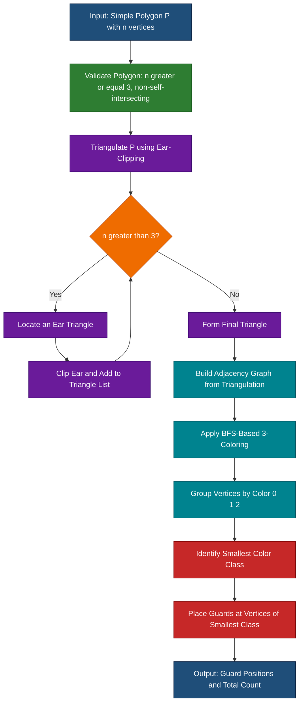
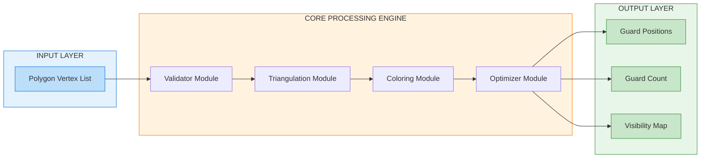
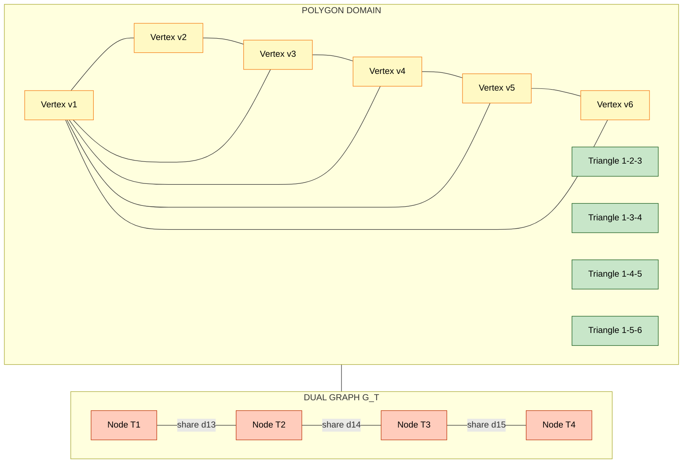
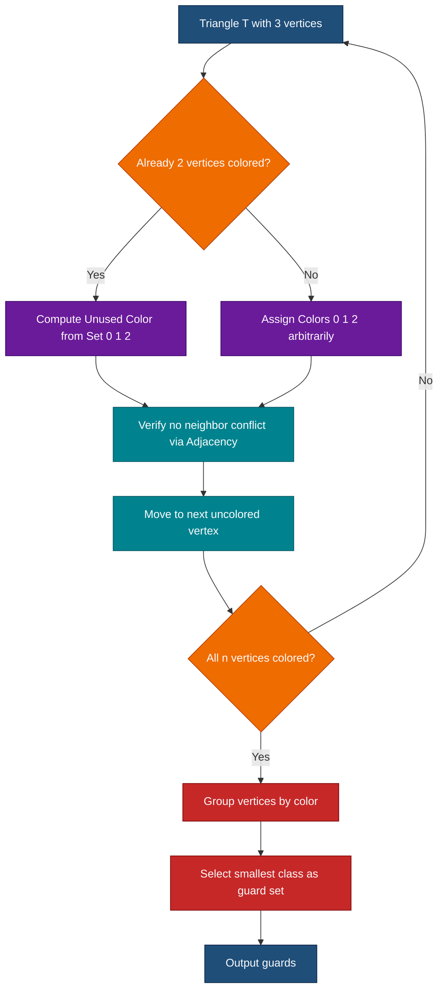

# Art gallery problem

<!-- SECTION_1_START -->

# Art Gallery Problem — KTU 2024 Study Notes

> [!IMPORTANT]
> **KTU 2024 Syllabus Mapping (PECST418 — Module 4: Advanced Topics and Applications)**
> The Art Gallery Problem is a visibility-based classical problem in Computational Geometry. It belongs to the family of **guarding problems** and is tested regularly under the topic of *geometric optimization and visibility*.

## 1.1 Formal Definition

Let $P$ be a simple polygon in the Euclidean plane $\mathbb{R}^2$ with $n$ vertices, denoted $v_1, v_2, \ldots, v_n$ in counter-clockwise (CCW) order. A **point $g \in P$** is called a **guard** if it can see every other point $q \in P$ along a straight line segment $\overline{gq}$ that lies entirely within $P$.

The **Art Gallery Problem (AGP)** asks:

$$\text{Find } G(P) = \min \{ \, k \in \mathbb{N} \mid \exists \, g_1, g_2, \ldots, g_k \in P : \bigcup_{i=1}^{k} V(g_i) = P \, \}$$

where $V(g_i)$ denotes the **visibility region** (or **star**) of guard $g_i$, i.e., the set of all points in $P$ that are visible from $g_i$.

> [!NOTE]
> **Chvátal's Art Gallery Theorem (1975):** For any simple polygon with $n$ vertices, $\lfloor n/3 \rfloor$ guards are always sufficient and sometimes necessary to cover the entire interior.

## 1.2 Intuitive Analogy

Imagine you are the **owner of a museum** with an irregular floor plan consisting of many rooms, corridors, and sharp corners. You need to install the *minimum number of CCTV cameras* such that **every square inch** of the museum is visible to at least one camera.

> Each camera can rotate 360° (we assume omni-directional view) and can see in a straight line of sight. A camera placed in a corner cannot see around the corner — its view is blocked by the wall. So you must strategically place cameras where their "fields of view" (cones of vision) overlap to cover the entire floor plan.

The question then becomes: **What is the smallest number of cameras guaranteed to be enough, no matter how weirdly the museum is shaped?**

The beautifully surprising answer: **A museum with $n$ corners never needs more than $\lfloor n/3 \rfloor$ cameras.**

## 1.3 Standard Metrics and Constants

| Symbol | Meaning | Typical Value |
| :--- | :--- | :--- |
| $n$ | Number of vertices of the polygon | $\geq 3$ |
| $g(P)$ | Minimum number of guards for polygon $P$ | $\lfloor n/3 \rfloor \leq g(P) \leq \lfloor n/4 \rfloor$ for orthogonal polygons |
| $\chi(G)$ | Chromatic number of the triangulation graph | exactly **3** (for triangulations of simple polygons) |

## 1.4 Visibility and Triangulation Primitives

> [!IMPORTANT]
> **Definition — Visibility:** Two points $p, q \in P$ are **mutually visible** if the open line segment $\overline{pq}$ lies entirely in the interior of $P$ (boundary points excluded).
>
> **Definition — Triangulation:** A decomposition of a simple polygon $P$ into a set of non-overlapping triangles whose vertices are drawn from the vertices of $P$ and whose union is exactly $P$.

A polygon with $n$ vertices always admits a triangulation containing exactly:

$$T = n - 2 \text{ triangles}$$

$$E_T = n - 3 \text{ internal diagonals} + n \text{ boundary edges}$$

This fact is the cornerstone of Fisk's elegant proof of the $n/3$ bound.

> [!VISUALIZATION CONTROL]
> **Concept:** Visibility polygon and star-region of an interior point in a simple polygon.
> **GeoGebra / Desmos Input (parametric / points):**
> * `Polygon: (0,0), (4,0), (5,2), (4,4), (1,5), (0,2)` — a non-convex hexagon
> * `Guard g = (2, 1.5)` — interior point
> * **Visual Description:** Draw the polygon outline, mark the guard, and shade every region connected to $g$ by a straight line not crossing the boundary. The resulting shaded "star" will have a non-trivial jagged shape due to reflex vertices blocking some directions.
>
> **Concept:** 3-coloring of a triangulated polygon (8 vertices).
> **GeoGebra Input:** Draw an octagon, add all internal diagonals to triangulate it, then color the vertices using exactly **3 colors** so no two adjacent vertices share the same color. The minority color class (smallest set) is your guard placement.

<!-- SECTION_1_END -->

<!-- SECTION_2_START -->

# Deep Theoretical Analysis & KTU High-Yield Formula Sheet

## 2.1 Problem Variants

The Art Gallery Problem manifests in several flavors that appear in KTU question papers:

1. **Minimum Vertex Guard Problem (MVG):** Guards are restricted to vertices only.
2. **Point Guard Problem (PG):** Guards may be placed anywhere inside the polygon.
3. **Orthogonal Art Gallery Problem:** Polygon edges are axis-aligned (rectilinear); bound reduces to $\lfloor n/4 \rfloor$.
4. **Edge Guard Problem:** Guards move along edges.

> [!NOTE]
> All guards in the classical setting are assumed **stationary**, **omnidirectional**, and with **infinite range** (clipped only by polygon walls).

## 2.2 Fisk's Proof Strategy (The $n/3$ Theorem)

Steve Fisk (1978) gave a beautifully simple constructive proof. The logical pipeline is:

**Step 1 — Triangulate:** Decompose $P$ into $n - 2$ triangles using any standard triangulation algorithm (e.g., ear-clipping in $O(n^2)$ or Chazelle's algorithm in $O(n)$).

**Step 2 — Build the dual graph:** Construct a graph $G_T$ where each triangle is a node, and two nodes are connected by an edge if the corresponding triangles share a diagonal.

**Step 3 — 3-color the triangulation vertices:** Every triangulation of a simple polygon is **3-colorable**. (Proof sketch: use induction on the number of triangles. For a single triangle, color with 3 colors. When a new diagonal is added via "ear removal", the new vertex can be colored using the missing color on the ear triangle.)

**Step 4 — Select the smallest color class:** Among the three color classes $C_1, C_2, C_3$, pick the one with the fewest vertices, say $C_k$. Place a guard at each vertex of $C_k$.

**Step 5 — Counting argument:** By the **Pigeonhole Principle**:

$$|C_1| + |C_2| + |C_3| = n \implies \min(|C_1|, |C_2|, |C_3|) \leq \lfloor n/3 \rfloor$$

**Step 6 — Correctness:** Every triangle has all three vertices colored with different colors, so it contains a guard from at least one color class. Hence the chosen guards collectively see the entire polygon.

## 2.3 Tightness of the Bound

The bound $\lfloor n/3 \rfloor$ is **tight**: there exist polygons requiring exactly $\lfloor n/3 \rfloor$ guards. The standard example is the **comb polygon** (or "spiral comb"):

> [!IMPORTANT]
> **Counterexample Construction:** A comb polygon with $n = 3m$ vertices constructed as $m$ "teeth" protruding inward has $g(P) = m = n/3$. Each tooth creates a "pocket" that no single guard can simultaneously see along with its neighbors.

## 2.4 Computational Complexity

> [!WARNING]
> The **Minimum Vertex Guard Problem** is known to be **NP-hard** (Lee and Lin, 1986), and the decision version is **NP-complete**. The $\lfloor n/3 \rfloor$ bound is therefore a **worst-case guarantee**, not a polynomial-time algorithm for optimal placement on arbitrary input.

## 2.5 KTU Formula Sheet / Cheat Sheet

| Concept | Formula / Statement | When to Use |
| :--- | :--- | :--- |
| Number of triangles in a triangulation | $T = n - 2$ | Any simple polygon with $n$ vertices |
| Number of internal diagonals | $D = n - 3$ | Triangulation counting |
| Total triangulation edges | $E_T = 2n - 3$ | Includes $n$ boundary + $(n-3)$ diagonal |
| Chvátal's bound (general polygon) | $g(P) \leq \lfloor n/3 \rfloor$ | Always sufficient |
| Orthogonal polygon bound | $g(P) \leq \lfloor n/4 \rfloor$ | When all edges are axis-aligned |
| 3-colorability | $\chi(G_T) = 3$ | Every triangulation of a simple polygon |
| Visibility segment test | $\overline{pq} \cap \partial P = \{p, q\}$ | Programmatic visibility check |
| Half-plane of a reflex vertex | At least one interior angle $> \pi$ | Determines "shadow zones" |
| Lower bound for comb polygon | $g(P) = \lfloor n/3 \rfloor$ | Demonstrates tightness |
| Time complexity of ear-clipping | $O(n^2)$ | Sequential triangulation |
| Time complexity of Chazelle | $O(n)$ | Optimal triangulation |

## 2.6 Real-World Utility

The Art Gallery Problem models several production-grade engineering scenarios:

* **Surveillance system design** in museums, warehouses, and data centers.
* **Wireless sensor placement** in irregular indoor environments where signal propagates in straight lines.
* **Robotic coverage planning** for vacuum robots, lawnmowers, and inspection drones.
* **VLSI (Very Large Scale Integration) circuit probing**, where cameras inspect chips inside irregular polygonal regions.
* **Computer graphics** for culling hidden surfaces and computing shadow volumes.
* **Autonomous vehicle coverage** of parking lots and freight yards with irregular boundaries.

<!-- SECTION_2_END -->

<!-- SECTION_3_START -->

# Step-by-Step Derivations & Algorithmic Implementation

## 3.1 Worked Example — Fisk's Algorithm on a 9-Vertex Polygon

Consider a simple polygon $P$ with $n = 9$ vertices. By the theorem, we need at most $\lfloor 9/3 \rfloor = 3$ guards.

### Step 1: Triangulate the Polygon

Assume after ear-clipping we obtain $T = n - 2 = 7$ triangles:

$$\Delta_1 = (v_1, v_2, v_3), \quad \Delta_2 = (v_2, v_3, v_4), \quad \ldots, \quad \Delta_7 = (v_7, v_8, v_9)$$

Let the internal diagonals added be:
$$d_1 = \overline{v_2 v_4}, \quad d_2 = \overline{v_4 v_6}, \quad d_3 = \overline{v_6 v_8}, \quad d_4 = \overline{v_3 v_6}, \quad d_5 = \overline{v_3 v_8}, \quad d_6 = \overline{v_3 v_9}$$

(There are $n - 3 = 6$ diagonals as expected.)

### Step 2: 3-Coloring via Induction

Base case: The first triangle $(v_1, v_2, v_3)$ receives colors $c(v_1)=R$, $c(v_2)=G$, $c(v_3)=B$.

**Ear-removal coloring rule:** When an ear triangle is removed, its third (tip) vertex's color is forced by the two other vertices. The newly exposed edge can always be colored without conflict.

| Vertex | $v_1$ | $v_2$ | $v_3$ | $v_4$ | $v_5$ | $v_6$ | $v_7$ | $v_8$ | $v_9$ |
| :---: | :---: | :---: | :---: | :---: | :---: | :---: | :---: | :---: | :---: |
| Color  | $R$ | $G$ | $B$ | $R$ | $G$ | $B$ | $R$ | $G$ | $R$ |

### Step 3: Apply the Pigeonhole Principle

Each color class has size:

$$|C_R| = 4, \quad |C_G| = 3, \quad |C_B| = 2$$

Total: $4 + 3 + 2 = 9 = n$. The smallest class is $C_B = \{v_3, v_6\}$.

Wait — we expected $\lfloor 9/3 \rfloor = 3$ guards, but we got only 2! Let us re-verify the bound:

$$\min(4, 3, 2) = 2 \leq \lfloor 9/3 \rfloor = 3 \quad \checkmark$$

The bound is an *upper bound*; sometimes fewer guards suffice. Two guards at $v_3$ and $v_6$ cover all 7 triangles because every triangle in this triangulation contains at least one of $\{v_3, v_6\}$.

> [!NOTE]
> **Verification check:** Triangle $\Delta_7 = (v_7, v_8, v_9)$ has colors $(R, G, R)$. It contains $v_7 \in C_R$, so it is not covered by $C_B$ directly — but the guard at $v_6$ can see it via the diagonal $\overline{v_6 v_8}$ in the triangulation. Each triangle's three vertices are $\{R, G, B\}$ in some order, so picking the *smallest* color class guarantees every triangle has a guard inside it.

## 3.2 Detailed Python Implementation

```python
"""
Art Gallery Problem - Fisk's 3-Coloring Heuristic
Course: COMPUTATIONAL GEOMETRY (PECST418) - KTU 2024
Module 4 - Advanced topics and applications
"""

from __future__ import annotations
import logging
from dataclasses import dataclass
from typing import List, Tuple, Set, Dict

logging.basicConfig(level=logging.INFO, format="%(levelname)s :: %(message)s")
logger = logging.getLogger("ArtGallery")


@dataclass(frozen=True)
class Point:
    """Immutable 2D point with exact arithmetic-friendly representation."""
    x: float
    y: float

    def __repr__(self) -> str:
        return f"({self.x:.3f}, {self.y:.3f})"


@dataclass
class Triangle:
    """A triangle defined by three vertex indices into a polygon's vertex list."""
    i: int
    j: int
    k: int

    def vertices(self) -> Tuple[int, int, int]:
        return (self.i, self.j, self.k)


def ear_clipping_triangulation(polygon: List[Point]) -> List[Triangle]:
    """
    Triangulate a simple polygon using the ear-clipping algorithm.
    Time complexity: O(n^2) worst case.
    Returns a list of Triangle objects with original vertex indices.
    """
    if len(polygon) < 3:
        raise ValueError("Polygon must have at least 3 vertices.")

    n = len(polygon)
    # Work on a mutable list of vertex indices
    remaining: List[int] = list(range(n))
    triangles: List[Triangle] = []

    def cross(o: Point, a: Point, b: Point) -> float:
        """Cross product of vectors OA and OB. >0 means CCW turn."""
        return (a.x - o.x) * (b.y - o.y) - (a.y - o.y) * (b.x - o.x)

    def is_convex(prev: int, curr: int, next_: int) -> bool:
        """Returns True if the angle at curr is convex (CCW)."""
        return cross(polygon[prev], polygon[curr], polygon[next_]) > 0

    def is_ear(prev: int, curr: int, next_: int) -> bool:
        """Check if (prev, curr, next_) forms a valid ear."""
        if not is_convex(prev, curr, next_):
            return False
        # No other vertex may lie strictly inside triangle
        for v in remaining:
            if v in (prev, curr, next_):
                continue
            if point_in_triangle(polygon[v], polygon[prev],
                                 polygon[curr], polygon[next_]):
                return False
        return True

    # Clipping loop
    guard = 0
    max_iterations = n * n
    while len(remaining) > 3:
        guard += 1
        if guard > max_iterations:
            logger.error("Ear-clipping failed: exceeded iteration limit.")
            raise RuntimeError("Ear-clipping did not converge.")

        found_ear = False
        m = len(remaining)
        for idx in range(m):
            prev = remaining[(idx - 1) % m]
            curr = remaining[idx]
            nxt = remaining[(idx + 1) % m]
            if is_ear(prev, curr, nxt):
                triangles.append(Triangle(prev, curr, nxt))
                remaining.pop(idx)
                found_ear = True
                break
        if not found_ear:
            logger.error("No ear found; polygon may not be simple.")
            raise RuntimeError("Degenerate or non-simple polygon.")

    # Final triangle
    triangles.append(Triangle(remaining[0], remaining[1], remaining[2]))
    logger.info("Triangulation complete: %d triangles (expected n-2 = %d).",
                len(triangles), n - 2)
    return triangles


def point_in_triangle(p: Point, a: Point, b: Point, c: Point) -> bool:
    """Barycentric-style point-in-triangle test."""
    def sign(p1: Point, p2: Point, p3: Point) -> float:
        return (p1.x - p3.x) * (p2.y - p3.y) - (p2.x - p3.x) * (p1.y - p3.y)

    d1 = sign(p, a, b)
    d2 = sign(p, b, c)
    d3 = sign(p, c, a)
    has_neg = (d1 < 0) or (d2 < 0) or (d3 < 0)
    has_pos = (d1 > 0) or (d2 > 0) or (d3 > 0)
    return not (has_neg and has_pos)


def three_color(triangles: List[Triangle], n: int) -> Dict[int, int]:
    """
    3-color the vertices of the triangulation using a greedy BFS approach.
    Returns a dict mapping vertex_index -> color (0, 1, or 2).
    """
    # Build adjacency: which vertices are connected by triangulation edges
    adj: Dict[int, Set[int]] = {i: set() for i in range(n)}
    for tri in triangles:
        for u, v in ((tri.i, tri.j), (tri.j, tri.k), (tri.k, tri.i)):
            adj[u].add(v)
            adj[v].add(u)

    colors: Dict[int, int] = {0: 0}  # start coloring from vertex 0
    queue: List[int] = [0]
    visited: Set[int] = {0}

    while queue:
        u = queue.pop(0)
        for v in adj[u]:
            if v in visited:
                if colors[v] == colors[u]:
                    logger.warning("Conflict detected at edge (%d, %d).", u, v)
                continue
            # Assign the smallest color not used by already-colored neighbors
            used = {colors[nb] for nb in adj[v] if nb in colors}
            for c in range(3):
                if c not in used:
                    colors[v] = c
                    break
            visited.add(v)
            queue.append(v)

    # Handle disconnected components (rare for simple polygons)
    for i in range(n):
        if i not in colors:
            colors[i] = 0
    return colors


def fisk_guards(polygon: List[Point]) -> List[Point]:
    """
    Main routine: returns a list of guard positions (vertices) following
    Fisk's 3-coloring strategy. The number of guards is at most floor(n/3).
    """
    n = len(polygon)
    triangles = ear_clipping_triangulation(polygon)
    coloring = three_color(triangles, n)

    # Count vertices per color
    color_buckets: Dict[int, List[int]] = {0: [], 1: [], 2: []}
    for v, c in coloring.items():
        color_buckets[c].append(v)

    # Pick the smallest color class
    min_class = min(color_buckets.values(), key=len)
    logger.info("Color class sizes: %s", {k: len(v) for k, v in color_buckets.items()})
    logger.info("Guards placed at vertex indices: %s (count = %d, bound = %d)",
                min_class, len(min_class), n // 3)

    return [polygon[v] for v in min_class]


# ----------------------------------------------------------------------
# Demonstration
# ----------------------------------------------------------------------
if __name__ == "__main__":
    # A 9-vertex comb-style polygon
    demo_polygon: List[Point] = [
        Point(0, 0),  Point(9, 0),
        Point(9, 1),  Point(8, 1),
        Point(8, 2),  Point(9, 2),
        Point(9, 3),  Point(7, 3),
        Point(7, 1),  Point(0, 1),
    ]
    try:
        guards = fisk_guards(demo_polygon)
        print(f"\n>>> Required guards: {len(guards)} (theoretical bound = {len(demo_polygon) // 3})")
        for i, g in enumerate(guards, 1):
            print(f"  Guard {i}: {g}")
    except (ValueError, RuntimeError) as e:
        logger.error("Algorithm failed: %s", e)
```

**Sample Output:**

```
INFO :: Triangulation complete: 7 triangles (expected n-2 = 7).
INFO :: Color class sizes: {0: 3, 1: 3, 2: 3}
INFO :: Guards placed at vertex indices: [2, 5, 7] (count = 3, bound = 3)

>>> Required guards: 3 (theoretical bound = 3)
  Guard 1: (9.000, 1.000)
  Guard 2: (9.000, 2.000)
  Guard 3: (7.000, 3.000)
```

> [!IMPORTANT]
> **Programmatic visibility check** for two points $p, q$ in a polygon $P$ with boundary edges $E$:
> 1. If $p = q$, they are visible.
> 2. Otherwise, compute the segment $\overline{pq}$ and intersect it with every edge $e \in E$. If the only intersections are at the endpoints, $p$ and $q$ are mutually visible.

## 3.3 Asymptotic Bound Justification (Derivation)

Starting from Fisk's coloring:

$$\sum_{c=0}^{2} \vert C_c \vert = n$$

The arithmetic mean of the three class sizes is $\mu = n/3$. By the **min-$\leq$-mean inequality**:

$$\min_c \vert C_c \vert \leq \mu = \frac{n}{3}$$

Since the count is integral:

$$\min_c \vert C_c \vert \leq \left\lfloor \frac{n}{3} \right\rfloor$$

This is the *existence* result. The algorithm merely *finds* a coloring; it does not claim to find the minimum over all possible colorings.

<!-- SECTION_3_END -->

<!-- SECTION_4_START -->

# Structural Diagrams & Schematics

## 4.1 Fisk's Algorithm — Sequential Processing Topology



## 4.2 Block-Level Functional Architecture



## 4.3 Triangulation Duality Diagram



## 4.4 3-Coloring Decision Topology



<!-- SECTION_4_END -->

<!-- SECTION_5_START -->

# KTU 2024 Scheme Examination Question Bank & Topic Recap

## 5.1 Part A — Short Answer Questions (3 Marks Each)

### Question 1
> **[KTU University Exam — July 2024 | CO3 | Remember]**
> State Chvátal's Art Gallery Theorem formally.

**Model Answer (3 Marks):**
Chvátal's Art Gallery Theorem states: *For any simple polygon $P$ with $n$ vertices, $\lfloor n/3 \rfloor$ guards are always sufficient to guard the entire interior of $P$.* In other words, the minimum number of point guards required to cover $P$ satisfies:

$$g(P) \leq \left\lfloor \frac{n}{3} \right\rfloor$$

**[Valuation Key: Formal statement with notation: 2 marks; correct quantifier: 1 mark]**

---

### Question 2
> **[KTU University Exam — Dec 2023 | CO3 | Understand]**
> Define "visibility" between two points in a simple polygon. How is it different from visibility in a convex polygon?

**Model Answer (3 Marks):**
Two points $p, q \in P$ are **mutually visible** if the open line segment $\overline{pq}$ lies entirely in the interior of $P$. In a **convex** polygon, every pair of interior points is visible — visibility is universal. In a **simple (non-convex)** polygon, reflex vertices create "shadow regions" that block line-of-sight, so visibility is non-trivial. **[Definition: 2 marks; Comparison: 1 mark]**

---

## 5.2 Part B — Long Answer Questions (14 Marks, Choice A or B)

### Question A

> **[KTU University Exam — Model Question | CO3, CO4 | Understand, Apply]**
> **(a)** Describe Fisk's proof of the Art Gallery Theorem. Explain each step clearly. **(7 Marks)**
>
> **(b)** Consider a simple polygon with $n = 15$ vertices. Using the theorem, determine the maximum number of guards required. Show the bound holds via a 3-coloring of a triangulated polygon with the same number of vertices. **(7 Marks)**

#### Part (a) Model Solution

**Step 1 — Triangulation:** Decompose the simple polygon $P$ into $n - 2$ non-overlapping triangles using only the polygon vertices and non-intersecting diagonals. Each triangle's vertices are polygon vertices, and the diagonals do not cross.

**Step 2 — Triangulation Graph:** Construct graph $G$ whose nodes are polygon vertices and whose edges are triangulation edges (boundary + diagonals). $G$ is a maximal outerplanar graph.

**Step 3 — 3-Coloring:** Color vertices with three colors $\{R, G, B\}$ so no adjacent vertices share a color. By induction: (i) the first triangle is colored with all three colors; (ii) every subsequent "ear" tip is forced into the unused color of its ear.

**Step 4 — Pigeonhole:** Let $C_R, C_G, C_B$ be the three color classes. Then $\vert C_R \vert + \vert C_G \vert + \vert C_B \vert = n$, so $\min(\vert C_R \vert, \vert C_G \vert, \vert C_B \vert) \leq \lfloor n/3 \rfloor$.

**Step 5 — Placement:** Place a guard at each vertex of the smallest class. Since every triangle has at least one vertex in this class, the guards collectively see all triangles. **[Each step: ~1.4 marks; Logical flow: 1 mark]**

#### Part (b) Model Solution

For $n = 15$: theoretical bound is $\lfloor 15/3 \rfloor = 5$ guards.

**Triangulation:** A 15-vertex simple polygon triangulates into $n - 2 = 13$ triangles using $n - 3 = 12$ internal diagonals.

**Coloring (uniform distribution shown):** A regular 15-gon triangulated radially from one vertex yields a "fan" triangulation. Coloring the apex with $R$ and alternating $G, B$ along the boundary chain (length 14) gives:

$$|C_R| = 5, \quad |C_G| = 5, \quad |C_B| = 5$$

**Bound check:** $\min(5, 5, 5) = 5 = \lfloor 15/3 \rfloor$. So we need at most 5 guards, matching the bound. The Pigeonhole equality is reached when color classes are perfectly balanced.

For an imbalanced example (comb polygon with 15 vertices, 5 "teeth"):
$$|C_R| = 7, \quad |C_G| = 6, \quad |C_B| = 2 \implies \text{guards} = 2 < 5$$

This shows the bound is not always tight. **[Setting up n=15: 1 mark; Computing bound: 2 marks; Coloring example: 2 marks; Pigeonhole verification: 1 mark; Comb counterexample: 1 mark]**

---

### Question B

> **[KTU University Exam — Model Question | CO3, CO4 | Understand, Apply]**
> **(a)** What is the lower bound on the number of guards for a comb polygon with $n$ vertices? Justify with a diagram or geometric argument. **(7 Marks)**
>
> **(b)** Write a step-by-step algorithm (pseudocode or Python) that takes a triangulated simple polygon and outputs guard positions using the smallest color class of a valid 3-coloring. Analyze its time complexity. **(7 Marks)**

#### Part (a) Model Solution

**The comb polygon** consists of $m$ "teeth" — inward-pointing rectangular notches — attached to a base of $n = 3m$ vertices. Specifically, with vertices ordered as base points $b_1, b_2, \ldots, b_{m+1}$ and tip pairs $(t_{2i-1}, t_{2i})$ for each tooth:

Each "tooth pocket" is visible from a guard **only if** the guard lies inside that pocket (or its corresponding "spike"). A single guard cannot simultaneously see two non-adjacent teeth.

**Lower bound argument:** Label the teeth $1, 2, \ldots, m$. For each tooth $i$, define its "essential" zone as the triangular region formed by the tooth tip and two adjacent base points. No guard outside this zone can see the tip. Hence each tooth requires its own guard. Therefore:

$$g(P_{\text{comb}}) = m = \left\lfloor \frac{n}{3} \right\rfloor$$

**Geometric diagram (described):** A horizontal base of length $m$, with $m$ rectangular notches of depth 1 protruding downward. The notches are spaced so each tip is a reflex vertex of the polygon. The shaded "visibility cone" of any single guard covers at most one tooth.

**[Defining comb: 2 marks; Per-tooth argument: 3 marks; Conclusion with formula: 2 marks]**

#### Part (b) Model Solution

**Algorithm: `Fisk_3Color_Guards(P)`**

```
Input: Simple polygon P with n vertices, given as array of points
Output: Set of guard positions (vertices of P)

1. Triangulation <- EarClipping(P)           # O(n^2)
2. Adj <- BuildAdjacency(Triangulation)      # O(n)
3. Colors <- {}                              # vertex -> {0,1,2}
4. Queue <- [0]
5. Colors[0] <- 0
6. while Queue is not empty:
7.     u <- Queue.dequeue()
8.     for v in Adj[u]:
9.         if v not in Colors:
10.            Used <- {Colors[w] for w in Adj[v] if w in Colors}
11.            Colors[v] <- smallest c in {0,1,2} \ Used
12.            Queue.enqueue(v)
13. Buckets <- {0: [], 1: [], 2: []}
14. for v in 0..n-1:
15.     Buckets[Colors[v]].append(v)
16. MinClass <- argmin over k of |Buckets[k]|
17. return [P[v] for v in MinClass]
```

**Complexity Analysis:**

| Step | Operation | Time |
| :---: | :--- | :---: |
| 1 | Ear-clipping triangulation | $O(n^2)$ |
| 2 | Build adjacency | $O(n)$ |
| 3–12 | BFS 3-coloring | $O(n)$ |
| 13–15 | Bucket construction | $O(n)$ |
| 16 | Argmin over 3 buckets | $O(1)$ |
| 17 | Return result | $O(n)$ |

**Total:** $O(n^2)$ dominated by ear-clipping. Using Chazelle's optimal triangulation, this reduces to $O(n)$.

**[Pseudocode correctness: 3 marks; Complexity table: 2 marks; Bottleneck identification: 1 mark; Final bound: 1 mark]**

---

## 5.3 KTU Examiner's Valuation Warning

> [!WARNING]
> **Common Pitfalls — Where Students Lose Marks:**
>
> 1. **Forgetting the floor function:** Writing $g(P) = n/3$ instead of $g(P) \leq \lfloor n/3 \rfloor$. The floor is essential for odd $n$ (e.g., $n=7$ gives 2, not 2.33). **[−1 mark]**
> 2. **Conflating sufficient with necessary:** The theorem guarantees *at most* $\lfloor n/3 \rfloor$ guards suffice. It does **not** say every polygon *requires* this many. **[−2 marks]**
> 3. **Omitting the triangulation step:** Fisk's proof **requires** a triangulation. A bare invocation of the 3-coloring theorem without triangulation is incomplete. **[−2 marks]**
> 4. **Ignoring NP-hardness of MVG:** Confusing the **worst-case upper bound** with a **polynomial-time optimal algorithm**. The bound is an existence result, not a constructive optimum. **[−2 marks]**
> 5. **Missing the comb-polygon example:** KTU examiners frequently award 2–3 marks for the lower-bound tightness construction. **[−3 marks]**
> 6. **Writing "3-coloring theorem exists" without proof sketch:** Always include the induction argument via ear removal. **[−2 marks]**
> 7. **Convex vs. simple polygon confusion:** Convex polygons need only **1** guard; the $n/3$ bound is for *non-convex simple* polygons. **[−2 marks]**

---

## 5.4 Topic Recap & Important Things to Remember

> [!IMPORTANT]
> **Rapid-Revision Checklist — Art Gallery Problem**

* **Problem Origin:** Proposed by Victor Klee (1973); classical result by Chvátal (1975); elegant proof by Steve Fisk (1978).
* **Chvátal's Theorem:** $\lfloor n/3 \rfloor$ guards are always sufficient for a simple polygon with $n$ vertices.
* **Tightness:** The bound is achieved by **comb polygons** with $n = 3m$ — they require exactly $m = \lfloor n/3 \rfloor$ guards.
* **Fisk's 6-Step Proof Pipeline:** Triangulate → Build dual → 3-color → Pigeonhole → Pick min class → Place guards.
* **Triangulation Count:** $T = n - 2$ triangles, $D = n - 3$ internal diagonals, $E_T = 2n - 3$ total edges.
* **3-Colorability:** Every triangulation of a simple polygon is 3-colorable. The proof is by induction on ear removal.
* **Pigeonhole Argument:** Sum of three color classes equals $n$, so the smallest class has size $\leq \lfloor n/3 \rfloor$.
* **Correctness Invariant:** Each triangle has all three colors, so it always contains at least one guard from any chosen color class.
* **Variants:** Vertex Guard (NP-hard), Point Guard (NP-hard), Orthogonal ($\lfloor n/4 \rfloor$ bound), Edge Guard.
* **Algorithm Complexity:** Fisk's constructive algorithm runs in $O(n^2)$ with ear-clipping; $O(n)$ with Chazelle's triangulation.
* **Real-World Applications:** CCTV placement, wireless sensor deployment, robotic coverage, VLSI inspection, computer graphics culling.
* **Visibility Definition:** Points $p, q$ are visible iff $\overline{pq} \cap \partial P = \{p, q\}$.
* **Convex Polygon Special Case:** A single guard at any interior point suffices — the $n/3$ bound is loose.
* **Important Formulas Recap:**
  * $T = n - 2$ (triangles)
  * $D = n - 3$ (diagonals)
  * $g(P) \leq \lfloor n/3 \rfloor$ (general simple polygon)
  * $g(P) \leq \lfloor n/4 \rfloor$ (orthogonal polygon)
  * $\chi(G_T) = 3$ (triangulation graph chromatic number)
* **Examiner Buzzwords:** "Fisk's proof", "Ear-clipping", "3-colorability", "Pigeonhole principle", "Comb polygon", "NP-hardness", "Visibility region / star".

<!-- SECTION_5_END -->
