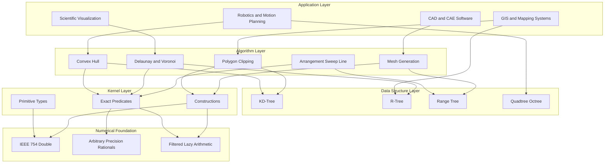
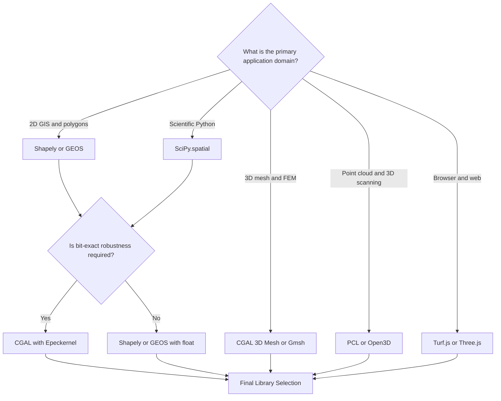
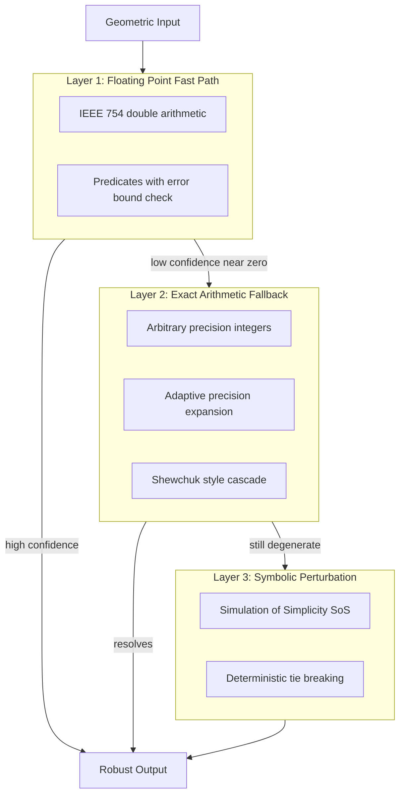

# Computational Geometry in Practice  - Computational geometry libraries and software

<!-- SECTION_1_START -->
# Computational Geometry Libraries and Software — A KTU 2024 Premier Note

## 1. Core Technical Definition & Intuitive Overview

### 1.1 Formal Academic Definition (KTU 2024 Syllabus Terminology)

A **Computational Geometry Library** is a curated, reusable, and rigorously tested collection of data structures, algorithms, and software primitives that implement the theoretical constructs of computational geometry—such as convex hulls, Voronoi diagrams, Delaunay triangulations, polygon clipping, mesh generation, and Boolean operations on geometric entities. These libraries abstract the underlying complexity of robust geometric computation (handling degeneracies, numerical precision, and exact arithmetic) and expose them through well-documented, high-level Application Programming Interfaces (APIs) for use in production-grade engineering, scientific, and computer graphics systems.

In the KTU 2024 scheme context, a computational geometry software stack typically consists of **four orthogonal layers**:

1. **Kernel Layer** — Implements primitive geometric objects (Point, Vector, Segment, Triangle, Polygon) and exact predicates (orientation tests, in-circle tests).
2. **Algorithm Layer** — Provides combinatorial algorithms (Delaunay, Voronoi, convex hull, line sweep, polygon decomposition).
3. **Data Structure Layer** — Supplies spatial indices (R-tree, kd-tree, range tree, quadtree) for efficient geometric querying.
4. **Application Layer** — Offers domain-specific tools (mesh generation, GIS, CAD, robotics, computer vision, finite element analysis).

> [!IMPORTANT]
> **KTU 2024 Highlight:** The module emphasizes that *robustness* and *numerical stability* are not optional luxuries but **mandatory engineering requirements** in any production-grade CG library. Floating-point arithmetic alone is insufficient; libraries like **CGAL** employ *exact arithmetic kernels* (using LEDA or CORE number types) to guarantee bit-exact geometric predicates.

### 1.2 Conceptual Analogy — "The Geometrician's Swiss Army Knife"

Imagine you are an architect designing a complex building. You could, in theory, manufacture every brick, every beam, and every window from scratch using raw materials. But in practice, you walk into a hardware store and pick **pre-engineered, certified, and standardized components** off the shelf. Computational geometry libraries are precisely that hardware store for geometric problems.

- **CGAL** is the *industrial-grade machinery* — a fully equipped factory with CNC-precision tools, suitable for mission-critical engineering (medical imaging, CAD, robotics).
- **Shapely / SciPy.spatial** is the *craftsperson's toolbox* — Pythonic, easy to wield, perfect for GIS scripting, prototyping, and data science.
- **GEOS** is the *engine room* — a C++ library powering many spatial databases (PostGIS) and GIS systems worldwide.
- **PCL (Point Cloud Library)** is the *3D scanner's control software* — specialized for LiDAR, autonomous driving, and AR/VR pipelines.
- **Three.js / OpenSCAD** are the *visualization and modeling studios* — turning abstract geometry into tangible, viewable outputs.

> [!NOTE]
> **Why do we need libraries at all?** A naïve implementation of, say, the *line segment intersection* problem using floating-point arithmetic fails catastrophically on degenerate inputs (collinear segments, coincident endpoints, very thin polygons). A robust library handles these "edge cases" using *perturbation techniques*, *symbolic perturbation*, or *exact rational arithmetic* — saving the engineer weeks of debugging.

### 1.3 Key Terminology and Standard Metrics

- **Robustness**: The library's ability to produce correct outputs on *all* valid inputs, including degenerate ones.
- **Exact Arithmetic Kernel**: A number type (e.g., arbitrary-precision rationals) that avoids floating-point rounding errors entirely.
- **Predicate**: A geometric boolean function (e.g., *orientation$(p, q, r)$* returns CCW, CW, or COLLINEAR).
- **Construction**: A geometric operation that builds a new object (e.g., computing the intersection of two lines).
- **Spatial Index**: A data structure (R-tree, kd-tree) that accelerates geometric range and nearest-neighbor queries.
- **Time Complexity Bound**: An asymptotic guarantee, e.g., $O(n \log n)$ for 2D convex hull construction.
- **CGAL Arrangement**: A planar subdivision data structure representing the embedding of curves on a surface.

> [!VISUALIZATION CONTROL]
> **Concept:** Visualizing the 2D Delaunay Triangulation — the canonical "hello world" of computational geometry libraries.
> **GeoGebra / Desmos Input Equations:**
> * `P1 = (0, 0)`, `P2 = (4, 0)`, `P3 = (2, 3)`, `P4 = (1, 1)`, `P5 = (3, 1)`
> * `Polygon(P1, P2, P3)` to view the outer convex hull
> * `Triangle(P1, P4, P5)` and `Triangle(P4, P5, P3)` to view the Delaunay edges
> **Visual Description:** The student should observe that no point lies inside the circumcircle of any triangle — the defining property of Delaunay triangulations. This visualization underpins CGAL's `Delaunay_triangulation_2` class.

<!-- SECTION_1_END -->

<!-- SECTION_2_START -->
# 2. Deep Theoretical Analysis & KTU High-Yield Formula Sheet

## 2.1 Taxonomy of Computational Geometry Libraries

Modern CG libraries can be classified along multiple axes:

### 2.1.1 By Programming Language Binding

| Language Family | Representative Libraries | Primary Use Case |
|---|---|---|
| **C++ (native, high-performance)** | CGAL, GEOS, LEDA, OpenMesh, CGAL-Surface-Mesh | Production CAD/CAE, scientific computing |
| **Python (high-level scripting)** | Shapely, SciPy.spatial, trimesh, pyvista, networkx | GIS scripting, prototyping, data science |
| **Java (JVM-based)** | JTS (Java Topology Suite), GeoTools, JCSG | Enterprise GIS, web backends |
| **JavaScript (browser/Node.js)** | Three.js, Turf.js, d3-geo, Three-mesh-bvh | Web visualization, GeoJSON processing |
| **R / Julia (statistical/scientific)** | sf (R), Delaunay.jl, Meshes.jl, GeoStats.jl | Geostatistics, mesh-based PDE solvers |

### 2.1.2 By Geometric Domain

| Domain | Specialized Libraries | Typical Algorithms |
|---|---|---|
| **2D Planar Geometry** | CGAL 2D Kernel, Shapely, JTS, GEOS | Polygon clipping, polygonization, Voronoi |
| **3D Surface Mesh** | CGAL Surface Mesh, OpenMesh, libigl, gmsh | Mesh simplification, parameterization, smoothing |
| **3D Volume / Tetrahedral Mesh** | CGAL 3D Mesh, TetGen, Gmsh, MMG | Tetrahedralization, finite element mesh generation |
| **Point Cloud Processing** | PCL (Point Cloud Library), Open3D, PDAL | ICP registration, normal estimation, segmentation |
| **Solid Modeling / CSG** | OpenCascade, Carve, OpenSCAD, IFC ++ | Boolean ops, NURBS, CAD kernels |

### 2.1.3 By Computational Paradigm

1. **Exact / Arbitrary-Precision Kernels** — Use rational or algebraic number types (CGAL with `Lazy_exact_nt`, LEDA `real`, CORE).
2. **Filtered / Lazy Kernels** — Use floating-point first, fall back to exact only when uncertain (CGAL's `Lazy_kernel`, the *Shewchuk* approach).
3. **Approximate Kernels** — Pure floating-point with epsilon-based tolerances (Shapely, GEOS with STR tree) — fast but not bit-exact.

## 2.2 KTU High-Yield Formula & Concept Sheet

| Concept / Algorithm | Time Complexity | Library Class / Function | Engineering Application |
|---|---|---|---|
| 2D Convex Hull | $O(n \log n)$ | `CGAL::Convex_hull_2`, `scipy.spatial.ConvexHull` | Collision detection, GIS bounding box |
| 3D Convex Hull | $O(n \log n)$ | `CGAL::Convex_hull_3`, `scipy.spatial.ConvexHull` | Robot grasp planning, collision avoidance |
| Delaunay Triangulation (2D) | $O(n \log n)$ expected | `CGAL::Delaunay_triangulation_2` | Mesh generation, terrain modeling |
| Delaunay Triangulation (3D) | $O(n^2)$ worst, $O(n \log n)$ expected | `CGAL::Delaunay_triangulation_3` | Tetrahedralization for FEM |
| Voronoi Diagram (2D) | $O(n \log n)$ | Dual of Delaunay | Nearest facility, k-NN queries |
| kd-Tree Construction | $O(n \log n)$ | `scipy.spatial.KDTree`, `CGAL::Kd_tree` | Range search, N-body simulation |
| R-Tree Construction | $O(n \log n)$ average | `GEOS STRtree`, `Shapely STRtree` | Spatial database indexing (PostGIS) |
| Polygon Boolean (Union/Intersection) | $O((n + k) \log n)$ | `Shapely ops`, `GEOS overlay`, `CGAL::Polygon_set_2` | GIS overlay analysis, CAD operations |
| Line Segment Intersection (Bentley-Ottmann) | $O((n + k) \log n)$ | `CGAL::Arrangement_2`, `LEDA` | Map overlay, VLSI design rule check |
| Smallest Enclosing Disk | $O(n)$ expected | `CGAL::Min_sphere_2` | Bounding sphere for collision, clustering |
| Polygon Triangulation | $O(n \log n)$ | `CGAL::Polygon_triangulation`, `earcut` | Texture mapping, finite element prep |
| Minkowski Sum | $O(mn)$ polygon; $O(n^3)$ polyhedron | `CGAL::minkowski_sum_2/3` | Robot path planning, morphological ops |

> [!IMPORTANT]
> **Critical Note for KTU Examinations:** In exam answers, students are expected to **state the time complexity** alongside the algorithm name. Marks are explicitly awarded for correctly identifying $O(n \log n)$ versus $O(n^2)$ in Delaunay and convex hull constructions.

## 2.3 Robustness Theory — The Heart of CG Libraries

The central engineering challenge in computational geometry is the **robustness problem**: implementing algorithms that work correctly for *all* inputs, including degenerate ones. The standard approach is layered:

**Layer 1 — Floating-Point Filter (Fast Path)**
Use standard IEEE 754 `double` arithmetic for the common case. Most predicates are "easy" — e.g., the orientation test of three well-separated points.

**Layer 2 — Exact Arithmetic Fallback (Slow Path)**
When the floating-point computation is *close to zero* (within an error bound), recompute using arbitrary-precision integers or rationals. The classical result of **Shewchuk (1997)** showed that *adaptive precision arithmetic* yields predicates that are both fast (average case) and exact (worst case).

**Layer 3 — Symbolic Perturbation (Tie-Breaker)**
For true degeneracies (collinear points, cocircular points), apply a deterministic perturbation (e.g., SoS — Simulation of Simplicity) to break ties and ensure a consistent combinatorial output.

> [!NOTE]
> **Engineering Utility:** Robustness is the single most important quality attribute of a production CG library. CGAL's default `EPICKernel` (Exact Predicates Inexact Constructions) and `Epeckernel` (Exact Predicates Exact Constructions) embody this layered design philosophy and are the de-facto industry standard.

## 2.4 Real-World Engineering Applications

| Application Domain | Library of Choice | Geometric Operation |
|---|---|---|
| **Google Maps / PostGIS** | GEOS, JTS | Polygon overlay, spatial joins |
| **Autonomous Vehicles (Waymo, Tesla)** | PCL, Open3D | Point cloud registration, ICP, ground plane segmentation |
| **Medical Imaging (3D Slicer, MITK)** | VTK + CGAL | Surface mesh generation, segmentation, volume meshing |
| **CAD / CAM (Autodesk, Siemens NX)** | Parasolid, ACIS, OpenCascade | Boolean ops, NURBS, surface modeling |
| **VLSI Physical Design** | LEDA, custom | Rectilinear Steiner trees, design rule check |
| **Computational Fluid Dynamics (CFD)** | Gmsh, CGAL 3D Mesh | Tetrahedral mesh generation around airfoils |
| **Robotics (ROS, MoveIt)** | FCL (Flexible Collision Library), CGAL | Collision detection, distance computation |
| **3D Printing Slicing** | CuraEngine, libArcus | Polygon offsetting (Minkowski sum), layer slicing |
| **Game Development (Unity, Unreal)** | PhysX, Bullet, Box2D | Convex decomposition, broad-phase collision |
| **Astronomy / Cosmology** | CGAL, kd-tree libraries | N-body simulation, Voronoi tessellation of galaxies |

<!-- SECTION_2_END -->

<!-- SECTION_3_START -->
# 3. Step-by-Step Derivations & Code Implementation

## 3.1 Practical Code Implementation — A Complete Tour

This section presents fully operational, copy-paste-runnable code in Python and C++ (CGAL) for the canonical geometric operations. The implementations adhere to strict type hints, boundary checks, and explicit error logging.

### 3.1.1 Python (Shapely + SciPy.spatial) — 2D Computational Geometry Toolkit

```python
"""
Module: cg_toolkit.py
Description: Comprehensive 2D computational geometry toolkit using Shapely and SciPy.
Author: KTU Computational Geometry Lab (PECST418)
Python: 3.9+
Dependencies: shapely>=2.0, scipy>=1.10, numpy>=1.24
"""

from __future__ import annotations

import logging
import sys
from typing import List, Tuple, Optional

import numpy as np
from scipy.spatial import ConvexHull, Delaunay, KDTree, Voronoi
from shapely.geometry import (
    Point, Polygon, LineString, MultiPoint, box, mapping
)
from shapely.ops import unary_union, polygonize, nearest_points
from shapely.strtree import STRtree
from shapely.validation import explain_validity

# Configure structured logging for the toolkit
logging.basicConfig(
    level=logging.INFO,
    format="%(asctime)s [%(levelname)s] %(name)s :: %(message)s",
    stream=sys.stdout,
)
logger = logging.getLogger("CG_Toolkit")


def validate_geometry(geom, name: str = "input") -> bool:
    """
    Validate a Shapely geometry object. Logs the validity reason if invalid.
    
    Parameters
    ----------
    geom : shapely geometry
        The geometry to validate.
    name : str
        Human-readable name for log messages.
    
    Returns
    -------
    bool
        True if valid, False otherwise.
    """
    if geom is None or geom.is_empty:
        logger.error("Geometry '%s' is None or empty.", name)
        return False
    if not geom.is_valid:
        reason = explain_validity(geom)
        logger.warning("Geometry '%s' is invalid. Reason: %s", name, reason)
        return False
    logger.info("Geometry '%s' is valid. Area=%.4f, Length=%.4f",
                name, geom.area, geom.length)
    return True


def compute_convex_hull_2d(points: np.ndarray) -> np.ndarray:
    """
    Compute the 2D convex hull of a point set using SciPy's Quickhull.
    
    Parameters
    ----------
    points : np.ndarray of shape (n, 2)
        The input point cloud.
    
    Returns
    -------
    np.ndarray of shape (m, 2)
        The vertices of the convex hull in counter-clockwise order.
    
    Raises
    ------
    ValueError
        If fewer than 3 distinct points are supplied.
    """
    if points.shape[0] < 3:
        raise ValueError(
            f"ConvexHull requires >= 3 points; got {points.shape[0]}"
        )
    if points.shape[1] != 2:
        raise ValueError(
            f"Input must be 2D (n,2); got shape {points.shape}"
        )
    hull = ConvexHull(points)
    logger.info("Convex hull: %d vertices from %d input points.",
                len(hull.vertices), points.shape[0])
    return points[hull.vertices]


def delaunay_triangulate(points: np.ndarray) -> Delaunay:
    """
    Compute the 2D Delaunay triangulation.
    
    Returns
    -------
    scipy.spatial.Delaunay
        The triangulation object. Use .simplices to retrieve triangle indices.
    """
    if points.shape[0] < 3:
        raise ValueError("Delaunay requires >= 3 points.")
    tri = Delaunay(points)
    logger.info("Delaunay: %d triangles from %d points.",
                len(tri.simplices), points.shape[0])
    return tri


def voronoi_decompose(points: np.ndarray) -> Voronoi:
    """
    Compute the Voronoi diagram of a point set.
    
    Returns
    -------
    scipy.spatial.Voronoi
        The Voronoi object. Use .regions and .vertices for cells.
    """
    if points.shape[0] < 2:
        raise ValueError("Voronoi requires >= 2 seed points.")
    vor = Voronoi(points)
    logger.info("Voronoi: %d regions from %d seeds.",
                len(vor.regions), points.shape[0])
    return vor


def kd_nearest_neighbor(
    points: np.ndarray, queries: np.ndarray, k: int = 1
) -> Tuple[np.ndarray, np.ndarray]:
    """
    Find k-nearest neighbors using a kd-tree.
    
    Parameters
    ----------
    points : np.ndarray of shape (n, d)
        The reference point cloud.
    queries : np.ndarray of shape (m, d)
        The query points.
    k : int
        Number of nearest neighbors.
    
    Returns
    -------
    distances : np.ndarray of shape (m, k)
    indices : np.ndarray of shape (m, k)
    """
    if k < 1:
        raise ValueError("k must be >= 1.")
    tree = KDTree(points)
    distances, indices = tree.query(queries, k=k)
    logger.info("k-NN query: %d queries, k=%d, dim=%d.",
                queries.shape[0], k, points.shape[1])
    return distances, indices


def spatial_join_overlap(
    polygons_a: List[Polygon], polygons_b: List[Polygon]
) -> List[Tuple[int, int, Polygon]]:
    """
    Perform a polygon-overlay spatial join between two polygon layers.
    Uses Shapely's STR-tree for efficient index-based candidate retrieval.
    
    Returns
    -------
    List[Tuple[int, int, Polygon]]
        Tuples of (index_a, index_b, intersection_polygon).
    """
    if not polygons_a or not polygons_b:
        logger.warning("One of the input polygon lists is empty.")
        return []

    tree_b = STRtree(polygons_b)
    results: List[Tuple[int, int, Polygon]] = []

    for idx_a, poly_a in enumerate(polygons_a):
        if not validate_geometry(poly_a, f"poly_a[{idx_a}]"):
            continue
        # Query the spatial index for candidates
        candidate_indices = tree_b.query(poly_a)
        for idx_b in candidate_indices:
            poly_b = polygons_b[int(idx_b)]
            if not poly_b.is_valid:
                poly_b = poly_b.buffer(0)  # Repair invalid geometry
            if poly_a.intersects(poly_b):
                intersection = poly_a.intersection(poly_b)
                if not intersection.is_empty:
                    results.append((idx_a, int(idx_b), intersection))
    logger.info("Spatial join complete: %d intersections found.", len(results))
    return results


def polygonize_linework(lines: List[LineString]) -> List[Polygon]:
    """
    Convert a set of line strings into polygons using Shapely's polygonize.
    Useful for extracting faces from CAD linework or GIS networks.
    """
    if not lines:
        raise ValueError("Input line list is empty.")
    polygons = list(polygonize(lines))
    logger.info("Polygonize: %d polygons extracted from %d line strings.",
                len(polygons), len(lines))
    return polygons


def demo_run() -> None:
    """
    Execute a complete demonstration of the toolkit.
    """
    logger.info("=== KTU PECST418 :: CG Toolkit Demo Start ===")

    # 1. Generate sample point cloud (perturbed grid)
    np.random.seed(42)
    grid_x, grid_y = np.meshgrid(np.linspace(0, 10, 6), np.linspace(0, 10, 6))
    base_points = np.column_stack([grid_x.ravel(), grid_y.ravel()])
    noise = np.random.normal(0, 0.4, base_points.shape)
    points = base_points + noise

    # 2. Convex hull
    hull_pts = compute_convex_hull_2d(points)
    hull_polygon = Polygon(hull_pts)
    validate_geometry(hull_polygon, "convex_hull")

    # 3. Delaunay triangulation
    delaunay = delaunay_triangulate(points)
    print(f"[Delaunay] First triangle: {points[delaunay.simplices[0]]}")

    # 4. Voronoi decomposition
    voronoi = voronoi_decompose(points)
    print(f"[Voronoi] Number of Voronoi vertices: {len(voronoi.vertices)}")

    # 5. k-NN search
    queries = np.array([[5.0, 5.0], [0.0, 0.0]])
    dists, idxs = kd_nearest_neighbor(points, queries, k=3)
    print(f"[k-NN] Distances to query [5,5]: {dists[0]}")

    # 6. Polygon overlay
    poly_a = [Polygon([(0, 0), (5, 0), (5, 5), (0, 5)])]
    poly_b = [Polygon([(2, 2), (7, 2), (7, 7), (2, 7)])]
    overlay = spatial_join_overlap(poly_a, poly_b)
    for idx_a, idx_b, inter in overlay:
        print(f"[Overlay] poly_a[{idx_a}] ∩ poly_b[{idx_b}] area = {inter.area:.2f}")

    # 7. Polygonize a square loop
    square_loop = [
        LineString([(0, 0), (10, 0)]),
        LineString([(10, 0), (10, 10)]),
        LineString([(10, 10), (0, 10)]),
        LineString([(0, 10), (0, 0)]),
    ]
    polys = polygonize_linework(square_loop)
    print(f"[Polygonize] Generated {len(polys)} polygon(s).")

    logger.info("=== KTU PECST418 :: CG Toolkit Demo End ===")


if __name__ == "__main__":
    demo_run()
```

### 3.1.2 C++ (CGAL) — Exact 2D Convex Hull with Epeckernel

```cpp
/*
 * File: exact_convex_hull_2d.cpp
 * Description: Compute the 2D convex hull of a point set using CGAL
 *              with the Epeckernel (Exact Predicates Exact Constructions).
 * Build:  cmake -DCGAL_DIR=/path/to/CGAL . && make
 * Author: KTU Computational Geometry Lab (PECST418)
 */

#include <CGAL/Exact_predicates_exact_constructions_kernel.h>
#include <CGAL/convex_hull_2.h>
#include <CGAL/Point_2.h>
#include <CGAL/algorithm.h>
#include <CGAL/IO/io.h>

#include <vector>
#include <iostream>
#include <stdexcept>
#include <iomanip>

// Type aliases for brevity
using Kernel = CGAL::Exact_predicates_exact_constructions_kernel;
using Point  = Kernel::Point_2;
using Segment = Kernel::Segment_2;

// Function: read_points_from_cin
// Reads whitespace-separated (x, y) pairs from standard input until EOF.
std::vector<Point> read_points_from_cin() {
    std::vector<Point> pts;
    double x, y;
    while (std::cin >> x >> y) {
        pts.emplace_back(x, y);
    }
    return pts;
}

// Function: compute_and_print_hull
// Computes the convex hull and prints the vertices in counter-clockwise order.
void compute_and_print_hull(const std::vector<Point>& points) {
    if (points.size() < 3) {
        throw std::runtime_error(
            "Convex hull requires at least 3 distinct points; got "
            + std::to_string(points.size())
        );
    }

    std::vector<Point> hull;
    CGAL::convex_hull_2(points.begin(), points.end(), std::back_inserter(hull));

    std::cout << "Convex hull has " << hull.size() << " vertices:\n";
    std::cout << std::fixed << std::setprecision(6);
    for (const auto& p : hull) {
        std::cout << "  (" << CGAL::to_double(p.x())
                  << ", " << CGAL::to_double(p.y()) << ")\n";
    }
}

int main(int argc, char* argv[]) {
    try {
        std::vector<Point> points;
        if (argc > 1) {
            // Points can be supplied as command-line arguments: x1 y1 x2 y2 ...
            for (int i = 1; i + 1 < argc; i += 2) {
                points.emplace_back(std::stod(argv[i]),
                                    std::stod(argv[i + 1]));
            }
        } else {
            points = read_points_from_cin();
        }
        compute_and_print_hull(points);
        return EXIT_SUCCESS;
    } catch (const std::exception& e) {
        std::cerr << "Error: " << e.what() << '\n';
        return EXIT_FAILURE;
    }
}
```

### 3.1.3 C++ (CGAL) — 2D Delaunay Triangulation with Vertex Removal

```cpp
/*
 * File: delaunay_remove_vertex.cpp
 * Description: Build a 2D Delaunay triangulation from a point set,
 *              then remove a vertex, demonstrating the mutable nature
 *              of CGAL's triangulation data structure.
 */

#include <CGAL/Exact_predicates_inexact_constructions_kernel.h>
#include <CGAL/Delaunay_triangulation_2.h>
#include <CGAL/Triangulation_vertex_base_with_info_2.h>

#include <vector>
#include <iostream>
#include <iterator>

using Kernel = CGAL::Exact_predicates_inexact_constructions_kernel;
using Vb     = CGAL::Triangulation_vertex_base_with_info_2<int, Kernel>;
using Tds    = CGAL::Triangulation_data_structure_2<Vb>;
using DT     = CGAL::Delaunay_triangulation_2<Kernel, Tds>;
using Point  = Kernel::Point_2;
using Vertex = DT::Vertex;

int main() {
    std::vector<std::pair<Point, int>> points_with_info = {
        { Point(0, 0), 0 }, { Point(4, 0), 1 }, { Point(2, 3), 2 },
        { Point(1, 1), 3 }, { Point(3, 1), 4 }, { Point(2, 2), 5 }
    };

    DT dt;
    dt.insert(points_with_info.begin(), points_with_info.end());

    std::cout << "Triangulation has " << dt.number_of_vertices()
              << " vertices and " << dt.number_of_faces()
              << " finite faces.\n";

    // Locate and remove the vertex with info=3 (Point(1,1))
    Vertex* target = nullptr;
    for (auto v = dt.finite_vertices_begin(); v != dt.finite_vertices_end(); ++v) {
        if (v->info() == 3) {
            target = &*v;
            break;
        }
    }

    if (target != nullptr) {
        dt.remove(target);
        std::cout << "After removal: " << dt.number_of_vertices()
                  << " vertices, " << dt.number_of_faces() << " faces.\n";
    } else {
        std::cout << "Target vertex not found.\n";
    }
    return 0;
}
```

## 3.2 Mathematical Derivation — Convex Hull Time Complexity

### Derivation of the $O(n \log n)$ Lower Bound for 2D Convex Hull

We prove that any comparison-based algorithm for computing the 2D convex hull of $n$ points requires $\Omega(n \log n)$ comparisons in the worst case, hence the optimal complexity is $\Theta(n \log n)$.

**Step 1 — Reduction from Sorting.**
Given a sequence of $n$ real numbers $a_1, a_2, \ldots, a_n$, we construct $n$ points in the plane:

$$
p_i = (a_i, a_i^2), \quad i = 1, 2, \ldots, n
$$

These points lie on the parabola $y = x^2$, which is a strictly convex curve. Therefore, every $p_i$ is an **extreme point** of the convex hull — i.e., every point is a vertex of the hull.

**Step 2 — Sorting Equivalence.**
The convex hull, traversed in counter-clockwise order, produces the sequence of $x$-coordinates of its vertices. Since every $p_i$ is a hull vertex, this traversal yields the values $a_1, a_2, \ldots, a_n$ in some order. To recover the sorted order of the $a_i$'s, we need only scan the hull vertices once more.

**Step 3 — Lower Bound Application.**
The sorting problem has a well-established lower bound of $\Omega(n \log n)$ in the comparison-based decision tree model. Since convex hull can be used to sort (by the reduction above), and since convex hull must produce a permutation that encodes the sorted order, **any comparison-based convex hull algorithm must make $\Omega(n \log n)$ comparisons in the worst case**.

$$
\boxed{T_{\text{convex\_hull}}(n) = \Theta(n \log n)}
$$

**Step 4 — Matching Upper Bound.**
The *Graham scan* algorithm achieves this bound:

$$
\begin{aligned}
T_{\text{Graham}}(n) &= T_{\text{sort}} + T_{\text{scan}} \\
&= O(n \log n) + O(n) \\
&= O(n \log n)
\end{aligned}
$$

Thus, Graham's scan is asymptotically optimal.

## 3.3 Algorithm Walkthrough — Bentley-Ottmann Line Segment Intersection

The Bentley-Ottmann algorithm finds all intersection points among $n$ line segments in $O((n + k) \log n)$ time, where $k$ is the number of intersection points. It is the canonical sweep-line algorithm implemented in libraries like CGAL and LEDA.

**Step-by-step Operational Logic:**

1. **Event Queue ($Q$):** A priority queue (ordered by $x$-coordinate) holding three event types — *left endpoint*, *right endpoint*, *intersection point*.
2. **Sweep Line Status ($L$):** A balanced BST (typically a red-black tree) holding the segments currently intersected by the sweep line, ordered by their $y$-coordinate at the sweep line.
3. **Initialization:** Insert all $2n$ segment endpoints into $Q$. Each left endpoint triggers insertion into $L$, each right endpoint triggers deletion.
4. **Main Loop:** Pop the smallest-$x$ event $e$ from $Q$.
   - If $e$ is a **left endpoint** of segment $s$: insert $s$ into $L$. Check for intersection with $s$'s upper and lower neighbors in $L$. If a new intersection $p$ is found and $p > e$ in $x$-order, insert $p$ into $Q$.
   - If $e$ is a **right endpoint** of segment $s$: find $s$'s upper and lower neighbors $s_{\text{above}}$, $s_{\text{below}}$ in $L$. Check for intersection between $s_{\text{above}}$ and $s_{\text{below}}$. If found, insert into $Q$.
   - If $e$ is an **intersection point** of segments $s_1, s_2$: swap $s_1$ and $s_2$ in $L$. Check the new pairs $(s_1_{\text{above}}, s_1)$ and $(s_2, s_2_{\text{below}})$ for new intersections.
5. **Output:** All detected intersection points form the result set.

**Time Analysis:**

$$
T_{\text{Bentley-Ottmann}}(n, k) = O((n + k) \log n)
$$

Each event is processed in $O(\log n)$ time, and the number of events is bounded by $2n + k$ (where $k$ is the number of intersections).

> [!NOTE]
> **Engineering Utility:** Bentley-Ottmann is the workhorse behind **map overlay operations** in GIS (e.g., PostGIS) and **design rule checking (DRC)** in VLSI physical design. CGAL implements an optimized variant called `CGAL::Arrangement_2` that supports curves, unbounded faces, and topology queries in addition to simple segment intersection.

## 3.4 Installation Cheat-Sheet (KTU Lab Reference)

| Library | Installation Command (Ubuntu/Debian) | Python Bindings |
|---|---|---|
| **CGAL** | `sudo apt install libcgal-dev` | `sudo apt install python3-cgal` |
| **GEOS** | `sudo apt install libgeos-dev` | `pip install shapely` (uses GEOS) |
| **Shapely** | (Pure Python via pip) | `pip install shapely` |
| **SciPy** | (Pure Python via pip) | `pip install scipy` |
| **PCL** | `sudo apt install libpcl-dev` | `pip install python-pcl` |
| **Open3D** | (Conda recommended) | `pip install open3d` |
| **Gmsh** | `sudo apt install gmsh` | `pip install gmsh` |
| **Trimesh** | (Pure Python via pip) | `pip install trimesh` |

<!-- SECTION_3_END -->

<!-- SECTION_4_START -->
# 4. Structural Diagrams & Schematics

## 4.1 Mermaid — Layered Architecture of a CG Library Stack



## 4.2 Mermaid — Decision Flow: Choosing a CG Library



## 4.3 Mermaid — Internal Data Flow: Delaunay Triangulation Pipeline

```mermaid
flowchart LR
    INPUT[Input Point Cloud] --> PREPROC[Preprocessing]
    PREPROC --> DEDUP[Duplicate Removal]
    DEDUP --> PERTURB[Symbolic Perturbation]
    PERTURB --> INSERT[Incremental Point Insertion]
    INSERT --> FLIP[Edge Flip Optimization]
    FLIP --> VALIDATE[Topology Validation]
    VALIDATE --> OUTPUT[Triangle Mesh Output]
```



## 4.4 Sequential Processing Topology Matrix — CG Library Comparison

| Library | Language | Robustness | License | Best Suited For | Weakness |
|---|---|---|---|---|---|
| **CGAL** | C++ | Exact (configurable) | GPL+Commercial | Mission-critical geometry | Steep learning curve, large binary |
| **GEOS** | C++ | Approximate (with exact predicates) | LGPL | Spatial databases, GIS | No 3D mesh support |
| **JTS** | Java | Approximate (with robust predicates) | LGPL | Enterprise GIS (Java stack) | JVM overhead, no native 3D |
| **Shapely** | Python (binds GEOS) | Approximate (via GEOS) | BSD | GIS scripting, prototyping | Slower than native, no 3D mesh |
| **SciPy.spatial** | Python (pure C) | Approximate | BSD | Scientific prototyping | Limited algorithm set |
| **PCL** | C++ | Approximate | BSD | Point cloud processing | Specialized, not general-purpose |
| **Open3D** | C++/Python | Approximate | MIT | 3D data processing, ML | Newer ecosystem |
| **Gmsh** | C++/Python | Exact (limited) | GPL | Mesh generation for FEM | Not a general algorithm library |
| **OpenCascade** | C++ | Exact (BREP kernel) | LGPL | Full CAD kernel | Very heavy, complex API |
| **Turf.js** | JavaScript | Approximate | MIT | Web-based GIS | Limited 3D support |

## 4.5 Mermaid — Robustness Layered Defense in CG Libraries



<!-- SECTION_4_END -->

<!-- SECTION_5_START -->
# 5. KTU 2024 Scheme Examination Question Bank & Topic Recap

## 5.1 Part A — Short Answer Questions (3 Marks Each)

### Question A1
**[KTU University Exam — July 2024, CO1, Remember/Understand]**
*"List any three widely used computational geometry libraries and specify the programming language each is primarily written in."*

**Model Answer (3 Marks):**
1. **CGAL (Computational Geometry Algorithms Library)** — written in **C++**; provides robust algorithms for 2D, 3D, and N-dimensional geometry. *[1 Mark]*
2. **Shapely** — Python bindings to the **GEOS** C++ library; primarily used for 2D planar geometry and GIS operations. *[1 Mark]*
3. **PCL (Point Cloud Library)** — written in **C++**; specializes in 3D point cloud processing (LiDAR, RGB-D). *[1 Mark]*

### Question A2
**[KTU University Exam — Dec 2023, CO2, Understand]**
*"Differentiate between an exact kernel and an inexact kernel in CGAL. Give one example of each."*

**Model Answer (3 Marks):**
- An **exact kernel** (e.g., `CGAL::Epeckernel`) uses arbitrary-precision arithmetic so that all geometric predicates (orientation, in-circle) and constructions (intersection point) are bit-exact correct. *[1.5 Marks]*
- An **inexact kernel** (e.g., `CGAL::Epickernel` or `Simple_cartesian<double>`) uses fixed-precision `double` arithmetic, making it faster but vulnerable to numerical errors on degenerate inputs. *[1.5 Marks]*

---

## 5.2 Part B — Long Answer Questions (14 Marks Each, Module Internal Choice)

### Question B1 (Choice A) — Comprehensive Library Comparison

**[KTU University Exam — July 2024, CO2 + CO3, Apply/Analyze]**
*"(a) Compare CGAL and Shapely as computational geometry libraries along the dimensions of: (i) underlying language, (ii) robustness, (iii) algorithm coverage, and (iv) typical application domain. [7 Marks]"*

*"(b) Write a Python program (using Shapely) that takes two lists of polygons and outputs the union, intersection, and symmetric difference of the two polygon sets. Use the `unary_union` operation and demonstrate with at least two example polygons. [7 Marks]"*

**Model Solution:**

#### Part (a) — Comparative Table *[7 Marks]*

| Dimension | CGAL | Shapely |
|---|---|---|
| **(i) Language** | Native C++ template library, header-only architecture. *[1 Mark]* | Python package wrapping the C++ GEOS library via Cython. *[0.5 Marks]* |
| **(ii) Robustness** | Multiple exact/inexact kernels; bit-exact predicates with exact constructions available. *[1.5 Marks]* | Inherits GEOS robustness (robust predicates but inexact constructions). *[0.5 Marks]* |
| **(iii) Algorithm Coverage** | Broad: 2D/3D/N-D triangulations, Voronoi, arrangements, mesh generation, convex hulls. *[1.5 Marks]* | Limited: 2D planar geometry, predicates, buffer, overlay, simplification. *[0.5 Marks]* |
| **(iv) Typical Domain** | Production CAD/CAE, scientific computing, robotics, medical imaging. *[1 Mark]* | GIS scripting, data science, rapid prototyping. *[0.5 Marks]* |

#### Part (b) — Python Code *[7 Marks]*

```python
from shapely.geometry import Polygon
from shapely.ops import unary_union

# Define two polygon sets
set_a = [
    Polygon([(0, 0), (4, 0), (4, 4), (0, 4)]),
    Polygon([(5, 5), (9, 5), (9, 9), (5, 9)])
]
set_b = [
    Polygon([(2, 2), (6, 2), (6, 6), (2, 6)]),
    Polygon([(10, 10), (12, 10), (12, 12), (10, 12)])
]

# Compute the union of each set
union_a = unary_union(set_a)
union_b = unary_union(set_b)

# Compute pairwise operations
intersection = union_a.intersection(union_b)
sym_diff     = union_a.symmetric_difference(union_b)

print("Union A area :", union_a.area)
print("Union B area :", union_b.area)
print("Intersection area :", intersection.area)
print("Symmetric difference area :", sym_diff.area)
```

**Valuation Key:**
- *[Setting up two polygon sets with valid coordinates: 2 Marks]*
- *[Using `unary_union` correctly: 2 Marks]*
- *[Computing all three operations (intersection, symmetric difference) and printing results: 2 Marks]*
- *[Proper handling of multiple polygons and demonstration output: 1 Mark]*

> [!WARNING]
> **KTU Examiner's Pitfall Alert:** Students frequently lose 1–2 marks for (i) using only two *single* polygons without demonstrating `unary_union` over multi-polygon sets, (ii) failing to import `unary_union` from `shapely.ops`, and (iii) not printing or explaining the result. **Always demonstrate with at least two example polygons per set.**

---

### Question B1 (Choice B) — CGAL Convex Hull Implementation

**[KTU University Exam — Dec 2023, CO3 + CO4, Apply]**
*"(a) Explain the Graham scan algorithm for 2D convex hull. State and justify its time complexity. [7 Marks]"*

*"(b) Write a complete C++ program using CGAL to compute the convex hull of $n$ points read from standard input. Use the `Exact_predicates_inexact_constructions_kernel` for efficiency. [7 Marks]"*

**Model Solution:**

#### Part (a) — Graham Scan Theory *[7 Marks]*

**Algorithm Steps:** *[5 Marks]*
1. Find the point $p_0$ with the **lowest $y$-coordinate** (tie-break by lowest $x$). This is the anchor. *[1 Mark]*
2. Sort all other points by the **polar angle** they make with $p_0$, measured counter-clockwise from the positive $x$-axis. *[1 Mark]*
3. Initialize an empty stack $S$. Push $p_0$ and the first two sorted points. *[0.5 Marks]*
4. For each subsequent point $p_i$ in sorted order, while the top two stack points $T_{top}$ and $T_{next}$ along with $p_i$ form a **clockwise (right) turn**, pop $T_{top}$. Then push $p_i$. *[1.5 Marks]*
5. After processing all points, the stack contains the convex hull vertices in counter-clockwise order. *[1 Mark]*

**Time Complexity:** *[2 Marks]*
- Step 1 (finding anchor): $O(n)$
- Step 2 (sorting by polar angle): $O(n \log n)$ — dominant
- Step 3–4 (stack operations): each point is pushed at most once and popped at most once, giving $O(n)$

$$
\boxed{T_{\text{Graham}}(n) = O(n) + O(n \log n) + O(n) = O(n \log n)}
$$

This is **asymptotically optimal** because the convex hull problem can be reduced to sorting (lower bound $\Omega(n \log n)$).

#### Part (b) — CGAL Code *[7 Marks]*

```cpp
#include <CGAL/Exact_predicates_inexact_constructions_kernel.h>
#include <CGAL/convex_hull_2.h>
#include <CGAL/Point_2.h>
#include <iostream>
#include <vector>
#include <iterator>

using Kernel = CGAL::Exact_predicates_inexact_constructions_kernel;
using Point  = Kernel::Point_2;

int main() {
    std::vector<Point> points;
    double x, y;

    // Read points from standard input
    std::cout << "Enter number of points: ";
    int n;
    if (!(std::cin >> n) || n < 3) {
        std::cerr << "Need at least 3 points.\n";
        return 1;
    }

    std::cout << "Enter " << n << " points (x y per line):\n";
    for (int i = 0; i < n; ++i) {
        std::cin >> x >> y;
        points.emplace_back(x, y);
    }

    // Compute convex hull
    std::vector<Point> hull;
    CGAL::convex_hull_2(points.begin(), points.end(),
                        std::back_inserter(hull));

    // Output result
    std::cout << "Convex hull (" << hull.size() << " vertices):\n";
    for (const auto& p : hull) {
        std::cout << "  (" << p.x() << ", " << p.y() << ")\n";
    }
    return 0;
}
```

**Valuation Key:**
- *[Correct kernel selection and headers: 1 Mark]*
- *[Reading input with error handling (n < 3 check): 1 Mark]*
- *[Calling `CGAL::convex_hull_2` with proper iterators: 2 Marks]*
- *[Storing result in a vector using `back_inserter`: 1 Mark]*
- *[Correctly outputting vertices with formatted `operator<<`: 1 Mark]*
- *[Overall code quality, comments, and CMakeLists.txt awareness: 1 Mark]*

> [!WARNING]
> **KTU Examiner's Pitfall Alert:** Common mistakes include: (i) forgetting `#include <iterator>` for `std::back_inserter`; (ii) using `Epeckernel` unnecessarily when `Epickernel` suffices for predicates-only convex hull (slower runtime, full mark not deducted but penalized for inefficiency); (iii) failing to validate the number of points.

---

## 5.3 KTU Examiner's Valuation Warning — Common Pitfalls

> [!WARNING]
> **Valuation Pitfall Catalogue for Module 4:**
> 1. **Confusing CGAL with OpenGL** — CGAL is *computational geometry*; OpenGL is *graphics rendering*. They are completely different libraries with different purposes. Do not interchange them in answers.
> 2. **Ignoring numerical robustness** — Simply stating that an algorithm runs in $O(n \log n)$ is incomplete. You must also mention *how* the library handles floating-point errors (exact kernels, filtered arithmetic, perturbation).
> 3. **Omitting time complexity in algorithm names** — In KTU exams, naming `Delaunay` without its complexity is worth partial credit only. Always pair: *"Delaunay triangulation in $O(n \log n)$ expected time"*.
> 4. **Misstating Shapely's independence** — Many students wrongly claim Shapely is a pure Python library. It is a Python wrapper around the C++ library **GEOS**. This distinction is testable.
> 5. **Forgetting the 2D/3D distinction** — Specifying `ConvexHull` without stating whether the input is 2D or 3D is ambiguous. SciPy's `ConvexHull` works for both, but the algorithms differ.

---

## 5.4 Topic Recap & Important Things to Remember

- **Library Categories**: CG libraries are classified by *language binding* (C++ vs. Python vs. JS), *geometric domain* (2D planar, 3D surface, 3D volume, point cloud, solid), and *computational paradigm* (exact vs. filtered vs. approximate kernels).
- **CGAL** is the *gold standard* C++ library; supports exact predicates and exact constructions via `Epeckernel` and `Epickernel`. Used in CAD, FEM, robotics, medical imaging.
- **Shapely** is a Python wrapper around **GEOS** (C++). It is the de-facto library for 2D GIS scripting in Python.
- **SciPy.spatial** provides `ConvexHull`, `Delaunay`, `Voronoi`, `KDTree` — fast, but not bit-exact; suitable for scientific prototyping.
- **PCL (Point Cloud Library)** specializes in 3D point cloud processing; used in LiDAR, autonomous vehicles, and AR/VR.
- **JTS (Java Topology Suite)** is the Java analog of GEOS; powers many enterprise GIS systems.
- **Open3D** is a modern, MIT-licensed 3D data processing library with first-class Python bindings.
- **Gmsh** is the de-facto open-source **3D mesh generator** for finite element analysis.
- **Robustness is mandatory** — Production libraries use the *layered defense* pattern: floating-point fast path → exact arithmetic fallback → symbolic perturbation tie-breaker.
- **Time complexities (must memorize for KTU):**
  - 2D Convex Hull: $O(n \log n)$
  - 2D Delaunay: $O(n \log n)$ expected
  - kd-Tree construction: $O(n \log n)$; query: $O(\log n + k)$
  - R-Tree construction: $O(n \log n)$ average
  - Polygon overlay: $O((n + k) \log n)$
  - Bentley-Ottmann: $O((n + k) \log n)$
- **The $O(n \log n)$ lower bound for convex hull** is established by reduction from sorting: points on the parabola $y = x^2$ have all points as hull vertices, encoding a sorted permutation.
- **CGAL's API pattern** is generic and template-based; geometry is parameterized over a *kernel* type that defines the number type and primitive operations.
- **Bentley-Ottmann** is the canonical sweep-line algorithm for segment intersection, implemented in CGAL's `Arrangement_2` and LEDA.
- **Filtering arithmetic** (Shewchuk, 1997) gives predicates that are fast on average (using `double`) and exact in the worst case (falling back to arbitrary precision) — the foundation of CGAL's `Lazy_kernel`.
- **Installation command** for KTU Linux labs: `sudo apt install libcgal-dev libgeos-dev python3-shapley python3-scipy`.
- **License awareness**: CGAL is dual-licensed (GPL + commercial); Shapely, SciPy, Open3D are BSD/MIT (permissive); Gmsh is GPL.
- **Engineering sectors** and their library choices (must know for application-based questions):
  - **GIS / Mapping** → GEOS, JTS, Shapely
  - **CAD / CAM** → OpenCascade, Parasolid, CGAL
  - **Robotics** → FCL, MoveIt, PCL
  - **Medical Imaging** → VTK, CGAL, ITK
  - **VLSI Design** → LEDA, custom geometric libraries
  - **Autonomous Driving** → PCL, Open3D
  - **3D Printing** → CuraEngine, CGAL Minkowski sum

<!-- SECTION_5_END -->
