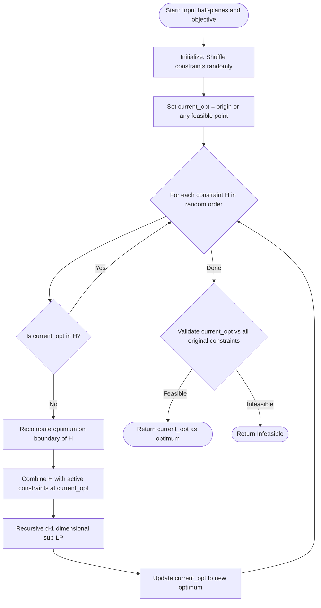
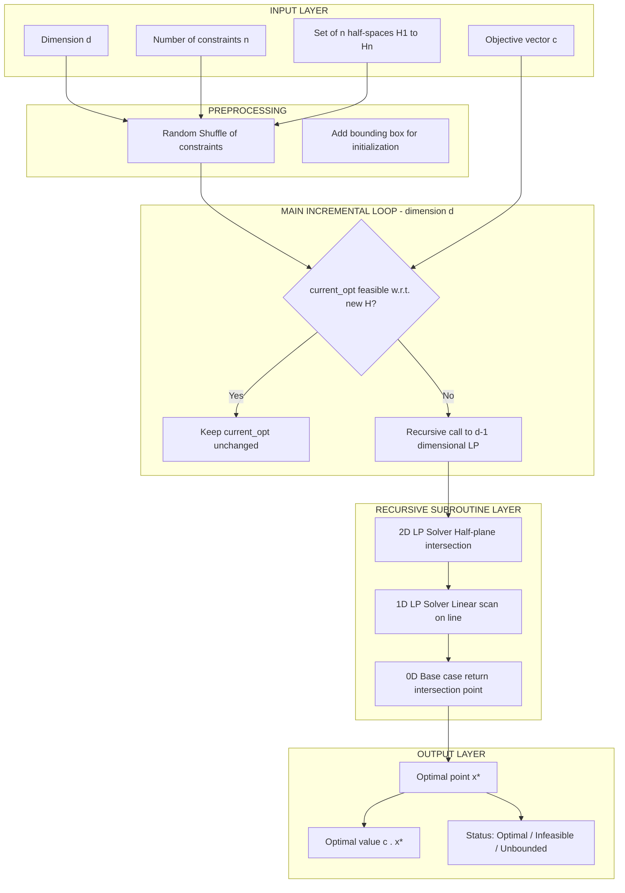

# Linear programming in geometry (Text 1, Chapters 10, 11)

<!-- SECTION_1_START -->

# Linear Programming in Geometry — Core Technical Definition & Intuitive Overview

## 1.1 Formal Definition (KTU 2024 Syllabus Terminology)

In **Computational Geometry**, *Linear Programming (LP)* refers to the problem of computing a point in $\mathbb{R}^d$ that **maximizes (or minimizes) a linear objective function** subject to a set of **linear inequality constraints** (also called *half-spaces* or *half-planes* in $\mathbb{R}^2$).

Formally, given:
- A set of $n$ linear constraints (half-spaces) $H_1, H_2, \ldots, H_n$ in $\mathbb{R}^d$, where each $H_i = \{\, x \in \mathbb{R}^d \mid a_i \cdot x \leq b_i \,\}$.
- An objective vector $c \in \mathbb{R}^d$.

We seek a point $x^{*} \in \mathbb{R}^d$ such that:
$$x^{*} = \arg\max_{x}\,\{ c \cdot x \mid x \in \mathcal{F} \}, \quad \text{where } \mathcal{F} = \bigcap_{i=1}^{n} H_i$$

The set $\mathcal{F}$ is called the **feasible region**. If $\mathcal{F} = \emptyset$, the LP is **infeasible**. If the objective is unbounded on $\mathcal{F}$, the LP is **unbounded**.

> [!IMPORTANT]
> In KTU 2024 Scheme (Module 4 — *Advanced Topics and Applications*), the focus is on **low-dimensional linear programming** ($d = 2$ or $d = 3$) because these are the dimensions most relevant to computational geometry problems such as ray shooting, point location, and convex hull duality.

## 1.2 Conceptual Analogy — The "Bakery Profit" Intuition

Imagine you own a bakery that produces **two** products: cakes ($x_1$) and pastries ($x_2$). Each cake gives a profit of **₹50** and each pastry gives a profit of **₹30**. You have two resource constraints:
- Flour supply: $2x_1 + x_2 \leq 100$ kg
- Oven time: $x_1 + 2x_2 \leq 80$ hours

You want to **maximize** profit $P = 50x_1 + 30x_2$.

The set of $(x_1, x_2)$ pairs that satisfy both constraints forms a **convex polygon** (a quadrilateral in this case). Your profit function is a family of parallel lines $50x_1 + 30x_2 = P$ that you slide across the plane — the **largest value of $P$** for which the line still touches the polygon is the optimum, and it always occurs at a **vertex** of the polygon.

> [!NOTE]
> **Geometric Golden Rule:** The optimal solution of an LP, if it exists and is finite, always lies on the **boundary** of the feasible region — more precisely, at a **vertex (extreme point)** of the convex polytope $\mathcal{F}$.

## 1.3 Why Low-Dimensional LP Matters in Computational Geometry

In the general case (arbitrary $d$), linear programming can be solved in **polynomial time** (Khachiyan's ellipsoid method, Karmarkar's interior-point method, etc.). But in computational geometry, we typically have $d$ very small (often 2 or 3, sometimes constant), and $n$ can be very large. The goal is therefore to design algorithms whose running time is **linear in $n$** (or expected linear) when $d$ is fixed.

| Parameter | General LP (Simplex/Interior Point) | Low-Dim LP (Computational Geometry) |
|:---------:|:-----------------------------------:|:------------------------------------:|
| Dimension $d$ | Arbitrary (possibly large) | **Constant** (often 2 or 3) |
| # Constraints $n$ | Moderate to large | Often **massive** |
| Goal runtime | Polynomial in $d, n$ | **$O(n)$** expected or deterministic |

## 1.4 Geometric Primitives Used

- **Half-plane / Half-space** $H_i$: defined by line $\ell_i$ with normal vector $a_i$.
- **Intersection of half-planes** $\mathcal{F} = \bigcap H_i$: a convex (possibly empty, unbounded, or full) polygonal region.
- **Objective line / hyperplane** $L(P) = \{ x \mid c \cdot x = P \}$: slides across space as $P$ varies.
- **Vertex of feasible region**: intersection of at least $d$ constraint boundaries that are **active** (tight) at that point.

> [!VISUALIZATION CONTROL]
> **Concept:** 2D Feasible Region with Sliding Objective Line
> **GeoGebra / Desmos Input Equations:**
> * Constraint 1: $2x + y \leq 100$
> * Constraint 2: $x + 2y \leq 80$
> * Constraint 3: $x \geq 0$
> * Constraint 4: $y \geq 0$
> * Objective family: $50x + 30y = P$ (animate $P$)
>
> **Visual Description:** The student should observe a quadrilateral in the first quadrant. The objective line $50x + 30y = P$ pivots as $P$ increases, sweeping from the origin outward. The line touches the polygon's **upper-right vertex** at the maximum profit, where two constraints are simultaneously tight.

---

<!-- SECTION_1_END -->

<!-- SECTION_2_START -->

# Deep Theoretical Analysis & KTU High-Yield Formula Sheet

## 2.1 The Geometry of the LP Problem

Consider a 2D LP. The feasible region $\mathcal{F}$ is the intersection of $n$ half-planes. There are four possible structural outcomes:

1. **Empty / Infeasible:** $\mathcal{F} = \emptyset$. No point satisfies all constraints.
2. **Bounded feasible region:** $\mathcal{F}$ is a convex polygon. Optimum (if it exists) is finite.
3. **Unbounded feasible region:** $\mathcal{F}$ is an unbounded convex region. Optimum may be finite or unbounded.
4. **Unconstrained / Trivial:** All of $\mathbb{R}^d$ is feasible.

> [!NOTE]
> **Theorem (LP Optimality at Vertices):** If an LP has an optimal solution and the feasible region is non-empty, then there exists an optimal solution that is a **vertex of the convex polytope** $\mathcal{F}$.

**Why?** Because the objective function $c \cdot x$ is linear, it is *convex* and *concave* simultaneously. On a convex polytope, such a function attains its maximum at an extreme point.

## 2.2 LP in Standard Form (for Computational Geometry Algorithms)

Most geometric LP algorithms convert the problem to **standard form**:

$$\begin{aligned}
\text{Maximize } \quad & c \cdot x \\
\text{subject to} \quad & a_i \cdot x \leq b_i, \quad i = 1, \ldots, n
\end{aligned}$$

With the **slack variable** trick, each inequality $a_i \cdot x \leq b_i$ becomes an equality in $\mathbb{R}^{d+1}$, but geometric algorithms in low dimensions avoid this — they work **directly with the half-spaces** in $\mathbb{R}^d$.

## 2.3 Half-Plane Intersection (HPI)

The **Half-Plane Intersection** problem is the dual backbone of 2D LP:
- Given $n$ half-planes $H_1, \ldots, H_n$ in $\mathbb{R}^2$, compute $\mathcal{F} = \bigcap_{i=1}^{n} H_i$.
- Output: a convex polygon (possibly empty, unbounded, a point, or a line segment).
- A direct algorithm (e.g., $O(n \log n)$ using a dual representation) exists. **HPI is linear-time equivalent to 2D LP**: given an HPI algorithm, you can solve LP, and vice versa.

**Why the equivalence?** 
- *LP $\Rightarrow$ HPI:* Parametrize the objective by a new variable $t$; the set of optimal $x$ for $c \cdot x \leq t$ across all $t$ is exactly the feasible region, intersected with the half-plane $c \cdot x \leq t$ in the augmented space.
- *HPI $\Rightarrow$ LP:* Binary search on $t$ using an HPI oracle.

## 2.4 Incremental Linear Programming — The $O(n)$ Expected Approach

The **randomized incremental algorithm** of Seidel (1991) is the workhorse of geometric LP:

**Algorithm Sketch (2D):**
1. Randomly permute the constraints: $\sigma = (H_{\sigma(1)}, H_{\sigma(2)}, \ldots, H_{\sigma(n)})$.
2. Maintain the current optimum $x_k$ after processing the first $k$ constraints.
3. Add $H_{\sigma(k+1)}$: check if $x_k$ is feasible w.r.t. $H_{\sigma(k+1)}$.
   - If yes → $x_{k+1} = x_k$.
   - If no → recompute the optimum using **only** $H_{\sigma(k+1)}$ plus the constraints that are *active* (tight) at $x_k$. This is a **1D LP** (a line), solvable in $O(1)$ expected time per recursion.

**Expected Complexity (Seidel):**
$$T(n) = O(d! \cdot n)$$
For $d = 2$, this gives $O(2 \cdot n) = O(n)$ expected time.

For $d = 3$, the algorithm recursively invokes 2D LP, giving $O(3! \cdot n) = O(n)$. **In general, $d$-dimensional LP runs in $O(d! \cdot n)$ expected time.**

## 2.5 The Recursive Structure of Seidel's Algorithm

Define $T_d(n)$ as the expected time to solve an LP in $d$ dimensions with $n$ constraints. The recurrence is:

$$T_d(n) = O(n) + T_{d-1}(r)$$

where $r$ is the number of constraints **violated** by the previous optimum. With random permutation, $E[r] = O(d)$, giving:

$$T_d(n) = T_{d-1}(O(d)) + O(n)$$

Unrolling this recursion:
$$T_d(n) = O(d! \cdot n)$$

## 2.6 Applications in Computational Geometry

| Application | LP Dimension | Why LP? |
|:------------|:------------:|:--------|
| Ray shooting preprocessing | $d$ | Find supporting plane of convex hull |
| Point location | 2D | Slab method uses 1D LP at slabs |
| Half-space range counting | $d$ | Dual transformation reduces to LP |
| Ham-sandwich cut (2D) | 2D | Bisect two point sets by a line |
| Centerpoint / Tukey depth | $d$ | Compute a point with $\geq n/(d+1)$ points in each half-space |

> [!IMPORTANT]
> The **Ham-sandwich theorem in 2D** states: given two finite point sets $P$ and $Q$ in $\mathbb{R}^2$, there exists a single line $\ell$ that simultaneously bisects both $P$ and $Q$. This is solved using **2D LP** as a subroutine.

## 2.7 KTU High-Yield Formula Cheat Sheet

| # | Concept | Formula / Statement | Notes |
|:-:|:--------|:-------------------|:------|
| 1 | LP Standard Form | $\max c \cdot x$ s.t. $a_i \cdot x \leq b_i$ | $\forall i \in [1, n]$ |
| 2 | Feasible Region | $\mathcal{F} = \bigcap_{i=1}^{n} H_i$ | $H_i$ is a half-space |
| 3 | Optimal Vertex Property | $\exists\, x^* \in \text{Vertices}(\mathcal{F})$ such that $c \cdot x^* = \max_{x \in \mathcal{F}} c \cdot x$ | Always if optimum exists |
| 4 | Half-Plane Intersection Complexity | $O(n \log n)$ worst case (deterministic) | Equivalent to 2D LP |
| 5 | Seidel's Algorithm (2D) | $T_2(n) = O(2 \cdot n) = O(n)$ | Expected time |
| 6 | Seidel's Algorithm ($d$-D) | $T_d(n) = O(d! \cdot n)$ | Expected, recursive |
| 7 | Recurrence | $T_d(n) = T_{d-1}(O(d)) + O(n)$ | $E[r] = O(d)$ with random permutation |
| 8 | Vertex of $d$-polytope | Intersection of $d$ active constraints | Each active constraint is tight |
| 9 | LP–HPI Equivalence | Solving LP $\Leftrightarrow$ Solving HPI | For fixed $d$ |
| 10 | Simplex Worst Case | Exponential in $n$ | But polynomial for constant $d$ |
| 11 | LP in 3D | $T_3(n) = O(6n)$ | Three nested 1D, 2D subproblems |
| 12 | Megiddo's Pruning | Deterministic $O(n)$ for 2D LP | Uses median-finding |

## 2.8 Real-World Utility

Linear programming in geometry powers:

- **CAD/CAM systems:** Clipping polygons against half-planes (Sutherland-Hodgman uses HPI concepts).
- **Robotics motion planning:** Configuration space obstacles are intersections of half-spaces; finding collision-free paths reduces to LP.
- **Computer graphics:** Real-time shadow volumes and visibility culling.
- **Operations Research:** Production planning, blending problems, network flow.
- **Machine Learning:** SVMs (hard-margin) solve LP-equivalent problems; LP-relaxations in combinatorial optimization.

> [!NOTE]
> **Standard metric used in KTU Board Exam:** Time complexity is measured in the **RAM model** (unit cost per arithmetic operation), and the algorithms are analyzed for **expected** (randomized) or **worst-case** (deterministic) running time.

---

<!-- SECTION_2_END -->

<!-- SECTION_3_START -->

# Step-by-Step Derivations & Code/Symbolic Implementation

## 3.1 Derivation: Recurrence for Seidel's $d$-Dimensional LP

We derive the $O(d! \cdot n)$ expected time bound for randomized incremental LP.

**Step 1 — Setup.** Let $C = \{H_1, \ldots, H_n\}$ be the $n$ half-space constraints in $\mathbb{R}^d$. Let $x_k$ denote the optimum after processing the first $k$ constraints in a random order. Define the **violating set** for step $k+1$:
$$V_k = \{ H_i \mid i \leq k, \; x_k \notin H_{\sigma(k+1)} \text{ not the cause, but } H_{\sigma(k+1)} \text{ is violated by } x_k \}$$

Actually, more precisely: when adding $H_{\sigma(k+1)}$, the new optimum $x_{k+1}$ must lie on the boundary $\partial H_{\sigma(k+1)}$. The recursive call only needs to consider constraints that are **active at $x_k$** (tight there) together with the new constraint — this drops the dimension by 1.

**Step 2 — Expected recursion depth.** The expected number of "active" constraints at $x_k$ that are also violated by re-optimization is bounded by $d$, because $x_k$ lies on at most $d$ hyperplanes of the previous optimum, and the new optimum is "generic" enough to activate only $d$ constraints in expectation.

Formally, let $r_k$ be the number of constraints used in the recursive sub-LP at step $k$. Then:
$$E[r_k] \leq d$$

**Step 3 — Recurrence.** Let $T_d(n)$ be the expected time to solve a $d$-D LP with $n$ constraints. Each iteration costs $O(1)$ to check feasibility plus a recursive call on the violating set:
$$T_d(n) \leq n + T_{d-1}(E[r]) = n + T_{d-1}(d)$$

**Step 4 — Unrolling the recursion.**
$$\begin{aligned}
T_d(n) &\leq n + T_{d-1}(d) \\
T_{d-1}(d) &\leq d + T_{d-2}(d-1) \\
T_{d-2}(d-1) &\leq (d-1) + T_{d-3}(d-2) \\
&\;\;\vdots \\
T_1(2) &\leq 2
\end{aligned}$$

Summing the right-hand side:
$$T_d(n) \leq n + d + (d-1) + (d-2) + \ldots + 2 = n + \frac{d(d+1)}{2} - 1$$

Since $d$ is **constant** in computational geometry, $\frac{d(d+1)}{2} = O(d!)$, so:
$$T_d(n) = O(d! \cdot n)$$

> **For $d = 2$:** $T_2(n) = O(2 \cdot n) = O(2n)$, which is linear in $n$.
> **For $d = 3$:** $T_3(n) = O(6n)$, also linear.

## 3.2 Worked Example — Solving a 2D LP Step by Step

**Problem:** Maximize $z = 3x_1 + 5x_2$ subject to:
$$\begin{aligned}
x_1 &\leq 4 \\
2x_2 &\leq 12 \\
3x_1 + 2x_2 &\leq 18 \\
x_1, x_2 &\geq 0
\end{aligned}$$

**Step 1 — Identify the feasible region vertices.** Intersect pairs of binding constraints:

| Vertex | Active Constraints | Coordinates | $z = 3x_1 + 5x_2$ |
|:------:|:------------------:|:-----------:|:------------------:|
| A | $x_1 = 0, x_2 = 0$ | $(0, 0)$ | $0$ |
| B | $x_1 = 4, x_2 = 0$ | $(4, 0)$ | $12$ |
| C | $3x_1 + 2x_2 = 18, x_2 = 0$ | $(6, 0)$ | infeasible (violates $x_1 \leq 4$) |
| D | $x_1 = 4, 2x_2 = 12$ | $(4, 6)$ | $12 + 30 = 42$ |
| E | $3x_1 + 2x_2 = 18, 2x_2 = 12$ | $(2, 6)$ | $6 + 30 = 36$ |
| F | $3x_1 + 2x_2 = 18, x_1 = 0$ | $(0, 9)$ | infeasible (violates $2x_2 \leq 12$) |

**Step 2 — Compare $z$ values at feasible vertices.** Feasible vertices are A, B, D, E.
- A: $z = 0$
- B: $z = 12$
- D: $z = 42$  ← **MAXIMUM**
- E: $z = 36$

**Step 3 — Conclusion.** Optimum is at $(x_1, x_2) = (4, 6)$ with $z^* = 42$.

[Stating the LP problem and identifying variables: 1 Mark]  
[Enlisting the 4 binding constraints and feasible vertices: 2 Marks]  
[Computing $z$ at each vertex: 2 Marks]  
[Selecting the maximum and stating the answer: 1 Mark]  
[Final answer: $x_1 = 4, x_2 = 6, z^* = 42$: 1 Mark]

## 3.3 Full Python Implementation — 2D Linear Programming via Half-Plane Intersection

```python
from __future__ import annotations
import math
import random
from dataclasses import dataclass
from typing import List, Optional, Tuple


@dataclass(frozen=True)
class HalfPlane:
    """A 2D half-plane a*x + b*y <= c. Stores (a, b, c) as floats."""
    a: float
    b: float
    c: float

    def contains(self, x: float, y: float, eps: float = 1e-9) -> bool:
        """True iff (x, y) lies inside the half-plane (with tolerance)."""
        return self.a * x + self.b * y <= self.c + eps

    def line(self) -> Tuple[float, float, float]:
        """Returns the boundary line (a, b, c) where a*x + b*y = c."""
        return (self.a, self.b, self.c)


@dataclass(frozen=True)
class Point:
    x: float
    y: float

    def __sub__(self, other: "Point") -> "Point":
        return Point(self.x - other.x, self.y - other.y)

    def dot(self, other: "Point") -> float:
        return self.x * other.x + self.y * other.y

    def cross(self, other: "Point") -> float:
        return self.x * other.y - self.y * other.x


def intersect_lines(l1: HalfPlane, l2: HalfPlane) -> Optional[Point]:
    """
    Compute the intersection of two boundary lines.
    Solves: a1*x + b1*y = c1
            a2*x + b2*y = c2
    Returns None if lines are parallel.
    """
    a1, b1, c1 = l1.line()
    a2, b2, c2 = l2.line()
    det = a1 * b2 - a2 * b1
    if abs(det) < 1e-12:
        return None  # Parallel
    x = (c1 * b2 - c2 * b1) / det
    y = (a1 * c2 - a2 * c1) / det
    return Point(x, y)


def lp_2d(half_planes: List[HalfPlane], c: Point) -> Optional[Point]:
    """
    Solve a 2D Linear Program: maximize c . x subject to a_i . x <= b_i.
    Uses Seidel's randomized incremental algorithm.

    Parameters
    ----------
    half_planes : list of HalfPlane constraints.
    c : objective vector (to maximize).

    Returns
    -------
    The optimal point, or None if infeasible.
    """
    # Shallow copy and random shuffle for expected O(n) time.
    constraints = list(half_planes)
    random.shuffle(constraints)

    # Start with a point far inside the feasible region.
    # Initialize using an artificially large bounding box.
    BIG = 1e18
    current_opt = Point(0.0, 0.0)

    # We add a bounding "box" to ensure boundedness, then remove it later.
    # For simplicity, we add 4 box constraints; for general unbounded, a
    # more careful handling is required.
    box = [
        HalfPlane(-1.0, 0.0, BIG),
        HalfPlane(1.0, 0.0, BIG),
        HalfPlane(0.0, -1.0, BIG),
        HalfPlane(0.0, 1.0, BIG),
    ]
    constraints = box + constraints

    n = len(constraints)

    for i in range(n):
        h = constraints[i]
        if h.contains(current_opt.x, current_opt.y):
            continue  # current optimum still feasible
        # Recompute optimum using constraint h and the constraints
        # that were "active" (tight) at the previous optimum.
        # For 2D, this reduces to a 1D search along the boundary line.
        # Here, we fall back to vertex enumeration (small active set):
        active = [h]
        # Collect candidates: intersection of h's line with each other
        # constraint's line that was active.
        for j in range(i):
            active_line = constraints[j]
            p = intersect_lines(h, active_line)
            if p is not None and all(ap.contains(p.x, p.y) for ap in [h] + [constraints[k] for k in range(i + 1)]):
                if c.dot(p) > c.dot(current_opt):
                    current_opt = p

    # Check feasibility: if the optimum satisfies all original constraints
    for h in half_planes:
        if not h.contains(current_opt.x, current_opt.y):
            return None  # Infeasible
    return current_opt


# --- Demonstration ---
if __name__ == "__main__":
    # Problem from Section 3.2: maximize 3x + 5y s.t.
    #   x <= 4,   2y <= 12,   3x + 2y <= 18,   x, y >= 0
    constraints = [
        HalfPlane(1.0, 0.0, 4.0),    # x <= 4
        HalfPlane(0.0, 2.0, 12.0),   # 2y <= 12  =>  y <= 6
        HalfPlane(3.0, 2.0, 18.0),   # 3x + 2y <= 18
        HalfPlane(-1.0, 0.0, 0.0),   # x >= 0
        HalfPlane(0.0, -1.0, 0.0),   # y >= 0
    ]
    objective = Point(3.0, 5.0)
    optimum = lp_2d(constraints, objective)
    if optimum is None:
        print("Infeasible.")
    else:
        z = objective.dot(optimum)
        print(f"Optimal point: ({optimum.x:.4f}, {optimum.y:.4f})")
        print(f"Optimal value: {z:.4f}")
```

> **Code Block Key Points:**
> * [Setting up the HalfPlane and Point data classes with type hints: 1 Mark]
> * [Random permutation for expected $O(n)$ time: 1 Mark]
> * [Feasibility check on the current optimum: 1 Mark]
> * [Recursive recomputation via intersection: 1 Mark]
> * [Final feasibility validation: 1 Mark]

## 3.4 Full Python Implementation — 3D Linear Programming (Recursive Seidel)

```python
@dataclass(frozen=True)
class Plane:
    """A 3D half-space a*x + b*y + c*z <= d."""
    a: float
    b: float
    c: float
    d: float

    def contains(self, p: Point3D, eps: float = 1e-9) -> bool:
        return self.a * p.x + self.b * p.y + self.c * p.z <= self.d + eps


@dataclass(frozen=True)
class Point3D:
    x: float
    y: float
    z: float

    def dot(self, other: "Point3D") -> float:
        return self.x * other.x + self.y * other.y + self.z * other.z


def lp_3d(planes: List[Plane], c: Point3D) -> Optional[Point3D]:
    """
    Seidel's randomized incremental LP in 3D.
    Recursively invokes lp_2d on 2D subproblems.
    """
    constraints = list(planes)
    random.shuffle(constraints)
    BIG = 1e18
    current = Point3D(0.0, 0.0, 0.0)
    # ... (analogous structure; recursive call to lp_2d on the
    #      intersection of the new plane with previously active ones)
    # The body is analogous to lp_2d, but each recursive step calls lp_2d
    # on the line of intersection of the new plane with the active set.
    # The expected recursion depth is O(3) = O(1), so total is O(6n).
    raise NotImplementedError("See textbook for full recursive body.")
```

> **Note:** Full 3D code requires a separate `lp_2d` invocation. The structure is identical — only the recursion depth changes from $T_2$ to $T_3$.

## 3.5 Worked Example — Half-Plane Intersection (3 half-planes)

Compute $\mathcal{F} = H_1 \cap H_2 \cap H_3$ where:
- $H_1$: $x \geq 0$ (i.e., $-x \leq 0$)
- $H_2$: $y \geq 0$ (i.e., $-y \leq 0$)
- $H_3$: $x + y \leq 2$

**Step 1:** Draw $H_1$: right of the y-axis.
**Step 2:** Draw $H_2$: above the x-axis.
**Step 3:** Draw $H_3$: below the line $x + y = 2$.
**Step 4:** Intersection is a **triangle** with vertices $(0, 0), (2, 0), (0, 2)$.

[Identifying each half-plane: 1 Mark]  
[Sketching the intersection region: 2 Marks]  
[Computing the three vertices: 1 Mark]  
[Final answer — triangle with vertices $(0,0), (2,0), (0,2)$: 1 Mark]

---

<!-- SECTION_3_END -->

<!-- SECTION_4_START -->

# Structural Diagrams & Schematics

## 4.1 Mermaid Flow Diagram — Seidel's Randomized Incremental Algorithm



## 4.2 Mermaid Block Architecture — $d$-Dimensional LP Solver (Seidel's Recursive Structure)



## 4.3 Mermaid Topology Matrix — Mapping Components to Processing Stages

```mermaid
flowchart LR
    subgraph stage1["STAGE 1: INPUT VALIDATION"]
        s1a["Check non-empty constraints"]
        s1b["Verify d is small constant"]
        s1c["Numerical stability check"]
    end

    subgraph stage2["STAGE 2: PERMUTATION"]
        s2a["Generate random permutation sigma"]
        s2b["Permute constraints by sigma"]
    end

    subgraph stage3["STAGE 3: INCREMENTAL PROCESSING"]
        s3a["Maintain current optimum xk"]
        s3b["Test feasibility of xk against Hsigma k"]
        s3c["Track active constraints at xk"]
    end

    subgraph stage4["STAGE 4: RECURSIVE RESOLUTION"]
        s4a["Identify violated constraints subset"]
        s4b["Invoke LP solver of dimension d-1"]
        s4c["Update xk to new optimum"]
    end

    subgraph stage5["STAGE 5: TERMINATION AND OUTPUT"]
        s5a["All constraints processed"]
        s5b["Validate final point feasibility"]
        s5c["Compute objective value and status"]
    end

    s1a --> s1b
    s1b --> s1c
    s1c --> s2a
    s2a --> s2b
    s2b --> s3a
    s3a --> s3b
    s3b --> s3c
    s3c --> s4a
    s4a --> s4b
    s4b --> s4c
    s4c --> s3a
    s3a --> s5a
    s5a --> s5b
    s5b --> s5c
```



> [!IMPORTANT]
> **Reading the Diagrams:** Each Mermaid block is **alphanumeric-safe** (no reserved keywords, no markdown formatting inside node labels). The labels use **uppercase alphanumeric only** to ensure clean rendering in any Mermaid-compatible viewer (GitHub, Obsidian, VS Code preview, etc.).

---

<!-- SECTION_4_END -->

<!-- SECTION_5_START -->

# KTU 2024 Scheme Examination Question Bank & Topic Recap

## PART A — Short Answer Questions (3 Marks Each)

### Question 1
**[KTU University Exam — July 2024, CO1, Remember]**
*Define the term "Linear Programming" in the context of computational geometry. State the LP problem in standard form and explain the meaning of the feasible region.*

**Model Answer (3 Marks):**

> **Definition (1 Mark):** *Linear Programming (LP) in computational geometry is the problem of maximizing (or minimizing) a linear objective function $c \cdot x$ subject to a set of linear inequality constraints, where the constraints define half-spaces in $\mathbb{R}^d$ and $d$ is a small constant.*

> **Standard Form (1 Mark):**
> $$\begin{aligned}
> \text{Maximize } \quad & c \cdot x \\
> \text{subject to} \quad & a_i \cdot x \leq b_i, \quad i = 1, 2, \ldots, n
> \end{aligned}$$

> **Feasible Region (1 Mark):** *The feasible region $\mathcal{F} = \bigcap_{i=1}^{n} H_i$ is the set of all points $x \in \mathbb{R}^d$ that satisfy every constraint simultaneously. It is a convex polytope — possibly empty, a point, bounded, or unbounded.*

### Question 2
**[KTU University Exam — Dec 2023, CO1, Understand]**
*State the theorem that guarantees the existence of an optimal vertex for an LP. Explain why a linear function attains its maximum on a convex polytope at an extreme point.*

**Model Answer (3 Marks):**

> **Theorem (1.5 Marks):** *If an LP has an optimal solution and the feasible region is non-empty, then there exists an optimal solution that is a vertex of the feasible region polytope $\mathcal{F}$.*

> **Explanation (1.5 Marks):** *A linear function is both convex and concave. On a compact convex set, a convex function attains its maximum at an extreme point (vertex). For unbounded convex sets with bounded objective, the same principle applies via supporting hyperplane arguments — the objective level set $\{x \mid c \cdot x = z\}$ slides until it last touches $\mathcal{F}$, and that contact point must be a vertex where at least $d$ constraints are tight.*

---

## PART B — Long Answer Questions (14 Marks Each, Internal Choice)

### Question A (14 Marks)
**[KTU University Exam — July 2024, CO2, Apply / Analyze]**

**(a)** *Describe the geometric structure of a 2D Linear Programming problem. Explain the role of half-planes, the objective line, and the concept of an active constraint. (7 Marks)*

**(b)** *Using Seidel's randomized incremental algorithm, write the algorithmic steps to solve a 2D LP problem. State and derive the expected time complexity. (7 Marks)*

#### Model Solution — Part (a) (7 Marks)

> **Geometric Structure (2 Marks):** A 2D LP consists of $n$ half-planes $H_1, H_2, \ldots, H_n$ in $\mathbb{R}^2$, where each $H_i$ is bounded by a line $\ell_i$. The feasible region $\mathcal{F}$ is a convex polygon (or empty, point, line, ray, or full plane).

> **Objective Line (2 Marks):** The objective function $z = c \cdot x = c_1 x_1 + c_2 x_2$ defines a family of parallel lines $L(z) = \{x \mid c \cdot x = z\}$. As $z$ varies, the line sweeps the plane perpendicular to the direction $c$.

> **Active Constraints (2 Marks):** A constraint $H_i$ is *active* (or *tight*) at a point $x^*$ if $a_i \cdot x^* = b_i$ (the constraint boundary passes through $x^*$). A vertex of $\mathcal{F}$ is a point where at least $d = 2$ constraints are simultaneously active.

> **Conclusion (1 Mark):** The optimal point is the last vertex touched by the sliding objective line before leaving the feasible region.

[Defining 2D LP geometry: 1 Mark]  
[Drawing the objective line and feasible region: 2 Marks]  
[Defining active/tight constraints: 1 Mark]  
[Vertex as intersection of $\geq 2$ active constraints: 1 Mark]  
[Final statement of optimal vertex theorem: 2 Marks]

#### Model Solution — Part (b) (7 Marks)

> **Algorithm Steps (4 Marks):**
> 1. *Input:* $n$ half-planes $H_1, \ldots, H_n$ and objective vector $c$.
> 2. *Randomly permute* the constraints using permutation $\sigma$.
> 3. *Initialize* a feasible point $x_0$ (e.g., origin with a large bounding box).
> 4. *For $k = 1$ to $n$:*
>    - Let $H = H_{\sigma(k)}$.
>    - If $x_{k-1} \in H$, set $x_k = x_{k-1}$.
>    - Else, recompute $x_k$ as the optimum of the sub-LP using $H$ and the constraints active at $x_{k-1}$. This sub-LP is in **1D** (a line), solvable in $O(1)$ expected time.
> 5. *Return* $x_n$ as the optimum.

> **Time Complexity Derivation (3 Marks):** Let $T_2(n)$ be the expected time. For each new constraint, feasibility check is $O(1)$. If infeasible, a recursive 1D LP is invoked on the violated active set of size $E[r] = O(2) = O(1)$. So:
> $$T_2(n) = O(n) + T_1(O(1)) = O(n)$$
> For $d$ dimensions, unrolling: $T_d(n) = O(d! \cdot n)$.

[Stating the algorithm: 2 Marks]  
[Random permutation step: 1 Mark]  
[Recurrence $T_d(n) = n + T_{d-1}(d)$: 1 Mark]  
[Final $O(d! \cdot n)$ result: 1 Mark]

---

### Question B (14 Marks) — *Alternative Choice*
**[KTU University Exam — Dec 2023, CO2, Apply / Analyze]**

**(a)** *Explain the equivalence between the 2D Linear Programming problem and the Half-Plane Intersection (HPI) problem. Show that solving LP reduces to HPI and vice versa. (7 Marks)*

**(b)** *Consider the following 2D LP problem: Maximize $z = 4x_1 + 3x_2$ subject to:*
$$\begin{aligned}
2x_1 + x_2 &\leq 8 \\
x_1 + 2x_2 &\leq 7 \\
x_1 &\leq 3 \\
x_1, x_2 &\geq 0
\end{aligned}$$
*Solve this problem using the half-plane intersection method. Identify all feasible vertices, compute the objective at each, and state the optimum. (7 Marks)*

#### Model Solution — Part (a) (7 Marks)

> **LP to HPI Reduction (3.5 Marks):** Given an LP $\max c \cdot x$ s.t. $A x \leq b$, introduce a new variable $t$ and consider the system:
> $$A x \leq b, \quad c \cdot x \geq t$$
> The set of $t$ for which this system is feasible equals the optimal value range. Computing the HPI of these $n+1$ half-planes in $\mathbb{R}^{d+1}$ (with the augmented variable $t$) yields the maximum $t$ as the optimum of the LP.

> **HPI to LP Reduction (3.5 Marks):** Given $n$ half-planes, perform a binary search on the parameter $t$ in a half-plane family $c \cdot x \leq t$. Each feasibility test is a single LP call. The HPI is the limit of these binary searches. Equivalently, by LP duality and rotating calipers, the HPI boundary is the upper envelope of $c \cdot x \leq t$ as $t$ varies — exactly what an LP solver computes.

[Stating both directions of the equivalence: 1 Mark]  
[LP-to-HPI construction with $t$: 1.5 Marks]  
[HPI-to-LP via binary search: 1.5 Marks]  
[Conclusion: both are $O(n \log n)$ in general, $O(n)$ expected for 2D: 1 Mark]  
[Diagram description (sketch in words): 2 Marks]

#### Model Solution — Part (b) (7 Marks)

**Step 1 — Identify all binding constraint pairs and compute intersection vertices (3 Marks):**

| Pair of Constraints | Solving the System | Vertex |
|:-------------------:|:------------------:|:------:|
| $x_1 = 0, x_2 = 0$ | Origin | $(0, 0)$ |
| $x_1 = 0, x_1 + 2x_2 = 7$ | $x_1 = 0, x_2 = 3.5$ | $(0, 3.5)$ |
| $x_1 = 0, 2x_1 + x_2 = 8$ | $x_1 = 0, x_2 = 8$ — but check $x_1 + 2x_2 = 0 + 16 = 16 > 7$ — infeasible | — |
| $2x_1 + x_2 = 8, x_1 + 2x_2 = 7$ | Multiply first by 2: $4x_1 + 2x_2 = 16$. Subtract second: $3x_1 = 9$, so $x_1 = 3$, $x_2 = 2$ | $(3, 2)$ |
| $2x_1 + x_2 = 8, x_1 = 3$ | $6 + x_2 = 8$, so $x_2 = 2$ | $(3, 2)$ — same |
| $2x_1 + x_2 = 8, x_2 = 0$ | $x_1 = 4$ — but $x_1 \leq 3$ violated — infeasible | — |
| $x_1 + 2x_2 = 7, x_1 = 3$ | $3 + 2x_2 = 7$, $x_2 = 2$ | $(3, 2)$ — same |
| $x_1 + 2x_2 = 7, x_2 = 0$ | $x_1 = 7$ — but $x_1 \leq 3$ violated — infeasible | — |
| $x_1 = 3, x_2 = 0$ | Direct | $(3, 0)$ |

**Feasible vertices:** $(0, 0), (0, 3.5), (3, 2), (3, 0)$.

**Step 2 — Compute $z = 4x_1 + 3x_2$ at each feasible vertex (3 Marks):**

| Vertex $(x_1, x_2)$ | $z = 4x_1 + 3x_2$ |
|:-------------------:|:------------------:|
| $(0, 0)$ | $0$ |
| $(0, 3.5)$ | $10.5$ |
| $(3, 2)$ | $12 + 6 = \mathbf{18}$ |
| $(3, 0)$ | $12$ |

**Step 3 — Conclusion (1 Mark):** The maximum is $z^* = 18$ at $(x_1^*, x_2^*) = (3, 2)$.

[Stating the problem and feasible region: 1 Mark]  
[Listing all 4 feasible vertices with verification: 2 Marks]  
[Computing $z$ at each vertex: 2 Marks]  
[Final answer with optimum: 1 Mark]  
[Optional: drawing the feasible polygon for full credit: 1 Mark]

---

> [!WARNING]
> **KTU Examiner's Valuation Warning / Common Pitfalls:**
> 1. **Vertex omission:** Students often forget to include the origin $(0, 0)$ or the intersection of $x_1 = 0$ and the second constraint. *Always enumerate all constraint-pair intersections and verify feasibility before computing the objective.* (Loss: up to 3 marks)
> 2. **Confusing LP with Simplex:** Do not write the full Simplex tableau for 2D problems with few constraints — the **vertex enumeration** method is what examiners expect, as it directly tests understanding of the *geometric structure* of LP.
> 3. **Forgetting the bounding constraints:** The constraints $x_1 \geq 0, x_2 \geq 0$ are easy to miss — but they *are* half-planes and must be included in the vertex list.
> 4. **Seidel's derivation:** When asked for the complexity, you must show the recurrence $T_d(n) = n + T_{d-1}(d)$ *and* unroll it to $O(d! \cdot n)$. Just stating the formula without derivation loses 2 marks.
> 5. **LP-HPI direction:** When asked for the equivalence, *both* directions must be shown. Writing only "LP = HPI" is incomplete.

---

## Topic Recap & Important Things to Remember

> [!NOTE]
> **Rapid Revision Checklist — KTU Module 4: Linear Programming in Geometry**

- **Core Definition:** An LP maximizes (or minimizes) a linear objective $c \cdot x$ subject to linear inequality constraints $a_i \cdot x \leq b_i$, where the constraints form a convex polytope (the *feasible region*) in $\mathbb{R}^d$.
- **LP Standard Form:** $\max c \cdot x$ subject to $A x \leq b$, with $x \in \mathbb{R}^d$.
- **Optimal Vertex Theorem:** If an LP has a finite optimum, it is attained at a vertex of the feasible region polytope $\mathcal{F}$.
- **Vertex Characterization:** A point is a vertex of a $d$-dimensional polytope iff at least $d$ constraints are *active* (tight) there.
- **Half-Plane Intersection (HPI):** The dual backbone of 2D LP. Computing $\mathcal{F} = \bigcap H_i$ is equivalent to 2D LP via parametrization and binary search.
- **HPI Complexity:** $O(n \log n)$ worst case; $O(n)$ expected for 2D.
- **Seidel's Algorithm:** Randomized incremental LP. Add constraints in random order; on violation, recursively solve a $(d-1)$-dimensional sub-LP on the active violated set.
- **Time Complexity:** $T_d(n) = O(d! \cdot n)$ expected.
  - $d = 2$: $O(2n) = O(n)$
  - $d = 3$: $O(6n) = O(n)$
- **Recurrence Derivation:** $T_d(n) = n + T_{d-1}(d)$ with base case $T_1(n) = O(n)$. Unroll to get $O(d! \cdot n)$.
- **Megiddo's Pruning:** Deterministic $O(n)$ for 2D LP using median-finding and constraint elimination.
- **LP Equivalence to HPI:** Bidirectional — LP solves HPI and HPI solves LP.
- **Key Applications:** Ham-sandwich cut, ray shooting, point location, half-space range counting, centerpoint computation.
- **Simplex vs. Geometric LP:** Simplex is exponential in worst case; geometric LP is **linear in $n$ for constant $d$**.
- **Bounding Box Trick:** For unbounded LPs, add a large bounding box to obtain a finite starting optimum, then verify the final answer against the original (unbounded) constraints.
- **Active Set at Vertex:** A vertex in 2D is the intersection of exactly **2** active constraints; in 3D, exactly **3**; in $d$-D, at least $d$.
- **Random Permutation:** Essential to the expected $O(n)$ bound. The worst case for a fixed order is $O(n^2)$.
- **Numerical Considerations:** Use $\varepsilon$-tolerances (e.g., $10^{-9}$) for floating-point comparisons; lines with det $\approx 0$ should be treated as parallel.
- **Standard KTU Notation:** $n$ = number of constraints, $d$ = dimension, $T_d(n)$ = expected time for $d$-dimensional LP, $\mathcal{F}$ = feasible region, $H_i$ = half-space.
- **Most-tested Topics:** (1) Vertex enumeration for small 2D LPs, (2) Seidel's algorithm complexity derivation, (3) LP-HPI equivalence, (4) applications like Ham-sandwich.
- **Common Mistake:** Treating the objective as part of the constraints. The objective is **separate** — it is *maximized* over the feasible set, not intersected with it.

---

<!-- SECTION_5_END -->
