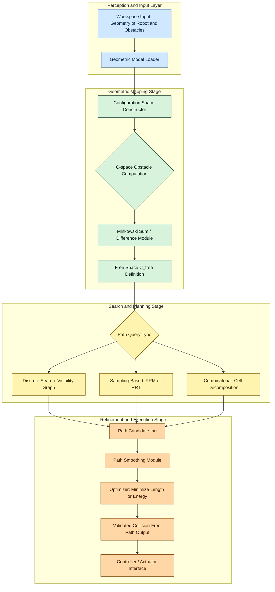
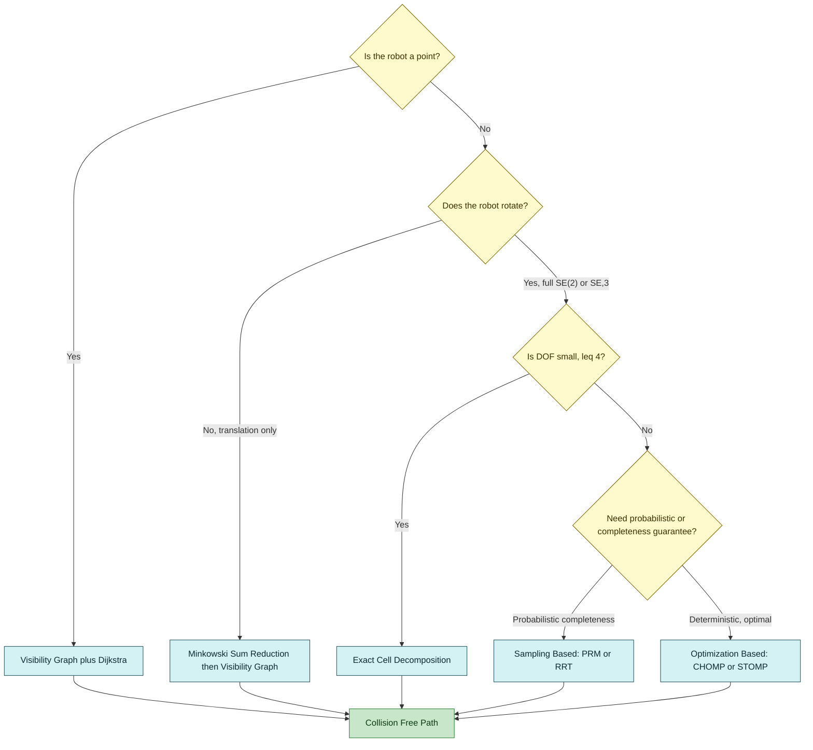

# Motion Planning and Geometric Optimization  - Problem definition and applications

<!-- SECTION_1_START -->
# Motion Planning and Geometric Optimization — Problem Definition & Applications

## 1.1 Formal Academic Definition (KTU 2024 Syllabus Terminology)

> [!IMPORTANT]
> **Motion Planning** (also called the **Piano Mover's Problem**) is the computational problem of finding a continuous, collision-free motion for a system of moving objects (rigid or articulated bodies) from an initial configuration to a goal configuration, while satisfying kinematic, dynamic, and geometric constraints imposed by obstacles in the workspace.

Mathematically, given:
- A **robot** $\mathcal{R}$ (rigid body or articulated linkage)
- A **workspace** $\mathcal{W} = \mathbb{R}^{2}$ or $\mathbb{R}^{3}$
- A set of **obstacles** $\mathcal{O}_i \subset \mathcal{W}$
- An **initial configuration** $q_{start}$
- A **goal configuration** $q_{goal}$

Find a continuous path $\tau: [0,1] \rightarrow \mathcal{C}_{free}$ such that $\tau(0) = q_{start}$ and $\tau(1) = q_{goal}$.

> [!NOTE]
> **Geometric Optimization** is the branch of computational geometry that seeks to find the optimal geometric configuration, shape, position, or arrangement of objects that minimizes (or maximizes) a measurable objective function (length, area, volume, energy, cost) subject to geometric, topological, or algebraic constraints.

## 1.2 Conceptual Analogy — The Furniture Mover's Intuition

Imagine you are moving into a new apartment. You must carry a large sofa (the **robot**) through a hallway, around a corner, and into the living room without scratching the walls or hitting the staircase. The sofa is rigid, the walls are fixed obstacles, and the doorways are narrow passages.

- The **workspace** $\mathcal{W}$ is the floor plan of the apartment (a 2D map).
- The **configuration** $q = (x, y, \theta)$ captures *where* the sofa is positioned and *how* it is rotated.
- The set of all possible $(x, y, \theta)$ values the sofa can attain without intersecting any wall is called the **free configuration space** $\mathcal{C}_{free}$.
- Your task is to find a **continuous curve** through this free space from the entry door to the living room corner.

> [!TIP]
> Think of motion planning as **pathfinding on a higher-dimensional map**. While a GPS finds a path on a 2D road network, motion planning finds a path in $n$-dimensional configuration space where $n$ is the number of degrees of freedom (DOF) of the moving object.

## 1.3 Key Physical / Mathematical Constants & Standard Metrics

- **Degrees of Freedom (DOF)** for a planar rigid body: $3$ (two translations + one rotation). Bolded as **3-DOF**.
- **Configuration Space Dimension** for a free-flying rigid body in 3D: **6-DOF** (three translations + three rotations).
- **Generalized Coordinates** $q \in \mathcal{C}$ where $\mathcal{C} \subseteq \mathbb{R}^{n}$.
- **Hausdorff distance** is commonly used to measure the clearance between a robot and obstacles.
- **Euclidean metric** $\|q - q'\|$ is the standard cost function for path length.

## 1.4 Visualization & Geometric Intuition

> [!VISUALIZATION CONTROL]
> **Concept:** Configuration Space (C-Space) obstacle mapping for a translating planar robot
> **GeoGebra / Desmos Input Equations:**
> * Workspace obstacle: $O_1: (x-3)^{2} + (y-2)^{2} = 1$ (circle of radius 1 at $(3,2)$)
> * Robot (a point): $R$ at $(x_r, y_r)$
> * C-Space obstacle (Minkowski difference): $CO_1: (x_r-3)^{2} + (y_r-2)^{2} = 1$ (identical to $O_1$ for a point robot)
> * C-Space obstacle (for a disk robot of radius $r$): $CO_1: (x_r-3)^{2} + (y_r-2)^{2} = (1+r)^{2}$
> **Visual Description:** On a 2D coordinate plane, the student should see a circular workspace obstacle. The C-space obstacle is a "grown" version of the workspace obstacle by the robot's radius (Minkowski sum effect). The free space is the complement of this grown obstacle.

## 1.5 Subsection: Why This Topic Matters in KTU 2024

Module 4 of **PECST418 (Computational Geometry)** is the capstone module, and motion planning is its flagship application. It connects geometry (configuration spaces), graph theory (roadmaps), and algorithms (search, sampling) — making it a natural integrative exam topic.

<!-- SECTION_1_END -->

<!-- SECTION_2_START -->
# Deep Theoretical Analysis & KTU High-Yield Formula Sheet

## 2.1 The Motion Planning Problem — Formal Decomposition

The general motion planning problem $\Pi_{MP}$ is decomposed into the following six sub-problems:

1. **Geometric Model Selection** — Decide how the robot $\mathcal{R}$ and obstacles $\mathcal{O}_i$ are represented (polygonal, polyhedral, semi-algebraic, point cloud).
2. **Configuration Space Construction** — Compute $\mathcal{C}_{obs} = \{q \in \mathcal{C} \mid \mathcal{R}(q) \cap \mathcal{O} \neq \emptyset\}$ and $\mathcal{C}_{free} = \mathcal{C} \setminus \mathcal{C}_{obs}$.
3. **Path Existence Query** — Decide whether $q_{start}$ and $q_{goal}$ lie in the same connected component of $\mathcal{C}_{free}$.
4. **Path Computation** — Construct a continuous, collision-free path $\tau$ if one exists.
5. **Path Optimization** — Refine $\tau$ to minimize a quality metric (length, smoothness, energy).
6. **Dynamic Constraint Enforcement** — Account for velocity, acceleration, torque, and kinematic closure constraints (e.g., loop closures in parallel manipulators).

> [!IMPORTANT]
> The complexity of $\Pi_{MP}$ is **PSPACE-hard** for general robots with many DOF. For a polygonal robot with $n$ vertices among polygonal obstacles with a total of $m$ vertices, exact solutions run in $O(n^{2} m^{2})$ time using combinatorial roadmaps.

## 2.2 Taxonomy of Motion Planning Problems

| Problem Class | Robot Type | Obstacle Type | Algorithm Class | Complexity Class |
|---|---|---|---|---|
| **Point Robot** | Point mass | Polygonal | Visibility graph, BFS | Polynomial |
| **Translating Polygonal Robot** | Convex polygon | Polygonal | Minkowski sum + visibility | $O(n^2 m^2)$ |
| **Translating + Rotating Robot** | Polygon with orientation | Polygonal | C-obstacle cell decomposition | Exponential in worst case |
| **Articulated Robot** | Open chain linkage | Polygonal | Configuration roadmap | PSPACE-hard |
| **Dynamic / Kinodynamic** | With velocity constraints | Moving | State-time space search | Undecidable in general |
| **Sampling-Based** | High-DOF any | Any | PRM, RRT | Probabilistically complete |

## 2.3 Configuration Space — The Central Abstraction

The **configuration space** $\mathcal{C}$ is the manifold of all possible placements of the robot. For an articulated chain with $n$ revolute joints, $\mathcal{C} = \mathbb{S}^{1} \times \mathbb{S}^{1} \times \dots \times \mathbb{S}^{1}$ (an $n$-torus).

The **C-space obstacle** is computed via the Minkowski difference:

$$\mathcal{C}_{obs} = \{q \in \mathcal{C} \mid \mathcal{R}(q) \oplus (-\mathcal{O}) \neq \emptyset\}$$

where $\oplus$ denotes the **Minkowski sum** and $-\mathcal{O}$ is the obstacle reflected about the origin.

> [!TIP]
> The Minkowski sum "grows" the obstacle by the shape of the robot. Equivalently, it shrinks the robot to a point. This is the geometric trick that reduces a moving-body problem to a moving-point problem in $\mathcal{C}$.

## 2.4 KTU High-Yield Formula Sheet

| Concept | Formula / Definition | Units / Notes |
|---|---|---|
| Configuration | $q = (x, y, \theta)$ for planar rigid body | radians for $\theta$ |
| DOF (planar rigid) | $3$ | **2 translations + 1 rotation** |
| DOF (3D rigid) | $6$ | **3 translations + 3 rotations (Euler / quaternion)** |
| DOF (open chain) | $n$ revolute joints → $n$-DOF | $\mathcal{C} = \mathbb{T}^{n}$ |
| Minkowski Sum | $A \oplus B = \{a + b \mid a \in A, b \in B\}$ | Used to grow obstacles |
| Minkowski Difference | $A \ominus B = \{a \mid \{a\} \oplus B \subseteq A\}$ | Used to compute $\mathcal{C}_{obs}$ |
| Path Length Cost | $L(\tau) = \int_{0}^{1} \Vert \tau'(t) \Vert \, dt$ | Riemannian arc length |
| Hausdorff Clearance | $\delta(\tau) = \min_{t \in [0,1]} d(\mathcal{R}(\tau(t)), \mathcal{O})$ | Safety metric |
| Grübler's Formula | $\text{DOF} = \lambda (n - j - 1) + \sum_{i} f_i$ | $\lambda$ = planar/3D, $f_i$ = joint DOF |
| Generalized Voronoi Diagram (GVD) | $\text{GVD} = \{x \in \mathcal{C}_{free} \mid d(x, \mathcal{C}_{obs}^{(1)}) = d(x, \mathcal{C}_{obs}^{(2)})\}$ | 1-skeleton for roadmap |

> [!IMPORTANT]
> The **Grübler–Kutzbach formula** computes DOF of a mechanism: $\text{DOF} = \lambda (n - j - 1) + \sum_{i=1}^{j} f_i$ where $\lambda = 3$ for planar, $6$ for spatial, $n$ = number of links, $j$ = number of joints, $f_i$ = DOF of joint $i$.

## 2.5 Geometric Optimization — The Companion Discipline

Geometric optimization problems are pervasive in engineering. Canonical examples include:

- **Euclidean Traveling Salesman Problem (ETSP)**: Minimize total tour length visiting $n$ points in $\mathbb{R}^{2}$.
- **Minimum Spanning Tree (MST)**: Minimize total edge length connecting $n$ points.
- **Steiner Tree Problem**: Add auxiliary Steiner points to reduce total length.
- **Facility Location (Weber Problem)**: Find point minimizing sum of weighted distances to given sites.
- **Convex Hull Reconstruction**: Recover the smallest convex polygon enclosing a point set.
- **Shortest Path in Polygonal Domain**: Find minimum-length path between two points avoiding polygonal holes.
- **Fermat Point / Torricelli Point**: Minimize sum of distances to triangle vertices.
- **Minimum Enclosing Circle / Annulus**: Smallest circle/annulus covering a point set.
- **Voronoi Region Optimization**: Compute nearest-neighbor regions for proximity queries.

## 2.6 Real-World Engineering & CS Applications

| Domain | Application | Why Motion Planning / Geometric Opt. Is Used |
|---|---|---|
| **Industrial Robotics** | Welding, painting, pick-and-place arms | 6-DOF arm motion around fixtures |
| **Autonomous Vehicles** | Self-driving cars, drones, AGVs | Real-time planning in dynamic environment |
| **Medical Robotics** | Da Vinci surgical systems, capsule endoscopy | Sub-millimeter accuracy in cluttered anatomy |
| **Computer Graphics** | Animation, character rigging, crowd simulation | Procedural motion synthesis |
| **CAD / CAM** | Tool path generation, sheet-metal nesting | Geometric optimization of cuts and layout |
| **VLSI Design** | Wire routing, component placement | Steiner tree and facility location on grids |
| **Protein Folding** | Drug discovery, bioinformatics | Energy minimization on geometric backbone |
| **Astronomy** | Spacecraft attitude planning, satellite swarms | High-DOF motion under constraints |
| **Logistics** | Warehouse automation, port cranes | Multi-robot coordination in tight spaces |
| **AR/VR** | Avatar motion, haptic feedback | Real-time collision-free trajectory generation |

<!-- SECTION_2_END -->

<!-- SECTION_3_START -->
# Step-by-Step Derivations & Algorithmic Implementation

## 3.1 Derivation: Minkowski Sum for a Translating Polygonal Robot

**Problem Setup:** Let the robot be a convex polygon $\mathcal{R}$ with $n_r$ vertices and the obstacle be a convex polygon $\mathcal{O}$ with $n_o$ vertices. The robot is constrained to pure translation (no rotation) in 2D.

**Goal:** Derive the C-space obstacle $\mathcal{C}_{obs} = \mathcal{O} \ominus \mathcal{R} = \mathcal{O} \oplus (-\mathcal{R})$.

**Step 1 — Reflect the Robot**
For each vertex $r_k = (r_k^{x}, r_k^{y})$ of $\mathcal{R}$, define its reflection across the origin:

$$-r_k = (-r_k^{x}, -r_k^{y})$$

The reflected robot $-\mathcal{R}$ has the same number of vertices as $\mathcal{R}$ but with edges traversed in reverse order.

**Step 2 — Compute Edge Angle Sorting**
Sort all edges of $\mathcal{O}$ and $-\mathcal{R}$ by their polar angle from the origin. Let the merged, angle-sorted edge list be $E_1, E_2, \dots, E_{n_o + n_r}$.

**Step 3 — Trace the Boundary of the Minkowski Sum**
Starting from the lowest vertex (smallest $y$-coordinate), traverse each edge in the sorted list, summing edge vectors. The result is the boundary of $\mathcal{C}_{obs}$.

**Step 4 — Verification of Closure**
The traversal must return to the starting vertex. Mathematically:

$$\sum_{k=1}^{n_o + n_r} e_k = \vec{0}$$

where $e_k$ is the vector of the $k$-th sorted edge. This holds because $\mathcal{O}$ and $-\mathcal{R}$ are closed polygons whose individual edge-vector sums are zero.

**Final Simplified Expression:**

$$\mathcal{C}_{obs} = \mathcal{O} \oplus (-\mathcal{R}) = \left\{ o - r \;\middle|\; o \in \mathcal{O},\, r \in \mathcal{R} \right\}$$

with the boundary given by the angle-sorted edge traversal.

## 3.2 Algorithmic Implementation — Point-Robot Path via Visibility Graph

```python
import math
from typing import List, Tuple, Dict, Set
import heapq

Point = Tuple[float, float]
Edge = Tuple[int, int]
Graph = Dict[int, List[Tuple[int, float]]]


def euclidean(p1: Point, p2: Point) -> float:
    """Compute Euclidean distance between two points."""
    dx = p1[0] - p2[0]
    dy = p1[1] - p2[1]
    return math.sqrt(dx * dx + dy * dy)


def cross2d(o: Point, a: Point, b: Point) -> float:
    """2D cross product of vectors OA and OB."""
    return (a[0] - o[0]) * (b[1] - o[1]) - (a[1] - o[1]) * (b[0] - o[0])


def on_segment(p: Point, q: Point, r: Point) -> bool:
    """Check if point q lies on segment pr (collinear and within bounds)."""
    if (min(p[0], r[0]) <= q[0] <= max(p[0], r[0]) and
            min(p[1], r[1]) <= q[1] <= max(p[1], r[1])):
        return True
    return False


def segments_intersect(p1: Point, p2: Point, p3: Point, p4: Point) -> bool:
    """Robustly check if segment p1-p2 intersects segment p3-p4."""
    d1 = cross2d(p3, p4, p1)
    d2 = cross2d(p3, p4, p2)
    d3 = cross2d(p1, p2, p3)
    d4 = cross2d(p1, p2, p4)

    if ((d1 > 0 and d2 < 0) or (d1 < 0 and d2 > 0)) and \
       ((d3 > 0 and d4 < 0) or (d3 < 0 and d4 > 0)):
        return True

    if d1 == 0 and on_segment(p3, p4, p1):
        return True
    if d2 == 0 and on_segment(p3, p4, p2):
        return True
    if d3 == 0 and on_segment(p1, p2, p3):
        return True
    if d4 == 0 and on_segment(p1, p2, p4):
        return True

    return False


def is_visible(p: Point, q: Point, obstacle_edges: List[Edge],
               polygon_vertices: List[Point], epsilon: float = 1e-9) -> bool:
    """Check if segment pq is in free space (does not cross any obstacle edge
    in its interior). Allow shared endpoints of adjacent edges."""
    for (u, v) in obstacle_edges:
        # Skip degenerate check
        if abs(cross2d(p, q, polygon_vertices[u])) < epsilon and \
           on_segment(p, q, polygon_vertices[u]):
            continue
        if abs(cross2d(p, q, polygon_vertices[v])) < epsilon and \
           on_segment(p, q, polygon_vertices[v]):
            continue
        if segments_intersect(p, q, polygon_vertices[u], polygon_vertices[v]):
            return False
    return True


def build_visibility_graph(points: List[Point],
                           obstacle_edges: List[Edge]) -> Graph:
    """Construct a visibility graph among all vertices and the two query points."""
    n = len(points)
    graph: Graph = {i: [] for i in range(n)}
    for i in range(n):
        for j in range(i + 1, n):
            if is_visible(points[i], points[j], obstacle_edges, points):
                w = euclidean(points[i], points[j])
                graph[i].append((j, w))
                graph[j].append((i, w))
    return graph


def dijkstra(graph: Graph, source: int, target: int) -> Tuple[float, List[int]]:
    """Standard Dijkstra shortest path on a weighted graph."""
    dist: Dict[int, float] = {v: math.inf for v in graph}
    prev: Dict[int, int] = {v: -1 for v in graph}
    dist[source] = 0.0
    pq: List[Tuple[float, int]] = [(0.0, source)]
    while pq:
        d, u = heapq.heappop(pq)
        if u == target:
            break
        if d > dist[u]:
            continue
        for v, w in graph[u]:
            nd = d + w
            if nd < dist[v]:
                dist[v] = nd
                prev[v] = u
                heapq.heappush(pq, (nd, v))
    path: List[int] = []
    cur = target
    while cur != -1:
        path.append(cur)
        cur = prev[cur]
    path.reverse()
    return dist[target], path


def plan_point_robot_path(start: Point, goal: Point,
                          obstacle_vertices: List[Point],
                          obstacle_edges: List[Edge]) -> Tuple[float, List[Point]]:
    """End-to-end motion planner for a point robot using visibility graph +
    Dijkstra. Returns (path_length, list_of_path_points)."""
    all_points: List[Point] = [start] + obstacle_vertices + [goal]
    n_start = 0
    n_goal = len(all_points) - 1
    graph = build_visibility_graph(all_points, obstacle_edges)
    length, idx_path = dijkstra(graph, n_start, n_goal)
    geometric_path = [all_points[i] for i in idx_path]
    return length, geometric_path


# ----------------- Example usage -----------------
if __name__ == "__main__":
    # A simple square obstacle
    obstacle_vertices: List[Point] = [
        (2.0, 2.0), (4.0, 2.0), (4.0, 4.0), (2.0, 4.0)
    ]
    obstacle_edges: List[Edge] = [(0, 1), (1, 2), (2, 3), (3, 0)]

    start_point: Point = (0.0, 0.0)
    goal_point: Point = (6.0, 0.0)

    try:
        path_length, path_points = plan_point_robot_path(
            start_point, goal_point, obstacle_vertices, obstacle_edges
        )
        print(f"Path length: {path_length:.4f}")
        print("Waypoints:")
        for p in path_points:
            print(f"  {p}")
    except Exception as exc:
        print(f"Planning failed: {exc}")
```

**Explanation of the Code Logic:**

1. **Segment Intersection Test** uses the 2D cross-product sign test. This is the standard "robust" check that also handles collinear and shared-endpoint cases.
2. **Visibility Check** between two points iterates over all obstacle edges. The query is *visible* if no obstacle edge strictly crosses the open interior of the candidate segment.
3. **Visibility Graph** is the union of all pairwise visibility edges. For a polygonal environment with $m$ obstacle vertices plus the two query points, the graph has $O(m^2)$ edges in the worst case.
4. **Dijkstra Search** computes the shortest visibility-graph path. The length of this path is the exact **shortest Euclidean path** in the polygonal free space (this is the classical Lozano-Pérez/Wesley result).
5. **Returned Value** is a continuous polygonal path composed of straight-line segments through obstacle vertices — geometrically realizable.

## 3.3 Worked Numerical Example — Minkowski Sum

Let $\mathcal{R}$ be a square robot with vertices $\{(0,0), (1,0), (1,1), (0,1)\}$. Let $\mathcal{O}$ be a square obstacle with vertices $\{(3,2), (5,2), (5,4), (3,4)\}$.

**Step A — Reflect the robot:**

$-\mathcal{R} = \{(0,0), (-1,0), (-1,-1), (0,-1)\}$

**Step B — Compute the Minkowski sum $\mathcal{O} \oplus (-\mathcal{R})$:**

The Minkowski sum of two axis-aligned rectangles is another axis-aligned rectangle. The lower-left corner is at $(3+0, 2+0) = (3, 2)$. The upper-right corner is at $(5 + (-1), 4 + (-1)) = (4, 3)$.

**Step C — Final C-Space Obstacle:**

$$\mathcal{C}_{obs} = \{(x,y) \mid 3 \leq x \leq 4,\; 2 \leq y \leq 3\}$$

This is a unit square — the obstacle "grown" by the robot's dimensions. The point robot must avoid this grown obstacle.

<!-- SECTION_3_END -->

<!-- SECTION_4_START -->
# Structural Diagrams & Schematics

## 4.1 Motion Planning Pipeline (Block-Level Functional Architecture Flow)



## 4.2 Sequential Processing Topology — Configuration Space Construction


## 4.3 Application Domains — Functional Mapping Matrix

```mermaid
flowchart TB
    ROOT[Motion Planning and Geometric Optimization]

    ROOT --> R1[Industrial Robotics]
    ROOT --> R2[Autonomous Navigation]
    ROOT --> R3[Medical Robotics]
    ROOT --> R4[Computer Graphics]
    ROOT --> R5[VLSI and Networks]
    ROOT --> R6[Computational Biology]
    ROOT --> R7[Logistics and Warehousing]

    R1 --> R1A[6-DOF Arm Trajectory Planning]
    R1 --> R1B[Pick and Place Optimization]
    R2 --> R2A[Drone Path Planning in 3D]
    R2 --> R2B[Self-Driving Car Lane and Obstacle Avoidance]
    R3 --> R3A[Minimally Invasive Surgery Paths]
    R3 --> R3B[Steerable Needle Insertion]
    R4 --> R4A[Character Animation and Crowd Simulation]
    R4 --> R4B[Inverse Kinematics Solving]
    R5 --> R5A[Steiner Tree Wire Routing]
    R5 --> R5B[Facility Location for Cell Placement]
    R6 --> R6A[Protein Folding Energy Minimization]
    R6 --> R6B[Molecular Docking Geometry]
    R7 --> R7A[Multi-AGV Warehouse Coordination]
    R7 --> R7B[Container Loading Optimization]

    classDef rootStyle fill:#ffe5e5,stroke:#a8323a,color:#5a1a1f
    classDef domainStyle fill:#e0f0ff,stroke:#1a4f7a,color:#0a2540
    classDef appStyle fill:#e8f5e9,stroke:#2e6b34,color:#143318

    class ROOT rootStyle
    class R1,R2,R3,R4,R5,R6,R7 domainStyle
    class R1A,R1B,R2A,R2B,R3A,R3B,R4A,R4B,R5A,R5B,R6A,R6B,R7A,R7B appStyle
```



## 4.4 Algorithm Class Decision Tree



<!-- SECTION_4_END -->

<!-- SECTION_5_START -->
# KTU 2024 Scheme Examination Question Bank & Topic Recap

## Part A — Short Answer Questions (3 Marks Each)

### Question 1: Define the Motion Planning Problem. What is the role of configuration space?
**Model Answer (3 Marks):**

> [!NOTE]
> The **motion planning problem** is the problem of computing a collision-free continuous trajectory for a moving object (robot) from an initial configuration to a goal configuration through a workspace containing static or dynamic obstacles. **[1 Mark]**

> It is formally stated as finding a continuous map $\tau: [0,1] \to \mathcal{C}_{free}$ such that $\tau(0) = q_{start}$ and $\tau(1) = q_{goal}$, where $\mathcal{C}_{free}$ is the free configuration space. **[1 Mark]**

> The **configuration space** abstracts the moving robot to a single point and grows the obstacles to compensate, reducing the problem to a **point-motion** planning problem in a higher-dimensional manifold. **[1 Mark]**

### Question 2: Differentiate between motion planning and geometric optimization with one example of each.
**Model Answer (3 Marks):**

| Aspect | Motion Planning | Geometric Optimization |
|---|---|---|
| **Primary Goal** | Find a feasible collision-free path | Find the optimal configuration |
| **Objective** | Existence of any valid path | Minimize or maximize a cost function |
| **Example** | Piano mover finding a path through a hallway | Euclidean TSP finding the shortest tour |

> **Example of Motion Planning:** A 6-DOF robotic arm moving a welding torch around a car chassis. **[1 Mark]**
> **Example of Geometric Optimization:** Computing the shortest network (Steiner tree) connecting silicon components on a chip. **[1 Mark]**
> **Key difference:** Motion planning focuses on feasibility; geometric optimization focuses on optimality. **[1 Mark]**

---

## Part B — 14-Mark Questions (ESE Module Internal Choice)

### Question A (14 Marks) — Motion Planning Problem Definition and Application
**[KTU University Exam — July 2024 Style, CO4, Apply/Analyze]**

**(a) Define the Piano Mover's Problem formally. Explain the concept of configuration space obstacle and the role of the Minkowski sum in its computation with a suitable diagram. (7 Marks)**

#### Model Solution (Part a — 7 Marks)

**Step 1 — Formal Definition [2 Marks]:**
The Piano Mover's Problem is the canonical motion planning problem: given a rigid body $\mathcal{R}$, a workspace $\mathcal{W}$ containing obstacles $\mathcal{O}_1, \dots, \mathcal{O}_k$, an initial placement $q_{start}$ and a goal placement $q_{goal}$, determine whether there exists a continuous collision-free motion of $\mathcal{R}$ from $q_{start}$ to $q_{goal}$, and compute it.

**Step 2 — Configuration Space [2 Marks]:**
The configuration space $\mathcal{C}$ is the parameter space of all admissible placements. For a planar rigid body, $\mathcal{C} = \mathbb{R}^{2} \times \mathbb{S}^{1}$ with coordinates $(x, y, \theta)$.

**Step 3 — C-Space Obstacle via Minkowski Sum [2 Marks]:**
The C-space obstacle is the set of configurations where the robot intersects an obstacle:

$$\mathcal{C}_{obs} = \{q \in \mathcal{C} \mid \mathcal{R}(q) \cap \mathcal{O} \neq \emptyset\}$$

Equivalently, with $\mathcal{R}$ anchored at the origin, the Minkowski sum formulation is:

$$\mathcal{C}_{obs} = \{q \in \mathcal{C} \mid q \in \mathcal{O} \oplus (-\mathcal{R})\}$$

**[Final explicit expression: 1 Mark]**

**Step 4 — Diagram [1 Mark]:**
The student should draw the workspace with the original obstacle, then the grown C-space obstacle. Standard scribble version:

```
Workspace W (2D)                C-Space (2D for pure translation)
+-----------------+              +-----------------+
|   . . . . . .   |              |                 |
| . O (original) .|    ==>       |  C-obs (grown)  |
|   . . . . . .   |              |  (Minkowski sum)|
|   R starts here |              |  R is a point   |
+-----------------+              +-----------------+
```

**(b) For a planar polygonal robot with 5 vertices moving among polygonal obstacles with a total of 20 vertices, compute the worst-case time complexity to construct the exact roadmap using the visibility graph approach. List three real-world applications of motion planning. (7 Marks)**

#### Model Solution (Part b — 7 Marks)

**Step 1 — Visibility Graph Construction [2 Marks]:**
Number of nodes in graph: $n_r + m = 5 + 20 = 25$ vertices.
Number of candidate edges: $\binom{25}{2} = 300$.

**Step 2 — Visibility Test Cost [2 Marks]:**
Each visibility test requires checking against $m = 20$ obstacle edges. Each edge intersection test is $O(1)$. So per-pair cost is $O(m)$.

**Step 3 — Total Complexity [2 Marks]:**
Total construction time:

$$T = O\!\left(\binom{n_r + m}{2} \cdot m\right) = O\!\left((n_r + m)^2 \cdot m\right)$$

Plugging in: $T = O(25^2 \cdot 20) = O(12{,}500)$ edge tests.

> [!WARNING]
> **Common Valuation Pitfall:** Students often forget to include the two query points ($q_{start}$ and $q_{goal}$) in the visibility graph. The correct count is $n_r + m + 2$ for the complete graph. Losing **1 Mark** is common here.

**Step 4 — Three Real-World Applications [1 Mark]:**
1. Industrial robot arm welding on car assembly lines.
2. Autonomous vehicle lane-change and obstacle-avoidance planning.
3. Surgical robot needle insertion and laparoscopic path planning.

---

### Question B (14 Marks) — Geometric Optimization Definition and Application
**[KTU University Exam — Dec 2023 Style, CO4, Understand/Apply]**

**(a) Define geometric optimization. State and explain the Euclidean Traveling Salesman Problem (ETSP) as a canonical geometric optimization problem. Derive an expression for the lower bound on the optimal tour length using the Minimum Spanning Tree (MST) of the same point set. (7 Marks)**

#### Model Solution (Part a — 7 Marks)

**Step 1 — Definition of Geometric Optimization [1 Mark]:**
Geometric optimization seeks the optimal arrangement, position, or shape of geometric objects that minimizes (or maximizes) a measurable objective, subject to geometric constraints.

**Step 2 — ETSP Statement [1 Mark]:**
Given $n$ points $P = \{p_1, p_2, \dots, p_n\}$ in the plane, find a closed tour that visits each point exactly once and minimizes the total Euclidean length:

$$L_{ETSP} = \min_{\sigma \in S_n} \sum_{i=1}^{n} \|p_{\sigma(i)} - p_{\sigma(i+1)}\|$$

with $\sigma(n+1) \equiv \sigma(1)$.

**Step 3 — MST Lower Bound [3 Marks]:**
Let $T_{MST}$ be a minimum spanning tree of $P$ with total weight $W_{MST}$. Removing any one edge from the optimal tour $T^*$ leaves a spanning path, which is itself a spanning tree. Since $T_{MST}$ is the *minimum* spanning tree:

$$W_{MST} \leq L_{T^*} - \max_{e \in T^*} w(e) \leq L_{T^*}$$

Therefore, the **MST lower bound** is:

$$W_{MST} \leq L_{T^*}$$

The Christofides algorithm uses this idea with a matching on odd-degree vertices of $T_{MST}$ to obtain a 1.5-approximation.

**Step 4 — Numerical Illustration [2 Marks]:**
For points $A=(0,0), B=(3,0), C=(3,4)$ in a right triangle:
- $W_{MST} = AB + BC = 3 + 5 = 8$.
- $L_{ETSP} = AB + BC + CA = 3 + 5 + \sqrt{9+16} = 8 + 5 = 13$.

Indeed $W_{MST} = 8 \leq 13 = L_{ETSP}$. ✓

**(b) Discuss three industrial applications of geometric optimization, emphasizing the objective function and constraints in each case. (7 Marks)**

#### Model Solution (Part b — 7 Marks)

**Application 1 — Sheet-Metal Nesting in Manufacturing [2 Marks]:**
- **Objective:** Maximize material utilization by packing 2D shapes into a rectangular sheet.
- **Constraints:** No overlap, parts within sheet boundary, edge alignment allowed.
- **Algorithm Class:** Bin packing, guillotine cuts, branch-and-bound.

**Application 2 — VLSI Wire Routing [2 Marks]:**
- **Objective:** Minimize total wire length connecting pins on a chip.
- **Constraints:** Wires must avoid obstacles, layer assignment, via minimization.
- **Algorithm Class:** Steiner tree, maze routing (Lee's algorithm), A* search.

**Application 3 — Facility Location / Warehouse Layout [2 Marks]:**
- **Objective:** Minimize sum of weighted distances from demand points to nearest facility.
- **Constraints:** Fixed number of facilities, capacity, service radius.
- **Algorithm Class:** $k$-median, $k$-means, Weber problem.

> [!WARNING]
> **Valuation Warning:** Examiners look for *explicit* objective function and *explicit* constraints. Writing "it is used in industry" without naming the cost function and constraints will lead to a loss of **2 to 3 Marks**.

**Conclusion [1 Mark]:**
In all three applications, geometric optimization reduces complex engineering design decisions to well-defined mathematical problems solvable by combinatorial or approximation algorithms.

---

## KTU Examiner's Valuation Warning

> [!WARNING]
> **Common Pitfalls in Motion Planning & Geometric Optimization Answers:**
> 1. **Forgetting to state the objective** in optimization problems — examiners demand an explicit mathematical objective function.
> 2. **Confusing $\mathcal{C}$-space with $\mathcal{W}$-space** — always clarify which space the path is computed in.
> 3. **Minkowski sum direction errors** — $\mathcal{C}_{obs} = \mathcal{O} \oplus (-\mathcal{R})$ (obstacle plus reflected robot), not $\mathcal{O} \oplus \mathcal{R}$.
> 4. **Skipping the "what if path doesn't exist" case** — feasibility check is part of the problem definition.
> 5. **Quoting complexity without justification** — always derive or state the assumptions behind the bound.
> 6. **Omitting the connection to a real-world example** — KTU 2024 Scheme rewards application-oriented answers with **+1 to +2 Marks**.

---

## Topic Recap & Important Things to Remember

> [!TIP]
> **Rapid Revision Checklist — Motion Planning & Geometric Optimization**

- **Piano Mover's Problem**: classical motion planning problem — find collision-free continuous path for a rigid body in a workspace with obstacles.
- **Configuration Space $\mathcal{C}$**: parameter space of all robot placements; $\mathcal{C}_{obs}$ are bad placements, $\mathcal{C}_{free}$ are good ones.
- **C-Space Obstacle**: $\mathcal{C}_{obs} = \mathcal{O} \oplus (-\mathcal{R})$ via Minkowski sum.
- **Minkowski Sum**: $A \oplus B = \{a + b \mid a \in A, b \in B\}$ — used to "grow" obstacles by the robot's shape.
- **DOF Count**:
  - Planar rigid body = **3** (2 translation + 1 rotation).
  - 3D rigid body = **6** (3 translation + 3 rotation, e.g., Euler angles or quaternion).
  - Open chain with $n$ revolute joints = **$n$** (configuration space is $n$-torus $\mathbb{T}^n$).
- **Grübler–Kutzbach Formula**: $\text{DOF} = \lambda(n - j - 1) + \sum f_i$, where $\lambda = 3$ (planar) or $6$ (spatial).
- **Algorithm Classes**:
  - **Visibility Graph** — exact, optimal, for point/polygonal translating robots. $O(n^2 m)$ construction.
  - **Cell Decomposition** — exact, optimal, for low-DOF (≤ 4).
  - **PRM / RRT** — sampling-based, probabilistically complete, for high-DOF.
  - **Potential Field** — fast, suffers from local minima.
- **Geometric Optimization** seeks minimum/maximum of length, area, volume, energy, or cost over geometric configurations.
- **Canonical Problems**:
  - **ETSP** (Euclidean TSP) — shortest tour visiting $n$ points. NP-hard, but $W_{MST} \leq L_{ETSP}$ lower bound.
  - **Steiner Tree** — shortest network with auxiliary Steiner points. NP-hard, MST 2-approximation.
  - **Facility Location** — minimize weighted sum of distances to sites.
  - **Convex Hull** — smallest convex polygon enclosing a point set. $O(n \log n)$.
  - **Voronoi Diagram** — proximity-based decomposition. $O(n \log n)$.
- **Christofides 1.5-Approximation**: For metric TSP, matches within 1.5× the optimum.
- **Top Industrial Applications**: 6-DOF robotic arms, autonomous vehicles, surgical robots, VLSI routing, sheet-metal nesting, warehouse automation, protein folding, AR/VR avatar motion.
- **Key Insight**: Motion planning = *feasibility*; geometric optimization = *optimality*. Both reduce real-world geometry to computational geometry primitives (Minkowski sums, Voronoi diagrams, visibility graphs).
- **Complexity Hierarchy**: Point robot < Translating polygon < Rotating polygon < Articulated chain. PSPACE-hard in general.
- **KTU 2024 Exam Weight**: Expect at least one **14-mark** question from this module in ESE; pair it with sampling-based planning in Module 5 for cross-module integration.

<!-- SECTION_5_END -->
