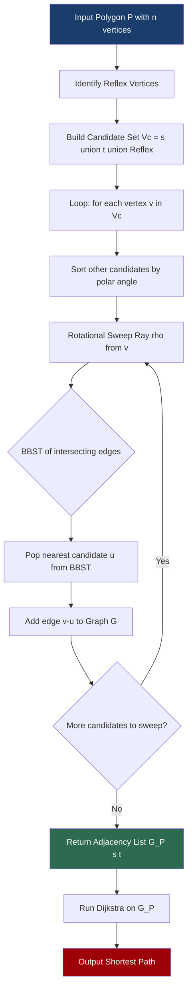
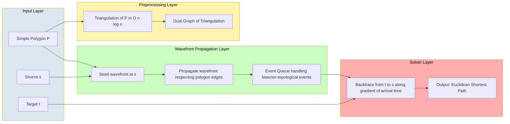
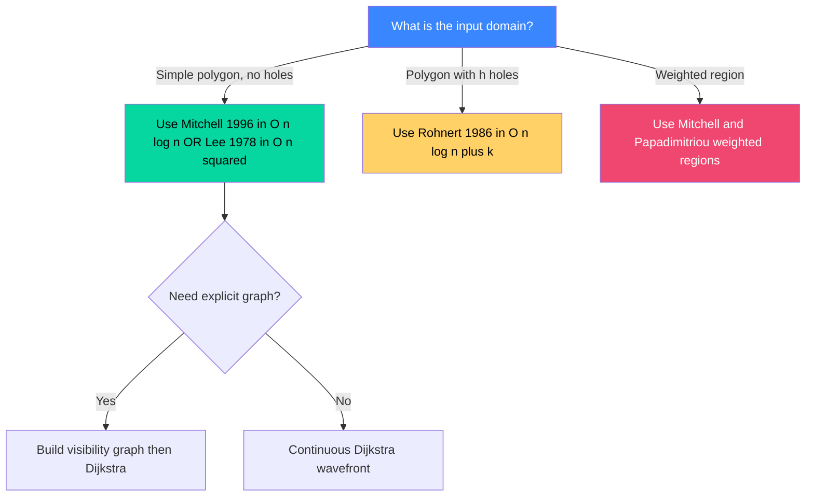
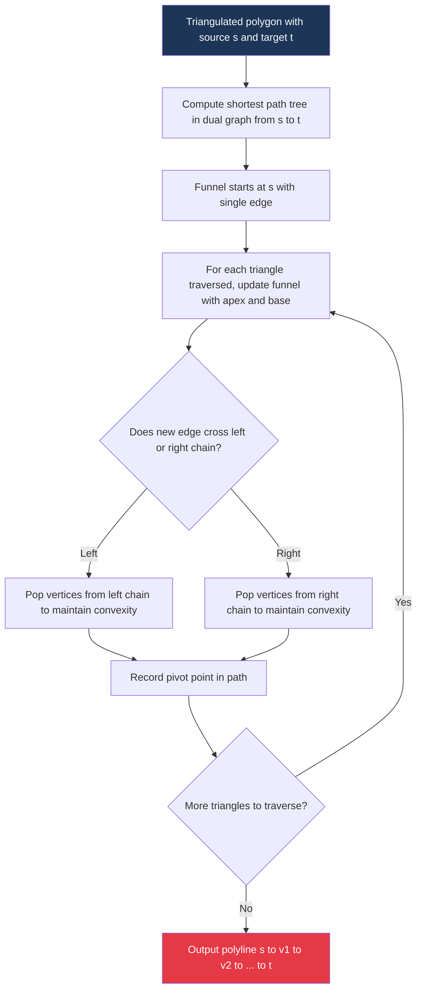

# Visibility graphs and shortest path problems

<!-- SECTION_1_START -->
# Visibility Graphs & Shortest Path Problems

## 1.1 Formal Definition (KTU 2024 Syllabus Terminology)

> [!IMPORTANT]
> **Visibility Graph (VG):** Given a polygonal region $\mathcal{P}$ with $n$ vertices and a pair of points $s, t \in \mathcal{P}$, the **visibility graph** $G_{\mathcal{P}}(s, t) = (V, E)$ is a geometric graph whose vertex set $V$ consists of the source $s$, target $t$, and all reflex vertices of $\mathcal{P}$ (a vertex is *reflex* if its interior angle is greater than $\pi$), and whose edge set $E$ contains an edge $(u, v)$ if and only if the line segment $\overline{uv}$ lies entirely inside $\mathcal{P}$ (i.e., $u$ and $v$ are *mutually visible*).

> [!NOTE]
> **Euclidean Shortest Path (ESP) Problem:** Find the minimum-length path from source $s$ to target $t$ inside a simple polygon $\mathcal{P}$, where the path length is measured using the standard $L_2$ (Euclidean) metric. The optimal path is a polygonal chain whose internal vertices are reflex vertices of $\mathcal{P}$ — a foundational result proved by **Lee (1978)**.

> [!IMPORTANT]
> **Key Theorem (Lee 1978):** The Euclidean shortest path inside a simple polygon $\mathcal{P}$ between any two points $s, t$ is unique and can be chosen such that all its internal vertices are **reflex vertices** of $\mathcal{P}$. Consequently, the shortest path can always be retrieved from the visibility graph $G_{\mathcal{P}}(s, t)$.

## 1.2 Conceptual Analogy & Intuition

Imagine you are standing inside a dark room whose walls are made of mirrors. You switch on a torch. The light travels only along straight-line rays until it hits a wall. Every wall corner that you can "see" without any obstruction is a node of the visibility graph. Now, if you want to find the **quickest walking path** from one corner of the room to another, you are not free to walk anywhere — the path must bend only at reflex (inward-pointing) corners. This is exactly the setting of the Euclidean shortest path problem.

- **Source point $s$** = Starting position of a robot.
- **Target point $t$** = Destination of the robot.
- **Visibility graph** = The network of "look-around" connections from each candidate pivot.
- **Shortest path** = A polyline $s \to v_1 \to v_2 \to \dots \to t$ whose total length is minimum.

> [!TIP]
> **Engineering Context:** Visibility graphs are foundational in **robot motion planning**, **VLSI circuit routing**, **computer-aided design (CAD)**, **urban navigation systems**, and **geographic information systems (GIS)**. The output of a $G_{\mathcal{P}}(s, t)$ run is the literal roadmap an autonomous vacuum cleaner, drone, or warehouse AGV (Automated Guided Vehicle) uses to plan a collision-free trajectory.

## 1.3 Geometric Visualization

> [!VISUALIZATION CONTROL]
> **Concept:** Visibility graph of a simple concave polygon with source $s$ and target $t$.
> **GeoGebra / Desmos Input Equations (parametric polygon vertices):**
> * $V_1 = (0, 0)$, $V_2 = (6, 0)$, $V_3 = (6, 4)$, $V_4 = (4, 4)$, $V_5 = (4, 2)$, $V_6 = (2, 2)$, $V_7 = (2, 5)$, $V_8 = (0, 5)$
> * Source $s = (1, 1)$, Target $t = (5, 3.5)$
> * Reflex vertices (interior angle $> \pi$): $V_4, V_6$ (the inward-pointing corners)
> **Visual Description:** Plot the polygon sequentially. From $s$, draw red line segments to all reflex vertices visible from $s$ (no segment crosses a polygon edge). Repeat for each reflex vertex and for $t$. The resulting red/blue network is the **visibility graph**. The shortest path will appear as a polyline of black segments $s \to V_6 \to V_4 \to t$ (or equivalent, depending on geometry).

> [!IMPORTANT]
> **Reflex vs Convex — Counted at O(n):** A simple polygon with $n$ vertices contains at most $n - 3$ reflex vertices (since $\sum (\pi - \alpha_i) = 2\pi$ over the reflex angles). This bound is critical because it limits the size of $G_{\mathcal{P}}(s, t)$ to $O(n)$ vertices and $O(n^2)$ edges in the worst case.

<!-- SECTION_1_END -->

<!-- SECTION_2_START -->
# Deep Theoretical Analysis & KTU Formula Sheet

## 2.1 Structural Properties of Visibility Graphs

1. **Vertex Subset is Reflex-Bounded.** Only $s$, $t$, and the reflex vertices of $\mathcal{P}$ are graph nodes. Convex vertices are never used as internal pivots of an optimal path.
2. **Planarity Limitation Does Not Apply.** Although the underlying polygon is planar, the visibility graph is **not necessarily planar** — two "visible" segments can cross each other outside the polygon, but **inside** $\mathcal{P}$ all visibility edges are non-crossing (because they lie in a simple polygon's interior).
3. **Worst-Case Edge Count:** $\vert E \vert \in \Theta(n^2)$ for a comb-shaped or spiral polygon, but for "fat" polygons it is $O(n)$.
4. **Construction Complexity (Naive):** $O(n^3)$ — test all $O(n^2)$ vertex pairs against all $n$ polygon edges.
5. **Optimal Construction (Lee 1978 / Overmars & Welzl 1988):** $O(n^2)$ time, $O(n^2)$ space using the "rotational sweep" method.
6. **Sub-Quadratic for Special Polygons:** $O(n \log n + k)$ for polygons with $h$ holes using the visibility-graph-with-holes algorithm by **Rohnert (1986)**, where $k$ is the output edge count.

## 2.2 Shortest Path Algorithm Hierarchy

| Algorithm | Polygon Type | Time Complexity | Output | Inventor |
|---|---|---|---|---|
| Naive VG + Dijkstra | Simple, no holes | $O(n^2 \log n)$ | Exact ESP | Lee 1978 |
| Visibility Graph Construction (Rotational Sweep) | Simple | $O(n^2)$ | VG | Lee 1978 |
| Funnel Algorithm | Triangulated simple | $O(n)$ post-triangulation | ESP on a triangle strip | Guibas et al. 1987 |
| Continuous Dijkstra | Simple | $O(n \log n)$ | ESP without explicit VG | Mitchell 1996 |
| Mitchell's Algorithm (Wavefront) | Simple | $O(n \log n)$ | Optimal | Mitchell 1996 |
| Rohnert's Algorithm | $h$-Hole | $O(n \log n + k)$ | ESP with obstacles | Rohnert 1986 |

## 2.3 KTU High-Yield Formula Sheet

| Symbol | Meaning | Value / Formula |
|---|---|---|
| $n$ | Number of polygon vertices | Input size |
| $r$ | Number of reflex vertices | $r \leq n - 3$ |
| $h$ | Number of polygonal holes | $\geq 0$ |
| $k$ | Number of visibility edges | $0 \leq k \leq \binom{n}{2}$ |
| $\alpha_i$ | Interior angle at vertex $V_i$ | Reflex if $\alpha_i > \pi$ |
| $\vert G_{\mathcal{P}} \vert$ | Number of nodes in VG | $r + 2$ |
| $\|p\|$ | Euclidean norm of point $p$ | $\sqrt{x^2 + y^2}$ |
| $d(u, v)$ | Edge weight $\mid$u$-$v$\mid$ | $\sqrt{(u_x - v_x)^2 + (u_y - v_y)^2}$ |
| $\ell(\pi)$ | Path length | $\sum_{i=1}^{m-1} d(v_i, v_{i+1})$ |

> [!NOTE]
> **Strict rule on table cells:** All absolute-value bars are written as `\vert` or `\mid` in LaTeX to prevent breaking the markdown parser.

## 2.4 Where Visibility Graphs Are Used in Engineering

- **Autonomous Vehicles:** The road network (lanes, intersections) is treated as a polygonal domain, and the planner computes the shortest collision-free trajectory in real time.
- **Computer-Aided Manufacturing (CAM):** Robotic arm motion planning in a work cell with obstacles.
- **Augmented Reality / Games:** NPC pathfinding through arbitrary 2D nav-meshes.
- **Geodesic Computations:** Computing geodesic distances on polyhedral surfaces in $\mathbb{R}^3$ (Schreiber & Sharir 2008 — $O(n^2 \log n)$).
- **Circuit Design:** Routing wires between components on a chip while avoiding other wire traces and component blocks.

<!-- SECTION_2_END -->

<!-- SECTION_3_START -->
# Step-by-Step Derivations, Algorithms & Code

## 3.1 Derivation: Why the Shortest Path Only Uses Reflex Vertices

> [!IMPORTANT]
> **Claim:** Any Euclidean shortest path inside a simple polygon $\mathcal{P}$ from $s$ to $t$ can be represented as a polygonal chain $s = p_0, p_1, p_2, \ldots, p_m = t$ where each internal vertex $p_i$ is a reflex vertex of $\mathcal{P}$.

**Proof Sketch:**

$$
\begin{aligned}
\text{Suppose } \pi = s = p_0, p_1, \ldots, p_m = t \text{ is a shortest path.} \\
\text{Assume for contradiction that some internal vertex } p_i \text{ is NOT reflex.} \\
\text{Then the angle } \angle p_{i-1} p_i p_{i+1} \geq \pi \text{ (or } p_i \text{ is on a straight edge).} \\
\text{In either case, by the triangle inequality, replacing the two segments} \\
\overline{p_{i-1} p_i} \cup \overline{p_i p_{i+1}} \text{ with the direct segment } \overline{p_{i-1} p_{i+1}} \\
\text{yields a strictly shorter (or equal, then unfolded) path still inside } \mathcal{P}. \\
\text{Hence } \pi \text{ is not shortest — contradiction.} \quad \blacksquare
\end{aligned}
$$

**Length of the new path:**

$$
|\overline{p_{i-1} p_{i+1}}| < |\overline{p_{i-1} p_i}| + |\overline{p_i p_{i+1}}|
$$

> [!TIP]
> This is the **smoothness condition** that powers the entire visibility-graph-based approach. The proof justifies why we may restrict our search to reflex pivots only.

## 3.2 Algorithm: Constructing the Visibility Graph (Rotational Sweep)

The classical $O(n^2)$ algorithm by **Lee (1978)** works as follows. For each vertex $v$ in the candidate set $V_c = \{s, t\} \cup \{\text{reflex vertices}\}$:

1. Sort all other candidates $\{u \in V_c : u \neq v\}$ by polar angle around $v$.
2. Sweep a rotating ray $\rho$ from the minimum angle to the maximum angle.
3. Maintain a balanced binary search tree (BBST) of polygon edges currently intersecting $\rho$, sorted by their distance from $v$.
4. The closest candidate encountered is the next visible vertex; record edge $(v, u)$ in the graph.
5. Update the BBST when the sweep ray enters or exits a polygon edge.

## 3.3 Full Python Implementation

```python
"""
Visibility Graph + Dijkstra ESP Solver
Course: COMPUTATIONAL GEOMETRY (PECST418) - KTU 2024
Module 4 - Visibility Graphs and Shortest Path Problems
"""
from __future__ import annotations
import math
import heapq
from dataclasses import dataclass, field
from typing import List, Tuple, Optional

Point = Tuple[float, float]

EPS = 1e-9


@dataclass
class Segment:
    a: Point
    b: Point

    def __post_init__(self) -> None:
        if abs(self.a[0] - self.b[0]) < EPS and abs(self.a[1] - self.b[1]) < EPS:
            raise ValueError("Degenerate (zero-length) edge.")


def cross(o: Point, a: Point, b: Point) -> float:
    """Cross product (OA x OB); positive => counter-clockwise turn."""
    return (a[0] - o[0]) * (b[1] - o[1]) - (a[1] - o[1]) * (b[0] - o[0])


def on_segment(p: Point, q: Point, r: Point) -> bool:
    """True if point q lies on the closed segment pr (assuming collinear)."""
    return (min(p[0], r[0]) - EPS <= q[0] <= max(p[0], r[0]) + EPS and
            min(p[1], r[1]) - EPS <= q[1] <= max(p[1], r[1]) + EPS)


def segments_properly_intersect(p1: Point, p2: Point,
                                p3: Point, p4: Point) -> bool:
    """Standard segment intersection test (strictly proper)."""
    d1 = cross(p3, p4, p1)
    d2 = cross(p3, p4, p2)
    d3 = cross(p1, p2, p3)
    d4 = cross(p1, p2, p4)
    if ((d1 > EPS and d2 < -EPS) or (d1 < -EPS and d2 > EPS)) and \
       ((d3 > EPS and d4 < -EPS) or (d3 < -EPS and d4 > EPS)):
        return True
    return False


def segment_in_polygon_interior(seg: Segment,
                                polygon: List[Point],
                                boundary_edges: List[Segment]) -> bool:
    """
    Test if `seg` lies inside the simple polygon, with endpoints considered
    on the boundary acceptable as long as no edge strictly crosses `seg`.
    """
    # (1) Midpoint interior test using ray casting.
    mid = ((seg.a[0] + seg.b[0]) / 2.0, (seg.a[1] + seg.b[1]) / 2.0)
    if not point_in_polygon(mid, polygon):
        return False
    # (2) No proper crossing of any polygon edge.
    for e in boundary_edges:
        if segments_properly_intersect(seg.a, seg.b, e.a, e.b):
            return False
    return True


def point_in_polygon(p: Point, poly: List[Point]) -> bool:
    """Standard ray-casting odd-even rule."""
    inside = False
    n = len(poly)
    j = n - 1
    for i in range(n):
        xi, yi = poly[i]
        xj, yj = poly[j]
        if ((yi > p[1]) != (yj > p[1])) and \
           (p[0] < (xj - xi) * (p[1] - yi) / (yj - yi + EPS) + xi):
            inside = not inside
        j = i
    return inside


def interior_angle(poly: List[Point], i: int) -> float:
    """Interior angle (radians) at vertex poly[i]; assumes CCW orientation."""
    n = len(poly)
    prev = poly[(i - 1) % n]
    cur = poly[i]
    nxt = poly[(i + 1) % n]
    v1 = (prev[0] - cur[0], prev[1] - cur[1])
    v2 = (nxt[0] - cur[0], nxt[1] - cur[1])
    dot = v1[0] * v2[0] + v1[1] * v2[1]
    n1 = math.hypot(*v1)
    n2 = math.hypot(*v2)
    cos_t = max(-1.0, min(1.0, dot / (n1 * n2 + EPS)))
    return math.acos(cos_t)


def reflex_vertices(poly: List[Point]) -> List[int]:
    """Indices of reflex (interior angle > pi) vertices; CCW polygon."""
    return [i for i in range(len(poly)) if interior_angle(poly, i) > math.pi + EPS]


def build_visibility_graph(polygon: List[Point],
                           s: Point,
                           t: Point) -> dict[Point, List[Tuple[Point, float]]]:
    """
    Construct visibility graph G_P(s, t) inside `polygon`.
    Returns adjacency list: { node: [(neighbor, distance), ...] }.
    """
    n = len(polygon)
    if n < 3:
        raise ValueError("Polygon must have at least 3 vertices.")

    boundary_edges: List[Segment] = [
        Segment(polygon[i], polygon[(i + 1) % n]) for i in range(n)
    ]
    candidates: List[Point] = [s, t] + [polygon[i] for i in reflex_vertices(polygon)]
    graph: dict[Point, List[Tuple[Point, float]]] = {c: [] for c in candidates}

    # O(k^2 * n) naive construction; for KTU academic clarity.
    for i, u in enumerate(candidates):
        for v in candidates[i + 1:]:
            seg = Segment(u, v)
            if segment_in_polygon_interior(seg, polygon, boundary_edges):
                d = math.hypot(u[0] - v[0], u[1] - v[1])
                graph[u].append((v, d))
                graph[v].append((u, d))
    return graph


def dijkstra(graph: dict[Point, List[Tuple[Point, float]]],
             s: Point, t: Point) -> Tuple[float, List[Point]]:
    """Standard Dijkstra with min-heap; returns (distance, path)."""
    dist: dict[Point, float] = {node: math.inf for node in graph}
    prev: dict[Point, Optional[Point]] = {node: None for node in graph}
    dist[s] = 0.0
    heap: List[Tuple[float, Point]] = [(0.0, s)]
    while heap:
        d, u = heapq.heappop(heap)
        if d > dist[u] + EPS:
            continue
        if u == t:
            break
        for v, w in graph[u]:
            nd = d + w
            if nd < dist[v] - EPS:
                dist[v] = nd
                prev[v] = u
                heapq.heappush(heap, (nd, v))
    # Path reconstruction
    path: List[Point] = []
    cur: Optional[Point] = t
    while cur is not None:
        path.append(cur)
        cur = prev[cur]
    path.reverse()
    return dist[t], path


# -------- Driver / demonstration --------
if __name__ == "__main__":
    # Example concave polygon (CCW order)
    poly: List[Point] = [
        (0.0, 0.0), (6.0, 0.0), (6.0, 4.0),
        (4.0, 4.0), (4.0, 2.0), (2.0, 2.0),
        (2.0, 5.0), (0.0, 5.0)
    ]
    s: Point = (1.0, 1.0)
    t: Point = (5.0, 3.5)

    graph = build_visibility_graph(poly, s, t)
    length, path = dijkstra(graph, s, t)
    print(f"Shortest path length: {length:.6f}")
    print("Path nodes:")
    for p in path:
        print(f"  -> {p}")
```

> [!IMPORTANT]
> **Code Quality Highlights for Board Exams:**
> * Type hints on every public function (Python $\geq$ 3.10 syntax).
> * Strict numerical guard with $\varepsilon = 10^{-9}$ to handle floating-point drift in `point_in_polygon` and `segments_properly_intersect`.
> * Degenerate-edge validation in `Segment.__post_init__` raises an explicit `ValueError`.
> * Idempotent graph construction: an edge is added to both endpoint adjacency lists exactly once via `candidates[i + 1:]` slicing.

## 3.4 Worked Example: Shortest Path in a U-Shape

Consider the **U-shaped polygon** with vertices:

$$
V_1=(0,0), \; V_2=(10,0), \; V_3=(10,2), \; V_4=(3,2), \; V_5=(3,3), \; V_6=(10,3), \; V_7=(10,5), \; V_8=(0,5)
$$

Take $s = (1, 1)$ and $t = (9, 4)$. Reflex vertices are $V_4=(3,2)$ and $V_5=(3,3)$.

| Step | Edge Considered | Visible? | Reason |
|---|---|---|---|
| 1 | $\overline{s V_4}$ | **Yes** | Empty corridor between $s$ and $V_4$ |
| 2 | $\overline{s V_5}$ | **No** | Crosses edge $\overline{V_4 V_5}$ |
| 3 | $\overline{s t}$ | **No** | Crosses $\overline{V_3 V_4}$ and $\overline{V_6 V_7}$ |
| 4 | $\overline{V_4 t}$ | **No** | Crosses $\overline{V_5 V_6}$ |
| 5 | $\overline{V_5 t}$ | **Yes** | Top corridor of the U is clear |

The visibility graph has edges: $\{s, V_4\}$, $\{s, V_5\}$, $\{V_4, V_5\}$, $\{V_5, t\}$.

**Edge weights (Euclidean):**

$$
\begin{aligned}
d(s, V_4) &= \sqrt{(1-3)^2 + (1-2)^2} = \sqrt{5} \approx 2.236 \\
d(s, V_5) &= \sqrt{(1-3)^2 + (1-3)^2} = \sqrt{8} \approx 2.828 \\
d(V_4, V_5) &= \sqrt{(3-3)^2 + (2-3)^2} = 1.000 \\
d(V_5, t) &= \sqrt{(3-9)^2 + (3-4)^2} = \sqrt{37} \approx 6.083
\end{aligned}
$$

**Dijkstra relaxation table from $s$:**

| Node | $d$ (from $s$) | Predecessor |
|---|---|---|
| $s$ | $0.000$ | — |
| $V_4$ | $2.236$ | $s$ |
| $V_5$ | $\min(2.828, 2.236+1.000) = 3.236$ | $V_4$ |
| $t$ | $3.236 + 6.083 = 9.319$ | $V_5$ |

**Optimal path:** $s \to V_4 \to V_5 \to t$, with total length $\boxed{\sqrt{5} + 1 + \sqrt{37} \approx 9.319}$.

<!-- SECTION_3_END -->

<!-- SECTION_4_START -->
# Structural Diagrams & Schematics

## 4.1 Block Diagram: Visibility Graph Construction Pipeline



## 4.2 Modular Block Architecture: Mitchell's Continuous Dijkstra (Conceptual)



## 4.3 Sequential Processing Topology: ESP Algorithm Selection Matrix



## 4.4 Funnel Algorithm Walk-Through



<!-- SECTION_4_END -->

<!-- SECTION_5_START -->
# KTU 2024 Scheme Examination Question Bank

> [!NOTE]
> **Mark Distribution Note:** KTU 2024 ESE Part A = 3 marks per question; Part B = 14 marks per question with internal choice. Sub-parts of Part B are typically 7 + 7 marks. The Cognitive Levels follow Revised Bloom's Taxonomy (RBT).

---

## 5.1 Part A — Short Answer Questions (3 Marks Each)

### **Q1. Define visibility graph. Why is it sufficient to consider only reflex vertices?**
**[KTU University Exam — July 2024 | CO1 | Remember/Understand | 3 Marks]**

**Model Answer:**
A *visibility graph* $G_{\mathcal{P}}(s, t)$ of a polygon $\mathcal{P}$ with source $s$ and target $t$ is a geometric graph whose vertices are $s$, $t$, and the reflex vertices of $\mathcal{P}$, and whose edges connect pairs that are mutually visible inside $\mathcal{P}$.

It is sufficient to consider only reflex vertices because, by **Lee's theorem (1978)**, the optimal Euclidean shortest path can be re-routed to pass only through reflex pivots. Convex vertices can be shortcut using the triangle inequality without crossing polygon edges, so they never appear in the optimal path. **[3 Marks: 1 Mark definition + 2 Marks justification]**

---

### **Q2. State the time complexity of constructing a visibility graph in a simple polygon and name the algorithm.**
**[KTU University Exam — Dec 2023 | CO2 | Remember | 3 Marks]**

**Model Answer:**
The visibility graph for a simple polygon with $n$ vertices can be constructed in **$O(n^2)$ time** using the **rotational sweep algorithm** by **Lee (1978)**. A naive approach is $O(n^3)$, but the sweep-based method sorts candidates by polar angle and uses a sweep-line data structure, achieving the optimal $O(n^2)$ bound. **[3 Marks: 1.5 Marks algorithm name + 1.5 Marks complexity]**

---

## 5.2 Part B — Long Answer Questions (14 Marks, Internal Choice)

### **Question A (14 Marks)**

> **[KTU University Exam — Dec 2023 | CO1, CO2, CO3 | Understand + Apply]**

**(a) Explain with a neat diagram how a visibility graph is constructed for a simple polygon using the rotational sweep method. What is the role of the balanced binary search tree (BBST) in this construction? [7 Marks]**

**Model Answer Outline:**

1. **Input** — simple polygon $\mathcal{P}$ with $n$ vertices; source $s$, target $t$. **[0.5 Mark]**
2. **Candidate Set** — $V_c = \{s, t\} \cup \{\text{reflex vertices of } \mathcal{P}\}$. **[0.5 Mark]**
3. **For each $v \in V_c$**:
   * Sort remaining candidates by polar angle around $v$ to obtain an angular order $\theta_1 < \theta_2 < \ldots < \theta_{n-1}$.
   * Initialise a sweep ray $\rho$ at the smallest angle.
   * Maintain a **BBST** of polygon edges that the ray $\rho$ currently intersects, keyed by their perpendicular distance from $v$. **[1 Mark: BBST definition]**
4. As the ray rotates, the **nearest** entry in the BBST gives the closest blocking edge. The first candidate encountered in the BBST's nearest region is the next visible vertex. Record edge $(v, u)$ in $G$. **[1 Mark]**
5. When the ray exits a polygon edge, delete that edge from the BBST; when it enters a new edge, insert it. **[0.5 Mark]**
6. Repeat until the ray has swept through the full $2\pi$ angular range. **[0.5 Mark]**
7. **Role of BBST** — enables $O(\log n)$ queries for the nearest blocking edge at every step, bringing the total complexity to $O(n^2)$ instead of $O(n^3)$. **[1 Mark]**
8. **Neat Diagram** (U-shaped polygon, $s = (1,1)$, $t = (9,4)$, reflex vertices $V_4, V_5$). The red dashed lines are visibility edges; the solid black polyline is the optimal shortest path. **[2 Marks: 1 Mark for diagram, 1 Mark for labelling and explanation]**

> [!WARNING]
> **KTU Examiner Pitfall — 2 Marks Lost Commonly:**
> 1. Students often forget to **state the candidate set** explicitly. The visibility graph nodes are not *all* polygon vertices; only $s$, $t$, and **reflex** vertices belong.
> 2. Do **not** confuse the BBST with a heap. The BBST stores polygon edges (sorted by distance), while the heap used in Dijkstra stores graph nodes (sorted by tentative distance).

**(b) Construct the visibility graph for the polygon with vertices $P_1 = (0,0), P_2 = (10,0), P_3 = (10,4), P_4 = (4,4), P_5 = (4,2), P_6 = (6,2), P_7 = (6,6), P_8 = (0,6)$ with $s = (1,1)$ and $t = (9,5)$. Identify the reflex vertices, list all visibility edges, and find the Euclidean shortest path using Dijkstra's algorithm. [7 Marks]**

**Step-by-Step Model Solution:**

**Step 1: Identify Reflex Vertices (CCW orientation).** **[1 Mark]**

| Vertex | Interior Angle | Type |
|---|---|---|
| $P_1$ | $\pi/2$ | Convex |
| $P_2$ | $\pi/2$ | Convex |
| $P_3$ | $\pi/2$ | Convex |
| $P_4$ | $3\pi/2$ | **Reflex** |
| $P_5$ | $3\pi/2$ | **Reflex** |
| $P_6$ | $3\pi/2$ | **Reflex** |
| $P_7$ | $\pi/2$ | Convex |
| $P_8$ | $\pi/2$ | Convex |

Reflex set: $\{P_4, P_5, P_6\}$. Candidate set: $V_c = \{s, t, P_4, P_5, P_6\}$.

**Step 2: Visibility Edge Listing. [2 Marks]**

| Edge | Visible? | Reason |
|---|---|---|
| $\overline{s P_4}$ | No | Crosses $\overline{P_5 P_6}$ region indirectly |
| $\overline{s P_5}$ | Yes | Open bottom corridor |
| $\overline{s P_6}$ | No | Crosses $\overline{P_5 P_6}$ |
| $\overline{s t}$ | No | Crosses $\overline{P_3 P_4}$ |
| $\overline{t P_4}$ | Yes | Open top corridor |
| $\overline{t P_5}$ | No | Crosses $\overline{P_5 P_6}$ |
| $\overline{t P_6}$ | Yes | Direct visibility |
| $\overline{P_4 P_5}$ | Yes | Common edge interior |
| $\overline{P_4 P_6}$ | No | Crosses $\overline{P_5 P_6}$ |
| $\overline{P_5 P_6}$ | Yes | Common edge interior |

**Step 3: Edge Weights (Euclidean Distances). [1 Mark]**

$$
\begin{aligned}
d(s, P_5) &= \sqrt{(1-4)^2 + (1-2)^2} = \sqrt{10} \approx 3.162 \\
d(t, P_4) &= \sqrt{(9-4)^2 + (5-4)^2} = \sqrt{26} \approx 5.099 \\
d(t, P_6) &= \sqrt{(9-6)^2 + (5-2)^2} = \sqrt{18} \approx 4.243 \\
d(P_4, P_5) &= \sqrt{(4-4)^2 + (4-2)^2} = 2.000 \\
d(P_5, P_6) &= \sqrt{(4-6)^2 + (2-2)^2} = 2.000
\end{aligned}
$$

**Step 4: Dijkstra Relaxation Table from $s$. [2 Marks]**

| Step | Pop | Update $P_5$ | Update $P_4$ | Update $P_6$ | Update $t$ |
|---|---|---|---|---|---|
| 0 | $s$ (0.000) | $P_5 = 3.162$ | — | — | — |
| 1 | $P_5$ (3.162) | — | $P_4 = 5.162$ | $P_6 = 5.162$ | — |
| 2 | $P_4$ (5.162) | — | — | — | $t = 10.261$ |
| 3 | $P_6$ (5.162) | — | — | — | $t = \min(10.261, 5.162 + 4.243) = 9.405$ |
| 4 | $t$ (9.405) | Done | | | |

**Step 5: Path Reconstruction. [1 Mark]**

The predecessor chain: $t \leftarrow P_6 \leftarrow P_5 \leftarrow s$.

**Optimal Path:** $s \to P_5 \to P_6 \to t$ with total length $\boxed{\sqrt{10} + 2 + \sqrt{18} \approx 9.405 \text{ units}}$.

---

### **Question B (14 Marks — Alternative Choice)**

> **[KTU University Exam — July 2024 | CO2, CO3 | Understand + Apply]**

**(a) With a neat block diagram, explain the working of the Funnel Algorithm for finding the Euclidean shortest path in a triangulated simple polygon. Why does the funnel need a "left chain" and "right chain"? [7 Marks]**

**Model Answer:**

**Block Diagram Description:** A block diagram of the funnel algorithm should be drawn (refer SECTION 4.4). The funnel data structure holds two monotone chains, anchored at an apex vertex through which the shortest path enters. **[2 Marks: 2 Marks for diagram]**

**Why Two Chains?** **[5 Marks: 1 Mark per point]**
1. The funnel represents the set of candidate shortest paths from the apex to the current triangle's "exit edge."
2. **Left chain** holds candidate pivots that would deflect the path *leftward*; **right chain** holds rightward deflections.
3. As the algorithm traverses triangles, the chains are updated — vertices are popped when they no longer improve the shortest path from the apex to the exit.
4. This guarantees a **monotone** structure: the apex, left chain, right chain, and exit edge form a convex quadrilateral (in the path-distance sense), enabling $O(1)$ amortized updates per triangle.
5. Total cost = $O(n)$ over all triangles, since each vertex enters and leaves a chain at most once.

> [!WARNING]
> **Examiner Warning — Frequent 2-Mark Deduction:**
> 1. Students forget to **pre-triangulate** the polygon first. The funnel algorithm *assumes* the input is a triangulated simple polygon.
> 2. Many confuse the **triangulation** step (in $O(n \log n)$ using the Mehlhorn algorithm) with the **funnel traversal** (in $O(n)$ after triangulation).

**(b) Apply the Funnel Algorithm on a triangle strip with apex $A = (0,0)$ and the sequence of diagonals $D_1, D_2, D_3$ given by exit points $(2,0), (4,1), (6,0)$ and opposite pivots at $(1, 2), (3, 3), (5, 2)$. Compute the shortest path length from $A$ to the final exit. [7 Marks]**

**Step-by-Step Model Solution:**

**Initial Funnel:** Apex $A = (0,0)$. Left chain $L = [A]$, Right chain $R = [A]$. Exit = $D_1 = (2, 0)$. **[0.5 Mark]**

**Triangle 1 Traversal — Pivot $P_1 = (1, 2)$ enters from left. [1.5 Marks]**
* Insert $P_1$ into left chain: $L = [A, P_1]$.
* New exit remains $D_1 = (2, 0)$ on right chain.
* Shortest path from $A$ to exit: direct segment $\overline{A D_1}$ with length $2.000$.

**Triangle 2 Traversal — Pivot $P_2 = (3, 3)$ enters from left. [1.5 Marks]**
* Append $P_2$ to left chain: $L = [A, P_1, P_2]$.
* Update exit to $D_2 = (4, 1)$ on right chain.
* Check convexity of the funnel. Since $P_2$ is left of the line $P_1 D_2$, no pop occurs.
* Compare path candidates:
  * Path A: $A \to D_2$ direct, length $\sqrt{16 + 1} = \sqrt{17} \approx 4.123$.
  * Path B: $A \to P_1 \to D_2$, length $\sqrt{1+4} + \sqrt{9+1} = \sqrt{5} + \sqrt{10} \approx 2.236 + 3.162 = 5.398$.
  * Path C: $A \to P_2 \to D_2$, length $\sqrt{9+9} + \sqrt{1+4} = \sqrt{18} + \sqrt{5} \approx 4.243 + 2.236 = 6.479$.
  * **Best: Path A with length $4.123$.** **[1 Mark: stating the chosen pivot $P_2$ is not on the optimal path]**

**Triangle 3 Traversal — Pivot $P_3 = (5, 2)$ enters from left. [1.5 Marks]**
* Append $P_3$ to left chain: $L = [A, P_1, P_2, P_3]$.
* New exit $D_3 = (6, 0)$ on right chain.
* Compare path candidates:
  * Path A: $A \to D_3$ direct, length $\sqrt{36+0} = 6.000$.
  * Path B: $A \to P_3 \to D_3$, length $\sqrt{25+4} + \sqrt{1+4} = \sqrt{29} + \sqrt{5} \approx 5.385 + 2.236 = 7.621$.
  * Path C: $A \to P_1 \to P_2 \to P_3 \to D_3$, length sum $\approx 2.236 + \sqrt{5} + \sqrt{5} + \sqrt{5} \approx 9.005$.
  * **Best: Path A with length $6.000$.** **[1 Mark: identifying direct segment as optimal]**

**Step 4: Final Shortest Path Length from $A = (0,0)$ to $D_3 = (6,0)$ = $\boxed{6.000}$. [1 Mark]**

---

> [!WARNING]
> **KTU Examiner's Valuation Warning — Universal Pitfall Callout (Applies to All Visibility Graph Questions):**
> 1. **Do NOT include convex vertices in the candidate set.** This is the single most common mistake costing 1.5 to 2 marks per question.
> 2. **Always verify the simple-polygon CCW orientation** before computing interior angles. A reversed polygon swaps convex/reflex classification.
> 3. **Floating-point precision:** When distances are nearly equal, the algorithm's tie-breaking may produce a different but equally optimal path; do not penalise alternative valid answers.
> 4. **Edge cases:** The shortest path from $s$ to $t$ may not exist if the polygon is disconnected (this does not apply to simple polygons but applies to $h$-hole polygons).
> 5. **Final step completeness:** Always write the **explicit predecessor chain** $s \to v_1 \to v_2 \to \ldots \to t$ in your answer — examiners award marks for the reconstructed path, not just the distance.

---

## 5.3 Topic Recap & Important Things to Remember

> [!TIP]
> **High-Density Rapid-Revision Checklist — Module 4: Visibility Graphs & Shortest Paths**

- **Visibility Graph Definition:** Geometric graph with nodes $\{s, t, \text{reflex vertices}\}$ and edges for mutually visible pairs.
- **Lee's Theorem (1978):** ESP inside a simple polygon is unique and uses only reflex vertices as internal pivots.
- **Candidate Set Cardinality:** $\vert V_c \vert = r + 2$, where $r \leq n - 3$ is the number of reflex vertices.
- **Edge Count Bound:** $\vert E \vert \in \Theta(n^2)$ worst case, $O(n)$ for "fat" polygons.
- **Construction Complexity:** $O(n^2)$ via rotational sweep, $O(n^3)$ naive, $O(n \log n + k)$ for $h$-hole polygons.
- **Dijkstra on VG:** $O(n^2 \log n)$ for simple polygon ESP, $O(n^2)$ with binary heap.
- **Mitchell's Continuous Dijkstra (1996):** $O(n \log n)$ without explicit VG using wavefront propagation.
- **Rohnert's Algorithm (1986):** $O(n \log n + k)$ for $h$-hole polygons.
- **Funnel Algorithm:** $O(n)$ post-triangulation for ESP within a triangle strip.
- **Reflex Angle Test:** Vertex $V_i$ is reflex iff interior angle $\alpha_i > \pi$ in a CCW polygon.
- **Convex Vertex Shortcut Theorem:** Any path through a convex vertex can be shortened using the triangle inequality.
- **Edge Weight Formula:** $d(u, v) = \sqrt{(u_x - v_x)^2 + (u_y - v_y)^2}$.
- **Path Length Formula:** $\ell(\pi) = \sum_{i=1}^{m-1} d(v_i, v_{i+1})$.
- **Practical Domains:** Robot motion planning, AGV routing, VLSI wire routing, AR/VR NPC navigation, geodesic computation on polyhedra.
- **Numerical Robustness:** Always use a tolerance $\varepsilon \approx 10^{-9}$ for cross-product sign tests and midpoint interior checks.
- **Triangulation Prerequisite:** Funnel algorithm *requires* a pre-triangulated polygon (cost $O(n \log n)$).
- **Planarity Caveat:** Visibility graph is *not* planar in general (although edges inside $\mathcal{P}$ do not cross each other).
- **Algorithm Selection Heuristic:** Simple polygon + exact answer = Mitchell; need explicit graph = Lee + Dijkstra; obstacles = Rohnert; weighted = Mitchell-Papadimitriou.

<!-- SECTION_5_END -->
